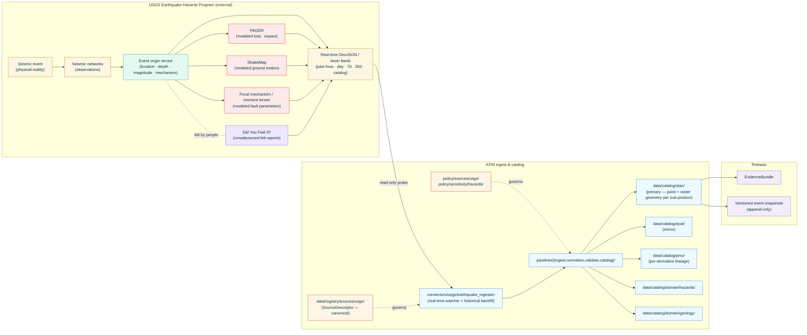

<!-- [KFM_META_BLOCK_V2]
doc_id: kfm://doc/docs-sources-catalog-usgs-earthquake-catalog
title: USGS Earthquakes
type: product-page
version: v0.2
status: draft
owners: <PLACEHOLDER — Docs steward + Source steward for usgs>
created: 2026-05-20
updated: 2026-05-23
policy_label: public
related:
  - docs/sources/catalog/usgs.md
  - docs/sources/catalog/usgs/README.md
  - docs/sources/catalog/usgs/IDENTITY.md
  - docs/sources/catalog/usgs/RIGHTS-AND-SENSITIVITY-MAP.md
  - docs/sources/catalog/usgs/usgs-3dep-elevation.md
  - docs/sources/catalog/README.md
  - docs/doctrine/directory-rules.md
  - docs/doctrine/lifecycle-law.md
  - docs/doctrine/trust-membrane.md
  - docs/standards/SENSITIVITY_RUBRIC.md
  - docs/standards/STAC.md
  - docs/runbooks/hazards/SOURCE_REFRESH_RUNBOOK.md
  - data/registry/sources/usgs/
  - policy/sources/usgs/
  - policy/sensitivity/hazards/
  - schemas/contracts/v1/source/
  - schemas/contracts/v1/hazards/
  - connectors/usgs/
adr_refs:
  - ADR-0001 (schema home)
  - <PROPOSED> ADR-S-04 (source-role vocabulary v1)
  - <PROPOSED> ADR-S-05 (sensitivity tier scheme T0–T4)
  - <PROPOSED> ADR-S-12 (connector cadence + quarantine recovery)
  - <PROPOSED> ADR-S-14 (cross-lane join policy)
  - <PROPOSED> ADR-S-?? (event-versioning policy — append-only snapshots vs in-place overlay)
tags: [kfm, docs, sources, catalog, usgs, earthquakes, seismicity, hazards, geology, real-time, pager, shakemap, dyfi]
notes:
  - "PROPOSED product-page scaffold filled to v0.2; second product page in the usgs family folder (sibling to usgs-3dep-elevation.md)."
  - "Filename inferred from doc_id slug: usgs-earthquake-catalog.md. Sibling catalog entry (docs/sources/catalog/usgs.md §5) uses the short ID 'usgs-earthquakes'. Reconciliation flagged in Q-2."
  - "Heterogeneous source-role: events = observed; PAGER + ShakeMap + focal mechanisms = modeled; DYFI = observed (crowdsourced). See §2.1 and §4."
  - "Real-time + historical cadence — the only product in this family with a continuous near-real-time stream. Drives §7 update_time discipline and §13 watcher design."
  - "Event versioning is binding: USGS events refine over hours/days/weeks after origin; KFM stores immutable per-update snapshots, never overlays. See §7 and §8.2."
  - "Geographic scope is global, not Kansas-AOI-bounded. Earthquakes outside Kansas (e.g., Oklahoma induced seismicity) may be material to Kansas; AOI policy must be cadence-aware. See Q-7."
[/KFM_META_BLOCK_V2] -->

<a id="top"></a>

# USGS Earthquakes

> Seismic event records (epicenter, depth, magnitude, mechanism) plus modeled impact derivatives — **PAGER** loss estimates, **ShakeMap** ground-motion interpolations, and **DYFI** crowdsourced felt reports — distributed by the USGS Earthquake Hazards Program. The Hazards-domain and Geology-domain seismic carrier.

<!-- Top-of-file badge row. Placeholder targets — replace once badge generator (KFM-P3-FEAT-0005) is wired. -->


**Status:** `PROPOSED — scaffold filled` &nbsp;·&nbsp; **Doc version:** `v0.2` &nbsp;·&nbsp; **Family:** [`usgs`](./README.md) &nbsp;·&nbsp; **Last reviewed:** 2026-05-23

> [!IMPORTANT]
> **This page is a pointer.** Authoritative descriptor fields live in [`data/registry/sources/usgs/`](../../../../data/registry/sources/usgs/). Rights, sensitivity, and induced-vs-natural attribution policy live in [`policy/sources/usgs/`](../../../../policy/sources/usgs/) and [`policy/sensitivity/hazards/`](../../../../policy/sensitivity/hazards/), summarized at the family level in [`RIGHTS-AND-SENSITIVITY-MAP.md`](./RIGHTS-AND-SENSITIVITY-MAP.md). **Do not duplicate descriptor or policy content on this product page.**

> [!CAUTION]
> **Source-role discipline is unusually rich here.** A single USGS earthquake event ID carries (a) `observed` origin parameters that refine over time, (b) `modeled` PAGER/ShakeMap/focal-mechanism derivatives, and (c) `observed` crowdsourced DYFI reports. KFM derivatives that cite a PAGER loss estimate *as if it were a measured loss*, or a ShakeMap intensity *as if it were a recorded ground motion at every cell*, violate the source-role anti-collapse rule. See [§2.1](#21-sub-product-source-role-decomposition) and [§6](#6-source-role-posture-anti-collapse).

---

## 📑 Contents

1. [Overview](#1-overview)
2. [Product identity within the family](#2-product-identity-within-the-family)
3. [Source authority](#3-source-authority)
4. [Catalog profiles used](#4-catalog-profiles-used)
5. [Collection identity](#5-collection-identity)
6. [Provenance fields](#6-provenance-fields)
7. [Temporal handling, event versioning, and real-time cadence](#7-temporal-handling-event-versioning-and-real-time-cadence)
8. [Geometry and per-sub-product spatial shape](#8-geometry-and-per-sub-product-spatial-shape)
9. [Rights and sensitivity (pointer)](#9-rights-and-sensitivity-pointer)
10. [Reality boundary](#10-reality-boundary)
11. [Validation and catalog closure](#11-validation-and-catalog-closure)
12. [Related contracts and schemas](#12-related-contracts-and-schemas)
13. [Related connectors and pipelines](#13-related-connectors-and-pipelines)
14. [Example](#14-example)
15. [Open questions](#15-open-questions)
16. [Last reviewed](#16-last-reviewed)

---

## 1. Overview

This product page describes how KFM catalogs **USGS Earthquakes** — the U.S. national authoritative seismic event catalog and its associated modeled derivatives. The page covers four distinct sub-products bound by a shared `event_id`: **event origin records** (location, depth, magnitude, time, focal mechanism), **PAGER** (Prompt Assessment of Global Earthquakes for Response — modeled loss/impact), **ShakeMap** (modeled ground-motion interpolation), and **DYFI** (Did You Feel It? — crowdsourced felt reports).

> [!NOTE]
> **EXTERNAL** *(preserved without re-verification this session).* USGS publishes earthquake data through real-time GeoJSON / Atom feeds, a queryable catalog API (FDSN-compliant), and bundled product archives (QuakeML, ShakeMap, PAGER, MomentTensor). KFM ingests from these surfaces as read-only probes (per `KFM-P22-PROG-0043`) and re-emits KFM-namespaced catalog items per sub-product. Specific endpoint URLs and current rate-limit terms remain **NEEDS VERIFICATION** until re-fetched in a session with web access.

> [!IMPORTANT]
> **Per-event sub-product binding.** Every sub-product is keyed to the same USGS `event_id`. KFM preserves the binding (an event's PAGER is *about* that event's origin) but never collapses one role into another (a PAGER estimate is not an observation; a ShakeMap interpolation is not a recorded motion).



[Back to top](#top)

---

## 2. Product identity within the family

> [!NOTE]
> This page is the **second** product page authored under the `usgs` source family (after [`usgs-3dep-elevation.md`](./usgs-3dep-elevation.md)). Family-wide concerns — authority, identity convention, rights/sensitivity map — live at the **family level** and are not restated here. The family catalog index lives at [`docs/sources/catalog/usgs.md`](../usgs.md).

| Attribute | Value | Status |
|---|---|---|
| Product name | USGS Earthquakes | **CONFIRMED EXTERNAL** (USGS program name). |
| Source family | `usgs` | **PROPOSED** family-folder convention; see family catalog Q-1/Q-2. |
| KFM source-role | **Heterogeneous** — see [§2.1](#21-sub-product-source-role-decomposition) | **CONFIRMED enum** per Atlas §24.1.1. |
| Domains served | **Hazards** (primary); **Geology** (secondary, esp. for focal mechanism, induced/tectonic context) | **CONFIRMED** — listed in Atlas Hazards §D source-family table (USGS earthquakes) and referenced from Geology §D. |
| Primary upstream surfaces | USGS Earthquake Hazards Program GeoJSON feeds + FDSN-compliant catalog API + bundled product archives | **EXTERNAL — NEEDS VERIFICATION** of current endpoint URLs. |
| Cardinal evidence object | `SeismicEvent` (PROPOSED object) keyed by USGS `event_id`, carrying nested `Origin`, `Magnitude`, `FocalMechanism`, `ShakeMap`, `PAGER`, `DYFI` per-sub-product references | **PROPOSED** — new object class. |
| Geometry | **Heterogeneous** — see [§8](#8-geometry-and-per-sub-product-spatial-shape) | **CONFIRMED-mixed**. |
| Cadence | **Real-time stream** (event feed polled minutes/seconds) **+ historical catalog** (back to early 1900s for some regions) | **CONFIRMED-bimodal**. |
| Geographic scope | **Global** — earthquakes outside Kansas (Oklahoma induced seismicity, regional tectonics) can be material to Kansas | **CONFIRMED-global**. |

### 2.1 Sub-product source-role decomposition

Per Atlas §24.1.1 enum and the v1.1 family-catalog entry §5 row for `usgs-earthquakes`:

| Sub-product | `source_role` | Rationale | Anti-collapse risk |
|---|---|---|---|
| **Event origin** (location, depth, magnitude, time) | **`observed`** | Computed from picks across the seismic network; refined as more stations report. Origin parameters themselves are observed-derived measurements with documented uncertainty, not models of consequence. | Citing a *preliminary* origin as if it were the final reviewed origin. Required guardrail: version tracking (§7). |
| **Magnitude** (Ml, Mw, Mb, Mc, etc.) | **`observed`** (with scale-explicit metadata) | Each magnitude scale measures a different physical property; they are not interchangeable. | Comparing magnitudes across scales as if equivalent. Required guardrail: `magnitude_scale_explicit` per record. |
| **Focal mechanism / moment tensor** | **`modeled`** | Inverted from waveform data using a fault model; multiple competing solutions are common. | Citing as observed fault geometry. Required guardrail: `role_model_run_ref` + uncertainty bounds. |
| **ShakeMap** | **`modeled`** | Interpolated ground-motion grid combining recorded station values, the earthquake source model, and a ground-motion prediction equation. Cells without stations carry **modeled** values, not measurements. | Citing a ShakeMap cell as a recorded ground motion. Required guardrail: per-cell distinction between stations and interpolation. |
| **PAGER** (loss/impact estimate) | **`modeled`** | Probabilistic loss model using exposure, vulnerability, and shaking. Loss estimates carry wide uncertainty intervals. | Citing a PAGER loss range as observed damage. Required guardrail: uncertainty disclaimer + `role_model_run_ref`. |
| **DYFI (Did You Feel It?)** | **`observed`** (crowdsourced) | Felt-intensity reports submitted by the public, aggregated by USGS to MMI scale per ZIP/UTM. Real observations of human perception, not seismometers. | Citing DYFI MMI as instrumental ground motion. Required guardrail: `crowdsource_origin: true` + lower-weight policy at AI. |
| **Induced/natural attribution** (where USGS publishes) | **`interpreted`** *(if Atlas §24.1.1 admits it; otherwise `modeled`)* | Scientific interpretation of cause; politically sensitive (Q-9). | Promoting interpretation to observation. Required guardrail: never strip the interpretive label. |

> [!CAUTION]
> **Source-role anti-collapse is the dominant validator class for this product.** The same `event_id` carries observed origin parameters, modeled derivatives, and crowdsourced felt data. Joining them is fine; **flattening** them into a single role downstream is denied at the trust membrane per Atlas §24.1.2 *"Modeled product labeled or queried as observed"* and *"Crowdsourced report cited as instrumental observation"* DENY conditions.

### 2.2 Disambiguation from siblings

| If you want… | Use… | Not this page |
|---|---|---|
| **Terrain context** for an earthquake's location | [`usgs-3dep-elevation.md`](./usgs-3dep-elevation.md) | — |
| **Geologic-map context** (faults, formations) for an earthquake | `<PROPOSED> docs/sources/catalog/usgs/usgs-geologic-maps.md` | — |
| **Building exposure / inventory** for damage modeling | `<PROPOSED> docs/sources/catalog/fema/hazus.md` or a state-DOT building inventory | — |
| **State seismic networks** (Kansas Geological Survey, OGS Oklahoma) | `<PROPOSED> docs/sources/catalog/kgs/`, `<PROPOSED> docs/sources/catalog/ogs/` | — |
| **Tsunami warnings** triggered by an earthquake | NOAA NTWC, separate family | — |
| **Felt intensity** from instrument network alone | This page (ShakeMap), with station-vs-interpolation distinction visible | — |
| **Felt intensity** from public reports | This page (DYFI), with `crowdsource_origin` flag visible | — |

> [!NOTE]
> **KFM's primary Kansas concern is induced seismicity from Oklahoma plus regional tectonic context.** Earthquakes outside Kansas can be material to Kansas (e.g., Pawnee 2016 felt across the state). AOI policy is cadence-aware: real-time feed pulls global, historical backfill clips to a buffered region (Q-7).

[Back to top](#top)

---

## 3. Source authority

See [`data/registry/sources/usgs/`](../../../../data/registry/sources/usgs/) for the authoritative `SourceDescriptor`. **Do not duplicate descriptor fields here.** Descriptor canonical schema home is `schemas/contracts/v1/source/source-descriptor.json` per Directory Rules §7.4 / ADR-0001 — **NEEDS VERIFICATION** of exact filename.

Doctrinal anchors for this product:

- Family-catalog entry [`docs/sources/catalog/usgs.md`](../usgs.md) §5 row `usgs-earthquakes` — *"`observed` (seismic events); `modeled` (PAGER, ShakeMap derivatives)"*; feeds Hazards + Geology.
- Family-catalog entry §6 — anti-collapse posture; "Modeled product labeled as observed" applies to PAGER/ShakeMap explicitly.
- **Atlas Hazards §D** — *"USGS earthquakes"* source family with near-real-time cadence.
- `KFM-P22-PROG-0043` — Read-only probe posture.
- `KFM-P1-IDEA-0051` — Knowledge-character labels (observed / modeled / regulatory / inferred / interpreted / fused / candidate). **DYFI uses `observed` (crowdsourced); PAGER/ShakeMap use `modeled`; induced-vs-natural attribution uses `interpreted` where admitted.**
- `KFM-P14-IDEA-0002` — STAC/DCAT/PROV distribution contract as harvest surface.
- `KFM-P26-PROG-0025` — Catalog writers emit DCAT/STAC/PROV with EvidenceBundle references.
- `KFM-P27-FEAT-0003`/0004 — STAC Projection lint + Catalog QA CI surface.

[Back to top](#top)

---

## 4. Catalog profiles used

| Profile | Lane | Used by this product? | Basis |
|---|---|---|---|
| **STAC** Item + Collection with `kfm:provenance` (**primary**) | `data/catalog/stac/` | **PROPOSED — Yes (primary)** | Mixed spatial product — points for events, polygons/rasters for ShakeMap, aggregate areas for PAGER. `C4-01` / `C4-02` apply. |
| **STAC Projection extension** | (STAC properties) | **PROPOSED — Yes** | `proj:code` per `KFM-P27-FEAT-0003`. |
| **STAC Raster extension** | (STAC properties) | **PROPOSED — Yes** (for ShakeMap raster) | Bands / nodata / data_type per Section-K disposition. |
| **DCAT** Dataset + Distribution (mirror) | `data/catalog/dcat/` | **PROPOSED — Yes (mirror)** | `C4-05`; `KFM-P14-IDEA-0002`. |
| **PROV-O / PAV** lineage | `data/catalog/prov/` | **PROPOSED — Yes** (critical) | `C8-03`. PROV lineage must distinguish: (a) the same event's successive observation updates (`prov:wasRevisionOf`), (b) the modeled derivatives from the event (`prov:wasDerivedFrom`), (c) the crowdsourced DYFI from the event (`prov:wasInformedBy`). |
| **Domain projection — Hazards** | `data/catalog/domain/hazards/` | **PROPOSED — Yes (primary domain)** | Atlas Hazards §D source family. |
| **Domain projection — Geology** | `data/catalog/domain/geology/` | **PROPOSED — Yes (secondary)** | Atlas Geology §D referenced. |
| **QuakeML** ingest profile | (internal normalization step) | **PROPOSED — Yes** (preserved in `raw/`, not as a catalog distribution) | IRIS/USGS XML standard for seismology; KFM normalizes to JSON-LD evidence-bundle shape but preserves QuakeML in RAW. |
| **STAC × Darwin Core hybrid** (`C4-03`) | — | **CONFIRMED No** | Not biological occurrence. |

[Back to top](#top)

---

## 5. Collection identity

- **PROPOSED Collection id patterns:**
  - Event origins → `kfm-usgs-earthquakes-events`
  - ShakeMap → `kfm-usgs-earthquakes-shakemap`
  - PAGER → `kfm-usgs-earthquakes-pager`
  - Focal mechanism / moment tensor → `kfm-usgs-earthquakes-mechanism`
  - DYFI → `kfm-usgs-earthquakes-dyfi`
- **PROPOSED Item id pattern:** `kfm-usgs-earthquakes-<collection>-<event_id>-<update_n>` where `update_n` is the monotonic version counter for that event's record in KFM's append-only snapshot store.
- **PROPOSED namespace:** `kfm:` *(see family-catalog Q-10).*
- **Asset roles:** **NEEDS VERIFICATION** — confirm against [`schemas/contracts/v1/source/`](../../../../schemas/contracts/v1/source/). Likely role set:
  - `origin-record` (JSON canonical origin)
  - `quakeml-source` (QuakeML preserved for fidelity)
  - `shakemap-raster` (GeoTIFF / COG)
  - `shakemap-stations` (GeoJSON of contributing stations)
  - `pager-summary` (JSON impact estimate)
  - `dyfi-aggregate` (GeoJSON ZIP/UTM aggregate)
  - `evidence_bundle` (`application/ld+json`)
  - `update_history` (JSON link list of prior versions)
- **Collection description (PROPOSED):** Must declare the **per-sub-product source-role**, **append-only snapshot versioning policy**, **real-time vs historical cadence binding**, **USGS no-warranty banner** verbatim, and the **anti-collapse statement** from [§2.1](#21-sub-product-source-role-decomposition).

[Back to top](#top)

---

## 6. Provenance fields

**CONFIRMED shape** (per `C4-01` STAC `properties.kfm:provenance` block). Per-product values are **NEEDS VERIFICATION** until the connector is wired.

| Field | Type | Source / how computed |
|---|---|---|
| `spec_hash` | sha256 of canonical record | `C1-02`. |
| `evidence_bundle_ref` | `kfm://evidence/<digest>` | `C4-04`. |
| `run_record_ref` | `kfm://run/<run-id>` | `C1-01`. |
| `audit_ref` | `kfm://audit/<attestation-id>` | SLSA / OPA. |
| `policy_digest` | sha256 of policy bundle | `KFM-P22-PROG-0001`. |
| `usgs_event_id` | USGS-assigned identifier (e.g., `us7000…`) | **CONFIRMED-required**. Stable across updates. |
| `event_update_n` | Monotonic integer for this event in KFM's snapshot store | **CONFIRMED-required**. |
| `usgs_update_time` | ISO timestamp (when USGS last updated the upstream record) | **CONFIRMED-required**. Drives the material-change watcher. |
| `prior_snapshot_ref` | `kfm://release/...` or null | `prov:wasRevisionOf` target. Required for `event_update_n > 0`. |
| `magnitude_scale` | enum (`Ml`, `Mw`, `Mb`, `Mc`, `Ms`, `Mwr`, etc.) | **CONFIRMED-required** for any magnitude record. Different scales are not interchangeable. |
| `magnitude_uncertainty` | numeric (1-sigma) | **PROPOSED-required** when published. |
| `location_uncertainty` | structured (`horiz_km`, `depth_km`) | **CONFIRMED-required**. |
| `review_status` | enum (`automatic`, `reviewed`, `final`) | **CONFIRMED-required**. Catalog discipline. |
| `crowdsource_origin` | boolean | **CONFIRMED-required** — `true` only for DYFI records. |
| `model_run_ref` | structured (model name + version + parameters) | **CONFIRMED-required** for `modeled` sub-products (PAGER, ShakeMap, focal mechanism). |
| `kfm:provenance.interpretive_attribution` | optional structured (e.g., `{cause: induced, confidence: …, source: …}`) | **PROPOSED**; never stripped, never silently promoted. |
| `kfm:provenance.station_contribution_ref` | (ShakeMap only) link to contributing-stations asset | **PROPOSED-required** for ShakeMap items. |

Per-asset integrity: **`file:checksum`** (SHA-256) on every published distribution (per `C3-02`).

> [!TIP]
> **`event_update_n` + `prior_snapshot_ref` together implement append-only versioning.** No record is ever overwritten; the watcher emits a new snapshot with the next `event_update_n` and a `prov:wasRevisionOf` link to the prior. See [§7](#7-temporal-handling-event-versioning-and-real-time-cadence).

[Back to top](#top)

---

## 7. Temporal handling, event versioning, and real-time cadence

Earthquakes have the **richest time semantics** of any product in this family. Six distinct times all materially distinct, plus a versioning model unique to this product.

| Time | Meaning for this product | Status |
|---|---|---|
| `origin_time` | When the earthquake occurred (the physical event itself, in UTC). | **CONFIRMED-required**. |
| `usgs_publish_time` | When USGS first emitted the event record. | **CONFIRMED-required**. |
| `usgs_update_time` | When USGS last updated the record (refined origin, added mechanism, attached PAGER, etc.). | **CONFIRMED-required** — the watcher's heartbeat. |
| `valid_from` | When this KFM snapshot became the current authoritative version of the event in KFM. Equals `usgs_update_time` for that snapshot. | **CONFIRMED-required**. |
| `valid_to` | When this snapshot was superseded by a newer KFM snapshot of the same event; `null` while current. | **CONFIRMED-required**. |
| `retrieval_time` | When KFM's connector fetched the upstream record. | **CONFIRMED-required**. |
| `release_time` | When the KFM-derived item was published. | **CONFIRMED-required** at Gate G. |
| `correction_time` | When USGS or KFM issues a formal correction (distinct from a routine update). | **CONFIRMED-required** when applicable. |

> [!IMPORTANT]
> **Append-only event versioning is binding.** USGS routinely updates events for hours, days, or weeks after origin — magnitude refines, location refines, focal mechanism gets computed, PAGER updates as more data arrives, the `review_status` evolves from `automatic` → `reviewed` → `final`. KFM **never overlays** an update onto a prior record. Every `usgs_update_time` change emits a new immutable snapshot (`event_update_n += 1`) with `prov:wasRevisionOf` pointing to the prior. Prior snapshots are preserved with `valid_to` set, not deleted.

> [!IMPORTANT]
> **`origin_time` is the physical-event time, not the publication time.** A KFM derivative that says *"an earthquake occurred at X"* uses `origin_time`. A KFM derivative that says *"the catalog learned about this earthquake at Y"* uses `usgs_publish_time`. Confusion between the two is a Gate-F deny when material to a claim (e.g., real-time alerting latency).

> [!CAUTION]
> **Real-time cadence imposes its own gating.** The connector polls the past-hour feed at a configured interval (e.g., every 60 s); failure to poll within the configured window triggers a **stale-marker** on any downstream "current activity" surface. Per Atlas §24.8 stale-state doctrine, a stale stream is a release-blocking condition for any *"now"* claim — `valid_from` does not bridge the staleness, and KFM does not back-fill silently.

### 7.1 Real-time vs historical cadence (modes)

| Mode | Watcher target | Cadence | What it produces |
|---|---|---|---|
| **Real-time** | USGS past-hour GeoJSON feed | Configured (e.g., 30–60 s) | New events + updates to currently-tracked events. |
| **Day** | USGS past-24h feed | 5–15 min | Coverage backstop for any real-time miss. |
| **Week** | USGS past-7d feed | Hourly | Late-arriving review updates. |
| **Month** | USGS past-30d feed | Daily | Catalog completeness backstop. |
| **Historical backfill** | USGS catalog API (FDSN) | One-shot or scheduled | AOI-bounded historical events. |

[Back to top](#top)

---

## 8. Geometry and per-sub-product spatial shape

This product is **heterogeneous in geometry** — different sub-products have different spatial shapes. The catalog Item geometry reflects the sub-product:

### 8.1 Per-sub-product spatial shape

| Sub-product | Spatial shape | Catalog Item geometry |
|---|---|---|
| **Event origin** | Point (epicenter) + depth (scalar) | `Point` with depth in `properties` |
| **ShakeMap** | Raster of shaking intensity over a region | `Polygon` of map extent; raster asset in `data` role |
| **ShakeMap contributing stations** | Sparse points (instrument locations) | `MultiPoint` |
| **PAGER** | Per-area aggregate (country / ZIP / population grid) | `MultiPolygon` or aggregate region; per-cell semantics required (`AggregationReceipt`) |
| **Focal mechanism / moment tensor** | Point with attached fault parameters (strike, dip, rake) | `Point` co-located with epicenter |
| **DYFI** | Aggregated points (ZIP / UTM grid) | `MultiPolygon` or `MultiPoint` aggregate per zone |

### 8.2 CRS, depth, units

| Attribute | Value (PROPOSED) | Status |
|---|---|---|
| Horizontal CRS | `EPSG:4326` (WGS84 geographic) | **CONFIRMED-canonical** for USGS event records. |
| Depth datum | Below sea level, in **km** (positive down by USGS convention; KFM preserves the sign) | **CONFIRMED-required** with `depth_km` and `depth_sign_convention`. |
| ShakeMap CRS | `EPSG:4326` for catalog; `EPSG:3857` for tile delivery if rasterized for the map | **PROPOSED** — Q-12 covers infrastructure-overlay considerations. |
| Magnitude units | Dimensionless scalar with explicit `magnitude_scale` | **CONFIRMED-required**. |
| Intensity units (ShakeMap, DYFI) | **MMI** (Modified Mercalli Intensity) for both — but ShakeMap is modeled, DYFI is observed-aggregated | **CONFIRMED-distinct origins** — same units, different roles. |

> [!CAUTION]
> **ShakeMap MMI and DYFI MMI use the same units but are not the same evidence.** ShakeMap MMI cells without a contributing station are *modeled interpolations*; DYFI MMI cells are *aggregated felt reports*. KFM never silently fuses them. Per Atlas §24.1.2, *"Modeled product cited as observation"* and *"Crowdsourced cited as instrumental"* are both DENY conditions.

[Back to top](#top)

---

## 9. Rights and sensitivity (pointer)

**Do not restate policy here.** See [`policy/sensitivity/hazards/`](../../../../policy/sensitivity/hazards/) and the family-level summary at [`RIGHTS-AND-SENSITIVITY-MAP.md`](./RIGHTS-AND-SENSITIVITY-MAP.md).

### 9.1 T0 default with CARE awareness

> [!NOTE]
> **Default tier: T0 (Open).** USGS earthquake data is public, scientific, and federally distributed (17 U.S.C. §105). KFM follows the upstream open posture by default. Unlike 3DEP, earthquake catalogs do **not** themselves reveal sensitive infrastructure — they reveal natural events.

> [!CAUTION]
> **PAGER over Tribal lands — CARE applicability.** A PAGER loss estimate that featurizes impact over Tribal lands routes through `sovereignty_review` per S.O. 3206. KFM does not withhold what USGS publishes, but KFM may decline to *feature* or *aggregate* in ways that draw additional attention to projected impact on Tribal communities without Tribal-government concurrence.

> [!CAUTION]
> **ShakeMap over critical infrastructure — informational disclaimer.** A ShakeMap surface over a critical-infrastructure footprint (power plant, dam, refinery) is public via USGS but operationally sensitive. KFM publishes per USGS; KFM derivatives that *highlight* specific infrastructure impact carry the *"informational, not operational"* posture and decline to substitute for the operator's own monitoring.

### 9.2 Induced seismicity attribution

> [!WARNING]
> **Induced-vs-natural attribution is politically sensitive AND scientifically interpreted.** Oklahoma's earthquake swarm (2009–present) is widely attributed to wastewater injection from oil/gas operations; some Kansas earthquakes may be similarly induced. USGS publishes attribution assessments where evidence supports them. KFM:
>
> - **Preserves** USGS's published attribution verbatim with its `interpreted` role label.
> - **Never strips** the interpretive caveat.
> - **Never adds** KFM-side attribution beyond what USGS publishes.
> - **Routes** induced-seismicity layer combinations (e.g., wastewater-well inventories × earthquake catalog) through policy review at any non-T0 tier.
>
> See Q-9 in [§15](#15-open-questions).

### 9.3 DYFI privacy posture

> [!NOTE]
> **DYFI aggregates by ZIP / UTM, not individual.** USGS publishes DYFI as zone-aggregated data; KFM ingests and republishes the aggregate. Individual respondent identities are not in the upstream data and never appear in KFM derivatives.

[Back to top](#top)

---

## 10. Reality boundary

> [!IMPORTANT]
> **An earthquake is a physical event; everything else is observation or model.** The seismic networks observe; magnitude is computed; location is computed; focal mechanism is modeled; PAGER and ShakeMap are modeled; DYFI is crowdsourced. Focus-Mode AI answers about an earthquake MUST cite the appropriate sub-product role and use **cite-or-abstain** when asked questions the underlying role cannot answer (e.g., "what was the recorded ground motion at my house" — ShakeMap cannot answer if no station is nearby; DYFI can answer in MMI from felt reports, with the crowdsourced caveat).

> [!IMPORTANT]
> **Real-time events refine.** A magnitude or location reported in the first minutes after an event will often be revised. Citing a real-time auto-determined value as a final value is a Gate-F deny when the citation purports to be the final or reviewed value. The `review_status` field is the marker; consumers MUST read it.

> [!IMPORTANT]
> **Absence of an event ≠ absence of seismicity.** Earthquakes below the detection threshold (typically M < 2.0–2.5 in well-instrumented regions; higher in sparsely instrumented areas) are not in the USGS catalog but exist. KFM derivatives that imply *"no earthquakes occurred"* in a region must specify the magnitude completeness threshold for that region and time.

[Back to top](#top)

---

## 11. Validation and catalog closure

- **Catalog closure required before public release** (Pass-10 / `KFM-P1-IDEA-0020`).
- **USGS event id present** (gate-blocking) — `usgs_eq_event_id_required`.
- **Origin time present** (gate-blocking) — `usgs_eq_origin_time_required`.
- **Origin location present** (gate-blocking) — `usgs_eq_origin_location_required` (lat + lon + depth).
- **Magnitude scale explicit** (gate-blocking) — `usgs_eq_magnitude_scale_explicit`. Different scales are not interchangeable.
- **Location uncertainty present** (gate-blocking) — `usgs_eq_location_uncertainty_required`.
- **Review status present** (gate-blocking) — `usgs_eq_review_status_required` (`automatic` / `reviewed` / `final`).
- **Event-update versioning enforced** (gate-blocking) — `usgs_eq_append_only_versioning`: every update emits a new snapshot with monotonic `event_update_n` and `prov:wasRevisionOf`; no in-place mutation.
- **Modeled-vs-observed labeling enforced** (gate-blocking) — `usgs_eq_role_anti_collapse`: ShakeMap, PAGER, and focal-mechanism items carry `source_role: modeled` + `model_run_ref`; events and DYFI carry `source_role: observed`; never cross-labeled.
- **DYFI crowdsource flag present** (gate-blocking) — `usgs_eq_dyfi_crowdsource_flag`: DYFI items carry `crowdsource_origin: true`.
- **PAGER uncertainty disclaimer** (gate-blocking) — `usgs_eq_pager_uncertainty_required`: every PAGER loss estimate carries uncertainty bounds.
- **ShakeMap station-vs-interpolation distinction** (gate-blocking) — `usgs_eq_shakemap_station_distinction`: ShakeMap items carry `station_contribution_ref` so consumers can distinguish station cells from interpolated cells.
- **Induced-attribution role preserved** — `usgs_eq_induced_attribution_role`: when present, induced-vs-natural attribution carries `source_role: interpreted` (or `modeled` per ADR-S-04 disposition) and is never promoted to observation.
- **Real-time staleness watcher** — `usgs_eq_realtime_stream_freshness`: the past-hour watcher must have polled within the configured window; otherwise downstream "current activity" surfaces carry `stale_marker`.
- **STAC Projection lint** (`KFM-P27-FEAT-0003`).
- **STAC × ReleaseManifest checksum closure** (`KFM-P22-PROG-0037`).
- **DCAT mirror closure** (`KFM-P14-IDEA-0002`, `KFM-P26-PROG-0025`).
- **PROV-O closure** (`C8-03`): revision chains via `prov:wasRevisionOf`; derivation chains via `prov:wasDerivedFrom`; informedness via `prov:wasInformedBy` for DYFI.
- **Promotion Gates A–G** (`KFM-P22-PROG-0001`).

> [!TIP]
> **Negative fixtures required:** event without `usgs_event_id` (Gate A quarantine); magnitude without scale (Gate D deny); ShakeMap MMI cited as if it were a station recording (Gate F deny — anti-collapse); PAGER loss range presented without uncertainty (Gate D deny); DYFI cited as instrumental observation (Gate F deny — crowdsource collapse); a `usgs_update_time` change that overwrote the prior snapshot instead of versioning (Gate D deny — versioning rule); a *"no earthquakes occurred"* claim without magnitude completeness threshold (Gate F deny per §10).

[Back to top](#top)

---

## 12. Related contracts and schemas

| Surface | Path (PROPOSED unless noted) | Status |
|---|---|---|
| `SourceDescriptor` semantic + schema | [`contracts/source/`](../../../../contracts/source/) · [`schemas/contracts/v1/source/`](../../../../schemas/contracts/v1/source/) | **PROPOSED** canonical homes per Directory Rules §7.4 / ADR-0001. |
| `SeismicEvent` contract | [`contracts/data/hazards/`](../../../../contracts/data/hazards/) | **PROPOSED** — new object class. |
| `SeismicEvent` schema | [`schemas/contracts/v1/hazards/`](../../../../schemas/contracts/v1/hazards/) | **PROPOSED**. |
| `Origin` / `Magnitude` / `FocalMechanism` sub-schemas | [`schemas/contracts/v1/hazards/seismic/`](../../../../schemas/contracts/v1/hazards/) | **PROPOSED**. |
| `ShakeMapItem` schema | [`schemas/contracts/v1/hazards/`](../../../../schemas/contracts/v1/hazards/) | **PROPOSED**. |
| `PAGERItem` schema | [`schemas/contracts/v1/hazards/`](../../../../schemas/contracts/v1/hazards/) | **PROPOSED** — includes uncertainty fields. |
| `DYFIItem` schema | [`schemas/contracts/v1/hazards/`](../../../../schemas/contracts/v1/hazards/) | **PROPOSED** — includes `crowdsource_origin`. |
| `AggregationReceipt` (PAGER, DYFI) | [`schemas/contracts/v1/governance/`](../../../../schemas/contracts/v1/governance/) | **PROPOSED** per family-catalog §6 / `role_aggregation_unit`. |
| QuakeML preservation schema | [`schemas/contracts/v1/hazards/quakeml/`](../../../../schemas/contracts/v1/hazards/) | **PROPOSED** — `raw/` archival schema for QuakeML fidelity. |
| `EvidenceBundle` / `EvidenceRef` | [`schemas/contracts/v1/evidence/`](../../../../schemas/contracts/v1/evidence/) | **PROPOSED** per `KFM-P26-PROG-0004` / 0005. |
| `RealityBoundaryNote` | [`schemas/contracts/v1/governance/`](../../../../schemas/contracts/v1/governance/) | **PROPOSED**. |
| `CorrectionNotice` | [`schemas/contracts/v1/governance/`](../../../../schemas/contracts/v1/governance/) | **PROPOSED** — formal corrections distinct from routine updates. |

[Back to top](#top)

---

## 13. Related connectors and pipelines

| Stage | Path (PROPOSED) | Notes |
|---|---|---|
| Connector — real-time | [`connectors/usgs/earthquake_ingester/realtime/`](../../../../connectors/usgs/) | Polls USGS past-hour GeoJSON feed at configured cadence (e.g., 30–60 s); emits pre-RAW `EventEnvelope` only on new events or `usgs_update_time` change (material-change watcher pattern, v0.2 connector contract). |
| Connector — historical | [`connectors/usgs/earthquake_ingester/historical/`](../../../../connectors/usgs/) | One-shot / scheduled catalog-API backfill bounded by AOI per Q-7. |
| Connector — ShakeMap fetch | [`connectors/usgs/earthquake_ingester/shakemap/`](../../../../connectors/usgs/) | Triggered per-event when the upstream record signals ShakeMap availability. |
| Connector — PAGER fetch | [`connectors/usgs/earthquake_ingester/pager/`](../../../../connectors/usgs/) | Triggered per-event when PAGER is published. |
| Connector — DYFI fetch | [`connectors/usgs/earthquake_ingester/dyfi/`](../../../../connectors/usgs/) | Triggered on DYFI aggregation publication. |
| Ingest pipeline | [`pipelines/ingest/`](../../../../pipelines/ingest/) | RAW capture into `data/raw/hazards/usgs/earthquakes/<event_id>/<update_n>/`. |
| Normalize pipeline | [`pipelines/normalize/`](../../../../pipelines/normalize/) | QuakeML → JSON-LD canonical shape; magnitude-scale normalization; ShakeMap CRS / raster checks; PAGER uncertainty preservation; DYFI aggregate preservation. |
| Validate pipeline | [`pipelines/validate/`](../../../../pipelines/validate/) | All validators in [§11](#11-validation-and-catalog-closure). |
| Catalog pipeline | [`pipelines/catalog/`](../../../../pipelines/catalog/) | STAC-primary catalog closure with rich PROV-O lineage (revision chains for events; derivation chains for ShakeMap/PAGER/mechanism; informedness for DYFI). |
| Pipeline specs | [`pipeline_specs/hazards/`](../../../../pipeline_specs/hazards/) | Declarative configuration. |
| Refresh runbook | [`docs/runbooks/hazards/SOURCE_REFRESH_RUNBOOK.md`](../../../runbooks/hazards/) | **PROPOSED**; analog to the authored fauna runbook. |
| Real-time staleness watcher | [`pipelines/watchers/usgs_eq_realtime_freshness/`](../../../../pipelines/watchers/) | **PROPOSED** — emits stale marker on downstream "current activity" surfaces when the past-hour polling window is exceeded. |
| Event-update versioning watcher | [`pipelines/watchers/usgs_eq_event_update/`](../../../../pipelines/watchers/) | **PROPOSED** — detects `usgs_update_time` changes, emits new snapshot with `event_update_n += 1` and `prov:wasRevisionOf` link to prior. |

[Back to top](#top)

---

## 14. Example

*Illustrative only — not authoritative. A minimal STAC + `kfm:provenance` shape lives at [`_examples/stac-item-example.json`](./_examples/stac-item-example.json) (file presence **NEEDS VERIFICATION**); an event-specific example sketch belongs at `_examples/stac-earthquake-event-example.json` (PROPOSED).*

<details>
<summary><b>Click to expand — minimal STAC Item sketch for a KFM-derived earthquake event snapshot (illustrative)</b></summary>

```json
{
  "type": "Feature",
  "stac_version": "1.0.0",
  "id": "kfm-usgs-earthquakes-events-<event_id>-<update_n>",
  "collection": "kfm-usgs-earthquakes-events",
  "geometry": {
    "type": "Point",
    "coordinates": [/* lon, lat */]
  },
  "bbox": [/* event bbox */],
  "properties": {
    "datetime": "<origin_time ISO8601>",
    "proj:code": "EPSG:4326",
    "kfm:source_role": "observed",
    "kfm:role_authority": "U.S. Geological Survey · Earthquake Hazards Program",
    "kfm:provenance": {
      "spec_hash": "<sha256 of canonical item body>",
      "evidence_bundle_ref": "kfm://evidence/<digest>",
      "run_record_ref": "kfm://run/<run-id>",
      "audit_ref": "kfm://audit/<attestation-id>",
      "policy_digest": "<sha256 of policy bundle>",
      "usgs_event_id": "<usgs event id>",
      "event_update_n": 3,
      "usgs_update_time": "<ISO timestamp>",
      "prior_snapshot_ref": "kfm://release/usgs/earthquakes/events/<event_id>/2",
      "magnitude": {
        "value": 5.6,
        "scale": "Mw",
        "uncertainty": 0.1
      },
      "depth_km": 8.3,
      "depth_sign_convention": "positive_down",
      "location_uncertainty": { "horiz_km": 1.2, "depth_km": 2.5 },
      "review_status": "reviewed",
      "crowdsource_origin": false,
      "interpretive_attribution": null
    }
  },
  "assets": {
    "origin-record": { "href": "...", "type": "application/json", "roles": ["origin-record"], "file:checksum": "..." },
    "quakeml-source": { "href": "...", "type": "application/xml", "roles": ["quakeml-source"] },
    "evidence_bundle": { "href": "kfm://evidence/<digest>", "type": "application/ld+json", "roles": ["evidence_bundle"] },
    "update_history": { "href": "...", "type": "application/json", "roles": ["update_history"] }
  },
  "links": [
    { "rel": "self", "href": "..." },
    { "rel": "collection", "href": "..." },
    { "rel": "attestation", "href": "kfm://evidence/<digest>" },
    { "rel": "predecessor-version", "href": "kfm://release/usgs/earthquakes/events/<event_id>/2" },
    { "rel": "related", "href": "kfm://release/usgs/earthquakes/shakemap/<event_id>/<update_n>", "title": "ShakeMap for this event" },
    { "rel": "related", "href": "kfm://release/usgs/earthquakes/pager/<event_id>/<update_n>", "title": "PAGER for this event" },
    { "rel": "related", "href": "kfm://release/usgs/earthquakes/mechanism/<event_id>/<update_n>", "title": "Focal mechanism for this event" },
    { "rel": "related", "href": "kfm://release/usgs/earthquakes/dyfi/<event_id>/<update_n>", "title": "DYFI for this event" }
  ]
}
```

</details>

[Back to top](#top)

---

## 15. Open questions

| # | Question | Class | Suggested resolution |
|---|---|---|---|
| Q-1 | Is `docs/sources/catalog/<source_family>/<product>.md` the right nesting? *(Inherited from family catalog Q-1.)* | **NEEDS VERIFICATION** | Family-level structural ADR. |
| Q-2 | **Filename reconciliation.** This file's doc_id slug is `usgs-earthquake-catalog`; the family catalog (`docs/sources/catalog/usgs.md` §5) uses the short ID `usgs-earthquakes`. Sibling 3DEP page uses `usgs-3dep-elevation.md` style. | **NEEDS VERIFICATION** | Reconcile when the family README is authored; either rename this file to `usgs-earthquakes.md` to match short ID or accept the longer slug. Same naming-convention ADR family. |
| Q-3 | **Real-time vs catalog cadence — single page or split?** | **PROPOSED** | Default = **single page** covering both modes (this one); per-mode connectors differentiate in [§13](#13-related-connectors-and-pipelines). |
| Q-4 | **Should PAGER be its own product page?** | **PROPOSED** | Default = **No** — PAGER is event-bound and lives here. Reconsider if PAGER's cadence/sensitivity diverges materially. |
| Q-5 | **Should ShakeMap be its own product page?** | **PROPOSED** | Default = **No** — same as Q-4. Reconsider if ShakeMap fusion with non-USGS ground-motion sources becomes a separate workflow. |
| Q-6 | **DYFI as a separate observation source.** DYFI's role is `observed` (crowdsourced) — different from the other event-bound modeled derivatives. Does it warrant its own product page or stay nested here? | **PROPOSED** | Default = **stay nested here** with `crowdsource_origin: true` flag; revisit if DYFI ingestion grows independently. |
| Q-7 | **Geographic scope.** Earthquakes are global; KFM is Kansas-focused. What AOI policy applies? | **PROPOSED — gating** | Default = **real-time stream pulls global** (small payload, occasional regional relevance like Oklahoma induced seismicity); **historical backfill bounded by Kansas + buffer + plus regional-induced-seismicity zone** (Oklahoma, Texas Panhandle, Colorado piedmont). Per Atlas §24.8 cadence-aware AOI policy. |
| Q-8 | **Event versioning model.** Append-only snapshots (this page's default) or some form of overlay with version-history field? | **PROPOSED** | Default = **append-only snapshots** with `prov:wasRevisionOf` chains. This is the conservative posture and matches Atlas-wide auditability doctrine. ADR-S-?? (event versioning) will codify. |
| Q-9 | **Induced seismicity attribution.** When USGS publishes induced-vs-natural attribution, how does KFM surface it? Strip? Preserve verbatim? Re-interpret? | **OPEN — politically sensitive** | Default = **preserve verbatim with explicit `interpreted` role label; never re-interpret on the KFM side**. Cross-lane joins (e.g., earthquake catalog × wastewater-injection-well inventory) route through ADR-S-14 policy review. |
| Q-10 | **STAC namespace pin** (`kfm:` vs `ks-kfm:`). | **OPEN** | Pin at family / catalog level. |
| Q-11 | **CARE applicability for PAGER over Tribal lands.** PAGER projects impact; impact-on-Tribes featuring is a CARE-sensitive surface. | **PROPOSED** | Default = **route any KFM-side aggregation / featuring of PAGER over Tribal lands through `sovereignty_review`** per family-level policy. |
| Q-12 | **ShakeMap over critical infrastructure.** Publish per USGS or generalize/disclaim? | **PROPOSED** | Default = **publish per USGS** (KFM does not withhold what the upstream openly publishes) **but apply the informational-not-operational banner** on KFM derivatives that highlight specific infrastructure. ADR-S-14 governs the cross-lane join. |
| Q-13 | **Magnitude completeness threshold for absence claims.** Per [§10](#10-reality-boundary), absence-of-event claims require magnitude completeness; what is the per-region threshold? | **PROPOSED — gating absence claims** | Default = **decline to assert absence below the per-region completeness threshold from the USGS catalog metadata**; surface threshold in any KFM "quiet period" derivative. |
| Q-14 | **QuakeML vs JSON-LD canonical form.** Does KFM canonicalize on the GeoJSON shape USGS publishes today, or the QuakeML standard, or both with documented crosswalk? | **PROPOSED** | Default = **JSON-LD canonical with QuakeML preserved in `raw/`** for fidelity / future re-derivation. |

[Back to top](#top)

---

## 16. Last reviewed

2026-05-23 *(scaffold filled; product-page polished against doctrine corpus + v1.1 family-catalog entry; mounted repo not inspected this session).*

---

> **Doc version:** v0.2 (draft) &nbsp;·&nbsp; **Family:** [`usgs`](./README.md) &nbsp;·&nbsp; **Catalog root:** [`docs/sources/catalog/`](../README.md) &nbsp;·&nbsp; [Back to top](#top)
