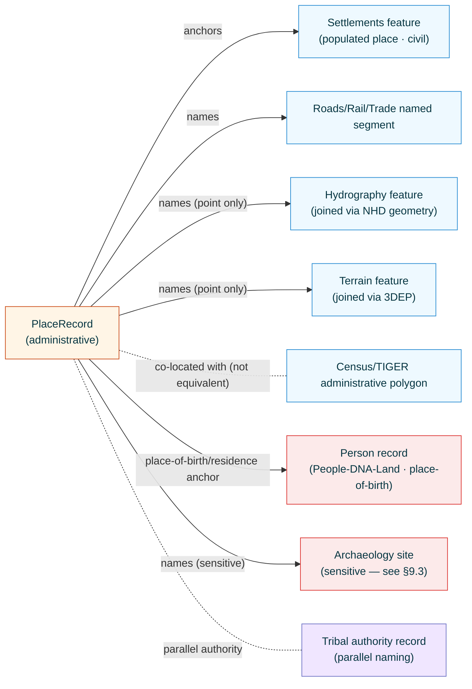

<!-- [KFM_META_BLOCK_V2]
doc_id: kfm://doc/docs-sources-catalog-usgs-gnis-names
title: USGS Geographic Names Information System (GNIS)
type: product-page
version: v0.1
status: draft
owners: <PLACEHOLDER — Docs steward + Source steward for usgs>
created: 2026-05-20
updated: 2026-05-20
policy_label: public
related:
  - docs/sources/catalog/usgs/README.md
  - docs/sources/catalog/README.md
  - docs/doctrine/directory-rules.md
tags: [kfm, docs, sources, catalog, usgs]<!-- [KFM_META_BLOCK_V2]
doc_id: kfm://doc/docs-sources-catalog-usgs-gnis-names
title: USGS Geographic Names Information System (GNIS)
type: product-page
version: v0.2
status: draft
owners: <PLACEHOLDER — Docs steward + Source steward for usgs>
created: 2026-05-20
updated: 2026-05-23
policy_label: public
related:
  - docs/sources/catalog/usgs.md
  - docs/sources/catalog/usgs/README.md
  - docs/sources/catalog/usgs/IDENTITY.md
  - docs/sources/catalog/usgs/RIGHTS-AND-SENSITIVITY-MAP.md
  - docs/sources/catalog/usgs/usgs-3dep-elevation.md
  - docs/sources/catalog/usgs/usgs-earthquake-catalog.md
  - docs/sources/catalog/README.md
  - docs/doctrine/directory-rules.md
  - docs/doctrine/lifecycle-law.md
  - docs/doctrine/trust-membrane.md
  - docs/standards/SENSITIVITY_RUBRIC.md
  - docs/standards/DCAT.md
  - docs/runbooks/spatial-foundation/SOURCE_REFRESH_RUNBOOK.md
  - data/registry/sources/usgs/
  - policy/sources/usgs/
  - policy/sensitivity/cultural/
  - schemas/contracts/v1/source/
  - schemas/contracts/v1/spatial/
  - schemas/contracts/v1/settlements/
  - connectors/usgs/
adr_refs:
  - ADR-0001 (schema home)
  - <PROPOSED> ADR-S-04 (source-role vocabulary v1)
  - <PROPOSED> ADR-S-05 (sensitivity tier scheme T0–T4)
  - <PROPOSED> ADR-S-12 (connector cadence + quarantine recovery)
  - <PROPOSED> ADR-S-14 (cross-lane join policy)
  - <PROPOSED> ADR-S-?? (name-history retention policy — full history vs BGN-decision-tracked)
  - <PROPOSED> ADR-S-?? (Tribal-name authority reconciliation — when GNIS and Tribal authorities disagree)
  - <PROPOSED> ADR-S-?? (historically harmful name surfacing — scholarship vs republication)
tags: [kfm, docs, sources, catalog, usgs, gnis, place-names, toponymy, administrative, settlements, spatial-foundation, cultural-sensitivity, tribal-sovereignty]
notes:
  - "PROPOSED product-page scaffold filled to v0.2; third product page in the usgs family folder (sibling to usgs-3dep-elevation.md and usgs-earthquake-catalog.md)."
  - "Filename inferred from doc_id slug: usgs-gnis-names.md. Family catalog (docs/sources/catalog/usgs.md §5) uses the short ID 'usgs-gnis'. Reconciliation flagged in Q-3."
  - "Source role: administrative per Atlas §24.1.1 + C7-09 (USGS GNIS as U.S.-canonical place-names authority). Distinct from the regulatory siblings and from the observed/modeled 3DEP/earthquakes siblings."
  - "Cultural sensitivity is the dominant constraint, analogous to reproduction discipline for the species-profiles page in usfws_ecos. Default T0 with three explicit override classes (§9): Tribal/Indigenous, historically harmful, living-person-residence."
  - "Name history is preserved, not overwritten. Analogous append-only versioning to the earthquake-catalog page but driven by BGN decisions rather than real-time updates."
  - "Cross-domain foundational source — joined widely (Settlements, Spatial Foundation, People-DNA-Land genealogy, Roads-Rail-Trade). Join sensitivity is policy-driven; per-feature data is open."
[/KFM_META_BLOCK_V2] -->

<a id="top"></a>

# USGS Geographic Names Information System (GNIS)

> The U.S. federal **administrative** registry of official geographic names — populated places, physical features, civil divisions, schools, churches, cemeteries, mines, parks, summits, streams — keyed by stable USGS feature IDs and curated by the U.S. Board on Geographic Names (BGN) in cooperation with USGS. KFM's `administrative` place-identity carrier for the Settlements, Spatial Foundation, People-DNA-Land, and Roads-Rail-Trade lanes.

<!-- Top-of-file badge row. Placeholder targets — replace once badge generator (KFM-P3-FEAT-0005) is wired. -->


**Status:** `PROPOSED — scaffold filled` &nbsp;·&nbsp; **Doc version:** `v0.2` &nbsp;·&nbsp; **Family:** [`usgs`](./README.md) &nbsp;·&nbsp; **Last reviewed:** 2026-05-23

> [!IMPORTANT]
> **This page is a pointer.** Authoritative descriptor fields live in [`data/registry/sources/usgs/`](../../../../data/registry/sources/usgs/). Cultural-sensitivity, Tribal-authority reconciliation, and historically-harmful-name policy live in [`policy/sources/usgs/`](../../../../policy/sources/usgs/) and [`policy/sensitivity/cultural/`](../../../../policy/sensitivity/cultural/), summarized at the family level in [`RIGHTS-AND-SENSITIVITY-MAP.md`](./RIGHTS-AND-SENSITIVITY-MAP.md). **Do not duplicate descriptor or policy content on this product page.**

> [!CAUTION]
> **GNIS records U.S. federal canonical names; it is not the sole authority for what a place is called.** Tribal nations have their own authoritative naming for their territories (e.g., the formal restoration of "Denali" alongside the prior federal name); state and local jurisdictions have their own registries; archival sources attest to historical names not all of which appear in GNIS. KFM treats GNIS as the **U.S. federal administrative carrier** — primary for U.S. federal-administrative use, but **never silently substituted for** Tribal-authoritative names, historically-attested names, or contested names. See [§9](#9-rights-and-sensitivity-pointer), [§10](#10-reality-boundary), and Q-4 / Q-6 in [§15](#15-open-questions).

---

## 📑 Contents

1. [Overview](#1-overview)
2. [Product identity within the family](#2-product-identity-within-the-family)
3. [Source authority](#3-source-authority)
4. [Catalog profiles used](#4-catalog-profiles-used)
5. [Collection identity](#5-collection-identity)
6. [Provenance fields](#6-provenance-fields)
7. [Temporal handling and name-history discipline](#7-temporal-handling-and-name-history-discipline)
8. [Identity, entity shape, and geometry](#8-identity-entity-shape-and-geometry)
9. [Rights and sensitivity (pointer)](#9-rights-and-sensitivity-pointer)
10. [Reality boundary](#10-reality-boundary)
11. [Validation and catalog closure](#11-validation-and-catalog-closure)
12. [Related contracts and schemas](#12-related-contracts-and-schemas)
13. [Related connectors and pipelines](#13-related-connectors-and-pipelines)
14. [Example](#14-example)
15. [Open questions](#15-open-questions)
16. [Last reviewed](#16-last-reviewed)

---

## 1. Overview

This product page describes how KFM catalogs the **USGS Geographic Names Information System (GNIS)** — the U.S. federal database of officially recognized geographic names. GNIS records, per stable feature ID, a current official name, optional name variants, a feature class (Populated Place, Summit, Stream, Reservoir, Church, School, Cemetery, Mine, Civil, etc.), a coordinate point, the U.S. state and county, and where applicable the BGN decision history that established the current name.

> [!NOTE]
> **EXTERNAL** *(preserved without re-verification this session).* USGS publishes GNIS as a tabular download (federally-distributed flat files / CSV) and through a query interface. KFM ingests these as read-only probes (per `KFM-P22-PROG-0043`) and emits per-feature catalog records keyed by the stable GNIS feature ID. Current endpoint URLs, file formats, and release cadence remain **NEEDS VERIFICATION** until re-fetched in a session with web access.

> [!IMPORTANT]
> **GNIS is administrative.** Per Atlas §24.1.1 source-role enum and `C7-09` (USGS GNIS as U.S.-canonical place-names authority), GNIS records are *administrative compilations*, not first-person observations and not regulatory determinations. A GNIS entry for "Smith Creek" is the federal **record** that the feature is called Smith Creek; it is not an observation that the feature exists at that coordinate at this time, and it is not a regulatory determination about jurisdiction over the feature.

```mermaid
flowchart LR
  subgraph BGN["U.S. Board on Geographic Names (federal)"]
    BGNDEC["BGN decisions<br/>(adds · changes · removals)"]
    PRINC["Policy: derogatory-name removal,<br/>Tribal-name restoration, etc."]
  end

  subgraph GNIS["GNIS (external)"]
    DB["GNIS database<br/>(feature_id-keyed)"]
    CSV["Tabular downloads<br/>(state · national · domestic)"]
    QRY["Query interface"]
    FCAT["Feature-class taxonomy<br/>(populated_place · summit · stream · …)"]
  end

  subgraph TRIBAL["Tribal authorities (parallel sovereignty)"]
    TNAMES["Tribal-authoritative names<br/>(may differ from GNIS)"]
  end

  subgraph KFM["KFM ingest & catalog"]
    CONN["connectors/usgs/gnis_pull/<br/>(read-only · content-hash watcher)"]
    PIPE["pipelines/{ingest,normalize,validate,catalog}/"]
    DCAT["data/catalog/dcat/<br/>(primary)"]
    STAC["data/catalog/stac/<br/>(secondary — per-feature point items)"]
    PROV["data/catalog/prov/<br/>(name-history chains)"]
    DOM["data/catalog/domain/<br/>{settlements,spatial,people_dna_land,roads_trade}/"]
    POL["policy/sensitivity/cultural/<br/>(CARE · cultural-flag · Tribal recon.)"]
    HIST["Name-history store<br/>(append-only attestations)"]
  end

  subgraph PUB["Release"]
    EVD["EvidenceBundle"]
    PLACE["PlaceRecord<br/>(stable feature_id + name history)"]
  end

  BGNDEC --> DB
  PRINC -. governs .-> BGNDEC
  DB --> CSV
  DB --> QRY
  FCAT -. typed .-> DB
  TNAMES -. parallel authority .- DB
  CSV -->|read-only probe| CONN
  QRY -.->|where needed| CONN
  POL -. governs .-> PIPE
  CONN --> PIPE
  PIPE --> DCAT
  PIPE --> STAC
  PIPE --> PROV
  PIPE --> DOM
  PIPE --> HIST
  DCAT --> EVD
  HIST --> EVD
  EVD --> PLACE

  classDef ext fill:#fdf6e3,stroke:#b58900,color:#073642;
  classDef tribal fill:#f0e6ff,stroke:#6c71c4,color:#073642;
  classDef kfm fill:#eef9ff,stroke:#268bd2,color:#073642;
  classDef pol fill:#fff5e6,stroke:#cb4b16,color:#073642;
  classDef rel fill:#f5ecf9,stroke:#6c71c4,color:#073642;
  class BGNDEC,PRINC,DB,CSV,QRY,FCAT ext;
  class TNAMES tribal;
  class CONN,PIPE,DCAT,STAC,PROV,DOM,HIST kfm;
  class POL pol;
  class EVD,PLACE rel;
```



[Back to top](#top)

---

## 2. Product identity within the family

> [!NOTE]
> This page is the **third** product authored under the `usgs` source family — administrative-role sibling to the heterogeneous-role [`usgs-3dep-elevation.md`](./usgs-3dep-elevation.md) (terrain) and [`usgs-earthquake-catalog.md`](./usgs-earthquake-catalog.md) (seismicity). It is the **only** USGS product page so far whose source role is `administrative` rather than a mix of `observed` + `modeled`. Family-wide concerns live at the family level and are not restated here; the family catalog index is at [`docs/sources/catalog/usgs.md`](../usgs.md).

| Attribute | Value | Status |
|---|---|---|
| Product name | USGS Geographic Names Information System (GNIS) | **CONFIRMED EXTERNAL** (USGS program name). |
| Source family | `usgs` | **PROPOSED** family-folder convention. |
| KFM source-role | **`administrative`** (Atlas §24.1.1 enum) | **CONFIRMED enum**; governed by ADR-S-04. **`C7-09`** designates USGS GNIS as the **U.S.-canonical** place-names authority. |
| Authority class | **Primary U.S. federal canonical place-names authority** (with parallel Tribal sovereignty — see §9.2) | **CONFIRMED** per `C7-09`. |
| Domains served | **Settlements & Infrastructure** (primary); **Spatial Foundation**; **People-DNA-Land** (genealogy place-of-birth, place-of-residence); **Roads-Rail-Trade** (named-place navigation context); **Archaeology** (named cultural sites) | **CONFIRMED** per Atlas Settlements §D and v1.1 family-catalog entry §5 row `usgs-gnis`. |
| Primary upstream surface | GNIS tabular downloads + query interface | **EXTERNAL — NEEDS VERIFICATION** of current endpoint and file format. |
| Cardinal evidence object | **`PlaceRecord`** (PROPOSED object) keyed by stable USGS GNIS feature ID, carrying the current name + full name history + feature class + point + state/county | **PROPOSED**. |
| Geometry | **Yes — point** (per feature; many features represent extended geography but GNIS records a point coordinate) | **CONFIRMED**. |
| Cadence | **Editorial / BGN-decision-driven**, irregular (no fixed schedule) | **CONFIRMED-irregular**. |
| Geographic scope | **U.S. domestic** (within GNIS scope) | **CONFIRMED-domestic**. |

### 2.1 Sub-product source-role and the "candidate" sub-role

GNIS records sit cleanly at `administrative`, but a small fraction warrant a parallel `candidate` label:

| Sub-product | `source_role` | Rationale | Per family-catalog §5 |
|---|---|---|---|
| **Current official name + feature ID + feature class + point** | **`administrative`** | The federal record of what a place is called. | "official geographic names, populated places" — CONFIRMED. |
| **Historical name attestations** (prior names of the same feature ID) | **`administrative`** (with `historical: true` flag and explicit `valid_from`/`valid_to`) | Still federal-administrative records; the rename is itself a BGN decision. | — |
| **Disputed / contested identity entries** | **`candidate`** | Per family-catalog §5: *"`candidate` (historical identity ambiguity)"* — when GNIS and Tribal authority disagree, or when historical evidence attests to multiple coexisting names, the canonical-identity claim is itself unresolved. | "candidate (historical identity ambiguity)" — CONFIRMED. |
| **Name variants** (alternate spellings, language variants USGS records) | **`administrative`** (with `variant: true` flag) | USGS-recorded alternatives within a single feature record. | — |

> [!CAUTION]
> **Source-role anti-collapse for GNIS.** Per Atlas §24.1.2 *"Administrative compilation cited as observation"* is a DENY condition. KFM derivatives must not:
>
> - Cite a GNIS feature record as *evidence that a feature exists at the recorded coordinate at the present time* (the feature may have changed, the coordinate may be approximate);
> - Cite a GNIS feature record as a *regulatory determination* (e.g., as the legal description of a jurisdiction — that is TIGER or local-jurisdiction territory);
> - Cite a GNIS feature record as the *only authoritative name* when Tribal or other authority is in evidence (§9.2);
> - Promote a `candidate` disputed-identity record to `administrative` truth without ADR-S-?? review.

### 2.2 Disambiguation from siblings

| If you want… | Use… | Not this page |
|---|---|---|
| **Administrative geometry** (census blocks, counties, places-as-polygons) | `<PROPOSED> docs/sources/catalog/census/tiger.md` (Census/TIGER — different family) | — |
| **Community-contributed place names** with worldwide coverage | `<PROPOSED> docs/sources/catalog/osm/` (OpenStreetMap — `observed` role, distinct rights posture) | — |
| **State-level Kansas place names** beyond what GNIS records | `<PROPOSED> docs/sources/catalog/kshs/` (Kansas Historical Society — historical attestations) | — |
| **Tribal-authoritative names** for places on Tribal lands | A separate Tribal-authority source (NEEDS VERIFICATION per nation) — never substitute GNIS | — |
| **Historical place names from archival sources** | Per-archive source pages (newspapers, diaries, deed registers) — these are research evidence, not federal canon | — |
| **The geometric extent of a named feature** (not just a point) | Cross-join GNIS point with NHD/WBD/3DEP geometry; geometric extent is not in GNIS | — |
| **Living-person place-of-residence / place-of-birth lookup** | GNIS resolves the place; the person-place join itself is sensitive (§9.3, ADR-S-14) | — |

> [!CAUTION]
> **GNIS is not Census/TIGER.** GNIS records *named features* (with point coordinates); TIGER records *administrative geometries* (polygon boundaries of places, counties, tracts). The "City of Wichita" appears in both, but GNIS gives you a point + name; TIGER gives you the polygon + administrative status. KFM derivatives that need a city footprint should cite TIGER, not generalize from a GNIS point.

[Back to top](#top)

---

## 3. Source authority

See [`data/registry/sources/usgs/`](../../../../data/registry/sources/usgs/) for the authoritative `SourceDescriptor`. **Do not duplicate descriptor fields here.** Descriptor canonical schema home is `schemas/contracts/v1/source/source-descriptor.json` per Directory Rules §7.4 / ADR-0001 — **NEEDS VERIFICATION**.

Doctrinal anchors for this product:

- **`C7-09`** — USGS GNIS as the U.S.-canonical place-names authority. Direct evidence anchor for this product's source role and authority class.
- Family-catalog entry [`docs/sources/catalog/usgs.md`](../usgs.md) §5 row `usgs-gnis` — *"`administrative` (official geographic names, populated places); `candidate` (historical identity ambiguity)"*; domains Settlements & Infrastructure · Spatial Foundation · People-DNA-Land · Roads-Rail-Trade.
- Atlas Settlements §D source-family table — names authority entry.
- Atlas §24.1.2 anti-collapse register — *"Administrative compilation cited as observation"* DENY condition.
- `KFM-P22-PROG-0043` — Read-only probe posture.
- `KFM-P1-IDEA-0051` — Knowledge-character labels (administrative is an explicit value).
- `KFM-P26-PROG-0025` — Catalog writers emit DCAT/STAC/PROV with EvidenceBundle references.
- `KFM-P14-IDEA-0002` — STAC/DCAT/PROV distribution contract.

[Back to top](#top)

---

## 4. Catalog profiles used

| Profile | Lane | Used by this product? | Basis |
|---|---|---|---|
| **DCAT** Dataset + Distribution (**primary**) | `data/catalog/dcat/` | **PROPOSED — Yes (primary)** | `C4-05`: DCAT is the natural fit for tabular administrative records keyed by feature ID. `KFM-P14-IDEA-0002` makes STAC/DCAT/PROV a single harvest surface. |
| **STAC** Item + Collection (**secondary — per-feature point items**) | `data/catalog/stac/` | **PROPOSED — Yes (secondary)** | Each feature record has a point geometry; STAC participates so spatial queries work. Aligned to `C4-01` / `C4-02`. |
| **PROV-O / PAV** lineage (**critical for name history**) | `data/catalog/prov/` | **PROPOSED — Yes** | `C8-03`. Name-rename chains use `prov:wasRevisionOf`. Each historical attestation in a feature's name-history chain is a PROV bundle entry. |
| **Domain projection — Settlements & Infrastructure** | `data/catalog/domain/settlements/` | **PROPOSED — Yes (primary domain)** | Atlas Settlements §D source-family entry. |
| **Domain projection — Spatial Foundation** | `data/catalog/domain/spatial/` | **PROPOSED — Yes** | Atlas Spatial Foundation §D names-authority row. |
| **Domain projection — People-DNA-Land** | `data/catalog/domain/people_dna_land/` | **PROPOSED — Yes** (place-of-birth, place-of-residence anchors) | Family-catalog §5 row domains. |
| **Domain projection — Roads, Rail, and Trade Routes** | `data/catalog/domain/roads_trade/` | **PROPOSED — Yes** | Family-catalog §5 row domains. |
| **STAC × Darwin Core hybrid** (`C4-03`) | — | **CONFIRMED No** | Not biological occurrence. |

> [!TIP]
> **DCAT-primary, STAC-secondary with both registered.** Unlike the species-profiles or ESA-listings products (DCAT-only is sufficient), GNIS warrants STAC participation because the point geometry meaningfully supports spatial-bounding-box queries ("all named places in Ellsworth County"). Per-feature STAC items index into the larger DCAT-shaped catalog.

[Back to top](#top)

---

## 5. Collection identity

- **PROPOSED Collection id patterns:**
  - Current names (DCAT primary + STAC secondary) → `kfm-usgs-gnis-current`
  - Historical name attestations → `kfm-usgs-gnis-historical`
  - Candidate / disputed-identity records → `kfm-usgs-gnis-candidate`
- **PROPOSED Item id pattern:** `kfm-usgs-gnis-<collection>-<feature_id>-<attestation_n>` where `attestation_n` is the monotonic version counter for this feature ID's name attestation in KFM's append-only name-history store.
- **PROPOSED namespace:** `kfm:` *(see family-catalog Q-10).*
- **Asset roles:** **NEEDS VERIFICATION** — confirm against [`schemas/contracts/v1/source/`](../../../../schemas/contracts/v1/source/). Likely role set:
  - `place-record` (JSON canonical place record)
  - `name-history` (JSON full attestation chain for this feature ID)
  - `bgn-decision-ref` (link to BGN decision record where applicable)
  - `cultural-flag-record` (JSON when cultural flags apply per §9)
  - `tribal-authority-reconciliation` (JSON when Tribal-authoritative name is known to differ — PROPOSED)
  - `metadata` (DCAT JSON-LD)
  - `evidence_bundle` (`application/ld+json`)
- **Collection description (PROPOSED):** Must declare the **administrative source role**, the **`C7-09`** authority anchor, the **U.S.-federal-canonical scope with explicit Tribal-sovereignty acknowledgment**, the **append-only name-history versioning policy**, the **cultural-sensitivity policy reference**, the **USGS no-warranty banner** verbatim, and the **anti-collapse statement** from [§2.1](#21-sub-product-source-role-and-the-candidate-sub-role).

[Back to top](#top)

---

## 6. Provenance fields

**CONFIRMED shape** (per `C4-01`). Per-product values are **NEEDS VERIFICATION** until the connector is wired.

| Field | Type | Source / how computed |
|---|---|---|
| `spec_hash` | sha256 of canonical record | `C1-02`. |
| `content_hash` | sha256 of the full source record snapshot | **CONFIRMED-required** — heartbeat for editorial-revision detection. |
| `evidence_bundle_ref` | `kfm://evidence/<digest>` | `C4-04`. |
| `run_record_ref` | `kfm://run/<run-id>` | `C1-01`. |
| `audit_ref` | `kfm://audit/<attestation-id>` | SLSA / OPA. |
| `policy_digest` | sha256 of policy bundle (including the cultural-sensitivity policy version) | Per `KFM-P22-PROG-0001` Gate A-G. |
| `gnis_feature_id` | USGS-assigned stable feature identifier | **CONFIRMED-required**. Stable across renames. |
| `attestation_n` | Monotonic integer for this feature in KFM's name-history store | **CONFIRMED-required**. |
| `feature_class` | Enum (e.g., `Populated Place`, `Summit`, `Stream`, `Reservoir`, `Park`, `Cemetery`, `Mine`, `Church`, `School`, `Building`, `Civil`, `Locale`, …) | **CONFIRMED-required** — EXTERNAL controlled vocabulary; full enum **NEEDS VERIFICATION**. |
| `name_current` | String (current official name per USGS) | **CONFIRMED-required**. |
| `name_variants` | Array of strings (USGS-recorded variants) | **PROPOSED-optional**. |
| `prior_attestation_refs` | Array of `kfm://...` refs for prior name attestations | `prov:wasRevisionOf` chain. Required when `attestation_n > 0`. |
| `bgn_decision_ref` | URI to BGN decision record (where applicable) | **PROPOSED-required** when this attestation represents a BGN-decision rename, addition, or removal. |
| `cultural_flag` | Optional enum (`historically_harmful`, `derogatory_legacy`, `tribal_significant`, `sacred`, `contested`, …) | **PROPOSED**. Drives display defaults per [§9](#9-rights-and-sensitivity-pointer); empty/null for the unflagged majority. |
| `tribal_authority_reconciliation_ref` | Optional `kfm://...` ref to the parallel Tribal-authority record where one is known | **PROPOSED**; never auto-populated. |
| `state_fips` / `county_fips` | Per-record administrative-zone keys (FIPS) | **PROPOSED-required**. |
| `kfm:provenance.candidate_disposition` | Enum (`accepted`, `under-review`, `contested`) | **PROPOSED-required** when this is a `candidate`-role record. |
| `kfm:provenance.reality_boundary_ref` | `kfm://realityboundary/...` | Per [§10](#10-reality-boundary). |

Per-asset integrity: **`file:checksum`** (SHA-256) on every published distribution (per `C3-02`).

> [!TIP]
> **`attestation_n` + `prior_attestation_refs` implement append-only name-history** analogous to the earthquake-catalog `event_update_n` pattern, but driven by editorial BGN decisions rather than real-time observation updates. The `bgn_decision_ref` is the federal-authority anchor for the change.

[Back to top](#top)

---

## 7. Temporal handling and name-history discipline

Names are **administrative**, not observed; the time semantics reflect federal-decision timing rather than physical events.

| Time | Meaning for this product | Status |
|---|---|---|
| `attestation_time` | When USGS/BGN officially recorded this name attestation (current or historical). | **CONFIRMED-required**. |
| `bgn_decision_time` | When the BGN decision that established this attestation was issued (where applicable). | **PROPOSED-required** for BGN-decision-tracked attestations. |
| `source_time` | When USGS last edited the GNIS record. | **EXTERNAL — NEEDS VERIFICATION**. |
| `valid_from` | When this attestation became authoritative (equals `attestation_time` or `bgn_decision_time` per case). | **CONFIRMED-required**. |
| `valid_to` | When this attestation was superseded by a later one; `null` while current. | **CONFIRMED-required** (nullable). |
| `retrieval_time` | When KFM's connector fetched the snapshot. | **CONFIRMED-required**. |
| `release_time` | When the KFM-derived `PlaceRecord` snapshot was published. | **CONFIRMED-required**. |
| `correction_time` | When a `CorrectionNotice` updates the record (USGS correction, KFM-side normalization fix, cultural-flag retroactive application). | **CONFIRMED-required** when applicable. |
| `observed_time` | **Not applicable** — names are administrative, not observed. | **CONFIRMED N/A** per Atlas §24.1.2 anti-collapse. |

> [!IMPORTANT]
> **Append-only name-history is binding.** When USGS/BGN renames a feature (e.g., the 2022 removal of "sq___" derogatory names; the formal restoration of Tribal-authoritative names), KFM emits a **new attestation snapshot** (`attestation_n += 1`) with a `prov:wasRevisionOf` link to the prior. Prior attestations are **preserved** with `valid_to` set, not deleted. This is essential for historical scholarship (which needs to find what a place was called when a 1920 letter named it) and for accountability of name changes themselves.

> [!CAUTION]
> **Historically harmful names require careful surfacing.** A historical attestation may carry a name that is now recognized as harmful or derogatory. KFM preserves the attestation (deletion erases historical accountability) but flags it (`cultural_flag: historically_harmful` or `derogatory_legacy`) and applies the §9 display posture: do not default to display, surface only for scholarship with explicit context, never reproduce in promotional/aesthetic contexts. See Q-6.

> [!IMPORTANT]
> **`valid_from` follows the BGN decision, not the GNIS publication date.** A BGN decision may be published in GNIS days or weeks after the decision was issued; the catalog record carries the decision date as `valid_from`, not the GNIS publication date.

[Back to top](#top)

---

## 8. Identity, entity shape, and geometry

GNIS identity is unusual in two ways: (1) the **feature ID is stable across renames**, which is the whole point of having an ID separate from the name; (2) names are **point-located** even when the named feature has extended geometry.

### 8.1 Identity

| Attribute | Value (PROPOSED) | Status |
|---|---|---|
| Cardinal identity | `gnis_feature_id` (stable across renames) | **CONFIRMED**. |
| Per-attestation identity | `(gnis_feature_id, attestation_n)` | **PROPOSED**. |
| Feature class | EXTERNAL controlled vocabulary (USGS feature-class enum) | **CONFIRMED required**; full enum **NEEDS VERIFICATION**. |
| State + county FIPS | Required for U.S. domestic GNIS records | **CONFIRMED**. |
| Name precedence within a feature ID | Per-attestation chain (current + history); never collapsed | **PROPOSED**. |
| Multi-feature-ID names | The same name may legitimately label many features (e.g., "Smith Creek" appears many times across the U.S.); feature ID disambiguates | **CONFIRMED**. |
| Multi-name feature IDs | A single feature ID may have multiple attested names over time and concurrent variants | **CONFIRMED**. |

### 8.2 Geometry

| Attribute | Value (PROPOSED) | Status |
|---|---|---|
| Geometry type | `Point` (one per record) | **CONFIRMED**. |
| Horizontal CRS | `EPSG:4326` (WGS84 geographic) | **PROPOSED** — actual GNIS source CRS **NEEDS VERIFICATION** (may be NAD83 in older records). |
| Coordinate semantics | A representative point for the feature; **not necessarily a centroid** of an extended feature, and **not** the boundary of an administrative geometry | **CONFIRMED**. |
| Vertical | **Not applicable** (no elevation/datum semantics in GNIS itself) | **CONFIRMED N/A**. |
| Geometric extent | **Not in GNIS** — cross-join with NHD (streams), 3DEP (terrain extents), TIGER (administrative polygons), or WBD (watersheds) for extent | **CONFIRMED**. |
| STAC `proj:*` fields | Required: `proj:code`, `proj:geometry`, `proj:bbox` (per `KFM-P27-FEAT-0003`) | **PROPOSED-required**. |

> [!CAUTION]
> **A GNIS point is a representative coordinate, not a centroid or boundary.** Many named features are extended (rivers, ranges, civil divisions). KFM derivatives that use a GNIS point as if it were the geometric center of an area, or as if it bounded the feature, are mis-typing the data. Cross-join with extent-bearing sources (NHD, 3DEP, TIGER) when extent is needed.

### 8.3 Cross-domain reference graph

GNIS feature IDs are the foundational reference for many KFM lanes. The reference graph is **outward** from GNIS to the joined lanes — much like the species-profiles reference graph for biology, but for places.



[Back to top](#top)

---

## 9. Rights and sensitivity (pointer)

**Do not restate policy here.** See [`policy/sensitivity/cultural/`](../../../../policy/sensitivity/cultural/) and the family-level summary at [`RIGHTS-AND-SENSITIVITY-MAP.md`](./RIGHTS-AND-SENSITIVITY-MAP.md).

### 9.1 T0 default

> [!NOTE]
> **Default tier: T0 (Open).** GNIS is U.S. federal public-domain data (17 U.S.C. §105) and the records themselves are the public canonical name register. The constraints that distinguish this product from a typical T0 source are **cultural sensitivity**, **Tribal sovereignty**, and **living-person join risk** — not the tier of the underlying record but the discipline of how KFM derivatives surface or join them.

### 9.2 Tribal-authority reconciliation (cultural sensitivity)

> [!WARNING]
> **GNIS is U.S. federal canonical; it is not the sole place-name authority.** Tribal nations have their own authoritative naming for their territories, and these may differ from GNIS in spelling, form, or in which name is primary. Per Atlas §24.5.2 sovereignty/CARE rows and S.O. 3206, KFM:
>
> - **Preserves** Tribal-authoritative names alongside GNIS attestations when both are known (`tribal_authority_reconciliation_ref`).
> - **Never silently substitutes** GNIS for a Tribal-authoritative name in a context where the Tribal authority is the relevant authority (e.g., a map of a Tribal nation's territory in a Tribal-led project).
> - **Routes** through `sovereignty_review` when a KFM-side aggregation or featuring of GNIS over Tribal lands would draw additional attention to the name choice itself.
> - **Defers** to Tribal naming guidance from each nation; KFM does not unilaterally decide which name "should" be primary on Tribal lands.
>
> Per Q-4 / ADR-S-?? (Tribal-name authority reconciliation).

### 9.3 Historically harmful name surfacing

> [!WARNING]
> **Historically harmful names exist in the GNIS history.** USGS/BGN have removed many such names from current records (e.g., the 2022 removal of "sq___" derogatory names); the historical attestations still exist in KFM's name-history store because erasing them erases the accountability for the rename itself. KFM derivatives:
>
> - **Default** to displaying the **current** name, not historical names.
> - **Surface** historical attestations only in scholarship contexts with explicit historical framing.
> - **Never** use historically harmful names in promotional, aesthetic, or default-tile contexts.
> - **Flag** every historically-harmful attestation with `cultural_flag: historically_harmful` (or `derogatory_legacy`) at admission; the flag persists through every transform.
>
> Per Q-6 / ADR-S-?? (historically harmful name surfacing).

### 9.4 Living-person join (cross-lane sensitivity)

> [!CAUTION]
> **GNIS × living-person residence is a sensitive join.** A GNIS feature record itself is T0; a place-of-residence claim for a living person is T3 / T4 depending on context. The join — *"person X lives at place Y"* with a precise GNIS coordinate — inherits the higher tier. Per `KFM-P24-IDEA-0002` deny-by-default for sensitive joins and ADR-S-14 cross-lane join policy, KFM denies precise GNIS × living-person joins on public surfaces by default; generalization to county- or state-level is the standard fallback.

### 9.5 Archaeology + sensitive features

> [!CAUTION]
> **Some GNIS features are themselves sensitive.** Named archaeological sites, sacred sites, or sites of cultural significance to Tribal nations appear in GNIS. These records inherit archaeology-sensitivity policy per Atlas §24.5.2 — KFM derivatives that highlight such sites without context are denied; generalization or steward review applies.

[Back to top](#top)

---

## 10. Reality boundary

> [!IMPORTANT]
> **GNIS records names as the U.S. federal authority understands them; it does not arbitrate names.** A GNIS attestation tells you what U.S. federal canon currently calls a feature — it does not tell you (a) what people historically called it, (b) what Tribal nations call it, (c) what state or local jurisdictions call it, or (d) whether the federal name is the "right" name in any deeper sense. Focus-Mode AI answers about names MUST cite GNIS as *one* authority alongside parallel authorities (Tribal, historical, local) where they are in evidence.

> [!IMPORTANT]
> **A GNIS point is not the feature's extent.** Claims about *where* a feature is should cross-join GNIS (for the name + canonical point) with NHD/3DEP/TIGER/WBD (for the extent). A "where is X" answer that uses only the GNIS point implicitly claims point-equivalence for an extended feature, which is wrong for any feature larger than a building.

> [!IMPORTANT]
> **A GNIS attestation at time T does not guarantee the feature exists today.** Features can be destroyed, drained, merged, demolished; GNIS does not always catch up immediately. Absence of a `valid_to` does not affirm present-day existence; cross-check with current observation (3DEP / NAIP / on-the-ground sources) when present-day existence is material to a claim.

[Back to top](#top)

---

## 11. Validation and catalog closure

- **Catalog closure required before public release** (Pass-10 / `KFM-P1-IDEA-0020`).
- **GNIS feature ID present** (gate-blocking) — `usgs_gnis_feature_id_required`.
- **Current name present** (gate-blocking) — `usgs_gnis_current_name_required`.
- **Feature class enum compliance** (gate-blocking) — `usgs_gnis_feature_class_enum_explicit` (verify against external USGS controlled vocabulary).
- **Point geometry present + horizontal CRS explicit** (gate-blocking) — `usgs_gnis_point_geometry_required`.
- **State + county FIPS present** (gate-blocking) — `usgs_gnis_admin_zone_required`.
- **Append-only name-history versioning** (gate-blocking) — `usgs_gnis_name_history_append_only`: every rename emits a new attestation; no in-place overwrite.
- **BGN-decision reference present when applicable** — `usgs_gnis_bgn_decision_ref_when_renamed`.
- **Source-role anti-collapse** (gate-blocking) — `usgs_gnis_role_anti_collapse`: never cited as `observed` (feature existence at present time), never as `regulatory` (jurisdictional determination), never as the sole authority when Tribal authority is in evidence.
- **Cultural-flag preservation** (gate-blocking) — `usgs_gnis_cultural_flag_preserved`: when a `cultural_flag` is set at admission, every downstream transform preserves it.
- **Historically harmful name surfacing rule** (gate-blocking) — `usgs_gnis_harmful_name_default_hidden`: derivatives default to current name, not historical harmful names; surfacing requires explicit scholarship-context flag.
- **Tribal-authority reconciliation present when known** — `usgs_gnis_tribal_recon_ref_when_known`: when KFM has parallel Tribal-authority data, the record carries `tribal_authority_reconciliation_ref`; absence of the ref does not assert Tribal-authority absence.
- **Living-person join policy** (gate-blocking) — `usgs_gnis_living_person_join_denied`: precise GNIS × living-person residence joins deny on public surfaces by default per ADR-S-14.
- **Archaeology + sensitive-feature flag** — `usgs_gnis_sensitive_feature_flag_when_known`.
- **DCAT mirror closure** (`KFM-P14-IDEA-0002`, `KFM-P26-PROG-0025`).
- **STAC Projection lint** for the point geometry (`KFM-P27-FEAT-0003`).
- **PROV-O closure** (`C8-03`): name-history chains via `prov:wasRevisionOf`; BGN-decision derivation via `prov:wasDerivedFrom`.
- **Catalog QA CI surface** (`KFM-P27-FEAT-0004`).
- **Promotion Gates A–G** (`KFM-P22-PROG-0001`).

> [!TIP]
> **Negative fixtures required for this product:** missing `gnis_feature_id` (Gate A quarantine); rename that overwrote a prior attestation instead of versioning (Gate D deny — name-history rule); harmful historical name surfaced on a default UI tile (Gate C deny — §9.3); GNIS cited as evidence that a feature exists at the present time (Gate F deny — anti-collapse); GNIS substituted for a known Tribal-authoritative name on Tribal-land context (Gate C deny — §9.2); precise GNIS × living-person residence on a public surface (Gate C deny — §9.4); feature class missing or non-enum value (Gate D deny); GNIS point cited as feature extent (Gate F deny — reality-boundary §10).

[Back to top](#top)

---

## 12. Related contracts and schemas

| Surface | Path (PROPOSED unless noted) | Status |
|---|---|---|
| `SourceDescriptor` semantic + schema | [`contracts/source/`](../../../../contracts/source/) · [`schemas/contracts/v1/source/`](../../../../schemas/contracts/v1/source/) | **PROPOSED** canonical homes per Directory Rules §7.4 / ADR-0001. |
| `PlaceRecord` contract | [`contracts/data/settlements/`](../../../../contracts/data/settlements/) | **PROPOSED** — new object class introduced by this product. |
| `PlaceRecord` schema | [`schemas/contracts/v1/settlements/`](../../../../schemas/contracts/v1/settlements/) | **PROPOSED**. |
| `NameAttestation` schema (per-attestation sub-record) | [`schemas/contracts/v1/settlements/`](../../../../schemas/contracts/v1/settlements/) | **PROPOSED**. |
| `NameHistoryChain` schema (the append-only chain itself) | [`schemas/contracts/v1/settlements/`](../../../../schemas/contracts/v1/settlements/) | **PROPOSED**. |
| `BGNDecisionRef` schema | [`schemas/contracts/v1/governance/`](../../../../schemas/contracts/v1/governance/) | **PROPOSED**. |
| `CulturalFlagPolicy` controlled vocabulary | [`policy/sensitivity/cultural/`](../../../../policy/sensitivity/cultural/) | **PROPOSED** lane. |
| `TribalAuthorityReconciliation` schema | [`schemas/contracts/v1/settlements/`](../../../../schemas/contracts/v1/settlements/) | **PROPOSED** — gating policy lives in `policy/sensitivity/cultural/`. |
| GNIS feature-class enum | [`schemas/contracts/v1/source/usgs_gnis_feature_class.json`](../../../../schemas/contracts/v1/source/) | **PROPOSED** — enum values **NEEDS VERIFICATION** against USGS controlled vocabulary. |
| `EvidenceBundle` / `EvidenceRef` | [`schemas/contracts/v1/evidence/`](../../../../schemas/contracts/v1/evidence/) | **PROPOSED** per `KFM-P26-PROG-0004` / 0005. |
| `RealityBoundaryNote` | [`schemas/contracts/v1/governance/`](../../../../schemas/contracts/v1/governance/) | **PROPOSED**. |

[Back to top](#top)

---

## 13. Related connectors and pipelines

| Stage | Path (PROPOSED) | Notes |
|---|---|---|
| Connector | [`connectors/usgs/gnis_pull/`](../../../../connectors/usgs/) | Read-only probe per `KFM-P22-PROG-0043`; content-hash watcher on the GNIS download surface; emits pre-RAW `EventEnvelope` only when content changes (material-change watcher, v0.2 connector contract). |
| Ingest pipeline | [`pipelines/ingest/`](../../../../pipelines/ingest/) | RAW capture into `data/raw/settlements/usgs/gnis/<run_id>/`. |
| Normalize pipeline | [`pipelines/normalize/`](../../../../pipelines/normalize/) | Feature-ID stable mapping; feature-class enum normalization; point CRS canonicalization to `EPSG:4326`; name-history reconciliation against prior KFM attestations. |
| Cultural-flag classifier (steward-assisted) | [`pipelines/normalize/cultural_flag/`](../../../../pipelines/normalize/) | **PROPOSED** — applies the cultural-flag controlled vocabulary per §9; steward-assisted for ambiguous cases. |
| Tribal-authority reconciliation | [`pipelines/normalize/tribal_recon/`](../../../../pipelines/normalize/) | **PROPOSED** — joins GNIS records to known Tribal-authoritative records; never auto-creates; flags for steward + sovereignty-review. |
| Validate pipeline | [`pipelines/validate/`](../../../../pipelines/validate/) | All validators in [§11](#11-validation-and-catalog-closure). |
| Catalog pipeline | [`pipelines/catalog/`](../../../../pipelines/catalog/) | DCAT-primary + STAC-secondary catalog closure; rich PROV-O lineage for name-history chains. |
| Pipeline specs | [`pipeline_specs/settlements/`](../../../../pipeline_specs/settlements/) | Declarative configuration. |
| Refresh runbook | [`docs/runbooks/spatial-foundation/SOURCE_REFRESH_RUNBOOK.md`](../../../runbooks/spatial-foundation/) | **PROPOSED** — same runbook as 3DEP; spatial-foundation lane. |
| BGN-decision watcher | [`pipelines/watchers/bgn_decisions/`](../../../../pipelines/watchers/) | **PROPOSED** — when the BGN publishes a name decision, emits an `EventEnvelope` triggering re-ingest of affected feature IDs. |
| Content-hash watcher | [`pipelines/watchers/usgs_gnis_content_hash/`](../../../../pipelines/watchers/) | **PROPOSED** — detects GNIS download-surface changes between scheduled pulls. |

[Back to top](#top)

---

## 14. Example

*Illustrative only — not authoritative. A minimal STAC + `kfm:provenance` shape lives at [`_examples/stac-item-example.json`](./_examples/stac-item-example.json) (file presence **NEEDS VERIFICATION**); a GNIS-specific example sketch belongs at `_examples/place-record-example.json` (PROPOSED).*

<details>
<summary><b>Click to expand — minimal PlaceRecord sketch (illustrative, JSON-LD)</b></summary>

```json
{
  "@context": {
    "dcat": "http://www.w3.org/ns/dcat#",
    "dct": "http://purl.org/dc/terms/",
    "prov": "http://www.w3.org/ns/prov#",
    "kfm": "https://kfm.example/ns/kfm#"
  },
  "@type": "dcat:Dataset",
  "@id": "kfm:dataset/usgs-gnis-current-<feature_id>-<attestation_n>",
  "dct:title": "USGS GNIS — <Current Name> (<Feature Class>)",
  "dct:type": "kfm:PlaceRecord",
  "dct:description": "Administrative federal-canonical place-name record. Parallel Tribal-authoritative naming may apply; cross-reference where known. Authority anchor C7-09.",
  "dct:license": "<USFWS-style federal no-warranty notice>",
  "dct:conformsTo": "kfm://profile/evidence-bundle/v1",
  "dct:publisher": { "@id": "kfm:org/usgs-bgn" },
  "kfm:source_role": "administrative",
  "kfm:role_authority": "U.S. Geological Survey · U.S. Board on Geographic Names",
  "kfm:provenance": {
    "spec_hash": "<sha256 of canonical record body>",
    "content_hash": "<sha256 of source snapshot>",
    "evidence_bundle_ref": "kfm://evidence/<digest>",
    "run_record_ref": "kfm://run/<run-id>",
    "audit_ref": "kfm://audit/<attestation-id>",
    "policy_digest": "<sha256 of policy bundle (incl. cultural-flag policy version)>",
    "gnis_feature_id": "<usgs feature id>",
    "attestation_n": 0,
    "feature_class": "<Populated Place | Summit | Stream | Reservoir | …>",
    "name_current": "<current official name>",
    "name_variants": [],
    "prior_attestation_refs": [],
    "bgn_decision_ref": null,
    "cultural_flag": null,
    "tribal_authority_reconciliation_ref": null,
    "state_fips": "<state FIPS>",
    "county_fips": "<county FIPS>",
    "candidate_disposition": null,
    "attestation_time": "<ISO timestamp>",
    "bgn_decision_time": null,
    "reality_boundary_ref": "kfm://realityboundary/gnis-administrative"
  },
  "kfm:point": { "lat": "<latitude>", "lon": "<longitude>", "crs": "EPSG:4326" },
  "dcat:distribution": [
    { "@type": "dcat:Distribution", "dct:title": "Place record (JSON)", "dcat:mediaType": "application/json", "dcat:accessURL": "...", "file:checksum": "..." },
    { "@type": "dcat:Distribution", "dct:title": "Name history (JSON)", "dcat:mediaType": "application/json", "dcat:accessURL": "...", "file:checksum": "..." },
    { "@type": "dcat:Distribution", "dct:title": "Evidence bundle (JSON-LD)", "dcat:mediaType": "application/ld+json", "dct:conformsTo": "kfm://profile/evidence-bundle/v1", "dcat:accessURL": "kfm://evidence/<digest>" }
  ]
}
```

</details>

<details>
<summary><b>Click to expand — minimal NameHistoryChain sketch (illustrative; after a hypothetical rename)</b></summary>

```json
{
  "@type": "kfm:NameHistoryChain",
  "gnis_feature_id": "<usgs feature id>",
  "attestations": [
    {
      "attestation_n": 0,
      "name": "<prior name>",
      "cultural_flag": "<flag if applicable>",
      "valid_from": "<ISO>",
      "valid_to": "<ISO of supersession>",
      "bgn_decision_ref": "<URL>",
      "ref": "kfm://release/usgs/gnis/historical/<feature_id>/0"
    },
    {
      "attestation_n": 1,
      "name": "<current name>",
      "cultural_flag": null,
      "valid_from": "<ISO>",
      "valid_to": null,
      "bgn_decision_ref": "<URL>",
      "ref": "kfm://release/usgs/gnis/current/<feature_id>/1"
    }
  ],
  "tribal_authority_reconciliation_ref": null
}
```

</details>

[Back to top](#top)

---

## 15. Open questions

| # | Question | Class | Suggested resolution |
|---|---|---|---|
| Q-1 | Is `docs/sources/catalog/<source_family>/<product>.md` the right nesting? *(Inherited from family catalog Q-1.)* | **NEEDS VERIFICATION** | Family-level structural ADR. |
| Q-2 | Folder naming variance: `usgs` (lowercase, no separator) here vs `usfws_ecos` (snake_case) in the sibling family. | **NEEDS VERIFICATION** | Defer to broader naming ADR. |
| Q-3 | **Filename reconciliation.** This file's doc_id slug is `usgs-gnis-names`; the family catalog (`docs/sources/catalog/usgs.md` §5) uses the short ID `usgs-gnis`. Earthquake sibling has the same kind of divergence. | **NEEDS VERIFICATION** | Reconcile when the family README is authored; either rename to `usgs-gnis.md` or accept the longer slug. Same naming-convention ADR family. |
| Q-4 | **Tribal-name authority reconciliation policy.** When GNIS and a Tribal nation disagree on a name, how does KFM surface both without taking sides? | **OPEN — gating** | ADR-S-?? (Tribal-name authority reconciliation). Default = **preserve both with explicit authority labels; never silently substitute; route `sovereignty_review`** when a Tribal-land context is involved. |
| Q-5 | **Name-history retention scope.** Does KFM preserve every historical attestation back to the earliest GNIS record, or only BGN-decision-tracked changes? | **PROPOSED — gating** | ADR-S-?? (name-history retention policy). Default = **preserve every attestation KFM has ever ingested**; rely on USGS for pre-KFM history if reachable. |
| Q-6 | **Historically harmful name surfacing.** How are derogatory historical names surfaced for scholarship without re-publishing harm? | **OPEN — gating** | ADR-S-?? (historically harmful name surfacing). Default per §9.3 = **hidden in default displays; surfaced only with explicit scholarship-context flag**; flag persists through every transform. |
| Q-7 | **Cadence.** GNIS is editorial / BGN-decision-driven; no fixed schedule. Watcher cadence? | **PROPOSED** | Default = **weekly content-hash poll** + **on-demand BGN-decision-watcher trigger** when BGN publishes a decision touching tracked feature IDs. ADR-S-12 scope. |
| Q-8 | **State place-name authorities** (Kansas Historical Society, KDOT, KGS) cross-referencing. | **PROPOSED** | Defer to per-state-authority product pages when authored; record cross-refs in the `tribal_authority_reconciliation_ref`-style pattern adapted for state-level. |
| Q-9 | **Should this product also be registered in STAC** (per-feature point items), or stay DCAT-only with a separate cross-walk to STAC? | **PROPOSED** | Default = **DCAT primary, STAC secondary** with per-feature STAC items so spatial-bbox queries work. See §4. |
| Q-10 | **STAC namespace pin** (`kfm:` vs `ks-kfm:`). | **OPEN** | Pin at family / catalog level. |
| Q-11 | **GNIS × living-person residence join policy** — what generalization level is acceptable for genealogy / People-DNA-Land surfaces? | **OPEN — gating** | Default = **county-level for living persons; precise GNIS allowed only for deceased persons whose place-of-birth is in the genealogical record**; ADR-S-14 governs. |
| Q-12 | **Feature-class enum versioning** — when USGS adds, retires, or renames a feature class, how does KFM handle prior records? | **PROPOSED** | Default = **preserve prior class label in attestation; emit `CorrectionNotice` on the affected records**. |
| Q-13 | **Multi-language / Spanish-language place-name records** in border-state GNIS coverage — preserve verbatim with `name_variants`? | **PROPOSED** | Default = **preserve verbatim with `name_variants` array; record language tags per BCP-47**. |
| Q-14 | **Coordinate-source provenance** — GNIS coordinates have varying historical accuracy; some are very rough. Does KFM record per-record coordinate-source vintage? | **PROPOSED** | Default = **carry `coordinate_source` and `coordinate_accuracy_class` in provenance when USGS publishes them**; surface in any KFM derivative that uses the point for measurement. |
| Q-15 | **Identity collisions across feature classes** — multiple features may share names ("Smith Creek" appears many times nationally). How does KFM disambiguate at the AI / Focus-Mode layer? | **PROPOSED** | Default = **AI MUST cite `gnis_feature_id` + state + county when naming a place**; never use bare name as identifier. |

[Back to top](#top)

---

## 16. Last reviewed

2026-05-23 *(scaffold filled; product-page polished against doctrine corpus + v1.1 family-catalog entry; mounted repo not inspected this session).*

---

> **Doc version:** v0.2 (draft) &nbsp;·&nbsp; **Family:** [`usgs`](./README.md) &nbsp;·&nbsp; **Catalog root:** [`docs/sources/catalog/`](../README.md) &nbsp;·&nbsp; [Back to top](#top)
notes:
  - "PROPOSED product-page scaffold; sibling-link presence verified in Claude Code session."
[/KFM_META_BLOCK_V2] -->

# USGS Geographic Names Information System (GNIS)

> Official geographic names and populated-place records.

**Status:** PROPOSED — scaffold only · **Family:** [`usgs`](./README.md) · **Last reviewed:** 2026-05-20

---

## Overview
PROPOSED scaffold. NEEDS VERIFICATION: scope, cadence, geographic coverage, current endpoint URL, rights status, license terms.

## Source authority
See [`data/registry/sources/`](../../../../data/registry/sources/) for the authoritative SourceDescriptor. **Do not duplicate** descriptor fields here.

## Catalog profiles used
| Profile | Lane | Used by this product? |
|---|---|---|
| STAC | `data/catalog/stac/` | PROPOSED — Yes / No (NEEDS VERIFICATION) |
| DCAT | `data/catalog/dcat/` | PROPOSED — Yes / No (NEEDS VERIFICATION) |
| PROV-O | `data/catalog/prov/` | PROPOSED — Yes / No (NEEDS VERIFICATION) |
| Domain projection | `data/catalog/domain/<domain>/` | PROPOSED — Yes / No (NEEDS VERIFICATION) |

## Collection identity
- PROPOSED Collection id pattern: `kfm-<org>-<product>` (see [`IDENTITY.md`](../IDENTITY.md)).
- PROPOSED namespace: `kfm:` *(see OPEN-DSC-03)*.
- Asset roles: NEEDS VERIFICATION — confirm against `schemas/contracts/v1/source/`.

## Provenance fields
STAC `properties.kfm:provenance` block (PROPOSED — Pass-10 C4-01):
- `spec_hash` — sha256 of the canonical record.
- `evidence_bundle_ref` — `kfm://evidence/<digest>`.
- `run_record_ref` — `kfm://run/<run-id>`.
- `audit_ref` — `kfm://audit/<attestation-id>`.
- `policy_digest` — sha256 of the policy bundle.
Per-asset integrity: `file:checksum`.

## Temporal handling
PROPOSED — distinct source / observed / valid / retrieval / release / correction times where material. NEEDS VERIFICATION per product.

## Geometry and projection
PROPOSED — confirm CRS, generalization rules, and scale support against `data/catalog/` artifacts. NEEDS VERIFICATION.

## Rights and sensitivity
NEEDS VERIFICATION — see [`policy/sensitivity/`](../../../../policy/sensitivity/) and [`RIGHTS-AND-SENSITIVITY-MAP.md`](../RIGHTS-AND-SENSITIVITY-MAP.md). **Do not restate policy here.**

## Validation and catalog closure
- Catalog closure required before public release (Pass-10 / KFM-P1-IDEA-0020).
- STAC Projection lint (KFM-P27-FEAT-0003) — PROPOSED.
- STAC checksum closure against the ReleaseManifest digest (KFM-P22-PROG-0037) — PROPOSED.

## Related contracts and schemas
- `contracts/` — NEEDS VERIFICATION.
- `schemas/contracts/v1/source/` — per ADR-0001.

## Related connectors and pipelines
- `connectors/usgs/`.
- `pipelines/ingest/`, `pipelines/normalize/`, `pipelines/validate/`, `pipelines/catalog/`.
- `pipeline_specs/<domain>/`.

## Examples
*(Illustrative only — do not treat as authoritative.)*
See [`_examples/stac-item-example.json`](../_examples/stac-item-example.json) for the minimal STAC + `kfm:provenance` shape.

## Open questions
- OPEN — confirm cadence and current endpoint URL.
- OPEN — confirm rights status and CARE applicability.
- OPEN — confirm whether this product warrants its own STAC Collection or shares one with sibling products.

## Last reviewed
2026-05-20 *(Claude Code product-page scaffold session).*
