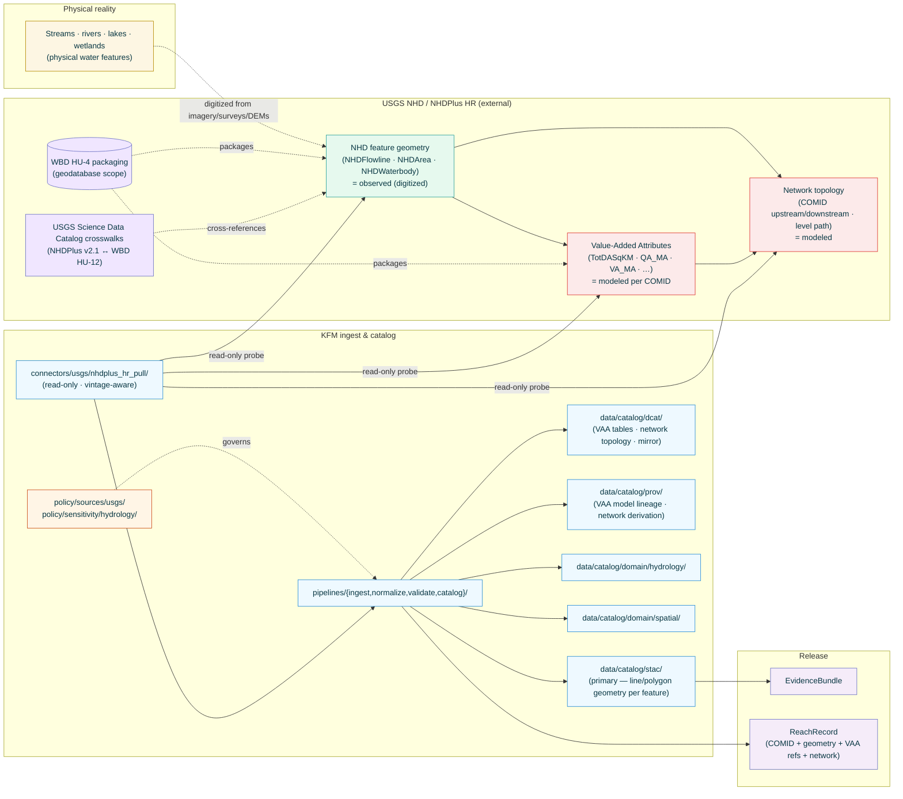
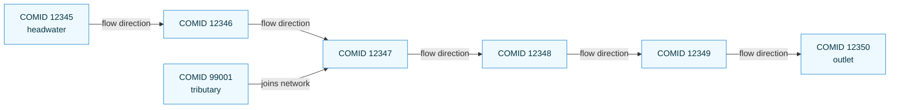

<!-- [KFM_META_BLOCK_V2]
doc_id: kfm://doc/docs-sources-catalog-usgs-nhdplus-hr
title: USGS NHDPlus High Resolution
type: product-page
version: v0.2
status: draft
owners: <PLACEHOLDER — Docs steward + Source steward for usgs>
created: 2026-05-20
updated: 2026-05-23
policy_label: public
related:
  - docs/sources/catalog/usgs.md
  - docs/sources/catalog/usgs/README.md
  - docs/sources/catalog/usgs/IDENTITY.md
  - docs/sources/catalog/usgs/RIGHTS-AND-SENSITIVITY-MAP.md
  - docs/sources/catalog/usgs/usgs-3dep-elevation.md
  - docs/sources/catalog/usgs/usgs-earthquake-catalog.md
  - docs/sources/catalog/usgs/usgs-gnis-names.md
  - docs/sources/catalog/README.md
  - docs/doctrine/directory-rules.md
  - docs/doctrine/lifecycle-law.md
  - docs/doctrine/trust-membrane.md
  - docs/standards/SENSITIVITY_RUBRIC.md
  - docs/standards/STAC.md
  - docs/runbooks/hydrology/SOURCE_REFRESH_RUNBOOK.md
  - data/registry/sources/usgs/
  - policy/sources/usgs/
  - policy/sensitivity/hydrology/
  - schemas/contracts/v1/source/
  - schemas/contracts/v1/hydrology/
  - connectors/usgs/
adr_refs:
  - ADR-0001 (schema home)
  - <PROPOSED> ADR-S-04 (source-role vocabulary v1)
  - <PROPOSED> ADR-S-05 (sensitivity tier scheme T0–T4)
  - <PROPOSED> ADR-S-12 (connector cadence + quarantine recovery)
  - <PROPOSED> ADR-S-14 (cross-lane join policy)
  - <PROPOSED> ADR-S-?? (VAA model-run-ref policy — what counts as a documented model run for NHDPlus HR derivatives)
tags: [kfm, docs, sources, catalog, usgs, nhd, nhdplus-hr, hydrography, hydrology, vaa, comid, network, spatial-foundation]
notes:
  - "PROPOSED product-page scaffold filled to v0.2; fourth product page in the usgs family folder."
  - "Filename inferred from doc_id slug: usgs-nhdplus-hr.md. Family catalog (docs/sources/catalog/usgs.md §5) uses the short ID 'usgs-nhdplus-hr'. Naming aligned this time."
  - "Heterogeneous source-role: digitized geometry = observed (first-party survey/digitization of real water features); VAAs (cumulative drainage, mean annual flow/velocity, flow direction) = modeled per family-catalog §6 + §11 FAQ. NHD/3DHP successor track noted as forward-looking context."
  - "Network topology (COMID identifiers + upstream/downstream linkage) is the cardinal evidence shape — point/line geometry alone is insufficient."
  - "Engineering-claim disclaimer applies (per ML-061-022 / family-catalog §7) — NHDPlus HR is informational, not regulatory; flood-zone determinations belong to FEMA NFHL."
  - "Cross-domain foundational source for Hydrology + Spatial Foundation + Agriculture (irrigation linkages) + Habitat."
[/KFM_META_BLOCK_V2] -->

<a id="top"></a>

# USGS NHDPlus High Resolution

> The U.S. national high-resolution hydrography network — **observed** stream/water-body geometry (digitized from imagery, surveys, and DEMs) joined to **modeled** Value-Added Attributes (VAAs) including cumulative drainage area, mean annual flow and velocity, flow direction, and network topology. Keyed by stable USGS **COMID** identifiers. KFM's hydrography carrier for the Hydrology and Spatial Foundation domains.

<!-- Top-of-file badge row. Placeholder targets — replace once badge generator (KFM-P3-FEAT-0005) is wired. -->


**Status:** `PROPOSED — scaffold filled` &nbsp;·&nbsp; **Doc version:** `v0.2` &nbsp;·&nbsp; **Family:** [`usgs`](./README.md) &nbsp;·&nbsp; **Last reviewed:** 2026-05-23

> [!IMPORTANT]
> **This page is a pointer.** Authoritative descriptor fields live in [`data/registry/sources/usgs/`](../../../../data/registry/sources/usgs/). Rights, sensitivity, and engineering-disclaimer policy live in [`policy/sources/usgs/`](../../../../policy/sources/usgs/) and [`policy/sensitivity/hydrology/`](../../../../policy/sensitivity/hydrology/), summarized at the family level in [`RIGHTS-AND-SENSITIVITY-MAP.md`](./RIGHTS-AND-SENSITIVITY-MAP.md). **Do not duplicate descriptor or policy content on this product page.**

> [!CAUTION]
> **VAAs are modeled, not observed.** This product carries two role-distinct surfaces under one upstream package: the *digitized hydrography geometry* (NHDFlowline, NHDArea, NHDWaterbody — `observed`) and the *Value-Added Attributes* attached to each COMID (cumulative drainage area, mean annual flow, mean annual velocity, flow direction, Strahler stream order — **`modeled`**). Per the v1.1 family-catalog entry §6 and §11 FAQ, citing a VAA *as if it were a measured value at the reach* is a Gate-F deny. See [§2.1](#21-sub-product-source-role-decomposition) and [§6](#6-source-role-posture-anti-collapse).

---

## 📑 Contents

1. [Overview](#1-overview)
2. [Product identity within the family](#2-product-identity-within-the-family)
3. [Source authority](#3-source-authority)
4. [Catalog profiles used](#4-catalog-profiles-used)
5. [Collection identity](#5-collection-identity)
6. [Provenance fields](#6-provenance-fields)
7. [Temporal handling and release-vintage discipline](#7-temporal-handling-and-release-vintage-discipline)
8. [Geometry, network topology, and entity shape](#8-geometry-network-topology-and-entity-shape)
9. [Rights and sensitivity (pointer)](#9-rights-and-sensitivity-pointer)
10. [Reality boundary](#10-reality-boundary)
11. [Validation and catalog closure](#11-validation-and-catalog-closure)
12. [Related contracts and schemas](#12-related-contracts-and-schemas)
13. [Related connectors and pipelines](#13-related-connectors-and-pipelines)
14. [Example](#14-example)
15. [Open questions](#15-open-questions)
16. [Last reviewed](#16-last-reviewed)

---

## 1. Overview

This product page describes how KFM catalogs **USGS NHDPlus High Resolution (NHDPlus HR)** — the U.S. national high-resolution hydrography dataset combining the National Hydrography Dataset (NHD) feature geometry with derived Value-Added Attributes (VAAs) computed across the river network. NHDPlus HR is delivered as packaged geodatabases keyed by Watershed Boundary Dataset (WBD) accounting units (typically HU-4 or finer) and identifies every reach with a stable USGS **Common Identifier (COMID)**.

> [!NOTE]
> **EXTERNAL** *(preserved without re-verification this session).* USGS publishes NHDPlus HR through The National Map (TNM) and direct download services as versioned packaged geodatabases. KFM ingests from these surfaces as read-only probes (per `KFM-P22-PROG-0043`) and emits KFM-namespaced catalog items per sub-product (geometry, VAAs, network topology). Current endpoint URLs, package format details, and release cadence remain **NEEDS VERIFICATION** until re-fetched in a session with web access.

> [!IMPORTANT]
> **NHD and the 3D Hydrography Program (3DHP) successor.** USGS is migrating the long-standing NHD/NHDPlus framework toward the 3D Hydrography Program (3DHP), which incorporates 3DEP elevation-derived stream networks. KFM treats NHDPlus HR as the current authoritative carrier and tracks the 3DHP successor track separately; per-product re-mapping when 3DHP becomes authoritative is a forward task (Q-12).



[Back to top](#top)

---

## 2. Product identity within the family

> [!NOTE]
> This page is the **fourth** product authored under the `usgs` source family — joining the heterogeneous-role [`usgs-3dep-elevation.md`](./usgs-3dep-elevation.md) (terrain), the real-time + historical [`usgs-earthquake-catalog.md`](./usgs-earthquake-catalog.md) (seismicity), and the administrative [`usgs-gnis-names.md`](./usgs-gnis-names.md) (place names). NHDPlus HR is the second product page in the family with a heterogeneous observed + modeled role split, paralleling the 3DEP pattern (LAZ observed → DEM modeled) at a different evidence level (geometry observed → VAAs modeled).

| Attribute | Value | Status |
|---|---|---|
| Product name | USGS NHDPlus High Resolution (NHDPlus HR) | **CONFIRMED EXTERNAL** (USGS program name). |
| Source family | `usgs` | **CONFIRMED** family-folder convention (matches sibling pages). |
| KFM source-role | **Heterogeneous** — see [§2.1](#21-sub-product-source-role-decomposition) | **CONFIRMED enum** per Atlas §24.1.1; governed by ADR-S-04. |
| Domains served | **Hydrology** (primary); **Spatial Foundation**; **Agriculture** (irrigation/water linkages — family-catalog §13 cross-domain feed map); **Habitat** (aquatic habitat geometry) | **CONFIRMED** per family-catalog §5 row and §13 feed map. |
| Primary upstream surface | TNM Download (packaged geodatabases by WBD HU-4 region) + cross-references via USGS Science Data Catalog (`usgs-sdc`) | **EXTERNAL — NEEDS VERIFICATION** of current endpoint URLs and package format details. |
| Cardinal evidence object | **`ReachRecord`** (PROPOSED object) keyed by stable COMID, carrying geometry refs + VAA refs + network-topology refs + WBD context | **PROPOSED** — new object class. |
| Geometry | **Yes** — point/line/polygon depending on feature type (see [§8](#8-geometry-network-topology-and-entity-shape)) | **CONFIRMED-mixed**. |
| Cadence | **Release-vintaged** — episodic versioned releases per WBD region; no real-time stream | **CONFIRMED-vintaged**. |
| Geographic scope | **U.S. domestic** (within NHDPlus HR coverage); KFM Kansas AOI = state extent + buffer + downstream-of-Kansas reaches per Q-7 of the 3DEP page's AOI doctrine | **PROPOSED**. |

### 2.1 Sub-product source-role decomposition

Per family-catalog [`docs/sources/catalog/usgs.md`](../usgs.md) §5 row `usgs-nhdplus-hr` and §6 anti-collapse table:

| Sub-product | `source_role` | Rationale | Anti-collapse risk |
|---|---|---|---|
| **NHDFlowline geometry** (stream-segment line geometry) | **`observed`** | Digitized from aerial imagery, field surveys, and DEM-derived flow paths. The geometry is a first-party measured representation of real water features. *(v1.1 family-catalog clean-up: the v1 informal label "context" maps to `observed` per ADR-S-04 disposition.)* | Citing as if it were a regulatory waterway designation — that is EPA/Clean Water Act territory, not NHD. |
| **NHDArea geometry** (area features — rivers wide enough to map as polygons, swamps, wetlands) | **`observed`** | Same digitization basis as NHDFlowline. | Same as above. |
| **NHDWaterbody geometry** (lakes, ponds, reservoirs) | **`observed`** | Same digitization basis. | Same as above. |
| **VAA — TotDASqKM** (total drainage area in km²) | **`modeled`** | **Computed by accumulating upstream catchment areas along the network**. Not measured at the reach. Per family-catalog §6: *"NHDPlus HR Value-Added Attributes (e.g., cumulative drainage, mean annual flow/velocity) are *derived*, not measured at each reach."* | Citing as measured drainage. |
| **VAA — QA_MA** (mean annual flow) | **`modeled`** | Computed from precipitation/runoff models scaled to the network; not a gauge measurement at the reach. | Citing as gauged flow at the reach. The gauged flow is `usgs-water-data`, not NHDPlus HR. |
| **VAA — VA_MA** (mean annual velocity) | **`modeled`** | Computed from modeled flow + channel geometry assumptions. | Same as QA_MA. |
| **Flow direction / network topology** (COMID upstream / downstream / level paths) | **`modeled`** | Computed from DEM flow direction + manual editing; the network graph is a model of *how* water moves, not a measurement. | Citing network position as observed fact when the network model is wrong (rare but possible in heavily modified hydrology). |
| **Strahler stream order** | **`modeled`** | Computed from network topology. | Same as above. |
| **WBD HU-4 packaging context** | **`administrative`** | NHDPlus HR is packaged by WBD HU-4 accounting units — the packaging itself is an administrative framing, not a regulatory boundary. See family-catalog §11 FAQ. | Citing HU-4 as a regulatory watershed jurisdiction. |
| **NHDPlus v2.1 ↔ WBD HU-12 crosswalk** (from USGS Science Data Catalog) | **`modeled`** (where derivation is documented) per family-catalog §5 row `usgs-sdc` | Spatial-join derivation between NHD reaches and WBD watersheds. | Citing as measured intersection without preserving the join method. |

> [!CAUTION]
> **Source-role anti-collapse is the dominant validator class.** A single COMID carries observed geometry **and** modeled VAAs **and** modeled network position. Joining them is fine (that is the whole point of NHDPlus); **flattening** them into a single role downstream is denied at the trust membrane per Atlas §24.1.2 *"Modeled product labeled or queried as observed"* DENY condition.

### 2.2 Disambiguation from siblings

| If you want… | Use… | Not this page |
|---|---|---|
| **Real-time / gauged streamflow** at a station | `<PROPOSED> docs/sources/catalog/usgs/usgs-water-data.md` (`api.waterdata.usgs.gov`) | — |
| **Watershed boundaries** (HUC8/10/12 polygons themselves) | `<PROPOSED> docs/sources/catalog/usgs/usgs-wbd.md` | — |
| **Terrain context** for the watershed (DEM, slope, flow direction grids) | [`usgs-3dep-elevation.md`](./usgs-3dep-elevation.md) | — |
| **Place names** for hydrography features (the GNIS name for a stream) | [`usgs-gnis-names.md`](./usgs-gnis-names.md) (cross-joined via co-located point) | — |
| **Regulatory flood-zone designations** | `<PROPOSED> docs/sources/catalog/fema/nfhl.md` — FEMA NFHL, **not** USGS | — |
| **Engineering hydraulic-model output** (HEC-RAS, etc.) for a reach | The originating model run + its calibration data — **not** an NHDPlus HR VAA | — |
| **3DHP successor** (NHDPlus HR's forward-looking replacement using 3DEP-derived networks) | `<PROPOSED> docs/sources/catalog/usgs/usgs-3dhp.md` once 3DHP is in scope | — |
| **NHDPlus v2.1** (medium-resolution predecessor) | `<PROPOSED> docs/sources/catalog/usgs/usgs-nhdplus-v21.md` if separately ingested; per family-catalog §5 the v2.1 crosswalk lives under `usgs-sdc` | — |

> [!CAUTION]
> **NHDPlus HR is not regulatory.** Per family-catalog §6 warning: *"a USGS dataset does not become regulatory simply by being federal."* Regulatory flood-zone designations are FEMA NFHL. KFM derivatives that present NHDPlus HR geometry or VAAs as legal jurisdiction over a waterway violate the source-role anti-collapse rule (`administrative` packaging) and the federal-vs-regulatory rule (`observed` / `modeled` content).

[Back to top](#top)

---

## 3. Source authority

See [`data/registry/sources/usgs/`](../../../../data/registry/sources/usgs/) for the authoritative `SourceDescriptor`. **Do not duplicate descriptor fields here.** Descriptor canonical schema home is `schemas/contracts/v1/source/source-descriptor.json` per Directory Rules §7.4 / ADR-0001 — **NEEDS VERIFICATION**.

Doctrinal anchors for this product:

- Family-catalog entry [`docs/sources/catalog/usgs.md`](../usgs.md) §5 row `usgs-nhdplus-hr` — heterogeneous observed-geometry + modeled-VAA role.
- Family-catalog §6 anti-collapse table — VAAs explicitly listed as the canonical *"Modeled product labeled as observed"* risk for this family.
- Family-catalog §11 FAQ — *"Can I treat NHDPlus HR Value-Added Attributes (VAAs) as 'observed' because they live alongside the geometry? **No.**"*
- Atlas Hydrology §D — NHDPlus HR / 3DHP as named source family with cross-references to 3DEP terrain.
- Atlas §24.1.2 anti-collapse register — *"Modeled product labeled as observation"* DENY condition.
- `KFM-P22-PROG-0043` — Read-only probe posture.
- `KFM-P1-IDEA-0051` — Knowledge-character labels (`observed` and `modeled` both apply here).
- `KFM-P14-PROG-0011` — 3DEP/TNM/NAIP packaging doctrine (terrain + imagery + hydrography all carry provenance, coverage metadata, rights checks).
- `KFM-P26-PROG-0025` — Catalog writers emit DCAT/STAC/PROV with EvidenceBundle references.
- `KFM-P14-IDEA-0002` — STAC/DCAT/PROV distribution contract.
- `KFM-P27-FEAT-0003`/0004 — STAC Projection lint + Catalog QA CI surface.

[Back to top](#top)

---

## 4. Catalog profiles used

| Profile | Lane | Used by this product? | Basis |
|---|---|---|---|
| **STAC** Item + Collection with `kfm:provenance` (**primary for geometry**) | `data/catalog/stac/` | **PROPOSED — Yes (primary for geometry)** | Spatiotemporal asset family with line/polygon geometry. `C4-01` / `C4-02`. |
| **STAC Projection extension** | (STAC properties) | **PROPOSED — Yes** | `proj:code`, `proj:bbox`, `proj:geometry` per `KFM-P27-FEAT-0003`. |
| **DCAT** Dataset + Distribution (**primary for VAA tables**) | `data/catalog/dcat/` | **PROPOSED — Yes (primary for VAAs and network topology)** | VAAs are a tabular per-COMID surface — the natural DCAT fit per `C4-05`. Network topology is a graph dataset, also DCAT-shaped. |
| **PROV-O / PAV** lineage (**critical for VAA model lineage**) | `data/catalog/prov/` | **PROPOSED — Yes** | `C8-03`. PROV chain MUST capture: (a) NHD geometry digitization basis, (b) VAA model run that produced each attribute, (c) network derivation from geometry + DEM. |
| **Domain projection — Hydrology** | `data/catalog/domain/hydrology/` | **PROPOSED — Yes (primary domain)** | Atlas Hydrology §D source family. |
| **Domain projection — Spatial Foundation** | `data/catalog/domain/spatial/` | **PROPOSED — Yes** | Family-catalog §5 row. |
| **Domain projection — Agriculture** | `data/catalog/domain/agriculture/` | **PROPOSED — Yes (where irrigation/water linkages apply)** | Family-catalog §13 cross-domain feed map. |
| **Domain projection — Habitat** | `data/catalog/domain/habitat/` | **PROPOSED — Yes (aquatic habitat geometry)** | Family-catalog §5 row. |
| **GeoPackage / geodatabase fidelity preservation** in `raw/` | (internal RAW retention) | **PROPOSED — Yes** | Upstream NHDPlus HR ships as packaged geodatabases; KFM preserves the package in `raw/` and normalizes per-feature to JSON-LD evidence-bundle shape. |
| **STAC × Darwin Core hybrid** (`C4-03`) | — | **CONFIRMED No** | Not biological occurrence. |

[Back to top](#top)

---

## 5. Collection identity

- **PROPOSED Collection id patterns:**
  - NHDFlowline geometry → `kfm-usgs-nhdplus-hr-flowline`
  - NHDArea geometry → `kfm-usgs-nhdplus-hr-area`
  - NHDWaterbody geometry → `kfm-usgs-nhdplus-hr-waterbody`
  - VAAs (per-COMID table) → `kfm-usgs-nhdplus-hr-vaa`
  - Network topology → `kfm-usgs-nhdplus-hr-network`
- **PROPOSED Item id pattern:** `kfm-usgs-nhdplus-hr-<collection>-<comid>-<release_vintage>`. Stable COMID + release-vintage suffix; per-vintage immutability (see [§7](#7-temporal-handling-and-release-vintage-discipline)).
- **PROPOSED namespace:** `kfm:` *(see family-catalog Q-10).*
- **Asset roles:** **NEEDS VERIFICATION** — confirm against [`schemas/contracts/v1/source/`](../../../../schemas/contracts/v1/source/). Likely role set:
  - `geometry` — GeoJSON / GeoParquet feature geometry
  - `vaa-record` — JSON VAA bundle per COMID
  - `network-edge` — JSON upstream/downstream link records
  - `vaa-model-run-ref` — link to the VAA model-run metadata
  - `geodatabase-source` — packaged GDB preserved for fidelity
  - `metadata` — DCAT JSON-LD
  - `evidence_bundle` — JSON-LD bundle (`application/ld+json`)
- **Collection description (PROPOSED):** Must declare the **per-sub-product source-role**, the **COMID identity scheme**, the **release-vintage immutability**, the **engineering-disclaimer posture** from [§9.1](#91-t0-default-with-engineering-disclaimer), the **USGS no-warranty banner** verbatim, and the **anti-collapse statement** from [§2.1](#21-sub-product-source-role-decomposition).

[Back to top](#top)

---

## 6. Provenance fields

**CONFIRMED shape** (per `C4-01`). Per-product values are **NEEDS VERIFICATION** until the connector is wired.

| Field | Type | Source / how computed |
|---|---|---|
| `spec_hash` | sha256 of canonical record | `C1-02`. |
| `evidence_bundle_ref` | `kfm://evidence/<digest>` | `C4-04`. |
| `run_record_ref` | `kfm://run/<run-id>` | `C1-01`. |
| `audit_ref` | `kfm://audit/<attestation-id>` | SLSA / OPA. |
| `policy_digest` | sha256 of policy bundle | `KFM-P22-PROG-0001`. |
| `comid` | USGS Common Identifier (stable per feature across releases) | **CONFIRMED-required**. |
| `release_vintage` | Identifier of the NHDPlus HR release (e.g., HU-4 region + release date) | **CONFIRMED-required**. |
| `wbd_hu4_package` | The WBD HU-4 region this feature was packaged under | **CONFIRMED-required**. |
| `feature_type` | Enum (`NHDFlowline`, `NHDArea`, `NHDWaterbody`) | **CONFIRMED-required**. |
| `ftype` / `fcode` | USGS NHD feature type + feature code (e.g., `StreamRiver`, `ArtificialPath`, `LakePond`) — controlled vocabulary | **CONFIRMED-required**. Enum values **NEEDS VERIFICATION** against current NHD specification. |
| `gnis_id` | Optional GNIS feature ID where the NHD feature is named-correlated | **PROPOSED**; cross-references the [`usgs-gnis-names.md`](./usgs-gnis-names.md) sibling. |
| **VAA fields** (on VAA records — `source_role: modeled`) | | |
| `vaa_model_run_ref` | Structured (model name + version + parameters + run date) | **CONFIRMED-required** for any VAA record per Atlas §24.1.2 *"Modeled product"* requirement. |
| `tot_dasqkm` | Total cumulative drainage area in km² (modeled) | Required-when-published. |
| `qa_ma` | Mean annual flow (modeled) | Required-when-published, with units explicit. |
| `va_ma` | Mean annual velocity (modeled) | Required-when-published, with units explicit. |
| `vaa_units` | Structured (per-attribute units; `m^3/s` vs `cfs`, `m/s` vs `ft/s`, `km^2` vs `mi^2`) | **CONFIRMED-required** per `ML-061-022` units check. |
| `strahler_order` | Integer (modeled) | Optional. |
| **Network-topology fields** (on network records — `source_role: modeled`) | | |
| `upstream_comid` / `downstream_comid` | Array of COMIDs | **CONFIRMED-required** for network records. |
| `level_path` | Modeled network path identifier | **PROPOSED**. |
| `network_model_run_ref` | Structured (network model + version + DEM-vintage used) | **CONFIRMED-required**. |
| **Geometry-derivation fields** (on geometry records — `source_role: observed`) | | |
| `digitization_basis` | Enum (`imagery`, `field_survey`, `dem_derived`, `mixed`) | **PROPOSED-required** where USGS publishes. |
| `source_imagery_vintage` | ISO date or epoch | **PROPOSED**; where applicable. |
| `kfm:provenance.reality_boundary_ref` | `kfm://realityboundary/...` | Per [§10](#10-reality-boundary). |

Per-asset integrity: **`file:checksum`** (SHA-256) on every published distribution (per `C3-02`).

> [!TIP]
> **`vaa_model_run_ref` is gate-blocking for every VAA record.** Per Atlas §24.1.2 anti-collapse, a modeled product without an identifiable model run cannot be promoted — it has lost its derivation lineage. The reference may resolve to a USGS-published model-version document (e.g., "NHDPlus HR VAA computation v1.X") or to a KFM-internal pin of that document; what matters is that the lineage is recoverable.

[Back to top](#top)

---

## 7. Temporal handling and release-vintage discipline

NHDPlus HR is **release-vintaged** — episodic versioned releases per WBD HU-4 region. There is no real-time stream; the temporal discipline is therefore different from `usgs-earthquake-catalog`'s append-only versioning and closer to a standard six-time pattern with explicit release-vintage tracking.

| Time | Meaning for this product | Status |
|---|---|---|
| `source_time` | When USGS finalized this release of the WBD HU-4 package. | **EXTERNAL — NEEDS VERIFICATION**. |
| `release_vintage_date` | The canonical published date of this NHDPlus HR release for the affected HU-4 region(s). | **CONFIRMED-required**. |
| `valid_from` | When this vintage became the current authoritative version for the HU-4 region in KFM (typically equals `release_vintage_date`). | **CONFIRMED-required**. |
| `valid_to` | When superseded by a later release; `null` while current. | **CONFIRMED-required** (nullable). |
| `retrieval_time` | When KFM's connector fetched the package. | **CONFIRMED-required**. |
| `release_time` | When the KFM-derived item was published. | **CONFIRMED-required** at Gate G. |
| `correction_time` | When KFM emits a `CorrectionNotice` (e.g., for a VAA units error in a prior ingest). | **CONFIRMED-required** when applicable. |
| `observed_time` | **Applicable to digitization basis** — when the source imagery / survey that the geometry was digitized from was captured. Often distinct from release date by years. | **PROPOSED-required** where USGS publishes the source vintage. |

> [!IMPORTANT]
> **A COMID is stable across vintages; the record at that COMID is not.** USGS may re-digitize a feature, refine its VAAs, or restructure the network in a later release — all while preserving the COMID. KFM **preserves the prior-vintage snapshot** (`valid_to` set, not deleted) so historical scholarship and change-detection workflows work. The current-vintage item is the default; prior vintages remain queryable.

> [!IMPORTANT]
> **Digitization vintage ≠ release vintage.** Geometry digitized from 2008 imagery may appear in a 2020 release. Claims about *what the water network looked like in year Y* must use the **digitization vintage** (`observed_time`), not the release vintage. The release vintage marks when USGS published; the digitization vintage marks when the underlying observation was captured.

> [!CAUTION]
> **VAA vintages may move independently of geometry vintages.** USGS may re-run VAA computation against the same geometry. KFM tracks `vaa_model_run_ref` per VAA record so a VAA change without a geometry change is preserved as such (the COMID is unchanged, the geometry is unchanged, only the VAA bundle is new).

[Back to top](#top)

---

## 8. Geometry, network topology, and entity shape

NHDPlus HR is **geometrically heterogeneous** (lines for streams, polygons for water bodies, areas for wide rivers and wetlands) and **graph-structured** (the network of upstream/downstream relations is itself the cardinal evidence shape for many uses).

### 8.1 Per-sub-product geometry

| Sub-product | Geometry type | Catalog Item geometry |
|---|---|---|
| **NHDFlowline** | LineString (single segment per COMID, ordered upstream→downstream) | `LineString` |
| **NHDArea** | Polygon (rivers wide enough to map as polygon, wetlands, areas-of-complex-channels) | `Polygon` / `MultiPolygon` |
| **NHDWaterbody** | Polygon (lakes, ponds, reservoirs, swamps) | `Polygon` / `MultiPolygon` |
| **VAA records** | None (table keyed by COMID; joins to NHDFlowline geometry) | `null` (DCAT-only) |
| **Network edges** | None (graph keyed by upstream/downstream COMID pairs) | `null` (DCAT-only) |

### 8.2 Network topology as cardinal shape



The cardinal evidence shape for many downstream uses (flow routing, watershed delineation, upstream-impact analysis) is **the network graph itself**, not the line geometry. KFM emits the network topology as its own DCAT-shaped catalog product (`kfm-usgs-nhdplus-hr-network`) referencing COMIDs into the geometry collection.

### 8.3 CRS, scale, and units

| Attribute | Value (PROPOSED) | Status |
|---|---|---|
| Upstream native CRS | NAD83 geographic (`EPSG:4269`) or albers equal-area for analysis | **EXTERNAL — NEEDS VERIFICATION** per delivery. |
| KFM **analysis CRS** | Preserved from upstream | **CONFIRMED** per `ML-061-096` analysis-vs-delivery separation. |
| KFM **delivery CRS** | `EPSG:3857` for PMTiles / web tiles; `EPSG:4326` for catalog payloads | **PROPOSED**. |
| Scale and resolution | High resolution (1:24,000 or finer in most areas; varies by source) | **EXTERNAL — NEEDS VERIFICATION**. |
| STAC `proj:*` fields | Required: `proj:code`, `proj:bbox`, `proj:geometry` | **PROPOSED-required** per `KFM-P27-FEAT-0003`. |
| Units (VAAs) | Per-attribute units explicit (km² vs mi², m³/s vs cfs, m/s vs ft/s) | **CONFIRMED-required** per `ML-061-022`. |
| Vertical | **N/A** for NHDPlus HR geometry itself (depth is not in NHD); 3DEP cross-reference for terrain | **CONFIRMED N/A** for this product. |

### 8.4 Entity shape — `ReachRecord`

The cardinal `ReachRecord` (PROPOSED object) keyed by COMID bundles geometry + VAAs + network position + WBD context:

| Field | Notes |
|---|---|
| `comid` | Stable identifier. |
| `release_vintage` | Per [§7](#7-temporal-handling-and-release-vintage-discipline). |
| `feature_type` | NHDFlowline / NHDArea / NHDWaterbody. |
| `geometry_ref` | `kfm://release/...` to the geometry record. |
| `vaa_ref` | `kfm://release/...` to the VAA record (with `vaa_model_run_ref`). |
| `network_edges` | Array of upstream / downstream COMIDs (model-derived). |
| `wbd_hu4` / `wbd_hu8` / `wbd_hu12` | Watershed accounting unit context. |
| `gnis_name_ref` | Optional cross-reference to a `PlaceRecord` from [`usgs-gnis-names.md`](./usgs-gnis-names.md) when the feature is GNIS-named. |
| `ftype` / `fcode` | USGS NHD feature classification. |

> [!NOTE]
> **The `ReachRecord` is a governed pointer surface, not a snapshot copy** — when the underlying VAA record updates (new `vaa_model_run_ref`), the `ReachRecord` does not silently mutate; KFM emits a new ReachRecord vintage referencing the new VAA record.

[Back to top](#top)

---

## 9. Rights and sensitivity (pointer)

**Do not restate policy here.** See [`policy/sensitivity/hydrology/`](../../../../policy/sensitivity/hydrology/) and the family-level summary at [`RIGHTS-AND-SENSITIVITY-MAP.md`](./RIGHTS-AND-SENSITIVITY-MAP.md).

### 9.1 T0 default with engineering disclaimer

> [!NOTE]
> **Default tier: T0 (Open).** NHDPlus HR is U.S. federal public-domain data (17 U.S.C. §105) with no warranty. KFM follows the upstream open posture.

> [!IMPORTANT]
> **Engineering-claim disclaimer is binding.** Per `ML-061-022` (NFHL vertical datum and units check) and family-catalog §7 / §11 FAQ, engineering claims about flood risk, channel capacity, water-right boundaries, or floodway extent require the controlling regulatory source (FEMA NFHL for floodways; state water-rights authorities; local engineering studies) — **not** an NHDPlus HR VAA or geometry. KFM derivatives that present NHDPlus HR for engineering use carry the *"informational, not regulatory"* posture and decline to substitute for the controlling carrier. This is the analog of the 3DEP product page §9.3 engineering-claim disclaimer, applied to hydrography.

### 9.2 Sensitive-occurrence cross-lane joins

> [!CAUTION]
> **NHDPlus HR × precise rare-aquatic-species occurrence is a sensitive join.** A reach itself is T0; joining it to precise rare-species occurrence (sensitive fauna per `KFM-P24-IDEA-0002`, `KFM-P25-IDEA-0006`) inherits the higher tier at the join. ADR-S-14 governs the cross-lane join policy. Standard fallback: HU-12 or HU-8 generalization for occurrence display rather than COMID-precise.

### 9.3 Critical-infrastructure overlays

> [!CAUTION]
> **NHDPlus HR × critical water infrastructure (dams, intakes, treatment plants).** Per Atlas §24.5.2 critical-infrastructure rows and family-catalog §7 infrastructure-overlay override, joins that featurize specific infrastructure vulnerability route to T4 with steward review. Publishing NHD geometry near a known critical intake is itself T0; **featuring** that intake's downstream reach with VAA-modeled flow is the kind of join that ADR-S-14 addresses.

### 9.4 CARE applicability over Tribal lands

> [!WARNING]
> **Hydrography on Tribal lands routes through `sovereignty_review`.** Water is a sacred concern for many Tribal nations; KFM does not unilaterally featurize or aggregate hydrography over Tribal lands without sovereignty review per S.O. 3206. Per family-catalog §7 Tribal-lands row.

[Back to top](#top)

---

## 10. Reality boundary

> [!IMPORTANT]
> **Geometry is observed digitization; VAAs are model output.** A KFM derivative that cites a VAA as if it were a measurement at the reach has substituted model for observation. Focus-Mode AI answers about hydrology MUST cite **gauged streamflow** (`usgs-water-data` sibling) when the question is about measured flow; NHDPlus HR VAAs are an estimate that exists at every reach, including reaches that have never had a gauge.

> [!IMPORTANT]
> **A COMID is a network position, not a place.** Identifying a reach by COMID is unambiguous within NHDPlus HR; it is **not** the same as identifying a named feature (GNIS) or an administrative jurisdiction (TIGER). Cross-references to GNIS and TIGER are explicit pointers, not implicit identities.

> [!IMPORTANT]
> **Network topology is a model of how water moves on the surface.** Subsurface flows (karst, deep groundwater, artificial conduits) are not in the NHD network model and may be material in regions where they are real (e.g., karst aquifers in southern Kansas / Oklahoma). Absence of a connection in the network model is not absence of hydrologic connectivity.

> [!IMPORTANT]
> **Heavily modified hydrology may not match the model.** Channelization, irrigation diversions, drainage ditches, dam operations, and seasonal canal systems may make the NHD network model differ from current physical reality. The model is the best published U.S. baseline; it is not ground truth at every reach.

[Back to top](#top)

---

## 11. Validation and catalog closure

- **Catalog closure required before public release** (Pass-10 / `KFM-P1-IDEA-0020`).
- **COMID present and stable** (gate-blocking) — `usgs_nhd_comid_required`.
- **Feature type enum compliance** (gate-blocking) — `usgs_nhd_feature_type_enum_explicit` (`NHDFlowline` / `NHDArea` / `NHDWaterbody`).
- **FType / FCode enum compliance** (gate-blocking) — `usgs_nhd_ftype_fcode_enum_explicit` against USGS controlled vocabulary.
- **Geometry present and CRS explicit** (gate-blocking) — `usgs_nhd_geometry_crs_required`.
- **Release vintage present** (gate-blocking) — `usgs_nhd_release_vintage_required`.
- **WBD HU-4 packaging present** (gate-blocking) — `usgs_nhd_wbd_hu4_required`.
- **VAA model-run reference present on every VAA record** (gate-blocking) — `usgs_nhd_vaa_model_run_ref_required`. Per Atlas §24.1.2.
- **VAA units explicit** (gate-blocking) — `usgs_nhd_vaa_units_explicit`. Per `ML-061-022`.
- **Network-topology model-run reference present** (gate-blocking) — `usgs_nhd_network_model_run_ref_required`.
- **Per-vintage snapshot preservation** (gate-blocking) — `usgs_nhd_per_vintage_immutability`: prior-vintage records are preserved with `valid_to` set, not deleted.
- **Source-role anti-collapse** (gate-blocking) — `usgs_nhd_role_anti_collapse`:
  - VAA cited as observed → Gate F deny.
  - Geometry cited as regulatory → Gate F deny.
  - Network position cited as observed connectivity (especially in karst regions) → Gate F deny with reality-boundary annotation.
  - HU-4 packaging cited as regulatory watershed jurisdiction → Gate F deny.
- **Engineering-claim disclaimer** (UI-level, gate-blocking on publication) — `usgs_nhd_engineering_disclaimer_banner_required`: any KFM surface presenting NHDPlus HR for engineering use carries the *"informational, not regulatory"* banner per §9.1.
- **Analysis CRS vs delivery CRS separated** — `usgs_nhd_analysis_vs_delivery_crs_separated`. Per `ML-061-096`.
- **Sensitive-occurrence join denied by default** — `usgs_nhd_sensitive_occurrence_join_denied` per ADR-S-14.
- **STAC Projection lint** (`KFM-P27-FEAT-0003`).
- **STAC × ReleaseManifest checksum closure** (`KFM-P22-PROG-0037`).
- **DCAT mirror closure** (`KFM-P14-IDEA-0002`, `KFM-P26-PROG-0025`).
- **PROV-O closure** (`C8-03`): per-vintage `prov:wasRevisionOf` for the same COMID across vintages; `prov:wasDerivedFrom` for VAAs from geometry + DEM; explicit network-model run as a separate PROV node.
- **Catalog QA CI surface** (`KFM-P27-FEAT-0004`).
- **Promotion Gates A–G** (`KFM-P22-PROG-0001`).

> [!TIP]
> **Negative fixtures required for this product:** VAA record missing `vaa_model_run_ref` (Gate A quarantine); VAA published with mixed unit conventions across reaches in the same dataset (Gate D deny); a `release_vintage` change that overwrote the prior snapshot for a COMID (Gate D deny); a KFM derivative citing `qa_ma` as gauged flow (Gate F deny — anti-collapse); a KFM derivative citing NHD geometry as a regulatory waterway (Gate F deny — federal-vs-regulatory); a KFM derivative citing HU-4 packaging as a regulatory jurisdiction (Gate F deny); engineering-use surface without the disclaimer banner (Gate C deny); sensitive-aquatic-occurrence joined at COMID precision on a public surface (Gate C deny).

[Back to top](#top)

---

## 12. Related contracts and schemas

| Surface | Path (PROPOSED unless noted) | Status |
|---|---|---|
| `SourceDescriptor` semantic + schema | [`contracts/source/`](../../../../contracts/source/) · [`schemas/contracts/v1/source/`](../../../../schemas/contracts/v1/source/) | **PROPOSED** canonical homes per Directory Rules §7.4 / ADR-0001. |
| `ReachRecord` contract | [`contracts/data/hydrology/`](../../../../contracts/data/hydrology/) | **PROPOSED** — new object class introduced by this product. |
| `ReachRecord` schema | [`schemas/contracts/v1/hydrology/`](../../../../schemas/contracts/v1/hydrology/) | **PROPOSED**. |
| `VAARecord` schema (VAAs per COMID) | [`schemas/contracts/v1/hydrology/`](../../../../schemas/contracts/v1/hydrology/) | **PROPOSED**. |
| `NetworkEdge` schema (upstream/downstream link records) | [`schemas/contracts/v1/hydrology/`](../../../../schemas/contracts/v1/hydrology/) | **PROPOSED**. |
| `ModelRunRef` schema (for VAA + network derivation) | [`schemas/contracts/v1/governance/`](../../../../schemas/contracts/v1/governance/) | **PROPOSED** per Atlas §24.1.2 anti-collapse requirement. |
| NHD `FType` / `FCode` enum | [`schemas/contracts/v1/source/usgs_nhd_ftype_fcode.json`](../../../../schemas/contracts/v1/source/) | **PROPOSED** — enum values **NEEDS VERIFICATION** against USGS NHD specification. |
| WBD HU enum (HU-2 / HU-4 / HU-8 / HU-12) | [`schemas/contracts/v1/spatial/wbd_huc.json`](../../../../schemas/contracts/v1/spatial/) | **PROPOSED** — shared with `<PROPOSED> usgs-wbd.md` sibling. |
| `EvidenceBundle` / `EvidenceRef` | [`schemas/contracts/v1/evidence/`](../../../../schemas/contracts/v1/evidence/) | **PROPOSED** per `KFM-P26-PROG-0004` / 0005. |
| `RealityBoundaryNote` | [`schemas/contracts/v1/governance/`](../../../../schemas/contracts/v1/governance/) | **PROPOSED**. |
| `CorrectionNotice` | [`schemas/contracts/v1/governance/`](../../../../schemas/contracts/v1/governance/) | **PROPOSED**. |

[Back to top](#top)

---

## 13. Related connectors and pipelines

| Stage | Path (PROPOSED) | Notes |
|---|---|---|
| Connector | [`connectors/usgs/nhdplus_hr_pull/`](../../../../connectors/usgs/) | Read-only probe per `KFM-P22-PROG-0043`; vintage-aware (downloads per-HU-4 geodatabase packages); emits pre-RAW `EventEnvelope` only when a new release vintage is detected (material-change watcher, v0.2 connector contract). |
| Ingest pipeline | [`pipelines/ingest/`](../../../../pipelines/ingest/) | RAW capture into `data/raw/hydrology/usgs/nhdplus_hr/<release_vintage>/<hu4>/`. Preserves the geodatabase package for fidelity. |
| Normalize pipeline | [`pipelines/normalize/`](../../../../pipelines/normalize/) | GDB → per-feature JSON-LD canonical shape; CRS canonicalization (preserving analysis CRS); VAA-table per-record extraction with `vaa_model_run_ref`; network-edge extraction; FType/FCode enum normalization; GNIS-name cross-reference where available. |
| Validate pipeline | [`pipelines/validate/`](../../../../pipelines/validate/) | All validators in [§11](#11-validation-and-catalog-closure). |
| Catalog pipeline | [`pipelines/catalog/`](../../../../pipelines/catalog/) | STAC primary for geometry, DCAT primary for VAAs + network; rich PROV-O for VAA model lineage. |
| Pipeline specs | [`pipeline_specs/hydrology/`](../../../../pipeline_specs/hydrology/) | Declarative configuration. |
| Refresh runbook | [`docs/runbooks/hydrology/SOURCE_REFRESH_RUNBOOK.md`](../../../runbooks/hydrology/) | **PROPOSED**; analog to the authored fauna runbook. |
| Release-vintage watcher | [`pipelines/watchers/usgs_nhdplus_hr_release/`](../../../../pipelines/watchers/) | **PROPOSED** — polls TNM for new NHDPlus HR release vintages per KFM AOI HU-4 region; emits `EventEnvelope` when a new vintage publishes. |
| 3DHP successor watcher | [`pipelines/watchers/usgs_3dhp_track/`](../../../../pipelines/watchers/) | **PROPOSED** — tracks the 3D Hydrography Program successor track separately so KFM can plan migration; emits nothing immediate, just maintains the descriptor's `successor_track` field. |

[Back to top](#top)

---

## 14. Example

*Illustrative only — not authoritative. A minimal STAC + `kfm:provenance` shape lives at [`_examples/stac-item-example.json`](./_examples/stac-item-example.json) (file presence **NEEDS VERIFICATION**); an NHDPlus HR–specific example sketch belongs at `_examples/stac-nhdplus-hr-flowline-example.json` (PROPOSED).*

<details>
<summary><b>Click to expand — minimal STAC Item sketch for a KFM-derived NHDFlowline reach (illustrative)</b></summary>

```json
{
  "type": "Feature",
  "stac_version": "1.0.0",
  "id": "kfm-usgs-nhdplus-hr-flowline-<comid>-<release_vintage>",
  "collection": "kfm-usgs-nhdplus-hr-flowline",
  "geometry": {
    "type": "LineString",
    "coordinates": [/* upstream→downstream vertices */]
  },
  "bbox": [/* reach bbox */],
  "properties": {
    "datetime": "<release_vintage_date ISO8601>",
    "start_datetime": "<observed_time / digitization vintage>",
    "end_datetime": null,
    "proj:code": "EPSG:4269",
    "kfm:source_role": "observed",
    "kfm:role_authority": "U.S. Geological Survey · NHD",
    "kfm:provenance": {
      "spec_hash": "<sha256 of canonical item body>",
      "evidence_bundle_ref": "kfm://evidence/<digest>",
      "run_record_ref": "kfm://run/<run-id>",
      "audit_ref": "kfm://audit/<attestation-id>",
      "policy_digest": "<sha256 of policy bundle>",
      "comid": "<usgs comid>",
      "release_vintage": "<HU4-id + release date>",
      "wbd_hu4_package": "<HU4 id>",
      "feature_type": "NHDFlowline",
      "ftype": "StreamRiver",
      "fcode": "<numeric fcode>",
      "gnis_id": "<optional usgs gnis feature id>",
      "digitization_basis": "imagery",
      "source_imagery_vintage": "<ISO date>",
      "vaa_ref": "kfm://release/usgs/nhdplus-hr/vaa/<comid>/<release_vintage>",
      "network_ref": "kfm://release/usgs/nhdplus-hr/network/<comid>/<release_vintage>",
      "gnis_name_ref": "kfm://release/usgs/gnis/current/<gnis_feature_id>/<attestation_n>",
      "reality_boundary_ref": "kfm://realityboundary/nhdplus-hr-observed-geometry"
    }
  },
  "assets": {
    "geometry": { "href": "...", "type": "application/geo+json", "roles": ["geometry"], "file:checksum": "..." },
    "vaa-record": { "href": "...", "type": "application/json", "roles": ["vaa-record"], "file:checksum": "..." },
    "evidence_bundle": { "href": "kfm://evidence/<digest>", "type": "application/ld+json", "roles": ["evidence_bundle"] }
  },
  "links": [
    { "rel": "self", "href": "..." },
    { "rel": "collection", "href": "..." },
    { "rel": "attestation", "href": "kfm://evidence/<digest>" },
    { "rel": "related", "href": "kfm://release/usgs/nhdplus-hr/vaa/<comid>/<release_vintage>", "title": "VAAs for this COMID" },
    { "rel": "related", "href": "kfm://release/usgs/nhdplus-hr/network/<comid>/<release_vintage>", "title": "Network position for this COMID" },
    { "rel": "predecessor-version", "href": "kfm://release/usgs/nhdplus-hr/flowline/<comid>/<prior_vintage>" }
  ]
}
```

</details>

<details>
<summary><b>Click to expand — minimal VAA record sketch (illustrative, JSON — note <code>source_role: modeled</code>)</b></summary>

```json
{
  "@type": "kfm:VAARecord",
  "comid": "<usgs comid>",
  "release_vintage": "<HU4-id + release date>",
  "kfm:source_role": "modeled",
  "kfm:role_authority": "U.S. Geological Survey · NHDPlus HR VAA computation",
  "kfm:provenance": {
    "spec_hash": "<sha256>",
    "vaa_model_run_ref": {
      "model": "NHDPlus HR VAA",
      "version": "<vX.Y>",
      "run_date": "<ISO>",
      "parameters_ref": "<URL>"
    },
    "reality_boundary_ref": "kfm://realityboundary/nhdplus-hr-modeled-vaa"
  },
  "tot_dasqkm": 145.7,
  "qa_ma": 0.83,
  "va_ma": 0.41,
  "strahler_order": 3,
  "vaa_units": {
    "tot_dasqkm": "km^2",
    "qa_ma": "m^3/s",
    "va_ma": "m/s"
  }
}
```

</details>

[Back to top](#top)

---

## 15. Open questions

| # | Question | Class | Suggested resolution |
|---|---|---|---|
| Q-1 | Is `docs/sources/catalog/<source_family>/<product>.md` the right nesting? *(Inherited from family catalog Q-1.)* | **NEEDS VERIFICATION** | Family-level structural ADR. |
| Q-2 | Folder naming variance: `usgs` lowercase here vs `usfws_ecos` snake_case in the sibling family. | **NEEDS VERIFICATION** | Defer to broader naming ADR. |
| Q-3 | **Filename alignment.** This file's doc_id slug is `usgs-nhdplus-hr`, the family catalog short ID is `usgs-nhdplus-hr`, and the filename `usgs-nhdplus-hr.md` aligns directly. No reconciliation needed for this product. | **CONFIRMED-aligned** | None. |
| Q-4 | **Should NHDFlowline, NHDArea, NHDWaterbody, VAAs, and network topology each be their own product page** within `usgs/`, or stay nested here? | **PROPOSED** | Default = **stay nested here** with per-sub-product Collection ids; splitting deferred unless VAA cadence diverges materially from geometry cadence. Same disposition as the 3DEP product page Q-10. |
| Q-5 | **3DHP successor track.** When does KFM migrate to NHDPlus HR's 3DHP successor, and how is the migration ADR-tracked? | **OPEN — strategic** | ADR-S-?? (NHD → 3DHP migration). Default = **track 3DHP in the descriptor's `successor_track` field**; do not pre-migrate. |
| Q-6 | **Cadence.** NHDPlus HR releases are episodic per WBD HU-4 region with no fixed schedule. Watcher cadence? | **OPEN** | Default = **monthly content-hash poll per Kansas-AOI HU-4 region**; ADR-S-12 scope. |
| Q-7 | **VAA model-run-ref policy.** What counts as a documented model run? Pin to a USGS-published model-version doc, or compute a KFM-internal pin? | **PROPOSED — gating** | ADR-S-?? (VAA model-run-ref policy). Default = **pin USGS-published model version where available, fall back to KFM-internal hash of the source-package version when USGS does not version explicitly**. |
| Q-8 | **Subsurface-hydrology caveat (karst, deep groundwater).** How does KFM surface the *"NHD does not model subsurface flow"* reality-boundary on UI? | **PROPOSED** | Default = **persistent reality-boundary banner on UI surfaces in known karst regions (e.g., southern KS Flint Hills, OK Ozark Plateau)** per §10. |
| Q-9 | **Heavily modified hydrology.** Channelization, irrigation ditches, drainage tiles — how does KFM flag features where the model and reality diverge materially? | **PROPOSED** | Default = **carry `modification_flag` in provenance (rural-drainage / urban-storm / irrigation / channelized) where USGS publishes**; surface in any KFM-side flow analysis. |
| Q-10 | **NHD vs NHDPlus v2.1 reconciliation.** USGS still serves both — does KFM ingest both or only NHDPlus HR? | **PROPOSED** | Default = **NHDPlus HR primary**; v2.1 reachable only via `usgs-sdc` crosswalks per family-catalog §5. Don't double-ingest. |
| Q-11 | **WBD HU-12 crosswalk** (via `usgs-sdc`). Does this product page reference the crosswalk directly, or is the crosswalk a separate product page? | **PROPOSED** | Default = **separate product page** under `<PROPOSED> docs/sources/catalog/usgs/usgs-sdc-nhdplus-wbd-crosswalk.md`; reference from here. |
| Q-12 | **3DHP migration sub-track.** When 3DHP is published for KFM AOI, does the KFM AOI immediately switch carrier, or run side-by-side for an overlap period? | **OPEN — strategic** | Default = **side-by-side overlap with explicit `successor_carrier_ref` on prior NHDPlus HR records** for a documented overlap period before retiring. |
| Q-13 | **STAC namespace pin** (`kfm:` vs `ks-kfm:`). | **OPEN** | Pin at family / catalog level. |
| Q-14 | **Engineering-claim disclaimer UX.** Persistent banner on every UI surface using NHDPlus HR, or only escalated when an engineering query is detected? | **PROPOSED** | Default = **persistent banner on every hydrography surface**; escalate to hard interstitial on engineering-value queries. Same pattern as the 3DEP product page Q-13. |
| Q-15 | **Sensitive-aquatic-occurrence join generalization level** — HU-8 or HU-12 default for rare-species occurrence display? | **OPEN — gating** | Default = **HU-12 for fauna occurrence with rare-species flag; HU-8 only when HU-12 is too restrictive for the science use**. ADR-S-14 governs. |

[Back to top](#top)

---

## 16. Last reviewed

2026-05-23 *(scaffold filled; product-page polished against doctrine corpus + v1.1 family-catalog entry + sibling product pages; mounted repo not inspected this session).*

---

> **Doc version:** v0.2 (draft) &nbsp;·&nbsp; **Family:** [`usgs`](./README.md) &nbsp;·&nbsp; **Catalog root:** [`docs/sources/catalog/`](../README.md) &nbsp;·&nbsp; [Back to top](#top)
