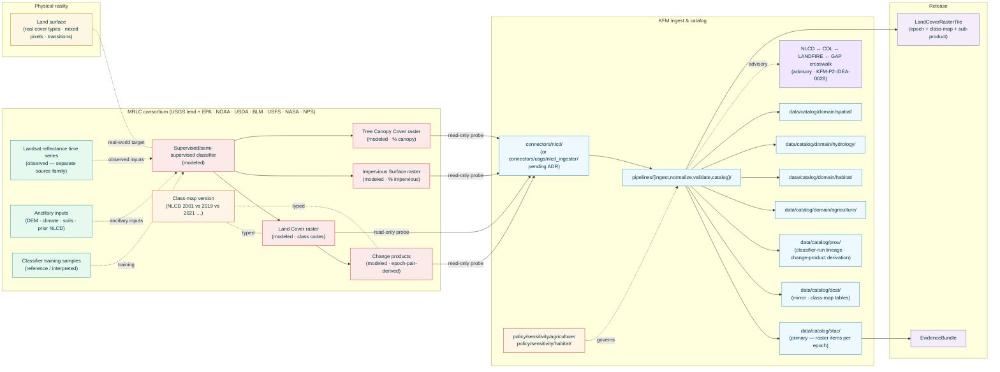

<!-- [KFM_META_BLOCK_V2]
doc_id: kfm://doc/docs-sources-catalog-usgs-nlcd
title: USGS NLCD National Land Cover Database
type: product-page
version: v0.2
status: draft
owners: <PLACEHOLDER — Docs steward + Source steward for usgs (or mrlc — see §2 family-folder placement)>
created: 2026-05-21
updated: 2026-05-23
policy_label: public
related:
  - docs/sources/catalog/usgs.md
  - docs/sources/catalog/usgs/README.md
  - docs/sources/catalog/usgs/IDENTITY.md
  - docs/sources/catalog/usgs/RIGHTS-AND-SENSITIVITY-MAP.md
  - docs/sources/catalog/usgs/usgs-3dep-elevation.md
  - docs/sources/catalog/usgs/usgs-earthquake-catalog.md
  - docs/sources/catalog/usgs/usgs-gnis-names.md
  - docs/sources/catalog/usgs/usgs-nhdplus-hr.md
  - docs/sources/catalog/README.md
  - docs/doctrine/directory-rules.md
  - docs/doctrine/lifecycle-law.md
  - docs/doctrine/trust-membrane.md
  - docs/standards/SENSITIVITY_RUBRIC.md
  - docs/standards/STAC.md
  - docs/standards/PMTILES.md
  - docs/runbooks/agriculture/SOURCE_REFRESH_RUNBOOK.md
  - data/registry/sources/usgs/
  - data/registry/sources/mrlc/
  - policy/sources/usgs/
  - policy/sensitivity/agriculture/
  - policy/sensitivity/habitat/
  - schemas/contracts/v1/source/
  - schemas/contracts/v1/raster/
  - schemas/contracts/v1/landcover/
  - connectors/nlcd/
  - connectors/usgs/
adr_refs:
  - ADR-0001 (schema home)
  - <PROPOSED> ADR-S-04 (source-role vocabulary v1)
  - <PROPOSED> ADR-S-05 (sensitivity tier scheme T0–T4)
  - <PROPOSED> ADR-S-12 (connector cadence + quarantine recovery)
  - <PROPOSED> ADR-S-14 (cross-lane join policy)
  - <PROPOSED> ADR-S-?? (family-folder placement — usgs vs mrlc for multi-agency products)
  - <PROPOSED> ADR-S-?? (class-map version reconciliation policy — comparing NLCD across releases)
  - <PROPOSED> ADR-S-?? (land-cover crosswalk policy — NLCD ↔ CDL ↔ LANDFIRE ↔ GAP advisory crosswalks per KFM-P2-IDEA-0028)
tags: [kfm, docs, sources, catalog, usgs, nlcd, mrlc, land-cover, classification, raster, cog, agriculture, habitat, hydrology, spatial-foundation, modeled]
notes:
  - "PROPOSED product-page scaffold filled to v0.2; fifth product page in the usgs family folder."
  - "Filename inferred from doc_id slug: usgs-nlcd.md. Aligned with v1.1 family-catalog naming convention; no reconciliation needed."
  - "Source-role: pure `modeled` per Atlas §24.1.1 — every pixel is a classifier-assigned class label, not a measurement. First product page in the family with uniform single source-role across all sub-products (Land Cover, Impervious Surface, Tree Canopy Cover, Change)."
  - "MRLC consortium attribution: NLCD is produced by the Multi-Resolution Land Characteristics (MRLC) consortium, of which USGS is the primary distributor partner. Family-folder placement (`usgs/` vs `mrlc/`) and connector home (`connectors/nlcd/` vs `connectors/usgs/nlcd_ingester/`) are both surfaced as open ADRs — the v0.1 scaffold's `connectors/nlcd/` is preserved here pending that ADR."
  - "Class-map versioning is the unique discipline for this product — the classification taxonomy itself evolves across NLCD releases (2001, 2006, 2011, 2016, 2019, 2021, …). Cross-release comparison requires class-map reconciliation, not pixel-equality. Analogous to but distinct from earthquake event versioning and NHDPlus HR release-vintage immutability."
  - "Per KFM-P2-IDEA-0028: land-cover authorities (NLCD + USDA CDL + LANDFIRE + GAP) are ingested per-source primary with native classification preserved; crosswalks are advisory, not authoritative."
  - "Engineering-claim disclaimer applies — NLCD wetlands ≠ USACE/EPA regulatory wetlands; NLCD agriculture ≠ USDA NASS CDL crop-specific classifications."
[/KFM_META_BLOCK_V2] -->

<a id="top"></a>

# USGS NLCD National Land Cover Database

> The U.S. national land-cover classification raster — a **modeled** thematic product where every 30-meter pixel carries a class label assigned by a Landsat-based supervised/semi-supervised classifier. Produced by the **Multi-Resolution Land Characteristics (MRLC) consortium** (USGS as lead distributor; EPA, NOAA, USDA, BLM, USFS, NASA, NPS as partners) and delivered as multi-epoch raster series. KFM's primary land-cover carrier for Agriculture, Habitat, Hydrology (runoff modeling), and Spatial Foundation lanes.

<!-- Top-of-file badge row. Placeholder targets — replace once badge generator (KFM-P3-FEAT-0005) is wired. -->


-red)


**Status:** `PROPOSED — scaffold filled` &nbsp;·&nbsp; **Doc version:** `v0.2` &nbsp;·&nbsp; **Family:** [`usgs`](./README.md) *(placement OPEN — see [§2](#2-product-identity-within-the-family))* &nbsp;·&nbsp; **Last reviewed:** 2026-05-23

> [!IMPORTANT]
> **This page is a pointer.** Authoritative descriptor fields live in [`data/registry/sources/usgs/`](../../../../data/registry/sources/usgs/) *(or `data/registry/sources/mrlc/` pending the family-folder ADR — see §2)*. Rights, sensitivity, and engineering-disclaimer policy live in [`policy/sources/usgs/`](../../../../policy/sources/usgs/), [`policy/sensitivity/agriculture/`](../../../../policy/sensitivity/agriculture/), and [`policy/sensitivity/habitat/`](../../../../policy/sensitivity/habitat/), summarized at the family level in [`RIGHTS-AND-SENSITIVITY-MAP.md`](./RIGHTS-AND-SENSITIVITY-MAP.md). **Do not duplicate descriptor or policy content on this product page.**

> [!CAUTION]
> **Every NLCD pixel is a classifier assignment, not a measurement.** Unlike the heterogeneous sibling products in this family (3DEP: observed LAZ + modeled DEMs; NHDPlus HR: observed geometry + modeled VAAs; Earthquakes: observed events + modeled derivatives), NLCD is **uniformly modeled** at every pixel and every sub-product. Per Atlas §24.1.2 *"Modeled product labeled or queried as observed"* DENY condition: a KFM derivative that cites an NLCD class as if it were a measurement of land cover at the pixel violates the source-role anti-collapse rule. See [§2.1](#21-sub-product-source-role-decomposition) and [§6](#6-source-role-posture-anti-collapse).

> [!CAUTION]
> **NLCD class enum evolves across releases.** The class taxonomy in NLCD 2001 is not pixel-equivalent to the taxonomy in NLCD 2019 or 2021 — classes have been added, refined, split, or merged. Cross-release comparison (the change-product use case) requires **class-map reconciliation**, not pixel equality. KFM preserves the source class-map version on every NLCD record; KFM derivatives that compare NLCD epochs must consume the class-map reconciliation, not raw class codes. See [§7.2](#72-class-map-versioning-and-cross-release-reconciliation) and Q-5.

---

## 📑 Contents

1. [Overview](#1-overview)
2. [Product identity within the family](#2-product-identity-within-the-family)
3. [Source authority](#3-source-authority)
4. [Catalog profiles used](#4-catalog-profiles-used)
5. [Collection identity](#5-collection-identity)
6. [Provenance fields](#6-provenance-fields)
7. [Temporal handling, class-map versioning, and change-product lineage](#7-temporal-handling-class-map-versioning-and-change-product-lineage)
8. [Geometry, raster shape, and class semantics](#8-geometry-raster-shape-and-class-semantics)
9. [Rights and sensitivity (pointer)](#9-rights-and-sensitivity-pointer)
10. [Reality boundary](#10-reality-boundary)
11. [Validation and catalog closure](#11-validation-and-catalog-closure)
12. [Related contracts and schemas](#12-related-contracts-and-schemas)
13. [Related connectors and pipelines](#13-related-connectors-and-pipelines)
14. [Example](#14-example)
15. [Open questions](#15-open-questions)
16. [Last reviewed](#16-last-reviewed)

---

## 1. Overview

This product page describes how KFM catalogs the **USGS National Land Cover Database (NLCD)** — the U.S. national thematic land-cover product produced by the Multi-Resolution Land Characteristics (MRLC) consortium. NLCD is delivered as a multi-epoch 30-meter raster series in which every pixel carries a numeric class code from an evolving class taxonomy (forest, grassland, cultivated crops, developed open space, developed high intensity, open water, woody wetlands, emergent herbaceous wetlands, etc.). MRLC also publishes Impervious Surface (%), Tree Canopy Cover (%), and Change products as related rasters in the same family.

> [!NOTE]
> **EXTERNAL** *(preserved without re-verification this session).* MRLC publishes NLCD through `mrlc.gov` and through USGS Science Data Catalog / TNM distribution surfaces, typically as GeoTIFF / COG files in CONUS Albers Equal Area (`EPSG:5070`). KFM ingests from these surfaces as read-only probes (per `KFM-P22-PROG-0043`) and emits KFM-namespaced catalog items per sub-product and per epoch. Current endpoint URLs, file format details (GeoTIFF vs COG vs zip-bundle), and release cadence remain **NEEDS VERIFICATION** until re-fetched in a session with web access.

> [!IMPORTANT]
> **NLCD belongs to a family of four land-cover authorities** in KFM. Per `KFM-P2-IDEA-0028`: *"Land cover authorities ingested by KFM include USDA Cropland Data Layer (CDL), NLCD (National Land Cover Database), LANDFIRE (fire-related land cover), and GAP (Gap Analysis Program). Each is ingested with native classification preserved and cross-walked to a common vocabulary where possible."* This product page covers **NLCD**; the others are covered by their own (PROPOSED) product pages. Crosswalks between these are **advisory, not authoritative** — see [§2.2](#22-disambiguation-from-siblings) and Q-7.



[Back to top](#top)

---

## 2. Product identity within the family

> [!NOTE]
> This page is the **fifth** product authored under what is provisionally the `usgs` source family — sibling to the heterogeneous-role [`usgs-3dep-elevation.md`](./usgs-3dep-elevation.md), [`usgs-earthquake-catalog.md`](./usgs-earthquake-catalog.md), [`usgs-nhdplus-hr.md`](./usgs-nhdplus-hr.md), and the administrative [`usgs-gnis-names.md`](./usgs-gnis-names.md). NLCD's structural posture differs from all four: **pure modeled, every pixel, every sub-product**.

| Attribute | Value | Status |
|---|---|---|
| Product name | USGS NLCD National Land Cover Database | **CONFIRMED EXTERNAL** (program name). |
| Producer | **Multi-Resolution Land Characteristics (MRLC) consortium**; USGS is the lead distributor partner | **EXTERNAL** — see attribution box below. |
| Source family — provisional | `usgs` (matches scaffold + family-catalog `connectors/usgs/` pattern) | **PROPOSED — placement OPEN** (see attribution box). |
| KFM source-role | **`modeled`** (uniform across all sub-products) | **CONFIRMED enum** per Atlas §24.1.1; governed by ADR-S-04. |
| Domains served | **Agriculture** (primary — per `KFM-P2-IDEA-0028` land-cover authority for crops/cultivated/pasture); **Habitat** (vegetation cover); **Hydrology** (impervious + runoff coefficient inputs); **Spatial Foundation** (basemap context per `ML-K-008`) | **CONFIRMED**. |
| Primary upstream surface | MRLC `mrlc.gov` + USGS Science Data Catalog (`usgs-sdc`) for cross-references + USGS TNM where bundled | **EXTERNAL — NEEDS VERIFICATION** of current URLs. |
| Cardinal evidence object | **`LandCoverRasterTile`** (PROPOSED object) keyed by `(sub_product, epoch, class_map_version, tile_id)`, bundling COG asset + class-map table + classifier-run reference | **PROPOSED** — new object class. |
| Geometry | **Raster (regular grid)** — see [§8](#8-geometry-raster-shape-and-class-semantics) | **CONFIRMED-raster**. |
| Cadence | **Epochal historically** (2001, 2004, 2006, 2008, 2011, 2013, 2016, 2019, 2021) → **transitioning to annual** per `KFM-P25-PROG-0007` *"epoch, annual product or service, DOI/date"* descriptor surface | **CONFIRMED-bimodal**. |
| Geographic scope | **CONUS** (full coverage); Alaska + Puerto Rico + Hawaii available in some epochs | **EXTERNAL — NEEDS VERIFICATION** per epoch. |

<details>
<summary><strong>Attribution and family-folder placement — open ADR (PROPOSED)</strong></summary>

NLCD is produced by the **MRLC consortium**, of which USGS is the lead distributor but not the sole producer; EPA, NOAA, USDA, BLM, USFS, NASA, and NPS are partners. KFM's existing family-catalog entry ([`docs/sources/catalog/usgs.md`](../usgs.md)) is USGS-centric and does not include MRLC as a separate family. Two structural options are open:

- **Option A — keep under `usgs/`**: NLCD lives in this family folder; the family-catalog descriptor adds a note that NLCD is MRLC-produced with USGS as distributor. Connector home is `connectors/usgs/nlcd_ingester/` for consistency.
- **Option B — promote `mrlc/` to a sibling family**: a new family-catalog page `docs/sources/catalog/mrlc.md` is authored; this page moves to `docs/sources/catalog/mrlc/mrlc-nlcd.md`. Connector home is `connectors/nlcd/` (matching the v0.1 scaffold) or `connectors/mrlc/nlcd_ingester/`.

The v0.1 scaffold's `connectors/nlcd/` directory is more consistent with Option B; the file's location (`docs/sources/catalog/usgs/usgs-nlcd.md`) is consistent with Option A. v0.2 preserves both pointers (`data/registry/sources/usgs/` and `data/registry/sources/mrlc/`; `connectors/nlcd/` and `connectors/usgs/`) pending ADR-S-?? (family-folder placement for multi-agency products). See Q-1 in [§15](#15-open-questions).

</details>

### 2.1 Sub-product source-role decomposition

| Sub-product | `source_role` | Rationale | Anti-collapse risk |
|---|---|---|---|
| **Land Cover classification** (NLCD-LC) | **`modeled`** | Every pixel is a classifier-assigned class code from the per-epoch class taxonomy. The classifier ingests Landsat reflectance (observed, separate source family) + ancillary inputs + training samples and outputs a class label. The pixel value is a model output, not a measurement. | Citing an NLCD class as if it were observed land cover at that pixel. |
| **Impervious Surface** (NLCD-Impervious) | **`modeled`** | Per-pixel percent impervious value modeled from spectral + ancillary inputs. | Citing as measured impervious fraction. |
| **Tree Canopy Cover** (NLCD-TCC) | **`modeled`** | Per-pixel percent canopy modeled from spectral + ancillary inputs. | Citing as measured canopy fraction. |
| **Change products** (epoch-pair NLCD change rasters) | **`modeled`** (second-order — derivative of two modeled inputs) | Computed by comparing two NLCD-LC epochs. Inherits the modeled uncertainty of both inputs **plus** classifier-confusion-matrix effects that can produce spurious change. Critically: cross-epoch comparison is only valid under a class-map reconciliation (see [§7.2](#72-class-map-versioning-and-cross-release-reconciliation)). | Citing apparent change as real change without accounting for classifier confusion. |
| **Class-map metadata** (per-epoch class taxonomy table) | **`administrative`** | The class-map itself is a controlled vocabulary published by MRLC, not a model output. Citing the class-map is fine; citing it as if it were stable across all epochs is the failure mode. | Stable-across-epochs assumption. |

> [!CAUTION]
> **Pure-modeled is uniform here; class-map version is the second axis of versioning.** Where the earthquake page uses `event_update_n` and the NHDPlus HR page uses `release_vintage`, NLCD uses **two** versioning axes: the **epoch** (when the imagery was acquired) and the **class-map version** (the taxonomy in force at that epoch). Both must be preserved on every record.

### 2.2 Disambiguation from siblings

| If you want… | Use… | Not this page |
|---|---|---|
| **Crop-specific** annual classification (corn, sorghum, wheat, etc.) | `<PROPOSED> docs/sources/catalog/usda/cdl.md` (USDA Cropland Data Layer — annual, crop-resolved) | NLCD agriculture classes are **not crop-resolved**. |
| **Fire-relevant vegetation** classes | `<PROPOSED> docs/sources/catalog/landfire/landfire.md` (LANDFIRE — fire-fuel taxonomy) | — |
| **Biodiversity habitat** classes | `<PROPOSED> docs/sources/catalog/gap/gap.md` (USGS GAP — ecological systems) | — |
| **Regulatory wetlands determinations** | USACE / EPA Section 404 sources — **not** NLCD | NLCD wetlands classes are NOT regulatory wetlands. |
| **Hi-res building / parcel footprints** | `<PROPOSED> docs/sources/catalog/census/tiger.md` + state parcel sources | NLCD developed-classes are 30m raster, not vector footprints. |
| **Terrain context** for a land-cover analysis | [`usgs-3dep-elevation.md`](./usgs-3dep-elevation.md) | — |
| **EPA ecoregion baselines** alongside NLCD | `<PROPOSED> docs/sources/catalog/epa/ecoregions.md` (per `ML-K-008`) | — |
| **NLCD ↔ CDL ↔ LANDFIRE ↔ GAP** crosswalk artifact | `<PROPOSED> docs/sources/catalog/_crosswalks/landcover-crosswalk.md` (or wherever ADR-S-?? lands the crosswalk catalog) | NLCD's native classification is preserved per `KFM-P2-IDEA-0028`; crosswalk lives separately and is **advisory**. |
| **Aerial imagery** (Landsat reflectance the classifier ingests) | A separate Landsat / NAIP product page | NLCD is the *classifier output*, not the imagery. |

> [!CAUTION]
> **NLCD wetlands are NOT USACE/EPA regulatory wetlands.** A KFM derivative that uses NLCD "Woody Wetlands" or "Emergent Herbaceous Wetlands" classes as a regulatory wetlands determination has substituted a 30m modeled raster for a legal jurisdictional finding. Regulatory wetlands determinations require USACE / EPA delineation under §404 of the Clean Water Act.

> [!CAUTION]
> **NLCD agriculture classes are NOT crop-resolved.** NLCD has "Cultivated Crops" and "Pasture/Hay" as generic agricultural classes; it does not distinguish corn from sorghum from wheat. For crop-resolved analysis use USDA Cropland Data Layer (CDL) — a separate land-cover authority per `KFM-P2-IDEA-0028`. The two products are designed for different purposes; the NLCD ↔ CDL crosswalk is advisory.

[Back to top](#top)

---

## 3. Source authority

See [`data/registry/sources/usgs/`](../../../../data/registry/sources/usgs/) *(or `data/registry/sources/mrlc/` per the family-folder ADR — see [§2 attribution box](#2-product-identity-within-the-family))* for the authoritative `SourceDescriptor`. **Do not duplicate descriptor fields here.** Descriptor canonical schema home is `schemas/contracts/v1/source/source-descriptor.json` per Directory Rules §7.4 / ADR-0001 — **NEEDS VERIFICATION**.

Doctrinal anchors for this product:

- **`KFM-P25-PROG-0007`** (PROPOSED) — *"An NLCD descriptor should capture epoch, annual product or service, DOI/date, land-cover classmap, source URI, and change-analysis role."* **Direct evidence anchor** for this product's descriptor surface.
- **`KFM-P2-IDEA-0028`** (CONFIRMED) — *"Land cover authorities ingested by KFM include USDA Cropland Data Layer (CDL), NLCD (National Land Cover Database), LANDFIRE (fire-related land cover), and GAP (Gap Analysis Program). Each is ingested with native classification preserved and cross-walked to a common vocabulary where possible."* Anchors the *"per-source primary; unified as research-derived artifact with caveats"* posture.
- **`ML-K-008`** (current-run) — *"NLCD and EPA ecoregion baselines can [be combined]"* — anchors the raster/COG/DEM/terrain category disposition and the NLCD-as-basemap-baseline use.
- Atlas §24.1.2 anti-collapse register — *"Modeled product labeled as observation"* DENY condition (the dominant constraint for this product).
- Family-catalog entry [`docs/sources/catalog/usgs.md`](../usgs.md) §13 cross-domain feed map — NLCD is not yet explicitly listed (see Q-1 — family-folder placement ADR will adjust).
- `KFM-P22-PROG-0043` — Read-only probe posture.
- `KFM-P1-IDEA-0051` — Knowledge-character labels (`modeled` explicitly).
- `KFM-P14-IDEA-0002` — STAC/DCAT/PROV distribution contract.
- `KFM-P26-PROG-0025` — Catalog writers emit DCAT/STAC/PROV with EvidenceBundle references.
- `KFM-P27-FEAT-0003`/0004 — STAC Projection lint + Catalog QA CI surface.

[Back to top](#top)

---

## 4. Catalog profiles used

| Profile | Lane | Used by this product? | Basis |
|---|---|---|---|
| **STAC** Item + Collection with `kfm:provenance` (**primary**) | `data/catalog/stac/` | **PROPOSED — Yes (primary)** | Raster product with grid geometry + per-epoch versioning. `C4-01` / `C4-02`. |
| **STAC Projection extension** | (STAC properties) | **PROPOSED — Yes** | `proj:code: EPSG:5070` (CONUS Albers) per `KFM-P27-FEAT-0003`. |
| **STAC Raster extension** | (STAC properties) | **PROPOSED — Yes** | Bands, nodata, data_type, classification:classes table per epoch's class-map. |
| **STAC Classification extension** | (STAC properties) | **PROPOSED — Yes** | First-class STAC support for thematic class taxonomies. NLCD class-map version maps directly to the extension's `classification:classes` field. |
| **DCAT** Dataset + Distribution (mirror) | `data/catalog/dcat/` | **PROPOSED — Yes (mirror)** | `C4-05`; `KFM-P14-IDEA-0002`. Class-map tables are DCAT-shaped. |
| **PROV-O / PAV** lineage (**critical for classifier-run traceability**) | `data/catalog/prov/` | **PROPOSED — Yes** | `C8-03`. PROV chain MUST capture: (a) MRLC classifier run (model + version + parameters); (b) class-map version in force; (c) for change products: `prov:wasDerivedFrom` linking to both input epochs. |
| **Domain projection — Agriculture** | `data/catalog/domain/agriculture/` | **PROPOSED — Yes (primary domain)** | `KFM-P2-IDEA-0028`. |
| **Domain projection — Habitat** | `data/catalog/domain/habitat/` | **PROPOSED — Yes** | Vegetation cover classes feed habitat lane. |
| **Domain projection — Hydrology** | `data/catalog/domain/hydrology/` | **PROPOSED — Yes (Impervious-Surface and runoff use)** | Impervious % is a primary input to runoff modeling. |
| **Domain projection — Spatial Foundation** | `data/catalog/domain/spatial/` | **PROPOSED — Yes (basemap context)** | Per `ML-K-008`. |
| **PMTiles delivery profile** | `data/published/tiles/` | **PROPOSED — Yes** | Raster PMTiles or COG-overlaid tile delivery per [`docs/standards/PMTILES.md`](../../../standards/PMTILES.md). |
| **STAC × Darwin Core hybrid** (`C4-03`) | — | **CONFIRMED No** | Not biological occurrence. |

> [!TIP]
> **STAC Classification extension is uniquely apt here.** Of all the products in this family, NLCD is the one where the STAC Classification extension carries real semantic weight — its `classification:classes` field maps directly to MRLC's per-epoch class-map. The extension is the standards-aligned way to carry the class-map version into STAC.

[Back to top](#top)

---

## 5. Collection identity

- **PROPOSED Collection id patterns:**
  - Land Cover → `kfm-mrlc-nlcd-landcover-<epoch>` (e.g., `kfm-mrlc-nlcd-landcover-2021`)
  - Impervious Surface → `kfm-mrlc-nlcd-impervious-<epoch>`
  - Tree Canopy Cover → `kfm-mrlc-nlcd-tcc-<epoch>`
  - Change products → `kfm-mrlc-nlcd-change-<epoch_from>-<epoch_to>`
  - Class-map tables (per epoch, per sub-product) → `kfm-mrlc-nlcd-classmap-<sub_product>-<epoch>`
- **PROPOSED Item id pattern:** `kfm-mrlc-nlcd-<sub_product>-<epoch>-<tile_id>` where `<tile_id>` is a KFM grid tile identifier (per AOI tiling).
- **PROPOSED namespace:** `kfm:` *(see family-catalog Q-10).* Collection IDs use `mrlc-nlcd-…` rather than `usgs-nlcd-…` to honor the producer-of-record convention per the §2 attribution box; the family-folder ADR will confirm.
- **Asset roles:** **NEEDS VERIFICATION** — confirm against [`schemas/contracts/v1/source/`](../../../../schemas/contracts/v1/source/). Likely role set:
  - `data` — COG raster (class-code values for LC; percent for Impervious/TCC)
  - `metadata` — DCAT JSON-LD
  - `classmap` — JSON class-code → class-label table for this epoch
  - `classifier-run-ref` — link to MRLC classifier-run metadata
  - `change-derivation` (for change products) — JSON with `prov:wasDerivedFrom` chain to both input epochs and the reconciled class-map
  - `evidence_bundle` — JSON-LD (`application/ld+json`)
- **Collection description (PROPOSED):** Must declare the **pure-modeled source role**, the **MRLC producer attribution**, the **epoch + class-map versioning policy**, the **engineering-disclaimer posture** (NLCD wetlands ≠ regulatory; NLCD agriculture ≠ crop-resolved), the **MRLC no-warranty banner** verbatim, the **classifier-confusion-matrix-aware** posture for change products, and the **anti-collapse statement** from [§2.1](#21-sub-product-source-role-decomposition).

[Back to top](#top)

---

## 6. Provenance fields

**CONFIRMED shape** (per `C4-01`). Per-product values are **NEEDS VERIFICATION** until the connector is wired.

| Field | Type | Source / how computed |
|---|---|---|
| `spec_hash` | sha256 of canonical record | `C1-02`. |
| `evidence_bundle_ref` | `kfm://evidence/<digest>` | `C4-04`. |
| `run_record_ref` | `kfm://run/<run-id>` | `C1-01`. |
| `audit_ref` | `kfm://audit/<attestation-id>` | SLSA / OPA. |
| `policy_digest` | sha256 of policy bundle | `KFM-P22-PROG-0001`. |
| **NLCD-specific fields** (per `KFM-P25-PROG-0007`) | | |
| `nlcd_sub_product` | Enum (`landcover`, `impervious`, `tcc`, `change`, `classmap`) | **CONFIRMED-required**. |
| `nlcd_epoch` | Integer year (`2001` / `2004` / `2006` / `2008` / `2011` / `2013` / `2016` / `2019` / `2021` / …) | **CONFIRMED-required** per `KFM-P25-PROG-0007`. |
| `nlcd_class_map_version` | Structured (`{version_id, mrlc_publication, class_count}`) | **CONFIRMED-required** per `KFM-P25-PROG-0007`. |
| `nlcd_class_codes` | Array of integer class codes used in this raster | **CONFIRMED-required** for LC + change products. |
| `nlcd_class_labels_ref` | Link to the class-map table asset | **CONFIRMED-required**. |
| `nlcd_doi` | DOI string (MRLC-assigned DOI for this release) | **PROPOSED-required** per `KFM-P25-PROG-0007` (*"DOI/date"*). |
| `nlcd_acquisition_window` | Structured (`{start_year, end_year}` for the Landsat acquisition window the classifier ingested) | **PROPOSED-required**; often distinct from `nlcd_epoch`. |
| `nlcd_classifier_run_ref` | Structured (model name + version + ancillary-input refs) | **CONFIRMED-required** per Atlas §24.1.2 (`role_model_run_ref`). |
| `nlcd_change_derivation` (for change products) | Structured (`{from_epoch, to_epoch, reconciled_class_map_ref, confusion_aware: true}`) | **CONFIRMED-required** for change products. |
| `nlcd_nodata_value` | Integer (canonical MRLC nodata value, often `0` or `255`) | **CONFIRMED-required**. |
| `nlcd_resolution_m` | Numeric (typically `30`) | **CONFIRMED-required**. |
| `nlcd_native_crs` | EPSG code (`EPSG:5070` CONUS Albers typical) | **CONFIRMED-required** per `ML-061-096` analysis vs delivery. |
| `kfm:provenance.reality_boundary_ref` | `kfm://realityboundary/...` | Per [§10](#10-reality-boundary). |
| `kfm:provenance.engineering_disclaimer_ref` | `kfm://disclaimer/nlcd-not-regulatory` | Per [§9.1](#91-t0-default-with-engineering-disclaimer). |

Per-asset integrity: **`file:checksum`** (SHA-256) on every published distribution (per `C3-02`).

> [!TIP]
> **`nlcd_classifier_run_ref` is gate-blocking for every NLCD record.** Per Atlas §24.1.2 anti-collapse, a modeled product without an identifiable model run cannot be promoted. The reference may resolve to MRLC's published classifier-version document or to a KFM-internal pin; what matters is that the classifier lineage is recoverable.

> [!TIP]
> **`nlcd_class_map_version` is the second mandatory versioning axis.** Two NLCD records with the same `nlcd_epoch` but different `nlcd_class_map_version` represent different taxonomies and are NOT pixel-comparable; two NLCD records with different `nlcd_epoch` but the same `nlcd_class_map_version` are taxonomy-aligned but otherwise distinct observations. Class-map reconciliation is the mechanism that enables cross-epoch comparison; see [§7.2](#72-class-map-versioning-and-cross-release-reconciliation).

[Back to top](#top)

---

## 7. Temporal handling, class-map versioning, and change-product lineage

NLCD has two interacting versioning axes: the **epoch** (when the Landsat imagery was acquired) and the **class-map version** (which taxonomy is in force). Both must be preserved.

### 7.1 Times

| Time | Meaning for this product | Status |
|---|---|---|
| `nlcd_acquisition_window` (start + end) | Landsat acquisition window the classifier ingested (typically a multi-year window) | **CONFIRMED-required**. |
| `nlcd_epoch` | The reference year MRLC assigns to the product (often the midpoint or endpoint of the acquisition window) | **CONFIRMED-required**. |
| `source_time` | MRLC publication time of this release | **EXTERNAL — NEEDS VERIFICATION**. |
| `valid_from` | When this NLCD release became the current authoritative version in KFM | **CONFIRMED-required**. |
| `valid_to` | When superseded by a later release; `null` while current | **CONFIRMED-required** (nullable). |
| `retrieval_time` | When KFM's connector fetched the release | **CONFIRMED-required**. |
| `release_time` | When the KFM-derived item was published | **CONFIRMED-required** at Gate G. |
| `correction_time` | When MRLC or KFM issues a formal correction | **CONFIRMED-required** when applicable. |
| `observed_time` | **N/A at the pixel** — the input imagery is observed, but the NLCD pixel value is modeled. The acquisition window is the closest proxy. | **CONFIRMED N/A for the pixel value**. |

> [!IMPORTANT]
> **NLCD epoch ≠ NLCD release date.** The 2021 epoch was published after acquisition was complete; the publication date is later than the epoch year. Claims about *"land cover in year Y"* use the epoch and the acquisition window, not the release date.

### 7.2 Class-map versioning and cross-release reconciliation

MRLC has refined the NLCD class taxonomy across releases:

- The early epochs (2001 / 2006 / 2011) used one class enumeration.
- Later epochs (2016 / 2019 / 2021) refined / split / merged some classes.
- The "Anderson Level II"-style scheme persists in spirit but has evolved in detail.

> [!IMPORTANT]
> **Cross-epoch comparison requires class-map reconciliation, not pixel equality.** Comparing NLCD 2001 to NLCD 2019 by `pixel_2001 == pixel_2019` is wrong: identical class codes may carry different definitions across the two class-maps. KFM emits **`nlcd_change_derivation`** with a `reconciled_class_map_ref` for every change product; KFM derivatives that compare NLCD epochs MUST consume the reconciliation.

> [!CAUTION]
> **Classifier-confusion-matrix awareness is binding for change products.** Two adjacent epochs may show class differences at a pixel even when the actual land cover did not change — this is *classifier confusion*, not real change. MRLC publishes accuracy assessments per epoch; KFM preserves them as `nlcd_classifier_run_ref` metadata. A KFM "change detected here" claim that does not account for confusion-matrix uncertainty is a Gate-F deny.

### 7.3 Cadence transition

> [!NOTE]
> **NLCD is transitioning from epochal to annual.** Per `KFM-P25-PROG-0007` *"epoch, annual product or service"* — historical NLCD releases were epochal (every 2–5 years); MRLC is moving toward an annual product. KFM's descriptor surface accommodates both modes; the watcher (see [§13](#13-related-connectors-and-pipelines)) is configured per current MRLC publication mode (Q-3).

[Back to top](#top)

---

## 8. Geometry, raster shape, and class semantics

### 8.1 Raster shape

| Attribute | Value (PROPOSED unless noted) | Status |
|---|---|---|
| Geometry type | Raster (regular grid) | **CONFIRMED**. |
| Pixel size | **30 m × 30 m** (Landsat-derived) | **CONFIRMED EXTERNAL**. |
| Native CRS | **`EPSG:5070`** (NAD83 / Conus Albers Equal Area) | **CONFIRMED EXTERNAL** for CONUS; AK/HI/PR use different CRSes per epoch. |
| KFM **analysis CRS** | Preserved from upstream (`EPSG:5070` for CONUS) | **CONFIRMED** per `ML-061-096` analysis-vs-delivery separation. |
| KFM **delivery CRS** | `EPSG:3857` for web tiles (raster PMTiles or COG-overlaid); `EPSG:4326` for catalog payloads where applicable | **PROPOSED**. |
| Data type — Land Cover | Integer (8-bit unsigned, class codes) | **CONFIRMED**. |
| Data type — Impervious / TCC | Integer 0–100 (percent) or 8-bit unsigned with documented scaling | **CONFIRMED EXTERNAL** broadly; sub-product detail **NEEDS VERIFICATION**. |
| Nodata value | Per-epoch canonical (`0` or `255` common); must be preserved | **CONFIRMED-required**. |
| Tile organization | MRLC distributes as CONUS-wide rasters; KFM tiles internally per AOI grid | **PROPOSED**. |
| STAC `proj:*` fields | Required: `proj:code`, `proj:bbox`, `proj:geometry`, `proj:shape`, `proj:transform` | **PROPOSED-required** per `KFM-P27-FEAT-0003`. |
| STAC `raster:*` fields | Required: `raster:bands` with `data_type`, `nodata`, `spatial_resolution` | **PROPOSED-required**. |

### 8.2 Class semantics (illustrative — NEEDS VERIFICATION per epoch)

NLCD class codes are integers; the **class-map version** binds code to label. Common class families (illustrative — not authoritative; see the class-map asset for the exact in-force taxonomy):

| Class family | Example codes (illustrative) | Notes |
|---|---|---|
| Water | `11` (Open Water), `12` (Perennial Ice/Snow) | — |
| Developed | `21` (Open Space), `22` (Low Intensity), `23` (Medium Intensity), `24` (High Intensity) | NOT a parcel/building inventory |
| Barren | `31` | — |
| Forest | `41` (Deciduous), `42` (Evergreen), `43` (Mixed) | NOT a tree-inventory; pixel-aggregate canopy |
| Shrub/Scrub & Herbaceous | `52`, `71` | — |
| Cultivated Crops | `82` | **NOT crop-resolved** — see §2.2 |
| Pasture/Hay | `81` | — |
| Wetlands | `90` (Woody), `95` (Emergent Herbaceous) | **NOT USACE/EPA regulatory wetlands** — see §2.2 / §9.1 |

> [!CAUTION]
> **The class codes above are illustrative-typical, not authoritative.** The actual codes in force are per the epoch's class-map asset (`nlcd_class_labels_ref`). Hardcoding a code-to-label mapping in KFM derivatives is brittle; consume the class-map asset for every record.

### 8.3 Pixel-level reality boundary

> [!IMPORTANT]
> **An NLCD pixel does not assert "land cover here is X".** It asserts "the classifier assigned class X to this 30m×30m pixel given the inputs available". The pixel may straddle a transition (a forest edge); the classifier may have confused similar spectral signatures (sparse shrubland vs grassland); the pixel may be entirely something the class-map cannot represent (e.g., an extremely sparse developed area in a 30m grid that resolves to "Barren" or "Shrub").

[Back to top](#top)

---

## 9. Rights and sensitivity (pointer)

**Do not restate policy here.** See [`policy/sensitivity/agriculture/`](../../../../policy/sensitivity/agriculture/), [`policy/sensitivity/habitat/`](../../../../policy/sensitivity/habitat/), and the family-level summary at [`RIGHTS-AND-SENSITIVITY-MAP.md`](./RIGHTS-AND-SENSITIVITY-MAP.md).

### 9.1 T0 default with engineering disclaimer

> [!NOTE]
> **Default tier: T0 (Open).** NLCD is U.S. federal public-domain data (17 U.S.C. §105) distributed by MRLC with no warranty. KFM follows the upstream open posture.

> [!IMPORTANT]
> **Engineering / regulatory claims require the controlling carrier, not NLCD.** Per family-catalog §7 / `ML-061-022` and the 3DEP product page §9.3 / NHDPlus HR product page §9.1 disclaimer-cascade pattern, KFM derivatives MUST decline to substitute NLCD for:
>
> - **Regulatory wetlands determinations** — USACE / EPA Section 404 delineations are the controlling carrier.
> - **Crop-resolved analysis** — USDA NASS Cropland Data Layer (CDL) is the crop-resolved authority (per `KFM-P2-IDEA-0028`).
> - **Property boundaries / parcel / building footprints** — assessor / TIGER / state parcel sources are the controlling carriers.
> - **Tree inventory / canopy management** — NLCD-TCC is pixel-aggregate percent canopy, not a per-tree inventory.
> - **Impervious-surface engineering design** (runoff coefficient, stormwater sizing) — site-specific surveys and local engineering practice are the controlling carrier; NLCD-Impervious is a regional context input.
>
> Every UI surface presenting NLCD for engineering or regulatory use carries the *"informational, not regulatory"* banner per `engineering_disclaimer_ref` in [§6](#6-provenance-fields).

### 9.2 Infrastructure overlay (cross-lane sensitivity)

> [!CAUTION]
> **NLCD × critical infrastructure overlays escalate at the join.** Per Atlas §24.5.2 critical-infrastructure rows and family-catalog §7 infrastructure-overlay override: a KFM derivative that highlights specific critical-infrastructure footprints by joining NLCD developed-classes with infrastructure inventories routes to T4 with steward review. The NLCD pixel itself is T0; the **join** is what triggers escalation per ADR-S-14.

### 9.3 CARE applicability over Tribal lands

> [!WARNING]
> **Land-cover classifications over Tribal lands route through `sovereignty_review`.** Per family-catalog §7 Tribal-lands row and S.O. 3206 — KFM does not unilaterally featurize or aggregate land-cover classifications over Tribal lands without sovereignty review. Particular care is warranted because classification-based featuring can imply land-use judgment (e.g., labeling Tribal-managed grasslands as "Pasture/Hay" or "Shrub/Scrub") that a Tribal nation may dispute or contextualize differently.

### 9.4 Archaeology + cultural-site exposure

> [!CAUTION]
> **NLCD can incidentally reveal site-character context.** A "Barren" or "Developed Open Space" pixel cluster near a known archaeological site may convey information beyond what is intended. KFM applies the archaeology-sensitivity policy from Atlas §24.5.2 to NLCD joins; per-site review applies.

[Back to top](#top)

---

## 10. Reality boundary

> [!IMPORTANT]
> **Every NLCD pixel is a classifier output.** Focus-Mode AI answers about land cover MUST cite NLCD as a *modeled* attribution; "the land here is X" is not what NLCD asserts — "the classifier assigned X to this 30m pixel" is what NLCD asserts. The distinction matters for any decision-relevant claim.

> [!IMPORTANT]
> **30 m resolution is the lower bound on resolvable features.** Features smaller than ~30 m (a narrow stream, a fence-line, a small building, a single tree, a thin row of riparian forest) are not resolvable; they will be absorbed into the surrounding majority class. Claims about features at sub-30m scale via NLCD have crossed the reality boundary.

> [!IMPORTANT]
> **Class-map evolution is not class drift in the world.** When MRLC refines the class-map between epochs, pixel-value changes at a stable real-world location may reflect taxonomic refinement, not land-cover change. The change product's `reconciled_class_map_ref` is the only basis for genuine cross-epoch change claims.

> [!IMPORTANT]
> **NLCD does not distinguish active management from passive cover.** A pasture under active rotational grazing and an abandoned field under similar grass cover both classify as `Pasture/Hay` or `Herbaceous`. Management state requires non-NLCD sources (state-extension records, NRCS practice data, owner-survey).

[Back to top](#top)

---

## 11. Validation and catalog closure

- **Catalog closure required before public release** (Pass-10 / `KFM-P1-IDEA-0020`).
- **NLCD sub-product enum compliance** (gate-blocking) — `mrlc_nlcd_sub_product_enum_explicit` (`landcover` / `impervious` / `tcc` / `change` / `classmap`).
- **Epoch present** (gate-blocking) — `mrlc_nlcd_epoch_required`.
- **Class-map version present** (gate-blocking) — `mrlc_nlcd_class_map_version_required` per `KFM-P25-PROG-0007`.
- **Class-map table asset present** (gate-blocking) — `mrlc_nlcd_class_labels_ref_required`.
- **Classifier-run reference present** (gate-blocking) — `mrlc_nlcd_classifier_run_ref_required` per Atlas §24.1.2.
- **DOI present where MRLC has published one** — `mrlc_nlcd_doi_when_published` per `KFM-P25-PROG-0007`.
- **Change-product derivation chain complete** (gate-blocking for change products) — `mrlc_nlcd_change_derivation_complete`: `from_epoch`, `to_epoch`, `reconciled_class_map_ref`, and both source epochs' classifier-run refs present.
- **Confusion-matrix awareness preserved** — `mrlc_nlcd_confusion_aware_flag_preserved` per [§7.2](#72-class-map-versioning-and-cross-release-reconciliation).
- **Acquisition window distinct from epoch** — `mrlc_nlcd_acquisition_window_present`.
- **CRS + transform explicit** (gate-blocking) — `mrlc_nlcd_crs_transform_explicit` per `KFM-P27-FEAT-0003`.
- **Nodata value preserved** (gate-blocking) — `mrlc_nlcd_nodata_value_required`.
- **Analysis CRS vs delivery CRS separated** — `mrlc_nlcd_analysis_vs_delivery_crs_separated` per `ML-061-096`.
- **Source-role anti-collapse** (gate-blocking) — `mrlc_nlcd_role_anti_collapse`:
  - NLCD pixel cited as measurement → Gate F deny.
  - NLCD wetlands cited as USACE/EPA regulatory wetlands → Gate F deny.
  - NLCD agriculture class cited as crop-resolved → Gate F deny.
  - Cross-epoch pixel comparison without class-map reconciliation → Gate F deny.
  - Apparent change cited as real change without confusion-matrix awareness → Gate F deny.
- **Engineering-claim disclaimer banner required** (UI-level, gate-blocking on publication) — `mrlc_nlcd_engineering_disclaimer_banner_required`.
- **Crosswalk advisory-flag preserved** — `mrlc_nlcd_crosswalk_advisory_flag_preserved`: any KFM-side surface combining NLCD with CDL/LANDFIRE/GAP via crosswalk carries the advisory flag per `KFM-P2-IDEA-0028`.
- **Sensitive-cultural-context join review** — `mrlc_nlcd_sensitive_cultural_context_review` per [§9.3](#93-care-applicability-over-tribal-lands).
- **STAC Projection lint** (`KFM-P27-FEAT-0003`).
- **STAC Classification extension class-map closure** (gate-blocking) — `mrlc_nlcd_stac_classification_closure`: every `classification:classes` table entry matches the `nlcd_class_labels_ref` content.
- **STAC × ReleaseManifest checksum closure** (`KFM-P22-PROG-0037`).
- **DCAT mirror closure** (`KFM-P14-IDEA-0002`, `KFM-P26-PROG-0025`).
- **PROV-O closure** (`C8-03`): per-epoch `prov:wasDerivedFrom` chain (Landsat inputs + ancillary + training); change products carry two `prov:wasDerivedFrom` parents (the two input epochs).
- **Catalog QA CI surface** (`KFM-P27-FEAT-0004`).
- **Promotion Gates A–G** (`KFM-P22-PROG-0001`).

> [!TIP]
> **Negative fixtures required for this product:** raster published without `nlcd_class_map_version` (Gate A quarantine); change product cited without the `reconciled_class_map_ref` (Gate D deny); NLCD wetlands featured as regulatory wetlands on a UI surface (Gate C deny — engineering disclaimer); cross-epoch pixel-equality comparison (Gate F deny — class-map reconciliation rule); NLCD agriculture class cited as a specific crop (Gate F deny — anti-collapse, NLCD ≠ CDL); confusion-matrix-uncited change claim (Gate F deny); crosswalk surface without advisory flag (Gate C deny).

[Back to top](#top)

---

## 12. Related contracts and schemas

| Surface | Path (PROPOSED unless noted) | Status |
|---|---|---|
| `SourceDescriptor` semantic + schema | [`contracts/source/`](../../../../contracts/source/) · [`schemas/contracts/v1/source/`](../../../../schemas/contracts/v1/source/) | **PROPOSED** canonical homes per Directory Rules §7.4 / ADR-0001. |
| `LandCoverRasterTile` contract | [`contracts/data/landcover/`](../../../../contracts/data/landcover/) | **PROPOSED** — new object class. |
| `LandCoverRasterTile` schema | [`schemas/contracts/v1/landcover/`](../../../../schemas/contracts/v1/landcover/) | **PROPOSED**. |
| `ClassMap` schema (per-epoch class taxonomy) | [`schemas/contracts/v1/landcover/`](../../../../schemas/contracts/v1/landcover/) | **PROPOSED**. |
| `ChangeProductDerivation` schema (epoch-pair derivation + reconciled class-map) | [`schemas/contracts/v1/landcover/`](../../../../schemas/contracts/v1/landcover/) | **PROPOSED**. |
| `ClassifierRunRef` schema (MRLC classifier model + version + parameters) | [`schemas/contracts/v1/governance/`](../../../../schemas/contracts/v1/governance/) | **PROPOSED**. |
| `LandCoverCrosswalk` schema (NLCD ↔ CDL ↔ LANDFIRE ↔ GAP advisory crosswalk) | [`schemas/contracts/v1/landcover/`](../../../../schemas/contracts/v1/landcover/) | **PROPOSED** per `KFM-P2-IDEA-0028`. |
| `RasterAssetManifest` (general raster contract from Section K of `Master MapLibre Components v2.1`) | [`schemas/contracts/v1/raster/`](../../../../schemas/contracts/v1/raster/) | **PROPOSED** per `ML-K-008` / Section K. |
| `COGArtifactManifest` | [`schemas/contracts/v1/raster/`](../../../../schemas/contracts/v1/raster/) | **PROPOSED**. |
| `EvidenceBundle` / `EvidenceRef` | [`schemas/contracts/v1/evidence/`](../../../../schemas/contracts/v1/evidence/) | **PROPOSED** per `KFM-P26-PROG-0004` / 0005. |
| `RealityBoundaryNote` | [`schemas/contracts/v1/governance/`](../../../../schemas/contracts/v1/governance/) | **PROPOSED**. |
| `CorrectionNotice` | [`schemas/contracts/v1/governance/`](../../../../schemas/contracts/v1/governance/) | **PROPOSED**. |
| `EngineeringDisclaimer` (the *"informational, not regulatory"* banner contract) | [`schemas/contracts/v1/governance/`](../../../../schemas/contracts/v1/governance/) | **PROPOSED** per family-catalog §7 + 3DEP §9.3 + NHDPlus HR §9.1. |

[Back to top](#top)

---

## 13. Related connectors and pipelines

| Stage | Path (PROPOSED — family-folder ADR pending) | Notes |
|---|---|---|
| Connector | [`connectors/nlcd/`](../../../../connectors/nlcd/) *(per v0.1 scaffold)* **OR** [`connectors/usgs/nlcd_ingester/`](../../../../connectors/usgs/) *(per family pattern)* | Read-only probe per `KFM-P22-PROG-0043`; epoch-aware (downloads CONUS rasters per sub-product per epoch); emits pre-RAW `EventEnvelope` only when a new NLCD release is detected (material-change watcher, v0.2 connector contract). Which path is canonical depends on ADR-S-?? (family-folder placement). |
| Ingest pipeline | [`pipelines/ingest/`](../../../../pipelines/ingest/) | RAW capture into `data/raw/landcover/mrlc/nlcd/<sub_product>/<epoch>/`. Preserves the source GeoTIFF/COG for fidelity. |
| Normalize pipeline | [`pipelines/normalize/`](../../../../pipelines/normalize/) | Class-map version extraction + canonicalization; CRS preservation (analysis EPSG:5070); nodata-value preservation; classifier-run reference resolution; class-code → class-label table extraction. |
| Change-product derivation pipeline | [`pipelines/normalize/landcover_change/`](../../../../pipelines/normalize/) | **PROPOSED** — when ingesting MRLC-published change products, validates the `reconciled_class_map_ref`; when KFM derives its own change product (Q-9), runs the class-map reconciliation explicitly with confusion-matrix awareness. |
| Crosswalk pipeline | [`pipelines/normalize/landcover_crosswalk/`](../../../../pipelines/normalize/) | **PROPOSED** per `KFM-P2-IDEA-0028` — applies the NLCD ↔ CDL ↔ LANDFIRE ↔ GAP advisory crosswalk; outputs carry advisory-flag preservation. |
| Validate pipeline | [`pipelines/validate/`](../../../../pipelines/validate/) | All validators in [§11](#11-validation-and-catalog-closure). |
| Catalog pipeline | [`pipelines/catalog/`](../../../../pipelines/catalog/) | STAC-primary catalog closure with STAC Classification extension carrying the class-map; DCAT mirror for class-map tables; rich PROV-O for classifier-run + change-derivation lineage. |
| Pipeline specs | [`pipeline_specs/agriculture/`](../../../../pipeline_specs/agriculture/) · [`pipeline_specs/habitat/`](../../../../pipeline_specs/habitat/) | Declarative configuration per primary/secondary domain. |
| Refresh runbook | [`docs/runbooks/agriculture/SOURCE_REFRESH_RUNBOOK.md`](../../../runbooks/agriculture/) | **PROPOSED**; analog to the authored fauna runbook. |
| NLCD release watcher | [`pipelines/watchers/mrlc_nlcd_release/`](../../../../pipelines/watchers/) | **PROPOSED** — polls MRLC for new NLCD releases per sub-product; supports both epochal and annual cadence (Q-3); emits `EventEnvelope` when a new release publishes. |
| Class-map drift watcher | [`pipelines/watchers/mrlc_nlcd_classmap_drift/`](../../../../pipelines/watchers/) | **PROPOSED** — when a new epoch's class-map differs structurally from the prior epoch's class-map, emits a drift `EventEnvelope` so the reconciliation can be authored before any cross-epoch derivative consumes the new release. |

[Back to top](#top)

---

## 14. Example

*Illustrative only — not authoritative. A minimal STAC + `kfm:provenance` shape lives at [`_examples/stac-item-example.json`](./_examples/stac-item-example.json) (file presence **NEEDS VERIFICATION**); an NLCD-specific example sketch belongs at `_examples/stac-nlcd-landcover-example.json` (PROPOSED).*

<details>
<summary><b>Click to expand — minimal STAC Item sketch for a KFM-derived NLCD Land Cover tile (illustrative)</b></summary>

```json
{
  "type": "Feature",
  "stac_version": "1.0.0",
  "stac_extensions": [
    "https://stac-extensions.github.io/projection/v1.1.0/schema.json",
    "https://stac-extensions.github.io/raster/v1.1.0/schema.json",
    "https://stac-extensions.github.io/classification/v1.1.0/schema.json"
  ],
  "id": "kfm-mrlc-nlcd-landcover-2021-<tile_id>",
  "collection": "kfm-mrlc-nlcd-landcover-2021",
  "geometry": { "type": "Polygon", "coordinates": [/* tile polygon */] },
  "bbox": [/* tile bbox */],
  "properties": {
    "datetime": "<nlcd_epoch + acquisition window midpoint>",
    "start_datetime": "<acquisition window start>",
    "end_datetime": "<acquisition window end>",
    "proj:code": "EPSG:5070",
    "proj:shape": [/* rows, cols */],
    "proj:transform": [/* affine */],
    "raster:bands": [
      {
        "data_type": "uint8",
        "nodata": 0,
        "spatial_resolution": 30,
        "classification:classes": "<see classification:classes property below>"
      }
    ],
    "classification:classes": [
      { "value": 11, "name": "Open Water" },
      { "value": 21, "name": "Developed, Open Space" },
      { "value": 41, "name": "Deciduous Forest" },
      { "value": 81, "name": "Pasture/Hay" },
      { "value": 82, "name": "Cultivated Crops" },
      { "value": 90, "name": "Woody Wetlands" }
      /* Illustrative — actual class set per nlcd_class_labels_ref */
    ],
    "kfm:source_role": "modeled",
    "kfm:role_authority": "Multi-Resolution Land Characteristics (MRLC) consortium · USGS lead distributor",
    "kfm:provenance": {
      "spec_hash": "<sha256 of canonical item body>",
      "evidence_bundle_ref": "kfm://evidence/<digest>",
      "run_record_ref": "kfm://run/<run-id>",
      "audit_ref": "kfm://audit/<attestation-id>",
      "policy_digest": "<sha256 of policy bundle>",
      "nlcd_sub_product": "landcover",
      "nlcd_epoch": 2021,
      "nlcd_acquisition_window": { "start_year": 2019, "end_year": 2021 },
      "nlcd_class_map_version": {
        "version_id": "<mrlc class-map version id>",
        "mrlc_publication": "<DOI or URL>",
        "class_count": 16
      },
      "nlcd_class_labels_ref": "kfm://release/mrlc/nlcd/classmap/landcover/2021",
      "nlcd_classifier_run_ref": {
        "model": "MRLC NLCD classifier",
        "version": "<vX.Y>",
        "ancillary_inputs": ["DEM", "climate-grids", "prior-NLCD"],
        "training_basis": "<reference samples>"
      },
      "nlcd_doi": "<MRLC DOI>",
      "nlcd_nodata_value": 0,
      "nlcd_resolution_m": 30,
      "nlcd_native_crs": "EPSG:5070",
      "reality_boundary_ref": "kfm://realityboundary/nlcd-modeled-classification",
      "engineering_disclaimer_ref": "kfm://disclaimer/nlcd-not-regulatory"
    }
  },
  "assets": {
    "data": { "href": "...", "type": "image/tiff; application=geotiff; profile=cloud-optimized", "roles": ["data"], "file:checksum": "..." },
    "classmap": { "href": "...", "type": "application/json", "roles": ["classmap"], "file:checksum": "..." },
    "classifier-run-ref": { "href": "...", "type": "application/json", "roles": ["classifier-run-ref"] },
    "evidence_bundle": { "href": "kfm://evidence/<digest>", "type": "application/ld+json", "roles": ["evidence_bundle"] }
  },
  "links": [
    { "rel": "self", "href": "..." },
    { "rel": "collection", "href": "..." },
    { "rel": "attestation", "href": "kfm://evidence/<digest>" },
    { "rel": "related", "href": "kfm://release/mrlc/nlcd/classmap/landcover/2021", "title": "Class-map table for this epoch" }
  ]
}
```

</details>

<details>
<summary><b>Click to expand — minimal Change-Product derivation sketch (illustrative; epoch-pair-derived)</b></summary>

```json
{
  "@type": "kfm:ChangeProductDerivation",
  "nlcd_sub_product": "change",
  "from_epoch": 2019,
  "to_epoch": 2021,
  "reconciled_class_map_ref": "kfm://release/mrlc/nlcd/classmap-reconciled/2019-to-2021",
  "confusion_aware": true,
  "from_classifier_run_ref": "kfm://classifierrun/mrlc-nlcd-2019",
  "to_classifier_run_ref": "kfm://classifierrun/mrlc-nlcd-2021",
  "kfm:source_role": "modeled",
  "kfm:role_authority": "Multi-Resolution Land Characteristics (MRLC) consortium · USGS lead distributor",
  "advisory_notes": [
    "Cross-epoch pixel comparison is valid only under the reconciled_class_map_ref.",
    "Apparent change may include classifier confusion; consume both classifier-run accuracy reports."
  ]
}
```

</details>

[Back to top](#top)

---

## 15. Open questions

| # | Question | Class | Suggested resolution |
|---|---|---|---|
| Q-1 | **Family-folder placement.** USGS vs MRLC — does NLCD live under `docs/sources/catalog/usgs/` (current scaffold) or `docs/sources/catalog/mrlc/` (producer-accurate)? Connector home `connectors/nlcd/` (current scaffold) or `connectors/usgs/nlcd_ingester/`? | **OPEN — gating structural** | ADR-S-?? (family-folder placement for multi-agency products). Default = **defer until ADR**; v0.2 preserves both pointers (see §2 attribution box). |
| Q-2 | Folder-naming inheritance: `usgs` here vs `usfws_ecos` in sibling family — broader naming-convention ADR. | **NEEDS VERIFICATION** | Defer to broader naming ADR. |
| Q-3 | **Cadence mode.** NLCD is mid-transition from epochal to annual per `KFM-P25-PROG-0007`. Which mode is in force for KFM watcher configuration at the time of activation? | **OPEN — gating** | ADR-S-12 scope. Default = **descriptor-driven** with `nlcd_cadence_mode: epochal | annual` field; watcher reads this at startup. |
| Q-4 | **Sub-product split.** Should NLCD Land Cover, Impervious, TCC, and Change each have separate product pages, or stay nested here? | **PROPOSED** | Default = **stay nested here** with per-sub-product Collection ids; splitting deferred unless sub-product cadence diverges materially. Same disposition as the 3DEP and NHDPlus HR pages. |
| Q-5 | **Class-map version reconciliation policy.** What is the canonical mechanism for cross-epoch reconciliation when comparing NLCD 2001 to NLCD 2019? Per-pair reconciliation table? Or universal class-map "lattice"? | **OPEN — gating** | ADR-S-?? (class-map version reconciliation policy). Default per [§7.2](#72-class-map-versioning-and-cross-release-reconciliation) = **per-pair reconciliation tables published as their own catalog artifact, consumed by every cross-epoch derivative**. |
| Q-6 | **Legacy epoch ingest scope.** Does KFM ingest all historical NLCD epochs (2001 → present), or only recent ones (2016 / 2019 / 2021 + annuals)? | **PROPOSED** | Default = **recent epochs first**; legacy ingest is a separate work item tied to historical research use. Surface in the family-catalog Q-15-style task list. |
| Q-7 | **Crosswalk catalog placement.** Per `KFM-P2-IDEA-0028`, NLCD ↔ CDL ↔ LANDFIRE ↔ GAP crosswalks are advisory. Where does the crosswalk catalog live — under `docs/sources/catalog/_crosswalks/`? Under each product page? Both? | **OPEN — gating cross-source surfaces** | ADR-S-?? (land-cover crosswalk policy). Default = **own catalog node** at `<PROPOSED> docs/sources/catalog/_crosswalks/landcover-crosswalk.md` with advisory-flag preservation per `mrlc_nlcd_crosswalk_advisory_flag_preserved` validator. |
| Q-8 | **CARE applicability over Tribal lands.** Land-cover classification can imply land-use judgment over Tribal lands. Routing through `sovereignty_review`? | **PROPOSED** | Default per [§9.3](#93-care-applicability-over-tribal-lands) = **yes, route through sovereignty_review** for any KFM-side aggregation / featuring of NLCD classifications on Tribal lands. |
| Q-9 | **KFM-side change-product derivation.** Does KFM derive its own change products from epoch pairs, or only ingest MRLC-published change products? | **PROPOSED** | Default = **ingest MRLC-published change products only**; KFM-side derivation requires explicit classifier-confusion-aware methodology + ADR-S-?? sign-off. |
| Q-10 | **CDL co-ingest policy.** Per `KFM-P2-IDEA-0028`, USDA CDL is a sibling land-cover authority. Is CDL its own product page under `docs/sources/catalog/usda/` family folder? | **PROPOSED — gating sibling structure** | Default = **yes, separate product page** at `<PROPOSED> docs/sources/catalog/usda/cdl.md`; CDL is annual, crop-resolved, and produced by USDA NASS (separate family from MRLC). |
| Q-11 | **STAC namespace pin** (`kfm:` vs `ks-kfm:`). | **OPEN** | Pin at family / catalog level. |
| Q-12 | **PMTiles delivery for raster.** Per [`docs/standards/PMTILES.md`](../../../standards/PMTILES.md), how does KFM deliver NLCD on the web — raster PMTiles, COG-overlaid, or vector-converted? | **PROPOSED** | Default = **COG-overlaid for analysis-grade use; raster PMTiles for tile-style use cases**. Vector conversion not recommended (information loss). |
| Q-13 | **Confusion-matrix integration.** MRLC publishes accuracy assessments per epoch. How does KFM surface confusion-matrix uncertainty on UI? Per-pixel? Per-class? Banner? | **PROPOSED** | Default = **per-class banner on Focus Mode + uncertainty entry in `nlcd_classifier_run_ref`**; per-pixel uncertainty raster (where MRLC publishes one) optional. |
| Q-14 | **MRLC consortium attribution UX.** How does KFM cite NLCD — *"USGS NLCD"* (which is partial), *"MRLC NLCD (USGS distribution)"* (accurate), or *"NLCD (MRLC consortium)"*? | **PROPOSED** | Default = `MRLC NLCD (distributed by USGS)` in citation strings; the Collection ID prefix `kfm-mrlc-nlcd-*` reflects this. |
| Q-15 | **Engineering-claim disclaimer UX.** Persistent banner on every UI surface using NLCD, or only escalated on engineering-style queries? | **PROPOSED** | Default = **persistent banner on every NLCD surface; escalate to hard interstitial on regulatory or engineering-value queries**. Same pattern as the 3DEP / NHDPlus HR sibling pages. |

[Back to top](#top)

---

## 16. Last reviewed

2026-05-23 *(scaffold filled; product-page polished against doctrine corpus + v1.1 family-catalog entry + four sibling product pages + `KFM-P25-PROG-0007` and `KFM-P2-IDEA-0028` and `ML-K-008` direct evidence; mounted repo not inspected this session).*

---

> **Doc version:** v0.2 (draft) &nbsp;·&nbsp; **Family:** [`usgs`](./README.md) *(placement OPEN — see §2)* &nbsp;·&nbsp; **Catalog root:** [`docs/sources/catalog/`](../README.md) &nbsp;·&nbsp; [Back to top](#top)
