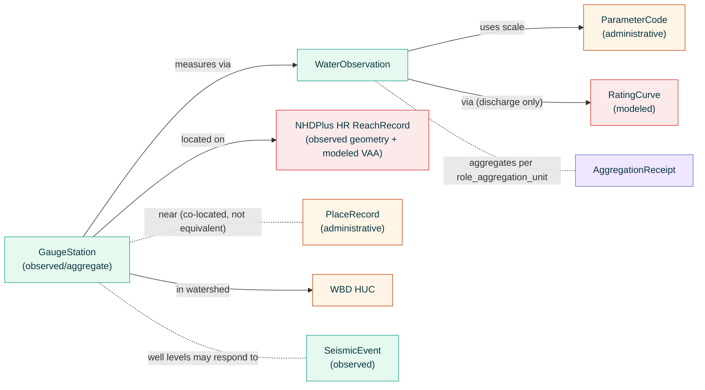

<!-- [KFM_META_BLOCK_V2]
doc_id: kfm://doc/docs-sources-catalog-usgs-nwis-water
title: USGS Water Data APIs
type: product-page
version: v0.2
status: draft
owners: <PLACEHOLDER — Docs steward + Source steward for usgs>
created: 2026-05-20
updated: 2026-05-23
policy_label: public
related:
  - docs/sources/catalog/usgs.md
  - docs/sources/catalog/usgs/README.md
  - docs/sources/catalog/usgs/IDENTITY.md
  - docs/sources/catalog/usgs/RIGHTS-AND-SENSITIVITY-MAP.md
  - docs/sources/catalog/usgs/usgs-3dep-elevation.md
  - docs/sources/catalog/usgs/usgs-earthquake-catalog.md
  - docs/sources/catalog/usgs/usgs-gnis-names.md
  - docs/sources/catalog/usgs/usgs-nhdplus-hr.md
  - docs/sources/catalog/usgs/usgs-nlcd.md
  - docs/sources/catalog/README.md
  - docs/doctrine/directory-rules.md
  - docs/doctrine/lifecycle-law.md
  - docs/doctrine/trust-membrane.md
  - docs/standards/SENSITIVITY_RUBRIC.md
  - docs/standards/STAC.md
  - docs/standards/DCAT.md
  - docs/runbooks/hydrology/SOURCE_REFRESH_RUNBOOK.md
  - data/registry/sources/usgs/
  - policy/sources/usgs/
  - policy/sensitivity/hydrology/
  - policy/sensitivity/infrastructure/
  - schemas/contracts/v1/source/
  - schemas/contracts/v1/hydrology/
  - connectors/usgs/
adr_refs:
  - ADR-0001 (schema home)
  - <PROPOSED> ADR-S-04 (source-role vocabulary v1)
  - <PROPOSED> ADR-S-05 (sensitivity tier scheme T0–T4)
  - <PROPOSED> ADR-S-12 (connector cadence + quarantine recovery)
  - <PROPOSED> ADR-S-14 (cross-lane join policy)
  - <PROPOSED> ADR-S-?? (legacy API migration — waterservices.usgs.gov → api.waterdata.usgs.gov cutover playbook + dual-endpoint window)
  - <PROPOSED> ADR-S-?? (provisional-vs-approved data lifecycle — when KFM derivatives may cite provisional readings vs require approved-only)
tags: [kfm, docs, sources, catalog, usgs, water-data, nwis, waterservices, gauges, streamflow, hydrology, hazards, real-time, time-series, observed, aggregate]
notes:
  - "PROPOSED product-page scaffold filled to v0.2; sixth product page in the usgs family folder."
  - "Filename inferred from doc_id slug: usgs-nwis-water.md. Family catalog (docs/sources/catalog/usgs.md §5) uses the short ID 'usgs-water-data'. Reconciliation flagged in Q-2."
  - "Heterogeneous source-role: instantaneous and peak readings = observed; daily values, annual statistics, and other summaries = aggregate per Atlas §24.1.1. Site metadata = administrative."
  - "Real-time stream + historical archive — second product in the family with this bimodal cadence pattern (after usgs-earthquake-catalog). The real-time stream drives §7 staleness discipline and §13 watcher design."
  - "API migration is the dominant operational concern: legacy waterservices.usgs.gov (NWIS) → modern api.waterdata.usgs.gov, with legacy phase-out across 2026/2027 per the v1.1 family-catalog migration note. This page treats the modern endpoint as canonical and preserves the legacy endpoint with cutover discipline (Q-1, Q-3)."
  - "Provisional vs approved data lifecycle: USGS publishes real-time readings as provisional and revises to approved after QC. Provisional values are observable; approved values are the authoritative-of-record. Analogous to earthquake-catalog event update versioning but driven by USGS QC rather than scientific refinement."
  - "Engineering-claim disclaimer applies — USGS Water Data is scientific/informational; operational systems for flood warning, dam operation, water-rights enforcement use the controlling authority's own monitoring (NWS AHPS for floods; USACE for dams; state water-rights agencies for compliance)."
[/KFM_META_BLOCK_V2] -->

<a id="top"></a>

# USGS Water Data APIs

> The U.S. national authoritative stream and groundwater monitoring network — real-time gauge readings (instantaneous values, IV), aggregated daily values (DV), annual statistics, and peak-flow records — plus the site / station metadata that anchors every observation. Carrier for the **modern `api.waterdata.usgs.gov`** API and the **legacy `waterservices.usgs.gov`** (NWIS) endpoints during the 2026/2027 phase-out window. KFM's primary observed-hydrology source for the Hydrology and Hazards lanes.

<!-- Top-of-file badge row. Placeholder targets — replace once badge generator (KFM-P3-FEAT-0005) is wired. -->


**Status:** `PROPOSED — scaffold filled` &nbsp;·&nbsp; **Doc version:** `v0.2` &nbsp;·&nbsp; **Family:** [`usgs`](./README.md) &nbsp;·&nbsp; **Last reviewed:** 2026-05-23

> [!IMPORTANT]
> **This page is a pointer.** Authoritative descriptor fields live in [`data/registry/sources/usgs/`](../../../../data/registry/sources/usgs/). Rights, sensitivity, infrastructure-overlay policy, and provisional-vs-approved data-lifecycle rules live in [`policy/sources/usgs/`](../../../../policy/sources/usgs/), [`policy/sensitivity/hydrology/`](../../../../policy/sensitivity/hydrology/), and [`policy/sensitivity/infrastructure/`](../../../../policy/sensitivity/infrastructure/), summarized at the family level in [`RIGHTS-AND-SENSITIVITY-MAP.md`](./RIGHTS-AND-SENSITIVITY-MAP.md). **Do not duplicate descriptor or policy content on this product page.**

> [!CAUTION]
> **Provisional readings are not approved values.** USGS publishes real-time IV data as **provisional** (subject to revision); the authoritative-of-record values come later as **approved** after USGS QC. Per Atlas §24.1.2 anti-collapse, a KFM derivative that cites a provisional reading as if it were the approved value violates the role-preservation rule. The two are both `observed` source-role, but the **approval status** is a binding metadata field that travels with every value. See [§7.2](#72-provisional-vs-approved-data-lifecycle) and [§6](#6-provenance-fields).

> [!CAUTION]
> **Daily values and annual statistics are aggregates, not observations.** A "daily mean discharge" is computed from up to 96 instantaneous readings (15-minute intervals); an "annual peak flow" is a derived statistic. Per Atlas §24.1.2 *"Aggregate cited as per-place truth"* DENY condition, KFM derivatives must not cite a daily mean as if it were an observation at a specific time. The `source_role` is `aggregate` with an `AggregationReceipt` carrying `role_aggregation_unit`. See [§2.1](#21-sub-product-source-role-decomposition).

---

## 📑 Contents

1. [Overview](#1-overview)
2. [Product identity within the family](#2-product-identity-within-the-family)
3. [Source authority and API migration](#3-source-authority-and-api-migration)
4. [Catalog profiles used](#4-catalog-profiles-used)
5. [Collection identity](#5-collection-identity)
6. [Provenance fields](#6-provenance-fields)
7. [Temporal handling, real-time cadence, and provisional-vs-approved](#7-temporal-handling-real-time-cadence-and-provisional-vs-approved)
8. [Identity, geometry, and parameter codes](#8-identity-geometry-and-parameter-codes)
9. [Rights and sensitivity (pointer)](#9-rights-and-sensitivity-pointer)
10. [Reality boundary](#10-reality-boundary)
11. [Validation and catalog closure](#11-validation-and-catalog-closure)
12. [Related contracts and schemas](#12-related-contracts-and-schemas)
13. [Related connectors and pipelines](#13-related-connectors-and-pipelines)
14. [Example](#14-example)
15. [Open questions](#15-open-questions)
16. [Last reviewed](#16-last-reviewed)

---

## 1. Overview

This product page describes how KFM catalogs the **USGS Water Data APIs** — the U.S. national real-time and historical streamflow + groundwater + water-quality monitoring program. The data are organized around **monitoring sites** (each with a stable USGS site ID, location, datum, and program metadata) and the **time series of readings** at each site for various **parameter codes** (e.g., `00060` discharge, `00065` gage height, `00010` water temperature, `00045` precipitation, `72019` groundwater level). KFM ingests:

1. **Site metadata** — site IDs, locations, datums, monitoring programs, active/inactive status (`administrative`).
2. **Instantaneous Values (IV)** — real-time readings, typically at 15-minute intervals (`observed`).
3. **Peak Flows** — annual maximum flow records, often with rating-curve uncertainty (`observed`, with explicit uncertainty).
4. **Daily Values (DV)** — daily aggregates of IV data (mean, max, min) (`aggregate`).
5. **Annual statistics** — annual aggregates of DV data (`aggregate`).
6. **Water-quality records** where ingested (`observed`, with method metadata).

> [!NOTE]
> **EXTERNAL** *(preserved without re-verification this session).* The v1.1 family-catalog entry's migration note records that the **modern USGS Water Data APIs at `api.waterdata.usgs.gov` are replacing the legacy `waterservices.usgs.gov` (NWIS) endpoints, with the legacy surface in phase-out across 2026/2027**. KFM ingests from both surfaces as read-only probes (per `KFM-P22-PROG-0043`) during the dual-endpoint window. Current endpoint URLs, parameter-code enumerations, rate-limit terms, and the precise phase-out timeline remain **NEEDS VERIFICATION** until re-fetched in a session with web access.

> [!IMPORTANT]
> **API migration is the dominant operational concern for this product.** Unlike all other USGS family products (3DEP, Earthquakes, GNIS, NHDPlus HR, NLCD), this product is mid-cutover from one API surface to a structurally different one. KFM's descriptor pins the **modern endpoint as canonical** and preserves the **legacy endpoint** with explicit phase-out tracking. See [§3](#3-source-authority-and-api-migration) and the cutover playbook reference in Q-1.

```mermaid
flowchart LR
  subgraph PHYS["Physical reality"]
    WATER["Stream / groundwater /<br/>precipitation / water-quality<br/>(physical phenomena)"]
  end

  subgraph USGS_FIELD["USGS field instrumentation"]
    SENSOR["Gauges + sensors<br/>(stage · discharge · temperature · …)"]
    SITE_REG["USGS site registry<br/>(site_id · location · datum · program)"]
    QC["USGS QC review<br/>(provisional → approved)"]
  end

  subgraph USGS_API["USGS Water Data APIs (external)"]
    LEGACY["Legacy NWIS<br/>waterservices.usgs.gov<br/>(phase-out 2026/2027)"]
    MODERN["Modern API<br/>api.waterdata.usgs.gov<br/>(canonical)"]
    IV["IV — Instantaneous Values<br/>(~15-min · observed)"]
    DV["DV — Daily Values<br/>(daily aggregate)"]
    PEAK["Peak Flows<br/>(annual max · observed)"]
    ANN["Annual Statistics<br/>(annual aggregate)"]
    SITE["Site metadata<br/>(administrative)"]
  end

  subgraph KFM["KFM ingest & catalog"]
    CONN_RT["connectors/usgs/water_data_pull/realtime/<br/>(IV watcher · provisional)"]
    CONN_DV["connectors/usgs/water_data_pull/daily/"]
    CONN_PEAK["connectors/usgs/water_data_pull/peak/"]
    CONN_ANN["connectors/usgs/water_data_pull/annual/"]
    CONN_SITE["connectors/usgs/water_data_pull/sites/"]
    PIPE["pipelines/{ingest,normalize,validate,catalog}/"]
    DCAT["data/catalog/dcat/<br/>(primary — time-series datasets)"]
    STAC["data/catalog/stac/<br/>(secondary — point items for sites)"]
    PROV["data/catalog/prov/<br/>(approval-status revisions)"]
    DOM_HYDRO["data/catalog/domain/hydrology/"]
    DOM_HAZ["data/catalog/domain/hazards/"]
    POL["policy/sensitivity/hydrology/<br/>policy/sensitivity/infrastructure/"]
  end

  subgraph PUB["Release"]
    EVD["EvidenceBundle"]
    GS["GaugeStation"]
    WO["WaterObservation<br/>(per site_id · parameter_code · timestamp)"]
  end

  WATER -. measured by .- SENSOR
  SENSOR --> QC
  SITE_REG -. typed .-> SENSOR
  QC --> IV
  IV --> DV
  DV --> ANN
  SENSOR --> PEAK
  SITE_REG --> SITE
  IV -. served via .- LEGACY
  IV -. served via .- MODERN
  DV -. served via .- LEGACY
  DV -. served via .- MODERN
  PEAK -. served via .- LEGACY
  PEAK -. served via .- MODERN
  ANN -. served via .- LEGACY
  ANN -. served via .- MODERN
  SITE -. served via .- LEGACY
  SITE -. served via .- MODERN

  MODERN -->|read-only probe canonical| CONN_RT
  MODERN -->|read-only probe canonical| CONN_DV
  MODERN -->|read-only probe canonical| CONN_PEAK
  MODERN -->|read-only probe canonical| CONN_ANN
  MODERN -->|read-only probe canonical| CONN_SITE
  LEGACY -.->|read-only probe fallback / parity| CONN_RT
  LEGACY -.->|read-only probe fallback / parity| CONN_DV
  POL -. governs .-> PIPE
  CONN_RT --> PIPE
  CONN_DV --> PIPE
  CONN_PEAK --> PIPE
  CONN_ANN --> PIPE
  CONN_SITE --> PIPE
  PIPE --> DCAT
  PIPE --> STAC
  PIPE --> PROV
  PIPE --> DOM_HYDRO
  PIPE --> DOM_HAZ
  PIPE --> GS
  PIPE --> WO
  GS --> EVD
  WO --> EVD

  classDef phys fill:#fdf6e3,stroke:#b58900,color:#073642;
  classDef field fill:#e6f9ee,stroke:#2aa198,color:#073642;
  classDef qc fill:#fff5e6,stroke:#cb4b16,color:#073642;
  classDef legacy fill:#fceaea,stroke:#dc322f,color:#073642;
  classDef modern fill:#eef9ff,stroke:#268bd2,color:#073642;
  classDef obs fill:#e6f9ee,stroke:#2aa198,color:#073642;
  classDef agg fill:#f0e6ff,stroke:#6c71c4,color:#073642;
  classDef admin fill:#fff5e6,stroke:#cb4b16,color:#073642;
  classDef kfm fill:#eef9ff,stroke:#268bd2,color:#073642;
  classDef pol fill:#fff5e6,stroke:#cb4b16,color:#073642;
  classDef rel fill:#f5ecf9,stroke:#6c71c4,color:#073642;
  class WATER phys;
  class SENSOR,SITE_REG field;
  class QC qc;
  class LEGACY legacy;
  class MODERN modern;
  class IV,PEAK obs;
  class DV,ANN agg;
  class SITE admin;
  class CONN_RT,CONN_DV,CONN_PEAK,CONN_ANN,CONN_SITE,PIPE,DCAT,STAC,PROV,DOM_HYDRO,DOM_HAZ kfm;
  class POL pol;
  class EVD,GS,WO rel;
```



[Back to top](#top)

---

## 2. Product identity within the family

> [!NOTE]
> This page is the **sixth** product authored under the `usgs` source family — joining the heterogeneous-role [`usgs-3dep-elevation.md`](./usgs-3dep-elevation.md), real-time + historical [`usgs-earthquake-catalog.md`](./usgs-earthquake-catalog.md), administrative [`usgs-gnis-names.md`](./usgs-gnis-names.md), observed-geometry + modeled-VAA [`usgs-nhdplus-hr.md`](./usgs-nhdplus-hr.md), and pure-modeled [`usgs-nlcd.md`](./usgs-nlcd.md). USGS Water Data is the second bimodal-cadence product (real-time + historical, like Earthquakes) and the **only** product page in the family driven by an in-flight upstream API migration.

| Attribute | Value | Status |
|---|---|---|
| Product name | USGS Water Data APIs (modern); legacy NWIS / WaterServices (phase-out 2026/2027) | **CONFIRMED EXTERNAL** (USGS program name; v1.1 family-catalog migration note). |
| Source family | `usgs` | **CONFIRMED** family-folder convention. |
| KFM source-role | **Heterogeneous** — see [§2.1](#21-sub-product-source-role-decomposition) | **CONFIRMED enum** per Atlas §24.1.1 + family-catalog §5 row `usgs-water-data` (`observed` + `aggregate`). |
| Domains served | **Hydrology** (primary); **Hazards** (flood-context — per family-catalog §5 row and §13 cross-domain feed map) | **CONFIRMED**. |
| Primary upstream surfaces | **Modern**: `https://api.waterdata.usgs.gov/` (canonical) · **Legacy**: `https://waterservices.usgs.gov/` (phase-out 2026/2027) | **EXTERNAL — NEEDS VERIFICATION** of current rate-limit terms + precise cutover schedule. |
| Cardinal evidence objects | **`GaugeStation`** (PROPOSED) keyed by USGS site_id; **`WaterObservation`** (PROPOSED) keyed by `(site_id, parameter_code, timestamp, approval_status)` | **PROPOSED** — new object classes. |
| Geometry | **Point** per site (gauge / well / sensor location); per-observation geometry inherits the site | **CONFIRMED**. |
| Cadence | **Real-time** (IV stream, configured polling) + **historical** (DV archive, annual statistics, peak flows) — bimodal like earthquakes | **CONFIRMED-bimodal**. |
| Geographic scope | U.S. domestic (USGS site network) + some U.S. territories. KFM AOI = Kansas extent + buffer + upstream Oklahoma/Nebraska sites that affect Kansas hydrology | **PROPOSED**. |

### 2.1 Sub-product source-role decomposition

Per Atlas §24.1.1 enum and the v1.1 family-catalog entry §5 row `usgs-water-data` (*"`observed` (gauges, sensor readings); `aggregate` (daily values, summaries)"*):

| Sub-product | `source_role` | Rationale | Anti-collapse risk |
|---|---|---|---|
| **Site metadata** (USGS site ID, location, datum, program affiliation, active/inactive) | **`administrative`** | The federal record that this gauge exists at this location with this monitoring program. Citing the record is not the same as observing the water. | Citing a site record as evidence of *current* water condition. |
| **Instantaneous Values (IV)** — provisional | **`observed`** with `approval_status: provisional` | Sensor reading at the gauge at a specific instant; not yet USGS-QC-reviewed. | Citing as authoritative-of-record. See [§7.2](#72-provisional-vs-approved-data-lifecycle). |
| **Instantaneous Values (IV)** — approved | **`observed`** with `approval_status: approved` | Same sensor reading after USGS QC review; the authoritative-of-record value. | None at the role level; *role* is preserved. |
| **Peak Flows** (annual maximum flow records) | **`observed`** (with rating-curve uncertainty) | A measured peak event derived from the IV stream (highest 15-min reading during the year). USGS publishes with explicit uncertainty bounds for the rating curve used to convert stage to discharge. | Citing without the rating-curve uncertainty bound. |
| **Daily Values (DV)** — daily mean discharge, daily max, daily min | **`aggregate`** with `role_aggregation_unit: 1d` | Per-day aggregate (mean / max / min) of up to 96 instantaneous readings. Not an observation at any specific instant. | Per family-catalog §6 anti-collapse table — *"Daily-value / annual-summary water data"* is the canonical *"Aggregate cited as per-place truth"* risk. DENY a join from daily-aggregate cell to a single-record claim. |
| **Annual Statistics** — annual mean, annual max, annual exceedance | **`aggregate`** with `role_aggregation_unit: 1yr` | Per-year aggregate of DV. | Same as DV, at a coarser unit. |
| **Water-quality records** (where ingested — chemistry, dissolved oxygen, turbidity, etc.) | **`observed`** with method metadata | Discrete or continuous water-quality measurements. Each method has its own detection limit + uncertainty. | Citing without method + detection-limit context. |
| **Rating-curve metadata** (the stage → discharge transfer function for a site) | **`modeled`** | The rating curve is a calibrated model relating stage to discharge; it is updated as USGS performs new discharge measurements. | Citing a discharge value without acknowledging the rating-curve vintage. |

> [!CAUTION]
> **Anti-collapse here lives on two axes simultaneously**: (1) **role** — observed vs aggregate vs administrative vs modeled (rating curves); and (2) **lifecycle** — provisional vs approved (within `observed`). Per Atlas §24.1.2, *both* axes must be preserved through every transform. Flattening either axis at the trust membrane is a Gate-F deny.

### 2.2 Disambiguation from siblings

| If you want… | Use… | Not this page |
|---|---|---|
| **Modeled mean annual flow** (estimated at every reach, including ungauged) | [`usgs-nhdplus-hr.md`](./usgs-nhdplus-hr.md) VAA `QA_MA` (`modeled`) | — |
| **Hydrography geometry** (the stream network itself, not gauge readings) | [`usgs-nhdplus-hr.md`](./usgs-nhdplus-hr.md) | — |
| **Watershed boundaries** | `<PROPOSED> docs/sources/catalog/usgs/usgs-wbd.md` | — |
| **Operational flood forecasts** (forecast hydrographs) | `<PROPOSED> docs/sources/catalog/noaa/nws-ahps.md` — NWS Advanced Hydrologic Prediction Service, **not** USGS | USGS Water Data feeds NWS forecasts but is not itself a forecast product. |
| **Regulatory flood-zone designations** | `<PROPOSED> docs/sources/catalog/fema/nfhl.md` — FEMA NFHL, **not** USGS | — |
| **Water-rights compliance** for a Kansas user | `<PROPOSED> docs/sources/catalog/kdwr/water-rights.md` — Kansas Division of Water Resources, **not** USGS | USGS measures flow; KDWR adjudicates rights. |
| **Dam-operation real-time data** for USACE / federal-project dams | `<PROPOSED> docs/sources/catalog/usace/cwms.md` — USACE Corps Water Management System | USGS does NOT operate dams. |
| **Earthquake-induced water level changes** in wells | This page **and** [`usgs-earthquake-catalog.md`](./usgs-earthquake-catalog.md), cross-referenced by `event_id` and `site_id` co-location | — |
| **Stream gauge metadata + named-place context** | This page (`GaugeStation`) cross-joined to [`usgs-gnis-names.md`](./usgs-gnis-names.md) for the GNIS-named feature the gauge measures | — |

> [!CAUTION]
> **USGS Water Data is not operational warning infrastructure.** Per the engineering-disclaimer cascade (3DEP §9.3 → NHDPlus HR §9.1 → NLCD §9.1 → this page §9.1), KFM derivatives that present USGS Water Data for operational flood warning, dam operation, or water-rights enforcement substitute scientific data for the controlling regulatory carrier. NWS AHPS issues flood forecasts; USACE operates dams; state agencies adjudicate water rights. USGS measures; others act.

[Back to top](#top)

---

## 3. Source authority and API migration

See [`data/registry/sources/usgs/`](../../../../data/registry/sources/usgs/) for the authoritative `SourceDescriptor`. **Do not duplicate descriptor fields here.** Descriptor canonical schema home is `schemas/contracts/v1/source/source-descriptor.json` per Directory Rules §7.4 / ADR-0001 — **NEEDS VERIFICATION**.

### 3.1 Doctrinal anchors

- Family-catalog entry [`docs/sources/catalog/usgs.md`](../usgs.md) §5 row `usgs-water-data` — *"successor to legacy WaterServices/NWIS"*; roles `observed` (gauges, sensor readings) + `aggregate` (daily values, summaries); domains Hydrology + Hazards (context).
- Family-catalog §6 anti-collapse table — daily-value / annual-summary water data named explicitly as the canonical *"Aggregate cited as per-place truth"* risk for the family.
- Family-catalog §6 federal-vs-regulatory warning — USGS Water Data is **not** regulatory; flood-zone authority is FEMA NFHL.
- Family-catalog §11 FAQ — *"Can a USGS Water Data gauge reading be published without further review? ... the data being open does not waive the trust-membrane gates."*
- Family-catalog `usgs.md` migration note — *"modern USGS Water Data APIs at `api.waterdata.usgs.gov` are replacing the legacy `waterservices.usgs.gov` (NWIS) endpoints, with the legacy surface in phase-out across 2026/2027."*
- Atlas Hydrology §D source-family table — USGS Water Data APIs / WaterServices.
- Atlas §24.1.2 anti-collapse register — *"Aggregate cited as per-place truth"* DENY condition.
- `KFM-P22-PROG-0043` — Read-only probe posture.
- `KFM-P1-IDEA-0051` — Knowledge-character labels (`observed` and `aggregate` both apply).
- `KFM-P14-IDEA-0002` — STAC/DCAT/PROV distribution contract.
- `KFM-P26-PROG-0025` — Catalog writers emit DCAT/STAC/PROV with EvidenceBundle references.

### 3.2 API migration cutover discipline

> [!IMPORTANT]
> **The migration is real, scheduled, and in-flight.** KFM treats this as a multi-stage operational concern, not a documentation flourish.
>
> | Stage | KFM posture |
> |---|---|
> | **Pre-cutover** *(now → 2026)* | Modern endpoint canonical; legacy endpoint as parity-check fallback. Both endpoints emit pre-RAW `EventEnvelope`s with explicit `endpoint_used` provenance. |
> | **Dual-window** *(2026–2027)* | Modern endpoint canonical; legacy endpoint deprecated but reachable. KFM connector emits a deprecation-tracking receipt on every legacy probe. |
> | **Post-legacy** *(after USGS retires legacy)* | Modern endpoint sole carrier; legacy fetches fail and quarantine per ADR-S-12 cadence-and-quarantine recovery. |
>
> Each stage has its own validators (see [§11](#11-validation-and-catalog-closure)). The cutover playbook is a per-stage operational document referenced from `<PROPOSED> docs/runbooks/hydrology/SOURCE_REFRESH_RUNBOOK.md` and tracked by ADR-S-?? (API migration cutover).

> [!TIP]
> **Endpoint-equivalence parity checks are gate-blocking during the dual-window stage.** When the same site_id + parameter_code + time window returns materially different values from the modern and legacy endpoints, KFM emits an `endpoint_parity_drift` `EventEnvelope` and quarantines pending steward review. This is the operational analog of the species-profiles "license-map advisory flag preservation" pattern — preserve evidence of the disagreement rather than silently picking one.

[Back to top](#top)

---

## 4. Catalog profiles used

| Profile | Lane | Used by this product? | Basis |
|---|---|---|---|
| **DCAT** Dataset + Distribution (**primary for time series**) | `data/catalog/dcat/` | **PROPOSED — Yes (primary for IV/DV/Annual/Peak time-series)** | `C4-05`; `KFM-P14-IDEA-0002`. Time-series records keyed by `(site_id, parameter_code, timestamp)` are tabular and DCAT-shaped. |
| **STAC** Item + Collection with `kfm:provenance` (**primary for sites, secondary for time-series**) | `data/catalog/stac/` | **PROPOSED — Yes (primary for `GaugeStation` point items)** | Each site has stable point geometry; STAC participates so spatial-bbox queries work. Similar disposition to GNIS sibling. `C4-01` / `C4-02`. |
| **STAC Projection extension** | (STAC properties) | **PROPOSED — Yes** | `proj:code: EPSG:4326` typical; per `KFM-P27-FEAT-0003`. |
| **PROV-O / PAV** lineage (**critical for provisional → approved revisions**) | `data/catalog/prov/` | **PROPOSED — Yes** | `C8-03`. PROV chain MUST capture: (a) provisional → approved revisions via `prov:wasRevisionOf`; (b) IV → DV → Annual aggregation chains via `prov:wasDerivedFrom`; (c) rating-curve vintage applied to each discharge value as `prov:wasInformedBy`. |
| **Domain projection — Hydrology** | `data/catalog/domain/hydrology/` | **PROPOSED — Yes (primary domain)** | Atlas Hydrology §D + family-catalog §5 row. |
| **Domain projection — Hazards** | `data/catalog/domain/hazards/` | **PROPOSED — Yes (flood context)** | Family-catalog §5 row; §13 cross-domain feed map. |
| **WaterML 2.0 / OGC water-data preservation** in `raw/` | (internal RAW retention) | **PROPOSED — Yes** | Modern API serves multiple formats; KFM preserves WaterML-2 (or current upstream canonical) in `raw/` and normalizes per-observation to JSON-LD evidence-bundle shape. |
| **STAC × Darwin Core hybrid** (`C4-03`) | — | **CONFIRMED No** | Not biological occurrence. |

> [!TIP]
> **DCAT-primary for time-series, STAC-primary for sites — split by sub-product.** The time-series IV/DV/Annual records are not point-geometry items (their geometry inherits the site); a STAC Item per IV reading would be inefficient. The DCAT pattern fits time-series naturally. Sites *are* point items and warrant STAC participation.

[Back to top](#top)

---

## 5. Collection identity

- **PROPOSED Collection id patterns:**
  - Sites (STAC point items) → `kfm-usgs-water-data-sites`
  - IV time-series (DCAT) → `kfm-usgs-water-data-iv-<parameter_code>` (e.g., `kfm-usgs-water-data-iv-00060` for discharge)
  - DV (DCAT) → `kfm-usgs-water-data-dv-<parameter_code>`
  - Annual statistics (DCAT) → `kfm-usgs-water-data-annual-<parameter_code>`
  - Peak flows (DCAT) → `kfm-usgs-water-data-peak`
  - Water-quality records (DCAT, where ingested) → `kfm-usgs-water-data-quality-<parameter_code>`
- **PROPOSED Item id patterns:**
  - Site: `kfm-usgs-water-data-sites-<site_id>` (stable)
  - Observation snapshot: `kfm-usgs-water-data-iv-<site_id>-<parameter_code>-<timestamp>-<approval_status>` (approval status differentiates provisional vs approved snapshots of the same reading)
  - Daily-value snapshot: `kfm-usgs-water-data-dv-<site_id>-<parameter_code>-<yyyy-mm-dd>`
  - Annual: `kfm-usgs-water-data-annual-<site_id>-<parameter_code>-<year>`
- **PROPOSED namespace:** `kfm:` *(see family-catalog Q-10).*
- **Asset roles:** **NEEDS VERIFICATION** — confirm against [`schemas/contracts/v1/source/`](../../../../schemas/contracts/v1/source/). Likely role set:
  - `site-record` — JSON canonical site
  - `observation-record` — JSON canonical observation
  - `time-series-segment` — JSON / Parquet time-series chunk
  - `rating-curve-ref` — link to applicable rating-curve vintage metadata (for discharge values)
  - `waterml-source` — WaterML 2.0 preserved for fidelity
  - `aggregation-receipt` — JSON AggregationReceipt for DV / Annual records per `role_aggregation_unit`
  - `parameter-code-table` — JSON USGS parameter-code controlled vocabulary
  - `endpoint-parity-check` — JSON evidence of modern-vs-legacy parity during the dual-window stage
  - `evidence_bundle` — JSON-LD (`application/ld+json`)
- **Collection description (PROPOSED):** Must declare the **per-sub-product source-role**, the **provisional → approved data lifecycle**, the **modern/legacy endpoint pair with phase-out window**, the **engineering-disclaimer posture** from [§9.1](#91-t0-default-with-engineering-disclaimer), the **USGS no-warranty banner** verbatim, and the **anti-collapse statement** from [§2.1](#21-sub-product-source-role-decomposition).

[Back to top](#top)

---

## 6. Provenance fields

**CONFIRMED shape** (per `C4-01`). Per-product values are **NEEDS VERIFICATION** until the connector is wired.

| Field | Type | Source / how computed |
|---|---|---|
| `spec_hash` | sha256 of canonical record | `C1-02`. |
| `evidence_bundle_ref` | `kfm://evidence/<digest>` | `C4-04`. |
| `run_record_ref` | `kfm://run/<run-id>` | `C1-01`. |
| `audit_ref` | `kfm://audit/<attestation-id>` | SLSA / OPA. |
| `policy_digest` | sha256 of policy bundle | `KFM-P22-PROG-0001`. |
| **Site-record fields** | | |
| `usgs_site_id` | String (USGS site identifier — typically 8-digit numeric for surface water, 15-digit for groundwater) | **CONFIRMED-required**. Stable identifier. |
| `site_type` | Enum (`stream`, `well`, `lake`, `estuary`, `spring`, `precip`, …) | **CONFIRMED-required** — EXTERNAL USGS controlled vocabulary. |
| `site_status` | Enum (`active`, `inactive`, `discontinued`) | **CONFIRMED-required**. |
| `monitoring_programs` | Array of program codes (e.g., NWIS, NSIP, …) | **PROPOSED-required**. |
| **Observation-record fields** | | |
| `parameter_code` | String (USGS 5-digit parameter code) | **CONFIRMED-required** — USGS controlled vocabulary (e.g., `00060` discharge, `00065` gage height, `00010` water temperature). Full enum **NEEDS VERIFICATION**. |
| `parameter_unit` | String (canonical unit per parameter code) | **CONFIRMED-required** per `ML-061-022` units check. |
| `observation_timestamp` | ISO-8601 timestamp with explicit timezone (typically site-local with UTC offset) | **CONFIRMED-required**. |
| `observation_value` | Numeric | **CONFIRMED-required**. |
| `approval_status` | Enum (`provisional`, `approved`, `revised`, `working`) | **CONFIRMED-required**. Drives [§7.2](#72-provisional-vs-approved-data-lifecycle) lifecycle discipline. |
| `quality_code` | String (USGS quality code; e.g., `A` approved, `P` provisional, `e` estimated, `<` below detection) | **CONFIRMED-required** — USGS controlled vocabulary. |
| `revision_n` | Monotonic integer for this `(site_id, parameter_code, timestamp)` tuple in KFM's snapshot store | **CONFIRMED-required**. |
| `prior_snapshot_ref` | `kfm://release/...` or null | `prov:wasRevisionOf` target. Required when `revision_n > 0`. |
| `rating_curve_ref` | Structured (model name + vintage + applicable_range) — for discharge values | **CONFIRMED-required** when `parameter_code: 00060` (discharge). |
| **Aggregate-record fields** (DV, Annual, …) | | |
| `aggregation_unit` | Enum (`15min`, `1h`, `1d`, `1mo`, `1yr`, …) | **CONFIRMED-required** for aggregate records per Atlas §24.1.2. |
| `aggregation_function` | Enum (`mean`, `max`, `min`, `sum`, `percentile_50`, …) | **CONFIRMED-required**. |
| `aggregation_receipt_ref` | `kfm://...` to the AggregationReceipt | **CONFIRMED-required** for aggregate records. |
| `contributing_observation_count` | Integer (e.g., 96 for a complete daily mean from 15-min IV) | **PROPOSED-required**. |
| **Endpoint provenance** | | |
| `endpoint_used` | Enum (`modern`, `legacy`) | **CONFIRMED-required** during the dual-window stage per [§3.2](#32-api-migration-cutover-discipline). |
| `endpoint_parity_check_ref` | `kfm://...` or null — link to parity-check evidence | **PROPOSED-required** when both endpoints have been probed for the same record. |
| `kfm:provenance.reality_boundary_ref` | `kfm://realityboundary/...` | Per [§10](#10-reality-boundary). |
| `kfm:provenance.engineering_disclaimer_ref` | `kfm://disclaimer/usgs-water-data-not-operational` | Per [§9.1](#91-t0-default-with-engineering-disclaimer). |

Per-asset integrity: **`file:checksum`** (SHA-256) on every published distribution (per `C3-02`).

> [!TIP]
> **`approval_status` + `revision_n` + `prior_snapshot_ref` implement append-only revision tracking** analogous to the earthquake-catalog `event_update_n` pattern, but driven by USGS QC review (provisional → approved → revised) rather than scientific event refinement.

> [!TIP]
> **`rating_curve_ref` is gate-blocking for every discharge value** (parameter code `00060`). The rating curve is itself `modeled` (see [§2.1](#21-sub-product-source-role-decomposition)); preserving the vintage that was applied is what keeps a stage-to-discharge value's lineage intact when the rating curve later changes.

[Back to top](#top)

---

## 7. Temporal handling, real-time cadence, and provisional-vs-approved

### 7.1 Times

| Time | Meaning for this product | Status |
|---|---|---|
| `observation_timestamp` | When the sensor reading was taken (or the aggregate covers) — site-local with UTC offset typical | **CONFIRMED-required**. |
| `usgs_publish_time` | When USGS first emitted the record on the API | **CONFIRMED-required**. |
| `usgs_qc_time` | When USGS last revised the record's `approval_status` or `quality_code` | **CONFIRMED-required**. |
| `valid_from` | When this KFM snapshot became the authoritative version for that `(site_id, parameter_code, timestamp)` tuple in KFM. | **CONFIRMED-required**. |
| `valid_to` | When superseded by a later KFM snapshot (e.g., provisional → approved revision); `null` while current | **CONFIRMED-required** (nullable). |
| `retrieval_time` | When KFM's connector fetched the record | **CONFIRMED-required**. |
| `release_time` | When the KFM-derived item was published | **CONFIRMED-required** at Gate G. |
| `correction_time` | When KFM issues a `CorrectionNotice` distinct from a routine provisional → approved revision (e.g., a KFM normalization-bug correction) | **CONFIRMED-required** when applicable. |

> [!IMPORTANT]
> **Real-time cadence imposes the same staleness gating as earthquakes.** Per Atlas §24.8 cadence-aware AOI policy and the earthquake-catalog page §7 staleness discipline: the IV stream watcher must have polled within the configured window; otherwise downstream *"current flow"* surfaces carry a `stale_marker` and may be release-blocking for any *"now"* claim. The watcher polling interval is configured per KFM's tolerance for real-time delay; USGS publishes new IV records typically every 15 minutes per active site.

### 7.2 Provisional-vs-approved data lifecycle

> [!CAUTION]
> **Provisional readings are publishable but not authoritative.** USGS publishes IV data as **provisional** immediately; USGS QC review then promotes provisional → approved (or `revised` if revised, or `working` if under review). KFM:
>
> - **Stores both** the provisional and the later approved snapshot as separate immutable records via `revision_n` + `prior_snapshot_ref`.
> - **Tags** every record with `approval_status` so downstream consumers know which they are reading.
> - **Defaults** Focus-Mode AI to citing **approved** values for any historical claim; provisional may be cited only with an explicit *"provisional, subject to revision"* disclaimer.
> - **Allows** real-time UI surfaces to show provisional values (real-time has no other option) but with persistent provisional banner.
> - **Never** silently overwrites a provisional with its approved successor.

> [!IMPORTANT]
> **Approval-status revisions are PROV-O `prov:wasRevisionOf` chains, not silent overwrites.** Per `C8-03` and the earthquake-catalog page's append-only pattern, every approval_status transition emits a new KFM snapshot with `revision_n += 1` and a PROV link to the prior. Prior snapshots are preserved with `valid_to` set, not deleted.

### 7.3 Real-time vs historical cadence

| Mode | Watcher target | Cadence | What it produces | Default `approval_status` |
|---|---|---|---|---|
| **Real-time (IV)** | Modern API IV endpoint | Configured (15-60 min) | New IV readings + provisional → approved revisions | `provisional` → `approved` |
| **Daily Values (DV)** | Modern API DV endpoint | Daily | New DV records (often approved at publication after USGS QC) | Typically `approved` |
| **Peak Flows** | Modern API peak endpoint | Annual + on-demand | Annual peak records | `approved` |
| **Annual Statistics** | Modern API annual-stats endpoint | Annual | Annual mean/max/min summaries | `approved` |
| **Site metadata** | Modern API site endpoint | Weekly content-hash check | New site activations, retirements, attribute changes | N/A (administrative) |
| **Historical backfill** | Modern API + legacy fallback during dual-window | One-shot / scheduled per AOI | Historical IV / DV / annual records | Typically `approved` (revised where applicable) |
| **Legacy parity probe** *(during dual-window only)* | Legacy NWIS endpoint | Same as modern + offset | Endpoint-parity-check receipts | N/A |

[Back to top](#top)

---

## 8. Identity, geometry, and parameter codes

### 8.1 Site identity

| Attribute | Value (PROPOSED unless noted) | Status |
|---|---|---|
| Cardinal identity | `usgs_site_id` (8-digit for surface water, 15-digit for groundwater, EXTERNAL USGS scheme) | **CONFIRMED**. Stable across time. |
| Per-observation identity | `(usgs_site_id, parameter_code, observation_timestamp, approval_status)` | **PROPOSED**. |
| Site geometry | `Point` (single coordinate per site) | **CONFIRMED**. |
| Horizontal CRS | `EPSG:4326` (WGS84 geographic) typical; some legacy records in NAD83 | **CONFIRMED EXTERNAL**. |
| Vertical | Elevation + datum (NAVD88 or NGVD29 per record) — applies to gauge zero / wellhead | **CONFIRMED-required when published** per `ML-061-022`. |
| Cross-domain anchor | Sites can be co-located with NHDPlus HR reaches via spatial join (gauge on a stream) and with GNIS-named features | **CONFIRMED-cross-domain**. See [§8.3](#83-cross-source-reference-graph). |

### 8.2 Parameter codes — USGS controlled vocabulary

USGS parameter codes are a 5-digit controlled vocabulary (e.g., `00060` discharge ft³/s, `00065` gage height ft, `00010` water temperature °C, `00045` precipitation in, `72019` depth to water-table ft below land surface, `00400` pH). Common families:

| Code family | Examples (illustrative — full enum **NEEDS VERIFICATION**) |
|---|---|
| Surface water — flow | `00060` discharge · `00061` discharge instantaneous |
| Surface water — stage | `00065` gage height · `62614` reservoir elevation |
| Water temperature | `00010` water temperature |
| Precipitation | `00045` precipitation · `00046` precipitation increment |
| Groundwater | `72019` depth to water · `72020` water level above NAVD88 |
| Water quality | `00400` pH · `00300` dissolved oxygen · `63680` turbidity |

> [!CAUTION]
> **Hardcoding parameter codes in KFM derivatives is brittle.** The full parameter-code enum is large (thousands of codes), evolves, and is the authoritative carrier for unit semantics. KFM consumes the `parameter-code-table` asset rather than embedding code-to-unit mappings inline. Q-7 covers the per-AOI subset KFM tracks.

### 8.3 Cross-source reference graph



[Back to top](#top)

---

## 9. Rights and sensitivity (pointer)

**Do not restate policy here.** See [`policy/sensitivity/hydrology/`](../../../../policy/sensitivity/hydrology/), [`policy/sensitivity/infrastructure/`](../../../../policy/sensitivity/infrastructure/), and the family-level summary at [`RIGHTS-AND-SENSITIVITY-MAP.md`](./RIGHTS-AND-SENSITIVITY-MAP.md).

### 9.1 T0 default with engineering disclaimer

> [!NOTE]
> **Default tier: T0 (Open).** USGS Water Data is U.S. federal public-domain data (17 U.S.C. §105) with no warranty. KFM follows the upstream open posture.

> [!IMPORTANT]
> **Engineering and operational claims require the controlling carrier, not USGS Water Data.** Per family-catalog §7 + the engineering-disclaimer cascade (3DEP §9.3 → NHDPlus HR §9.1 → NLCD §9.1), KFM derivatives MUST decline to substitute USGS Water Data for:
>
> - **Operational flood warnings and forecast hydrographs** — NWS Advanced Hydrologic Prediction Service (AHPS) is the operational carrier.
> - **Dam operation real-time data** — USACE Corps Water Management System (CWMS) is the operational carrier for federal-project dams.
> - **Regulatory flood-zone determinations** — FEMA NFHL.
> - **Water-rights compliance and enforcement** — state water-rights agency (Kansas DWR; Oklahoma OWRB; Nebraska DNR) is the controlling carrier.
> - **Drinking-water-source compliance** — EPA / state environmental agency is the controlling carrier.
>
> Every UI surface presenting USGS Water Data for engineering or operational use carries the *"informational, not operational"* banner per `engineering_disclaimer_ref` in [§6](#6-provenance-fields).

### 9.2 Infrastructure-overlay sensitivity (cross-lane)

> [!CAUTION]
> **Gauge readings near critical infrastructure escalate at the join.** Per Atlas §24.5.2 critical-infrastructure rows and family-catalog §7 infrastructure-overlay override:
>
> - Gauges co-located with **water-treatment intakes**, **dam outlets**, **navigation channels**, or **chemical-facility discharges** are themselves T0 — the gauge is public infrastructure — but **featuring** specific infrastructure vulnerability via cross-lane joins routes to T4 with steward review.
> - Real-time stream stage at a known critical-intake location is operationally informative beyond what the gauge alone provides; the join is what triggers escalation per ADR-S-14.
> - Generalization fallback: temporal smoothing (e.g., daily means instead of 15-min IV) or spatial generalization (HUC-12 aggregate) for infrastructure-overlay public surfaces.

### 9.3 CARE applicability over Tribal lands

> [!WARNING]
> **Hydrography on Tribal lands routes through `sovereignty_review`.** Per family-catalog §7 Tribal-lands row + S.O. 3206, the same rule that applies to NHDPlus HR (§9.4) applies to USGS Water Data: water is a sacred concern for many Tribal nations; KFM does not unilaterally featurize or aggregate gauge data over Tribal lands without sovereignty review.

### 9.4 Living-person provenance is not a concern here

> [!NOTE]
> Unlike the GNIS sibling (§9.4) and the species-profiles fauna sibling, USGS Water Data does not introduce living-person sensitivity at the join — the records are about physical phenomena at named sites, not persons. The infrastructure-overlay and Tribal-sovereignty axes are the operative concerns.

[Back to top](#top)

---

## 10. Reality boundary

> [!IMPORTANT]
> **A USGS gauge measures the water at the gauge, not the water at every reach.** Per Atlas §24.1.2 *"Aggregate cited as per-place truth"* DENY condition + the NHDPlus HR §10 reality boundary, a gauge reading is point-evidence; extending it to ungauged upstream/downstream reaches without a modeled-flow framework (e.g., NHDPlus HR VAA, a calibrated hydrologic model) crosses the reality boundary. KFM derivatives that imply *"flow here is X"* at an ungauged reach must cite a modeled source, not a gauge.

> [!IMPORTANT]
> **Provisional values may be revised.** A real-time IV reading published 15 minutes ago is provisional; it may be revised tomorrow when QC reviews it, or weeks later when a rating-curve update is applied. Citing a provisional value as final is a Gate-F deny when materiality requires final.

> [!IMPORTANT]
> **Rating-curve uncertainty is binding for discharge.** A discharge value derived from a stage measurement and a rating curve carries the rating curve's uncertainty bound. Citing a discharge value without acknowledging the rating-curve vintage misrepresents the precision. Per `KFM-P30-FEAT-0008`-style derivation-chain pattern: KFM derivatives that present discharge cite the `rating_curve_ref` vintage in the EvidenceBundle.

> [!IMPORTANT]
> **Absence of a gauge reading ≠ absence of water.** Gauge networks have spatial gaps. A region with no nearby gauge is not a region with no water — it is a region where USGS Water Data has no observation. NHDPlus HR VAAs (`modeled`) cover ungauged reaches; gauges cover only the instrumented points.

> [!IMPORTANT]
> **Daily means smooth extremes.** A daily mean discharge of 100 ft³/s may have peaked at 800 ft³/s for an hour and dropped to 20 ft³/s the rest of the day. Flood-event narratives that cite daily means rather than IV peaks materially understate the event. Use IV for event characterization; use DV for trend characterization.

[Back to top](#top)

---

## 11. Validation and catalog closure

- **Catalog closure required before public release** (Pass-10 / `KFM-P1-IDEA-0020`).
- **Site ID present** (gate-blocking) — `usgs_water_data_site_id_required`.
- **Site type enum compliance** (gate-blocking) — `usgs_water_data_site_type_enum_explicit`.
- **Site status present** (gate-blocking) — `usgs_water_data_site_status_required`.
- **Point geometry + horizontal CRS explicit** (gate-blocking) — `usgs_water_data_geometry_crs_required`.
- **Site vertical datum explicit when published** — `usgs_water_data_vertical_datum_explicit` per `ML-061-022`.
- **Parameter code present** (gate-blocking on observations) — `usgs_water_data_parameter_code_required`.
- **Parameter unit explicit** (gate-blocking) — `usgs_water_data_parameter_unit_explicit` per `ML-061-022`.
- **Observation timestamp with timezone** (gate-blocking) — `usgs_water_data_observation_timestamp_tz_explicit`.
- **Approval status present** (gate-blocking) — `usgs_water_data_approval_status_required`.
- **Quality code present** (gate-blocking) — `usgs_water_data_quality_code_required`.
- **Provisional → approved versioning** (gate-blocking) — `usgs_water_data_append_only_revisioning`: every approval-status transition emits a new snapshot via `revision_n` + `prov:wasRevisionOf`; no in-place overwrite.
- **Rating-curve reference for discharge values** (gate-blocking when `parameter_code: 00060`) — `usgs_water_data_rating_curve_ref_required`.
- **Aggregation receipt for aggregate records** (gate-blocking) — `usgs_water_data_aggregation_receipt_required` per Atlas §24.1.2.
- **Contributing-observation count for aggregates** — `usgs_water_data_contributing_count_present`.
- **Endpoint provenance recorded** (gate-blocking during the dual-window stage) — `usgs_water_data_endpoint_used_recorded`.
- **Endpoint-parity drift quarantine** (gate-blocking during dual-window) — `usgs_water_data_endpoint_parity_drift_quarantine`: material disagreement between modern and legacy values for the same `(site_id, parameter_code, timestamp)` tuple quarantines the record pending steward review.
- **Real-time freshness watcher** (gate-blocking for "current" claims) — `usgs_water_data_realtime_stream_freshness`: the IV-stream watcher must have polled within the configured window per Atlas §24.8.
- **Source-role anti-collapse** (gate-blocking) — `usgs_water_data_role_anti_collapse`:
  - Daily mean cited as observation at a specific time → Gate F deny.
  - Annual statistic cited as a per-place truth → Gate F deny.
  - Gauge reading cited as ungauged-reach flow → Gate F deny.
  - Provisional cited as approved-of-record → Gate F deny.
- **Engineering-claim disclaimer banner required** (UI-level, gate-blocking on publication) — `usgs_water_data_engineering_disclaimer_banner_required`.
- **Infrastructure-overlay generalization required** — `usgs_water_data_infrastructure_overlay_generalization` per [§9.2](#92-infrastructure-overlay-sensitivity-cross-lane).
- **STAC Projection lint** for site point items (`KFM-P27-FEAT-0003`).
- **DCAT mirror closure** for time-series collections (`KFM-P14-IDEA-0002`, `KFM-P26-PROG-0025`).
- **STAC × ReleaseManifest checksum closure** (`KFM-P22-PROG-0037`).
- **PROV-O closure** (`C8-03`): provisional → approved via `prov:wasRevisionOf`; IV → DV → Annual aggregation via `prov:wasDerivedFrom`; rating-curve vintage via `prov:wasInformedBy`.
- **Catalog QA CI surface** (`KFM-P27-FEAT-0004`).
- **Promotion Gates A–G** (`KFM-P22-PROG-0001`).

> [!TIP]
> **Negative fixtures required:** observation missing `parameter_code` (Gate A quarantine); discharge value without `rating_curve_ref` (Gate D deny); daily mean cited as 15-minute observation (Gate F deny — aggregate anti-collapse); provisional value cited as approved (Gate F deny — lifecycle anti-collapse); gauge reading extrapolated to an ungauged reach (Gate F deny — reality boundary §10); approval-status revision that overwrote the prior provisional snapshot (Gate D deny — append-only revisioning); IV stream stale beyond polling window with "current flow" surface still live (Gate C deny — freshness); modern and legacy endpoints disagreeing on the same record without quarantine (Gate D deny — endpoint parity); UI surface presenting IV for operational flood-warning use without the engineering disclaimer (Gate C deny).

[Back to top](#top)

---

## 12. Related contracts and schemas

| Surface | Path (PROPOSED unless noted) | Status |
|---|---|---|
| `SourceDescriptor` semantic + schema | [`contracts/source/`](../../../../contracts/source/) · [`schemas/contracts/v1/source/`](../../../../schemas/contracts/v1/source/) | **PROPOSED** canonical homes per Directory Rules §7.4 / ADR-0001. |
| `GaugeStation` contract | [`contracts/data/hydrology/`](../../../../contracts/data/hydrology/) | **PROPOSED** — new object class. |
| `GaugeStation` schema | [`schemas/contracts/v1/hydrology/`](../../../../schemas/contracts/v1/hydrology/) | **PROPOSED**. |
| `WaterObservation` schema | [`schemas/contracts/v1/hydrology/`](../../../../schemas/contracts/v1/hydrology/) | **PROPOSED**. |
| `WaterParameterCode` enum (USGS 5-digit parameter codes) | [`schemas/contracts/v1/source/usgs_water_parameter_codes.json`](../../../../schemas/contracts/v1/source/) | **PROPOSED** — enum **NEEDS VERIFICATION** against USGS controlled vocabulary. |
| `WaterQualityCode` enum (USGS quality codes) | [`schemas/contracts/v1/source/usgs_water_quality_codes.json`](../../../../schemas/contracts/v1/source/) | **PROPOSED** — enum **NEEDS VERIFICATION**. |
| `ApprovalStatus` enum (`provisional` / `approved` / `revised` / `working`) | [`schemas/contracts/v1/hydrology/`](../../../../schemas/contracts/v1/hydrology/) | **PROPOSED**. |
| `RatingCurveRef` schema | [`schemas/contracts/v1/hydrology/`](../../../../schemas/contracts/v1/hydrology/) | **PROPOSED**. |
| `AggregationReceipt` (DV, Annual, …) | [`schemas/contracts/v1/governance/`](../../../../schemas/contracts/v1/governance/) | **PROPOSED** per Atlas §24.1.2 / family-catalog §6 — shared with the earthquake-catalog DYFI sub-product and other aggregate sources. |
| `EndpointParityCheck` schema (modern-vs-legacy parity evidence) | [`schemas/contracts/v1/source/`](../../../../schemas/contracts/v1/source/) | **PROPOSED** — specific to this product's dual-window stage. |
| `EvidenceBundle` / `EvidenceRef` | [`schemas/contracts/v1/evidence/`](../../../../schemas/contracts/v1/evidence/) | **PROPOSED** per `KFM-P26-PROG-0004` / 0005. |
| `RealityBoundaryNote` | [`schemas/contracts/v1/governance/`](../../../../schemas/contracts/v1/governance/) | **PROPOSED**. |
| `CorrectionNotice` | [`schemas/contracts/v1/governance/`](../../../../schemas/contracts/v1/governance/) | **PROPOSED**. |
| `EngineeringDisclaimer` (the *"informational, not operational"* banner contract, shared with 3DEP / NHDPlus HR / NLCD) | [`schemas/contracts/v1/governance/`](../../../../schemas/contracts/v1/governance/) | **PROPOSED**. |

[Back to top](#top)

---

## 13. Related connectors and pipelines

| Stage | Path (PROPOSED) | Notes |
|---|---|---|
| Connector — real-time IV | [`connectors/usgs/water_data_pull/realtime/`](../../../../connectors/usgs/) | Polls modern API IV endpoint at configured cadence (15–60 min); emits pre-RAW `EventEnvelope` only on new IV records or `approval_status`/`quality_code` change (material-change watcher pattern, v0.2 connector contract). |
| Connector — Daily Values | [`connectors/usgs/water_data_pull/daily/`](../../../../connectors/usgs/) | Daily polling per AOI for new DV records. |
| Connector — Peak Flows | [`connectors/usgs/water_data_pull/peak/`](../../../../connectors/usgs/) | Annual + on-demand peak-flow fetch. |
| Connector — Annual Statistics | [`connectors/usgs/water_data_pull/annual/`](../../../../connectors/usgs/) | Annual stats fetch. |
| Connector — Sites | [`connectors/usgs/water_data_pull/sites/`](../../../../connectors/usgs/) | Weekly content-hash site-registry refresh. |
| Connector — historical backfill | [`connectors/usgs/water_data_pull/historical/`](../../../../connectors/usgs/) | One-shot / scheduled per AOI. |
| Connector — legacy parity probe *(dual-window only)* | [`connectors/usgs/water_data_pull/legacy_parity/`](../../../../connectors/usgs/) | Parallel-fetches the same record from `waterservices.usgs.gov`; emits `EndpointParityCheck` receipt; quarantines on material disagreement. **Retires when USGS retires the legacy endpoint.** |
| Ingest pipeline | [`pipelines/ingest/`](../../../../pipelines/ingest/) | RAW capture into `data/raw/hydrology/usgs/water_data/<sub_product>/<run_id>/`. Preserves WaterML 2.0 (or current upstream canonical) for fidelity. |
| Normalize pipeline | [`pipelines/normalize/`](../../../../pipelines/normalize/) | Per-observation JSON-LD canonical shape; timestamp + timezone normalization; parameter-code lookup against the controlled-vocabulary table; quality-code preservation; approval-status preservation; rating-curve resolution for discharge values; aggregation-receipt synthesis for DV/Annual. |
| Validate pipeline | [`pipelines/validate/`](../../../../pipelines/validate/) | All validators in [§11](#11-validation-and-catalog-closure). |
| Catalog pipeline | [`pipelines/catalog/`](../../../../pipelines/catalog/) | DCAT-primary for time-series; STAC point items for sites; rich PROV-O for provisional → approved revisions + IV → DV → Annual aggregation chains + rating-curve vintage. |
| Pipeline specs | [`pipeline_specs/hydrology/`](../../../../pipeline_specs/hydrology/) | Declarative configuration. |
| Refresh runbook | [`docs/runbooks/hydrology/SOURCE_REFRESH_RUNBOOK.md`](../../../runbooks/hydrology/) | **PROPOSED**; analog to the authored fauna runbook. |
| Real-time freshness watcher | [`pipelines/watchers/usgs_water_data_realtime_freshness/`](../../../../pipelines/watchers/) | **PROPOSED** — emits stale marker on "current flow" surfaces when polling window exceeded. |
| Approval-status revision watcher | [`pipelines/watchers/usgs_water_data_approval_revision/`](../../../../pipelines/watchers/) | **PROPOSED** — detects `approval_status` transitions for tracked records, emits new snapshots. |
| API migration cutover playbook | [`docs/runbooks/hydrology/USGS_WATER_DATA_API_MIGRATION.md`](../../../runbooks/hydrology/) | **PROPOSED** — operational playbook for each migration stage per [§3.2](#32-api-migration-cutover-discipline). |

[Back to top](#top)

---

## 14. Example

*Illustrative only — not authoritative. A minimal STAC + `kfm:provenance` shape lives at [`_examples/stac-item-example.json`](./_examples/stac-item-example.json) (file presence **NEEDS VERIFICATION**); product-specific example sketches belong at `_examples/stac-gauge-station-example.json` and `_examples/iv-observation-example.json` (PROPOSED).*

<details>
<summary><b>Click to expand — minimal STAC Item sketch for a USGS gauge station (illustrative)</b></summary>

```json
{
  "type": "Feature",
  "stac_version": "1.0.0",
  "id": "kfm-usgs-water-data-sites-<site_id>",
  "collection": "kfm-usgs-water-data-sites",
  "geometry": {
    "type": "Point",
    "coordinates": [/* lon, lat */]
  },
  "bbox": [/* point bbox */],
  "properties": {
    "datetime": "<site activation date or first observation>",
    "proj:code": "EPSG:4326",
    "kfm:source_role": "administrative",
    "kfm:role_authority": "U.S. Geological Survey · Water Mission Area",
    "kfm:provenance": {
      "spec_hash": "<sha256 of canonical item body>",
      "evidence_bundle_ref": "kfm://evidence/<digest>",
      "run_record_ref": "kfm://run/<run-id>",
      "audit_ref": "kfm://audit/<attestation-id>",
      "policy_digest": "<sha256 of policy bundle>",
      "usgs_site_id": "<8-digit or 15-digit USGS site identifier>",
      "site_type": "stream",
      "site_status": "active",
      "monitoring_programs": ["NWIS"],
      "vertical_datum": "NAVD88",
      "gauge_zero_elevation": "<elevation>",
      "endpoint_used": "modern",
      "reality_boundary_ref": "kfm://realityboundary/usgs-water-data-site"
    }
  },
  "assets": {
    "site-record": { "href": "...", "type": "application/json", "roles": ["site-record"], "file:checksum": "..." },
    "evidence_bundle": { "href": "kfm://evidence/<digest>", "type": "application/ld+json", "roles": ["evidence_bundle"] }
  },
  "links": [
    { "rel": "self", "href": "..." },
    { "rel": "collection", "href": "..." },
    { "rel": "attestation", "href": "kfm://evidence/<digest>" },
    { "rel": "related", "href": "kfm://catalog/usgs-water-data-iv-00060?site_id=<site_id>", "title": "IV discharge time-series at this site" },
    { "rel": "related", "href": "kfm://catalog/usgs-water-data-dv-00060?site_id=<site_id>", "title": "Daily mean discharge at this site" }
  ]
}
```

</details>

<details>
<summary><b>Click to expand — minimal Instantaneous Value observation record (illustrative, JSON-LD; provisional + approved snapshot pair)</b></summary>

```json
[
  {
    "@type": "kfm:WaterObservation",
    "@id": "kfm:obs/usgs-water-data-iv-<site_id>-00060-<timestamp>-provisional-0",
    "kfm:source_role": "observed",
    "kfm:role_authority": "U.S. Geological Survey · Water Mission Area",
    "kfm:provenance": {
      "usgs_site_id": "<site_id>",
      "parameter_code": "00060",
      "parameter_unit": "ft^3/s",
      "observation_timestamp": "<ISO timestamp with UTC offset>",
      "observation_value": 125.0,
      "approval_status": "provisional",
      "quality_code": "P",
      "revision_n": 0,
      "prior_snapshot_ref": null,
      "rating_curve_ref": {
        "site_id": "<site_id>",
        "vintage": "<rating curve vintage>",
        "applicable_range": "<stage range>"
      },
      "endpoint_used": "modern",
      "endpoint_parity_check_ref": "kfm://endpoint-parity/<digest>",
      "engineering_disclaimer_ref": "kfm://disclaimer/usgs-water-data-not-operational"
    }
  },
  {
    "@type": "kfm:WaterObservation",
    "@id": "kfm:obs/usgs-water-data-iv-<site_id>-00060-<timestamp>-approved-1",
    "kfm:source_role": "observed",
    "kfm:role_authority": "U.S. Geological Survey · Water Mission Area",
    "kfm:provenance": {
      "usgs_site_id": "<site_id>",
      "parameter_code": "00060",
      "parameter_unit": "ft^3/s",
      "observation_timestamp": "<ISO timestamp with UTC offset>",
      "observation_value": 124.5,
      "approval_status": "approved",
      "quality_code": "A",
      "revision_n": 1,
      "prior_snapshot_ref": "kfm:obs/usgs-water-data-iv-<site_id>-00060-<timestamp>-provisional-0",
      "rating_curve_ref": {
        "site_id": "<site_id>",
        "vintage": "<possibly-revised rating curve vintage>",
        "applicable_range": "<stage range>"
      },
      "endpoint_used": "modern",
      "engineering_disclaimer_ref": "kfm://disclaimer/usgs-water-data-not-operational"
    }
  }
]
```

</details>

[Back to top](#top)

---

## 15. Open questions

| # | Question | Class | Suggested resolution |
|---|---|---|---|
| Q-1 | **API migration cutover playbook.** The legacy → modern cutover is in flight (phase-out 2026/2027). What is the per-stage operational playbook? | **OPEN — gating operational** | ADR-S-?? (API migration cutover playbook + dual-endpoint window). Default = three-stage discipline per [§3.2](#32-api-migration-cutover-discipline); playbook lives at `docs/runbooks/hydrology/USGS_WATER_DATA_API_MIGRATION.md`. |
| Q-2 | **Filename reconciliation.** This file's doc_id slug is `usgs-nwis-water`; family-catalog short ID is `usgs-water-data`. The NWIS reference is legacy. | **NEEDS VERIFICATION** | Reconcile via the family-level naming ADR: **prefer `usgs-water-data.md`** since the modern API is canonical and NWIS is being phased out; the current filename preserves legacy resonance but should be renamed at the next opportunity. |
| Q-3 | **Provisional-vs-approved data lifecycle policy.** When may KFM derivatives cite provisional readings vs require approved-only? | **OPEN — gating** | ADR-S-?? (provisional-vs-approved lifecycle). Default per [§7.2](#72-provisional-vs-approved-data-lifecycle) = **real-time UI may cite provisional with persistent banner; AI defaults to approved-only for historical claims; provisional cited only with explicit "subject to revision" disclaimer**. |
| Q-4 | **Real-time polling cadence.** USGS IV typically updates every 15 min per active site. What polling cadence does KFM use? | **PROPOSED** | Default = **30 min for AOI active sites; 15 min during severe-weather event flags**; ADR-S-12 scope. |
| Q-5 | **AOI scope for sites.** Kansas extent + buffer + upstream Oklahoma/Nebraska gauges that affect Kansas? Or strict Kansas-only? | **PROPOSED — gating** | Default = **Kansas extent + buffer + Major-River-Basin upstream sites** (e.g., Arkansas River sites in Colorado; Republican River sites in Nebraska). Material-to-Kansas threshold defined in the AOI policy doc. |
| Q-6 | **Should this product be DCAT-only or have STAC participation?** | **CONFIRMED-resolved** | **STAC for sites (point items), DCAT for time-series.** See §4. |
| Q-7 | **Parameter-code subset KFM tracks.** USGS has thousands of parameter codes; AOI relevance? | **PROPOSED** | Default = **discharge `00060` + gage height `00065` + precip `00045` + water temp `00010` + groundwater depth `72019` core set**; extend per-domain. Full enum tracked in `parameter-code-table` asset. |
| Q-8 | **Water-quality records.** Does KFM ingest USGS water-quality records (the full ten-thousand-plus pchem parameter set), or limit to flow/stage/temp/precip? | **PROPOSED** | Default = **flow/stage/temp/precip + groundwater core; water-quality on per-domain demand only**. Avoid descriptor surface that promises coverage we cannot deliver. |
| Q-9 | **Rating-curve provenance scope.** How deep does KFM preserve rating-curve metadata — vintage + applicable range only, or full curve coefficients? | **PROPOSED** | Default = **vintage + applicable range only, with link to USGS rating-curve document where available**. Full curve coefficients stored in `raw/` for re-derivation but not propagated to catalog level. |
| Q-10 | **Earthquake-induced well-level responses.** Per the cross-source reference graph (§8.3), wells can respond to earthquakes — does KFM auto-cross-reference? | **PROPOSED** | Default = **no auto-cross-reference; surface in Focus Mode when both sites and events match a co-location query**. Cross-source joins per ADR-S-14. |
| Q-11 | **Endpoint parity tolerance.** What value-difference threshold counts as "material" disagreement between modern and legacy? | **PROPOSED — gating during dual-window** | Default = **per-parameter-code tolerance band (e.g., 0.1 ft for `00065` gage height; 1% for `00060` discharge)**; below tolerance = parity confirmed, above = quarantine. |
| Q-12 | **Forecast cross-source integration.** Does this product page reference NWS AHPS forecasts as cross-source context? | **PROPOSED** | Default = **no — forecasts belong to NWS AHPS source family** (per §2.2 disambiguation). Cross-reference via Focus Mode, not by ingest. |
| Q-13 | **STAC namespace pin** (`kfm:` vs `ks-kfm:`). | **OPEN** | Pin at family / catalog level. |
| Q-14 | **Engineering-disclaimer UX.** Persistent banner on every UI surface using USGS Water Data, or escalated for engineering queries only? | **PROPOSED** | Default = **persistent banner on every gauge surface**; escalate to hard interstitial on operational/engineering queries. Same pattern as the 3DEP / NHDPlus HR / NLCD sibling pages. |
| Q-15 | **Infrastructure-overlay generalization default.** Daily-mean smoothing or HUC-12 spatial aggregation? | **OPEN — gating** | Default = **daily-mean temporal smoothing for non-emergency public surfaces; HUC-12 spatial aggregation when temporal smoothing is insufficient**. ADR-S-14 governs. |

[Back to top](#top)

---

## 16. Last reviewed

2026-05-23 *(scaffold filled; product-page polished against doctrine corpus + v1.1 family-catalog entry + five sibling product pages; mounted repo not inspected this session).*

---

> **Doc version:** v0.2 (draft) &nbsp;·&nbsp; **Family:** [`usgs`](./README.md) &nbsp;·&nbsp; **Catalog root:** [`docs/sources/catalog/`](../README.md) &nbsp;·&nbsp; [Back to top](#top)
