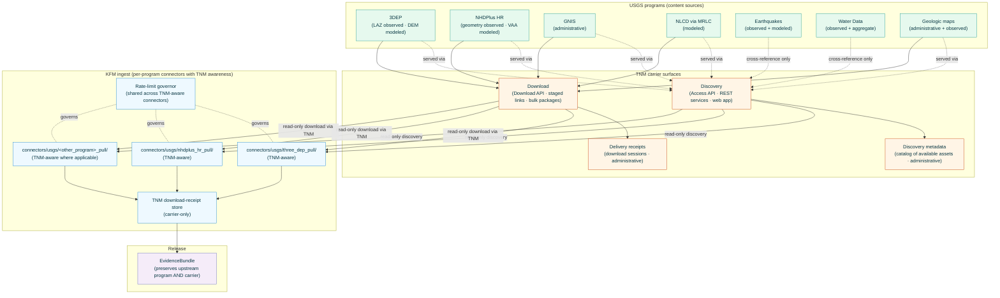

<!-- [KFM_META_BLOCK_V2]
doc_id: kfm://doc/docs-sources-catalog-usgs-the-national-map
title: USGS The National Map (TNM)
type: product-page
version: v0.2
status: draft
owners: <PLACEHOLDER — Docs steward + Source steward for usgs>
created: 2026-05-20
updated: 2026-05-23
policy_label: public
related:
  - docs/sources/catalog/usgs.md
  - docs/sources/catalog/usgs/README.md
  - docs/sources/catalog/usgs/IDENTITY.md
  - docs/sources/catalog/usgs/RIGHTS-AND-SENSITIVITY-MAP.md
  - docs/sources/catalog/usgs/usgs-3dep-elevation.md
  - docs/sources/catalog/usgs/usgs-earthquake-catalog.md
  - docs/sources/catalog/usgs/usgs-gnis-names.md
  - docs/sources/catalog/usgs/usgs-nhdplus-hr.md
  - docs/sources/catalog/usgs/usgs-nlcd.md
  - docs/sources/catalog/usgs/usgs-nwis-water.md
  - docs/sources/catalog/README.md
  - docs/doctrine/directory-rules.md
  - docs/doctrine/lifecycle-law.md
  - docs/doctrine/trust-membrane.md
  - docs/standards/SENSITIVITY_RUBRIC.md
  - docs/standards/STAC.md
  - docs/standards/DCAT.md
  - docs/standards/PROV.md
  - data/registry/sources/usgs/
  - policy/sources/usgs/
  - schemas/contracts/v1/source/
  - schemas/contracts/v1/carrier/
  - connectors/usgs/
adr_refs:
  - ADR-0001 (schema home)
  - <PROPOSED> ADR-S-04 (source-role vocabulary v1)
  - <PROPOSED> ADR-S-05 (sensitivity tier scheme T0–T4)
  - <PROPOSED> ADR-S-12 (connector cadence + quarantine recovery)
  - <PROPOSED> ADR-S-?? (carrier-vs-product-page disposition — when an aggregator/discovery surface warrants its own product page vs reference-only treatment from per-product pages)
  - <PROPOSED> ADR-S-?? (per-asset role inheritance — formalizing the rule that an asset served via a carrier inherits the role of its originating program, never the carrier itself)
tags: [kfm, docs, sources, catalog, usgs, tnm, the-national-map, carrier, aggregator, discovery, download, delivery, access-surface]
notes:
  - "PROPOSED product-page scaffold filled to v0.2; seventh page in the usgs family folder."
  - "Filename inferred from doc_id slug: usgs-the-national-map.md. Family catalog (docs/sources/catalog/usgs.md §5) uses the short ID 'usgs-tnm'. Reconciliation flagged in Q-3."
  - "STRUCTURAL UNIQUE: TNM is a carrier/access surface, NOT a content source. It aggregates and delivers other USGS programs' content; it does not own observations, models, or administrative records of its own. The v1.1 family-catalog §5.1 explicitly flagged this product as carrier-vs-product-page UNDECIDED. v0.2 authors this page as the carrier-disposition product page the family-catalog anticipated, with the UNDECIDED disposition surfaced rather than silently resolved (see §2)."
  - "Source-role: TNM itself does not carry a §24.1.1 enum role for content; it carries `administrative` for its own discovery metadata + delivery receipts. Per-asset served via TNM inherits the role of its originating program (3DEP DEM = modeled; NHDPlus HR geometry = observed; etc.) per the role-inheritance rule formalized in §2.1."
  - "Cross-references six sibling product pages explicitly: 3DEP, earthquake-catalog, GNIS, NHDPlus HR, NLCD, and Water Data are all reachable through TNM (in varying degrees) and the connector wiring must preserve the upstream-program reference through every TNM-mediated fetch."
[/KFM_META_BLOCK_V2] -->

<a id="top"></a>

# USGS The National Map (TNM)

> **A carrier, not a content source.** TNM is the U.S. federal geospatial discovery and download platform — the unified access surface for 3DEP elevation, NHDPlus HR hydrography, GNIS place names, NLCD land cover (via cross-reference), and many other USGS national-program products. KFM treats TNM as the **delivery vehicle** for assets whose source-role and provenance belong to the originating program, never to TNM itself.

<!-- Top-of-file badge row. Placeholder targets — replace once badge generator (KFM-P3-FEAT-0005) is wired. -->


-orange)
-yellowgreen)


-yellow)


**Status:** `PROPOSED — scaffold filled (carrier disposition)` &nbsp;·&nbsp; **Doc version:** `v0.2` &nbsp;·&nbsp; **Family:** [`usgs`](./README.md) &nbsp;·&nbsp; **Last reviewed:** 2026-05-23

> [!IMPORTANT]
> **This page is a pointer twice over.** First, like every product page in this family, descriptor fields live in [`data/registry/sources/usgs/`](../../../../data/registry/sources/usgs/) and policy lives in [`policy/sources/usgs/`](../../../../policy/sources/usgs/) — **do not duplicate descriptor or policy here.** Second, and uniquely for TNM, this page is structurally a **pointer to the per-program product pages** (3DEP, NHDPlus HR, GNIS, NLCD, Water Data, etc.) for everything content-related; TNM-the-carrier owns only its own discovery + delivery surface.

> [!CAUTION]
> **TNM is not a §24.1.1 content-role source.** TNM does not observe, model, or regulate. An NLCD raster served via TNM **is and remains** a `modeled` MRLC product; a 3DEP DEM served via TNM **is and remains** a `modeled` 3DEP product; a GNIS name record served via TNM **is and remains** an `administrative` GNIS record. The role belongs to the originating program, not to the delivery vehicle. KFM derivatives that cite *"TNM"* as the source-role of a piece of content collapse the carrier into the content and violate the role-inheritance rule formalized in [§2.1](#21-sub-product-source-role-decomposition).

> [!WARNING]
> **Open structural question.** The v1.1 family-catalog ([`docs/sources/catalog/usgs.md`](../usgs.md) §5.1) explicitly flagged TNM as carrier-vs-product-page **UNDECIDED**: *"recommend treating it as access machinery referenced from product pages rather than a product page of its own."* v0.2 authors this page as the carrier-disposition document the family-catalog anticipated and surfaces the disposition for ADR resolution rather than silently choosing one side. See [§2](#2-product-identity-within-the-family) and Q-1.

---

## 📑 Contents

1. [Overview](#1-overview)
2. [Product identity within the family](#2-product-identity-within-the-family)
3. [Source authority](#3-source-authority)
4. [Catalog profiles used](#4-catalog-profiles-used)
5. [Collection identity](#5-collection-identity)
6. [Provenance fields](#6-provenance-fields)
7. [Temporal handling — carrier-side times only](#7-temporal-handling--carrier-side-times-only)
8. [Identity, access surface, and geometry](#8-identity-access-surface-and-geometry)
9. [Rights and sensitivity (pointer)](#9-rights-and-sensitivity-pointer)
10. [Reality boundary](#10-reality-boundary)
11. [Validation and catalog closure](#11-validation-and-catalog-closure)
12. [Related contracts and schemas](#12-related-contracts-and-schemas)
13. [Related connectors and pipelines](#13-related-connectors-and-pipelines)
14. [Example](#14-example)
15. [Open questions](#15-open-questions)
16. [Last reviewed](#16-last-reviewed)

---

## 1. Overview

This product page describes how KFM treats **USGS The National Map (TNM)** — the U.S. federal geospatial discovery and download platform — as a **carrier surface**: the way KFM reaches and delivers content from multiple USGS programs while preserving each program's authority, source-role, and provenance through the delivery vehicle.

TNM operates as several surfaces:

- **TNM Access API / TNM Download API** — programmatic discovery and bulk-download endpoints.
- **TNM REST services** — feature/service catalog endpoints.
- **The National Map web application** — interactive browse and download.
- **Direct download links** — bulk-distribution URLs for staged packages (e.g., 3DEP LAZ tiles, NHDPlus HR HU-4 geodatabases).

> [!NOTE]
> **EXTERNAL** *(preserved without re-verification this session).* USGS operates TNM as a unified entry point; specific endpoint URLs, file-staging conventions, rate-limit terms, and the precise set of programs accessible via TNM at any given time remain **NEEDS VERIFICATION** until re-fetched in a session with web access. The v1.1 family-catalog entry §5 records TNM's role as *"`aggregator` of program assets (carrier; per-asset role applies)"* with Spatial Foundation as its cross-cutting domain.

> [!IMPORTANT]
> **TNM does not own the content it serves.** Every asset reachable through TNM originates with a specific USGS program (3DEP, NHDPlus HR, GNIS, NLCD-via-MRLC-distribution, Water Data, geologic maps, etc.) and carries that program's source-role, rights posture, provenance, and per-program editorial history. TNM provides discovery + delivery; the **per-program product pages** in this family own the content meaning. This is the defining structural fact of this page.



[Back to top](#top)

---

## 2. Product identity within the family

> [!NOTE]
> This page is the **seventh** product authored under the `usgs` source family — but unlike the heterogeneous-role siblings [3DEP](./usgs-3dep-elevation.md), [Earthquakes](./usgs-earthquake-catalog.md), [NHDPlus HR](./usgs-nhdplus-hr.md), [Water Data](./usgs-nwis-water.md), the administrative [GNIS](./usgs-gnis-names.md), and the pure-modeled [NLCD](./usgs-nlcd.md) — TNM is structurally different: **a carrier surface, not a content source**.

<details>
<summary><strong>Carrier-vs-product-page disposition — open structural ADR (PROPOSED, surfaced from family-catalog §5.1)</strong></summary>

The v1.1 family-catalog ([`docs/sources/catalog/usgs.md`](../usgs.md) §5.1) explicitly flagged TNM with `Product page: PROPOSED — UNDECIDED` and the note: *"TNM is a discovery/download surface, not a content source. Recommend treating it as access machinery referenced from product pages rather than a product page of its own."*

Two structural options remain open:

- **Option A — TNM as a full product page (this v0.2)**: a carrier-disposition product page documents TNM's own administrative metadata (discovery records + delivery receipts), the per-asset role-inheritance rule, the rate-limit/cadence carrier discipline, and the TNM-aware connector pattern. The per-program product pages remain authoritative for content meaning; this page is the canonical reference for *how* KFM accesses them.
- **Option B — TNM as access machinery only**: this page becomes thin (~5–10 lines pointing at the per-program connectors); TNM-aware concerns (rate limiting, download receipts, role-inheritance preservation) get documented inline on each affected per-program page.

v0.2 implements Option A as the working hypothesis and surfaces the choice for ADR-S-?? (carrier-vs-product-page disposition). The page is deliberately lighter than the content product pages — most sections are short or explicitly "inherited from program" — to model what Option A actually looks like.

</details>

| Attribute | Value | Status |
|---|---|---|
| Product name | USGS The National Map (TNM) | **CONFIRMED EXTERNAL** (USGS program name). |
| Role-type | **Carrier / aggregator surface** (not a content source) | **CONFIRMED** structural disposition. |
| Source family | `usgs` | **CONFIRMED**. |
| KFM source-role (own) | **`administrative`** (for its discovery metadata + delivery receipts only — see [§2.1](#21-sub-product-source-role-decomposition)) | **CONFIRMED enum** per Atlas §24.1.1. |
| KFM source-role (per-asset served via TNM) | **Inherited from the originating program** — never *"TNM"* | **CONFIRMED rule** per Atlas §24.1.2 + ADR-S-?? per-asset role-inheritance. |
| Domains served | **Spatial Foundation (cross-cutting)** per family-catalog §5 row; effectively cross-domain via per-asset inheritance | **CONFIRMED**. |
| Primary upstream surfaces | TNM Access API · TNM Download API · TNM REST services · The National Map web app · direct staged-download links | **EXTERNAL — NEEDS VERIFICATION** of current URLs and access patterns. |
| Cardinal evidence objects (carrier-only) | **`TNMResourceRef`** (discovery record · administrative); **`TNMDownloadReceipt`** (delivery receipt · administrative); **`TNMServiceCatalogEntry`** (REST service catalog · administrative) | **PROPOSED** — new carrier-specific object classes. |
| Geometry | **Inherited from per-asset** (no own geometry beyond service bounding boxes) — see [§8](#8-identity-access-surface-and-geometry) | **CONFIRMED-inherited**. |
| Cadence | **Editorial / per-asset** — TNM-itself rarely changes; the assets it serves change per their originating programs' schedules | **CONFIRMED**. |
| Geographic scope | **U.S. domestic** (TNM scope); effective per-asset scope inherits per program | **CONFIRMED**. |
| Carrier-vs-product-page disposition | **OPEN** — see attribution box above | **OPEN — ADR-S-??**. |

### 2.1 Sub-product source-role decomposition

| Sub-product | `source_role` | Rationale | Anti-collapse risk |
|---|---|---|---|
| **Discovery records** (TNM Access API responses describing available assets — title, abstract, footprint, access URL) | **`administrative`** (own) | Federal-administrative records that an asset exists and is reachable. The discovery record is not the asset's content. | Citing a discovery record as if it were the asset's content. |
| **Service-catalog entries** (TNM REST service descriptions) | **`administrative`** (own) | Federal-administrative records of available services. | Same as above. |
| **Delivery receipts** (TNM download sessions — what was requested, when, at what byte size, with what checksum) | **`administrative`** (own) | KFM-side audit trail of TNM-mediated fetches. | Citing a delivery receipt as evidence of content correctness without the upstream-program EvidenceBundle. |
| **Per-asset content served via TNM** | **Inherited from the originating program** | TNM did not produce the asset; it served it. The 3DEP DEM remains a `modeled` 3DEP product whether downloaded via TNM or directly; the NHDPlus HR geodatabase remains an `observed`-geometry-plus-`modeled`-VAA NHDPlus HR product whether downloaded via TNM or directly. | **THIS is the dominant anti-collapse risk for this page.** Citing *"TNM"* as the source of a piece of content collapses the carrier into the program. Per Atlas §24.1.2: a modeled/observed/regulatory/aggregate asset that loses its program-of-record at the trust membrane is a Gate-F deny. |

> [!CAUTION]
> **Per-asset role-inheritance is the defining rule for this carrier.** Every KFM ingestion that goes *through* TNM must preserve **two** references in the EvidenceBundle: (1) the upstream **program** (3DEP / NHDPlus HR / GNIS / NLCD / Water Data / etc.) that authored the content and owns its source-role; and (2) the **carrier session** (TNM download receipt, endpoint used, retrieval time, checksum verification) that documents the delivery vehicle. Collapsing either is a trust-membrane failure: lose the program and the content has no source-role; lose the carrier and the delivery is unauditable.

### 2.2 Disambiguation from siblings

| If you want… | Use… | Not this page |
|---|---|---|
| **3DEP DEMs or LAZ point clouds** (content) | [`usgs-3dep-elevation.md`](./usgs-3dep-elevation.md) — content; TNM-aware fetch documented there | This page only documents *that* TNM is the delivery vehicle. |
| **NHDPlus HR geometry or VAAs** (content) | [`usgs-nhdplus-hr.md`](./usgs-nhdplus-hr.md) — content | — |
| **GNIS place-name records** (content) | [`usgs-gnis-names.md`](./usgs-gnis-names.md) — content | — |
| **NLCD land-cover rasters** (content; MRLC-produced) | [`usgs-nlcd.md`](./usgs-nlcd.md) — content; family-folder placement open per §2 of that page | — |
| **Earthquake event records** (content) | [`usgs-earthquake-catalog.md`](./usgs-earthquake-catalog.md) — content; **earthquake API is NOT TNM-mediated** | TNM does not serve real-time seismic feeds. |
| **Real-time stream gauge data** (content) | [`usgs-nwis-water.md`](./usgs-nwis-water.md) — content; **Water Data API is NOT TNM-mediated** | TNM does not serve real-time water data; that is `api.waterdata.usgs.gov`. |
| **A discovery interface** to find what is available across multiple USGS programs | This page (TNM Access API documentation) | — |
| **A download mechanism** for staged USGS files at scale | This page (TNM Download API documentation) | — |
| **USGS Science Data Catalog** (an aggregator at a different level than TNM) | `<PROPOSED> docs/sources/catalog/usgs/usgs-sdc.md` per family-catalog §5 row `usgs-sdc` — another carrier-vs-product-page UNDECIDED case | — |

> [!NOTE]
> **Not everything in the USGS family is reached via TNM.** Real-time data products — earthquakes and water data — have their own dedicated APIs (`earthquake.usgs.gov`-side feeds and `api.waterdata.usgs.gov`). NLCD is MRLC-produced and partially reachable via TNM but also via `mrlc.gov` directly. The cross-references in [§1](#1-overview)'s Mermaid show which programs are served via TNM (solid arrows) vs cross-referenced only (dashed arrows).

[Back to top](#top)

---

## 3. Source authority

See [`data/registry/sources/usgs/`](../../../../data/registry/sources/usgs/) for the authoritative `SourceDescriptor` for TNM-the-carrier. **Do not duplicate descriptor fields here.** Descriptor canonical schema home is `schemas/contracts/v1/source/source-descriptor.json` per Directory Rules §7.4 / ADR-0001 — **NEEDS VERIFICATION**.

> [!IMPORTANT]
> **TNM's `SourceDescriptor` describes the carrier, not the carried content.** Each program reached through TNM has its own `SourceDescriptor` (in `data/registry/sources/usgs/` per its own product page). The TNM descriptor documents the carrier surface — endpoints, rate limits, authentication, deprecation track — and explicitly references the per-program descriptors it delivers.

Doctrinal anchors for this product:

- Family-catalog entry [`docs/sources/catalog/usgs.md`](../usgs.md) §5 row `usgs-tnm` — *"`aggregator` of program assets *(carrier; per-asset role applies)*"*; domain *Spatial Foundation (cross-cutting)*.
- Family-catalog §5.1 product-page index row `usgs-tnm` — *"PROPOSED — UNDECIDED. TNM is a discovery/download surface, not a content source. Recommend treating it as access machinery referenced from product pages rather than a product page of its own."* (Direct evidence anchor for the carrier disposition and the open ADR.)
- Atlas §24.1.2 anti-collapse register — *"Carrier cited as content-role authority"* is the rule this page formalizes via ADR-S-?? per-asset role-inheritance.
- `KFM-P22-PROG-0043` — Read-only probe posture.
- `KFM-P14-IDEA-0002` — STAC/DCAT/PROV distribution contract.
- `KFM-P26-PROG-0025` — Catalog writers emit DCAT/STAC/PROV with EvidenceBundle references.
- `KFM-P14-PROG-0011` — 3DEP/TNM/NAIP packaging doctrine; TNM as the named distribution channel for terrain + imagery families.
- `KFM-P22-PROG-0001` — Promotion Gates A–G; carrier records pass through Gate A (admission with role intact) but never carry content-role through Gate F.

[Back to top](#top)

---

## 4. Catalog profiles used

| Profile | Lane | Used by this product? | Basis |
|---|---|---|---|
| **DCAT** Dataset + Distribution for the carrier itself (**primary**) | `data/catalog/dcat/` | **PROPOSED — Yes (primary for TNM-carrier metadata)** | `C4-05`; `KFM-P14-IDEA-0002`. TNM's own discovery + service-catalog records are tabular/JSON-shaped — natural DCAT fit. |
| **DCAT** for per-asset content served via TNM | (per-program lane) | **CONFIRMED No** | The per-asset DCAT/STAC/PROV record belongs to the originating program (3DEP / NHDPlus HR / etc.), not to TNM. The TNM delivery receipt is referenced *from* the per-asset record. |
| **STAC** participation for the carrier | `data/catalog/stac/` | **PROPOSED — limited Yes** | TNM service-catalog entries that bound a geographic area (e.g., a service serving Kansas-extent assets) participate in STAC for spatial-bbox discovery; this is metadata about *availability*, not about content. Aligned to `C4-01` / `C4-02` for the catalog-availability case only. |
| **PROV-O / PAV** lineage (**critical for carrier-to-program reference chain**) | `data/catalog/prov/` | **PROPOSED — Yes** | `C8-03`. Per every TNM-mediated fetch: the per-asset EvidenceBundle MUST carry `prov:wasGeneratedBy` linking to the originating program's authoritative record and `prov:wasInformedBy` linking to the TNM delivery receipt. The carrier itself is preserved as a PROV node, not collapsed into the program. |
| **Domain projection — Spatial Foundation** | `data/catalog/domain/spatial/` | **PROPOSED — Yes (cross-cutting)** | Family-catalog §5 row; TNM's cross-cutting domain. |
| **Per-asset domain projection** | (per-program lane) | **CONFIRMED No** | Per-asset content's domain projection lives in the originating program's catalog. TNM's own catalog presence is Spatial Foundation only (carrier-availability indexing). |
| **STAC × Darwin Core hybrid** (`C4-03`) | — | **CONFIRMED No** | Not biological occurrence. |

> [!TIP]
> **Catalog-profile usage here is deliberately thin** because TNM's catalog footprint is small — its own discovery + service-catalog records, and PROV linkage. The bulk of catalog work for any TNM-mediated ingestion happens in the originating program's catalog lane, not here.

[Back to top](#top)

---

## 5. Collection identity

Carrier-only collections — small set, scoped to TNM's own administrative records:

- **PROPOSED Collection id patterns:**
  - TNM discovery records (assets findable via TNM Access API) → `kfm-usgs-tnm-discovery`
  - TNM service-catalog entries (REST services) → `kfm-usgs-tnm-services`
  - TNM delivery receipts (KFM-side audit of TNM-mediated fetches) → `kfm-usgs-tnm-delivery-receipts`
- **PROPOSED Item id patterns:**
  - Discovery record: `kfm-usgs-tnm-discovery-<tnm_resource_id>-<snapshot_n>`
  - Service entry: `kfm-usgs-tnm-services-<service_id>`
  - Delivery receipt: `kfm-usgs-tnm-delivery-receipts-<session_id>`
- **PROPOSED namespace:** `kfm:` *(see family-catalog Q-10).*
- **Asset roles:** **NEEDS VERIFICATION** — confirm against [`schemas/contracts/v1/source/`](../../../../schemas/contracts/v1/source/). Likely role set:
  - `discovery-record` — JSON canonical discovery record
  - `service-catalog-entry` — JSON service description
  - `delivery-receipt` — JSON KFM-side audit record
  - `program-ref` — link to the per-program product page + descriptor (mandatory on every TNM-mediated fetch)
  - `metadata` — DCAT JSON-LD
  - `evidence_bundle` — JSON-LD (`application/ld+json`)
- **Collection description (PROPOSED):** Must declare the **carrier-only source role**, the **per-asset role-inheritance rule** (per [§2.1](#21-sub-product-source-role-decomposition)), the **NEVER-cite-TNM-as-content-source banner**, the **USGS no-warranty banner** verbatim, and explicit pointers to all per-program product pages whose content TNM delivers.

> [!IMPORTANT]
> **There is no `kfm-usgs-tnm-content` collection.** Asset content served via TNM lives in the originating program's Collection (e.g., `kfm-usgs-3dep-*`, `kfm-usgs-nhdplus-hr-*`, `kfm-usgs-gnis-*`). TNM's collection footprint is strictly administrative — discovery, services, and delivery audit.

[Back to top](#top)

---

## 6. Provenance fields

**CONFIRMED shape** (per `C4-01`) for TNM-carrier records. Per-asset records use the program's provenance schema with **mandatory carrier-reference fields** added.

| Field | Type | Source / how computed |
|---|---|---|
| `spec_hash` | sha256 of canonical record | `C1-02`. |
| `evidence_bundle_ref` | `kfm://evidence/<digest>` | `C4-04`. |
| `run_record_ref` | `kfm://run/<run-id>` | `C1-01`. |
| `audit_ref` | `kfm://audit/<attestation-id>` | SLSA / OPA. |
| `policy_digest` | sha256 of policy bundle | `KFM-P22-PROG-0001`. |
| **TNM-carrier own fields (administrative)** | | |
| `tnm_resource_id` | USGS-assigned identifier for the TNM-listed resource | **CONFIRMED-required** for discovery records. |
| `tnm_endpoint_used` | Enum (`access_api`, `download_api`, `rest_service`, `staged_download_link`) | **CONFIRMED-required** for delivery receipts. |
| `tnm_endpoint_url` | URL — the specific TNM endpoint used for this session | **CONFIRMED-required**. |
| `tnm_session_id` | KFM-side session identifier for the delivery | **CONFIRMED-required** for delivery receipts. |
| `tnm_request_payload_hash` | sha256 of the request payload (query parameters, body) | **PROPOSED-required**. |
| `tnm_response_byte_size` | Integer (bytes delivered) | **CONFIRMED-required** for delivery receipts. |
| `tnm_response_checksum` | sha256 of the delivered content | **CONFIRMED-required** for delivery receipts. |
| `tnm_rate_limit_window` | Structured (`{window_start, window_end, requests_in_window, remaining_quota}`) | **PROPOSED-required** for delivery receipts. |
| `tnm_deprecation_flag` | Boolean (true if TNM has signaled the endpoint will be deprecated) | **PROPOSED-required**. |
| **Carrier-to-program reference fields (mandatory on every TNM-mediated per-asset record)** | | |
| `upstream_program_id` | The originating USGS program (`3dep`, `nhdplus_hr`, `gnis`, `nlcd`, `geologic_maps`, …) | **CONFIRMED-required on every TNM-mediated per-asset record**. |
| `upstream_program_descriptor_ref` | `kfm://...` ref to the per-program `SourceDescriptor` | **CONFIRMED-required**. |
| `upstream_program_role` | Inherited `source_role` from the originating program (`observed` / `modeled` / `administrative` / `aggregate` / …) | **CONFIRMED-required**. |
| `tnm_delivery_receipt_ref` | `kfm://...` ref to the `TNMDownloadReceipt` for this fetch | **CONFIRMED-required on every TNM-mediated per-asset record**. |
| `kfm:provenance.reality_boundary_ref` | `kfm://realityboundary/tnm-carrier` | Per [§10](#10-reality-boundary). |

Per-asset integrity: **`file:checksum`** (SHA-256) on every published distribution (per `C3-02`).

> [!TIP]
> **`upstream_program_role` is the single most important field for trust-membrane preservation in TNM-mediated ingestion.** It encodes the rule that the content's source-role belongs to the program, not the carrier. KFM derivatives that use a TNM-delivered asset MUST read `upstream_program_role`, not infer the role from the delivery vehicle.

[Back to top](#top)

---

## 7. Temporal handling — carrier-side times only

TNM's own time discipline is thin: the carrier itself rarely changes; the assets it serves have their own time discipline owned by the per-program pages.

| Time | Meaning for this product | Status |
|---|---|---|
| `tnm_discovery_query_time` | When KFM queried the TNM Access API for available assets | **CONFIRMED-required** for discovery records. |
| `tnm_download_initiation_time` | When KFM initiated a download session | **CONFIRMED-required** for delivery receipts. |
| `tnm_download_completion_time` | When the delivery session completed | **CONFIRMED-required**. |
| `tnm_service_catalog_query_time` | When KFM queried the TNM service catalog | **CONFIRMED-required** for service-catalog entries. |
| `retrieval_time` | Synonym for `tnm_download_completion_time` for delivery receipts; for discovery records, synonym for `tnm_discovery_query_time` | **CONFIRMED-required**. |
| `valid_from` / `valid_to` | When this TNM-carrier snapshot was authoritative in KFM | **CONFIRMED-required** (nullable on current). |
| `release_time` | When the KFM-derived carrier item was published | **CONFIRMED-required** at Gate G. |
| `correction_time` | When a `CorrectionNotice` updates a carrier record | **CONFIRMED-required** when applicable. |
| `observed_time` / `valid_from_for_content` | **N/A on TNM-carrier records.** These times belong to the per-asset record in the originating program's catalog. | **CONFIRMED N/A**. |

> [!IMPORTANT]
> **TNM-carrier times do not substitute for per-asset times.** A 3DEP DEM downloaded through TNM yesterday was acquired by 3DEP years earlier, processed at a specific 3DEP-program time, and has its own `valid_from`/`valid_to` in the 3DEP catalog. The TNM delivery receipt's `tnm_download_completion_time` is *only* when KFM took delivery, not when the asset became valid.

[Back to top](#top)

---

## 8. Identity, access surface, and geometry

### 8.1 Carrier identity

| Attribute | Value (PROPOSED) | Status |
|---|---|---|
| Cardinal identity (discovery records) | `tnm_resource_id` (USGS-assigned) | **CONFIRMED**. |
| Cardinal identity (service-catalog entries) | TNM-assigned service identifier | **CONFIRMED**. |
| Cardinal identity (delivery receipts) | KFM-assigned `tnm_session_id` | **PROPOSED**. |
| Geometry (own) | None for delivery receipts; carrier-availability bounding box for service-catalog entries (e.g., "this REST service covers Kansas-extent") | **PROPOSED-limited**. |
| Per-asset geometry | **Inherited from the originating program** (3DEP raster footprint; NHDPlus HR HU-4 region; GNIS point; etc.) | **CONFIRMED-inherited**. |

### 8.2 Access surface enumeration

| Access surface | Purpose | KFM connector pattern |
|---|---|---|
| **TNM Access API** | Programmatic discovery — what assets are available, where, in what format | TNM-aware connectors query discovery first to construct download URLs. |
| **TNM Download API** | Programmatic download of staged packages | TNM-aware connectors fetch via this endpoint; emit `TNMDownloadReceipt`. |
| **TNM REST services** | Feature/service catalog — for vector and tile services | Used for direct-feature queries (smaller-scale than bulk downloads). |
| **TNM web app** | Interactive browse for human users | Not used by KFM connectors; documented for reference. |
| **Direct staged-download links** | Bulk-distribution URLs for pre-staged packages (often the actual download mechanism beneath the Download API) | TNM-aware connectors follow these links and record the URL in the delivery receipt. |

### 8.3 No own geometry, no own content

> [!IMPORTANT]
> **TNM does not have its own geometry beyond carrier-availability bounding boxes.** Asking *"what is the geometry of TNM"* is a category error — TNM is a service. Asking *"what is the geometry of a 3DEP DEM accessed via TNM"* is the right question, and the answer lives in the 3DEP product page.

[Back to top](#top)

---

## 9. Rights and sensitivity (pointer)

**Do not restate policy here.** See [`policy/sources/usgs/`](../../../../policy/sources/usgs/) and the family-level summary at [`RIGHTS-AND-SENSITIVITY-MAP.md`](./RIGHTS-AND-SENSITIVITY-MAP.md). **Most rights and sensitivity concerns for TNM-mediated content belong to the per-program product page**, not here.

### 9.1 T0 default for the carrier itself

> [!NOTE]
> **Default tier: T0 (Open).** TNM is U.S. federal infrastructure (17 U.S.C. §105) with public-domain access posture for the carrier surface. Discovery and download are publicly available; KFM follows the upstream open posture for the carrier-own records.

### 9.2 Per-asset sensitivity inherits from program

> [!IMPORTANT]
> **An asset delivered through TNM inherits the originating program's full rights and sensitivity posture.** Per family-catalog §7 and the engineering-disclaimer cascade (3DEP §9.3 → NHDPlus HR §9.1 → NLCD §9.1 → Water Data §9.1):
>
> - A 3DEP DEM accessed via TNM still triggers the 3DEP engineering disclaimer and infrastructure-overlay sensitivity rules.
> - An NHDPlus HR package accessed via TNM still triggers the NHDPlus HR not-regulatory disclaimer and the cross-source join policies.
> - A GNIS download accessed via TNM still triggers GNIS Tribal-authority reconciliation and historically-harmful-name surfacing rules.
>
> The carrier does not relax or override per-program rights and sensitivity. Per ADR-S-?? per-asset role-inheritance, the carrier preserves but does not modify these per-program postures.

### 9.3 Rate-limit awareness as operational sensitivity

> [!CAUTION]
> **TNM rate limits are operational sensitivity.** Aggressive ingestion can degrade service for other consumers and may trigger USGS-side throttling. The carrier-aware rate-limit governor (see [§13](#13-related-connectors-and-pipelines)) is shared across all TNM-aware connectors and enforces per-endpoint quota windows. Rate-limit violations are quarantine-triggering per ADR-S-12.

### 9.4 No own CARE or living-person concerns

> [!NOTE]
> TNM itself does not introduce CARE or living-person sensitivity beyond what the per-asset content carries. Tribal-lands considerations and living-person joins all live in the per-program product page's sensitivity section.

[Back to top](#top)

---

## 10. Reality boundary

> [!IMPORTANT]
> **TNM is a delivery vehicle, not a data source.** Focus-Mode AI answers about TNM-delivered content MUST cite the originating program — 3DEP for elevation, NHDPlus HR for hydrography, GNIS for names, NLCD for land cover, etc. — and reference TNM only as the *carrier* of the delivery. Citing *"TNM"* as the source of a piece of content is the central anti-collapse failure for this page.

> [!IMPORTANT]
> **TNM availability ≠ asset currency.** Discovery records say *"this asset is available via TNM right now"*; they do not say *"this asset is the most recent version of the content"*. Cross-reference the per-program record for currency questions.

> [!IMPORTANT]
> **TNM is not exhaustive of USGS programs.** Real-time data products (earthquakes, water data) do not flow through TNM; some products (NLCD, geologic maps in various forms) are partially-served through TNM but also available via other distribution channels. Absence-from-TNM is not absence-from-USGS.

> [!IMPORTANT]
> **The TNM delivery receipt verifies delivery, not content correctness.** A successful download with matching checksums confirms that TNM delivered exactly what TNM said it would deliver. It does NOT confirm that the content is internally correct, current, or fit-for-purpose — those determinations require the per-program EvidenceBundle.

[Back to top](#top)

---

## 11. Validation and catalog closure

- **Catalog closure required before public release** (Pass-10 / `KFM-P1-IDEA-0020`).
- **TNM resource ID present** (gate-blocking for discovery records) — `usgs_tnm_resource_id_required`.
- **TNM endpoint URL recorded** (gate-blocking) — `usgs_tnm_endpoint_url_required`.
- **TNM session ID for delivery receipts** (gate-blocking) — `usgs_tnm_session_id_required`.
- **Response checksum verified** (gate-blocking) — `usgs_tnm_response_checksum_verified`: the delivered byte stream's SHA-256 matches the receipt and either matches a TNM-published expected checksum or is recorded as KFM-computed.
- **Rate-limit-aware fetch** (gate-blocking) — `usgs_tnm_rate_limit_respected`: connector consulted the rate-limit governor and did not exceed window quota; receipt records `tnm_rate_limit_window`.
- **Upstream program reference preserved** (gate-blocking on every per-asset record) — `usgs_tnm_upstream_program_ref_required`: every per-asset record fetched via TNM carries `upstream_program_id`, `upstream_program_descriptor_ref`, and `upstream_program_role`. **This is the single most important validator for this page.**
- **TNM delivery receipt reference preserved** (gate-blocking on every per-asset record) — `usgs_tnm_delivery_receipt_ref_required`: every per-asset record fetched via TNM carries `tnm_delivery_receipt_ref`.
- **Source-role anti-collapse (the defining validator)** — `usgs_tnm_role_anti_collapse`:
  - Per-asset record citing `source_role: tnm` or `source_role: aggregator` → Gate F deny. The role belongs to the upstream program.
  - Carrier-own record (discovery/service/delivery) carrying a content-role (`observed`/`modeled`/`regulatory`/`aggregate`) → Gate F deny. The carrier's own role is `administrative`.
  - Per-asset record without `upstream_program_role` → Gate F deny.
- **TNM mediation flag preserved** — `usgs_tnm_mediation_flag_preserved`: per-asset records ingested via TNM carry a `via_tnm: true` flag (or equivalent) so downstream consumers can recognize the delivery vehicle.
- **Deprecation-aware fetch** — `usgs_tnm_deprecation_flag_checked`: when a TNM endpoint signals deprecation, the connector records the flag and routes through the per-program migration path (analog to USGS Water Data API migration in [`usgs-nwis-water.md`](./usgs-nwis-water.md) §3.2).
- **PROV-O closure** (`C8-03`): every TNM-mediated per-asset record carries (a) `prov:wasGeneratedBy` linking to the originating program's authoritative record and (b) `prov:wasInformedBy` linking to the TNM delivery receipt. The carrier is preserved as a PROV node, not collapsed.
- **STAC Projection lint** for carrier-availability bounding boxes (`KFM-P27-FEAT-0003`).
- **DCAT mirror closure** for TNM-carrier collections (`KFM-P14-IDEA-0002`, `KFM-P26-PROG-0025`).
- **Catalog QA CI surface** (`KFM-P27-FEAT-0004`).
- **Promotion Gates A–G** (`KFM-P22-PROG-0001`) — carrier records pass Gate A admission; per-asset content records pass per the originating program's gates.

> [!TIP]
> **Negative fixtures required:** discovery record without `tnm_resource_id` (Gate A quarantine); delivery receipt without checksum verification (Gate D deny); per-asset record fetched via TNM but missing `upstream_program_role` (Gate F deny — anti-collapse); per-asset record citing *"TNM"* as the source-role (Gate F deny — anti-collapse, the defining failure mode); rate-limit-violating fetch (Gate D deny + ADR-S-12 quarantine recovery); per-asset record without PROV-O link back to the originating program (Gate D deny — PROV-O closure).

[Back to top](#top)

---

## 12. Related contracts and schemas

| Surface | Path (PROPOSED unless noted) | Status |
|---|---|---|
| `SourceDescriptor` semantic + schema | [`contracts/source/`](../../../../contracts/source/) · [`schemas/contracts/v1/source/`](../../../../schemas/contracts/v1/source/) | **PROPOSED** canonical homes per Directory Rules §7.4 / ADR-0001. |
| `TNMResourceRef` schema (discovery records) | [`schemas/contracts/v1/carrier/`](../../../../schemas/contracts/v1/carrier/) | **PROPOSED** — new carrier-specific object class. |
| `TNMServiceCatalogEntry` schema | [`schemas/contracts/v1/carrier/`](../../../../schemas/contracts/v1/carrier/) | **PROPOSED**. |
| `TNMDownloadReceipt` schema | [`schemas/contracts/v1/carrier/`](../../../../schemas/contracts/v1/carrier/) | **PROPOSED**. |
| `CarrierMediationRef` schema (the carrier-reference fields that attach to every per-asset record) | [`schemas/contracts/v1/carrier/`](../../../../schemas/contracts/v1/carrier/) | **PROPOSED** — shared with any future carrier product page (e.g., `usgs-sdc.md` if authored). |
| `RateLimitGovernorState` schema (shared across TNM-aware connectors) | [`schemas/contracts/v1/governance/`](../../../../schemas/contracts/v1/governance/) | **PROPOSED**. |
| `EvidenceBundle` / `EvidenceRef` | [`schemas/contracts/v1/evidence/`](../../../../schemas/contracts/v1/evidence/) | **PROPOSED** per `KFM-P26-PROG-0004` / 0005. |
| `RealityBoundaryNote` | [`schemas/contracts/v1/governance/`](../../../../schemas/contracts/v1/governance/) | **PROPOSED**. |

[Back to top](#top)

---

## 13. Related connectors and pipelines

| Stage | Path (PROPOSED) | Notes |
|---|---|---|
| **TNM-aware fetch pattern** (shared across per-program connectors) | various per-program `connectors/usgs/<program>_pull/` | Every per-program connector that uses TNM as a delivery vehicle (3DEP, NHDPlus HR, GNIS bulk-download, NLCD partial, geologic maps) implements the TNM-aware pattern: discovery → rate-limit-aware download → checksum verify → emit `TNMDownloadReceipt` → attach `CarrierMediationRef` to the per-asset record. |
| **TNM-own connector** (carrier-discovery refresh) | [`connectors/usgs/tnm_discovery/`](../../../../connectors/usgs/) | **PROPOSED** — periodic refresh of TNM's published service catalog + available-asset index; emits `TNMServiceCatalogEntry` records. |
| **Rate-limit governor** | [`pipelines/governance/tnm_rate_limit_governor/`](../../../../pipelines/governance/) | **PROPOSED** — shared service across all TNM-aware connectors; tracks per-endpoint quota windows; enforces back-off + quarantine recovery per ADR-S-12. |
| **Ingest pipeline** | [`pipelines/ingest/`](../../../../pipelines/ingest/) | Per-asset records pass through the standard ingest pipeline with the `via_tnm` flag set on `CarrierMediationRef` attached; RAW capture into `data/raw/<domain>/<program>/<run_id>/` (program-owned, not TNM-owned). |
| **Carrier-records ingest** | [`pipelines/ingest/carrier/tnm/`](../../../../pipelines/ingest/) | **PROPOSED** — separate ingest path for TNM's own carrier records (discovery + services + delivery receipts) into `data/raw/carrier/usgs-tnm/`. |
| **Normalize pipeline** | [`pipelines/normalize/`](../../../../pipelines/normalize/) | TNM-carrier records have a thin normalize stage (mostly URL canonicalization + endpoint enum mapping); per-asset records normalize per their program. |
| **Validate pipeline** | [`pipelines/validate/`](../../../../pipelines/validate/) | All validators in [§11](#11-validation-and-catalog-closure). |
| **Catalog pipeline** | [`pipelines/catalog/`](../../../../pipelines/catalog/) | DCAT-primary for TNM-carrier records; per-asset records cataloged per program. |
| **Refresh runbook** | [`docs/runbooks/`](../../../runbooks/) | **PROPOSED** — TNM-specific operational notes (rate-limit windows, deprecation tracking, parity with direct-program endpoints where they exist) live in a shared runbook referenced by every TNM-aware connector. |
| **TNM deprecation watcher** | [`pipelines/watchers/usgs_tnm_deprecation/`](../../../../pipelines/watchers/) | **PROPOSED** — monitors TNM endpoint deprecation signals; emits `EventEnvelope` when a tracked endpoint signals deprecation; triggers connector-side migration planning. |

> [!IMPORTANT]
> **The rate-limit governor is shared across all TNM-aware connectors.** Per-program connectors do NOT each maintain their own rate-limit accounting against TNM — they consult the shared governor. This is essential because TNM's rate limits apply to KFM as a single consumer, not per-program.

[Back to top](#top)

---

## 14. Example

*Illustrative only — not authoritative. A TNM-specific example sketch belongs at `_examples/tnm-delivery-receipt-example.json` (PROPOSED).*

<details>
<summary><b>Click to expand — minimal TNMDownloadReceipt sketch (illustrative)</b></summary>

```json
{
  "@type": "kfm:TNMDownloadReceipt",
  "@id": "kfm:tnm-receipt/<session_id>",
  "kfm:source_role": "administrative",
  "kfm:role_authority": "U.S. Geological Survey · The National Map",
  "kfm:provenance": {
    "spec_hash": "<sha256 of canonical receipt body>",
    "evidence_bundle_ref": "kfm://evidence/<digest>",
    "run_record_ref": "kfm://run/<run-id>",
    "audit_ref": "kfm://audit/<attestation-id>",
    "policy_digest": "<sha256 of policy bundle>",
    "tnm_session_id": "<kfm session id>",
    "tnm_endpoint_used": "download_api",
    "tnm_endpoint_url": "<tnm download endpoint URL>",
    "tnm_request_payload_hash": "<sha256 of request body/parameters>",
    "tnm_download_initiation_time": "<ISO timestamp>",
    "tnm_download_completion_time": "<ISO timestamp>",
    "tnm_response_byte_size": 314572800,
    "tnm_response_checksum": "<sha256 of delivered content>",
    "tnm_rate_limit_window": {
      "window_start": "<ISO>",
      "window_end": "<ISO>",
      "requests_in_window": 12,
      "remaining_quota": 48
    },
    "tnm_deprecation_flag": false,
    "delivered_asset_program": "3dep",
    "delivered_asset_program_descriptor_ref": "kfm://release/registry/sources/usgs/usgs-3dep",
    "delivered_asset_per_program_ref": "kfm://release/usgs/3dep/laz/<tile_id>/<vintage>",
    "reality_boundary_ref": "kfm://realityboundary/tnm-carrier"
  }
}
```

</details>

<details>
<summary><b>Click to expand — illustrative CarrierMediationRef on a per-asset record (e.g., a 3DEP LAZ tile fetched via TNM)</b></summary>

```json
{
  "comment": "Excerpted from a per-asset record — the per-asset record's primary role/provenance is owned by the 3DEP product page (usgs-3dep-elevation.md). This excerpt shows ONLY the carrier-mediation fields TNM contributes to that per-asset record.",
  "kfm:source_role": "observed",
  "kfm:role_authority": "U.S. Geological Survey · 3D Elevation Program",
  "kfm:provenance": {
    "/* …per-3dep-program provenance fields…/* ": "see usgs-3dep-elevation.md §6",
    "via_tnm": true,
    "upstream_program_id": "3dep",
    "upstream_program_descriptor_ref": "kfm://release/registry/sources/usgs/usgs-3dep",
    "upstream_program_role": "observed",
    "tnm_delivery_receipt_ref": "kfm://tnm-receipt/<session_id>"
  }
}
```

</details>

> [!IMPORTANT]
> **Note the structural relationship in the second example.** `kfm:source_role` is `observed` (the 3DEP-program role, NOT `aggregator` or `administrative` or `tnm`). The TNM-carrier participation appears via `via_tnm: true` + `upstream_program_*` fields + `tnm_delivery_receipt_ref` — preserving the carrier reference WITHOUT collapsing it into the role.

[Back to top](#top)

---

## 15. Open questions

| # | Question | Class | Suggested resolution |
|---|---|---|---|
| Q-1 | **Carrier-vs-product-page disposition.** Per family-catalog §5.1: should TNM have its own product page (this v0.2, Option A) or only be referenced from per-program pages (Option B)? | **OPEN — gating structural** | ADR-S-?? (carrier-vs-product-page disposition). Default per [§2 attribution box](#2-product-identity-within-the-family) = **Option A** (this page) preserves a single canonical reference for carrier-specific concerns (rate limits, deprecation, role-inheritance rule); Option B remains viable if the family decides per-program pages should absorb the rate-limit and role-inheritance documentation inline. |
| Q-2 | **Per-asset role-inheritance rule formalization.** The rule that a TNM-delivered asset inherits the originating program's source-role is doctrinally clear but informally documented. Where does it formalize? | **OPEN — gating** | ADR-S-?? (per-asset role inheritance). Default = **formalize in `policy/sources/_carrier_inheritance.md`** with this product page as the canonical example; ADR adds a Validator family. |
| Q-3 | **Filename reconciliation.** This file's doc_id slug is `usgs-the-national-map`; family-catalog short ID is `usgs-tnm`. | **NEEDS VERIFICATION** | Defer to broader naming ADR. Default = **prefer `usgs-tnm.md`** for brevity; the current filename works but is verbose. |
| Q-4 | **Per-program connector ownership of TNM-aware fetch.** Should each per-program connector (3DEP, NHDPlus HR, GNIS, NLCD partial, geologic maps) own its TNM-aware fetch logic, or should there be a shared TNM-fetch library? | **PROPOSED — gating implementation** | Default = **shared TNM-fetch library** with per-program connectors invoking it; this matches the §13 shared rate-limit-governor pattern. |
| Q-5 | **TNM rate-limit policy.** What rate-limit window does KFM enforce against TNM endpoints? | **PROPOSED — gating operational** | Default = **conservative quota with exponential back-off + ADR-S-12 quarantine recovery**; actual quotas tracked in the shared governor's configuration once USGS-published rate-limit terms are verified (Q-7). |
| Q-6 | **Which USGS programs are TNM-mediated?** §1 Mermaid shows 3DEP / NHDPlus HR / GNIS / NLCD / geologic maps as TNM-served, with earthquakes and Water Data as not-TNM-mediated. | **PROPOSED** | Default = **descriptor-driven** — each program's `SourceDescriptor` records its preferred access path; TNM-mediation is per-program, not blanket. Verified at activation. |
| Q-7 | **TNM endpoint terms.** Current TNM Access API, Download API, REST service URLs + rate-limit terms + authentication requirements. | **NEEDS VERIFICATION** | Re-fetch before any T0 promotion. |
| Q-8 | **Discovery-record cadence.** How often does KFM refresh its discovery index of available TNM assets? | **PROPOSED** | Default = **weekly** for the discovery index (which is independent of any specific per-program ingest cadence); programs maintain their own ingest cadence. |
| Q-9 | **`via_tnm` flag preservation through transforms.** Does the carrier-mediation flag persist into PROCESSED and PUBLISHED layers, or only at RAW? | **PROPOSED** | Default = **persists through every transform** — Focus Mode and the Evidence Drawer benefit from knowing the delivery vehicle. |
| Q-10 | **Cross-carrier reconciliation.** When an asset is reachable via both TNM and direct-program endpoint (e.g., 3DEP via TNM Download API AND via direct AWS S3), which is canonical? | **PROPOSED** | Default = **descriptor-driven** — each program's `SourceDescriptor` declares its preferred path; KFM honors. Both delivery vehicles emit receipts so the choice is auditable. |
| Q-11 | **STAC namespace pin** (`kfm:` vs `ks-kfm:`). | **OPEN** | Pin at family / catalog level. |
| Q-12 | **TNM deprecation tracking.** What signals does TNM publish for endpoint deprecation, and how does the deprecation watcher consume them? | **PROPOSED** | Default = **HTTP `Deprecation` and `Sunset` headers per RFC 8594 where TNM emits them**; supplemented by USGS announcements consumed via the broader migration-tracking watcher (analog of the USGS Water Data API migration pattern). |
| Q-13 | **USGS Science Data Catalog (SDC) relationship.** SDC is another aggregator-level surface per family-catalog §5 row `usgs-sdc`. Does this page cover both, or does SDC get its own carrier page? | **PROPOSED** | Default = **separate carrier product pages** (`<PROPOSED> usgs-sdc.md`); SDC has different scope (research data catalog vs national map) and different access patterns. |
| Q-14 | **Carrier-only sensitivity overrides.** Are there any sensitivity concerns introduced by TNM-itself (e.g., access-pattern logging that could expose KFM's interest in specific assets to USGS analytics)? | **OPEN** | Default per §9.3 = **rate-limit-awareness only**; if a broader concern emerges (e.g., USGS publishes per-consumer ingest analytics), this validator suite expands. |
| Q-15 | **TNM-web-app integration.** Is the TNM web app referenced from KFM UI surfaces (e.g., as a deep-link to TNM's interactive viewer for a specific asset), or strictly avoided? | **PROPOSED** | Default = **referenced as an external link in Evidence Drawer for human-investigator use**; not used as an automated fetch surface. |

[Back to top](#top)

---

## 16. Last reviewed

2026-05-23 *(scaffold filled as carrier-disposition product page per family-catalog §5.1 anticipated; product-page polished against doctrine corpus + v1.1 family-catalog entry + six sibling product pages; mounted repo not inspected this session).*

---

> **Doc version:** v0.2 (draft, carrier disposition) &nbsp;·&nbsp; **Family:** [`usgs`](./README.md) &nbsp;·&nbsp; **Catalog root:** [`docs/sources/catalog/`](../README.md) &nbsp;·&nbsp; **Carrier-vs-product disposition:** OPEN (see §2 + Q-1) &nbsp;·&nbsp; [Back to top](#top)
