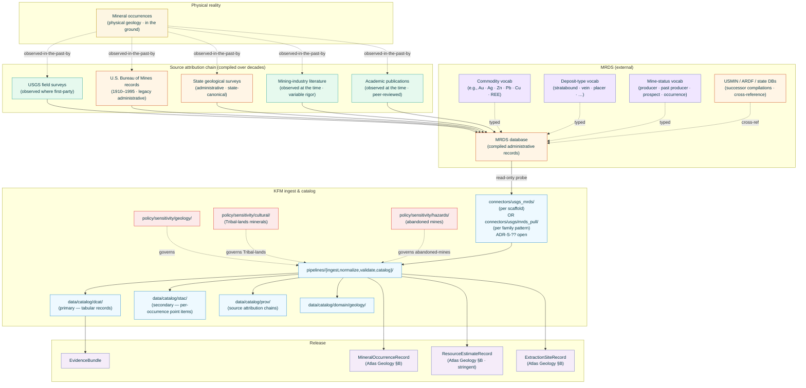
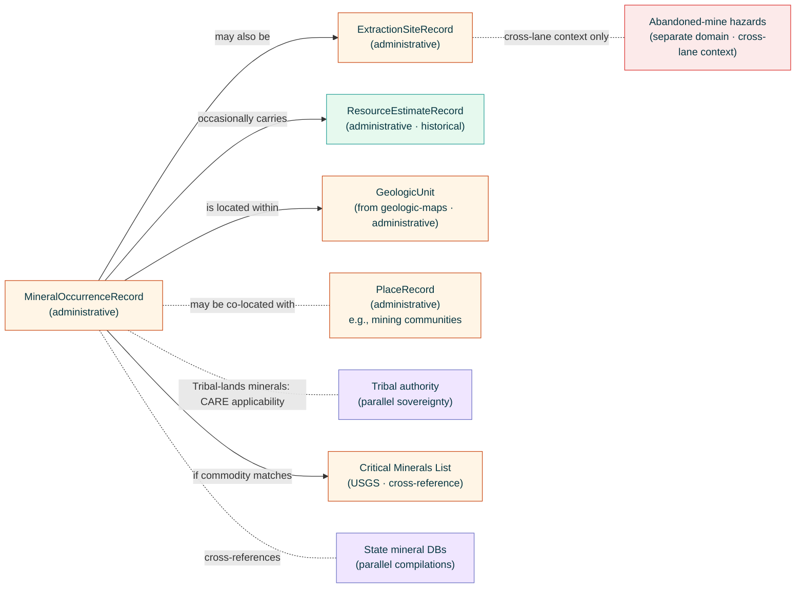

<!-- [KFM_META_BLOCK_V2]
doc_id: kfm://doc/docs-sources-catalog-usgs-usgs-mrds
title: USGS Mineral Resources Data System
type: product-page
version: v0.2
status: draft
owners: <PLACEHOLDER — Docs steward + Source steward for usgs + Geology domain owner>
created: 2026-05-21
updated: 2026-05-23
policy_label: public
related:
  - docs/sources/catalog/usgs.md
  - docs/sources/catalog/usgs/README.md
  - docs/sources/catalog/usgs/IDENTITY.md
  - docs/sources/catalog/usgs/RIGHTS-AND-SENSITIVITY-MAP.md
  - docs/sources/catalog/usgs/usgs-3dep-elevation.md
  - docs/sources/catalog/usgs/usgs-earthquake-catalog.md
  - docs/sources/catalog/usgs/usgs-gnis-names.md
  - docs/sources/catalog/usgs/usgs-nhdplus-hr.md
  - docs/sources/catalog/usgs/usgs-nlcd.md
  - docs/sources/catalog/usgs/usgs-nwis-water.md
  - docs/sources/catalog/usgs/usgs-the-national-map.md
  - docs/sources/catalog/README.md
  - docs/doctrine/directory-rules.md
  - docs/doctrine/lifecycle-law.md
  - docs/doctrine/trust-membrane.md
  - docs/standards/SENSITIVITY_RUBRIC.md
  - docs/standards/DCAT.md
  - docs/standards/PROV.md
  - docs/runbooks/geology/SOURCE_REFRESH_RUNBOOK.md
  - docs/domains/geology/README.md
  - data/registry/sources/usgs/
  - policy/sources/usgs/
  - policy/sensitivity/geology/
  - policy/sensitivity/cultural/
  - policy/sensitivity/hazards/
  - schemas/contracts/v1/source/
  - schemas/contracts/v1/geology/
  - connectors/usgs_mrds/
  - connectors/usgs/
adr_refs:
  - ADR-0001 (schema home)
  - <PROPOSED> ADR-S-04 (source-role vocabulary v1)
  - <PROPOSED> ADR-S-05 (sensitivity tier scheme T0–T4)
  - <PROPOSED> ADR-S-12 (connector cadence + quarantine recovery)
  - <PROPOSED> ADR-S-14 (cross-lane join policy)
  - <PROPOSED> ADR-S-?? (connector-home convention — three patterns now in evidence: nested `connectors/usgs/<program>_pull/` vs flat `connectors/<program>/` vs compound `connectors/usgs_<program>/`)
  - <PROPOSED> ADR-S-?? (MRDS maintenance / archival-status disposition — when an upstream source is in stewardship limbo, how does KFM track its descriptor)
  - <PROPOSED> ADR-S-?? (critical-minerals sensitivity disposition — does national-security-relevant commodity context affect tier?)
  - <PROPOSED> ADR-S-?? (occurrence-vs-deposit-vs-economic-resource anti-collapse — three distinct evidentiary claims often conflated)
tags: [kfm, docs, sources, catalog, usgs, mrds, geology, minerals, occurrences, mining, extraction, historical, administrative, compiled]
notes:
  - "PROPOSED product-page scaffold filled to v0.2; eighth page in the usgs family folder."
  - "Filename inferred from doc_id slug: usgs-mrds.md (note: doc_id has repeated 'usgs-usgs' which appears to be a slug error — file would more naturally live at usgs-mrds.md). Family catalog (docs/sources/catalog/usgs.md §5) does NOT currently list MRDS as a sub-source — this page surfaces MRDS as a PROPOSED addition to the family catalog (see §3)."
  - "Source-role: heterogeneous and historical — `administrative` (compiled federal records as the primary mode), `observed` (first-party USGS field surveys where documented), `candidate` (unverified/uncorroborated historical occurrences). Analogous to GNIS in its administrative-compilation framing but with three distinct Atlas Geology object classes mapped: Mineral Occurrence + ResourceEstimate + Extraction Site."
  - "Connector-home convention divergence: scaffold notes connectors/usgs_mrds/ (compound name with underscore-joining). This is a THIRD pattern alongside nested connectors/usgs/<program>_pull/ (used by 3DEP, NHDPlus HR, Water Data, Earthquakes, GNIS) and flat connectors/<program>/ (NLCD scaffold). Surfaced as ADR-S-?? in §13."
  - "USGS MRDS maintenance disposition is itself an open concern — MRDS as a system is historically valuable but has been in stewardship transition; current update cadence and authoritative status NEEDS VERIFICATION (Q-3)."
  - "Per Atlas Geology §B explicit non-ownership: KFM does NOT own ownership/lease/permit/title claims or active mining operations. MRDS in KFM is about deposits/occurrences as Geology-domain evidence, NEVER about who currently mines or has rights to mine them. Cross-lane to People/Land is explicitly constrained: 'lease, parcel, operator relation cannot prove deposits.'"
  - "Three-axis anti-collapse: occurrence (a mineral is present) ≠ deposit (concentrated enough to be a deposit) ≠ economic resource (currently economically extractable). These three evidentiary claims live in three different communities of practice; MRDS records one or more; KFM never silently promotes the weaker claim into the stronger."
[/KFM_META_BLOCK_V2] -->

<a id="top"></a>

# USGS Mineral Resources Data System

> The U.S. federal compiled register of known mineral occurrences, deposits, and historical extraction sites. A long-running administrative compilation drawing from USGS field surveys, state geological survey records, the legacy U.S. Bureau of Mines, mining-industry literature, and academic publications. KFM's primary `administrative` carrier for Geology-domain Mineral Occurrence, ResourceEstimate, and Extraction Site object classes.

<!-- Top-of-file badge row. Placeholder targets — replace once badge generator (KFM-P3-FEAT-0005) is wired. -->


-yellow)


**Status:** `PROPOSED — scaffold filled` &nbsp;·&nbsp; **Doc version:** `v0.2` &nbsp;·&nbsp; **Family:** [`usgs`](./README.md) &nbsp;·&nbsp; **Last reviewed:** 2026-05-23

> [!IMPORTANT]
> **This page is a pointer.** Authoritative descriptor fields live in [`data/registry/sources/usgs/`](../../../../data/registry/sources/usgs/). Rights, sensitivity, hazards-disclaimer, CARE applicability, and critical-minerals posture all live in [`policy/sources/usgs/`](../../../../policy/sources/usgs/), [`policy/sensitivity/geology/`](../../../../policy/sensitivity/geology/), [`policy/sensitivity/cultural/`](../../../../policy/sensitivity/cultural/), and [`policy/sensitivity/hazards/`](../../../../policy/sensitivity/hazards/), summarized at the family level in [`RIGHTS-AND-SENSITIVITY-MAP.md`](./RIGHTS-AND-SENSITIVITY-MAP.md). **Do not duplicate descriptor or policy content on this product page.**

> [!CAUTION]
> **Three-axis anti-collapse is the defining discipline for this product.** An MRDS record may attest to:
>
> - **An occurrence** — a mineral is present at a location (weak evidentiary claim — often a single field note, historical mention, or sample).
> - **A deposit** — that mineralization is concentrated enough to be called a deposit (a stronger geologic claim).
> - **An economic resource** — that the deposit is currently economically extractable (a separate, stringently-regulated claim under reporting codes like JORC, NI 43-101, or SEC S-K 1300 — **NOT something MRDS itself attests to**).
>
> KFM derivatives that silently promote *occurrence → deposit* or *deposit → economic resource* without the supporting evidence cross the trust membrane. See [§2.1](#21-sub-product-source-role-decomposition), [§6](#6-provenance-fields), and Q-7.

> [!CAUTION]
> **KFM does not own mining-operations or land-rights data.** Per Atlas Geology §B explicit non-ownership: ownership, lease, permit, title, and operator-identity claims are **outside** Geology-domain canonical truth. MRDS in KFM documents the geology — the mineral, the occurrence, the historical extraction record — never *who currently has the right to extract*. Per Atlas Geology cross-lane to People/Land: *"lease, parcel, operator relation cannot prove deposits."* The constraint runs both directions: lease records cannot prove a deposit, and a deposit record does not establish any operator's claim.

> [!WARNING]
> **MRDS is NOT in the v1.1 family-catalog `usgs.md` §5 sub-source table.** This page proposes adding `usgs-mrds` as a new sub-source row in the family catalog (see [§3](#3-source-authority-and-family-catalog-addition) and Q-1). Until that addition is accepted, this product page is structurally orphaned at the family level — it has no parent row in the family-catalog admission index. v0.2 surfaces this gap rather than silently filling it.

---

## 📑 Contents

1. [Overview](#1-overview)
2. [Product identity within the family](#2-product-identity-within-the-family)
3. [Source authority and family-catalog addition](#3-source-authority-and-family-catalog-addition)
4. [Catalog profiles used](#4-catalog-profiles-used)
5. [Collection identity](#5-collection-identity)
6. [Provenance fields](#6-provenance-fields)
7. [Temporal handling and historical-record discipline](#7-temporal-handling-and-historical-record-discipline)
8. [Identity, geometry, and location uncertainty](#8-identity-geometry-and-location-uncertainty)
9. [Rights and sensitivity (pointer)](#9-rights-and-sensitivity-pointer)
10. [Reality boundary](#10-reality-boundary)
11. [Validation and catalog closure](#11-validation-and-catalog-closure)
12. [Related contracts and schemas](#12-related-contracts-and-schemas)
13. [Related connectors and pipelines](#13-related-connectors-and-pipelines)
14. [Example](#14-example)
15. [Open questions](#15-open-questions)
16. [Last reviewed](#16-last-reviewed)

---

## 1. Overview

This product page describes how KFM catalogs the **USGS Mineral Resources Data System (MRDS)** — the U.S. federal compiled register of known mineral occurrences, deposits, and historical extraction sites. MRDS aggregates records spanning decades to centuries: USGS field surveys, state geological survey databases, legacy **U.S. Bureau of Mines** records (USBM operated 1910–1995 and contributed substantially before its dissolution), mining-industry literature, and academic publications.

> [!NOTE]
> **EXTERNAL** *(preserved without re-verification this session).* USGS distributes MRDS through the USGS Mineral Resources Program and historically through `mrdata.usgs.gov`-class endpoints. Current endpoint URLs, distribution formats (CSV / GeoJSON / Shapefile / KML), the precise active-maintenance disposition (Q-3), and the relationship between MRDS and successor compilations (e.g., USMIN, ARDF, state-specific databases) remain **NEEDS VERIFICATION** until re-fetched in a session with web access.

> [!IMPORTANT]
> **MRDS is administrative compilation, not first-hand observation.** Per Atlas §24.1.2 anti-collapse register *"Administrative compilation cited as observation"* DENY condition, KFM derivatives must not treat an MRDS record as direct evidence that the mineral is present at the recorded coordinate at the present time. The MRDS record is the federal **compiled record** that someone, somewhere in the source-attribution chain, asserted the presence — which may be a 1920 USBM field report, a 1960 state-survey publication, a 2005 academic paper, or a recent USGS National Mineral Resource Assessment. Source attribution and vintage discipline are binding (see [§6](#6-provenance-fields) and [§7](#7-temporal-handling-and-historical-record-discipline)).



[Back to top](#top)

---

## 2. Product identity within the family

> [!NOTE]
> This page is the **eighth** product authored under the `usgs` source family — joining 3DEP (terrain), Earthquakes (seismicity), GNIS (place names), NHDPlus HR (hydrography), NLCD (land cover), Water Data (gauges), and TNM (carrier). MRDS is the **second** administrative-compilation product (after GNIS), and the **first** product page to introduce the **three-axis anti-collapse** discipline (occurrence ≠ deposit ≠ economic resource).

| Attribute | Value | Status |
|---|---|---|
| Product name | USGS Mineral Resources Data System (MRDS) | **CONFIRMED EXTERNAL** (USGS program name). |
| Source family | `usgs` | **CONFIRMED** family-folder convention. |
| KFM source-role | **Heterogeneous** — see [§2.1](#21-sub-product-source-role-decomposition) | **CONFIRMED enum** per Atlas §24.1.1; primarily `administrative` with `observed` (first-party USGS field surveys) and `candidate` (unverified historical occurrences) sub-roles. |
| Atlas Geology object classes carried | **Mineral Occurrence** (primary) · **ResourceEstimate** (limited — see §2.1) · **Extraction Site** | **CONFIRMED** per Atlas Geology §B + §C ubiquitous-language table. |
| Domain served | **Geology and Natural Resources** (primary) with cross-lane relations to Soil (parent material), Hydrology (hydrostratigraphy), Hazards (fault/subsidence context — *without owning risk*), People/Land (*lease, parcel, operator relation cannot prove deposits*) per Atlas Geology §F | **CONFIRMED**. |
| Primary upstream surface | USGS Mineral Resources Program distribution (historically `mrdata.usgs.gov`-class endpoints); may be reachable via TNM for some assets ([`usgs-the-national-map.md`](./usgs-the-national-map.md)) | **EXTERNAL — NEEDS VERIFICATION** of current endpoint and active-maintenance status. |
| Cardinal evidence objects | **`MineralOccurrenceRecord`** (PROPOSED) keyed by MRDS dep_id; **`ResourceEstimateRecord`** (PROPOSED — see §2.1 sensitivity); **`ExtractionSiteRecord`** (PROPOSED) keyed by stable MRDS site identifier with history chain | **PROPOSED** — three new object classes mapping to Atlas Geology §B. |
| Geometry | **Point** per occurrence/site (with significant location-uncertainty — see [§8.2](#82-location-uncertainty-as-dominant-axis)) | **CONFIRMED-point with uncertainty**. |
| Cadence | **Historical compilation** with episodic updates; active-maintenance status itself **NEEDS VERIFICATION** (Q-3) | **CONFIRMED-historical**. |
| Geographic scope | U.S. domestic primary; some international occurrences in some MRDS exports | **EXTERNAL — NEEDS VERIFICATION**. |
| Family-catalog §5 row | **MISSING** — MRDS is not in the v1.1 family-catalog §5 sub-source table; this page proposes the addition | **OPEN** — see Q-1. |

### 2.1 Sub-product source-role decomposition

Per Atlas §24.1.1 enum + Atlas Geology §B/§C/§D ubiquitous-language for Geology object classes:

| Sub-product | `source_role` | Rationale | Anti-collapse risk |
|---|---|---|---|
| **MRDS occurrence record** (a mineral is reported present at a location) — the bulk of the database | **`administrative`** | The federal compiled record that someone, somewhere in the source-attribution chain, reported the occurrence. The record is not first-party observation by USGS at present-day. | Citing as current observation of presence. |
| **MRDS occurrence — first-party USGS field-survey origin** (subset where USGS itself performed the survey on record) | **`observed`** | The originating USGS field survey IS first-party observation. The MRDS record carries that origin in the source attribution. | Citing observed status without preserving the USGS field-survey vintage — the survey may be from 1925. |
| **MRDS occurrence — unverified / single-mention historical** (subset where attribution rests on one historical document, often without later corroboration) | **`candidate`** | The occurrence exists in the record but its corroboration status is itself questionable. | Citing as confirmed occurrence without the candidate qualifier. |
| **Commodity vocabulary** (Au, Ag, Zn, Pb, Cu, REE, …) | **`administrative`** (controlled vocabulary) | USGS-controlled commodity codes. | Citing commodity codes as ore-grade evidence. |
| **Deposit-type classification** (stratabound, vein, placer, sedimentary-exhalative, porphyry, …) | **`administrative`** (controlled vocabulary, with `interpreted` overtone for the classification itself) | Deposit-type assignment is a classification call; in some records it is well-supported, in others it is a single source's opinion. | Citing as observed geologic structure. |
| **Mine-status** (producer · past producer · prospect · occurrence · plant) | **`administrative`** with `valid_from`/`valid_to` discipline | Status is a controlled-vocabulary call at a specific time; an MRDS-recorded "past producer" status from 1985 may or may not still apply. | Citing historical status as current operational status. |
| **`ResourceEstimate` records** (where MRDS carries grade/tonnage estimates) — **LIMITED SCOPE** | **`administrative`** (compiled at the time) with strong reality-boundary banner | MRDS occasionally carries historical grade/tonnage estimates; these are NOT current resource estimates and do NOT satisfy modern reporting codes (JORC, NI 43-101, SEC S-K 1300). See [§10](#10-reality-boundary). | Citing as current economic resource. This is the most dangerous anti-collapse for this product. |
| **`ExtractionSite` records** (historical mine workings, pits, prospects) | **`administrative`** with hazards cross-reference | Federal record of historical extraction. Often the only published record of an abandoned mine, including hazards-relevant detail (open shafts, tailings) WITHOUT KFM owning the hazard claim per Atlas Geology cross-lane to Hazards. | Citing as current safe site; citing as authoritative hazards record. |

> [!CAUTION]
> **Three-axis anti-collapse cascade**, per the top-of-document callout and Atlas §24.1.2:
>
> 1. **Occurrence ≠ deposit.** A mineral being reported present is not the same as that mineralization being concentrated enough to be a deposit.
> 2. **Deposit ≠ economic resource.** A deposit existing is not the same as it being currently economically extractable.
> 3. **MRDS historical estimate ≠ current resource estimate.** MRDS may carry historical tonnage/grade numbers from decades-old assessments; current resource estimation is the province of modern reporting codes (JORC, NI 43-101, SEC S-K 1300) under qualified-persons disciplines — **never MRDS itself**.
>
> Each transition requires its own supporting evidence and its own controlling carrier. KFM derivatives that traverse without that evidence are Gate-F denies.

### 2.2 Disambiguation from siblings

| If you want… | Use… | Not this page |
|---|---|---|
| **Bedrock geologic-unit polygons** (the geology of a region) | `<PROPOSED> docs/sources/catalog/usgs/usgs-geologic-maps.md` (per family-catalog §5 row `usgs-geologic-maps`) | MRDS is points-of-occurrence, not unit polygons. |
| **3D borehole and well-log data** | A separate Geology-domain product page (Atlas Geology §B owns `BoreholeReference` and `Well LogReference` as distinct object classes) | MRDS does not own borehole records. |
| **State-specific mineral databases** (e.g., Kansas Geological Survey publications) | `<PROPOSED> docs/sources/catalog/kgs/` family with per-product pages | MRDS aggregates federal-level; state DBs are separate sources. |
| **Active mining permits and operator records** | State mining authority + BLM/USFS for federal lands — **NOT** USGS MRDS | Per Atlas Geology §B explicit non-ownership. |
| **Active mining production statistics** | USGS Mineral Commodity Summaries + USGS National Minerals Information Center — distinct product surfaces | MRDS is records of occurrences, not annual production. |
| **JORC / NI 43-101 / SEC S-K 1300 compliant resource estimates** | Company-published filings + qualified persons reports — **NEVER** MRDS | MRDS historical estimates do not satisfy modern reporting codes. |
| **Critical-minerals supply-chain context** | USGS National Minerals Information Center + USGS Critical Minerals List — distinct product surfaces | MRDS provides occurrence/deposit-type context but is not the supply-chain authority. |
| **Abandoned-mine hazards records** (open shafts, contamination) | State abandoned-mine-land program + USFS/BLM for federal lands — **distinct** from MRDS extraction-site records | MRDS carries some historical-mine information but does not own hazard claims per Atlas Geology cross-lane. |
| **Industrial archaeology** of historical mining sites | `<PROPOSED> docs/sources/catalog/_archaeology/` family — cross-reference via GNIS-named historical mining communities | MRDS is geology, archaeology is a sibling domain. |
| **Mining-community place names** | [`usgs-gnis-names.md`](./usgs-gnis-names.md) cross-joined via co-located point | — |

> [!CAUTION]
> **MRDS is not a regulatory or compliance carrier.** Mining-rights compliance, environmental compliance (e.g., CWA, SMCRA, NEPA for federal-lands projects), and modern resource-estimate reporting all live with their controlling authorities — never with MRDS. KFM's engineering-disclaimer cascade (3DEP §9.3 → NHDPlus HR §9.1 → NLCD §9.1 → Water Data §9.1) extends to this page with the most explicit *"not for regulatory or compliance use"* posture in the family.

[Back to top](#top)

---

## 3. Source authority and family-catalog addition

See [`data/registry/sources/usgs/`](../../../../data/registry/sources/usgs/) for the authoritative `SourceDescriptor`. **Do not duplicate descriptor fields here.** Descriptor canonical schema home is `schemas/contracts/v1/source/source-descriptor.json` per Directory Rules §7.4 / ADR-0001 — **NEEDS VERIFICATION**.

### 3.1 Doctrinal anchors

- **Atlas Geology §B** explicit non-ownership: *"This domain explicitly does not own: Hydrology measurements, soils, hazards risk, ownership/lease/permit/title claims, and UI/AI statements remain outside canonical geology truth."* — **direct anchor** for §2.2 disambiguation and §9.2 land-rights non-ownership.
- **Atlas Geology §B** owned object classes including *"Geologic Unit; Lithology; Stratigraphic Interval; Geologic Age; Fault Structure; Borehole; Well Log; Core Sample; Geophysical Observation; Geochemistry Sample; **Mineral Occurrence; Resource Deposit; Extraction Site; Reclamation Record**; CrossSection; Hydrostratigraphic Unit."* — **direct anchor** for the three Atlas object classes this product carries.
- **Atlas Geology §C** ubiquitous-language table includes `Mineral Occurrence`, `ResourceEstimate`, and `Extraction Site` as CONFIRMED Geology-domain terms with constrained meaning.
- **Atlas Geology §F cross-lane relations**:
  - Geology × Soil → parent material and surficial context.
  - Geology × Hydrology → hydrostratigraphy and aquifer context *without replacing measurements*.
  - Geology × Hazards → *"fault/landslide/subsidence risk context without owning risk."*
  - Geology × People/Land → *"lease, parcel, operator relation cannot prove deposits."*
- **Atlas Geology §G** viewing products include *"mineral occurrence/deposit summary; extraction/reclamation context."*
- Atlas §24.1.2 anti-collapse register — multiple DENY conditions apply here: *"Administrative compilation cited as observation"* + *"Candidate exposed on public surface"* + (extended for this page) *"Historical estimate cited as current resource."*
- `KFM-P22-PROG-0043` — Read-only probe posture.
- `KFM-P1-IDEA-0051` — Knowledge-character labels (`administrative`, `observed`, `candidate` all apply here).
- `KFM-P14-IDEA-0002` — STAC/DCAT/PROV distribution contract.
- `KFM-P26-PROG-0025` — Catalog writers emit DCAT/STAC/PROV with EvidenceBundle references.

### 3.2 Family-catalog addition (PROPOSED)

> [!IMPORTANT]
> **MRDS is not currently listed in the v1.1 family-catalog `usgs.md` §5 sub-source table.** This page proposes adding a new row:
>
> | Sub-source | KFM short ID *(PROPOSED)* | Primary role(s) | Feeds domains | Admission status | Product page |
> |---|---|---|---|---|---|
> | **Mineral Resources Data System (MRDS)** | `usgs-mrds` | `administrative` (compiled occurrence records); `observed` (first-party USGS field-survey origins); `candidate` (unverified historical occurrences) | Geology · Natural Resources · (cross-lane to Hazards / Cultural / People-Land per Atlas §F) | PROPOSED — NEEDS VERIFICATION | [`usgs-mrds.md`](./usgs-mrds.md) **CONFIRMED authored (v0.2)** |
>
> The addition belongs in the next family-catalog revision (v1.2 minor or v2.0). Until then this product page is structurally orphaned at the family-catalog level — surfaced rather than hidden.

[Back to top](#top)

---

## 4. Catalog profiles used

| Profile | Lane | Used by this product? | Basis |
|---|---|---|---|
| **DCAT** Dataset + Distribution (**primary**) | `data/catalog/dcat/` | **PROPOSED — Yes (primary)** | `C4-05`; `KFM-P14-IDEA-0002`. MRDS is tabular with per-record attribution chain — natural DCAT fit. Same disposition as the GNIS sibling. |
| **STAC** Item + Collection with `kfm:provenance` (**secondary — per-occurrence point items**) | `data/catalog/stac/` | **PROPOSED — Yes (secondary)** | Each occurrence has a point coordinate; STAC participates so spatial-bbox queries work. Aligned to `C4-01` / `C4-02`. |
| **STAC Projection extension** | (STAC properties) | **PROPOSED — Yes** | `proj:code: EPSG:4326` typical; per `KFM-P27-FEAT-0003`. |
| **PROV-O / PAV** lineage (**critical for source-attribution chain**) | `data/catalog/prov/` | **PROPOSED — Yes (critical)** | `C8-03`. PROV chain MUST capture the **multi-source attribution chain**: which originating compiler (USGS field, USBM, state survey, industry publication, academic paper) contributed which detail. Without source-attribution provenance, an MRDS record loses its evidentiary lineage. |
| **Domain projection — Geology and Natural Resources** | `data/catalog/domain/geology/` | **PROPOSED — Yes (primary domain)** | Atlas Geology §D source-family. |
| **Cross-lane domain projection — Hazards** | `data/catalog/domain/hazards/` | **PROPOSED — Yes (limited; context-only)** | Atlas Geology §F: *"fault/landslide/subsidence risk context without owning risk."* Same constraint applies to abandoned-mine extraction sites — context not authority. |
| **Cross-lane domain projection — Cultural/Tribal** | `data/catalog/domain/cultural/` | **PROPOSED — Yes (where applicable)** | Tribal-lands mineral occurrences route through CARE-applicability per [§9.3](#93-care-applicability-tribal-lands-and-critical-minerals). |
| **STAC × Darwin Core hybrid** (`C4-03`) | — | **CONFIRMED No** | Not biological occurrence. |

> [!TIP]
> **PROV-O is uniquely load-bearing for this product.** Unlike the other administrative-compilation sibling (GNIS), where attribution flows from a small federal-decision authority (BGN), MRDS attribution flows from a many-sourced historical chain spanning a century or more. The PROV graph for a single MRDS record can be substantial — and KFM preserves it intact rather than collapsing to "USGS published this."

[Back to top](#top)

---

## 5. Collection identity

- **PROPOSED Collection id patterns:**
  - Mineral occurrences → `kfm-usgs-mrds-occurrences`
  - Extraction sites (historical mines / prospects) → `kfm-usgs-mrds-extraction-sites`
  - Resource estimates (limited; historical) → `kfm-usgs-mrds-resource-estimates-historical` *(deliberate verbose name flags the "historical, not current" disposition)*
  - Commodity vocabulary → `kfm-usgs-mrds-commodity-vocab`
  - Deposit-type vocabulary → `kfm-usgs-mrds-deposit-type-vocab`
  - Mine-status vocabulary → `kfm-usgs-mrds-mine-status-vocab`
  - Cross-references to successor compilations (USMIN, ARDF, state DBs) → `kfm-usgs-mrds-successor-crossrefs`
- **PROPOSED Item id pattern:** `kfm-usgs-mrds-<collection>-<mrds_dep_id>-<attestation_n>` where `attestation_n` is a KFM-side counter for revisions to this MRDS record (analogous to GNIS `attestation_n`).
- **PROPOSED namespace:** `kfm:` *(see family-catalog Q-10).*
- **Asset roles:** **NEEDS VERIFICATION** — confirm against [`schemas/contracts/v1/source/`](../../../../schemas/contracts/v1/source/). Likely role set:
  - `occurrence-record` — JSON canonical occurrence record
  - `source-attribution-chain` — JSON multi-source attribution PROV graph
  - `historical-resource-estimate` — JSON (only when MRDS carries one; with explicit not-current banner)
  - `extraction-site-record` — JSON extraction-site record
  - `cross-source-reference` — JSON link to successor / parallel compilations
  - `metadata` — DCAT JSON-LD
  - `evidence_bundle` — JSON-LD (`application/ld+json`)
- **Collection description (PROPOSED):** Must declare the **administrative-compilation source role**, the **three-axis anti-collapse cascade** (occurrence ≠ deposit ≠ economic resource), the **NOT-for-regulatory-or-compliance posture**, the **Atlas Geology §B explicit non-ownership of operator/lease claims**, the **`historical-resource-estimate` not-current banner**, the **CARE applicability** for Tribal-lands minerals, the **abandoned-mine hazards-aware** posture, the **USGS no-warranty banner** verbatim, and the **maintenance-status notice** acknowledging the active-stewardship-disposition uncertainty (Q-3).

[Back to top](#top)

---

## 6. Provenance fields

**CONFIRMED shape** (per `C4-01`) for MRDS records. Per-product values are **NEEDS VERIFICATION** until the connector is wired.

| Field | Type | Source / how computed |
|---|---|---|
| `spec_hash` | sha256 of canonical record | `C1-02`. |
| `evidence_bundle_ref` | `kfm://evidence/<digest>` | `C4-04`. |
| `run_record_ref` | `kfm://run/<run-id>` | `C1-01`. |
| `audit_ref` | `kfm://audit/<attestation-id>` | SLSA / OPA. |
| `policy_digest` | sha256 of policy bundle (including Geology + Cultural + Hazards policy versions) | `KFM-P22-PROG-0001`. |
| **MRDS-specific fields** | | |
| `mrds_dep_id` | USGS-assigned MRDS deposit / record identifier | **CONFIRMED-required** — stable identifier. |
| `mrds_site_name` | Site name as recorded in MRDS (often historical) | **PROPOSED-required**. |
| `commodity_codes` | Array of USGS commodity codes (Au, Ag, Zn, Pb, Cu, REE, …) | **CONFIRMED-required** — USGS controlled vocabulary. |
| `deposit_type` | USGS deposit-type code (stratabound, vein, placer, …) with `classification_basis` | **CONFIRMED-required** when published. Classification confidence varies per record (see §2.1). |
| `mine_status` | Enum (`producer`, `past producer`, `prospect`, `occurrence`, `plant`, …) | **CONFIRMED-required**. With `mine_status_as_of_date` to capture vintage. |
| `mine_status_as_of_date` | ISO date — when the recorded mine_status was reported | **CONFIRMED-required**. Critical — a "past producer" status from 1985 may or may not still apply. |
| `attestation_n` | Monotonic integer for this MRDS record in KFM's append-only snapshot store | **CONFIRMED-required** (analogous to GNIS attestation_n). |
| **Source-attribution chain (the load-bearing field set for this product)** | | |
| `source_attribution_chain` | Array of structured attribution refs — each entry: `{originating_compiler, originating_publication, originating_vintage, originating_role}` (where originating_role ∈ `{usgs_field_survey, usbm_legacy, state_survey, industry_publication, academic_publication, …}`) | **CONFIRMED-required** — the PROV-O lineage of this record. May contain multiple entries when MRDS has aggregated from multiple sources over time. |
| `attribution_confidence` | Enum (`well_corroborated`, `single_source`, `unverified_historical`, `disputed`) | **CONFIRMED-required**. Maps to the `candidate` sub-role in §2.1. |
| `first_observation_vintage` | ISO date or year — earliest known reporting date for this occurrence | **PROPOSED-required when knowable**. May be much earlier than `mrds_record_date`. |
| `mrds_record_date` | ISO date — when the MRDS record itself was created/last-updated | **CONFIRMED-required**. |
| **Geometry/uncertainty fields** | | |
| `location_uncertainty_class` | Enum (`measured` *(modern GPS)*, `estimated_from_modern_map`, `estimated_from_historical_map`, `general_locality_only`, `unknown`) | **CONFIRMED-required** — see [§8.2](#82-location-uncertainty-as-dominant-axis). |
| `location_uncertainty_meters` | Numeric — best estimate of horizontal uncertainty (where USGS publishes) | **PROPOSED-required when published**. |
| `coordinate_source_vintage` | ISO date or year — when the recorded coordinate was determined | **PROPOSED-required**. |
| **ResourceEstimate fields (when applicable — see §2.1)** | | |
| `historical_grade_estimate` | Structured (commodity + grade + units + reporting context) — **explicit "historical" prefix on field name** | **PROPOSED-required when MRDS publishes**. Field name carries the not-current discipline. |
| `historical_tonnage_estimate` | Structured (tonnage + units + reporting context) | **PROPOSED-required when MRDS publishes**. |
| `historical_estimate_vintage` | ISO date — when the estimate was made | **CONFIRMED-required** when an estimate is present. |
| `not_current_resource_estimate_banner` | Boolean — **MUST be `true`** for any historical_grade/tonnage_estimate | **CONFIRMED-required**. The banner is non-optional. |
| **Cross-domain fields** | | |
| `gnis_id_co_located` | Optional GNIS feature ID where the occurrence is GNIS-named-correlated (mining community, named claim) | **PROPOSED**; cross-reference to [`usgs-gnis-names.md`](./usgs-gnis-names.md). |
| `successor_compilation_refs` | Array of cross-refs to USMIN / ARDF / state-DB equivalents | **PROPOSED**. |
| `tribal_lands_overlap` | Boolean + Tribal-authority context (where the occurrence is on Tribal lands) | **PROPOSED-required when applicable** per [§9.3](#93-care-applicability-tribal-lands-and-critical-minerals). |
| `critical_mineral_flag` | Boolean (whether commodity is on USGS Critical Minerals List) — for sensitivity-tier consideration per Q-9 | **PROPOSED**. |
| `kfm:provenance.reality_boundary_ref` | `kfm://realityboundary/...` | Per [§10](#10-reality-boundary). |
| `kfm:provenance.engineering_disclaimer_ref` | `kfm://disclaimer/mrds-not-regulatory-not-compliance` | Per [§9.1](#91-t0-default-with-engineering-disclaimer). |
| `kfm:provenance.hazards_disclaimer_ref` | `kfm://disclaimer/mrds-extraction-site-hazards-not-owned` | Per [§9.4](#94-abandoned-mine-hazards-cross-lane-context-not-authority). |

Per-asset integrity: **`file:checksum`** (SHA-256) on every published distribution (per `C3-02`).

> [!TIP]
> **`source_attribution_chain` + `attribution_confidence` together implement the source-pedigree discipline** that distinguishes this product from a typical authoritative source. An MRDS record's evidentiary weight is fundamentally a function of who reported what, when, and under what rigor. Collapsing these to "USGS publishes" erases that pedigree.

> [!TIP]
> **The `historical_*_estimate` field naming is deliberate.** Carrying the "historical" prefix in the field names makes the not-current discipline visible at the wire level — a downstream consumer reading a JSON record sees "historical_grade_estimate" and "not_current_resource_estimate_banner: true" together, making misuse harder.

[Back to top](#top)

---

## 7. Temporal handling and historical-record discipline

MRDS records require **two distinct time axes**: the time the underlying occurrence was first observed/reported (often decades or a century ago), and the time the MRDS record itself was created or last updated.

| Time | Meaning for this product | Status |
|---|---|---|
| `first_observation_vintage` | When the underlying occurrence was first observed/reported in any source feeding MRDS | **CONFIRMED-required when knowable**. May be year-precision only for historical records. |
| `coordinate_source_vintage` | When the recorded coordinate was determined (which may differ from observation vintage) | **PROPOSED-required**. |
| `mine_status_as_of_date` | When the recorded mine_status was true (per its source) | **CONFIRMED-required**. |
| `historical_estimate_vintage` | When a carried grade/tonnage estimate was made | **CONFIRMED-required** when applicable. |
| `mrds_record_date` | When the MRDS record itself was created or last updated | **CONFIRMED-required**. |
| `source_time` | When USGS most recently exported this MRDS slice | **EXTERNAL — NEEDS VERIFICATION**. |
| `valid_from` | When this MRDS snapshot became authoritative in KFM | **CONFIRMED-required**. |
| `valid_to` | When superseded; `null` while current | **CONFIRMED-required** (nullable). |
| `retrieval_time` | When KFM's connector fetched the snapshot | **CONFIRMED-required**. |
| `release_time` | When the KFM-derived item was published | **CONFIRMED-required** at Gate G. |
| `correction_time` | When KFM emits a `CorrectionNotice` | **CONFIRMED-required** when applicable. |
| `observed_time` | **Applies only to first-party USGS field-survey origins** — the survey date | **PROPOSED-required** for the `observed` sub-role in §2.1. |

> [!IMPORTANT]
> **A 2020 MRDS record may attest to a 1925 USBM field report.** The two times are both real and both binding: the record vintage tells you when MRDS last touched the entry; the first-observation vintage tells you when the underlying observation was made. Many "current" MRDS records have observation vintages predating modern field-recording practice. KFM derivatives that imply *"present-day USGS observation"* from an MRDS record have collapsed the two times into a misleading single time.

> [!IMPORTANT]
> **`mine_status_as_of_date` is gate-blocking for any mine_status display.** A status of "past producer" recorded in 1985 may or may not describe present-day operations. KFM derivatives that show mine_status without the as-of date have substituted historical status for current status.

> [!CAUTION]
> **MRDS update cadence is itself uncertain.** USGS MRDS has historically been an active compilation but has experienced stewardship transitions; the precise current update cadence and the relationship between MRDS and successor compilations (USMIN, ARDF) is itself **NEEDS VERIFICATION** (Q-3). Until that question resolves, KFM treats MRDS as a **historically-vintaged compilation** rather than a live-maintained authoritative source.

[Back to top](#top)

---

## 8. Identity, geometry, and location uncertainty

### 8.1 Identity

| Attribute | Value (PROPOSED unless noted) | Status |
|---|---|---|
| Cardinal identity | `mrds_dep_id` (USGS-assigned, stable within MRDS) | **CONFIRMED**. |
| Per-attestation identity | `(mrds_dep_id, attestation_n)` | **PROPOSED**. |
| Atlas Geology object mapping | One MRDS record may produce multiple KFM Atlas-object records: a `MineralOccurrenceRecord` always, an `ExtractionSiteRecord` for mines/prospects, a `ResourceEstimateRecord` only where historical estimates exist | **CONFIRMED-mapping** per Atlas Geology §B. |
| Commodity controlled vocabulary | USGS commodity codes (full enum **NEEDS VERIFICATION**) | **CONFIRMED-required**. |
| Deposit-type controlled vocabulary | USGS deposit-type codes (full enum **NEEDS VERIFICATION**) | **CONFIRMED-required**. |
| Mine-status controlled vocabulary | Producer / past producer / prospect / occurrence / plant (full enum **NEEDS VERIFICATION**) | **CONFIRMED-required**. |

### 8.2 Location uncertainty as dominant axis

> [!CAUTION]
> **MRDS location uncertainty is unusually large and structurally important.** Unlike GNIS (where point coordinates are reasonably accurate even for older records), MRDS records frequently carry significant location uncertainty because:
>
> - Historical records may describe locations as *"NE¼ of Sec 14, T22S, R5E"* (a quarter-section — ~400 m × 400 m at best).
> - Pre-GPS records often locate via township-range-section to the section (~1.6 km × 1.6 km).
> - Some records are *"general locality"* only (county-level or named-area-level).
> - Modern records carry GPS coordinates with appropriate precision.
>
> KFM **requires** every MRDS record to carry an explicit `location_uncertainty_class` (see [§6](#6-provenance-fields)) so downstream consumers cannot mistake low-precision historical records for high-precision modern surveys. Per [§11](#11-validation-and-catalog-closure), absence of `location_uncertainty_class` is gate-blocking.

| `location_uncertainty_class` | Typical horizontal uncertainty | Display posture |
|---|---|---|
| `measured` | ≤10 m (modern GPS) | Display as point. |
| `estimated_from_modern_map` | ~10–100 m | Display as point with small uncertainty disk. |
| `estimated_from_historical_map` | ~100–500 m | Display as uncertainty disk; downplay precise coordinate. |
| `general_locality_only` | Township-section to county scale | Display as polygon/area, never as point. |
| `unknown` | Undeclared | **Quarantine** until uncertainty resolved or explicitly marked unknown with policy approval. |

### 8.3 Geometry

| Attribute | Value (PROPOSED) | Status |
|---|---|---|
| Geometry type | `Point` (with uncertainty metadata) | **CONFIRMED**. |
| Horizontal CRS | `EPSG:4326` (WGS84) typical for current MRDS exports; older records may have been recorded in NAD27 or NAD83 with subsequent re-projection | **CONFIRMED EXTERNAL** broadly; per-record vintage **NEEDS VERIFICATION**. |
| Vertical | Not generally in MRDS (occurrence is a location, not a 3D extent) — though some records carry depth-of-occurrence for sub-surface deposits | **PROPOSED-optional**. |
| STAC `proj:*` fields | Required: `proj:code`, `proj:bbox`, `proj:geometry` | **PROPOSED-required** per `KFM-P27-FEAT-0003`. |

### 8.4 Cross-domain reference graph



[Back to top](#top)

---

## 9. Rights and sensitivity (pointer)

**Do not restate policy here.** See [`policy/sensitivity/geology/`](../../../../policy/sensitivity/geology/), [`policy/sensitivity/cultural/`](../../../../policy/sensitivity/cultural/), [`policy/sensitivity/hazards/`](../../../../policy/sensitivity/hazards/), and the family-level summary at [`RIGHTS-AND-SENSITIVITY-MAP.md`](./RIGHTS-AND-SENSITIVITY-MAP.md).

### 9.1 T0 default with three-disclaimer cascade

> [!NOTE]
> **Default tier: T0 (Open).** MRDS is U.S. federal public-domain data (17 U.S.C. §105) with no warranty. KFM follows the upstream open posture for the underlying records.

> [!IMPORTANT]
> **MRDS carries three concurrent disclaimers**, the most of any product page in this family:
>
> 1. **Not for regulatory or compliance use.** Mining-rights compliance, environmental compliance (CWA, SMCRA, NEPA), and modern resource-estimate reporting require their controlling carriers — never MRDS.
> 2. **Not for current operational status.** Mine-status fields carry an as-of date; a "past producer" recorded in 1985 may or may not still apply.
> 3. **Historical estimates are not current resource estimates.** When MRDS carries grade/tonnage numbers, they reflect historical assessments and do NOT satisfy modern reporting codes (JORC, NI 43-101, SEC S-K 1300).
>
> Every UI surface presenting MRDS carries these banners per `engineering_disclaimer_ref` in [§6](#6-provenance-fields). This is the analog of the engineering-disclaimer cascade established across siblings (3DEP §9.3 → NHDPlus HR §9.1 → NLCD §9.1 → Water Data §9.1) extended for the three-axis discipline.

### 9.2 Atlas Geology §B explicit non-ownership of land-rights

> [!CAUTION]
> **KFM does not own mining-rights, lease, permit, title, or operator-identity data.** Per Atlas Geology §B explicit non-ownership and §F cross-lane to People/Land (*"lease, parcel, operator relation cannot prove deposits"*), KFM derivatives:
>
> - Do NOT publish operator names, lease holders, claim holders, or permit numbers.
> - Do NOT cite MRDS to establish or refute any operator's right to extract.
> - Do NOT cite operator/lease records to establish that a deposit exists.
> - **Route any join** between MRDS records and People/Land lane records through ADR-S-14 cross-lane join policy with steward review.

### 9.3 CARE applicability — Tribal lands and critical minerals

> [!WARNING]
> **Mineral occurrences on Tribal lands route through `sovereignty_review`.** Per Atlas §24.5.2 sovereignty rows + S.O. 3206 + the cultural-sensitivity discipline established in the GNIS sibling (§9.2): mineral resources on Tribal lands carry significant economic, cultural, and political dimensions; KFM does not unilaterally featurize or aggregate MRDS records on Tribal lands without Tribal-government concurrence.
>
> **Critical-minerals overlay adds sensitivity.** USGS publishes a Critical Minerals List (commodities of strategic/national-security importance: REEs, lithium, cobalt, graphite, gallium, germanium, …). MRDS records of critical-mineral occurrences may carry national-security overlay considerations beyond the standard T0. Per Q-9 (ADR-S-?? critical-minerals sensitivity disposition) — default disposition for v0.2 is **`critical_mineral_flag` preserved on every MRDS record where commodity matches the USGS list; tier-escalation reserved for cases that combine critical-mineral commodity + Tribal lands + active critical-minerals national-strategy context**.

### 9.4 Abandoned-mine hazards (cross-lane context, not authority)

> [!CAUTION]
> **MRDS extraction-site records may attest to hazards-relevant features (open shafts, tailings ponds, contamination histories) — but KFM does not own hazard claims.** Per Atlas Geology §F cross-lane to Hazards: *"fault/landslide/subsidence risk context without owning risk."* The same constraint applies to abandoned-mine extraction sites. KFM:
>
> - **Preserves** the MRDS extraction-site information including any incidental hazards context.
> - **Surfaces** the cross-lane reference to the relevant hazards-authority carrier (state abandoned-mine-land programs; USFS/BLM for federal lands).
> - **Does NOT** claim authority over present-day hazard status — that is the hazards-authority carrier's territory.
> - **Carries** the `hazards_disclaimer_ref` banner on UI surfaces displaying extraction-site records per §6.

### 9.5 Archaeology / industrial-archaeology overlap

> [!CAUTION]
> **Historical mining sites are frequently industrially-archaeologically significant.** KFM's archaeology-sensitivity policy (Atlas §24.5.2 archaeology rows) applies at the join: featuring a specific historical mine site in ways that draw attention to extant-but-vulnerable industrial-archaeological remains routes through archaeology-sensitivity review.

[Back to top](#top)

---

## 10. Reality boundary

> [!IMPORTANT]
> **An MRDS record is a federal compiled record, not direct evidence.** Focus-Mode AI answers about mineral occurrences MUST cite MRDS as an `administrative` compilation and disclose the source-attribution chain (USGS field, USBM legacy, state survey, industry publication, academic publication) and the first-observation vintage. *"There is gold at X"* is not what MRDS attests; *"this federally-compiled record reports gold was reported at X by source Y in year Z"* is.

> [!IMPORTANT]
> **An occurrence is not a deposit, and a deposit is not an economic resource.** Per [§2.1 three-axis anti-collapse](#21-sub-product-source-role-decomposition) and the top-of-document CAUTION: each transition (occurrence → deposit → economic resource) requires its own supporting evidence under its own controlling carrier. MRDS attests to occurrences and to historical extraction records; deposit/resource status is a separate claim under separate codes.

> [!IMPORTANT]
> **An MRDS record at time T does not guarantee present-day presence.** Some MRDS records describe occurrences that have been mined out, eroded, paved over, or otherwise no longer match the recorded coordinates. Absence of an updated record is not affirmation of present-day existence.

> [!IMPORTANT]
> **Location uncertainty is not invisible.** Some MRDS records are precise to ~10m via modern GPS; others are precise only to the nearest section (~1.6 km square) or even to county-level. Treating all MRDS points uniformly is a category error — see [§8.2](#82-location-uncertainty-as-dominant-axis).

> [!IMPORTANT]
> **MRDS does not establish or refute land rights.** Per Atlas Geology §B + §F + §9.2: an MRDS record cannot establish that any operator has the right to extract a mineral, and a record's absence cannot establish that no such right exists. Land-rights claims belong to entirely separate authorities and source families.

[Back to top](#top)

---

## 11. Validation and catalog closure

- **Catalog closure required before public release** (Pass-10 / `KFM-P1-IDEA-0020`).
- **MRDS dep_id present** (gate-blocking) — `usgs_mrds_dep_id_required`.
- **Commodity codes present** (gate-blocking) — `usgs_mrds_commodity_codes_required`.
- **Commodity enum compliance** — `usgs_mrds_commodity_enum_explicit` against USGS controlled vocabulary.
- **Deposit-type enum compliance** — `usgs_mrds_deposit_type_enum_explicit`.
- **Mine-status enum compliance** (gate-blocking) — `usgs_mrds_mine_status_enum_explicit`.
- **Mine-status as-of date present** (gate-blocking) — `usgs_mrds_mine_status_as_of_date_required`. A status without a date is a category error.
- **Source-attribution chain present and non-empty** (gate-blocking) — `usgs_mrds_source_attribution_chain_required`. Every MRDS record's PROV graph must enumerate at least one originating compiler.
- **Attribution confidence present** (gate-blocking) — `usgs_mrds_attribution_confidence_required`.
- **First-observation vintage present when knowable** — `usgs_mrds_first_observation_vintage_present`.
- **Location uncertainty class present** (gate-blocking) — `usgs_mrds_location_uncertainty_class_required` per [§8.2](#82-location-uncertainty-as-dominant-axis). Absence quarantines.
- **Location-uncertainty-class-aware display rule** (gate-blocking on publication) — `usgs_mrds_location_display_rule_enforced`: `general_locality_only` records MUST NOT display as precise points on public UI; they display as area polygons.
- **Append-only attestation versioning** (gate-blocking) — `usgs_mrds_append_only_versioning`: revisions emit new `attestation_n` snapshots; no in-place overwrite (analogous to GNIS).
- **Source-role anti-collapse — three-axis** (gate-blocking) — `usgs_mrds_three_axis_anti_collapse`:
  - **Occurrence → deposit**: occurrence record cited as deposit without supporting evidence → Gate F deny.
  - **Deposit → economic resource**: deposit cited as economic resource without modern-reporting-code-compliant supporting evidence → Gate F deny.
  - **Historical estimate → current**: `historical_grade_estimate` or `historical_tonnage_estimate` cited as current resource estimate → Gate F deny.
  - **Administrative compilation → observation**: MRDS record cited as current first-party observation → Gate F deny.
- **Historical-resource-estimate banner required** (gate-blocking) — `usgs_mrds_historical_estimate_banner_required`: any record carrying `historical_grade_estimate` or `historical_tonnage_estimate` MUST also carry `not_current_resource_estimate_banner: true` and surface the banner on display.
- **Engineering / compliance disclaimer banner required** (gate-blocking) — `usgs_mrds_engineering_disclaimer_banner_required` per [§9.1](#91-t0-default-with-three-disclaimer-cascade).
- **Hazards disclaimer banner required for extraction sites** (gate-blocking) — `usgs_mrds_hazards_disclaimer_banner_required` per [§9.4](#94-abandoned-mine-hazards-cross-lane-context-not-authority).
- **People/Land non-ownership boundary enforced** (gate-blocking) — `usgs_mrds_people_land_non_ownership_enforced`: MRDS records do not carry operator/lease/permit/title fields; cross-lane joins to People/Land require ADR-S-14 review per [§9.2](#92-atlas-geology-b-explicit-non-ownership-of-land-rights).
- **Tribal-lands review required where applicable** (gate-blocking) — `usgs_mrds_tribal_lands_review_required` per [§9.3](#93-care-applicability-tribal-lands-and-critical-minerals).
- **Critical-minerals flag preserved** — `usgs_mrds_critical_mineral_flag_preserved` per [§9.3](#93-care-applicability-tribal-lands-and-critical-minerals) (default disposition per Q-9).
- **Cross-lane to Hazards: context-only enforcement** — `usgs_mrds_hazards_context_only_enforced`: any extraction-site → hazards cross-reference carries the context-not-authority flag.
- **STAC Projection lint** for point items (`KFM-P27-FEAT-0003`).
- **DCAT mirror closure** (`KFM-P14-IDEA-0002`, `KFM-P26-PROG-0025`).
- **PROV-O closure** (`C8-03`): source-attribution-chain PROV graph closure — every originating compiler is preserved as a PROV node, not collapsed into "USGS published this."
- **STAC × ReleaseManifest checksum closure** (`KFM-P22-PROG-0037`).
- **Catalog QA CI surface** (`KFM-P27-FEAT-0004`).
- **Promotion Gates A–G** (`KFM-P22-PROG-0001`).

> [!TIP]
> **Negative fixtures required for this product:** occurrence cited as deposit without evidence (Gate F deny — three-axis anti-collapse axis 1); deposit cited as economic resource without modern-reporting-code-compliant evidence (Gate F deny — axis 2); historical estimate cited as current (Gate F deny — axis 3); MRDS record cited as current first-party observation (Gate F deny — administrative anti-collapse); mine_status displayed without as-of-date (Gate D deny); `general_locality_only` record displayed as precise point on public UI (Gate C deny); record without location_uncertainty_class (Gate A quarantine); operator/lease/permit data attached to an MRDS record (Gate F deny — Atlas Geology §B non-ownership); extraction-site record displayed without hazards disclaimer banner (Gate C deny); Tribal-lands occurrence featurized without sovereignty review (Gate C deny); critical-mineral commodity occurrence on Tribal lands featurized without review (Gate C deny — critical-minerals + Tribal compound).

[Back to top](#top)

---

## 12. Related contracts and schemas

| Surface | Path (PROPOSED unless noted) | Status |
|---|---|---|
| `SourceDescriptor` semantic + schema | [`contracts/source/`](../../../../contracts/source/) · [`schemas/contracts/v1/source/`](../../../../schemas/contracts/v1/source/) | **PROPOSED** canonical homes per Directory Rules §7.4 / ADR-0001. |
| `MineralOccurrenceRecord` contract | [`contracts/data/geology/`](../../../../contracts/data/geology/) | **PROPOSED** — maps to Atlas Geology §B `Mineral Occurrence` object class. |
| `MineralOccurrenceRecord` schema | [`schemas/contracts/v1/geology/`](../../../../schemas/contracts/v1/geology/) | **PROPOSED**. |
| `ResourceEstimateRecord` schema (with `historical_` prefix discipline) | [`schemas/contracts/v1/geology/`](../../../../schemas/contracts/v1/geology/) | **PROPOSED** — maps to Atlas Geology §B `ResourceEstimate`. |
| `ExtractionSiteRecord` schema | [`schemas/contracts/v1/geology/`](../../../../schemas/contracts/v1/geology/) | **PROPOSED** — maps to Atlas Geology §B `Extraction Site`. |
| `SourceAttributionChain` schema (multi-source PROV-O attribution) | [`schemas/contracts/v1/governance/`](../../../../schemas/contracts/v1/governance/) | **PROPOSED** — the load-bearing schema for this product. |
| `LocationUncertaintyClass` enum schema | [`schemas/contracts/v1/geology/`](../../../../schemas/contracts/v1/geology/) | **PROPOSED**. |
| MRDS Commodity enum | [`schemas/contracts/v1/source/usgs_mrds_commodity.json`](../../../../schemas/contracts/v1/source/) | **PROPOSED** — enum values **NEEDS VERIFICATION** against USGS controlled vocabulary. |
| MRDS Deposit-type enum | [`schemas/contracts/v1/source/usgs_mrds_deposit_type.json`](../../../../schemas/contracts/v1/source/) | **PROPOSED**. |
| MRDS Mine-status enum | [`schemas/contracts/v1/source/usgs_mrds_mine_status.json`](../../../../schemas/contracts/v1/source/) | **PROPOSED**. |
| `CriticalMineralsList` enum | [`schemas/contracts/v1/governance/critical_minerals_list.json`](../../../../schemas/contracts/v1/governance/) | **PROPOSED** — USGS-published list; updates over time. |
| `EvidenceBundle` / `EvidenceRef` | [`schemas/contracts/v1/evidence/`](../../../../schemas/contracts/v1/evidence/) | **PROPOSED** per `KFM-P26-PROG-0004` / 0005. |
| `RealityBoundaryNote` | [`schemas/contracts/v1/governance/`](../../../../schemas/contracts/v1/governance/) | **PROPOSED**. |
| `CorrectionNotice` | [`schemas/contracts/v1/governance/`](../../../../schemas/contracts/v1/governance/) | **PROPOSED**. |
| `EngineeringDisclaimer` (shared with 3DEP / NHDPlus HR / NLCD / Water Data; extended here for the three-axis cascade) | [`schemas/contracts/v1/governance/`](../../../../schemas/contracts/v1/governance/) | **PROPOSED**. |
| `HazardsCrossLaneContext` (cross-lane context-not-authority) | [`schemas/contracts/v1/governance/`](../../../../schemas/contracts/v1/governance/) | **PROPOSED**. |

[Back to top](#top)

---

## 13. Related connectors and pipelines

> [!WARNING]
> **Connector-home convention divergence.** The v0.1 scaffold places this connector at `connectors/usgs_mrds/` (compound name with underscore). This is a **third** structural convention in the family, alongside:
>
> - **Nested**: `connectors/usgs/<program>_pull/` — used by 3DEP, Earthquakes, GNIS, NHDPlus HR, NLCD-option-A, TNM, Water Data.
> - **Flat program-only**: `connectors/<program>/` — used by NLCD v0.1 scaffold (Option B).
> - **Flat compound family-prefix**: `connectors/usgs_<program>/` — used by this MRDS v0.1 scaffold.
>
> All three patterns are coherent in isolation; reconciliation lies with ADR-S-?? (connector-home convention). v0.2 preserves both candidate paths in the table below pending the ADR. See Q-2.

| Stage | Path (PROPOSED — pending connector-home ADR) | Notes |
|---|---|---|
| Connector | [`connectors/usgs_mrds/`](../../../../connectors/usgs_mrds/) *(per v0.1 scaffold)* **OR** [`connectors/usgs/mrds_pull/`](../../../../connectors/usgs/) *(per family pattern)* | Read-only probe per `KFM-P22-PROG-0043`; content-hash watcher on MRDS distribution surface; emits pre-RAW `EventEnvelope` only when MRDS publishes a new export. |
| Ingest pipeline | [`pipelines/ingest/`](../../../../pipelines/ingest/) | RAW capture into `data/raw/geology/usgs/mrds/<run_id>/`. Preserves USGS source format (CSV, GeoJSON, or whatever current export form is) for fidelity. |
| Normalize pipeline | [`pipelines/normalize/`](../../../../pipelines/normalize/) | Per-record JSON-LD canonical shape; CRS canonicalization to `EPSG:4326`; commodity/deposit-type/mine-status enum normalization; **source-attribution-chain extraction and PROV-O graph synthesis**; location-uncertainty class assignment; first-observation-vintage extraction where knowable. |
| Source-attribution chain pipeline | [`pipelines/normalize/source_attribution_chain/`](../../../../pipelines/normalize/) | **PROPOSED** — extracts and canonicalizes the multi-source attribution chain (USGS field / USBM / state survey / industry / academic) for each record. The load-bearing pipeline for this product. |
| Critical-minerals tagging pipeline | [`pipelines/normalize/critical_minerals_tagging/`](../../../../pipelines/normalize/) | **PROPOSED** — applies the USGS Critical Minerals List to each record; sets `critical_mineral_flag` where commodity matches. |
| Tribal-lands overlap classifier | [`pipelines/normalize/tribal_lands_overlap/`](../../../../pipelines/normalize/) | **PROPOSED** — spatial join against Tribal-lands boundaries; sets `tribal_lands_overlap` flag and routes through sovereignty-review queue per [§9.3](#93-care-applicability-tribal-lands-and-critical-minerals). |
| Successor-compilation cross-reference pipeline | [`pipelines/normalize/mrds_successor_xref/`](../../../../pipelines/normalize/) | **PROPOSED** — adds cross-references to USMIN, ARDF, state-DB equivalents where matching identifiers can be resolved. |
| Validate pipeline | [`pipelines/validate/`](../../../../pipelines/validate/) | All validators in [§11](#11-validation-and-catalog-closure). |
| Catalog pipeline | [`pipelines/catalog/`](../../../../pipelines/catalog/) | DCAT-primary + STAC-secondary catalog closure; rich PROV-O for source-attribution chains. |
| Pipeline specs | [`pipeline_specs/geology/`](../../../../pipeline_specs/geology/) | Declarative configuration. |
| Refresh runbook | [`docs/runbooks/geology/SOURCE_REFRESH_RUNBOOK.md`](../../../runbooks/geology/) | **PROPOSED**; analog to the authored fauna runbook. |
| MRDS maintenance-status watcher | [`pipelines/watchers/usgs_mrds_maintenance_status/`](../../../../pipelines/watchers/) | **PROPOSED** — tracks USGS announcements about MRDS active-stewardship disposition (Q-3); emits an `EventEnvelope` when stewardship status changes (e.g., MRDS retired in favor of USMIN). |
| MRDS export-release watcher | [`pipelines/watchers/usgs_mrds_export_release/`](../../../../pipelines/watchers/) | **PROPOSED** — content-hash poll on MRDS distribution surface; emits `EventEnvelope` on new releases. |
| Critical-minerals-list watcher | [`pipelines/watchers/usgs_critical_minerals_list/`](../../../../pipelines/watchers/) | **PROPOSED** — monitors USGS Critical Minerals List for updates; re-tags affected records when commodities are added/removed. |

[Back to top](#top)

---

## 14. Example

*Illustrative only — not authoritative. A minimal STAC + `kfm:provenance` shape lives at [`_examples/stac-item-example.json`](./_examples/stac-item-example.json) (file presence **NEEDS VERIFICATION**); MRDS-specific example sketches belong at `_examples/mineral-occurrence-record-example.json` and `_examples/source-attribution-chain-example.json` (PROPOSED).*

<details>
<summary><b>Click to expand — minimal MineralOccurrenceRecord sketch (illustrative, JSON-LD)</b></summary>

```json
{
  "@context": {
    "dcat": "http://www.w3.org/ns/dcat#",
    "dct": "http://purl.org/dc/terms/",
    "prov": "http://www.w3.org/ns/prov#",
    "kfm": "https://kfm.example/ns/kfm#"
  },
  "@type": "kfm:MineralOccurrenceRecord",
  "@id": "kfm:dataset/usgs-mrds-occurrences-<mrds_dep_id>-<attestation_n>",
  "dct:title": "MRDS occurrence — <site_name>",
  "dct:type": "kfm:MineralOccurrence",
  "dct:description": "Federal compiled record of a mineral occurrence. NOT current first-party observation. Mine status applies as-of recorded date. Historical resource estimates (if present) are not current resource estimates.",
  "dct:license": "<USGS federal no-warranty notice>",
  "kfm:source_role": "administrative",
  "kfm:role_authority": "U.S. Geological Survey · Mineral Resources Program",
  "kfm:provenance": {
    "spec_hash": "<sha256>",
    "evidence_bundle_ref": "kfm://evidence/<digest>",
    "run_record_ref": "kfm://run/<run-id>",
    "audit_ref": "kfm://audit/<attestation-id>",
    "policy_digest": "<sha256 of policy bundle (incl. critical-minerals + Tribal-lands + hazards policy versions)>",
    "mrds_dep_id": "<usgs mrds id>",
    "mrds_site_name": "<historical site name>",
    "commodity_codes": ["Au", "Ag"],
    "deposit_type": "vein",
    "mine_status": "past producer",
    "mine_status_as_of_date": "1985",
    "attestation_n": 0,
    "first_observation_vintage": "1898",
    "mrds_record_date": "2002-06",
    "location_uncertainty_class": "estimated_from_historical_map",
    "location_uncertainty_meters": 300,
    "coordinate_source_vintage": "1955",
    "historical_grade_estimate": null,
    "historical_tonnage_estimate": null,
    "not_current_resource_estimate_banner": null,
    "gnis_id_co_located": "<optional GNIS feature id>",
    "successor_compilation_refs": [],
    "tribal_lands_overlap": false,
    "critical_mineral_flag": false,
    "reality_boundary_ref": "kfm://realityboundary/mrds-administrative",
    "engineering_disclaimer_ref": "kfm://disclaimer/mrds-not-regulatory-not-compliance",
    "hazards_disclaimer_ref": null
  },
  "kfm:point": { "lat": "<latitude>", "lon": "<longitude>", "crs": "EPSG:4326" },
  "prov:wasDerivedFrom": [
    { "@id": "kfm:source-attribution/<usgs-field-survey-1925>" },
    { "@id": "kfm:source-attribution/<state-survey-publication-1955>" },
    { "@id": "kfm:source-attribution/<usgs-mrds-2002-export>" }
  ]
}
```

</details>

<details>
<summary><b>Click to expand — SourceAttributionChain sketch (illustrative; showing multi-source compilation)</b></summary>

```json
{
  "@type": "kfm:SourceAttributionChain",
  "mrds_dep_id": "<usgs mrds id>",
  "attribution_confidence": "well_corroborated",
  "chain": [
    {
      "originating_compiler": "USGS field survey",
      "originating_publication": "<USGS Bulletin reference>",
      "originating_vintage": "1898",
      "originating_role": "usgs_field_survey",
      "rigor_class": "primary_observation"
    },
    {
      "originating_compiler": "U.S. Bureau of Mines",
      "originating_publication": "<USBM Information Circular reference>",
      "originating_vintage": "1928",
      "originating_role": "usbm_legacy",
      "rigor_class": "secondary_compilation"
    },
    {
      "originating_compiler": "State geological survey",
      "originating_publication": "<state survey reference>",
      "originating_vintage": "1955",
      "originating_role": "state_survey",
      "rigor_class": "compiled_with_field_check"
    },
    {
      "originating_compiler": "USGS MRDS",
      "originating_publication": "MRDS 2002 export",
      "originating_vintage": "2002",
      "originating_role": "federal_compilation",
      "rigor_class": "aggregated_no_field_check"
    }
  ]
}
```

</details>

<details>
<summary><b>Click to expand — ResourceEstimateRecord sketch (illustrative; with historical_ field-naming and banner)</b></summary>

```json
{
  "@type": "kfm:ResourceEstimateRecord",
  "@id": "kfm:dataset/usgs-mrds-resource-estimates-historical-<mrds_dep_id>-<attestation_n>",
  "kfm:source_role": "administrative",
  "kfm:role_authority": "U.S. Geological Survey · Mineral Resources Program (historical estimate compiled from <originating-source>)",
  "kfm:provenance": {
    "mrds_dep_id": "<usgs mrds id>",
    "historical_grade_estimate": {
      "commodity": "Au",
      "grade_value": 0.15,
      "grade_units": "oz/ton",
      "reporting_context": "<originating compiler + vintage>"
    },
    "historical_tonnage_estimate": {
      "tonnage_value": 50000,
      "tonnage_units": "short tons",
      "reporting_context": "<originating compiler + vintage>"
    },
    "historical_estimate_vintage": "1955",
    "not_current_resource_estimate_banner": true,
    "kfm:provenance.reality_boundary_ref": "kfm://realityboundary/mrds-historical-resource-estimate-not-current",
    "kfm:provenance.engineering_disclaimer_ref": "kfm://disclaimer/mrds-not-regulatory-not-compliance"
  },
  "kfm:explicit_warnings": [
    "This is a HISTORICAL estimate from 1955. It does NOT satisfy modern reporting codes (JORC, NI 43-101, SEC S-K 1300).",
    "Do NOT use for investment, regulatory, or compliance purposes.",
    "Current resource estimation requires qualified-persons reports under the controlling modern reporting code."
  ]
}
```

</details>

> [!IMPORTANT]
> **The explicit `kfm:explicit_warnings` array in the third example is deliberate.** Where most KFM records carry policy/disclaimer references via `kfm://...` URIs, the `historical_*_estimate` records carry **explicit prose warnings inline**. This is a deliberate redundancy because the not-current-resource-estimate failure mode is dangerous enough (investment misuse, regulatory misuse) to warrant defense-in-depth.

[Back to top](#top)

---

## 15. Open questions

| # | Question | Class | Suggested resolution |
|---|---|---|---|
| Q-1 | **Family-catalog §5 addition.** MRDS is not currently in the v1.1 family-catalog `usgs.md` §5 sub-source table. When does the addition land? | **OPEN — gating structural** | Default per [§3.2](#32-family-catalog-addition-proposed) = **propose addition in the next family-catalog revision (v1.2 minor or v2.0)**; until then, this product page is structurally orphaned at the family-catalog level. |
| Q-2 | **Connector-home convention.** Three patterns now in evidence: `connectors/usgs/<program>_pull/` (nested), `connectors/<program>/` (flat program-only, NLCD scaffold), `connectors/usgs_<program>/` (flat compound family-prefix, this MRDS scaffold). | **OPEN — gating structural** | ADR-S-?? (connector-home convention). Default per [§13](#13-related-connectors-and-pipelines) = **preserve both candidate paths in documentation; resolve via ADR**. |
| Q-3 | **MRDS maintenance / archival status.** USGS MRDS active-stewardship disposition is itself in transition. Is MRDS currently being maintained as an authoritative database, or has it moved into archival/legacy status with USMIN / ARDF as successors? | **OPEN — gating descriptor** | ADR-S-?? (MRDS maintenance / archival-status disposition). Default = **treat as historically-vintaged compilation** until verified otherwise; descriptor carries explicit `maintenance_status: needs_verification` until Q-3 resolves. |
| Q-4 | **Filename alignment.** doc_id slug `usgs-usgs-mrds` carries a repeated `usgs-` prefix that appears to be a slug error; family-catalog short ID would be `usgs-mrds`; filename should align to `usgs-mrds.md`. | **NEEDS VERIFICATION** | Default = **rename to `usgs-mrds.md`** at next filename normalization. |
| Q-5 | **Cross-reference scope.** USMIN, ARDF, state DBs as successor / parallel compilations. Does this page cross-reference them, or does each warrant its own product page? | **PROPOSED** | Default = **each warrants its own product page when authored**; this page references them as `successor_compilation_refs` without absorbing them. |
| Q-6 | **Should `ResourceEstimateRecord` be its own product page** rather than a sub-collection of this page? | **PROPOSED** | Default = **stay nested here** because MRDS is the only carrier of historical resource estimates in this family; if KFM later admits modern resource-estimate sources (JORC/NI 43-101 filings), those go elsewhere. |
| Q-7 | **Three-axis anti-collapse formalization.** The occurrence/deposit/economic-resource three-axis discipline is doctrinally clear here but not formally codified in the Atlas §24.1.2 anti-collapse register. Where does it formalize? | **OPEN — gating cross-page** | ADR-S-?? (occurrence-vs-deposit-vs-economic-resource anti-collapse). Default = **formalize in `policy/sources/_three_axis_anti_collapse.md`** with this page as the canonical example; ADR adds a validator family. |
| Q-8 | **Historical resource estimate display policy.** Some commodities' historical estimates are dangerous to publish (gold rushes spawned by historical reports; modern speculative investment scams). UI display strategy? | **OPEN — gating policy** | Default = **hidden by default in public UI; surfaced only in Focus Mode with explicit historical-context and not-current banners; never in default search results or summary tiles**. |
| Q-9 | **Critical-minerals sensitivity disposition.** Does USGS Critical Minerals List commodity status affect MRDS record tier? | **OPEN — gating policy** | ADR-S-?? (critical-minerals sensitivity disposition). Default per [§9.3](#93-care-applicability-tribal-lands-and-critical-minerals) = **`critical_mineral_flag` preserved; tier-escalation reserved for critical-mineral commodity + Tribal lands + active critical-minerals national-strategy context compound case**. |
| Q-10 | **Active mine status verification.** How does KFM detect when an MRDS "producer" record may no longer be producing? Cross-reference USGS Mineral Commodity Summaries? | **PROPOSED** | Default = **out of scope for MRDS-as-page**; if KFM admits the USGS Mineral Commodity Summaries product separately, cross-referencing comes there. |
| Q-11 | **State-survey precedence.** When MRDS conflicts with a state geological survey on a specific occurrence's details, which is canonical? | **PROPOSED** | Default = **preserve both with explicit authority labels** (analog of the GNIS Tribal-authority reconciliation pattern in [`usgs-gnis-names.md`](./usgs-gnis-names.md) §9.2); KFM does not unilaterally pick. |
| Q-12 | **STAC namespace pin** (`kfm:` vs `ks-kfm:`). | **OPEN** | Pin at family / catalog level. |
| Q-13 | **AOI scope.** Kansas extent + buffer + adjacent-state occurrences material to Kansas geology? | **PROPOSED** | Default = **Kansas + buffer + occurrences in adjacent-state Major-Mineral-Districts that are relevant to Kansas geologic context** (e.g., Tri-State lead-zinc district straddling KS/MO/OK). |
| Q-14 | **Engineering / compliance disclaimer UX.** Persistent banner on every UI surface using MRDS? | **PROPOSED** | Default = **persistent banner on every MRDS surface; explicit interstitial on resource-estimate and economic-extraction queries**. Same disclaimer cascade as siblings, extended for the three-axis discipline. |
| Q-15 | **Industrial archaeology overlap.** Historical mining sites that are also industrial-archaeology sites — which sensitivity policy controls at the join? | **PROPOSED** | Default = **archaeology sensitivity controls at the join** per Atlas §24.5.2 archaeology rows; ADR-S-14 governs the cross-lane join. |

[Back to top](#top)

---

## 16. Last reviewed

2026-05-23 *(scaffold filled; product-page polished against doctrine corpus + v1.1 family-catalog entry + Atlas Geology §B/§C/§D/§F + seven sibling product pages; mounted repo not inspected this session).*

---

> **Doc version:** v0.2 (draft) &nbsp;·&nbsp; **Family:** [`usgs`](./README.md) &nbsp;·&nbsp; **Catalog root:** [`docs/sources/catalog/`](../README.md) &nbsp;·&nbsp; **Family-catalog §5 addition:** OPEN (see §3 + Q-1) &nbsp;·&nbsp; **Connector-home:** OPEN (see §13 + Q-2) &nbsp;·&nbsp; [Back to top](#top)
