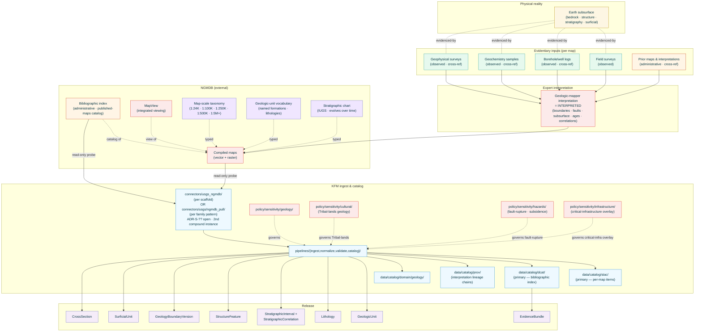
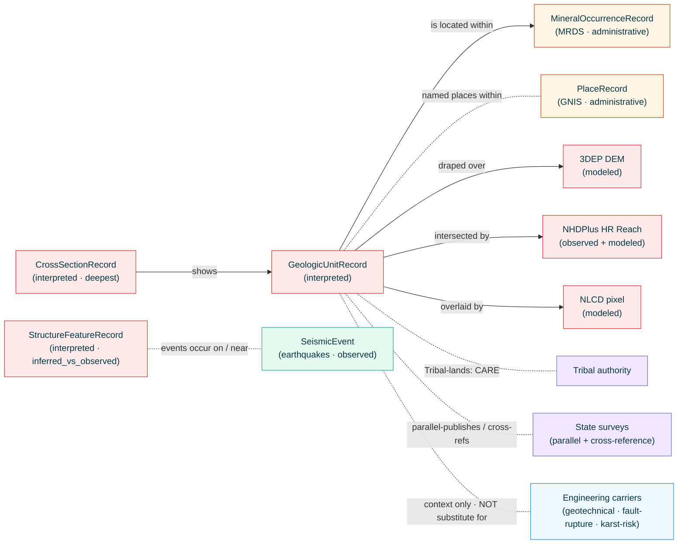

<!-- [KFM_META_BLOCK_V2]
doc_id: kfm://doc/docs-sources-catalog-usgs-usgs-ngmdb
title: USGS National Geologic Map Database
type: product-page
version: v0.2
status: draft
owners: <PLACEHOLDER — Docs steward + Source steward for usgs + Geology domain owner>
created: 2026-05-21
updated: 2026-05-23
policy_label: public
related:
  - docs/sources/catalog/usgs.md
  - docs/sources/catalog/usgs/README.md
  - docs/sources/catalog/usgs/IDENTITY.md
  - docs/sources/catalog/usgs/RIGHTS-AND-SENSITIVITY-MAP.md
  - docs/sources/catalog/usgs/usgs-3dep-elevation.md
  - docs/sources/catalog/usgs/usgs-earthquake-catalog.md
  - docs/sources/catalog/usgs/usgs-gnis-names.md
  - docs/sources/catalog/usgs/usgs-nhdplus-hr.md
  - docs/sources/catalog/usgs/usgs-nlcd.md
  - docs/sources/catalog/usgs/usgs-nwis-water.md
  - docs/sources/catalog/usgs/usgs-the-national-map.md
  - docs/sources/catalog/usgs/usgs-mrds.md
  - docs/sources/catalog/README.md
  - docs/doctrine/directory-rules.md
  - docs/doctrine/lifecycle-law.md
  - docs/doctrine/trust-membrane.md
  - docs/standards/SENSITIVITY_RUBRIC.md
  - docs/standards/DCAT.md
  - docs/standards/STAC.md
  - docs/standards/PROV.md
  - docs/runbooks/geology/SOURCE_REFRESH_RUNBOOK.md
  - docs/domains/geology/README.md
  - data/registry/sources/usgs/
  - policy/sources/usgs/
  - policy/sensitivity/geology/
  - policy/sensitivity/cultural/
  - policy/sensitivity/hazards/
  - policy/sensitivity/infrastructure/
  - schemas/contracts/v1/source/
  - schemas/contracts/v1/geology/
  - connectors/usgs_ngmdb/
  - connectors/usgs/
adr_refs:
  - ADR-0001 (schema home)
  - <PROPOSED> ADR-S-04 (source-role vocabulary v1 — including whether `interpreted` is a §24.1.1 enum value or maps to `modeled`)
  - <PROPOSED> ADR-S-05 (sensitivity tier scheme T0–T4)
  - <PROPOSED> ADR-S-12 (connector cadence + quarantine recovery)
  - <PROPOSED> ADR-S-14 (cross-lane join policy)
  - <PROPOSED> ADR-S-?? (connector-home convention — now TWO instances of compound `connectors/usgs_<program>/` pattern; surfaced from MRDS and reinforced here)
  - <PROPOSED> ADR-S-?? (interpreted source-role formalization — geologic maps are the canonical example of interpretation-as-evidence)
  - <PROPOSED> ADR-S-?? (map-scale comparison policy — different scales carry different fidelity; cross-scale comparison is a category error)
  - <PROPOSED> ADR-S-?? (multiple-interpretations chain — how KFM handles the same area mapped by different authors at different times with different interpretations)
  - <PROPOSED> ADR-S-?? (family-catalog short-ID reconciliation — `usgs-geologic-maps` per v1.1 family catalog §5 vs `usgs-ngmdb` per this scaffold)
tags: [kfm, docs, sources, catalog, usgs, ngmdb, geologic-maps, geology, mapview, bedrock, surficial, interpreted, interpretation, multi-scale, multi-vintage]
notes:
  - "PROPOSED product-page scaffold filled to v0.2; ninth page in the usgs family folder."
  - "Filename inferred from doc_id slug: usgs-ngmdb.md (the doc_id has the same repeated 'usgs-' slug error as MRDS — file would more naturally live at usgs-ngmdb.md). Family-catalog §5 short ID is 'usgs-geologic-maps' (different name for the same federal product). Reconciliation flagged as ADR-S-?? in Q-1."
  - "Source-role: HETEROGENEOUS with `interpreted` as the dominant mode. Geologic maps are fundamentally interpretations of evidence — boundaries, faults, subsurface inferences are expert interpretations, not direct observations. Per KFM-P1-IDEA-0051 knowledge-character labels (which explicitly include `interpreted`), this is the canonical interpretation-source product page. ADR-S-04 disposition note: if Atlas §24.1.1 enum does not formally admit `interpreted`, it maps to `modeled` with prominent interpretation-as-evidence callouts; this page assumes both possibilities."
  - "Atlas Geology object classes carried (the MOST of any product page in this family): GeologicUnit (primary) + Lithology + StratigraphicInterval + StratigraphicCorrelation + StructureFeature + GeologyBoundaryVersion + SurficialUnit + CrossSection. Per Atlas Geology §B + §C."
  - "Map scale is the dominant evidentiary axis. A 1:24,000 quadrangle and a 1:500,000 state map carry dramatically different fidelity for the same area. Cross-scale comparison is a category error. Validators require map_scale on every record."
  - "Multiple-interpretations chain: the same area mapped by different authors at different times produces multiple interpretations. KFM preserves all as distinct interpretation records (analogous to GNIS attestation_n + MRDS source-attribution-chain) rather than collapsing to a single 'current' map."
  - "Connector-home convention: scaffold places this at connectors/usgs_ngmdb/, the SECOND occurrence of the compound family-prefix flat-folder pattern (after MRDS connectors/usgs_mrds/). Both are geology/mineral-resources surfaces — a coincidence or signal of an emerging sub-family convention? ADR-S-?? has more data to evaluate now."
  - "Cross-references the MRDS sibling explicitly: NGMDB is the geologic-context layer (units, structures) for MRDS occurrence records. Complementary, not redundant."
[/KFM_META_BLOCK_V2] -->

<a id="top"></a>

# USGS National Geologic Map Database

> The U.S. federal index and distribution surface for compiled geologic maps — bedrock, surficial, structural, stratigraphic, and cross-section maps — published by USGS, state geological surveys, and other contributing publishers. KFM's primary `interpreted`-role carrier for Geology-domain GeologicUnit, Lithology, StratigraphicInterval, StructureFeature, GeologyBoundaryVersion, SurficialUnit, and CrossSection object classes.

<!-- Top-of-file badge row. Placeholder targets — replace once badge generator (KFM-P3-FEAT-0005) is wired. -->


**Status:** `PROPOSED — scaffold filled` &nbsp;·&nbsp; **Doc version:** `v0.2` &nbsp;·&nbsp; **Family:** [`usgs`](./README.md) &nbsp;·&nbsp; **Last reviewed:** 2026-05-23

> [!IMPORTANT]
> **This page is a pointer.** Authoritative descriptor fields live in [`data/registry/sources/usgs/`](../../../../data/registry/sources/usgs/). Rights, sensitivity, engineering / fault-rupture-mapping disclaimers, CARE applicability, and infrastructure-overlay policy live in [`policy/sources/usgs/`](../../../../policy/sources/usgs/), [`policy/sensitivity/geology/`](../../../../policy/sensitivity/geology/), [`policy/sensitivity/cultural/`](../../../../policy/sensitivity/cultural/), [`policy/sensitivity/hazards/`](../../../../policy/sensitivity/hazards/), and [`policy/sensitivity/infrastructure/`](../../../../policy/sensitivity/infrastructure/), summarized at the family level in [`RIGHTS-AND-SENSITIVITY-MAP.md`](./RIGHTS-AND-SENSITIVITY-MAP.md). **Do not duplicate descriptor or policy content on this product page.**

> [!CAUTION]
> **Geologic maps are interpretations, not direct observations.** Per `KFM-P1-IDEA-0051` knowledge-character labels (which explicitly include `interpreted`): unit boundaries, fault traces, formation extents, subsurface inferences, age assignments, and correlation between maps are all expert interpretations of evidence — not direct measurements. KFM derivatives that cite a geologic map as if it were a measurement (e.g., *"the formation extends here"* without the interpretive qualifier) collapse interpretation into observation and violate the source-role anti-collapse rule per Atlas §24.1.2. See [§2.1](#21-sub-product-source-role-decomposition) and [§6](#6-provenance-fields). *(Atlas §24.1.1 enum disposition for `interpreted` is itself open — Q-2 + ADR-S-04.)*

> [!CAUTION]
> **Map scale is gate-blocking evidence.** A 1:24,000 quadrangle (high-detail) and a 1:500,000 state-level map (overview) carry dramatically different fidelity for the same area. KFM derivatives that compare or join across scales without the `map_scale` qualifier substitute coarse interpretation for detailed evidence — a category error. Every NGMDB record carries `map_scale` as a mandatory provenance field; cross-scale comparison requires explicit ADR-S-?? sign-off (Q-5). See [§7.2](#72-map-scale-as-evidentiary-axis).

> [!WARNING]
> **Multiple interpretations of the same area exist and KFM preserves all.** A region mapped by USGS in 1925, re-mapped by the state survey in 1965, and re-interpreted in modern academic work in 2010 produces **three distinct interpretation records** — NOT a single "current" view. KFM derivatives that silently pick one interpretation over others without explicit reasoning collapse the multi-interpretation chain into spurious certainty. See [§7.3](#73-multiple-interpretations-chain) and Q-6.

---

## 📑 Contents

1. [Overview](#1-overview)
2. [Product identity within the family](#2-product-identity-within-the-family)
3. [Source authority and family-catalog reconciliation](#3-source-authority-and-family-catalog-reconciliation)
4. [Catalog profiles used](#4-catalog-profiles-used)
5. [Collection identity](#5-collection-identity)
6. [Provenance fields](#6-provenance-fields)
7. [Temporal handling, map scale, and multiple-interpretations chain](#7-temporal-handling-map-scale-and-multiple-interpretations-chain)
8. [Identity, geometry, and Atlas-object mapping](#8-identity-geometry-and-atlas-object-mapping)
9. [Rights and sensitivity (pointer)](#9-rights-and-sensitivity-pointer)
10. [Reality boundary](#10-reality-boundary)
11. [Validation and catalog closure](#11-validation-and-catalog-closure)
12. [Related contracts and schemas](#12-related-contracts-and-schemas)
13. [Related connectors and pipelines](#13-related-connectors-and-pipelines)
14. [Example](#14-example)
15. [Open questions](#15-open-questions)
16. [Last reviewed](#16-last-reviewed)

---

## 1. Overview

This product page describes how KFM catalogs the **USGS National Geologic Map Database (NGMDB)** — the U.S. federal index and distribution surface for compiled geologic maps. NGMDB carries:

1. The **bibliographic index** of all published geologic maps in the U.S. (USGS-authored, state-survey-authored, and other-publisher contributions). This is the `administrative` core surface.
2. **Compiled map data** for maps where digital versions exist — vector (where the polygons/lines have been digitized) and raster scans (where older maps are scan-only).
3. **MapView** — the integrated viewing surface.
4. Where USGS itself is the original publisher with first-party field-survey origin: the **observed** field-survey component AND the **interpreted** map representation derived from it.

> [!NOTE]
> **EXTERNAL** *(preserved without re-verification this session).* USGS distributes NGMDB through the Mineral and Geologic Map Sciences subprogram and historically through `ngmdb.usgs.gov`-class endpoints + MapView. Current endpoint URLs, distribution formats (Shapefile / GeoJSON / Geodatabase / KML / scanned PDFs/TIFFs / GeoPDF), the bibliographic-index format, and the relationship between NGMDB and any TNM-mediated access (see [`usgs-the-national-map.md`](./usgs-the-national-map.md)) all remain **NEEDS VERIFICATION** until re-fetched in a session with web access.

> [!IMPORTANT]
> **NGMDB IS the federal carrier for the family-catalog `usgs-geologic-maps` sub-source.** The v1.1 family-catalog `usgs.md` §5 row uses the short ID `usgs-geologic-maps` for what is, in practice, the same federal product NGMDB indexes and distributes. v0.2 of this page surfaces the family-catalog short-ID reconciliation explicitly as Q-1 / ADR-S-?? rather than silently picking one name. See [§3.2](#32-family-catalog-short-id-reconciliation).



[Back to top](#top)

---

## 2. Product identity within the family

> [!NOTE]
> This page is the **ninth** product authored under the `usgs` source family. It is the **first** product page where the **`interpreted` source-role** is the dominant mode (other pages have used it as a secondary/conditional role) — making this the canonical example for ADR-S-?? interpretation-source formalization. It also carries the **most Atlas Geology object classes** of any product in the family (seven distinct object classes per Atlas Geology §B).

| Attribute | Value | Status |
|---|---|---|
| Product name | USGS National Geologic Map Database (NGMDB) | **CONFIRMED EXTERNAL** (USGS program name). |
| Family-catalog short ID | **`usgs-geologic-maps`** (per v1.1 family-catalog §5) vs **`usgs-ngmdb`** (this scaffold's slug) — reconciliation open | **OPEN** — see [§3.2](#32-family-catalog-short-id-reconciliation) and Q-1. |
| Source family | `usgs` | **CONFIRMED** family-folder convention. |
| KFM source-role | **Heterogeneous** with **`interpreted` as the dominant mode** — see [§2.1](#21-sub-product-source-role-decomposition) | **CONFIRMED-heterogeneous**; `interpreted` enum disposition open per ADR-S-04 (Q-2). |
| Atlas Geology object classes carried | **GeologicUnit** (primary) · **Lithology** · **StratigraphicInterval** · **StratigraphicCorrelation** · **StructureFeature** · **GeologyBoundaryVersion** · **SurficialUnit** · **CrossSection** *(seven distinct object classes — the most of any product in the family)* | **CONFIRMED** per Atlas Geology §B + §C. |
| Domain served | **Geology and Natural Resources** (primary) with cross-lane relations to Soil (parent material from surficial), Hydrology (hydrostratigraphy without replacing measurements), Hazards (fault/landslide/subsidence context without owning risk), People/Land (lease/parcel/operator constraint) per Atlas Geology §F | **CONFIRMED**. |
| Primary upstream surface | USGS NGMDB program (historically `ngmdb.usgs.gov` + MapView); may be partly TNM-mediated for some assets | **EXTERNAL — NEEDS VERIFICATION** of current endpoint and access pattern. |
| Cardinal evidence objects | Seven KFM-derived record classes mapping to the Atlas object classes above; index records as separate `MapPublicationRef` | **PROPOSED** — multiple new object classes. |
| Geometry | **Polygon** for units + surficial; **LineString** for structures + correlation; **Point** for sample/index locations; **2D vertical line** for cross-sections | **CONFIRMED-mixed**. |
| Cadence | **Editorial / per-map publication** — episodic; new maps added to NGMDB as published | **CONFIRMED-editorial**. |
| Geographic scope | **U.S. domestic** (NGMDB scope) with significant historical variation in coverage; some areas have multiple competing maps and others have only legacy small-scale coverage | **CONFIRMED**. |

### 2.1 Sub-product source-role decomposition

Per Atlas §24.1.1 enum + `KFM-P1-IDEA-0051` knowledge-character labels + Atlas Geology §B/§C/§D:

| Sub-product | `source_role` | Rationale | Anti-collapse risk |
|---|---|---|---|
| **Bibliographic index** (catalog of published maps with metadata) | **`administrative`** | Federal compilation of map publications — the index itself is administrative. | Citing as if it were the map content. |
| **GeologicUnit polygons** (the bedrock-unit map polygons themselves) | **`interpreted`** (primary mode) | The unit boundary is an expert interpretation of where one formation transitions to another. Field evidence supports the interpretation but does not directly observe the boundary on a continuous basis. | **THE defining anti-collapse risk for this product.** Citing a unit polygon as if it were a measurement collapses interpretation into observation. |
| **Lithology** (rock-type assignment per unit) | **`interpreted`** | Lithology assignment for a mapped unit is an interpretation drawing on representative samples + analog comparison + structural context. | Citing as if it were a per-point rock identification. |
| **StratigraphicInterval** (geologic age + named formation) | **`interpreted`** | Age and formation assignment depend on the IUGS Stratigraphic Chart (which itself evolves over time) + biostratigraphic / geochronologic evidence + correlation with type sections. | Citing as if the age were directly measured at every point. |
| **StratigraphicCorrelation** (linkage of units across maps) | **`interpreted`** | The claim that the formation mapped here is the same as the formation mapped over there is an interpretation — sometimes well-supported, sometimes a hypothesis. | Citing correlation as identity. |
| **StructureFeature** (faults, folds, contacts) | **`interpreted`** with `inferred_vs_observed` flag | Some structures are directly observable (exposed faults); most are inferred from juxtaposition + topology + geophysics. NGMDB conventions distinguish solid lines (observed/well-located) from dashed lines (inferred/concealed). | Citing inferred structures as observed structures. |
| **GeologyBoundaryVersion** (versioned unit boundaries across re-interpretations) | **`administrative`** with `interpreted` lineage | The boundary-version mechanism is administrative; the boundaries themselves are interpreted (see GeologicUnit row). | Citing one version as definitive without acknowledging that re-interpretations exist. |
| **SurficialUnit** (unconsolidated deposits — alluvium, glacial drift, dunes, etc.) | **`interpreted`** | Surficial-unit mapping is an interpretation of Quaternary deposit history. | Citing as direct observation of deposit history. |
| **CrossSection** (vertical interpretations through the subsurface) | **`interpreted`** (the deepest interpretation in the product) | Cross-sections project surface mapping + scattered borehole data + geophysics into a 2D vertical interpretation of the subsurface. Often the most speculative element of a geologic map. | Citing as observed subsurface structure. |
| **First-party USGS field-survey records** (subset where the originating publication is a USGS field survey) | **`observed`** with `interpreted` overlay | The field observations themselves are observed; their incorporation into the map is interpreted. | Citing the map as direct observation; KFM preserves the field-survey records as a separate evidence layer. |
| **Map-scale taxonomy** (1:24,000 / 1:100,000 / 1:250,000 / 1:500,000 / 1:5,000,000 / …) | **`administrative`** | USGS-controlled scale taxonomy. | Citing scales as interchangeable (see [§7.2](#72-map-scale-as-evidentiary-axis)). |
| **Geologic-unit vocabulary / Stratigraphic chart** | **`administrative`** with `interpreted` overtone for the classification scheme | The named-formation vocabulary is administrative; the chart itself is an interpretive consensus that evolves. | Citing chart-vintage versions as if interchangeable. |

> [!CAUTION]
> **`interpreted` as a first-class source-role.** Per `KFM-P1-IDEA-0051`, knowledge-character labels explicitly include `interpreted`. Whether Atlas §24.1.1's source-role enum formally admits `interpreted` as a peer of `observed | regulatory | modeled | aggregate | administrative | candidate | synthetic` is itself an open ADR-S-04 question (carried forward from the earthquake-catalog page Q-9 and surfaced as gating here). v0.2 treats `interpreted` as a first-class role with the **`interpreted_vs_modeled` disposition flag** on every record — if ADR-S-04 admits `interpreted`, the flag carries it directly; if not, the flag carries `modeled` with a co-published `interpretation_basis` field documenting why the modeled label nonetheless reflects expert interpretation rather than algorithmic computation.

### 2.2 Disambiguation from siblings

| If you want… | Use… | Not this page |
|---|---|---|
| **Compiled mineral occurrence records** | [`usgs-mrds.md`](./usgs-mrds.md) — compiled occurrence-record carrier | MRDS is point-occurrence records; NGMDB is polygon-unit maps + structural features. They cross-reference but are not redundant. |
| **Borehole and well-log data** | A separate Geology-domain product page (Atlas Geology §B owns `BoreholeReference` + `Well LogReference` as distinct object classes) | NGMDB shows where boreholes are referenced on a map but is not the borehole carrier. |
| **Geochemistry sample data** | A separate Geology-domain product page (Atlas Geology §B owns `Geochemistry SampleReference`) | Same as above. |
| **Geophysical observations** | A separate Geology-domain product page (Atlas Geology §B owns `Geophysical Observation`) | Same as above. |
| **State-survey-specific geologic maps** | Either NGMDB (if indexed there) or `<PROPOSED> docs/sources/catalog/kgs/` for Kansas Geological Survey first-party access | NGMDB indexes many state-survey maps; first-party state distribution may have additional content. |
| **Aeromagnetic / gravity / electromagnetic geophysical maps** | A separate Geophysical Observation product page | Geophysical maps are typically separately indexed. |
| **Engineering / geotechnical site investigation** | Site-specific geotechnical reports under qualified-engineers signatures — **NEVER** NGMDB | See [§9.1](#91-t0-default-with-engineering-disclaimer). |
| **Fault-rupture mapping for seismic-design purposes** | State seismic-hazard authorities + USGS Earthquake Hazards Program seismic-design products — **NEVER** generic NGMDB structural features | See [§9.2](#92-fault-rupture-and-seismic-design-disclaimer). |
| **Karst-risk assessments for infrastructure design** | State karst-program authorities + site-specific surveys — **NEVER** NGMDB surficial maps alone | See [§9.3](#93-infrastructure-overlay-cross-lane-sensitivity). |
| **The earthquake catalog** (events, mechanisms) | [`usgs-earthquake-catalog.md`](./usgs-earthquake-catalog.md) | NGMDB structural features show *where* faults are mapped; the earthquake catalog records *what* events have happened on them. |
| **Mining-community place names** | [`usgs-gnis-names.md`](./usgs-gnis-names.md) cross-joined via co-located point | — |
| **Terrain context** for a geologic unit | [`usgs-3dep-elevation.md`](./usgs-3dep-elevation.md) cross-joined | — |
| **Hydrography overlay** on a geologic unit | [`usgs-nhdplus-hr.md`](./usgs-nhdplus-hr.md) cross-joined | — |
| **Land cover overlay** on a geologic unit | [`usgs-nlcd.md`](./usgs-nlcd.md) cross-joined | — |

> [!CAUTION]
> **NGMDB does NOT support engineering, regulatory, or compliance use.** Per the engineering-disclaimer cascade established across the family (3DEP §9.3 → NHDPlus HR §9.1 → NLCD §9.1 → Water Data §9.1 → MRDS §9.1) and extended for the geologic-map interpretive character: a regional geologic map does NOT substitute for site-specific geotechnical investigation, fault-rupture mapping for seismic design, karst-risk assessment, or any other engineering-grade determination. The controlling carrier in every such case is the site-specific professional investigation under qualified-engineer signatures.

[Back to top](#top)

---

## 3. Source authority and family-catalog reconciliation

See [`data/registry/sources/usgs/`](../../../../data/registry/sources/usgs/) for the authoritative `SourceDescriptor`. **Do not duplicate descriptor fields here.** Descriptor canonical schema home is `schemas/contracts/v1/source/source-descriptor.json` per Directory Rules §7.4 / ADR-0001 — **NEEDS VERIFICATION**.

### 3.1 Doctrinal anchors

- **Atlas Geology §B** owned object classes including *"Geologic Unit; Lithology; Stratigraphic Interval; Geologic Age; Fault Structure; … CrossSection; Hydrostratigraphic Unit"* — anchor for the seven Atlas object classes mapped in §2 and §8.
- **Atlas Geology §C ubiquitous-language table** rows for `Geologic Unit`, `SurficialUnit`, `Lithology`, `Stratigraphic Interval`, `StratigraphicCorrelation`, `StructureFeature`, `GeologyBoundaryVersion` — all CONFIRMED-term / PROPOSED-field-realization.
- **Atlas Geology §F cross-lane relations**: Soil (parent material from surficial), Hydrology (hydrostratigraphy without replacing measurements), Hazards (*"fault/landslide/subsidence risk context without owning risk"*), People/Land (*"lease, parcel, operator relation cannot prove deposits"*).
- **Atlas Geology §G** viewing products explicitly include *"bedrock unit map; surficial unit map; structure/fault view; stratigraphy/correlation view; borehole public-generalized view; mineral occurrence/deposit summary; extraction/reclamation context"* — direct anchor for the seven derived record classes this page produces.
- **`KFM-P1-IDEA-0051`** — knowledge-character labels explicitly include `interpreted` — anchor for the §2.1 source-role decomposition.
- **v1.1 family-catalog `usgs.md` §5 row `usgs-geologic-maps`**: *"USGS Geologic Maps ... `administrative` (compiled maps); `observed` where field surveys are first-party"* — the v1.1 family-catalog framing is consistent with this page's heterogeneous-role disposition but does NOT yet include the dominant `interpreted` role; v0.2 surfaces this as Q-2 / ADR-S-04 gating.
- **v1.1 family-catalog `usgs.md` §6 anti-collapse table**: *"Administrative compilation cited as observation"* DENY condition applies; extended here for *"Interpretation cited as observation"*.
- Atlas §24.1.2 anti-collapse register — *"Administrative compilation cited as observation"* DENY + (extended for this page) *"Interpretation cited as observation"* + *"Cross-scale comparison without scale-aware fidelity context"*.
- `KFM-P22-PROG-0043` — Read-only probe posture.
- `KFM-P14-IDEA-0002` — STAC/DCAT/PROV distribution contract.
- `KFM-P26-PROG-0025` — Catalog writers emit DCAT/STAC/PROV with EvidenceBundle references.
- `KFM-P27-FEAT-0003` / 0004 — STAC Projection lint + Catalog QA CI surface.

### 3.2 Family-catalog short-ID reconciliation

> [!IMPORTANT]
> **NGMDB and `usgs-geologic-maps` are the same federal product under two names.** The v1.1 family-catalog `usgs.md` §5 already carries this product under the short ID **`usgs-geologic-maps`**; this scaffold's doc_id uses the slug `usgs-ngmdb`. Both names refer to the federal carrier for compiled geologic maps — NGMDB is the specific index/distribution mechanism name, "USGS Geologic Maps" is the broader functional name.
>
> | Candidate name | Pros | Cons |
> |---|---|---|
> | **`usgs-geologic-maps`** (family-catalog v1.1 §5 short ID) | Functional name; broader scope (encompasses any USGS-compiled geologic map work); already in the family catalog | Loses the specific NGMDB program-name anchor |
> | **`usgs-ngmdb`** (scaffold slug) | Specific program-name anchor; matches the actual federal product name; clearer external mapping | Would require updating the v1.1 family-catalog §5 row |
>
> v0.2 preserves both candidates and defers the reconciliation to ADR-S-?? (Q-1). The page itself uses **NGMDB** as the title and program-anchor name; the family-catalog row remains `usgs-geologic-maps` until the ADR resolves.

[Back to top](#top)

---

## 4. Catalog profiles used

| Profile | Lane | Used by this product? | Basis |
|---|---|---|---|
| **STAC** Item + Collection with `kfm:provenance` (**primary for spatial map content**) | `data/catalog/stac/` | **PROPOSED — Yes (primary for map content)** | Spatial product with polygon / line / point geometry per object class. `C4-01` / `C4-02`. |
| **STAC Projection extension** | (STAC properties) | **PROPOSED — Yes** | Per map's native CRS (often state-plane or UTM zone); `KFM-P27-FEAT-0003`. |
| **STAC Raster extension** | (STAC properties) | **PROPOSED — Yes (for scanned/georeferenced rasters)** | Many older maps are scan-only and ingested as georeferenced rasters. |
| **STAC Classification extension** | (STAC properties) | **PROPOSED — Yes (for unit-class taxonomies)** | The geologic-unit vocabulary fits the Classification extension's pattern (analogous to NLCD class-map). |
| **DCAT** Dataset + Distribution (**primary for bibliographic index**) | `data/catalog/dcat/` | **PROPOSED — Yes (primary for bibliographic index)** | `C4-05`; `KFM-P14-IDEA-0002`. The bibliographic index is tabular bibliographic metadata — natural DCAT fit. |
| **PROV-O / PAV** lineage (**critical for interpretation lineage**) | `data/catalog/prov/` | **PROPOSED — Yes (critical)** | `C8-03`. PROV chain MUST capture: (a) the **author-attribution chain** (publisher + cartographers + editors), (b) the **evidentiary inputs** that informed the interpretation (field-survey records, boreholes, geophysics, prior maps), (c) the **multiple-interpretations chain** across re-interpretations of the same area (§7.3), (d) the **stratigraphic-chart vintage** in force when the interpretation was made. |
| **Domain projection — Geology and Natural Resources** | `data/catalog/domain/geology/` | **PROPOSED — Yes (primary domain)** | Atlas Geology §G viewing products. |
| **Cross-lane domain projection — Hazards** | `data/catalog/domain/hazards/` | **PROPOSED — Yes (limited; context-only)** | Atlas Geology §F: *"fault/landslide/subsidence risk context without owning risk."* Structural features (faults) appear in both projections with context-not-authority discipline. |
| **Cross-lane domain projection — Soil** | `data/catalog/domain/soil/` | **PROPOSED — Yes (parent-material context)** | Atlas Geology §F: surficial-unit and lithology context for soil parent-material classification. |
| **STAC × Darwin Core hybrid** (`C4-03`) | — | **CONFIRMED No** | Not biological occurrence. |

> [!TIP]
> **PROV-O is uniquely load-bearing for this product.** The interpretation lineage of a geologic map is the central evidentiary anchor — a 1965 map and a 2010 re-interpretation of the same area share an area-of-interest but have different interpretation chains. KFM preserves both chains intact (analogous to the MRDS source-attribution-chain pattern in [`usgs-mrds.md`](./usgs-mrds.md) §6).

[Back to top](#top)

---

## 5. Collection identity

- **PROPOSED Collection id patterns:**
  - Bibliographic index → `kfm-usgs-ngmdb-index`
  - Per-map publications → `kfm-usgs-ngmdb-publications`
  - GeologicUnit polygons → `kfm-usgs-ngmdb-geologic-units`
  - SurficialUnit polygons → `kfm-usgs-ngmdb-surficial-units`
  - Lithology records → `kfm-usgs-ngmdb-lithology`
  - StratigraphicInterval records → `kfm-usgs-ngmdb-stratigraphic-intervals`
  - StratigraphicCorrelation records → `kfm-usgs-ngmdb-stratigraphic-correlations`
  - StructureFeature lines → `kfm-usgs-ngmdb-structure-features`
  - GeologyBoundaryVersion records → `kfm-usgs-ngmdb-boundary-versions`
  - CrossSection records → `kfm-usgs-ngmdb-cross-sections`
  - Map-scale vocabulary → `kfm-usgs-ngmdb-scale-vocab`
  - Geologic-unit vocabulary → `kfm-usgs-ngmdb-unit-vocab`
  - Stratigraphic-chart vocabulary (per vintage) → `kfm-usgs-ngmdb-strat-chart-vocab-<chart_vintage>`
- **PROPOSED Item id pattern:** `kfm-usgs-ngmdb-<collection>-<map_id>-<unit_id>-<interpretation_n>` where `interpretation_n` indexes re-interpretations of the same map area (§7.3).
- **PROPOSED namespace:** `kfm:` *(see family-catalog Q-10).*
- **Asset roles:** **NEEDS VERIFICATION** — confirm against [`schemas/contracts/v1/source/`](../../../../schemas/contracts/v1/source/). Likely role set:
  - `map-publication-ref` — JSON canonical bibliographic record
  - `geologic-unit-polygon` — GeoJSON polygon with unit attribution
  - `structure-feature-line` — GeoJSON line with structure attribution + `inferred_vs_observed` flag
  - `cross-section-asset` — image/SVG of the cross-section
  - `interpretation-lineage` — JSON PROV graph of the interpretation chain
  - `author-attribution` — JSON publisher + cartographer + editor records
  - `strat-chart-vintage-ref` — link to the IUGS-or-equivalent stratigraphic-chart version in force
  - `scanned-source-asset` — original scan (for legacy maps)
  - `geo-referenced-source-asset` — georeferenced raster
  - `metadata` — DCAT JSON-LD
  - `evidence_bundle` — JSON-LD (`application/ld+json`)
- **Collection description (PROPOSED):** Must declare the **interpreted-as-primary source role**, the **map-scale-aware fidelity discipline**, the **multiple-interpretations chain preservation rule**, the **NOT-for-engineering-or-regulatory posture** (with explicit fault-rupture and karst-risk exclusions), the **CARE applicability** for Tribal-lands geology, the **infrastructure-overlay** cross-lane discipline, the **USGS no-warranty banner** verbatim, and the **anti-collapse statement** from [§2.1](#21-sub-product-source-role-decomposition).

[Back to top](#top)

---

## 6. Provenance fields

**CONFIRMED shape** (per `C4-01`) for NGMDB records. Per-product values are **NEEDS VERIFICATION** until the connector is wired.

| Field | Type | Source / how computed |
|---|---|---|
| `spec_hash` | sha256 of canonical record | `C1-02`. |
| `evidence_bundle_ref` | `kfm://evidence/<digest>` | `C4-04`. |
| `run_record_ref` | `kfm://run/<run-id>` | `C1-01`. |
| `audit_ref` | `kfm://audit/<attestation-id>` | SLSA / OPA. |
| `policy_digest` | sha256 of policy bundle (incl. Geology + Cultural + Hazards + Infrastructure policy versions) | `KFM-P22-PROG-0001`. |
| **NGMDB-specific fields** | | |
| `ngmdb_map_id` | NGMDB-assigned map publication identifier (stable per publication) | **CONFIRMED-required**. |
| `map_publication_year` | ISO year — when the map was first published | **CONFIRMED-required**. |
| `map_publisher` | Enum (`usgs`, `state_geological_survey`, `academic`, `other`) + organization name | **CONFIRMED-required**. |
| `map_scale` | String (`1:24000`, `1:100000`, `1:250000`, `1:500000`, `1:5000000`, …) | **CONFIRMED-required-gate-blocking**. Per [§7.2](#72-map-scale-as-evidentiary-axis). |
| `map_format` | Enum (`vector`, `georeferenced_raster`, `scanned_pdf`, `scanned_tiff`, `geopdf`, `hybrid`) | **CONFIRMED-required**. |
| `interpretation_n` | Monotonic integer indexing re-interpretations of the same area at the same scale | **CONFIRMED-required** per [§7.3](#73-multiple-interpretations-chain). |
| `prior_interpretation_refs` | Array of `kfm://...` refs for prior interpretations of the same area | `prov:wasInformedBy` chain. Required when `interpretation_n > 0`. |
| **Source-role specific fields** | | |
| `interpreted_vs_modeled` | Enum disposition (`interpreted` if ADR-S-04 admits; `modeled_with_interpretation_basis` otherwise) | **CONFIRMED-required** per §2.1 ADR-S-04 disposition. |
| `interpretation_basis` | Structured (`{evidentiary_input_types: [field_survey, borehole, geophysics, prior_map, geochemistry], rigor_class: …}`) | **CONFIRMED-required** for all `interpreted` records. |
| `inferred_vs_observed` | Enum (`solid_line_well_located`, `dashed_line_inferred`, `dotted_line_concealed`, `queried_uncertain`, `dashed_with_query`) — for StructureFeature records | **CONFIRMED-required** for structure-feature records per NGMDB cartographic convention. |
| **Author / publication attribution** | | |
| `author_attribution_chain` | Array of structured attribution refs — cartographer(s), editor(s), reviewer(s), peer-review status | **CONFIRMED-required**. Analogous to the MRDS source-attribution-chain pattern. |
| `peer_review_status` | Enum (`peer_reviewed`, `internal_review`, `open_file_unreviewed`, `unknown`) | **PROPOSED-required when knowable**. |
| **Vocabulary vintage** | | |
| `strat_chart_vintage` | ISO date — version of the stratigraphic chart (IUGS or equivalent) in force when the interpretation was made | **CONFIRMED-required**. Critical because the chart evolves over time. |
| `unit_vocabulary_ref` | Link to the geologic-unit vocabulary version used | **CONFIRMED-required**. |
| **Geometry / scale-aware** | | |
| `map_native_crs` | EPSG code for the map's native CRS (often state-plane or UTM zone) | **CONFIRMED-required**. |
| `scale_aware_resolution_meters` | Numeric — the effective ground resolution implied by the map scale (e.g., 1:24K ≈ ~12m/pixel cartographic resolution; 1:500K ≈ ~250m/pixel) | **PROPOSED-required**. |
| **Cross-references** | | |
| `cross_source_refs` | Array of cross-refs to MRDS occurrence records, GNIS named places, borehole/well-log records that share the map's footprint | **PROPOSED**. |
| `tribal_lands_overlap` | Boolean + Tribal-authority context | **PROPOSED-required when applicable** per [§9.4](#94-care-applicability-tribal-lands-geology). |
| `kfm:provenance.reality_boundary_ref` | `kfm://realityboundary/...` | Per [§10](#10-reality-boundary). |
| `kfm:provenance.engineering_disclaimer_ref` | `kfm://disclaimer/ngmdb-not-engineering-not-regulatory` | Per [§9.1](#91-t0-default-with-engineering-disclaimer). |
| `kfm:provenance.fault_rupture_disclaimer_ref` | `kfm://disclaimer/ngmdb-structure-not-fault-rupture-design` | Per [§9.2](#92-fault-rupture-and-seismic-design-disclaimer). |
| `kfm:provenance.infrastructure_overlay_review_ref` | `kfm://review/ngmdb-infrastructure-overlay/...` | Per [§9.3](#93-infrastructure-overlay-cross-lane-sensitivity). |

Per-asset integrity: **`file:checksum`** (SHA-256) on every published distribution (per `C3-02`).

> [!TIP]
> **`interpretation_basis` + `inferred_vs_observed` + `strat_chart_vintage` + `author_attribution_chain` together form the interpretation-pedigree discipline** unique to this product. An interpretation's evidentiary weight is a function of all four: what evidence informed it, what fraction is observed vs inferred, what stratigraphic framework was in force, and who authored / reviewed it. Collapsing any one erodes the pedigree.

> [!TIP]
> **`map_scale` is non-negotiable.** Per [§11](#11-validation-and-catalog-closure), absence of `map_scale` is gate-blocking and quarantines the record. The field exists to prevent cross-scale comparison failures (Q-5).

[Back to top](#top)

---

## 7. Temporal handling, map scale, and multiple-interpretations chain

### 7.1 Times

Map records have unusually rich temporal discipline because the interpretation, the underlying field surveys, the publication, and the stratigraphic-chart vintage all carry independent times.

| Time | Meaning for this product | Status |
|---|---|---|
| `field_survey_vintage` | When the underlying field surveys (where first-party USGS) were conducted | **PROPOSED-required-when-knowable**. May be year-precision only. |
| `interpretation_vintage` | When the interpretation was made (often the year of cartographic completion) | **CONFIRMED-required**. |
| `map_publication_year` | When NGMDB or the original publisher released the map | **CONFIRMED-required**. |
| `strat_chart_vintage` | When the stratigraphic chart in force was published | **CONFIRMED-required**. |
| `source_time` | When USGS NGMDB most recently exported / updated this map record | **EXTERNAL — NEEDS VERIFICATION**. |
| `valid_from` | When this NGMDB snapshot became authoritative in KFM | **CONFIRMED-required**. |
| `valid_to` | When superseded; `null` while current | **CONFIRMED-required** (nullable). |
| `retrieval_time` | When KFM's connector fetched the snapshot | **CONFIRMED-required**. |
| `release_time` | When the KFM-derived item was published | **CONFIRMED-required** at Gate G. |
| `correction_time` | When KFM emits a `CorrectionNotice` | **CONFIRMED-required** when applicable. |
| `observed_time` | **Applies only to `observed` sub-records** (first-party USGS field-survey records) — the survey date | **PROPOSED-required** for the observed sub-role per §2.1. |

> [!IMPORTANT]
> **An interpretation has a vintage; the underlying field surveys have a different vintage; the stratigraphic chart in force at the time has yet another vintage.** A 1965 USGS map of a Kansas county may reflect 1950s field surveys interpreted against a 1960 stratigraphic chart and published as a 1965 quadrangle. KFM derivatives that imply *"present-day understanding of the geology here"* from such a map have substituted historical interpretation for current science.

### 7.2 Map scale as evidentiary axis

> [!CAUTION]
> **Map scale is the dominant fidelity axis.** Different scales carry dramatically different evidentiary weight:
>
> | Scale | Typical use | Effective resolution | Anti-collapse risk |
> |---|---|---|---|
> | **1:24,000** (USGS 7.5-minute quadrangle) | Detailed local geology | ~12 m | Most evidence-dense; "ground truth" for many KFM analyses. |
> | **1:100,000** | Regional geology | ~50 m | Generalized; fine detail lost. |
> | **1:250,000** | State / multi-county | ~125 m | Overview; unit boundaries are smoothed. |
> | **1:500,000** | State-level overview | ~250 m | Single-state maps; very generalized. |
> | **1:1,000,000 to 1:5,000,000** | National / continental | ~500 m to 2.5 km | Conceptual / synoptic only. |
>
> Display posture per scale:
>
> - **Per scale-bucket display:** KFM derivatives display NGMDB content at its own scale; cross-scale joins require explicit ADR-S-?? sign-off (Q-5).
> - **Zoom-aware fidelity:** UI map surfaces showing NGMDB content gate-block zoom levels that exceed the native scale's effective resolution (showing a 1:500K map at city-block zoom is misleading).
> - **Cross-scale validators:** §11 requires `map_scale` on every record; any cross-scale comparison validator must enforce zoom-aware display.

### 7.3 Multiple-interpretations chain

> [!WARNING]
> **The same area mapped by different authors at different times produces multiple interpretations — KFM preserves all.** A Kansas county may have:
>
> - A 1925 USGS folio with USBM-era cartographic conventions.
> - A 1965 USGS bulletin re-mapping with updated unit definitions.
> - A 1990 state-survey publication with revised structural interpretation.
> - A 2010 academic re-interpretation of subsurface stratigraphy.
>
> Each is a **distinct interpretation record** with its own `interpretation_n`. Per Atlas Geology §B's `GeologyBoundaryVersion` object class (CONFIRMED Geology-domain term), the boundary-versioning mechanism preserves this multi-interpretation chain. KFM:
>
> - **Does NOT** collapse to a single "current" interpretation.
> - **Preserves** each interpretation with full author-attribution-chain + interpretation-basis.
> - **Surfaces** the chain in Focus Mode so users can see all available interpretations of an area.
> - **Defers** to qualified geologists in the user's research community for "which interpretation is best for purpose X" — KFM does not adjudicate.
>
> Per Q-6 / ADR-S-?? (multiple-interpretations chain policy).

[Back to top](#top)

---

## 8. Identity, geometry, and Atlas-object mapping

### 8.1 Identity

| Attribute | Value (PROPOSED unless noted) | Status |
|---|---|---|
| Cardinal identity (publications) | `ngmdb_map_id` (NGMDB-assigned, stable per publication) | **CONFIRMED**. |
| Per-interpretation identity | `(ngmdb_map_id, interpretation_n)` per [§7.3](#73-multiple-interpretations-chain) | **PROPOSED**. |
| Per-unit identity | `(ngmdb_map_id, interpretation_n, unit_id)` where `unit_id` is publication-internal | **PROPOSED**. |
| Unit-vocabulary identity | `(strat_chart_vintage, unit_code)` | **PROPOSED**. |

### 8.2 Geometry (per Atlas object class)

| Atlas object class | KFM record class | Geometry type | Catalog Item geometry |
|---|---|---|---|
| **GeologicUnit** | `GeologicUnitRecord` | Polygon (the unit's mapped footprint) | `Polygon` / `MultiPolygon` |
| **SurficialUnit** | `SurficialUnitRecord` | Polygon | `Polygon` / `MultiPolygon` |
| **Lithology** | `LithologyRecord` | None (tabular, joined to GeologicUnit via unit_id) | `null` (DCAT-only) |
| **StratigraphicInterval** | `StratigraphicIntervalRecord` | None (tabular vocabulary, joined to GeologicUnit) | `null` (DCAT-only) |
| **StratigraphicCorrelation** | `StratigraphicCorrelationRecord` | None (links across maps) | `null` (DCAT-only) |
| **StructureFeature** | `StructureFeatureRecord` | LineString (fault, fold, contact) with `inferred_vs_observed` flag | `LineString` / `MultiLineString` |
| **GeologyBoundaryVersion** | `GeologyBoundaryVersionRecord` | Inherits from the GeologicUnit it bounds; versioned | Per parent unit |
| **CrossSection** | `CrossSectionRecord` | LineString of the cross-section trace at the surface + asset reference to the section drawing | `LineString` (trace) + image asset (drawing) |
| **MapPublicationRef** | `MapPublicationRefRecord` | Polygon (map footprint / index extent) | `Polygon` |

### 8.3 CRS and projection

| Attribute | Value (PROPOSED) | Status |
|---|---|---|
| Map native CRS | Per-map — often state-plane (NAD83) or UTM zone with NAD27/NAD83 datum | **EXTERNAL — NEEDS VERIFICATION** per map. |
| KFM **analysis CRS** | Preserved from upstream per record | **CONFIRMED** per `ML-061-096`. |
| KFM **delivery CRS** | `EPSG:3857` for web tile delivery; `EPSG:4326` for catalog payloads | **PROPOSED**. |
| Datum-shift discipline | Older maps in NAD27 must be transformed to NAD83/WGS84 with `TransformReceipt` per `ML-061-022` | **CONFIRMED-required**. |
| STAC `proj:*` fields | Required: `proj:code`, `proj:bbox`, `proj:geometry`, `proj:transform` (for georeferenced rasters) | **PROPOSED-required**. |

### 8.4 Cross-domain reference graph



[Back to top](#top)

---

## 9. Rights and sensitivity (pointer)

**Do not restate policy here.** See [`policy/sensitivity/geology/`](../../../../policy/sensitivity/geology/), [`policy/sensitivity/cultural/`](../../../../policy/sensitivity/cultural/), [`policy/sensitivity/hazards/`](../../../../policy/sensitivity/hazards/), [`policy/sensitivity/infrastructure/`](../../../../policy/sensitivity/infrastructure/), and the family-level summary at [`RIGHTS-AND-SENSITIVITY-MAP.md`](./RIGHTS-AND-SENSITIVITY-MAP.md).

### 9.1 T0 default with engineering disclaimer

> [!NOTE]
> **Default tier: T0 (Open).** NGMDB is U.S. federal public-domain data (17 U.S.C. §105). KFM follows the upstream open posture.

> [!IMPORTANT]
> **NGMDB carries the family's most extensive engineering-disclaimer cascade.** A regional geologic map does NOT substitute for any of:
>
> - **Site-specific geotechnical investigation** — foundation design, settlement analysis, seepage analysis require qualified-engineer site investigation.
> - **Fault-rupture mapping for seismic design** — see [§9.2](#92-fault-rupture-and-seismic-design-disclaimer).
> - **Karst-risk assessment** for infrastructure design — see [§9.3](#93-infrastructure-overlay-cross-lane-sensitivity).
> - **Modern resource estimation** under JORC / NI 43-101 / SEC S-K 1300 — see [`usgs-mrds.md`](./usgs-mrds.md) §9.1.
> - **Wetlands delineation, water-rights determination, mining-rights determination** — see siblings' disclaimer cascades.
>
> Every UI surface presenting NGMDB content carries the *"informational, not engineering / not regulatory"* banner per `engineering_disclaimer_ref`.

### 9.2 Fault-rupture and seismic-design disclaimer

> [!WARNING]
> **NGMDB StructureFeature records are NOT fault-rupture mapping for seismic-design purposes.** Fault-rupture-hazard zones (such as Alquist-Priolo zones in California and analogous state-level designations elsewhere) are controlled by state seismic-hazard authorities under specific surveying methods and qualified-engineer signatures. NGMDB's fault traces:
>
> - Show **where faults are mapped** as a geologic interpretation at a stated scale.
> - Do NOT establish where surface fault rupture may occur in a future earthquake.
> - Do NOT satisfy any state seismic-design regulatory requirement.
> - Inherit the **`inferred_vs_observed` flag** — dashed/inferred faults are not observed traces.
>
> Per `fault_rupture_disclaimer_ref` in [§6](#6-provenance-fields). Every UI surface displaying NGMDB structural features carries this disclaimer.

### 9.3 Infrastructure-overlay cross-lane sensitivity

> [!CAUTION]
> **Geologic-context overlays on critical infrastructure escalate at the join.** Per Atlas §24.5.2 critical-infrastructure rows + family-catalog §7 infrastructure-overlay override:
>
> - Karst-exposure mapping over public-water-supply infrastructure → T4 at the join.
> - Fault traces near nuclear-facility footprints → T4 at the join.
> - Bedrock-unit mapping over dam foundations → T4 at the join.
> - Surficial-unit (e.g., liquefiable deposits) over seismic-design-critical infrastructure → T4 at the join.
>
> The NGMDB content itself is T0; the **join** is what triggers escalation per ADR-S-14. Standard fallback: county-level or HUC-8 generalization for infrastructure-overlay public surfaces. Per `infrastructure_overlay_review_ref` in [§6](#6-provenance-fields).

### 9.4 CARE applicability — Tribal lands geology

> [!WARNING]
> **Geologic context on Tribal lands routes through `sovereignty_review`.** Per Atlas §24.5.2 sovereignty rows + S.O. 3206 + the established cultural-sensitivity disciplines (GNIS §9.2 + MRDS §9.3): geologic mapping over Tribal lands carries cultural and economic dimensions (mineral resources; sacred geology; historical sites); KFM does not unilaterally featurize or aggregate NGMDB content on Tribal lands without Tribal-government concurrence.

### 9.5 Archaeology overlap

> [!CAUTION]
> **Geologic context for known archaeological sites can incidentally reveal sensitive information.** Karst features (caves, sinkholes) and surficial deposits often correlate with archaeological-resource sites. Per archaeology-sensitivity policy + the GNIS §9.5 sensitive-features pattern: featuring NGMDB content adjacent to known archaeological sensitivities routes through archaeology-sensitivity review.

[Back to top](#top)

---

## 10. Reality boundary

> [!IMPORTANT]
> **A geologic map is an interpretation, not a measurement.** Focus-Mode AI answers about geology MUST cite NGMDB as `interpreted` (or `modeled` per ADR-S-04 disposition) and surface the interpretation_basis, the author_attribution_chain, the strat_chart_vintage, and the map_scale. *"The bedrock here is X"* is not what NGMDB attests; *"This map at this scale, made by these authors against this stratigraphic-chart vintage, interprets the bedrock here as X based on these evidentiary inputs"* is.

> [!IMPORTANT]
> **Map scale is fidelity.** A 1:500,000 map and a 1:24,000 map of the same area carry dramatically different evidentiary weight. Claims at a scale finer than the source map's native scale have crossed the reality boundary.

> [!IMPORTANT]
> **Multiple interpretations co-exist.** The same area may be interpreted differently by different authors at different times. Picking one interpretation as "the" geology is a category error; the correct disposition is *"this set of interpretations exists for this area, with these author-attribution chains and these evidentiary bases."*

> [!IMPORTANT]
> **Surface mapping does not directly observe subsurface.** Cross-sections and subsurface unit extents are projections from surface mapping + scattered borehole data + geophysics. The deeper into the subsurface the claim, the more speculative the interpretation.

> [!IMPORTANT]
> **Stratigraphic frameworks evolve.** The IUGS Stratigraphic Chart has been revised many times; named formations have been split, merged, renamed, and re-correlated. An age assignment made under the 1965 chart may not be the same as an age assignment made under the 2020 chart. KFM preserves the `strat_chart_vintage` per record.

> [!IMPORTANT]
> **Inferred is not observed.** NGMDB's cartographic convention distinguishes solid-line (observed/well-located) from dashed-line (inferred) from dotted-line (concealed/projected) from queried. KFM preserves `inferred_vs_observed` per structural-feature record. A dashed/inferred fault is a hypothesis; KFM derivatives that treat it as an observation have collapsed the cartographic discipline.

[Back to top](#top)

---

## 11. Validation and catalog closure

- **Catalog closure required before public release** (Pass-10 / `KFM-P1-IDEA-0020`).
- **NGMDB map ID present** (gate-blocking) — `usgs_ngmdb_map_id_required`.
- **Map publication year present** (gate-blocking) — `usgs_ngmdb_map_publication_year_required`.
- **Map publisher present and enum-valid** (gate-blocking) — `usgs_ngmdb_map_publisher_enum_explicit`.
- **Map scale present and enum-valid** (gate-blocking — the defining validator for this product) — `usgs_ngmdb_map_scale_required`. Absence quarantines per [§7.2](#72-map-scale-as-evidentiary-axis).
- **Map format present** (gate-blocking) — `usgs_ngmdb_map_format_enum_explicit`.
- **Interpretation vintage present** (gate-blocking) — `usgs_ngmdb_interpretation_vintage_required`.
- **Stratigraphic-chart vintage present** (gate-blocking) — `usgs_ngmdb_strat_chart_vintage_required`.
- **Interpretation_n + prior_interpretation_refs append-only versioning** (gate-blocking) — `usgs_ngmdb_multi_interpretation_append_only` per [§7.3](#73-multiple-interpretations-chain).
- **Interpreted vs modeled disposition explicit** (gate-blocking) — `usgs_ngmdb_interpreted_vs_modeled_explicit` per Q-2 / ADR-S-04.
- **Interpretation basis present for all interpreted records** (gate-blocking) — `usgs_ngmdb_interpretation_basis_required`.
- **Inferred vs observed flag present for structure features** (gate-blocking on StructureFeature records) — `usgs_ngmdb_inferred_vs_observed_required`.
- **Author attribution chain present** (gate-blocking) — `usgs_ngmdb_author_attribution_chain_required`.
- **Peer review status present when knowable** — `usgs_ngmdb_peer_review_status_when_knowable`.
- **Source-role anti-collapse** (gate-blocking) — `usgs_ngmdb_role_anti_collapse`:
  - Geologic unit polygon cited as observation of bedrock at every point → Gate F deny.
  - Inferred fault cited as observed fault → Gate F deny.
  - Cross-section cited as observed subsurface → Gate F deny.
  - Interpretation at one scale cited at a finer scale → Gate F deny (cross-scale anti-collapse).
  - Single interpretation cited as definitive when multi-interpretation chain exists → Gate F deny.
- **Scale-aware display rule enforced** (gate-blocking on publication) — `usgs_ngmdb_scale_aware_display_enforced` per [§7.2](#72-map-scale-as-evidentiary-axis): UI MUST gate-block zoom levels exceeding the map's native scale resolution.
- **Engineering-claim disclaimer banner required** (gate-blocking) — `usgs_ngmdb_engineering_disclaimer_banner_required`.
- **Fault-rupture disclaimer banner required for structure features** (gate-blocking) — `usgs_ngmdb_fault_rupture_disclaimer_banner_required` per [§9.2](#92-fault-rupture-and-seismic-design-disclaimer).
- **Infrastructure-overlay generalization required** — `usgs_ngmdb_infrastructure_overlay_generalization` per [§9.3](#93-infrastructure-overlay-cross-lane-sensitivity).
- **CARE Tribal-lands review required where applicable** (gate-blocking) — `usgs_ngmdb_tribal_lands_review_required` per [§9.4](#94-care-applicability-tribal-lands-geology).
- **Cross-lane Hazards context-only enforcement** — `usgs_ngmdb_hazards_context_only_enforced`: structural features in the hazards projection carry the context-not-authority flag per Atlas Geology §F.
- **People/Land non-ownership boundary enforced** — `usgs_ngmdb_people_land_non_ownership_enforced` per Atlas Geology §B.
- **Datum-shift TransformReceipt required for older NAD27 maps** — `usgs_ngmdb_datum_shift_receipt_required` per `ML-061-022`.
- **STAC Projection lint** (`KFM-P27-FEAT-0003`).
- **STAC Classification extension closure for unit taxonomy** — `usgs_ngmdb_stac_classification_closure` (analog of the NLCD validator).
- **DCAT mirror closure** (`KFM-P14-IDEA-0002`, `KFM-P26-PROG-0025`).
- **PROV-O closure** (`C8-03`): author-attribution-chain + interpretation-basis + multi-interpretation chain via `prov:wasRevisionOf` + `prov:wasInformedBy` + `prov:wasDerivedFrom`.
- **STAC × ReleaseManifest checksum closure** (`KFM-P22-PROG-0037`).
- **Catalog QA CI surface** (`KFM-P27-FEAT-0004`).
- **Promotion Gates A–G** (`KFM-P22-PROG-0001`).

> [!TIP]
> **Negative fixtures required for this product:** map record without `map_scale` (Gate A quarantine — the canonical NGMDB failure); inferred fault cited as observed (Gate F deny — anti-collapse axis 1); 1:500K map content displayed at city-block zoom (Gate C deny — scale-aware display rule); single interpretation cited definitively when multi-interpretation chain exists (Gate F deny — anti-collapse axis 5); cross-section cited as direct subsurface observation (Gate F deny — anti-collapse axis 3); NGMDB structural feature displayed on a seismic-design UI surface without fault-rupture disclaimer (Gate C deny — §9.2); karst-exposure overlay on public-water-supply infrastructure published without ADR-S-14 review (Gate C deny — §9.3); NAD27 map ingested without datum-shift TransformReceipt (Gate D deny — `ML-061-022`); peer-review status missing where knowable (Gate D deny — provenance discipline); Tribal-lands geology featurized without sovereignty review (Gate C deny — §9.4); strat_chart_vintage missing (Gate A quarantine — interpretation-vintage discipline).

[Back to top](#top)

---

## 12. Related contracts and schemas

| Surface | Path (PROPOSED unless noted) | Status |
|---|---|---|
| `SourceDescriptor` semantic + schema | [`contracts/source/`](../../../../contracts/source/) · [`schemas/contracts/v1/source/`](../../../../schemas/contracts/v1/source/) | **PROPOSED** canonical homes per Directory Rules §7.4 / ADR-0001. |
| `MapPublicationRefRecord` schema | [`schemas/contracts/v1/geology/`](../../../../schemas/contracts/v1/geology/) | **PROPOSED** — bibliographic-index carrier. |
| `GeologicUnitRecord` schema | [`schemas/contracts/v1/geology/`](../../../../schemas/contracts/v1/geology/) | **PROPOSED** — maps to Atlas Geology §B `Geologic Unit`. |
| `SurficialUnitRecord` schema | [`schemas/contracts/v1/geology/`](../../../../schemas/contracts/v1/geology/) | **PROPOSED** — maps to Atlas Geology §B `SurficialUnit`. |
| `LithologyRecord` schema | [`schemas/contracts/v1/geology/`](../../../../schemas/contracts/v1/geology/) | **PROPOSED** — maps to Atlas Geology §B `Lithology`. |
| `StratigraphicIntervalRecord` schema | [`schemas/contracts/v1/geology/`](../../../../schemas/contracts/v1/geology/) | **PROPOSED** — maps to Atlas Geology §B `Stratigraphic Interval`. |
| `StratigraphicCorrelationRecord` schema | [`schemas/contracts/v1/geology/`](../../../../schemas/contracts/v1/geology/) | **PROPOSED** — maps to Atlas Geology §C `StratigraphicCorrelation`. |
| `StructureFeatureRecord` schema (with `inferred_vs_observed`) | [`schemas/contracts/v1/geology/`](../../../../schemas/contracts/v1/geology/) | **PROPOSED** — maps to Atlas Geology §B `StructureFeature`. |
| `GeologyBoundaryVersionRecord` schema | [`schemas/contracts/v1/geology/`](../../../../schemas/contracts/v1/geology/) | **PROPOSED** — maps to Atlas Geology §C `GeologyBoundaryVersion`. |
| `CrossSectionRecord` schema | [`schemas/contracts/v1/geology/`](../../../../schemas/contracts/v1/geology/) | **PROPOSED** — maps to Atlas Geology §B `CrossSection`. |
| `MapScaleVocabulary` enum | [`schemas/contracts/v1/source/usgs_ngmdb_scale.json`](../../../../schemas/contracts/v1/source/) | **PROPOSED** — enum values per cartographic convention. |
| `GeologicUnitVocabulary` schema (per stratigraphic-chart vintage) | [`schemas/contracts/v1/geology/`](../../../../schemas/contracts/v1/geology/) | **PROPOSED**. |
| `StratigraphicChartVintageRef` schema (IUGS or equivalent versioning) | [`schemas/contracts/v1/geology/`](../../../../schemas/contracts/v1/geology/) | **PROPOSED**. |
| `AuthorAttributionChain` schema | [`schemas/contracts/v1/governance/`](../../../../schemas/contracts/v1/governance/) | **PROPOSED** — shared with MRDS source-attribution-chain pattern. |
| `InterpretationBasis` schema | [`schemas/contracts/v1/governance/`](../../../../schemas/contracts/v1/governance/) | **PROPOSED** — the load-bearing schema for `interpreted` records. |
| `EvidenceBundle` / `EvidenceRef` | [`schemas/contracts/v1/evidence/`](../../../../schemas/contracts/v1/evidence/) | **PROPOSED** per `KFM-P26-PROG-0004` / 0005. |
| `RealityBoundaryNote` | [`schemas/contracts/v1/governance/`](../../../../schemas/contracts/v1/governance/) | **PROPOSED**. |
| `CorrectionNotice` | [`schemas/contracts/v1/governance/`](../../../../schemas/contracts/v1/governance/) | **PROPOSED**. |
| `EngineeringDisclaimer` (shared with 3DEP / NHDPlus HR / NLCD / Water Data / MRDS; extended here for fault-rupture and karst-risk exclusions) | [`schemas/contracts/v1/governance/`](../../../../schemas/contracts/v1/governance/) | **PROPOSED**. |
| `FaultRuptureDisclaimer` (new — specific to NGMDB structural features) | [`schemas/contracts/v1/governance/`](../../../../schemas/contracts/v1/governance/) | **PROPOSED**. |
| `HazardsCrossLaneContext` (shared with MRDS) | [`schemas/contracts/v1/governance/`](../../../../schemas/contracts/v1/governance/) | **PROPOSED**. |
| `ScaleAwareDisplayPolicy` schema | [`schemas/contracts/v1/governance/`](../../../../schemas/contracts/v1/governance/) | **PROPOSED** — codifies the zoom-aware display rule per [§7.2](#72-map-scale-as-evidentiary-axis). |

[Back to top](#top)

---

## 13. Related connectors and pipelines

> [!WARNING]
> **Connector-home convention — second occurrence of the compound pattern.** The v0.1 scaffold places this connector at `connectors/usgs_ngmdb/`, the same compound family-prefix flat-folder pattern as the MRDS sibling (`connectors/usgs_mrds/`). The ADR-S-?? connector-home convention (surfaced in [`usgs-mrds.md`](./usgs-mrds.md) §13) now has **two data points for the compound pattern, both for geology/mineral-resources databases**. This may be a coincidence or it may signal an emerging Geology-sub-family convention. v0.2 preserves both candidate paths in the table below pending the ADR. See Q-3.

| Stage | Path (PROPOSED — pending connector-home ADR) | Notes |
|---|---|---|
| Connector | [`connectors/usgs_ngmdb/`](../../../../connectors/usgs_ngmdb/) *(per v0.1 scaffold)* **OR** [`connectors/usgs/ngmdb_pull/`](../../../../connectors/usgs/) *(per family pattern)* | Read-only probe per `KFM-P22-PROG-0043`; content-hash watcher on NGMDB distribution surface; emits pre-RAW `EventEnvelope` only when new maps are added or existing maps are revised. |
| Ingest pipeline | [`pipelines/ingest/`](../../../../pipelines/ingest/) | RAW capture into `data/raw/geology/usgs/ngmdb/<ngmdb_map_id>/<interpretation_n>/`. Preserves USGS source format (vector/raster/scan) for fidelity. |
| Normalize pipeline | [`pipelines/normalize/`](../../../../pipelines/normalize/) | Per-record JSON-LD canonical shape; CRS canonicalization with NAD27 → NAD83/WGS84 `TransformReceipt`; map-scale enum normalization; geologic-unit vocabulary lookup against stratigraphic-chart vintage; author-attribution-chain extraction; inferred_vs_observed flag preservation. |
| **Interpretation-lineage pipeline** | [`pipelines/normalize/interpretation_lineage/`](../../../../pipelines/normalize/) | **PROPOSED** — extracts and canonicalizes the multi-interpretation chain per area + the author-attribution chain per interpretation. The load-bearing pipeline for this product. |
| **Stratigraphic-chart-vintage resolution pipeline** | [`pipelines/normalize/strat_chart_vintage/`](../../../../pipelines/normalize/) | **PROPOSED** — resolves the stratigraphic-chart vintage in force at the interpretation date; reconciles named-formation usage across vintages. |
| **Cross-map correlation pipeline** | [`pipelines/normalize/cross_map_correlation/`](../../../../pipelines/normalize/) | **PROPOSED** — handles `StratigraphicCorrelation` records linking units across maps; preserves correlation confidence per source. |
| **Scale-aware display rule pipeline** | [`pipelines/normalize/scale_aware_display/`](../../../../pipelines/normalize/) | **PROPOSED** — generates `ScaleAwareDisplayPolicy` per record per [§7.2](#72-map-scale-as-evidentiary-axis). |
| **Tribal-lands overlap classifier** | [`pipelines/normalize/tribal_lands_overlap/`](../../../../pipelines/normalize/) | **PROPOSED** — shared with MRDS; routes affected records through sovereignty-review queue. |
| **Infrastructure-overlay review classifier** | [`pipelines/normalize/infrastructure_overlay_review/`](../../../../pipelines/normalize/) | **PROPOSED** — identifies records overlapping critical-infrastructure footprints; routes through ADR-S-14 review queue. |
| Validate pipeline | [`pipelines/validate/`](../../../../pipelines/validate/) | All validators in [§11](#11-validation-and-catalog-closure). |
| Catalog pipeline | [`pipelines/catalog/`](../../../../pipelines/catalog/) | STAC primary for map content + DCAT primary for bibliographic index; rich PROV-O for interpretation chains. |
| Pipeline specs | [`pipeline_specs/geology/`](../../../../pipeline_specs/geology/) | Declarative configuration. |
| Refresh runbook | [`docs/runbooks/geology/SOURCE_REFRESH_RUNBOOK.md`](../../../runbooks/geology/) | **PROPOSED** — shared with MRDS sibling. |
| **NGMDB release watcher** | [`pipelines/watchers/usgs_ngmdb_release/`](../../../../pipelines/watchers/) | **PROPOSED** — content-hash poll on NGMDB distribution surface; emits `EventEnvelope` on new maps or revisions. |
| **Stratigraphic-chart-vintage watcher** | [`pipelines/watchers/iugs_strat_chart_vintage/`](../../../../pipelines/watchers/) | **PROPOSED** — monitors IUGS Stratigraphic Chart for updates; alerts when affected records need re-vintage-stamping. |
| **Multiple-interpretations watcher** | [`pipelines/watchers/ngmdb_multi_interpretation/`](../../../../pipelines/watchers/) | **PROPOSED** — emits an `EventEnvelope` when a new interpretation of an area already covered by prior interpretations is ingested, ensuring the multi-interpretation chain is preserved per [§7.3](#73-multiple-interpretations-chain). |

[Back to top](#top)

---

## 14. Example

*Illustrative only — not authoritative. A minimal STAC + `kfm:provenance` shape lives at [`_examples/stac-item-example.json`](./_examples/stac-item-example.json) (file presence **NEEDS VERIFICATION**); NGMDB-specific example sketches belong at `_examples/geologic-unit-record-example.json`, `_examples/structure-feature-inferred-example.json`, and `_examples/multi-interpretation-chain-example.json` (PROPOSED).*

<details>
<summary><b>Click to expand — minimal GeologicUnitRecord sketch (illustrative, JSON-LD)</b></summary>

```json
{
  "@context": {
    "dcat": "http://www.w3.org/ns/dcat#",
    "dct": "http://purl.org/dc/terms/",
    "prov": "http://www.w3.org/ns/prov#",
    "kfm": "https://kfm.example/ns/kfm#"
  },
  "@type": "kfm:GeologicUnitRecord",
  "@id": "kfm:dataset/usgs-ngmdb-geologic-units-<ngmdb_map_id>-<interpretation_n>-<unit_id>",
  "dct:title": "Geologic unit — <named formation>",
  "dct:type": "kfm:GeologicUnit",
  "dct:description": "Interpreted geologic unit from a published map. Boundary is an expert interpretation, NOT direct observation. Carries map-scale fidelity; do not display at zoom finer than scale supports. Multiple interpretations of this area may exist — see multi-interpretation chain.",
  "dct:license": "<USGS federal no-warranty notice>",
  "kfm:source_role": "interpreted",
  "kfm:role_authority": "U.S. Geological Survey · National Geologic Map Database",
  "kfm:provenance": {
    "spec_hash": "<sha256>",
    "evidence_bundle_ref": "kfm://evidence/<digest>",
    "run_record_ref": "kfm://run/<run-id>",
    "audit_ref": "kfm://audit/<attestation-id>",
    "policy_digest": "<sha256 of policy bundle (incl. geology + cultural + hazards + infrastructure policy versions)>",
    "ngmdb_map_id": "<ngmdb map id>",
    "map_publication_year": "1965",
    "map_publisher": "usgs",
    "map_scale": "1:24000",
    "map_format": "vector",
    "map_native_crs": "EPSG:26714",
    "scale_aware_resolution_meters": 12,
    "interpretation_n": 1,
    "interpretation_vintage": "1964",
    "prior_interpretation_refs": [
      "kfm://release/usgs/ngmdb/geologic-units/<ngmdb_map_id>/0/<unit_id>"
    ],
    "interpreted_vs_modeled": "interpreted",
    "interpretation_basis": {
      "evidentiary_input_types": ["field_survey", "borehole", "prior_map"],
      "rigor_class": "field_verified_with_supporting_evidence"
    },
    "strat_chart_vintage": "1960",
    "unit_vocabulary_ref": "kfm://release/usgs/ngmdb/unit-vocab/usgs-1960/<unit_code>",
    "author_attribution_chain": [
      {
        "role": "cartographer",
        "name": "<author name>",
        "affiliation": "USGS",
        "year": "1964"
      },
      {
        "role": "editor",
        "name": "<editor name>",
        "affiliation": "USGS",
        "year": "1965"
      }
    ],
    "peer_review_status": "internal_review",
    "tribal_lands_overlap": false,
    "cross_source_refs": [
      "kfm://release/usgs/mrds/occurrences/<mrds_dep_id>",
      "kfm://release/usgs/gnis/current/<gnis_feature_id>"
    ],
    "reality_boundary_ref": "kfm://realityboundary/ngmdb-interpreted",
    "engineering_disclaimer_ref": "kfm://disclaimer/ngmdb-not-engineering-not-regulatory",
    "fault_rupture_disclaimer_ref": null,
    "infrastructure_overlay_review_ref": null
  },
  "kfm:polygon": "<GeoJSON polygon of unit footprint>",
  "prov:wasInformedBy": [
    "kfm://source/usgs-field-survey-<survey_id>",
    "kfm://source/prior-ngmdb-map-<prior_map_id>"
  ]
}
```

</details>

<details>
<summary><b>Click to expand — StructureFeatureRecord (inferred fault) sketch (illustrative, JSON-LD)</b></summary>

```json
{
  "@type": "kfm:StructureFeatureRecord",
  "@id": "kfm:dataset/usgs-ngmdb-structure-features-<ngmdb_map_id>-<interpretation_n>-<feature_id>",
  "kfm:source_role": "interpreted",
  "kfm:role_authority": "U.S. Geological Survey · National Geologic Map Database",
  "kfm:provenance": {
    "ngmdb_map_id": "<ngmdb map id>",
    "map_scale": "1:24000",
    "feature_type": "fault",
    "inferred_vs_observed": "dashed_line_inferred",
    "interpretation_basis": {
      "evidentiary_input_types": ["lithologic_juxtaposition", "topology"],
      "rigor_class": "inferred_from_geometric_relationships_only"
    },
    "strat_chart_vintage": "1960",
    "author_attribution_chain": [
      { "role": "cartographer", "name": "<author>", "affiliation": "USGS", "year": "1964" }
    ],
    "fault_rupture_disclaimer_ref": "kfm://disclaimer/ngmdb-structure-not-fault-rupture-design",
    "engineering_disclaimer_ref": "kfm://disclaimer/ngmdb-not-engineering-not-regulatory"
  },
  "kfm:linestring": "<GeoJSON line of fault trace>",
  "kfm:explicit_warnings": [
    "This fault is DASHED/INFERRED, not OBSERVED.",
    "The fault trace is an interpretation of structural-geometric relationships, not a direct field observation.",
    "Do NOT use for fault-rupture mapping for seismic-design purposes — that requires state seismic-hazard authority and qualified-engineer signatures."
  ]
}
```

</details>

<details>
<summary><b>Click to expand — multiple-interpretations chain sketch (illustrative; same area, three interpretations across nine decades)</b></summary>

```json
{
  "@type": "kfm:MultiInterpretationChain",
  "area_of_interest": {
    "named_area": "<example county / quadrangle>",
    "footprint_ref": "<GeoJSON polygon>"
  },
  "interpretations": [
    {
      "interpretation_n": 0,
      "ngmdb_map_id": "<map-1925-id>",
      "map_publisher": "usgs",
      "map_publication_year": 1925,
      "map_scale": "1:62500",
      "strat_chart_vintage": "1925",
      "interpretation_basis": {
        "evidentiary_input_types": ["field_survey"],
        "rigor_class": "early_20th_century_field_mapping"
      },
      "ref": "kfm://release/usgs/ngmdb/geologic-units/<map-1925-id>/0"
    },
    {
      "interpretation_n": 1,
      "ngmdb_map_id": "<map-1965-id>",
      "map_publisher": "usgs",
      "map_publication_year": 1965,
      "map_scale": "1:24000",
      "strat_chart_vintage": "1960",
      "interpretation_basis": {
        "evidentiary_input_types": ["field_survey", "borehole", "prior_map"],
        "rigor_class": "field_verified_with_supporting_evidence"
      },
      "ref": "kfm://release/usgs/ngmdb/geologic-units/<map-1965-id>/0"
    },
    {
      "interpretation_n": 2,
      "ngmdb_map_id": "<map-2010-id>",
      "map_publisher": "state_geological_survey",
      "map_publication_year": 2010,
      "map_scale": "1:24000",
      "strat_chart_vintage": "2008",
      "interpretation_basis": {
        "evidentiary_input_types": ["field_survey", "borehole", "geophysics", "prior_map"],
        "rigor_class": "modern_field_mapping_with_geophysical_and_subsurface_data"
      },
      "ref": "kfm://release/usgs/ngmdb/geologic-units/<map-2010-id>/0"
    }
  ],
  "advisory_notes": [
    "KFM does not adjudicate which interpretation is correct.",
    "Each interpretation has its own author-attribution-chain and interpretation-basis.",
    "Compare interpretations explicitly when reasoning about this area."
  ]
}
```

</details>

> [!IMPORTANT]
> **The third example (multi-interpretation chain) is the unique-to-NGMDB pattern.** No other product page in this family carries multiple co-existing interpretations of the same area at the same time. Other pages have versioning (earthquake-catalog event_update_n; NHDPlus HR release-vintage; GNIS attestation_n; MRDS attestation_n; Water Data approval_status) — but each preserves a *single ground-truth* with revisions over time. NGMDB preserves *multiple competing interpretations*, each authoritative in its own context.

[Back to top](#top)

---

## 15. Open questions

| # | Question | Class | Suggested resolution |
|---|---|---|---|
| Q-1 | **Family-catalog short-ID reconciliation.** `usgs-geologic-maps` (family-catalog v1.1 §5) vs `usgs-ngmdb` (this scaffold's slug). | **OPEN — gating structural** | ADR-S-?? (family-catalog short-ID reconciliation). Default per [§3.2](#32-family-catalog-short-id-reconciliation) = **defer to ADR**; v0.2 preserves both with NGMDB as the title-anchor. |
| Q-2 | **`interpreted` source-role enum disposition.** Per Atlas §24.1.1 enum, is `interpreted` a first-class peer of `observed | regulatory | modeled | aggregate | administrative | candidate | synthetic`, or does it map to `modeled` with interpretation overlay? | **OPEN — gating cross-product** | ADR-S-04 (source-role vocabulary v1). Default per §2.1 = **carry `interpreted_vs_modeled` disposition flag on every record; if Atlas admits `interpreted`, use it; if not, map to `modeled` with `interpretation_basis` co-published**. This product is the canonical example for the ADR. |
| Q-3 | **Connector-home convention — second compound instance.** The v0.1 scaffold places this at `connectors/usgs_ngmdb/`, matching the MRDS `connectors/usgs_mrds/` pattern. Two compound instances, both Geology — is this an emerging sub-family convention? | **OPEN — gating structural (reinforced from MRDS Q-2)** | ADR-S-?? (connector-home convention). Default per [§13](#13-related-connectors-and-pipelines) = **defer to ADR with two data points now in evidence**. |
| Q-4 | **Filename alignment.** doc_id slug `usgs-usgs-ngmdb` has the same repeated `usgs-` prefix issue as MRDS; filename should align to `usgs-ngmdb.md`. | **NEEDS VERIFICATION** | Default = **rename to `usgs-ngmdb.md`** at next filename normalization (same as MRDS Q-4 disposition). |
| Q-5 | **Map-scale comparison policy.** When may KFM derivatives compare or join across scales? | **OPEN — gating** | ADR-S-?? (map-scale comparison policy). Default per [§7.2](#72-map-scale-as-evidentiary-axis) = **per-scale-bucket display; cross-scale comparisons require explicit ADR-S-?? sign-off; zoom-aware UI gate-block enforced**. |
| Q-6 | **Multiple-interpretations chain policy.** How does KFM surface competing interpretations of the same area? | **OPEN — gating** | ADR-S-?? (multiple-interpretations chain). Default per [§7.3](#73-multiple-interpretations-chain) = **preserve all interpretations with author-attribution + interpretation-basis chains; Focus Mode surfaces the chain; KFM does not adjudicate**. |
| Q-7 | **Should each Atlas Geology object class be its own product page** rather than this single NGMDB carrier? | **PROPOSED** | Default = **stay nested here** because NGMDB IS the federal carrier for all seven object classes; splitting would fragment the interpretation-lineage discipline. Per-class product pages may make sense for non-NGMDB-sourced records (state surveys, academic publications) when those become separate sources. |
| Q-8 | **Stratigraphic-chart-vintage reconciliation across maps.** When two interpretations use different chart vintages, how does KFM normalize for comparison? | **OPEN — gating** | Default = **preserve native chart vintage per record; consume IUGS chart-vintage crosswalk where USGS or IUGS publishes one; surface advisory flag on cross-vintage comparison**. ADR-S-?? scope. |
| Q-9 | **Inferred-vs-observed display posture.** Should UI surfaces show inferred (dashed) faults at the same visual weight as observed (solid) faults? | **PROPOSED — gating UI** | Default = **NO — UI MUST visually distinguish per NGMDB cartographic convention; line-style preservation is gate-blocking on display**. |
| Q-10 | **NAD27 → NAD83/WGS84 datum-shift policy.** Older NGMDB maps in NAD27 require transformation. What is KFM's canonical transformation reference? | **PROPOSED** | Default = **NAD27 → NAD83 (CONUS) via NADCON5 grid; NAD83 → WGS84 via WGS84(G2139) per ML-061-022 with explicit TransformReceipt**. |
| Q-11 | **State-survey precedence.** When NGMDB carries both a USGS-authored and a state-survey-authored map of the same area, which is canonical? | **PROPOSED** | Default = **preserve both with explicit publisher labels** (analog of MRDS Q-11 + GNIS Tribal-authority reconciliation); KFM does not unilaterally pick. |
| Q-12 | **Cross-section asset format.** Cross-sections are 2D vertical drawings. How does KFM handle them — preserved as scanned/vector assets, or normalized to a structured representation? | **PROPOSED** | Default = **preserved as scanned/vector source asset + structured `CrossSectionRecord` with trace LineString + interpretation_basis**; structured 2D-vertical representation deferred to a future ADR. |
| Q-13 | **STAC namespace pin** (`kfm:` vs `ks-kfm:`). | **OPEN** | Pin at family / catalog level. |
| Q-14 | **AOI scope.** Kansas extent + adjacent-state maps that are material to Kansas geologic context? | **PROPOSED** | Default = **Kansas + buffer + maps of adjacent Major Geologic Provinces** (e.g., Ozark Plateau extending into MO/OK/AR; High Plains aquifer extending across multiple states). |
| Q-15 | **Engineering / fault-rupture / infrastructure disclaimer UX.** Persistent banner on every UI surface using NGMDB? | **PROPOSED** | Default = **persistent banner on every NGMDB surface; explicit interstitial on engineering, fault-rupture-design, karst-risk, and infrastructure-overlay queries**. Most disclaimer-dense product page in the family. |

[Back to top](#top)

---

## 16. Last reviewed

2026-05-23 *(scaffold filled; product-page polished against doctrine corpus + v1.1 family-catalog entry + Atlas Geology §B/§C/§D/§F/§G + eight sibling product pages; mounted repo not inspected this session).*

---

> **Doc version:** v0.2 (draft) &nbsp;·&nbsp; **Family:** [`usgs`](./README.md) &nbsp;·&nbsp; **Catalog root:** [`docs/sources/catalog/`](../README.md) &nbsp;·&nbsp; **Family-catalog short-ID:** OPEN (see §3 + Q-1) &nbsp;·&nbsp; **`interpreted` enum disposition:** OPEN (see §2.1 + Q-2 + ADR-S-04) &nbsp;·&nbsp; **Connector-home:** OPEN (see §13 + Q-3) &nbsp;·&nbsp; [Back to top](#top)
