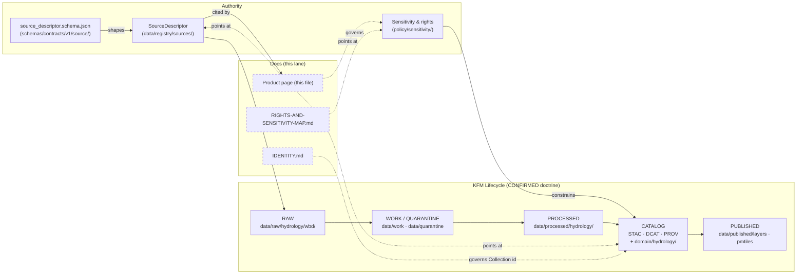

<!-- [KFM_META_BLOCK_V2]
doc_id: kfm://doc/docs-sources-catalog-usgs-watershed-boundary-dataset
title: USGS Watershed Boundary Dataset (WBD/HUC)
type: product-page
version: v0.2
status: draft
owners: <PLACEHOLDER — Docs steward · Source steward (usgs) · Hydrology domain owner>
created: 2026-05-20
updated: 2026-05-23
policy_label: public
related:
  - docs/sources/catalog/usgs/README.md
  - docs/sources/catalog/README.md
  - docs/sources/catalog/IDENTITY.md
  - docs/sources/catalog/RIGHTS-AND-SENSITIVITY-MAP.md
  - docs/doctrine/directory-rules.md
  - data/registry/sources/
tags: [kfm, docs, sources, catalog, usgs, hydrology, wbd, huc]
notes:
  - "v0.2 — full presentation-standard pass; doctrine alignment to hydrology proof-lane references; all repo-state claims remain PROPOSED / NEEDS VERIFICATION pending mounted-repo inspection."
  - "PROPOSED product-page scaffold; sibling-link presence verified in a prior Claude Code session, not in this session."
  - "Atlas references: KFM-P21-PROG-0014, KFM-P25-PROG-0028, KFM-P20-PROG-0010, KFM-P24-PROG-0045."
[/KFM_META_BLOCK_V2] -->

# USGS Watershed Boundary Dataset (WBD/HUC)

> Hydrologic unit code accounting-unit boundaries used as the administrative hydrography framework anchoring KFM's `Watershed` and `HUCUnit` object families.


**Status:** PROPOSED — scaffold only · **Family:** [`usgs`](./README.md) · **Domain owner:** Hydrology · **Last reviewed:** 2026-05-23

---

## Quick jump

- [Overview](#overview)
- [Repo fit](#repo-fit)
- [Source authority](#source-authority)
- [Catalog profiles used](#catalog-profiles-used)
- [Collection identity](#collection-identity)
- [Provenance fields](#provenance-fields)
- [Temporal handling](#temporal-handling)
- [Geometry and projection](#geometry-and-projection)
- [Rights and sensitivity](#rights-and-sensitivity)
- [Validation and catalog closure](#validation-and-catalog-closure)
- [Related contracts, schemas, connectors, pipelines](#related-contracts-and-schemas)
- [Examples](#examples)
- [Open questions](#open-questions)
- [Related docs](#related-docs)

---

## Overview

> [!NOTE]
> This is a **product page**, not a SourceDescriptor. It describes *which KFM artifacts and gates a WBD/HUC asset must pass through*; it does **not** restate the descriptor fields. The canonical SourceDescriptor lives under [`data/registry/sources/`](../../../../data/registry/sources/) per the registry root rule. **PROPOSED** path; **NEEDS VERIFICATION** against a mounted repo.

PROPOSED scaffold. The USGS Watershed Boundary Dataset (WBD) defines nested hydrologic units identified by Hydrologic Unit Codes (HUC2 → HUC12). In KFM, WBD is the **administrative hydrography framework** that:

- Provides the identity backbone for the `Watershed` and `HUCUnit` object families inside the **Hydrology** domain. *(CONFIRMED doctrine — Domains Atlas §24.4.2; KFM Unified Implementation Architecture Build Manual §10.2.)*
- Anchors the HUC12 public-safe fixture that the build manual names as Hydrology's **first slice** (SourceDescriptor + EvidenceBundle + LayerManifest + MapReleaseManifest dry run). *(CONFIRMED doctrine.)*
- Acts as a **context join** for soil hydrologic group, habitat / fauna / flora, settlements, infrastructure, agriculture, hazards, and the Frontier Matrix lane. *(CONFIRMED doctrine — Domains Atlas §24.4.2.)*

**NEEDS VERIFICATION** at the product level: cadence, geographic-coverage scope choice (CONUS vs Kansas clip), current endpoint URL, current product version, rights notice text, and license terms. *Rights and current terms are flagged in the Domains Atlas as `NEEDS VERIFICATION` with sensitive joins failing closed.*

[Back to top](#quick-jump)

---

## Repo fit

| Aspect | Value |
|---|---|
| **This file** | `docs/sources/catalog/usgs/WATERSHED-BOUNDARY-DATASET.md` *(PROPOSED placement; sibling-link verified in prior Claude Code session, not this session)* |
| **Family README** | [`docs/sources/catalog/usgs/README.md`](./README.md) *(PROPOSED)* |
| **Catalog root** | [`docs/sources/catalog/README.md`](../README.md) *(PROPOSED)* |
| **Canonical SourceDescriptor** | [`data/registry/sources/`](../../../../data/registry/sources/) *(CONFIRMED doctrine — `data/registry/` is the registry root for source identity per `directory-rules.md` §9.1)* |
| **Canonical machine schema home** | `schemas/contracts/v1/source/` *(per ADR-0001; NEEDS VERIFICATION against mounted repo)* |
| **Catalog artifact lanes** | `data/catalog/stac/`, `data/catalog/dcat/`, `data/catalog/prov/`, `data/catalog/domain/hydrology/` *(CONFIRMED doctrine — `directory-rules.md` §9.1)* |
| **Connectors** | `connectors/usgs/` *(PROPOSED)* |
| **Pipelines** | `pipelines/ingest/`, `pipelines/normalize/`, `pipelines/validate/`, `pipelines/catalog/` *(PROPOSED)* |
| **Policy / sensitivity** | [`policy/sensitivity/`](../../../../policy/sensitivity/), [`RIGHTS-AND-SENSITIVITY-MAP.md`](../RIGHTS-AND-SENSITIVITY-MAP.md) *(PROPOSED)* |
| **Directory Rules basis** | `directory-rules.md` §2.3 (authority split), §6 (compatibility roots), §9.1 (`data/` lifecycle invariant) |

> [!IMPORTANT]
> Product pages live under `docs/` as a compatibility / documentation lane. They **MUST NOT** become a parallel home for SourceDescriptor fields, schema content, or policy decisions. Authority lives in `data/registry/sources/`, `schemas/contracts/v1/source/`, and `policy/sensitivity/` respectively. *(Doctrine: `directory-rules.md` §8.3 — compatibility roots are not parallel authority.)*

[Back to top](#quick-jump)

---

## Where this product sits



> [!NOTE]
> Dashed nodes are PROPOSED docs lanes; solid nodes are CONFIRMED doctrine lifecycle / authority roots. The diagram intentionally shows the doc pointing **at** authority — never replacing it.

[Back to top](#quick-jump)

---

## Source authority

The authoritative record for this product is the `SourceDescriptor` under [`data/registry/sources/`](../../../../data/registry/sources/). **Do not duplicate** descriptor fields here.

The descriptor is shaped by `source_descriptor.schema.json` (PROPOSED home: `schemas/contracts/v1/source/`; CONFIRMED atlas reference: card **KFM-P28-PROG-0012**). Source-role vocabulary is governed by **ADR-S-04** (CONFIRMED reference; NEEDS VERIFICATION against mounted repo).

| Descriptor concern | Where it lives | Status |
|---|---|---|
| Source identity, role, rights, access, cadence, authority | `data/registry/sources/` | **CONFIRMED doctrine** *(directory-rules.md §9.1)* |
| Source descriptor machine schema | `schemas/contracts/v1/source/` | **PROPOSED** *(per ADR-0001; NEEDS VERIFICATION)* |
| Source-role vocabulary ADR | `docs/adr/` | **PROPOSED** *(ADR-S-04; NEEDS VERIFICATION)* |
| Connector cadence + quarantine recovery ADR | `docs/adr/` | **PROPOSED** *(ADR-S-12; NEEDS VERIFICATION)* |
| Sensitivity policy bundle | `policy/sensitivity/` | **CONFIRMED doctrine** |

> [!CAUTION]
> A second home for descriptor fields **MUST NOT** appear under `docs/`. If a future reviewer is tempted to inline descriptor JSON into this page, that is the drift pattern called out in `directory-rules.md` §8.3 and must be raised against the `docs/registers/DRIFT_REGISTER.md`.

[Back to top](#quick-jump)

---

## Catalog profiles used

KFM emits **STAC, DCAT, and PROV** as derived catalog artifacts from release candidates, not as substitute truth. *(CONFIRMED doctrine — Build Manual §12.1.)* Per Pass-10 / KFM-P1-IDEA-0020, **catalog closure** (DCAT ∧ STAC ∧ PROV) is required before public release.

| Profile | Lane | Used by this product? | KFM-specific extensions |
|---|---|---|---|
| **STAC 1.1** Item / Collection | `data/catalog/stac/` | **PROPOSED — Yes** *(NEEDS VERIFICATION which assets are Items vs Collections)* | `kfm:provenance` namespace *(CONFIRMED — Pass-10 C4-01)*; `kfm:care` where applicable *(CONFIRMED — Pass-10 C15-02)* |
| **DCAT** Dataset / Distribution | `data/catalog/dcat/` | **PROPOSED — Yes** *(NEEDS VERIFICATION — required if KFM federates with open-data catalogs that expect DCAT mirror; Pass-10 C4-05)* | `kfm:id`, `kfm:spec_hash` on Dataset; `conformsTo` on Distribution |
| **PROV-O / PAV** | `data/catalog/prov/` | **PROPOSED — Yes** *(CONFIRMED doctrine — every promoted bundle requires PROV closure; Pass-10 / Pass-26 KFM-P26-IDEA-0007)* | Entity / Activity / Agent graph linking source → transforms → release |
| **Domain projection** | `data/catalog/domain/hydrology/` | **PROPOSED — Yes** *(hydrology is the first proof-lane candidate per Build Manual §10.2)* | Domain-specific projection; not a substitute for STAC/DCAT/PROV closure |

> [!NOTE]
> **Catalog closure is a promotion gate, not a discovery feature.** Per the build manual §6.2 Gate F, an asset is not eligible for release until `CatalogMatrix` reports STAC, DCAT, and PROV records bound to the EvidenceBundle, the digests, the release ID, and the proof pack. *(CONFIRMED doctrine.)*

[Back to top](#quick-jump)

---

## Collection identity

| Element | Value | Source of truth |
|---|---|---|
| Collection id pattern | `kfm-<org>-<product>` → e.g. `kfm-usgs-wbd-huc12` | **PROPOSED** *(pattern is CONFIRMED — Pass-10 C4-02; the exact slug is NEEDS VERIFICATION pending [`IDENTITY.md`](../IDENTITY.md))* |
| Namespace | `kfm:` *(global)* vs `ks-kfm:` *(Kansas-scoped)* | **OPEN-DSC-03** — UNRESOLVED; Pass-10 C4-01 flags the namespace choice as a gap; pin in Collection summary once chosen |
| Asset roles | `data` / `metadata` / `thumbnail` / `attestation` *(provisional)* | **NEEDS VERIFICATION** — confirm against `schemas/contracts/v1/source/` and the STAC profile contract files *(KFM-P31-PROG-0004)* |
| Attestation link | STAC `links` entry with `rel: attestation` → EvidenceBundle | **PROPOSED** — KFM-P7-PROG-0001 (not yet a standard STAC rel; KFM-namespaced) |

> [!IMPORTANT]
> Renaming a Collection **breaks links throughout the catalog**. *(CONFIRMED — Pass-10 C4-02.)* The Collection id chosen here must be pinned in [`IDENTITY.md`](../IDENTITY.md) before any STAC Item is promoted.

[Back to top](#quick-jump)

---

## Provenance fields

STAC `properties.kfm:provenance` block *(CONFIRMED — Pass-10 C4-01; KFM-P18-PROG-0027)*:

| Field | Purpose | Status |
|---|---|---|
| `spec_hash` | sha256 of the canonical record (deterministic identity) | **CONFIRMED doctrine** |
| `evidence_bundle_ref` | `kfm://evidence/<digest>` → content-addressed EvidenceBundle (JSON-LD) | **CONFIRMED doctrine** |
| `run_record_ref` | `kfm://run/<run-id>` → the RunReceipt pinning inputs/outputs/tool versions | **CONFIRMED doctrine** |
| `audit_ref` | `kfm://audit/<attestation-id>` → SLSA / OPA attestations | **CONFIRMED doctrine** |
| `policy_digest` | sha256 of the policy bundle in force at promotion | **CONFIRMED doctrine** |

Per-asset integrity: `file:checksum` *(STAC File extension; CONFIRMED — Pass-10 C4-01).*

<details>
<summary><b>Reference: minimal STAC <code>properties.kfm:provenance</code> shape</b> (illustrative — not authoritative)</summary>

```json
{
  "kfm:provenance": {
    "spec_hash": "sha256:<canonical-record-digest>",
    "evidence_bundle_ref": "kfm://evidence/<bundle-digest>",
    "run_record_ref": "kfm://run/<run-id>",
    "audit_ref": "kfm://audit/<attestation-id>",
    "policy_digest": "sha256:<policy-bundle-digest>"
  }
}
```

> Illustrative only. Authoritative shape lives in the STAC profile contract files *(KFM-P31-PROG-0004)* and the `kfm:provenance` JSON-LD context. **NEEDS VERIFICATION** against the current profile file.

</details>

[Back to top](#quick-jump)

---

## Temporal handling

KFM keeps the following times **distinct where material**. *(CONFIRMED doctrine — Domains Atlas Hydrology §E.)*

| Time | Definition | Notes for WBD/HUC |
|---|---|---|
| **Source time** | When the upstream considers the data authoritative | WBD versioning is by editorial cycle; capture upstream `load_date` / `edit_date` *(KFM-P25-PROG-0028)* |
| **Observed time** | When the underlying phenomenon was observed | Largely n/a — WBD is an *administrative* delineation, not an observation; mark as "delineation revision" |
| **Valid time** | When the assertion is considered true | Bounded by the source-version validity window |
| **Retrieval time** | When KFM fetched the bytes | Bound to the RunReceipt timestamp |
| **Release time** | When KFM promoted the artifact | Bound to the ReleaseManifest |
| **Correction time** | When a correction supersedes a prior release | Bound to the CorrectionNotice / RollbackCard |

> [!NOTE]
> Watershed boundary versioning is named in the Build Manual §10.2 as a **risk** for the Hydrology lane. Carry source version and edit dates through to the released STAC Item so a downstream consumer can distinguish two delineations of the same HUC12 across time.

[Back to top](#quick-jump)

---

## Geometry and projection

PROPOSED — confirm against `data/catalog/` artifacts and the STAC Projection extension contract.

| Concern | Doctrine | This product |
|---|---|---|
| `proj:code` / `proj:bbox` / `proj:geometry` / `proj:shape` / `proj:transform` | STAC Projection frontmatter schema *(KFM-P27-PROG-0011)*; lint report *(KFM-P27-FEAT-0003)* | **NEEDS VERIFICATION** — populate from source CRS; confirm against linter |
| Generalization rules for public layers | `LayerManifest` + `StyleManifest` govern public exposure *(CONFIRMED doctrine)* | **PROPOSED** — HUC12 is generally public-safe at standard generalization; verify per `MapReleaseManifest` |
| Scale support | Lane segment within published layer; carry "fitness for use" notes | **PROPOSED** — small/medium scale; not a substitute for parcel-precision hydrography |

> [!CAUTION]
> Tile artifacts are **carriers, not proof**. *(CONFIRMED doctrine — `TileArtifactManifest`.)* A WBD PMTiles render is not evidence that the underlying SourceDescriptor, EvidenceBundle, and PromotionDecision exist; verify the chain, not the tile.

[Back to top](#quick-jump)

---

## Rights and sensitivity

> [!IMPORTANT]
> **Do not restate policy here.** Authority lives in [`policy/sensitivity/`](../../../../policy/sensitivity/) and is summarized by sibling pointer [`RIGHTS-AND-SENSITIVITY-MAP.md`](../RIGHTS-AND-SENSITIVITY-MAP.md). This section names **what posture applies** and points at the controlling artifact.

| Posture | Status | Reference |
|---|---|---|
| Public-safe geometry for WBD/HUC delineations | **PROPOSED — generally yes** with source/time citation | Build Manual §10.2 |
| Sensitive joins (e.g., hydrology × rare-species, hydrology × archaeology) | **CONFIRMED doctrine — fail closed** | Domains Atlas §D (Hydrology source families); `KFM-P1-IDEA-0031` deny-by-default |
| Rights notice text | **NEEDS VERIFICATION** | Source-steward review |
| License terms | **NEEDS VERIFICATION** *(USGS public-domain expectation; confirm current notice)* | Source-steward review |
| CARE applicability | **NEEDS VERIFICATION** *(WBD is administrative; unlikely CARE-applicable, but record explicitly)* | `kfm:care` namespace decision (Pass-10 C15-02) |

[Back to top](#quick-jump)

---

## Validation and catalog closure

The product is not eligible for `PUBLISHED` until the following close. *(Gate names: CONFIRMED doctrine — Build Manual §6.2.)*

| Gate | Purpose | Status |
|---|---|---|
| **A. Source identity** | `SourceDescriptor` exists; role and authority known | **NEEDS VERIFICATION** |
| **B. Rights and terms** | License / attribution / contact resolved | **NEEDS VERIFICATION** |
| **C. Sensitivity** | Sensitive-join posture resolved (deny-by-default for cross-domain) | **PROPOSED — clean** for WBD alone; **deny-by-default** for sensitive joins |
| **D. Schema / contract** | Artifacts match schemas and contracts | **NEEDS VERIFICATION** |
| **E. Evidence closure** | `EvidenceRef` resolves to `EvidenceBundle`; citations valid | **NEEDS VERIFICATION** |
| **F. Catalog / provenance** | STAC ∧ DCAT ∧ PROV closed; `CatalogMatrix` green | **NEEDS VERIFICATION** *(KFM-P1-IDEA-0020 / KFM-P26-IDEA-0007)* |
| **G. Review / release / rollback** | `PromotionDecision`, `ReleaseManifest`, proof pack, rollback target | **NEEDS VERIFICATION** |

Additional closure checks specific to this product:

- **STAC Projection lint** — `proj:code`, `proj:bbox`, `proj:geometry`, `proj:shape`, `proj:transform` conformance *(KFM-P27-FEAT-0003)* — **PROPOSED**.
- **STAC checksum closure** against the `ReleaseManifest` digest *(KFM-P22-PROG-0037)* — **PROPOSED**.
- **WBD HU12 ↔ USGS Water Services join lane** *(KFM-P20-PROG-0010)* — **PROPOSED**: use WBD HU12 as watershed grouping for instantaneous/daily flow statistics joins, with receipts and source roles.

[Back to top](#quick-jump)

---

## Related contracts and schemas

| Artifact | Path | Status |
|---|---|---|
| Source descriptor contract | `contracts/source/` | **NEEDS VERIFICATION** *(authority is `contracts/`; shape is `schemas/`)* |
| Source descriptor JSON Schema | `schemas/contracts/v1/source/` | **PROPOSED** — per ADR-0001; **NEEDS VERIFICATION** |
| STAC profile contract files | *(home TBD)* | **PROPOSED** — `KFM-P31-PROG-0004` |
| `kfm:provenance` JSON-LD context | *(home TBD)* | **PROPOSED** |
| `kfm:care` JSON-LD context *(if invoked)* | *(home TBD)* | **PROPOSED** — `Pass-10 C15-02` |

## Related connectors and pipelines

| Concern | Path | Status |
|---|---|---|
| Connector | `connectors/usgs/` | **PROPOSED**; watchers MUST NOT publish *(CONFIRMED doctrine — `directory-rules.md` §7.3)* |
| Ingest pipeline | `pipelines/ingest/` | **PROPOSED** |
| Normalize pipeline | `pipelines/normalize/` | **PROPOSED** |
| Validate pipeline | `pipelines/validate/` | **PROPOSED** |
| Catalog pipeline | `pipelines/catalog/` | **PROPOSED** |
| Pipeline specs | `pipeline_specs/hydrology/` | **PROPOSED** |
| Watcher (HTTP validator: ETag / Last-Modified / content-length / manifest checksum) | `pipelines/watchers/` *(or within `connectors/usgs/`)* | **PROPOSED** *(KFM-P21-PROG-0014 + connector cadence ADR-S-12)* |

[Back to top](#quick-jump)

---

## Examples

> [!NOTE]
> Examples are **illustrative**. They are not authoritative shape — the authoritative shape lives in the STAC profile contract files and the JSON-LD contexts. **NEEDS VERIFICATION** against current contracts.

See [`_examples/stac-item-example.json`](../_examples/stac-item-example.json) for the minimal STAC + `kfm:provenance` shape (PROPOSED placement).

<details>
<summary><b>Illustrative: catalog-closure summary record (sketch)</b></summary>

```json
{
  "schema": "kfm.catalog_matrix.v1",
  "release_id": "release:map:hydrology_huc12:<YYYY-MM-DD>",
  "assets": [
    {
      "asset_id": "tileartifact:huc12_pmtiles:v1",
      "artifact_type": "pmtiles",
      "artifact_hash": "sha256:<placeholder>",
      "stac_ref": "stac:item:<placeholder>",
      "dcat_ref": "dcat:distribution:<placeholder>",
      "prov_entity_ref": "prov:entity:<placeholder>",
      "evidence_bundle_id": "bundle:<placeholder>",
      "policy_decision_id": "policy:<placeholder>"
    }
  ],
  "closure_status": "open",
  "validation_report_id": "validation:catalog_matrix:<placeholder>"
}
```

> Source shape: Build Manual §12.2. Reproduced as an illustrative sketch for orientation; do not copy verbatim into a release artifact.

</details>

[Back to top](#quick-jump)

---

## Open questions

| ID | Question | Status |
|---|---|---|
| **OPEN-WBD-01** | Cadence and current endpoint URL — pin specifically to MapServer layer 6 (Kansas query parameters) or to the file-based national snapshot? *(KFM-P21-PROG-0014)* | **OPEN** |
| **OPEN-WBD-02** | Rights notice text and license terms — USGS public-domain expectation must be confirmed against the current product page | **NEEDS VERIFICATION** |
| **OPEN-WBD-03** | CARE applicability — administrative delineations are unlikely to carry CARE obligations, but record the determination explicitly | **OPEN** |
| **OPEN-WBD-04** | Own STAC Collection vs shared with sibling Hydrology products *(e.g., reach-level NHDPlus HR)* | **OPEN** |
| **OPEN-DSC-03** | Namespace pin — `kfm:` (global) vs `ks-kfm:` (Kansas-scoped) — cross-cutting; not specific to this product but blocks Collection summary closure *(Pass-10 C4-01)* | **OPEN — corpus-wide** |
| **OPEN-WBD-05** | HUC12 context-field propagation: should HUC12 be preserved in **every** Hydrology-adjacent crosswalk for join-context? *(KFM-P24-PROG-0045)* | **OPEN** |
| **OPEN-WBD-06** | Versioning strategy — how is a WBD edit revision surfaced as a `material-change` event (watcher debounce window, delta-manifest threshold)? *(C3-04)* | **OPEN** |

[Back to top](#quick-jump)

---

## Related docs

- [`docs/sources/catalog/usgs/README.md`](./README.md) — USGS family overview *(PROPOSED)*
- [`docs/sources/catalog/README.md`](../README.md) — Catalog landing *(PROPOSED)*
- [`docs/sources/catalog/IDENTITY.md`](../IDENTITY.md) — Collection-id rules *(PROPOSED)*
- [`docs/sources/catalog/RIGHTS-AND-SENSITIVITY-MAP.md`](../RIGHTS-AND-SENSITIVITY-MAP.md) — sensitivity pointer *(PROPOSED)*
- [`docs/doctrine/directory-rules.md`](../../../doctrine/directory-rules.md) — placement authority
- [`docs/standards/STAC.md`](../../../standards/STAC.md) — STAC profile *(PROPOSED — `STAC_KFM_PROFILE.md` per Pass-10 C4-01; **NEEDS VERIFICATION** against any drift-register entry)*
- [`docs/standards/PROV.md`](../../../standards/PROV.md) — PROV-O / PAV profile *(see `OPEN-DR-01` re. `PROV.md` vs `PROVENANCE.md`)*
- [`docs/standards/ISO-19115.md`](../../../standards/ISO-19115.md) — geographic metadata crosswalk
- [`docs/standards/PMTILES.md`](../../../standards/PMTILES.md) — published tile-artifact governance

---

*Doc status: **draft · scaffold (v0.2)** · Last reviewed: **2026-05-23** · Provenance: revised against KFM doctrine corpus, no mounted-repo evidence in this session.*

[↑ Back to top](#usgs-watershed-boundary-dataset-wbdhuc)
