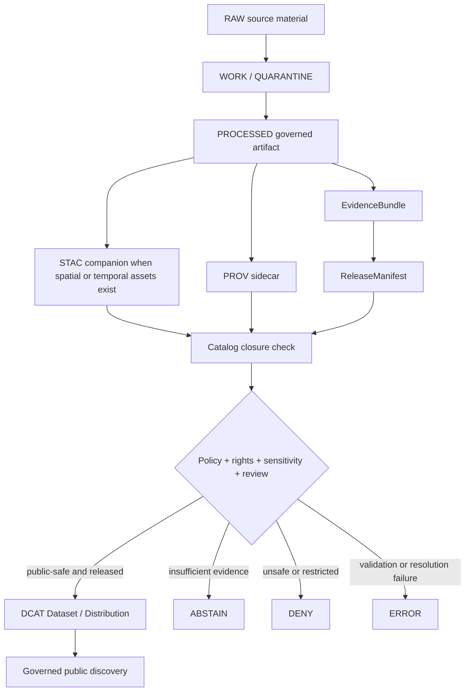

<!-- [KFM_META_BLOCK_V2]
doc_id: kfm://doc/NEEDS-VERIFICATION
title: KFM DCAT Export Profile
type: standard
version: v1
status: draft
owners: OWNER_TBD
created: TODO_CREATED_DATE_NEEDS_VERIFICATION
updated: 2026-05-03
policy_label: public
related: [
  docs/adr/ADR-0001-schema-home.md,
  docs/adr/ADR-0018-prov-stac-dcat-catalog-mapping.md,
  docs/sources/catalog_profiles/KFM_STAC_EXTENSION_PROFILE.md,
  contracts/v1/catalog/dcat/kfm_dcat_dataset.schema.json,
  contracts/v1/provenance/kfm_prov_sidecar.schema.json,
  contracts/v1/release/kfm_release_manifest.schema.json,
  tools/validators/catalog/validate_dcat_dataset.py,
  policy/catalog/dcat/dcat_dataset_gate.rego,
  tests/fixtures/catalog/dcat/valid/minimal.dataset.jsonld,
  tests/fixtures/catalog/dcat/invalid/restricted_access.dataset.jsonld,
  tests/fixtures/catalog/dcat/invalid/missing_provenance.dataset.jsonld
]
tags: [kfm, dcat, catalog, provenance, rights, access-rights, evidence, release-manifest, governance]
notes: [Defines KFM DCAT export rules for public-safe dataset discovery and rights propagation. doc_id, owners, created date, schema-home authority, validator path, policy path, fixture paths, and final target path need repository verification.]
[/KFM_META_BLOCK_V2] -->

<a id="top"></a>

# KFM DCAT Export Profile

Public-safe DCAT JSON-LD export rules for KFM dataset discovery, rights, provenance, release closure, correction lineage, and access posture.

<p align="center">
  
  
  
  
  
</p>

---

## Document status

| Field | Value |
| --- | --- |
| **Status** | `draft` |
| **Target path** | `docs/sources/catalog_profiles/KFM_DCAT_EXPORT_PROFILE.md` — **PROPOSED / NEEDS VERIFICATION** |
| **Owners** | `OWNER_TBD` |
| **Policy label** | `public` |
| **Primary schema** | `contracts/v1/catalog/dcat/kfm_dcat_dataset.schema.json` — **NEEDS VERIFICATION** |
| **Validator** | `tools/validators/catalog/validate_dcat_dataset.py` — **NEEDS VERIFICATION** |
| **Policy gate** | `policy/catalog/dcat/dcat_dataset_gate.rego` — **NEEDS VERIFICATION** |
| **Schema-home posture** | `CONFLICTED / NEEDS VERIFICATION` until repository ADR and mounted-repo evidence confirm the canonical home |
| **Truth posture** | CONFIRMED attached source draft / CONFIRMED KFM doctrine / PROPOSED contract details / UNKNOWN mounted-repo enforcement |

> [!IMPORTANT]
> DCAT is a **public discovery and export layer**. It is not the KFM source of truth, not a substitute for STAC asset records, not a substitute for PROV lineage, not a release authority, and not an authorization bypass.

---

## Quick jump

- [Source boundary](#source-boundary)
- [Operating law](#operating-law)
- [Scope](#scope)
- [Repo fit](#repo-fit)
- [Export flow](#export-flow)
- [Decision outcomes](#decision-outcomes)
- [Core mapping](#core-mapping)
- [Field requirements](#field-requirements)
- [Allowed public values](#allowed-public-values)
- [Rules](#rules)
- [Examples](#examples)
- [Validation checklist](#validation-checklist)
- [Rollback](#rollback)
- [Evidence ledger](#evidence-ledger)
- [Open verification items](#open-verification-items)

---

## Source boundary

This profile states KFM export doctrine and a reviewable DCAT contract shape. It does **not** prove that the target repository currently contains the named schema, validator, policy gate, fixture paths, workflow hooks, emitted catalog records, or runtime enforcement.

| Evidence area | Status | What this document may say | What remains unresolved |
| --- | --- | --- | --- |
| Attached Markdown source draft | CONFIRMED | The source draft defines a DCAT export profile and public-safe discovery posture. | It does not prove repository enforcement. |
| KFM doctrine corpus | CONFIRMED doctrine | KFM requires governed lifecycle, evidence resolution, cite-or-abstain behavior, policy gates, receipts, proof objects, and rollback. | Exact implementation maturity remains unverified here. |
| Attached implementation-reference material | LINEAGE / NEEDS VERIFICATION | Prior repo-aware reports indicate schema-home and repo-surface questions that should be handled explicitly. | A mounted checkout was not inspected in this revision pass. |
| Current mounted repo evidence | UNKNOWN | No current runtime, workflow, validator, or fixture behavior is claimed by this profile. | Confirm with direct repo inspection before treating paths as implemented. |
| External DCAT vocabulary details | NEEDS VERIFICATION for version-sensitive use | This profile uses common DCAT/DCT/PROV JSON-LD carriers. | Confirm current standards references and namespace decisions before public release. |

> [!NOTE]
> Treat this document as **repo-useful and doctrine-grounded**, not as proof of current implementation. All path-sensitive claims are placeholders until the real repository branch is inspected.

[Back to top](#top)

---

## Operating law

KFM’s catalog export law is simple:

```text
RAW -> WORK / QUARANTINE -> PROCESSED -> CATALOG / TRIPLET -> PUBLISHED
```

DCAT export sits **after** evidence, provenance, rights, sensitivity, review, and release checks. A public DCAT record may describe released public-safe artifacts, services, or landing pages. It must not expose internal stores, unresolved records, restricted artifacts, or unreviewed generated language.

### Non-negotiable rules

- EvidenceBundle outranks generated language.
- ReleaseManifest outranks a convenient URL.
- Rights and sensitivity posture outrank discoverability.
- Public clients use governed APIs, released artifacts, and public-safe catalog records.
- Derived records, tiles, scenes, graph projections, search indexes, summaries, and AI descriptions do not become sovereign truth.
- Publication is a governed state transition, not a file move.
- Missing evidence produces `ABSTAIN`.
- Policy denial produces `DENY`.
- Validation or resolution failure produces `ERROR`.

[Back to top](#top)

---

## Scope

This profile defines how KFM exports public catalog records into **DCAT-compatible JSON-LD** without losing:

- license posture
- access-rights posture
- provenance links
- `EvidenceBundle` lineage
- ReleaseManifest closure
- correction and supersession lineage
- review state
- public-safe distribution boundaries
- sensitivity and geoprivacy constraints

A DCAT record may be generated for release-candidate validation, but outward public discovery is valid only after the record passes review, policy, rights, provenance, evidence, and release gates.

### Accepted inputs

A DCAT export may be emitted from records that have:

- resolved `EvidenceBundle`
- resolved ReleaseManifest reference
- resolved provenance sidecar
- known license and rights posture
- public-safe access posture
- public-safe sensitivity posture
- review state sufficient for public discovery
- public-safe distribution targets
- correction lineage when the record replaces, supersedes, withdraws, or is replaced by another record

### Exclusions

Do not export DCAT records that contain or point to:

- `RAW`, `WORK`, or `QUARANTINE` material
- restricted, denied, unknown, or TODO access posture
- unresolved rights or license terms
- exact sensitive geometry without required redaction/generalization receipts
- unpublished candidate data presented as released truth
- direct model output without evidence and AI receipt linkage
- direct canonical/internal store URLs
- internal-only APIs
- unreviewed graph projections, vector indexes, search indexes, map tiles, scenes, dashboards, or summaries
- any distribution endpoint that is not public-safe

[Back to top](#top)

---

## Repo fit

| Concern | Expected KFM surface | Role | Status |
| --- | --- | --- | --- |
| This profile | `docs/sources/catalog_profiles/KFM_DCAT_EXPORT_PROFILE.md` | Human-readable normative export rules. | PROPOSED / NEEDS VERIFICATION |
| Schema-home ADR | `docs/adr/ADR-0001-schema-home.md` or successor ADR | Resolves whether machine schemas live under `contracts/`, `schemas/`, or another canonical home. | NEEDS VERIFICATION |
| STAC profile | `docs/sources/catalog_profiles/KFM_STAC_EXTENSION_PROFILE.md` | Spatial/temporal asset and item discovery companion. | NEEDS VERIFICATION |
| PROV sidecar schema | `contracts/v1/provenance/kfm_prov_sidecar.schema.json` | Machine-readable provenance validation target. | NEEDS VERIFICATION |
| DCAT schema | `contracts/v1/catalog/dcat/kfm_dcat_dataset.schema.json` | Machine-readable DCAT export contract. | NEEDS VERIFICATION |
| Release closure | `contracts/v1/release/kfm_release_manifest.schema.json` | Binds DCAT to artifact, evidence, PROV, STAC, and release state. | NEEDS VERIFICATION |
| DCAT validator | `tools/validators/catalog/validate_dcat_dataset.py` | Enforces schema and public-safe catalog rules. | NEEDS VERIFICATION |
| DCAT policy gate | `policy/catalog/dcat/dcat_dataset_gate.rego` | Fails closed on unsafe export posture. | NEEDS VERIFICATION |
| Valid fixture | `tests/fixtures/catalog/dcat/valid/minimal.dataset.jsonld` | Minimal passing fixture. | NEEDS VERIFICATION |
| Invalid fixtures | `tests/fixtures/catalog/dcat/invalid/*.dataset.jsonld` | Regression fixtures for denied/restricted/missing-provenance cases. | NEEDS VERIFICATION |

> [!WARNING]
> Do not create parallel machine-contract authority. If the mounted repo proves that `schemas/` is canonical instead of `contracts/`, migrate these path references through an ADR-backed update rather than duplicating schema definitions.

[Back to top](#top)

---

## Export flow



The flow is intentionally asymmetric: DCAT receives released evidence and catalog closure; it does not create them.

[Back to top](#top)

---

## Decision outcomes

| Outcome | Meaning | DCAT export behavior |
| --- | --- | --- |
| `ALLOW` | Evidence, rights, sensitivity, review, provenance, catalog closure, and release checks pass. | Emit public-safe DCAT record. |
| `ABSTAIN` | The system cannot support the claim or record strongly enough. | Do not emit outward public record; return reviewable reason. |
| `DENY` | Policy, rights, sensitivity, review, or release posture blocks export. | Do not emit outward public record; preserve denial reason and receipt where applicable. |
| `ERROR` | Parser, validator, resolver, policy engine, or catalog closure process failed. | Do not emit outward public record; preserve error details for maintainers. |

[Back to top](#top)

---

## Core mapping

| KFM object or concept | DCAT / DCT carrier | Requirement |
| --- | --- | --- |
| Published public dataset | `dcat:Dataset` | Required. |
| Public artifact, landing page, API surface, tile bundle, or service | `dcat:Distribution` / `dcat:DataService` where applicable | At least one public-safe distribution or mediated access surface is required. |
| License | `dct:license` | Required; must not be `TODO`, unknown, blocked, restricted, or empty. |
| Access posture | `dct:accessRights` | Required; must be public-safe under the KFM controlled value set. |
| Evidence reference | `dct:source` and/or `kfm:evidence_ref` | Required through KFM extension field. |
| Provenance sidecar | `dct:provenance` | Required and resolvable. |
| Release manifest | `kfm:release_manifest_ref` | Required. |
| Run receipt | `kfm:run_receipt_ref` | Recommended; required when release policy requires run closure. |
| Deterministic spec hash | `kfm:spec_hash` | Required unless a successor hash field is adopted by ADR. |
| Correction lineage | `dct:isReplacedBy` / `dct:replaces` | Required when superseded, withdrawn, or replacing another record. |
| AI interpretation receipt | `kfm:ai_receipt_ref` | Conditional; required when AI contributed public text, classification, synthesis, or interpretation. |
| Redaction or generalization receipt | `kfm:redaction_receipt_ref` | Conditional; required after geoprivacy, sensitivity, or rights-driven transform. |

[Back to top](#top)

---

## Field requirements

### Required dataset fields

| Field | Required | Description | Export check |
| --- | --- | --- | --- |
| `@context` | yes | JSON-LD context containing `dcat`, `dct`, `prov`, and `kfm`. | Must parse as JSON-LD context. |
| `@type` | yes | Must be `dcat:Dataset`. | Exact value required. |
| `dct:title` | yes | Human-readable dataset title. | Must be non-empty. |
| `dct:description` | recommended | Public-safe description. | Must not include unsupported claims or sensitive details. |
| `dct:identifier` | yes | Stable KFM dataset identifier. | Must be non-empty and stable for the release. |
| `dct:license` | yes | License URI or approved controlled value. | Must be known, public-safe, and non-blocked. |
| `dct:accessRights` | yes | Access-rights value or URI. | Must be public-safe under the KFM controlled value set. |
| `dct:provenance` | yes | PROV sidecar reference. | Must resolve and validate. |
| `dct:issued` | recommended | Release issue timestamp. | Must be ISO 8601 when present. |
| `dct:modified` | recommended | Last modified timestamp for this export record. | Must be ISO 8601 when present. |
| `dcat:distribution` | yes | Public-safe distribution list. | Must contain at least one distribution or mediated public access surface. |

### Required KFM extension fields

| Field | Required | Description | Export check |
| --- | --- | --- | --- |
| `kfm:spec_hash` | yes | Deterministic identity / export-spec hash. | Must match `sha256:<64 hex>` unless a successor hash field is adopted by ADR. |
| `kfm:evidence_ref` | yes | `EvidenceBundle` reference. | Must resolve before public export. |
| `kfm:run_receipt_ref` | recommended | Run receipt reference. | Required when release policy requires run closure. |
| `kfm:release_manifest_ref` | yes | ReleaseManifest reference. | Must resolve before public export. |
| `kfm:policy_label` | yes | Publication policy label. | Must be `public`. |
| `kfm:review_state` | yes | Review state at export. | Must be `reviewed` or `published`. |
| `kfm:source_role` | yes | Source role used for the exported claim or dataset. | Must not be unknown where source authority matters. |
| `kfm:sensitivity` | recommended | Public-safety sensitivity posture. | Must be public-safe when present; exact enum NEEDS VERIFICATION. |
| `kfm:redaction_receipt_ref` | conditional | Required after geoprivacy, sensitivity, or rights transform. | Must resolve when transform occurred. |
| `kfm:ai_receipt_ref` | conditional | Required when AI contributed interpretation. | Must resolve when AI contributed public text, classification, synthesis, or interpretation. |

> [!NOTE]
> `kfm:spec_hash` must not be confused with a run hash or receipt hash. If KFM later adopts a dual `content_spec_hash` / `run_hash` convention, update this profile by ADR-backed migration.

### Required distribution fields

| Field | Required | Description | Export check |
| --- | --- | --- | --- |
| `@type` | yes | Must be `dcat:Distribution`. | Exact value required. |
| `dcat:accessURL` | yes | Public-safe artifact URL, landing page, service endpoint, or mediated access point. | Must not point to `RAW`, `WORK`, `QUARANTINE`, restricted stores, canonical/internal stores, or internal-only paths. |
| `dcat:downloadURL` | conditional | Direct downloadable artifact URL. | Use only when the target is actually downloadable and public-safe. |
| `dct:license` | yes | Distribution license URI or approved controlled value. | Must match dataset license unless a reviewed exception is modeled. |
| `dcat:mediaType` | recommended | Media type for the distribution. | Prefer when known. |
| `dct:format` | recommended | Format label or URI. | Use when helpful for discovery. |
| `dct:conformsTo` | recommended | STAC, schema, profile, or format reference. | Recommended for validator and consumer clarity. |

> [!TIP]
> Use `dcat:downloadURL` for a direct file download. Use `dcat:accessURL` for a landing page, API endpoint, viewer, service, or mediated access surface.

[Back to top](#top)

---

## Allowed public values

`kfm:policy_label` **MUST** be:

```text
public
```

`dct:accessRights` **MUST** be public-safe under the KFM controlled value set. Until the controlled URI set is confirmed, the profile-level fixture value is:

```text
public
```

Allowed `kfm:review_state` values for outward public export:

```text
reviewed
published
```

The following values **MUST NOT** appear in a published outward DCAT export:

```text
restricted
deny
denied
TODO
todo
unknown
UNKNOWN
NOASSERTION
NEEDS-VERIFICATION
NEEDS_VERIFICATION
```

A record with a public `kfm:policy_label` but restricted, unknown, unresolved, or non-public-safe `dct:accessRights` is invalid.

[Back to top](#top)

---

## Rules

### Rights rules

DCAT export **MUST fail closed** when:

- `dct:license` is missing
- `dct:license` is `TODO`, unknown, restricted, denied, blocked, or empty
- rights are unknown
- access posture is missing
- access posture conflicts with public export
- a distribution license conflicts with the dataset license without a modeled reviewed exception
- a distribution URL points to material whose release rights are not public-safe
- source terms, attribution, redistribution, or downstream access obligations are unresolved

### Sensitivity rules

DCAT export **MUST fail closed** when:

- `dct:accessRights` is missing
- `dct:accessRights` is `restricted`, `deny`, `unknown`, or `TODO`
- public distribution points to restricted material
- precise sensitive geometry is exposed
- a required redaction or generalization receipt is missing
- a public record would reveal steward-controlled, culturally sensitive, living-person, DNA, protected-species, archaeological, critical-infrastructure, private-location, or other sensitive detail without policy clearance
- public metadata itself leaks a restricted location, source identity, steward relationship, or review-only signal

### Provenance rules

DCAT export **MUST** include a resolvable provenance pointer:

```json
{
  "dct:provenance": "https://catalog.example.invalid/prov/artifact.prov.jsonld"
}
```

The referenced provenance sidecar must validate against the current KFM provenance contract. Source-draft path:

```text
contracts/v1/provenance/kfm_prov_sidecar.schema.json
```

> [!WARNING]
> The provenance schema path is **NEEDS VERIFICATION** until the mounted repository confirms the canonical schema home.

### Catalog closure rules

A DCAT export is valid only when all of the following resolve or are explicitly marked not applicable by policy:

- `EvidenceBundle`
- ReleaseManifest
- provenance sidecar
- public artifact, landing page, service, or mediated access surface
- rights and license posture
- sensitivity/public-safety posture
- STAC companion record where spatial/temporal asset discovery exists
- correction lineage when superseded, withdrawn, or replacing another record
- redaction/generalization receipt when the public artifact was transformed for safety
- AI receipt when generated interpretation contributed public text or classification

### STAC / DCAT / PROV cross-link rules

| Link direction | Preferred carrier | Requirement |
| --- | --- | --- |
| DCAT → STAC | `dct:relation` or `dct:conformsTo` | Include when a STAC collection/item is the asset companion. |
| DCAT → PROV | `dct:provenance` | Required for lineage. |
| DCAT → ReleaseManifest | `kfm:release_manifest_ref` and/or `dct:relation` | Required for release closure. |
| STAC → DCAT | STAC `links[]` with `rel: describedby` | Recommended for companion navigability. |
| PROV → DCAT/STAC | PROV entity/activity references | Recommended for replayable closure. |
| ReleaseManifest → DCAT | Release artifact list or catalog closure relation | Required when DCAT record is part of the release. |

### Correction lineage rules

When a dataset supersedes another dataset, include only the applicable direction:

```json
{
  "dct:replaces": "kfm://dataset/previous"
}
```

or:

```json
{
  "dct:isReplacedBy": "kfm://dataset/newer"
}
```

Do not erase old outward discovery records merely because a newer release exists. Mark the old record’s status and link it forward.

### Public UI and runtime rules

The public UI may use DCAT records for discovery, but **MUST NOT** treat DCAT as source truth.

For claim-level answers, UI and runtime systems must resolve:

```text
DCAT discovery record
  -> STAC companion when applicable
  -> EvidenceBundle
  -> receipts / proofs / ReleaseManifest
  -> policy decision
```

Missing evidence produces:

```text
ABSTAIN
```

Policy denial produces:

```text
DENY
```

Validation or resolver failure produces:

```text
ERROR
```

[Back to top](#top)

---

## Examples

### Minimal public-safe DCAT example

```json
{
  "@context": {
    "dcat": "http://www.w3.org/ns/dcat#",
    "dct": "http://purl.org/dc/terms/",
    "kfm": "https://kfm.local/ns#",
    "prov": "http://www.w3.org/ns/prov#"
  },
  "@type": "dcat:Dataset",
  "dct:title": "KFM Minimal Public Dataset Fixture",
  "dct:description": "Valid minimal DCAT dataset for CI validation.",
  "dct:identifier": "kfm://dataset/minimal-fixture",
  "dct:license": "https://spdx.org/licenses/CC-BY-4.0.html",
  "dct:accessRights": "public",
  "dct:provenance": "https://example.invalid/artifact.prov.jsonld",
  "dct:issued": "2026-04-27T00:00:00Z",
  "dct:modified": "2026-04-27T00:00:00Z",
  "kfm:spec_hash": "sha256:aaaaaaaaaaaaaaaaaaaaaaaaaaaaaaaaaaaaaaaaaaaaaaaaaaaaaaaaaaaaaaaa",
  "kfm:evidence_ref": "kfm://evidence/minimal-fixture",
  "kfm:run_receipt_ref": "kfm://receipt/run/minimal-fixture",
  "kfm:release_manifest_ref": "kfm://release/minimal-fixture",
  "kfm:policy_label": "public",
  "kfm:review_state": "reviewed",
  "kfm:source_role": "authoritative_source",
  "kfm:sensitivity": "public",
  "dcat:distribution": [
    {
      "@type": "dcat:Distribution",
      "dcat:accessURL": "https://example.invalid/artifact.ext",
      "dct:license": "https://spdx.org/licenses/CC-BY-4.0.html",
      "dct:format": "application/octet-stream",
      "dct:conformsTo": "docs/sources/catalog_profiles/KFM_STAC_EXTENSION_PROFILE.md"
    }
  ]
}
```

### Invalid restricted-access example

```json
{
  "@context": {
    "dcat": "http://www.w3.org/ns/dcat#",
    "dct": "http://purl.org/dc/terms/",
    "kfm": "https://kfm.local/ns#"
  },
  "@type": "dcat:Dataset",
  "dct:title": "Invalid Restricted Dataset Fixture",
  "dct:identifier": "kfm://dataset/invalid-restricted",
  "dct:license": "https://spdx.org/licenses/CC-BY-4.0.html",
  "dct:accessRights": "restricted",
  "kfm:evidence_ref": "kfm://evidence/invalid-restricted",
  "kfm:release_manifest_ref": "kfm://release/invalid-restricted",
  "kfm:policy_label": "public",
  "kfm:review_state": "reviewed",
  "dcat:distribution": [
    {
      "@type": "dcat:Distribution",
      "dcat:accessURL": "https://example.invalid/restricted-artifact.ext",
      "dct:license": "https://spdx.org/licenses/CC-BY-4.0.html"
    }
  ]
}
```

Expected validator outcome:

```text
DENY: dct:accessRights is not public-safe.
```

### Common invalid patterns

| Anti-pattern | Why it fails |
| --- | --- |
| `kfm:policy_label: restricted` | Published outward DCAT export is public-only. |
| Missing `dct:license` | Rights posture cannot be reviewed or discovered safely. |
| `dct:accessRights: unknown` | KFM must fail closed when access posture is unresolved. |
| Distribution points to `RAW` / `WORK` / `QUARANTINE` | Public discovery would bypass the governed lifecycle. |
| Distribution points to a canonical/internal store | Public discovery would bypass governed interfaces and released artifacts. |
| AI-written description without `kfm:ai_receipt_ref` | Generated interpretation would be detached from audit evidence. |
| Precise sensitive geometry without `kfm:redaction_receipt_ref` | Public release would lack transform proof. |
| Superseded record with no correction lineage | Discovery would erase replacement history. |
| Distribution license differs from dataset license | Rights posture is inconsistent without an explicit reviewed exception. |
| `kfm:policy_label` is public but `dct:accessRights` is restricted | Policy and access posture conflict. |

[Back to top](#top)

---

## Validation checklist

Before publishing a DCAT export, verify:

- [ ] JSON parses.
- [ ] JSON-LD context includes expected prefixes.
- [ ] `@type` is `dcat:Dataset`.
- [ ] `dct:identifier` exists.
- [ ] `dct:title` exists.
- [ ] `dct:license` exists and is not `TODO`, blocked, restricted, denied, or unknown.
- [ ] `dct:accessRights` is public-safe.
- [ ] `dct:provenance` resolves.
- [ ] PROV sidecar validates against the current KFM provenance schema.
- [ ] `kfm:spec_hash` is valid and is not substituted with a run hash.
- [ ] `kfm:evidence_ref` resolves.
- [ ] `kfm:release_manifest_ref` resolves.
- [ ] `kfm:policy_label` is `public`.
- [ ] `kfm:review_state` is `reviewed` or `published`.
- [ ] `kfm:sensitivity` is public-safe when present.
- [ ] At least one distribution or mediated public access surface exists.
- [ ] All distribution URLs are public-safe.
- [ ] No `RAW`, `WORK`, or `QUARANTINE` references appear in outward records.
- [ ] No canonical/internal store URL appears in outward records.
- [ ] Distribution license matches dataset license unless a reviewed exception is modeled.
- [ ] Redaction or generalization receipt exists when a sensitivity transform occurred.
- [ ] AI receipt exists when AI contributed public text, classification, synthesis, or interpretation.
- [ ] STAC / DCAT / PROV / release links agree on stable identifiers.
- [ ] Correction lineage is present when superseded, withdrawn, or replacing another record.
- [ ] Policy gate returns `ALLOW`.
- [ ] ReleaseManifest includes or authorizes the DCAT record.
- [ ] Rollback target is known before public publication.

### Proposed validation command

```bash
# NEEDS VERIFICATION: confirm path, interpreter, dependencies, and fixture locations before use.
python tools/validators/catalog/validate_dcat_dataset.py \
  tests/fixtures/catalog/dcat/valid/minimal.dataset.jsonld
```

> [!CAUTION]
> Do not wire this command into CI as an enforcement claim until the mounted repository confirms the validator path, fixture path, schema home, dependency setup, and expected outcomes.

### Definition of done

A DCAT export profile change is ready for review when it is:

- evidence-grounded
- public-safe
- release-linked
- link-resolvable
- rights-explicit
- sensitivity-aware
- correction-preserving
- failure-mode explicit
- rollback-aware
- honest about remaining `UNKNOWN` or `NEEDS VERIFICATION` items

[Back to top](#top)

---

## Rollback

Rollback is required when a DCAT profile, schema, validator, fixture, or policy change:

- weakens public-safe access checks
- permits unresolved rights
- permits restricted access posture in outward records
- points public discovery at canonical/internal stores
- bypasses EvidenceBundle, PROV, or ReleaseManifest closure
- erases correction lineage
- publishes precise sensitive details without transform receipts
- treats generated language as source truth
- creates parallel schema authority without ADR approval
- breaks stable identifiers without migration or supersession records

Rollback target:

```text
ROLLBACK_TARGET_TBD_AFTER_REPO_INSPECTION
```

Minimum rollback action:

1. Withdraw the unsafe DCAT record from outward public discovery.
2. Preserve a correction or withdrawal record.
3. Revert the profile/schema/policy/validator change that allowed the unsafe export.
4. Re-run fixtures for valid, restricted, missing-provenance, and sensitivity-transform cases.
5. Rebuild affected public catalog records only after policy and release gates pass.

[Back to top](#top)

---

## Evidence ledger

| Source | Status | Supports | Limits |
| --- | --- | --- | --- |
| Attached source draft for this file | CONFIRMED | Existing DCAT profile structure, field lists, public-safe posture, examples, validation checklist, and open verification items. | Does not prove mounted repository implementation or enforcement. |
| KFM doctrine corpus | CONFIRMED doctrine | Governed lifecycle, evidence-first posture, source-role discipline, cite-or-abstain behavior, artifactization, receipts, proof objects, release manifests, and rollback. | Does not prove exact file paths, route names, validators, or CI behavior. |
| Attached implementation-reference material | LINEAGE / NEEDS VERIFICATION | Schema-home ambiguity and repo-surface caution should be surfaced rather than hidden. | Not a substitute for mounted-repo inspection in this revision pass. |
| External DCAT / DCT / PROV standards | NEEDS VERIFICATION for current version and namespace decisions | Vocabulary anchors for interoperable public catalog records. | This profile does not independently revalidate current standard versions or public namespace choices. |
| Current mounted repo evidence | UNKNOWN | No direct runtime or repo behavior is claimed. | Must be inspected before enforcement, path, workflow, or fixture claims are upgraded. |

[Back to top](#top)

---

## Open verification items

<details>
<summary><strong>Items to verify before claiming enforcement</strong></summary>

- Final `doc_id`, `owners`, and `created` metadata values.
- Whether `docs/sources/catalog_profiles/KFM_DCAT_EXPORT_PROFILE.md` is the correct target path.
- Whether `docs/adr/ADR-0001-schema-home.md` or a successor ADR controls schema-home authority.
- Whether `contracts/v1/catalog/dcat/kfm_dcat_dataset.schema.json` is the exact current mounted schema path.
- Whether `contracts/v1/provenance/kfm_prov_sidecar.schema.json` is the exact current mounted provenance schema path.
- Whether `contracts/v1/release/kfm_release_manifest.schema.json` is the exact current mounted release schema path.
- Exact controlled enum or URI set for `dct:accessRights`.
- Exact controlled enum for `kfm:sensitivity`.
- Exact current validator entrypoint for DCAT JSON-LD.
- Whether validation is implemented in Python, Rego, CI shell, a package script, or another repo-native runner.
- Whether `data/catalog/dcat/`, `release/`, `data/published/`, or another path is the active emitted payload home on the target branch.
- Whether catalog closure is represented by `CatalogMatrix`, `ReleaseManifest`, proof pack, or another current contract name.
- Whether `kfm:spec_hash` remains the canonical field name or should migrate to a `content_spec_hash` / `run_hash` split.
- Whether external public namespace for `kfm:` should remain `https://kfm.local/ns#` or be replaced before public release.
- Whether STAC companion links use `dct:relation`, `dct:conformsTo`, a KFM extension field, or a repository-specific link relation.
- Whether DCAT records are generated, stored, signed, published, or indexed as part of an existing release workflow.
- Whether branch protection, CI, policy gates, and rollback records exist for catalog-profile changes.

</details>

[Back to top](#top)
