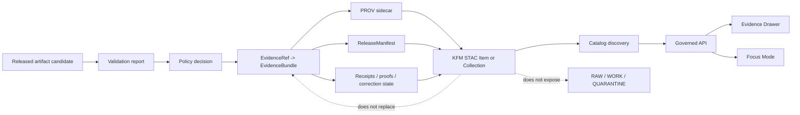

<!-- [KFM_META_BLOCK_V2]
doc_id: kfm://doc/NEEDS-VERIFICATION
title: KFM STAC Extension Profile
type: standard
version: v1
status: draft
owners: OWNER_TBD
created: NEEDS VERIFICATION
updated: 2026-05-03
policy_label: public
related: [
  docs/adr/ADR-0018-prov-stac-dcat-catalog-mapping.md,
  docs/adr/ADR-0001-schema-home.md,
  docs/sources/catalog_profiles/KFM_DCAT_EXPORT_PROFILE.md,
  SCHEMA_HOME_TBD_AFTER_REPO_INSPECTION/catalog/stac/kfm_stac_item.schema.json,
  SCHEMA_HOME_TBD_AFTER_REPO_INSPECTION/provenance/kfm_prov_sidecar.schema.json,
  SCHEMA_HOME_TBD_AFTER_REPO_INSPECTION/release/kfm_release_manifest.schema.json,
  tools/validators/catalog/validate_stac_item.py,
  policy/catalog/stac/stac_item_gate.rego,
  tests/fixtures/catalog/stac/valid/minimal.item.json,
  tests/fixtures/catalog/stac/invalid/missing_evidence_ref.item.json,
  tests/fixtures/catalog/stac/invalid/restricted_policy_label.item.json,
  tests/fixtures/catalog/stac/invalid/missing_provenance_asset.item.json
]
tags: [kfm, stac, catalog, provenance, evidence, receipts, release-manifest, governance]
notes: [Defines KFM-specific STAC fields and links for public-safe catalog artifacts. doc_id, owners, created date, target path, schema home, link relation conventions, and formal STAC extension URI need repository verification.]
[/KFM_META_BLOCK_V2] -->

<a id="top"></a>

# KFM STAC Extension Profile

KFM-specific STAC publication rules for evidence-bound, provenance-linked, public-safe catalog exports.

<p align="center">
  
  
  
  
</p>

> [!IMPORTANT]
> **STAC is a discovery layer, not the KFM source of truth.**  
> A public STAC record may point users toward a released artifact, but it must not replace EvidenceBundle resolution, provenance, policy, review state, release state, correction lineage, or rollback evidence.

---

## Quick jump

- [Document control](#document-control)
- [Purpose](#purpose)
- [Evidence boundary](#evidence-boundary)
- [Repo fit](#repo-fit)
- [Scope](#scope)
- [Operating model](#operating-model)
- [STAC, DCAT, and PROV relationship](#stac-dcat-and-prov-relationship)
- [Profile status](#profile-status)
- [KFM field namespace](#kfm-field-namespace)
- [Collection requirements](#collection-requirements)
- [Item requirements](#item-requirements)
- [Allowed public values](#allowed-public-values)
- [Required links](#required-links)
- [Required assets](#required-assets)
- [Minimal STAC Item example](#minimal-stac-item-example)
- [Publication gate](#publication-gate)
- [Evidence Drawer impact](#evidence-drawer-impact)
- [Focus Mode rules](#focus-mode-rules)
- [Validation checklist](#validation-checklist)
- [Rollback and correction](#rollback-and-correction)
- [Open verification items](#open-verification-items)
- [Change log](#change-log)

---

## Document control

| Field | Value |
| --- | --- |
| **Status** | `draft` |
| **Target path** | `docs/sources/catalog_profiles/KFM_STAC_EXTENSION_PROFILE.md` — **PROPOSED** |
| **Owners** | `OWNER_TBD` |
| **Policy label** | `public` |
| **Truth posture** | CONFIRMED doctrine / PROPOSED paths and contract homes / UNKNOWN repo implementation depth |
| **STAC core target** | `1.1.0` — **NEEDS VERIFICATION** against repo pins before implementation |
| **Schema home** | `SCHEMA_HOME_TBD_AFTER_REPO_INSPECTION` |
| **Primary schema** | `SCHEMA_HOME_TBD_AFTER_REPO_INSPECTION/catalog/stac/kfm_stac_item.schema.json` |
| **Validator** | `tools/validators/catalog/validate_stac_item.py` — **PROPOSED** |
| **Policy gate** | `policy/catalog/stac/stac_item_gate.rego` — **PROPOSED** |
| **Formal extension URI** | `kfm://stac-extension/NEEDS-VERIFICATION` — do not publish as a formal STAC extension until resolved |

> [!NOTE]
> Current repository paths, owners, schema home, validator names, policy packages, workflow names, fixture paths, and runtime behavior are **UNKNOWN** until the target repository is inspected. This document is a repo-useful draft, not proof that the referenced files already exist.

[Back to top](#top)

---

## Purpose

This profile defines how KFM should publish STAC Items and Collections without losing:

- deterministic identity
- EvidenceBundle lineage
- run receipts
- redaction receipts
- AI receipts
- attestation links
- rights and sensitivity posture
- release-manifest closure
- correction and rollback lineage

A STAC record may make an artifact discoverable. It must never become the proof that the artifact is publishable.

[Back to top](#top)

---

## Evidence boundary

| Source | Status | Supports | Limits |
| --- | --- | --- | --- |
| Attached STAC draft | CONFIRMED source text | Existing KFM STAC purpose, fields, links, assets, publication rules, Evidence Drawer and Focus Mode posture | Does not prove repo paths, schemas, validators, or policy gates exist |
| KFM doctrine corpus | CONFIRMED doctrine / LINEAGE implementation | Evidence-first, map-first, time-aware, cite-or-abstain, release-gated, AI-subordinate posture | Does not prove current runtime or CI behavior |
| Current workspace inspection | CONFIRMED no mounted repo in this session | Paths and implementation depth must remain PROPOSED / UNKNOWN | Does not prove or disprove public-repo state outside this workspace |
| Official standards checks | EXTERNAL / NEEDS VERIFICATION for repo adoption | STAC, DCAT, and PROV are appropriate outward catalog/provenance anchors | Does not determine KFM field names, owners, or schema home |

[Back to top](#top)

---

## Repo fit

| Surface | Status | Proposed path | Role |
| --- | --- | --- | --- |
| STAC profile doc | PROPOSED | `docs/sources/catalog_profiles/KFM_STAC_EXTENSION_PROFILE.md` | Human-readable profile for KFM public-safe STAC publication. |
| Schema-home ADR | PROPOSED | `docs/adr/ADR-0001-schema-home.md` | Resolves whether machine contracts live under `contracts/`, `schemas/contracts/v1/`, or another repo-native home. |
| STAC/DCAT/PROV mapping ADR | PROPOSED | `docs/adr/ADR-0018-prov-stac-dcat-catalog-mapping.md` | Defines catalog closure, identity mapping, and link relation conventions. |
| STAC schema | PROPOSED | `SCHEMA_HOME_TBD_AFTER_REPO_INSPECTION/catalog/stac/kfm_stac_item.schema.json` | Machine-readable KFM STAC Item profile. |
| STAC validator | PROPOSED | `tools/validators/catalog/validate_stac_item.py` | Enforces schema, KFM governance rules, and public-safe publication gates. |
| STAC policy gate | PROPOSED | `policy/catalog/stac/stac_item_gate.rego` | Denies unsafe public catalog records. |
| Valid fixture | PROPOSED | `tests/fixtures/catalog/stac/valid/minimal.item.json` | Positive-path public-safe fixture. |
| Invalid fixtures | PROPOSED | `tests/fixtures/catalog/stac/invalid/*.item.json` | Negative-path gates for missing evidence, restricted policy labels, unresolved rights, and missing provenance assets. |

> [!WARNING]
> Do not create parallel schema authority. If both `contracts/` and `schemas/` are present in the mounted repo, resolve the home through ADR before adding or moving machine-readable STAC schemas.

[Back to top](#top)

---

## Scope

### Accepted inputs

This profile applies to STAC records for artifacts that have already passed the required KFM release gates, including public-safe:

- GeoParquet, COG, PMTiles, CSV, JSON, JSON-LD, PDF, imagery, vector, raster, or mixed geospatial artifacts
- released layer outputs
- released analytical products
- released evidence-supporting derived artifacts
- collection-level catalog records for public KFM products

### Exclusions

This profile does **not** permit public STAC publication for:

- RAW, WORK, QUARANTINE, or candidate-only material
- unreviewed or unpublished release candidates
- restricted coordinates in public geometry, bbox, properties, links, assets, titles, thumbnails, or examples
- direct model output or AI-generated prose as source truth
- records with unresolved rights, source role, sensitivity, or review state
- STAC records that attempt to replace EvidenceBundle, ReleaseManifest, review record, policy decision, proof pack, or correction notice

[Back to top](#top)

---

## Operating model



The normal public path is:

```text
RAW -> WORK / QUARANTINE -> PROCESSED -> CATALOG / TRIPLET -> PUBLISHED
```

STAC publication occurs only after the relevant artifact is ready for `PUBLISHED` or an explicitly reviewed public catalog preview. Promotion remains a governed state transition, not a file move.

[Back to top](#top)

---

## STAC, DCAT, and PROV relationship

KFM uses STAC, DCAT, and PROV as complementary outward surfaces.

| Surface | Primary KFM role | Must not be used as |
| --- | --- | --- |
| **STAC** | Discover map-ready or geospatially scoped assets, Collections, Items, footprints, temporal coverage, and public asset links. | Rights engine, policy engine, provenance proof, or canonical truth store. |
| **DCAT** | Describe datasets, distributions, catalog membership, publisher metadata, access services, and catalog interoperability. | Spatial item proof or pipeline provenance. |
| **PROV** | Describe entities, activities, agents, derivation, generation, and attribution for lineage review. | Proof that bytes are public-safe or rights-cleared. |
| **KFM ReleaseManifest** | Bind released subject, hashes, evidence, receipts, policy, review, catalog records, and rollback target. | Replacement for STAC/DCAT/PROV. |
| **KFM EvidenceBundle** | Carry evidence support for claims, scopes, source roles, review state, and policy state. | A discoverability index by itself. |

[Back to top](#top)

---

## Profile status

This draft is a **KFM local STAC application profile**.

It is not yet a formal registered STAC extension because the extension URI, extension schema location, relation conventions, and repo schema home are not verified.

| Profile element | Status | Rule |
| --- | --- | --- |
| `kfm:*` fields in Item `properties` | PROPOSED | Validate through the KFM STAC schema. |
| `kfm:*` fields in `assets.*` | PROPOSED | Use only for asset-local evidence, hash, or provenance references. |
| `stac_extensions` URI | NEEDS VERIFICATION | Do not publish a fake URI. |
| Link relation names | PROPOSED | Confirm through ADR before public contract freeze. |
| STAC core version | NEEDS VERIFICATION | Draft targets `1.1.0`; keep compatibility path if repo already pins `1.0.0`. |

[Back to top](#top)

---

## KFM field namespace

KFM-specific STAC fields use the `kfm:` prefix.

Rules:

- Put artifact-level governance fields in `properties`.
- Put asset-local hash, role, and provenance fields under the relevant `assets.<asset_key>`.
- Do not embed full EvidenceBundles, proof packs, policy decisions, or receipts inside STAC records unless a future ADR explicitly allows a compact embedded form.
- Prefer references that resolve through governed APIs or released artifacts.
- Treat unresolved KFM references as publication blockers.

[Back to top](#top)

---

## Collection requirements

KFM Collections must carry enough public metadata for discovery without leaking restricted detail.

| Field or concept | Required | Notes |
| --- | --- | --- |
| `stac_version` | yes | Draft target is `1.1.0`; repo pin needs verification. |
| `id` | yes | Stable, deterministic where practical. |
| `type` | yes | `Collection`. |
| `title` | recommended | Public-safe title. |
| `description` | yes | Must not include unsupported claims or restricted details. |
| `license` | yes | Must not be `proprietary`, `restricted`, `unknown`, or `NOASSERTION` for public release unless policy explicitly permits a public catalog pointer without asset access. |
| `extent` | yes | Spatial and temporal extent must be public-safe. |
| `providers` | recommended | Include source/publisher role where public-safe. |
| `summaries` | recommended | Use only for public-safe controlled vocabulary values. |
| `links` | yes | Include self/root where repo convention supports it; include KFM governance links when applicable. |
| `kfm:collection_spec_hash` | recommended | Collection-level deterministic identity. |
| `kfm:release_manifest_ref` | yes | Required for public KFM publication. |
| `kfm:evidence_ref` | conditional | Required when the Collection itself makes a consequential claim. |
| `kfm:policy_label` | yes | Must be `public` for public catalog publication. |
| `kfm:sensitivity` | yes | Must be `public` for public catalog publication. |

[Back to top](#top)

---

## Item requirements

### Required KFM properties

| Property | Required for public KFM STAC | Type | Status | Description |
| --- | --- | --- | --- | --- |
| `kfm:spec_hash` | yes | string | CONFIRMED source draft | Canonical deterministic artifact/spec identity. |
| `kfm:content_spec_hash` | recommended | string | CONFIRMED source draft | Content-level deterministic identity when distinct from `spec_hash`. |
| `kfm:geometry_hash` | conditional | string | CONFIRMED source draft | Required when geometry identity matters or generalized geometry must be audited. |
| `kfm:evidence_ref` | yes | string | CONFIRMED source draft | Reference to the governing EvidenceBundle. |
| `kfm:run_receipt_url` | yes | string | CONFIRMED source draft | URL or repo path to the run/provenance record. |
| `kfm:release_manifest_ref` | yes | string | CONFIRMED source draft | ReleaseManifest reference. |
| `kfm:policy_label` | yes | string | CONFIRMED source draft | Public policy posture. |
| `kfm:review_state` | yes | string | CONFIRMED source draft | Review state at publication. |
| `kfm:release_state` | recommended | string | PROPOSED | Separate release-state field when repo vocabulary supports it. |
| `kfm:source_role` | yes | string | CONFIRMED source draft | Role of the underlying source. |
| `kfm:source_descriptor_ref` | yes | string | STRENGTHENED | SourceDescriptor reference. Required unless the EvidenceBundle fully resolves source descriptors. |
| `kfm:rights_ref` | yes | string | PROPOSED | Reference to rights/license/terms review for the released artifact. |
| `kfm:sensitivity` | yes | string | STRENGTHENED | Must be `public` in public STAC records. |
| `kfm:redaction_receipt_url` | conditional | string | CONFIRMED source draft | Required when geometry, fields, or assets were transformed for public release. |
| `kfm:ai_receipt_url` | conditional | string | CONFIRMED source draft | Required when AI contributed interpretation, labeling, summarization, or selection. |
| `kfm:attestation_url` | conditional | string | CONFIRMED source draft | Required when release policy requires attestation. |
| `kfm:catalog_matrix_ref` | conditional | string | PROPOSED | Required when this STAC record participates in STAC/DCAT/PROV catalog closure validation. |
| `kfm:correction_ref` | conditional | string | CONFIRMED source draft | Required when corrected, superseded, withdrawn, or disputed state exists. |

### Required processing properties

| Property | Required | Description |
| --- | --- | --- |
| `processing:software` | yes | Pipeline or tool name. |
| `processing:version` | yes | Pipeline or tool version. |
| `processing:datetime` | yes | Run timestamp in date-time format. |
| `datetime` | recommended | STAC temporal timestamp where applicable. |
| `start_datetime` | conditional | Required for interval assets when `datetime` is not sufficient. |
| `end_datetime` | conditional | Required for interval assets when `datetime` is not sufficient. |

### Spatial and temporal caution

Public `geometry`, `bbox`, `datetime`, `start_datetime`, and `end_datetime` must not silently imply stronger evidence than the release supports.

Use `geometry: null` only when a public footprint is intentionally unavailable, generalized, or unsafe. When `geometry` is null but `bbox` is present, the `bbox` must also be public-safe and documented in the redaction or generalization record when relevant.

[Back to top](#top)

---

## Allowed public values

For public STAC publication:

```text
kfm:policy_label = public
kfm:sensitivity  = public
```

Allowed `kfm:review_state` values:

```text
reviewed
published
```

Allowed `kfm:release_state` values, when the field is used:

```text
published
superseded
withdrawn
```

The following values must not appear in KFM governance fields, asset references, link references, or public-release state fields of a published public STAC record:

```text
TODO
unknown
UNKNOWN
NEEDS-VERIFICATION
NEEDS_VERIFICATION
restricted
internal
quarantine
deny
```

> [!CAUTION]
> Draft documentation may contain placeholders. Published public STAC records may not.

[Back to top](#top)

---

## Required links

| `rel` | Required | Target | Status |
| --- | --- | --- | --- |
| `self` | recommended | This STAC Item URL or artifact path. | STAC conventional |
| `root` | recommended | STAC root catalog. | STAC conventional |
| `collection` | recommended | Parent Collection. | STAC conventional |
| `provenance` | yes | PROV JSON-LD sidecar. | KFM profile convention — NEEDS ADR |
| `evidence` | yes | EvidenceBundle. | KFM profile convention — NEEDS ADR |
| `release-manifest` | yes | ReleaseManifest. | KFM profile convention — NEEDS ADR |
| `catalog-matrix` | conditional | CatalogMatrix closure record. | PROPOSED |
| `attestation` | conditional | DSSE/Cosign or other attestation bundle. | KFM profile convention — NEEDS ADR |
| `redaction-receipt` | conditional | Redaction or geoprivacy transform receipt. | KFM profile convention — NEEDS ADR |
| `ai-receipt` | conditional | AI interpretive receipt. | KFM profile convention — NEEDS ADR |
| `correction` | conditional | Correction notice. | KFM profile convention — NEEDS ADR |
| `supersedes` | conditional | Prior released object. | KFM profile convention — NEEDS ADR |

[Back to top](#top)

---

## Required assets

At minimum, a published KFM STAC Item should contain both `data` and `provenance` assets:

```json
{
  "assets": {
    "data": {
      "href": "https://example.invalid/artifact.ext",
      "type": "application/octet-stream",
      "roles": ["data"]
    },
    "provenance": {
      "href": "https://example.invalid/artifact.prov.jsonld",
      "type": "application/ld+json",
      "roles": ["metadata", "provenance"]
    }
  }
}
```

> [!IMPORTANT]
> A `links[rel=provenance]` entry is not enough by itself when KFM requires materialized provenance for Evidence Drawer, offline validation, release closure, or export packaging. The `assets.provenance` entry must also exist.

When attestation is required:

```json
{
  "assets": {
    "attestation": {
      "href": "https://example.invalid/artifact.bundle.json",
      "type": "application/json",
      "roles": ["metadata", "attestation"]
    }
  }
}
```

When redaction or generalization is required:

```json
{
  "assets": {
    "redaction_receipt": {
      "href": "https://example.invalid/artifact.redaction-receipt.json",
      "type": "application/json",
      "roles": ["metadata", "redaction-receipt"]
    }
  }
}
```

[Back to top](#top)

---

## Minimal STAC Item example

This example is illustrative and public-safe. It uses a Kansas-wide bbox and `geometry: null` to avoid implying exact public geometry.

```json
{
  "type": "Feature",
  "stac_version": "1.1.0",
  "stac_extensions": [],
  "id": "kfm-item-minimal-fixture",
  "collection": "kfm-collection-minimal-fixture",
  "bbox": [-102.051744, 36.993016, -94.588413, 40.003162],
  "geometry": null,
  "properties": {
    "datetime": "2026-04-27T00:00:00Z",
    "kfm:spec_hash": "sha256:aaaaaaaaaaaaaaaaaaaaaaaaaaaaaaaaaaaaaaaaaaaaaaaaaaaaaaaaaaaaaaaa",
    "kfm:content_spec_hash": "sha256:aaaaaaaaaaaaaaaaaaaaaaaaaaaaaaaaaaaaaaaaaaaaaaaaaaaaaaaaaaaaaaaa",
    "kfm:evidence_ref": "kfm://evidence/minimal-fixture",
    "kfm:run_receipt_url": "https://example.invalid/artifact.prov.jsonld",
    "kfm:release_manifest_ref": "kfm://release/minimal-fixture",
    "kfm:catalog_matrix_ref": "kfm://catalog-matrix/minimal-fixture",
    "kfm:policy_label": "public",
    "kfm:review_state": "reviewed",
    "kfm:release_state": "published",
    "kfm:source_role": "authoritative_source",
    "kfm:source_descriptor_ref": "kfm://source/minimal-fixture",
    "kfm:rights_ref": "kfm://rights/minimal-fixture",
    "kfm:sensitivity": "public",
    "processing:software": "kfm-pipeline",
    "processing:version": "v1",
    "processing:datetime": "2026-04-27T00:00:00Z"
  },
  "links": [
    {
      "rel": "self",
      "href": "https://example.invalid/catalog/items/kfm-item-minimal-fixture.json",
      "type": "application/geo+json",
      "title": "This STAC Item"
    },
    {
      "rel": "collection",
      "href": "https://example.invalid/catalog/collections/kfm-collection-minimal-fixture.json",
      "type": "application/json",
      "title": "Parent STAC Collection"
    },
    {
      "rel": "provenance",
      "href": "https://example.invalid/artifact.prov.jsonld",
      "type": "application/ld+json",
      "title": "KFM PROV sidecar"
    },
    {
      "rel": "evidence",
      "href": "https://example.invalid/evidence.json",
      "type": "application/json",
      "title": "KFM EvidenceBundle"
    },
    {
      "rel": "release-manifest",
      "href": "https://example.invalid/release-manifest.json",
      "type": "application/json",
      "title": "KFM ReleaseManifest"
    },
    {
      "rel": "catalog-matrix",
      "href": "https://example.invalid/catalog-matrix.json",
      "type": "application/json",
      "title": "KFM CatalogMatrix closure record"
    }
  ],
  "assets": {
    "data": {
      "href": "https://example.invalid/artifact.ext",
      "type": "application/octet-stream",
      "title": "Minimal fixture artifact",
      "roles": ["data"],
      "kfm:spec_hash": "sha256:aaaaaaaaaaaaaaaaaaaaaaaaaaaaaaaaaaaaaaaaaaaaaaaaaaaaaaaaaaaaaaaa",
      "kfm:evidence_ref": "kfm://evidence/minimal-fixture",
      "kfm:provenance_ref": "https://example.invalid/artifact.prov.jsonld"
    },
    "provenance": {
      "href": "https://example.invalid/artifact.prov.jsonld",
      "type": "application/ld+json",
      "title": "KFM PROV sidecar",
      "roles": ["metadata", "provenance"],
      "kfm:provenance_ref": "https://example.invalid/artifact.prov.jsonld"
    }
  }
}
```

[Back to top](#top)

---

## Publication gate

A STAC publication gate must return one finite outcome.

| Outcome | Meaning | Public STAC action |
| --- | --- | --- |
| `ALLOW` | Schema, evidence, provenance, rights, sensitivity, policy, review, release, and catalog checks passed. | Publish or retain record. |
| `DENY` | Policy or sensitivity blocks publication. | Do not publish; record denial reason and obligations. |
| `ABSTAIN` | Evidence, rights, source role, review state, link resolution, or catalog closure is insufficient. | Do not publish; return required evidence gaps. |
| `ERROR` | Validator, schema resolver, policy engine, or link checker failed. | Do not publish; quarantine candidate and emit error receipt. |

A STAC Item must not publish when:

- `kfm:policy_label` is not `public`
- `kfm:sensitivity` is missing or not `public`
- `kfm:review_state` is not `reviewed` or `published`
- `kfm:spec_hash` is missing or malformed
- `kfm:evidence_ref` is missing or does not resolve
- `kfm:run_receipt_url` is missing or does not resolve
- `kfm:release_manifest_ref` is missing or does not resolve
- `kfm:source_descriptor_ref` is missing and source descriptors cannot be resolved through the EvidenceBundle
- `kfm:rights_ref` is missing or unresolved
- `links[rel=provenance]` is missing
- `links[rel=evidence]` is missing
- `links[rel=release-manifest]` is missing
- `assets.data` is missing
- `assets.provenance` is missing
- redaction was performed but no redaction receipt is linked
- AI interpretation was used but no AI receipt is linked
- attestation is declared or required but no attestation link exists
- source rights are unknown
- public record references RAW, WORK, or QUARANTINE material
- exact sensitive geometry or restricted fields appear in public output
- link relation conventions are unresolved for the release family
- the record cannot be tied back to rollback or correction state

[Back to top](#top)

---

## Evidence Drawer impact

Public UI may derive Evidence Drawer metadata from STAC only when all linked governance records resolve.

| UI field | Source |
| --- | --- |
| Evidence reference | `properties.kfm:evidence_ref` |
| Spec hash | `properties.kfm:spec_hash` |
| Content spec hash | `properties.kfm:content_spec_hash` |
| Review state | `properties.kfm:review_state` |
| Release state | `properties.kfm:release_state` or ReleaseManifest |
| Source role | `properties.kfm:source_role` |
| Source descriptor | `properties.kfm:source_descriptor_ref` or EvidenceBundle |
| Rights | `properties.kfm:rights_ref` |
| Sensitivity | `properties.kfm:sensitivity` |
| Provenance | `links[rel=provenance]` and `assets.provenance` |
| Release manifest | `links[rel=release-manifest]` |
| Catalog closure | `links[rel=catalog-matrix]` |
| Redaction receipt | `links[rel=redaction-receipt]` |
| Correction notice | `links[rel=correction]` |

> [!IMPORTANT]
> Evidence Drawer text should use STAC as a locator and summary surface only. The Drawer must resolve linked governance records before presenting consequential evidence, rights, review, or policy claims.

[Back to top](#top)

---

## Focus Mode rules

Focus Mode must only consume STAC records that are:

- public-safe
- released or reviewed for release
- evidence-bound
- provenance-linked
- release-manifest-linked
- rights-resolved
- policy-allowed
- correction-aware

Missing evidence produces:

```text
ABSTAIN
```

Policy denial produces:

```text
DENY
```

Validation or runtime failure produces:

```text
ERROR
```

Focus Mode must not answer from STAC metadata alone when the requested claim requires EvidenceBundle support.

[Back to top](#top)

---

## Validation checklist

### JSON and STAC shape

- [ ] STAC JSON parses.
- [ ] `type`, `stac_version`, `id`, `bbox`, `geometry`, `properties`, `links`, and `assets` satisfy the selected STAC core version.
- [ ] `stac_version` matches repo-approved STAC pin.
- [ ] `stac_extensions` is empty or contains only verified extension URIs.
- [ ] Item belongs to a stable Collection.
- [ ] Geometry and bbox are public-safe.

### KFM governance fields

- [ ] Required `kfm:*` fields exist.
- [ ] `kfm:spec_hash` matches `sha256:<64 hex>`.
- [ ] `kfm:content_spec_hash`, when present, matches `sha256:<64 hex>`.
- [ ] `kfm:policy_label` is `public`.
- [ ] `kfm:sensitivity` is `public`.
- [ ] `kfm:review_state` is `reviewed` or `published`.
- [ ] `kfm:evidence_ref` resolves to an EvidenceBundle.
- [ ] `kfm:source_descriptor_ref` resolves or is fully resolvable through the EvidenceBundle.
- [ ] `kfm:rights_ref` resolves and permits public release.
- [ ] ReleaseManifest reference resolves.
- [ ] Run receipt reference resolves.

### Links, assets, and closure

- [ ] Provenance link exists.
- [ ] Provenance asset exists.
- [ ] Evidence link exists.
- [ ] ReleaseManifest link exists.
- [ ] Data asset exists.
- [ ] CatalogMatrix link exists when catalog closure is required.
- [ ] Redaction receipt exists when needed.
- [ ] AI receipt exists when needed.
- [ ] Attestation exists when required.
- [ ] Correction or supersession link exists when relevant.

### Public-safety gates

- [ ] No restricted geometry leak.
- [ ] No restricted fields in properties, links, assets, titles, thumbnails, or examples.
- [ ] No RAW, WORK, or QUARANTINE references.
- [ ] No unresolved `TODO`, `UNKNOWN`, `NEEDS_VERIFICATION`, or placeholder values in public STAC records.
- [ ] No generated-language claim is treated as evidence.
- [ ] Rollback target is recorded through ReleaseManifest or correction lineage.

[Back to top](#top)

---

## Rollback and correction

Rollback is required when a published STAC record:

- links to the wrong artifact, EvidenceBundle, PROV sidecar, ReleaseManifest, or receipt
- exposes restricted geometry, restricted field values, or sensitive source context
- omits a required redaction, AI, provenance, rights, review, or release reference
- uses an unapproved STAC version, extension URI, or link relation convention
- drifts from the released artifact hash
- continues to advertise a withdrawn or superseded release as current
- fails catalog closure checks after publication

Rollback action should not delete audit history. Use correction, withdrawal, supersession, or release-manifest update paths that preserve provenance and receipts.

Rollback target: `ROLLBACK_TARGET_TBD_AFTER_RELEASE_MANIFEST_VERIFICATION`

[Back to top](#top)

---

## Open verification items

| Item | Status | Needed action |
| --- | --- | --- |
| `doc_id` | NEEDS VERIFICATION | Replace placeholder with registry-approved ID. |
| Owners | NEEDS VERIFICATION | Confirm owning team or maintainers. |
| Created date | NEEDS VERIFICATION | Confirm from repository history. |
| Target path | PROPOSED | Confirm final docs location. |
| Schema home | CONFLICTED / NEEDS VERIFICATION | Resolve `contracts/` versus `schemas/contracts/v1/` or repo-native equivalent through ADR. |
| STAC core pin | NEEDS VERIFICATION | Confirm whether KFM should pin `1.1.0`, retain `1.0.0`, or support both during migration. |
| Formal KFM STAC extension URI | NEEDS VERIFICATION | Decide whether this remains a local profile or becomes a formal extension. |
| Link relation names | PROPOSED | Confirm `provenance`, `evidence`, `release-manifest`, `catalog-matrix`, `redaction-receipt`, and `ai-receipt` conventions. |
| Public sensitivity vocabulary | NEEDS VERIFICATION | Align with KFM policy registry. |
| Review and release vocabularies | NEEDS VERIFICATION | Decide whether `review_state` and `release_state` stay separate in STAC properties. |
| Rights vocabulary | NEEDS VERIFICATION | Confirm `kfm:rights_ref` and allowed public license states. |
| CatalogMatrix contract | NEEDS VERIFICATION | Confirm schema and validation fields for STAC/DCAT/PROV closure. |
| Validator path | PROPOSED | Confirm repo-native validator location and language. |
| Policy path | PROPOSED | Confirm repo-native policy package location and evaluation tool. |
| Fixture paths | PROPOSED | Confirm repo-native test fixture structure. |

[Back to top](#top)

---

## Change log

| Date | Change | Status |
| --- | --- | --- |
| 2026-05-03 | Revised draft to strengthen evidence boundary, schema-home caution, STAC/DCAT/PROV role separation, Collection requirements, publication gate outcomes, rollback, and verification backlog. | PROPOSED |
| 2026-05-03 | Updated illustrative STAC Item example from `stac_version: 1.0.0` to `1.1.0` as a draft target pending repo verification. | NEEDS VERIFICATION |
| 2026-05-03 | Added `kfm:rights_ref`, `kfm:release_state`, and `kfm:catalog_matrix_ref` as proposed governance fields. | PROPOSED |
| 2026-04-27 | Source draft established KFM STAC profile purpose, core KFM fields, required governance links/assets, publication rules, Evidence Drawer impact, Focus Mode rules, and validation checklist. | LINEAGE / CONFIRMED source text |

[Back to top](#top)
