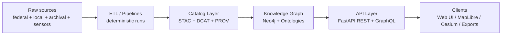

<div align="center">

# 📐 docs/specs — Canonical Specs & Contracts (Kansas Frontier Matrix)


**One folder. One truth.**  
All contracts that define KFM’s behavior live here — schemas, APIs, data-product rules, graph rules, UI contracts, and validation gates.

</div>

---

## 🧭 What this folder is for

KFM is designed as a **“living atlas”** that integrates Kansas history + geospatial data + projections in one explorable system, built with modular, pipeline-oriented architecture and clean interfaces. This specs folder exists to keep that complexity governable and reproducible. :contentReference[oaicite:0]{index=0}

**docs/specs/** is where we define:
- ✅ **What “correct” means** (schemas, invariants, validation rules)
- ✅ **What interfaces promise** (API contracts, query policies, UI wiring contracts)
- ✅ **How we prove it** (QA gates, reproducibility, provenance & diff requirements)
- ✅ **How we change it safely** (versioning + deprecation + review cycles)

> [!IMPORTANT]
> **Specs are upstream of implementation.**  
> Code can change. Specs are the “contract boundary” that stays stable.

---

## 🔎 Quick navigation

| If you are… | Start here |
|---|---|
| 🧱 Architecting the system | **Architecture Contracts** → Clean layers, contract boundaries, “catalog-first” |
| 🧺 Building pipelines / ETL | **Data Product Contract** → formats, naming, provenance, STAC/DCAT/PROV |
| 🧠 Working on the graph | **Ontology + Graph Contract** → CIDOC/Time/Geo semantics + traversal policy |
| 🖥️ Building the UI | **UI + Visualization Contract** → MapLibre, Story Nodes, 2D↔3D |
| 🛡️ Security / governance | **Security & Policy Contract** → SBOM, advisories, access policies |
| 🧪 QA / CI | **Validation Gates** → what must pass before merge |

---

## 🧱 Architectural foundations (non-negotiable)

KFM’s architecture is intentionally modular, pipeline-driven, and layered, so inner scientific logic is insulated from storage/UI changes. :contentReference[oaicite:1]{index=1}

### ✅ Contract boundaries (the “one way in” rule)
- **Pipelines produce artifacts** (data + metadata + lineage).
- **Catalog is canonical**: STAC/DCAT/PROV JSON-LD define what exists and how it was derived. :contentReference[oaicite:2]{index=2}
- **Graph is derived**: Neo4j is regenerated from governed inputs (ETL outputs + catalogs). :contentReference[oaicite:3]{index=3}
- **API is the only access point** between backend and UI/clients, enabling centralized enforcement of permissions and filtering. :contentReference[oaicite:4]{index=4}

### 🗺️ System dataflow (conceptual)


---

## 🗂️ Recommended folder layout (for specs)

> This README is the **index**. The files below are the docs we should build out (or link to if they already exist elsewhere).

```text
📂 docs/specs/
├── 📄 README.md                          🧭 This file (spec index)
├── 🧱 architecture/
│   ├── 📄 ARCH__SYSTEM_BOUNDARIES.md     🧱 Layers, services, contract boundaries
│   ├── 📄 ARCH__DATAFLOW.md              🔁 ETL → Catalog → Graph → API → UI
│   └── 📄 ARCH__REPRODUCIBILITY.md       🧾 Versioning, lineage, rebuild rules
├── 📦 data/
│   ├── 📄 DATA__PRODUCT_CONTRACT.md      📦 Formats, naming, storage layout
│   ├── 📄 DATA__STAC_PROFILE.md          🛰️ KFM-STAC profile rules
│   ├── 📄 DATA__DCAT_PROFILE.md          🗃️ KFM-DCAT profile rules
│   ├── 📄 DATA__PROV_PROFILE.md          🧬 KFM-PROV profile rules
│   └── 📄 DATA__SENSITIVITY_MASKING.md   🫥 H3/generalization rules for sensitive data
├── 🕸️ graph/
│   ├── 📄 GRAPH__ONTOLOGY_PROFILE.md     🧠 CIDOC CRM + OWL-Time + Geo semantics
│   ├── 📄 GRAPH__SCHEMA_CONTRACT.md      🕸️ Node/edge types + required properties
│   └── 📄 GRAPH__QUERY_POLICY.md         🚦 Traversal constraints, policy gates
├── 🔌 api/
│   ├── 📄 API__REST_CONTRACT.md          🔌 Endpoint semantics + errors
│   ├── 📄 API__GRAPHQL_CONTRACT.md       🧩 GraphQL schema + resolver policy
│   └── 📄 API__AUTHZ.md                  🔐 Roles, scopes, filtering rules
├── 🗺️ ui/
│   ├── 📄 UI__MAPLIBRE_CONTRACT.md       🗺️ Style rules, layers, tiles, legends
│   ├── 📄 UI__FOCUS_MODE_CONTRACT.md     🎛️ Version locking + reproducibility UX
│   └── 📄 UI__STORY_NODE_CONTRACT.md     📚 Story node display + timeline sync
├── ✅ qa/
│   ├── 📄 QA__VALIDATION_GATES.md        ✅ CI checks + schemas + required reports
│   ├── 📄 QA__CATALOG_QA.md              🧾 STAC/DCAT lint rules
│   └── 📄 QA__MAP_ASSET_QA.md            🖼️ Legends, overlays, alt-text, accessibility
├── 🛡️ security/
│   ├── 📄 SEC__VULN_REGISTRY.md          🛡️ Advisory format, SBOM refs, lifecycle
│   └── 📄 SEC__SUPPLY_CHAIN.md           🔒 SLSA, provenance, attestation rules
└── 🧩 templates/
    ├── 📄 TEMPLATE__SPEC.md              🧩 Standard spec skeleton
    └── 📄 TEMPLATE__SCHEMA.md            🧱 Schema + examples + tests skeleton
```


---

## 🧾 Spec lifecycle & versioning rules

Specs follow a predictable lifecycle so downstream implementations don’t break:
- **draft** → iterating; breaking changes allowed
- **review** → governance review required; tests/examples must exist
- **stable** → breaking changes require a new major version
- **deprecated** → supported with warnings; replacement must be linked

> [!NOTE]
> KFM docs commonly carry **version**, **last_updated**, **review_cycle**, and references to SBOM/manifest/telemetry. This pattern is used in existing KFM documentation headers. :contentReference[oaicite:5]{index=5}:contentReference[oaicite:6]{index=6}

---

## ✅ Validation gates (what must pass before merge)

KFM is “catalog-driven” and uses CI to block incomplete or noncompliant artifacts:
- Catalog metadata lives under `data/stac/`, `data/catalog/dcat/`, and `data/prov/` and is treated as source-of-truth. :contentReference[oaicite:7]{index=7}
- CI flags datasets missing required metadata or schema compliance. :contentReference[oaicite:8]{index=8}

### Required checks (baseline)
- ✅ STAC schema validation (`stac-validate.yml`)  
- ✅ FAIR+CARE checks (`faircare-validate.yml`)  
- ✅ Docs lint (`docs-lint.yml`)  
:contentReference[oaicite:9]{index=9}

### Visualization compliance (baseline)
For overlays and story assets:
- **Alt-text required**
- **Sensitive sites generalized/masked**
- **CARE reviewer status recorded**
- **Checksum integrity**
- **STAC/DCAT compliance**
:contentReference[oaicite:10]{index=10}

---

## 📦 Data Product Contract (what “a dataset” means in KFM)

### Canonical metadata triad
Every published dataset must be describable and traceable via:
- **STAC** (discovery + spatial/temporal)
- **DCAT** (dataset catalog semantics + distribution)
- **PROV-O** (lineage chain + generation context)
:contentReference[oaicite:11]{index=11}

### Deterministic runs (example pattern)
Pipelines should stamp artifacts with deterministic IDs and produce:
- GeoParquet (analytics base)
- PMTiles (static vector tiles)
- COGs (efficient raster)
- STAC + PROV sidecars
:contentReference[oaicite:12]{index=12}

> [!TIP]
> The “Soil Data → Production Artifacts” runbook shows a concrete pattern for outputs and deterministic run metadata. :contentReference[oaicite:13]{index=13}

### Sensitivity masking (example baseline)
Sensitive locations should not be stored as precise points; KFM uses generalization like **H3 hex indexing** to avoid pinpointing culturally sensitive site locations. :contentReference[oaicite:14]{index=14}

---

## 🧠 Graph & Ontology Contract (knowledge graph is derived + semantic)

KFM’s core knowledge integration is a Neo4j graph containing:
- real-world entities (places, people, events, orgs, environmental features)
- data artifacts (datasets, documents)
- governance records and AI outputs  
:contentReference[oaicite:15]{index=15}

Ontology alignment anchors meaning and interoperability:
- **CIDOC CRM** for cultural/historical semantics
- **GeoSPARQL + OWL-Time** for geospatial & temporal relationships  
:contentReference[oaicite:16]{index=16}

### 🚦 Graph query policy (DRIFT contract)
Graph queries must be safe by default:
- no unbounded traversal
- parameterized inputs
- deterministic ordering
- policy gates and timeouts
- no side effects in query execution  
:contentReference[oaicite:17]{index=17}

---

## 🔌 API Contract (the system’s “public face”)

KFM exposes system capabilities through:
- **FastAPI REST endpoints**
- **GraphQL** for flexible queries  
…and uses the API as the single boundary between backend and UI/clients. :contentReference[oaicite:18]{index=18}

Example endpoint categories discussed in design:
- dataset & metadata retrieval
- graph entity queries
- Focus Mode narrative requests
- simulation job submission (e.g., agent-based jobs)  
:contentReference[oaicite:19]{index=19}

---

## 🎛️ Focus Mode + Story Nodes (reproducible narrative computing)

Story Nodes are **atomic narrative units** for time-aligned, map-synchronized storytelling and require:
- spatial extent
- temporal semantics
- narrative metadata
- provenance & lineage
- FAIR+CARE governance metadata
- visualization links  
:contentReference[oaicite:20]{index=20}

### 🔒 Version locking & diffing (reproducibility contract)
Focus Mode requires:
- version strip UX (latest/predecessor/successor)
- ability to **lock** a version so the map and panels stop auto-updating
- diff engine (metadata, assets, geometry/pixels)
- provenance stamping (lineage + hash + timestamp + telemetry)
:contentReference[oaicite:21]{index=21}:contentReference[oaicite:22]{index=22}

---

## 🗺️ UI / Visualization Contract (2D + 3D strategy)

### 2D core (MapLibre)
MapLibre remains the primary 2D map mental model in the UI. :contentReference[oaicite:23]{index=23}

### 3D Story Node demo path (Cesium + MapLibre hybrid)
A minimal 3D Story Node demo can be built with a **CesiumJS + MapLibre hybrid**, where Cesium is a “Story Node mode” rather than replacing MapLibre. :contentReference[oaicite:24]{index=24}

---

## 🛡️ Security & responsible AI (baseline posture)

### Trustworthy AI constraints
KFM’s AI is **advisory**, not autonomous — it provides narratives/suggestions but does not act without user oversight. The system emphasizes transparency, citations, and CARE-aligned filtering for culturally sensitive topics. :contentReference[oaicite:25]{index=25}

### Security registry pattern
KFM documentation includes a governed “security vulnerability registry & advisories” concept with:
- SBOM references
- telemetry refs/schemas
- governance & ethics references
- doc stability + review cycle metadata  
:contentReference[oaicite:26]{index=26}

---

## ⚡ Performance & scale (design expectations)

KFM expects heavy spatiotemporal workloads; scalability patterns matter:
- pipeline + visual analytics integration for spatiotemporal use cases is emphasized in scalable data management research. :contentReference[oaicite:27]{index=27}
- push-based query execution + recovery/checkpointing patterns are relevant for resilient processing. :contentReference[oaicite:28]{index=28}

---

## 🧩 Dataspace & access control (policy-ready)

Data Spaces research suggests formal access policies tied to:
- user context + role
- data classification (public/internal/confidential/restricted)
- explicit policy conditions (e.g., SPARQL ASK)  
These concepts map well onto KFM’s need for governed access to sensitive cultural/historical information. :contentReference[oaicite:29]{index=29}:contentReference[oaicite:30]{index=30}

---

## 📚 Research → Spec → Product pipeline

We convert reading into governed artifacts via promotion (draft → governed story node), keeping provenance explicit:
```mermaid
flowchart LR
  A[Literature source<br/>(doi/isbn/url)] --> B[Source summary<br/>docs/research/source_summaries]
  B --> C[Draft note<br/>docs/research/drafts/literature]
  C --> D[Promoted governed artifact<br/>(spec or story node)]
  D --> E[Focus Mode + UI surfaces]
```
This pattern is already present in current design notes. :contentReference[oaicite:31]{index=31}

---

## 🧰 Templates (copy/paste ready)

<details>
<summary><b>🧩 TEMPLATE — Spec header (front matter)</b></summary>

```yaml
---
title: "📄 <Spec Title>"
path: "docs/specs/<domain>/<file>.md"
version: "v0.1.0"
last_updated: "YYYY-MM-DD"
status: "draft|review|stable|deprecated"
doc_kind: "Spec|Contract|Index|Runbook|Standard"
license: "CC-BY 4.0 (docs); project LICENSE governs code/data"
review_cycle: "Quarterly / <Council>"
commit_sha: "<latest-commit-hash>"
sbom_ref: "<path-to-sbom.spdx.json>"
manifest_ref: "<path-to-release-manifest.zip>"
telemetry_ref: "<path-to-telemetry.json>"
telemetry_schema: "<path-to-schema.json>"
governance_ref: "../standards/governance/ROOT-GOVERNANCE.md"
ethics_ref: "../standards/faircare/FAIRCARE-GUIDE.md"
mcp_version: "MCP-DL v6.3"
markdown_protocol_version: "KFM-MDP v11.2.6"
stac_profile: "KFM-STAC v11"
dcat_profile: "KFM-DCAT v11"
prov_profile: "KFM-PROV v11"
---
```

</details>

<details>
<summary><b>✅ TEMPLATE — “Definition of Done” checklist</b></summary>

- [ ] Clear scope + non-goals
- [ ] Terms defined (glossary section or linked glossary)
- [ ] Stable interfaces (inputs/outputs + error behavior)
- [ ] Examples included (minimal + full)
- [ ] Validation rules stated + machine-checkable when possible
- [ ] Versioning plan stated (compatibility + deprecation path)
- [ ] Governance review recorded (when required)
- [ ] CI gate(s) updated or referenced
- [ ] Security/privacy/sensitivity considerations addressed
- [ ] Provenance strategy included (PROV + checksums + lineage)
</details>

---

## 📦 Project reference library (all project files)

> [!NOTE]
> These references inform decisions and terminology. The **canonical behavior** is always the specs + code + tests.

### 🧾 Core project docs
- 📄 **Kansas Frontier Matrix (KFM) – Comprehensive Engineering Design.docx**
- 💡 **Latest Ideas.docx**
- 💡 **Other Ideas.docx**

### 🧪 Modeling, statistics, inference
- 🚀 Scientific Modeling and Simulation_ A Comprehensive NASA-Grade Guide.pdf
- 📊 Understanding Statistics & Experimental Design.pdf
- 🧮 regression-analysis-with-python.pdf
- 🧾 Regression analysis using Python - slides-linear-regression.pdf
- 🎲 think-bayes-bayesian-statistics-in-python.pdf
- 📈 graphical-data-analysis-with-r.pdf

### 🗺️ Geospatial, cartography, remote sensing
- 🧭 python-geospatial-analysis-cookbook.pdf
- 🗺️ making-maps-a-visual-guide-to-map-design-for-gis.pdf
- 📱 Mobile Mapping_ Space, Cartography and the Digital - 9789048535217.pdf
- 🛰️ Cloud-Based Remote Sensing with Google Earth Engine-Fundamentals and Applications.pdf

### 🗃️ Data infrastructure & governance models
- 🧩 Data Spaces.pdf
- ⚡ Scalable Data Management for Future Hardware.pdf
- 🐘 PostgreSQL Notes for Professionals - PostgreSQLNotesForProfessionals.pdf

### 🧠 Graph, optimization, structure
- 🕸️ Spectral Geometry of Graphs.pdf
- 🧱 Generalized Topology Optimization for Structural Design.pdf

### 🖥️ Web & visualization
- 🌐 responsive-web-design-with-html5-and-css3.pdf
- 🧊 webgl-programming-guide-interactive-3d-graphics-programming-with-webgl.pdf

### 🛡️ Security & resilience (defensive focus only)
- 🧯 ethical-hacking-and-countermeasures-secure-network-infrastructures.pdf
- 🧷 Gray Hat Python - Python Programming for Hackers and Reverse Engineers (2009).pdf
- 🧵 concurrent-real-time-and-distributed-programming-in-java-threads-rtsj-and-rmi.pdf

### 🖼️ Media formats & assets
- 🖼️ compressed-image-file-formats-jpeg-png-gif-xbm-bmp.pdf

### ⚖️ Human-centered + governance + law
- 🌍 Introduction to Digital Humanism.pdf
- 🧾 On the path to AI Law’s prophecies and the conceptual foundations of the machine learning age.pdf
- 🧬 Principles of Biological Autonomy - book_9780262381833.pdf

### 📚 Language + tooling compendiums (polyglot reference shelf)
- 📘 A programming Books.pdf
- 📗 B-C programming Books.pdf
- 📙 D-E programming Books.pdf
- 📕 F-H programming Books.pdf
- 📔 I-L programming Books.pdf
- 📒 M-N programming Books.pdf
- 📓 O-R programming Books.pdf
- 📖 S-T programming Books.pdf
- 📘 U-X programming Books.pdf

---

## 📌 Source anchors (where key claims come from)

- **KFM vision + clean architecture**: “living atlas”, modular pipeline-oriented layers. :contentReference[oaicite:32]{index=32}
- **Catalog-first metadata + Neo4j core + API boundary**: metadata directories, derived graph, API as enforcement boundary. :contentReference[oaicite:33]{index=33}
- **Trustworthy AI constraints**: advisory AI + CARE-aligned generalization/filters. :contentReference[oaicite:34]{index=34}
- **Story Nodes contract**: atomic narrative units + required metadata categories. :contentReference[oaicite:35]{index=35}
- **Focus Mode reproducibility**: version lock UX + diff + telemetry + stamping. :contentReference[oaicite:36]{index=36}:contentReference[oaicite:37]{index=37}
- **CI validation workflows**: stac validation + faircare validation + docs lint. :contentReference[oaicite:38]{index=38}
- **Graph query safety**: DRIFT non-negotiables (bounded traversal, parameterized, deterministic, gated). :contentReference[oaicite:39]{index=39}
- **Deterministic artifact pipeline pattern**: GeoParquet/PMTiles/COG + STAC/PROV outputs. :contentReference[oaicite:40]{index=40}
- **2D↔3D UI path**: Cesium + MapLibre hybrid story node demo approach. :contentReference[oaicite:41]{index=41}
- **Dataspace access control model**: classification + policy constraints. :contentReference[oaicite:42]{index=42}:contentReference[oaicite:43]{index=43}
- **Performance patterns**: spatiotemporal pipelines + resilient query processing concepts. :contentReference[oaicite:44]{index=44}:contentReference[oaicite:45]{index=45}

---

<div align="center">

🧭 **Next**: create the spec files listed above and link them back into this index.  
Keep this README lean + navigational. Put details in domain specs.

</div>

