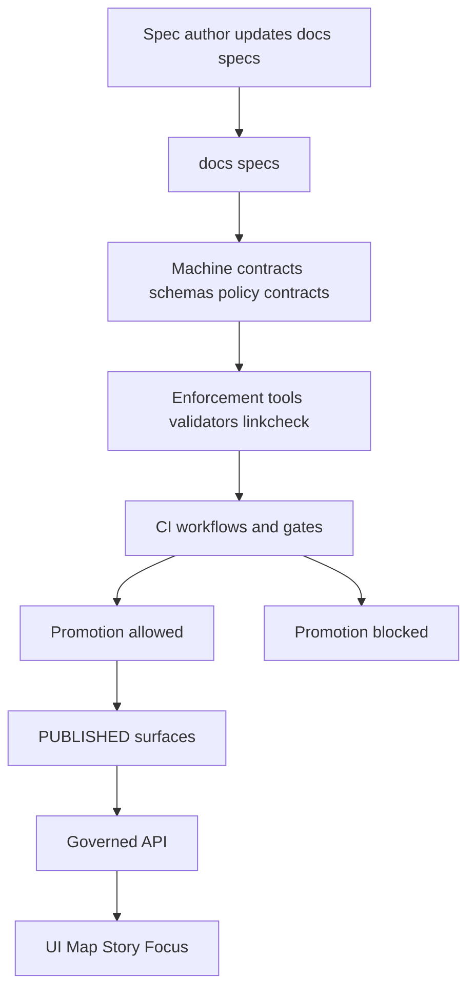

<!-- [KFM_META_BLOCK_V2]
doc_id: kfm://doc/3f3e1d52-0f69-4f07-9e75-4a3ed40b4e7e
title: KFM Specifications Index
type: standard
version: v1
status: draft
owners: @kfm/core
created: 2026-03-04
updated: 2026-03-05
policy_label: restricted
related: [docs/specs/, docs/specs/agents/, docs/specs/observability/, docs/specs/pipelines/, docs/specs/storage/, docs/specs/ui/, schemas/, tools/, policy/, contracts/]
tags: [kfm, specs, contracts, governance]
notes: [Canonical index for governed KFM specifications. Keep links accurate; update owners/status as areas mature.]
[/KFM_META_BLOCK_V2] -->

# KFM Specifications Index
Governed, component-level specifications (contracts) for Kansas Frontier Matrix (KFM): what must be true, how it’s proven, and where enforcement lives.

> **IMPACT**
>
> **Status:** draft (spec surface is active; treat as enforceable only when wired into CI gates)  
> **Owners:** @kfm/core (primary) · @kfm/docs (TODO: set via `CODEOWNERS`)  
> **Policy label:** `restricted` by default (individual sub-specs may be `public` after governance review)  
>
> **Badges (placeholders):**
> [](#)
> [](#)
> [](#)
> [](#)
>
> **Quick nav (verified paths):**  
> [Agents](./agents/) · [Observability](./observability/) · [Pipelines](./pipelines/) · [Storage](./storage/) · [UI](./ui/)  
> **Related contract surfaces:** [Schemas](../../schemas/) · [Validators](../../tools/validators/) · [Linkcheck](../../tools/linkcheck/) · [Policy](../../policy/) · [Contracts](../../contracts/) · [Docs hub](../README.md)

---

## Quick links
- [Scope](#scope)
- [Evidence labels](#evidence-labels)
- [Where it fits](#where-it-fits)
- [Acceptable inputs](#acceptable-inputs)
- [Exclusions](#exclusions)
- [Directory tree](#directory-tree)
- [Quickstart](#quickstart)
- [Specification registry](#specification-registry)
- [Naming and versioning conventions](#naming-and-versioning-conventions)
- [Promotion gates](#promotion-gates)
- [Contribution workflow](#contribution-workflow)
- [Diagram](#diagram)
- [Definition of done](#definition-of-done)
- [FAQ](#faq)

---

## Scope

**CONFIRMED (principle):** Specs are the “human-readable contract surface” that must become machine-enforceable (validators, linkcheck, policy tests, CI gates) before anything can be promoted to governed runtime surfaces.

In scope for `docs/specs/`:
- Component specs that define **what must be true** and **how it will be proven**.
- Interfaces and invariants that protect the **trust membrane** (no privileged shortcuts, no bypasses).
- Testable acceptance criteria and review checklists that make governance **visible and auditable**.
- Pointers to the canonical machine artifacts in:
  - `schemas/` (JSON Schemas and contract registries)
  - `policy/` (OPA/Rego policy bundles + tests)
  - `tools/` (validators, linkcheck, lint gates)
  - `.github/workflows/` (merge/promotion gate wiring)

Out of scope for `docs/specs/`:
- Exploratory notes → use `docs/investigations/` or `docs/reports/` (keep specs normative).
- Implementation code → use `apps/` or `packages/`.
- Raw/derived datasets and large binaries → use governed `data/` zones.
- Secrets/credentials → never commit.

[Back to top](#kfm-specifications-index)

---

## Evidence labels

This directory uses explicit labels to avoid overclaiming.

- **CONFIRMED:** a documented requirement/invariant.  
  If it is *also enforced*, name the enforcement surface (example: `tools/validators`, `tools/linkcheck`, policy tests, CI job).
- **PROPOSED:** design intent / recommended pattern; not yet ratified as required behavior.
- **UNKNOWN:** not verified in this checkout; includes the smallest verification steps required to confirm.

**Fail-closed rule (policy):** if you can’t ground it, mark it **UNKNOWN** and list the smallest verification step.

**UNKNOWN (verify now):** The exact current contents of `docs/specs/` and which specs are actually wired into CI today.  
Smallest verification steps:
1. `tree -L 3 docs/specs`
2. `ls -la .github/workflows`
3. Identify which workflows call `tools/validators/*` and `tools/linkcheck/*`
4. Update this index’s “Status” column accordingly.

---

## Where it fits

**CONFIRMED (system model):** KFM is a pipeline → catalogs → governed API → UI system. Specs sit between “design intent” and “enforcement,” and must never propose shortcuts that bypass policy, evidence resolution, or governed access boundaries.

Upstream inputs to specs:
- Governance posture and sensitivity constraints (`docs/governance/`)
- Architecture invariants (`docs/architecture/`)
- Standards/profiles (`docs/standards/`, plus contract registries in `schemas/`)

Downstream consumers of specs:
- Machine contracts: `schemas/`, `contracts/`, `policy/`
- Enforcement tooling: `tools/validators/`, `tools/linkcheck/` (and other tools under `tools/`)
- CI wiring: `.github/workflows/`
- Runtime implementations: `apps/`, `packages/`

**CONFIRMED (trust membrane invariant):** clients (UI/external) do not access databases or storage directly; access must cross the governed API + policy boundary.

[Back to top](#kfm-specifications-index)

---

## Acceptable inputs

Put these in `docs/specs/**`:
- `README.md` per area (purpose, where it fits, inputs, exclusions, directory tree, diagram, task list).
- `*.md` normative specs and component contracts (MUST/SHOULD/MAY language encouraged).
- Mermaid diagrams (` ```mermaid `) explaining boundaries + handoffs.
- Small, sanitized examples (toy JSON/YAML) that are safe to publish and review.

Preferred: keep machine-readable contracts in their canonical homes and link to them:
- JSON Schema → `schemas/**`
- OpenAPI/HTTP contracts → `contracts/**` (or repo-standard equivalent)
- Rego policy + tests → `policy/**`
- Validators + linkcheck entrypoints → `tools/**`

---

## Exclusions

Do **not** put these in `docs/specs/**`:
- Secrets/tokens/credentials (ever).
- Raw restricted evidence, sensitive-location coordinates, or content enabling targeting.
- Large binaries (screenshots, datasets, opaque exports) unless explicitly approved and kept diffable.
- Canonical datasets/catlogs themselves (belong in governed `data/` zones and catalogs).
- Implementation code (belongs in `apps/` / `packages/`).

---

## Directory tree

**CONFIRMED (repo tree):** current `docs/specs/` layout.

```text
docs/specs/
├─ README.md
├─ agents/
│  ├─ README.md
│  ├─ WATCHER_CONTRACT.md
│  ├─ PLANNER_CONTRACT.md
│  └─ EXECUTOR_CONTRACT.md
├─ observability/
│  └─ README.md
├─ pipelines/
│  └─ README.md
├─ storage/
│  └─ README.md
└─ ui/
   └─ README.md
```

**PROPOSED:** each subdirectory may grow additional `*.md` specs over time; keep additions small and link-checkable.

[Back to top](#kfm-specifications-index)

---

## Quickstart

**CONFIRMED (tools exist):** this repo contains fail-closed validators and linkcheck tooling that are intended to be used as promotion gates.  
**UNKNOWN:** exact CI wiring and exact local prerequisites (Node versions, package manager, etc.).  
Smallest verification step: read `tools/validators/README.md` and `tools/linkcheck/README.md`, then inspect `.github/workflows/`.

```bash
# From repo root: verify this index is aligned to the current tree
tree -L 3 docs/specs

# Run catalog triplet validators (fail-closed)
node tools/validators/validate_dcat.js
node tools/validators/validate_stac.js
node tools/validators/validate_prov.js
node tools/validators/validate_receipts.js

# Validate contract versioning (if used by your CI gates)
node tools/validators/validate_contract_versions.js

# Linkcheck cross-references and evidence handles (fail-closed)
node tools/linkcheck/catalog_linkcheck.js
```

---

## Specification registry

Keep this table current so contributors can quickly find contract surfaces and enforcement entrypoints.

| Area | Path | Key docs in this repo | Related machine artifacts (canonical homes) | Enforcement surfaces | Status |
|---|---|---|---|---|---|
| Agents (Watcher/Planner/Executor) | `docs/specs/agents/` | `README.md`, `WATCHER_CONTRACT.md`, `PLANNER_CONTRACT.md`, `EXECUTOR_CONTRACT.md` | `schemas/watcher.v1.schema.json` (and any agent telemetry schemas under `schemas/telemetry/`) | CI + branch protection (expected), plus tooling under `tools/` (verify) | PROPOSED (some parts may be enforced; verify CI) |
| Observability | `docs/specs/observability/` | `README.md` | `schemas/telemetry/`, plus any audit log schemas | `tools/linkcheck/` for reference integrity (plus telemetry validators if added) | PROPOSED |
| Pipelines | `docs/specs/pipelines/` | `README.md` | `schemas/run_receipt.v1.schema.json`, `schemas/run_manifest.v1.schema.json` | `tools/validators/` + policy tests + CI gates | PROPOSED (truth-path zones are CONFIRMED as design) |
| Storage | `docs/specs/storage/` | `README.md` | Catalog schemas under `schemas/{dcat,stac,prov}/` + receipts/manifests | `tools/validators/`, `tools/linkcheck/` | PROPOSED |
| UI | `docs/specs/ui/` | `README.md` | `schemas/ui/` + Story Node schemas under `schemas/storynodes/` | Linkcheck + UI tests (expected) | PROPOSED |

**UNKNOWN (link hygiene audit):** some sub-spec READMEs reference directories that are not present under `docs/specs/` in this repo snapshot.  
Smallest fix: update those links to the repo’s actual canonical paths (often `docs/quality/`, `schemas/`, `tools/`, `policy/`).

[Back to top](#kfm-specifications-index)

---

## Naming and versioning conventions

**CONFIRMED (repo patterns observed):**
- Specs are Markdown (`docs/specs/**.md`).
- Schemas are versioned JSON Schema files (examples: `*.v1.schema.json`) under `schemas/`.
- Validators are runnable scripts under `tools/validators/` (examples: `validate_*.js`).
- Linkcheck entrypoints are runnable scripts under `tools/linkcheck/` (examples: `*_linkcheck.js`).

**PROPOSED (keep it boring and searchable):**
- Spec files: `AREA__TOPIC.md` for broad topics, or `*_CONTRACT.md` for component interface documents.
- Runbooks: `RUNBOOK__<incident_or_op>.md` (or keep runbooks under `docs/runbooks/` and link here).
- If you introduce a new schema:
  - Add it under `schemas/<area>/`
  - Add a validator entry (or update an existing validator)
  - Add a linkcheck rule if cross-references can break

---

## Promotion gates

**CONFIRMED (design posture):** promotion is fail-closed and evidence-producing; do not “promote by convention.”

Truth path (zones):
- RAW → WORK/QUARANTINE → PROCESSED → CATALOG/TRIPLET → PUBLISHED

Minimum evidence required to promote (policy checklist):

| Gate | Required evidence (minimum) | Notes |
|---|---|---|
| RAW → WORK/QUARANTINE | dataset identity + versioning rules + license/rights + sensitivity classification | WORK/QUARANTINE is where QA happens; quarantine blocks promotion |
| WORK/QUARANTINE → PROCESSED | validation outputs meeting thresholds + deterministic provenance + integrity checksums | Fail closed on missing/invalid evidence |
| PROCESSED → CATALOG/TRIPLET | DCAT + STAC + PROV are present, valid, and cross-linked | Triplet validity is a promotion contract surface (validators + linkcheck) |
| CATALOG/TRIPLET → PUBLISHED | auditable run record + policy decision record + stable catalogs | Publication must be explicitly allowed and reviewable |

**PROPOSED:** encode these as CI “promotion contract tests” and require a machine report artifact upload for each gate (validators + linkcheck + policy).

[Back to top](#kfm-specifications-index)

---

## Contribution workflow

Keep changes small, reversible, and additive.

1. Add or update the spec doc(s) under the correct area in `docs/specs/`.
2. If a machine-readable contract changes, update its canonical home:
   - Schema → `schemas/`
   - Policy → `policy/`
   - OpenAPI/contract → `contracts/`
3. Wire or update enforcement:
   - validators in `tools/validators/`
   - link integrity checks in `tools/linkcheck/`
   - policy tests in `policy/` (and CI wiring)
4. Update this index:
   - directory tree if structure changed
   - spec registry table (add new docs, update status)
5. If you add a new spec area:
   - create the folder
   - include a `README.md` in that folder (purpose + where it fits + inputs + exclusions + tree + diagram)
   - add it to the registry table above

---

## Diagram


```mermaid
flowchart TD
  A[Spec author updates docs specs] --> B[docs specs]
  B --> C[Machine contracts schemas policy contracts]
  C --> D[Enforcement tools validators linkcheck]
  D --> E[CI workflows and gates]
  E --> F[Promotion allowed]
  E --> G[Promotion blocked]
  F --> H[PUBLISHED surfaces]
  H --> I[Governed API]
  I --> J[UI Map Story Focus]
```

---

## Definition of done

Use this checklist for any PR that changes `docs/specs/**`.

- [ ] MetaBlock v2 present and updated (`created` stays stable; `updated` changes).
- [ ] Evidence labels used: CONFIRMED / PROPOSED / UNKNOWN (and UNKNOWN includes minimal verification steps).
- [ ] Links are relative where possible and pass link checking.
- [ ] Spec registry table updated (no stale indices).
- [ ] If the change implies a machine contract:
  - [ ] schema updated in `schemas/` (or contract updated in `contracts/`)
  - [ ] validator updated/added in `tools/validators/` (or rationale documented)
  - [ ] linkcheck updated if references can break (`tools/linkcheck/`)
- [ ] If the change implies a policy constraint:
  - [ ] policy change lives in `policy/` (not buried in docs)
  - [ ] tests added and fail closed by default
  - [ ] rationale + rollback path written in the PR description
- [ ] CI workflow wiring updated (or explicitly marked **PROPOSED** until wired).

[Back to top](#kfm-specifications-index)

---

## FAQ

**Why are specs in `docs/` instead of only in code?**  
**CONFIRMED (policy):** KFM treats documentation as a production surface; contracts must be readable *and* enforceable.

**Where do I put exploratory work?**  
Use `docs/investigations/` or `docs/reports/`. Promote only matured, enforceable artifacts into `docs/specs/`.

**What if I don’t know whether something is true?**  
Mark it **UNKNOWN** and include the smallest verification steps needed to confirm it.

---

<details>
<summary>Appendix: MetaBlock v2 template</summary>

```text
<!-- [KFM_META_BLOCK_V2]
doc_id: kfm://doc/<uuid>
title: <Title>
type: standard
version: v1
status: draft|review|published
owners: <team or names>
created: YYYY-MM-DD
updated: YYYY-MM-DD
policy_label: public|restricted|...
related: [<paths or kfm:// ids>]
tags: [kfm]
notes: [<short notes>]
[/KFM_META_BLOCK_V2] -->
```

</details>

<details>
<summary>Appendix: Verification commands</summary>

```bash
# Verify current spec inventory
tree -L 3 docs/specs

# Verify top-level contract surfaces
ls -la schemas tools policy contracts

# Find references to missing paths (quick hygiene pass)
rg -n "docs/specs/(api|qa|data|security|ci|telemetry|provenance|catalog)/" docs/specs -S

# Inspect CI wiring for gates (what actually blocks merges/promotions)
ls -la .github/workflows
rg -n "tools/validators|tools/linkcheck|conftest|opa|policy" .github/workflows -S
```

</details>
