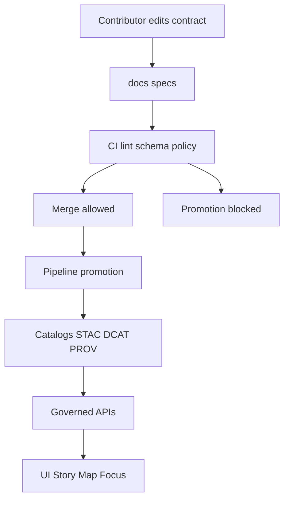

<!-- [KFM_META_BLOCK_V2]
doc_id: kfm://doc/3f3e1d52-0f69-4f07-9e75-4a3ed40b4e7e
title: KFM Specifications Index
type: standard
version: v1
status: draft
owners: @kfm/core
created: 2026-03-04
updated: 2026-03-04
policy_label: restricted
related: [docs/specs/data/, docs/specs/qa/, docs/specs/security/, docs/specs/ci/, docs/specs/api/, docs/specs/telemetry/]
tags: [kfm, specs, contracts, governance]
notes: [Canonical index for governed KFM specifications. Keep links accurate; update owners/status as areas mature.]
[/KFM_META_BLOCK_V2] -->

# KFM Specifications
Governed specifications (contracts) for KFM: schemas, policies, gates, and invariants that must be enforceable in CI.

> **IMPACT**
>
> **Status:** draft (treat as enforceable once wired into CI)  
> **Owners:** @kfm/core (TODO), @kfm/docs (TODO)  
> **Policy label:** `restricted` by default (set to `public` only after governance review)  
>
> **Badges (placeholders):**
> [](#)
> [](#)
> [](#)
> [](#)
>
> **Quick nav:**  
> [Architecture](./architecture/) · [Data](./data/) · [API](./api/) · [Provenance](./provenance/) · [QA](./qa/) · [Security](./security/) · [CI](./ci/) · [Telemetry](./telemetry/) · [Pipelines](./pipelines/)

## Quick links
- [Scope](#scope)
- [Evidence tags](#evidence-tags)
- [Where it fits](#where-it-fits)
- [Acceptable inputs](#acceptable-inputs)
- [Exclusions](#exclusions)
- [Directory tree](#directory-tree)
- [Quickstart](#quickstart)
- [Specification registry](#specification-registry)
- [Promotion gates](#promotion-gates)
- [Contribution workflow](#contribution-workflow)
- [Diagram](#diagram)
- [Definition of done](#definition-of-done)
- [FAQ](#faq)

---

## Scope

**CONFIRMED (policy):** Anything in `docs/specs/` is intended to become a *system contract* (human-readable and machine-enforceable). If a document is *just an idea*, it belongs somewhere else (see Exclusions).

In scope:
- Contract documents that define **what must be true** (schemas, required fields, invariants, gate criteria).
- Machine-readable artifacts: **JSON Schema**, **OpenAPI**, **vocabulary files**, **Rego policies**, example fixtures.
- Validation gates/runbooks that are treated as production surfaces (kept current, referenced by CI, reviewed on a schedule).

Out of scope:
- Exploratory research notes, brainstorming, and non-normative writeups.
- Vendor- or environment-specific secrets, tokens, credentials, or anything requiring private infrastructure access.
- Large binaries / datasets (those belong under `data/` and governed data zones).

[Back to top](#kfm-specifications)

---

## Evidence tags

This repo uses explicit evidence tags to avoid overclaiming.

- **CONFIRMED:** backed by an enforced check (tests/policy/CI) *or* explicitly declared as platform policy.
- **PROPOSED:** documented design intent; not yet proven by enforcement.
- **UNKNOWN:** not verified; includes the smallest verification step(s) required to make it CONFIRMED.

**UNKNOWN (verify now):** The exact current contents of `docs/specs/` in your working tree.  
Verification steps:
1. `git ls-tree -r HEAD docs/specs`
2. Update the tables/trees below to match reality.
3. Set each area’s status to CONFIRMED only after a CI gate references it.

---

## Where it fits

**CONFIRMED (design):** KFM is organized into modular layers; `docs/` is the human-readable system documentation layer, while contracts/policy/tools/data/apps/packages form the governed build/run surfaces. `docs/specs/` sits at the boundary between “human intent” and “machine enforcement.”

Upstream inputs to specs:
- Governance + ethics requirements (policy constraints, default-deny publishing, sensitivity rules).
- Domain authority requirements (data providers, standards like STAC/DCAT/PROV, internal contract conventions).

Downstream consumers of specs:
- `tools/validation/` checks (schema validation, policy conftest runs, link checks).
- CI workflows that block promotion/merge on gate failure.
- `contracts/` and `policy/` implementations (OpenAPI, Rego packs) and any API/UI expectations.
- Pipeline promotion logic (RAW → WORK → PROCESSED → PUBLISHED lifecycle gates).

---

## Acceptable inputs

Put these here:
- `*.md` contract docs with clear “must/shall” statements and examples.
- `*.json` JSON Schemas (OpenAPI components, telemetry event schemas, STAC extensions, etc.).
- `*.yaml` / `*.yml` where a governed config format is explicitly versioned and validated.
- `*.rego` policies and `*_test.rego` conftest tests **only if** this directory is the canonical home for the contract (otherwise link to `policy/`).

**PROPOSED:** Prefer “spec + schema + example” bundled per area (README explains intent, schemas are machine-readable, examples are real).

---

## Exclusions

Do **not** put these in `docs/specs/`:
- Draft brainstorming or research spikes → put under `docs/research/` (or a dedicated design pack under `docs/design/`).
- Implementation details (code) → put under `apps/` or `packages/`.
- Raw/derived datasets → put under `data/` following lifecycle zones.
- Secrets / credentials → never commit; use secret management.

---

## Directory tree

**PROPOSED (scaffold):** Replace this with the actual tree once verified.

```text
docs/specs/
├─ README.md                  # This index
├─ architecture/              # System boundaries + invariants
├─ api/                       # REST contracts + schema registries
├─ ci/                        # Detect → validate → promote contract(s)
├─ data/                      # STAC/DCAT profiles, dataset rules
├─ pipelines/                 # Orchestration + lane contracts
├─ provenance/                # PROV policies and mappings
├─ qa/                        # Validation gates + runbooks
├─ security/                  # Supply-chain + security policy surfaces
└─ telemetry/                 # Event vocab + observability contracts
```

---

## Quickstart

**UNKNOWN:** The canonical command names in *this* repo (verify Makefile/scripts).  
Verification steps:
1. `ls -la` at repo root for `Makefile` / `tools/validation/`.
2. Grep CI workflows for invoked commands.

```bash
# pseudocode — rename targets to match this repo
make docs-lint
make specs-validate
make policy-test
```

---

## Specification registry

**PROPOSED:** Treat this table as the “table of contents” for contract surfaces.  
Update “Status” as each area gains enforcement.

| Area | Path | Primary artifacts (examples) | What it governs | Status |
|---|---|---|---|---|
| Architecture | `docs/specs/architecture/` | `ARCH__SYSTEM_BOUNDARIES.md` | Trust membrane, boundary rules, non-bypass invariants | PROPOSED |
| Data | `docs/specs/data/` | `DATA__STAC_PROFILE.md`, `DATA__DCAT_PROFILE.md` | Catalog shape, required metadata, dataset identity rules | PROPOSED |
| API | `docs/specs/api/` | `API__REST_CONTRACT.md`, `schemas/…` | Governed endpoints + schema compatibility | PROPOSED |
| Provenance | `docs/specs/provenance/` | `PROV__POLICY.md`, mappings | What evidence must be emitted and how it links | PROPOSED |
| QA | `docs/specs/qa/` | `QA__VALIDATION_GATES.md`, `runbooks/…` | Validation lanes, thresholds, and failure semantics | PROPOSED |
| Security | `docs/specs/security/` | supply-chain requirements, threat model pointers | SBOM/SLSA, signing, secrets policy | PROPOSED |
| CI | `docs/specs/ci/` | `CI__DETECT_VALIDATE_PROMOTE.md` | Idempotent detect→validate→signed promote | PROPOSED |
| Telemetry | `docs/specs/telemetry/` | `FOCUS__EVENTS.md`, event schemas | Events, fields, retention, redaction rules | PROPOSED |
| Pipelines | `docs/specs/pipelines/` | `ASSETS__ORCHESTRATION.md` | Lane boundaries + orchestrator contracts | PROPOSED |

### Naming conventions

**PROPOSED:** Use filename prefixes to make contract intent obvious.

| Prefix | Meaning | Typical location |
|---|---|---|
| `ARCH__` | System boundaries and invariants | `docs/specs/architecture/` |
| `DATA__` | Data profiles and catalog rules | `docs/specs/data/` |
| `API__` | API contracts and compatibility | `docs/specs/api/` |
| `QA__` | Validation gates and thresholds | `docs/specs/qa/` |
| `PROV__` | Provenance policy and mappings | `docs/specs/provenance/` |
| `SEC__` | Security and supply-chain contracts | `docs/specs/security/` |
| `CI__` | CI semantics and promotion contracts | `docs/specs/ci/` |
| `TELEMETRY__` | Observability/event contracts | `docs/specs/telemetry/` |

[Back to top](#kfm-specifications)

---

## Promotion gates

**CONFIRMED (policy):** Data promotion is gated and evidence-producing; do not “promote by convention.”

Lifecycle:
- RAW → WORK → PROCESSED → PUBLISHED

Minimum evidence required to promote (policy checklist):

| Gate | Required evidence | Notes |
|---|---|---|
| RAW → WORK | Identity + schema + extents + license + sensitivity classification | WORK is quarantine/staging; nothing reaches production consumers yet |
| WORK → PROCESSED | Validation outputs meeting thresholds + provenance bundle + integrity checksums | Fails closed on missing/invalid evidence |
| PROCESSED → PUBLISHED | Auditable run record + policy decision record + stable catalogs | Publication must be explicitly allowed and reviewable |

**PROPOSED:** Encode these as CI “promotion contract tests” (deny by default).

---

## Contribution workflow

**PROPOSED:** Keep changes small, reversible, and additive.

1. Add/update the spec doc(s) under the correct area.
2. Add/update machine-readable schema(s) and example fixtures where applicable.
3. Wire or update enforcement:
   - schema validation in `tools/validation/`
   - policy checks in `policy/` + conftest tests
   - CI workflow references
4. Update this index table and set status tags appropriately.

---

## Diagram


```mermaid
flowchart TD
  A[Contributor edits contract] --> B[docs specs]
  B --> C[CI lint schema policy]
  C --> D[Merge allowed]
  C --> E[Promotion blocked]
  D --> F[Pipeline promotion]
  F --> G[Catalogs STAC DCAT PROV]
  G --> H[Governed APIs]
  H --> I[UI Story Map Focus]
```

---

## Definition of done

Use this checklist for any PR that changes `docs/specs/**`.

- [ ] MetaBlock v2 present and updated (`created` stays stable; `updated` changes).
- [ ] Evidence tags used: CONFIRMED / PROPOSED / UNKNOWN (and UNKNOWN includes verification steps).
- [ ] Links are relative where possible and pass link checking.
- [ ] Any schema changes have:
  - [ ] a validator in `tools/validation/` (or referenced equivalent),
  - [ ] fixtures/examples,
  - [ ] a compatibility note (backward compatibility or migration plan).
- [ ] Any policy changes have:
  - [ ] Rego tests,
  - [ ] fail-closed defaults,
  - [ ] clear rationale and rollback path.
- [ ] CI updated to enforce the new/changed contract (or explicitly marked PROPOSED with a ticket link).
- [ ] Directory README(s) updated (no stale indices).

[Back to top](#kfm-specifications)

---

## FAQ

**Why are specs in `docs/` instead of only in code?**  
**CONFIRMED (policy):** KFM treats documentation as a production surface; contracts must be readable *and* enforceable.

**Where do I put exploratory work?**  
Use `docs/research/` or a scoped design pack under `docs/design/`. Promote only matured, enforceable artifacts into `docs/specs/`.

**What if I don’t know whether something is true?**  
Mark it **UNKNOWN** and include the smallest verification steps needed to confirm it.

---

<details>
<summary>Appendix: MetaBlock v2 template</summary>

```text
<!-- [KFM_META_BLOCK_V2]
doc_id: kfm://doc/<uuid>
title: <Title>
type: standard
version: v1
status: draft|review|published
owners: <team or names>
created: YYYY-MM-DD
updated: YYYY-MM-DD
policy_label: public|restricted|...
related: [<paths or kfm:// ids>]
tags: [kfm]
notes: [<short notes>]
[/KFM_META_BLOCK_V2] -->
```

</details>

<details>
<summary>Appendix: Verification commands</summary>

```bash
# Verify current spec inventory
git ls-tree -r HEAD docs/specs

# Optional: visualize folder structure
tree docs/specs -L 3
```

</details>
