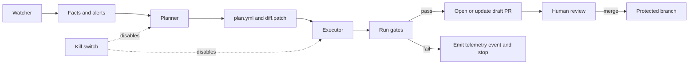

<!-- [KFM_META_BLOCK_V2]
doc_id: kfm://doc/6d0fd6f4-6f2f-44d4-a4da-9f33b7b22e38
title: Executor Contract
type: standard
version: v11.2.6
status: draft
owners: KFM Platform · Governance
created: 2026-03-04
updated: 2026-03-04
policy_label: public
related:
  - docs/specs/agents/README.md
  - docs/specs/agents/WATCHER_CONTRACT.md
  - docs/specs/agents/PLANNER_CONTRACT.md
  - docs/governance/ROOT_GOVERNANCE_CHARTER.md
tags: [kfm, agents, wpe, executor, contract, governance]
notes:
  - Defines the Executor’s permissions, gates, PR rules, provenance, and failure modes.
  - Designed to be fail-closed, PR-first, and auditable.
[/KFM_META_BLOCK_V2] -->

# Executor Contract

Contract for the KFM **Executor** agent: apply deterministic plans by **opening/updating governed PRs** with **attached proofs**, and **never merge**.

> [!IMPORTANT]
> This is a **contract** (what must be true), not an implementation tutorial.
> Where this doc contains design choices that may vary by repo, they are marked **PROPOSED** or **UNKNOWN**.

---

## IMPACT

**Status:** Experimental  
**Owners:** KFM Platform · Governance (TODO: add CODEOWNERS handle)  
**Last updated:** 2026-03-04  
**Contract family:** W·P·E (Watcher · Planner · Executor)  
**Primary upstream:** `docs/specs/agents/PLANNER_CONTRACT.md`  
**Primary downstream:** `.github/workflows/*` PR gates + human review/merge on protected branches

**Badges (placeholders; wire to CI later):**  
  
  


**Quick links:**  
- [Agent architecture](./README.md)  
- [Watcher contract](./WATCHER_CONTRACT.md)  
- [Planner contract](./PLANNER_CONTRACT.md)  
- [Governance charter](../../governance/ROOT_GOVERNANCE_CHARTER.md)  
- [Example PR body](./examples/pr-body.example.md) (PROPOSED)  

---

## Scope

**CONFIRMED:** The Executor is the **only** W·P·E component allowed to perform repo mutations, and it does so **only** by opening/updating PRs with governance artifacts attached.  
**PROPOSED:** The Executor runs in CI (GitHub Actions) and/or as a controlled operator command, but must behave identically under the same inputs.

---

## Where it fits

**CONFIRMED:** KFM uses “PR-first publishing” for governed change promotion: Executor opens/updates PRs; humans merge via protected-branch rules.  
**CONFIRMED:** Executor participates in the broader governance system: policy packs, validation gates, and evidence/provenance bundles must be present and verifiable before merge.

---

## Acceptable inputs

**CONFIRMED:** The Executor consumes deterministic planning outputs and required governance artifacts:

- `plan.yml` (deterministic plan with idempotency key)
- `diff.patch` (unified diff to apply)
- `evidence/` (QA outputs, validation logs, computed digests, etc.)
- Attestation inputs (as required by policy): run receipts, manifests, checksums, SBOM references, SLSA provenance references

**PROPOSED:** Executor also accepts a small runtime envelope (CLI flags or workflow inputs), e.g. base branch, PR draft true/false, and a “dry-run” mode.

---

## Exclusions

**CONFIRMED — Executor must never do any of the following:**

- Merge PRs (no “auto-merge”, no approvals on behalf of humans)
- Push to protected branches (e.g., `main`)
- Bypass schema/policy/QA/reproducibility gates
- Write directly to production data stores or indexes (no “out-of-band” promotion)
- Exfiltrate restricted data into PRs, receipts, logs, or artifacts

---

## Evidence labels used in this contract

To meet KFM “cite-or-abstain” discipline, claims are categorized:

- **CONFIRMED:** A non-negotiable invariant or explicitly required behavior for KFM.
- **PROPOSED:** A recommended default implementation choice, still adjustable by governance.
- **UNKNOWN:** Repo-specific facts not verified yet; smallest steps to confirm are listed.

---

## Non-negotiable invariants

**CONFIRMED — Executor invariants (fail the run if violated):**

1. **PR-first publishing:** Executor may open/update PRs; it never merges and never pushes to protected branches.  
2. **Idempotency:** Stable keys ensure reruns do not duplicate PRs or lineage.  
3. **Determinism:** Same plan + pinned inputs + commit seed must rebuild identical artifacts.  
4. **Fail-closed gates:** If any required gate fails, **no PR is created/updated**.  
5. **Kill-switch:** A single central flag disables Planner/Executor immediately.  
6. **Network boundaries:** No direct writes to production stores; only governed repo changes via PRs.

---

## High-level flow



---

## Contracted interface

### Input contract

**PROPOSED:** `ExecutorRequest` (logical interface, independent of runtime)

```json
{
  "plan_path": "plans/2026-03-04T000000Z/some-subject/plan.yml",
  "diff_path": "plans/2026-03-04T000000Z/some-subject/diff.patch",
  "evidence_dir": "plans/2026-03-04T000000Z/some-subject/evidence/",
  "base_ref": "main",
  "base_sha": "<optional pinned sha from planner>",
  "dry_run": false,
  "pr": {
    "draft": true,
    "labels": ["kfm", "governed-change"],
    "reviewers": ["@CODEOWNERS_TODO"]
  }
}
```

### Output contract

**PROPOSED:** `ExecutorResponse` (must be emitted even on failure)

```json
{
  "status": "COMPLETE | SKIPPED | FAILED",
  "idempotency_key": "executor.<subject>.<window>.<commit_seed>",
  "run_id": "<stable run id>",
  "pr": {
    "number": 123,
    "url": "<pr url>",
    "branch": "agents/<subject_slug>/<idempotency_key>",
    "commit_sha": "<head sha>"
  },
  "artifacts": {
    "prov_bundle": "prov/executor/<ts>/bundle.jsonld",
    "telemetry_event": "telemetry/agents/executor.events.json",
    "gate_report": "plans/.../evidence/gates.json"
  },
  "errors": [
    {
      "gate": "policy-gate",
      "message": "DENY: sensitivity_publishable",
      "evidence": ["plans/.../evidence/policy_report.json"]
    }
  ]
}
```

---

## Permission model and trust boundaries

**CONFIRMED:** Executor runs with **strictly limited** credentials and is constrained by repository branch protections.

### GitHub permissions

**PROPOSED (minimum viable):**

| Capability | Needed | Notes |
|---|---:|---|
| Read repo contents | ✅ | Needed to apply patch and run validators |
| Push to non-protected branches | ✅ | Needed to create/update PR branches (e.g., `agents/*`) |
| Open/update PRs | ✅ | Primary executor action |
| OIDC token for keyless attestations | ✅ | For Sigstore/Cosign keyless attestation flows |
| Merge PRs | ❌ | Must be impossible by permissions and by branch protection |

> [!IMPORTANT]
> “Executor token cannot merge” must be enforced by **both**:
> 1) credential scope, and 2) protected branch rules (required checks, CODEOWNERS, etc.).

### Storage and runtime boundaries

**CONFIRMED:** Executor must not write to production stores (RAW/WORK/PROCESSED, indexes, DBs) directly.  
**PROPOSED:** If artifacts are too large for Git, publish them to an artifact store (e.g., OCI by digest) and commit only digests + receipts + catalogs.

---

## Execution algorithm

**PROPOSED:** The Executor must implement the following steps in order, with fail-closed behavior.

1. **Kill-switch check**
   - If disabled: emit `SKIPPED` telemetry and exit with success (neutral), making no changes.

2. **Load and validate plan**
   - Validate `plan.yml` against schema (planner contract).
   - Verify `idempotency_key` present and stable.
   - Verify plan targets allowed paths (policy-restricted allowlist).

3. **Materialize working tree**
   - Checkout `base_ref` at `base_sha` (if specified).
   - Apply `diff.patch` cleanly.
   - If patch fails to apply: fail closed; emit a gate failure artifact.

4. **Run gates (merge-blocking)**
   - Execute all gates declared by the plan (see Gate matrix).
   - Produce machine-readable gate reports in `evidence/`.

5. **If any gate fails**
   - **Do not** open/update a PR.
   - Emit telemetry with references to evidence artifacts and policy decisions.

6. **If all gates pass**
   - Open or update the PR (idempotent behavior).
   - Attach governance artifacts (committed or as CI artifacts).
   - Emit telemetry and provenance bundle.

---

## Gate matrix

**CONFIRMED:** Executor must fail closed if any required gate fails.  
**PROPOSED:** Standardize gate outputs as JSON for CI summarization.

| Gate | Purpose | Required | Output artifacts |
|---|---|---:|---|
| Schema lint | Validate STAC/DCAT/PROV, JSON schemas, controlled vocabs | ✅ | `evidence/schema_report.json` |
| Policy gate | Enforce deny-by-default rules (license, sensitivity, obligations) | ✅ | `evidence/policy_report.json` |
| QA gate | Domain checks (e.g., geometry diff, completeness, thresholds) | ✅ | `evidence/qa_report.json` |
| Reproducibility gate | Rebuild & compare hashes/digests | ✅ (for promotion lanes) | `evidence/repro_report.json` |
| Supply-chain gate | SBOM + SLSA/attestation presence and verification | ✅ (for build lanes) | `evidence/sbom.spdx.json`, `evidence/slsa.json` |
| Evidence resolvability gate | Every EvidenceRef referenced must resolve and be policy-allowed | ✅ | `evidence/evidence_resolve_report.json` |

---

## PR rules

### Branch naming

**CONFIRMED:** Branch name must be deterministic and derived from the idempotency key.  
**PROPOSED:**
- `agents/<subject_slug>/<idempotency_key>`
- Slug rules: lowercase, `-` separators, max 60 chars, no secrets.

### PR title and body

**PROPOSED:** PRs opened by Executor are **draft by default** and must include:

- Run identifiers: `run_id`, `idempotency_key`, commit seed
- What changed: file list summary + purpose
- Evidence: links/paths to `plan.yml`, `diff.patch`, gate reports
- Provenance: `prov/*/bundle.jsonld` link
- Digests/checksums: for promoted artifacts and receipts
- How to verify: exact commands reviewers can run

### Update behavior

**CONFIRMED:** Reruns must not create duplicate PRs for the same idempotency key.  
**PROPOSED:** If an existing PR branch exists, Executor appends a new commit (no force-push) and updates the PR body comment with the latest gate summary.

---

## Provenance, receipts, and attestations

**CONFIRMED:** Executor must attach enough artifacts for reviewers to validate provenance and policy conformance.  
**PROPOSED:** Use a typed “run receipt” and (where applicable) Sigstore/Cosign attestations.

### Required provenance artifacts

**PROPOSED minimum set (promotion lanes):**
- `run_record.json` (who/what/when; exit status; parameters)
- `run_manifest.json` (produced files, byte sizes, media types, roles)
- `checksums.txt` (SHA-256 lines for every manifest file)
- `prov/executor/<ts>/bundle.jsonld` (PROV-O)

### Attestation expectations

**PROPOSED:**
- Keyless signing in CI using OIDC for attestations
- Attestations and/or transparency-log references recorded in the receipt
- Verification runs in CI and is merge-blocking

---

## Telemetry and audit

**CONFIRMED:** Executor must emit telemetry events and a reviewable audit reference for every run (including failures/skips).  
**PROPOSED:** Store under `telemetry/agents/executor.events.json` as append-only NDJSON or JSON array.

### Event minimum fields

**PROPOSED:**
- `ts` (UTC ISO 8601)
- `run_id`
- `idempotency_key`
- `status`
- `gate_summary` (pass/fail counts)
- `artifacts` (paths/digests)
- `policy_decisions` (allow/deny + obligations)
- `pr_ref` (when created/updated)

---

## Failure modes and required behavior

**CONFIRMED:** Failure must be safe, reviewable, and non-destructive.

| Failure mode | Required behavior |
|---|---|
| Patch does not apply | Fail closed; emit evidence; no PR |
| Policy DENY | Fail closed; emit policy report; no PR |
| Evidence cannot resolve | Fail closed; no PR; recommend scope reduction |
| Sensitive data detected | Fail closed; require redaction proof and governance review |
| Non-deterministic artifact outputs | Fail closed; require pinning and reproducibility fix |
| Kill-switch enabled | Skip safely; emit telemetry |

---

## Definition of done

**PROPOSED:** This contract is “implemented” when all items below are true.

- [ ] Executor can open/update a draft PR from a valid `plan.yml` + `diff.patch`.
- [ ] Merge is impossible for Executor credentials (and blocked by branch protection).
- [ ] All declared gates run in CI and are merge-blocking.
- [ ] Gate failures prevent PR creation/update (fail closed).
- [ ] Idempotency guarantees no duplicate PRs for the same idempotency key.
- [ ] Required provenance artifacts are produced and linked in PR body.
- [ ] Evidence references resolve and are policy-allowed (resolver gate passes).
- [ ] Telemetry is emitted for PASS/FAIL/SKIP with stable IDs.
- [ ] At least one end-to-end fixture test exists (valid + invalid plans).

---

## UNKNOWNS to resolve before enabling in production

These are repo-specific and must be confirmed as governed decisions:

1. **UNKNOWN:** Where the kill-switch lives (path + schema) and who can change it.
   - Smallest verification: locate `ops/feature_flags/agents.yml` (or chosen alternative) and confirm branch protection / review.

2. **UNKNOWN:** Exact artifact retention strategy (Git vs CI artifacts vs OCI vs object storage).
   - Smallest verification: decide retention policy and document it in governance; add a CI artifact retention config.

3. **UNKNOWN:** Exact policy bundle path (`policies/`, `.mcp/gates/`, etc.) and the required deny rules.
   - Smallest verification: list policy pack directories, run `opa test` / conftest fixtures, make checks merge-blocking.

4. **UNKNOWN:** Which gates are required for each lane (docs-only vs dataset promotion vs code change).
   - Smallest verification: define a gate profile matrix by lane; encode in CI and in plan schema.

---

## Appendix

<details>
<summary>Example: draft PR body template (PROPOSED)</summary>

```markdown
## KFM Governed Change

**Run:** `<run_id>`  
**Idempotency key:** `<idempotency_key>`  
**Commit seed:** `<commit_seed>`  
**Base:** `main@<base_sha>`

### What changed
- `<file 1>`
- `<file 2>`

### Evidence and provenance
- Plan: `plans/<ts>/<subject>/plan.yml`
- Patch: `plans/<ts>/<subject>/diff.patch`
- Gate reports: `plans/<ts>/<subject>/evidence/`
- PROV bundle: `prov/executor/<ts>/bundle.jsonld`

### Digests
```json
[
  {"path":"catalog/stac/...","digest":"sha256:..."},
  {"path":"run_receipt/receipt.json","digest":"sha256:..."}
]
```

### How to verify
```bash
make agents-validate PLAN=plans/<ts>/<subject>/plan.yml
conftest test run_receipt/receipt.json --policy policies
```

> Reviewers: merge only if policy remains green and required checks pass.
```

</details>

<details>
<summary>Example: GitHub Actions permission sketch (PROPOSED)</summary>

```yaml
# .github/workflows/agents-executor.yml
name: agents-executor
on:
  workflow_dispatch:
  workflow_call:

permissions:
  pull-requests: write
  contents: write
  id-token: write

jobs:
  executor:
    runs-on: ubuntu-latest
    steps:
      - uses: actions/checkout@v4
      - name: Validate gates
        run: make agents-validate
      - name: Open or update PR
        run: python tools/agents/open_pr.py --plan "${{ inputs.plan_path }}" --no-merge
```

</details>

---

## Back to top

🔙 [Back to top](#executor-contract)
