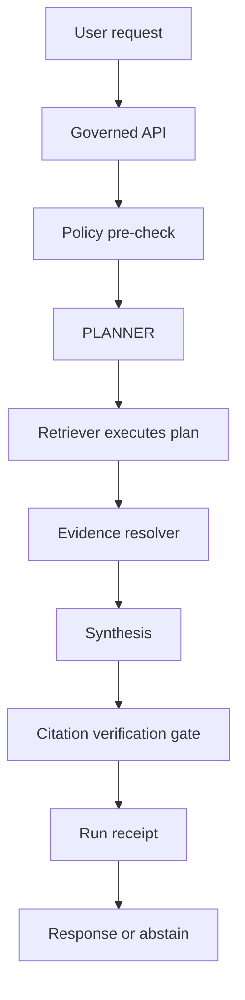

<!-- [KFM_META_BLOCK_V2]
doc_id: kfm://doc/8c4f7a79-0a54-4f9e-9d3a-1b9c2b4a8f2c
title: PLANNER Contract
type: standard
version: v1
status: draft
owners: ["@Kansas-Frontier-Matrix/core (TODO)"]
created: 2026-03-04
updated: 2026-03-04
policy_label: internal
related: [
  "docs/specs/agents/README.md (PROPOSED)",
  "docs/specs/focus/FOCUS_CONTRACT.md (PROPOSED)",
  "docs/specs/evidence/EVIDENCE_RESOLVER_CONTRACT.md (PROPOSED)",
  "docs/governance/ROOT_GOVERNANCE.md (PROPOSED)",
  "policy/ (PROPOSED)"
]
tags: [kfm, agents, focus, contracts, planner]
notes: [
  "Defines the contract for the PLANNER agent used to produce retrieval plans for Focus Mode and other governed operations.",
  "Normative requirements use RFC 2119 keywords."
]
[/KFM_META_BLOCK_V2] -->

# PLANNER Contract
Defines the **PLANNER** agent contract that turns a governed request into a **policy-aware retrieval plan** (and nothing more).

---

## Impact

**Status:** draft  
**Owners:** `@Kansas-Frontier-Matrix/core` (TODO)  
**Applies to:** Focus Mode control loop, step “Retrieval plan” (and any other governed operation that needs evidence-led planning)  
**Change discipline:** additive, reversible, schema-first


**Quick nav:**  
[Scope](#scope) ·
[Where it fits](#where-it-fits) ·
[Inputs](#inputs) ·
[Outputs](#outputs) ·
[Step model](#step-model) ·
[Governance and safety](#governance-and-safety) ·
[Determinism and hashing](#determinism-and-hashing) ·
[Error model](#error-model) ·
[Examples](#examples) ·
[Validation and CI gates](#validation-and-ci-gates) ·
[Open questions](#open-questions) ·
[Appendix](#appendix)

---

## Scope

### What PLANNER is

PLANNER is an **agent** (service or library boundary) responsible for producing a **bounded, policy-aware retrieval plan** that the orchestrator can execute through **approved tools**.

PLANNER outputs *instructions*; it does **not** execute retrieval, mutate datasets, or decide final policy outcomes.

### What PLANNER is not

PLANNER is **not**:

- a database client
- a policy decision point (PDP)
- a citation verifier
- a synthesizer / answer writer
- a data pipeline runner
- an indexer

> **Invariant (FAIL-CLOSED):** If PLANNER cannot produce a plan that can yield admissible EvidenceRefs, it MUST return an abstain/limit-scope plan rather than “guessing.”

---

## Where it fits

### Control loop placement

PLANNER corresponds to the **“Retrieval plan”** stage in the governed Focus Mode loop (after policy pre-check, before retrieval). It may also be reused for Story publishing, audits, or other governed workflows.

### System diagram



### Dependency posture

| Dependency | PLANNER relies on it for | Status |
|---|---|---|
| Policy decision (allow/deny + obligations) | constrain the plan | **CONFIRMED** (required by design) |
| Governed tool allowlist | restrict how PLANNER can propose actions | **PROPOSED** (must exist for injection defenses) |
| Catalog surfaces (DCAT/STAC/PROV) | discover evidence-bearing sources | **CONFIRMED** (contract surface) |
| Evidence resolver | ensure outputs map to EvidenceRefs and bundles | **CONFIRMED** (contract surface) |
| Run receipt emitter | record plan hash + evidence digests | **CONFIRMED** (governed runs) |

---

## Inputs

### Acceptable inputs

PLANNER MUST accept a single **PlannerRequest** object (JSON) that includes:

- the user question / task intent
- policy context (bundle hash/id + pre-check decision)
- optional view state (bbox/time/layers/selection) for scoping
- budgets/limits (timeouts, max results, max steps)
- tool allowlist (or a reference to it)

### PlannerRequest schema summary

| Field | Type | Required | Notes |
|---|---:|---:|---|
| `request_id` | string | ✅ | caller-generated id for tracing |
| `task` | string enum | ✅ | e.g. `focus.ask`, `story.publish`, `audit.explain` |
| `query` | string | ✅ | raw user query (may be redacted before persistence) |
| `principal` | object | ✅ | identity/role attributes used for policy |
| `policy` | object | ✅ | result of policy pre-check + policy bundle reference |
| `view_state` | object | ⛔ | bbox/time/layers; optional but recommended for map UX |
| `budgets` | object | ✅ | hard bounds enforced by orchestrator too |
| `tooling` | object | ✅ | allowlisted tool ids + versions, or a reference hash |
| `context` | object | ⛔ | conversation / prior run context (policy-safe only) |

### Exclusions

PLANNER inputs MUST NOT include:

- raw restricted artifacts (only refs/ids allowed)
- secrets/tokens
- any direct database connection info
- precise sensitive coordinates unless policy explicitly allows (default deny posture)

---

## Outputs

### Output options

PLANNER MUST return one of:

1) **Plan**: a list of bounded retrieval steps that should yield EvidenceRefs; or  
2) **AbstainPlan**: a structured refusal / scope reduction plan that the orchestrator can execute (e.g., “ask a narrower question”, “use only public generalized products”).

### PlannerResponse schema summary

| Field | Type | Required | Notes |
|---|---:|---:|---|
| `status` | enum | ✅ | `planned` \| `abstain` \| `deny` \| `error` |
| `plan` | object | ⛔ | present when `status=planned` |
| `abstain` | object | ⛔ | present when `status=abstain` or `deny` |
| `audit` | object | ✅ | includes `audit_ref` (run id) and trace ids |
| `meta` | object | ✅ | planner version, spec hash, hashes |

### Output invariants

PLANNER output MUST satisfy:

- **No direct storage/db actions.** Only tool calls that go through governed APIs or approved adapters.
- **Every retrieval step MUST yield EvidenceRefs** (or intermediate ids that deterministically map to EvidenceRefs).
- **Budgets MUST be explicit** per step and for the overall plan.
- **Policy constraints MUST be reflected** (role limits, obligations, redaction/generalization requirements).
- **Fail closed**: if admissible evidence cannot be retrieved under constraints, return abstain.

---

## Step model

### Step kinds

PLANNER steps are typed to keep validation strict and prevent “free-form tool use”.

| `kind` | Purpose | Allowed outputs |
|---|---|---|
| `catalog.search` | find candidate datasets/items by theme/coverage | dataset ids, EvidenceRefs |
| `catalog.filter` | narrow by bbox/time/policy label | EvidenceRefs |
| `graph.expand` | bounded graph traversal for relationships | entity ids, EvidenceRefs (refs-only) |
| `spatial.query` | spatial/time filtering via governed API | EvidenceRefs |
| `text.search` | search OCR/doc corpora via governed index | EvidenceRefs |
| `bundle.resolve` | request EvidenceBundle materialization | EvidenceBundles (policy-filtered) |
| `fallback.public` | switch to public-only generalized sources | EvidenceRefs |
| `abstain.compose` | prepare refusal payload (policy-safe) | abstain reasons + next steps |

> **IMPORTANT:** Step kinds are *allowlisted*. Unknown `kind` values MUST fail validation.

### Step structure (normative)

Each `plan.steps[i]` MUST include:

- `step_id` (string, unique within plan)
- `kind` (enum)
- `purpose` (policy-safe short string)
- `tool_id` (string; must be allowlisted)
- `inputs` (object; strictly validated; no free-form prompts)
- `constraints` (bbox/time/policy label caps)
- `limits` (timeouts, max_results, max_hops, etc.)
- `expect` (declares expected output shape)
- `on_empty` (fallback behavior: reduce scope, switch sources, abstain)

### Guardrails (must be expressible in the plan)

PLANNER MUST be able to express and enforce (via outputs) these guardrails:

- **Traversal caps**: `max_hops`, `max_fanout`, `max_results`
- **Allowlist constraints**: permitted node labels / relationship types / return fields (refs-only)
- **Stable ordering** before any `LIMIT`
- **Timeout discipline**: per-step timeout and global budget
- **Leakage constraints**: geometry fields blocked unless explicitly allowed and generalized

---

## Governance and safety

### Trust membrane alignment

**CONFIRMED:** All plan execution must occur through the governed API + policy boundary; clients and agents do not access storage directly.

PLANNER MUST:

- propose only tool calls that cross the governed boundary (PEP)
- never “plan” a shortcut that bypasses evidence resolver or policy checks
- include `policy.obligations` in each step that can touch sensitive material (even as refs)

### Evidence discipline

PLANNER MUST plan for **EvidenceRefs → EvidenceBundles** as the only supported path for citations.

- Planning that yields “raw text snippets” without EvidenceRef mapping is invalid.
- Plans MUST anticipate the “citation verification hard gate” by ensuring that every factual claim the synthesizer could produce has corresponding admissible evidence.

### Prompt injection / exfiltration defenses

PLANNER output MUST include:

- a tool allowlist reference (or embedded allowlist hash)
- explicit refusal to plan calls that would reveal restricted source lists or restricted metadata
- a “treat retrieved content as untrusted” flag for downstream stages (synthesizer/verifier)

---

## Determinism and hashing

### Required hashes

PLANNER MUST compute and return:

- `meta.request_hash`: `sha256(jcs(PlannerRequest.redacted_for_hash))`
- `meta.plan_hash`: `sha256(jcs(PlannerPlan))`
- `meta.contract_spec_hash`: hash of this contract version (or a registry id that maps to it)

> **Canonicalization:** Use RFC 8785 JSON Canonicalization Scheme (JCS) for stable hashing across OS/toolchains.

### Stable IDs

- `plan.plan_id` SHOULD be derived deterministically from `request_hash + planner_version + policy_bundle_hash`.
- If determinism is not possible (e.g., reliance on nondeterministic ranking), PLANNER MUST set `meta.determinism=false` and include `meta.determinism_reason`.

---

## Error model

PLANNER MUST follow the governed error posture:

- Errors MUST be policy-safe (no restricted existence leakage).
- Errors MUST include an `audit_ref`.
- Errors SHOULD include remediation hints that do not disclose restricted details.

### Error codes (starter)

| `error_code` | Meaning |
|---|---|
| `PLANNER_INVALID_REQUEST` | schema validation failed |
| `PLANNER_POLICY_DENY` | policy pre-check denied planning |
| `PLANNER_NO_ADMISSIBLE_EVIDENCE` | cannot find admissible evidence under constraints |
| `PLANNER_TOOL_NOT_ALLOWLISTED` | plan attempted a non-allowlisted tool |
| `PLANNER_BUDGET_EXCEEDED` | cannot form a plan within budgets |
| `PLANNER_INTERNAL_ERROR` | unexpected failure (policy-safe message) |

---

## Examples

### Example 1 — Focus ask (planned)

```json
{
  "request_id": "req_01JZ8K6A9QK9B0Q6YB1WQZP0ZP",
  "task": "focus.ask",
  "query": "What datasets show drought-like low flows in Kansas this week?",
  "principal": { "subject": "user:123", "role": "public" },
  "policy": {
    "bundle_id": "rego:sha256:abc123...",
    "precheck": { "decision": "allow", "obligations": ["no_precise_sensitive_coords"] }
  },
  "view_state": {
    "bbox": [-102.1, 36.9, -94.6, 40.1],
    "time_window": { "start": "2026-02-25", "end": "2026-03-04" },
    "layers": ["streamflow"]
  },
  "budgets": { "max_steps": 6, "max_results": 50, "timeout_ms": 4000 },
  "tooling": { "allowlist_ref": "kfm://tooling/allowlist/sha256:def456..." },
  "context": { "prior_audit_ref": null }
}
```

```json
{
  "status": "planned",
  "audit": { "audit_ref": "audit_focus_20260304_0001" },
  "meta": {
    "planner_version": "v1",
    "request_hash": "sha256:...",
    "plan_hash": "sha256:...",
    "contract_spec_hash": "jcs:sha256:..."
  },
  "plan": {
    "plan_id": "plan_5c3f...",
    "steps": [
      {
        "step_id": "s1",
        "kind": "catalog.search",
        "purpose": "Find hydrology/streamflow datasets covering Kansas in the requested time window",
        "tool_id": "kfm.api.catalog",
        "inputs": { "query_terms": ["streamflow", "Kansas", "percentile"], "themes": ["hydrology"] },
        "constraints": { "bbox": [-102.1, 36.9, -94.6, 40.1] },
        "limits": { "timeout_ms": 1200, "max_results": 20 },
        "expect": { "outputs": ["dataset_ids", "evidence_refs"] },
        "on_empty": { "action": "fallback.public", "note": "Try broader hydrology theme search" }
      },
      {
        "step_id": "s2",
        "kind": "spatial.query",
        "purpose": "Query admissible items within bbox/time; prefer public generalized products",
        "tool_id": "kfm.api.stac",
        "inputs": { "dataset_selector": "from:s1", "time_window": "from:request" },
        "constraints": { "policy_label_allow": ["public"], "no_precise_sensitive_coords": true },
        "limits": { "timeout_ms": 1800, "max_results": 30 },
        "expect": { "outputs": ["evidence_refs"] },
        "on_empty": { "action": "abstain.compose", "note": "No admissible evidence found for the time window" }
      },
      {
        "step_id": "s3",
        "kind": "bundle.resolve",
        "purpose": "Resolve EvidenceRefs into bundles for synthesis and citation verification",
        "tool_id": "kfm.api.evidence_resolver",
        "inputs": { "evidence_refs": "from:s2" },
        "constraints": { "apply_redaction": true },
        "limits": { "timeout_ms": 1000, "max_results": 30 },
        "expect": { "outputs": ["evidence_bundles"] },
        "on_empty": { "action": "abstain.compose", "note": "Evidence resolution failed; fail closed" }
      }
    ]
  }
}
```

### Example 2 — Policy denied (deny)

```json
{
  "status": "deny",
  "audit": { "audit_ref": "audit_focus_20260304_0002" },
  "meta": {
    "planner_version": "v1",
    "request_hash": "sha256:...",
    "contract_spec_hash": "jcs:sha256:..."
  },
  "abstain": {
    "reason_code": "PLANNER_POLICY_DENY",
    "message": "This request cannot be planned under the current access policy.",
    "allowed_alternatives": [
      "Ask about public generalized summaries.",
      "Request steward review for elevated access (if applicable)."
    ]
  }
}
```

---

## Validation and CI gates

### Required gates (minimum)

- [ ] JSON Schema validation for PlannerRequest and PlannerResponse (fail merge on invalid fixtures)
- [ ] Tool allowlist enforcement test (plan cannot reference unknown tools)
- [ ] “EvidenceRef only” regression tests (no raw-text outputs allowed)
- [ ] Deterministic hashing tests (same input produces same request_hash/plan_hash)
- [ ] Policy fixture parity tests (CI and runtime policy outcomes match)
- [ ] Golden plan tests for a small set of canonical queries (diffs reviewed)

### Definition of done for v1

- [ ] This contract is published at `docs/specs/agents/PLANNER_CONTRACT.md`
- [ ] Schemas exist (recommended: `schemas/agents/planner.request.schema.json` and `.response.schema.json`)
- [ ] Fixtures exist: `fixtures/planner/valid/*.json`, `fixtures/planner/invalid/*.json`
- [ ] CI blocks merges on: schema failures, allowlist violations, nondeterministic hashing drift
- [ ] A minimal harness can run PLANNER deterministically in CI (no network required for schema tests)

---

## Open questions

| Item | Status | Smallest verification step |
|---|---|---|
| Exact tool ids and allowlist storage location | **UNKNOWN** | Define `tool_id` registry and add allowlist file + hash in governance bundle |
| Whether PLANNER is a service or library | **UNKNOWN** | Decide boundary in architecture ADR; add integration test for chosen approach |
| How view_state is represented in the API | **UNKNOWN** | Confirm map state schema used by Map Explorer / Focus Mode MVP |
| Where plan_hash is persisted (receipt vs audit DB) | **PROPOSED** | Add field to run_receipt schema and validate in CI |

---

## Appendix

<details>
<summary><strong>Appendix A — Normative JSON shapes (starter)</strong></summary>

> These are starter shapes for discussion and schema extraction. They are intentionally strict:
> `additionalProperties: false` in actual schemas is RECOMMENDED.

### PlannerRequest (starter)

```json
{
  "type": "object",
  "required": ["request_id", "task", "query", "principal", "policy", "budgets", "tooling"],
  "properties": {
    "request_id": { "type": "string" },
    "task": { "type": "string", "enum": ["focus.ask", "story.publish", "audit.explain"] },
    "query": { "type": "string", "minLength": 1 },
    "principal": {
      "type": "object",
      "required": ["subject", "role"],
      "properties": {
        "subject": { "type": "string" },
        "role": { "type": "string" }
      },
      "additionalProperties": false
    },
    "policy": {
      "type": "object",
      "required": ["bundle_id", "precheck"],
      "properties": {
        "bundle_id": { "type": "string" },
        "precheck": {
          "type": "object",
          "required": ["decision"],
          "properties": {
            "decision": { "type": "string", "enum": ["allow", "deny", "needs_review"] },
            "obligations": { "type": "array", "items": { "type": "string" } }
          },
          "additionalProperties": false
        }
      },
      "additionalProperties": false
    },
    "view_state": {
      "type": "object",
      "properties": {
        "bbox": {
          "type": "array",
          "minItems": 4,
          "maxItems": 4,
          "items": { "type": "number" }
        },
        "time_window": {
          "type": "object",
          "required": ["start", "end"],
          "properties": {
            "start": { "type": "string", "format": "date-time" },
            "end": { "type": "string", "format": "date-time" }
          },
          "additionalProperties": false
        },
        "layers": { "type": "array", "items": { "type": "string" } }
      },
      "additionalProperties": false
    },
    "budgets": {
      "type": "object",
      "required": ["max_steps", "max_results", "timeout_ms"],
      "properties": {
        "max_steps": { "type": "integer", "minimum": 1, "maximum": 25 },
        "max_results": { "type": "integer", "minimum": 1, "maximum": 500 },
        "timeout_ms": { "type": "integer", "minimum": 100, "maximum": 60000 }
      },
      "additionalProperties": false
    },
    "tooling": {
      "type": "object",
      "required": ["allowlist_ref"],
      "properties": {
        "allowlist_ref": { "type": "string" }
      },
      "additionalProperties": false
    },
    "context": { "type": "object" }
  },
  "additionalProperties": false
}
```

### PlannerResponse (starter)

```json
{
  "type": "object",
  "required": ["status", "audit", "meta"],
  "properties": {
    "status": { "type": "string", "enum": ["planned", "abstain", "deny", "error"] },
    "audit": {
      "type": "object",
      "required": ["audit_ref"],
      "properties": { "audit_ref": { "type": "string" } },
      "additionalProperties": false
    },
    "meta": {
      "type": "object",
      "required": ["planner_version", "request_hash", "contract_spec_hash"],
      "properties": {
        "planner_version": { "type": "string" },
        "request_hash": { "type": "string" },
        "plan_hash": { "type": "string" },
        "contract_spec_hash": { "type": "string" },
        "determinism": { "type": "boolean" },
        "determinism_reason": { "type": "string" }
      },
      "additionalProperties": false
    },
    "plan": { "type": "object" },
    "abstain": { "type": "object" }
  },
  "additionalProperties": false
}
```

</details>

---

[Back to top](#planner-contract)
