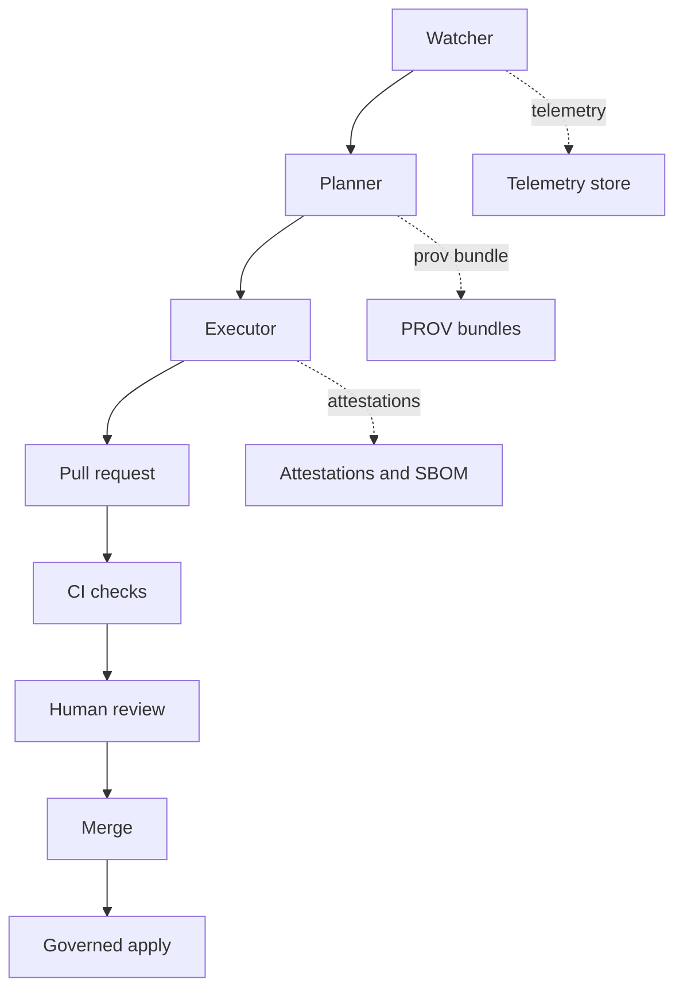

<!-- [KFM_META_BLOCK_V2]
doc_id: kfm://doc/1f0dd7d9-1c4f-46a8-a3a7-87a2a0e9b12b
title: KFM Agents — Watcher · Planner · Executor
type: standard
version: v11.2.6
status: draft
owners: ["TODO: @kfm-core", "TODO: @kfm-governance"]
created: 2026-03-04
updated: 2026-03-04
policy_label: restricted
related: ["docs/specs/README.md", "docs/specs/ci/CI__DETECT_VALIDATE_PROMOTE.md", "docs/specs/data/README.md", "docs/governance/ROOT_GOVERNANCE_CHARTER.md"]
tags: ["kfm", "agents", "wpe", "governance", "ci", "provenance", "telemetry"]
notes: ["Spec-first. Implementation status must be verified in-repo before enabling agents in CI."]
[/KFM_META_BLOCK_V2] -->

<a id="top"></a>

# KFM Agents — Watcher · Planner · Executor

Governed automation that can **observe**, **plan**, and **propose** changes *without bypassing governance*—all changes flow through **pull requests** with attached **provenance** and reproducible evidence.

> **Status:** experimental spec  
> **Owners:** TODO `@kfm-core` · TODO `@kfm-governance`  
> **Review cycle:** quarterly · **Spec version:** `v11.2.6` · **Spec last updated:** `2026-01-08` · **License:** MIT  
>
> 
> 
> 
> 
> 
>
> **Jump to:** [Scope](#scope) · [Where it fits](#where-it-fits) · [Overview](#overview) · [Invariants](#non-negotiable-invariants) · [Architecture](#architecture) · [Component contracts](#component-contracts) · [Reference layout](#reference-layout) · [Quickstart](#quickstart) · [Validation gates](#validation-gates) · [Definition of done](#definition-of-done) · [FAQ](#faq)

---

## Scope

**CONFIRMED:** This spec defines the **W·P·E** pattern: Watcher observes and emits immutable facts, Planner deterministically proposes a plan and patch, and Executor opens or updates a PR with proofs attached.

**PROPOSED:** This spec also describes a default directory layout, plan schema shape, CI wiring, and operational safeguards to make the agent system **auditable, reproducible, and fail-closed**.

**UNKNOWN:** Whether the reference tooling and workflows exist *in this repository right now*. See [Implementation verification](#implementation-verification).

What this spec covers:

- The W·P·E component split and responsibilities.
- Runtime invariants (PR-first, determinism, idempotency, fail-closed gates, kill-switch).
- Inputs/outputs contracts at the level needed for CI, provenance, and review.
- Evidence and provenance attachment points (PR body, CI checks, repo artifacts).
- A proposed filesystem layout and CI “glue” patterns.

What this spec does not cover:

- Domain-specific QA suites (soils, air, hydrology, etc.) beyond “plug here”.
- UI behavior, maps/storytelling, or any client-side agent features.
- Any mechanism that bypasses governed APIs, branch protection, or policy gates.

[Back to top](#top)

---

## Where it fits

This file lives at:

- `docs/specs/agents/README.md`

Upstream dependencies:

- Governance and policy baseline: `docs/governance/ROOT_GOVERNANCE_CHARTER.md`
- Data standards and profiles: `docs/specs/data/README.md`
- CI promotion patterns: `docs/specs/ci/CI__DETECT_VALIDATE_PROMOTE.md`
- Telemetry schema: `schemas/telemetry/focus-telemetry.json` (path may differ)

Downstream surfaces:

- CI workflows (proposed): `.github/workflows/agents-watcher.yml`, `agents-planner.yml`, `agents-executor.yml`
- Tooling (proposed): `tools/agents/*.py` or equivalent
- Generated run artifacts (proposed): `artifacts/`, `plans/`, `prov/`, `telemetry/`

[Back to top](#top)

---

## Acceptable inputs

Allowed content under `docs/specs/agents/`:

- Markdown specs and contracts (`README.md`, `*_CONTRACT.md`)
- Example plans and patches (`examples/plan.example.yml`, `examples/diff.example.patch`)
- Review templates (PR body templates, checklists)
- Links to schemas and governance docs

[Back to top](#top)

---

## Exclusions

Must not be added under `docs/specs/agents/`:

- Agent implementation code (put under `tools/`, `src/`, or a dedicated package)
- Secrets, tokens, private keys, or credentials
- Raw restricted datasets or sensitive extracts
- Anything that enables bypassing governance (direct DB writes, direct prod deploy keys, merge automation)

[Back to top](#top)

---

## Overview

**CONFIRMED:** The system is split into three narrowly-scoped components:

- **Watcher:** low-risk sensor that observes repos, catalogs, and runtime signals; emits immutable facts and alerts; never mutates.
- **Planner:** deterministic, spec-driven planner; produces PR-ready artifacts only.
- **Executor:** constrained runner that opens or updates PRs and attaches proofs; never merges and never pushes to protected branches.

All components are expected to be **idempotent**, **seeded**, and **traceable**, emitting **STAC/DCAT** records (data), **PROV-O** lineage (process), and **telemetry events** (operations).

### Responsibility matrix

| Component | Primary purpose | Must never do | Credentials | Primary outputs |
|---|---|---|---|---|
| Watcher | Observe and normalize signals | Mutate code/data; write to production stores | Read-only | `facts.ndjson`, `alerts.json`, `prov bundle`, watcher telemetry |
| Planner | Turn facts into deterministic plan and patch | Use nondeterministic network calls; produce volatile outputs | Read-only | `plan.yml`, `diff.patch`, evidence, planner PROV |
| Executor | Apply plan by PR creation and attaching proofs | Merge; force push; bypass gates | Short-lived PR token | PR, executor telemetry, attached artifacts |

[Back to top](#top)

---

## Architecture



Key idea: **Watcher and Planner are read-only**; **Executor can only open PRs** and must be blocked from merge or protected branch writes.

[Back to top](#top)

---

## Non-negotiable invariants

**CONFIRMED:** The agent system must enforce these invariants as fail-closed gates.

| Invariant | What it means | Enforcement surface |
|---|---|---|
| PR-first publishing | Executors open or update PRs; they never merge | Branch protection + executor token scope |
| Idempotency | Re-runs do not duplicate lineage, artifacts, or PRs | Stable keys in artifacts + PR branch naming |
| Determinism | Same pinned inputs + commit seed rebuild identical artifacts | Planner rules + reproducibility CI job |
| Fail-closed gates | No PR if schema/policy/QA/repro checks fail | Executor gate runner |
| Kill-switch | One switch stops Planner and Executor immediately | `ops/feature_flags/agents.yml` + emergency hooks |
| Network boundaries | No direct writes to production stores | Credential scoping + code review rules |

[Back to top](#top)

---

## Component contracts

### Watcher

**CONFIRMED**

**Purpose:** Observe sources and normalize signals.

**Inputs**

- Git metadata (branches, tags, workflow runs)
- Data catalogs (STAC/DCAT)
- CI artifacts, QA reports, energy and carbon telemetry
- Policy files (OPA/Rego), schemas, SBOMs, SLSA attestations

**Outputs**

- `artifacts/watcher/{ts}/facts.ndjson` (immutable events)
- `artifacts/watcher/{ts}/alerts.json` (policy and quality alerts)
- `catalogs/stac/watcher-items/` (optional STAC Items for observed datasets)
- `prov/watcher/{ts}/bundle.jsonld` (PROV-O entities and activities)
- `telemetry/agents/watcher.events.json`

**Guarantees**

- No side effects on code/data.
- Facts are append-only and content-addressed (hashes and checksums).

---

### Planner

**CONFIRMED**

**Purpose:** Convert facts into deterministic change plans.

**Inputs**

- Watcher facts and alerts
- Policy baselines (control matrix), schema versions, QA thresholds
- Templates from `docs/specs/templates/` and `.github/` composite actions

**Outputs**

- `plans/{ts}/{subject}/plan.yml` (atomic plan with idempotency key)
- `plans/{ts}/{subject}/diff.patch` (unified diff)
- `plans/{ts}/{subject}/evidence/` (QA results, validation logs)
- `prov/planner/{ts}/bundle.jsonld` (lineage of planning)

**Determinism rules**

- Same inputs + `commit_seed` => identical `plan.yml` and `diff.patch`
- No network calls that can change output nondeterministically; if unavoidable, pin/cache responses

**Plan schema excerpt**

```yaml
plan_version: 1
idempotency_key: "<component.subject.window.commit_seed>"
subject: "docs/specs/data/DATA__STAC_PROFILE.md"
intent: ["fix-schema", "update-telemetry-links"]
diff: "plans/.../diff.patch"
checks:
  - name: "schema-lint"
    must_pass: true
  - name: "policy-gate"
    must_pass: true
attestations:
  - type: "slsa"
    path: "plans/.../evidence/slsa.json"
provenance: "prov/planner/.../bundle.jsonld"
```

---

### Executor

**CONFIRMED**

**Purpose:** Apply plans by opening or updating PRs with all governance artifacts.

**Inputs**

- `plan.yml`, `diff.patch`, and `evidence/`
- Required attestations (SLSA, SBOM, checksums)
- Branching rules from `.github/` and repo settings

**Outputs**

- PR created or updated on branch `agents/{subject}/{idempotency_key}`
- Attached artifacts:
  - `plans/` rendered in PR body
  - `evidence/` (QA, validation, energy and carbon telemetry)
  - `prov/` (PROV-O bundle)
  - `sbom/` if code or tooling changed
- `telemetry/agents/executor.events.json`

**Constraints**

- No merges, no force-push, no direct publish.
- Fails closed if any gate fails.
- Short-lived token scope must be limited to PR operations.

[Back to top](#top)

---

## Deterministic IDs and idempotency

**CONFIRMED:** Plans and artifacts must include an idempotency key of the form:

- `{component}.{subject}.{window}.{commit_seed}`

**PROPOSED:** A more explicit deterministic key scheme for run-level IDs:

- `run_id = sha256(repo_head_sha + planner_fingerprint + utc_day)`
- `idempotency_key = sha256(run_id + lane_name + lane_input_digest)`
- `content_digest = sha256(canonicalized_validated_artifacts)`

```python
# PSEUDOCODE: deterministic helpers
def canonical_json(obj) -> bytes:
    return json.dumps(obj, sort_keys=True, separators=(",", ":")).encode("utf-8")

def run_id(repo_sha: str, planner_fp: str, utc_day: str) -> str:
    return sha256_hex(f"{repo_sha}|{planner_fp}|{utc_day}".encode())

def lane_key(run: str, lane: str, content_digest: str) -> str:
    return sha256_hex(f"{run}|{lane}|{content_digest}".encode())
```

[Back to top](#top)

---

## Where provenance and attestations attach

**CONFIRMED**

- **PR body** must link to:
  - `plans/{ts}/{subject}/plan.yml`
  - `prov/planner/{ts}/bundle.jsonld`
  - `artifacts/watcher/{ts}/facts.ndjson`
  - `evidence/qa/*.json` and SLSA attestations
  - Energy and carbon metrics at run level (when applicable)
- **PR checks** must include:
  - Contract tests, schema lint, OPA policy, reproducibility check
- **Repo artifacts** should keep immutable copies under `artifacts/` with hashes pinned in `plans/*/manifest.yml`

[Back to top](#top)

---

## Governance and policy alignment

**CONFIRMED**

- **FAIR and CARE:** Planner refuses plans that would expose sensitive layers; Executor blocks PR creation if redaction proof is missing.
- **SLSA and SBOM:** Toolchains producing artifacts must generate SBOM and attestations; Executor refuses absent or invalid proofs.
- **ISO metadata hooks:** Watcher extracts or verifies required metadata; failures become alerts, not mutations.

[Back to top](#top)

---

## Validation gates

**CONFIRMED:** These gates must pass before a PR is created or updated.

1. **Schema lint**: JSON/YAML schemas for STAC, DCAT, APIs, telemetry
2. **Policy gate**: OPA/Rego (FAIR+CARE, redaction, retention)
3. **QA suites**: domain-specific checks (CRS sanity, STAC integrity, UI golden images)
4. **Reproducibility**: rebuild with same seed => same artifacts
5. **Energy and carbon telemetry**: recorded and within SLO bounds when applicable

If any gate fails, Executor must not open or update a PR; it emits a detailed event and links to evidence.

[Back to top](#top)

---

## Example end-to-end flow

**CONFIRMED**

1. Watcher detects new STAC Items missing required PROV fields and emits facts and an alert.
2. Planner turns the alert into `plan.yml` and `diff.patch` that:
   - adds missing PROV and telemetry links
   - updates README footer links per KFM MDP
3. Executor:
   - runs gates (schema, policy, QA, reproducibility)
   - opens PR `agents/docs-stac-metadata/<key>` with artifacts attached
   - leaves merge to humans and protected branch policies

[Back to top](#top)

---

## Reference layout

**PROPOSED** filesystem layout for specs, artifacts, provenance, and workflows:

```text
docs/specs/agents/
├── README.md
├── WATCHER_CONTRACT.md
├── PLANNER_CONTRACT.md
├── EXECUTOR_CONTRACT.md
└── examples/
    ├── plan.example.yml
    ├── diff.example.patch
    └── pr-body.example.md

artifacts/
└── watcher/...
    ├── facts.ndjson
    └── alerts.json

plans/
└── {ts}/{subject}/...
    ├── plan.yml
    ├── diff.patch
    ├── evidence/
    └── manifest.yml

prov/
├── watcher/{ts}/bundle.jsonld
├── planner/{ts}/bundle.jsonld
└── executor/{ts}/bundle.jsonld

telemetry/
└── agents/
    ├── watcher.events.json
    ├── planner.events.json
    └── executor.events.json

.github/workflows/
├── agents-watcher.yml
├── agents-planner.yml
└── agents-executor.yml
```

[Back to top](#top)

---

## Quickstart

**UNKNOWN:** The exact commands depend on the repo implementation. The snippets below show the intended invocation style.

```bash
# PSEUDOCODE: validate contracts, schemas, policy, QA, and reproducibility
make agents-validate

# PSEUDOCODE: load a plan and run validation (no PR)
python tools/agents/load_plan.py --plan docs/specs/agents/examples/plan.example.yml
python tools/agents/validate.py  --plan docs/specs/agents/examples/plan.example.yml
```

Kill-switch:

```yaml
# ops/feature_flags/agents.yml
enabled: false
```

[Back to top](#top)

---

## CI wiring sketch

**PROPOSED** GitHub Actions pattern for Executor:

```yaml
# .github/workflows/agents-executor.yml
permissions:
  contents: read
  pull-requests: write
  id-token: write   # for OIDC and Sigstore, not for merges

on:
  workflow_dispatch:
  workflow_call:

jobs:
  executor:
    runs-on: ubuntu-latest
    steps:
      - uses: actions/checkout@v4

      - name: Load plan
        run: python tools/agents/load_plan.py --plan ${{ inputs.plan_path }}

      - name: Validate gates
        run: make agents-validate

      - name: Open or update PR
        run: python tools/agents/open_pr.py --plan ${{ inputs.plan_path }} --no-merge
```

[Back to top](#top)

---

## Operational safeguards

**CONFIRMED:** Planner and Executor must honor a kill-switch.

**PROPOSED:** Support multiple emergency mechanisms in addition to the canonical flag.

```python
# PSEUDOCODE: emergency stop
def killswitch() -> bool:
    return (
        file_exists("ops/feature_flags/agents.yml") and yaml_load("ops/feature_flags/agents.yml")["enabled"] is False
    ) or file_exists(".kfm/ops/kill-switch") or env("KFM_KILL") == "1"
```

**PROPOSED:** Signed recall and rollback patterns for downstream apply steps.

```python
# PSEUDOCODE: recall / rollback hooks
def recall(reason: str):
    sign_and_store(".kfm/ops/recalls/", {"reason": reason})
    return {"run_state": "ABORTED", "reason": reason}

def apply_with_rollback(merge_commit):
    try:
        guarded_apply(merge_commit)  # policy gates + short-lived creds
        return {"run_state": "APPLIED"}
    except Exception as e:
        revert_commit = create_revert(merge_commit)
        sign_and_store(".kfm/ops/recalls/", {
            "reason": "APPLY_FAILED",
            "failure_prov": str(e),
            "revert_commit": revert_commit
        })
        return {"run_state": "FAILED"}
```

[Back to top](#top)

---

## Implementation verification

**UNKNOWN:** Before enabling agents, verify these items exist and are enforced.

```bash
# PSEUDOCODE: repo verification steps
ls docs/specs/agents/
ls .github/workflows/ | grep agents-
ls tools/agents/ || true
test -f ops/feature_flags/agents.yml || true
rg "agents-validate" -n . || true
```

[Back to top](#top)

---

## Definition of done

Use this checklist as merge gates for “agents enabled”.

- [ ] Kill-switch file exists and is honored by Planner and Executor.
- [ ] Idempotency key is logged in every artifact and PR.
- [ ] Deterministic seed is wired into all planners and validators.
- [ ] OPA policies are enforced; sensitive data is redacted by default.
- [ ] SBOM and SLSA attestations are generated and attached.
- [ ] Reproducibility job compares rebuilt hashes and fails closed on mismatch.
- [ ] Executor token cannot merge; branch protections are enabled.

[Back to top](#top)

---

## FAQ

**Can the Executor merge PRs?**  
No. Executor is PR-only by design. Merging remains a human + protected-branch operation.

**Can agents write directly to production stores?**  
No. Network boundaries are a core invariant: changes flow through governed PRs and reviewed promotion.

**Where do I add a new planner?**  
Add the planner implementation under the normal code surface (not in `docs/`), add or update the Planner contract, and wire a domain-specific QA suite as a required gate.

**How do we prevent nondeterminism?**  
Pin inputs, require a commit seed, forbid volatile timestamps in generated artifacts, and enforce reproducibility checks that rebuild and compare hashes.

[Back to top](#top)

---

## Appendix

<details>
<summary>Example planner output bundle</summary>

```text
plans/2026-01-08T12-00-00Z/docs-specs-data/
├── plan.yml
├── diff.patch
├── evidence/
│   ├── schema_lint.json
│   ├── policy_gate.json
│   ├── qa_report.json
│   └── reproducibility.json
└── manifest.yml
```

</details>

<details>
<summary>PR body minimum requirements</summary>

- Human-readable summary of intent
- Links to `plan.yml`, `diff.patch`, and evidence bundle
- Links to PROV bundle(s) and attestations
- Idempotency key and content digests
- Explicit statement that PR is safe to rerun and fail-closed gates passed

</details>

[Back to top](#top)

---

## Footer

- Back to specs index: `../README.md`
- Data architecture specs: `../data/README.md`
- Governance charter: `../../governance/ROOT_GOVERNANCE_CHARTER.md`
