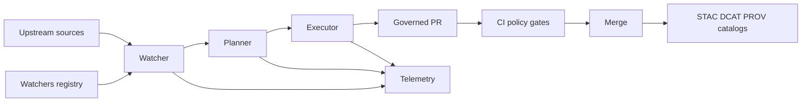

<!-- [KFM_META_BLOCK_V2]
doc_id: kfm://doc/3a2d5c7f-4b6d-4c63-8d3f-2e1c1d6a9d2b
title: WATCHER_CONTRACT
type: standard
version: v1
status: draft
owners: @kfm/automation
created: 2026-03-04
updated: 2026-03-04
policy_label: public
related:
  - docs/specs/agents/README.md
  - docs/specs/agents/PLANNER_CONTRACT.md
  - docs/specs/agents/EXECUTOR_CONTRACT.md
  - catalog/watchers/registry.json
  - schemas/watcher.v1.json
  - schemas/run_receipt.v1.json
tags: [kfm, agents, watcher, contract, governance]
notes:
  - Contract-first, evidence-first watcher component in the W·P·E architecture.
  - Draft: paths/schemas may not exist yet; treat as additive spec to implement.
[/KFM_META_BLOCK_V2] -->

# WATCHER_CONTRACT
Read-only Watcher agent contract for KFM: observe → emit immutable facts/alerts/receipts → hand off to policy-gated planning/execution.

> **Status:** draft (experimental)  
> **Owners:** @kfm/automation  
> **Policy label:** public  
> **Last updated:** 2026-03-04  
> **Non-negotiables:** read-only, deterministic, idempotent, fail-closed, governed-by-PR

**Quick nav:**  
- [Scope](#scope) · [Where it fits](#where-it-fits) · [Inputs](#inputs) · [Outputs](#outputs) · [Execution semantics](#execution-semantics) · [Schemas](#schemas) · [Governance gates](#governance-gates) · [Definition of done](#definition-of-done) · [FAQ](#faq) · [Appendix](#appendix)

---

## Scope

### What the Watcher is
The Watcher is the **lowest-risk** agent in the W·P·E system. It **observes** sources (repos, catalogs, feeds, CI signals) and emits **immutable facts** and **alerts**. It does **not** propose changes, and it does **not** modify repositories or production data.

### What the Watcher is not
- Not a planner (no diffs/patches/plan outputs).
- Not an executor (no PR creation, no merges, no publishes).
- Not a data pipeline (no transformation that produces publishable artifacts).
- Not a privileged actor (no write credentials beyond ephemeral local scratch).

### Evidence status

- **CONFIRMED:** W·P·E separation and “Watcher emits facts/alerts; no mutations” is part of the KFM agent architecture concept.  
- **PROPOSED:** This file is the enforceable contract for implementing that Watcher component.  
- **UNKNOWN:** Exact repo paths and existing schemas in your current branch—verify before wiring into protected CI.

---

## Where it fits

### System placement
The Watcher is upstream of Planner and Executor.



### Contract boundaries
- **Watcher → Planner:** immutable facts, alerts, and receipts only.
- **Planner → Executor:** deterministic plan + diff + evidence bundle.
- **Executor → Repo:** opens/updates PRs only; never merges; never pushes to protected branches.

---

## Inputs

### Acceptable inputs
The Watcher MAY read:

1. **Watchers registry entries** (allow-list configuration)
2. **Git metadata** (branches/tags/commit SHAs/workflow run IDs)
3. **Data catalogs** (STAC/DCAT) and related metadata
4. **CI artifacts** and QA reports (read-only)
5. **Policy packs** (OPA/Rego), schemas, SBOM references, attestation references
6. **Upstream remote endpoints** via allow-listed URLs (HTTP read operations only)

### Exclusions
The Watcher MUST NOT:
- Write to production databases, object stores, or indices.
- Push commits, open PRs, merge PRs, or modify protected branches.
- Modify policy packs, schemas, catalogs, or provenance bundles directly.
- Store or log secrets, API keys, or sensitive raw payloads unless explicitly classified and gated.

---

## Outputs

### Primary artifacts

The Watcher MUST produce the following per run (paths are normative; if repo paths differ, adapt via a thin adapter layer, not ad-hoc):

| Artifact | Path (recommended) | Format | Mutability | Purpose |
|---|---|---:|---:|---|
| Facts stream | `artifacts/watcher/<watcher_id>/<run_id>/facts.ndjson` | NDJSON | append-only | Immutable, content-addressed observations |
| Alerts | `artifacts/watcher/<watcher_id>/<run_id>/alerts.json` | JSON | immutable | Explainable policy/quality alerts |
| Run receipt | `artifacts/watcher/<watcher_id>/<run_id>/run_receipt.json` | JSON | immutable | Deterministic run metadata (hashes, validators, timestamps) |
| PROV bundle | `prov/watcher/<watcher_id>/<run_id>/bundle.jsonld` | JSON-LD | immutable | W3C PROV lineage for the Watcher run |
| Telemetry | `artifacts/watcher/<watcher_id>/<run_id>/telemetry.events.jsonl` | JSONL | append-only | Operational events conforming to Focus telemetry schema |

### Optional outputs
- STAC “watcher items” for observed datasets (only if this does not violate sensitivity rules):  
  `catalogs/stac/watcher-items/<watcher_id>/...`

### Output guarantees
The Watcher MUST guarantee:
- **No side effects on code/data.**
- Facts are **append-only** and **content-addressed** (hashes + checksums).
- All outputs are reproducible given the same inputs and `commit_seed`.

---

## Execution semantics

### Run modes
The Watcher MUST support at least:

- `dry-run`  
  Emits outputs to stdout or local artifacts directory; **no network writes**, no PR actions, no publish actions.

- `observe`  
  Reads allow-listed sources; emits facts/alerts/receipt; **still no mutations**.

If you need “PR per change” behavior, implement it in **Executor** (or in a separate orchestrator workflow) — not in the Watcher.

### Idempotency
The Watcher MUST compute an idempotency key per run:

- `idempotency_key = watcher.<watcher_id>.<window>.<commit_seed>`

Where:
- `window` is a deterministic window label (e.g., `2026-03-04T00:00Z__hourly`), not wall-clock “now” without rounding.
- `commit_seed` is pinned (repo config or workflow input), never random in production.

### Determinism
The Watcher MUST be deterministic:
- Same registry entry + same upstream content + same `commit_seed` → identical `run_receipt.json` fields that are declared deterministic (notably `spec_hash`, `inputs.payload_sha256`, and any canonicalized output digests).
- Non-deterministic fields (timestamps) must be isolated, explicitly named, and excluded from any content hash calculations.

### Kill-switch
The system MUST be able to disable automation quickly. The Watcher MUST honor at least one kill-switch mechanism:

- Repo file-based switch (recommended): `ops/feature_flags/agents.yml`
- Or a runtime environment variable (recommended): `KFM_KILL=1`

Kill-switch behavior:
- **Fail closed** (exit non-zero) when in governed CI lanes.
- **No mutation** must occur before kill-switch check completes.

---

## Interfaces

### CLI interface
A reference CLI shape (pseudocode; implement as appropriate):

```bash
# PSEUDOCODE: run a watcher from repo root
kfm-watcher run \
  --watcher-id "kfm:watcher:kan_drive" \
  --registry "catalog/watchers/registry.json" \
  --out-dir "artifacts/watcher" \
  --mode "observe" \
  --commit-seed "agents-wpe-arch-v11.2.6"
```

### Environment variables
The Watcher MAY read:

- `KFM_COMMIT_SEED` (string, required in CI)
- `KFM_RUN_WINDOW` (string, optional; if omitted, compute deterministic window from schedule)
- `KFM_KILL` (`"1"` disables)
- `KFM_ENV` (`dev|ci|prod`, used for policy decisions and output routing)

### Exit codes
- `0` success (facts/alerts/receipt emitted; no prohibited action performed)
- `2` no-op (e.g., upstream unchanged and policy permits skip)
- `10` policy denied (watcher output produced, but gate says “do not proceed”)
- `20` schema invalid (inputs or outputs failed schema validation)
- `30` kill-switch engaged
- `40` transient upstream failure (retryable; backoff applied)
- `50` permanent upstream failure (non-retryable)

---

## Schemas

### Watchers registry entry schema
This contract assumes a **strict allow-list** of watcher definitions validated by JSON Schema. The schema below is the normative `schemas/watcher.v1.json`.

```json
{
  "$id": "https://kfm.org/schemas/watcher.v1.json",
  "$schema": "https://json-schema.org/draft/2020-12/schema",
  "title": "KFM Watcher",
  "type": "object",
  "additionalProperties": false,
  "required": [
    "watcher_id",
    "canonical_id",
    "endpoint",
    "poll",
    "policy",
    "outputs",
    "schema_url",
    "version",
    "spec_hash",
    "signature_ref"
  ],
  "properties": {
    "watcher_id": { "type": "string", "pattern": "^[a-z0-9:_-]+$" },
    "canonical_id": { "type": "string" },
    "endpoint": { "type": "string", "format": "uri" },
    "poll": {
      "type": "object",
      "additionalProperties": false,
      "required": ["interval_seconds"],
      "properties": {
        "interval_seconds": { "type": "integer", "minimum": 60 },
        "mode": { "type": "string", "enum": ["poll", "webhook", "hybrid"], "default": "poll" }
      }
    },
    "policy": {
      "type": "object",
      "additionalProperties": false,
      "properties": {
        "staleness_s": { "type": "integer", "minimum": 60 },
        "spec_change_pct": { "type": "number", "minimum": 0, "maximum": 1 },
        "geom_shift_m": { "type": "number", "minimum": 0 }
      }
    },
    "outputs": {
      "type": "array",
      "minItems": 1,
      "items": {
        "type": "object",
        "additionalProperties": false,
        "required": ["type", "url"],
        "properties": {
          "type": { "type": "string", "enum": ["stac", "gtfs", "tile", "file", "api"] },
          "url": { "type": "string", "format": "uri" }
        }
      }
    },
    "schema_url": { "type": "string", "format": "uri" },
    "version": {
      "type": "string",
      "pattern": "^(0|[1-9]\\d*)\\.(0|[1-9]\\d*)\\.(0|[1-9]\\d*)(?:-[0-9A-Za-z.-]+)?$"
    },
    "spec_hash": { "type": "string", "pattern": "^[A-Fa-f0-9]{64}$" },
    "signature_ref": { "type": "string" }
  }
}
```

### Run receipt schema
The Watcher MUST emit a typed `kfm.run_receipt` object. This contract defines `schemas/run_receipt.v1.json` (PROPOSED until implemented).

Key requirements:
- include HTTP validators where applicable (`etag`, `last_modified`)
- include deterministic content hashes (`spec_hash`, `payload_sha256`, optional `artifact_digest`)
- include provenance anchors (source URL, retrieved time, watcher identity)

```json
{
  "$id": "https://kfm.org/schemas/run_receipt.v1.json",
  "$schema": "https://json-schema.org/draft/2020-12/schema",
  "title": "KFM Run Receipt",
  "type": "object",
  "additionalProperties": false,
  "required": ["kind", "version", "run_id", "watcher", "inputs", "outputs", "checks", "provenance"],
  "properties": {
    "kind": { "type": "string", "const": "kfm.run_receipt" },
    "version": { "type": "string", "pattern": "^(0|[1-9]\\d*)\\.(0|[1-9]\\d*)\\.(0|[1-9]\\d*)(?:-[0-9A-Za-z.-]+)?$" },
    "run_id": { "type": "string", "minLength": 8 },
    "idempotency_key": { "type": "string" },
    "watcher": {
      "type": "object",
      "additionalProperties": false,
      "required": ["name", "mode", "commit_sha"],
      "properties": {
        "name": { "type": "string" },
        "mode": { "type": "string", "enum": ["dry-run", "observe"] },
        "commit_sha": { "type": "string", "minLength": 7 }
      }
    },
    "inputs": {
      "type": "object",
      "additionalProperties": true,
      "properties": {
        "source_url": { "type": "string", "format": "uri" },
        "head": { "type": "string", "format": "uri" },
        "etag": { "type": "string" },
        "last_modified": { "type": "string" },
        "payload_sha256": { "type": "string", "pattern": "^[A-Fa-f0-9]{64}$" },
        "spec_hash": { "type": "string", "pattern": "^[A-Fa-f0-9]{64}$" }
      }
    },
    "outputs": {
      "type": "object",
      "additionalProperties": false,
      "properties": {
        "artifacts": { "type": "array", "items": { "type": "string" } },
        "artifact_digest": { "type": "string" },
        "proposed_changes": { "type": "array", "items": { "type": "string" } }
      }
    },
    "checks": {
      "type": "object",
      "additionalProperties": false,
      "properties": {
        "schema": { "type": "string", "enum": ["passed", "failed"] },
        "policy": { "type": "string" },
        "size_mb": { "type": "number", "minimum": 0 }
      }
    },
    "provenance": {
      "type": "object",
      "additionalProperties": false,
      "required": ["retrieved_at"],
      "properties": {
        "retrieved_at": { "type": "string" },
        "source_url": { "type": "string", "format": "uri" }
      }
    }
  }
}
```

---

## Governance gates

### Deny-by-default
Watcher outputs are **inputs to governance**. Downstream lanes MUST deny-by-default and only allow promotion/execution if:

- watcher entry is allow-listed and schema-valid
- `spec_hash` is present and valid
- `signature_ref` is present and verifiable
- run receipt is schema-valid
- policy pack tests pass (OPA/Rego via Conftest)
- sensitivity/rights checks pass (no PII in public; sovereignty rules honored)

### Signature verification
- The Watcher MUST record `signature_ref` from the registry entry.
- CI (or an aggregator job) MUST verify the signature/attestation *before* any Planner/Executor action is allowed.

### Network boundaries
- Watcher egress is limited to allow-listed endpoints from the registry entry.
- Watcher MUST only use read HTTP methods (GET/HEAD) and must use conditional requests (ETag/If-None-Match) when possible.

### Promotion gating
- Watcher itself never “promotes.” It emits receipts and facts only.
- Planner/Executor actions are blocked unless required checks are green.

---

## Security model

### Credentials
- Watcher uses **read-only** credentials (or anonymous access).
- If an upstream requires API keys, they must be injected via secret manager and treated as restricted; the Watcher must **not** print them or embed them in receipts.

### Least privilege separation
- Only the Executor may mint short-lived tokens to open PRs.
- The Watcher must not hold GitHub write permissions.

---

## Observability and provenance

### Telemetry events
Each Watcher run MUST emit telemetry events (JSONL) that include at minimum:
- `event_type`
- `watcher_id`
- `run_id`
- `idempotency_key`
- `spec_hash`
- `policy_version` (if evaluated)
- `outcome` (`ok|noop|denied|failed`)

### PROV bundle
The PROV bundle MUST minimally capture:
- the Watcher software agent
- the upstream sources as PROV entities
- the watch run as a PROV activity
- generated artifacts (facts, alerts, receipt) as PROV entities linked via `wasGeneratedBy`

---

## Definition of done

- [ ] Watcher emits `facts.ndjson`, `alerts.json`, `run_receipt.json`, `bundle.jsonld`, and telemetry events per run.
- [ ] Outputs validate against schemas (registry + run receipt).
- [ ] Conditional fetch implemented (ETag/If-None-Match) with backoff on 429.
- [ ] Deterministic hashing implemented (spec_hash via canonical JSON).
- [ ] Idempotency key implemented and used to prevent duplicate runs.
- [ ] Kill-switch respected and **checked before any work**.
- [ ] No mutations: automated test asserts no git writes, no PR actions, no publish actions.
- [ ] CI gate exists (Conftest/OPA) and is required for protected branches (fail-closed).
- [ ] Signature verification is enforced for registry entries (and any signed receipts, if enabled).
- [ ] Sensitivity & rights rules enforced (deny-by-default).

---

## FAQ

### Why is the Watcher so constrained?
Because it is the always-on sensor. Keeping it read-only reduces blast radius and forces all changes through governed PRs.

### Where do “diffs” belong?
In Planner outputs (`plan.yml`, `diff.patch`) — not in Watcher outputs.

### Can a Watcher open PRs in a prototype?
You can prototype it, but the governed design moves PR creation into Executor. Treat PR-writing watchers as a temporary bridge, not the contract.

---

## Appendix

### Example watcher registry entry
```json
{
  "watcher_id": "kfm:watcher:kan_drive",
  "canonical_id": "kfm.canon.kan_drive.v1",
  "endpoint": "https://example.org/kan/drive/index.json",
  "poll": { "interval_seconds": 3600, "mode": "poll" },
  "policy": { "staleness_s": 86400, "spec_change_pct": 0.02, "geom_shift_m": 5.0 },
  "outputs": [
    { "type": "stac", "url": "https://catalog.kfm/stac/kan_drive/" }
  ],
  "schema_url": "https://kfm.org/schemas/watcher.v1.json",
  "version": "1.0.0",
  "spec_hash": "0123456789abcdef0123456789abcdef0123456789abcdef0123456789abcdef",
  "signature_ref": "sigstore://rekor/uuid/REPLACE_ME"
}
```

### Example run receipt
```json
{
  "kind": "kfm.run_receipt",
  "version": "1.0.0",
  "run_id": "2026-03-04T00:00:00Z__kan_drive__observe",
  "idempotency_key": "watcher.kfm:watcher:kan_drive.2026-03-04T00:00Z_hourly.agents-wpe-arch-v11.2.6",
  "watcher": {
    "name": "kan_drive",
    "mode": "observe",
    "commit_sha": "0000000deadbeefcafefeed000000000000abcd"
  },
  "inputs": {
    "source_url": "https://example.org/kan/drive/index.json",
    "etag": "W/\"3f1e-c8a...\"",
    "last_modified": "Tue, 03 Mar 2026 23:50:00 GMT",
    "payload_sha256": "aaaaaaaaaaaaaaaaaaaaaaaaaaaaaaaaaaaaaaaaaaaaaaaaaaaaaaaaaaaaaaaa",
    "spec_hash": "bbbbbbbbbbbbbbbbbbbbbbbbbbbbbbbbbbbbbbbbbbbbbbbbbbbbbbbbbbbbbbbb"
  },
  "outputs": {
    "artifacts": [
      "artifacts/watcher/kfm:watcher:kan_drive/2026-03-04T00:00:00Z__kan_drive__observe/facts.ndjson",
      "artifacts/watcher/kfm:watcher:kan_drive/2026-03-04T00:00:00Z__kan_drive__observe/alerts.json"
    ],
    "artifact_digest": "sha256:cccccccccccccccccccccccccccccccccccccccccccccccccccccccccccccccc",
    "proposed_changes": []
  },
  "checks": {
    "schema": "passed",
    "policy": "skipped (watcher only)",
    "size_mb": 0.2
  },
  "provenance": {
    "source_url": "https://example.org/kan/drive/",
    "retrieved_at": "2026-03-04T00:00:00Z"
  }
}
```

### Example fact event line
```json
{"event_type":"kfm.watcher.fact","occurred_at":"2026-03-04T00:00:00Z","watcher_id":"kfm:watcher:kan_drive","run_id":"2026-03-04T00:00:00Z__kan_drive__observe","subject":"https://example.org/kan/drive/index.json","spec_hash":"bbbbbbbbbbbbbbbbbbbbbbbbbbbbbbbbbbbbbbbbbbbbbbbbbbbbbbbbbbbbbbbb","http":{"etag":"W/\"3f1e-c8a...\"","last_modified":"Tue, 03 Mar 2026 23:50:00 GMT"},"digest_sha256":"dddddddddddddddddddddddddddddddddddddddddddddddddddddddddddddddd"}
```

### Minimal alert shape
```json
{
  "alerts": [
    {
      "severity": "warning",
      "code": "staleness_window_exceeded",
      "message": "Upstream data is older than staleness_s threshold.",
      "watcher_id": "kfm:watcher:kan_drive",
      "run_id": "2026-03-04T00:00:00Z__kan_drive__observe",
      "details": { "staleness_s": 86400, "observed_age_s": 172800 }
    }
  ]
}
```

---

🔙 **Back to top:** [WATCHER_CONTRACT](#watcher_contract)
