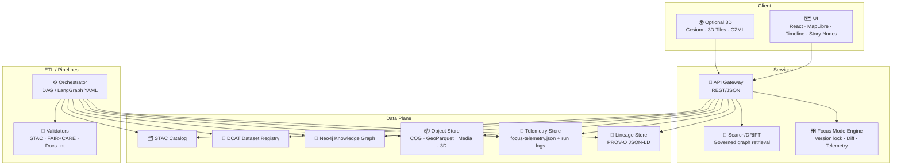

<div align="center">

# 🏛️ Kansas-Matrix-System — Architecture
### 🌾 Kansas Frontier Matrix (KFM): pipeline-governed geospatial + historical intelligence platform


-purple)

</div>

---

## 🎯 Why this document exists

This is the **single source of truth** for how Kansas-Matrix-System is put together:
- 🧱 **Components** (UI, API, data pipelines, catalogs, graph)
- 🔁 **Data flow** (canonical pipeline ordering + contracts)
- 🗂️ **Metadata + provenance** (STAC/DCAT + PROV-O)
- 🧠 **Knowledge layer** (Neo4j + governed query templates)
- 🧭 **Focus Mode / Story Nodes** (versioning, diffing, telemetry, reproducibility)
- 🛡️ **Governance & safety** (FAIR+CARE + sovereignty policies + bounded retrieval)

> ✅ If you’re building *anything* (pipelines, UI layers, search, story tools), start here.

---

## 🧭 Navigation

- [Architecture tenets](#-architecture-tenets)
- [System context](#-system-context)
- [C4 container view](#-c4-container-view)
- [Canonical pipeline ordering](#-canonical-pipeline-ordering)
- [Data & metadata contracts](#-data--metadata-contracts)
- [Domain pipelines](#-domain-pipelines)
- [Knowledge graph & governed retrieval](#-knowledge-graph--governed-retrieval)
- [API surface](#-api-surface)
- [UI & visualization architecture](#-ui--visualization-architecture)
- [Observability & reproducibility](#-observability--reproducibility)
- [Security & data protection](#-security--data-protection)
- [Repo layout](#-repo-layout)
- [Project reference library](#-project-reference-library)
- [Version history](#-version-history)

---

## 🧱 Architecture tenets

### 1) 🔁 Pipeline ordering is law (no bypasses)
Everything flows in a single direction:

1. **Ingest** (fetch/collect)
2. **Normalize** (schemas + CRS + cleaning)
3. **Catalog** (STAC/DCAT publishing)
4. **Graph** (knowledge graph linking)
5. **Publish** (UI + API + tiles + story layers)

> 🚫 No stage writes outputs that bypass the next stage.  
> ✅ If you need a shortcut, create a *new governed pipeline*.

---

### 2) 🧾 Determinism + reproducibility over “magic”
- Stable IDs (URN-style)
- Checksums on outputs
- Version-pinned artifacts (“version lock” support)
- Manifests + lineage emitted on every run
- CI validates metadata and docs

---

### 3) 🧭 Provenance is a first-class API feature
- **PROV-O (JSON-LD)** is the lineage truth
- **OpenLineage** is optional for operational observability
- Evidence outputs default to **references-only** (no restricted raw content)

---

### 4) 🛡️ Governance is enforced at the lowest layers
- Bounded retrieval only (depth, fan-out, limits)
- Parameterized queries only
- Policy gates visible + auditable (CARE / sovereignty)

---

### 5) ♿ Accessibility is part of “done”
- Alt-text required for overlays and previews
- WCAG 2.1 AA color/contrast expectations
- Keyboard navigation for Focus Mode UI

---

## 🌍 System context

```mermaid
flowchart LR
  U[👤 Users<br/>Researchers · Educators · Public] --> UI[🗺️ Web UI<br/>React + MapLibre (+ optional Cesium)]
  UI --> API[🧩 API Layer<br/>Catalog · Graph · Focus Mode · Search]

  subgraph Sources[🌐 External Data Sources]
    NOAA[🌪️ NOAA Storm Events / Weather]
    NWS[⚠️ NWS Warnings Polygons]
    FEMA[🧯 FEMA Declarations]
    USGS[💧 USGS NWIS / Earthquakes]
    USDA[🌱 USDA Soil Products]
    OpenAQ[🌫️ OpenAQ Air Sensors]
    Climate[🌡️ PRISM / ERA5 / CMIP]
    RemoteSensing[🛰️ Remote Sensing / GEE]
    Archives[📚 Historical Archives (text/images)]
  end

  Sources --> ETL[⚙️ ETL + Pipelines<br/>Deterministic · Contracted · Governed]

  ETL --> OBJ[📦 Object Storage<br/>COG · GeoParquet · Media · 3D]
  ETL --> STAC[🗂️ STAC Catalog<br/>Items · Collections]
  ETL --> DCAT[🪪 DCAT Registry<br/>Dataset metadata]
  ETL --> PROV[🧾 PROV-O Lineage<br/>JSON-LD bundles]
  ETL --> KG[🧠 Neo4j Graph<br/>Entities · Events · Places · Time]

  API --> STAC
  API --> KG
  API --> OBJ
  API --> PROV
```

---

## 🧩 C4 container view



---

## 🔁 Canonical pipeline ordering

### ✅ Standard stage contracts

| Stage | Output | Contract |
|------:|--------|----------|
| 1️⃣ Ingest | raw pulls / snapshots | immutable source snapshots + source IDs |
| 2️⃣ Normalize | cleaned, reprojected, schema-aligned | CRS + schema + units + geometry validity |
| 3️⃣ Catalog | STAC Items/Collections + DCAT datasets | machine-readable discovery + licensing |
| 4️⃣ Graph | nodes/edges + ontology alignment | temporal + spatial reasoning readiness |
| 5️⃣ Publish | tiles + APIs + UI-ready assets | fast rendering + story bindings |

### 🧪 Required validation gates (CI + local)
- ✅ STAC validation (schema + links + assets)
- ✅ FAIR+CARE checks (sensitivity + rights + masking)
- ✅ Docs linting (style + headers + required sections)
- ✅ Checksums / manifests

> 🧠 Design rule: **validation is part of the pipeline**, not a “later” step.

---

## 🗂️ Data & metadata contracts

### Primary geospatial/asset formats
- 🧊 **COG GeoTIFF** — cloud-optimized raster layers
- 🧱 **GeoParquet** — efficient columnar vector storage
- 🧾 **GeoJSON** — interoperability and lightweight vector
- 🧷 **MVT** — vector tiles (optional serving)
- 🖼️ **PNG/WebP/SVG** — overlays, legends, story captures
- 🌍 **3D Tiles / CZML / GLB** — optional 3D scenes and terrain

### Metadata profiles (system-wide)
- 🗂️ **STAC 1.0** for items/collections/assets
- 🪪 **DCAT 3.0** for dataset registry + discovery
- 🧾 **PROV-O (JSON-LD)** for lineage bundles
- 🛡️ **FAIR+CARE** for governance and reuse constraints

---

## 🧰 Domain pipelines

> Each domain pipeline should include a **runbook** with: purpose, directory layout, contract versions, inputs, outputs, validation gates, and version history.

### 💧 Hydrology & water systems
**Inputs:** DEMs, stream/river data, gauges (USGS), water quality sources  
**Processing:** sink fill → flow direction/accumulation → stream networks → watershed delineation → proximity rasters  
**Outputs:** COG rasters, GeoParquet vectors, STAC Items + graph nodes  
**Special:** hydrology layers are first-class inputs to Focus Mode narratives + story bindings

### 🌪️ Hazards refresh
**Inputs:** NOAA Storm Events, NWS warning polygons, FEMA declarations, earthquakes, wildfire detections  
**Processing:** multi-source normalization → STAC build → checksum validation → Neo4j sync  
**Special:** designed for **zero-touch** daily operation + on-demand runs

### 🌫️ Atmosphere & air quality
**Inputs:** air sensor feeds, climate datasets (PRISM/ERA5/CMIP)  
**Processing:** ingestion → harmonization → downscaling/bias correction → publish layers  
**Boundary:** prioritize retrospective analysis + context layers (not “future forecasting” unless explicitly added)

### 🌱 Soil & land capability
**Inputs:** USDA soil products (SDA, gNATSGO), erosion factors, land cover/crops  
**Processing:** deterministic differential refresh (tile-level) → publish STAC/DCAT → graph linking  
**Special:** “differential updates” implies changelog-friendly, checksum-driven refresh

### 🛰️ Remote sensing (optional)
**Inputs:** satellite indices, land cover, change detection outputs  
**Processing:** can be backed by Google Earth Engine workflows and then exported into the KFM contract stack

### 🗺️ Land ownership & zoning (vector ETL)
**Inputs:** parcel boundaries, admin boundaries, zoning layers  
**Processing:** schema harmonization → topology clean → WGS84 → GeoParquet/GeoJSON → STAC/DCAT → graph

---

## 🧠 Knowledge graph & governed retrieval

### Graph purpose
Neo4j is used to link:
- 📍 Places (points, polygons, regions)
- 🕒 Time intervals (events, eras, ranges)
- 🧑‍🤝‍🧑 Entities (people, communities, institutions)
- 🌾 Environmental layers (hydrology, soil, hazards, climate)
- 📚 Sources (documents, archives, media, citations)

### Ontology alignment (recommended)
- CIDOC-CRM style event modeling
- GeoSPARQL-compatible spatial reasoning
- OWL-Time style temporal primitives

### 🔒 Governed retrieval (DRIFT pattern)
DRIFT is a policy-locked retrieval layer:
- bounded hops, bounded fan-out, bounded result size
- “refs-only” evidence bundles
- deterministic ordering
- parameterized execution only
- sovereignty + CARE outcomes visible in outputs

---

## 🧩 API surface

> Treat the API as a **contract boundary**. Anything unstable belongs behind a service boundary.

### Suggested API groups
- 🗂️ **Catalog API**: STAC search/browse, collection listings
- 🧠 **Graph API**: governed query endpoints (DRIFT)
- 🎛️ **Focus Mode API**: version lock, diff, telemetry
- 🧾 **Lineage API**: PROV bundle lookup by run/episode
- 🧱 **Assets API**: signed URLs, tile endpoints, media fetching

### Focus Mode reproducibility endpoints (pattern)
- `POST /focus/story-node/{id}/lock-version/{versionId}`  
- `GET /focus/story-node/{id}/diff?from=...&to=...`  
- `GET /focus/story-node/{id}/lineage`

---

## 🗺️ UI & visualization architecture

### 2D mapping (default)
- 🗺️ **MapLibre** for high-performance 2D rendering
- ⏳ timeline slider for “year slicing” and time animations
- 🧩 Story Nodes docked in UI as narrative + evidence

### 3D mapping (optional but designed-in)
- 🌍 **Cesium** for terrain + 3D Tiles streaming
- 🧱 3D Tiles / CZML / GLB assets can be attached to story nodes
- 🎥 camera paths for guided explainability sequences

### Focus Mode UI mechanics
- 🎛️ “Version strip” navigation (prev/current/next + diff)
- 🔏 version locking freezes map layers, charts, and story state
- 📡 telemetry emitted for navigation, diffs, and lineage inspection

---

## 📡 Observability & reproducibility

### Required artifacts per pipeline run
- 🧾 `manifest.zip` (artifact inventory + checksums)
- 🧬 lineage bundle (PROV-O JSON-LD)
- 📡 telemetry output (focus-telemetry + domain telemetry)
- ✅ validation logs (STAC/FAIR+CARE/docs-lint)

### Deterministic identifiers
Use URN-style IDs for:
- pipeline runs
- retrieval “episodes”
- dataset snapshots
- story node versions

---

## 🛡️ Security & data protection

### Non-negotiables
- 🚫 no unbounded traversal (cap depth / fan-out / results)
- 🚫 no sensitive leakage (no raw protected coordinates)
- 🚫 no string-concatenated Cypher (parameterize)
- ✅ deterministic ordering + stable limits
- ✅ policy gates are first-class and auditable

### Sensitive location handling (CARE / sovereignty)
- generalize, blur, or omit at publish time
- store restricted/raw only in protected vault paths (not public STAC)
- maintain policy event summaries (no restricted raw blobs)

---

## 🧾 Repo layout

> This project intentionally separates **data plane**, **docs**, and **pipelines**.

```text
📦 repo-root/
├── 📁 docs/
│   ├── 📁 specs/
│   │   └── 📁 architecture/
│   │       └── 📄 README.md                ← (this file)
│   ├── 📁 standards/                       ← governance, FAIR+CARE, sovereignty, etc.
│   ├── 📁 pipelines/                       ← runbooks per domain
│   └── 📁 reports/                         ← focus mode outputs, visualization indexes, telemetry docs
├── 📁 src/
│   ├── 📁 pipelines/                       ← ETL code (domain + shared)
│   ├── 📁 services/                        ← API/search/focus services
│   └── 📁 ui/                              ← frontend app(s)
├── 📁 data/
│   ├── 📁 raw/                             ← immutable source snapshots
│   ├── 📁 work/                            ← intermediate artifacts
│   ├── 📁 processed/                       ← publish-ready outputs
│   ├── 📁 stac/                            ← STAC catalogs (Items/Collections)
│   ├── 📁 dcat/                            ← DCAT dataset registry
│   └── 📁 prov/                            ← lineage bundles (JSON-LD)
└── 📁 .github/workflows/                   ← stac-validate, faircare-validate, docs-lint, etc.
```

---

## 📚 Project reference library

These files informed the architecture patterns, governance choices, data formats, and pipeline practices. Keep them close (recommend: `docs/library/` or `docs/references/`) 📦

### 🧩 Core KFM system docs
- **Kansas Frontier Matrix (KFM) – Comprehensive Engineering Design.docx**
- **Kansas-Frontier-Matrix_ Open-Source Geospatial Historical Mapping Hub Design.pdf**
- **Latest Ideas.docx**
- **Other Ideas.docx**
- **MARKDOWN_GUIDE_v13.md.gdoc**
- **Scientific Method _ Research _ Master Coder Protocol Documentation.pdf**

### 🗂️ Data architecture & scalable systems
- **Data Spaces.pdf**
- **Scalable Data Management for Future Hardware.pdf**
- **PostgreSQL Notes for Professionals - PostgreSQLNotesForProfessionals.pdf**

### 🗺️ Geospatial engineering & mapping UX
- **python-geospatial-analysis-cookbook.pdf**
- **Cloud-Based Remote Sensing with Google Earth Engine-Fundamentals and Applications.pdf**
- **making-maps-a-visual-guide-to-map-design-for-gis.pdf**
- **Mobile Mapping_ Space, Cartography and the Digital - 9789048535217.pdf**

### 🌐 Web + visualization tech
- **responsive-web-design-with-html5-and-css3.pdf**
- **webgl-programming-guide-interactive-3d-graphics-programming-with-webgl.pdf**
- **compressed-image-file-formats-jpeg-png-gif-xbm-bmp.pdf**

### 📈 Statistics, experimental design, and modeling
- **regression-analysis-with-python.pdf**
- **Regression analysis using Python - slides-linear-regression.pdf**
- **Understanding Statistics & Experimental Design.pdf**
- **graphical-data-analysis-with-r.pdf**
- **think-bayes-bayesian-statistics-in-python.pdf**
- **Scientific Modeling and Simulation_ A Comprehensive NASA-Grade Guide.pdf**

### 🧮 Optimization & graph theory (future-facing analytics)
- **Generalized Topology Optimization for Structural Design.pdf**
- **Spectral Geometry of Graphs.pdf**

### 🧠 Ethics, autonomy, and law (governance framing)
- **Principles of Biological Autonomy - book_9780262381833.pdf**
- **Introduction to Digital Humanism.pdf**
- **On the path to AI Law’s prophecies and the conceptual foundations of the machine learning age.pdf**

### 🔐 Security (defensive posture + secure engineering)
- **ethical-hacking-and-countermeasures-secure-network-infrastructures.pdf**
- **Gray Hat Python - Python Programming for Hackers and Reverse Engineers (2009).pdf**
- **concurrent-real-time-and-distributed-programming-in-java-threads-rtsj-and-rmi.pdf**

### 📚 Programming library indexes
- **A programming Books.pdf**
- **B-C programming Books.pdf**
- **D-E programming Books.pdf**
- **F-H programming Books.pdf**
- **I-L programming Books.pdf**
- **M-N programming Books.pdf**
- **O-R programming Books.pdf**
- **S-T programming Books.pdf**
- **U-X programming Books.pdf**

---

## 🕰️ Version history

| Version | Date | Summary |
|---------|------|---------|
| v0.1.0 | 2026-01-08 | Initial architecture README for Kansas-Matrix-System (KFM), aligned to pipeline ordering + STAC/DCAT/PROV governance. |

---

<div align="center">

🧱 **Build deterministic.** 🧾 **Prove provenance.** 🛡️ **Respect sovereignty.** 🗺️ **Tell the story with evidence.**

</div>

