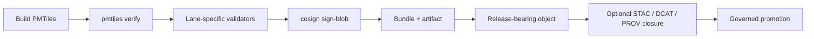

<!-- [KFM_META_BLOCK_V2]
doc_id: kfm://doc/NEEDS-VERIFICATION
title: PMTiles Release Validation and Signing Standard
type: standard
version: v1
status: draft
owners: @bartytime4life
created: 2026-04-16
updated: 2026-04-16
policy_label: public-safe
related: [tools/attest/README.md, tools/validators/README.md, data/receipts/README.md, policy/README.md, .github/workflows/README.md]
tags: [kfm, pmtiles, release, integrity, signing, provenance]
notes: [doc_id remains NEEDS-VERIFICATION because no canonical kfm://doc UUID was surfaced, related path presence in the mounted repo remains NEEDS VERIFICATION]
[/KFM_META_BLOCK_V2] -->

# PMTiles Release Validation and Signing Standard

Define the minimum governed requirements for validating, signing, and releasing `.pmtiles` artifacts in KFM.

> [!IMPORTANT]
> **Source posture**
> - **CONFIRMED:** KFM treats PMTiles as part of its preferred outward packaging stack, and treats release-bearing artifacts as proof-bearing objects that must move through governed promotion rather than ad hoc publication.
> - **CONFIRMED:** `pmtiles verify` and Sigstore `cosign sign-blob` / `verify-blob` are real, current tool surfaces.
> - **PROPOSED / NEEDS VERIFICATION:** exact repo paths, emitted receipt filenames, release upload mechanics, and any project-specific workflow names or bundle naming conventions not directly surfaced in the attached workspace.

---

## Quick navigation

- [Scope](#scope)
- [Why this standard exists](#why-this-standard-exists)
- [Minimum requirements](#minimum-requirements)
- [Validation requirements](#validation-requirements)
- [Signing requirements](#signing-requirements)
- [Release-object fit](#release-object-fit)
- [Illustrative CI flow](#illustrative-ci-flow)
- [Verification and consumption](#verification-and-consumption)
- [Failure modes](#failure-modes)
- [Integration points](#integration-points)
- [Open questions and future extensions](#open-questions-and-future-extensions)

---

## Scope

This standard applies to release-bound `.pmtiles` artifacts used as governed delivery objects in KFM, including map layers, temporal slices, and other derived tiled geospatial products.

It does **not** define raw ingest, staging, or canonical internal storage. In KFM terms, PMTiles belongs to the outward packaging and delivery layer, not to RAW, WORK, or QUARANTINE.

### In scope

- release-candidate `.pmtiles` archives
- validation before promotion
- signing and verification bundles published with the archive
- linkage from the release-bearing object to the PMTiles subject

### Out of scope

- MBTiles, GeoJSON, Parquet, COG, or other non-PMTiles artifact standards
- authoring workflows for canonical source data
- browser rendering behavior
- exact repo-local publication paths unless directly verified

[Back to top](#quick-navigation)

---

## Why this standard exists

KFM’s current corpus converges on two ideas:

1. **Promotion is a governed state transition, not a file move.**
2. **Packaging, digests, signatures, receipts, and release-bearing objects belong together.**

That matters for PMTiles because a tile archive that merely renders is not yet a defensible release object. In KFM, it becomes trustworthy only when the archive is structurally valid, tied to a release-bearing subject, and accompanied by verifiable proof material.

### Doctrine alignment

| KFM doctrine | Consequence for PMTiles |
| --- | --- |
| Evidence-first | Release cannot rely on successful rendering alone. |
| Fail-closed | Invalid or unsigned archives do not promote. |
| Receipts ≠ proofs ≠ artifacts | The `.pmtiles` file, runtime receipts, and signature bundle stay distinct. |
| Inspectable claim | A reviewer must be able to trace what was released, how it was checked, and what identity signed it. |
| Governed publication | PMTiles belongs inside a release object family, not an ad hoc upload step. |

---

## Minimum requirements

A PMTiles release candidate **MUST** satisfy the following minimums before it is treated as releasable.

| Requirement | Level | Notes |
| --- | --- | --- |
| Archive structural validation | MUST | Use `pmtiles verify` before promotion. |
| Signature bundle emitted | MUST | Use Sigstore/Cosign blob signing and keep the bundle with the artifact. |
| Identity-based verification possible | MUST | Verification must include expected signer identity and OIDC issuer for keyless signing. |
| Release-object linkage | MUST | The promoted subject must be linkable from the release-bearing object or manifest. |
| Receipt/proof separation preserved | MUST | Do not collapse runtime receipt JSON into the signed bundle or the artifact itself. |
| Extra geospatial sanity checks | SHOULD | Bounds, zoom range, and lane-specific expectations are KFM augmentation, not guaranteed by `pmtiles verify`. |
| Digest sidecar | PROPOSED | Useful, but not yet a corpus-confirmed mandatory KFM requirement. |

---

## Validation requirements

### 1) Structural validation is mandatory

Every release-bound PMTiles archive **MUST** pass:

```bash
pmtiles verify INPUT.pmtiles
```

**CONFIRMED tool behavior:** official Protomaps CLI docs describe this as checking that an archive is ordered correctly and has correct header information.

### 2) KFM augmentation belongs in separate validators

KFM should not overclaim what `pmtiles verify` proves. If the lane needs stronger checks, those should be implemented as explicit validators and recorded separately.

Typical augmentation checks are:

- declared zoom range matches lane expectations
- declared bounds are plausible for the intended subject
- metadata and release descriptors agree on tile type / compression assumptions
- tile or feature-count sanity checks where the lane has a stable contract

> [!NOTE]
> Treat these augmentation checks as **KFM validator logic**, not as hidden assumptions inside the PMTiles CLI.

### 3) Validation output should remain inspectable

The corpus supports receipts and release-bearing objects, but does **not** directly surface one canonical PMTiles receipt schema in the mounted workspace. Until that exists, the safe rule is:

- **MUST:** keep a machine-readable validation result
- **SHOULD:** link that result from the release-bearing object
- **NEEDS VERIFICATION:** exact receipt filename and path conventions

---

## Signing requirements

### 1) Use keyless signing by default

PMTiles release artifacts **MUST** be signed with Sigstore/Cosign using keyless signing unless the surrounding lane has a separately approved KMS or managed-key exception.

Illustrative signing command:

```bash
cosign sign-blob INPUT.pmtiles \
  --bundle INPUT.pmtiles.sigstore.json
```

### 2) Bundle publication is mandatory

The verification bundle **MUST** be retained and published alongside the PMTiles archive, because it carries the signature, certificate, and transparency-log inclusion proof needed for later verification.

### 3) Bundle naming is repo-specific

The corpus confirms the need for a bundle, but it does **not** directly prove one canonical filename convention for KFM.

This standard therefore uses `INPUT.pmtiles.sigstore.json` as an **illustrative** filename because that matches current Sigstore blob-signing documentation.

> [!WARNING]
> Do **not** silently standardize on a custom suffix such as `.sigbundle` unless that convention is directly confirmed elsewhere in the repo.

### 4) Version hygiene matters

If the release lane verifies attestations as well as signatures, the toolchain should stay on a Cosign line that includes the April 2026 DSSE predicate-check fix.

---

## Release-object fit

A PMTiles archive should not float alone. In the current KFM doctrine, it belongs inside a small release-bearing object family.



### Minimum fit rule

At promotion time, the release-bearing object **MUST** be able to point to:

- the PMTiles subject
- the validation outcome
- the signature bundle reference
- the governing policy posture for the release

### Cross-catalog closure

The wider corpus strongly favors STAC, DCAT, and PROV as the outward spine for released subjects. For this standard, the safe minimum is:

- **CONFIRMED direction:** PMTiles release subjects should be digest-linkable across outward catalog surfaces.
- **PROPOSED exact field set:** the first KFM PMTiles profile should define which digest, identifier, and provenance fields are mandatory.

### `spec_hash` guidance

If the surrounding lane already emits a `spec_hash`, the PMTiles release should **inherit** that identity anchor rather than inventing a disconnected tile-only identifier.

---

## Illustrative CI flow

The corpus supports a PR-first, policy-gated, fail-closed release posture, but does **not** directly surface a mounted repo workflow for PMTiles.

So the example below is intentionally labeled **illustrative**.

```yaml
# illustrative example only — mounted workflow path and release mechanics NEED VERIFICATION
name: pmtiles-release

on:
  workflow_dispatch:
  push:
    tags:
      - "v*"

permissions:
  contents: write
  id-token: write

jobs:
  release:
    runs-on: ubuntu-latest

    steps:
      - uses: actions/checkout@v4

      - name: Install pmtiles CLI
        run: |
          curl -L https://github.com/protomaps/go-pmtiles/releases/latest/download/pmtiles-linux-amd64 \
            -o /usr/local/bin/pmtiles
          chmod +x /usr/local/bin/pmtiles

      - name: Install Cosign
        uses: sigstore/cosign-installer@v4.0.0

      - name: Validate archive
        run: |
          pmtiles verify dist/tiles.pmtiles

      - name: Sign archive
        run: |
          cosign sign-blob dist/tiles.pmtiles \
            --bundle dist/tiles.pmtiles.sigstore.json \
            --yes

      - name: Verify signed archive
        run: |
          cosign verify-blob dist/tiles.pmtiles \
            --bundle dist/tiles.pmtiles.sigstore.json \
            --certificate-identity-regexp 'https://github.com/ORG/REPO/.github/workflows/WORKFLOW@.*' \
            --certificate-oidc-issuer https://token.actions.githubusercontent.com

      - name: Publish release artifacts
        run: |
          echo "Repo-specific publish step NEEDS VERIFICATION"
```

### What this example deliberately does **not** assume

- a specific receipt path
- a specific release action plugin
- a specific Release Manifest schema
- a mounted `tools/attest/` helper implementation

---

## Verification and consumption

Consumers of a released PMTiles subject should be able to run **both** structural verification and signature verification.

### Structural verification

```bash
pmtiles verify tiles.pmtiles
```

### Signature verification

```bash
cosign verify-blob tiles.pmtiles \
  --bundle tiles.pmtiles.sigstore.json \
  --certificate-identity-regexp 'EXPECTED_IDENTITY' \
  --certificate-oidc-issuer EXPECTED_OIDC_ISSUER
```

### Expected outcomes

| Result | Meaning |
| --- | --- |
| PASS | The archive passed the relevant check. |
| FAIL | The archive or proof surface did not verify. Treat as not releasable / not trusted. |
| ERROR | Treat as deny-by-default until resolved. |

> [!IMPORTANT]
> Verification without an expected identity is weaker than KFM’s intended trust posture for keyless signing.

---

## Failure modes

| Failure | Required behavior |
| --- | --- |
| `pmtiles verify` fails | Stop the release path. |
| Augmentation validator fails | Stop the release path or quarantine the candidate according to lane policy. |
| bundle file missing | Do not promote. |
| keyless verification fails | Treat as deny-by-default. |
| release object cannot link artifact + proof | Do not treat the subject as a finished release. |
| outward catalog references disagree on digest / identity | Treat as release-closure failure. |

---

## Integration points

The exact mounted paths are not directly verified in this session, but the draft and the wider corpus consistently point to the following responsibility split.

| Surface | Intended role | Confidence |
| --- | --- | --- |
| `tools/validators/` | KFM augmentation checks beyond `pmtiles verify` | INFERRED from draft; path presence NEEDS VERIFICATION |
| `tools/attest/` | helper logic around signing or verification | INFERRED from draft; path presence NEEDS VERIFICATION |
| `data/receipts/` | runtime execution memory, not proof storage | CORPUS-CONFIRMED concept; exact path NEEDS VERIFICATION |
| `policy/` | fail-closed release enforcement | CORPUS-CONFIRMED concept; exact policy bundle path NEEDS VERIFICATION |
| release object family | ReleaseManifest / EvidenceBundle / DecisionEnvelope-style carrier | CORPUS-CONFIRMED direction; exact schema wave still open |

---

## Open questions and future extensions

### Immediate open questions

- Which exact KFM schema should carry PMTiles digest, bundle reference, and outward catalog linkage?
- Should the first mandatory PMTiles release profile require STAC/DCAT/PROV closure, or only allow it?
- What is the smallest valid PMTiles proof fixture KFM wants to keep in CI?

### PROPOSED next additions

- digest sidecar or digest field normalization for PMTiles release objects
- one valid and one invalid PMTiles release fixture for CI
- explicit catalog-closure rule for a tile subject
- transparency-log index or UUID capture in the release-bearing object
- rollback example showing replacement by prior promoted digest or `spec_hash`

<details>
<summary>Illustrative artifact set</summary>

```text
<release-surface>/
  tiles.pmtiles
  tiles.pmtiles.sigstore.json
  <lane-defined validation result>.json
  <release-bearing object>.json
```

All filenames beyond the PMTiles archive and Sigstore-style bundle name remain repo-specific until directly verified.

</details>

---

## Summary

This standard keeps one thing clear: PMTiles is a valid outward delivery format in KFM, but a PMTiles file becomes a governed release only when it is validated, signed, and linked into a release-bearing proof surface.

> A map is not trusted because it renders.
> A released map artifact is trusted because its structure, signer identity, and release linkage are inspectable.
