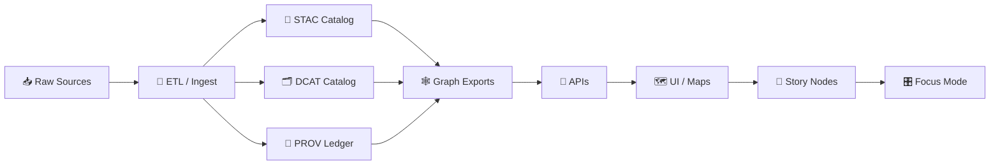

<div align="center">

# 📦 Kansas Frontier Matrix — Data Specs

**Authoritative conventions for how data is stored, processed, validated, cataloged, and published**  
within the Kansas-Matrix-System (KFM) 🗺️🧬


</div>

> ✅ **Prime directive:** If it can affect a map, model, decision, or story… it must be **discoverable** (STAC/DCAT), **auditable** (PROV), and **tamper-evident** (checksums/signing).  
> 🚫 If it isn’t cataloged, it isn’t published.

---

## 🧭 What this README is

This is the **data subsystem spec index** for KFM. It defines:

- 📁 **Canonical folder structure** for `data/`
- 🧱 **Dataset lifecycle** (raw → work → processed)
- 🧾 **Boundary artifacts**: STAC, DCAT, PROV (required for publication)
- 🧬 **Provenance & reproducibility** expectations
- 🛡️ **FAIR+CARE / sovereignty** handling for sensitive materials
- ✅ **Quality gates** (schema, policy, geo-validity, and drift checks)

---

## 🧩 Canonical pipeline ordering (non‑negotiable)

KFM treats **data → catalogs → graph → product surfaces** as a strict dependency chain:

```text
ETL → STAC/DCAT/PROV catalogs → Graph → APIs → UI → Story Nodes → Focus Mode
```



**Implication:** we never “hand craft” story/UI artifacts without traceable upstream catalogs and provenance. 📎

---

## 🗂️ Canonical data homes

### ✅ The rule
Every file in `data/` must belong to **exactly one** of these categories:

| Category | Purpose | Stability |
|---|---|---|
| `raw/` | Unmodified source captures (as received) | Immutable (append-only) |
| `work/` | Intermediate transforms / scratch products | Mutable |
| `processed/` | Governed outputs (analysis-ready) | Immutable per version |
| `mappings/` | Schemas, crosswalks, rules, join keys | Governed |
| `stac/` | STAC boundary artifacts (Collections + Items) | Governed |
| `catalog/dcat/` | DCAT boundary artifacts | Governed |
| `prov/` | PROV boundary artifacts / run logs | Governed |
| `graph/` | Export for Neo4j import (CSV/Cypher) | Governed |

> 🧠 **One source of truth:** Don’t duplicate the same logical dataset in multiple places.  
> Prefer **pointers** (STAC/DCAT/PROV links) over copies.

---

## 🧱 Expected `data/` directory layout

> This spec describes the *canonical* layout. If you find legacy variants (e.g., `data/raw/<domain>` vs `data/<domain>/raw`), migrate toward **one canonical layout** and document the decision in `data/README.md`.

```plaintext
📁 data/
├── 📄 README.md                              # Human overview + what’s in/out of repo
│
├── 📁 stac/                                  # ✅ STAC boundary artifacts
│   ├── 📄 catalog.json
│   ├── 📁 collections/
│   │   └── 📄 <collection-id>.json
│   └── 📁 items/
│       └── 📁 <collection-id>/
│           └── 📄 <item-id>.json
│
├── 📁 catalog/
│   └── 📁 dcat/                              # ✅ DCAT boundary artifacts
│       ├── 📄 catalog.jsonld
│       └── 📄 dataset__<dataset-id>.jsonld
│
├── 📁 prov/                                  # ✅ PROV boundary artifacts
│   ├── 📁 runs/
│   │   └── 📄 <run-id>.prov.jsonld
│   └── 📁 bundles/
│       └── 📄 <dataset-id>__<version>.prov.jsonld
│
├── 📁 graph/                                 # ✅ graph exports for Neo4j
│   ├── 📁 csv/
│   └── 📁 cypher/
│
├── 📁 <domain>/                              # e.g., hydrology, soils, archaeology, treaties, hazards...
│   ├── 📄 README.md
│   ├── 📁 raw/
│   ├── 📁 work/
│   ├── 📁 processed/
│   └── 📁 mappings/
│
└── 📁 staging/                               # (optional) automated ingest/watch outputs (PR-bound)
    └── 📁 processed/
        ├── 📁 stac/
        └── 📄 manifest.json
```

### 🧪 `data/staging/` (optional but recommended for automation)
Use staging when a watcher/cron job creates deterministic artifacts and opens a PR (merge == publish).  
✅ Works well with idempotency keys and “promotion” workflows.

---

## 🏷️ Dataset identity, naming & partitioning

### Dataset ID
Use a stable identifier across **STAC + DCAT + PROV + Graph**:

- **Preferred:** `kfm.<domain>.<dataset>`
  - Example: `kfm.hydrology.nhd_flowlines`
  - Example: `kfm.soils.ssurgo_components`
- **Avoid:** spaces, camelCase, and location-specific prefixes unless truly needed.

### Versions
- **Dataset version:** semantic (e.g., `v1.2.0`) or data-driven (e.g., `2025-11-12`)  
- **Processing version:** bumps when transforms/mappings change  
- **Catalog version:** bumps when metadata schema or linkage changes

> 🔁 Rebuilding the same version must be deterministic: identical inputs + same code + same env ⇒ identical outputs (byte-level when feasible).

### Partitioning
Use predictable partitions that scale:

- 🗺️ Spatial: `tile_id` (z/x/y), H3 cell, admin region, watershed unit
- 🕰️ Temporal: day/month/year or interval
- 🧾 Thematic: variable or product name

---

## 📦 Formats & packaging rules

### Raster (grids, surfaces)
✅ Preferred:
- **COG GeoTIFF** (`image/tiff; application=geotiff; profile=cloud-optimized`)
- Optional: **Zarr** / **NetCDF** for model-native workflows (catalog still required)

Rules:
- Include overviews/pyramids for web use
- Include `proj:*` and (when relevant) `raster:*` metadata in STAC

### Vector (features)
✅ Preferred:
- **GeoParquet** (analysis + scalable)
- **GeoJSON** (UI / interop)
- Optional: FlatGeobuf for streaming

Rules:
- Shapefile is *raw-only* (ingest, then convert)
- Ensure geometry validity + CRS consistency

### Tabular / time series
✅ Preferred:
- Parquet (partitioned)
- CSV (only when schema is fixed & small)

### Tiles for UI
✅ Preferred:
- **PMTiles** for offline + CDN-friendly tile delivery
- Optional: MBTiles (tooling compatibility)

### Documents, scans, imagery
✅ Preferred:
- PDF for originals (raw)
- PNG/JPEG/WebP for previews (work/processed)
- Text extraction (JSONL) in processed when permitted

### 3D + time-dynamic
✅ Preferred:
- glTF/GLB for scenes
- CZML for time-dynamic Cesium streams

> 🧾 **Everything above is “data”** in the KFM sense if it drives the UI/story—so it still needs metadata + checksums.

---

## 🧾 Boundary artifacts (STAC + DCAT + PROV)

KFM requires **three linked boundary artifacts** for anything publishable:

### 1) 🧾 STAC (discovery + assets)
STAC is the canonical **machine-discoverable registry**.

Minimum expectations:
- `stac_version`
- `id`
- `collection`
- `geometry` / `bbox` (or `geometry: null` for non-geospatial catalogs)
- `properties.datetime` or `properties.start_datetime`/`end_datetime`
- `assets.*` with:
  - `href`, `type`, `roles`, `title`
  - checksum fields (e.g., `checksum:sha256` or multihash)

Commonly used extensions (by domain):
- `proj` (projection)
- `raster` (raster bands / nodata / stats)
- `checksum` (integrity)
- `version` (dataset/item versioning)

### 2) 🗂️ DCAT (publishing + interoperability)
DCAT is the canonical **catalog/distribution** view for broader data ecosystems and “data spaces” sharing.

Minimum expectations:
- Dataset: title, description, publisher/provider, license, theme(s)
- Distribution(s): access URL, media type, checksum, relation to provenance

### 3) 🧬 PROV (lineage + audit)
PROV is the canonical **lineage record** for:
- What was used
- What was generated
- Who/what performed the transformation
- Which plan/workflow rules were applied

Minimum expectations:
- `prov:Entity` for each published artifact
- `prov:Activity` for each transformation run
- `prov:Agent` for toolchain + steward roles
- links: `prov:used`, `prov:wasGeneratedBy`, `prov:wasDerivedFrom`, `prov:wasAssociatedWith`

---

## 🔗 Linkage rules between STAC/DCAT/PROV

A published dataset must be navigable like a triangle:

- **STAC Item → PROV bundle** (run lineage for this item)
- **STAC Item → DCAT dataset/distribution** (publishing metadata)
- **DCAT distribution → checksum + provenance relation**
- **PROV entity → file digest + location** (for verification)

> 🧷 Bonus (recommended): attach SBOM/signatures/attestations as alternates or sibling assets for supply-chain integrity.

---

## 🧬 Provenance & reproducibility (how we prevent “ghost data”)

### Determinism expectations
- Normalize timestamps (UTC, no microseconds unless required)
- Sort outputs consistently (stable ordering)
- Pin dependencies & capture environment identifiers
- Record `commit_sha` (and ideally `sbom_ref`, `manifest_ref`, `attestation_ref`) for governed releases

### Idempotent ingestion (automation-friendly)
When running a watcher/ingest:
- Use a deterministic key (e.g., hash of namespace + source URL + logical window)
- Write `.done` markers under `.state/` or similar
- Support a **kill switch** for safe dry-runs

---

## 🛡️ FAIR+CARE, sovereignty & sensitivity

### Classification (required per dataset)
- `open` / `public`
- `public_with_constraints`
- `restricted`
- `sensitive` (requires review + masking)

### CARE rules (examples)
- Archaeological / cultural features may require **spatial generalization** (e.g., km-scale) before publication
- Never use AI transforms to “infer sensitive locations” from restricted datasets

### What to do with sensitive data
- Keep raw sources protected (access controls, unlisted storage)
- Publish generalized derivatives + full provenance explaining the transformation
- Ensure STAC/DCAT reflect the sensitivity classification and constraints

---

## ✅ Validation & policy gates

KFM treats validation as a **required merge gate** (not optional best practice).

### Schema validation
- STAC validation (STAC schema + KFM profile)
- DCAT JSON-LD validation (shape/schema if available)
- PROV JSON-LD validation (shape/schema if available)
- Geo validation: geometry validity, CRS checks, bounds sanity

### Policy validation (OPA/Conftest style)
Block merge if:
- Missing `license`
- Missing `providers/publisher`
- Missing provenance linkage
- Missing CARE/sensitivity declarations when required

### Data quality validation
- Drift checks (time-series, distributions, missingness)
- Statistical sanity (regression residuals, experimental design checks where applicable)
- Snapshot / preview comparison for map assets when relevant

---

## 🚀 Publishing & promotion workflow

### Publication definition
A dataset is “published” when:
- It lives in `data/<domain>/processed/`
- It is referenced by **STAC + DCAT + PROV**
- It passes CI validation & policy gates
- (If applicable) it is exported to `data/graph/` for Neo4j import

### Promotion lifecycle (recommended)
1. Ingest writes deterministic artifacts under `data/staging/…`
2. Validation + policy gates run in CI
3. A PR is opened (e.g., `ingest/<idempotency-key>`)
4. Merge == publish
5. Optional: promotion step moves staging outputs into canonical homes

---

## 🔌 Integration surfaces (why the structure matters)

- 🕸️ **Graph (Neo4j)**: nodes/edges derived from STAC/DCAT/PROV + domain mappings
- 🐘 **PostgreSQL/PostGIS**: query-ready tables for analysis and API backing
- 🗺️ **UI**: MapLibre + WebGL assets (PMTiles/GeoJSON/COG previews)
- 📖 **Story Nodes**: narrative references must point to cataloged assets (IDs, not ad-hoc files)
- 🎛️ **Focus Mode**: consumes validated + provenance-linked artifacts only

---

## 🧪 Definition of Done (per dataset)

Use this checklist when adding or updating a dataset:

- [ ] Dataset has a stable `dataset_id`
- [ ] Raw capture stored under `data/<domain>/raw/` (or protected external store + pointer)
- [ ] Transform outputs stored under `data/<domain>/processed/` with versioning
- [ ] STAC Collection exists and validates
- [ ] STAC Items exist and validate
- [ ] DCAT dataset/distribution exists and validates
- [ ] PROV bundle exists and validates
- [ ] Checksums recorded (sha256 or multihash)
- [ ] Policy gates pass (license/providers/provenance/CARE)
- [ ] Graph exports updated (if this dataset participates in graph)
- [ ] README updated for the domain (what changed, why, and where to find it)

---

## 📚 Project reference library (the “why” behind these rules)

> These files influence the design decisions in this spec. Treat them as a curated grounding set for implementation choices, QA methods, and governance posture.

### 🗺️ Geospatial & cartography
- `Kansas-Frontier-Matrix_ Open-Source Geospatial Historical Mapping Hub Design.pdf` — hub architecture patterns (data + catalogs + UI)
- `python-geospatial-analysis-cookbook.pdf` — practical geospatial ETL + analysis patterns
- `making-maps-a-visual-guide-to-map-design-for-gis.pdf` — map readability + cartographic design constraints
- `Mobile Mapping_ Space, Cartography and the Digital - 9789048535217.pdf` — mobile/offline delivery implications (tiles, packaging)
- `Cloud-Based Remote Sensing with Google Earth Engine-Fundamentals and Applications.pdf` — cloud ingest/export patterns for remote sensing

### 🧾 Data catalogs, storage & interoperability
- `Data Spaces.pdf` — interoperability mindset (catalog + sharing + governance)
- `Scalable Data Management for Future Hardware.pdf` — performance, partitioning, and modern storage strategies
- `PostgreSQL Notes for Professionals - PostgreSQLNotesForProfessionals.pdf` — Postgres/PostGIS operational patterns

### 📊 Statistics, experimental design & modeling (QA + drift)
- `Understanding Statistics & Experimental Design.pdf`
- `graphical-data-analysis-with-r.pdf`
- `regression-analysis-with-python.pdf`
- `Regression analysis using Python - slides-linear-regression.pdf`
- `think-bayes-bayesian-statistics-in-python.pdf`

### 🧠 Modeling, simulation, graph theory
- `Scientific Modeling and Simulation_ A Comprehensive NASA-Grade Guide.pdf` — reproducibility, verification/validation mindset
- `Generalized Topology Optimization for Structural Design.pdf` — complex modeling outputs as first-class data artifacts
- `Spectral Geometry of Graphs.pdf` — graph analytics foundations (relevant for Neo4j/knowledge graph reasoning)

### 🧑‍⚖️ Ethics, humanism, and governance posture
- `Introduction to Digital Humanism.pdf` — human-centered constraints on systems
- `Principles of Biological Autonomy - book_9780262381833.pdf` — autonomy/agency framing for governance
- `On the path to AI Law’s prophecies and the conceptual foundations of the machine learning age.pdf` — legal/AI governance framing

### 🛡️ Security & integrity (do not ship “ghost artifacts”)
- `ethical-hacking-and-countermeasures-secure-network-infrastructures.pdf` — security posture & threat models (high-level)
- `Gray Hat Python - Python Programming for Hackers and Reverse Engineers (2009).pdf` — security awareness (not operational guidance here)
- `compressed-image-file-formats-jpeg-png-gif-xbm-bmp.pdf` — image format tradeoffs (previews, scans, compression)

### 🖥️ Web delivery & rendering
- `responsive-web-design-with-html5-and-css3.pdf` — UI delivery constraints affect data packaging (PMTiles, previews)
- `webgl-programming-guide-interactive-3d-graphics-programming-with-webgl.pdf` — GPU constraints drive tiling/LOD choices

### 🧰 Language/library packs (implementation reference)
- `A programming Books.pdf`
- `B-C programming Books.pdf`
- `D-E programming Books.pdf`
- `F-H programming Books.pdf`
- `I-L programming Books.pdf`
- `M-N programming Books.pdf`
- `O-R programming Books.pdf`
- `S-T programming Books.pdf`
- `U-X programming Books.pdf`

### 🧾 KFM internal system docs (source of truth)
- `Kansas Frontier Matrix (KFM) – Comprehensive Engineering Design.docx`
- `MARKDOWN_GUIDE_v13.md.gdoc` — canonical doc + directory expectations
- `Comprehensive Markdown Guide_ Syntax, Extensions, and Best Practices.docx`
- `Latest Ideas.docx`
- `Other Ideas.docx`
- `Deep Learning for Coders with fastai and PyTorch - Deep.Learning.for.Coders.with.fastai.and.PyTorchpdf` *(reference; availability may vary)*

---

## 🧰 Templates (copy/paste starters)

<details>
<summary>🧾 STAC Item — minimal skeleton</summary>

```json
{
  "stac_version": "1.0.0",
  "type": "Feature",
  "id": "<item-id>",
  "collection": "<collection-id>",
  "geometry": null,
  "bbox": [],
  "properties": {
    "datetime": "2026-01-08T00:00:00Z",
    "kfm:dataset_id": "kfm.<domain>.<dataset>",
    "kfm:version": "v0.1.0",
    "kfm:sensitivity": "public"
  },
  "assets": {
    "data": {
      "href": "data/<domain>/processed/<path-to-artifact>",
      "type": "application/octet-stream",
      "roles": ["data"],
      "title": "Primary artifact",
      "checksum:sha256": "<sha256>"
    },
    "prov": {
      "href": "data/prov/bundles/<dataset-id>__v0.1.0.prov.jsonld",
      "type": "application/ld+json",
      "roles": ["provenance"],
      "title": "PROV bundle"
    },
    "dcat": {
      "href": "data/catalog/dcat/dataset__<dataset-id>.jsonld",
      "type": "application/ld+json",
      "roles": ["metadata"],
      "title": "DCAT dataset metadata"
    }
  }
}
```

</details>

<details>
<summary>🗂️ DCAT Dataset — minimal skeleton</summary>

```json
{
  "@context": "https://www.w3.org/ns/dcat3.jsonld",
  "@type": "dcat:Dataset",
  "dct:title": "…",
  "dct:description": "…",
  "dct:license": "…",
  "dcat:distribution": [{
    "@type": "dcat:Distribution",
    "dcat:accessURL": "data/<domain>/processed/<artifact>",
    "dcat:mediaType": "…",
    "spdx:checksum": {
      "@type": "spdx:Checksum",
      "spdx:algorithm": "spdx:checksumAlgorithm_sha256",
      "spdx:checksumValue": "<sha256>"
    }
  }]
}
```

</details>

<details>
<summary>🧬 PROV Bundle — minimal skeleton</summary>

```json
{
  "@context": "https://www.w3.org/ns/prov.jsonld",
  "entity": {
    "kfm:artifact": {
      "prov:label": "<artifact-name>",
      "prov:value": "data/<domain>/processed/<artifact>",
      "kfm:sha256": "<sha256>"
    }
  },
  "activity": {
    "kfm:run": {
      "prov:label": "ETL run <run-id>",
      "prov:startedAtTime": "2026-01-08T00:00:00Z",
      "prov:endedAtTime": "2026-01-08T00:10:00Z"
    }
  },
  "wasGeneratedBy": {
    "kfm:artifact": { "prov:activity": "kfm:run" }
  }
}
```

</details>

---

## 🧭 Next docs in this folder (recommended)

Create these as this spec matures:

- `docs/specs/data/formats.md` — deep dive on accepted formats, media types, and conversion rules
- `docs/specs/data/stac.md` — KFM-STAC specifics (extensions, required fields, IDs)
- `docs/specs/data/dcat.md` — KFM-DCAT specifics (themes, distributions, mappings)
- `docs/specs/data/prov.md` — KFM-PROV specifics (activities, agents, plans, run IDs)
- `docs/specs/data/validation.md` — CI policy gates and local validation commands
- `docs/specs/data/sensitivity.md` — FAIR+CARE rules + sovereignty playbook

---

<div align="center">

🧩 *Data is a promise.*  
🧾 *Catalogs are the receipts.*  
🧬 *Provenance is the audit trail.*

</div>

