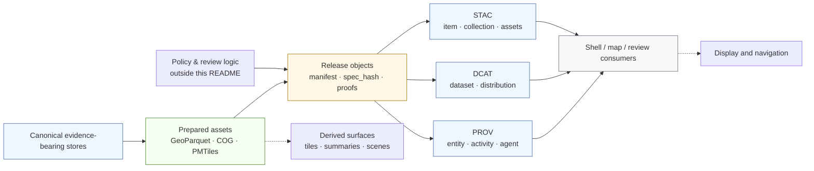

<!-- [KFM_META_BLOCK_V2]
doc_id: kfm://doc/NEEDS-VERIFICATION__docs-specs-data-readme
title: Data Specs
type: standard
version: v1
status: draft
owners: NEEDS-VERIFICATION
created: NEEDS-VERIFICATION__YYYY-MM-DD
updated: NEEDS-VERIFICATION__YYYY-MM-DD
policy_label: NEEDS-VERIFICATION__public_or_internal
related: [../README.md, ./DATA__STAC_PROFILE.md, ./DATA__DCAT_PROFILE.md, ./DATA__PROV_PROFILE.md]
tags: [kfm, docs, specs, data, stac, dcat, prov, packaging]
notes: [Directory landing README drafted from the attached KFM corpus and adjacent repo-facing README drafts; exact owners, dates, policy label, and current child-file inventory require checkout verification.]
[/KFM_META_BLOCK_V2] -->

# Data Specs

Landing surface for KFM data-facing specs: outward catalog profiles, packaging rules, and release-aware publication discipline.


> [!IMPORTANT]
> **Status:** `experimental`  
> **Owners:** `NEEDS VERIFICATION`  
> **Path:** `docs/specs/data/README.md`  
> **Quick jumps:** [Scope](#scope) · [Repo fit](#repo-fit) · [Inputs](#inputs) · [Exclusions](#exclusions) · [Directory tree](#directory-tree) · [Quickstart](#quickstart) · [Usage](#usage) · [STAC](#stac) · [DCAT](#dcat) · [PROV](#prov) · [Diagram](#diagram) · [Tables](#tables) · [Task list](#task-list) · [FAQ](#faq) · [Appendix](#appendix)

> [!NOTE]
> This README is **doctrine-strong** and **inventory-cautious**. The attached KFM corpus strongly confirms the data-law, outward-profile, packaging, and thin-client direction. This session did **not** surface a mounted `docs/specs/data/` subtree, so exact child files, active validators, and branch-level ownership details stay visibly bounded.

> [!TIP]
> Keep this page as the **landing README**, not the place where every field-level rule lives. In KFM terms, this surface should orient maintainers, preserve stable anchors, and point to narrower profile docs once their branch-level existence is confirmed.

---

## Scope

`docs/specs/data/README.md` is the directory landing page for KFM’s data-spec surface.

It exists to hold the **shared rules of the road** for:

- outward catalog and lineage description
- release-aware packaging and distribution
- data-surface terminology that must remain stable across lanes
- the boundary between canonical evidence-bearing stores and rebuildable derivatives
- the “prepare upstream, render downstream” rule for browser-facing delivery

It is **not** the place to silently redefine policy, runtime truth, or contract authority.

[Back to top](#data-specs)

---

## Repo fit

This file sits in the `docs/specs/` family as the landing page for data-oriented spec work.

| Relation | Surface | Role here | Current treatment |
| --- | --- | --- | --- |
| Upstream | [`../README.md`](../README.md) | Parent spec index / broader spec navigation | **INFERRED / NEEDS VERIFICATION** |
| Adjacent | `./DATA__STAC_PROFILE.md` | Candidate STAC-facing profile leaf | **INFERRED / NEEDS VERIFICATION** |
| Adjacent | `./DATA__DCAT_PROFILE.md` | Candidate DCAT-facing profile leaf | **INFERRED / NEEDS VERIFICATION** |
| Adjacent | `./DATA__PROV_PROFILE.md` | Candidate PROV-facing profile leaf | **INFERRED / NEEDS VERIFICATION** |
| Neighbor lane | `../pipelines/` | Downstream consumers of packaging/profile rules | **INFERRED / NEEDS VERIFICATION** |
| Neighbor lane | `../ci/` | Consumers of promotion, validation, and linkage guidance | **INFERRED / NEEDS VERIFICATION** |
| Neighbor lane | `../qa/` | Home for heavier validation-gate specifics rather than broad data doctrine | **INFERRED / NEEDS VERIFICATION** |
| Runtime-facing consumers | map shell, review surfaces, validators, promotion workflows | Use released descriptors, proofs, and catalog closure rather than inventing lane-local dialects | **CONFIRMED as doctrine; exact repo wiring UNKNOWN** |

### What this page should do

- orient readers quickly
- preserve the shared vocabulary for data publication surfaces
- keep `STAC`, `DCAT`, and `PROV` roles crisp
- keep packaging and proof language consistent across lanes
- make uncertainty visible where branch-level repo evidence is still missing

### What this page should not do

- pretend that branch-level file inventory is already verified
- duplicate canonical contract definitions better owned elsewhere
- flatten lane-specific exceptions into one false “universal format” rule
- teach unverified workflow or release behavior as current fact

[Back to top](#data-specs)

---

## Inputs

### Accepted inputs

Good inputs for this directory are:

- data-spec landing docs
- STAC / DCAT / PROV role clarifications
- media-type and manifest rules
- outward packaging guidance for GeoParquet, COG, PMTiles, and digest-addressed distribution
- worked examples that show **one released subject** closing cleanly across catalog and lineage surfaces
- documentation that clarifies the canonical-vs-derived boundary
- documentation that explains what must be prepared upstream before browser delivery

### Strong-fit contributions

| Input type | Why it belongs here |
| --- | --- |
| Profile overviews | This directory is the right place to explain how STAC, DCAT, and PROV divide responsibility |
| Packaging rules | Format and digest discipline are part of release trust, not just storage convenience |
| Example release chains | KFM repeatedly points to a first-wave hydrology exemplar as the smallest meaningful proof |
| Cross-catalog linkage notes | This is where maintainers should understand why one released subject must stay closed across outward surfaces |
| README/index maintenance | This page should help future leaf docs fit one coherent data-spec surface |

### Thin-slice-safe inputs

- path inventories marked as **PROPOSED / NEEDS VERIFICATION**
- shell-visible payload guidance at the level of role, not runtime claim
- worked examples that remain clearly illustrative
- verification backlogs that tell maintainers what to check before strengthening claims

[Back to top](#data-specs)

---

## Exclusions

| Does **not** belong here | Why | Put it here instead |
| --- | --- | --- |
| Canonical JSON Schemas and machine-trust objects | This README should not become a second contract authority | `contracts/`, `schemas/`, or dedicated profile leaves |
| Executable policy bundles or gate logic | Documentation may describe policy posture, but should not own enforcement | `policy/` or validator surfaces |
| Live receipts, proof packs, or release artifacts | Those are trust-bearing emitted objects, not landing-page doctrine | receipts / proofs / published surfaces |
| Domain ETL logic, ingest code, or geospatial transforms | Out of lane for a directory README | pipeline or package lanes |
| Browser/UI implementation detail | This page should explain data-delivery consequences, not renderers or app choreography | UI / shell docs |
| Runtime outcome grammar | Mention at a boundary level only | runtime, review, or promotion-specific surfaces |
| Repo maturity claims not backed by checkout proof | This page must stay subordinate to visible evidence | verify in-branch before teaching as settled fact |

> [!WARNING]
> If a deeper child file, validator, or workflow is not directly verified in the active checkout, keep it labeled as **INFERRED**, **PROPOSED**, **UNKNOWN**, or **NEEDS VERIFICATION**.

[Back to top](#data-specs)

---

## Directory tree

> [!CAUTION]
> Only the target README path itself is task-confirmed in this session. The subtree below is a **starter topology for review**, not a claim that every child already exists on the active branch.

```text
docs/specs/data/
├── README.md
├── DATA__STAC_PROFILE.md          # INFERRED / NEEDS VERIFICATION
├── DATA__DCAT_PROFILE.md          # INFERRED / NEEDS VERIFICATION
├── DATA__PROV_PROFILE.md          # INFERRED / NEEDS VERIFICATION
└── examples/                      # PROPOSED / NEEDS VERIFICATION
    └── hydrology/                 # strongest first-wave exemplar in doctrine
        ├── item.json
        ├── dataset.json
        └── prov.jsonld
```

### Reading rule for this tree

- Treat `README.md` as the landing page.
- Treat profile-leaf filenames as **candidate neighbors** until the checkout confirms them.
- Treat `examples/hydrology/` as the most doctrine-aligned first-wave example target, not as current emitted inventory.

[Back to top](#data-specs)

---

## Quickstart

Start by separating **doctrine**, **path recheck**, and **artifact proof**.

```bash
# From repo root: inspect the current data-spec surface
find docs/specs/data -maxdepth 3 -print 2>/dev/null | sort

# Read the parent specs index if present
test -f docs/specs/README.md && sed -n '1,220p' docs/specs/README.md

# Recheck candidate sibling leaves before documenting them as fact
for f in \
  docs/specs/data/README.md \
  docs/specs/data/DATA__STAC_PROFILE.md \
  docs/specs/data/DATA__DCAT_PROFILE.md \
  docs/specs/data/DATA__PROV_PROFILE.md
do
  test -f "$f" && { echo "===== $f"; sed -n '1,220p' "$f"; } || echo "MISSING $f"
done

# Inspect adjacent spec lanes that commonly consume data-profile references
for d in \
  docs/specs/pipelines \
  docs/specs/ci \
  docs/specs/qa
do
  test -d "$d" && echo "FOUND $d" || echo "MISSING $d"
done
```

### Inspect deeper evidence before strengthening claims

```bash
# Look for outward-profile references that point at this lane
grep -RIn "docs/specs/data/README.md" docs 2>/dev/null || true
grep -RIn "DATA__STAC_PROFILE.md\|DATA__DCAT_PROFILE.md\|DATA__PROV_PROFILE.md" docs 2>/dev/null || true

# Recheck whether one real Item / Dataset / PROV chain already exists
find . -type f \( -name "item.json" -o -name "*prov*.json" -o -name "*dataset*.json" \) 2>/dev/null | sort
```

### Maintain anchor compatibility deliberately

If nearby docs already point to `docs/specs/data/README.md#dcat`, keep the `## DCAT` anchor until those consumers are deliberately reconciled.

[Back to top](#data-specs)

---

## Usage

Use this page to answer four questions quickly:

1. **What belongs in STAC, DCAT, and PROV respectively?**
2. **What packaging stack is preferred for outward release?**
3. **What stays canonical versus derivative?**
4. **What should be prepared upstream before a browser or shell consumes it?**

### STAC

STAC is the outward **item and asset description** surface.

Use it for:

- item- and collection-level spatial / temporal description
- asset references
- projection and asset metadata
- outward discoverability of geospatial release-bearing assets

Do **not** use it as a substitute for:

- dataset/distribution framing better handled by DCAT
- activity / agent lineage better handled by PROV
- KFM-specific trust objects that still need their own contracts

### DCAT

DCAT is the outward **dataset and distribution** surface.

Use it for:

- dataset identity
- distribution-level discoverability
- release/distribution framing
- federation-facing catalog description

Keep this anchor stable if adjacent docs already reference `README.md#dcat`.

Do **not** use it as a substitute for:

- itemized spatial asset description
- causal lineage
- release-proof objects or policy outcomes

### PROV

PROV is the outward **lineage closure** surface.

Use it for:

- entity / activity / agent relationships
- explaining how a released object came to exist
- connecting released outputs back to source pull, normalization, and publication activity

Do **not** use it as a substitute for:

- receipts
- internal review grammar
- KFM-specific correction, supersession, or runtime response contracts

### Packaging and release identity

KFM’s preferred outward packaging stack is small and explicit:

- **GeoParquet** for many table-like geospatial vector outputs
- **COG** for many raster and terrain products
- **PMTiles** for static, range-friendly map delivery
- **digest-addressed distribution** and **attached proofs** for governed release identity

Treat formats, digests, manifests, and proofs as one coordinated release-bearing surface.

### Canonical vs derivative reading

This data-spec surface should reinforce, not blur, the canonical-vs-derived split:

- canonical evidence-bearing stores remain distinct
- catalogs, tiles, summaries, scenes, and similar products remain useful but rebuildable derivatives
- outward profiles should make those distinctions clearer, never more ambiguous

[Back to top](#data-specs)

---

## Diagram


```mermaid
flowchart LR
    A[Canonical evidence-bearing stores] --> B[Prepared assets<br/>GeoParquet · COG · PMTiles]
    H[Policy & review logic<br/>outside this README] --> C[Release objects<br/>manifest · spec_hash · proofs]

    B --> C
    C --> D[STAC<br/>item · collection · assets]
    C --> E[DCAT<br/>dataset · distribution]
    C --> F[PROV<br/>entity · activity · agent]

    D --> G[Shell / map / review consumers]
    E --> G
    F --> G

    G -.-> I[Display and navigation]
    B -.-> J[Derived surfaces<br/>tiles · summaries · scenes]

    style A fill:#eef6ff,stroke:#4a6fa5
    style B fill:#f5fff2,stroke:#4d8b31
    style C fill:#fff8e6,stroke:#a67c00
    style D fill:#eef6ff,stroke:#4a6fa5
    style E fill:#eef6ff,stroke:#4a6fa5
    style F fill:#eef6ff,stroke:#4a6fa5
    style G fill:#f6f8fa,stroke:#6b7280
```

The point of the diagram is simple: **prepare and prove upstream, describe outward, render downstream**.

[Back to top](#data-specs)

---

## Tables

### Data doctrine matrix

| Topic | One-line stance | Status | Maintainer consequence |
| --- | --- | --- | --- |
| Canonical vs derived | Canonical evidence-bearing stores must remain distinct from tiles, summaries, search views, scenes, and similar rebuildable derivatives | **CONFIRMED** | Do not let a convenience layer become de facto truth |
| STAC / DCAT / PROV | Use a closed outward spine: STAC for itemized asset description, DCAT for dataset/distribution framing, PROV for lineage closure | **EXTERNALLY CONFIRMED** | Avoid lane-by-lane metadata dialect drift |
| Packaging stack | Favor GeoParquet, COG, PMTiles, digest-addressed release identity, and attached proofs as one disciplined outward stack | **EXTERNALLY CONFIRMED** | Standardize manifests and media-type rules before widening lanes |
| Thin client | Push heavy derivation, closure, and trust-bearing work upstream; keep browser logic thin | **TECHNICALLY VALIDATED** | Render prepared descriptors and payloads rather than inventing trust-bearing joins in the client |
| First exemplar | Prove the discipline on one public-safe lane first, with hydrology remaining the strongest candidate | **CONFIRMED doctrine / branch implementation UNKNOWN** | Prefer one closed example over a broad but weakly evidenced surface |

### Current-state versus future-state reading

| Topic | Current reading | Preferred treatment in this README |
| --- | --- | --- |
| Data doctrine | Strongly converged across the attached KFM corpus | **CONFIRMED** |
| STAC / DCAT / PROV role split | Repeatedly reinforced in later synthesis passes | **CONFIRMED** |
| GeoParquet / COG / PMTiles / digest-aware publication | Strong corpus convergence with external confirmation | **CONFIRMED** |
| Exact `docs/specs/data/` child inventory | Not surfaced in this session | **UNKNOWN / NEEDS VERIFICATION** |
| Dedicated STAC / DCAT / PROV leaf docs on the active branch | Repeatedly referenced by adjacent docs, but not directly surfaced here | **INFERRED / NEEDS VERIFICATION** |
| Active validators, examples, and workflow wiring under this directory | Not surfaced in this session | **UNKNOWN / NEEDS VERIFICATION** |
| Need for a stable `#dcat` anchor | Strongly justified by adjacent-doc reference patterns | **PROPOSED but prudent** |

### Candidate neighboring surfaces

| Candidate surface | Role | Current treatment |
| --- | --- | --- |
| `./DATA__STAC_PROFILE.md` | Narrower STAC profile leaf | **INFERRED / NEEDS VERIFICATION** |
| `./DATA__DCAT_PROFILE.md` | Narrower DCAT profile leaf | **INFERRED / NEEDS VERIFICATION** |
| `./DATA__PROV_PROFILE.md` | Narrower PROV profile leaf | **INFERRED / NEEDS VERIFICATION** |
| `../pipelines/` | Consumer of outward data-spec guidance | **INFERRED / NEEDS VERIFICATION** |
| `../ci/` | Consumer of promotion / validation guidance | **INFERRED / NEEDS VERIFICATION** |
| `../qa/` | Home for heavier gate semantics and validator specifics | **INFERRED / NEEDS VERIFICATION** |

[Back to top](#data-specs)

---

## Task list

### Definition of done for this README

- [ ] verify the current `docs/specs/data/` subtree before strengthening any child-path claims
- [ ] confirm whether dedicated `DATA__STAC_PROFILE.md`, `DATA__DCAT_PROFILE.md`, and `DATA__PROV_PROFILE.md` already exist on the active branch
- [ ] confirm owners, `doc_id`, created/updated dates, and policy label before replacing placeholders
- [ ] recheck whether adjacent docs still need the `#dcat` anchor on this landing page
- [ ] keep parent and sibling links valid from the real file location
- [ ] keep doctrine, inferred inventory, and unknown implementation depth visibly separated

### Smallest meaningful next proof

- [ ] one hydrology `STAC` Item
- [ ] one matching `DCAT` dataset / distribution
- [ ] one matching `PROV` bundle
- [ ] one explicit digest / manifest rule that ties them together
- [ ] one signed outward asset family
- [ ] one cross-catalog closure check that proves the trio stays aligned

### Good future hardening

- [ ] add a minimal cross-catalog matrix validator
- [ ] add one explicit media-type / manifest register
- [ ] add one worked “canonical vs derived” example
- [ ] add one branch-verified sibling-doc table after inventory is rechecked
- [ ] add one data-spec FAQ entry per confirmed leaf doc once those leaves are surfaced

[Back to top](#data-specs)

---

## FAQ

### Why not put everything in STAC?

Because KFM’s own doctrine distinguishes **asset description**, **dataset/distribution framing**, and **lineage closure**. One vocabulary alone does not cover all three cleanly.

### Does DCAT replace STAC?

No. DCAT complements STAC. STAC stays strong for geospatial item and asset description; DCAT strengthens outward dataset and distribution framing.

### Does PROV replace receipts or manifests?

No. PROV helps explain lineage outwardly. KFM-specific receipts, manifests, and proof objects still need their own contracts.

### Are GeoParquet, COG, and PMTiles mandatory for every lane?

No. They are a preferred outward stack, not a false universal. Exceptions may exist, but they should be named and justified rather than improvised.

### Why is this README so explicit about uncertainty?

Because this session did not surface the mounted `docs/specs/data/` subtree. The README should stay useful **without** pretending that unseen branch inventory is already verified.

### Why keep a `## DCAT` anchor here?

Because adjacent docs already use this landing page as a profile reference target, and some references point specifically at `README.md#dcat`. Removing that anchor before reconciliation would create avoidable drift.

[Back to top](#data-specs)

---

## Appendix

<details>
<summary><strong>Evidence boundary for this README</strong></summary>

| Layer | What is safe to say here |
| --- | --- |
| **CONFIRMED doctrine** | STAC, DCAT, and PROV form the outward spine; GeoParquet, COG, PMTiles, digest-aware publication, and attached proofs belong in one disciplined packaging stack; canonical and derivative surfaces must remain distinct; browser logic should stay thin and consume prepared descriptors |
| **INFERRED** | This landing page likely has or should have narrower STAC / DCAT / PROV leaf docs nearby because adjacent docs repeatedly reference them |
| **UNKNOWN** | Exact active branch child inventory, validators, examples, owners, workflow wiring, and emitted artifacts under `docs/specs/data/` |
| **NEEDS VERIFICATION** | Placeholder metadata values, exact sibling-file existence, exact parent / neighbor path inventory, and whether current consumers still depend on `README.md#dcat` |

</details>

<details>
<summary><strong>Role split at a glance</strong></summary>

| Surface | Main job | Typical object focus |
| --- | --- | --- |
| STAC | outward geospatial item / collection / asset description | items, collections, assets, projection, timestamps |
| DCAT | outward dataset / distribution framing | datasets, distributions, version/distribution discoverability |
| PROV | outward lineage closure | entities, activities, agents, generation relationships |
| Manifest / digest / proof objects | release identity and trust-bearing closure | `spec_hash`, manifests, signatures, attestations, linked proofs |

</details>

<details>
<summary><strong>Verification backlog</strong></summary>

1. Inspect the mounted `docs/specs/data/` subtree.
2. Confirm exact child filenames and update the directory tree accordingly.
3. Confirm whether `DATA__DCAT_PROFILE.md` and `DATA__PROV_PROFILE.md` are real branch surfaces or still only referenced targets.
4. Confirm the correct governance-charter path used by this spec family on the active branch.
5. Surface one real Item / Dataset / PROV trio before describing any exemplar inventory as stronger than illustrative.
6. Reconcile adjacent links if this landing page eventually delegates `#dcat` consumers to a dedicated DCAT leaf.
7. Add branch-verified links only after the checkout proves them.

</details>

[Back to top](#data-specs)
