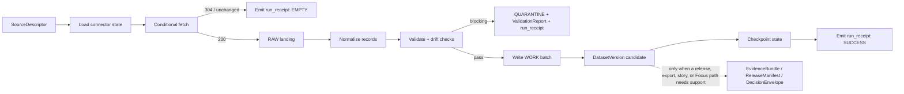

<!-- [KFM_META_BLOCK_V2]
doc_id: kfm://doc/TODO-NEEDS-UUID
title: Environmental Connector Contract and Thin-Slice Skeleton
type: standard
version: v1
status: draft
owners: @bartytime4life
created: 2026-04-14
updated: 2026-04-14
policy_label: TODO-NEEDS-VERIFICATION
related: [contracts/, schemas/, policy/, tests/, examples/thin_slice/hydrology/, src/pipelines/hydrology/nwis_watcher/README.md, docs/guides/geo/hydrology-workflows.md]
tags: [kfm, hydrology, connectors, receipts, provenance, weather]
notes: [Created from the hydrology-first doctrine plus the late proof-object packet family. Exact mounted repo path, shared schema-home placement for run_receipt and ai_receipt, and active workflow enforcement remain NEEDS VERIFICATION.]
[/KFM_META_BLOCK_V2] -->

# Environmental Connector Contract and Thin-Slice Skeleton

KFM-grade contract and landing plan for deterministic **USGS**, **WQP/WQX**, and **Kansas Mesonet** connectors in the hydrology-first slice.


> [!IMPORTANT]
> **Posture**
>
> - **CONFIRMED:** KFM wants typed contract families, a hydrology-first governed slice, fail-closed validation, and a minimum proof quartet centered on `spec_hash`, `run_receipt`, optional `ai_receipt`, and attestation references.
> - **PROPOSED:** the exact landing tree, file names below, and the connector-local implementation skeleton.
> - **UNKNOWN / NEEDS VERIFICATION:** mounted repo path parity, exact contract-home placement for `run_receipt` and `ai_receipt`, active CI callers, and active branch enforcement depth.

> [!TIP]
> **Quick jumps**  
> [Purpose](#purpose) · [KFM fit](#kfm-fit) · [Connector contract](#connector-contract) · [Receipt-vs-proof-separation](#receipt-vs-proof-separation) · [Implementation skeleton](#implementation-skeleton) · [Execution flow](#execution-flow) · [Definition of done](#definition-of-done) · [Appendix](#appendix)

---

## Purpose

This document turns the environmental-connector playbook into a **KFM-ready contract surface** for three admitted first-wave source families:

1. **USGS Water Data** for continuous hydrologic observations.
2. **Water Quality Portal (WQP, WQX-aligned)** for discrete water-quality samples.
3. **Kansas Mesonet** for weather context that materially affects hydrology interpretation.

The connector is not treated here as a generic downloader. In KFM terms it is a **deterministic intake-and-normalization boundary** that:

- converts source edge state into inspectable RAW and WORK artifacts
- emits a machine-checkable `run_receipt` on **every** exit path
- fails closed on malformed payloads, schema drift, primary-key collisions, and missing required fields
- stops short of outward publication law, which stays owned by release, catalog, policy, and review surfaces

---

## KFM fit

### Why this lane exists

Hydrology is the strongest first proof lane because it is public-safe, place-and-time rich, analytically legible, and well suited to evidence drill-through. This contract keeps that advantage while preventing later drift into ad hoc connector shapes.

### What this lane owns vs. does not own

| Concern | Owned here | Notes |
| --- | --- | --- |
| Source fetch + conditional request logic | **Yes** | Connector-local execution surface |
| RAW landing + WORK normalization | **Yes** | Deterministic intake responsibility |
| Per-run `run_receipt` emission | **Yes** | Mandatory on success, empty, quarantine, and error |
| Schema fingerprinting + drift checks | **Yes** | Fail-closed or quarantine-triggering |
| Shared schema truth | **No** | Keep canonical contract ownership in `contracts/` and/or `schemas/` |
| Policy law | **No** | Keep deny-by-default logic in `policy/` |
| Promotion decisions | **No** | Promotion emits a `DecisionEnvelope` elsewhere |
| Public runtime answers | **No** | Runtime answer surfaces own `RuntimeResponseEnvelope` |
| Release proof bundles | **No** | Release/review surfaces own `EvidenceBundle`, `ReleaseManifest`, correction objects |

### Truth-path placement

```text
Source edge
  -> RAW
  -> WORK / QUARANTINE
  -> PROCESSED candidate
  -> CATALOG
  -> PUBLISHED
```

This document only specifies the connector’s role through **RAW / WORK / QUARANTINE / PROCESSED candidate**. It does **not** collapse processing into publication.

[Back to top](#environmental-connector-contract-and-thin-slice-skeleton)

---

## Source scope

### Included first-wave sources

| Source | KFM source role | Primary data type | First thin-slice use |
| --- | --- | --- | --- |
| USGS Water Data | direct observation | streamflow, gage height, water temperature, groundwater series | gauge-centered hydrology release candidate |
| WQP / WQX-aligned feeds | direct observation / lab result | nutrients, chemistry, discrete samples | watershed-quality context |
| Kansas Mesonet | direct observation | temperature, wind, precipitation | weather forcing and cross-check context |

### Allowed supporting context, but not core connector scope here

| Supporting surface | Role here | Why it is not a core connector in this document |
| --- | --- | --- |
| WBD HUC12 | hydrologic boundary context | boundary/watcher surface rather than observation stream |
| FEMA NFHL | regulatory flood context | outward contextual/regulatory layer, not first-wave connector core |
| drought summaries / external briefs | contextual corroboration | interpretive support, not canonical observation intake |

### Exclusions

This contract does **not**:

- publish directly to outward catalog or public shell surfaces
- decide promotion law or reviewer approval
- collapse observed, modeled, and anomaly layers into one connector family
- claim active CI or branch enforcement not directly verified
- define runtime Focus / answer payloads
- silently resolve hydrography identifier rollovers without an explicit crosswalk or review step
- act as an emergency alerting system

---

## Connector contract

### Connector-local interface

```yaml
connector:
  id: string
  lane: hydrology
  source: usgs | wqp | ksmesonet
  source_role: direct_observation | operational_feed
  version: string
  cadence: hourly | daily | weekly

inputs:
  source_descriptor_ref: string
  endpoint: url
  params: object
  state:
    etag: string?
    last_modified: datetime?
    watermark: datetime?
    last_payload_hash: string?
    last_successful_receipt_ref: string?

outputs:
  raw_landing_ref: string?
  work_batch_ref: string?
  validation_report_ref: string?
  dataset_candidate_ref: string?
  run_receipt_ref: string
  drift_signals:
    schema_changed: bool
    pk_anomaly: bool
    geometry_shift: bool
    id_rollover: bool
    required_field_missing: bool
    malformed_payload: bool

local_outcome:
  SUCCESS | EMPTY | DRIFT_DETECTED | QUARANTINED | ERROR
```

### Outcome grammar separation

> [!NOTE]
> This connector contract uses a **connector-local outcome set**. It intentionally does **not** own:
>
> - promotion-gate outcomes
> - public runtime answer outcomes
> - shell surface-state grammar

| Surface class | Outcome family | Owned here |
| --- | --- | --- |
| Connector run | `SUCCESS`, `EMPTY`, `DRIFT_DETECTED`, `QUARANTINED`, `ERROR` | **Yes** |
| Promotion gate | separate decision grammar | **No** |
| Runtime answer surface | answer / abstain / deny / error family | **No** |

---

## Contract object map

| Object | Minimum purpose in this lane | Required here |
| --- | --- | --- |
| `SourceDescriptor` | declares the intake contract for one external source or endpoint | **Yes** |
| `run_receipt` | proves what one concrete fetch / normalize / validate cycle did | **Yes** |
| `ValidationReport` | records pass, fail, quarantine, and drift findings | **Yes** |
| `DatasetVersion` candidate | stabilizes processed candidate state when a batch is admissible | **Yes, when data changed** |
| `EvidenceBundle` | packages support for a public claim, export, story, or Focus answer | **No, by default** |
| `DecisionEnvelope` | records policy-significant approval / denial / hold / error | **No** |
| `CorrectionNotice` | preserves visible lineage under change after release | **No** |

---

## Receipt-vs-proof separation

This is the key KFM distinction the connector must preserve.

| Object | Required every run | Recommended home | Why it exists |
| --- | --- | --- | --- |
| `run_receipt` | **Yes** | `data/receipts/connectors/<source>/<date>/` | process memory, replay anchor, change detection, audit trail |
| `ai_receipt` | Only if model mediation occurs | shared receipt surface | bounds any AI-assisted summarization or transform |
| `EvidenceBundle` | **No** | release / runtime proof surfaces | support for consequential public or steward-facing claims |
| `ReleaseManifest` | **No** | release surface | outward release assembly and linkage |
| attestation refs | **Conditional** | proof / OCI / signed artifact surfaces | trust re-check for origin and integrity |

> [!WARNING]
> A successful connector run does **not** imply a released proof bundle. Receipts are mandatory process memory. Proof bundles are assembled only when a release, claim, export, or governed runtime surface needs them.

### Minimal `run_receipt` shape

```json
{
  "run_id": "uuid",
  "connector_id": "usgs_iv",
  "source": "usgs",
  "source_descriptor_ref": "kfm://source/usgs/waterdata/iv",
  "endpoint": "https://...",
  "request_hash": "sha256:...",
  "response_hash": "sha256:...",
  "spec_hash": "sha256:...",
  "etag": "\"...\"",
  "last_modified": "2026-04-14T00:00:00Z",
  "record_count": 12452,
  "raw_landing_ref": "kfm://raw/...",
  "work_batch_ref": "kfm://work/...",
  "validation_report_ref": "kfm://validation/...",
  "attestation_refs": [],
  "timestamp": "2026-04-14T00:00:00Z",
  "outcome": "SUCCESS"
}
```

---

## Incremental pull strategy

### Tier order

1. **Conditional HTTP first**  
   Prefer `If-None-Match` and `If-Modified-Since`.

2. **Watermark fallback**  
   Use source-supported time windows such as `updated_after`, begin dates, or last observation timestamp.

3. **Full refresh as last resort**  
   Rebuild only with explicit dedupe and checksum logic.

### Deterministic state checkpoint

```yaml
state:
  etag: string?
  last_modified: datetime?
  watermark: datetime?
  last_payload_hash: sha256?
  last_successful_receipt_ref: string?
  schema_fingerprint: sha256?
```

### Guardrails

- never advance watermark or request validators on failed validation
- write `run_receipt` even on `304` / unchanged paths
- quarantine malformed or drifted payloads before state mutation
- keep connector-local state distinct from release state

---

## Normalization targets

### 1) USGS hydrology series

```yaml
record:
  station_id: string
  parameter_code: string
  observed_at: timestamp
  value: float
  unit: string
  quality_flag: string?
  latitude: float
  longitude: float
```

### 2) WQP discrete sample

```yaml
record:
  monitoring_location_id: string
  activity_id: string
  observed_at: timestamp
  characteristic_name: string
  result_value: float
  unit: string
  method: string?
  detection_limit: float?
```

### 3) Kansas Mesonet weather observation

```yaml
record:
  station_id: string
  observed_at: timestamp
  temperature_c: float
  wind_speed_mps: float
  precipitation_mm: float
  latitude: float
  longitude: float
```

> [!TIP]
> If the Kansas Mesonet slice later expands into soil-moisture or evapotranspiration profiles, treat that as a profile overlay on this base contract rather than silently widening the base weather record.

---

## Validation and drift rules

### Blocking checks

| Check | Trigger | Default action |
| --- | --- | --- |
| schema drift | fingerprint mismatch | `DRIFT_DETECTED` + quarantine |
| primary-key collision | duplicate logical key | `ERROR` or `QUARANTINED` |
| missing required fields | absent contract-bearing field | `ERROR` |
| malformed payload | parse or transport failure after fetch | `ERROR` |
| impossible coordinate range | invalid lat/lon | `QUARANTINED` |

### Review-bearing checks

| Check | Trigger | Default action |
| --- | --- | --- |
| geometry shift | fixed station or location moved beyond configured tolerance | emit flag + quarantine or review route |
| identifier rollover | hydrography / crosswalk identifier disappeared or changed without explicit mapping | emit flag + review route |
| cadence anomaly | source stalls or cadence widens beyond declared threshold | emit flag + stale-visible handling upstream |

### Reference pseudocode

```python
def schema_fingerprint(fields: list[tuple[str, str]]) -> str:
    canonical = "|".join(f"{name}:{dtype}" for name, dtype in sorted(fields))
    return sha256(canonical.encode()).hexdigest()

if schema_fingerprint(current_fields) != state.schema_fingerprint:
    raise DriftDetected("SCHEMA_CHANGED")

if duplicate_primary_keys(records):
    raise ValidationFailure("PK_COLLISION")

if fixed_station and distance_m(previous_point, current_point) > 100:
    flags.append("GEOMETRY_SHIFT")

if crosswalk_required and current_identifier not in known_index:
    flags.append("ID_ROLLOVER")
```

---

## Time semantics

Connector implementations must keep these timestamps distinct:

| Field | Meaning | Why confusion is dangerous |
| --- | --- | --- |
| `observed_at` | when the phenomenon was measured | protects chronology and hydrologic interpretation |
| `retrieved_at` | when the connector fetched the payload | proves acquisition timing |
| `published_at` | when a downstream release occurred | belongs to release, not connector intake |
| `last_modified` | provider-side freshness validator | useful for conditional fetch, not observation truth |

---

## Implementation skeleton

### Proposed landing tree

```text
docs/specs/hydrology/environmental_connector_contract.md
# this document

src/pipelines/hydrology/environmental_connectors/          # PROPOSED landing lane
├── README.md                                              # optional lane-local entry once mounted
├── runner.py
├── config.py
├── base.py
├── state_store.py
├── connectors/
│   ├── usgs_timeseries.py
│   ├── wqp_results.py
│   └── ksmesonet_weather.py
├── normalize/
│   ├── usgs.py
│   ├── wqp.py
│   └── mesonet.py
├── validate/
│   ├── schema_fingerprint.py
│   ├── primary_keys.py
│   ├── geometry_shift.py
│   ├── time_semantics.py
│   └── required_fields.py
├── write/
│   ├── raw_landing.py
│   ├── work_batch.py
│   ├── run_receipt.py
│   └── checkpoint.py
└── tests/
    ├── test_usgs_connector.py
    ├── test_wqp_connector.py
    ├── test_mesonet_connector.py
    └── fixtures/

examples/thin_slice/hydrology/
├── usgs.source_descriptor.json
├── wqp.source_descriptor.json
├── mesonet.source_descriptor.json
├── run_receipt.success.json
├── run_receipt.empty.json
├── run_receipt.drift_detected.json
├── validation_report.pk_collision.json
└── dataset_version.release_candidate.json

contracts/ and/or schemas/                                 # shared homes; exact mounted paths NEEDS VERIFICATION
├── source_descriptor.schema.json
├── dataset_version.schema.json
├── run_receipt.schema.json
├── ai_receipt.schema.json
├── evidence_bundle.schema.json
└── decision_envelope.schema.json

policy/
└── hydrology/
    └── environmental_connectors.rego                      # PROPOSED shared policy consumer
```

### Base class sketch

```python
from dataclasses import dataclass
from typing import Any, Iterable

@dataclass
class ConnectorState:
    etag: str | None = None
    last_modified: str | None = None
    watermark: str | None = None
    last_payload_hash: str | None = None
    schema_fingerprint: str | None = None

@dataclass
class ConnectorResult:
    outcome: str
    run_receipt_ref: str
    raw_landing_ref: str | None = None
    work_batch_ref: str | None = None
    validation_report_ref: str | None = None
    dataset_candidate_ref: str | None = None

class EnvironmentalConnector:
    connector_id: str
    source: str
    cadence: str

    def fetch(self, state: ConnectorState) -> Any: ...
    def normalize(self, payload: Any) -> Iterable[dict]: ...
    def validate(self, records: Iterable[dict], state: ConnectorState) -> dict: ...
    def checkpoint(self, state: ConnectorState, payload: Any, report: dict) -> ConnectorState: ...

    def run(self, state: ConnectorState) -> ConnectorResult:
        payload = self.fetch(state)

        if payload.is_not_modified:
            return emit_empty_receipt(self.connector_id, state, payload)

        raw_landing_ref = land_raw_payload(self.connector_id, payload)
        records = list(self.normalize(payload))
        report = self.validate(records, state)

        if report["blocking"]:
            return quarantine_and_emit(self.connector_id, raw_landing_ref, report, payload)

        work_batch_ref = write_work_batch(self.connector_id, records)
        dataset_candidate_ref = maybe_write_dataset_candidate(self.connector_id, records, report)
        next_state = self.checkpoint(state, payload, report)
        run_receipt_ref = write_run_receipt(
            connector_id=self.connector_id,
            payload=payload,
            report=report,
            raw_landing_ref=raw_landing_ref,
            work_batch_ref=work_batch_ref,
            dataset_candidate_ref=dataset_candidate_ref,
        )
        persist_state(self.connector_id, next_state)
        return ConnectorResult(
            outcome="SUCCESS",
            run_receipt_ref=run_receipt_ref,
            raw_landing_ref=raw_landing_ref,
            work_batch_ref=work_batch_ref,
            validation_report_ref=report["ref"],
            dataset_candidate_ref=dataset_candidate_ref,
        )
```

### Thin-slice order

1. land shared schemas and valid / invalid fixtures
2. implement **USGS** connector first
3. add `EMPTY`, `SUCCESS`, and `SCHEMA_CHANGED` receipt fixtures
4. add `WQP` connector second
5. add `Kansas Mesonet` connector third
6. wire one schema-lint / fixture path into CI before widening scope

[Back to top](#environmental-connector-contract-and-thin-slice-skeleton)

---

## Execution flow



---

## Quickstart

### Minimal landing sequence

1. **Create source descriptors** for USGS, WQP, and Kansas Mesonet.
2. **Pin normalization schemas** and publish valid / invalid fixtures.
3. **Implement one connector** (`usgs_timeseries.py`) with conditional fetch and receipt emission.
4. **Prove negative paths**: unchanged response, schema drift, malformed payload, and PK collision.
5. **Wire one CI validator path** that fails closed on fixture or schema errors.
6. **Only then** add WQP and Kansas Mesonet.

### First local run

```bash
# illustrative pseudocode only
python -m src.pipelines.hydrology.environmental_connectors.runner \
  --connector usgs_timeseries \
  --source-descriptor examples/thin_slice/hydrology/usgs.source_descriptor.json \
  --state .local/state/usgs_timeseries.json \
  --out .local/out/
```

### Expected artifacts from one successful thin-slice run

```text
.local/out/raw/usgs/...
.local/out/work/usgs/...
data/receipts/connectors/usgs/2026-04-14/run_receipt.json
.local/out/validation/usgs/validation_report.json
```

---

## Definition of done

Use this checklist before treating the lane as a real thin slice.

- [ ] one shared `SourceDescriptor` contract is stable enough to validate
- [ ] one shared `run_receipt` contract is stable enough to validate
- [ ] valid and invalid fixtures exist for `run_receipt`
- [ ] `USGS` connector emits `run_receipt` on `EMPTY`, `SUCCESS`, and blocking-failure paths
- [ ] schema drift is fail-closed or quarantine-routed
- [ ] primary-key collisions are fail-closed
- [ ] connector-local state never advances on failed validation
- [ ] one `DatasetVersion` candidate example is emitted from the same run family
- [ ] one downstream release-proof path is documented, but kept outside this lane
- [ ] mounted CI caller, if any, is documented only after direct verification

---

## FAQ

### Why does this document separate `run_receipt` from `EvidenceBundle`?

Because they solve different problems. The receipt proves what the connector did. The bundle supports a consequential claim, export, release, or runtime surface.

### Why not publish straight from the connector?

Because KFM treats publication as a governed transition, not as a successful fetch.

### Why keep promotion grammar out of this contract?

Because connector execution, promotion, and runtime questioning are different surface classes with different finite outcomes.

### Where do WBD HUC12 and NFHL fit?

They are strong hydrology-adjacent sources, but better treated here as supporting context or later watcher / boundary surfaces rather than first-wave observation connectors.

### Does this document prove the lane already exists?

No. It is a contract and landing plan built from corpus doctrine plus bounded realization guidance.

[Back to top](#environmental-connector-contract-and-thin-slice-skeleton)

---

## Appendix

<details>
<summary><strong>Illustrative SourceDescriptor — USGS</strong></summary>

```yaml
id: kfm://source/usgs/waterdata/iv
name: USGS Water Data Instantaneous Values
source_role: direct_observation
owner: TODO-NEEDS-VERIFICATION
rights_posture: public
support:
  spatial: station point
  temporal: observation time
cadence: hourly
access:
  mode: https
  endpoint: https://waterservices.usgs.gov/nwis/iv/
validation_plan:
  required_fields: [site_no, parameter_cd, datetime, value]
  conditional_fetch: [etag, last_modified]
publication_intent:
  default: processed_candidate_only
  outward_release_requires: [catalog_closure, release_manifest, evidence_bundle]
```

</details>

<details>
<summary><strong>Illustrative run_receipt — drift detected</strong></summary>

```json
{
  "run_id": "2fdb73c3-c417-4ec8-a45d-94e7f0f34cd8",
  "connector_id": "ksmesonet_weather",
  "source": "ksmesonet",
  "spec_hash": "sha256:8b8a7d2fd0b57d6f9f488fdd5d1dc0b6bf2cb58cc58ddf7f1f802b65c8f6f27a",
  "request_hash": "sha256:...",
  "response_hash": "sha256:...",
  "timestamp": "2026-04-14T05:15:00Z",
  "outcome": "DRIFT_DETECTED",
  "raw_landing_ref": "kfm://raw/ksmesonet/2026-04-14/05-15",
  "validation_report_ref": "kfm://validation/ksmesonet/2026-04-14/05-15",
  "drift_signals": {
    "schema_changed": true,
    "pk_anomaly": false,
    "geometry_shift": false,
    "id_rollover": false,
    "required_field_missing": false,
    "malformed_payload": false
  },
  "attestation_refs": []
}
```

</details>

<details>
<summary><strong>Implementation note: shared-contract home</strong></summary>

Keep canonical contract meaning in shared surfaces. This lane should consume:

- `SourceDescriptor`
- `run_receipt`
- `DatasetVersion`
- `ValidationReport`
- `EvidenceBundle` (downstream only)

It should **not** redefine shared policy law, release law, or runtime answer law in lane-local helper code.

</details>