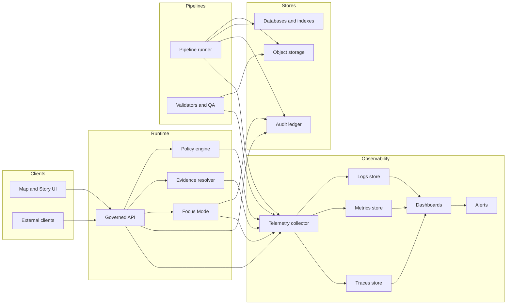

<!-- [KFM_META_BLOCK_V2]
doc_id: kfm://doc/8a0f6f19-4d7d-4a5e-9e4e-5b0c23d62f7f
title: Observability
type: standard
version: v1
status: draft
owners: [TBD]
created: 2026-03-04
updated: 2026-03-04
policy_label: public
related: [
  docs/specs/api/README.md,
  docs/specs/policy/README.md,
  docs/specs/pipelines/README.md,
  docs/specs/audit/README.md
]
tags: [kfm, observability, telemetry, slo, monitoring, logs, metrics, traces]
notes: [
  "Defines minimum observability signals and telemetry contracts for KFM runtime + pipelines.",
  "Separates CONFIRMED requirements (from KFM design docs) from PROPOSED implementation choices.",
  "Unknowns are tracked with smallest verification steps."
]
[/KFM_META_BLOCK_V2] -->

<a id="top"></a>

# Observability

Define the **minimum observability signals**, **telemetry contracts**, and **operational gates** for Kansas Frontier Matrix services and pipelines—without violating KFM governance, sensitivity, and “cite-or-abstain” rules.

---

## Impact

**Status:** `draft`  
**Owners:** `TBD` (suggested: Platform + Ops + Steward representatives)  
**Policy label:** `public` (implementation configs may be `restricted`)  


**Quick links:**  
[Scope](#scope) •
[Where it fits](#where-it-fits) •
[Inputs](#acceptable-inputs) •
[Exclusions](#exclusions) •
[Directory tree](#directory-tree) •
[Diagram](#diagram) •
[Minimum requirements](#minimum-observability-requirements) •
[Telemetry contracts](#telemetry-contracts) •
[Dashboards](#dashboards) •
[SLOs and alerting](#slos-and-alerting) •
[Quickstart](#quickstart) •
[Task list](#task-list) •
[FAQ](#faq) •
[Appendix](#appendix)

---

## Scope

**CONFIRMED** — KFM must be *operable* and must encode operational controls early (monitoring, backups, incident response, auditability).  
**CONFIRMED** — Observability must support governance: policy enforcement, rights clearance, sensitivity handling, and auditability for governed operations.  
**PROPOSED** — This spec is implementation-agnostic, but recommends an OpenTelemetry-compatible telemetry model so KFM can swap vendors/backends without rewriting instrumentation.

This directory specifies:

- **Logs** (structured, with correlation + audit references)
- **Metrics** (latency, freshness, pipeline health, policy denials, evidence resolution failures)
- **Traces** (optional early, but strongly recommended once multiple services exist)
- **Dashboards + alerting** aligned to KFM roles (steward, operator, product)
- **SLOs** for dataset freshness and service performance

---

## Where it fits

**CONFIRMED** — KFM enforces a **trust membrane**: clients do not access databases/stores directly; access is via the governed API and policy boundary.  
**CONFIRMED** — Governed operations (including Focus Mode) produce an **audit reference** and must log policy-safe rationale.  
**CONFIRMED** — Observability must capture both **operational health** and **governance integrity** (policy denials, rights issues, evidence resolution failures).

### Upstream and downstream connections

- **Upstream producers:** pipeline runner / batch jobs, ingestion connectors, validation/reporting jobs
- **Runtime producers:** governed API, policy engine (PDP), evidence resolver, tile service (if dynamic), Focus Mode orchestrator
- **Downstream consumers:** steward/operator/product dashboards, alerting/on-call, audit review workflows

[Back to top](#top)

---

## Acceptable inputs

Put the following kinds of artifacts in `docs/specs/observability/`:

- **Spec documents** defining required signals (logs/metrics/traces), naming, and governance constraints
- **Telemetry schemas/contracts** (e.g., JSON Schema for log event types, metric catalog tables, trace attribute keys)
- **Dashboards-as-code** definitions (vendor-neutral if possible; otherwise put vendor files under a clearly labeled subdir)
- **Alert policies** and SLO definitions (thresholds, burn rates, paging vs ticket alerts)
- **Runbooks** (or links to runbooks) for common incidents: pipeline failures, freshness SLO violations, evidence resolver failures, policy regression alarms

---

## Exclusions

Do **not** put these here:

- **Secrets** (API keys, tokens, credentials, webhook URLs)
- **Vendor exports that can’t be reviewed** (opaque binary dashboards), unless accompanied by a human-readable diffable source-of-truth
- **Raw log dumps** or **PII-bearing samples**
- **Anything that enables sensitive targeting**, including precise sensitive-location coordinates or raw restricted evidence in examples
- **Direct-to-storage client patterns** (observability must not normalize “UI reads DB” shortcuts)

---

## Directory tree

**PROPOSED** (add files as they’re created; keep everything diffable):

```text
docs/specs/observability/
  README.md                       # this file
  logging.md                      # PROPOSED: log event types + required fields + redaction rules
  metrics.md                      # PROPOSED: metric catalog + labels + SLO linkages
  tracing.md                      # PROPOSED: trace attributes + sampling + PII rules
  dashboards/
    README.md                     # PROPOSED: dashboard requirements and review checklist
    steward/                      # PROPOSED: policy denials, rights, quarantines
    operator/                     # PROPOSED: pipeline health, storage, deploys
    product/                      # PROPOSED: UI perf + a11y regressions
  alerts/
    README.md                     # PROPOSED: alert taxonomy and routing
  schemas/
    kfm_audit_event_v1.schema.json  # PROPOSED: governed operation audit log event
    kfm_app_log_v1.schema.json      # PROPOSED: non-audit structured log baseline
```

---

## Diagram



---

## Minimum observability requirements

### Minimum signals

**CONFIRMED** — KFM operations must track these signal categories:

| Area | Minimum signals | Status |
|---|---|---|
| Ingest runs | success/fail, duration, rows/bytes, retry counts | CONFIRMED |
| Freshness | last successful run timestamp per dataset, expected cadence | CONFIRMED |
| Quality drift | distribution checks, missingness, geometry errors | CONFIRMED |
| API | request latency, cache hit rate, policy denials, evidence resolution failures | CONFIRMED |
| Storage | object store growth, PostGIS index health, search index lag | CONFIRMED |

### Minimum runtime telemetry

**CONFIRMED** — Minimum observability for runtime should include:

- **structured logs** with `correlation_id` and `audit_ref`
- **metrics** for:
  - request latency (P95) per endpoint
  - evidence resolver latency
  - tile response latency
  - pipeline run durations and failures
- **traces** are optional early

### Minimum dashboards

**CONFIRMED** — Dashboards must support:

- **Steward view:** policy denials, rights issues, quarantines
- **Operator view:** pipeline health, storage usage, deployment status
- **Product view:** UI performance and a11y regression indicators

[Back to top](#top)

---

## Telemetry contracts

This section defines the **portable contract**. Use it to design instrumentation, validate telemetry, and build dashboards/alerts.

### Logging

#### Baseline application logs

**CONFIRMED** — Structured logs must include correlation and audit references.  
**PROPOSED** — Encode logs as JSON lines with stable keys and strict redaction rules.

**PROPOSED baseline fields** (add more as needed, but keep keys stable):

| Field | Required | Type | Notes |
|---|---:|---|---|
| `ts` | yes | string (RFC3339) | Timestamp |
| `level` | yes | string | debug/info/warn/error |
| `service` | yes | string | e.g., `api`, `evidence_resolver`, `pipeline_runner` |
| `env` | yes | string | dev/staging/prod |
| `correlation_id` | yes | string | Stable across a request/run |
| `audit_ref` | yes* | string | *Required for governed operations; include where applicable elsewhere* |
| `msg` | yes | string | Human-safe summary (no sensitive fields) |
| `error_code` | no | string | Stable error model (policy-safe) |
| `trace_id` | no | string | If tracing enabled |
| `span_id` | no | string | If tracing enabled |

> **WARNING**  
> **CONFIRMED** — Audit logs are sensitive; apply redaction and retention policy. Do not log restricted coordinates, owner names, or unredacted restricted evidence.

#### Governed operation audit event

**CONFIRMED** — Every governed operation must emit a log record that includes:  
**who, what, when, why, inputs/outputs by digest, and policy decisions (allow/deny, obligations, reason codes).**

**PROPOSED** — Represent this as a dedicated event type: `kfm_audit_event`.

Minimal audit event fields (proposed key set):

| Field | Required | Notes |
|---|---:|---|
| `event_type` | yes | `kfm_audit_event` |
| `audit_ref` | yes | Reference to audit ledger entry or receipt |
| `principal` | yes | Stable principal identifier (policy-safe) |
| `role` | yes | Role at decision time |
| `action` | yes | Endpoint name or job name |
| `params_digest` | yes | Digest of normalized inputs (not raw) |
| `outputs_digest` | yes | Digest(s) of artifacts, bundles, or response body |
| `policy_decision` | yes | allow/deny + obligations + reason codes |
| `dataset_version_id` | no | When applicable |

Example (pseudocode; redact sensitive values):

```json
{
  "event_type": "kfm_audit_event",
  "ts": "2026-03-04T18:12:31Z",
  "service": "api",
  "env": "prod",
  "correlation_id": "01HZZZ... (opaque)",
  "audit_ref": "kfm://audit/entry/123",
  "principal": "user:abc123",
  "role": "public",
  "action": "POST /api/v1/evidence/resolve",
  "params_digest": "sha256:...",
  "outputs_digest": "sha256:...",
  "policy_decision": {
    "decision": "allow",
    "obligations_applied": [],
    "reason_codes": ["PUBLIC_EVIDENCE_OK"]
  }
}
```

### Metrics

**CONFIRMED** — Required metric concepts include request latency (P95) per endpoint, evidence resolver latency, tile response latency, pipeline durations/failures, plus pipeline freshness and policy denials.

**PROPOSED** — Standardize a metric catalog so dashboards/alerts are portable across backends.

Minimum metric catalog (names are PROPOSED; the requirement is CONFIRMED):

| Metric concept | Proposed name | Type | Required labels |
|---|---|---|---|
| API request latency | `kfm_api_request_duration_ms` | histogram | `endpoint`, `status_class`, `role` |
| Evidence resolver latency | `kfm_evidence_resolve_duration_ms` | histogram | `outcome`, `policy_label` |
| Tile response latency | `kfm_tile_duration_ms` | histogram | `layer_id`, `policy_label` |
| Pipeline run duration | `kfm_pipeline_run_duration_s` | histogram | `dataset_id`, `connector`, `status` |
| Pipeline run failures | `kfm_pipeline_run_failures_total` | counter | `dataset_id`, `connector`, `reason_code` |
| Policy denials | `kfm_policy_denials_total` | counter | `endpoint`, `reason_code` |
| Evidence resolution failures | `kfm_evidence_failures_total` | counter | `reason_code` |
| Dataset freshness age | `kfm_dataset_freshness_age_s` | gauge | `dataset_id`, `dataset_version_id` |
| Search index lag | `kfm_search_index_lag_s` | gauge | `index_name` |
| Object store growth | `kfm_object_store_bytes` | gauge | `zone` (raw/work/processed/catalog) |

### Tracing

**CONFIRMED** — Traces are optional early.  
**PROPOSED** — Once multiple services exist (API ↔ policy ↔ evidence ↔ search), enable distributed tracing and propagate `correlation_id` and `audit_ref` as span attributes (redacted/policy-safe).

**PROPOSED** trace attribute keys:

- `kfm.correlation_id`
- `kfm.audit_ref`
- `kfm.policy.decision`
- `kfm.policy.reason_code`
- `kfm.dataset_version_id`
- `kfm.evidence.bundle_digest`

---

## Dashboards

Dashboards are not just “ops comfort”; in KFM they are part of governance integrity.

### Steward view

**CONFIRMED** — Must include:

- policy denials (rates, top reason codes)
- rights issues (e.g., content blocked from publishing due to unclear rights)
- quarantines (datasets/runs blocked from promotion)

**PROPOSED panels:**

- Denials by endpoint and role
- Denials by dataset policy_label
- Quarantine queue size + oldest item age
- Evidence resolver failures (by reason)

### Operator view

**CONFIRMED** — Must include:

- pipeline health (success/fail, duration)
- storage usage (object store growth)
- deployment status (version, error rate)

**PROPOSED panels:**

- Pipeline success rate by dataset_id
- Dataset freshness age vs SLO threshold
- Search index lag trend
- DB health checks (including index health where applicable)

### Product view

**CONFIRMED** — Must include:

- UI performance indicators
- accessibility regression indicators

**PROPOSED panels:**

- Core Web Vitals (LCP/INP/CLS) trends for Map/Story/Focus pages
- Frontend error rate (JS exceptions) and API error rate
- A11y check regression counts (from CI or scheduled audits)

[Back to top](#top)

---

## SLOs and alerting

### Dataset freshness SLOs

**CONFIRMED** — Each dataset carries a freshness SLO; alerting triggers when SLOs are violated.

**PROPOSED** representation:

- Store freshness expectations in catalog metadata (e.g., `kfm:freshness_slo_seconds` or `kfm:expected_cadence`)
- Compute `freshness_age = now - last_successful_run_ts`
- Trigger:
  - **ticket alert** when freshness_age > 1× SLO
  - **page alert** when freshness_age > 2× SLO (or per dataset criticality)

### Runtime SLOs

**CONFIRMED** — Track request latency (P95) per endpoint; evidence resolver and tile latency are explicitly required signals.

**PROPOSED** starter SLO table (tune with real traffic):

| Surface | SLO objective | Alert style |
|---|---|---|
| API request latency | P95 < X ms per endpoint | burn-rate |
| Evidence resolver latency | P95 < X ms | burn-rate |
| Tile latency | P95 < X ms | burn-rate |
| Pipeline success | 99% successful runs over 7d | ticket/page |
| Evidence resolver failures | < N per hour | ticket/page |
| Policy denials spike | anomaly detection or threshold | steward ticket |

### Alert taxonomy

**PROPOSED**

- **Page:** data loss, policy bypass risk, severe freshness breach on critical dataset(s), evidence resolver down
- **Ticket:** gradual freshness drift, increased denials due to policy change, rising storage usage
- **Info:** deployment rollouts, periodic health summaries

---

## Quickstart

> **NOTE**  
> Commands below are **PROPOSED pseudocode** until the repo contains an agreed observability stack (collector + backends + dashboards).

```bash
# PSEUDOCODE: start a local observability stack (collector + metrics + logs + traces + dashboards)
# TODO(repo): provide a real compose file and documented ports.
docker compose -f ops/observability/docker-compose.yml up -d
```

```bash
# PSEUDOCODE: run a local API with telemetry enabled
# TODO(repo): define env var names and defaults.
export KFM_TELEMETRY_ENABLED=1
export KFM_LOG_FORMAT=json
export KFM_TELEMETRY_ENDPOINT=http://localhost:4317
make dev-api
```

---

## Task list

### Definition of Done for “observability minimum”

- [ ] **CONFIRMED**: Runtime emits structured logs including correlation IDs and `audit_ref` (for governed operations).
- [ ] **CONFIRMED**: Runtime exports metrics for required latency surfaces and pipeline health.
- [ ] **CONFIRMED**: Pipeline runner emits per-run success/fail + duration + row/byte counts.
- [ ] **CONFIRMED**: Dataset freshness SLO exists per dataset and violations alert.
- [ ] **CONFIRMED**: Policy denials and evidence resolution failures are measurable and dashboarded.
- [ ] **CONFIRMED**: Dashboards exist for steward/operator/product views.
- [ ] **CONFIRMED**: Audit integrity test exists: API responses include an audit reference and evidence bundle hash/digest (field name may be TBD).
- [ ] **CONFIRMED**: Audit logs are treated as sensitive (redaction + retention + access control).
- [ ] **PROPOSED**: Telemetry schema validation runs in CI (log schema + metric catalog checks).
- [ ] **PROPOSED**: Tracing enabled once >1 runtime service exists; trace attributes include policy decision metadata (policy-safe).
- [ ] **PROPOSED**: Runbooks exist for top 5 alerts (freshness violation, pipeline failure, evidence failures, denials spike, storage pressure).

---

## FAQ

### Why is observability part of governance?

**CONFIRMED** — KFM must be able to prove what it served, why it served it, and under which policy decisions. Observability is how stewards/operators detect leakage risk, rights issues, and broken citations early.

### Are traces required?

**CONFIRMED** — Traces are optional early.  
**PROPOSED** — Once KFM has multiple services, traces are the fastest way to debug evidence resolution failures and latency regressions without logging sensitive payloads.

### Can we log request parameters to debug?

**CONFIRMED** — Governed operations must record “what” happened, but **audit logs are sensitive**.  
**PROPOSED** — Store only **digests** (hashes) of normalized inputs/outputs; do not log raw parameters that can reveal restricted existence or sensitive locations.

[Back to top](#top)

---

## Appendix

<details>
<summary><strong>Open questions</strong> (UNKNOWN items + smallest verification steps)</summary>

1) **UNKNOWN** — Canonical `audit_ref` format and storage backend  
   - Verify: locate/author `docs/specs/audit/README.md` and any `schemas/*audit*` definitions.

2) **UNKNOWN** — Chosen telemetry backend(s) (Prometheus/Grafana, OpenSearch, Loki, Tempo, managed services, etc.)  
   - Verify: check `ops/` or deployment docs for declared components; record ADR.

3) **UNKNOWN** — Log retention policy and access model (who can see audit logs)  
   - Verify: governance council + steward decision; encode in policy bundle and ops runbook.

4) **UNKNOWN** — Exact SLO thresholds (API latency, evidence resolver latency, tile latency)  
   - Verify: run baseline load tests, capture p95/p99, set SLOs, and revisit quarterly.

</details>

<details>
<summary><strong>Proposed conventions</strong> (portable naming)</summary>

- Prefer stable prefixes: `kfm_` for metrics
- Prefer stable reason codes for policy decisions (never rely on free-text)
- Prefer digests over raw payload logging:
  - `params_digest`: digest of normalized request context
  - `outputs_digest`: digest of response or artifact manifest

</details>
