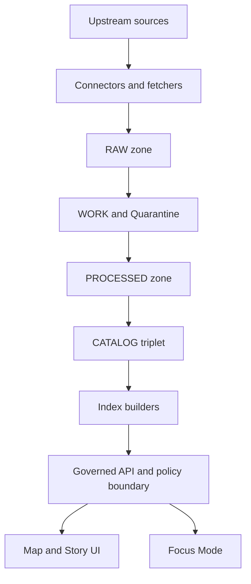

<!-- [KFM_META_BLOCK_V2]
doc_id: kfm://doc/3a6d3dfb-3b47-4f67-8f5b-9d0ac1d9c20a
title: Pipelines Specs
type: standard
version: v1
status: draft
owners: [platform, data-pipelines]
created: 2026-03-04
updated: 2026-03-04
policy_label: public
related: [../README.md, ../data/README.md, ../architecture/ARCH__DATA_PIPELINES.md, ../../policy/README.md]
tags: [kfm, pipelines, promotion-contract, provenance, receipts, stac, dcat, prov]
notes: [Directory README for KFM pipeline specs, promotion gates, and run-receipt expectations.]
[/KFM_META_BLOCK_V2] -->

# Pipelines specs
One place for the *normative* pipeline specs that move data through KFM’s truth path and into governed runtime surfaces.

> **Status:** draft  
> **Owners:** platform · data-pipelines (TODO: confirm CODEOWNERS)  
> **Badges:**     
> **Quick links:** [Scope](#scope) · [Where it fits](#where-it-fits) · [Directory tree](#directory-tree) · [Quickstart](#quickstart) · [Diagram](#diagram) · [Promotion contract](#promotion-contract) · [Task list](#task-list) · [FAQ](#faq)

---

## Scope

**CONFIRMED:** KFM pipelines are expected to implement an auditable “truth path” across storage/validation zones, ending in policy-enforced runtime surfaces (API + UI).  
**CONFIRMED:** Truth path zones (minimum) are: **RAW**, **WORK / QUARANTINE**, **PROCESSED**, **CATALOG / TRIPLET**, **PUBLISHED**.  
**CONFIRMED:** Promotion into runtime surfaces must be **fail-closed** unless required artifacts exist and validate (“Promotion Contract”).  

**PROPOSED:** This directory is the canonical place for:
- **PROPOSED:** pipeline spec templates and conventions
- **PROPOSED:** orchestration expectations (asset boundaries, backfills, idempotency)
- **PROPOSED:** receipt + manifest expectations (what every run must emit)
- **PROPOSED:** quality gates expectations (what must be tested/validated in CI)
- **PROPOSED:** runbooks for promotion and rollback

**UNKNOWN:** Exact orchestrator/tooling in the live repo (Dagster vs alternatives, exact CLI entrypoints).  
**Smallest verification step:** run `tree -L 4 docs/specs/pipelines` and inspect `.github/workflows/*gate*` for the enforced checks.

### Evidence labels

This README uses:
- **CONFIRMED** = stated as a requirement/pattern in KFM vNext design documents
- **PROPOSED** = recommended here, but should be adopted via ADR/governance review if it changes behavior
- **UNKNOWN** = needs repo verification (or a missing spec/doc)

---

## Where it fits

**CONFIRMED:** Pipelines sit upstream of catalogs and governed APIs: their outputs must be promotable, citeable, and policy-safe.  
**CONFIRMED:** The “trust membrane” invariant applies: runtime clients must not bypass policy by reading storage/DB directly; access crosses the governed API/policy boundary.  
**CONFIRMED:** Domain logic should not talk directly to infrastructure; it should go through interfaces/adapters (enforceable via tests/reviews).

**PROPOSED:** Cross-links you typically need while working in this directory:
- `docs/specs/data/` for dataset registry conventions + catalog templates
- `policy/` for OPA/Rego rules + fixtures
- `tools/` for validators (STAC/DCAT/PROV/link-check/receipt schema)
- `.github/workflows/` for CI gates that enforce Promotion Contract checks
- `ops/` (or equivalent) for production runbooks and rollback playbooks

**UNKNOWN:** Exact locations of these directories in *this* repo snapshot.  
**Smallest verification step:** run `tree -L 2 .` at repo root; update links above if paths differ.

---

## Acceptable inputs

**PROPOSED:** Put these in `docs/specs/pipelines/`:
- **PROPOSED:** `PIPELINE__*.md` specs for dataset-family pipelines (connectors → transforms → catalogs)
- **PROPOSED:** schema references (links to `schemas/`), and “contract surfaces” referenced by CI
- **PROPOSED:** runbook docs for promotion, rollback, backfill, and incident response
- **PROPOSED:** diagrams explaining truth path boundaries and artifact handoffs
- **PROPOSED:** small, sanitized examples (toy JSON/YAML) for receipts/manifests

---

## Exclusions

**CONFIRMED:** Do not store raw datasets, secrets, or large binary artifacts in `docs/`.  
**PROPOSED:** Do not put executable pipeline code here (belongs in `src/`, `packages/`, or equivalent).  
**PROPOSED:** Do not put authoritative policies here (belongs in `policy/` so CI/runtime can enforce it).  
**PROPOSED:** Do not put canonical catalogs here (belongs with the dataset version artifacts).

---

## Directory tree

**UNKNOWN:** Current state of this directory in the live repo.

**PROPOSED:** Target layout (additive; rename to match repo conventions):

```text
docs/specs/pipelines/
├─ README.md
├─ PIPELINE__SPEC_TEMPLATE.md
├─ RECEIPTS__RUN_RECEIPT.md
├─ PROMOTION__MANIFEST.md
├─ ORCHESTRATION__ASSETS.md
└─ runbooks/
   ├─ promote.md
   ├─ rollback.md
   └─ backfill.md
```

**PROPOSED:** If any file above does not exist, create it as a small, reviewable addition (one PR per doc).

---

## Quickstart

**PROPOSED:** Add a new pipeline spec in 5 steps (PR-first, fail-closed):

1. **PROPOSED:** Create or update a dataset registry entry (owner, license, policy label, cadence).
2. **PROPOSED:** Write `PIPELINE__<dataset_family>.md` using the template in this directory.
3. **PROPOSED:** Declare required artifacts and catalogs (DCAT always; STAC/PROV as applicable).
4. **PROPOSED:** Add fixtures and expectations for CI (sample input + expected catalog/link validity).
5. **PROPOSED:** Wire CI checks so promotion is blocked unless gates pass.

```bash
# PSEUDOCODE — adjust commands to your repo tooling
# 1) Confirm directory layout
tree -L 3 docs/specs/pipelines

# 2) Search for enforced gates (what actually blocks merges/promotions)
ls -la .github/workflows | rg -n "gate|promotion|receipt|prov|stac|dcat|conftest|opa"

# 3) Run local checks (if tooling exists)
# python -m tools.validate.catalogs --dataset "$DATASET_ID"
# conftest test policy/opa -p policy/opa --all-namespaces
```

---

## Usage

### When authoring a new pipeline

**PROPOSED:** Treat the pipeline spec as the “contract of truth” for that dataset family:
- **PROPOSED:** inputs (upstream sources + acquisition strategy)
- **PROPOSED:** normalization outputs (canonical schemas and formats)
- **PROPOSED:** validation gates (schema/geometry/raster/text QA + thresholds)
- **PROPOSED:** outputs (publishable artifacts + digests)
- **PROPOSED:** catalogs (DCAT + STAC + PROV cross-links)
- **PROPOSED:** promotion requirements (receipts, policy decisions, approvals)
- **PROPOSED:** backfill strategy (history ranges, cadence, expected runtime)

### When running a pipeline

**CONFIRMED:** RAW is append-only; you do not edit RAW—new acquisitions supersede old ones.  
**CONFIRMED:** WORK is where transforms/QA happen; QUARANTINE is where uncertain items stay and are not promoted.  
**CONFIRMED:** PROCESSED must contain publishable artifacts with checksums and approved formats.

**PROPOSED:** Every run should emit:
- **PROPOSED:** `run_receipt` (typed, hashable, schema-valid)
- **PROPOSED:** `promotion_manifest` (release record tying artifacts + catalogs + approvals to a dataset version)

---

## Diagram



**CONFIRMED:** Canonical truth should live in object storage + catalogs + audit ledger; projections like PostGIS/search/graph/tiles are rebuildable from canonical artifacts.

---

## Tables

### Truth path zones

| Zone | Meaning | Allowed mutation | Typical contents | Evidence |
|---|---|---|---|---|
| RAW | Immutable acquisition copy of upstream payloads | Append-only; supersede with new acquisition | raw artifacts, license/terms snapshot, checksums, fetch logs | **CONFIRMED** |
| WORK / QUARANTINE | Intermediate transforms + QA; quarantine isolates failures | WORK may be rewritten; QUARANTINE never promotes | normalization outputs, QA reports, candidate redactions, provisional resolution | **CONFIRMED** |
| PROCESSED | Publishable artifacts in approved formats | Immutable by digest; new version for changes | GeoParquet, PMTiles, COG, derived metadata, checksums | **CONFIRMED** |
| CATALOG / TRIPLET | Interoperability + evidence surface | New version if catalogs change | DCAT, STAC, PROV, cross-links and link maps | **CONFIRMED** |
| PUBLISHED | Governed runtime surfaces | Policy enforced at API boundary | policy-filtered API responses, tiles, story pages, Focus answers with citations | **CONFIRMED** |

### Promotion contract

**CONFIRMED:** Promotion must be blocked unless required artifacts validate (fail-closed).  

| Gate | Requirement summary | Example enforcement | Evidence |
|---|---|---|---|
| A | Identity and versioning is stable and deterministic | deterministic `spec_hash`; stable dataset IDs; drift detection | **CONFIRMED** |
| B | Licensing and rights metadata is explicit and captured | fail CI if license missing/unknown; quarantine on unclear rights | **CONFIRMED** |
| C | Sensitivity classification and redaction plan exists | policy label assigned; obligations recorded; redaction verified | **CONFIRMED** |
| D | Catalog triplet validates and cross-links resolve | validate DCAT/STAC/PROV; link-check; EvidenceRefs resolvable | **CONFIRMED** |
| E | Run receipts and checksums exist for inputs and outputs | receipt schema validation; digest verification | **CONFIRMED** |
| F | Policy tests and contract tests pass | conftest/OPA fixtures green; API schemas/contract tests green | **CONFIRMED** |
| G | Production posture checks | SBOM/provenance, perf smoke checks, accessibility smoke checks | **CONFIRMED** |

**CONFIRMED:** A “promotion manifest” (release record) is recommended as a reproducibility anchor tying spec_hash, artifacts, catalogs, and approvals together.  
**PROPOSED:** Treat promotion manifest presence as required for PUBLISHED in governed mode.

---

## Task list

### Definition of done for adding a dataset pipeline spec

- [ ] **PROPOSED:** Dataset registry entry exists (owner, cadence, license, policy label, contacts).
- [ ] **CONFIRMED:** RAW acquisition plan is reproducible and produces checksums.
- [ ] **CONFIRMED:** WORK transforms are deterministic for identical inputs and config.
- [ ] **CONFIRMED:** PROCESSED artifacts exist in approved formats with digests.
- [ ] **CONFIRMED:** DCAT + STAC + PROV validate and are cross-linked.
- [ ] **CONFIRMED:** Policy decisions are recorded; default-deny tests pass; quarantine on unclear rights.
- [ ] **CONFIRMED:** EvidenceRefs resolve end-to-end (CI and UI evidence drawer).
- [ ] **CONFIRMED:** Run receipt emitted; audit ledger append; approvals captured where required.
- [ ] **PROPOSED:** Promotion manifest created and referenced in release notes/changelog.
- [ ] **PROPOSED:** Rollback/backfill plan documented (including diff budget and time range).

### Definition of done for promoting a dataset version

- [ ] **CONFIRMED:** Gates A–F pass in CI (fail-closed).
- [ ] **PROPOSED:** Gate G checks executed for production lanes.
- [ ] **CONFIRMED:** Quarantine remains quarantined; no “manual bypass” paths.
- [ ] **PROPOSED:** Steward sign-off recorded and linked.

---

## FAQ

**What belongs in RAW vs WORK?**  
**CONFIRMED:** RAW is immutable acquisition; WORK is for transforms/QA; QUARANTINE isolates failures and unclear licensing/sensitivity.

**Can we publish without STAC?**  
**CONFIRMED:** DCAT is always required; STAC and PROV are required when applicable to the artifact types and lineage needs.

**What happens if a license is unclear?**  
**CONFIRMED:** Fail closed: quarantine; do not promote.

**Can the UI read from object storage directly?**  
**CONFIRMED:** No—trust membrane: data access must cross the governed API/policy boundary.

---

## Appendix

<details>
<summary>Pipeline spec template skeleton</summary>

```markdown
# PIPELINE__<dataset_family>
## Overview
- CONFIRMED/PROPOSED/UNKNOWN: (label each claim)
## Inputs
## Acquisition strategy
## Normalization outputs
## Validation and QA gates
## Outputs and artifact formats
## Catalog mapping
## Policy and sensitivity handling
## Receipts and manifests
## Backfill strategy
## Operational notes
## References
```

</details>

<details>
<summary>Minimal run receipt example</summary>

```json
{
  "run_id": "kfm://run/<timestamp>.<suffix>",
  "actor": {"principal": "svc:pipeline", "role": "pipeline"},
  "operation": "ingest+publish",
  "dataset_version_id": "<dataset_version_id>",
  "inputs": [{"uri": "raw/<path>", "digest": "sha256:<...>"}],
  "outputs": [{"uri": "processed/<path>", "digest": "sha256:<...>"}],
  "environment": {
    "container_digest": "sha256:<...>",
    "git_commit": "<sha>",
    "params_digest": "sha256:<...>"
  },
  "validation": {"status": "pass", "report_digest": "sha256:<...>"},
  "policy": {"decision_id": "kfm://policy_decision/<id>"},
  "created_at": "<rfc3339>"
}
```

</details>

<details>
<summary>Repo reality checks for UNKNOWN items</summary>

```bash
# PSEUDOCODE — attach outputs to PR when updating pipeline specs
git rev-parse HEAD
tree -L 3

# Find gate-enforcing workflows and policies
ls -la .github/workflows
rg -n "Promotion Contract|spec_hash|run_receipt|OPA|conftest|policy_label" .
```

</details>

---

[Back to top](#pipelines-specs)
