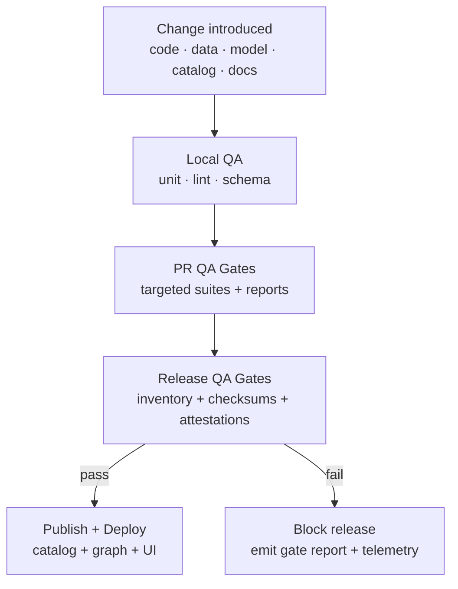

<div align="center">

# 🧪 QA Specs — Kansas Frontier Matrix (KFM)
`docs/specs/qa/README.md`


</div>

KFM is designed as a **matrix of interconnected components**: ETL → structured databases + knowledge graphs → simulations/ML → API → a map/story-driven UI. QA exists to keep that entire chain **evidence-backed, reproducible, and governed**. :contentReference[oaicite:0]{index=0}

> ✅ **Rule of thumb:** If something can influence a map layer, a Story Node, a model output, or a decision-support narrative… it must be testable, traceable, and releasable with evidence.

---

## 🧭 Navigation

- **Specs (this folder):** what “good” means (requirements + gates) ✅  
- **Reports (machine outputs):** what actually happened (logs + evidence) 🧾  
- **Releases:** what shipped (inventory + checksums + attestations) 📦  

Suggested links (adjust paths to your repo conventions):
- 📦 `docs/reports/` (evidence outputs) :contentReference[oaicite:1]{index=1}
- 🌐 `data/` or `data/stac/` (catalogs + tiles)
- 🧠 `models/` (model registry + artifacts)
- 🔐 `docs/security/` (supply chain + policy gates)
- 🧾 `docs/standards/governance/` (council + review rules)

---

## 🧱 Scope

This README defines **how QA works in KFM**, and how to extend it safely. It covers:

- 🗃️ **Data QA** (schema, completeness, drift, provenance)
- 🗺️ **Geospatial QA** (CRS/tiling, spatial correctness, cartographic clarity)
- 🧾 **STAC/DCAT/PROV QA** (catalog integrity, link health, metadata alignment)
- 🧠 **Knowledge Graph QA** (Neo4j consistency + semantic constraints)
- 🤖 **ML/AI QA** (fairness, evaluation, “no hallucination” posture, model cards)
- 🎛️ **Simulation QA** (verification, validation, uncertainty)
- 🖥️ **UI/Visualization QA** (WebGL/map rendering, responsive behavior, visual assets)
- 🔐 **Security & Supply Chain QA** (SBOM, signing, attestations, policy gates)
- 📚 **Docs QA** (linting, accessibility, governance metadata)

KFM’s mission emphasis on transparency, open standards, and community engagement means QA is not just “tests” — it’s also **auditability and accountability**. :contentReference[oaicite:2]{index=2}

---

## 📌 QA vocabulary

We use RFC‑style keywords:

- **MUST** = required for merge / release
- **SHOULD** = expected unless there’s a documented exception
- **MAY** = optional / experimental

Core definitions:

- **Verification:** “Did we build it right?” (correctness against the spec)
- **Validation:** “Did we build the right thing?” (fitness for the real-world use)
- **Evidence bundle:** the files proving integrity + provenance (reports, checksums, SBOM, attestations)
- **Governed artifact:** anything that can be promoted into a release and referenced by Story Nodes, maps, or Focus Mode outputs

---

## 🧩 QA architecture at a glance



This mirrors KFM’s posture that outputs must be **evidence-backed** and **policy gated** before promotion. :contentReference[oaicite:3]{index=3}

---

## 🚦 QA gates

### 1) Local developer gates (fast feedback) 🏎️
Minimum expectations:
- ✅ unit tests / smoke tests
- ✅ lint + formatting
- ✅ schema validation for edited JSON/YAML
- ✅ deterministic outputs where relevant (pinned configs, fixed seeds for experiments)

### 2) PR gates (merge protection) 🧱
PRs MUST:
- produce machine-readable QA results (reports/logs)
- fail fast on breaking schema/catalog issues
- never “hide” failing checks behind optional-only workflows

### 3) Release gates (governed artifacts) 📦
A governed release SHOULD include an inventory + SBOM + attestations (and signature evidence). :contentReference[oaicite:4]{index=4}

When a release includes catalogs, treat them as first-class release artifacts:
- catalogs **MUST** be included in the manifest inventory
- catalogs **SHOULD** be referenced by provenance attestations :contentReference[oaicite:5]{index=5}

### 4) Deploy gates (policy enforcement) 🔐
For governed artifacts, KFM’s policy posture is that signing/verifying is a gating mechanism, not a “nice to have”:
- “Sigstore is not optional” for governed artifacts :contentReference[oaicite:6]{index=6}

---

## 🧩 QA domains

### 🗃️ Data QA (tabular · events · time series)
**Goal:** prevent silent corruption, drift, and irreproducible data products.

**MUST checks**
- Schema validation (types, required fields)
- Completeness thresholds (non-null, coverage)
- Drift detection (distribution shifts, new categories)
- Provenance fields present (source, timestamps, run_id / commit SHA where applicable)

**Evidence**
- Versioned validation outputs under `docs/reports/self-validation/...` (stac, fair, docs, security, experiments, sop). :contentReference[oaicite:7]{index=7}

**Governance**
- Retention SHOULD be permanent per release, with checksum verification recorded in SBOM and quarterly governance review. :contentReference[oaicite:8]{index=8}

---

### 🗺️ Geospatial QA (vector · raster · tiles)
KFM is spatially centered and uses PostGIS as a primary spatial store/query engine. :contentReference[oaicite:9]{index=9}

**MUST checks**
- CRS correctness + explicit `proj:*` / spatial metadata (where applicable)
- Tile boundaries and grid alignment (no overlaps/gaps unless intended)
- Geometry validity (no self-intersections, invalid rings)
- Raster integrity: COG compliance (if using COGs), nodata rules, extent coverage

**SHOULD checks**
- Spatial query sanity checks (spot-check buffer/within behavior and expected counts)
- Render sanity (no “inside-out” polygons, antimeridian issues if relevant)

**Notes**
- Use standard spatial query semantics and SQL-based queries for attribute + spatial filtering (per the GIS/data reference shelf). :contentReference[oaicite:10]{index=10}

---

### 🧾 Catalog QA (STAC · DCAT · PROV)
**Goal:** catalogs must be federatable, indexable, and integrity-linked.

#### ✅ “Quick Gate” (fast CI guardrail)
A minimal catalog QA should validate every `collection.json` (and root `catalog.json`) for required fields:
- `license` (non-empty string)
- `providers` (non-empty array)
- `stac_extensions` (array; warn if empty, fail if missing)
…and link-check top-level `links[].href`. :contentReference[oaicite:11]{index=11}

Reference implementation path (example):
- `tools/validation/catalog_qa/run_catalog_qa.py` :contentReference[oaicite:12]{index=12}

#### 🧾 Metadata alignment
STAC entities SHOULD carry DCAT fields and PROV-O lineage fields for reproducibility and governance alignment. :contentReference[oaicite:13]{index=13}

#### 🔗 Integrity evidence in catalogs
Recommended patterns:
- assets include checksums (or sidecars)
- catalogs reference attestations where feasible :contentReference[oaicite:14]{index=14}

---

### 🧠 Knowledge Graph QA (Neo4j)
KFM builds knowledge graph entities from ingested data; hazards are explicitly described as graph nodes synced into Neo4j. :contentReference[oaicite:15]{index=15}

**MUST checks**
- Node ID uniqueness and stable identity rules
- Relationship cardinality rules (no orphan nodes where forbidden)
- Consistency between STAC IDs ↔ graph nodes (round-trip references)
- Provenance links present for graph-imported entities

**SHOULD checks**
- Ontology constraints for temporal/spatial reasoning when used (e.g., consistent time intervals and geometry bindings)

---

### 🧯 Hazard + resilience QA (ETL + narrative surfaces)
KFM describes a “Hazards Refresh pipeline (v11)” that runs daily/on-demand, pulls multiple sources, normalizes, builds STAC Items, validates checksums, and syncs to Neo4j. :contentReference[oaicite:16]{index=16}

**MUST checks**
- Freshness windows (did we ingest updates?)
- Checksum validation for ingested outputs
- STAC Items generated for new/updated events
- Graph sync is consistent (no duplicates, no missing references)

**SHOULD checks**
- Summary product sanity checks (seasonal composites, clustering outputs) when generated
- “Active / Enforced” pipelines must fail loudly on broken upstream sources (no silent skip)

---

### 💧 Hydrology + visualization asset QA (symbols, legends, overlays)
Visualization “assets” (icons, legends, symbol definitions) are first-class because they directly affect interpretation.

Example requirements described for legend/symbol metadata include:
- JSON schema validation
- file-path existence checks (SVG/PNG)
- STAC validation
- Story Node binding validation
- CARE label compliance checks
- local runner examples (e.g., `make test-legends-landcover`) :contentReference[oaicite:17]{index=17}

Hydrology legend docs also connect symbols to MapLibre layers and STAC publishing, so they need the same integrity posture as data outputs. :contentReference[oaicite:18]{index=18}

---

### 🤖 ML / AI QA (Focus Mode + predictive models)
KFM’s design explicitly frames AI as **advisory**, with guardrails:
- Focus Mode provides suggestions/narratives but does not take actions without oversight
- fairness checks and bias monitoring are part of model validation
- content filters align with CARE principles
- “no freeform hallucination” posture is expected, with citations/explanations where possible :contentReference[oaicite:19]{index=19}

**MUST checks**
- Reproducible training (inputs snapshot + config pinned + commit SHA recorded)
- Evaluation thresholds defined and enforced
- Bias/fairness checks where applicable
- Model card produced for any model promoted beyond experimental

**SHOULD checks**
- Canary evaluation before alias swap
- Rollback rehearsal (alias revert, lineage pointer rollback)

A minimal ML promotion checklist pattern (pre-flight → evaluation → promotion) is already described as a high-ROI practice. :contentReference[oaicite:20]{index=20}

---

### 🎛️ Modeling & simulation QA
**Goal:** “NASA-grade” modeling posture: credibility comes from verification, validation, and uncertainty discipline.

**MUST checks (for any simulation shipped as a product)**
- Verification: solver correctness (units, boundary conditions, convergence)
- Validation: compare against known data/benchmarks
- Sensitivity/uncertainty: document what parameters matter and where uncertainty dominates
- Reproducibility: pinned inputs + versioned model configuration

**SHOULD checks**
- Regression tests on canonical scenarios
- “Mesh/time-step independence” where relevant (esp. optimization + PDE sims)

> Tip: keep simulation QA evidence in the same “governed artifact” lane as catalogs/models (manifest + checksums + attestations).

---

### 🖥️ UI & visualization QA (WebGL · maps · responsive)
KFM’s front-end is mission-critical for trust: map layers, Story Nodes, timelines, and analytics must be consistent and interpretable.

**MUST checks**
- Cross-browser smoke tests for critical routes (map, story, search)
- Responsive breakpoints and input modes (mouse/touch)
- WebGL stability checks (context loss handling, GPU fallback messaging)
- Accessibility checks where feasible (keyboard nav, contrast, alt text for key visuals)

**SHOULD checks**
- Visual regression tests for core map styles (legend + symbols)
- Performance budgets (fps targets on representative hardware)

---

### 🔐 Security & supply chain QA (SBOM · signing · policy gates)
KFM’s governance posture assumes supply-chain risk: artifact substitution, provenance spoofing, dependency compromise, and silent drift. :contentReference[oaicite:21]{index=21}

**MUST checks (governed artifacts)**
- SBOM generated and referenced (e.g., SPDX)
- All governed artifacts are checksum-inventoried
- Provenance attestations reference the checksums they claim to build :contentReference[oaicite:22]{index=22}
- Sign and verify by digest; enforce policy at release/deploy gates :contentReference[oaicite:23]{index=23}

**SHOULD checks**
- Dependency scanning + secret scanning
- Threat modeling reviews for new external integrations

> ⚠️ Note: Security references in this repo include offensive-security material (for defensive education). Keep usage strictly ethical and policy-aligned.

---

### 📚 Docs & accessibility QA
Docs are part of the product surface (onboarding, governance, reproducibility).

**MUST checks**
- Markdown lint + basic link checks
- Required front matter (title/path/version/owners) for governed docs
- No secrets or sensitive URLs in docs examples

**SHOULD checks**
- Mermaid diagram parse validation
- Consistent heading structure

---

## ✅ Definition of Done (DoD)

### 🧑‍💻 PR DoD (code/docs)
- [ ] Unit/integration tests pass
- [ ] Lint/format passes
- [ ] No schema breaks (JSON/YAML/metadata)
- [ ] If user-facing: minimal docs update included
- [ ] If it changes a governed artifact: evidence/report path is updated or produced

### 📦 Data/catalog DoD
- [ ] STAC/DCAT quick gate passes (`license`, `providers`, `stac_extensions`, link health) :contentReference[oaicite:24]{index=24}
- [ ] Checksums recorded for outputs (and referenced in manifests where applicable)
- [ ] Provenance links included (inputs, config, run metadata)

### 🤖 Model DoD
- [ ] Inputs snapshotted + checksummed
- [ ] Evaluation meets thresholds
- [ ] Canary (if applicable) is stable
- [ ] Model card exists
- [ ] Rollback path is verified :contentReference[oaicite:25]{index=25}

---

## 🧰 Adding a new QA suite (pattern)

When introducing a new QA suite:
1) 📄 Add a spec file under `docs/specs/qa/suites/<suite_name>.md`  
2) 🧪 Add a runnable entrypoint under `tools/validation/<suite_name>/...`  
3) 🧾 Ensure CI produces reports under `docs/reports/self-validation/<suite_name>/...` (mirroring existing categories) :contentReference[oaicite:26]{index=26}  
4) 🔐 If governed: include artifacts in release inventory + attestations + signatures :contentReference[oaicite:27]{index=27}  
5) 🧭 Update this README with the suite’s scope + gates

Suggested folder layout (create as needed):

```text
docs/specs/qa/
├── README.md
├── 🧾 suites/
│   ├── stac-dcat-proc.md
│   ├── graph-neo4j.md
│   ├── geospatial-crs-tiles.md
│   ├── ml-model-promotion.md
│   ├── ui-visual-regression.md
│   └── supply-chain-signing.md
├── ✅ checklists/
│   ├── pr-gate.md
│   ├── dataset-ingest.md
│   ├── model-release.md
│   └── ui-release.md
├── 🧩 templates/
│   ├── qa-suite.template.md
│   ├── qa-report.template.md
│   └── model-card.template.md
└── 📟 runbooks/
    ├── incident-triage.md
    └── rollback.md
```

---

## 📦 Evidence & reports (where the truth lives)

Machine-generated compliance evidence should be versioned and organized by category, with self-validation outputs separated (stac, fair, docs, security, experiments, sop). :contentReference[oaicite:28]{index=28}

Retention/governance posture (example policy):
- Permanent archival per release
- JSON/NDJSON outputs
- SHA‑256 recorded in SBOM
- Quarterly FAIR+CARE council review :contentReference[oaicite:29]{index=29}

---

## 📚 Reference shelf (project files → QA leverage map)

Below is the “why we trust this QA philosophy” shelf. Use it when designing new suites, thresholds, and evidence artifacts.

### 🔗 Quick links to key uploaded references (with citations)
- 📘 Implementing Programming Languages — compilation/semantics QA patterns :contentReference[oaicite:30]{index=30}  
- 🐚 Bash Notes for Professionals — automation + scripting QA patterns :contentReference[oaicite:31]{index=31}  
- 📈 Regression Analysis with Python — statistical model QA & diagnostics :contentReference[oaicite:32]{index=32}  
- 📊 Graphical Data Analysis with R — EDA QA, outliers, residual intuition :contentReference[oaicite:33]{index=33}  
- 🧠 Introduction to Digital Humanism — human-centered QA, ethics framing :contentReference[oaicite:34]{index=34}  
- 🧪 Understanding Statistics & Experimental Design — DoE, reproducibility norms :contentReference[oaicite:35]{index=35}  
- 🤖 Understanding Machine Learning — generalization, bias/variance QA reasoning :contentReference[oaicite:36]{index=36}  
- 📉 Regression slides (linear regression) — practical regression assumption checks :contentReference[oaicite:37]{index=37}  
- 🧱 Scalable Data Management for Future Hardware — performance/scalability QA mindset :contentReference[oaicite:38]{index=38}  
- 🎲 Think Bayes — uncertainty + Bayesian calibration QA :contentReference[oaicite:39]{index=39}  
- 🧬 Principles of Biological Autonomy — resilience/autonomy metaphors for system QA :contentReference[oaicite:40]{index=40}  
- 🧯 Gray Hat Python — security review awareness (defensive use only) :contentReference[oaicite:41]{index=41}  
- 🔐 Ethical Hacking & Countermeasures — secure infra QA mindset :contentReference[oaicite:42]{index=42}  
- ⚖️ On the path to AI Law… — governance/legal QA considerations :contentReference[oaicite:43]{index=43}  
- 🧠 Latest Ideas (KFM) — QA patterns, catalog gates, signing/attestation concepts :contentReference[oaicite:44]{index=44}  
- 🗂️ Other Ideas (KFM) — evidence/report architecture + retention/governance patterns :contentReference[oaicite:45]{index=45}  

### 📦 Additional repo library (uploaded)
Use these to deepen domain QA suites (listed here so every QA effort “pulls from the same shelf”):

- 🛰️ **Remote sensing + GIS**
  - Cloud-Based Remote Sensing with Google Earth Engine — reproducible EO pipelines
  - Python Geospatial Analysis Cookbook — geospatial processing correctness
  - Making Maps (GIS cartography) — symbol clarity, map legibility QA
  - Mobile Mapping: Space, Cartography and the Digital — mobile UX + map interpretation QA

- 🗃️ **Databases + architecture**
  - PostgreSQL Notes for Professionals — DB correctness, migrations, indexing QA
  - Data Spaces — interoperability + cross-system data contracts QA
  - Scalable Data Management for Future Hardware — throughput/latency & heterogeneity awareness (pairs well with performance budgets)

- 🖥️ **Web + visualization**
  - Responsive Web Design (HTML5/CSS3) — responsive + accessibility QA
  - WebGL Programming Guide — GPU rendering QA and failure modes
  - Compressed Image File Formats — asset pipeline QA (JPEG/PNG/GIF tradeoffs)

- 🎛️ **Modeling + simulation + math**
  - Scientific Modeling and Simulation (NASA-grade) — V&V + UQ discipline
  - Generalized Topology Optimization for Structural Design — optimization convergence QA
  - Spectral Geometry of Graphs — graph algorithm QA via spectral invariants
  - Basics of Linear Algebra for Machine Learning — numerical stability + feature-space QA

- 🛠️ **Programming compendia (language-specific QA patterns)**
  - A programming Books.pdf · B-C programming Books.pdf · D-E programming Books.pdf
  - F-H programming Books.pdf · I-L programming Books.pdf · M-N programming Books.pdf
  - O-R programming Books.pdf · S-T programming Books.pdf · U-X programming Books.pdf
  - Concurrent Real-Time and Distributed Programming in Java — concurrency + timing QA

> 📌 Intent: we don’t “copy rules” from a single book. We build **KFM-specific gates** informed by proven engineering practices across simulation, statistics, security, GIS, and web systems.

---

## 🗂️ Glossary (KFM-leaning)
- **STAC:** SpatioTemporal Asset Catalog (data discovery + structure)
- **DCAT:** Data Catalog Vocabulary (metadata interoperability)
- **PROV-O:** W3C provenance model (lineage)
- **SBOM:** Software Bill of Materials (supply chain transparency)
- **SLSA/Sigstore/Cosign:** supply-chain integrity patterns (sign/attest/verify) :contentReference[oaicite:46]{index=46}
- **Story Nodes:** narrative entities tied to data/graph evidence; MUST not reference unverifiable artifacts :contentReference[oaicite:47]{index=47}

---

<div align="center">

### 🧩 Footer
Designed for Longevity · Governed for Integrity · Built for Kansas 🌾

</div>

