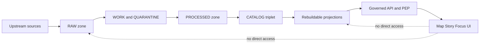

<!-- [KFM_META_BLOCK_V2]
doc_id: kfm://doc/1d6a8f65-6c9f-4f9c-8f5b-63d3c0fd2b4a
title: Storage Specs
type: standard
version: v1
status: draft
owners: ["@Kansas-Frontier-Matrix/core", "@Kansas-Frontier-Matrix/data", "@Kansas-Frontier-Matrix/infra"]
created: 2026-03-04
updated: 2026-03-04
policy_label: public
related: ["docs/specs/data/README.md", "docs/specs/catalog/README.md", "docs/specs/security/README.md", "docs/governance/ROOT_GOVERNANCE.md"]
tags: ["kfm", "storage", "specs", "promotion-contract", "catalog-triplet"]
notes: ["Index + conventions for canonical storage (truth path) and rebuildable projection stores. All access is mediated by the governed API + policy boundary."]
[/KFM_META_BLOCK_V2] -->

# Storage Specs
Storage conventions for KFM’s **truth path** (RAW → WORK/QUARANTINE → PROCESSED → CATALOG → PUBLISHED) and the **projection stores** that are rebuilt from canonical artifacts.

---

## Impact
**Status:** `experimental` (spec index; safe to edit)  
**Owners:** `@Kansas-Frontier-Matrix/data` + `@Kansas-Frontier-Matrix/infra`  
**Policy posture:** fail-closed, evidence-first, governed access only

**Badges (TODO):**
- 
- 
- 
- 

**Quick nav:**
- [Scope](#scope)
- [Where it fits](#where-it-fits)
- [Non-negotiable invariants](#non-negotiable-invariants)
- [Storage surfaces matrix](#storage-surfaces-matrix)
- [Zones and promotion lifecycle](#zones-and-promotion-lifecycle)
- [Access patterns](#access-patterns)
- [Quickstart](#quickstart)
- [Directory tree](#directory-tree)
- [Definition of done](#definition-of-done)
- [FAQ](#faq)
- [Appendix](#appendix)

---

## Scope

**PROPOSED:** This folder is the **index** for storage-related specs (object storage layout, catalogs persistence, receipts/audit, backups, retention, and registry-based artifact distribution).  
**PROPOSED:** It documents storage **contracts** that enable CI gates and runtime policy enforcement.

**Acceptable inputs (what belongs here)**
- **PROPOSED:** Storage contracts and conventions (paths, key structure, naming, addressing, digest rules).
- **PROPOSED:** Operational guidance for storage backends (backup/restore, retention, disaster recovery).
- **PROPOSED:** Access control + policy boundary requirements specific to storage.

**Exclusions (what must not go here)**
- **CONFIRMED:** “UI reads storage directly” patterns (forbidden by the trust membrane). Put UI needs in `docs/specs/ui/` and keep access via governed APIs only.
- **PROPOSED:** Detailed connector logic and ETL orchestration (belongs in `docs/specs/ingest/` or pipeline docs).
- **PROPOSED:** Dataset-specific schemas (belongs in `contracts/` or dataset registries).

[Back to top](#storage-specs)

---

## Evidence labels

KFM docs use a strict label discipline:

- **CONFIRMED** — supported by existing KFM documents and treated as a must-not-break invariant.
- **PROPOSED** — recommended design; adopt only when implemented + validated.
- **UNKNOWN** — not yet verified in the live repo/environment; includes minimal verification steps.

[Back to top](#storage-specs)

---

## Where it fits

**CONFIRMED:** Storage sits behind the **policy boundary** and is accessed only via the **governed API / Policy Enforcement Point (PEP)**.  
**CONFIRMED:** Canonical storage is the source of truth; databases and indexes are **rebuildable projections**.

**PROPOSED repo navigation**
- Upstream/downstream: `connectors → zones → catalogs/receipts → projections → governed API → UI (Map/Story/Focus)`
- Related specs:
  - `docs/specs/catalog/` (DCAT/STAC/PROV rules)
  - `docs/specs/policy/` (OPA/Rego evaluation rules)
  - `docs/specs/security/` (supply chain + access control)
  - `docs/specs/qa/` (validation thresholds + evidence checks)

**UNKNOWN:** Exact folder paths in the live repo may differ.  
**Verification steps:** `ls docs/specs` and confirm adjacent specs folders; update links accordingly.

[Back to top](#storage-specs)

---

## Non-negotiable invariants

**CONFIRMED:** **Truth path lifecycle** is enforced as storage zones + validation gates (not a metaphor).  
**CONFIRMED:** **Trust membrane**: clients never access storage/DB directly; backends use repository interfaces; policy is evaluated at the PEP.  
**CONFIRMED:** **Canonical vs rebuildable**: object store + catalogs + provenance/receipts are canonical; PostGIS/Neo4j/search/tiles are rebuildable projections.  
**CONFIRMED:** **Deterministic identity**: dataset/version identity derives from stable canonical hashing (e.g., canonical JSON hashing) to support signing/caching.

[Back to top](#storage-specs)

---

## Storage surfaces matrix

The goal of this matrix is to keep “what is canonical” unambiguous.

| Surface | Canonical? | What belongs here | Write authority | Read authority |
|---|---:|---|---|---|
| Object store: RAW/WORK/PROCESSED | ✅ | Source snapshots, transforms, publishable artifacts, checksums | Pipelines only (connectors/indexers) | Governed API only |
| Catalogs: DCAT/STAC/PROV triplet | ✅ | Dataset metadata + asset metadata + lineage bundles | Pipelines only (post-validation) | Governed API + Evidence Resolver |
| Audit: run receipts + manifests | ✅ | Run receipts, policy decisions, tool versions, hashes | Pipelines + CI | Governed API + audit tooling |
| PostGIS | ❌ | Rebuildable query-optimized spatial tables | Index builders | Governed API only |
| Neo4j | ❌ | Rebuildable entity/relationship projection | Graph builders | Governed API only |
| Search / vector index | ❌ | Rebuildable search and retrieval indexes | Index builders | Governed API only |
| Tile cache / tile store | ❌ | Rebuildable map-serving outputs | Tile builders | Governed API only |
| OCI registry (ORAS artifacts) | ⚠️ (PROPOSED) | Digest-addressed bundles (PMTiles/COG/GeoParquet) + referrers | CI publish job | Governed API (or controlled gateways) |

**UNKNOWN:** Which exact products/backends are used per environment (S3 vs MinIO, Elastic vs OpenSearch, etc.).  
**Verification steps:** check `infra/` manifests, Helm charts, or `.env` templates.

[Back to top](#storage-specs)

---

## Zones and promotion lifecycle

### Zone semantics

**CONFIRMED:** `RAW` is **immutable** and **append-only**; do not edit RAW—supersede with a new acquisition.  
**CONFIRMED:** `WORK/QUARANTINE` is where transforms + QA happen; quarantine blocks promotion.  
**CONFIRMED:** `PROCESSED` holds publishable artifacts in approved formats (e.g., GeoParquet, PMTiles, COG) with checksums.  
**CONFIRMED:** `CATALOG` is the cross-linked **DCAT + STAC + PROV** “triplet” (plus receipts) that makes evidence resolvable.  
**CONFIRMED:** `PUBLISHED` is a governed runtime surface; only promoted dataset versions may be served.

### Promotion Contract gates

**CONFIRMED:** Promotion to PUBLISHED is blocked unless minimum gates are met; the gates are designed to be CI-automatable.

| Gate | Must exist (minimum) | Typical evidence artifact |
|---|---|---|
| Identity & versioning | dataset_id + dataset_version_id; deterministic spec_hash; content digests | release manifest + digests |
| Licensing & rights | explicit license/rights + upstream terms snapshot | rights block in DCAT + terms snapshot |
| Sensitivity & redaction | policy_label + obligations when needed | policy decision record + PROV notes |
| Catalog triplet validation | DCAT/STAC/PROV validate and cross-link; EvidenceRefs resolve | linkcheck output |
| QA thresholds | dataset QA report + thresholds met | QA report in WORK/PROCESSED |
| Run receipt & audit | receipt enumerating inputs/outputs + hashes + policy decisions | run_receipt.json |
| Release manifest | promotion recorded + references to immutable artifacts | manifest JSON |

[Back to top](#storage-specs)

---

## Access patterns

**CONFIRMED:** Storage is not a public API; it is a substrate behind the PEP.  
**PROPOSED:** Separate “write identities” (pipelines/CI) from “read identities” (API) with least privilege.

**PROPOSED read/write rules**
- Writes:
  - Pipelines may write only to their target zones (RAW and WORK always; PROCESSED/CATALOG only after validations).
  - CI may write only attestations, release manifests, and catalog updates.
- Reads:
  - UI/clients read via governed API only.
  - API reads canonical artifacts, then may read projections for performance.

**PROPOSED:** Prefer “immutable addressing” (digest refs, version IDs) for anything that becomes evidence.

[Back to top](#storage-specs)

---

## Quickstart

> This section is intentionally minimal: it’s a **smoke test** for “canonical artifact + digest + receipt.”

### Option A — local object store smoke test (MinIO via Docker)

**PROPOSED prerequisites:** Docker installed.

```bash
# Start MinIO (dev only)
docker run --rm -p 9000:9000 -p 9001:9001 \
  -e "MINIO_ROOT_USER=minioadmin" \
  -e "MINIO_ROOT_PASSWORD=minioadmin" \
  -v "$(pwd)/.minio:/data" \
  minio/minio server /data --console-address ":9001"
```

**PROPOSED:** Create a bucket and upload one file using your preferred S3 client (`mc`, `aws s3`, etc.).  
**UNKNOWN:** Which client is standardized in-repo.  
**Verification steps:** search `tools/` and `docs/` for “minio”, “mc”, or “aws s3”.

### Option B — digest + receipt (single file)

```bash
# Create a deterministic sample artifact
printf "kfm-storage-smoke\n" > artifact.txt

# Compute digest
sha256sum artifact.txt | tee artifact.txt.sha256
DIGEST="$(cut -d' ' -f1 artifact.txt.sha256)"

# Write a minimal run receipt (example shape; adapt to the real receipt schema)
cat > run_receipt.json <<EOF
{
  "dataset_id": "fixtures.storage_smoke",
  "dataset_version_id": "dev",
  "spec_hash": "UNKNOWN",
  "outputs": [
    {"path": "artifact.txt", "sha256": "${DIGEST}"}
  ],
  "policy": {"decision": "block", "reason": "dev smoke test"}
}
EOF
```

**PROPOSED:** Add a CI gate later that fails closed if `outputs[].sha256` is missing and if the receipt schema is invalid.

[Back to top](#storage-specs)

---

## Directory tree

**PROPOSED** shape for this directory (spec index + leaf specs):

```text
docs/specs/storage/
  README.md
  STORAGE__SURFACES.md                 # canonical vs rebuildable, backends, responsibilities
  STORAGE__ZONES_AND_PATHS.md          # object key conventions per zone
  STORAGE__NAMING_AND_IDS.md           # dataset_id, dataset_version_id, spec_hash, digest rules
  STORAGE__RECEIPTS_AND_AUDIT.md       # run receipts, release manifests, append-only audit trails
  STORAGE__SECURITY_AND_ACCESS.md      # IAM/RBAC, encryption, signed URLs, boundary tests
  STORAGE__BACKUP_AND_RESTORE.md       # RPO/RTO assumptions, restore runbooks
  STORAGE__RETENTION_AND_PURGE.md      # retention schedules, legal holds, purge mechanics
  STORAGE__OCI_ARTIFACTS.md            # ORAS/Cosign pattern for artifact distribution (optional)
```

**UNKNOWN:** Which of these files already exist.  
**Verification steps:** `find docs/specs/storage -maxdepth 1 -type f -print`

[Back to top](#storage-specs)

---

## Diagram



**CONFIRMED:** The “no direct access” edges are the trust membrane boundary.

[Back to top](#storage-specs)

---

## Definition of done

A storage spec set is “done” only when it is enforceable in CI and runtime.

### Required gates for this folder

- [ ] **CONFIRMED intent:** Storage surfaces labeled canonical vs rebuildable and reflected in policy and docs.
- [ ] **PROPOSED:** Receipt schema and release-manifest schema exist in `contracts/`.
- [ ] **PROPOSED:** CI checks fail closed when catalogs/receipts/digests are missing.
- [ ] **PROPOSED:** Backup + restore runbook exists for each canonical surface.
- [ ] **PROPOSED:** “No direct storage access” invariant is tested (API-only access).

[Back to top](#storage-specs)

---

## FAQ

**Why call object storage + catalogs “canonical”?**  
**CONFIRMED:** Because it preserves the “truth path” and enables audit/rebuild of projections.

**Can we edit RAW to fix mistakes?**  
**CONFIRMED:** No. RAW is append-only; supersede with a new acquisition.

**Where do PostGIS/Neo4j fit?**  
**CONFIRMED:** They are projections for performance and query UX; they can be rebuilt from canonical artifacts.

**Do we have to use OCI registries for data?**  
**PROPOSED:** No. OCI is optional; it’s a useful distribution channel when you want digest-addressed artifacts with signatures and referrers.

[Back to top](#storage-specs)

---

## Appendix

<details>
<summary>Appendix A — Minimal verification steps (avoid overclaiming)</summary>

- Confirm “what exists”:
  - `find docs/specs/storage -maxdepth 1 -type f`
  - `find data -maxdepth 2 -type d` (if a `data/` folder exists)
- Confirm “what is canonical”:
  - Identify the object store bucket(s) and catalog paths used by pipelines
  - Ensure DBs/indexes can be dropped and rebuilt without loss of truth
- Confirm “no direct access”:
  - Search UI code for storage endpoints/credentials
  - Add an e2e test that fails if UI can fetch storage objects without the API

</details>

<details>
<summary>Appendix B — Glossary</summary>

- **PEP:** Policy Enforcement Point (the gate where requests are evaluated).
- **Receipt:** A run record that enumerates inputs/outputs, hashes, policy decisions, and tool versions.
- **Triplet:** The cross-linked catalogs DCAT + STAC + PROV.
- **Projection:** A derived, query-optimized store rebuilt from canonical artifacts (DB/index/tiles).

</details>

---

## References (repo-local)

**UNKNOWN:** Update these links to match the live repo layout.
- `docs/specs/catalog/README.md`
- `docs/specs/policy/README.md`
- `docs/specs/security/README.md`
