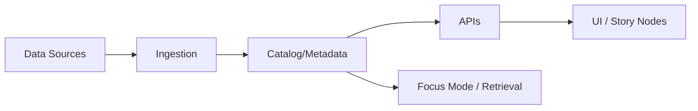
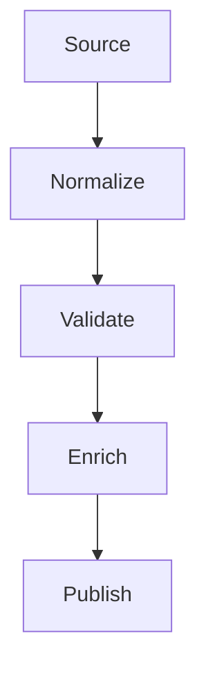

# 📦 `docs/specs/templates` — Specs, RFCs, ADRs & Protocols for KFM


-6f42c1?style=for-the-badge)


> 🧠 **What this folder is:** a copy/paste “template kit” to make KFM docs reviewable, testable, and machine-usable (Focus Mode / retrieval ready).  
> 🧭 **What it is not:** “random notes.” Notes belong in `docs/notes/` or `ideas/` until promoted.

---

## 🧭 Quick navigation

- [✅ Quick start](#-quick-start)
- [🧩 Which template should I use?](#-which-template-should-i-use)
- [📁 Recommended docs tree](#-recommended-docs-tree)
- [🧱 House rules](#-house-rules)
- [🏷️ Standard doc front matter](#️-standard-doc-front-matter)
- [🧰 Template library](#-template-library)
- [✅ Definition-of-done checklists](#-definition-of-done-checklists)
- [🗺️ KFM glossary](#️-kfm-glossary)
- [📚 Source-to-template matrix](#-source-to-template-matrix)
- [🧩 Add / change a template](#-add--change-a-template)

---

## ✅ Quick start

1) **Pick** the doc type from the chooser below  
2) **Copy** the template block (or the future `TEMPLATE__*.md` file)  
3) **Fill** the YAML front matter + required sections  
4) **Link** related specs / ADRs / datasets / code  
5) **Open a PR** and request review ✅

> Tip 🧠: If a doc will shape APIs, data contracts, governance, or UI behavior, it **must** be promoted from “idea” to a governed spec.

---

## 🧩 Which template should I use?

| You are doing… | Use… | Output lives in… |
|---|---|---|
| Making a major design proposal | 📄 **SPEC** | `docs/specs/<domain>/YYYY-MM-DD__title.md` |
| Recording an irreversible decision | 🧾 **ADR** | `docs/adr/ADR-####__title.md` |
| Running a scientific test / benchmark | 🧪 **EXPERIMENT** | `docs/experiments/YYYY-MM-DD__title.md` |
| Defining a geospatial dataset / layer | 🗺️ **DATASET** | `docs/data/<dataset-id>/README.md` |
| Defining an ETL/stream pipeline | 🧵 **PIPELINE** | `docs/pipelines/<pipeline-id>.md` |
| Shipping a model (ML/AI) | 🧠 **MODEL CARD** | `docs/ml/<model-id>/MODEL_CARD.md` |
| Building/validating a simulation model | 🛰️ **SIM MODEL** | `docs/sim/<model-id>/SPEC.md` |
| Designing a map/UI + WebGL/3D | 🎛️ **UI/VIS** | `docs/ui/<feature-id>.md` |
| Authoring a narrative “Story Node” | 🎬 **STORY NODE** | `docs/story-nodes/<node-id>.md` |
| Adding governed graph queries | 🧬 **GRAPH QUERY CONTRACT** | `docs/search/<system>/graph-queries/README.md` |
| Reviewing risk & security posture | 🔐 **SECURITY REVIEW** | `docs/security/reviews/<id>.md` |
| On-call & ops procedures | 🧯 **RUNBOOK** | `docs/runbooks/<service>.md` |
| Publishing a release / PR rollout | 🚀 **RELEASE/PR BLUEPRINT** | `.github/` + `docs/releases/` |
| Auditing gaps / backlog generation | 🕵️ **AUDIT FINDINGS** | `docs/audits/<id>.md` |

---

## 📁 Recommended docs tree

```text
📁 docs/
├─ 📁 specs/
│  ├─ 📁 templates/                 👈 you are here
│  ├─ 📁 architecture/
│  ├─ 📁 data/
│  ├─ 📁 pipelines/
│  ├─ 📁 ml/
│  ├─ 📁 sim/
│  ├─ 📁 ui/
│  └─ 📁 security/
├─ 📁 adr/
├─ 📁 experiments/
├─ 📁 runbooks/
├─ 📁 story-nodes/
├─ 📁 audits/
└─ 📁 library/                      📚 PDFs / references (internal)
   ├─ 📁 stats/
   ├─ 📁 modeling-sim/
   ├─ 📁 geospatial/
   ├─ 📁 data-systems/
   ├─ 📁 frontend/
   └─ 📁 security/
```

---

## 🧱 House rules

### 🔒 Governance “non-negotiables”
These apply anywhere we store governed queries, governed datasets, or governed retrieval behavior:

- ✅ **No unbounded traversal**: every graph query caps depth, fan-out, and result count.
- ✅ **No sensitive leakage**: do not store or return protected coordinates; do not enable re-identifying joins.
- ✅ **No string-concatenated queries**: parameterize inputs (Cypher/SQL/etc).
- ✅ **Deterministic ordering**: stable `ORDER BY` before stable `LIMIT`.
- ✅ **Policy gates are first-class**: sovereignty / rights outcomes must be visible + auditable.

> If you can’t meet these, write a spec explaining why and how risk is mitigated.

### 🧾 Evidence-first writing
- State **Goals** and **Non-goals** explicitly ✅  
- List **assumptions** (and how to validate them)  
- Attach **evidence** (links to data, code, tests, benchmarks)  
- Make uncertainty explicit (especially in ML + simulation)  
- Include a “How we know this works” section (tests + metrics)

### 🔁 Reproducibility defaults
Every doc that describes computation (pipelines, models, experiments, sims) must define:
- Runtime/environment capture (container, lockfile, versions)
- Seeds & deterministic modes
- Inputs/outputs + checksums where relevant
- A “rerun” command block (even if it’s a placeholder)

### 🧠 Machine-readability
Help Focus Mode / retrieval by keeping structure predictable:
- Use consistent headings
- Keep key identifiers stable (dataset IDs, model IDs, story node IDs)
- Put “References” in a single section near the end

---

## 🏷️ Standard doc front matter

Use this **YAML front matter** for any new spec-type doc:

```yaml
---
schema_version: 1
doc_type: spec            # spec | adr | experiment | dataset | pipeline | ui | sim | security | runbook | audit
status: draft             # draft | proposed | accepted | implemented | deprecated
title: "Short, specific title"
id: "kfm-<domain>-<slug>" # stable identifier (no spaces)
owners:
  - "@your-handle"
reviewers:
  - "@reviewer-handle"
created: "YYYY-MM-DD"
last_updated: "YYYY-MM-DD"
tags: ["kfm", "gis", "ml", "sim", "frontend", "security"]
related:
  - "docs/adr/ADR-0001__example.md"
  - "docs/specs/data/example.md"
---
```

> 🧩 Rule of thumb: if a doc has an `id`, it can be indexed, cited, and referenced by other systems.

---

## 🧰 Template library

> All templates below are “single-file friendly” for fast start.  
> Long-term, we should split these into actual files like `TEMPLATE__SPEC.md`, etc.

---

### 📄 TEMPLATE — Spec

<details>
<summary><strong>📄 TEMPLATE__SPEC.md (copy/paste)</strong></summary>

```markdown
---
schema_version: 1
doc_type: spec
status: draft
title: "..."
id: "kfm-..."
owners: ["@..."]
reviewers: ["@..."]
created: "YYYY-MM-DD"
last_updated: "YYYY-MM-DD"
tags: ["kfm", "..."]
related: []
---

# ✨ {Title}

## 0) Summary (5–10 lines)
What are we building and why now?

## 1) Problem statement
- What pain exists today?
- Who feels it (users, maintainers, pipeline operators)?
- What breaks if we do nothing?

## 2) Goals ✅
- [ ] Goal 1
- [ ] Goal 2

## 3) Non-goals 🚫
- [ ] Non-goal 1
- [ ] Non-goal 2

## 4) Scope & success metrics 📏
Define measurable outcomes (latency, accuracy, cost, adoption, coverage, etc.)

## 5) Constraints & assumptions 🧱
- Constraint:
- Assumption:
- How to validate:

## 6) Proposed design 🧩
### 6.1 Architecture overview
(Include a diagram if possible.)



### 6.2 Components
- Component A:
- Component B:

### 6.3 Data flow
- Inputs:
- Transforms:
- Outputs:

## 7) Data & metadata 🗺️
- Storage formats (COG/Parquet/GeoJSON/etc):
- CRS / projection:
- STAC/DCAT/PROV alignment:
- Provenance requirements:
- Data quality checks:

## 8) APIs & contracts 🔌
- Endpoints/events:
- AuthN/AuthZ:
- Versioning:
- Backwards compatibility:

## 9) UI/UX & visualization 🎛️
- Core interactions:
- Responsive behavior:
- Accessibility:
- Performance budgets:
- 2D/3D/WebGL considerations:

## 10) AI/ML & analytics (if relevant) 🧠
- Intended use / misuse:
- Training data sources:
- Evaluation plan:
- Safety & governance gates:
- Human-in-the-loop review:

## 11) Simulation & modeling (if relevant) 🛰️
- Model scope:
- Numerical approach:
- Verification & validation plan:
- Uncertainty quantification (UQ):

## 12) Security, privacy, and governance 🔐
- Data sensitivity classification:
- Threat model summary:
- Sovereignty/CARE considerations:
- Logging/telemetry + audit trail:

## 13) Performance & cost 💸
- Target throughput/latency:
- Expected scale:
- Cost estimate + levers:

## 14) Observability 📈
- Metrics:
- Logs:
- Traces:
- Dashboards:

## 15) Test plan 🧪
- Unit:
- Integration:
- End-to-end:
- Data validation tests:

## 16) Rollout plan 🚀
- Milestones:
- Feature flags:
- Migration steps:
- Rollback plan:

## 17) Risks & mitigations ⚠️
- Risk:
- Mitigation:

## 18) Open questions ❓
- [ ] Question 1
- [ ] Question 2

## 19) References 📚
- Source docs:
- Related specs:
- Datasets:
- Code links:
```

</details>

---

### 🧾 TEMPLATE — ADR

<details>
<summary><strong>🧾 TEMPLATE__ADR.md (copy/paste)</strong></summary>

```markdown
---
schema_version: 1
doc_type: adr
status: accepted   # draft | accepted | deprecated
title: "ADR-####: ..."
id: "adr-####"
owners: ["@..."]
created: "YYYY-MM-DD"
last_updated: "YYYY-MM-DD"
tags: ["kfm", "..."]
related: []
---

# 🧾 ADR-#### — {Decision title}

## Context
What led to this decision? Constraints? Alternatives?

## Decision
What we decided and why.

## Consequences
### Positive ✅
- ...

### Negative ⚠️
- ...

## Alternatives considered
- Option A:
- Option B:

## Follow-ups
- [ ] Task 1
- [ ] Task 2

## References
- Links to spec, PRs, discussions
```

</details>

---

### 🧪 TEMPLATE — Experiment (Scientific Method / MCP-style)

<details>
<summary><strong>🧪 TEMPLATE__EXPERIMENT.md (copy/paste)</strong></summary>

```markdown
---
schema_version: 1
doc_type: experiment
status: draft
title: "..."
id: "exp-YYYYMMDD-..."
owners: ["@..."]
created: "YYYY-MM-DD"
last_updated: "YYYY-MM-DD"
tags: ["kfm", "experiment", "..."]
related: []
---

# 🧪 {Experiment title}

## 1) Research question
One sentence question.

## 2) Background & rationale
Why this matters for KFM (and what decision it supports).

## 3) Hypothesis
- H0:
- H1:

## 4) Experimental design (stats + controls)
- Variables (independent/dependent):
- Controls/confounders:
- Randomization strategy:
- Power/sample size rationale (if applicable):
- Stopping rule:

## 5) Data & materials
- Datasets + versions:
- Preprocessing:
- Inclusion/exclusion criteria:

## 6) Procedure
Step-by-step method (high level, safe, reproducible).

## 7) Analysis plan
- Metrics:
- Statistical tests / intervals:
- Diagnostics (residuals, robustness checks):
- Bayesian plan (if used): priors + posterior predictive checks

## 8) Reproducibility checklist ✅
- [ ] Code version (commit hash):
- [ ] Environment (Docker/lockfile):
- [ ] Seeds + deterministic mode:
- [ ] Input hashes:
- [ ] Output artifacts stored:
- [ ] Rerun command included:

## 9) Results
- Tables/figures:
- Key findings:

## 10) Interpretation
What this means, and what it doesn’t.

## 11) Decision impact
What we will change/do based on this result.

## 12) Limitations
- ...

## 13) Next steps
- [ ] ...

## References
- ...
```

</details>

---

### 🗺️ TEMPLATE — Dataset / Layer Spec (STAC/DCAT/PROV-ready)

<details>
<summary><strong>🗺️ TEMPLATE__DATASET.md (copy/paste)</strong></summary>

```markdown
---
schema_version: 1
doc_type: dataset
status: draft
title: "Dataset: ..."
id: "data-..."
owners: ["@..."]
created: "YYYY-MM-DD"
last_updated: "YYYY-MM-DD"
tags: ["kfm", "geospatial", "stac", "..."]
related: []
---

# 🗺️ Dataset Spec — {dataset-id}

## 1) Overview
- What is this dataset/layer?
- Who uses it? (UI, Focus Mode, simulation, analytics)

## 2) Spatial & temporal characteristics
- Spatial extent:
- Temporal coverage:
- CRS / projection:
- Resolution / scale:
- Geometry type (raster/vector):

## 3) Schema
- Fields/bands:
- Units:
- Null/NoData conventions:

## 4) Storage & access
- Canonical storage format(s): (COG / Parquet / GeoJSON / Zarr / etc.)
- Partitioning strategy:
- Naming conventions:

## 5) Provenance & lineage (PROV)
- Source system:
- Ingestion method:
- Transform steps:
- Versioning strategy:

## 6) Metadata & cataloging (STAC/DCAT)
- STAC Collection:
- STAC Item patterns:
- DCAT fields (publisher, license, accessURL):

### STAC Item skeleton (example)
```json
{
  "type": "Feature",
  "stac_version": "1.0.0",
  "id": "<item-id>",
  "stac_extensions": [
    "https://stac-extensions.github.io/projection/v1.0.0/schema.json"
  ],
  "properties": {
    "datetime": "YYYY-MM-DDTHH:MM:SSZ",
    "proj:epsg": 4326
  },
  "geometry": null,
  "bbox": null,
  "assets": {
    "data": {
      "href": "<uri>",
      "type": "image/tiff; application=geotiff; profile=cloud-optimized"
    }
  }
}
```

## 7) Data quality & validation ✅
- Completeness checks:
- Range checks:
- Topology checks (vectors):
- Visual spot checks:
- Drift monitoring (if updated):

## 8) Governance & ethics 🔐
- License/rights:
- Sensitive attributes:
- CARE/sovereignty considerations:
- Redaction rules:

## 9) Operational details 🧯
- Update cadence:
- Owner/on-call:
- Failure modes:

## References
- Source docs / citations:
- Related pipelines:
```

</details>

---

### 🧵 TEMPLATE — Pipeline Spec (ETL / stream processing)

<details>
<summary><strong>🧵 TEMPLATE__PIPELINE.md (copy/paste)</strong></summary>

```markdown
---
schema_version: 1
doc_type: pipeline
status: draft
title: "Pipeline: ..."
id: "pipe-..."
owners: ["@..."]
created: "YYYY-MM-DD"
last_updated: "YYYY-MM-DD"
tags: ["kfm", "etl", "stream", "..."]
related: []
---

# 🧵 Pipeline Spec — {pipeline-id}

## 1) Purpose
What problem this pipeline solves.

## 2) Inputs & outputs
- Inputs (sources + formats):
- Outputs (datasets + formats):
- Contracts (schema/version):

## 3) Execution model
- Batch / streaming / hybrid:
- Schedule / triggers:
- Idempotency strategy:
- Windowing semantics (if streaming):
- State management:

## 4) Steps (logical DAG)
1. ...
2. ...



## 5) Performance & scaling
- Target throughput:
- Backpressure strategy:
- Parallelism / hardware assumptions:
- Cost controls:

## 6) Observability 📈
- Key metrics:
- Logging events:
- Alerts:
- Dashboards:

## 7) Failure handling 🧯
- Retries:
- Dead-letter strategy:
- Partial failure behavior:
- Rollback:

## 8) Security & governance 🔐
- Secrets handling:
- Access controls:
- Data sensitivity rules:
- Audit trail / provenance emission:

## 9) Test plan 🧪
- Unit tests:
- Integration tests:
- Data validation tests:

## References
- Related dataset specs:
- Related ADRs:
```

</details>

---

### 🧠 TEMPLATE — Model Card (ML/AI)

<details>
<summary><strong>🧠 TEMPLATE__MODEL_CARD.md (copy/paste)</strong></summary>

```markdown
---
schema_version: 1
doc_type: ml
status: draft
title: "Model Card: ..."
id: "ml-..."
owners: ["@..."]
created: "YYYY-MM-DD"
last_updated: "YYYY-MM-DD"
tags: ["kfm", "ml", "governance"]
related: []
---

# 🧠 Model Card — {model-id}

## 1) Model summary
- What the model does:
- Where it runs:
- Dependencies:

## 2) Intended use ✅
- Supported use cases:
- Users:

## 3) Not intended use 🚫
- Disallowed/high-risk use cases:

## 4) Data
- Training data sources:
- Evaluation data sources:
- Known biases / gaps:

## 5) Metrics
- Primary metrics:
- Slices / subgroup metrics (if applicable):
- Calibration / uncertainty approach:

## 6) Safety & governance 🔐
- Privacy risks:
- Data sovereignty (CARE) concerns:
- Policy gates and audit artifacts:
- Human review requirements:

## 7) Limitations
- Known failure modes:
- Out-of-distribution risks:

## 8) Reproducibility ✅
- Training code commit:
- Environment:
- Seeds:
- Artifacts:

## 9) Versioning
- Model version scheme:
- Migration notes:

## References
- Experiment reports:
- ADRs/specs:
```

</details>

---

### 🛰️ TEMPLATE — Simulation Model Spec (NASA-grade mindset)

<details>
<summary><strong>🛰️ TEMPLATE__SIM_MODEL.md (copy/paste)</strong></summary>

```markdown
---
schema_version: 1
doc_type: sim
status: draft
title: "Simulation Model: ..."
id: "sim-..."
owners: ["@..."]
created: "YYYY-MM-DD"
last_updated: "YYYY-MM-DD"
tags: ["kfm", "simulation", "uq", "vnv"]
related: []
---

# 🛰️ Simulation Model Spec — {model-id}

## 1) Purpose & scope
What phenomenon is simulated and what decisions it supports.

## 2) Model formulation
- Governing equations / rules:
- State variables:
- Boundary / initial conditions:

## 3) Numerical methods
- Discretization:
- Solver approach:
- Stability constraints:
- Convergence criteria:

## 4) Inputs/outputs
- Inputs (units + bounds):
- Outputs (units + expected ranges):

## 5) Verification & validation (V&V) ✅
- Verification: “did we solve the equations right?”
- Validation: “are we solving the right equations?”
- Test cases / benchmarks:

## 6) Uncertainty quantification (UQ)
- Parameter uncertainty:
- Model-form uncertainty:
- Sensitivity analysis:
- Error bars/reporting:

## 7) Performance & scaling
- Compute requirements:
- Parallelization strategy:

## 8) Provenance & reproducibility
- Versioned configs:
- Seeds (if stochastic):
- Artifact retention:

## References
- Papers, datasets, prior sims:
```

</details>

---

### 🎛️ TEMPLATE — UI / Visualization Spec (Map + WebGL/3D)

<details>
<summary><strong>🎛️ TEMPLATE__UI_VIS.md (copy/paste)</strong></summary>

```markdown
---
schema_version: 1
doc_type: ui
status: draft
title: "UI Spec: ..."
id: "ui-..."
owners: ["@..."]
created: "YYYY-MM-DD"
last_updated: "YYYY-MM-DD"
tags: ["kfm", "ui", "webgl", "mapping"]
related: []
---

# 🎛️ UI / Visualization Spec — {feature-id}

## 1) User goals
- Primary task:
- Secondary task:

## 2) Key flows
- Flow A:
- Flow B:

## 3) Map + layers 🗺️
- Base map strategy:
- Layer types (vector/raster/3D):
- Time slider / temporal UX:
- Search (gazetteer / place names):

## 4) 3D / WebGL
- 3D assets formats (3D Tiles/glTF):
- GPU/perf assumptions:
- Fallback behavior:

## 5) Responsive design 📱
- Breakpoints:
- Touch interactions:
- Offline / low-bandwidth considerations:

## 6) Accessibility ♿
- Keyboard navigation:
- Contrast targets:
- Captions/transcripts for media:

## 7) Performance budgets ⚡
- FPS target:
- Max layer count:
- Max asset size:
- Tile cache strategy:

## 8) Telemetry & privacy
- What we log:
- What we never log:

## 9) Test plan 🧪
- Cross-browser matrix:
- Mobile testing:
- Performance test cases:

## References
- Story nodes:
- Dataset specs:
- Design system tokens:
```

</details>

---

### 🎬 TEMPLATE — Story Node (Narrative + evidence bundle)

<details>
<summary><strong>🎬 TEMPLATE__STORY_NODE.md (copy/paste)</strong></summary>

```markdown
---
schema_version: 1
doc_type: story-node
status: draft
title: "Story Node: ..."
id: "story-..."
owners: ["@..."]
created: "YYYY-MM-DD"
last_updated: "YYYY-MM-DD"
tags: ["kfm", "story", "narrative", "evidence"]
related: []
---

# 🎬 Story Node — {node-id}

## 1) One-line synopsis
What happens here?

## 2) Time + place
- Time range:
- Geographic scope:
- Zoom level guidance:

## 3) Narrative script
- Voiceover / text:
- Key beats:
- Callouts:

## 4) Evidence bundle 📚
- Primary sources:
- Datasets/layers used:
- Provenance notes:
- Confidence / uncertainty:

## 5) Interactive layers & states 🗺️
- Layer list:
- Default on/off:
- User interactions:
- Annotations:

## 6) Media assets
- Images/video:
- Captions & alt text:
- Compression/format choices:

## 7) Review checklist ✅
- [ ] Claims trace to evidence
- [ ] No sensitive info leaked
- [ ] Accessible (captions/alt)
- [ ] Mobile-friendly
- [ ] Deterministic layer ordering

## References
- Linked specs/ADRs:
```

</details>

---

### 🧬 TEMPLATE — Graph Query Contract (Governed DRIFT-style)

<details>
<summary><strong>🧬 TEMPLATE__GRAPH_QUERY_CONTRACT.md (copy/paste)</strong></summary>

```markdown
---
schema_version: 1
doc_type: graph-query-contract
status: draft
title: "Graph Query Contract: ..."
id: "gqc-..."
owners: ["@..."]
created: "YYYY-MM-DD"
last_updated: "YYYY-MM-DD"
tags: ["kfm", "graph", "neo4j", "governance"]
related: []
---

# 🧬 Graph Query Contract — {query-family}

## 1) Purpose
What retrieval behavior this enables (and what it must not enable).

## 2) Non-negotiables 🔒
- Bounded traversal: max depth / fanout / results
- Parameter binding only (no string concatenation)
- Deterministic ordering (ORDER BY before LIMIT)
- Safe projection rules (allowed fields only)
- Rights/sovereignty gates are query-visible

## 3) Directory layout (recommended)
```text
📁 docs/search/<system>/graph-queries/
├─ 📄 README.md
├─ 📁 templates/          # parameterized queries
├─ 📁 policies/           # allowlists + safe return fields
└─ 📁 examples/           # redaction-safe example params/results
```

## 4) Required parameters
- episode_id (stable retrieval episode id)
- query_hash (sha256 normalized)
- max_hops (int)
- limit_nodes / limit_edges (int)
- allowed_labels (array)
- allowed_rels (array)
- time_start/time_end (optional)
- generalized space scope only (e.g., region_id or h3 cells)
- rights_class_max / sovereignty_mode (policy-defined)

## 5) Outputs (safe schema)
- Node/edge identifiers
- Evidence references only (no raw sensitive geometry)
- Dataset catalog links (refs-only)

## 6) Examples
- params.example.json
- results.example.json

## References
- ADR/spec links:
```

</details>

---

### 🔐 TEMPLATE — Security Review (defensive)

<details>
<summary><strong>🔐 TEMPLATE__SECURITY_REVIEW.md (copy/paste)</strong></summary>

```markdown
---
schema_version: 1
doc_type: security
status: draft
title: "Security Review: ..."
id: "sec-..."
owners: ["@..."]
created: "YYYY-MM-DD"
last_updated: "YYYY-MM-DD"
tags: ["kfm", "security", "privacy"]
related: []
---

# 🔐 Security Review — {system/feature}

## 1) Scope
What is being reviewed.

## 2) Data classification
- Public:
- Internal:
- Sensitive:
- Redaction rules:

## 3) Threat model (high level)
- Threats:
- Mitigations:
- Residual risk:

## 4) AuthN/AuthZ
- Identity:
- Roles:
- Least privilege:
- Token/session handling:

## 5) Secrets & key management
- Storage:
- Rotation:
- Access:

## 6) Dependency & supply chain
- SBOM:
- CVE scanning:
- Pinning/lockfiles:

## 7) Logging & privacy
- Logged fields:
- Never logged fields:
- Retention:

## 8) Security testing ✅
- [ ] SAST
- [ ] Dependency scan
- [ ] Config review
- [ ] Incident response runbook linked

## 9) Decisions & follow-ups
- [ ] ...
```

</details>

---

### 🧯 TEMPLATE — Runbook

<details>
<summary><strong>🧯 TEMPLATE__RUNBOOK.md (copy/paste)</strong></summary>

```markdown
---
schema_version: 1
doc_type: runbook
status: draft
title: "Runbook: ..."
id: "runbook-..."
owners: ["@..."]
created: "YYYY-MM-DD"
last_updated: "YYYY-MM-DD"
tags: ["kfm", "ops"]
related: []
---

# 🧯 Runbook — {service/system}

## 1) What this service does
One paragraph.

## 2) SLOs / SLIs
- Availability:
- Latency:
- Correctness:

## 3) Dashboards & alerts
- Dashboard links:
- Alert definitions:

## 4) Common failures
### Symptom → cause → fix
- Symptom:
- Cause:
- Fix:

## 5) Safe rollback procedure
Step-by-step.

## 6) Incident checklist ✅
- [ ] Acknowledge alert
- [ ] Assess blast radius
- [ ] Mitigate
- [ ] Communicate
- [ ] Postmortem link

## References
- Related specs/ADRs:
```

</details>

---

### 🚀 TEMPLATE — Release / PR Promotion Blueprint

<details>
<summary><strong>🚀 TEMPLATE__RELEASE_PR_BLUEPRINT.md (copy/paste)</strong></summary>

```markdown
---
schema_version: 1
doc_type: release
status: draft
title: "Release/PR Blueprint: ..."
id: "rel-..."
owners: ["@..."]
created: "YYYY-MM-DD"
last_updated: "YYYY-MM-DD"
tags: ["kfm", "release"]
related: []
---

# 🚀 Release / PR Blueprint — {name}

## 1) What is shipping
- Summary:
- Why now:

## 2) Scope
- Included:
- Not included:

## 3) Screenshots / demos
- Before:
- After:

## 4) Risk assessment ⚠️
- Risk:
- Mitigation:
- Rollback plan:

## 5) Validation ✅
- [ ] Unit tests
- [ ] Integration tests
- [ ] Data validation
- [ ] UI smoke tests
- [ ] Performance check

## 6) Rollout plan
- Phases:
- Feature flags:
- Comms plan:

## 7) Post-release checks
- Metrics to watch:
- Who is on point:

## 8) Notes for external comms (optional)
- Release notes:
- Short announcement copy:
```

</details>

---

### 🕵️ TEMPLATE — Audit Findings

<details>
<summary><strong>🕵️ TEMPLATE__AUDIT_FINDINGS.md (copy/paste)</strong></summary>

```markdown
---
schema_version: 1
doc_type: audit
status: draft
title: "Audit: ..."
id: "audit-..."
owners: ["@..."]
created: "YYYY-MM-DD"
last_updated: "YYYY-MM-DD"
tags: ["kfm", "audit"]
related: []
---

# 🕵️ Audit — {topic}

## 1) Scope
What was audited.

## 2) Method
How findings were derived (docs reviewed, tests run, interviews).

## 3) Findings
### Finding A
- Impact:
- Evidence:
- Recommendation:

### Finding B
- Impact:
- Evidence:
- Recommendation:

## 4) Prioritized backlog
| Priority | Item | Effort | Owner | Link |
|---|---|---:|---|---|
| P0 | ... | M | ... | ... |

## 5) Risks if unaddressed
- ...

## References
- ...
```

</details>

---

## ✅ Definition-of-done checklists

### 📄 Spec DoD
- [ ] Goals + non-goals are explicit
- [ ] Architecture + data flow are described
- [ ] Contracts are defined (APIs/datasets)
- [ ] Governance section exists (privacy/CARE/sovereignty)
- [ ] Test plan + rollout plan included
- [ ] Risks + mitigations listed
- [ ] References included

### 🧪 Experiment DoD
- [ ] Hypothesis + design + analysis plan defined
- [ ] Seeds/environment captured
- [ ] Inputs/outputs tracked
- [ ] Results include diagnostics (not just final metric)
- [ ] Decision impact stated

### 🗺️ Dataset DoD
- [ ] CRS / extent / schema documented
- [ ] Metadata/cat alignment (STAC/DCAT) defined
- [ ] Validation checks are automated where possible
- [ ] Provenance is documented
- [ ] Governance (license/sensitivity) is explicit

### 🧬 Graph Query DoD
- [ ] Bounded traversal
- [ ] Parameter binding only
- [ ] Deterministic ORDER BY + LIMIT
- [ ] Allowlist policies exist (labels/rels/fields)
- [ ] Redaction-safe examples included

---

## 🗺️ KFM glossary

- **Focus Mode** 🧠: AI-assisted research/retrieval layer that must be auditable and evidence-grounded.
- **Story Node** 🎬: A narrative unit tied to time + geography + evidence bundle + interactive layers.
- **Evidence bundle** 📚: References-only set of sources that support claims (no leaking protected raw data).
- **STAC / DCAT / PROV** 🧾: Metadata standards for cataloging geospatial assets, data catalogs, and provenance.
- **PostGIS** 🗄️: Spatial database layer for vector/raster support and geospatial queries.
- **Neo4j / Cypher** 🧬: Graph layer for relationships, entities, and retrieval contracts.
- **H3 / generalized spatial scope** 🧊: Prefer generalized regions/cells over raw sensitive coordinates.
- **WebGL / 3D Tiles** 🧊: GPU-accelerated visualization of 3D scenes/terrain/structures.
- **CARE principles** 🤝: Collective benefit, authority to control, responsibility, ethics (especially for Indigenous data).

---

## 📚 Source-to-template matrix

> This is the “we actually used the project library” map ✅  
> Organize the PDFs under `docs/library/` (or keep in a private research drive) and reference them from specs.

### 🧭 Core project docs (KFM + Kansas-Matrix-System)
- **Kansas Frontier Matrix (KFM) – Comprehensive Engineering Design.docx** → shapes: SPEC, PIPELINE, UI/VIS, SECURITY, RUNBOOK
- **Latest Ideas.docx** → shapes: GRAPH QUERY CONTRACT, governance rules, deterministic queries, directory conventions
- **Other Ideas.docx** → shapes: STORY NODE, domain backlog, feature ideation → promoted into SPEC/ADR
- **Kansas-Frontier-Matrix_ Open-Source Geospatial Historical Mapping Hub Design.pdf** → shapes: overall architecture + template philosophy
- **Kansas-Frontier-Matrix Design Audit – Gaps and Enhancement Opportunities.pdf** → shapes: AUDIT FINDINGS + backlog structure
- **Scientific Method _ Research _ Master Coder Protocol Documentation.pdf** → shapes: EXPERIMENT template + scientific method discipline

### 🛰️ Scientific modeling, simulation, optimization
- **Scientific Modeling and Simulation_ A Comprehensive NASA-Grade Guide.pdf** → SIM MODEL: V&V + UQ expectations
- **Generalized Topology Optimization for Structural Design.pdf** → SIM/optimization specs: constraints, solvers, validation
- **Spectral Geometry of Graphs.pdf** → graph analytics notes (GRAPH QUERY + ML features on graphs)

### 📊 Stats, experimental design, Bayesian & regression
- **Understanding Statistics & Experimental Design.pdf** → EXPERIMENT: hypotheses, randomization, confounders
- **regression-analysis-with-python.pdf** → EXPERIMENT + MODEL CARD: assumptions, diagnostics, evaluation
- **Regression analysis using Python - slides-linear-regression.pdf** → quick reference for regression workflows
- **graphical-data-analysis-with-r.pdf** → EXPERIMENT: EDA checklist and visual diagnostics
- **think-bayes-bayesian-statistics-in-python.pdf** → EXPERIMENT/MODEL CARD: priors, posteriors, uncertainty

### 🧠 Deep learning practice
- **Deep Learning for Coders with fastai and PyTorch (PDF)** → MODEL CARD and training reproducibility patterns

### 🗄️ Data systems & interoperability
- **PostgreSQL Notes for Professionals - PostgreSQLNotesForProfessionals.pdf** → DATASET/PIPELINE: schema + indexing + queries
- **Scalable Data Management for Future Hardware.pdf** → PIPELINE: streaming/windowing/parallelism + HW-aware design
- **Data Spaces.pdf** → governance/interoperability: access policies, data contracts, trust boundaries

### 🗺️ Geospatial, remote sensing, cartography
- **python-geospatial-analysis-cookbook.pdf** → DATASET/PIPELINE: PostGIS/GeoJSON/routing patterns
- **Cloud-Based Remote Sensing with Google Earth Engine-Fundamentals and Applications.pdf** → PIPELINE/DATASET: GEE ingestion/export
- **making-maps-a-visual-guide-to-map-design-for-gis.pdf** → UI/VIS: cartographic styling + legibility rules
- **Mobile Mapping_ Space, Cartography and the Digital - 9789048535217.pdf** → UI/VIS: mobile constraints + interaction patterns

### 🌐 Frontend & 3D visualization
- **responsive-web-design-with-html5-and-css3.pdf** → UI/VIS: responsive layouts + accessibility basics
- **webgl-programming-guide-interactive-3d-graphics-programming-with-webgl.pdf** → UI/VIS: WebGL pipeline + perf thinking
- **compressed-image-file-formats-jpeg-png-gif-xbm-bmp.pdf** → STORY NODE/UI: media formats + compression decisions

### 🔐 Security & defensive engineering (no offensive content)
- **ethical-hacking-and-countermeasures-secure-network-infrastructures.pdf** → SECURITY REVIEW: threat modeling mindset
- **Gray Hat Python - Python Programming for Hackers and Reverse Engineers (2009).pdf** → SECURITY REVIEW: code safety / secure handling (defensive use only)

### ⚖️ Humanism, autonomy, and AI governance
- **Introduction to Digital Humanism.pdf** → SPEC: human-centered outcomes + social impact framing
- **Principles of Biological Autonomy - book_9780262381833.pdf** → SPEC: autonomy, agency, system constraints metaphors
- **On the path to AI Law’s prophecies and the conceptual foundations of the machine learning age.pdf** → SPEC/MODEL CARD: legal/ethical risk prompts

### 🧰 Programming reference bundles (team ramp-up / reference)
- **A programming Books.pdf** → general reference bundle (use for onboarding)
- **B-C programming Books.pdf**
- **D-E programming Books.pdf**
- **F-H programming Books.pdf**
- **I-L programming Books.pdf**
- **M-N programming Books.pdf**
- **O-R programming Books.pdf**
- **S-T programming Books.pdf**
- **U-X programming Books.pdf**
- **concurrent-real-time-and-distributed-programming-in-java-threads-rtsj-and-rmi.pdf** → PIPELINE/OPS: concurrency + real-time constraints

---

## 🧩 Add / change a template

1) Add a new `TEMPLATE__*.md` file (or extend this README first)  
2) Update the “Which template should I use?” table ✅  
3) Add a short “DoD checklist” if the template introduces a new doc type  
4) Keep **front matter** consistent (`schema_version`, `doc_type`, `status`, etc.)  
5) Add an example doc showing real usage (redaction-safe)

---

## ✅ Suggested next commits (optional)

- [ ] Split templates into files:
  - `docs/specs/templates/TEMPLATE__SPEC.md`
  - `docs/specs/templates/TEMPLATE__ADR.md`
  - `docs/specs/templates/TEMPLATE__EXPERIMENT.md`
  - `docs/specs/templates/TEMPLATE__DATASET.md`
  - `docs/specs/templates/TEMPLATE__PIPELINE.md`
  - `docs/specs/templates/TEMPLATE__MODEL_CARD.md`
  - `docs/specs/templates/TEMPLATE__SIM_MODEL.md`
  - `docs/specs/templates/TEMPLATE__UI_VIS.md`
  - `docs/specs/templates/TEMPLATE__STORY_NODE.md`
  - `docs/specs/templates/TEMPLATE__GRAPH_QUERY_CONTRACT.md`
  - `docs/specs/templates/TEMPLATE__SECURITY_REVIEW.md`
  - `docs/specs/templates/TEMPLATE__RUNBOOK.md`
  - `docs/specs/templates/TEMPLATE__RELEASE_PR_BLUEPRINT.md`
  - `docs/specs/templates/TEMPLATE__AUDIT_FINDINGS.md`

- [ ] Add a lightweight docs linter (front matter required fields + heading presence)
- [ ] Add CI: markdown lint + link check + “template smoke test” (renders docs, validates JSON examples)

---

