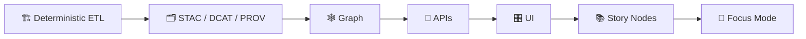
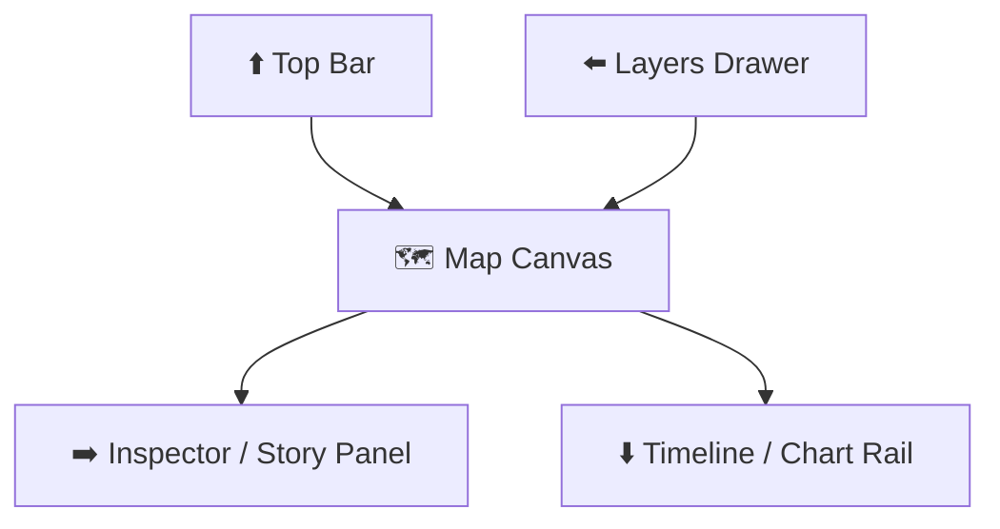

<div align="center">

# 🎛️ Kansas Frontier Matrix (KFM) — UI Spec

**Map-first, provenance-first, story-first.**  
A practical spec for building the KFM user interface: 🗺️ interactive mapping + 🕒 timeline + 📚 Story Nodes + 🔎 Focus Mode + 🧪 Simulation / analysis surfaces.

> **Status:** 🧪 Draft • **Primary View:** 🗺️ 2D Map • **Optional:** 🌍 3D Story Nodes  
> **Core theme:** _Trustworthy visuals + traceable evidence + fast interactions_

</div>

---

## 🧭 Non‑Negotiable System Invariant

KFM UI is **downstream** of deterministic data + provenance:



**Rule:** UI consumes **APIs + catalogs**, not raw graph/db internals.  
This keeps UX reproducible, auditable, and governance-gated.

---

## 🎯 Goals

### ✅ UX Goals
- **Map + time as the default mental model** (layer toggles + timeline slider + compare).
- **One-click provenance**: “Where did this come from? When? How processed? What’s the uncertainty?”
- **Story‑driven exploration**: narrative overlays that stay anchored to evidence and time windows.
- **Focus Mode**: deep dive on a single entity/dataset/story with **version locking**, **diff**, and **citations-first**.

### ✅ Engineering Goals
- **Progressive enhancement**: runs on modern browsers + degrades gracefully (static map / lightweight mode).
- **Performance by design**: predictable frame times, map rendering stability, and scalable layer pipelines.
- **Security + governance aware**: sensitive layers are masked/redacted by default; UI is policy-driven.
- **Accessibility-first**: keyboard, SR support, contrast, reduced motion, and “no orphan visuals”.

---

## 🚫 Non‑Goals (for this spec)
- Full backend data architecture (covered elsewhere).
- A final visual identity (colors/branding) beyond tokens + accessibility constraints.
- A monolithic “do everything” UI: this spec encourages modular packages (map, story, focus, telemetry).

---

## 🧑‍🤝‍🧑 Primary User Types

- **🌾 Public Explorer**: wants understandable maps, timelines, and narratives.
- **🧭 Researcher / Analyst**: needs provenance, diffs, uncertainty, and exportable evidence.
- **🏛️ Steward / Governance Reviewer**: verifies CARE/FAIR alignment and redaction decisions.
- **🛠️ Developer / Maintainer**: adds layers, stories, panels, and keeps performance stable.

---

## 🗺️ Core Modes

### 1) 🧭 Explore Mode (Default)
Map-first. Sidebar toggles. Timeline slider. Feature inspector.

### 2) 📚 Story Mode
Curated narrative: guided camera, callouts, and “chaptered” time windows.

### 3) 🔎 Focus Mode
Single object/entity/story node deep dive with:
- version strip + version lock
- diff viewer (narrative + geometry + metadata)
- provenance drawer

### 4) 🧪 Lab Mode (Optional)
Model outputs, uncertainty visualizations, and scenario comparisons.

---

## 🧱 Information Architecture

### 🗂️ Routes (suggested)
| Route | Name | Purpose | Notes |
|---|---|---|---|
| `/` | Home | Entry + featured stories | lightweight, fast |
| `/explore` | Explore | Map + timeline + layers | primary |
| `/story/:id` | Story | Guided narrative | chapter nav |
| `/focus/:id` | Focus | Deep-dive entity/story | version-lock |
| `/catalog` | Catalog | Dataset discovery | STAC/DCAT |
| `/graph` | Graph Explorer | Relationship view | optional |
| `/lab` | Lab | Simulation / analysis | optional |
| `/about` | About | Methods + governance | trust anchor |

---

## 🧩 UI Composition

### 🗺️ The “Map Shell” Layout (recommended)
- **Top Bar**: search, time controls, mode switch, share/export
- **Left Drawer**: layers + legend + filters + bookmarks
- **Center**: map canvas (MapLibre 2D)
- **Right Panel**: inspector (feature details + provenance) OR story content
- **Bottom (optional)**: chart rail / event timeline / playback



---

## 🗺️ Map & Time Interaction Spec

### 🧭 Baseline interactions
- pan / zoom / rotate (2D)
- feature pick (click/tap) → inspector
- hover highlight (desktop) with throttle
- box select (optional) for batch inspect / export

### 🕒 Timeline
- **single instant** (year/month/day)
- **range selection** (start/end)
- **playback** (step + speed)
- **compare** (A/B snapshots or split map)

### 🧪 Chart ↔ Map Linking (Required Pattern)
When a chart encodes time (e.g., land cover / temperature / index trend):
- clicking a point updates the map layer to the corresponding time slice
- map selection updates chart context (filters, highlighted ranges)

---

## 🧰 Layer System

### ✅ Layer registry
All layers must be declared in a **Layer Registry** (single source of truth):
- id, title, domain, geometry type (vector/raster/tiles/3D)
- time coverage & granularity
- legend spec (symbols, ramps)
- provenance hooks (STAC/DCAT/PROV ids)
- access policy (public/restricted, masking rules)

### 🧾 Layer metadata requirements (minimum)
- **source dataset** (catalog id)
- **time window**
- **processing steps summary**
- **license / attribution**
- **uncertainty field(s)** (if modeled/derived)
- **sensitivity / CARE label** (if applicable)

### 🎚️ Layer controls (required)
- visibility toggle
- opacity slider
- legend preview (expand)
- time-aware indicator (“static” vs “time-sliced”)

---

## 🌍 3D Story Nodes (Optional but Designed‑In)

A Story Node may switch the viewport into a 3D inset/fullscreen:
- 2D stays MapLibre
- 3D uses Cesium (terrain, glTF, 3D tiles, 3D markers)
- must preserve:
  - time context
  - layer state (where applicable)
  - provenance access

**Rule:** 3D is a *mode* (story-driven) — not a replacement for core 2D exploration.

---

## 🔎 Focus Mode Specification

### 🧷 1) Version Strip (Required)
At the top of the Focus Mode panel:
- **Latest version label** + dropdown for older versions
- “View diff” toggle
- **banner** when viewing an older version
- **version lock**: locks reading context (prevents auto-updating to newer versions)

### 🧬 2) Diff Viewer (Required)
Diff supports:
- narrative markdown diffs (word/paragraph level)
- metadata diffs (structured key-level)
- geometry diffs (bbox/centroid + “changed areas” overlay when feasible)

### 🔐 3) Version Lock (Required)
Version lock is a UI+API contract:
- user chooses `version_id`
- system returns stable view until unlocked
- exports include the locked version identifiers

### 🧾 4) Provenance Drawer (Required)
A consistent drawer UI that shows:
- dataset lineage
- run IDs / workflow IDs (if available)
- citations / evidence list
- downloadable manifest references (where permitted)

---

## 🛰️ On‑Map Status Badges (Provenance / Automation)

KFM supports a compact map overlay that shows pipeline status on features/tilesets:
- ✅ healthy / ⚠️ degraded / ⛔ failing / ⏳ running
- click → **Attestation Drawer** (provenance artifacts, audits, SBOM refs where applicable)
- works in both 2D (MapLibre) and 3D (Cesium)

---

## 🎨 Design System & Symbology

### 🧩 Design tokens (minimum)
- typography scale
- spacing scale
- elevation/shadows (minimal)
- semantic colors (success/warn/error/info)
- map overlay tokens (outline width, highlight, selection)

### 🗺️ Cartographic rules (baseline)
- choropleths map **rates/density**, not totals
- always label units + classification method
- legends must be clear, reachable, and keyboard accessible

### 🧷 Symbol governance
- symbols live in domain folders (hydrology, landcover, etc.)
- no “orphan symbols” (every symbol must have metadata + usage mapping)
- icons should be SVG; ensure contrast meets accessibility requirements

---

## 📱 Responsive & Mobile

### 📐 Layout strategy
- **mobile-first**: map dominates, drawers become bottom sheets
- timeline becomes collapsible rail
- inspector becomes stackable cards
- avoid hover-only interactions

### 📴 Low-connectivity behavior
- show cached layers/story content when possible
- provide static map fallback for heavy/3D content
- clearly label “degraded mode” (don’t silently fail)

---

## ♿ Accessibility Requirements

- Keyboard navigation for:
  - layer toggles, legend expanders, time controls, story navigation
- All overlays:
  - accessible names (ARIA), alt text where applicable
  - avoid color-only encoding; provide patterns/labels
- Respect reduced motion preferences
- Ensure readable focus outlines and logical tab order
- Provide text equivalents for key insights (e.g., “Top change drivers”)

---

## 🔐 Security, Privacy & Governance

### 🛡️ UI Security Basics (must)
- input sanitization (search, filters, markdown rendering)
- strong CSP
- protect against injection (SQL injection is a backend issue, but UI must not encourage unsafe patterns)
- avoid embedding untrusted HTML from story content without sanitization
- dependency hygiene: SBOM + version floors + repeatable builds

### 🪶 CARE & sensitive data
- sensitive coordinates may be:
  - masked
  - generalized (grid)
  - aggregated
  - hidden entirely
- UI must clearly show:
  - whether redaction is applied
  - why it’s applied (policy label)
  - who to contact for access (if applicable)

---

## ⚡ Performance Budgets

### 🎯 Baseline targets (edit as we benchmark)
| Metric | Target |
|---|---|
| Initial interactive (Explore) | ≤ 3s on mid-tier laptop |
| Layer toggle response | ≤ 250ms for cached tiles |
| Map FPS (typical) | stable & non-janky |
| Story Node open | ≤ 500ms cached / ≤ 2s cold |
| Focus diff render | ≤ 1s for typical docs |

### 🧠 Performance practices
- use vector tiles / COGs / chunked fetches where appropriate
- virtualize long lists (layers, events, citations)
- debounce expensive queries
- prefetch next/nearby time slices during playback

---

## 🧪 Testing & QA

### ✅ Required test layers
- unit tests for:
  - layer registry validation
  - time parsing / range math
  - markdown rendering + sanitization
- e2e tests for:
  - layer toggle + timeline
  - story navigation
  - focus version lock + diff
- accessibility tests (automated + manual smoke)
- visual regression for legend + map overlay (where possible)

---

## 🧾 Telemetry & Observability

Telemetry must be **privacy-aware** and governance-aligned.

### 📌 Minimum UI events
- `ui.layer.toggle`
- `ui.timeline.change`
- `ui.feature.inspect`
- `ui.story.open`
- `ui.focus.lock_version`
- `ui.focus.diff_view`
- `ui.export.triggered`

Each event should include:
- session id (non-identifying)
- route + mode
- layer/story ids (when relevant)
- time window (when relevant)
- redaction applied (boolean / enum)

---

## 🗂️ Suggested Folder Structure

```text
📦 docs/
└─ 📂 specs/
   └─ 📂 ui/
      ├─ 📄 README.md                # (this file)
      ├─ 📂 map/                     # map + timeline specs
      ├─ 📂 focus-mode/              # versioning + diff + lock specs
      ├─ 📂 story-nodes/             # story authoring + rendering spec
      ├─ 📂 design-system/           # tokens, components, icon rules
      ├─ 📂 accessibility/           # WCAG checks, SR notes, patterns
      └─ 📂 telemetry/               # event schema + governance notes

📦 web/
└─ 📂 src/
   ├─ 📂 app/                        # router, shell, layouts
   ├─ 📂 components/                 # shared UI components
   ├─ 📂 features/
   │  ├─ 📂 map/                     # maplibre bindings, layer manager
   │  ├─ 📂 timeline/                # time controls + playback
   │  ├─ 📂 story/                   # story renderer + navigation
   │  ├─ 📂 focus/                   # focus mode UI + diff view
   │  ├─ 📂 catalog/                 # STAC/DCAT browsing
   │  └─ 📂 lab/                     # optional modeling/simulation UI
   ├─ 📂 api/                        # API clients + DTOs
   ├─ 📂 telemetry/                  # event dispatch + sampling
   └─ 📂 styles/                     # tokens + global styles
```

---

## 🛠️ “How to Add…” Checklists

### ➕ Add a new map layer
- [ ] Create/extend registry entry (id, time coverage, legend, access policy)
- [ ] Ensure STAC/DCAT/PROV references are present
- [ ] Provide legend metadata + accessibility review
- [ ] Add tests (registry validation + basic render)
- [ ] Document expected performance + fallback behavior

### ➕ Add a new Story Node
- [ ] Include front matter (id, title, version, time window, geo bbox)
- [ ] Link evidence assets (STAC item ids, citations list)
- [ ] Validate markdown rules (no untrusted HTML; sanitized embeds)
- [ ] Provide focus hooks (focus layers, focus time, focus center)

### ➕ Add a Focus Mode module
- [ ] Version strip visible and correct
- [ ] Diff view supported (when previous versions exist)
- [ ] Version lock implemented + export includes lock id
- [ ] Provenance drawer wired
- [ ] Telemetry events emitted (privacy-safe)

---

## 📚 Project Reference Library (What Informs This UI)

> Keep these files in mind when implementing UI behaviors, performance, governance, and visualization choices.

### 🧠 Core KFM vision & UX mechanics
- **Kansas Frontier Matrix (KFM) – Comprehensive Engineering Design.docx**
- **Kansas-Frontier-Matrix_ Open-Source Geospatial Historical Mapping Hub Design.pdf**
- **Latest Ideas.docx**
- **Other Ideas.docx**
- **MARKDOWN_GUIDE_v13.md.gdoc**
- **Comprehensive Markdown Guide_ Syntax, Extensions, and Best Practices.docx**

### 🗺️ GIS, remote sensing, and cartography
- **python-geospatial-analysis-cookbook.pdf**
- **Cloud-Based Remote Sensing with Google Earth Engine — Fundamentals and Applications.pdf**
- **making-maps-a-visual-guide-to-map-design-for-gis.pdf**
- **Mobile Mapping_ Space, Cartography and the Digital.pdf**

### ⚙️ Data systems & performance
- **PostgreSQL Notes for Professionals.pdf**
- **Scalable Data Management for Future Hardware.pdf**
- **Data Spaces.pdf**

### 🧪 Modeling, uncertainty, and analysis UX
- **Scientific Modeling and Simulation — A Comprehensive NASA-Grade Guide.pdf**
- **Understanding Statistics & Experimental Design.pdf**
- **regression-analysis-with-python.pdf**
- **Regression analysis using Python — slides-linear-regression.pdf**
- **think-bayes-bayesian-statistics-in-python.pdf**
- **graphical-data-analysis-with-r.pdf**
- **Generalized Topology Optimization for Structural Design.pdf**
- **Spectral Geometry of Graphs.pdf**
- **Principles of Biological Autonomy.pdf**

### 🌐 Web, rendering & security
- **responsive-web-design-with-html5-and-css3.pdf**
- **webgl-programming-guide-interactive-3d-graphics-programming-with-webgl.pdf**
- **compressed-image-file-formats-jpeg-png-gif-xbm-bmp.pdf**
- **ethical-hacking-and-countermeasures-secure-network-infrastructures.pdf**
- **Gray Hat Python — Python Programming for Hackers and Reverse Engineers.pdf**
- **concurrent-real-time-and-distributed-programming-in-java-threads-rtsj-and-rmi.pdf**

### 🧰 Programming compendiums (grab‑bag references)
- **A programming Books.pdf**
- **B-C programming Books.pdf**
- **D-E programming Books.pdf**
- **F-H programming Books.pdf**
- **I-L programming Books.pdf**
- **M-N programming Books.pdf**
- **O-R programming Books.pdf**
- **S-T programming Books.pdf**
- **U-X programming Books.pdf**

---

## 🗺️ Open Questions (Track as Issues)

- 🧩 Which router/app framework (Vite SPA vs SSR/Next) is the baseline?
- 🧠 Do we treat “Story Nodes” as markdown-first or JSON-first with markdown blocks?
- 🔐 How is redaction communicated consistently across map, inspector, story, and exports?
- 🌍 What is the minimum viable 3D story experience (inset vs fullscreen)?
- ⚡ What’s the performance baseline device (and offline expectations)?

---

## ✅ Definition of Done (UI Milestone 1)

- [ ] Explore mode with Map + Layer Drawer + Timeline works end-to-end
- [ ] Feature inspector shows metadata + provenance entry point
- [ ] Story Mode loads a story node and sets map/time context
- [ ] Focus Mode loads entity and supports version strip + lock (diff can be “coming soon”)
- [ ] Accessibility smoke pass (keyboard + SR basics)
- [ ] Telemetry events emitted with privacy gating

---

