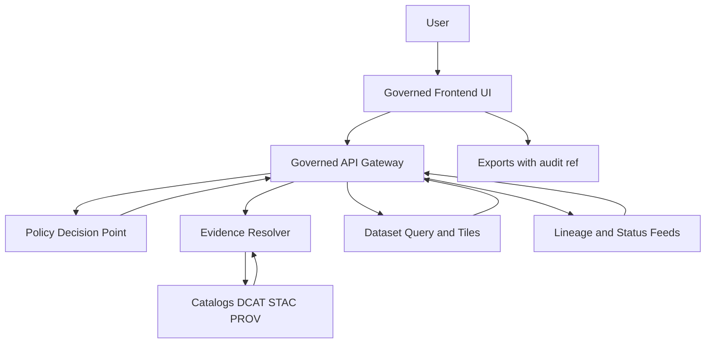

<!-- [KFM_META_BLOCK_V2]
doc_id: kfm://doc/9f8d0a3b-acde-4c52-8f1f-1c7a5c7b9e2f
title: KFM UI Specifications
type: standard
version: v1
status: draft
owners: ["@kfm/ui (TODO)", "@kfm/governance (review)"]
created: 2026-03-04
updated: 2026-03-04
policy_label: public
related: ["docs/specs/README.md", "docs/specs/api/", "docs/specs/data/", "docs/specs/qa/", "docs/governance/"]
tags: ["kfm", "ui", "spec", "trust-membrane", "evidence"]
notes: ["UI is a governed client: trust surfaces are required, not optional polish."]
[/KFM_META_BLOCK_V2] -->

# KFM UI Specifications
UI requirements, component contracts, and governance-visible UX patterns for the Kansas Frontier Matrix frontend.

> **Status:** draft • **Owners:** @kfm/ui (TODO) • **Policy label:** public  
> **Non-negotiable:** UI and external clients never access DB/object storage directly; all access crosses the governed API + policy boundary (trust membrane).  
> **Shields (placeholders):**   

**Jump to:** [Scope](#scope) • [Where it fits](#where-it-fits) • [Inputs](#acceptable-inputs) • [Exclusions](#exclusions) • [Directory tree](#directory-tree) • [Quickstart](#quickstart) • [System model](#system-model) • [UI surfaces](#ui-surfaces) • [Trust surfaces](#trust-surfaces) • [Evidence model](#evidence-model-and-evidence-drawer) • [Map view state](#map-view-state-reproducibility) • [Abstention UX](#ux-patterns-for-abstention-and-restriction) • [API matrix](#api-usage-matrix) • [Tests and gates](#tests-and-ci-gates) • [DoD](#definition-of-done) • [FAQ](#faq) • [Appendix](#appendix)

---

## Scope

This directory defines **how the KFM frontend must behave** to make governance visible and keep the “trust membrane” intact.

- **CONFIRMED:** Top-level UI surfaces include Map Explorer, Stories, Catalog, Focus Mode, and a restricted Admin/Steward area.
- **CONFIRMED:** Story Nodes store map state so stories replay the same view; Focus Mode may accept view state hints to answer in context.
- **CONFIRMED:** Evidence and provenance inspection must be accessible from map interactions, story claims, and Focus answers.
- **PROPOSED:** A separate “Timeline” route may exist, but Timeline controls can also be embedded in Map Explorer.

> This is a **spec** surface (contracts + acceptance criteria). It is not an implementation guide for any specific framework version.

### Evidence discipline used in this spec

Meaningful statements are tagged:

- **CONFIRMED** — stated in KFM blueprint / governance docs (requirements to implement)
- **PROPOSED** — recommended pattern, not yet ratified (needs design review)
- **UNKNOWN** — cannot be verified from available repo state; requires verification steps

---

## Where it fits

**Path:** `docs/specs/ui/`

### Upstream dependencies
- **CONFIRMED:** Governed API contract + evidence resolver endpoints (policy enforcement boundary).
- **CONFIRMED:** Policy pack semantics (CI and runtime must agree on allow/deny + obligations).
- **CONFIRMED:** Catalog/provenance surfaces (DCAT, STAC, PROV) that power evidence resolution.

### Downstream dependents
- **PROPOSED:** Frontend apps (React + MapLibre GL; optional Cesium view) that implement Map Explorer and Story rendering.
- **PROPOSED:** UI test harnesses (unit + Playwright) that enforce acceptance criteria for Evidence Drawer, keyboard navigation, and abstention UX.

---

## Acceptable inputs

What belongs in `docs/specs/ui/`:

- UI information architecture (routes, navigation, layout patterns)
- Component contracts and required behaviors (e.g., Evidence Drawer, Policy Notice, Feature Inspect)
- UX patterns for restricted/abstained responses
- Accessibility checklists and acceptance criteria
- Endpoint usage matrices (UI ↔ governed API)
- Diagrams (Mermaid) and testable definitions of done

---

## Exclusions

What must **not** go in `docs/specs/ui/`:

- App source code (put in the frontend package directory)
- Design files (Figma exports, images) unless explicitly required and policy-reviewed
- Secrets, API keys, credentials, tokens
- Raw or restricted datasets, or anything that could leak sensitive coordinates
- Product marketing / roadmap prose (put in `docs/roadmap/` if present)

---

## Directory tree

> **PROPOSED** (create files as you implement them; do not assume they already exist):

- `docs/specs/ui/`
  - `README.md` (this file)
  - `UI__INFORMATION_ARCHITECTURE.md`
  - `UI__MAP_EXPLORER.md`
  - `UI__STORY_MODE.md`
  - `UI__FOCUS_MODE.md`
  - `UI__EVIDENCE_DRAWER.md`
  - `UI__POLICY_NOTICES.md`
  - `schemas/`
    - `ui_view_state.schema.json`
    - `ui_citation.schema.json`
    - `ui_export_answer.schema.json`
    - `ui_automation_badge.schema.json` (optional)

---

## Quickstart

1) **Read the contracts first**
- `docs/specs/api/` (governed endpoints, schemas)
- `docs/specs/qa/` (validation gates, link checks, policy regression suite)
- `docs/governance/` (default-deny posture, sensitivity + licensing rules)

2) **Implement the vertical slice**
- Map Explorer → Feature click → Evidence Drawer opens → License + version displayed → keyboard navigable.
- Story publish gate → block publish if any citation fails to resolve.
- Focus Mode → cite-or-abstain with audit receipt and policy-safe “why”.

3) **Run the checks**

```bash
# PSEUDOCODE: replace with your repo’s actual targets/scripts.
# Goal: docs lint, schema validation, linkcheck, unit tests, e2e tests.

make docs.lint
make docs.linkcheck
make ui.test
make ui.e2e
```

---

## System model


```mermaid
flowchart TD
  User[User] --> UI[Governed Frontend UI]
  UI --> API[Governed API Gateway]
  API --> PDP[Policy Decision Point]
  API --> Ev[Evidence Resolver]
  Ev --> Cats[Catalogs DCAT STAC PROV]
  API --> DataQ[Dataset Query and Tiles]
  API --> Lineage[Lineage and Status Feeds]
  UI --> Export[Exports with audit ref]

  PDP --> API
  Cats --> Ev
  DataQ --> API
  Lineage --> API
```

**CONFIRMED invariant:** the UI is a *governed client* and must not embed privileged credentials or bypass the policy boundary.

[Back to top](#kfm-ui-specifications)

---

## UI surfaces

The UI is built from a small number of surfaces. Each surface must expose governance and evidence inspection as first-class affordances.

| Surface | Primary goal | Core components (minimum) | Evidence entry points | Status |
|---|---|---|---|---|
| Map Explorer | Explore data by map + time | Map canvas, layer panel, time control, feature inspect, evidence drawer | Feature click; layer info; policy badge | **CONFIRMED** |
| Stories | Replay narrative + map state | Story list, story reader with citation hooks, evidence drawer | Claim citation click; “inspect evidence” buttons | **CONFIRMED** |
| Focus Mode | Evidence-led Q&A | Chat panel, inline evidence snippets, policy notice, export answer | Inline citation → evidence drawer; audit receipt | **CONFIRMED** |
| Catalog | Discover datasets and versions | Dataset list, facets/search, version detail | Dataset version detail → evidence bundle | **CONFIRMED** |
| Admin/Steward | Governance workflows | Promotion queue, QA viewer, story review queue | Review items always link to evidence | **CONFIRMED** |
| Timeline | Optional route | Timeline control and markers | Same as Map Explorer | **PROPOSED** |

---

## Trust surfaces

Trust surfaces are the user-visible governance contract.

| Trust surface | Minimum UI behavior | Failure mode | Status |
|---|---|---|---|
| Dataset version label | Show `dataset_version_id` per layer; link to dataset version details | If missing, display “version unknown” and treat as unpublishable for Stories | **CONFIRMED** |
| License + rights | Evidence Drawer always shows license + rights holder attribution | If missing, block export and story publish | **CONFIRMED** |
| Evidence Drawer | Accessible from every map feature and story claim | If evidence cannot resolve, show policy-safe error + audit ref | **CONFIRMED** |
| Policy notices | Explain redactions/generalization in policy-safe terms | Never leak restricted existence (“ghost metadata”) unless policy allows | **CONFIRMED** |
| “What changed?” | Compare dataset versions: counts, checksums, QA metrics | If diff unavailable, show “diff unavailable” | **CONFIRMED** |
| Automation status badges | Show healthy/degraded/failing on layers/features | If feed unavailable, show “unknown” with last seen timestamp | **CONFIRMED** |

---

## Evidence model and Evidence Drawer

### Key definitions

- **CONFIRMED:** A “citation” is not a pasted URL. In KFM it is an **EvidenceRef** that resolves (via the evidence resolver) into an **EvidenceBundle** that can be inspected and reproduced.
- **CONFIRMED:** Story publishing and Focus Mode responses must hard-fail (abstain or block) if citations cannot be verified and resolved.

### Required Evidence Drawer fields

**CONFIRMED minimum fields to display:**
- Evidence bundle ID and digest
- Dataset version ID and dataset title
- License + rights holder attribution
- Freshness: last run timestamp + validation status
- Provenance chain: run receipt link
- Artifact links (only if policy allows)
- Redactions/generalizations applied (obligations)

### Suggested TypeScript contracts

```ts
// CONFIRMED concept: citations are EvidenceRefs resolvable to an EvidenceBundle.
// Exact shapes are repo-contract controlled; treat these as a UI-facing projection.

export type EvidenceRef = {
  ref: string;             // e.g., "dcat://..." or "stac://..." or "prov://..." or "doc://..."
  label?: string;          // UI label for link text
};

export type EvidenceBundleCard = {
  bundle_id: string;       // sha256:...
  dataset_version_id: string;
  title: string;
  policy: {
    decision: "allow" | "deny" | "allow_with_obligations";
    policy_label: string;
    obligations_applied: string[];
  };
  license: {
    spdx?: string;
    attribution: string;
  };
  freshness?: {
    last_run_ts?: string;  // RFC3339
    validation_status?: "valid" | "warning" | "failed" | "unknown";
  };
  provenance?: {
    run_id?: string;
    audit_ref?: string;
  };
  artifacts?: Array<{
    href: string;
    digest?: string;
    media_type?: string;
  }>;
};
```

---

## Map view state reproducibility

**CONFIRMED:** “Map state” is stored in Story Nodes so stories replay exactly the same view; Focus Mode may accept view-state hints to answer in context.

Minimum View State fields:

```ts
export type ViewState = {
  camera: {
    bbox?: [number, number, number, number]; // west,south,east,north
    zoom?: number;
    center?: [number, number];
    bearing?: number;
    pitch?: number;
  };
  time: {
    from: string; // RFC3339
    to: string;   // RFC3339
  };
  layers: Array<{
    layer_id: string;
    dataset_version_id?: string;
    visible: boolean;
    opacity?: number;
    style_params?: Record<string, unknown>;
  }>;
  filters?: Record<string, unknown>;
};
```

**PROPOSED:** Store this sidecar as canonical JSON (stable hashing) and reference it from Story Nodes by digest to prevent silent drift.

[Back to top](#kfm-ui-specifications)

---

## UX patterns for abstention and restriction

**CONFIRMED:** Abstention is a feature. The UI must make abstention understandable **without** leaking restricted information.

| Scenario | UI behavior | Must not do | Status |
|---|---|---|---|
| Evidence denied by policy | Show policy-safe “why” (e.g., “Restricted evidence not available to your role”) + audit ref | Reveal restricted dataset existence or metadata unless policy allows | **CONFIRMED** |
| Evidence unresolvable | Show “Unable to verify citation” + audit ref + troubleshooting link | Allow story publish / export to proceed | **CONFIRMED** |
| Coordinates generalized | Show explicit policy notice (e.g., “geometry generalized due to policy”) | Show precise coordinates in UI, Story, or export | **CONFIRMED** |
| Focus Mode cannot cite | Respond with abstain + suggested safe alternatives (broader time range, public datasets) | Hallucinate an answer without citations | **CONFIRMED** |

---

## API usage matrix

> This is a **requirements** matrix. Whether endpoints exist in code is **UNKNOWN** until verified against the repo’s OpenAPI + running service.

| UI feature | Endpoint | Purpose | UI requirement | Status |
|---|---|---|---|---|
| Dataset discovery | `GET /api/v1/datasets` | List datasets + versions | Must display policy labels + dataset_version_id | **CONFIRMED** |
| STAC browsing | `GET /api/v1/stac/collections` / `GET /api/v1/stac/items` | Browse/query assets | Must display checksums/digests where provided | **CONFIRMED** |
| Evidence Drawer | `POST /api/v1/evidence/resolve` | Resolve EvidenceRef → EvidenceBundle | Must fail-closed on deny/unresolvable | **CONFIRMED** |
| Story read/publish | `GET/POST /api/v1/story` | Read + publish Story Nodes | Publish requires citations resolve + review state | **CONFIRMED** |
| Focus Mode ask | `POST /api/v1/focus/ask` | Governed Q&A with receipt | Must return citations or abstain + audit ref | **CONFIRMED** |
| Automation status | `GET /api/v1/lineage/status` / `GET /api/v1/lineage/stream` | Health/freshness feeds | Badges on layers/features; degraded mode supported | **CONFIRMED** |
| Tiles (if dynamic) | `GET /api/v1/tiles/{layer}/{z}/{x}/{y}` | Tile delivery | Must only request policy-safe tiles | **PROPOSED** |

---

## Tests and CI gates

Minimum checks that must block merges for UI trust features:

- **CONFIRMED:** Evidence Drawer e2e: feature click opens drawer and shows **license + version**
- **CONFIRMED:** Keyboard navigation: layer list and evidence drawer navigable, visible focus
- **CONFIRMED:** Story publish gate: block publish if any citation fails to resolve
- **CONFIRMED:** Focus Mode eval harness: golden queries; merges blocked on regressions
- **CONFIRMED:** Linkcheck: broken spec links block merges (docs are a production surface)
- **CONFIRMED:** Policy regression suite: UI never decides policy; UI only renders server decisions

---

## Definition of Done

Use this checklist before calling any UI feature “done”:

- [ ] **Trust membrane**: UI does not talk to DB/object storage directly (only governed API).
- [ ] **Evidence**: every claim and export path is backed by resolvable citations.
- [ ] **License**: license + attribution displayed in Evidence Drawer and included in exports.
- [ ] **Policy notices**: redactions/generalizations are explicit and policy-safe.
- [ ] **Accessibility**: keyboard navigation + ARIA + no color-only semantics.
- [ ] **Story publishing**: citations resolve; review state captured; publish fails closed otherwise.
- [ ] **Focus Mode**: cite-or-abstain; audit ref returned; safe alternatives suggested.
- [ ] **E2E tests**: pass for Map Explorer → Evidence Drawer and Story citations.
- [ ] **Docs gates**: markdown lint + linkcheck + schema validation pass.

---

## FAQ

### Can the UI fetch data directly from storage for performance?
**CONFIRMED:** No. Performance optimizations must happen behind the governed API boundary (tiles, caching, PMTiles, etc.), not by bypassing policy.

### Why is license/version displayed so prominently?
**CONFIRMED:** Because trust surfaces are the user-visible governance contract; license and dataset version are first-class UI elements, not hidden metadata.

### What does “citation” mean in KFM?
**CONFIRMED:** A structured EvidenceRef that resolves to an EvidenceBundle. If it can’t be resolved or is policy-denied, the system must narrow scope, abstain, or block publishing.

### What should I do when a user hits a restricted result?
**CONFIRMED:** Explain “why” in policy-safe terms, suggest safe alternatives, and provide an audit reference for steward review—without revealing restricted existence.

---

## Appendix

<details>
<summary>Appendix A — Example JSON</summary>

### View State example

```json
{
  "camera": {
    "bbox": [-102.051, 36.993, -94.589, 40.003],
    "zoom": 6.5,
    "bearing": 0,
    "pitch": 0
  },
  "time": { "from": "2026-01-01T00:00:00Z", "to": "2026-03-01T00:00:00Z" },
  "layers": [
    {
      "layer_id": "storm_events",
      "dataset_version_id": "2026-02.abcd1234",
      "visible": true,
      "opacity": 0.8
    }
  ],
  "filters": { "event_type": ["hail", "tornado"] }
}
```

### Evidence Bundle card example (UI projection)

```json
{
  "bundle_id": "sha256:bundle...",
  "dataset_version_id": "2026-02.abcd1234",
  "title": "Storm event record: 2026-02-19",
  "policy": {
    "decision": "allow",
    "policy_label": "public",
    "obligations_applied": []
  },
  "license": { "spdx": "CC-BY-4.0", "attribution": "Source org" },
  "provenance": { "run_id": "kfm://run/2026-02-20T12:00:00Z.abcd", "audit_ref": "kfm://audit/entry/123" },
  "artifacts": [
    { "href": "processed/events.parquet", "digest": "sha256:2222", "media_type": "application/x-parquet" }
  ]
}
```

</details>

---

### Publishing checklist (docs are a production surface)

- [ ] Badges + owners + status + nav present
- [ ] Purpose + where it fits + inputs + exclusions complete
- [ ] Directory tree included (and marked PROPOSED if not real)
- [ ] Quickstart commands either runnable or explicitly labeled pseudocode
- [ ] ≥ 1 Mermaid diagram included
- [ ] Tables used for key matrices
- [ ] Task list gates/DoD included
- [ ] Long appendix in `<details>`
- [ ] Relative links preferred; TODOs allowed but tracked

[Back to top](#kfm-ui-specifications)
