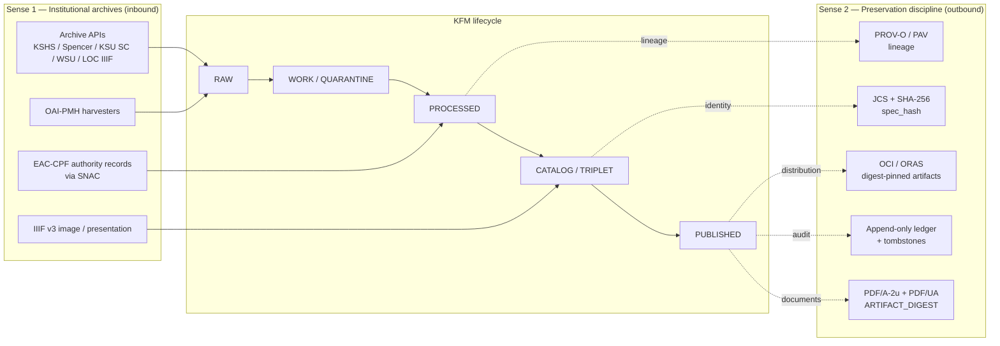
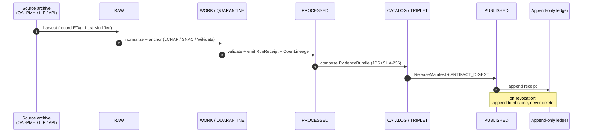

<!-- [KFM_META_BLOCK_V2]
doc_id: kfm://doc/standards/archival-standards
title: Archival Standards
type: standard
version: v1
status: draft
owners: [Standards Steward — NEEDS VERIFICATION]
created: 2026-05-13
updated: 2026-05-13
policy_label: public
related:
  - docs/doctrine/lifecycle-law.md
  - docs/doctrine/authority-ladder.md
  - docs/doctrine/truth-posture.md
  - docs/standards/README.md
  - docs/standards/RUN_RECEIPT.md
  - docs/standards/OPENLINEAGE_FACETS.md
  - docs/domains/archaeology/README.md
  - docs/sources/README.md
  - contracts/source/source_descriptor.md
  - contracts/release/release_manifest.md
  - schemas/contracts/v1/source/source-descriptor.json
  - policy/sensitivity/
  - docs/adr/ADR-0001-schema-home.md
tags: [kfm, standards, archives, preservation, provenance, prov-o, eac-cpf, oai-pmh, iiif, pdfa, content-addressing]
notes:
  - Two-sense scope (institutional archives + archival preservation discipline).
  - Repo paths PROPOSED until verified against mounted repo.
  - EAD / METS / PREMIS / MODS listed as PROPOSED candidate standards, not current doctrine.
[/KFM_META_BLOCK_V2] -->

<a id="top"></a>

# Archival Standards

> The external standards Kansas Frontier Matrix conforms to when describing, ingesting, preserving, and republishing **archival evidence** — both the *institutional* sense (records held by archives) and the *preservation* sense (long-term integrity of published artifacts).


| Field | Value |
|---|---|
| **Document type** | Standards doctrine (external standards conformance) |
| **Status** | draft |
| **Owners** | Standards Steward — *NEEDS VERIFICATION* |
| **Authority of these rules** | CONFIRMED for KFM-internal use of the listed standards; per-standard conformance maturity varies (see §3 table) |
| **Authority of any repo path quoted here** | PROPOSED until verified against mounted-repo evidence |
| **Proposed canonical home** | `docs/standards/ARCHIVAL-STANDARDS.md` per Directory Rules §6.1 (`docs/standards/` is the home for "external standards KFM conforms to") |
| **Lifecycle invariant** | RAW → WORK / QUARANTINE → PROCESSED → CATALOG / TRIPLET → PUBLISHED |
| **Last reviewed** | 2026-05-13 |

---

## Quick jump

- [1. Scope and two senses of "archival"](#1-scope-and-two-senses-of-archival)
- [2. Repo fit](#2-repo-fit)
- [3. Standards inventory](#3-standards-inventory)
- [4. Sense 1 — Institutional archival description and access](#4-sense-1--institutional-archival-description-and-access)
- [5. Sense 2 — Archival preservation discipline](#5-sense-2--archival-preservation-discipline)
- [6. Lifecycle integration](#6-lifecycle-integration)
- [7. Rights, sensitivity, and CARE in archival exposure](#7-rights-sensitivity-and-care-in-archival-exposure)
- [8. Object families that carry archival obligations](#8-object-families-that-carry-archival-obligations)
- [9. Validation, tests, and proof objects](#9-validation-tests-and-proof-objects)
- [10. Anti-patterns](#10-anti-patterns)
- [11. Open questions and verification backlog](#11-open-questions-and-verification-backlog)
- [12. Related docs](#12-related-docs)
- [Appendix A — Standard-by-standard reference cards](#appendix-a--standard-by-standard-reference-cards)
- [Appendix B — Glossary](#appendix-b--glossary)

---

## 1. Scope and two senses of "archival"

The word *archival* carries two distinct technical meanings inside KFM. This document covers both, because both produce concrete external-standards obligations that downstream gates must enforce.

| Sense | What it means in KFM | Primary standards |
|---|---|---|
| **Sense 1 — Institutional archives** | Records held by archives, libraries, museums, and historical societies. KFM does *not* own these records; it federates against them via authority records, descriptive metadata, and harvest protocols. | EAC-CPF, OAI-PMH, IIIF, plus PROPOSED EAD / METS / MODS / PREMIS |
| **Sense 2 — Archival preservation discipline** | The set of practices that make a published KFM artifact citeable years from now: deterministic identity, content addressing, append-only audit, tombstones, and durable formats. | PROV-O, PAV, JCS (RFC 8785) + SHA-256, OCI / ORAS, PDF/A-2u, PDF/UA |

> [!IMPORTANT]
> Both senses share one operational rule: **the published surface is the only public path, and every artifact on it carries provenance back to a `SourceDescriptor` and an `EvidenceBundle`.** Sense 1 supplies the inbound record; Sense 2 supplies the integrity guarantees on the outbound artifact.



[Back to top](#top)

---

## 2. Repo fit

| Concern | Path (PROPOSED unless noted) | Notes |
|---|---|---|
| **This document** | `docs/standards/ARCHIVAL-STANDARDS.md` | Directory Rules §6.1 lists `docs/standards/` for "external standards KFM conforms to (STAC, DCAT, PROV, etc.)" — CONFIRMED placement. |
| **Sibling standards docs** | `docs/standards/STAC.md`, `docs/standards/DCAT.md`, `docs/standards/PROV.md`, `docs/standards/RUN_RECEIPT.md`, `docs/standards/OPENLINEAGE_FACETS.md`, `docs/standards/SENSITIVITY_RUBRIC.md` | All PROPOSED filenames; referenced in expansion directions across `KFM_Components_Pass_10`. |
| **Source descriptors** | `contracts/source/source_descriptor.md`, `schemas/contracts/v1/source/source-descriptor.json` | Schema home per ADR-0001. NEEDS VERIFICATION in mounted repo. |
| **Domain owner of archival records** | `docs/domains/archaeology/`, plus people/DNA/land and settlements where archives surface as evidence | Archives are cross-cutting — they are not a `domains/` root of their own per Directory Rules. |
| **Policy** | `policy/sensitivity/`, `policy/rights/`, `policy/release/` | Canonical singular `policy/`. |
| **Audit ledger** | `data/AUDIT/receipts/YYYY/MM/...` (per C1-06 *PROPOSED*) | Backend choice (filesystem vs OCI) is an open ADR. |

[Back to top](#top)

---

## 3. Standards inventory

The inventory below names each external standard, its role in KFM, and its current conformance status. Status here describes **KFM doctrine**, not implementation maturity in any mounted repo — implementation maturity is UNKNOWN unless cross-checked against a current repo scan.

| Standard | Role in KFM | Doctrine status | Source basis |
|---|---|---|---|
| **EAC-CPF** (Encoded Archival Context — Corporate Bodies, Persons, Families) | Archive-specific authority for persons & corporate bodies whose primary footprint is in archival collections. | CONFIRMED | C7-06 |
| **SNAC** (Social Networks and Archival Context) | Cooperative aggregator of EAC-CPF records; first-class identifier alongside LCNAF / VIAF / Wikidata. | CONFIRMED | C7-06, C10-07 |
| **OAI-PMH** | Harvest protocol for archives that publish via the open archives protocol. | CONFIRMED as inbound transport for a subset of partners. | C10-07 |
| **IIIF** (v3, Image + Presentation) | Image and presentation interoperability for digitized archival materials (notably LOC IIIF). | CONFIRMED | C10-07; ML-064-* (rights-bound historic overlays) |
| **EAD** (Encoded Archival Description) | Hierarchical finding-aid description. | PROPOSED — candidate; not yet in project doctrine. | NEEDS VERIFICATION — natural counterpart to EAC-CPF in the partner archive ecosystem; KFM corpus does not explicitly require it. |
| **METS** (Metadata Encoding and Transmission Standard) | Wrapper for descriptive / administrative / structural metadata of digital objects. | PROPOSED — candidate. | NEEDS VERIFICATION — widely used by KFM's named partner archives; not explicitly required by project doctrine. |
| **PREMIS** (Preservation Metadata) | Preservation events, agents, rights, and object metadata. | PROPOSED — candidate. | NEEDS VERIFICATION — overlaps with PROV-O; relationship should be documented if adopted. |
| **MODS** (Metadata Object Description Schema) | Bibliographic description for digitized archival items. | PROPOSED — candidate. | NEEDS VERIFICATION — common in IIIF-presenting partners; relationship to DCAT distribution metadata is open. |
| **PROV-O** (W3C Provenance Ontology) | Permanent semantic layer for claim-level provenance: `prov:Activity` / `prov:Entity` / `prov:Agent`, `prov:wasGeneratedBy`, `prov:wasAttributedTo`. | CONFIRMED | C8-03; ML-061-078, ML-061-081 |
| **PAV** (Provenance, Authoring, Versioning) | Lightweight authoring / versioning vocabulary that pairs with PROV-O. | CONFIRMED | C8-03 |
| **OpenLineage** | Operational lineage *events* emitted by orchestrators (Dagster / Prefect / Airflow); translated to PROV-O for permanent semantics. | CONFIRMED | C1-05, ML-061-081 |
| **JCS** (RFC 8785, JSON Canonicalization Scheme) | Canonical JSON serialization underneath every `spec_hash`. | CONFIRMED | C1-02 |
| **SHA-256** | Hash function over the JCS-canonicalized bytes; `spec_hash` is `jcs:sha256:<hex>`. | CONFIRMED | C1-02 |
| **URDNA2015** | Alternate canonicalization for RDF-semantic equivalence (graph documents). | CONFIRMED — reserved use; JCS is the default. | C8-05 |
| **OCI / ORAS** | Content-addressed distribution and referrer attachment for datasets, attestations, SBOMs. | CONFIRMED as a target distribution channel. | C13-04; ML-063-028, ML-063-038 |
| **Cosign / Sigstore** | Signing of artifacts and receipts; `prov:wasAttributedTo` / `prov:qualifiedGeneration`. | CONFIRMED | C1-03; ML-061-078 |
| **Rekor** | Transparency log index for signatures (PROPOSED in receipt fields). | PROPOSED | `New Ideas 5-8-26` §9 (run-receipt example) |
| **PDF/A-2u** | Long-term archival PDF profile for published KFM dossiers. | CONFIRMED | C13-01, C13-04 |
| **PDF/UA** | Accessibility profile for published PDFs (tagged structure, alt-text, table headers). | PROPOSED — corpus describes the requirement; preflight tool and gate enforcement not yet named. | C13-03 |
| **ARTIFACT_DIGEST** | SHA-256 of the linearized PDF/A-2u output, recorded in a sidecar manifest and cited by every receipt that references the document. | CONFIRMED | C13-04 |
| **CIDOC-CRM** | Cultural-heritage event ontology (E5 / E7 / E21 / E53 / E55 / E74). Adjacent to archival description; pairs with PROV-O for scholarly attribution (E13). | CONFIRMED for cultural-heritage graphs; demarcation with PROV-O is an open question. | C8-01, §8.7 of Pass 10 |

[Back to top](#top)

---

## 4. Sense 1 — Institutional archival description and access

This section governs how KFM receives, anchors, and re-cites material held by **someone else's archive**.

### 4.1 Authority records — EAC-CPF via SNAC

CONFIRMED doctrine. For figures whose primary evidentiary footprint is in unpublished archival collections — frontier settlers, county officials, regional newspaper editors, ranching families — SNAC is often the only authority that exists. KFM person records anchor against SNAC in addition to LCNAF when published works also survive. SNAC IDs are first-class identifiers stored alongside LCNAF, VIAF, ISNI, and Wikidata.

> [!NOTE]
> **Authority ladder for archive-sourced persons** (PROPOSED ordering, NEEDS VERIFICATION against any formal ladder in `docs/registers/AUTHORITY_LADDER.md`):
> `Wikidata QID` → `LCNAF` → `VIAF` → `ISNI` → `SNAC` → KFM-local id of last resort.
> SNAC may be the *only* anchor for collection-only figures.

```json
// Illustrative — NOT a current schema. Field names mirror SourceDescriptor patterns
// described in the corpus; canonical schema home is schemas/contracts/v1/source/...
{
  "id": "person:doe_jane:1872-1940",
  "names": [{"primary": true, "value": "Doe, Jane"}],
  "authorities": {
    "wikidata": "Q000000000",
    "lcnaf":    "n81007710",
    "viaf":     "0000000000",
    "snac":     "w6xxxxxxxx",
    "isni":     "0000000000000000"
  },
  "evidence_ref": "kfm://evidence-bundle/<sha256>"
}
```

### 4.2 Harvest — OAI-PMH

CONFIRMED. A subset of the Kansas archives stack (KSHS, KU Spencer, KSU SC, WSU, county societies, LOC) publish via OAI-PMH; others expose stable APIs, and others publish PDFs and CSVs that must be harvested with bespoke agents. The KFM **RunReceipt** records the access path and harvest cadence per source.

> [!CAUTION]
> Many county societies and small archives have **no structured publication interface**. The harvest layer must tolerate manual submission flows for the foreseeable future, with full SourceDescriptor and rights evidence captured at intake.

### 4.3 Image and presentation — IIIF v3

CONFIRMED. Digitized historic maps, photographs, manuscripts, and plans federate through IIIF v3 Image and Presentation APIs. The corpus is explicit (`ML-064-079`, `ML-061-156..159`) that:

- IIIF overlays must preserve rights statements and georeferencing-annotation provenance before MapLibre display.
- Historic-map overlays go through plugin governance, not bare overlay loading.
- Sensitive historic content (cultural corridors, sacred-site indications) uses generalized footprints (H3 r7+) and never raw coordinates.

### 4.4 Descriptive metadata — candidate standards

The following are **PROPOSED additions** to the archival standards inventory. Each is widely used by KFM's named partner archives, but the KFM corpus does not yet enumerate them as required external standards. They are listed here so reviewers can decide which to adopt and at what conformance level.

- **EAD** — finding-aid description; natural counterpart to EAC-CPF.
- **METS** — wrapper for descriptive / administrative / structural metadata of digital objects.
- **PREMIS** — preservation events / agents / rights / objects. **Open question:** demarcation with PROV-O.
- **MODS** — bibliographic description for digitized items; **open question:** relationship to DCAT distribution metadata.

> [!IMPORTANT]
> Adopting any of the above introduces conformance obligations (schema validation, fixture sets, round-trip tests) and a maintenance surface. They should not be marked CONFIRMED until an ADR records the decision and at least one source family relies on them.

[Back to top](#top)

---

## 5. Sense 2 — Archival preservation discipline

This section governs how KFM ensures that an artifact published today is still citeable, verifiable, and revocable years from now.

### 5.1 Provenance — PROV-O + PAV, fed by OpenLineage

CONFIRMED. Every published KFM asset must carry an OpenLineage trail back to the producing receipts (C5-08 *Lineage Required*). OpenLineage events are translated to **PROV-O** for the permanent semantic layer. PAV adds authoring and versioning predicates. CIDOC-CRM E13 (Attribute Assignment) covers scholarly-attribution provenance; the corpus prefers PROV-O for claim-level provenance and reserves E13 for scholarly attribution — the dividing line is an open question (§8.7 of Pass 10).

### 5.2 Deterministic identity — JCS + SHA-256

CONFIRMED. The `spec_hash` for any dataset entry, model spec, contract, or evidence bundle is:

1. Canonicalize the JSON via **RFC 8785 JCS**.
2. Take **SHA-256** over the canonical bytes.
3. Record as `jcs:sha256:<hex>`.

For RDF graph documents where semantic equivalence matters more than byte equivalence, **URDNA2015** is reserved (C8-05). JCS is the default; the choice is recorded in the receipt.

### 5.3 Content-addressed distribution — OCI / ORAS

CONFIRMED as a target channel. Datasets (GeoParquet, COG, PMTiles) can be pushed as OCI artifacts with metadata and attestations attached via ORAS referrers. Catalog records (STAC / DCAT) include `contentDigest` and `distribution.integrity` linking to those immutable bytes.

> [!WARNING]
> **OCI tags are pointers; manifests must reference immutable digests** (`ML-063-030`, `ML-063-039`).
> Putting a mutable tag into `MapReleaseManifest` as sole identity is a published anti-pattern. Release tags are pointers — release identity is the digest.

### 5.4 Append-only audit ledger + tombstones

PROPOSED home (`data/AUDIT/receipts/YYYY/MM/...` or OCI evidence registry — backend choice is an open ADR per C1-06). The shared property across every recipe in the corpus is that **revocation does not delete**: a tombstone receipt is appended that points at the retracted `run_id` and records the reason, supersession reference, and timestamp (C5-09). UI clients hide tombstoned items from public views, but the lineage and audit graph remain explorable.

```text
data/AUDIT/                                 # PROPOSED home (NEEDS VERIFICATION)
└── receipts/
    └── 2026/
        └── 05/
            ├── <run_id>.receipt.json       # canonical RunReceipt, append-only
            └── <run_id>.tombstone.json     # appended on revocation; never overwrites
```

### 5.5 Document preservation — PDF/A-2u, PDF/UA, ARTIFACT_DIGEST

CONFIRMED for PDF/A-2u and ARTIFACT_DIGEST; PROPOSED for PDF/UA enforcement.

| Layer | Standard | Status | What it provides |
|---|---|---|---|
| Long-term renderability | PDF/A-2u | CONFIRMED | Reproducible, archival-grade PDF profile. |
| Accessibility | PDF/UA | PROPOSED | Tagged structure, alt-text, table headers — preflight tool and build gate not yet named. |
| Citation anchor | `ARTIFACT_DIGEST` | CONFIRMED | SHA-256 of the **linearized** PDF/A-2u output, recorded in a sidecar manifest. Linearization changes byte layout but not content; the digest is computed *after* linearization so consumers who fetch the linearized version match. |

> [!IMPORTANT]
> A consumer who fetches a KFM PDF **MUST** compute SHA-256 and verify the match against the cited `ARTIFACT_DIGEST` before treating the content as authoritative. Mismatch → tampering, wrong version, or build drift; in all three cases the consumer must not treat the content as authoritative (C13-04).

[Back to top](#top)

---

## 6. Lifecycle integration

The archival obligations attach to specific lifecycle phases. The mapping below is PROPOSED (corpus describes each phase but per-archive enforcement maturity is UNKNOWN).

| Phase | Inbound (Sense 1) obligations | Outbound (Sense 2) obligations |
|---|---|---|
| **RAW** | Capture immutable source payload or reference. Record source role, rights, sensitivity, citation, time, hash. SourceDescriptor exists. For OAI-PMH / IIIF: record ETag, Last-Modified, harvest cadence. | n/a |
| **WORK / QUARANTINE** | Normalize schema, geometry, time, identity, evidence, rights. Hold failures with a recorded quarantine reason. Authority anchoring (EAC-CPF / SNAC / LCNAF / VIAF / Wikidata) happens here. | n/a |
| **PROCESSED** | Emit validated normalized objects. | RunReceipt with `jcs:sha256:` `spec_hash`; OpenLineage START/COMPLETE events; PROV-O entity records. |
| **CATALOG / TRIPLET** | EvidenceBundle composed; CollectionRepositoryRecord(s) linked. STAC / DCAT records reference the bundle by content address. | OCI / ORAS digest pin (where used); attestation (Cosign) attached as referrer. |
| **PUBLISHED** | ReleaseManifest binds artifacts to checksums, validation, policy, review, and a rollback target. | PDF/A-2u linearization + `ARTIFACT_DIGEST` sidecar manifest. Append-only ledger entry. Tombstone on revocation. |



[Back to top](#top)

---

## 7. Rights, sensitivity, and CARE in archival exposure

Archival materials surface every sensitivity class the corpus flags. The deny-by-default register (kfm_encyclopedia §13) governs what may cross the publication boundary. The table below is a per-class extract relevant to archival ingest; it is **not** a substitute for the full register.

| Class | Archival example | Default outcome | Required controls |
|---|---|---|---|
| Living persons | Personal papers, correspondence, photographs of living subjects in archival collections | DENY exact / identifying output unless legal basis, consent / review, and release state are proven | Privacy review; redaction; aggregate; staged access |
| Sacred / culturally sensitive places | Oral history, cultural routes, sacred sites referenced in archival materials | DENY until steward review and access class approve | Consultation record; sensitivity transform |
| Archaeology | Site coordinates, burial / sacred / culturally sensitive materials in collection accessions | DENY exact public location by default | Cultural / steward review; suppression / generalization (H3 r7+ for cultural overlays) |
| Source-rights-limited records | Licensed, restricted, no-redistribution archival sources, or sources with uncertain terms | DENY public release until terms resolved | Rights register entry; attribution; no public derivative if barred |
| Critical infrastructure | Archival records describing exact facility dependencies, condition observations | RESTRICT / DENY public precision | Public-safe aggregation; role-based access |

CARE fields (MetaBlock v2 — C15-01) — `steward_org`, `authority_to_control`, `consent`, `obligations`, `benefit_commitments` — travel with the catalog entry. The OPA default-deny rule (C15-03) fires whenever `authority_to_control` is non-empty.

> [!WARNING]
> The corpus is explicit: **rights uncertainty fails closed.** Unclear rights, unresolved source role, missing evidence, unresolved sensitivity, or absent release state blocks public promotion (kfm_encyclopedia §13 / Directory Rules §I).

[Back to top](#top)

---

## 8. Object families that carry archival obligations

Per the Archaeology domain card (`KFM_Domains_Culmination_Atlas_v1_1` §D / §H) and the cross-cutting object families (`kfm_encyclopedia` §H, Appendix A glossary), the following objects carry archival-relevant fields. **Term status is CONFIRMED; field realization is PROPOSED** unless verified against `schemas/contracts/v1/...`.

| Object family | Archival relevance |
|---|---|
| `SourceDescriptor` | Holds source role, rights, sensitivity, citation, time, hash, OAI-PMH / IIIF access path. Schema home: `schemas/contracts/v1/source/source-descriptor.json` per ADR-0001. |
| `EvidenceRef` / `EvidenceBundle` | The resolved evidence package; content-addressed via `jcs:sha256:`. Carries kfm:entities, kfm:sources, prov:wasGeneratedBy, kfm:run_receipt_ref. |
| `CollectionRepositoryRecord` | Domain object for collection / accession references back to KSHS, Spencer, KSU SC, WSU, county society, LOC IIIF holdings. |
| `CulturalReview` / `StewardReview` | Records the cultural-sensitivity decision attached to archival material whose sensitivity is non-trivial. |
| `CollectionAccession` | Accession-level identity for museum / archive holdings. |
| `PublicationTransformReceipt` | Records the redaction / generalization transform applied before any archival item crosses the publication boundary. |
| `RunReceipt` | Universal currency: `spec_hash`, `source_url`, `http_validators`, `run_id`, `transform_git_sha`, `artifacts[]`, `rights_spdx`, `attestations[]`. |
| `ReleaseManifest` | Binds artifacts to checksums, validation, policy, review, and rollback target. |
| `CorrectionNotice` / `RollbackCard` | The reverse direction: how an archival artifact is retracted, corrected, or rolled back. |
| `AIReceipt` | Required whenever Focus Mode summarizes archival evidence — cite-or-abstain is the truth posture. |

<details>
<summary><strong>Illustrative RunReceipt — not a current schema</strong></summary>

```json
// Illustrative; canonical schema home is schemas/contracts/v1/runtime/run_receipt.schema.json
// per Directory Rules + C1-01 expansion. Field names from KFM_Components_Pass_10 §C1-01.
{
  "dataset_id":          "kshs-kansas-memory/<set_id>",
  "dataset_version":     "2026-05-13T00:00:00Z",
  "fetch_time":          "2026-05-13T01:23:45Z",
  "source_url":          "https://www.kansasmemory.org/oai-pmh?verb=GetRecord&...",
  "http_validators":     {"etag": "\"abc123\"", "last_modified": "2026-04-30T12:00:00Z"},
  "spec_hash":           "jcs:sha256:9f0e8c2c...",
  "run_id":              "01H...ULID",
  "orchestrator":        "dagster",
  "transform_git_sha":   "7f3a...",
  "artifacts":           [{"path": "data/processed/.../bundle.jsonld", "digest": "sha256:..."}],
  "rights_spdx":         "CC-BY-4.0",
  "attestations":        [{"type": "cosign", "bundle_digest": "sha256:..."}]
}
```

</details>

[Back to top](#top)

---

## 9. Validation, tests, and proof objects

PROPOSED per-standard validators (status: NEEDS VERIFICATION against any mounted-repo evidence). The intent is that conformance to each standard is provable by fixture-driven validators rather than by claim.

| Validator (PROPOSED) | What it proves | Negative fixture must fail |
|---|---|---|
| `eac-cpf-validate` | EAC-CPF XML parses and resolves SNAC ID | Malformed XML; SNAC ID resolves to multiple agents over time without a disambiguation note |
| `oai-pmh-receipt` | Harvest receipt records `verb`, `metadataPrefix`, ETag, Last-Modified | Receipt without HTTP validators |
| `iiif-rights` | IIIF manifest carries rights statement and required attribution | IIIF overlay loaded without rights statement |
| `prov-o-closure` | Every published asset has a complete PROV-O chain to its receipts | Asset with no `prov:wasGeneratedBy` |
| `jcs-roundtrip` | Bundle re-canonicalizes byte-for-byte; `spec_hash` matches | Field-order change produces a different `spec_hash` |
| `oci-digest-match` | OCI artifact digest matches catalog `contentDigest` | Mutable tag in `MapReleaseManifest` |
| `pdfa-linearize` | Published PDF is PDF/A-2u, linearized, and the post-linearization SHA-256 equals `ARTIFACT_DIGEST` | Pre-linearization hash mismatched |
| `tombstone-conformance` | Revoked content is replaced by a tombstone with reason + replacement pointer | Hard-delete of a published asset |
| `care-default-deny` | OPA denies any asset whose `authority_to_control` is non-empty unless an allow path is proven | CARE-tagged asset reaches `PUBLISHED` without consent grant |
| `citation-validation` | Every claim in a publication path resolves to an EvidenceRef → EvidenceBundle | Uncited claim on a public surface |

[Back to top](#top)

---

## 10. Anti-patterns

> [!WARNING]
> These are anti-patterns the corpus calls out by name or that follow directly from KFM doctrine. Reviewers should treat any of them as a blocker.

- **Treating an OAI-PMH harvest as canonical truth.** The harvest is RAW; promotion is a governed state transition, not a file move.
- **Loading an IIIF overlay without preserving rights and georeferencing-annotation provenance** (`ML-064-079`, `ML-061-156..159`).
- **Putting a mutable OCI tag into `MapReleaseManifest` as sole identity** (`ML-063-030`, `ML-063-039`).
- **Hard-deleting a revoked asset instead of appending a tombstone** (C5-09).
- **Computing `ARTIFACT_DIGEST` before linearization** (C13-04 — consumers fetch the linearized bytes and would never match).
- **Reproducing an upstream archive's bytes as if KFM owned them.** KFM federates against archives; it does not republish someone else's holdings without rights resolution.
- **Treating an AI summary of an archival item as evidence.** Focus Mode may summarize released EvidenceBundles; it must `ABSTAIN` where evidence is insufficient and `DENY` where policy, rights, sensitivity, or release state blocks the request.
- **Smoothing over the PROV-O / CIDOC-CRM E13 overlap** rather than recording the choice in the receipt (§8.7 of Pass 10).
- **Promoting an EAC-CPF / SNAC anchor without recording the disambiguation strategy** for IDs that resolve to multiple agents over time (C7-06).

[Back to top](#top)

---

## 11. Open questions and verification backlog

Items requiring evidence, design, implementation, or verification before they can be promoted from PROPOSED to CONFIRMED. Drawn from `KFM_Components_Pass_10` §11 (Open Questions Backlog) and corpus-wide gaps directly relevant to archival standards.

- **NEEDS VERIFICATION** — Mounted-repo presence of `schemas/contracts/v1/source/source-descriptor.json` and the canonical `RunReceipt` schema.
- **NEEDS VERIFICATION** — Whether `data/AUDIT/` is the chosen ledger backend, an OCI evidence registry, or both (C1-06).
- **OPEN** — PROV-O ↔ CIDOC-CRM E13 dividing line for archival claim provenance vs scholarly attribution (§8.7 of Pass 10).
- **OPEN** — JCS vs URDNA2015 for graph-shaped evidence bundles (C8-05).
- **OPEN** — KFM governance model for upstream EAC-CPF contribution: who in the partner ecosystem holds the editorial seat (C7-06)?
- **OPEN** — KFM-as-aggregator governance across KSHS / KHRI / Spencer / KSU SC / WSU / county societies / LOC (C10-07).
- **OPEN** — Should `kfm:care` (DCAT / STAC extension, C15-02) be proposed for upstream adoption in STAC-extensions / DCAT-AP, or kept KFM-local?
- **OPEN** — Adoption decision for EAD / METS / MODS / PREMIS as required (vs candidate) standards.
- **OPEN** — Retention discipline: how long are tombstoned assets and revoked-consent records retained for audit? (§8.4 of Pass 10).

[Back to top](#top)

---

## 12. Related docs

> Some links are PROPOSED paths. Verify against mounted-repo evidence before treating any as authoritative.

- [`docs/doctrine/lifecycle-law.md`](../doctrine/lifecycle-law.md) — RAW → ... → PUBLISHED governed transitions.
- [`docs/doctrine/authority-ladder.md`](../doctrine/authority-ladder.md) — authority order for identity anchoring.
- [`docs/doctrine/truth-posture.md`](../doctrine/truth-posture.md) — cite-or-abstain.
- [`docs/doctrine/directory-rules.md`](../doctrine/directory-rules.md) — `docs/standards/` placement basis.
- `docs/standards/README.md` — sibling standards index *(PROPOSED — NEEDS VERIFICATION)*.
- `docs/standards/RUN_RECEIPT.md` — canonical run-receipt schema *(PROPOSED per C1-01 expansion)*.
- `docs/standards/OPENLINEAGE_FACETS.md` — KFM-specific OpenLineage facets *(PROPOSED per C1-05 expansion)*.
- `docs/standards/SENSITIVITY_RUBRIC.md` — 0–5 rubric *(PROPOSED per C6-01 expansion)*.
- `docs/standards/STAC_DWC_PROFILE.md` — STAC × DwC profile *(PROPOSED per C4-03 expansion)*.
- [`docs/domains/archaeology/README.md`](../domains/archaeology/README.md) — primary domain home for archive-sourced cultural heritage records.
- [`docs/adr/ADR-0001-schema-home.md`](../adr/ADR-0001-schema-home.md) — schema-home convention.
- `docs/registers/AUTHORITY_LADDER.md` — formal authority ordering *(NEEDS VERIFICATION)*.

[Back to top](#top)

---

## Appendix A — Standard-by-standard reference cards

<details>
<summary><strong>EAC-CPF · CONFIRMED</strong></summary>

- **Purpose** — Archive-specific authority record for persons, corporate bodies, and families documented primarily through archival collections.
- **Form** — XML.
- **KFM use** — First-class identifier on person records, alongside LCNAF / VIAF / Wikidata / ISNI. May be the *only* authority for collection-only figures.
- **Dependencies** — SNAC API access (rate-limited); an EAC-CPF parser; a strategy for SNAC IDs that resolve to multiple agents over time.
- **Open question** — KFM governance model for upstream contribution (who holds the editorial seat).
- **Source basis** — C7-06.

</details>

<details>
<summary><strong>SNAC · CONFIRMED</strong></summary>

- **Purpose** — Social Networks and Archival Context cooperative; aggregates EAC-CPF records from U.S. archives.
- **KFM use** — Federation layer against KSHS, KU Spencer, KSU SC, WSU, and partner archive description.
- **Coverage caveat** — Uneven outside the major-archive footprint; many local historical-society collections have no SNAC record. KFM either creates one (contribute upstream) or documents the absence.
- **Source basis** — C7-06, C10-07.

</details>

<details>
<summary><strong>OAI-PMH · CONFIRMED (inbound transport)</strong></summary>

- **Purpose** — Harvest protocol for repositories that publish via the open archives protocol.
- **KFM use** — One of several inbound transports; receipt records the access path and harvest cadence per source.
- **Coverage caveat** — Many partner institutions do not publish OAI-PMH; harvest layer must tolerate API, OAI-PMH, PDF/CSV, and manual submission.
- **Source basis** — C10-07.

</details>

<details>
<summary><strong>IIIF (v3) · CONFIRMED</strong></summary>

- **Purpose** — Image and Presentation API interoperability for digitized historic materials.
- **KFM use** — Federation surface for LOC IIIF and partner institution IIIF endpoints; historic-map overlays.
- **Constraints** — Rights statement and georeferencing-annotation provenance must be preserved before display; plugin governance required.
- **Source basis** — C10-07; `ML-061-156..159`, `ML-064-079`.

</details>

<details>
<summary><strong>PROV-O + PAV · CONFIRMED</strong></summary>

- **Purpose** — Permanent semantic layer for claim-level provenance (`prov:Activity`, `prov:Entity`, `prov:Agent`, `prov:wasGeneratedBy`, `prov:wasAttributedTo`, `prov:qualifiedGeneration`). PAV adds authoring / versioning predicates.
- **KFM use** — Every published asset carries a PROV-O trail; OpenLineage events are translated into PROV-O at promotion.
- **Open question** — PROV-O vs CIDOC-CRM E13 demarcation for scholarly attribution (§8.7 of Pass 10).
- **Source basis** — C8-03, C1-05; `ML-061-078`, `ML-061-081`.

</details>

<details>
<summary><strong>JCS (RFC 8785) + SHA-256 · CONFIRMED</strong></summary>

- **Purpose** — Deterministic canonical JSON serialization underneath every `spec_hash`.
- **Form** — `spec_hash = "jcs:sha256:<hex>"`.
- **KFM use** — Required identity field on every receipt, evidence bundle, contract entry, model spec.
- **Alternative** — URDNA2015, reserved for RDF graph documents where semantic equivalence is needed; JCS is the default.
- **Source basis** — C1-02, C8-05.

</details>

<details>
<summary><strong>OCI / ORAS · CONFIRMED (distribution channel)</strong></summary>

- **Purpose** — Content-addressed distribution for datasets, with PROV / SBOM / attestations attached via ORAS referrers.
- **KFM use** — Datasets-as-OCI pattern for GeoParquet, COG, PMTiles.
- **Hard rule** — Manifests reference **immutable digests**; mutable tags are blocked from `MapReleaseManifest` as sole identity.
- **Source basis** — C13-04; `ML-063-028`, `ML-063-030`, `ML-063-037..039`.

</details>

<details>
<summary><strong>PDF/A-2u + PDF/UA + ARTIFACT_DIGEST · CONFIRMED / PROPOSED / CONFIRMED</strong></summary>

- **PDF/A-2u** — long-term archival PDF profile (CONFIRMED).
- **PDF/UA** — accessibility profile (PROPOSED; preflight tool and gate not yet named).
- **ARTIFACT_DIGEST** — SHA-256 of the **linearized** PDF/A-2u output, sidecar manifest, cited by every receipt (CONFIRMED).
- **Consumer obligation** — verify SHA-256 against `ARTIFACT_DIGEST` before treating the document as authoritative.
- **Source basis** — C13-01, C13-03, C13-04.

</details>

<details>
<summary><strong>Tombstones for revocation · CONFIRMED</strong></summary>

- **Purpose** — Revocation is recorded by **appending** a tombstone receipt that names the retracted `run_id`, reason, replacement pointer, and timestamp.
- **Never delete.** UI hides tombstoned items; the audit graph stays explorable.
- **Source basis** — C5-09; C6-08 (revocation endpoints + embargo cache invalidation).

</details>

[Back to top](#top)

---

## Appendix B — Glossary

Drawn from `kfm_encyclopedia` Appendix A and corpus usage.

| Term | Definition |
|---|---|
| **Inspectable claim** | A public or semi-public statement whose evidence, source role, spatial / temporal scope, policy posture, review state, release state, and correction lineage are inspectable. |
| **EvidenceRef** | Stable reference from a claim / object to the evidence supporting it. |
| **EvidenceBundle** | Resolved evidence package with source descriptors, supporting records, policy / review / release state, and citations. |
| **DecisionEnvelope** | Finite decision record for policy, promotion, or runtime behavior. |
| **RuntimeResponseEnvelope** | AI / API response with outcome `ANSWER` / `ABSTAIN` / `DENY` / `ERROR`, evidence refs, citations, and policy state. |
| **SourceDescriptor** | Machine / human source record with authority role, rights, sensitivity, cadence, and access facts. |
| **ReleaseManifest** | Bound release object listing artifacts, checksums, validation, policy, review, and rollback target. |
| **RollbackCard** | Auditable instructions and target for reverting or withdrawing a release. |
| **Focus Mode** | Governed AI question-answering mode over released or authorized EvidenceBundles. |
| **Evidence Drawer** | UI trust panel opened from a feature that shows evidence, sources, review, policy, release, and correction lineage. |
| **ARTIFACT_DIGEST** | SHA-256 of the linearized PDF/A-2u output; the citation anchor for KFM published documents. |
| **spec_hash** | `jcs:sha256:<hex>` — deterministic identity for any KFM JSON artifact. |
| **Tombstone** | Append-only revocation record naming retracted `run_id`, reason, replacement pointer, and timestamp. |

[Back to top](#top)

---

**Last updated:** 2026-05-13 · **Status:** draft · **Doc id:** `kfm://doc/standards/archival-standards` · [Back to top](#top)
