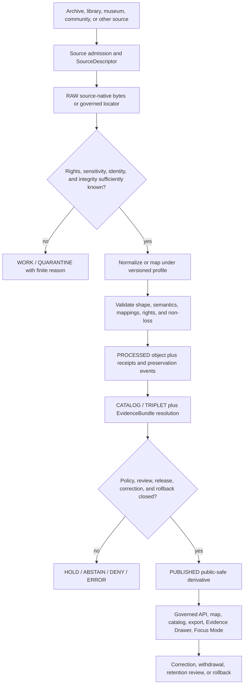

<!-- [KFM_META_BLOCK_V2]
doc_id: kfm://doc/standards/archival-standards
title: Archival Standards — Repository Boundary, Interoperability, and Preservation Map
type: standard; interoperability-reference; preservation-boundary
version: v2.0-draft
status: draft; repository-grounded; upstream-currentness-refreshed; mixed-maturity; no-adoption; no-conformance-proof; no-release; no-publication
owners:
  - "@bartytime4life — verified GitHub review route through CODEOWNERS"
  - "NEEDS VERIFICATION — archival-description, digital-preservation, rights, cultural-sovereignty, accessibility, security, and release stewards"
created: 2026-05-13
updated: 2026-08-18
policy_label: public
owning_root: docs/
responsibility: >
  Explain the human-readable boundary between institutional archival interoperability,
  digital-preservation practice, KFM evidence and lifecycle objects, and governed public
  delivery without becoming source authority, semantic contract, machine schema, policy,
  preservation repository, conformance certificate, release decision, or publication proof.
truth_posture: >
  CONFIRMED current repository path, adopted Directory Rules placement, direct sibling
  standards inventory, current case-collision and provenance-family drift, CODEOWNERS
  routing, LOC connector scaffold state, source-descriptor surface duplication, and dated
  official upstream-currentness checks / PROPOSED KFM archival exchange profiles,
  preservation-action packet, validators, fixtures, producer and consumer bindings, and
  graduation sequence / UNKNOWN adopted archival profile, operative source connectors,
  complete machine mappings, production preservation storage, archival release artifacts,
  deployed consumers, external interoperability, and operational effectiveness.
evidence_snapshot:
  repository: bartytime4life/Kansas-Frontier-Matrix
  base_ref: main
  base_commit: 34d509c690649b284a7c0be739e3a5c8c85926ee
  target_prior_blob: 8b92a2fd2eefc2b93a95ff6afcb0f357924bc356
  standards_readme_blob: a8cbe5d183448d5f0de37f8a4eacd6fcaca0d71b
  directory_rules_blob: fd49a0b83e55cef52c1124281f093e263526898d
  adr_0029_blob: a4de0d7a96b78da59cfc499d1025e1508afd8dd9
  adr_0001_blob: ed6f258f8d9ea152996570768a31666953e4a809
  codeowners_blob: dd2a84aa514d8ecd9208bc347f90f9a2ed37dd61
  snac_eac_cpf_blob: 38ac1f93b6e8b938d3fcd85f6d18831e272489f2
  oai_pmh_upper_blob: b0d64303b6c1fcbf21a5efcf00cce47bca0f0a79
  oai_pmh_lower_blob: f7583d91ec7d4d3b3daeed3e202991d6cb44cee0
  loc_connector_package_readme_blob: 061d30b883a25a3c112cb74d4537379164116684
external_currentness_review:
  access_date: 2026-08-18
  scope: official issuers only; versions and publication state, not KFM adoption or implementation
related:
  - ./README.md
  - ../doctrine/directory-rules.md
  - ../adr/ADR-0029-adopt-directory-governance-standard-v2.md
  - ../adr/ADR-0001-schema-home--schemas-contracts-v1-is-canonical.md
  - ./snac-eac-cpf.md
  - ./OAI-PMH.md
  - ./oai-pmh.md
  - ./IIIF.md
  - ./iiif.md
  - ./DUBLIN-CORE.md
  - ./CIDOC-CRM.md
  - ./PROV-O.md
  - ./PROV.md
  - ./PROVENANCE.md
  - ./PROV/README.md
  - ./CANONICALIZATION.md
  - ./canonicalization.md
  - ./OPENLINEAGE_FACETS.md
  - ./RUN_RECEIPT.md
  - ./RELEASE_MANIFEST.md
  - ./SIGNING.md
  - ../sources/README.md
  - ../sources/catalog/kansas/kansas-memory.md
  - ../sources/catalog/kansas/kansas-state-archives.md
  - ../sources/catalog/loc/README.md
  - ../../contracts/source/source_descriptor.md
  - ../../schemas/contracts/v1/source/source_descriptor.schema.json
  - ../../schemas/contracts/v1/sources/source_descriptor.schema.json
  - ../../connectors/loc/src/loc/README.md
  - ../../policy/rights/README.md
  - ../../policy/sensitivity/README.md
  - ../../fixtures/README.md
  - ../../tests/README.md
  - ../../release/README.md
notes:
  - "Same-path standards-document modernization only."
  - "No standard or KFM profile is adopted, activated, certified, or made release-significant by this revision."
  - "No child standard file, contract, schema, policy rule, source descriptor, connector, fixture, validator, test, workflow, receipt, proof, release object, deployment, or public artifact is created or changed."
  - "Case-collision and provenance-family drift remain HOLD items; this revision does not rename, merge, delete, or select a winner."
  - "The previous two-sense archival framing is retained, while unsupported conformance, implementation, authority-order, immutable-ledger, and PDF-profile claims are narrowed to current evidence."
[/KFM_META_BLOCK_V2] -->

<a id="top"></a>

# Archival Standards — Repository Boundary, Interoperability, and Preservation Map

> **Purpose.** Explain how KFM can describe and exchange records held by archives while also preserving KFM-produced evidence and release artifacts over time—without confusing an upstream standard, a harvested record, a preservation action, a passing validator, or a durable file format with source authority, evidence closure, policy approval, release, or publication.

| Field | Current bounded result |
|---|---|
| **Evidence snapshot** | `main@34d509c690649b284a7c0be739e3a5c8c85926ee` |
| **Directory result** | `PLACE` at the existing `docs/standards/ARCHIVAL-STANDARDS.md` path. Accepted ADR-0029 and the current standards-lane README assign human-readable standards and interoperability guidance to `docs/standards/`. |
| **Document authority** | Human-readable boundary, currentness ledger, mapping guidance, and verification backlog only. This page is not an adopted profile or conformance certificate. |
| **Current repository posture** | Documentation-rich and mixed-maturity: archival sibling pages exist, case-collision and provenance-family drift are recorded, the LOC connector is a `0.0.0` scaffold, and bounded search did not establish a dedicated executable archival-conformance suite. |
| **Upstream-currentness posture** | Refreshed on 2026-08-18 from official issuers. Upstream publication state does not establish KFM adoption, compatibility, or implementation. |
| **KFM profile posture** | `UNKNOWN / NEEDS VERIFICATION`. No accepted archival exchange or preservation profile was established by the inspected repository evidence. |
| **Release and publication effect** | None. A document update, passing check, pull request, merge, standard citation, receipt, or preservation copy is not KFM release or publication. |

> [!IMPORTANT]
> **A standards document is not conformance proof.** This page may name an upstream specification and explain a proposed KFM role. It cannot prove that a producer emits the profile, a consumer interprets it correctly, a source may be activated, a preservation action ran, or a released artifact is conformant.

> [!CAUTION]
> **“Publicly accessible” does not mean “public-domain, redistributable, non-sensitive, or safe to aggregate.”** Archive descriptions, digital objects, finding aids, annotations, authority records, and source APIs retain their own rights, access, cultural, privacy, and attribution conditions.

> [!WARNING]
> **Preservation must not become irreversible exposure.** Replication, fixity, durable packaging, content addressing, or an append-only audit trail cannot override deletion duties, consent withdrawal, cultural restrictions, access controls, or lawful retention limits. Preserve accountability while minimizing and protecting restricted bytes.

**Quick navigation:** [Role](#1-role-authority-and-truth-posture) · [Scope](#2-scope-and-core-terms) · [Repository state](#3-current-repository-state) · [Standards landscape](#4-upstream-standards-landscape-and-currentness) · [Institutional archives](#5-institutional-archival-interoperability) · [Preservation](#6-digital-preservation-discipline) · [Lifecycle](#7-lifecycle-and-minimum-archival-packet) · [Rights](#8-rights-sensitivity-sovereignty-and-harmful-precision) · [Public surfaces](#9-governed-api-map-export-and-ai-boundaries) · [Validation](#10-validation-conformance-and-negative-proof) · [Correction](#11-correction-withdrawal-retention-and-rollback) · [Maturity](#12-maturity-matrix-and-change-checklist) · [Conflicts](#13-conflicts-holds-and-open-verification) · [Evidence](#14-evidence-and-source-ledger) · [Crosswalk](#appendix-a--standard-role-crosswalk) · [Glossary](#appendix-b--glossary)

---

## 1. Role, authority, and truth posture

### 1.1 What this page owns

This page owns one responsibility: the human-readable cross-root map for archival standards, archival-source interoperability, and preservation obligations.

It explains:

- the two technical meanings of *archival* used in KFM;
- which current upstream standards are relevant and when they were checked;
- how descriptions, authority records, functions, digital objects, preservation metadata, packages, provenance, and fixity differ;
- where KFM meaning, shape, policy, source identity, execution, evidence, release, and public delivery remain authoritative;
- which current repository surfaces exist and which remain scaffolded, conflicting, or unverified;
- what a future synthetic conformance slice would need to prove; and
- which corrections, withdrawals, migrations, and rollback paths must remain visible.

It does not own:

| Concern | Owning authority |
|---|---|
| Placement | Accepted [`ADR-0029`](../adr/ADR-0029-adopt-directory-governance-standard-v2.md) and [`docs/doctrine/directory-rules.md`](../doctrine/directory-rules.md) |
| KFM object meaning | [`contracts/`](../../contracts/README.md) |
| Machine-valid shape | [`schemas/`](../../schemas/README.md), using the adopted Directory Rules default route for contract-backed schemas |
| Allow, deny, hold, redact, restrict, or abstain | [`policy/`](../../policy/README.md) plus governed review |
| Source identity, terms, and activation | Source admission, `SourceDescriptor`, source registry, and qualified review |
| Retrieval and conversion mechanics | [`connectors/`](../../connectors/README.md), pipelines, packages, and tools selected by execution role |
| Evidence support | `EvidenceRef`, `EvidenceBundle`, receipts, proofs, and their accepted resolvers |
| Release, correction, withdrawal, rollback | [`release/`](../../release/README.md) and the relevant accountability objects |
| Public delivery | Governed APIs and released public-safe artifacts |
| Conformance proof | Exact-revision fixtures, validators, tests, workflows, producers, consumers, and observed exchange evidence |

### 1.2 Review route and functional ownership

[`CODEOWNERS`](../../.github/CODEOWNERS) provides the verified default GitHub review route to `@bartytime4life`. It does not prove qualification, stewardship, review completion, independent approval, release authority, or standards adoption.

The following functional roles remain **NEEDS VERIFICATION**:

- archival-description steward;
- digital-preservation steward;
- source and repository liaison for each archive family;
- rights, copyright, privacy, and access reviewer;
- tribal, cultural, sovereignty, and community reviewer where implicated;
- accessibility and durable-document reviewer;
- security, integrity, and signing reviewer;
- contract/schema/validator steward; and
- release, correction, withdrawal, and rollback authority.

### 1.3 Truth labels

| Label | Use in this page |
|---|---|
| `CONFIRMED` | Verified from current repository bytes, accepted placement authority, exact official upstream pages, or current-session tool evidence. |
| `PROPOSED` | A KFM profile, mapping, packet, validator, fixture, workflow, or sequence not established as current behavior. |
| `UNKNOWN` | Evidence cannot support a stronger current claim. |
| `NEEDS VERIFICATION` | A concrete repository, upstream, rights, policy, implementation, or interoperability check can settle the question. |
| `CONFLICTED` | Current tracked surfaces overlap or disagree in identity, role, version, authority, or placement. |
| `HOLD` | Do not adopt, activate, rename, consolidate, release, or publish until the named closure evidence exists. |

[Back to top](#top)

---

## 2. Scope and core terms

### 2.1 The two senses of archival

| Sense | Meaning in KFM | Typical objects and standards |
|---|---|---|
| **Institutional archival interoperability** | Describing, locating, harvesting, presenting, and citing records controlled by archives, libraries, museums, historical societies, governments, communities, tribes, and other custodians. KFM is normally a consumer or federating system, not the custodian of record. | DACS; EAD; EAC-CPF; EAC-F; OAI-PMH; IIIF; Dublin Core; MODS; METS; source-native identifiers and rights statements |
| **Digital-preservation discipline** | Maintaining the identity, integrity, provenance, representation information, accessibility, retention posture, correction lineage, and recoverability of KFM-held evidence and released artifacts over time. | PREMIS; METS or BagIt where adopted; PROV-O; RDFC-1.0 or JCS by data model; cryptographic digests; signatures; replication and fixity records; durable document profiles |

The two senses interact, but they are not interchangeable. A finding aid can describe an archival collection without being the preserved collection object. A preservation package can retain bytes without being an adequate archival description. A public IIIF manifest can present an object without granting KFM redistribution rights.

### 2.2 Record, description, representation, package, and claim

| Term | Boundary |
|---|---|
| **Record or source object** | Material held by the source custodian or a governed KFM capture/reference. Its source-native identity and custody remain visible. |
| **Archival description** | Context and hierarchy that help people understand and locate records. Description is evidence about holdings; it is not automatically the underlying record or event truth. |
| **Authority/context record** | Structured context for persons, families, corporate bodies, functions, activities, places, or concepts. It supports identity resolution but does not erase ambiguity or local authority. |
| **Digital representation** | Image, transcription, OCR, derivative, georeferencing annotation, map overlay, thumbnail, or other carrier. It remains distinct from the source object. |
| **Preservation package** | A bounded package containing payload, manifests, metadata, and integrity information. Packaging does not approve public exposure. |
| **Inspectable claim** | A KFM statement whose evidence, source role, spatial and temporal scope, policy, review, release, correction, and rollback state can be inspected. |

### 2.3 Scope exclusions

This page does not:

- identify a particular person, family, community, archive, collection, or institution as authoritative for every purpose;
- create an archival custody chain or transfer ownership;
- authorize automated harvesting, connector activation, bulk download, web crawling, OCR, transcription, georeferencing, or contribution back to an upstream authority service;
- reproduce copyrighted or restricted finding aids, images, manuscripts, oral histories, or collection metadata;
- decide the legal basis for living-person, cultural, tribal, land/title, archaeological, or infrastructure material;
- declare any PDF, package, graph, catalog, API, or archive copy preserved merely because it is hashed or replicated;
- prescribe a universal retention period or “never delete” rule;
- certify PDF/A, PDF/UA, EAD, EAC-CPF, IIIF, OAI-PMH, METS, PREMIS, MODS, BagIt, PROV-O, or another conformance class; or
- activate a public map, Evidence Drawer, Focus Mode, export, catalog, or API route.

[Back to top](#top)

---

## 3. Current repository state

### 3.1 Evidence inventory

| Surface | CONFIRMED current state | Safe conclusion |
|---|---|---|
| This file | Tracked at the requested path; prior edition was dated 2026-05-13 and made proposal-era conformance and implementation claims | Same-path modernization is warranted; the page remains explanatory only. |
| [`docs/standards/README.md`](./README.md) | Repository-grounded lane boundary with 50 direct Markdown files and two direct child directories at its pinned inventory | The lane is real and mixed-maturity. Child presence does not establish adoption or conformance. |
| Placement authority | ADR-0029 is accepted and adopts Directory Rules v2 | `docs/standards/` is the correct human-readable responsibility lane. |
| Archival sibling pages | `snac-eac-cpf.md`, `OAI-PMH.md`, `oai-pmh.md`, `IIIF.md`, `iiif.md`, `DUBLIN-CORE.md`, and `CIDOC-CRM.md` are present | Useful topic-specific guidance exists; its currentness, adoption, and role relationships require file-specific review. |
| OAI-PMH identity | Both uppercase and lowercase files exist | `CONFLICTED / HOLD`; do not select, rename, merge, or delete from this umbrella page. |
| IIIF identity | Both uppercase and lowercase files exist | `CONFLICTED / HOLD`; case-only migration requires consumer and cross-filesystem evidence. |
| Provenance family | `PROV-O.md`, `PROV.md`, `PROVENANCE.md`, and `PROV/README.md` coexist | Roles and writable authority are unresolved; do not collapse PREMIS, provenance, lineage events, and scholarly attribution into one file by prose. |
| Canonicalization family | Both `CANONICALIZATION.md` and `canonicalization.md` exist | Identity and edit authority remain conflicted. |
| Source-descriptor meaning and shape | Contract files and both singular/plural schema-family paths are present; ADR-0001 remains proposed while adopted Directory Rules already define the default machine-schema route | Presence is real; final family/compatibility reconciliation remains open. |
| LOC connector | [`connectors/loc/src/loc/README.md`](../../connectors/loc/src/loc/README.md) records a `0.0.0` scaffold, empty initializer, comment-only retrieval/admission modules, nonconforming local descriptor, no executable tests, and TODO-only workflows | No supported LOC, IIIF, LCNAF, LCSH, maps, newspaper, or archival connector behavior is established. |
| Archival validators | Bounded code search for the prior page's proposed validator names surfaced only this document | A dedicated executable archival-conformance suite was not established by the search; exhaustive absence outside the indexed repository remains `NEEDS VERIFICATION`. |
| Release/publication | No archival release artifact, public endpoint, producer/consumer exchange, or external interoperability result was established by the inspected surfaces | Archival release and operational conformance remain `UNKNOWN`. |
| Review routing | Default CODEOWNERS route is `@bartytime4life`; no dedicated standards-lane rule was established | GitHub routing is known; accountable and independent functional review is not. |

### 3.2 What is not proved

Current evidence does not prove:

- an accepted KFM archival-description, authority, harvesting, presentation, or preservation profile;
- an active EAD, EAC-CPF, EAC-F, OAI-PMH, IIIF, METS, PREMIS, MODS, BagIt, or preservation-package implementation;
- a reconciled source-descriptor family and accepted archival source-role vocabulary;
- live archive access, current source terms, authentication, rate limits, allowed reuse, or source activation;
- production preservation storage, replica independence, periodic fixity checking, media refresh, format-risk monitoring, or disaster recovery;
- complete provenance, preservation-event, rights, access, migration, or representation-information records;
- PDF/A or PDF/UA conformance, linearization, or a canonical `ARTIFACT_DIGEST` contract;
- signatures, attestations, transparency-log use, or OCI/ORAS publication for archival artifacts;
- source-to-EvidenceBundle closure for an archival object;
- public-safe MapLibre, IIIF, catalog, export, or Focus Mode behavior; or
- correction, consent withdrawal, cache invalidation, retention, legal hold, secure deletion, or rollback propagation for archival material.

### 3.3 Same-path placement result

Accepted Directory Rules classify this page by its primary responsibility: human-readable standards and interoperability guidance. It does not create a new root, new standards family, new source lane, or parallel authority. The path receives `PLACE`; structural child reconciliation remains separate work.

[Back to top](#top)

---

## 4. Upstream standards landscape and currentness

The table records a dated official-source check. It does not adopt a standard for KFM or prove a compatible producer or consumer.

| Upstream surface | Official state checked 2026-08-18 | Bounded KFM interpretation |
|---|---|---|
| **DACS** | The Society of American Archivists identifies *Describing Archives: A Content Standard* as its output-neutral content standard for archival materials and creators; the maintained edition is continuously revised | Relevant content-standard reference for U.S. archival description. No KFM DACS profile or compliance claim is established. |
| **EAD** | The Library of Congress EAD site lists **EAD 4** as current. The EAD 4.0 tag library is dated July 2026. | New KFM work should not assume EAD3 or EAD 2002 is the current target. Any migration must preserve source-native version and validate a declared target profile. |
| **EAC-CPF and EAC-F** | Official EAD4 and TS-EAS materials identify **EAC-CPF 3.0** and **EAC-F 1.0** as the aligned Encoded Archival Standards suite members | The existing `snac-eac-cpf.md` page's EAC-CPF 2.0.1 badge is stale relative to the 2026 suite. Exact 3.0 schema/tag-library locator, migration rules, and SNAC support must be verified before implementation. |
| **OAI-PMH** | OAI-PMH **2.0** remains the stable protocol; implementation guidelines are maintained separately | Treat as metadata transport, not source authority, preservation proof, or release. Per-institution endpoint and set/metadata-format support require source-specific verification. |
| **IIIF** | Current stable APIs include Image 3.0.0, Presentation 3.0.0, Authorization Flow 2.0.0, Change Discovery 1.0.0, Content Search 2.0.0, and Content State 1.0.0. Presentation 4.0.0 is a release candidate. | Stable 3.x profiles are the conservative default for a first KFM fixture slice. Presentation 4 remains pilot-only until adopted and tested. |
| **METS** | METS 2 was released in March 2025; the official site continues to publish and support METS 1 resources | KFM must select a source/consumer-specific METS profile and migration posture. “METS” alone is insufficient. |
| **PREMIS** | PREMIS Data Dictionary **3.0** remains the current official preservation-metadata reference | Relevant for preservation Objects, Events, Agents, and Rights. No KFM PREMIS application profile or machine binding is established. |
| **MODS** | MODS **3.8** is the current official schema | Relevant when source or consumer requirements justify bibliographic description. It must not duplicate source-native or DCAT/catalog meaning without an explicit mapping. |
| **PROV-O** | W3C PROV-O remains a Recommendation for representing and interchanging provenance | Useful permanent provenance vocabulary. It is not a preservation-event substitute by itself and does not resolve the current KFM provenance-document family. |
| **RDF Dataset Canonicalization** | W3C **RDFC-1.0** became a Recommendation in 2024; it supersedes treating “URDNA2015” as the current generic algorithm name | Use only for RDF datasets when semantic graph canonicalization is required and bounded against denial-of-service risks. |
| **JCS** | RFC 8785 defines JSON Canonicalization Scheme for deterministic JSON serialization | Relevant to JSON hashing/signing where the accepted object-family identity policy selects it. It is not an archival-standard adoption by itself. |
| **BagIt** | RFC 8493 defines BagIt 1.0 for reliable storage and transfer packaging | A useful candidate transfer/package profile. No BagIt path, contract, fixture, or validator was established in the bounded repository search. |
| **NDSA Levels of Digital Preservation** | NDSA published version **2.1** in March 2026, adding environmental-sustainability guidance | Useful maturity and program-assessment reference, not an interchange format or certification. KFM adoption is not established. |
| **PDF/A and PDF/UA families** | Multiple ISO profiles exist, and profile choice depends on document version, accessibility target, producer, validator, and consumer | This page does not choose a universal profile. The previous blanket PDF/A-2u and PDF/UA claims are narrowed to `PROPOSED / NEEDS VERIFICATION`. |
| **OCI/ORAS, Sigstore/Cosign, transparency logs** | Current distribution/signing mechanisms, not archival-description standards | May support immutable distribution and attestations after contract, threat-model, key/identity, retention, offline, and rollback decisions. No active archival binding is proved. |

### 4.1 Upstream state does not create KFM state

Keep these independent:

1. an upstream specification exists;
2. KFM documents it;
3. KFM proposes a profile;
4. a KFM decision accepts that profile;
5. machine shape and mappings exist;
6. positive and negative fixtures pass;
7. a producer emits the profile;
8. a consumer interprets it correctly;
9. a governed release binds the profile and proofs; and
10. an external exchange is observed.

A version refresh in this page can establish only items 1 and 2.

### 4.2 Stable, current, draft, and legacy inputs

A source may legitimately provide EAD 2002, EAD3, METS 1, IIIF 2.x, or another legacy profile even when a newer upstream version exists. KFM must:

- record the source-native profile and version;
- preserve the original bytes or governed locator where permitted;
- validate against the source-native profile before transformation;
- map to a separately versioned KFM target profile only when necessary;
- produce a loss, warning, and unmapped-field report;
- retain transform identity and digests;
- avoid rewriting the source-native record as if it had always used the newer profile; and
- preserve a correction and replay path.

[Back to top](#top)

---

## 5. Institutional archival interoperability

### 5.1 Source-native authority and custody

KFM should model each archive interaction as a relationship among distinct roles:

| Role | Responsibility |
|---|---|
| **Custodian or repository** | Controls the held record or authoritative description within its scope. |
| **Publisher or endpoint operator** | Exposes a finding aid, authority record, IIIF resource, OAI-PMH record, API response, file, or catalog page. It may or may not be the custodian. |
| **Standards issuer** | Maintains a format, content standard, protocol, or vocabulary. It does not attest that a particular record is correct. |
| **KFM connector** | Retrieves source-preserving material into RAW or QUARANTINE; it does not create source authority or publish. |
| **KFM transformer** | Normalizes or maps a representation under a versioned profile and emits receipts; it does not erase the source-native form. |
| **KFM evidence/release system** | Determines whether a bounded claim has evidence, policy, review, release, correction, and rollback closure. |
| **Public client** | Consumes only governed, released, public-safe representations. |

### 5.2 Encoded Archival Standards suite

The 2026 EAS suite separates three complementary questions:

```text
EAC-CPF 3.0  -> WHO created or accumulated records?
EAC-F 1.0    -> WHY / through which functions and activities were records created?
EAD 4.0      -> WHAT records and descriptive hierarchy are represented?
```

A KFM mapping must preserve that separation. It must not:

- flatten creator context, functions, and records into one generic entity;
- treat a name match as identity proof;
- infer custody or ownership from creator context;
- convert an archival hierarchy into event truth without evidence;
- discard source-local identifiers, maintenance history, language, dates, uncertainty, or relations; or
- treat linked-open-data compatibility as permission to publish sensitive content.

### 5.3 Authority services and identity resolution

SNAC, LCNAF, VIAF, ISNI, Wikidata, local archive identifiers, and KFM identifiers can all help resolve a person, family, or corporate body. They are not a universal ranking.

A future authority-resolution record should preserve:

- every asserted identifier and issuing authority;
- record version or retrieval time;
- preferred and variant names with language/script context;
- entity type;
- source role;
- matching method and confidence components;
- conflicting candidates;
- human/steward review when consequential;
- evidence supporting the crosswalk; and
- correction/supersession lineage.

The prior page's fixed `Wikidata → LCNAF → VIAF → ISNI → SNAC` order is therefore removed. Authority depends on the claim, jurisdiction, source role, institutional custody, identifier scope, and available evidence.

### 5.4 OAI-PMH, IIIF, and other access paths

| Surface | What it supplies | What it does not supply automatically |
|---|---|---|
| **OAI-PMH** | Metadata records, identifiers, datestamps, sets, formats, deletion markers, and resumption-token behavior | Rights clearance, complete source bytes, custody, currentness beyond the endpoint's semantics, or publication approval |
| **IIIF Presentation/Image** | Structured presentation, canvases, annotations, image services, metadata, rights/required statements, and viewing context | Underlying ownership, unrestricted reuse, georeferencing truth, OCR truth, or KFM release |
| **Stable API** | Source-defined records and query behavior | Long-term persistence, allowed bulk reuse, or identity outside the API's scope |
| **Downloadable XML/JSON/CSV/PDF** | A source-distributed file | A stable API, incremental update protocol, complete rights profile, or machine-semantic equivalence |
| **Manual submission** | A reviewable transfer when no structured interface exists | Automatic authenticity or source admission; chain of custody and rights still require evidence |

A source-specific `SourceDescriptor` must record the actual path used. Do not assert that named Kansas institutions expose OAI-PMH, IIIF, or another protocol without current source-specific evidence.

### 5.5 Description, package, and preservation metadata composition

A possible source profile may combine:

- DACS for descriptive content rules;
- EAD/EAC-CPF/EAC-F for structured archival description and context;
- MODS or Dublin Core for bibliographic/descriptive metadata where source or consumer needs justify them;
- METS for structural/administrative packaging where a selected METS profile is appropriate;
- PREMIS for preservation events, agents, rights, and object metadata;
- IIIF for public or authorized presentation;
- OAI-PMH for metadata harvesting;
- PROV-O for provenance exchange; and
- BagIt or another accepted package format for transfer.

Composition is profile-specific. No standard in the list replaces the others by default, and using them all is not a virtue. Adopt the smallest profile that closes an actual source-to-consumer requirement and can be tested, maintained, corrected, and rolled back.

[Back to top](#top)

---

## 6. Digital-preservation discipline

### 6.1 Preservation objectives

A KFM preservation plan should make these objectives explicit:

1. **Identity** — know which logical object, version, representation, package, and release is being preserved.
2. **Fixity** — detect unintended byte changes using an accepted digest profile.
3. **Authenticity and provenance** — record custody, source, agents, activities, transformations, and review without overclaiming certainty.
4. **Representation information** — retain enough format, schema, profile, software, character-encoding, and dependency context to interpret the object later.
5. **Redundancy and independence** — maintain appropriate copies across failure domains, with verification and recovery tests.
6. **Format and dependency risk** — monitor obsolescence, unsupported software, deprecated standards, external links, and rendering dependencies.
7. **Access control** — preserve the ability to enforce rights, embargo, consent, cultural restrictions, and harmful-precision policy over time.
8. **Correctability** — preserve version, correction, supersession, withdrawal, and replacement relationships.
9. **Recoverability** — prove restore and rollback against declared targets.
10. **Sustainability and proportionality** — choose preservation effort appropriate to significance, rights, risk, cost, and environmental burden.

### 6.2 Preservation actions as auditable events

| Action | Minimum record expectation | Common failure |
|---|---|---|
| Ingest or transfer | Source/custody context, payload/package identity, acceptance result, rights/sensitivity posture, digest, time, agent | Treating receipt as source authority |
| Validation | Profile/version, tool/version, checked scope, result, findings, limitations | Calling schema validity complete conformance |
| Normalization | Input/output identities and digests, profile, mapping, warnings, unmapped content, tool version | Silent lossy conversion |
| Fixity check | Object/version, digest algorithm, expected and observed digest, time, agent, result | Recomputing from the wrong representation |
| Replication | Source/destination replica identity, storage class/failure domain, verification result | Counting synchronized corruption as redundancy |
| Migration | Reason, source/target format profiles, input/output digests, significant properties, validation, rollback target | Replacing the only source copy before validation |
| Redaction/generalization | Policy/review basis, protected target, transform class/profile, output identity, non-disclosure guard | Exposing restricted input or reversal parameters |
| Access or dissemination | Actor/audience class, operation, released representation, policy and rights state | Direct delivery from preservation or internal stores |
| Correction/supersession | Prior/new identities, reason, evidence, effective time, propagation targets | Silent overwrite |
| Withdrawal/deletion | Authority, scope, reason class, restricted audit record, propagation and verification | “Never delete” overriding lawful or ethical deletion duties |
| Restore/rollback | Restore target, source copy, verification, consumer/cache state, findings | Restoring an older but now-disallowed artifact |

A receipt records that an action was attempted or completed under declared context. It does not prove the action was sufficient, authorized, or release-ready.

### 6.3 Canonicalization and digest selection

Do not apply one hash recipe to every object family without an accepted identity policy.

| Data shape | Candidate canonicalization | Boundary |
|---|---|---|
| JSON object with bounded numeric and Unicode semantics | JCS / RFC 8785, then an accepted cryptographic digest | Requires I-JSON constraints and duplicate-key rejection before canonicalization. |
| RDF dataset | W3C RDFC-1.0, then an accepted digest | Requires dataset-poisoning limits and explicit RDF profile. Do not label the current Recommendation merely “URDNA2015.” |
| XML | Source bytes plus profile-aware XML validation; canonical XML only when a signed/exchange profile explicitly requires it | XML canonicalization can change the identity question; preserve source bytes separately. |
| Binary artifact | Digest over the exact released or preservation representation | Name byte-affecting steps—compression, linearization, metadata normalization, packaging—before computing the release digest. |
| Multi-file package | Manifest or accepted package profile with path, size, digest, and package metadata | Package completeness and path safety require separate validation. |

`spec_hash`, content digest, package digest, release digest, signature digest, and source-provided checksum are distinct fields unless an accepted contract explicitly aligns them.

### 6.4 Packaging, storage, and distribution

BagIt, METS, OCI/ORAS, object storage, filesystem repositories, archival storage services, and offline media solve different problems.

A future decision must identify:

- logical package profile;
- physical storage and replica topology;
- immutable versus mutable references;
- manifest and digest algorithms;
- package size and path-safety limits;
- encryption and key-custody requirements;
- access-control enforcement;
- offline and disaster-recovery behavior;
- retention, legal hold, consent withdrawal, and deletion handling;
- metadata and fixity-check cadence;
- format-risk monitoring;
- migration and restore rehearsal; and
- correction and public-cache propagation.

This page does not select a preservation backend or declare OCI, an append-only filesystem, or a transparency log canonical.

### 6.5 Durable documents and accessible representations

A durable-document profile must bind:

- the exact PDF specification/profile;
- accessibility target and exceptions;
- producer and validator versions;
- fonts, color, embedded files, forms, scripts, multimedia, links, and annotations posture;
- source-to-render equivalence and semantic structure;
- post-processing order;
- digest computation point;
- positive and negative fixtures;
- independent viewer checks;
- correction/supersession behavior; and
- release manifest and rollback references.

`ARTIFACT_DIGEST` is KFM-specific candidate vocabulary in the prior corpus, not an external standard. Until its contract, schema, producer, validator, and release binding are established, use explicit terms such as `content_digest` or `release_artifact_digest` only where an accepted object family defines them.

[Back to top](#top)

---

## 7. Lifecycle and minimum archival packet

### 7.1 Governed flow


```mermaid
flowchart TD
  A["Archive, library, museum, community, or other source"] --> B["Source admission and SourceDescriptor"]
  B --> C["RAW source-native bytes or governed locator"]
  C --> D{"Rights, sensitivity, identity, and integrity sufficiently known?"}
  D -->|"no"| E["WORK / QUARANTINE with finite reason"]
  D -->|"yes"| F["Normalize or map under versioned profile"]
  F --> G["Validate shape, semantics, mappings, rights, and non-loss"]
  G --> H["PROCESSED object plus receipts and preservation events"]
  H --> I["CATALOG / TRIPLET plus EvidenceBundle resolution"]
  I --> J{"Policy, review, release, correction, and rollback closed?"}
  J -->|"no"| K["HOLD / ABSTAIN / DENY / ERROR"]
  J -->|"yes"| L["PUBLISHED public-safe derivative"]
  L --> M["Governed API, map, catalog, export, Evidence Drawer, Focus Mode"]
  M --> N["Correction, withdrawal, retention review, or rollback"]
```

The diagram is a proposed architecture over current KFM responsibility roots. It is not runtime evidence.

### 7.2 Phase obligations

| Phase | Archival obligations | Public posture |
|---|---|---|
| **Pre-RAW / source edge** | Identify source, custodian/publisher role, access method, terms, rights-review need, sensitivity floor, expected profile/version, and permitted operations | No public use |
| **RAW** | Preserve source-native bytes or governed immutable locator, source headers/metadata where material, retrieval time, source identifier, declared profile, and digest | No direct public path |
| **WORK / QUARANTINE** | Parse, validate, map, resolve identities, record conflicts, assess rights/sensitivity/cultural concerns, and hold unsafe or unsupported material | Reviewer/authorized operation only |
| **PROCESSED** | Emit validated normalized objects, mapping/loss reports, provenance and preservation-action records, and stable version identities | Not automatically public |
| **CATALOG / TRIPLET** | Compose catalog/discovery and relation projections without upcasting source role; resolve EvidenceRefs to EvidenceBundles where claims depend on them | Governed discovery only unless released |
| **PUBLISHED** | Bind public-safe artifact, evidence, policy, review, rights/attribution, release ID, correction state, and rollback target | Governed public or semi-public delivery only |

### 7.3 Proposed minimum archival evidence packet

The following is a **PROPOSED semantic packet**, not a current schema:

| Family | Minimum questions |
|---|---|
| Identity | What is the source-native record/object/package ID, KFM candidate ID, version, and representation? |
| Custody and authority | Who holds, describes, publishes, or controls access, and for which claim? |
| Source role | Is the material archival description, authority/context, digitized representation, transcription/OCR, administrative metadata, scholarly interpretation, or synthetic derivative? |
| Profile | Which upstream standard/profile/version and KFM mapping version apply? |
| Time | When was the source created, described, digitized, published, retrieved, transformed, reviewed, released, corrected, or withdrawn? |
| Rights and obligations | What use, attribution, redistribution, access, consent, cultural, embargo, and retention conditions apply? |
| Sensitivity | Does the record contain living-person, cultural, tribal, archaeological, infrastructure, land/title, or harmful-precision risk? |
| Integrity | Which exact bytes or logical graph are identified, by which canonicalization and digest policy? |
| Transformation | What normalization, mapping, OCR, transcription, georeferencing, redaction, aggregation, or migration occurred? |
| Evidence | Which EvidenceRefs and EvidenceBundle support a consequential claim? |
| Validation | Which tools, versions, fixtures, checks, limitations, and finite outcomes apply? |
| Review and release | Which reviewers, PolicyDecisions, ReleaseManifest, correction path, and rollback target apply? |
| Preservation | Which replicas, fixity checks, representation information, migration triggers, and restore tests apply? |

### 7.4 Source-role anti-collapse

Never silently convert:

- an archival description into the described event;
- an authority record into identity certainty;
- OCR into a faithful transcription;
- a catalog date into a creation date;
- a digitization date into the source-event date;
- an IIIF canvas or image region into geospatial truth;
- a finding-aid hierarchy into a legal ownership hierarchy;
- an archive holding into permission to republish;
- a normalized mapping into the source-native record;
- a preservation copy into the current released version; or
- a model or AI summary into evidence.

[Back to top](#top)

---

## 8. Rights, sensitivity, sovereignty, and harmful precision

### 8.1 Rights are operation-specific

A source may permit viewing while prohibiting bulk harvest, redistribution, derivatives, commercial use, machine learning, public display, or republication. Rights review should separate:

- metadata versus digital-object rights;
- description copyright versus underlying-record rights;
- access authorization versus redistribution permission;
- public-domain status versus contractual terms;
- attribution and required-statement obligations;
- privacy, publicity, donor, deed-of-gift, and embargo restrictions;
- cultural, tribal, traditional-knowledge, or community authority;
- jurisdiction and temporal scope; and
- operation: retrieve, store, transform, index, display, export, quote, train, or publish.

Unknown rights fail closed for the affected operation. They do not require deleting all source references; a public-safe citation or catalog pointer may remain possible after review.

### 8.2 High-risk archival content

| Risk family | Examples | Default posture |
|---|---|---|
| Living persons | Correspondence, case files, photographs, oral histories, addresses, family relationships, medical or employment records | `DENY / RESTRICT / REDACT / STAGE`; qualified privacy and rights review |
| Tribal, cultural, sacred, or community-controlled material | Sacred-site references, cultural routes, ceremonies, traditional knowledge, human remains, culturally restricted images or names | `HOLD / DENY` pending authority-to-control and qualified consultation |
| Archaeology and looting risk | Exact site coordinates, collection-locality clues, survey routes, burial information | Exact public precision denied by default; generalization or non-spatial description only after review |
| Critical infrastructure | Plans, exact dependencies, condition assessments, access points, operational histories | Restrict exact or exploit-enabling detail; public-safe historical context only after review |
| Land, title, and genealogy | Living-person parcel joins, disputed title, indigenous land relationships, unverified lineage | Preserve assertion/source role; do not turn archive description into legal or genealogical fact |
| Restricted source or donor terms | Closed collections, reading-room-only material, no-reproduction clauses, embargoes | Enforce source-specific operation limits and expiry/review triggers |

No fixed H3 resolution, buffer, coordinate offset, or time delay is universal. The prior page's `H3 r7+` statement is removed because safe generalization depends on the asset, surrounding releases, source terms, audience, queryability, and reversal risk.

### 8.3 Protective transforms

A public-safe derivative may require:

- field suppression;
- exact-location redaction;
- coarse geographic generalization;
- temporal delay or embargo;
- name or identifier masking;
- aggregation;
- excerpt limitation;
- image-region redaction;
- access staging;
- export withholding;
- removal of cross-lane joins; or
- complete withholding.

Every consequential transform should be versioned, validated, reviewable, and auditable without exposing the protected input or reversal-enabling parameters.

### 8.4 Safe negative reasons

Public reasons must not confirm the existence, location, identity, condition, or restriction category of protected material when that fact is itself sensitive. Operator-grade detail belongs in appropriately authorized audit and review surfaces.

[Back to top](#top)

---

## 9. Governed API, map, export, and AI boundaries

### 9.1 Governed API

A future archival response may return `ANSWER` only when:

- the requested operation and audience are allowed;
- source identity and role remain explicit;
- EvidenceRefs resolve to admissible EvidenceBundles where claims depend on evidence;
- rights, sensitivity, cultural, and review obligations are satisfied;
- the representation is released at no greater precision or detail than approved;
- correction and withdrawal state are current; and
- the response validates against its accepted finite envelope.

Otherwise return `ABSTAIN`, `DENY`, or `ERROR` with a public-safe reason. The current repository evidence does not establish an archival API route.

### 9.2 MapLibre and historic overlays

MapLibre may render a released, public-safe archival derivative such as:

- a generalized historic-map footprint;
- a released georeferencing annotation;
- a public collection or repository location;
- a released story or timeline carrier; or
- a link to an authorized IIIF viewer.

It must not:

- receive restricted source bytes or exact protected geometry;
- infer rights from a public IIIF endpoint;
- treat a georeferencing control point as unquestioned ground truth;
- hide sensitive properties only with client styling;
- expose OCR, transcription, or generated descriptions as source truth;
- bypass release state through a direct image or tile URL; or
- let a cross-layer join reconstruct withheld precision.

### 9.3 IIIF and catalog presentation

A governed IIIF or catalog projection should preserve, as applicable:

- source/custodian identity;
- manifest or record identity and version;
- required rights and attribution statements;
- access-service posture;
- source role and representation type;
- language and label context;
- EvidenceRef and released claim references;
- georeferencing/annotation provenance;
- sensitivity transform notice;
- correction/withdrawal state; and
- a stable link back to the source when permitted.

KFM should not mirror full upstream IIIF resources or image services merely for convenience. Cache or derivative decisions need rights, integrity, retention, invalidation, and rollback support.

### 9.4 Evidence Drawer and Focus Mode

The Evidence Drawer may show public-safe:

- archive/repository and source record references;
- record/finding-aid/manifest identifiers;
- source role;
- temporal scope;
- rights and attribution notices;
- transform and uncertainty notices;
- review/release/correction state; and
- citations.

Focus Mode may interpret released archival evidence. It must cite, preserve ambiguity, avoid identity overclaiming, and abstain or deny when evidence, rights, sensitivity, or release state is unresolved. Model output is not an authority record, transcription, or historical fact.

### 9.5 Exports and offline packages

An export can make enumeration, redistribution, and long-term retention easier than an interactive view. Every export profile should bind:

- released artifact and profile version;
- included fields, images, annotations, and geometry precision;
- rights and attribution;
- source and EvidenceBundle references;
- integrity/package metadata;
- limitations and transform notices;
- correction/withdrawal lookup; and
- allowed reuse and expiry where material.

[Back to top](#top)

---

## 10. Validation, conformance, and negative proof

### 10.1 Current validation boundary

Current evidence supports documentation and selected adjacent validator surfaces, not a complete archival conformance path. The prior page's named validators—such as `eac-cpf-validate`, `iiif-rights`, `pdfa-linearize`, and `tombstone-conformance`—were not established as executable repository tools by bounded search. They remain proposed capabilities, not current checks.

### 10.2 Proposed validation matrix

| Layer | Required proof | Representative negative case |
|---|---|---|
| Upstream identity/currentness | Official issuer, exact standard/profile/version, access date, errata/change state | Stale or unofficial specification treated as current |
| XML/JSON/RDF syntax | Parser plus exact schema/profile/version validation | Record validates only against a different version |
| Schematron/application profile | KFM/source-specific constraints beyond base syntax | Structurally valid but semantically incomplete record |
| Mapping | Source-to-target crosswalk, unmapped fields, warnings, loss report, round-trip or equivalence boundary | Silent dropped hierarchy, dates, language, rights, or identifiers |
| Source role and identity | Source-native ID/version and deterministic KFM candidate identity remain separate | Name match silently merges two people or organizations |
| Rights and sensitivity | Operation-specific rights and public-safe transform obligations | Public endpoint interpreted as redistribution permission |
| Fixity | Accepted canonicalization/digest profile and exact representation identity | Digest computed before byte-changing post-processing |
| Package | Path safety, manifest completeness, size limits, duplicate handling, digest verification | Traversal path, missing payload, or unlisted file |
| Preservation events | Action, agent/tool, time, input/output, result, rights/reason, and linked object identity | Migration recorded without source/output digest or result |
| Evidence | Consequential claim resolves EvidenceRef to EvidenceBundle | Finding-aid wording becomes a public fact without support |
| Producer | Named exact-revision producer emits declared profile | Documentation example is the only producer evidence |
| Consumer | Named exact-revision consumer interprets fields and negative states correctly | Consumer ignores withdrawn or restricted state |
| Release | Policy, review, artifact identity, correction, and rollback bind to one immutable release | Validator pass treated as publication approval |
| Recovery | Restore/rollback and cache/index invalidation succeed against a declared target | Restore reintroduces a withdrawn or now-restricted artifact |

### 10.3 Minimum synthetic fixture set

A first fixture-only slice should be no-network and contain no real protected records.

| Fixture | Expected result |
|---|---|
| Valid source-native EAD4/EAC-CPF3/EAC-F1 toy set with explicit versions and safe rights | Parse and mapping candidate only; no release authority |
| Legacy EAD3 toy record with declared migration profile | Mapping report with preserved source version and warnings |
| Unsupported EAD 2002 construct | `ABSTAIN` or validation failure with no silent loss |
| OAI-PMH response with resumption token and deletion marker | Deterministic harvest-state fixture; no source activation |
| OAI-PMH record missing required source-specific rights context | `DENY` public reuse or `HOLD` for review |
| IIIF Presentation 3 toy manifest with rights/requiredStatement | Public-safe candidate when all other gates pass |
| IIIF manifest without rights or with restricted image service | `DENY` public derivative or `ABSTAIN` pending review |
| Authority record with two plausible identity candidates | `ABSTAIN / NEEDS REVIEW`; no auto-merge |
| PREMIS migration event with input/output digests and result | Valid preservation-action candidate |
| Migration with no loss report or output validation | Validation failure |
| BagIt toy package with valid manifests | Package-valid candidate only |
| Package containing traversal path, missing payload, or digest mismatch | Validation failure |
| JSON duplicate keys before JCS canonicalization | Validation failure before hashing |
| RDF dataset exceeding canonicalization resource budget | `ERROR` or bounded rejection; no unbounded processing |
| Released toy derivative later withdrawn | Public consumer returns withdrawn state; caches/indexes invalidated in rehearsal |
| Default test attempts DNS, sockets, live archives, model runtime, or public services | Test failure |

### 10.4 Conformance evidence levels

Use the lane-wide evidence ladder from [`docs/standards/README.md`](./README.md):

| Level | Meaning |
|---|---|
| **Documented** | Human-readable profile or posture exists. |
| **Shape-tested** | Representative instances validate against the declared shape/profile. |
| **Negative-tested** | Required unsafe or invalid cases fail for expected reasons. |
| **Producer-verified** | A named producer emits conforming output at a pinned revision. |
| **Consumer-verified** | A named consumer accepts and correctly interprets the profile. |
| **Release-verified** | A governed release binds profile version, proofs, policy/review state, correction, and rollback. |
| **Interoperability-observed** | An external or independently implemented exchange is observed and recorded. |

Current archival posture is primarily **Documented**, with adjacent repository scaffolds and conflicts. Do not claim a higher level without exact evidence.

### 10.5 Determinism and no-network defaults

Default tests should:

- use synthetic fixtures only;
- pin profile and tool versions;
- prohibit DNS, sockets, live URLs, ambient credentials, current-clock dependence, and model calls;
- use fixed times and IDs;
- emit value-safe findings;
- verify deterministic replay where practical; and
- separate manual/scheduled source probes from required fixture tests.

[Back to top](#top)

---

## 11. Correction, withdrawal, retention, and rollback

### 11.1 Distinct transitions

| Transition | Meaning |
|---|---|
| **Correction** | A prior description, mapping, claim, metadata value, or representation is inaccurate or incomplete and is superseded by a corrected version. |
| **Supersession** | A new version or profile replaces an older one while preserving lineage. |
| **Withdrawal** | A previously released object becomes unavailable or restricted because of rights, sensitivity, policy, consent, integrity, or evidence change. |
| **Tombstone** | A minimal non-sensitive record that preserves identity and transition when keeping such a record is lawful and safe. |
| **Deletion** | Removal of bytes or records when required by law, policy, consent, rights, security, or retention rules; deletion may coexist with a minimized audit event. |
| **Rollback** | Reversion to a known allowed release or to an empty/withdrawn public state. |
| **Revalidation** | Rechecking stored objects after profile, validator, rights, policy, or dependency change. |

### 11.2 Propagation targets

A correction or withdrawal may need to propagate through:

- source and object registries;
- EvidenceBundles and citations;
- catalogs and graph projections;
- search and vector indexes;
- IIIF/cache proxies and image derivatives;
- map layers, stories, screenshots, and exports;
- governed API caches;
- public documentation and dossiers;
- AI context stores and generated summaries;
- preservation replicas and package inventories; and
- release manifests, correction notices, and rollback records.

The original restricted content must not be copied into public correction text or tombstones.

### 11.3 Rollback requirements

Rollback should identify:

- current and target release identities;
- why the target remains allowed;
- affected artifacts and consumers;
- cache, catalog, graph, search, map, export, and AI invalidation steps;
- preservation-replica posture;
- validation and fixity after restore;
- correction/withdrawal notice behavior; and
- evidence retained for audit without retaining disallowed public exposure.

Rollback must not restore an older artifact merely because its bytes are available. Rights, policy, evidence, and sensitivity must still permit it.

### 11.4 Retention and deletion discipline

A universal append-only or “never delete” rule is unsafe. A governed retention profile should distinguish:

- immutable source evidence that may legally and ethically be retained;
- restricted bytes that require encryption and access controls;
- material subject to consent withdrawal or deletion duties;
- audit metadata that can be minimized without preserving protected content;
- legal hold;
- preservation copies versus public caches;
- expired embargo versus permanent restriction;
- operational logs and telemetry;
- source-requested takedown; and
- disaster-recovery copies and deletion propagation.

[Back to top](#top)

---

## 12. Maturity matrix and change checklist

### 12.1 Current maturity

| Capability | Current status | Evidence-bounded interpretation |
|---|---|---|
| Umbrella archival guidance | **REPOSITORY-GROUNDED DRAFT** | This revision reconciles the page with current repository and upstream evidence. |
| Standards-lane placement | **ACCEPTED** | ADR-0029 and Directory Rules v2 establish the human-readable lane. |
| Upstream currentness ledger | **REFRESHED / DATED** | Official issuer pages checked on 2026-08-18; future changes require re-review. |
| Archival child-document identity | **CONFLICTED** | OAI-PMH and IIIF case collisions; provenance and canonicalization overlaps remain held. |
| EAS suite KFM profile | **ABSENT / PROPOSED** | No accepted EAD4/EAC-CPF3/EAC-F1 KFM mapping or fixture set established. |
| Source descriptor and authority model | **PARTIAL / CONFLICTED** | Meaning, singular/plural schema paths, and compatibility need closure. |
| Archive connectors | **SCAFFOLD / UNPROVED** | LOC package explicitly records no supported behavior; other archive families require current evidence. |
| Rights/sensitivity/cultural policy | **MIXED / NEEDS VERIFICATION** | Relevant policy roots exist; archival profile binding and qualified review are not established. |
| Preservation-event contract | **PROPOSED / UNESTABLISHED** | Adjacent receipt/provenance docs exist; no accepted archival preservation-action family is proved. |
| Archival fixtures and validators | **NOT ESTABLISHED** | Prior proposed validator names were documentation-only in bounded search. |
| Producer/consumer conformance | **UNKNOWN** | No pinned archival producer/consumer exchange established. |
| Preservation storage and operations | **UNKNOWN** | No replica, fixity cadence, migration, restore, or format-risk evidence established. |
| Release/correction/rollback | **GENERAL MACHINERY EXISTS ELSEWHERE / ARCHIVAL CLOSURE UNPROVED** | No archival release candidate or end-to-end rehearsal established. |
| Public API/map/IIIF/AI delivery | **UNKNOWN / NOT PROVED** | Documentation and source catalog surfaces are not runtime proof. |
| External interoperability | **NOT OBSERVED** | No independent exchange packet or consumer result established. |

### 12.2 Checklist for future archival changes

- [ ] The primary responsibility root and exact path are verified against accepted Directory Rules.
- [ ] No case-collision or sibling document already owns the role.
- [ ] Upstream issuer, exact profile/version, access date, errata, and currentness risk are recorded.
- [ ] Source-native version and bytes/locator remain distinct from KFM normalization.
- [ ] Semantic contract, machine shape, policy, fixtures, validators, producers, and consumers are separated.
- [ ] Source role, custody, publication role, and standards-issuer role are not collapsed.
- [ ] Rights, attribution, access, privacy, cultural, sovereignty, sensitivity, and retention are operation-specific.
- [ ] Every mapping emits warnings and a loss/unmapped report.
- [ ] Identity, canonicalization, and digest policy name the exact representation being identified.
- [ ] Default tests are synthetic, deterministic, and no-network.
- [ ] Positive and negative fixtures cover legacy, conflict, rights, sensitivity, tamper, migration, correction, and withdrawal paths.
- [ ] A producer and consumer are verified before claiming implementation conformance.
- [ ] Release, correction, withdrawal, cache invalidation, retention, deletion, and rollback are exercised before public use.
- [ ] Documentation states the achieved conformance evidence level without implying certification or publication.

### 12.3 Smallest legitimate implementation sequence

The dependency-ordered sequence is **PROPOSED**:

1. Classify the archival sibling pages and case-collision families without renaming or deleting them.
2. Select one bounded synthetic profile—for example, source-native EAD4 plus EAC-CPF3/EAC-F1 context, or IIIF Presentation 3 with rights—and record the intended producer/consumer.
3. Close the paired semantic contract, machine profile, source-role mapping, rights/sensitivity inputs, and finite outcomes.
4. Add public-safe valid and invalid fixtures, including one legacy-version case and one conflict case.
5. Implement deterministic no-network validators and mapping/loss reports.
6. Emit a preservation-action or transform receipt using existing accepted object families where possible; do not create a parallel receipt authority.
7. Prove EvidenceRef-to-EvidenceBundle closure for one synthetic claim.
8. Run a non-public release dry run with correction, withdrawal, retention/deletion decision, and rollback rehearsal.
9. Verify one governed consumer and only then consider a real source through separate source admission.
10. Observe an external or independently implemented exchange before claiming interoperability.

This document performs none of those transitions.

[Back to top](#top)

---

## 13. Conflicts, holds, and open verification

### 13.1 Conflict register

| ID | Conflict or gap | Current disposition |
|---|---|---|
| `ARC-C01` | The prior umbrella page declared broad KFM conformance while current implementation evidence is mixed and incomplete | Narrowed to human guidance and a conformance evidence ladder. |
| `ARC-C02` | `OAI-PMH.md` and `oai-pmh.md` coexist | `HOLD`; inventory identities, links, writers, and consumers before any case-only migration. |
| `ARC-C03` | `IIIF.md` and `iiif.md` coexist | `HOLD`; same case-collision discipline. |
| `ARC-C04` | `PROV-O.md`, `PROV.md`, `PROVENANCE.md`, and `PROV/README.md` overlap | `HOLD / NEEDS VERIFICATION`; define ontology, general profile, implementation lane, and edit authority separately. |
| `ARC-C05` | `CANONICALIZATION.md` and `canonicalization.md` coexist | `HOLD`; do not select one by casing preference. |
| `ARC-C06` | Existing `snac-eac-cpf.md` records EAC-CPF 2.0.1 while official 2026 EAS materials identify EAC-CPF 3.0 and EAC-F 1.0 alongside EAD4 | `STALE / NEEDS VERIFICATION`; file-specific currentness and migration update required. |
| `ARC-C07` | METS 2 is available while METS 1 remains supported and widely relevant | Select per source/consumer profile; do not call unqualified “METS” conformance. |
| `ARC-C08` | PREMIS preservation events, PROV-O provenance, OpenLineage runtime events, and KFM receipts can overlap | Define mapping and non-duplication rules before implementation. |
| `ARC-C09` | Prior page used JCS for all `spec_hash` and URDNA2015 for RDF without current object-family evidence | Use accepted family-specific identity policy; current RDF standard name is RDFC-1.0. |
| `ARC-C10` | SourceDescriptor contract and singular/plural schema paths coexist | Preserve current compatibility; resolve through adopted authority and migration evidence, not this page. |
| `ARC-C11` | LOC connector files exist but are explicit placeholders | Do not treat archive source catalog pages or endpoints as activation or connector proof. |
| `ARC-C12` | Prior page declared PDF/A-2u, PDF/UA, linearization, and `ARTIFACT_DIGEST` requirements without current profile, tool, or release evidence | Return to `PROPOSED / NEEDS VERIFICATION`; define an exact durable-document profile before use. |
| `ARC-C13` | “Never delete” preservation language conflicts with privacy, consent, cultural, security, rights, and retention duties | Replace with governed retention, minimized audit, withdrawal, and deletion propagation. |
| `ARC-C14` | The archive authority ladder was presented as universal precedence | Replace with claim- and source-role-specific authority resolution plus evidence and review. |

### 13.2 Open verification register

1. Which archival child file is writable authority for each topic, and which are compatibility, lineage, or supersession candidates?
2. Which exact EAC-CPF 3.0 and EAC-F 1.0 schema/tag-library artifacts should a KFM profile pin?
3. Does the first profile use EAD4, IIIF Presentation 3, OAI-PMH 2.0, or another source-driven boundary?
4. Which source and consumer make that first profile useful without activating a live source?
5. What is the accepted SourceDescriptor family and compatibility route for archival sources?
6. Which source-role vocabulary distinguishes finding aid, authority/context, digitized object, OCR, transcription, annotation, administrative metadata, and interpretation?
7. Which DACS edition/version and local application guidance would KFM claim, if any?
8. When should METS 2, METS 1, BagIt, or another package profile be used, and what migration guarantees apply?
9. How should PREMIS, PROV-O, OpenLineage, CIDOC-CRM attribution, and KFM receipts map without duplicate or contradictory event records?
10. Which identity/canonicalization/digest policy applies to JSON, XML, RDF, binary artifacts, and multi-file packages?
11. Which rights, donor, consent, cultural, tribal, privacy, land/title, archaeological, and infrastructure reviewers are qualified and accountable?
12. What retention, legal hold, deletion, tombstone, and minimized-audit rules apply by object and sensitivity class?
13. Which PDF/A and PDF/UA profiles, producers, validators, viewers, and digest point would form an accepted durable-document profile?
14. Which preservation storage, failure-domain, encryption, key-custody, fixity, media-refresh, format-risk, restore, and disaster-recovery controls are implemented?
15. Which archival fixtures and validators already exist under names not surfaced by bounded search?
16. Which current sources expose OAI-PMH, IIIF, stable APIs, downloadable files, or manual submission, and under what terms?
17. Which governed API, map, catalog, export, Evidence Drawer, and Focus Mode consumers can preserve archival negative states and corrections?
18. What exact correction and withdrawal propagation reaches caches, IIIF derivatives, search, graphs, maps, exports, and AI context?
19. Which external institution or independent implementation can participate in the first interoperability observation?
20. Which upstream version/change monitors will trigger revalidation and documentation updates?

### 13.3 HOLD conditions

Keep source activation, conformance claims, structural consolidation, and public release on hold when any of these is unresolved:

- source identity, custody, publisher role, or profile version;
- rights, terms, consent, cultural authority, sensitivity, or retention;
- source-native versus normalized representation;
- mapping loss or identity conflict;
- canonicalization/digest target;
- contract, schema, policy, fixture, validator, producer, or consumer binding;
- evidence support;
- review authority;
- release, correction, withdrawal, deletion, or rollback state;
- protected-location or compositional exposure risk; or
- proof that public carriers contain only the released public-safe representation.

[Back to top](#top)

---

## 14. Evidence and source ledger

### 14.1 Current repository evidence

- [`docs/standards/README.md`](./README.md) — lane boundary, exact direct-child inventory, conformance evidence ladder, and drift register.
- [`ADR-0029`](../adr/ADR-0029-adopt-directory-governance-standard-v2.md) — accepted Directory Rules v2 placement authority.
- [`ADR-0001`](../adr/ADR-0001-schema-home--schemas-contracts-v1-is-canonical.md) — proposed dedicated schema-home/migration record; adopted Directory Rules already supply the default route.
- [`CODEOWNERS`](../../.github/CODEOWNERS) — verified default GitHub review route and negative authority statement.
- [`snac-eac-cpf.md`](./snac-eac-cpf.md) — current repository archival-authority guidance; upstream-currentness follow-up required.
- [`OAI-PMH.md`](./OAI-PMH.md) and [`oai-pmh.md`](./oai-pmh.md) — current case-collision pair; no disposition implied here.
- [`IIIF.md`](./IIIF.md) and [`iiif.md`](./iiif.md) — current case-collision pair.
- [`PROV-O.md`](./PROV-O.md), [`PROV.md`](./PROV.md), [`PROVENANCE.md`](./PROVENANCE.md), and [`PROV/README.md`](./PROV/README.md) — unresolved provenance family.
- [`contracts/source/source_descriptor.md`](../../contracts/source/source_descriptor.md) — semantic source-descriptor surface.
- [`schemas/contracts/v1/source/source_descriptor.schema.json`](../../schemas/contracts/v1/source/source_descriptor.schema.json) and [`schemas/contracts/v1/sources/source_descriptor.schema.json`](../../schemas/contracts/v1/sources/source_descriptor.schema.json) — current singular/plural machine-shape surfaces.
- [`connectors/loc/src/loc/README.md`](../../connectors/loc/src/loc/README.md) — repository-grounded LOC connector scaffold boundary.
- [`docs/sources/catalog/kansas/kansas-memory.md`](../sources/catalog/kansas/kansas-memory.md), [`kansas-state-archives.md`](../sources/catalog/kansas/kansas-state-archives.md), and [`docs/sources/catalog/loc/README.md`](../sources/catalog/loc/README.md) — source catalog guidance, not source activation or current endpoint proof.

### 14.2 Official upstream sources checked 2026-08-18

- [Society of American Archivists — DACS](https://www2.archivists.org/groups/technical-subcommittee-on-describing-archives-a-content-standard-dacs/describing-archives-a-content-standard-dacs-second-)
- [Library of Congress — EAD current site](https://www.loc.gov/ead/)
- [Library of Congress — EAD 4.0 Tag Library](https://www.loc.gov/ead/v4/EAD4-TL-eng.html)
- [Society of American Archivists — Encoded Archival Standards suite update](https://www2.archivists.org/groups/technical-subcommittee-on-encoded-archival-standards-ts-eas/encoded-archival-standards-suite-)
- [Open Archives Initiative — OAI-PMH 2.0](https://www.openarchives.org/OAI/openarchivesprotocol.html)
- [IIIF — current API specifications](https://iiif.io/api/)
- [Library of Congress — METS](https://www.loc.gov/standards/mets/)
- [Library of Congress — PREMIS 3.0](https://www.loc.gov/standards/premis/v3/)
- [Library of Congress — MODS](https://www.loc.gov/standards/mods/)
- [W3C — PROV-O](https://www.w3.org/TR/prov-o/)
- [W3C — RDF Dataset Canonicalization / RDFC-1.0](https://www.w3.org/TR/rdf-canon/)
- [RFC 8785 — JSON Canonicalization Scheme](https://www.rfc-editor.org/rfc/rfc8785.html)
- [RFC 8493 — BagIt File Packaging Format](https://www.rfc-editor.org/rfc/rfc8493.html)
- [NDSA — Levels of Digital Preservation](https://www.ndsa.org/publications/levels-of-digital-preservation/)

These official sources establish current upstream publication facts only. They do not establish source rights, KFM adoption, machine mappings, implementation, release, or certification.

[Back to top](#top)

---

## Appendix A — Standard-role crosswalk

| Concern | Candidate external surface | KFM responsibility boundary | Current KFM state |
|---|---|---|---|
| Descriptive content | DACS | Human description guidance and future source/profile mapping | Reference only / adoption not established |
| Record hierarchy and description exchange | EAD4 | Source-native capture, mapping contract/schema, fixtures, validator, evidence | Upstream current; KFM profile not established |
| Creator context | EAC-CPF3 | Authority/context mapping with identity conflict handling | Upstream suite current; KFM profile not established |
| Functions and activities | EAC-F1 | Context mapping without collapsing function into record/event truth | Upstream suite current; KFM profile not established |
| Metadata harvesting | OAI-PMH2 | SourceDescriptor, connector, RAW/QUARANTINE, harvest receipt | Two docs exist; implementation not established |
| Digital-object presentation | IIIF stable APIs | Source catalog, rights, released derivative, governed viewer | Two docs exist; implementation not established |
| Descriptive metadata | Dublin Core / MODS3.8 | Source/profile-specific mapping; avoid catalog duplication | Docs exist; adoption/consumer proof unestablished |
| Structural package metadata | METS2 or METS1 profile | Package profile, mapping, validation, consumer | No KFM profile established |
| Preservation metadata | PREMIS3 | Preservation-action semantics/profile, mapping to receipts/provenance | No accepted KFM profile established |
| Transfer package | BagIt1 | Package contract, path/fixity validation, storage/release boundary | No indexed KFM implementation surfaced |
| Provenance | PROV-O | Permanent provenance mapping, separate from preservation sufficiency | Multiple KFM docs conflict in role |
| Runtime lineage events | OpenLineage | Execution telemetry/lineage mapped to permanent provenance where accepted | Adjacent doc exists; archival binding unproved |
| JSON canonicalization | JCS | Family-specific identity policy and validator | Current docs conflict in casing; broader implementation needs evidence |
| RDF canonicalization | RDFC-1.0 | RDF-specific family profile with resource limits | Not established as active KFM profile |
| Durable PDF | Selected PDF/A and PDF/UA profile | Exact producer/validator/release profile | Not selected or proved here |
| Preservation maturity assessment | NDSA Levels 2.1 | Program assessment and backlog, not certification | Reference only |

[Back to top](#top)

---

## Appendix B — Glossary

| Term | Definition in this page |
|---|---|
| **Access copy** | Representation prepared for use; may differ from the preservation representation and source object. |
| **Archival description** | Structured context describing records, creators, functions, arrangement, scope, and access; not the underlying event truth. |
| **Canonicalization** | Deterministic transformation to a canonical representation for a defined data model and profile. |
| **Conformance profile** | Explicit subset, extension, mapping, constraints, validators, and evidence level for using an upstream standard. |
| **Custodian** | Organization or authority holding or controlling records or their authoritative description within a stated scope. |
| **EvidenceBundle** | Resolved evidence package supporting a KFM claim, with source role, scope, provenance, limitations, and governed state. |
| **Finding aid** | Description and navigation aid for an archival collection; it is not the collection itself. |
| **Fixity** | Evidence that exact bytes have or have not changed relative to a declared digest and representation. |
| **Inspectable claim** | Consequential statement whose evidence, scope, policy, review, release, correction, and rollback state can be inspected. |
| **Interoperability-observed** | Recorded exchange with an external or independently implemented producer/consumer, including limitations. |
| **Preservation action** | Ingest, validation, fixity check, replication, migration, redaction, withdrawal, restore, or another action recorded against an object/version. |
| **Preservation representation** | Bytes and representation information retained for long-term management; not automatically the public access copy. |
| **Representation information** | Format, schema, profile, software, character-encoding, dependency, and contextual information needed to interpret an object. |
| **Source-native record** | Record or representation exactly as supplied or referenced by the source, with its original identity/profile retained. |
| **Tombstone** | Minimal transition record preserving an identity and withdrawal/supersession relationship when lawful and safe; not a universal substitute for deletion. |
| **Transform receipt** | Auditable record of normalization, migration, redaction, generalization, aggregation, or another transform; not proof of sufficiency or release. |

[Back to top](#top)

---

## Footer

| Field | Value |
|---|---|
| **Document class** | Human-readable standards and interoperability reference |
| **Evidence snapshot** | `main@34d509c690649b284a7c0be739e3a5c8c85926ee` |
| **Upstream review date** | 2026-08-18 |
| **Current result** | Same-path repository-grounded modernization; upstream currentness refreshed; no adoption, conformance, source activation, release, or publication effect |
| **Rollback** | Before merge, close the draft PR and abandon the branch. After any future merge, revert the documentation commit or restore prior blob `8b92a2fd2eefc2b93a95ff6afcb0f357924bc356`, then rerun metadata, link, graph, stale-reference, and changed-area validation. |

[Back to top](#top)
