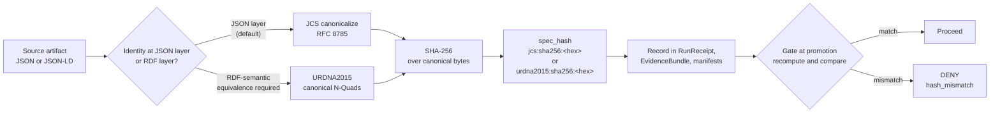
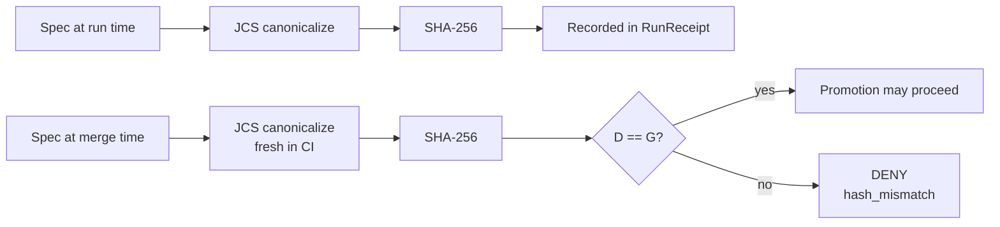

<!-- [KFM_META_BLOCK_V2]
doc_id: kfm://doc/standards/canonicalization
title: KFM Canonicalization Standard — JCS · URDNA2015 · spec_hash
type: standard
version: v1
status: draft
owners: <docs-steward + evidence-foundations-owner>   # placeholder, NEEDS VERIFICATION
created: 2026-05-14
updated: 2026-05-14
policy_label: public
related:
  - docs/doctrine/lifecycle-law.md
  - docs/doctrine/truth-posture.md
  - docs/doctrine/directory-rules.md
  - docs/adr/ADR-0001-schema-home.md
  - docs/standards/RUN_RECEIPT.md            # PROPOSED sibling, NEEDS VERIFICATION
  - schemas/evidence/spec_normalization.md   # PROPOSED, NEEDS VERIFICATION
  - tools/spec_hash/jcs_hash.py              # PROPOSED, NEEDS VERIFICATION
tags: [kfm, canonicalization, hashing, jcs, urdna2015, spec-hash, evidence]
notes:
  - JCS is the KFM default; URDNA2015 is invoked only for RDF-semantic equivalence.
  - All path claims are PROPOSED until verified against mounted-repo evidence.
[/KFM_META_BLOCK_V2] -->

# KFM Canonicalization Standard — JCS, URDNA2015, and `spec_hash`

> **Deterministic canonical bytes are the precondition for every downstream gate. This doc fixes how KFM canonicalizes JSON and JSON‑LD, how it derives `spec_hash`, and when (rarely) it switches to RDF dataset canonicalization.**


| Status | Owners | Last updated |
|---|---|---|
| `draft` — accepting review | `<docs-steward + evidence-foundations-owner>` *(placeholder)* | 2026-05-14 |

---

## Quick links

- [1. Purpose](#1-purpose)
- [2. Scope and authority](#2-scope-and-authority)
- [3. Doctrinal summary](#3-doctrinal-summary)
- [4. Decision matrix — JCS vs URDNA2015](#4-decision-matrix--jcs-vs-urdna2015)
- [5. Canonical form (JCS, default)](#5-canonical-form-jcs-default)
- [6. RDF canonical form (URDNA2015, reserved)](#6-rdf-canonical-form-urdna2015-reserved)
- [7. `spec_hash` format and recording rules](#7-spec_hash-format-and-recording-rules)
- [8. Field inclusion and exclusion](#8-field-inclusion-and-exclusion)
- [9. Promotion gates and parity rule](#9-promotion-gates-and-parity-rule)
- [10. Failure modes and error codes](#10-failure-modes-and-error-codes)
- [11. Test vectors and determinism guarantees](#11-test-vectors-and-determinism-guarantees)
- [12. Tooling](#12-tooling)
- [13. Versioning and migration](#13-versioning-and-migration)
- [14. Open questions and unresolved tensions](#14-open-questions-and-unresolved-tensions)
- [15. Related docs](#15-related-docs)
- [Appendix A — Worked examples](#appendix-a--worked-examples-illustrative)
- [Appendix B — Reference list](#appendix-b--reference-list)

---

## 1. Purpose

Canonicalization is the property that turns a JSON or JSON-LD document into a deterministic byte string so that hashing, signing, and gate comparison are reproducible across runs, environments, and languages. Without it, every other governance commitment in KFM — `spec_hash`, `RunReceipt`, `EvidenceBundle` identity, promotion gates, attestations, rollback targets — degrades into the appearance of rigor rather than the substance.

This standard fixes:

- The **default** canonicalization (RFC 8785 JCS, then SHA-256). **CONFIRMED** per doctrine (C1-02).
- The **reserved** case for RDF dataset canonicalization (W3C URDNA2015). **CONFIRMED** per doctrine (C8-05).
- The **format** for recording the digest (`jcs:sha256:<hex>`). **CONFIRMED** per doctrine (C1-02).
- The **fields** that contribute to evidentiary identity and those that MUST be excluded. **CONFIRMED** in concept; field list is PROPOSED pending `schemas/evidence/spec_normalization.md`.
- The **gates** that enforce parity at promotion. **CONFIRMED** per doctrine (C5-04, C5-02).

> [!IMPORTANT]
> Canonicalization is not a stylistic choice. A `spec_hash` computed over developer-formatted JSON is **invalid** by KFM doctrine. Promotion MUST recompute the canonical bytes and SHA-256 from scratch and compare.

---

## 2. Scope and authority

### 2.1 In scope

- Canonical form of any KFM JSON or JSON-LD artifact that feeds `spec_hash`: `SourceDescriptor`, `EvidenceBundle`, `EvidenceRef`, `RunReceipt`, `PromotionDecision`, `ReleaseManifest`, `RollbackCard`, schema documents, contract documents, layer/tile manifests, policy bundles, and any specification under version control.
- The choice of canonicalization algorithm by artifact class.
- The digest algorithm and recording format.
- The fields that are evidentiary (hashed) and the fields that are transient (excluded).
- The CI parity rule and failure modes that follow from a hash mismatch.

### 2.2 Out of scope

- Object meaning (`contracts/`).
- Field shape (`schemas/`).
- Admissibility and publication decisions (`policy/`, `release/`).
- Signing keys, transparency log policy, attestation envelopes — see the (PROPOSED) `docs/standards/RUN_RECEIPT.md` and the DSSE/cosign sections of the run-receipt doctrine.

### 2.3 Authority

| Rank | Source | Bearing |
|---|---|---|
| 1 | KFM core invariants and doctrine | Lifecycle law, truth posture, trust membrane. |
| 2 | ADRs explicitly amending this standard | Required for any change to the algorithm freeze (§13). |
| 3 | This document | Canonical for KFM canonicalization. |
| 4 | Per-root READMEs | May refine, MUST NOT contradict. |
| 5 | RFC 8785 (JCS); W3C URDNA2015 (RDF Dataset Canonicalization, 2015 Working Group Note) | External standards KFM conforms to; cited as standards, not as KFM authority. **EXTERNAL** |

> [!NOTE]
> The Directory Rules place this file under `docs/standards/` because it documents external standards KFM conforms to (RFC 8785, W3C URDNA2015) alongside their KFM-specific bindings. Path is **CONFIRMED** by Directory Rules §6.1; the surrounding files referenced from here are **PROPOSED** until verified against mounted-repo evidence.

---

## 3. Doctrinal summary



**The single rule that organizes everything else:** canonicalize first, hash second, never the other way around. The hash function is interchangeable in principle; the canonicalization step is what makes the digest reproducible.

---

## 4. Decision matrix — JCS vs URDNA2015

> [!IMPORTANT]
> JCS is the default for every artifact class in KFM unless a specific consumer explicitly requires RDF-semantic equivalence. URDNA2015 is reserved; switching is a policy-significant decision recorded in the receipt.

| Artifact class | Layer | Canonicalization | Recorded as |
|---|---|---|---|
| `SourceDescriptor` | JSON | **JCS** | `jcs:sha256:<hex>` |
| `RunReceipt` | JSON | **JCS** | `jcs:sha256:<hex>` |
| `EvidenceRef` | JSON | **JCS** | `jcs:sha256:<hex>` |
| `EvidenceBundle` (JSON form) | JSON | **JCS** | `jcs:sha256:<hex>` |
| `EvidenceBundle` (JSON-LD form, JSON-shaped consumers) | JSON-LD treated as JSON | **JCS** | `jcs:sha256:<hex>` |
| `EvidenceBundle` (JSON-LD form, RDF-semantic consumers) | RDF dataset | **URDNA2015** | `urdna2015:sha256:<hex>` |
| `PromotionDecision` | JSON | **JCS** | `jcs:sha256:<hex>` |
| `ReleaseManifest` | JSON | **JCS** | `jcs:sha256:<hex>` |
| `RollbackCard` | JSON | **JCS** | `jcs:sha256:<hex>` |
| `LayerManifest`, `StyleManifest`, `TileArtifactManifest`, `MapReleaseManifest` | JSON | **JCS** | `jcs:sha256:<hex>` |
| Schema document (JSON Schema) | JSON | **JCS** | `jcs:sha256:<hex>` |
| Contract document (JSON or YAML serialized as JSON) | JSON | **JCS** | `jcs:sha256:<hex>` |
| Policy bundle (Rego compiled artifact) | Out of this standard's scope | n/a — handled via OPA bundle digest | per OPA bundle convention |

**Rule of thumb.** If a downstream consumer ever asks "are these two RDF graphs equivalent?" (e.g., a federated SPARQL query merging KFM bundles with non-KFM RDF), URDNA2015 applies for *that* comparison. The KFM-internal identity of the same bundle remains its JCS hash. A bundle MAY carry **both** hashes; if it does, both are recorded and both can be verified independently.

---

## 5. Canonical form (JCS, default)

### 5.1 What JCS does

JCS (RFC 8785) imposes a deterministic ordering of keys, removes whitespace variance, and normalizes number and string representations so that the same logical document always produces the same canonical byte string regardless of which tool serialized it. **EXTERNAL** — RFC 8785 is the normative reference.

### 5.2 KFM requirements

All signing inputs and `spec_hash` inputs MUST:

- be encoded as **UTF-8**;
- use **lexicographic key ordering** across every object;
- use **compact separators** (`,` and `:`, no spaces);
- carry **no trailing whitespace** and no insignificant whitespace;
- use **normalized number representation** (no leading zeros, no trailing zeros after a decimal point that don't change value, exponential form normalized per JCS);
- avoid **floating-point ambiguity** — see §5.4.

### 5.3 Minimal reference

> [!NOTE]
> The snippet below is **illustrative**, not the official tool. It approximates JCS using `json.dumps(..., sort_keys=True, separators=(",", ":"))`, which is sufficient for many KFM artifacts but is **not** byte-identical to RFC 8785 in every edge case (notably number normalization). The pinned implementation is the **only** authoritative source — see §12.

```python
# Illustrative — not the pinned implementation.
import json, hashlib

def kfm_jcs_sha256(obj: dict) -> str:
    """
    Approximation of JCS+SHA-256 for KFM artifacts.

    For production hashing, use the pinned implementation referenced in §12,
    not this snippet. JCS specifies number normalization that bare
    json.dumps does not perform.
    """
    canonical = json.dumps(
        obj,
        sort_keys=True,
        separators=(",", ":"),
        ensure_ascii=False,
    ).encode("utf-8")
    return "jcs:sha256:" + hashlib.sha256(canonical).hexdigest()
```

### 5.4 Number handling — a known foot-gun

JCS normalizes numbers. Naive `json.dumps` does not. For documents that contain only integers, ISO-8601 date strings, and short decimals where the spec author has already chosen a fixed string representation, the approximation in §5.3 is generally sufficient. For documents containing floats, scientific notation, or values produced by language-specific JSON encoders, the **pinned JCS implementation** MUST be used. **NEEDS VERIFICATION** — the recipe in the corpus shows a placeholder ("replace this with a real JCS lib once you lock your runtime") and the pinned implementation is not yet committed (C1-02).

> [!WARNING]
> A `spec_hash` computed by a non-JCS approximation MAY pass locally and **fail** in CI when a JCS-correct implementation produces different canonical bytes. Authors MUST run the pinned canonicalizer before committing any artifact that participates in `spec_hash` parity.

---

## 6. RDF canonical form (URDNA2015, reserved)

### 6.1 When to invoke URDNA2015

URDNA2015 (W3C URDNA2015 — Universal RDF Dataset Normalization Algorithm 2015) is invoked **only** when the relevant invariant is RDF-semantic equivalence. **EXTERNAL** — W3C reference.

Typical triggers (all rare in current KFM lanes):

- A federated SPARQL query merges KFM `EvidenceBundle` graphs with non-KFM RDF and the consumer needs to detect graph-isomorphism-level equivalence.
- A downstream catalog claims byte-identical RDF interchange (e.g., a partner expects URDNA2015 hashes over an N-Quads serialization).
- A migration consolidates JSON-LD bundles whose `@context` lists may differ stylistically but yield isomorphic RDF.

If none of those apply, **use JCS**.

### 6.2 How it is recorded

When invoked, the digest is recorded as `urdna2015:sha256:<hex>`, distinct from the JCS digest. A bundle MAY carry both prefixed digests in its receipt; gate comparisons MUST use the prefix matching the algorithm being verified.

### 6.3 Known limitations

> [!CAUTION]
> URDNA2015 implementations vary in their handling of edge cases — blank nodes, datatype literals, language tags. Reproducibility across implementations is **not** guaranteed without a test-vector suite, which KFM has not yet adopted. Until the test-vector suite is in place, treat URDNA2015 hashes as **NEEDS VERIFICATION** for cross-implementation comparison (C8-05).

> [!NOTE]
> The W3C has since worked on a successor specification (RDF Dataset Canonicalization, RDFC-1.0). The KFM doctrinal corpus names **URDNA2015** specifically; whether to migrate to a successor is a future ADR. Until that ADR exists, this standard says **URDNA2015**. **NEEDS VERIFICATION** for currency of the W3C reference.

---

## 7. `spec_hash` format and recording rules

### 7.1 Format

A KFM `spec_hash` is a tagged digest:

```text
<algo>:<digest-algo>:<hex>
```

- `<algo>` is `jcs` (default) or `urdna2015` (reserved).
- `<digest-algo>` is `sha256` (fixed for v1 — see §13).
- `<hex>` is the lowercase hexadecimal SHA-256 over the canonical bytes.

**Example.** A JCS hash recorded in a `RunReceipt`:

```json
{
  "spec_hash": "jcs:sha256:9f86d081884c7d659a2feaa0c55ad015a3bf4f1b2b0b822cd15d6c15b0f00a08",
  "kfm_spec_version": "vNext",
  "target_zone": "CATALOG"
}
```

### 7.2 Where it appears

`spec_hash` MUST appear in:

- Every `RunReceipt`.
- Every `EvidenceBundle` (at the top level).
- Every `EvidenceRef`, where it identifies the target bundle.
- Every `PromotionDecision` payload subject to a spec-hash-match gate.
- Every `ReleaseManifest` entry that pins an artifact's identity.

`spec_hash` SHOULD also be surfaced in:

- STAC Item `properties.kfm:spec_hash` (per the STAC × KFM profile).
- DCAT Dataset / Distribution KFM extensions.
- `LayerManifest` and `StyleManifest` headers (per Master MapLibre Components ML-063-053 — CONFIRMED in doctrine; binding in `LayerManifest` is **PROPOSED** pending schema verification).

### 7.3 Recording in receipts

The `RunReceipt` records the algorithm explicitly via the `spec_hash` prefix. A receipt with `spec_hash: "sha256:<hex>"` (no algorithm prefix) is **invalid** and MUST be rejected by validators. **CONFIRMED** in concept; the exact validator name (`validate_run_receipt.py`) is **PROPOSED** pending `tools/validators/attest/` verification.

---

## 8. Field inclusion and exclusion

### 8.1 The principle

A `spec_hash` reflects the **evidentiary meaning** of an artifact, not the environment that produced it. Fields that change the evidentiary meaning MUST be included in the canonical bytes. Fields that capture transport, runtime, or transient state MUST be excluded so that re-running a deterministic pipeline yields the same hash.

### 8.2 Inclusion list (PROPOSED)

The following fields are part of `spec_hash` inputs for KFM evidence-bearing objects. **PROPOSED** — the authoritative list lives in `schemas/evidence/spec_normalization.md` (**NEEDS VERIFICATION** per the ADR draft).

| Field | Rationale |
|---|---|
| `object_type` | Defines the artifact's family. |
| `schema_version` | Different schema versions describe different objects. |
| `source_refs` / `dataset_refs` | Identifies the upstream evidence base. |
| `evidence_refs` | Identifies the supporting bundles. |
| `object_refs` | Captures graph linkage. |
| `policy_label` | Affects admissibility downstream. |
| `rights_status` | Changes who may consume the artifact. |
| `sensitivity` | Changes the policy posture. |
| All other fields that change evidentiary meaning | Per the schema's `spec_normalization_set` declaration. |

### 8.3 Exclusion list (PROPOSED)

The following fields MUST be excluded — they capture transient state and would rotate `spec_hash` for non-evidentiary reasons.

| Field | Rationale |
|---|---|
| `timestamp` (run time, fetch time, write time) | Transient. |
| Storage URLs (`s3://`, `oci://`, `ipfs://`) | Path-mutable. |
| Signature bytes (cosign signatures, Rekor entries) | Computed *over* the canonical bytes; can't be inside them. |
| Nonces, run IDs, worker IDs | Environment entropy. |
| Human-authored notes, draft labels, comments | Not evidentiary. |

> [!IMPORTANT]
> **Unknown or unsupported fields that materially change meaning but were excluded from the hash MUST cause a DENY** with `NormalizationError.field_exclusion_violation`. A field that affects evidentiary meaning is never silently dropped from the hash input.

---

## 9. Promotion gates and parity rule

### 9.1 The parity rule

The single property that makes KFM governance reproducible: **the `spec_hash` recorded at run time MUST equal the `spec_hash` recomputed in CI against the checked-in spec.** Mismatch is a hard fail. **CONFIRMED** per C5-04.



### 9.2 Where parity is enforced

| Stage | Enforced by | Result on mismatch |
|---|---|---|
| Pre-commit (developer machine) | Pre-commit hook running the pinned canonicalizer | Warning; commit allowed but flagged. **PROPOSED.** |
| CI (PR validation) | The same canonicalizer + OPA/Conftest policy | Promotion blocked. **CONFIRMED** in doctrine; concrete workflow path **PROPOSED**. |
| Promotion gate | OPA bundle pinned by digest | DENY; receipt enters quarantine. **CONFIRMED** per C5-02, C5-04. |
| Runtime admission (Kubernetes) | Gatekeeper / Validating Admission Webhook using the same Rego | Workload rejected. **CONFIRMED** per C5-03, C5-05; binding is **PROPOSED** pending infra. |

### 9.3 Default-deny

Promotion is denied unless:

- `spec_hash` is present **and** matches a fresh recomputation;
- the algorithm tag is on the approved list (`jcs:sha256` or `urdna2015:sha256` for bundles requesting RDF semantics);
- the receipt is cosign-verifiable (out of this standard's scope — see the RUN_RECEIPT standard);
- the algorithm tag in the receipt matches the recomputation method used at the gate.

> [!CAUTION]
> A receipt signed with one algorithm and verified against the other is a **policy violation**, not a recoverable condition. The algorithm tag is part of the identity, not metadata about it.

---

## 10. Failure modes and error codes

| Code | When raised | Validator outcome | Policy outcome |
|---|---|---|---|
| `NormalizationError.nondeterministic_serialization` | Same logical spec produces different bytes across languages / runs | ERROR | DENY |
| `NormalizationError.field_exclusion_violation` | A meaning-bearing field was excluded from the hash input | ERROR | DENY |
| `ResolutionError.missing_bundle` | `EvidenceRef.spec_hash` resolves to nothing in the catalog index | ABSTAIN | DENY (publication) |
| `ResolutionError.hash_mismatch` | `EvidenceRef.spec_hash` ≠ `EvidenceBundle.spec_hash` | FAIL | DENY |
| `HashAlgoUnsupported` | Algorithm tag is not on the approved list | FAIL | DENY |
| `HashAlgoMismatch` | Receipt's algorithm tag does not match the recomputation method | FAIL | DENY |
| `JCSImplementationMismatch` | Two pinned JCS implementations disagree on canonical bytes | ERROR | DENY; escalate to ADR |

Codes above align with the EvidenceRef/EvidenceBundle identity ADR draft (**PROPOSED**, see §15). Exact validator binding lives in `tools/validators/evidence/validate_identity.py` (**NEEDS VERIFICATION**).

---

## 11. Test vectors and determinism guarantees

### 11.1 The eight tests (PROPOSED)

All test vectors below MUST pass with **no network access**. They are negative/positive pairs.

| ID | Property | Outcome |
|---|---|---|
| **T1** | Round-trip determinism across `{Python, TypeScript, Go}` | Identical hex; identical derived IDs |
| **T2** | Whitespace and key-order irrelevance | Same `spec_hash` |
| **T3** | Semantic change rotates the hash | Different `spec_hash` |
| **T4** | Resolution happy path | ANSWER |
| **T5** | Missing bundle | ABSTAIN → DENY |
| **T6** | Forced mismatch | DENY (`hash_mismatch`) |
| **T7** | Cross-run stability (different machines / containers) | Identical hex |
| **T8** | Unsupported algorithm tag | DENY (`HashAlgoUnsupported`) |

### 11.2 Where test vectors live (PROPOSED)

`tests/fixtures/canonicalization/` is the **PROPOSED** home for the test-vector suite, with sibling positive and negative fixtures. Each fixture MUST carry an expected `spec_hash` value committed alongside the input. **NEEDS VERIFICATION** against repo evidence.

### 11.3 Pinning per language

The corpus recommends pinning one JCS implementation per language: Python, TypeScript, Go (C1-02). Each language's pinned version, library, and commit SHA MUST appear in a small registry. **PROPOSED** registry location: `control_plane/canonicalizer_registry.yaml`.

| Language | Status | Notes |
|---|---|---|
| Python | **PROPOSED** | `rfc8785` or `jcs` library, pinned by version |
| TypeScript | **PROPOSED** | One JCS package, pinned by version |
| Go | **PROPOSED** | One JCS package, pinned by version |

---

## 12. Tooling

### 12.1 `tools/spec_hash/jcs_hash.py` (PROPOSED)

A small Python utility that wraps the pinned JCS implementation, reads JSON from a file or stdin, emits `jcs:sha256:<hex>`. **PROPOSED** path; **NEEDS VERIFICATION**.

```text
usage:
  jcs_hash.py [--in FILE | -] [--prefix jcs|urdna2015] [--verify EXPECTED_HASH]

exit codes:
  0   PASS / hash printed
  1   FAIL (hash mismatch on --verify)
  2   ERROR (runtime / canonicalization failure)
  3   ABSTAIN (unresolved; e.g. unsupported algorithm tag)
```

### 12.2 `kfm-hash` CLI (PROPOSED)

A higher-level CLI exposed as a pre-commit hook and as the **only** authoritative way to compute `spec_hash` in CI. Wraps `jcs_hash.py` for JSON inputs; dispatches to a URDNA2015 implementation when invoked with `--rdf`. **PROPOSED** per C1-02 expansion directions; **NEEDS VERIFICATION**.

### 12.3 Validator binding (PROPOSED)

| Validator | Purpose | Path |
|---|---|---|
| `validate_run_receipt.py` | Receipt schema integrity, including `spec_hash` algorithm tag | `tools/validators/attest/` **PROPOSED** |
| `validate_identity.py` | EvidenceRef ↔ EvidenceBundle hash parity | `tools/validators/evidence/` **PROPOSED** |
| `validate_canonicalization.py` | Test-vector parity across pinned implementations | `tools/validators/canonicalization/` **PROPOSED** |

> [!NOTE]
> All tool paths above are **PROPOSED** per Directory Rules §0 because the live repository is not mounted in this session. They follow the responsibility-root convention: long-lived, trust-bearing logic lives under `tools/`, not `scripts/`.

---

## 13. Versioning and migration

### 13.1 Algorithm freeze (v1)

- **Canonicalization (default):** RFC 8785 JCS.
- **Canonicalization (reserved):** W3C URDNA2015 for RDF-semantic equivalence.
- **Digest algorithm:** SHA-256, fixed for v1.
- **Recording format:** `<algo>:sha256:<hex>`.

### 13.2 Migration ceremony

Any change to algorithm, recording format, or normalization rules requires:

1. An accepted **ADR** in `docs/adr/` describing context, decision, consequences, alternatives, migration plan, and rollback plan.
2. A **dual-hash compatibility window** during which both old and new hashes are computed and recorded on every artifact.
3. **Backfill** of historical receipts (offline dual-index: `old_id` → new `spec_hash`).
4. A **correction notice** appended to the relevant catalog records.
5. A **policy flip** at the end of the window: the new algorithm becomes required; the old becomes a warn-only or deny condition per the ADR.

> [!WARNING]
> Hash rotation is policy-significant. It is not a maintenance task. Authors MUST NOT rotate `spec_hash` algorithms without ADR approval, even for arguably-better alternatives.

### 13.3 Document version

This standard is `v1`. Subsequent revisions bump the version in the meta block. Anchor stability is best-effort; if a heading anchor must change, the change is flagged in the release notes.

---

## 14. Open questions and unresolved tensions

> [!NOTE]
> This section catalogues items that are not resolved by current doctrine. They are not blocking the use of this standard, but they are the next decisions to make as evidence and review accumulate.

- **Q1.** Which JSON-LD evidence bundles, if any, currently require URDNA2015 in production? The corpus suggests "few or none today" (C1-02 open question). **UNKNOWN** until live consumers are surveyed.
- **Q2.** When a bundle carries both `jcs:sha256` and `urdna2015:sha256` hashes, which takes precedence for `kfm:id` and content-addressed storage paths? The corpus position is JCS (C8-05); a confirming ADR is **PROPOSED**.
- **Q3.** Does the W3C successor to URDNA2015 (RDF Dataset Canonicalization, RDFC-1.0) change KFM's recommendation? **NEEDS VERIFICATION**.
- **Q4.** Where exactly do per-language JCS pin records live? `control_plane/canonicalizer_registry.yaml` is **PROPOSED**.
- **Q5.** What is the SLA for the canonicalization-parity check in CI? **UNKNOWN**.
- **Q6.** Should the pre-commit hook block commits on canonicalization mismatch or only warn? Default in this draft is **warn**, but reviewers may prefer **block**. **PROPOSED**.

---

## 15. Related docs

> [!NOTE]
> Links below are **PROPOSED** sibling paths. Files referenced from this standard live under the canonical roots named in Directory Rules but have not been individually verified in this session.

- `docs/doctrine/lifecycle-law.md` — RAW → WORK/QUARANTINE → PROCESSED → CATALOG/TRIPLET → PUBLISHED. **PROPOSED**.
- `docs/doctrine/truth-posture.md` — cite-or-abstain default. **PROPOSED**.
- `docs/doctrine/directory-rules.md` — `docs/standards/` placement authority. **CONFIRMED** as doctrine; on-disk path is **PROPOSED**.
- `docs/standards/RUN_RECEIPT.md` — `RunReceipt` shape and field-level discipline. **PROPOSED** sibling. **NEEDS VERIFICATION**.
- `docs/standards/STAC_DWC_PROFILE.md` — STAC × Darwin Core profile and its canonical form. **PROPOSED**.
- `docs/adr/ADR-0001-schema-home.md` — schema-home convention. **PROPOSED**.
- `docs/adr/ADR-00XX-evidence-identity-resolution.md` — EvidenceRef ↔ EvidenceBundle identity resolution. **PROPOSED draft** in the corpus.
- `schemas/evidence/spec_normalization.md` — the authoritative field-by-field normalization rules. **PROPOSED**. **NEEDS VERIFICATION**.
- `schemas/run_receipt.v1.schema.json` — the `RunReceipt` JSON Schema. **PROPOSED**.
- `tools/spec_hash/jcs_hash.py` — JCS hashing utility. **PROPOSED**.
- `tools/validators/evidence/validate_identity.py` — identity validator. **PROPOSED**.
- `tools/validators/canonicalization/validate_canonicalization.py` — test-vector parity validator. **PROPOSED**.
- `control_plane/canonicalizer_registry.yaml` — pinned implementations per language. **PROPOSED**.

[Back to top](#kfm-canonicalization-standard--jcs-urdna2015-and-spec_hash)

---

## Appendix A — Worked examples (illustrative)

<details>
<summary><strong>A.1 — Minimal JCS hash of an EvidenceRef</strong></summary>

> Illustrative input and expected behavior. The exact hex below is **NOT** a committed test vector; do not rely on it.

**Input (developer-formatted JSON):**

```json
{
  "object_type": "EvidenceRef",
  "schema_version": "v1",
  "spec_hash": "jcs:sha256:9f86d081884c7d659a2feaa0c55ad015a3bf4f1b2b0b822cd15d6c15b0f00a08",
  "policy_label": "public",
  "rights_status": "open",
  "sensitivity": "public"
}
```

**Canonical bytes (JCS-equivalent compact form):**

```text
{"object_type":"EvidenceRef","policy_label":"public","rights_status":"open","schema_version":"v1","sensitivity":"public","spec_hash":"jcs:sha256:9f86d081884c7d659a2feaa0c55ad015a3bf4f1b2b0b822cd15d6c15b0f00a08"}
```

**Recorded form:** `jcs:sha256:<hex of the canonical bytes above>`.

> The target hash is itself a field in the EvidenceRef, *referring to a separate bundle*. The EvidenceRef has its own `evidence_ref_id` derived from the target bundle's `spec_hash` per the identity ADR.

</details>

<details>
<summary><strong>A.2 — Whitespace and key order do not change the hash</strong></summary>

Both inputs below MUST produce the **same** `spec_hash`:

```json
{
  "schema_version": "v1",
  "object_type": "SourceDescriptor",
  "policy_label": "public"
}
```

```json
{"object_type":"SourceDescriptor","policy_label":"public","schema_version":"v1"}
```

This is the property that test T2 (§11.1) asserts.

</details>

<details>
<summary><strong>A.3 — Semantic change rotates the hash</strong></summary>

Changing **any** meaning-bearing field rotates the hash. For example, switching `rights_status` from `"open"` to `"restricted"` MUST produce a different `spec_hash`. This is the property that test T3 (§11.1) asserts and is the basis for `ResolutionError.hash_mismatch` at promotion.

</details>

<details>
<summary><strong>A.4 — Algorithm mismatch is a DENY, not a recoverable condition</strong></summary>

A receipt that records `spec_hash: "jcs:sha256:<hex>"` cannot be verified against a recomputation that used URDNA2015. The recomputed bytes are different by construction. Promotion DENIES with `HashAlgoMismatch`. The remediation is to recompute with the correct algorithm and re-sign the receipt.

</details>

[Back to top](#kfm-canonicalization-standard--jcs-urdna2015-and-spec_hash)

---

## Appendix B — Reference list

> [!NOTE]
> External references are listed by identifier as cited in the KFM doctrinal corpus. They are **EXTERNAL** standards KFM conforms to, not KFM authority. No additional web research was performed for this standard.

- **RFC 8785** — JSON Canonicalization Scheme (JCS). IETF, 2020. **EXTERNAL**.
- **W3C URDNA2015** — Universal RDF Dataset Normalization Algorithm 2015. W3C Working Group Note (2015). **EXTERNAL**. *Currency relative to any W3C successor: NEEDS VERIFICATION.*
- **NIST FIPS 180-4** — Secure Hash Standard (SHA-256). **EXTERNAL**.
- **KFM C1-02** — Deterministic `spec_hash` via JCS+SHA-256. **CONFIRMED** in KFM corpus.
- **KFM C8-04** — Evidence-Bundle JSON-LD as content-addressed graph fragment. **CONFIRMED**.
- **KFM C8-05** — JCS vs URDNA2015 canonicalization choice. **CONFIRMED**.
- **KFM C5-04** — Spec-hash-match required at promotion. **CONFIRMED**.
- **KFM C5-02** — Default-deny promotion. **CONFIRMED**.

---

**Related docs:**
`docs/doctrine/directory-rules.md` · `docs/standards/RUN_RECEIPT.md` *(PROPOSED)* · `docs/adr/ADR-0001-schema-home.md` *(PROPOSED)* · `schemas/evidence/spec_normalization.md` *(PROPOSED)*

**Last updated:** 2026-05-14 · **Version:** v1 · **Status:** draft

[Back to top](#kfm-canonicalization-standard--jcs-urdna2015-and-spec_hash)
