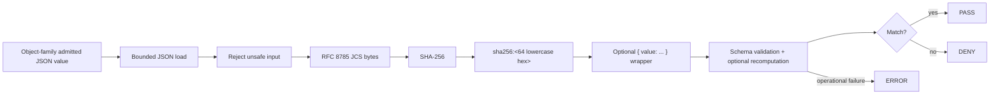

<!-- [KFM_META_BLOCK_V2]
doc_id: kfm://doc/standards/canonicalization
title: KFM Canonicalization Guidance — Current Implementation and Migration Boundary
type: standard
version: v1.1
status: "draft; repository-grounded; case-collision-held; non-authoritative"
owners: ["@bartytime4life"]
created: 2026-05-14
updated: 2026-08-18
policy_label: repository-facing
owning_root: docs/
current_path: docs/standards/CANONICALIZATION.md
responsibility: "Explain current RFC 8785 JCS plus SHA-256 behavior, the executable spec_hash grammar, its trust boundary, and governed migration requirements."
truth_posture: "CONFIRMED path, sibling collision, implementation, package/CLI, schemas, validator, tests, workflow, and proposed ADR state / PROPOSED migration target and RDF support / UNKNOWN exhaustive consumers and deployed use / NEEDS VERIFICATION stewardship, cross-language parity, and collision disposition"
evidence_snapshot:
  repository: bartytime4life/Kansas-Frontier-Matrix
  base_commit: 89ef13c4a14578a1813954b096496cbc5d003e2b
  prior_target_blob: 393a4450f64993c26b20d727656a1e6b6494db4e
  standards_readme_blob: a8cbe5d183448d5f0de37f8a4eacd6fcaca0d71b
  hashing_core_blob: a609eac44b1a5f24bd9ba449afedfeec7dd17e8e
  spec_hash_schema_blob: 80b496b01b8de8c0e8ba67bf020977e6b1f3c652
  spec_hash_validator_blob: e83a8707548c35411d1fc61911f499ac7ca6d517
  spec_hash_tests_blob: ce981cede288facfa449026e422acfe60a6e4d5d
  spec_hash_workflow_blob: 1da612211bf0d2e0bf339561bc06f336111d614e
related:
  - docs/standards/README.md
  - docs/standards/canonicalization.md
  - docs/doctrine/directory-rules.md
  - docs/adr/ADR-0013-spec_hash-and-run_id-identity-grammar.md
  - contracts/common/spec_hash.md
  - schemas/contracts/v1/common/spec_hash.schema.json
  - schemas/contracts/v1/runtime/run_receipt.schema.json
  - packages/hashing/src/hashing/core.py
  - tools/spec_hash/README.md
  - tools/validators/validate_spec_hash.py
  - tests/validators/test_validate_spec_hash.py
  - .github/workflows/spec-hash.yml
tags: [kfm, standards, canonicalization, rfc8785, jcs, sha256, spec-hash, identity, migration, case-collision]
notes:
  - "This update does not choose between CANONICALIZATION.md and canonicalization.md; STD-DRIFT-001 remains CONFLICTED / HOLD."
  - "Current executable behavior is RFC 8785 JCS plus SHA-256 with sha256:<64-lowercase-hex>."
  - "Proposed ADR-0013's jcs:sha256:<hex> target is not adopted or implemented by this change."
  - "No RDF canonicalizer, authority decision, lifecycle transition, release, deployment, or publication is created."
[/KFM_META_BLOCK_V2] -->

<a id="top"></a>
<a id="kfm-canonicalization-standard--jcs-urdna2015-and-spec_hash"></a>

# KFM Canonicalization Guidance — Current Implementation and Migration Boundary

> **Operating rule.** Canonicalize the admitted JSON value with RFC 8785 JCS, hash the canonical UTF-8 bytes with SHA-256, and compare only values produced under the same declared hash domain and canonicalization profile.


> [!IMPORTANT]
> **Human-readable guidance only.** Contracts define meaning, schemas define shape, policy decides admissibility, code and tests establish bounded behavior, and governed release records decide release. This page owns none of those decisions.

> [!CAUTION]
> **Case collision remains on hold.** Both [`CANONICALIZATION.md`](./CANONICALIZATION.md) and [`canonicalization.md`](./canonicalization.md) are tracked and declare the same document identity. [`docs/standards/README.md`](./README.md) records `STD-DRIFT-001 — CONFLICTED / HOLD`. This update does not select, rename, merge, tombstone, or delete either path.

> [!WARNING]
> **A matching digest is not truth.** It proves only equality under the same admitted value, hash domain, canonicalization profile, and algorithm. Source authority, evidence, rights, sensitivity, policy, review, promotion, release, publication, and fitness for use remain separate gates.

## Current status

| Surface | Current state | Posture |
|---|---|---|
| Generic JSON path | RFC 8785 JCS through `rfc8785==0.1.4`, then SHA-256 | **CONFIRMED implemented** |
| Executable scalar grammar | `sha256:<64-lowercase-hex>` | **CONFIRMED implemented** |
| Common wrapper | `{"value":"sha256:<hex>"}` | **CONFIRMED proposed schema** |
| Candidate grammar | `jcs:sha256:<hex>` | **PROPOSED by ADR-0013** |
| RDF path | No executable path verified | **UNKNOWN / NEEDS IMPLEMENTATION** |
| Validator | Finite `PASS`, `DENY`, `ERROR` | **CONFIRMED implemented** |
| Dedicated workflow | No-network tests and fixture validation | **CONFIRMED checked in** |
| Stewardship | Default repository review route exists | **NEEDS VERIFICATION** |

**Quick navigation:** [Purpose](#1-purpose) · [Authority](#2-scope-and-authority) · [Flow](#3-doctrinal-summary) · [Decision matrix](#4-decision-matrix--jcs-vs-urdna2015) · [JCS](#5-canonical-form-jcs-default) · [RDF](#6-rdf-canonical-form-urdna2015-reserved) · [`spec_hash`](#7-spec_hash-format-and-recording-rules) · [Hash domain](#8-field-inclusion-and-exclusion) · [Parity](#9-promotion-gates-and-parity-rule) · [Failures](#10-failure-modes-and-error-codes) · [Tests](#11-test-vectors-and-determinism-guarantees) · [Tooling](#12-tooling) · [Migration](#13-versioning-and-migration) · [Open work](#14-open-questions-and-unresolved-tensions) · [Related](#15-related-docs)

---

## 1. Purpose

Canonicalization converts an admitted data value into deterministic bytes so independent runs can compute and compare the same digest.

This revision:

1. documents the **current executable** JCS plus SHA-256 behavior;
2. separates it from ADR-0013's **proposed** `jcs:sha256:` target;
3. makes object-family field selection and normalization boundaries explicit; and
4. preserves the unresolved uppercase/lowercase collision.

The prior text described implemented utilities, validators, fixtures, and tests as proposals and treated `jcs:sha256:` as current. Repository evidence now shows a bounded implementation using the bare `sha256:` grammar. This is a documentation correction, not an executable or authority change.

[Back to top](#top)

---

## 2. Scope and authority

### 2.1 In scope

- RFC 8785 JCS and SHA-256 behavior.
- Current `sha256:<hex>` grammar and common wrapper.
- Bounded JSON input controls.
- Compute, verify, fixture, test, and workflow surfaces.
- Generic canonicalization versus object-family normalization.
- Future RDF and identity-migration requirements.
- Case-collision preservation.

### 2.2 Out of scope

- Object meaning or field-level machine authority.
- Generic inclusion/exclusion policy for every object family.
- Evidence, rights, sensitivity, or release decisions.
- Signature, key, transparency-log, and attestation policy.
- Source activation, promotion, release, deployment, or publication.
- ADR-0013 acceptance or case-collision disposition.

### 2.3 Authority map

| Question | Owner |
|---|---|
| Guidance placement | Adopted Directory Rules and `docs/standards/README.md` |
| `spec_hash` meaning | `contracts/common/spec_hash.md` |
| Machine-valid shape | `schemas/contracts/v1/common/spec_hash.schema.json` and consuming schemas |
| Current behavior | `packages/hashing/`, tools, validator, tests, and workflow |
| Candidate grammar | ADR-0013 decision state |
| Admissibility | `policy/` plus governed review |
| Release | Evidence, proof, review, and `release/` authorities |
| Case collision | Reviewed migration or accepted decision |

The same-path update remains under `docs/standards/`, the accepted human-readable standards lane. Reusable code stays under `packages/`; the operator wrapper under `tools/`; semantic meaning under `contracts/`; machine shape under `schemas/`; enforceability under fixtures and tests. No parallel authority home is created.

[Back to top](#top)

---

## 3. Doctrinal summary


```mermaid
flowchart LR
    A["Object-family admitted JSON value"] --> B["Bounded JSON load"]
    B --> C["Reject unsafe input"]
    C --> D["RFC 8785 JCS bytes"]
    D --> E["SHA-256"]
    E --> F["sha256:<64 lowercase hex>"]
    F --> G["Optional { value: ... } wrapper"]
    G --> H["Schema validation + optional recomputation"]
    H --> I{"Match?"}
    I -- yes --> J["PASS"]
    I -- no --> K["DENY"]
    H -- operational failure --> L["ERROR"]
```

Two separations are essential:

- **Projection before canonicalization.** The shared library does not decide which fields are meaning-bearing, transient, rounded, redacted, or excluded.
- **Integrity before governance.** A digest match can support later review; it cannot become evidence, policy, promotion, or release authority.

The implementation creates no lifecycle transition and does not turn a RAW, WORK, QUARANTINE, PROCESSED, CATALOG/TRIPLET, or release-support object into a stronger state.

[Back to top](#top)

---

## 4. Decision matrix — JCS vs URDNA2015

This heading is retained for link compatibility. Current terminology and implementation evidence narrow the decision:

| Concern | Disposition |
|---|---|
| JSON and JSON-shaped JSON-LD | RFC 8785 JCS + SHA-256 — **implemented** |
| Active wire grammar | `sha256:<hex>` — **implemented** |
| Candidate profile-tagged grammar | `jcs:sha256:<hex>` — **proposed, not adopted** |
| RDF external standard | W3C RDFC-1.0 Recommendation — **current external reference** |
| URDNA2015 | Predecessor name and lineage for RDFC-1.0 |
| KFM RDF implementation | **Not verified** |
| JSON/RDF dual identity | **No adopted rule or implementation verified** |
| Algorithm negotiation | **Not supported by current common schema** |

> [!IMPORTANT]
> JCS is the only verified KFM canonicalization implementation in this slice. Do not emit `jcs:`, `rdfc:`, or `urdna2015:` merely because documentation discusses them.

The W3C Recommendation published in 2024 names the algorithm **RDFC-1.0** and describes its relationship to URDNA2015. Any KFM adoption still requires a wire grammar, bounded implementation, test vectors, producer/consumer closure, and a governed migration decision.

[Back to top](#top)

---

## 5. Canonical form (JCS, default)

### 5.1 Current implementation contract

`packages/hashing/src/hashing/core.py` currently provides:

| Property | Behavior |
|---|---|
| Input | Parsed JSON value or bounded regular-file JSON |
| Encoding | UTF-8 |
| Canonicalization | `rfc8785.dumps(value)` |
| Digest | SHA-256 over canonical bytes |
| Output | `sha256:<64-lowercase-hex>` |
| Comparison | `hmac.compare_digest` |
| Network | None |
| Authority | Integrity computation only |

`packages/hashing/pyproject.toml` declares `kfm-hashing` `0.1.0`, Python 3.11 or later, `rfc8785==0.1.4`, and the `kfm-spec-hash` entry point.

### 5.2 Input controls

The loader rejects or bounds:

- non-regular or unsafe file inputs;
- more than 1,000,000 bytes;
- invalid UTF-8;
- duplicate object keys;
- `NaN` and infinities;
- excessively long integer text;
- values outside the admitted RFC 8785 number domain;
- depth above 64; and
- more than 4,096 document nodes.

These are package bounds, not universal KFM limits. Object-family contracts may be stricter.

### 5.3 JCS consequences

RFC 8785 constrains data to I-JSON, deterministically sorts object properties, emits no insignificant whitespace, preserves string data rather than applying Unicode normalization, and uses ECMAScript-compatible number serialization.

Therefore:

- key order and whitespace do not change the digest;
- array order remains meaningful;
- duplicate keys are rejected;
- non-interoperable high-precision numbers need an explicit object-family representation; and
- `json.dumps(sort_keys=True)` is not the implementation of record.

### 5.4 Deliberate non-effects

The generic canonicalizer does not select fields, remove timestamps, round coordinates, normalize units or dates, transform CRS or geometry, redact sensitivity, choose an object-family preimage, or create a receipt, signature, EvidenceBundle, proof, or release record.

The caller must construct and document the admitted hash-domain value before invoking it.

### 5.5 Commands

```bash
python tools/spec_hash/spec_hash.py compute path/to/subject.json

python tools/spec_hash/spec_hash.py verify \
  path/to/subject.json \
  path/to/spec_hash.json

python tools/validators/validate_spec_hash.py --fixtures

python tools/validators/validate_spec_hash.py \
  --candidate path/to/spec_hash.json \
  --subject path/to/subject.json
```

Use the shared package or thin wrapper. Do not reimplement canonicalization from illustrative snippets.

[Back to top](#top)

---

## 6. RDF canonical form (URDNA2015, reserved)

### 6.1 External status

W3C published **RDF Dataset Canonicalization (RDFC-1.0)** as a Recommendation on 21 May 2024. It produces canonical N-Quads and includes complexity and dataset-poisoning considerations. URDNA2015 is predecessor terminology documented by the Recommendation.

### 6.2 Current KFM status

No current executable path was verified for:

- RDF parsing and admitted input shape;
- RDFC-1.0 or URDNA2015 output;
- a KFM RDF digest prefix;
- W3C test-suite integration;
- complexity limits and timeouts;
- validator, workflow, producer, or consumer; or
- dual JSON/RDF identity and correction.

This guide therefore reserves no active RDF prefix.

### 6.3 Future admission gate

A future RDF slice must define the external version and test snapshot, in-scope object families, N-Quads contract, digest grammar, resource limits, positive and negative fixtures, cross-implementation parity, migration lineage, consumers, correction, and rollback. An accepted ADR is required when shared identity grammar changes.

[Back to top](#top)

---

## 7. `spec_hash` format and recording rules

### 7.1 Current grammar and wrapper

```text
sha256:<64 lowercase hexadecimal characters>
```

```json
{
  "value": "sha256:d3626ac30a87e6f7a6428233b3c68299976865fa5508e4267c5415c76af7a772"
}
```

The common schema uses the object wrapper. The current `RunReceipt` schema carries the same grammar as a scalar `spec_hash` string.

### 7.2 Candidate grammar

ADR-0013 proposes `jcs:sha256:<hex>`. It remains proposed and conflicts with current contracts, schemas, fixtures, validators, code, receipts, and consumers. This page cannot authorize that migration.

### 7.3 Meaning boundary

A `spec_hash` asks:

> Are these parties referring to the same admitted representation under the same hash-domain and canonicalization profile?

It does not prove the preimage was complete, a meaning-bearing field was included, evidence is sufficient, policy allows use, a signature is valid, or a release is public-safe.

Because the common schema does not carry a profile field, surrounding contracts and receipts must provide enough object-family, version, and profile context for comparison.

[Back to top](#top)

---

## 8. Field inclusion and exclusion

### 8.1 Current rule

The shared implementation hashes the **entire parsed value supplied by the caller**. It has no universal inclusion list, exclusion list, or implemented `spec_normalization_set` registry.

The prior edition's global field tables were proposals, not executable behavior.

### 8.2 Object-family declaration

A consequential hash domain should declare:

- object family and version;
- included and excluded fields;
- array-order semantics;
- numeric and string representation;
- spatial CRS, axis, precision, and geometry rules;
- temporal fields;
- redaction and sensitivity transforms; and
- compatibility and migration behavior.

If producers cannot show that they used the same preimage rules, equivalence remains `NEEDS VERIFICATION` and cannot authorize publication.

If a meaning-bearing field was omitted, correct the owning contract/profile, implementation, fixtures, validator, records, and rollback lineage. Do not relabel the old digest.

The separate GeoJSON feature-digest path demonstrates this design: explicit spatial preparation occurs before the shared JCS hash primitive.

[Back to top](#top)

---

## 9. Promotion gates and parity rule

### 9.1 Implemented parity slice

The validator can:

1. validate the common wrapper against its JSON Schema;
2. load an optional subject through the bounded loader;
3. recompute JCS plus SHA-256;
4. compare expected and actual values; and
5. return `PASS`, `DENY`, or `ERROR`.

The CLI separately reports creation, match, mismatch, invalid input, invalid format, and canonicalization failure.

### 9.2 Workflow scope

`.github/workflows/spec-hash.yml` uses read-only permissions and `KFM_NO_NETWORK=1`, installs declared test dependencies through the repository CI helper, runs `test_validate_spec_hash*.py`, validates fixtures, and verifies one generated authoring receipt.

Its path filters cover hashing implementation, tools, contract, schema, fixtures, tests, workflow, and selected receipts. They do not include this document.

> [!CAUTION]
> The workflow does not prove every KFM producer uses the same hash domain or that every promotion recomputes the digest. Universal producer/consumer and required-check closure remain `UNKNOWN`.

[Back to top](#top)

---

## 10. Failure modes and error codes

| Current status or finding | Class |
|---|---|
| `SPEC_HASH_CREATED` | Success |
| `SPEC_HASH_MATCH` | Success |
| `SPEC_HASH_MISMATCH` | Mismatch / `DENY` |
| `SPEC_HASH_SCHEMA_INVALID` | `DENY` |
| `SPEC_HASH_FORMAT_INVALID` | Error |
| `VALID_FIXTURE_REJECTED` / `INVALID_FIXTURE_ACCEPTED` | `DENY` |
| `CANDIDATE_JSON_INVALID` / `SUBJECT_JSON_INVALID` | `ERROR` |
| `JSON_INPUT_INVALID` | Error |
| `CANONICALIZATION_ERROR` | `ERROR` |
| `SCHEMA_UNAVAILABLE` | `ERROR` |

Response rules:

- On mismatch, inspect the subject, stored value, profile, and lineage; do not guess.
- Do not coerce duplicate keys, non-finite values, unsafe numbers, or malformed text.
- When the hash domain is unknown, abstain from equivalence claims.
- For consequential use, fail closed rather than hash developer-formatted bytes.
- Preserve historical records and corrections; do not rewrite history to match current bytes.

Validator outcomes create no source, evidence, policy, review, promotion, release, or publication authority.

[Back to top](#top)

---

## 11. Test vectors and determinism guarantees

`tests/validators/test_validate_spec_hash.py` checks:

1. known canonical bytes and key-order invariance;
2. SHA-256 agreement over JCS bytes;
3. valid/invalid fixture polarity;
4. match and mismatch recomputation;
5. input immutability;
6. unsafe-integer rejection;
7. duplicate-key rejection;
8. non-finite-number rejection;
9. deterministic CLI compute/verify output; and
10. validator fixture execution.

The inspected slice does **not** prove cross-language parity, RDF behavior, every object-family profile, every producer/consumer, universal promotion enforcement, deployed use, or full upstream conformance.

Any identity migration should add immutable positive and negative vectors binding the input, projection profile, expected canonical bytes where safe, digest, finite outcome, implementation version, and migration lineage.

[Back to top](#top)

---

## 12. Tooling

| Responsibility | Current path |
|---|---|
| Reusable library | `packages/hashing/src/hashing/` |
| Package/dependency pin | `packages/hashing/pyproject.toml` |
| Thin CLI wrapper | `tools/spec_hash/spec_hash.py` |
| Operator guidance | `tools/spec_hash/README.md` |
| Validator | `tools/validators/validate_spec_hash.py` |
| Semantic contract | `contracts/common/spec_hash.md` |
| Common schema | `schemas/contracts/v1/common/spec_hash.schema.json` |
| RunReceipt consumer shape | `schemas/contracts/v1/runtime/run_receipt.schema.json` |
| Fixtures | `fixtures/contracts/v1/common/spec_hash/` |
| Tests | `tests/validators/test_validate_spec_hash*.py` |
| Workflow | `.github/workflows/spec-hash.yml` |

The package exposes `kfm-spec-hash = hashing.cli:main`. Callers should reuse it rather than duplicate canonicalization logic.

A change to the pinned JCS dependency requires upstream/security review, golden replay, canonical-byte parity, package validation, affected-record analysis, and rollback. A dependency change that changes canonical bytes is an identity migration.

Canonicalization remains local and deterministic: no source fetch, external EvidenceBundle resolution, policy evaluation, signing, release, or publication.

[Back to top](#top)

---

## 13. Versioning and migration

### 13.1 Current bounded behavior

- Profile: `RFC8785-JCS`
- Digest: `SHA-256`
- Scalar grammar: `sha256:<64-lowercase-hex>`
- Common wrapper: `{ "value": "<scalar>" }`
- Package: `kfm-hashing` `0.1.0`
- Dependency: `rfc8785==0.1.4`

### 13.2 Governed-change matrix

| Change | Required closure |
|---|---|
| `sha256:` → `jcs:sha256:` | Accepted ADR; contract/schema, fixtures, validators, code, receipts, consumers, compatibility, rollback |
| Add RDF grammar | Accepted decision; RDFC implementation/vectors, limits, consumers, correction, rollback |
| Change JCS implementation | Dependency review, golden replay, cross-implementation comparison, impact analysis |
| Change object-family projection | Owning contract/profile, fixtures, validator, migration receipt, correction lineage |
| Change SHA-256 | Security/architecture decision, dual-digest window, consumer migration |
| Resolve case collision | Case-safe rename, links/fragments, consumers, alias or tombstone, rollback |

### 13.3 Migration sequence

1. Freeze old and candidate forms.
2. Inventory writers, readers, schemas, contracts, fixtures, receipts, catalogs, releases, and external consumers.
3. Accept the compatibility decision.
4. Implement dual-read or dual-record behavior only where specified.
5. Preserve historical records and emit migration receipts.
6. Prove replay and negative paths.
7. Switch writers only after readers are ready.
8. Preserve correction and rollback targets.
9. Retire compatibility only after verified zero-consumer closure.

### 13.4 Rollback

This documentation update can be reverted as one file. It changes no contract, schema, code, dependency, fixture, validator, workflow, source, lifecycle state, release, deployment, or publication.

For a future failed identity migration, prefer a reviewed forward fix or restore the documented compatibility window. Do not blindly restore incompatible writers.

[Back to top](#top)

---

## 14. Open questions and unresolved tensions

| ID | Question | Status |
|---|---|---|
| `CANON-Q1` | Which case variant survives, and what compatibility artifact is required? | `HOLD` |
| `CANON-Q2` | Is ADR-0013 accepted, revised, or rejected? | `PROPOSED` |
| `CANON-Q3` | Which object families currently produce or consume `spec_hash`? | `UNKNOWN` |
| `CANON-Q4` | Which projection profiles are authoritative? | `NEEDS VERIFICATION` |
| `CANON-Q5` | Which runtimes require cross-language parity? | `NEEDS VERIFICATION` |
| `CANON-Q6` | Does any current consumer need RDF-dataset equivalence? | `UNKNOWN` |
| `CANON-Q7` | What RDFC limits and test snapshot would KFM adopt? | `PROPOSED` |
| `CANON-Q8` | Is the dedicated workflow required for every affected producer? | `NEEDS VERIFICATION` |
| `CANON-Q9` | Who is the accountable canonicalization steward? | `NEEDS VERIFICATION` |
| `CANON-Q10` | Which adjacent docs still contain stale grammar or implementation claims? | `NEEDS VERIFICATION` |

None authorizes a rename, grammar migration, source activation, or release.

[Back to top](#top)

---

## 15. Related docs

### Governance and identity

- [`docs/standards/README.md`](./README.md) — lane boundary and `STD-DRIFT-001`.
- [`docs/doctrine/directory-rules.md`](../doctrine/directory-rules.md) — adopted placement law.
- [`docs/adr/ADR-0013-spec_hash-and-run_id-identity-grammar.md`](../adr/ADR-0013-spec_hash-and-run_id-identity-grammar.md) — proposed identity grammar.
- [`docs/architecture/identity-and-spec-hash.md`](../architecture/identity-and-spec-hash.md) — lineage with stale implementation claims requiring separate reconciliation.
- [`docs/standards/canonicalization.md`](./canonicalization.md) — overlapping sibling; still `HOLD`.

### Meaning, shape, implementation, and proof

- [`contracts/common/spec_hash.md`](../../contracts/common/spec_hash.md)
- [`schemas/contracts/v1/common/spec_hash.schema.json`](../../schemas/contracts/v1/common/spec_hash.schema.json)
- [`schemas/contracts/v1/runtime/run_receipt.schema.json`](../../schemas/contracts/v1/runtime/run_receipt.schema.json)
- [`packages/hashing/pyproject.toml`](../../packages/hashing/pyproject.toml)
- [`packages/hashing/src/hashing/core.py`](../../packages/hashing/src/hashing/core.py)
- [`tools/spec_hash/README.md`](../../tools/spec_hash/README.md)
- [`tools/validators/validate_spec_hash.py`](../../tools/validators/validate_spec_hash.py)
- [`tests/validators/test_validate_spec_hash.py`](../../tests/validators/test_validate_spec_hash.py)
- [`.github/workflows/spec-hash.yml`](../../.github/workflows/spec-hash.yml)

[Back to top](#top)

---

## Appendix A — Current worked example

Both inputs parse to the same value:

```json
{"b":1,"a":2}
```

```json
{
  "a": 2,
  "b": 1
}
```

Canonical bytes:

```text
{"a":2,"b":1}
```

Current digest:

```text
sha256:d3626ac30a87e6f7a6428233b3c68299976865fa5508e4267c5415c76af7a772
```

Current common wrapper:

```json
{
  "value": "sha256:d3626ac30a87e6f7a6428233b3c68299976865fa5508e4267c5415c76af7a772"
}
```

Array order remains meaningful, and semantic change rotates the digest. Do not relabel this value as `jcs:sha256:` without the migration in §13.

[Back to top](#top)

---

## Appendix B — References and change record

External references:

- [RFC 8785 — JSON Canonicalization Scheme](https://www.rfc-editor.org/rfc/rfc8785.html), June 2020.
- [W3C RDF Dataset Canonicalization — RDFC-1.0](https://www.w3.org/TR/rdf-canon/), Recommendation of 21 May 2024.

| Version | Date | Change |
|---|---|---|
| `v1` | 2026-05-14 | Initial draft |
| `v1.1` | 2026-08-18 | Repository-grounded same-path reconciliation; current JCS implementation and `sha256:` grammar; ADR/RDF/collision boundaries retained |

**Non-effects:** no collision disposition, ADR acceptance, contract/schema/policy/code/dependency/test/workflow change, source activation, lifecycle transition, release, deployment, or publication.

[Back to top](#top)