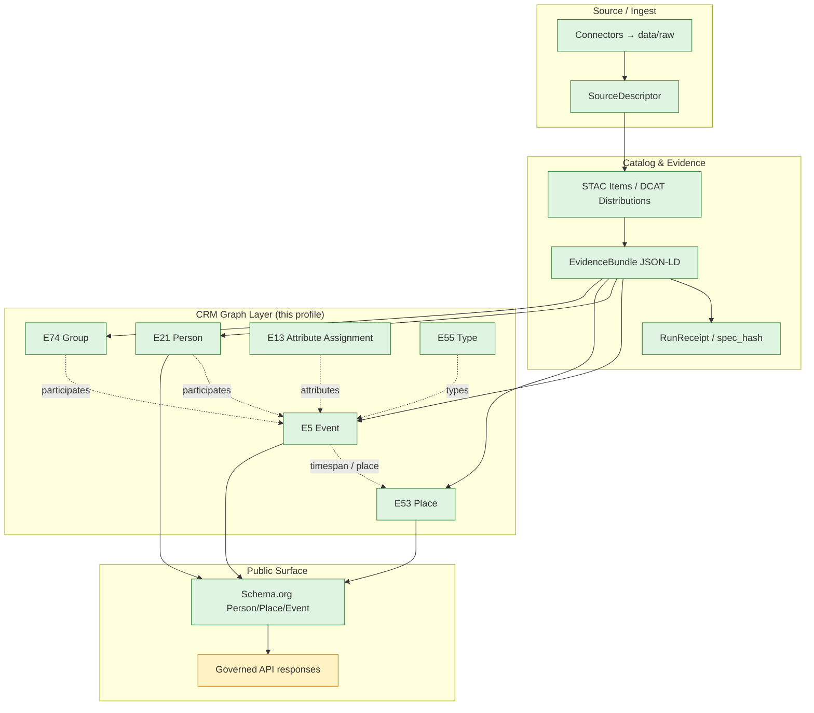
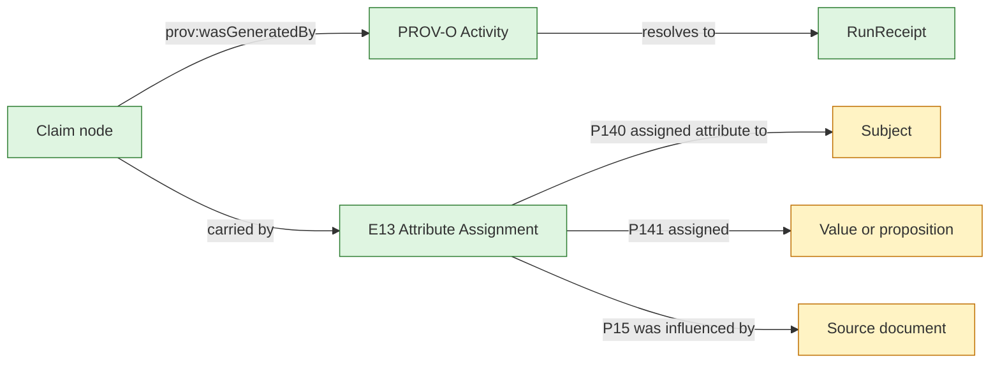

<!-- [KFM_META_BLOCK_V2]
doc_id: kfm://doc/standards/cidoc-crm
title: CIDOC-CRM — KFM Application Profile and Conformance Notes
type: standard
version: v1
status: draft
owners: TBD — governance/data steward (NEEDS VERIFICATION)
created: 2026-05-14
updated: 2026-05-14
policy_label: public
related:
  - docs/standards/PROV-O.md
  - docs/standards/SCHEMA-ORG.md
  - docs/standards/CANONICALIZATION.md
  - docs/standards/STAC_DWC_PROFILE.md
  - docs/doctrine/authority-ladder.md
  - docs/doctrine/lifecycle-law.md
  - docs/doctrine/directory-rules.md
tags: [kfm, standards, ontology, cidoc-crm, graph, evidence]
notes:
  - First-cut KFM CRM Application Profile drawn from C8-01 of the Pass 10 Idea Index.
  - All KFM-specific path claims are PROPOSED pending repo verification.
  - Several open questions are tracked, not resolved, per the corpus.
[/KFM_META_BLOCK_V2] -->

# CIDOC-CRM — KFM Application Profile and Conformance Notes

> The cultural-heritage backbone of the KFM person-place-event graph: which CRM classes KFM uses, how they bind to evidence, and where KFM extends or projects.


-informational)


<!-- TODO: replace placeholder badge URLs with real Shields.io endpoints once owners and CI targets are confirmed. -->

**Status:** draft · **Owners:** TBD — governance/data steward *(NEEDS VERIFICATION)* · **Last reviewed:** 2026-05-14

---

## Quick links

- [1. Scope](#1-scope)
- [2. Why CIDOC-CRM](#2-why-cidoc-crm)
- [3. In-scope class registry](#3-in-scope-class-registry)
- [4. How CRM sits in the KFM stack](#4-how-crm-sits-in-the-kfm-stack)
- [5. Property usage patterns](#5-property-usage-patterns)
- [6. KFM extensions: the `kfm:` namespace](#6-kfm-extensions-the-kfm-namespace)
- [7. CRM ↔ Schema.org projection](#7-crm--schemaorg-projection)
- [8. Evidence and provenance: E13 vs PROV-O](#8-evidence-and-provenance-e13-vs-prov-o)
- [9. JSON-LD context and canonicalization](#9-json-ld-context-and-canonicalization)
- [10. Conformance and validation expectations](#10-conformance-and-validation-expectations)
- [11. Worked example (illustrative)](#11-worked-example-illustrative)
- [12. Open questions](#12-open-questions)
- [13. Open verification items](#13-open-verification-items)
- [14. Related docs](#14-related-docs)
- [Appendix A — Class-by-class notes](#appendix-a--class-by-class-notes)
- [Appendix B — IRI conventions](#appendix-b--iri-conventions)

---

## 1. Scope

This document is KFM's **conformance and application profile** for the CIDOC Conceptual Reference Model (CRM). It names:

- The CRM classes KFM treats as **load-bearing** for the person-place-event graph.
- The KFM-specific extensions permitted under the `kfm:` namespace.
- The relationship between CRM, Schema.org, PROV-O/PAV, and KFM evidence bundles.
- The conformance expectations KFM places on any catalog record or evidence bundle that surfaces CRM-typed nodes.

It is **not** an introduction to CIDOC-CRM. Readers unfamiliar with CRM should start with the standard itself at `cidoc-crm.org` (ISO 21127). This document tells contributors what KFM uses, how, and why.

> [!NOTE]
> **Authority class.** This document is a *standard* under `docs/standards/`. It explains and constrains; it does not define object meaning (that lives in `contracts/`) or machine-checkable shape (that lives in `schemas/`). When this profile conflicts with `contracts/` or `schemas/`, the conflict is a drift entry, not a silent winner.

[Back to top](#cidoc-crm--kfm-application-profile-and-conformance-notes)

---

## 2. Why CIDOC-CRM

CIDOC-CRM is the international standard for cultural-heritage information (ISO 21127). KFM selects it as the graph backbone because **flat web vocabularies cannot carry the temporal and evidential nuance** that KFM's evidence-first doctrine requires:

- An **E5 Event** has both a timespan and a place; identity, kinship, residence, migration, and ownership all become events with provenance.
- An **E21 Person** can hold multiple **E82 Actor Appellations** across time, so name changes, aliases, and translations do not collapse a person's continuity.
- An **E13 Attribute Assignment** can carry the *evidence behind a claim*, which is the operational hinge KFM needs to wire claims to `EvidenceBundle` and `RunReceipt`.

> [!IMPORTANT]
> **CRM is the internal vocabulary, not the public surface.** Public clients consume Schema.org projections of CRM through the **governed API**. Direct CRM exposure to the open web is not the normal public path. See §7 and `docs/doctrine/trust-membrane.md`.

[Back to top](#cidoc-crm--kfm-application-profile-and-conformance-notes)

---

## 3. In-scope class registry

The classes below are the **load-bearing** types KFM commits to. Other CRM classes MAY be used inside an evidence bundle when justified, but only the load-bearing classes are guaranteed to participate in indexes, gates, and the CRM-to-Schema.org projection.

| CRM class | Role in KFM | Status | Common KFM use |
|---|---|---|---|
| **E5 Event** | Temporal anchor: who/what/where/when | CONFIRMED | Birth, death, migration, residence, transaction, observation |
| **E7 Activity** | Intentional action by an agent | CONFIRMED | Survey, ingest run, claim authoring, ceremony |
| **E21 Person** | Individual person identity | CONFIRMED | Historical figure, ancestor, named subject |
| **E53 Place** | Spatial extent or named location | CONFIRMED | Settlement, parcel, watershed locus, archaeological site |
| **E55 Type** | Controlled vocabulary value | CONFIRMED | Sensitivity tier, source role, event subtype |
| **E74 Group** | Collective agent (family, band, organization) | CONFIRMED | Family group, tribe/nation, corporation, agency |
| **E82 Actor Appellation** | Name held by an actor, time-bounded | CONFIRMED *(implied by corpus)* | Maiden name, anglicized name, regnal name |
| **E13 Attribute Assignment** | Reified claim with attribution | CONFIRMED | Wraps any attribute whose evidence must travel with it |

> [!TIP]
> **Rule of thumb.** If a fact varies over time, attach it through an `E5 Event` or `E13 Attribute Assignment` rather than as a direct property of the subject. CRM's temporal nuance is the reason KFM chose it; collapsing claims back into flat properties throws that nuance away.

Additional classes (e.g., **E22 Human-Made Object**, **E73 Information Object**, **E78 Curated Holding**) MAY appear inside evidence bundles where the domain demands them — for instance, archaeology artefacts or archival items — but their inclusion in the projection layer is **PROPOSED** until codified per domain.

[Back to top](#cidoc-crm--kfm-application-profile-and-conformance-notes)

---

## 4. How CRM sits in the KFM stack

CRM is the **derived projection** layer above the catalog and receipt layers; it is not the primary store. The graph is **rebuilt deterministically** from the catalog and receipts on every promotion.



> [!NOTE]
> **PROPOSED.** This diagram reflects the doctrine in C8 of the Pass 10 Idea Index. Concrete edge cardinalities, named CRM properties, and the exact projection rule are tracked in §5 and §7 and are **PROPOSED** until a paired JSON-LD context and projection module land. *(Evidence: corpus describes the projection in prose; the implementation surface is not verified in this session.)*

[Back to top](#cidoc-crm--kfm-application-profile-and-conformance-notes)

---

## 5. Property usage patterns

The corpus enumerates KFM's load-bearing **classes** but does not enumerate every property. The table below records the property bindings KFM uses in practice. **All property bindings are PROPOSED** until codified in a CRM JSON-LD context module shipped alongside this doc.

| Pattern | Subject → Object | Likely CRM property | Status |
|---|---|---|---|
| Event has a place | `E5 Event` → `E53 Place` | `P7 took place at` | PROPOSED |
| Event has a timespan | `E5 Event` → `E52 Time-Span` | `P4 has time-span` | PROPOSED |
| Person participates in event | `E21 Person` → `E5 Event` | `P11 had participant` | PROPOSED |
| Group participates in event | `E74 Group` → `E5 Event` | `P11 had participant` | PROPOSED |
| Activity carried out by person | `E7 Activity` → `E21 Person` | `P14 carried out by` | PROPOSED |
| Actor holds an appellation | `E21 Person` → `E82 Actor Appellation` | `P131 is identified by` | PROPOSED |
| Claim with attribution | `E13 Attribute Assignment` → claim object | `P140 / P141` | PROPOSED |
| Typed by controlled vocab | any → `E55 Type` | `P2 has type` | PROPOSED |

> [!CAUTION]
> **Naïve CRM produces unusable graphs.** The corpus warns explicitly that adopting CRM without an application profile produces graphs that are "correct in CRM terms but unusable by web consumers expecting Schema.org shapes." This profile exists to prevent that.

[Back to top](#cidoc-crm--kfm-application-profile-and-conformance-notes)

---

## 6. KFM extensions: the `kfm:` namespace

KFM extends CRM **only through the `kfm:` namespace**, and **only where the corpus identifies a clear gap**. Two such gaps are CONFIRMED in the corpus:

1. **Sensitivity tagging** — sensitivity tier, redaction profile, generalization method.
2. **Consent metadata** — authority to control, CARE fields, revocation pointers.

Other extensions (e.g., scale-support profiles, uncertainty surfaces, source-role enums) are **PROPOSED** and require an ADR before they enter the namespace.

| Extension area | Purpose | Status | Reference |
|---|---|---|---|
| `kfm:sensitivity` | Sensitivity tier / redaction profile | CONFIRMED *(doctrine)* | C6 Sensitivity Rubric |
| `kfm:care` | CARE / authority-to-control fields | CONFIRMED *(doctrine)* | C15-01, C15-02 |
| `kfm:provenance` | KFM-specific provenance fields | CONFIRMED *(doctrine)* | C4-01 STAC extension |
| `kfm:evidence_ref` | Pointer to evidence bundle | CONFIRMED *(doctrine)* | C4-04 |
| `kfm:spec_hash` | Deterministic identity digest | CONFIRMED *(doctrine)* | C1-02 |

> [!WARNING]
> **Namespace IRI base is NEEDS VERIFICATION.** The corpus uses the `kfm:` prefix throughout but does not pin the IRI base, the version-pinning strategy, or whether a Kansas-specific subnamespace (`ks-kfm:`) is appropriate for state-scoped extensions. This is named in §8.3 of the Pass 10 dossier as an unsettled question; an ADR is expected before the namespace stabilizes.

[Back to top](#cidoc-crm--kfm-application-profile-and-conformance-notes)

---

## 7. CRM ↔ Schema.org projection

KFM maintains **two views** of every published person, place, and event:

| View | Audience | Vocabulary | Strength |
|---|---|---|---|
| **Internal** | Pipelines, validators, scholars | CIDOC-CRM | Temporal nuance, evidence attribution |
| **Public** | Web crawlers, knowledge graphs, governed-API consumers | Schema.org | Wide consumer support, search discoverability |

The corpus is explicit: Schema.org is **necessary but insufficient** — necessary because it is the only vocabulary web consumers reliably understand, insufficient because its temporal and evidence modeling are weaker than CRM. KFM therefore maintains a **documented projection** between the two, so that consumers can pick the level they need.

> [!NOTE]
> **Projection module is PROPOSED.** The corpus names "Publish a documented CRM-to-Schema.org projection" as suggested future work under C8-01. Until a projection module exists in `packages/` (path PROPOSED) or `tools/generators/` (PROPOSED), the projection rule is doctrine-only.

A minimum projection rule, **PROPOSED**:

| CRM | Schema.org |
|---|---|
| `E21 Person` | `schema:Person` |
| `E53 Place` | `schema:Place` |
| `E5 Event` | `schema:Event` |
| `E74 Group` | `schema:Organization` *(when applicable)* |
| `E82 Actor Appellation` | `schema:alternateName` *(lossy; temporal scoping is dropped)* |
| `E13 Attribute Assignment` | *no direct equivalent; surfaced via `schema:citation` or omitted* |

> [!CAUTION]
> **The projection is lossy.** Temporal scoping on appellations, evidence on claims, and event timespans all degrade in the Schema.org view. The full fidelity always lives in the CRM form inside the evidence bundle.

[Back to top](#cidoc-crm--kfm-application-profile-and-conformance-notes)

---

## 8. Evidence and provenance: E13 vs PROV-O

CRM's `E13 Attribute Assignment` and W3C PROV-O's `Activity / Entity / Agent` model both express provenance — and the corpus acknowledges that **the dividing line between them is not fully settled**.

KFM's current posture, **CONFIRMED** as doctrine but **PROPOSED** as enforcement:

- **PROV-O / PAV** carry **claim-level provenance** at the graph layer. Every claim node has at least one `prov:wasGeneratedBy` edge that resolves to a `RunReceipt`.
- **CRM E13** carries **scholarly attribution**: who assigned an attribute to whom, in what document, with what reasoning.



> [!IMPORTANT]
> **An EvidenceRef must resolve to an EvidenceBundle before any public claim authority.** This is invariant across both PROV-O and E13 paths. A claim that cites a missing or stale bundle MUST not be promoted; the gate fails closed.

The detailed PROV-O profile lives in [`docs/standards/PROV-O.md`](./PROV-O.md). The boundary between PROV-O and E13 is named as an open question (§12).

[Back to top](#cidoc-crm--kfm-application-profile-and-conformance-notes)

---

## 9. JSON-LD context and canonicalization

CRM nodes ship inside **JSON-LD evidence bundles**, content-addressed by `spec_hash`. Two canonicalization regimes apply:

| Layer | Canonicalization | Use |
|---|---|---|
| JSON | **RFC 8785 JCS** + SHA-256 | Default for `spec_hash`, receipts, bundle identity |
| RDF | **W3C URDNA2015** + SHA-256 | Reserved for RDF-semantic equivalence (e.g., federated SPARQL) |

> [!WARNING]
> **JCS and URDNA2015 can disagree for the same logical bundle.** A consumer that uses URDNA2015 to verify a JCS-hashed bundle will fail verification silently. The decision rule lives in [`docs/standards/CANONICALIZATION.md`](./CANONICALIZATION.md). Do not switch canonicalization regimes without consulting that doc.

KFM bundles MUST declare:

- The CRM application-profile version (this document's `version` field).
- The Schema.org version pinned for the projection.
- The canonicalization algorithm used (`jcs:sha256` or `urdna2015:sha256`).
- The `kfm:` namespace IRI base *(PROPOSED — pending namespace ADR; see §6 and §12).*

[Back to top](#cidoc-crm--kfm-application-profile-and-conformance-notes)

---

## 10. Conformance and validation expectations

A KFM artifact is **CRM-conformant** in the sense of this profile if and only if all of the following hold. **Implementation maturity of each gate is PROPOSED**; the gates exist as doctrine, with validator paths to be confirmed against the repo.

| # | Expectation | Validator surface *(PROPOSED)* | Failure mode |
|---|---|---|---|
| 1 | Every node uses a class from §3 or a class declared in an accepted ADR | `tools/validators/evidence/...` | DENY |
| 2 | Every CRM IRI resolves under the CIDOC-CRM base or a declared extension namespace | `tools/validators/evidence/...` | DENY |
| 3 | Every claim node has either a `prov:wasGeneratedBy` edge or an `E13` wrapper | `tools/validators/evidence/...` | DENY |
| 4 | Every `EvidenceRef` resolves to an `EvidenceBundle` with matching `spec_hash` | promotion gate (Gate D / E) | DENY |
| 5 | Schema.org projection round-trips for every E21 / E53 / E5 in the projection set | projection smoke test | ABSTAIN → DENY |
| 6 | `kfm:` extensions appear only for declared extension areas (§6) | namespace validator | DENY |
| 7 | Canonicalization algorithm declared and matches recomputed digest | spec-hash gate (C5-04) | DENY |

> [!NOTE]
> **All validator paths in this table are PROPOSED.** They reflect the doctrine in C5 (gate matrix) and C8 (graph backbone) but are not verified against current repo evidence in this session.

[Back to top](#cidoc-crm--kfm-application-profile-and-conformance-notes)

---

## 11. Worked example (illustrative)

The fragment below is **illustrative**, not a fixture. It shows how a single life event — a homestead patent — would be expressed in this profile. IRI bases, exact property choices, and `kfm:` namespace are placeholders pending the namespace ADR.

```jsonc
{
  "@context": [
    "https://www.cidoc-crm.org/cidoc-crm/context.jsonld",
    "https://schema.org",
    "kfm://contexts/v1/kfm.jsonld"            // PROPOSED — see §6
  ],
  "@graph": [
    {
      "@id": "kfm://entity/person/jane-doe-1872",   // PROPOSED IRI scheme
      "@type": "crm:E21_Person",
      "crm:P131_is_identified_by": {
        "@type": "crm:E82_Actor_Appellation",
        "crm:label": "Jane Doe",
        "crm:P4_has_time_span": { "begin": "1872-01-01", "end": "1955-06-12" }
      }
    },
    {
      "@id": "kfm://event/homestead-patent-ks-1894-08-12",
      "@type": "crm:E5_Event",
      "crm:P2_has_type": { "@id": "kfm:type/event/HomesteadPatent" },
      "crm:P4_has_time_span": { "begin": "1894-08-12", "end": "1894-08-12" },
      "crm:P7_took_place_at": { "@id": "kfm://place/gnis/Kansas/..." },
      "crm:P11_had_participant": { "@id": "kfm://entity/person/jane-doe-1872" },
      "prov:wasGeneratedBy": { "@id": "kfm://activity/ingest/blm-glo-2026-05-14" },
      "kfm:evidence_ref": "eb-XXXXXXXXXXXXXXXXXXXXXXXXXX",
      "kfm:sensitivity": "T0"
    }
  ]
}
```

> [!NOTE]
> **Illustrative only.** Do not treat this as a normative fixture. The normative fixture set will live under `examples/standards/cidoc-crm/` *(path PROPOSED)*.

[Back to top](#cidoc-crm--kfm-application-profile-and-conformance-notes)

---

## 12. Open questions

The corpus is internally coherent on CRM as the graph backbone but leaves the following **explicitly unsettled**. None are answered here; this section exists so they are not rediscovered.

| # | Question | Source | Disposition |
|---|---|---|---|
| OQ-1 | Which CRM extensions (CRMsci, CRMarchaeo, CRMgeo) are in scope? | C8-01 | UNKNOWN — needs ADR |
| OQ-2 | Where exactly does PROV-O end and `E13` begin? | C8-03 | UNKNOWN — needs written demarcation guide |
| OQ-3 | What IRI base does `kfm:` resolve to? Is `ks-kfm:` a real subnamespace? | Pass 10 §8.3 | NEEDS VERIFICATION — needs namespace ADR |
| OQ-4 | What CIDOC-CRM version does KFM pin to? | not specified in corpus | NEEDS VERIFICATION |
| OQ-5 | Is the canonical occurrence form the STAC × DwC hybrid or DwC-A? | C4-03 | UNKNOWN — affects CRM bindings for natural-history domains |
| OQ-6 | Does the run receipt include the PROV-O Activity IRI directly, or is the link inferred? | C8-03 | UNKNOWN |
| OQ-7 | Should bundles support partial fetches? | C8-04 | UNKNOWN |

[Back to top](#cidoc-crm--kfm-application-profile-and-conformance-notes)

---

## 13. Open verification items

Items below cannot be confirmed in this session because the live repo is not mounted. They are recorded for the verification backlog, not asserted as fact.

- [ ] Verify that `docs/standards/CIDOC-CRM.md` does not already exist under another name or path.
- [ ] Confirm owners of the standards lane (CODEOWNERS-mapped).
- [ ] Verify that sibling docs `docs/standards/PROV-O.md`, `docs/standards/SCHEMA-ORG.md`, and `docs/standards/CANONICALIZATION.md` exist or are planned; if not, this doc's cross-links will need adjustment.
- [ ] Verify the CRM JSON-LD context module location *(PROPOSED: `packages/evidence-resolver/contexts/` or `schemas/contexts/`)*.
- [ ] Verify the validator paths in §10 against `tools/validators/`.
- [ ] Resolve the open questions in §12 through ADRs or namespace pinning.

[Back to top](#cidoc-crm--kfm-application-profile-and-conformance-notes)

---

## 14. Related docs

- [`docs/standards/PROV-O.md`](./PROV-O.md) — PROV-O and PAV claim-level provenance *(planned; placeholder)*
- [`docs/standards/SCHEMA-ORG.md`](./SCHEMA-ORG.md) — Schema.org web-surface projection *(planned; placeholder)*
- [`docs/standards/CANONICALIZATION.md`](./CANONICALIZATION.md) — JCS vs URDNA2015 decision matrix *(planned; placeholder)*
- [`docs/standards/STAC_DWC_PROFILE.md`](./STAC_DWC_PROFILE.md) — STAC × Darwin Core hybrid for natural-history records *(planned; placeholder)*
- [`docs/doctrine/authority-ladder.md`](../doctrine/authority-ladder.md) — what governs what
- [`docs/doctrine/lifecycle-law.md`](../doctrine/lifecycle-law.md) — RAW → WORK/QUARANTINE → PROCESSED → CATALOG/TRIPLET → PUBLISHED
- [`docs/doctrine/trust-membrane.md`](../doctrine/trust-membrane.md) — why CRM is not the public surface
- [`docs/doctrine/directory-rules.md`](../doctrine/directory-rules.md) — placement authority

---

## Appendix A — Class-by-class notes

<details>
<summary><strong>Expand class-by-class notes</strong></summary>

> All notes below reflect doctrine from C8-01 of the Pass 10 Idea Index plus profile-level guidance. Property bindings remain **PROPOSED** until the JSON-LD context module ships.

### E5 Event
The temporal anchor of the graph. KFM routes most relationships through events: birth/death, residence, migration, transaction, observation, ceremony. Every E5 should carry a timespan and at least one place reference; orphan events without both are a gate failure candidate.

### E7 Activity
A subclass of E5 with intentional agency. KFM uses E7 for ingest runs, claim authoring, surveys, and ceremonies — anything where "who did this on purpose" matters. Pipeline activities link to `RunReceipt` via `prov:wasGeneratedBy`.

### E21 Person
Individual persons. Living-person data is policy-significant (see C6 Sensitivity, C9 Genealogy/Genomics) and may require generalization, k-anonymity, or denial of publication. The People/DNA/Land dossier defines additional object families (`PersonCanonical`, `NameAssertion`, `LifeEvent`, `ResidenceEvent`, `MigrationEvent`) that project onto E21/E5/E82.

### E53 Place
Spatial extent or named location. KFM places anchor to GNIS, TGN, or domain authorities where possible. Precise location of sensitive sites (archaeology, rare species, living persons) is policy-gated; place geometry may be generalized or redacted at publication. See `docs/doctrine/trust-membrane.md`.

### E55 Type
Controlled-vocabulary terms. Used for source role, sensitivity tier, event subtype, redaction profile, and similar. Types live in registries; ad-hoc strings are not acceptable.

### E74 Group
Collective agents — families, bands, tribes/nations, corporations, agencies. CARE applicability lives largely on E74 references: a claim about a group may carry stewardship and authority-to-control constraints that an individual claim does not.

### E82 Actor Appellation
Names held by an actor, time-bounded. The corpus is explicit that an E21 Person can hold multiple E82 appellations across time. This is how KFM avoids collapsing maiden names, anglicizations, regnal names, and aliases into a single flat "name" string.

### E13 Attribute Assignment
The reified-claim construct. When a claim must carry evidence or attribution that survives republication, it lives inside an E13 rather than as a direct property. PROV-O carries the *system* provenance; E13 carries the *scholarly* attribution. See §8.

</details>

[Back to top](#cidoc-crm--kfm-application-profile-and-conformance-notes)

---

## Appendix B — IRI conventions

<details>
<summary><strong>Expand IRI conventions</strong></summary>

> The IRI bases below are **PROPOSED** until pinned by the namespace ADR (see OQ-3).

| Prefix | Base IRI *(PROPOSED)* | Status |
|---|---|---|
| `crm:` | `http://www.cidoc-crm.org/cidoc-crm/` | EXTERNAL — defined by CIDOC CRM-SIG |
| `schema:` | `https://schema.org/` | EXTERNAL — defined by schema.org |
| `prov:` | `http://www.w3.org/ns/prov#` | EXTERNAL — defined by W3C |
| `pav:` | `http://purl.org/pav/` | EXTERNAL — defined by PAV maintainers |
| `kfm:` | *(TBD — pending ADR)* | NEEDS VERIFICATION |
| `ks-kfm:` | *(TBD — only if state-scoped subnamespace is adopted)* | UNKNOWN |

KFM evidence bundles SHOULD declare the full prefix-to-IRI map in their `@context` rather than relying on an implicit default. A bundle whose `@context` omits one of the prefixes it actually uses fails the canonicalization gate.

</details>

[Back to top](#cidoc-crm--kfm-application-profile-and-conformance-notes)

---

<sub>**KFM standard** · doc-id: `kfm://doc/standards/cidoc-crm` · version: v1 · status: **draft** · last updated: 2026-05-14 · [Back to top](#cidoc-crm--kfm-application-profile-and-conformance-notes)</sub>
