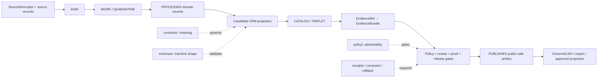
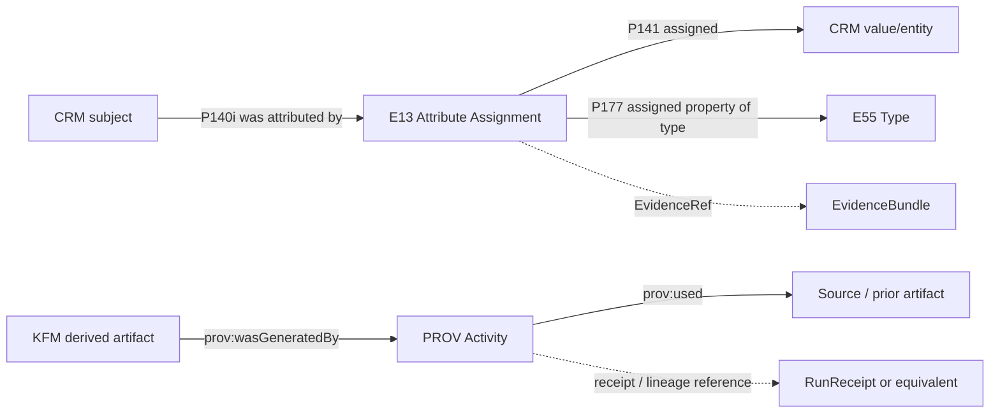

<!-- [KFM_META_BLOCK_V2]
doc_id: kfm://doc/standards/cidoc-crm
title: CIDOC CRM — KFM Application-Profile Boundary and Conformance Plan
type: standard; application-profile-guidance; interoperability-boundary
version: v2.0-draft
status: "draft; repository-grounded; upstream-currentness-refreshed; no-adoption; no-conformance-proof; no-release; no-publication"
owners:
  - "@bartytime4life — verified GitHub review route through CODEOWNERS"
  - "NEEDS VERIFICATION — knowledge-graph, cultural-heritage, archival-description, domain, rights/sensitivity, and release stewards"
created: 2026-05-14
updated: 2026-08-18
policy_label: repository-facing
owning_root: docs/
current_path: docs/standards/CIDOC-CRM.md
responsibility: >
  Explain the official CIDOC CRM baseline, the bounded KFM application-profile proposal,
  the current repository evidence and conflicts, and the gates required before KFM may claim
  implementation, conformance, release, or public interoperability.
truth_posture: >
  CONFIRMED current path, standards-lane placement, CODEOWNERS route, EvidenceBundle
  contract/schema boundary, canonicalization behavior, sibling-document presence, and official
  CIDOC CRM 7.1.3 / ISO 21127:2023 currentness / PROPOSED KFM class/property subset,
  graph-artifact model, Schema.org projection, E13-PROV demarcation, namespace, validators,
  fixtures, producers, consumers, and graduation sequence / UNKNOWN KFM adoption, executable
  CIDOC context, machine profile, runtime graph, released CRM artifact, deployed consumer,
  external interoperability, and accountable specialist stewardship.
evidence_snapshot:
  repository: bartytime4life/Kansas-Frontier-Matrix
  base_ref: main
  base_commit: 7ac9f151aacc03b03fd486a64b348743b7325a51
  target_prior_blob: 558fef25584fe9873f810253b596f4b499175a1b
  standards_readme_blob: a8cbe5d183448d5f0de37f8a4eacd6fcaca0d71b
  directory_rules_blob: fd49a0b83e55cef52c1124281f093e263526898d
  adr_0029_blob: a4de0d7a96b78da59cfc499d1025e1508afd8dd9
  codeowners_blob: dd2a84aa514d8ecd9208bc347f90f9a2ed37dd61
  evidence_bundle_contract_blob: 731c348832add23cddd14e796aa56ce2b9268259
  evidence_bundle_schema_blob: cf5256831b63dca46a5f68b168441adcf68b8751
  canonicalization_blob: dc1a945417e0abf6761ccb4980f03433d8e2ba64
external_currentness_review:
  access_date: 2026-08-18
  official_baseline: "CIDOC CRM 7.1.3, February 2024; ISO correspondence"
  iso_baseline: "ISO 21127:2023, edition 3, published October 2023"
  later_working_versions: "7.3, 7.3.1, and 7.3.2 are listed by CIDOC CRM as drafts"
related:
  - ./README.md
  - ./CANONICALIZATION.md
  - ./EVIDENCE_BUNDLE.md
  - ./PROV-O.md
  - ./PROV.md
  - ./PROVENANCE.md
  - ./SCHEMA-ORG.md
  - ./ARCHIVAL-STANDARDS.md
  - ../doctrine/directory-rules.md
  - ../doctrine/trust-membrane.md
  - ../adr/ADR-0029-adopt-directory-governance-standard-v2.md
  - ../../contracts/evidence/evidence_bundle.md
  - ../../schemas/contracts/v1/evidence/evidence_bundle.schema.json
  - ../../.github/CODEOWNERS
tags: [kfm, standards, cidoc-crm, iso-21127, ontology, cultural-heritage, graph, evidence, json-ld, conformance]
notes:
  - "Same-path documentation modernization only; no contract, schema, policy, implementation, fixture, validator, workflow, source, lifecycle object, release, deployment, or public artifact changes."
  - "The prior E82 Actor Appellation / P131 mapping is retired because E82 was deleted from current CIDOC CRM; the candidate KFM profile now uses E41 Appellation and P1."
  - "The current EvidenceBundle schema does not admit @context, @graph, or other undeclared top-level CRM members; graph embedding therefore remains unsupported without a reviewed machine-shape change."
  - "The document preserves prior section anchors so inbound links continue to resolve."
[/KFM_META_BLOCK_V2] -->

<a id="top"></a>
<a id="cidoc-crm--kfm-application-profile-and-conformance-notes"></a>

# CIDOC CRM — KFM Application-Profile Boundary and Conformance Plan

> **Purpose.** Explain what the official CIDOC Conceptual Reference Model provides, which subset KFM may profile, what the current repository actually supports, and what must close before KFM claims CIDOC CRM conformance or exposes a CRM-derived public product.


> [!IMPORTANT]
> **A standards page is not conformance proof.** This document does not adopt CIDOC CRM, define KFM object meaning, change a machine schema, authorize a source, certify a graph, approve a release, or prove that a producer or consumer interoperates.

> [!CAUTION]
> **Current EvidenceBundle shape does not carry a CRM graph.** The confirmed schema at [`schemas/contracts/v1/evidence/evidence_bundle.schema.json`](../../schemas/contracts/v1/evidence/evidence_bundle.schema.json) allows only its declared fields and sets `additionalProperties: false`. It does not admit top-level JSON-LD members such as `@context` or `@graph`. A CRM graph therefore requires a separately governed artifact family or a versioned contract/schema change; this page chooses neither.

> [!WARNING]
> **The former `E82 Actor Appellation` mapping is obsolete.** CIDOC CRM-SIG deleted E82 in December 2016. CIDOC CRM 7.1.3 uses `E41 Appellation`, normally reached through `P1 is identified by`. Do not emit `E82_Actor_Appellation` or `P131_is_identified_by` from this profile.

| Field | Current bounded result |
|---|---|
| **Directory result** | `PLACE` at the existing `docs/standards/CIDOC-CRM.md` path under the accepted standards-guidance lane |
| **Official upstream baseline** | CIDOC CRM **7.1.3**, released February 2024; corresponding ISO publication **ISO 21127:2023**, edition 3 |
| **Later upstream work** | CIDOC CRM 7.3, 7.3.1, and 7.3.2 are listed as **drafts**, not the official ISO-correspondence baseline |
| **KFM profile/adoption state** | **UNKNOWN / NEEDS VERIFICATION**; no accepted KFM CIDOC application profile was established in this review |
| **Machine implementation state** | Bounded repository search did not establish a CIDOC-specific context, schema, fixture family, validator, producer, consumer, or released graph artifact |
| **Evidence integration state** | EvidenceBundle meaning and shape exist, but the current closed schema does not contain a CRM/JSON-LD graph slot |
| **Public projection state** | `SCHEMA-ORG.md` exists as draft guidance; an executable CRM-to-Schema.org projection was not established |
| **Release/publication effect** | None |

**Quick navigation:** [Scope](#1-scope) · [Why CRM](#2-why-cidoc-crm) · [Classes](#3-in-scope-class-registry) · [Stack](#4-how-crm-sits-in-the-kfm-stack) · [Properties](#5-property-usage-patterns) · [Namespace](#6-kfm-extensions-the-kfm-namespace) · [Schema.org](#7-crm--schemaorg-projection) · [Evidence](#8-evidence-and-provenance-e13-vs-prov-o) · [JSON-LD](#9-json-ld-context-and-canonicalization) · [Conformance](#10-conformance-and-validation-expectations) · [Example](#11-worked-example-illustrative) · [Questions](#12-open-questions) · [Verification](#13-open-verification-items) · [Evidence ledger](#14-related-docs) · [Class notes](#appendix-a--class-by-class-notes) · [IRI rules](#appendix-b--iri-conventions)

---

<a id="1-scope"></a>

## 1. Scope, authority, and non-effects

### 1.1 What this page owns

This page owns human-readable standards guidance for:

- the official CIDOC CRM baseline and version posture;
- a bounded **candidate** KFM class/property subset;
- the difference between upstream CRM semantics and KFM adoption;
- the boundary among CRM, PROV-O, EvidenceBundle, Schema.org, contracts, schemas, policy, and release;
- known repository conflicts and unsupported claims; and
- the graduation evidence required before KFM may claim conformance.

### 1.2 What this page does not own

| Question | Owning authority |
|---|---|
| Where the guidance belongs | Accepted [`ADR-0029`](../adr/ADR-0029-adopt-directory-governance-standard-v2.md), [`directory-rules.md`](../doctrine/directory-rules.md), and [`docs/standards/README.md`](./README.md) |
| What a KFM graph, claim, person, place, event, or evidence object means | `contracts/` and accepted domain contracts |
| What machine shape is valid | `schemas/`, using the adopted Directory Rules route |
| What is allowed, denied, redacted, generalized, held, or abstained | `policy/` plus governed review |
| Whether a source may be used | Source admission, rights review, `SourceDescriptor`, and source registry |
| Whether code implements the profile | Exact-revision code, configuration, fixtures, validators, tests, and observed producers/consumers |
| Whether evidence supports a claim | `EvidenceRef` resolution to `EvidenceBundle` and the applicable evidence authorities |
| Whether an artifact may release or publish | Review, policy, proof, release, correction, and rollback authorities |
| What CIDOC CRM normatively means | The official CIDOC CRM specification and ISO 21127 |

### 1.3 Non-effects

This same-path revision does **not**:

- accept a KFM CIDOC CRM profile;
- pin a runtime dependency or remote context;
- create a KFM RDF namespace;
- add CRM fields to EvidenceBundle;
- select a graph store, query language, shape language, or projection package;
- modify `SCHEMA-ORG.md`, `PROV-O.md`, or another sibling document;
- activate archival, museum, genealogy, archaeology, or other sources;
- move any lifecycle object;
- release, deploy, or publish a graph or public projection.

[Back to top](#top)

---

<a id="2-why-cidoc-crm"></a>

## 2. Why CIDOC CRM—and what KFM has not adopted

CIDOC CRM is an ISO-standard reference ontology for integrating heterogeneous cultural-heritage and scholarly information. It is relevant to KFM because its event-centered model can distinguish actors, places, time-spans, activities, assignments, information objects, and types without flattening every statement into a direct property.

That relevance supports investigation and profile design. It does **not** prove that CIDOC CRM is KFM's canonical graph vocabulary or that current KFM producers emit it.

### 2.1 Useful modeling pressure

A future KFM profile could use CRM to express:

- an `E5 Event` located through `P7 took place at` and bounded through `P4 has time-span`;
- an `E7 Activity` linked to an `E39 Actor` through `P14 carried out by`;
- a person or group participating in an event through `P11 had participant`;
- an entity identified by an `E41 Appellation` through `P1 is identified by`; and
- an `E13 Attribute Assignment` that records who assigned what attribute to which entity.

### 2.2 Critical correction from the prior edition

The prior page treated `E82 Actor Appellation` as a current load-bearing class and paired it with `P131 is identified by`. That is not valid for the official 7.1.3 baseline:

- `E82 Actor Appellation` was deleted by CIDOC CRM-SIG in 2016;
- current naming uses `E41 Appellation`;
- the current general identification property is `P1 is identified by`;
- when the assignment event, responsible actor, or temporal context matters, model the assignment explicitly, for example with `E15 Identifier Assignment`, rather than attaching a time-span directly to an appellation.

### 2.3 State separation

Do not collapse these independent states:

| State | Meaning |
|---|---|
| Upstream publication | CIDOC CRM or ISO has published a specification |
| KFM profile decision | KFM has approved a bounded subset and local constraints |
| Machine-shape state | A versioned context/schema/shape exists |
| Implementation state | Producers and consumers operate against that profile |
| Validation state | Representative positive and negative fixtures are checked |
| Review state | Accountable domain, graph, rights, and security review is complete |
| Release state | A governed release contains profile-conformant artifacts |
| Publication state | Public-safe artifacts are exposed through governed delivery |
| Correction state | Supersession, withdrawal, cache invalidation, and rollback are traceable |

[Back to top](#top)

---

<a id="3-in-scope-class-registry"></a>

## 3. Official baseline and candidate class registry

### 3.1 Version baseline

| Surface | Current official status | KFM disposition |
|---|---|---|
| CIDOC CRM 7.1.3 | Official release, February 2024; ISO correspondence | **Reference baseline for this document** |
| ISO 21127:2023 | Published international standard, edition 3, October 2023 | **External normative anchor** |
| CIDOC CRM 7.3 / 7.3.1 / 7.3.2 | Drafts, most recent listed draft March 2026 | Track as upstream development; do not silently adopt |
| CRM extensions | Separate specifications and release cycles | Admit only through a reviewed KFM profile decision |

A future KFM profile must record the exact CRM version and any extension versions. “Latest” is not an acceptable release identifier.

### 3.2 Candidate core classes

The table distinguishes **upstream existence** from **KFM profile status**. All listed classes exist in CIDOC CRM 7.1.3. Their KFM roles remain proposed until a semantic contract or accepted profile decision makes them binding.

| CRM class | Candidate KFM role | KFM state |
|---|---|---|
| `E1 CRM Entity` | Root for profiled CRM entities | PROPOSED |
| `E2 Temporal Entity` | Root for time-bounded phenomena | PROPOSED |
| `E4 Period` | Phenomena extended over time and space | PROPOSED |
| `E5 Event` | Event participation, place, and temporal structure | PROPOSED |
| `E7 Activity` | Intentional action performed by actors | PROPOSED |
| `E13 Attribute Assignment` | Explicit act of assigning an attribute or relation | PROPOSED |
| `E21 Person` | Individual person | PROPOSED; policy-significant |
| `E39 Actor` | Common supertype for persons and groups | PROPOSED |
| `E41 Appellation` | Name or other appellation used to identify an entity | PROPOSED |
| `E52 Time-Span` | Temporal extent for temporal entities | PROPOSED |
| `E53 Place` | Place extent or named location | PROPOSED; sensitivity-aware |
| `E55 Type` | Controlled classification term | PROPOSED |
| `E74 Group` | Collective actor | PROPOSED; sovereignty/authority-aware |

### 3.3 Candidate optional classes

The following may be useful for particular lanes but are not part of a minimal KFM commitment:

| CRM class | Possible use | Admission dependency |
|---|---|---|
| `E15 Identifier Assignment` | Time- and actor-aware identifier assignment | Identity profile and fixtures |
| `E22 Human-Made Object` | Artefacts and constructed objects | Domain contract and rights review |
| `E31 Document` | Documentary evidence | Archival profile and source-role rules |
| `E73 Information Object` | Information-bearing conceptual objects | Evidence/artifact demarcation |
| `E78 Curated Holding` | Managed collection or holding | Custody and source-authority profile |
| `E89 Propositional Object` | Propositional content distinct from its carrier | Claim-model decision |
| `E90 Symbolic Object` | Symbolic content and serialized representations | Encoding and canonicalization profile |

> [!IMPORTANT]
> Do not reintroduce deleted or version-mismatched terms to preserve old examples. Migrations must map obsolete terms explicitly and retain the source version that gave them meaning.

[Back to top](#top)

---

<a id="4-how-crm-sits-in-the-kfm-stack"></a>

## 4. How CRM may sit in the KFM stack

CRM is best treated as a **candidate derived semantic projection**, not as a shortcut around KFM's lifecycle or evidence membrane.


```mermaid
flowchart LR
    SRC["SourceDescriptor + source records"] --> RAW["RAW"]
    RAW --> WQ["WORK / QUARANTINE"]
    WQ --> PROC["PROCESSED domain records"]
    PROC --> CAND["Candidate CRM projection"]
    CAND --> CAT["CATALOG / TRIPLET"]
    CAT --> EVID["EvidenceRef → EvidenceBundle"]
    EVID --> GATE["Policy + review + proof + release gates"]
    GATE --> PUB["PUBLISHED public-safe artifact"]
    PUB --> API["Governed API / export / approved projection"]

    CONTRACT["contracts/: meaning"] -. governs .-> CAND
    SHAPE["schemas/: machine shape"] -. validates .-> CAND
    POLICY["policy/: admissibility"] -. gates .-> GATE
    RECEIPT["receipts / correction / rollback"] -. supports .-> GATE
```

### 4.1 Current repository result

| Surface | Current evidence | Bounded conclusion |
|---|---|---|
| Human guidance | `CIDOC-CRM.md`, `SCHEMA-ORG.md`, `PROV-O.md`, and related pages exist | Documentation interest is confirmed |
| Evidence meaning | `contracts/evidence/evidence_bundle.md` exists | EvidenceBundle is claim-scope closure, not a graph profile |
| Evidence machine shape | `evidence_bundle.schema.json` is closed and fielded | Top-level CRM JSON-LD embedding is not currently valid |
| Canonicalization | `CANONICALIZATION.md` documents implemented JCS + SHA-256 and `sha256:<hex>` | JSON integrity behavior is bounded; RDF identity is not implemented |
| CIDOC-specific executable surfaces | Bounded searches for CIDOC terms and validators found no dedicated implementation | Implementation remains **UNKNOWN / not established** |
| Release/public consumer | No release manifest or observed consumer was tied to a CIDOC profile in this review | No conformance or publication claim is supported |

### 4.2 Graph-artifact decision remains open

Two broad designs remain possible:

1. **Separate graph artifact family.** Emit a versioned CRM graph artifact that links to EvidenceRefs and release objects without changing EvidenceBundle's closed shape.
2. **Versioned EvidenceBundle expansion.** Amend the semantic contract and schema to carry a declared graph member, with migration, compatibility, fixtures, validators, consumers, and rollback.

This page does not select either design. The first is likely less disruptive, but that is a **PROPOSED** architectural inference, not a repository decision.

[Back to top](#top)

---

<a id="5-property-usage-patterns"></a>

## 5. Property usage patterns

The following domain/range pairs are taken from the official 7.1.3 declarations. Their inclusion in the KFM profile remains proposed.

| Pattern | Official forward direction | Domain → range | Candidate KFM rule |
|---|---|---|---|
| Entity is identified by an appellation | `P1 is identified by` | `E1 CRM Entity` → `E41 Appellation` | Use instead of deleted E82/P131 |
| Entity is typed | `P2 has type` | `E1 CRM Entity` → `E55 Type` | Require governed type IRIs where material |
| Temporal entity has a time-span | `P4 has time-span` | `E2 Temporal Entity` → `E52 Time-Span` | Do not attach P4 directly to E41 |
| Period took place at | `P7 took place at` | `E4 Period` → `E53 Place` | Apply public-safe geometry policy separately |
| Event had participant | `P11 had participant` | `E5 Event` → `E39 Actor` | Event is the subject; actor is the object |
| Activity carried out by | `P14 carried out by` | `E7 Activity` → `E39 Actor` | Use for intentional agency |
| Assignment targeted an entity | `P140 assigned attribute to` | `E13 Attribute Assignment` → `E1 CRM Entity` | Identifies the attributed subject |
| Assignment assigned a value/entity | `P141 assigned` | `E13 Attribute Assignment` → `E1 CRM Entity` | Identifies the assigned attribute value |
| Assignment states relation type | `P177 assigned property of type` | `E13 Attribute Assignment` → `E55 Type` | Makes the attributed relation explicit |
| Appellation has alternative form | `P139 has alternative form` | `E41 Appellation` → `E41 Appellation` | Do not treat all personal aliases as universal forms |
| Symbolic object has content | `P190 has symbolic content` | `E90 Symbolic Object` → `E62 String` | Encoding/canonicalization rules still apply |

> [!CAUTION]
> **Direction is part of meaning.** The old `Person → Event` wording for P11 inverted the official property. KFM adapters must preserve the official forward and inverse forms rather than relying on prose shortcuts.

### 5.1 Profile constraints are separate

Requirements such as “every event must have one place,” “every appellation must have a time-span,” or “every E13 must resolve to a RunReceipt” are **KFM profile constraints**, not automatically CIDOC CRM requirements. They need a contract, machine shape, fixtures, validator, and stated failure outcome before being described as enforced.

[Back to top](#top)

---

<a id="6-kfm-extensions-the-kfm-namespace"></a>

## 6. KFM extensions and the namespace boundary

### 6.1 External namespace

For the 7.1.3 baseline, the official CIDOC CRM namespace is:

```text
http://www.cidoc-crm.org/cidoc-crm/
```

KFM must not mint alternate URIs for official CRM classes or properties.

### 6.2 KFM namespace is unresolved

The repository uses `kfm://` identifiers for documents and internal objects, but this review did not establish a public, dereferenceable RDF namespace for KFM terms. Therefore:

- `kfm:` is **not** an adopted RDF prefix in this profile;
- `ks-kfm:` is **not** an approved subnamespace;
- sensitivity, CARE, EvidenceRef, and `spec_hash` fields do not automatically become CRM extension predicates merely because KFM uses them elsewhere;
- no example may imply that a placeholder namespace is operational.

### 6.3 Extension admission test

A KFM-specific CRM extension should be admitted only when all of the following close:

1. the need cannot be expressed adequately with the pinned CRM baseline or an admitted CRM extension;
2. semantic meaning is owned by a KFM contract;
3. machine shape and namespace/version rules are explicit;
4. rights, sensitivity, sovereignty, and exposure obligations are defined;
5. positive, negative, migration, and collision fixtures exist;
6. an executable validator checks the declared boundary;
7. producer and consumer behavior is proven at a pinned revision;
8. compatibility, supersession, correction, and rollback are documented; and
9. an ADR or other authorized decision approves any new authority surface.

[Back to top](#top)

---

<a id="7-crm--schemaorg-projection"></a>

## 7. CRM ↔ Schema.org projection

[`SCHEMA-ORG.md`](./SCHEMA-ORG.md) exists and describes a public-web projection concept. This review did not establish an executable projection module, catalog-wide smoke test, released Schema.org artifact, or deployed consumer. The sibling page also retains the obsolete E82 mapping and needs independent reconciliation.

A future projection should be:

- one-way from a released CRM/profile artifact to a public compatibility view;
- deterministic and versioned;
- explicit about information loss;
- policy-aware before geometry, identity, living-person, or culturally sensitive fields are emitted;
- bound to an EvidenceRef/EvidenceBundle and release identifier; and
- tested against representative positive and negative fixtures.

### 7.1 Candidate mapping

| CIDOC CRM | Candidate Schema.org view | Loss or caution |
|---|---|---|
| `E21 Person` | `schema:Person` | Living-person policy and identity ambiguity remain |
| `E53 Place` | `schema:Place` | Exact geometry may be denied or generalized |
| `E5 Event` / `E7 Activity` | `schema:Event` | CRM temporal and participation nuance is reduced |
| `E74 Group` | `schema:Organization` when applicable | Not every group is an organization |
| `E41 Appellation` | `name` / `alternateName` after an explicit selection rule | Context and history of use are lossy |
| `E13 Attribute Assignment` | No direct equivalent; link to evidence or omit | Scholarly attribution cannot be flattened safely |

> [!IMPORTANT]
> A Schema.org projection is a downstream carrier. It cannot become the source from which KFM reconstructs canonical CRM meaning.

[Back to top](#top)

---

<a id="8-evidence-and-provenance-e13-vs-prov-o"></a>

## 8. Evidence and provenance: E13 vs PROV-O

CIDOC CRM `E13 Attribute Assignment` and W3C PROV-O answer related but different questions:

| Concern | Candidate role |
|---|---|
| Who or what assigned an attribute to a subject, and what was assigned? | CRM `E13` with `P140`, `P141`, and where needed `P177` |
| Which process used which inputs, produced which outputs, and was associated with which agents? | PROV-O activity/entity/agent relations |
| What evidence supports the KFM claim scope? | `EvidenceRef` resolving to `EvidenceBundle` |
| What policy/review/release state permits exposure? | KFM policy, review, proof, and release objects |

This demarcation is **PROPOSED**. The current `PROV-O.md` page describes a stronger implemented coupling than this review could verify, so it remains a sibling requiring its own repository-grounding pass.


```mermaid
flowchart LR
    SUBJECT["CRM subject"] -->|P140i was attributed by| ASSIGN["E13 Attribute Assignment"]
    ASSIGN -->|P141 assigned| VALUE["CRM value/entity"]
    ASSIGN -->|P177 assigned property of type| TYPE["E55 Type"]

    OUTPUT["KFM derived artifact"] -->|prov:wasGeneratedBy| ACTIVITY["PROV Activity"]
    ACTIVITY -->|prov:used| INPUT["Source / prior artifact"]

    ASSIGN -. "EvidenceRef" .-> BUNDLE["EvidenceBundle"]
    ACTIVITY -. "receipt / lineage reference" .-> RECEIPT["RunReceipt or equivalent"]
```

### 8.1 Fail-closed rule

A CRM assertion does not gain KFM public authority from valid RDF alone. Before consequential exposure:

- the assertion's EvidenceRef must resolve;
- the EvidenceBundle must support the requested claim scope;
- rights and sensitivity checks must pass;
- review and release state must be valid; and
- correction and rollback paths must exist where significance requires them.

[Back to top](#top)

---

<a id="9-json-ld-context-and-canonicalization"></a>

## 9. JSON-LD context and canonicalization

### 9.1 Upstream encodings

CIDOC CRM publishes RDFS and a JSON-LD context alongside the official 7.1.3 release. Those encodings are useful interoperability resources. The official specification text remains the semantic authority; an encoding does not by itself define a KFM application profile.

A KFM implementation should pin:

- the exact CRM version;
- the exact encoding/context artifact and digest;
- admitted extension versions;
- the local profile version;
- the transformation code version; and
- the canonicalization/hash domain used by each object family.

Runtime validation should not depend on silently fetching a mutable remote context.

### 9.2 Current KFM canonicalization

The repository-grounded [`CANONICALIZATION.md`](./CANONICALIZATION.md) establishes the current bounded executable path:

- RFC 8785 JCS over the admitted JSON value;
- SHA-256 over the canonical UTF-8 bytes; and
- output grammar `sha256:<64-lowercase-hex>`.

It does **not** establish RDF semantic canonicalization. RDFC-1.0 is the current W3C terminology; KFM adoption, implementation, wire grammar, parity tests, and migration remain unresolved.

### 9.3 Current EvidenceBundle incompatibility

The current EvidenceBundle schema has required fields for bundle identity, scope, evidence refs, source records, citations, rights, sensitivity, transforms, checksums, and `spec_hash`. It does not define:

- `@context`;
- `@graph`;
- a CRM profile/version member;
- an RDF dataset member; or
- a graph-artifact reference.

Because undeclared top-level properties are rejected, the previous claim that “CRM nodes ship inside JSON-LD evidence bundles” is not supported by current machine shape.

[Back to top](#top)

---

<a id="10-conformance-and-validation-expectations"></a>

## 10. Conformance, validation, and graduation

### 10.1 Current maturity

| Capability | Current result |
|---|---|
| Human-readable CIDOC guidance | **CONFIRMED present** |
| Official upstream baseline checked | **CONFIRMED for this update** |
| Accepted KFM CIDOC profile | **UNKNOWN / not established** |
| Semantic contract for the KFM profile | **Not established in this review** |
| Versioned JSON-LD context or RDF shape | **Not established in this review** |
| Positive and negative CIDOC fixtures | **Not established in this review** |
| Dedicated CIDOC validator | **Not established in bounded search** |
| Producer and consumer implementations | **Not established in bounded search** |
| CRM-to-Schema.org projection implementation | **Not established in bounded search** |
| EvidenceBundle graph binding | **Unsupported by current closed schema** |
| Released or published CIDOC artifact | **Not established** |

### 10.2 Graduation sequence

KFM should claim profile conformance only after the following dependency-ordered closure:

1. **Decision and scope** — approve the exact CRM baseline, extension set, class/property subset, and non-goals.
2. **Semantic contract** — define what a KFM CRM graph artifact means and what it cannot prove.
3. **Machine profile** — publish a versioned context and selected shape language under the adopted schema route.
4. **Identity and namespace** — define stable IRIs, collision behavior, aliases, versioning, and dereferenceability.
5. **Fixtures** — add valid, invalid, obsolete-term, namespace-collision, sensitivity, and migration examples.
6. **Validator** — return stable finite outcomes and reason codes without network dependence.
7. **Producer/consumer proof** — show deterministic emission and interpretation at exact revisions.
8. **Evidence closure** — bind graph assertions to resolvable EvidenceRefs and supported claim scopes.
9. **Policy and review** — prove rights, sensitivity, sovereignty, living-person, and harmful-precision behavior.
10. **Projection proof** — verify any Schema.org or API projection and document loss.
11. **Release closure** — include manifest, proof, correction, withdrawal, and rollback targets.
12. **Observed interoperability** — test at least one independent consumer before claiming external interoperability.

### 10.3 Failure posture

| Failure | Required bounded result |
|---|---|
| Unknown CRM term/version | `DENY` profile validation |
| Obsolete E82/P131 term in a 7.1.3 artifact | `DENY` or explicit legacy-migration result |
| Missing or mutable context pin | `DENY` promotion |
| EvidenceRef does not resolve | `ABSTAIN` for claim support; `DENY` release where support is required |
| Rights or sensitivity unresolved | `DENY`, hold, redact, generalize, or stage access |
| Producer/consumer disagreement | `ERROR` or `DENY`; never silently coerce |
| Operational validator failure | `ERROR`; never unsafe allow |

[Back to top](#top)

---

<a id="11-worked-example-illustrative"></a>

## 11. Worked example (illustrative)

The fragment below demonstrates current 7.1.3 naming and property direction. It is **not** a KFM fixture, EvidenceBundle, namespace decision, claim, source record, release object, or publication.

```turtle
@prefix crm:  <http://www.cidoc-crm.org/cidoc-crm/> .
@prefix ex:   <https://example.invalid/kfm/> .

ex:person-1
    a crm:E21_Person ;
    crm:P1_is_identified_by ex:appellation-1 .

ex:appellation-1
    a crm:E41_Appellation ;
    crm:P190_has_symbolic_content "Illustrative Person" .

ex:event-1
    a crm:E5_Event ;
    crm:P11_had_participant ex:person-1 ;
    crm:P7_took_place_at ex:place-1 .

ex:place-1
    a crm:E53_Place .
```

What this example deliberately does **not** show:

- a KFM extension namespace;
- temporalized name use or an identifier-assignment event;
- EvidenceRef/EvidenceBundle closure;
- source role, rights, sensitivity, or review;
- a `spec_hash`, receipt, proof, release manifest, or rollback target;
- a Schema.org projection; or
- network-resolvable production IRIs.

[Back to top](#top)

---

<a id="12-open-questions"></a>

## 12. Open questions and conflict register

| ID | Question or conflict | Current state | Closure evidence |
|---|---|---|---|
| `CRM-001` | Has KFM adopted CIDOC CRM, and which exact version? | `UNKNOWN / HOLD` | Accepted profile decision and synchronized index |
| `CRM-002` | Is the graph a separate artifact family or part of a future EvidenceBundle version? | `CONFLICTED / HOLD` | Contract/schema decision, migration, fixtures, consumers |
| `CRM-003` | What public KFM RDF namespace and IRI grammar apply? | `UNKNOWN / HOLD` | Namespace ADR, collision tests, dereferenceability plan |
| `CRM-004` | Which extensions—CRMgeo, CRMsci, CRMarchaeo, CRMinf, or others—are admitted? | `UNKNOWN` | Domain-led profile decisions and version pins |
| `CRM-005` | Where does CRM E13 end and PROV-O process provenance begin? | `PROPOSED` | Written demarcation contract plus fixtures |
| `CRM-006` | Is CRM-to-Schema.org projection required, and what loss is acceptable? | `PROPOSED` | Projection contract, producer/consumer tests, loss report |
| `CRM-007` | Which shape language and validator own conformance? | `UNKNOWN` | Adopted machine-profile route and no-network validator |
| `CRM-008` | How are living persons, Indigenous/cultural authority, archaeology, land/title, and exact places governed? | `NEEDS VERIFICATION / HOLD` | Qualified steward/policy review and negative fixtures |
| `CRM-009` | How should legacy E82/P131 records migrate? | `PROPOSED` | Inventory, explicit transform, migration receipt, rollback |
| `CRM-010` | Sibling `SCHEMA-ORG.md` and `PROV-O.md` retain proposal-era implementation claims | `DRIFT` | Independent same-path reconciliation; no silent cross-file rewrite |

[Back to top](#top)

---

<a id="13-open-verification-items"></a>

## 13. Open verification items

### Repository and authority

- [x] Confirm the target path exists and is uniquely named in the standards lane.
- [x] Confirm accepted Directory Rules place human-readable standards guidance under `docs/standards/`.
- [x] Confirm the default GitHub review route is `@bartytime4life`.
- [ ] Assign accountable knowledge-graph and cultural-heritage stewardship.
- [ ] Record a KFM profile adoption, rejection, or continued-hold decision.

### Machine profile and implementation

- [ ] Decide the graph artifact family and relationship to EvidenceBundle.
- [ ] Define semantic contract and machine shape without creating parallel authority.
- [ ] Pin the CRM specification, context/encoding bytes, and extension versions.
- [ ] Define the KFM RDF namespace and IRI lifecycle.
- [ ] Add representative valid, invalid, obsolete-term, sensitivity, and migration fixtures.
- [ ] Add a deterministic no-network validator with stable reason codes.
- [ ] Prove at least one producer and one consumer at exact revisions.
- [ ] Prove EvidenceRef resolution and claim-scope support.
- [ ] Reconcile `SCHEMA-ORG.md` and `PROV-O.md` separately.
- [ ] Add release, correction, withdrawal, and rollback evidence before publication.

### Upstream watch

- [ ] Track official CIDOC CRM releases separately from drafts.
- [ ] Review release notes before changing the pinned baseline.
- [ ] Re-run the obsolete-term inventory on any baseline migration.
- [ ] Record extension-version compatibility independently of the core model.

[Back to top](#top)

---

<a id="14-related-docs"></a>

## 14. Related docs and evidence ledger

### 14.1 Repository evidence

| Surface | Role in this revision | Limitation |
|---|---|---|
| [`docs/standards/README.md`](./README.md) | Standards-lane boundary and mixed-maturity disclosure | Does not adopt this profile |
| [`CANONICALIZATION.md`](./CANONICALIZATION.md) | Current JCS + SHA-256 behavior and RDF boundary | Does not implement RDF canonicalization |
| [`EVIDENCE_BUNDLE.md`](./EVIDENCE_BUNDLE.md) | Human-readable evidence-bundle guidance | Does not alter the semantic contract/schema |
| [`contracts/evidence/evidence_bundle.md`](../../contracts/evidence/evidence_bundle.md) | EvidenceBundle meaning | Draft/PROPOSED and not a CRM profile |
| [`evidence_bundle.schema.json`](../../schemas/contracts/v1/evidence/evidence_bundle.schema.json) | Current closed machine shape | Contains no CRM/JSON-LD graph member |
| [`PROV-O.md`](./PROV-O.md) | Existing provenance guidance | Requires independent repository-grounding |
| [`PROV.md`](./PROV.md) and [`PROVENANCE.md`](./PROVENANCE.md) | Overlapping provenance family | Naming/authority drift remains outside this update |
| [`SCHEMA-ORG.md`](./SCHEMA-ORG.md) | Existing public-projection guidance | Retains E82/proposal-era claims; needs separate correction |
| [`ARCHIVAL-STANDARDS.md`](./ARCHIVAL-STANDARDS.md) | Archival-interoperability and preservation boundary | Does not adopt CIDOC CRM |
| [`directory-rules.md`](../doctrine/directory-rules.md) | Accepted placement authority | Does not decide profile semantics |
| [`.github/CODEOWNERS`](../../.github/CODEOWNERS) | Verified GitHub review route | Not stewardship, review completion, or release authority |

### 14.2 Official external evidence

- [CIDOC CRM — Last official release](https://cidoc-crm.org/get-last-official-release)
- [CIDOC CRM — Version history and status](https://cidoc-crm.org/versions-of-the-cidoc-crm)
- [CIDOC CRM 7.1.3 — Classes and properties declarations](https://cidoc-crm.org/cidoc-crm/)
- [CIDOC CRM issue 305 — deletion of E82 Actor Appellation](https://cidoc-crm.org/Issue/ID-305-actor-appellation)
- [ISO 21127:2023](https://www.iso.org/standard/85100.html)

Official external publication establishes upstream meaning and currentness. It does not establish KFM adoption, implementation, conformance, rights clearance, release, or publication.

[Back to top](#top)

---

<a id="appendix-a--class-by-class-notes"></a>

## Appendix A — Class-by-class notes

<details>
<summary><strong>Expand candidate profile notes</strong></summary>

### E5 Event

Use for occurrences whose participants, place, and temporal extent matter. KFM profile cardinalities remain undecided; CIDOC CRM does not make every candidate KFM event complete merely because it is typed E5.

### E7 Activity

Use for intentional action. `P14 carried out by` points from the activity to an `E39 Actor`. Pipeline execution should not automatically be represented as E7 unless the profile explicitly includes operational provenance in CRM rather than PROV-O.

### E13 Attribute Assignment

Use to reify an assignment when the attributed subject, assigned value, assigning actor/activity, and relation type must remain inspectable. It is not a substitute for EvidenceBundle or policy.

### E21 Person

Use for individual persons only after identity, living-person, privacy, consent, and source-role constraints are satisfied. A matching name is not identity proof.

### E39 Actor

Use as the participant/agent supertype. `E21 Person` and `E74 Group` are actor specializations.

### E41 Appellation

Use for names and appellations under the current CRM baseline. Time- and actor-aware naming should be modeled through an assignment/activity pattern rather than the deleted E82 class or a direct P4 time-span on the appellation.

### E52 Time-Span

Use as the temporal extent of an `E2 Temporal Entity`. KFM must keep observation, source, valid, transaction, release, and correction times distinct where material; one CRM time-span does not collapse those KFM temporal roles.

### E53 Place

Use for places, not for unreviewed exact-location disclosure. Geometry, scale, uncertainty, source authority, sensitivity, and generalization remain governed outside the mere class assertion.

### E55 Type

Use for controlled classification terms with stable identifiers and governing registries. Ad-hoc strings do not become controlled vocabulary by being typed E55.

### E74 Group

Use for collective actors. Tribal nations, communities, families, corporations, agencies, and informal collectives are not interchangeable; authority, sovereignty, consent, and naming rules remain domain-specific.

</details>

[Back to top](#top)

---

<a id="appendix-b--iri-conventions"></a>

## Appendix B — IRI and version conventions

<details>
<summary><strong>Expand IRI and version rules</strong></summary>

| Prefix or identifier family | Current disposition |
|---|---|
| `crm:` → `http://www.cidoc-crm.org/cidoc-crm/` | Official CIDOC CRM namespace for the pinned baseline |
| `prov:` → `http://www.w3.org/ns/prov#` | External W3C namespace; separate profile decision |
| `schema:` → `https://schema.org/` | External compatibility vocabulary; projection only |
| KFM document IDs such as `kfm://doc/...` | Existing internal stable identifiers; not automatically an RDF namespace |
| `kfm:` RDF prefix | **Not adopted** |
| `ks-kfm:` RDF prefix | **Not adopted** |
| Example IRIs under `example.invalid` | Illustrative only; never production identities |

Version rules:

1. Every graph artifact must declare the exact core CRM version.
2. Every admitted extension must declare its own version.
3. The profile version must be independent from the upstream CRM version.
4. Draft upstream releases must not replace an official baseline without a reviewed migration.
5. Context/encoding bytes must be pinned and integrity-checked.
6. Obsolete-term transforms must emit migration evidence and preserve source-version lineage.
7. A version change does not authorize release; producer, consumer, policy, evidence, correction, and rollback closure remain required.

</details>

[Back to top](#top)

---

## Change protocol and rollback

A future material update should:

1. recheck the official CIDOC release and version-status pages;
2. inspect current KFM contracts, schemas, contexts, fixtures, validators, producers, consumers, and releases;
3. separate upstream currentness from KFM adoption and implementation;
4. update this page and directly affected navigation only;
5. run documentation, link, metadata, graph, schema/contract, and bounded implementation checks appropriate to the delta; and
6. record migration and rollback when a profile or namespace changes.

**Rollback for this revision:** revert the single documentation commit or restore blob `558fef25584fe9873f810253b596f4b499175a1b`. No runtime, lifecycle, release, deployment, or publication state depends on this page update.

---

<sub>**KFM standards guidance** · doc-id: `kfm://doc/standards/cidoc-crm` · version: `v2.0-draft` · status: **draft / no adoption / no conformance proof** · updated: 2026-08-18 · [Back to top](#top)</sub>
