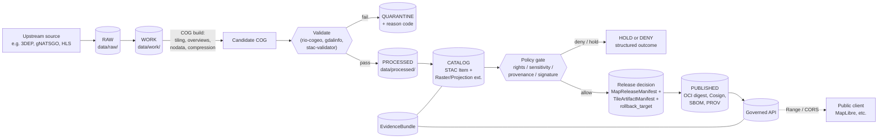

<!-- [KFM_META_BLOCK_V2]
doc_id: kfm://doc/standard-cog
title: Cloud Optimized GeoTIFF (COG) — KFM Standards Conformance
type: standard
version: v1
status: draft
owners: <docs-steward> + <map-shell-owner>
created: 2026-05-13
updated: 2026-05-13
policy_label: public
related:
  - docs/standards/STAC.md
  - docs/standards/DCAT.md
  - docs/standards/PROV.md
  - docs/architecture/map-shell.md
  - docs/architecture/governed-api.md
  - docs/doctrine/trust-membrane.md
  - docs/doctrine/lifecycle-law.md
  - docs/doctrine/directory-rules.md
tags: [kfm, standard, raster, cog, geotiff, map]
notes:
  - Standards doc; all KFM repo-state claims are PROPOSED until mounted-repo verification.
  - Path home authority: Directory Rules §6.1 (docs/standards/).
[/KFM_META_BLOCK_V2] -->

# Cloud Optimized GeoTIFF (COG)

How KFM produces, catalogs, validates, signs, and releases COG raster artifacts under the trust membrane — and what the standard itself requires.

    

| Field | Value |
|---|---|
| **Status** | `draft` |
| **Owners** | `<docs-steward>` + `<map-shell-owner>` *(placeholder — verify against CODEOWNERS)* |
| **Last reviewed** | 2026-05-13 |
| **Authority** | External standard; KFM conformance posture is doctrine, implementation maturity is `PROPOSED` |
| **Path home** | `docs/standards/COG.md` per Directory Rules §6.1 |

---

## Quick jump

- [1. Scope](#1-scope)
- [2. What COG is (external standard)](#2-what-cog-is-external-standard)
- [3. KFM posture on COG](#3-kfm-posture-on-cog)
- [4. Lifecycle placement](#4-lifecycle-placement)
- [5. Release flow (diagram)](#5-release-flow-diagram)
- [6. Required metadata and STAC bindings](#6-required-metadata-and-stac-bindings)
- [7. Production rules](#7-production-rules)
- [8. Validation gates](#8-validation-gates)
- [9. Release surface and trust artifacts](#9-release-surface-and-trust-artifacts)
- [10. Anti-patterns](#10-anti-patterns)
- [11. Open questions / NEEDS VERIFICATION](#11-open-questions--needs-verification)
- [12. Related docs](#12-related-docs)
- [Appendix A — Example COG STAC Item shape (PROPOSED)](#appendix-a--example-cog-stac-item-shape-proposed)
- [Appendix B — Validation command snippets](#appendix-b--validation-command-snippets)

---

## 1. Scope

**Purpose.** Define KFM's conformance posture toward the Cloud Optimized GeoTIFF (COG) format: where COG artifacts live in the lifecycle, what they must carry, how they are validated, how they are released, and what they MUST NOT be used as a substitute for.

**In scope.**

- COG as a delivery and analysis-adjacent raster carrier inside KFM.
- Required STAC, manifest, validation, and release-state bindings.
- Production parameters (CRS, blocks, overviews, nodata, compression).
- Anti-patterns specific to raster carriers.

**Out of scope.**

- The full GeoTIFF specification body. KFM defers to OGC for that.
- Non-raster carriers — see `docs/standards/PMTILES.md`, `docs/standards/GEOPARQUET.md` *(PROPOSED neighbors; existence NEEDS VERIFICATION)*.
- Domain-specific source authority (e.g., soil, hydrology). COG is **never** the root truth source — see §3.

> [!IMPORTANT]
> Per Directory Rules §6.1, this file's home is `docs/standards/`. Topic does not justify a root folder; responsibility does. Do not create `cog/` at repo root.

---

## 2. What COG is (external standard)

A Cloud Optimized GeoTIFF is a regular GeoTIFF whose internal layout is organized so HTTP clients can fetch desired subregions and subresolutions on the fly using HTTP range requests.  The two structural elements that distinguish a COG from a plain GeoTIFF are internal tiling and embedded overviews;  all COG files are valid GeoTIFF files, but not all GeoTIFF files are valid COG files. 

**EXTERNAL — standard status.** Cloud Optimized GeoTIFF is an official OGC Standard; the Open Geospatial Consortium published version 1.0 in July 2023, and Version 1.0 is backward-compatible with the OGC GeoTIFF Standard of September 2019 as well as the original GeoTIFF 1.0 specification of 1995.  The specification repository is maintained at opengeospatial/CloudOptimizedGeoTIFF (OGC 21-026),  with community context at cogeo.org.

**EXTERNAL — internal layout.** A COG places metadata of the full resolution imagery at the beginning of the file, followed by overview metadata, and finally the imagery itself; to make it friendly with streaming and progressive rendering, the recommendation is to start with the smallest overview and finish with the full resolution level. 

**EXTERNAL — tooling.** The GDAL `COG` driver writes layouts with overviews until the maximum dimension of the smallest overview level is lower than 512 pixels, with TIFF section layout optimized to minimize the number of GET requests needed by a reader doing random read access.  The `rio-cogeo` plugin facilitates creation and validation of COGs and enforces internal overviews and internal tiles (default profiles have 512x512 internal tiles). 

> [!NOTE]
> The above is **EXTERNAL** background. It informs KFM's posture but does not establish KFM-specific behavior. KFM-specific rules are §§3–10.

---

## 3. KFM posture on COG

KFM treats COG as a **downstream raster carrier** — a format, not an authority. The position is consistent across the KFM corpus.

**CONFIRMED doctrine (project sources):**

- **COG is a derived artifact, not a source authority.** KFM treats source systems (e.g., gSSURGO/gNATSGO, SoilGrids, 3DEP, LANDFIRE, HLS) as the ingest sources, with COGs as downstream streamable artifacts (`SRC-061 pp.123–127`, `ML-061-105`). A COG map layer **cannot** stand in for the underlying source's authority.
- **Bytes ≠ proof.** Artifact metadata — not the raster bytes — controls origin, process, and promotion (`ML-061-003`). Checksums answer byte integrity but not who produced an artifact or which pipeline and inputs produced it (`ML-061-002`).
- **Cite-or-abstain.** A consequential claim about pixel values, change, or anomaly resolves through an `EvidenceBundle` and `PolicyDecision`, not through a rendered COG layer alone.
- **Trust membrane.** Public clients consume COGs through the governed API and a `TileArtifactManifest` / `MapReleaseManifest` chain — never directly from `data/raw/`, `data/work/`, `data/quarantine/`, or canonical/internal stores.

| KFM property | What it means for COGs |
|---|---|
| **Downstream carrier** | A COG is a streamable representation of validated raster data; it does not, by itself, prove what the pixels mean. |
| **Versioned, immutable** | Each release of a raster is a new digest-addressed COG; in-place updates are forbidden (see §10). |
| **Manifest-bound** | Every public COG MUST be referenced by a `TileArtifactManifest` (PROPOSED) tied to a release decision. |
| **Cataloged** | Every COG MUST appear as a STAC Item with the Raster and Projection extensions, and (where N-D) the Datacube extension. |
| **Signed and attested** | Each release SHOULD bind COG digests to a Cosign signature and SLSA/in-toto provenance attestation. |
| **Rollback-aware** | Release decisions carry a `rollback_target` so a prior digest can be restored without bypassing governance. |

> [!CAUTION]
> A rendered COG layer is **not** evidence. Pixel values without `EvidenceRef → EvidenceBundle` resolution must abstain on consequential claims. Style filters cannot stand in for redaction, generalization, or sensitivity policy.

[⬆ Back to top](#cloud-optimized-geotiff-cog)

---

## 4. Lifecycle placement

The KFM lifecycle invariant **`RAW → WORK / QUARANTINE → PROCESSED → CATALOG / TRIPLET → PUBLISHED`** governs COG placement. Promotion is a **governed state transition, not a file move** (Directory Rules §0, §9.1).

| Phase | Where COG-related bytes / records sit (PROPOSED paths) | Notes |
|---|---|---|
| **RAW** | `data/raw/<domain>/<source_id>/<run_id>/` | As-delivered source rasters (e.g., GeoTIFF, IMG, NetCDF granules). Never a public surface. |
| **WORK** | `data/work/<domain>/<run_id>/` | Intermediate transforms, candidate COGs awaiting validation. |
| **QUARANTINE** | `data/quarantine/<domain>/<reason>/<run_id>/` | Rights, sensitivity, validation, or COG-layout failures land here with a reason code. |
| **PROCESSED** | `data/processed/<domain>/<dataset_id>/<version>/` | Validated COGs that have passed transform checks but are not yet public. |
| **CATALOG / TRIPLET** | `data/catalog/stac/...`, `data/catalog/dcat/...`, `data/catalog/prov/...` | STAC Items with Raster/Projection extensions; DCAT distributions; PROV run records. |
| **PUBLISHED** | `data/published/layers/...` (or governed-API-served path) | Released, policy-allowed, rollback-capable. Public clients reach this **only** through the governed API. |
| **Proofs** | `data/proofs/evidence_bundle/`, `data/proofs/validation_report/` | `COGValidationReport`, citation validations, evidence bundles. |
| **Receipts** | `data/receipts/pipeline/`, `data/receipts/release/` | `RunReceipt`, `RepresentationReceipt`, signing records. |
| **Release decision** | `release/manifests/`, `release/rollback_cards/` | `MapReleaseManifest`, `TileArtifactManifest` references, rollback targets. |
| **Rollback alias-revert** | `data/rollback/<domain>/<release_id>/` | Data-plane receipts for alias revert. |

All paths above are **PROPOSED** per Directory Rules §0 — they reflect the canonical tree in Directory Rules §6 and §9.1 but require mounted-repo verification before being asserted as repo facts.

[⬆ Back to top](#cloud-optimized-geotiff-cog)

---

## 5. Release flow (diagram)



> [!NOTE]
> Diagram is the **doctrinal** flow. Specific stage names, file homes, and tool identities are PROPOSED until mounted-repo verification confirms which validators, manifest writers, and release tools are wired together. The shape — admission → validation → catalog → policy → release → governed API — is `CONFIRMED` doctrine.

[⬆ Back to top](#cloud-optimized-geotiff-cog)

---

## 6. Required metadata and STAC bindings

Every published COG MUST appear as a STAC Item with sufficient catalog metadata that downstream clients can verify shape, projection, value semantics, and provenance without opening the raster.

### 6.1 STAC extensions required on COG Items

`CONFIRMED` doctrine (`ML-061-099`, `ML-063-020`): STAC Items for COGs include the **Raster**, **Projection**, and (where applicable) **Datacube** extensions. The source guides name `raster:bands`, `proj:epsg`, `proj:shape`, `transform`, `statistics`, and explicit asset roles.

| STAC field / extension | Why KFM requires it | Source basis |
|---|---|---|
| `raster:bands` | Per-band semantics: dtype, nodata, units, scale, offset, statistics. | `ML-061-099`, `ML-063-020` |
| `proj:epsg`, `proj:shape`, `proj:transform` | Pin the COG's CRS, raster shape, and affine transform. | `ML-061-099` |
| `datacube:*` (N-D only) | Required when the raster represents a datacube dimension (time, band). | `ML-063-020` |
| `assets.<role>.roles` | Asset roles (`data`, `overview`, `thumbnail`, `metadata`) — `ML-062-030` aligns STAC asset roles with `TileArtifactManifest`. | `ML-062-030` |
| `assets.<role>.href` | MAY be an `oci://<digest>` reference where OCI distribution is in use (`ML-061-076`). | `ML-061-076` |
| `assets.<role>.file:checksum` / `contentDigest` | Binds catalog record to exact bytes (`ML-063-029`). | `ML-063-029` |
| `properties.processing:lineage`, `links[rel=derived_from]` | Records upstream sources and pipeline lineage. | `ML-059-030` |
| `kfm:evidence_ref` (or equivalent custom link) | EXTERNAL note: STAC core has no formal `EvidenceRef` field; KFM uses links with custom `rel` values to preserve lineage in a STAC-compatible way. | KFM doctrine + STAC link patterns |
| `kfm:rights_status`, `kfm:sensitivity`, `kfm:policy_label` | Required for policy gate evaluation before release. | KFM doctrine (cite-or-abstain, trust membrane) |

### 6.2 KFM object families touching a published COG

| Object family | Role for a COG | Status |
|---|---|---|
| `SourceDescriptor` | Pins the upstream source, role, rights, cadence. | `CONFIRMED` doctrine |
| `LayerManifest` | Binds layer ID, source refs, style refs, evidence refs, policy labels, release state. | `CONFIRMED` doctrine / `PROPOSED` implementation |
| `TileArtifactManifest` | Describes the COG artifact (digest, byte ranges, range/CORS expectations, source refs, attestation refs). | `CONFIRMED` doctrine / `PROPOSED` implementation |
| `COGValidationReport` | Captures `rio-cogeo` / `gdalinfo` / `stac-validator` outputs as a proof object. | `PROPOSED` |
| `RasterAssetManifest`, `COGArtifactManifest` | Raster-specific manifests named in v1.7/v1.8 packets. | `PROPOSED` |
| `MapReleaseManifest` | Records the published artifact set, digests, policy posture, rollback target. | `CONFIRMED` doctrine / `PROPOSED` implementation |
| `EvidenceBundle` / `EvidenceRef` | Resolvable support for any consequential claim on the raster. | `CONFIRMED` doctrine |
| `PolicyDecision` | Rights / sensitivity / release gate result. | `CONFIRMED` doctrine |
| `RunReceipt` | Execution record (inputs, outputs, hashes, tool versions). | `CONFIRMED` doctrine |
| `RollbackCard` | Decision artifact for reverting to a prior digest. | `CONFIRMED` doctrine |

[⬆ Back to top](#cloud-optimized-geotiff-cog)

---

## 7. Production rules

Production parameters that are doctrine in KFM, tied to `CONFIRMED` source evidence.

### 7.1 CRS separation

`CONFIRMED` doctrine (`ML-061-096`): keep **analysis CRS** and **web-delivery CRS** distinct, both recorded in the manifest.

- Analysis copies MAY use `EPSG:5070` (CONUS Albers) when equal-area work is needed.
- Web-delivery COGs typically use `EPSG:4326` or `EPSG:3857` to match the MapLibre / web tile pipeline.
- The manifest MUST record which copy is which; mixing analysis and display projections without manifest fields is the documented failure mode.

### 7.2 Tile blocks, overviews, compression

`CONFIRMED` doctrine (`ML-061-097`, `ML-063-015`):

- **Internal tiling required.** Striped layouts are not COG-compliant for KFM purposes.
- **Overview pyramids required.** Build overviews until the smallest level fits within a single tile read; common practice is the GDAL `COG` driver default (down to `< 512 px`, per the EXTERNAL GDAL behavior above).
- **Block size.** `512 × 512` is the project default for soil and similar raster families; tune by family with a recorded rationale.
- **Compression.** `ZSTD` is the project default for predictable delivery; `DEFLATE` and `LZW` are acceptable where compatibility constraints apply. `JPEG` is acceptable only for visual quicklook assets.

### 7.3 Nodata propagation

`CONFIRMED` doctrine (`ML-061-098`): **nodata must stay consistent through overviews.** The documented failure mode is false raster values appearing at overview zoom levels. Build pipelines MUST propagate nodata correctly and validators MUST refuse a COG whose overviews encode nodata inconsistently.

### 7.4 Immutable release artifacts

`CONFIRMED` doctrine (`ML-063-019`): **never update a COG in place.** Updates produce new immutable artifacts, addressed by a new digest. The prior digest remains rollback-targetable. In-place mutation can break COG layout invariants and breaks the digest-to-bytes contract that release governance depends on.

### 7.5 Quicklooks and first paint

`CONFIRMED` doctrine (`ML-061-100`): a published raster product MAY include a small PMTiles overview or PNG/JPEG quicklook as a separate `thumbnail` / `overview` asset role for first paint. These quicklooks are subject to the same release governance — they are **not** a substitute for the underlying COG, and they are **not** evidence.

### 7.6 Range-capable hosting

`CONFIRMED` doctrine (`ML-061-101`, `ML-063-015`): object storage hosting published COGs MUST support HTTP byte-range requests and immutable cache headers for versioned paths. Tile load budgets, resource timing, and cache invalidation records belong in the release manifest.

[⬆ Back to top](#cloud-optimized-geotiff-cog)

---

## 8. Validation gates

A COG promotion from `WORK` to `PROCESSED` MUST be gated by a deterministic `COGValidationReport`. A release decision (`CATALOG → PUBLISHED`) MUST additionally check catalog completeness, policy posture, signatures, and rollback target.

`CONFIRMED` doctrine (`ML-061-102`, `ML-062-031`, `ML-063-015`): COG validation uses **`gdalinfo`**, **`rio-cogeo`**, and **`stac-validator`**. The same three tools recur across the source ledger; their EXTERNAL behavior is summarized in §2.

### 8.1 Required checks before `PROCESSED`

- [ ] `rio-cogeo validate <file>` returns valid.
- [ ] `gdalinfo` reports internal tiling and an overview pyramid consistent with project defaults.
- [ ] CRS, transform, and nodata match the recorded values in the candidate STAC Item.
- [ ] Per-band statistics computed and recorded (`raster:bands.statistics`).
- [ ] Byte-range / Range header probe succeeds against the staging host.

### 8.2 Required checks before `PUBLISHED`

- [ ] STAC Item validates against `stac-validator` with the **Raster**, **Projection**, (and **Datacube** where applicable) extension IDs present in `stac_extensions`.
- [ ] DCAT distribution mirror records `contentDigest` / integrity (`ML-063-029`).
- [ ] `MapReleaseManifest` references the COG by **digest, not tag** (`ML-061-070`, `ML-063-030`).
- [ ] Cosign signature on the artifact digest verifies; SBOM and PROV referrers are present (`ML-061-072`, `ML-061-075`, `ML-064-005`).
- [ ] `PolicyDecision = allow` for rights, sensitivity, source-role, and release state.
- [ ] `EvidenceRef` resolves to an `EvidenceBundle` for any consequential claim attached to the layer.
- [ ] `rollback_target` is set to a known prior release where one exists.
- [ ] CORS, immutable cache headers, and Range support verified on the public host.

> [!WARNING]
> Failing closed is the default. Missing signatures, unresolved provenance, stale source state, sensitive geometry without redaction, or incomplete citation support produce **DENY** or **ABSTAIN**, never silent promotion.

[⬆ Back to top](#cloud-optimized-geotiff-cog)

---

## 9. Release surface and trust artifacts

`CONFIRMED` doctrine across SRC-061 / SRC-063 / SRC-064: a published KFM COG is not a file on a CDN — it is an artifact bound to a release decision, a catalog record, a provenance chain, and a rollback target.

```text
Published COG
├── COG bytes              ← digest-addressed (sha256), immutable
├── STAC Item              ← Raster + Projection (+ Datacube) extensions, file:checksum
├── DCAT distribution      ← contentDigest, integrity, license, accessURL
├── PROV record            ← run-level lineage (kfm_prov_id, kfm_run_id)
├── Cosign signature       ← signs the DIGEST, not a tag
├── DSSE / SLSA attestation← inputs, git commit, seeds, telemetry
├── SBOM (KFM dataProfile) ← artifact type, generator, CRS, bbox, schema, checksums
├── TileArtifactManifest   ← media type, tile_format, zoom, byte ranges, range/CORS
├── MapReleaseManifest     ← contents, digests, rights, sensitivity, release_state
├── rollback_target        ← prior release digest, restore plan
└── RunReceipt             ← inputs, outputs, hashes, tool versions, timestamps
```

`PROPOSED` placements (path forms shown for orientation; verification belongs in a per-root README and mounted-repo inspection):

- COG bytes → `data/published/layers/<domain>/<dataset_id>/<version>/<asset>.tif` *or* OCI registry by digest (`ML-061-069`, `ML-064-003`).
- STAC Item → `data/catalog/stac/<domain>/<dataset_id>/<version>.json`.
- DCAT distribution → `data/catalog/dcat/<domain>/<dataset_id>/<version>.jsonld`.
- PROV record → `data/catalog/prov/<run_id>.jsonld`.
- `MapReleaseManifest` → `release/manifests/<release_id>.json`.
- Rollback decision → `release/rollback_cards/<release_id>.json`.

### 9.1 OCI distribution (where used)

`CONFIRMED` doctrine (`ML-061-069` to `ML-061-076`, `ML-063-028` to `ML-063-030`, `ML-064-002` to `ML-064-005`):

- COGs MAY be distributed as OCI artifacts via ORAS; the **digest** is canonical, the tag is convenience.
- Catalog records (STAC, DCAT) reference the immutable digest in `accessURL` / `href` (`ML-061-076`, `ML-061-077`, `ML-064-004`).
- Cosign signs the digest; SBOM and PROV attach as OCI referrers next to the artifact (`ML-061-072`, `ML-061-073`, `ML-064-005`).
- Mutable tags MUST NOT appear in a `MapReleaseManifest` as sole identity (`ML-063-030`, `ML-063-039`).

### 9.2 Governed API and the trust membrane

`CONFIRMED` doctrine: public clients (MapLibre shell, mobile, AI surfaces) reach published COGs **only** through the governed API and only via released `LayerManifest` / `TileArtifactManifest` references. The browser MUST NOT load `data/raw/`, `data/work/`, `data/quarantine/`, candidate, canonical, or internal store paths. MapLibre `addSource` for a governed raster waits on sidecar / signature / `spec_hash` / `tile_format` checks where the layer is governed.

[⬆ Back to top](#cloud-optimized-geotiff-cog)

---

## 10. Anti-patterns

<details>
<summary><b>Failure modes specific to COG carriers (click to expand)</b></summary>

| Anti-pattern | Why it fails | Reference |
|---|---|---|
| **COG as source authority** | A rendered COG layer used to make a soil, hydrology, or remote-sensing claim without `EvidenceBundle` resolution. COG is a downstream carrier, not the root truth source. | `ML-061-105` |
| **Checksum as publication proof** | Treating SHA-256 alone as license to publish. Checksums prove byte integrity, not origin or process. | `ML-061-002` |
| **In-place COG update** | Overwriting a COG on the published host breaks layout invariants and the digest-to-bytes contract. | `ML-063-019` |
| **Mutable tag as release identity** | Putting a registry tag (not a digest) in `MapReleaseManifest`. Tags move; release identity must not. | `ML-061-070`, `ML-063-030` |
| **Sensitive geometry hidden only by style** | Style filters do not redact. Generalization / redaction MUST happen before public tile generation, with transform reasons recorded. | KFM trust law |
| **Public route reads canonical store** | `apps/explorer-web/` reading `data/processed/` or `data/published/` directly without the governed API. Trust membrane violation. | Directory Rules §13.5 |
| **Watcher publishes** | A watcher writing a COG to `data/catalog/` or `data/published/`. Watchers emit receipts and candidates only. | Directory Rules §13.5 |
| **Lifecycle skip** | A pipeline writing directly to `data/published/` from `data/raw/`. All phases run; promotion is governed. | Directory Rules §13.5 |
| **Quicklook as evidence** | Treating a `thumbnail` / `overview` PNG as proof of pixel values. Quicklooks are first-paint, not evidence. | `ML-061-100` |
| **Inconsistent nodata in overviews** | False raster values appearing at overview zooms because nodata was not propagated. | `ML-061-098` |
| **Mixed analysis / display CRS without manifest fields** | A COG that doesn't declare which copy is analysis vs. delivery. | `ML-061-096` |
| **DEM as proof of buildings / vegetation / power lines** | Using elevation surface to assert above-surface features. DEM is elevation, not above-ground inventory. | `ML-063` notes; v1.8 packet |
| **Treating MLT, 3D tiles, or vector tile equivalents as substitutes for COG** | They serve different evidence burdens; the choice is by access and analytic burden, not preference. | v1.8 tile strategy chapter |

</details>

[⬆ Back to top](#cloud-optimized-geotiff-cog)

---

## 11. Open questions / NEEDS VERIFICATION

These items are not resolved by this document and SHOULD land in `docs/registers/VERIFICATION_BACKLOG.md`:

- **NEEDS VERIFICATION** — Does the current repo have a `COGValidationReport` schema under `schemas/contracts/v1/` (or wherever ADR-0001 places schemas)? If not, this becomes a backlog ADR.
- **NEEDS VERIFICATION** — Are `RasterAssetManifest` and `COGArtifactManifest` (named in the v1.7 / v1.8 packets) treated as one object family or two? Default per the source ledger reads as parallel candidates; an ADR would resolve.
- **NEEDS VERIFICATION** — Which OCI registry (if any) is the canonical home for KFM COG artifacts, and what is the retention policy?
- **NEEDS VERIFICATION** — Is `Cosign` the project's chosen signer, or is another signer in scope? Project sources name Cosign; mounted-repo evidence is required to confirm.
- **OPEN** — Whether the **Datacube** STAC extension is enabled for any current KFM raster family, or only proposed for future N-D products (PM2.5 fusion, NDVI time series).
- **OPEN** — How `rio-cogeo`'s `--use-cog-driver` (GDAL `COG` driver mode) interacts with the project's chosen block size defaults across raster families.
- **OPEN** — Whether KFM mints a one-to-one PMTiles "raster preview" companion for every published COG, or only for selected families (soil, NDVI alerts).
- **OPEN** — Whether MLT / 3D tile carriers will share a release manifest schema with COGs or have separate manifest homes.

> [!TIP]
> When repo evidence becomes available, prefer updating this doc inline (and re-labeling claims from `PROPOSED` to `CONFIRMED`) over creating a new sibling doc. The standards lane is for conformance posture, not a graveyard of versions.

[⬆ Back to top](#cloud-optimized-geotiff-cog)

---

## 12. Related docs

Internal — link targets are PROPOSED neighbors and NEEDS VERIFICATION until inspected on the mounted repo:

- `docs/doctrine/directory-rules.md` — placement law (this file lives in `docs/standards/` per §6.1).
- `docs/doctrine/trust-membrane.md` — the public-path discipline that COG release must respect.
- `docs/doctrine/lifecycle-law.md` — RAW → PUBLISHED invariant.
- `docs/architecture/map-shell.md` — how MapLibre consumes governed raster sources.
- `docs/architecture/governed-api.md` — the only public path for COG delivery.
- `docs/standards/STAC.md` — STAC profile, including Raster / Projection / Datacube extensions. *(PROPOSED neighbor)*
- `docs/standards/DCAT.md` — DCAT distribution mirror for non-spatiotemporal cataloging. *(PROPOSED neighbor)*
- `docs/standards/PROV.md` — provenance binding for run records. *(PROPOSED neighbor)*
- `docs/standards/PMTILES.md`, `docs/standards/GEOPARQUET.md` — sister carrier docs. *(PROPOSED neighbors)*
- `docs/adr/ADR-0001-schema-home.md` — schema home convention referenced for `COGValidationReport` placement.

External (EXTERNAL — consulted under `<external_research>` triggers; see Section 2 of the notes):

- OGC Cloud Optimized GeoTIFF Standard (OGC 21-026, v1.0, July 2023).
- cogeo.org — community specification and tool catalog.
- GDAL `COG` driver documentation.
- `rio-cogeo` (cogeotiff/rio-cogeo) — creation and validation plugin.
- NASA ESDIS ESDS-RFC-049 — COG file format adoption.

[⬆ Back to top](#cloud-optimized-geotiff-cog)

---

## Appendix A — Example COG STAC Item shape (PROPOSED)

<details>
<summary><b>Illustrative STAC Item (not a fixture; field set is PROPOSED)</b></summary>

```json
{
  "stac_version": "1.0.0",
  "stac_extensions": [
    "https://stac-extensions.github.io/raster/v1.1.0/schema.json",
    "https://stac-extensions.github.io/projection/v1.1.0/schema.json",
    "https://stac-extensions.github.io/file/v2.1.0/schema.json"
  ],
  "type": "Feature",
  "id": "kfm-<domain>-<dataset_id>-<version>",
  "geometry": { "type": "Polygon", "coordinates": [[...]] },
  "bbox": [-102.05, 36.99, -94.59, 40.0],
  "properties": {
    "datetime": "2026-05-13T00:00:00Z",
    "proj:epsg": 5070,
    "proj:shape": [10000, 10000],
    "proj:transform": [30, 0, -100, 0, -30, 40, 0, 0, 1],
    "processing:lineage": "PROPOSED — record pipeline ID and software versions",
    "kfm:rights_status": "open",
    "kfm:sensitivity": "public",
    "kfm:policy_label": "public",
    "kfm:evidence_ref": "kfm://evidence/<sha256>"
  },
  "assets": {
    "data": {
      "href": "oci://<registry>/<repo>@sha256:<digest>",
      "type": "image/tiff; application=geotiff; profile=cloud-optimized",
      "roles": ["data"],
      "file:checksum": "1220<sha256-multihash>",
      "raster:bands": [
        {
          "data_type": "float32",
          "nodata": -9999,
          "unit": "<units>",
          "statistics": { "minimum": 0.0, "maximum": 1.0, "mean": 0.42 }
        }
      ]
    },
    "thumbnail": {
      "href": "<governed path to PNG/JPEG quicklook>",
      "type": "image/png",
      "roles": ["thumbnail"]
    }
  },
  "links": [
    { "rel": "self", "href": "<governed path>" },
    { "rel": "derived_from", "href": "<upstream source STAC Item>" },
    { "rel": "was_generated_by", "href": "<PROV run record>" },
    { "rel": "license", "href": "<license URL>" }
  ]
}
```

</details>

> [!NOTE]
> This is **illustrative** — not a working fixture. Field names taken from KFM doctrine and standard STAC extensions. Replace placeholder digests, paths, and identifiers before promoting to a fixture.

[⬆ Back to top](#cloud-optimized-geotiff-cog)

---

## Appendix B — Validation command snippets

<details>
<summary><b>Common validation invocations (illustrative)</b></summary>

```bash
# 1) COG layout — rio-cogeo
#    Confirms internal tiling, overviews, and required tag layout.
rio cogeo validate path/to/asset.tif

# 2) GDAL metadata — gdalinfo
#    Read CRS, transform, block size, overviews, nodata, statistics.
gdalinfo -stats path/to/asset.tif

# 3) STAC Item — stac-validator
#    Confirms required core fields and any listed extension schemas.
stac-validator path/to/item.json --extensions

# 4) Range-request probe (illustrative — staging host)
#    Confirms the host supports byte-range fetches.
curl -I -H "Range: bytes=0-1023" https://<staging-host>/path/to/asset.tif
```

</details>

> [!NOTE]
> Commands above are illustrative. The canonical wiring of these checks into KFM CI (validators, fixtures, fail-closed gates) is **NEEDS VERIFICATION** until the mounted repo is inspected.

[⬆ Back to top](#cloud-optimized-geotiff-cog)

---

**Related docs:** [STAC](STAC.md) · [DCAT](DCAT.md) · [PROV](PROV.md) · [Map shell](../architecture/map-shell.md) · [Governed API](../architecture/governed-api.md) · [Directory Rules](../doctrine/directory-rules.md)

**Last updated:** 2026-05-13 · **Version:** v1 (draft) · [⬆ Back to top](#cloud-optimized-geotiff-cog)
