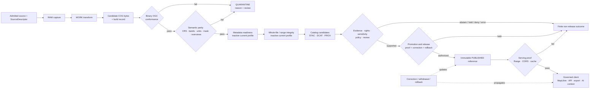

<!-- [KFM_META_BLOCK_V2]
doc_id: kfm://doc/standard-cog
title: Cloud Optimized GeoTIFF (COG) — Repository Boundary, Conformance, and Release Readiness
type: standard
version: v2.0-draft
status: "draft; repository-grounded; upstream-currentness-refreshed; mixed-maturity; no-adoption; no-conformance-proof; no-release"
owners:
  - "@bartytime4life — verified GitHub review route through CODEOWNERS"
  - "NEEDS VERIFICATION — accountable raster, evidence, policy, release, and operations stewards"
created: 2026-05-13
updated: 2026-08-18
policy_label: public
owning_root: docs/
current_path: docs/standards/COG.md
responsibility: "Explain the boundary between the OGC Cloud Optimized GeoTIFF standard, KFM raster-carrier guidance, current repository validation surfaces, and governed release without becoming a machine schema, policy decision, conformance certificate, artifact store, release decision, or publication proof."
truth_posture: "CONFIRMED current path, standards-lane placement, OGC COG 1.0 currentness, checked-in inactive metadata and byte-range profiles, and proposal state of ADR-0023 / PROPOSED production, catalog, serving, cryptographic, and release profiles / UNKNOWN real COG payload inventory, current consumers, deployed Range/CORS behavior, signer trust, and production release state / NEEDS VERIFICATION accountable stewardship and end-to-end binary, semantic, serving, correction, and rollback proof."
evidence_snapshot: "main@7ac9f151aacc03b03fd486a64b348743b7325a51; prior target 2b81264c46c5ac5d3e14f9b9c6efc887fea5687f; standards README a8cbe5d183448d5f0de37f8a4eacd6fcaca0d71b; Directory Rules fd49a0b83e55cef52c1124281f093e263526898d; CODEOWNERS dd2a84aa514d8ecd9208bc347f90f9a2ed37dd61; carrier-readiness contract/schema/validator/tests/workflow 17055a680b83a4f83834735e88aeb0569322845b/b6ebec77a6e09c50b89594c4032bd40ec238f6be/63e4cfac4838d0095b7f05fc6a3507ebe180fd8b/49b8ff390aee4b0d3381ec2d087238ce0c725ccc/f5791e0988166dbcdd5d781c690073e8d3b10389; byte-range contract/schema/validator/tests/workflow 6469d1ec57666233bd111c55fc7b0a6d6f2cb11b/a8af408bb19640517fa228568447b9d981e0244b/62fb6750adcc5da12ab6528536d3b51e98fe1945/e15874b03ba6e873d3d51be04e9c8a5b2cb45ebc/0619d6731b1150c076288abcdc6a255c8164b42e; KFMGeoManifest c7993b8bf8fbcbf01f0947a99a14d81509e89370; MapReleaseManifest e2a70bdd659cf432901ee9d5544b8e1418c23e60; ADR-0023 93576e7419e5723b5d7556cb811dc740dfc40a04."
external_currentness: "Checked 2026-08-18 against OGC Cloud Optimized GeoTIFF Standard 1.0 (OGC 21-026), GDAL COG driver documentation, and rio-cogeo creation/validation documentation."
related:
  - docs/standards/README.md
  - docs/standards/STAC.md
  - docs/standards/DCAT.md
  - docs/standards/PROV.md
  - docs/standards/PMTILES.md
  - docs/standards/GEOPARQUET.md
  - docs/doctrine/directory-rules.md
  - docs/doctrine/lifecycle-law.md
  - docs/doctrine/trust-membrane.md
  - docs/architecture/contract-schema-policy-split.md
  - docs/adr/ADR-0001-schema-home--schemas-contracts-v1-is-canonical.md
  - docs/adr/ADR-0002-contracts-vs-schemas-split.md
  - docs/adr/ADR-0023-geo-manifest-signs-every-pmtiles-cog-release.md
  - docs/adr/ADR-0029-adopt-directory-governance-standard-v2.md
  - contracts/release/geospatial_carrier_readiness.md
  - schemas/contracts/v1/release/geospatial_carrier_readiness.schema.json
  - tools/validators/release/validate_geospatial_carrier_readiness.py
  - tests/release/test_geospatial_carrier_readiness.py
  - contracts/evidence/cog_byte_range_integrity_manifest.md
  - schemas/contracts/v1/evidence/cog_byte_range_integrity_manifest.schema.json
  - tools/validators/evidence/validate_cog_byte_range_integrity_manifest.py
  - tests/validators/evidence/test_validate_cog_byte_range_integrity_manifest.py
  - contracts/evidence/kfm_geo_manifest.md
  - contracts/release/map_release_manifest.md
tags:
  - kfm
  - standards
  - cog
  - cloud-optimized-geotiff
  - geotiff
  - raster
  - range-requests
  - integrity
  - evidence
  - release
notes:
  - "This same-path revision preserves the stable document identity and legacy section anchors."
  - "The checked-in COG readiness and byte-range profiles are PROPOSED_INACTIVE and do not validate a real TIFF/COG payload."
  - "ADR-0023 remains proposed; no signature, promotion, release, deployment, or publication authority is created."
[/KFM_META_BLOCK_V2] -->

<a id="top"></a>
<a id="cloud-optimized-geotiff-cog"></a>

# Cloud Optimized GeoTIFF (COG) — KFM Standards Boundary

> **Operating rule.** A COG is a raster carrier. File conformance, pixel meaning, source authority, evidence, rights, sensitivity, review, release, serving, correction, and rollback remain separate responsibilities.


> [!IMPORTANT]
> **Human-readable guidance only.** This page explains an external standard and the current KFM repository boundary. Contracts define meaning, schemas define shape, policy decides admissibility, validators establish only their declared checks, and governed release records decide release. This page owns none of those decisions.

> [!CAUTION]
> **Current executable profiles do not prove COG conformance.** The repository has an inactive metadata-readiness profile and an inactive synthetic byte-range-integrity profile. Neither opens a real TIFF, evaluates OGC conformance classes, interprets pixels, or proves live HTTP Range behavior.

> [!WARNING]
> **Cryptographic release binding remains on hold.** ADR-0023 is still `proposed`. A digest match, fixture pass, checked-in workflow, or manifest-shaped record does not prove signer identity, policy approval, review, promotion, release, deployment, publication, or public-use authority.

| Field | Current state |
|---|---|
| **Document identity** | `kfm://doc/standard-cog` |
| **Path** | `docs/standards/COG.md` |
| **Directory result** | **PLACE** — same-path standards guidance under the accepted `docs/` responsibility root |
| **Review route** | `@bartytime4life` through current CODEOWNERS; stewardship and independent review remain **NEEDS VERIFICATION** |
| **External baseline** | OGC Cloud Optimized GeoTIFF Standard **1.0**, OGC 21-026 |
| **KFM adoption state** | No accepted KFM-wide COG production or release profile was verified |
| **Repository maturity** | Inactive metadata preflight + inactive synthetic byte-range integrity + fixture-first manifest/release declarations |
| **Missing proof** | Real TIFF/COG binary conformance, semantic raster parity, live serving, authenticated evidence/policy/review, cryptographic release, correction, and rollback |
| **Last currentness check** | 2026-08-18 |

---

## Quick jump

- [0. Current repository status and authority](#0-current-repository-status-and-authority)
- [1. Scope](#1-scope)
- [2. What COG is (external standard)](#2-what-cog-is-external-standard)
- [3. KFM posture on COG](#3-kfm-posture-on-cog)
- [4. Lifecycle placement](#4-lifecycle-placement)
- [5. Release flow (diagram)](#5-release-flow-diagram)
- [6. Required metadata and STAC bindings](#6-required-metadata-and-stac-bindings)
- [7. Production rules](#7-production-rules)
- [8. Validation gates](#8-validation-gates)
- [9. Release surface and trust artifacts](#9-release-surface-and-trust-artifacts)
- [10. Anti-patterns](#10-anti-patterns)
- [11. Open questions / NEEDS VERIFICATION](#11-open-questions--needs-verification)
- [12. Related docs](#12-related-docs)
- [Appendix A — Example COG STAC Item shape (PROPOSED)](#appendix-a--example-cog-stac-item-shape-proposed)
- [Appendix B — Validation command snippets](#appendix-b--validation-command-snippets)
- [Appendix C — v1 preservation and correction ledger](#appendix-c--v1-preservation-and-correction-ledger)

---

<a id="0-current-repository-status-and-authority"></a>

## 0. Current repository status and authority

### 0.1 Evidence boundary

This revision was checked against current repository bytes at the evidence snapshot recorded in the metadata block. The statements below distinguish path presence, machine shape, executable behavior, and release authority.

| Surface | CONFIRMED current state | What it does **not** establish |
|---|---|---|
| `docs/standards/COG.md` | Existing standards-lane document, modernized in place | External conformance, KFM adoption, runtime behavior, or release |
| `docs/standards/README.md` | Defines this lane as human-readable standards and interoperability guidance | Machine authority or standards certification |
| `contracts/release/geospatial_carrier_readiness.md` and companions | `PROPOSED_INACTIVE` metadata-only COG/MVT/GeoParquet readiness profile | TIFF parsing, COG binary validation, source resolution, policy, or release |
| `contracts/evidence/cog_byte_range_integrity_manifest.md` and companions | `PROPOSED_INACTIVE` whole-file and explicit-range SHA-256 profile over a synthetic 65-byte payload | TIFF/COG structure, overview layout, HTTP Range, pixel meaning, or cryptographic trust |
| `contracts/evidence/kfm_geo_manifest.md` and companions | Fixture-first geospatial-candidate metadata and optional exact local byte binding | Carrier-format conformance, evidence closure, rights, policy, signing, or release |
| `contracts/release/map_release_manifest.md` and companions | Fixture-first map-release closure declarations, including COG Range/CORS declarations | Live artifact fetch, header verification, authenticated review, cache mutation, or release |
| ADR-0023 | Proposed design for signed PMTiles/COG release binding | Accepted decision, signer profile, trust root, or release gate |
| OGC COG 1.0 | Current external OGC standard verified from the issuer | Automatic KFM profile adoption or implementation |

### 0.2 Current executable COG-related profiles

#### Metadata readiness

`GeospatialCarrierReadinessCheck` inspects declared metadata only. Its COG lane checks:

- `.tif` or `.tiff` naming;
- `image/tiff`;
- internal-tiling declaration;
- square, power-of-two block declarations within the profile bounds;
- an overview declaration for profile-defined larger rasters;
- compression from the profile's enumerated set;
- explicit CRS and nodata policy;
- declared Range-read support; and
- canonical STAC `raster` and `projection` declarations.

Its outcomes are `READY`, `HOLD`, or `ERROR`. `READY` means **eligible for a stronger validation layer**, not COG-conformant, policy-safe, or releasable.

#### Byte-range integrity candidate

`COGByteRangeIntegrityManifestCandidate` checks:

- whole-payload SHA-256;
- canonical, contiguous, non-overlapping full coverage;
- exact SHA-256 for each declared range;
- declared range roles;
- freshness and boundary-state consistency; and
- finite `PASS`, `ABSTAIN`, `DENY`, or `ERROR` outcomes.

The bundled payload is deliberately not a TIFF. Range roles are fixture labels, not parser-derived TIFF sections.

### 0.3 Maturity ladder

| Level | Capability | Current posture |
|---:|---|---|
| 0 | Human standards boundary | **CONFIRMED — this document** |
| 1 | Metadata-only readiness | **CONFIRMED checked in / PROPOSED_INACTIVE** |
| 2 | Synthetic whole-file and explicit-range integrity | **CONFIRMED checked in / PROPOSED_INACTIVE** |
| 3 | Real TIFF/BigTIFF parser + OGC conformance-class validation | **NOT VERIFIED / NEEDS IMPLEMENTATION** |
| 4 | Source-to-COG semantic parity, including masks and overviews | **NOT VERIFIED / NEEDS IMPLEMENTATION** |
| 5 | Catalog, evidence, rights, sensitivity, policy, and review resolution | **PARTIAL fixture declarations; no authenticated closure verified** |
| 6 | Local or deployed HTTP Range/CORS serving proof | **UNKNOWN / NEEDS VERIFICATION** |
| 7 | Cryptographic release, correction, withdrawal, and rollback drill | **HOLD / NEEDS DECISION AND PROOF** |

### 0.4 Authority map

| Question | Owning surface |
|---|---|
| What does COG 1.0 require? | OGC 21-026 and its normative conformance tests |
| What guidance does KFM present to humans? | This page and the standards-lane README |
| What does a KFM object mean? | The applicable contract under `contracts/` |
| What fields are machine-valid? | The applicable JSON Schema under `schemas/contracts/v1/` |
| What is admissible or public-safe? | `policy/` plus accountable review |
| What did a validator actually check? | Validator code, fixture corpus, tests, workflow, and exact run evidence |
| What bytes exist? | Artifact storage plus digest/length records |
| What may be released? | Governed release objects and accountable release decision |
| What may be served to a client? | Released artifact references and governed delivery configuration |
| What may a user or AI claim? | Resolvable evidence plus policy/review/release state |

No row substitutes for another.

<p align="right"><a href="#top">Back to top</a></p>

---

<a id="1-scope"></a>

## 1. Scope

### 1.1 Purpose

This document:

1. tracks the external OGC COG 1.0 baseline;
2. explains COG's role as a KFM downstream raster carrier;
3. reconciles current repository validation and manifest surfaces;
4. separates file conformance from serving, evidence, policy, review, and release;
5. gives dataset-aware production and validation guidance; and
6. records the smallest remaining proof gaps without converting them into implementation facts.

### 1.2 In scope

- TIFF/BigTIFF organization relevant to COG.
- Reduced-resolution subfiles, internal tiling, GeoTIFF keys, and HTTP Range delivery.
- Raster semantic preservation: CRS, transform, resolution, bands, units, scale/offset, nodata, masks, and resampling.
- Deterministic build records and exact-byte integrity.
- Catalog references and current KFM manifest/readiness profiles.
- Rights, sensitivity, public delivery, correction, withdrawal, and rollback boundaries.
- Fixture-first and future binary-aware validation.

### 1.3 Out of scope

- Reproducing the OGC, TIFF, BigTIFF, GeoTIFF, HTTP, or STAC specifications.
- Adopting a KFM-wide block size, compression, overview, CRS, or resampling profile.
- Selecting or activating a raster source.
- Defining domain truth for soil, hydrology, geology, atmosphere, agriculture, habitat, or another lane.
- Creating a canonical `COGValidationReport` object family.
- Accepting ADR-0023 or choosing a signing/trust-root profile.
- Proving a current COG payload inventory, deployed endpoint, CDN, browser plugin, API route, or release.
- Publishing or authorizing public use.

> [!IMPORTANT]
> This is a same-path documentation correction. It creates no new COG root, schema home, contract home, policy home, evidence store, release lane, or public route.

<p align="right"><a href="#top">Back to top</a></p>

---

<a id="2-what-cog-is-external-standard"></a>

## 2. What COG is (external standard)

### 2.1 Standard identity

The current issuer page lists **OGC Cloud Optimized GeoTIFF Standard 1.0**, document **21-026**, as an OGC Implementation Standard. It was published in July 2023.

COG uses existing mechanisms rather than inventing a new raster encoding:

- TIFF or BigTIFF;
- GeoTIFF keys for georeferencing;
- tiled image organization;
- reduced-resolution subfiles, commonly called overviews; and
- HTTP byte-range requests for partial retrieval.

A COG-aware client can inspect TIFF metadata and request only the resolution levels and spatial blocks it needs.

### 2.2 Conformance classes

OGC COG 1.0 separates file and server concerns.

| Conformance class | Target | Purpose |
|---|---|---|
| GeoTIFF Tiles | TIFF encoder | Tiled TIFF/BigTIFF organization |
| GeoTIFF Overviews | TIFF encoder | Reduced-resolution subfiles |
| GeoTIFF Keys | GeoTIFF encoder | Geospatial metadata |
| Optimized GeoTIFF | TIFF encoder | Additional ordering and optimization rules for web visualization |
| HTTP Range | Web server | Partial byte retrieval |

The standard permits implementations to claim one or more applicable classes. KFM must record which class set a future validator asserts rather than using a vague boolean called `is_cog`.

### 2.3 File conformance and serving conformance are different

A file can have an optimized TIFF layout while a host fails to support correct byte ranges. A server can support ranges while hosting a nonconforming TIFF. A complete public delivery claim therefore needs at least two independent proofs:

1. **file-side proof** — the bytes satisfy the declared OGC file conformance classes; and
2. **server-side proof** — the deployed endpoint satisfies the declared HTTP Range behavior.

Neither proof establishes source authority, pixel correctness, rights, sensitivity, or release.

### 2.4 Media type

OGC recommends a COG-aware TIFF media type profile such as:

```text
image/tiff; application=geotiff; profile=cloud-optimized
```

A future KFM serving profile must reconcile that recommendation with deployed client, object-store, CDN, and browser behavior. The current inactive metadata preflight accepts plain `image/tiff`; this is profile evidence, not a universal media-type decision.

### 2.5 Tooling references

- GDAL's built-in `COG` driver can create COGs and can generate or preserve overviews and masks as part of the copy process.
- `rio-cogeo` provides COG creation, inspection, and validation commands. Its default profiles commonly use 512 × 512 internal blocks, but that is a tool profile, not an OGC universal constant.
- Tool output is evidence only when the exact tool version, configuration, input, output, and invocation are recorded and the result is bound to the tested bytes.

> [!NOTE]
> External tooling can help implement a KFM validator. It does not become repository authority merely because this page names it.

<p align="right"><a href="#top">Back to top</a></p>

---

<a id="3-kfm-posture-on-cog"></a>

## 3. KFM posture on COG

### 3.1 Carrier, not truth

A COG can carry released raster values efficiently. It cannot, by itself, establish:

- who had authority to publish the source;
- whether the transform preserved scientific meaning;
- whether rights and sensitivity permit exposure;
- whether a pixel supports a consequential claim;
- whether the artifact passed accountable review;
- whether the endpoint is current or withdrawn; or
- whether a rollback target exists.

`EvidenceRef → EvidenceBundle`, source role, temporal scope, policy, review, and release state remain outside the TIFF bytes.

### 3.2 Trust rules

| Rule | COG consequence |
|---|---|
| Cite or abstain | A map or AI claim cannot cite rendered pixels alone when evidence is required |
| Public clients use governed interfaces | Clients receive released artifact references or governed API responses, never RAW/WORK/QUARANTINE/internal-store paths |
| Derived artifacts remain derived | A COG does not overwrite or become the canonical source record |
| Promotion is a state transition | Copying a `.tif` into a public folder is not release |
| Rights and sensitivity fail closed | Unknown or restricted posture leads to hold, transformation, staged access, abstention, or denial |
| Deterministic identity where practical | Build profile, source digests, toolchain, output digest, and lineage are recorded |
| Corrections are visible | Superseded, withdrawn, stale, or rolled-back COG references remain traceable |
| Watchers do not publish | A source watcher may emit a candidate and receipt, not a public COG release |

### 3.3 Identity layers

Do not collapse these identities:

| Identity | Example responsibility |
|---|---|
| Source identity | Native dataset/product/version and source authority |
| Retrieval identity | Exact captured bytes or immutable external reference |
| Transform identity | Build specification, tool versions, options, and input digests |
| Artifact identity | Exact COG byte length and digest |
| Catalog identity | STAC/DCAT/PROV record identity |
| Release identity | Governed release or map-release record |
| Delivery identity | Versioned endpoint, object reference, or immutable URL |
| Claim identity | Evidence-bound statement carried by the raster or UI |

A change at one layer may require a new record without silently replacing the others.

### 3.4 Public delivery is not necessarily an API byte proxy

The trust membrane does not require every COG byte to pass through one application server. A public client may receive a versioned, released, policy-safe object URL from a governed interface and then use Range requests directly. The requirements are:

- the public reference is release-bound and immutable;
- the host exposes only approved bytes;
- rights and sensitivity have been evaluated;
- CORS/Range/cache behavior is appropriate for the consumer;
- stale, withdrawal, correction, and rollback changes propagate; and
- the UI does not treat the carrier as evidence authority.

The current deployed pattern remains **UNKNOWN** until runtime and serving evidence is inspected.

### 3.5 Sensitive and harmful precision

Raster sensitivity can arise from:

- rare-species habitat or occurrence inference;
- archaeology or cultural sites;
- critical infrastructure;
- private land, wells, or facilities;
- living-person or household inference;
- proprietary agricultural or industrial operations; and
- source terms that restrict redistribution or derivative publication.

Public safety must be achieved before COG generation or through a governed, receipted transform. A browser style filter, opacity change, or hidden layer toggle is not redaction.

<p align="right"><a href="#top">Back to top</a></p>

---

<a id="4-lifecycle-placement"></a>

## 4. Lifecycle placement

The governing lifecycle is:

```text
RAW -> WORK / QUARANTINE -> PROCESSED -> CATALOG / TRIPLET -> PUBLISHED
```

COG can appear at several stages, but its meaning changes by state.

| Stage | COG-related state | Required boundary |
|---|---|---|
| **RAW** | Source-delivered TIFF/GeoTIFF or another raster format | Preserve source identity and bytes; no public exposure |
| **WORK** | Candidate COG, benchmark output, or transform experiment | Mutable work is allowed; clearly non-release |
| **QUARANTINE** | Failed, unsafe, rights-unclear, semantically divergent, or over-precise candidate | Stable reason code, review path, and no public route |
| **PROCESSED** | Binary- and semantic-validated raster candidate | Still not public merely because checks passed |
| **CATALOG / TRIPLET** | STAC/DCAT/PROV projections and relationships | Catalog discoverability does not equal release |
| **PUBLISHED** | Governed immutable artifact reference tied to release state | Evidence, rights, sensitivity, review, correction, and rollback appropriate to consequence |
| **STALE / SUPERSEDED / WITHDRAWN / ROLLED BACK** | Historical public artifact state | Preserve lineage; stop current presentation; propagate cache and client state |

### 4.1 Logical home versus physical bytes

Directory governance assigns responsibility, not necessarily the storage medium. A repository path may hold a small fixture or manifest while production bytes live in an object store. The governed record must make the logical owner, physical locator, digest, access class, retention, and release state explicit.

This page does not prescribe a new domain child-path grammar. Dataset packets must use the current `data/` and `release/` root contracts and record any compatibility or migration requirement.

### 4.2 Promotion gate

A candidate cannot move to `PUBLISHED` based only on:

- a valid file extension;
- a successful metadata preflight;
- a range-manifest fixture pass;
- a matching SHA-256;
- a catalog item;
- a pull request or merge;
- a signature-shaped object; or
- a green documentation workflow.

Promotion requires the independently governed closure appropriate to the release.

<p align="right"><a href="#top">Back to top</a></p>

---

<a id="5-release-flow-diagram"></a>

## 5. Release flow (diagram)


```mermaid
flowchart LR
    S["Admitted source + SourceDescriptor"] --> R["RAW capture"]
    R --> W["WORK transform"]
    W --> B["Candidate COG bytes<br/>+ build record"]
    B --> F{"Binary OGC<br/>conformance"}
    F -- fail --> Q["QUARANTINE<br/>reason + review"]
    F -- pass --> P{"Semantic parity<br/>CRS · bands · units · mask · overviews"}
    P -- fail --> Q
    P -- pass --> M["Metadata readiness<br/>inactive current profile"]
    M --> I["Whole-file / range integrity<br/>inactive current profile"]
    I --> C["Catalog candidates<br/>STAC · DCAT · PROV"]
    C --> E{"Evidence · rights · sensitivity<br/>policy · review"}
    E -- abstain / hold / deny / error --> H["Finite non-release outcome"]
    E -- supported --> G{"Promotion and release<br/>proof + correction + rollback"}
    G -- held --> H
    G -- authorized --> U["Immutable PUBLISHED reference"]
    U --> V{"Serving proof<br/>Range · CORS · cache"}
    V -- fail --> H
    V -- pass --> X["Governed client<br/>MapLibre · API · export · AI context"]

    K["Correction / withdrawal / rollback"] -. updates .-> U
    K -. propagates .-> X
```

### 5.1 Diagram truth posture

- The lifecycle, trust, and release separations are **CONFIRMED doctrine**.
- Metadata readiness and synthetic range integrity are **CONFIRMED checked in but inactive**.
- Binary conformance, semantic parity, authenticated closure, deployed serving, and operational correction/rollback are **NEEDS VERIFICATION or NEEDS IMPLEMENTATION**.
- The diagram does not assert that one current pipeline wires every node together.

<p align="right"><a href="#top">Back to top</a></p>

---

<a id="6-required-metadata-and-stac-bindings"></a>

## 6. Required metadata and STAC bindings

### 6.1 Raster semantics that must stay visible

A usable COG record needs enough metadata to reconstruct what the bytes mean.

| Area | Minimum information |
|---|---|
| Identity | artifact ID/ref, exact digest, byte length, immutable/versioned locator |
| Source | source descriptor, source product/version, source role, retrieval/capture reference |
| Time | observation/valid/source/retrieval/processing/release times where material |
| Space | CRS, axis order, transform, extent/bbox, width, height, resolution |
| Bands | count, names, data types, units, scale, offset, wavelength or category meaning where relevant |
| Missingness | nodata value, internal mask/alpha posture, valid-data footprint |
| Build | toolchain, versions, options, block layout, overview levels, resampling, compression, BigTIFF posture |
| Quality | binary conformance result, semantic parity result, known limitations, uncertainty |
| Governance | rights, sensitivity, policy/review references, evidence references, correction/rollback lineage |
| Delivery | media type, Range/CORS/cache declarations and later measured serving evidence |

A catalog summary cannot replace the exact transform/build record.

### 6.2 Current inactive metadata profile

The checked-in COG metadata lane requires these declared groups:

```text
artifact:
  artifact_ref
  digest
  media_type
  file_name
  immutable

bindings:
  source_descriptor_ref
  run_receipt_ref
  stac_item_ref

carrier:
  width
  height
  internal_tiling
  block_width
  block_height
  overview_count
  compression
  crs
  nodata_policy
  range_read_supported
  stac_extensions

governance:
  all authority and public-use effects fixed false
  release_ref fixed null
```

These fields are a readiness declaration. The validator does not resolve the references or inspect the TIFF.

### 6.3 STAC boundary

STAC is a catalog projection, not the artifact, evidence bundle, policy decision, or release record.

The current inactive readiness profile checks only that the declarations include `raster` and `projection`. It does **not**:

- fetch or validate the referenced STAC Item;
- verify extension URIs or versions;
- validate fields inside Raster or Projection;
- prove STAC-to-COG byte binding;
- resolve `SourceDescriptor` or `RunReceipt`; or
- establish KFM STAC profile adoption.

The external stable STAC core is newer than the version currently described in the sibling KFM STAC page. Reconciliation belongs in the STAC profile and its consumers, not as a silent adoption inside this COG document.

### 6.4 Datacube is conditional

A COG may represent one slice of a multidimensional product, but not every COG is a datacube. Datacube metadata is appropriate only when the dataset model and accepted profile require dimensions such as time, vertical level, or variable. Do not require a Datacube extension universally.

### 6.5 Catalog binding checks for a future production profile

A stronger production validator should verify:

1. the catalog asset locator resolves to the exact digest-bound COG;
2. media type and asset roles match the carrier;
3. CRS, shape, transform, bbox, bands, units, nodata/mask, and temporal scope agree with parser-derived values;
4. source and transform lineage resolve;
5. rights and sensitivity are not weakened in the projection;
6. catalog correction/supersession state matches release state; and
7. no floating alias is treated as canonical identity.

### 6.6 Object-family composition

| Object or surface | Current role | Boundary |
|---|---|---|
| `GeospatialCarrierReadinessCheck` | Metadata preflight | No bytes, evidence, policy, or release |
| `COGByteRangeIntegrityManifestCandidate` | Synthetic SHA-256 range coherence | No TIFF parsing or HTTP proof |
| `KFMGeoManifest` | Candidate carrier metadata and optional local byte binding | No format conformance or release |
| STAC/DCAT/PROV records | Discoverability and provenance projections | No release authority |
| `EvidenceRef` / `EvidenceBundle` | Claim support | Not replaced by COG |
| `PolicyDecision` and review records | Admissibility and accountability | Not inferred from metadata |
| `MapReleaseManifest` | Map-release composition | Fixture-first; no live release |
| `ReleaseManifest` / promotion record | Governed state transition | Separate from file validation |
| Correction, withdrawal, rollback records | Post-release control | Separate from immutable artifact bytes |

<p align="right"><a href="#top">Back to top</a></p>

---

<a id="7-production-rules"></a>

## 7. Production rules

The rules below are a **PROPOSED production profile framework**. Dataset-specific values must be justified by data semantics, access patterns, toolchain evidence, and benchmarks. They are not a hidden KFM-wide default.

### 7.1 Start with a build specification

Before writing bytes, record:

- source artifact digests;
- intended OGC conformance classes;
- target CRS and transformation;
- width, height, resolution, and extent;
- band ordering, types, units, scale, and offset;
- nodata or mask strategy;
- internal block dimensions;
- overview levels and resampling method;
- compression and quality parameters;
- BigTIFF behavior;
- tool and library versions;
- deterministic or tolerated variable metadata;
- resource limits; and
- expected output and semantic checks.

A build specification is not a release decision.

### 7.2 CRS and grid

There is no universal requirement to rewrite every public COG to EPSG:4326 or EPSG:3857.

Choose the CRS/grid according to:

- source fidelity;
- analysis requirements;
- client support;
- distortion and area/length consequences;
- reprojection cost;
- alignment with related rasters;
- tile/read behavior; and
- public-safety transforms.

If an analysis copy and a delivery copy differ, each is a separate artifact with separate identity and transform lineage.

### 7.3 Internal blocks

For the common optimized profile, use tiled organization. Block dimensions should be:

- supported by the chosen toolchain;
- recorded in the build specification;
- appropriate to data type, compression, read window, and hosting;
- tested against representative workloads; and
- validated from the actual TIFF structure.

The inactive repository preflight accepts square power-of-two declarations from 128 through 1024. That range is not an adopted production mandate. `512 × 512` is a common GDAL/rio-cogeo profile, not a universal rule.

### 7.4 Reduced-resolution subfiles

Overview requirements depend on the claimed OGC class and use case. For interactive visualization, provide sufficient reduced-resolution subfiles to avoid reading full-resolution blocks for small-scale views.

The overview plan must record:

- level/decimation sequence;
- resampling method;
- nodata/mask handling;
- category/color-table handling;
- whether overviews are internal; and
- semantic validation at each level.

The inactive metadata profile holds rasters larger than 512 pixels in either dimension when `overview_count` is zero. That is a profile rule, not the complete OGC conformance algorithm.

### 7.5 Resampling

Select resampling by data meaning.

| Data class | Typical candidate approach | Review burden |
|---|---|---|
| Categorical/class codes | Nearest or mode, depending accepted semantics | Prove categories are not invented or blended |
| Continuous measurements | Average, bilinear, cubic, or another documented method | Bound bias and extrema changes |
| Counts or totals | Sum/aggregate-aware method where supported | Preserve conservation assumptions |
| Masks/validity | Mask-aware nearest or conservative rule | Prevent false valid pixels |
| Elevation/terrain | Dataset-specific continuous method | Check edge artifacts and vertical meaning |
| Probabilities/uncertainty | Domain-approved aggregation | Preserve range and interpretation |

This table is guidance, not an adopted domain policy.

### 7.6 Compression

The current inactive schema enumerates `DEFLATE`, `ZSTD`, `LZW`, and `JPEG`. A production choice must consider:

- lossless versus lossy semantics;
- numeric type and dynamic range;
- client/GDAL compatibility;
- decode cost;
- storage and request cost;
- predictor and interleave settings;
- masks/alpha;
- reproducibility; and
- benchmark evidence.

Do not use lossy JPEG for scientific or categorical values unless the release explicitly treats the asset as a visual derivative and the loss is accepted and disclosed.

### 7.7 Nodata, masks, scale, and offset

Nodata and masks must remain coherent across full resolution and overviews. Validate:

- source nodata versus output nodata;
- internal mask and alpha behavior;
- scale/offset application;
- NaN and sentinel handling;
- valid-data footprint;
- edge pixels introduced by reprojection; and
- overview-level missingness.

A visually plausible raster can still be semantically wrong.

### 7.8 Determinism and reproducibility

Record exact inputs, options, environment, and tool versions. Prefer byte-identical rebuilds where practical, but do not claim cross-version byte determinism without evidence. When byte identity is not achievable, distinguish:

- deterministic build specification;
- semantic-equivalence criteria;
- expected variable metadata; and
- exact output digest for each run.

Never overwrite a relied-on artifact to conceal nondeterminism.

### 7.9 Immutable release

A release-facing COG should be immutable and digest-bound. Corrections produce a new artifact and new release/correction lineage. Human-friendly aliases may move only through governed release or correction processes and must not replace immutable identity.

### 7.10 Safe parsing and resource bounds

A future binary validator and build adapter must treat TIFF input as untrusted:

- deny symlinks and unexpected external sidecars unless explicitly admitted;
- bound file size, dimensions, bands, IFD count, nesting, temporary storage, memory, CPU, and wall time;
- isolate parser/tool subprocesses where appropriate;
- disable unneeded network and directory scanning;
- reject duplicate or conflicting metadata;
- prevent path traversal and output overwrite;
- capture bounded diagnostics without leaking protected locators; and
- retain failed candidates in quarantine with reason codes.

### 7.11 Quicklooks and derivatives

A thumbnail, PNG/JPEG quicklook, PMTiles raster preview, hillshade, colorized product, or browser-derived rendering is a separate artifact. It needs its own identity, source link, transform record, rights/sensitivity posture, and release state. It cannot stand in for the original values.

<p align="right"><a href="#top">Back to top</a></p>

---

<a id="8-validation-gates"></a>

## 8. Validation gates

### 8.1 Separate proof layers

| Gate | Evidence needed | Current state |
|---|---|---|
| A. Parser and file safety | Bounded local open; reject unsafe structures | **NEEDS IMPLEMENTATION** |
| B. OGC file conformance | Declared COG conformance classes and normative checks | **NEEDS IMPLEMENTATION** |
| C. Semantic raster parity | Source/output CRS, grid, bands, values, masks, overviews, metadata | **NEEDS IMPLEMENTATION** |
| D. Metadata readiness | Current inactive profile | **CHECKED IN** |
| E. Exact-byte and range integrity | Current inactive synthetic profile; future parser-derived ranges | **PARTIAL** |
| F. Catalog binding | Parser-derived values match STAC/DCAT/PROV | **NEEDS IMPLEMENTATION** |
| G. Evidence, rights, sensitivity, policy, review | Resolved authoritative records | **UNKNOWN / NOT PERFORMED BY COG VALIDATORS** |
| H. Release closure | Promotion/release/correction/rollback records | **Fixture declarations only** |
| I. Serving behavior | Range, CORS, media type, cache, denial, withdrawal | **UNKNOWN / NEEDS MEASURED PROOF** |
| J. Client behavior | No full-download regression, bounded memory, correct negative states | **UNKNOWN / NEEDS MEASURED PROOF** |

No later gate may retroactively make an earlier failed gate pass.

### 8.2 Binary conformance

A future repository-native binary validator should:

1. parse exact local fixture bytes;
2. declare the OGC conformance classes being tested;
3. apply normative or clearly mapped tests;
4. record tool/library versions;
5. report deterministic finding codes;
6. distinguish warnings from failures;
7. preserve a machine-readable result;
8. bind the result to the exact digest and byte length; and
9. include real valid and invalid TIFF/BigTIFF fixtures.

Calling `rio cogeo validate` can be one adapter, but KFM must still record its profile, version, invocation, output normalization, and limitations.

### 8.3 Semantic parity

Binary conformance does not prove correct data transformation. Compare the source and candidate at the level appropriate to the product:

- CRS, transform, dimensions, resolution, and extent;
- band count/order/type;
- units, scale, offset, color table, and metadata;
- nodata, mask, valid footprint, and edge behavior;
- representative or exhaustive decoded values;
- category/count conservation where applicable;
- overview values under the declared resampling rule;
- statistics and tolerances; and
- uncertainty or known loss.

Tolerances must be domain-owned and explicit.

### 8.4 Range integrity

The current range candidate proves coherent declared ranges over local bytes. A stronger COG-aware implementation should derive ranges from parsed TIFF structures rather than trusting labels. Candidate roles could include header/IFD, tile-offset and byte-count tables, reduced-resolution data, masks, and full-resolution blocks, but the final vocabulary requires a reviewed profile.

Do not infer a Bao/BLAKE3/Merkle profile from the present SHA-256 fixture. Hash-profile selection is a separate decision.

### 8.5 Serving validation

For a versioned public or release-candidate endpoint, measure:

- `HEAD` or safe metadata behavior as supported;
- `Accept-Ranges: bytes` where used;
- valid `206 Partial Content`;
- correct `Content-Range`;
- correct returned bytes and length;
- invalid/unsatisfiable range behavior;
- media type/profile;
- CORS for approved browser clients;
- cache validators and immutable cache posture;
- denial of unapproved paths;
- no redirect to mutable or internal locations; and
- withdrawal/correction/cache propagation.

A local deterministic server fixture should precede any live endpoint test. External-network checks belong in separately governed scheduled/manual verification.

### 8.6 Current finite outcomes

Do not collapse the two current profiles into one vocabulary.

| Profile | Outcomes | Meaning of positive state |
|---|---|---|
| Geospatial carrier readiness | `READY`, `HOLD`, `ERROR` | Declared metadata is eligible for stronger validation |
| COG byte-range integrity candidate | `PASS`, `ABSTAIN`, `DENY`, `ERROR` | Local synthetic bytes/ranges are coherent under the candidate profile |

A future conformance result should choose a reviewed finite grammar and publish a crosswalk rather than silently reusing one.

### 8.7 Fail-closed conditions

Examples that must not promote:

- malformed or unsafe TIFF;
- profile mismatch or unsupported conformance claim;
- missing or inconsistent overviews for the declared use/profile;
- CRS, transform, band, nodata, mask, or value drift beyond tolerance;
- placeholder or mismatched digest;
- unresolvable source, evidence, policy, review, or rollback references;
- unknown or denied rights/sensitivity for public exposure;
- missing or false Range/CORS claims;
- signature shape without cryptographic verification;
- stale, superseded, withdrawn, or rolled-back release presented as current; or
- operational validator failure.

Choose `HOLD`, `ABSTAIN`, `DENY`, or `ERROR` according to the owning contract. Do not convert uncertainty to `ALLOW`.

<p align="right"><a href="#top">Back to top</a></p>

---

<a id="9-release-surface-and-trust-artifacts"></a>

## 9. Release surface and trust artifacts

### 9.1 Release composition

A release-facing COG participates in a graph of distinct objects:

```text
admitted source / captured bytes
        |
        v
transform specification + run/transform receipt
        |
        v
exact COG bytes ---- binary result ---- semantic-parity result
        |                    |                    |
        +--------------------+--------------------+
                             |
                 candidate artifact manifest
                             |
             STAC / DCAT / PROV catalog projections
                             |
          EvidenceBundle + rights/sensitivity + policy + review
                             |
          promotion/release decision + correction/rollback
                             |
          immutable released reference + serving verification
                             |
              governed client and trust-visible UI
```

The carrier is one node, not the release.

### 9.2 Current manifest boundaries

#### KFMGeoManifest

The fixture-first profile can bind candidate metadata and optional exact local bytes. Its governance constants prevent release authority. It explicitly does not prove carrier-format conformance.

#### MapReleaseManifest

The fixture-first profile can represent candidate, held, published, stale, superseded, withdrawn, and rolled-back map-release states. It requires declared Range/CORS support for COG entries in a synthetic `PUBLISHED` fixture, but it does not fetch bytes, verify headers, authenticate records, alter caches, or release anything.

#### ADR-0023

ADR-0023 proposes cryptographic binding for PMTiles/COG releases. It remains proposed. The following remain unresolved or unproved as an accepted end-to-end profile:

- signature envelope and algorithm;
- signer identity and trust roots;
- key custody, rotation, revocation, and compromise handling;
- offline verification;
- transparency or registry service;
- subject/digest binding;
- policy and promotion integration;
- public-client verification;
- correction, withdrawal, and rollback behavior; and
- separation of author, reviewer, signer, and releaser.

### 9.3 Digest is necessary but insufficient

SHA-256 can identify exact bytes under the current profiles. It does not prove:

- that the bytes are a valid COG;
- that the raster values are correct;
- that the source was authorized;
- that rights permit redistribution;
- that sensitive precision is safe;
- that a reviewer approved release;
- that a signature is trusted; or
- that the endpoint is current.

### 9.4 Public endpoint requirements

A released COG endpoint should be:

- immutable or versioned by a stable release reference;
- bound to exact bytes;
- exposed only after rights/sensitivity/policy/review closure;
- Range-capable for the declared profile;
- CORS-capable where approved browser access requires it;
- served with appropriate media type and cache controls;
- observable without leaking protected source locators;
- revocable through correction/withdrawal processes;
- protected from alias bypass; and
- traceable to a rollback target.

A URL alone is not a release record.

### 9.5 Client and UI behavior

A governed client should:

1. resolve the released artifact or layer reference;
2. display source, time, release, stale/correction, and limitation state;
3. avoid direct internal-store URLs;
4. avoid consequential interpretation without EvidenceBundle support;
5. surface `ABSTAIN`, `DENY`, `HOLD`, or `ERROR` distinctly;
6. prevent style-only hiding from masquerading as redaction;
7. handle withdrawn or rolled-back artifacts;
8. preserve citation and release identifiers in exports; and
9. record bounded runtime diagnostics when required.

The current MapLibre/browser COG consumer and deployed verification behavior remain **UNKNOWN** in this revision.

### 9.6 Correction, withdrawal, and rollback

Because released bytes are immutable:

- a correction creates a successor artifact and correction record;
- a withdrawal stops current public presentation while preserving lineage;
- rollback repoints governed release/alias state to an approved prior artifact;
- caches, catalogs, search, maps, exports, and AI contexts must be updated;
- historical records remain auditable; and
- the reason and effective time are visible.

Deleting or overwriting the prior COG is not rollback.

<p align="right"><a href="#top">Back to top</a></p>

---

<a id="10-anti-patterns"></a>

## 10. Anti-patterns

| Anti-pattern | Why it fails | Safer posture |
|---|---|---|
| Calling a `.tif` a COG by filename | Extension is not structural proof | Parse and test exact bytes |
| Calling metadata `READY` a conformance pass | Current preflight reads declarations only | Run a binary-aware profile |
| Calling the 65-byte fixture a COG | The fixture is deliberately not TIFF | Keep it as parser-independent range logic |
| Calling declared Range support a serving test | No endpoint was measured | Run deterministic local and governed deployed probes |
| Treating a checksum as evidence or release | Digest proves only exact-byte identity | Resolve evidence, policy, review, and release separately |
| Treating a catalog Item as publication | Catalog closure and release are different | Require governed release state |
| Treating a signature-shaped object as trusted | Shape is not cryptography or signer authority | Verify accepted profile, trust root, and revocation |
| Universal `512 × 512`, ZSTD, or web CRS rule | Tool defaults and dataset needs differ | Use dataset-specific build/benchmark profile |
| Lossy compression for scientific values without disclosure | Pixel values change | Use lossless or classify as visual derivative |
| Wrong overview resampling | Categories, totals, masks, or extrema become misleading | Use domain-approved method and parity tests |
| Inconsistent nodata/mask across overviews | False values appear at small scales | Validate missingness at every level |
| In-place mutation or floating `latest` as identity | Breaks digest, replay, correction, and rollback | Create immutable successor and governed alias update |
| Browser style as redaction | Hidden bytes remain retrievable | Transform before publication with receipt |
| Public client reads RAW/WORK/QUARANTINE/internal store | Bypasses trust membrane | Resolve released artifact through governed interface |
| Watcher writes PUBLISHED | Discovery is not approval | Emit candidate, receipt, and review task |
| Binary conformance used as scientific validation | Format and meaning are different | Add source-to-output semantic parity |
| Quicklook, hillshade, or colorized derivative used as source truth | It is another representation | Bind to source and disclose transform |
| Hiding stale/withdrawn state | Users see obsolete truth | Propagate finite state and correction lineage |
| Silent full-file browser download | Defeats COG access goals and budgets | Measure range behavior and client request pattern |
| Unbounded TIFF parsing | Enables resource exhaustion or parser abuse | Isolate and bound the validator |

<p align="right"><a href="#top">Back to top</a></p>

---

<a id="11-open-questions--needs-verification"></a>

## 11. Open questions / NEEDS VERIFICATION

### P0 — authority and safe release blockers

| ID | Question or gap | Closure evidence |
|---|---|---|
| COG-P0-01 | What exact KFM COG profile, if any, is adopted? | Accepted decision naming OGC classes and KFM additions |
| COG-P0-02 | What is the canonical binary validator/toolchain? | Pinned adapter, real valid/invalid fixtures, deterministic results |
| COG-P0-03 | How are source-to-COG semantic tolerances governed per domain? | Domain-reviewed parity contract and fixtures |
| COG-P0-04 | What rights/sensitivity review is required before raster publication? | Accepted policy plus reviewed public-safe transforms |
| COG-P0-05 | Will ADR-0023 be accepted, revised, or held? | Maintainer decision and cryptographic profile |
| COG-P0-06 | Who is accountable for COG profile, security, policy, and release review? | Verified assignments and review route |
| COG-P0-07 | What objects are authoritative for artifact, evidence, proof, release, correction, and rollback? | Accepted object-family map with no parallel authority |

### P1 — first proof slice

| ID | Question or gap | Closure evidence |
|---|---|---|
| COG-P1-01 | Can one small real synthetic COG prove OGC file conformance? | Versioned fixture + binary validator + negative cases |
| COG-P1-02 | Can source and COG decoded values be compared deterministically? | Semantic parity fixture and tolerance report |
| COG-P1-03 | Can a local static server prove Range/CORS/media/cache behavior without network? | Hermetic serving fixture and tests |
| COG-P1-04 | Can parser-derived byte ranges feed the existing range-integrity candidate? | Adapter contract and exact-range fixture |
| COG-P1-05 | Can one STAC Item be validated against the adopted KFM STAC profile and exact COG bytes? | Catalog fixture, extension validation, digest parity |
| COG-P1-06 | Can a synthetic map release exercise correction/withdrawal/rollback propagation? | Release/correction/rollback drill with cache/client assertions |

### P2 — operational maturity

| ID | Question or gap | Closure evidence |
|---|---|---|
| COG-P2-01 | Which datasets, consumers, and COG-like payloads currently exist? | Commit/release-pinned inventory |
| COG-P2-02 | What block/overview/compression profiles perform best per dataset class? | Reproducible benchmark matrix |
| COG-P2-03 | How are BigTIFF, masks, external metadata, and multi-band products handled? | Profile extensions and interoperability tests |
| COG-P2-04 | Does the public MapLibre path use a direct COG plugin, a tile service, or both? | Current code/config/runtime evidence |
| COG-P2-05 | What SLOs and budgets apply to Range count, bytes, latency, memory, and first paint? | Accepted performance envelope and telemetry |
| COG-P2-06 | How are endpoint withdrawal and cache invalidation verified? | Operational runbook and drill |
| COG-P2-07 | How are toolchain CVEs and malicious TIFF risks managed? | Threat model, dependency policy, sandbox tests |

### P3 — convergence and documentation

- Reconcile the sibling STAC page's tracked version with the current upstream stable version.
- Decide whether a named `COGValidationReport` object is needed or whether a generic validation envelope with a COG profile is sufficient.
- Decide whether COG-specific build semantics belong in a shared raster contract or dataset-specific pipeline specifications.
- Add this standards page to focused workflow path filters only if maintainers want documentation changes to trigger those profiles; do not create CI solely for a badge.
- Record any real COG source/product profile in a source or dataset packet rather than expanding this page into a source registry.

<p align="right"><a href="#top">Back to top</a></p>

---

<a id="12-related-docs"></a>

## 12. Related docs

### Repository guidance and decisions

- [`docs/standards/README.md`](./README.md) — standards-lane boundary.
- [`docs/doctrine/directory-rules.md`](../doctrine/directory-rules.md) — accepted placement authority through ADR-0029.
- [`docs/doctrine/lifecycle-law.md`](../doctrine/lifecycle-law.md) — lifecycle doctrine.
- [`docs/doctrine/trust-membrane.md`](../doctrine/trust-membrane.md) — governed public-path boundary.
- [`docs/architecture/contract-schema-policy-split.md`](../architecture/contract-schema-policy-split.md) — authority separation.
- [`docs/adr/ADR-0001-schema-home--schemas-contracts-v1-is-canonical.md`](../adr/ADR-0001-schema-home--schemas-contracts-v1-is-canonical.md) — canonical machine-schema home.
- [`docs/adr/ADR-0002-contracts-vs-schemas-split.md`](../adr/ADR-0002-contracts-vs-schemas-split.md) — meaning versus shape.
- [`docs/adr/ADR-0023-geo-manifest-signs-every-pmtiles-cog-release.md`](../adr/ADR-0023-geo-manifest-signs-every-pmtiles-cog-release.md) — proposed cryptographic release decision.
- [`docs/adr/ADR-0029-adopt-directory-governance-standard-v2.md`](../adr/ADR-0029-adopt-directory-governance-standard-v2.md) — accepted Directory Rules adoption.

### Current executable-profile surfaces

- [`contracts/release/geospatial_carrier_readiness.md`](../../contracts/release/geospatial_carrier_readiness.md)
- [`schemas/contracts/v1/release/geospatial_carrier_readiness.schema.json`](../../schemas/contracts/v1/release/geospatial_carrier_readiness.schema.json)
- [`tools/validators/release/validate_geospatial_carrier_readiness.py`](../../tools/validators/release/validate_geospatial_carrier_readiness.py)
- [`tests/release/test_geospatial_carrier_readiness.py`](../../tests/release/test_geospatial_carrier_readiness.py)
- [`.github/workflows/geospatial-carrier-readiness.yml`](../../.github/workflows/geospatial-carrier-readiness.yml)
- [`contracts/evidence/cog_byte_range_integrity_manifest.md`](../../contracts/evidence/cog_byte_range_integrity_manifest.md)
- [`schemas/contracts/v1/evidence/cog_byte_range_integrity_manifest.schema.json`](../../schemas/contracts/v1/evidence/cog_byte_range_integrity_manifest.schema.json)
- [`tools/validators/evidence/validate_cog_byte_range_integrity_manifest.py`](../../tools/validators/evidence/validate_cog_byte_range_integrity_manifest.py)
- [`tests/validators/evidence/test_validate_cog_byte_range_integrity_manifest.py`](../../tests/validators/evidence/test_validate_cog_byte_range_integrity_manifest.py)
- [`.github/workflows/cog-byte-range-integrity-manifest.yml`](../../.github/workflows/cog-byte-range-integrity-manifest.yml)
- [`contracts/evidence/kfm_geo_manifest.md`](../../contracts/evidence/kfm_geo_manifest.md)
- [`contracts/release/map_release_manifest.md`](../../contracts/release/map_release_manifest.md)

### Sibling standards

- [`STAC.md`](./STAC.md)
- [`DCAT.md`](./DCAT.md)
- [`PROV.md`](./PROV.md)
- [`PMTILES.md`](./PMTILES.md)
- [`GEOPARQUET.md`](./GEOPARQUET.md)
- [`CANONICALIZATION.md`](./CANONICALIZATION.md)

### External primary references

- [OGC Cloud Optimized GeoTIFF Standard overview](https://www.ogc.org/standards/ogc-cloud-optimized-geotiff/)
- [OGC Cloud Optimized GeoTIFF Standard 1.0, OGC 21-026](https://docs.ogc.org/is/21-026/21-026.html)
- [GDAL COG driver](https://gdal.org/en/stable/drivers/raster/cog.html)
- [rio-cogeo documentation](https://cogeotiff.github.io/rio-cogeo/)
- [rio-cogeo CLI and validation](https://cogeotiff.github.io/rio-cogeo/CLI/)
- [HTTP Semantics RFC 9110 — Range Requests](https://www.rfc-editor.org/rfc/rfc9110#name-range-requests)

External sources establish upstream facts only. They do not prove a KFM implementation or adopt a tool/profile.

<p align="right"><a href="#top">Back to top</a></p>

---

<a id="appendix-a--example-cog-stac-item-shape-proposed"></a>

## Appendix A — Example COG STAC Item shape (PROPOSED)

The legacy appendix anchor is preserved. The following is **illustrative pseudodata**, not a KFM-adopted STAC profile, not a schema-validity claim, and not a release record. Placeholder extension URIs intentionally prevent copy/paste adoption without profile review.

```json
{
  "type": "Feature",
  "stac_version": "<KFM-adopted-STAC-version>",
  "stac_extensions": [
    "<KFM-approved-projection-extension-URI>",
    "<KFM-approved-raster-or-common-bands-profile-URI>",
    "<KFM-approved-file-integrity-extension-URI>"
  ],
  "id": "synthetic-cog-item",
  "collection": "synthetic-raster-collection",
  "geometry": {
    "type": "Polygon",
    "coordinates": []
  },
  "bbox": [-101.0, 37.0, -94.0, 40.0],
  "properties": {
    "datetime": "2026-01-01T00:00:00Z",
    "kfm:source_descriptor_ref": "source-descriptor:synthetic",
    "kfm:run_receipt_ref": "run-receipt:synthetic",
    "kfm:evidence_refs": ["evidence-ref:synthetic"],
    "kfm:rights_state": "NEEDS_VERIFICATION",
    "kfm:sensitivity_state": "NEEDS_VERIFICATION",
    "kfm:release_state": "NOT_RELEASED"
  },
  "assets": {
    "data": {
      "href": "artifact://sha256/<digest>",
      "type": "image/tiff; application=geotiff; profile=cloud-optimized",
      "roles": ["data"],
      "title": "Synthetic COG candidate"
    }
  },
  "links": []
}
```

Before a real record is admissible, the adopted STAC profile must define exact versions, fields, extension URIs, checksum grammar, KFM namespace, evidence links, and release-state relationship.

<p align="right"><a href="#top">Back to top</a></p>

---

<a id="appendix-b--validation-command-snippets"></a>

## Appendix B — Validation command snippets

### B.1 Current repository metadata profile

```bash
KFM_NO_NETWORK=1 \
python -m pytest -q tests/release/test_geospatial_carrier_readiness.py

KFM_NO_NETWORK=1 \
python tools/validators/release/validate_geospatial_carrier_readiness.py --cases
```

**Proves:** exact fixture polarity and metadata-only logic.

**Does not prove:** TIFF/COG bytes, STAC resolution, policy, release, or serving.

### B.2 Current repository synthetic range profile

```bash
KFM_NO_NETWORK=1 \
python -m unittest \
  tests.validators.evidence.test_validate_cog_byte_range_integrity_manifest \
  --verbose

KFM_NO_NETWORK=1 \
python tools/validators/evidence/validate_cog_byte_range_integrity_manifest.py \
  --fixtures
```

**Proves:** exact local fixture byte/range coherence under the candidate SHA-256 profile.

**Does not prove:** TIFF structure, parser-derived ranges, HTTP Range, or public use.

### B.3 External binary-tool examples — not current KFM wiring

```bash
# Example creation; exact options require a reviewed KFM build profile.
gdal_translate -of COG input.tif output.tif

# Example third-party validation; pin the toolchain before relying on output.
rio cogeo validate --strict output.tif
```

These examples are external-tool entry points. A KFM adapter must pin versions, configuration, environment, limits, result normalization, fixture bytes, and digest binding. Do not run them against untrusted or remote content outside the governed source and sandbox boundary.

### B.4 Future hermetic serving probe

A future repository test should start a loopback-only static server over a real synthetic COG and assert exact `206`, `Content-Range`, bytes, media type, CORS, cache, invalid-range, and withdrawal behavior. This command does not yet exist and must not be invented here.

<p align="right"><a href="#top">Back to top</a></p>

---

<a id="appendix-c--v1-preservation-and-correction-ledger"></a>

## Appendix C — v1 preservation and correction ledger

| v1 material | v2 disposition |
|---|---|
| COG is a downstream carrier, not source authority | **RETAINED and strengthened** |
| Lifecycle and trust-membrane framing | **RETAINED and made repository-grounded** |
| OGC 21-026 v1.0 status | **RETAINED and currentness-refreshed** |
| Internal tiling, overviews, GeoTIFF, Range concepts | **RETAINED with conformance-class precision** |
| 512 blocks, ZSTD default, web CRS default | **NARROWED** from universal doctrine to dataset/tool profile choices |
| Every COG requires Datacube | **CORRECTED** to conditional use |
| Every public byte must transit the governed API | **CORRECTED** to governed release/reference; direct released Range access may be allowed |
| `COGValidationReport` treated as required existing family | **CORRECTED** to unadopted design question |
| `gdalinfo` / `rio-cogeo` / `stac-validator` described as wired KFM gates | **CORRECTED** to external candidate tools; no repository binary adapter verified |
| Signatures, Cosign, SLSA, OCI described as current release rules | **CORRECTED** to proposed ADR-0023/HOLD posture |
| Speculative path tree presented as current placement | **REPLACED** with responsibility and verified-surface maps |
| Static STAC 1.0.0 example | **REPLACED** with version-neutral, explicitly non-adoptive pseudodata |
| Anti-patterns and rollback discipline | **RETAINED and expanded** |
| Legacy section and appendix anchors | **PRESERVED** |

### Definition of done for this documentation revision

- [x] Stable document identity retained.
- [x] Existing path retained.
- [x] Legacy section and appendix anchors retained.
- [x] Current repository profiles distinguished from proposals.
- [x] External standard facts refreshed from primary issuers.
- [x] Metadata, binary, semantic, serving, evidence, policy, review, and release proof separated.
- [x] Unsupported universal production defaults removed.
- [x] ADR-0023 proposal state preserved.
- [x] No source, schema, contract, policy, workflow, data, release, runtime, or public state changed.

<p align="right"><a href="#top">Back to top</a></p>
