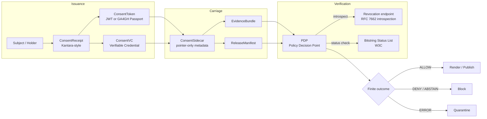
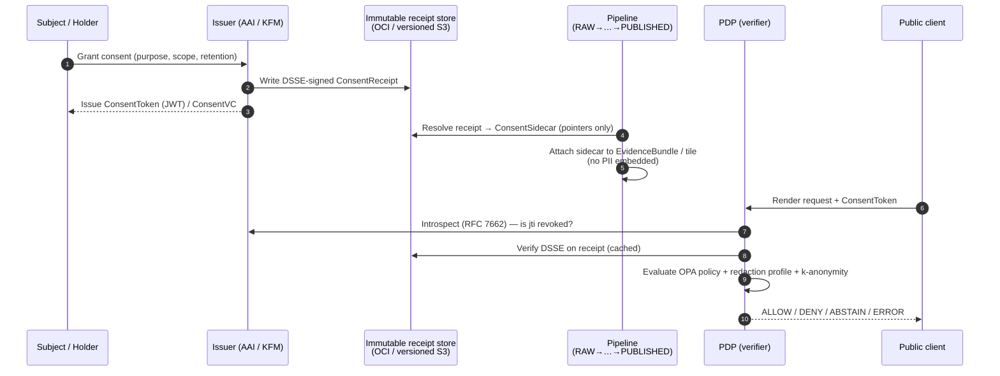
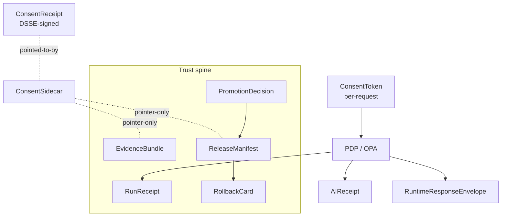

SECTION 1 — GITHUB MARKDOWN

````markdown
<!-- [KFM_META_BLOCK_V2]
doc_id: kfm://doc/standards/consent-tokens
title: Consent Tokens
type: standard
version: v1
status: draft
owners: TBD (Docs steward + Security/Policy lead)
created: 2026-05-14
updated: 2026-05-14
policy_label: public
related:
  - docs/doctrine/directory-rules.md
  - docs/doctrine/trust-membrane.md
  - docs/doctrine/lifecycle-law.md
  - docs/standards/GA4GH_AAI.md            # PROPOSED — companion standard, NEEDS VERIFICATION
  - docs/standards/SIGNING.md              # PROPOSED — cosign/DSSE
  - docs/standards/DP_BUDGETS.md           # PROPOSED — differential-privacy budgets
  - docs/policy/living_persons_geoprivacy.md  # PROPOSED — k-anonymity rule
  - docs/runbooks/revocation.md            # PROPOSED — revocation playbook
  - contracts/runtime/consent_token.md     # PROPOSED — meaning
  - schemas/contracts/v1/runtime/consent_token.schema.json  # PROPOSED — shape (ADR-0001)
  - policy/consent/                        # PROPOSED — admissibility
tags: [kfm, standards, consent, privacy, policy-as-code, ga4gh]
notes:
  - All KFM-internal paths in this doc are PROPOSED per Directory Rules §0 until verified against mounted-repo evidence.
  - This doc resolves a known doctrinal gap (C-Atlas Pass 10 §8.6 — "Fragmented Consent Vocabulary") by naming the canonical token surface.
[/KFM_META_BLOCK_V2] -->

# Consent Tokens

> The canonical KFM standard for **short-lived, signed, machine-readable consent** that travels with sensitive data and is verified, fail-closed, at every render and publication boundary.


**Status:** draft · **Owners:** Docs steward + Security/Policy lead (TBD) · **Updated:** 2026-05-14

> [!IMPORTANT]
> **Doctrinal stance.** Consent does **not** publish data. A valid consent token is a *necessary* gate, never a *sufficient* one. Publication still requires evidence validation, policy review, sensitivity review, rights review, release promotion, correction lineage, and rollback target — exactly as **publication is a governed state transition, not a file move.**

---

## 📑 Contents

1. [Purpose & scope](#1-purpose--scope)
2. [Where this sits in KFM](#2-where-this-sits-in-kfm)
3. [Three artifacts, three jobs](#3-three-artifacts-three-jobs)
4. [Token shape (JWT / GA4GH Passport)](#4-token-shape-jwt--ga4gh-passport)
5. [Claims registry](#5-claims-registry)
6. [Lifecycle](#6-lifecycle)
7. [Verification & fail-closed posture](#7-verification--fail-closed-posture)
8. [Revocation, embargo & cache invalidation](#8-revocation-embargo--cache-invalidation)
9. [Caching policy for introspection](#9-caching-policy-for-introspection)
10. [Finite outcomes](#10-finite-outcomes)
11. [Integration points](#11-integration-points)
12. [Validation & negative-path fixtures](#12-validation--negative-path-fixtures)
13. [Anti-patterns](#13-anti-patterns)
14. [Open questions & verification backlog](#14-open-questions--verification-backlog)
15. [Related docs](#15-related-docs)
16. [Appendix](#16-appendix)

---

## 1. Purpose & scope

**CONFIRMED.** KFM treats consent as an **enforceable, machine-readable policy** rather than as static text. A consent token is the compact, signed envelope that carries that policy with the data and is checked on every render and every publication boundary by the Policy Decision Point (PDP). This document defines the canonical token surface, the claims it carries, how it is verified, how it is revoked, and how it composes with the rest of the trust spine (`EvidenceBundle`, `RunReceipt`, `ReleaseManifest`, `PromotionDecision`, `RollbackCard`).

**Scope.** This standard governs the *token surface* and its verification rules. It does **not** govern:

| Out of scope here | Lives in |
|---|---|
| Object meaning (`ConsentToken`, `ConsentReceipt`, `ConsentSidecar`) | `contracts/runtime/` *(PROPOSED)* |
| Machine-checkable shape | `schemas/contracts/v1/runtime/` *(PROPOSED per ADR-0001)* |
| Admissibility / allow-deny logic | `policy/consent/` *(PROPOSED)* |
| k-anonymity & geoprivacy rules | `docs/policy/living_persons_geoprivacy.md` *(PROPOSED)* |
| Differential-privacy budgets | `docs/standards/DP_BUDGETS.md` *(PROPOSED)* |
| DSSE/cosign signing of receipts | `docs/standards/SIGNING.md` *(PROPOSED)* |
| Revocation operational playbook | `docs/runbooks/revocation.md` *(PROPOSED)* |

> [!NOTE]
> This document closes a known gap. Pass 10 §8.6 ("Fragmented Consent Vocabulary") records that consent appears in multiple categories — JWT-format tokens (C6-07), GA4GH Passport claims (C9-04), MetaBlock v2 consent fields (C15-01), and default-deny (C15-03) — without a canonical reconciliation. This standard names the canonical KFM **ConsentToken** and defines how the other vocabularies normalize into it.

---

## 2. Where this sits in KFM



> [!NOTE]
> The PDP is the **only** component authorized to convert a token into a render or publish decision. Adapters, UIs, and clients MUST NOT short-circuit this path.

[Back to top ↑](#-contents)

---

## 3. Three artifacts, three jobs

> [!CAUTION]
> Confusing these three artifacts is the single most common modeling error in consent-aware systems. Keep them distinct in code, in storage, in receipts, and in policy.

| Artifact | What it is | Holder | Signed by | Verified by | Travels with |
|---|---|---|---|---|---|
| **ConsentReceipt** *(CONFIRMED — corpus & Kantara pattern)* | Human- + machine-readable record of a specific consent event (purpose, scope, retention, revocation URI). | Issuer / controller (immutable store). | Issuer signing key, **wrapped in DSSE envelope**, cosign-attested. | Receipt verifier (DSSE + cosign). | Pointer only (`consent_receipt_pointer`). Never embedded in public tiles. |
| **ConsentToken** *(this document)* | Short-lived, compact, signed bearer/holder credential carrying the *active* grant at request time (JWT or GA4GH Passport). | Subject (presented per request). | Issuer / AAI broker. | PDP (`verify_sig` + introspection). | Per request; never persisted in tiles or graph exports. |
| **ConsentSidecar** *(PROPOSED schema)* | Minimal pointer-only metadata placed beside an `EvidenceBundle` or tile artifact — `consent_scope`, `retention`, `no_reidentification`, pointers to the Receipt and the Status List. | Pipeline (PROCESSED → CATALOG). | n/a (data, not credential). | Schema validator + PDP at render-time. | The EvidenceBundle / tile artifact. **No PII.** |

A separate but related construct, the **ConsentVC** (W3C Verifiable Credential, presented via SD-JWT or BBS-2023), is the *holder-controlled* form of the receipt's content; it lets the subject prove only the bits a verifier needs (selective disclosure). KFM treats VC presentations as one valid *path* to satisfy the ConsentToken gate, not as a replacement for it.

[Back to top ↑](#-contents)

---

## 4. Token shape (JWT / GA4GH Passport)

**CONFIRMED.** KFM consent is expressed as a **short-lived signed token — a JWT or a GA4GH-style visa — carrying scopes, audience, expiry, `revocation_endpoint`, `consent_history_hash`, and a `redaction_profile` reference. The token travels with the data and is checked on every render** (corpus C6-07). The JWT shape maps directly to OAuth 2.0 token introspection (RFC 7662) and to the GA4GH AAI Passport model (CONFIRMED C9-04).

Two interoperable wire forms are accepted:

| Form | Use when | Composition |
|---|---|---|
| **KFM JWT** | First-party KFM contexts, internal services, partners without GA4GH tooling. | Signed JWT (compact JWS). Header `alg` MUST be an asymmetric signing algorithm acceptable to the issuer's key policy (e.g., `EdDSA`, `ES256`). |
| **GA4GH Passport visa** | Human-subject / genomic contexts, federated research, international partners. | OIDC-issued Passport carrying one or more Visa Assertions, each itself a JWT carrying DUO codes and consent context. |

> [!NOTE]
> The two forms share the same KFM claim surface (§5). A GA4GH Passport simply nests KFM's consent claims inside a Visa Assertion. The PDP MUST accept both and normalize them to a single internal `ConsentClaims` record before evaluating policy.

<details>
<summary><strong>Minimal example — KFM JWT payload (PROPOSED illustrative)</strong></summary>

```json
{
  "iss": "https://issuer.example.kfm/",
  "sub": "did:example:holder-pseudonym",
  "aud": ["kfm://surface/governed-api", "kfm://surface/map-shell"],
  "iat": 1747200000,
  "exp": 1747203600,
  "jti": "01J5Y8...AB",

  "kfm:scope": ["genealogy.read", "tile.render.living-person"],
  "kfm:purpose": ["research", "mapping"],
  "kfm:no_reidentification": true,
  "kfm:retention": "P1Y",
  "kfm:redaction_profile": "profile:living-person:k10-cell500m",

  "kfm:consent_history_hash": "sha256-...",
  "kfm:revocation_endpoint": "https://issuer.example.kfm/oauth2/introspect",
  "kfm:status_pointer": "https://status.example.kfm/bl/2026q2#42317",
  "kfm:duo": ["DUO:0000007"]
}
```

> Illustrative only. Field names beginning with `kfm:` are PROPOSED canonical. Values, including `jti`, timestamps, and hashes, are placeholders.

</details>

[Back to top ↑](#-contents)

---

## 5. Claims registry

The claims below are the canonical KFM consent surface. **CONFIRMED** claims are required by corpus doctrine; **PROPOSED** claims are recommended additions that need schema-home confirmation (ADR-0001).

| Claim | Type | Req? | Source | Purpose |
|---|---|---|---|---|
| `iss` | URI | MUST | JWT (RFC 7519) — EXTERNAL | Token issuer identity. |
| `sub` | string | MUST | JWT — EXTERNAL | Holder-bound pseudonymous subject. **MUST NOT** be a stable PII identifier. |
| `aud` | string[] | MUST | JWT — EXTERNAL | Allowed audiences (e.g., `kfm://surface/governed-api`). |
| `iat` | int | MUST | JWT — EXTERNAL | Issued-at, seconds since epoch. |
| `exp` | int | MUST | JWT — EXTERNAL | Hard expiry. PDP MUST reject `now ≥ exp`. |
| `jti` | string | MUST | JWT — EXTERNAL | Unique token ID, supports introspection and replay defense. |
| `kfm:scope` | string[] | MUST | C6-07 (CONFIRMED) | Granted scopes (`genealogy.read`, `tile.render.living-person`, etc.). |
| `kfm:purpose` | string[] | MUST | NewIdeas — CONFIRMED pattern | Purpose-limitation tags (`research`, `mapping`, …). |
| `kfm:retention` | ISO-8601 duration | MUST | NewIdeas — CONFIRMED pattern | Retention window (`P1Y`, `P30D`). |
| `kfm:no_reidentification` | bool | MUST | NewIdeas — CONFIRMED pattern | If false, render MUST be denied. |
| `kfm:revocation_endpoint` | URI | MUST | C6-07 (CONFIRMED) | RFC 7662 OAuth 2.0 introspection URL. |
| `kfm:consent_history_hash` | hash | MUST | C6-07 (CONFIRMED) | Pin to immutable consent-history ledger entry. |
| `kfm:redaction_profile` | URI / name | SHOULD | C6-07 (CONFIRMED) | Named profile required at render (`profile:sinc-obscure-10km`, etc.). |
| `kfm:status_pointer` | URI | SHOULD | NewIdeas — CONFIRMED pattern | W3C Bitstring Status List index for privacy-preserving revocation. |
| `kfm:duo` | URI[] | SHOULD | C9-04 (CONFIRMED) | GA4GH Data Use Ontology codes. |
| `kfm:embargo_until` | RFC 3339 | MAY | C6-08 (CONFIRMED) | Render denied while `now < embargo_until`. |
| `kfm:k_anonymity` | object | MAY | C6-06 (CONFIRMED) | `{ k, cell_m, fallback }` for living-people overlays. |
| `kfm:linked_evidence` | URI[] | MAY | C8-04 (CONFIRMED) | EvidenceRef list this grant pertains to. |

> [!NOTE]
> KFM-specific claim names are **PROPOSED** as `kfm:`-prefixed to avoid collisions with IANA JWT claims. The exact spelling is **NEEDS VERIFICATION** until an ADR pins the namespace.

[Back to top ↑](#-contents)

---

## 6. Lifecycle



**Lifecycle invariants** *(CONFIRMED from corpus doctrine):*

- **Promotion is a governed state transition.** A token's existence never triggers a phase transition; it gates `render`/`publish` only.
- **RAW → WORK / QUARANTINE → PROCESSED → CATALOG / TRIPLET → PUBLISHED.** Consent metadata is admitted at `RAW → WORK` (or sent to `QUARANTINE` if missing). Tokens are minted independently and consumed at `render` and at `release`.
- **No PII in public artifacts.** Sidecars carry pointers; tokens carry pseudonyms. Tiles, vector indexes, story exports, and graph exports MUST NOT carry stable PII.

[Back to top ↑](#-contents)

---

## 7. Verification & fail-closed posture

> [!WARNING]
> **The PDP MUST fail closed.** This includes — explicitly — the case where the revocation endpoint is unreachable. **CONFIRMED** by corpus C6-07: *"the PDP introspects the token's revocation endpoint as part of every access decision and fails closed when introspection cannot be completed."*

The verification sequence is fixed:

1. **Decode** the JWT / Passport. Reject if header `alg` not on the allowlist or `kid` not resolvable.
2. **Verify signature** against issuer's published JWKS (with key-rotation tolerance window).
3. **Check temporal claims.** `iat ≤ now < exp`. Reject otherwise.
4. **Check audience.** The current surface URI MUST be in `aud`.
5. **Introspect revocation.** Call `kfm:revocation_endpoint` (RFC 7662). Reject if `active == false`.
6. **Check status list.** Resolve `kfm:status_pointer` (W3C Bitstring Status List). Reject if bit set.
7. **Check scope.** Every required scope for this surface MUST appear in `kfm:scope`.
8. **Check purpose-limitation.** The render purpose MUST be a subset of `kfm:purpose`.
9. **Check retention.** `now < (iat + kfm:retention)`. Reject if elapsed.
10. **Apply redaction profile** named by `kfm:redaction_profile` (and `kfm:k_anonymity` if present).
11. **Emit `AIReceipt` / `RuntimeResponseEnvelope`** with the finite outcome.

<details>
<summary><strong>Reference verifier pseudocode (illustrative)</strong></summary>

```text
function verifyConsentToken(req):
  tok = decodeJWT(req.token)
  if not signatureValid(tok, issuerJWKS):       return DENY("bad_signature")
  if not temporalValid(tok):                    return DENY("expired_or_not_yet_valid")
  if req.surface not in tok.aud:                return DENY("audience_mismatch")
  intro = introspect(tok.kfm_revocation_endpoint, tok.jti)
  if intro is UNREACHABLE:                      return DENY("introspection_unreachable")  # fail-closed
  if intro.active != true:                      return DENY("revoked")
  if statusBitSet(tok.kfm_status_pointer):      return DENY("status_revoked")
  if not scopeCovers(tok.kfm_scope, req.required_scope): return DENY("scope_mismatch")
  if not purposeAllows(tok.kfm_purpose, req.purpose):    return DENY("purpose_mismatch")
  if retentionElapsed(tok):                     return DENY("retention_elapsed")
  obligations = redactionFor(tok.kfm_redaction_profile, tok.kfm_k_anonymity)
  return ALLOW(obligations)
```

</details>

[Back to top ↑](#-contents)

---

## 8. Revocation, embargo & cache invalidation

**CONFIRMED** (C6-08): every published item exposes `revocation_endpoint`, `embargo_until`, and cache-invalidation hooks. On revocation, the system issues a signed **tombstone**, appends a new `spec_hash` and `RunReceipt` to the ledger, and triggers invalidation webhooks (PMTiles index bump, tile server purge).

| Trigger | Effect on token | Effect on cache | Effect on lineage |
|---|---|---|---|
| Subject revokes consent | `introspect.active = false`; status bit set | Invalidate downstream tiles, vector indexes, story exports | Emit tombstone; new `spec_hash`; correction lineage entry |
| `exp` elapsed | Token naturally invalid; reissue or deny | Cached `ALLOW` decisions MUST honor cap on TTL (§9) | n/a |
| `embargo_until > now` | Render denied regardless of token validity | Pre-embargo render outputs MUST NOT be served | n/a |
| Vendor-distress event (C9-07) | Issuer policy may proactively flip status bits | Treat as mass revocation; bulk invalidation | New release manifest |

> [!CAUTION]
> A revocation that does not invalidate caches is incomplete. Stale tiles can leak retracted content. Test the invalidation pathway with a deliberate revocation fixture *before* relying on it in production.

**Tombstoning vs. erasure.** Tombstones satisfy *explainability and audit*. They do not, by themselves, satisfy right-to-be-forgotten / erasure obligations. The boundary between tombstone-sufficient and erasure-required is **OPEN** in the corpus and is tracked in `docs/runbooks/revocation.md` (PROPOSED). For Tribal data and applicable jurisdictions, default to the stricter standard.

[Back to top ↑](#-contents)

---

## 9. Caching policy for introspection

**Tension** *(CONFIRMED C6-07):* introspection latency is in the access path; caching is necessary, but caching revocation results extends the window in which a revoked token is honored.

**NEEDS VERIFICATION** — open question in the corpus: *"What is the cache TTL for revocation introspection results?"* This standard PROPOSES the following posture; the exact numbers are open and SHOULD be pinned per-domain by ADR.

| Outcome | PROPOSED default TTL | Rationale |
|---|---|---|
| `introspect.active = true` | **≤ 30 s** for sensitivity rank ≥ 3; **≤ 5 min** for rank ≤ 2 | Trades a small window of stale-allow for usable latency. |
| `introspect.active = false` | **0 s — never cache positive-revocation results as allow.** Cache the *revoked* state aggressively (e.g., 5 min). | Revocation must propagate immediately; staleness only ever errs toward DENY. |
| Introspection unreachable | **0 s — fail closed, no fallback cache.** | Per C6-07: "fails closed when introspection cannot be completed." |
| Status-list fetch | TTL aligned with status-list publisher's `Cache-Control`, capped per profile. | W3C Bitstring Status Lists are designed for cacheable distribution. |

> [!IMPORTANT]
> The cache **MUST NOT** convert an *unreachable* introspection result into an `ALLOW`. Negative-result caching (revoked-as-revoked) is encouraged. Positive-result caching is bounded.

The cache layer MUST log every cache hit that materially affected a decision, so audit can reconstruct what was enforced at any given moment.

[Back to top ↑](#-contents)

---

## 10. Finite outcomes

KFM finite-outcome vocabulary applies to consent decisions exactly as it does to every other governed surface:

| Outcome | When | Renderer behavior |
|---|---|---|
| **ALLOW** | All verification steps pass, obligations satisfied. | Render / publish, with the obligations applied (e.g., k-anonymity, generalized geometry). |
| **DENY** | Hard failure: bad signature, revoked, scope mismatch, retention elapsed, embargo not lifted, introspection unreachable. | Block; emit `AIReceipt` with `policy_decision = DENY` and a stable reason code. |
| **ABSTAIN** | Required holder presentation missing or unresolvable; evidence closure unsatisfied. | Show stale-state / cite-or-abstain UI; do **not** silently downgrade redaction. |
| **ERROR** | Signature parse error, malformed JWT, schema-invalid sidecar. | Quarantine; surface a non-private error code; never publish. |

> [!NOTE]
> Renderers MUST emit an `AIReceipt` / `RuntimeResponseEnvelope` with `outcome ∈ {ANSWER, ABSTAIN, DENY, ERROR}` and a `policy_decision` field. **No public surface is permitted to bypass receipt emission.**

[Back to top ↑](#-contents)

---

## 11. Integration points



| KFM surface | How consent tokens compose |
|---|---|
| **EvidenceBundle** (C8-04, CONFIRMED) | Carries `consent_sidecar` pointer-only metadata; never embeds tokens or PII. |
| **RunReceipt** (CONFIRMED) | `decision_log.policy_id = "gate.consent"`; records `jti` fingerprint and introspection outcome, not the token itself. |
| **ReleaseManifest** (CONFIRMED) | `sensitivity`, `policy_label`, `rights_status` are evaluated alongside the consent gate. Consent does **not** publish — the release gate still runs. |
| **PromotionDecision** (CONFIRMED) | Gate C (Policy Parity) and Gate D (Security / Sensitivity) include consent-related rules; identical OPA bundle digest in CI and runtime. |
| **RollbackCard** (CONFIRMED) | Mass-revocation events trigger rollback to a prior `ReleaseManifest`; `RollbackCard.rollback_supported = true` is checked at release time. |
| **Focus Mode (governed AI)** | A Focus Mode answer that touches consent-bound evidence MUST resolve every `EvidenceRef → EvidenceBundle` and re-verify the token against the surface `aud`. ABSTAIN when proof is missing. |
| **MapLibre / tile runtime** | `VerifyReceipt.digest_verified` plus the consent gate together gate capability issuance. Public clients NEVER touch RAW / WORK / QUARANTINE. |

[Back to top ↑](#-contents)

---

## 12. Validation & negative-path fixtures

> [!NOTE]
> Per `directory-rules.md` §15 ("Required README Contract"), each consent-related folder MUST carry a README declaring inputs, outputs, and validation. Fixture homes below are **PROPOSED** until repo evidence is mounted.

**Required gate suite** *(PROPOSED, names borrowed from corpus's CI gate recommendation):*

| Gate | What it checks |
|---|---|
| `consent_signature_verify` | JWT signature against issuer JWKS; DSSE on linked receipt. |
| `consent_status_verify` | Introspection + Bitstring Status List; fail-closed on unreachable. |
| `consent_scope_match` | Surface's required scopes ⊆ `kfm:scope`. |
| `consent_purpose_match` | Render purpose ⊆ `kfm:purpose`. |
| `consent_retention_check` | `now < (iat + kfm:retention)`. |
| `consent_no_pii_in_artifact` | No PII fields in published tiles, vector indexes, or graph exports. |
| `consent_policy_gate` | OPA decision against `policy/consent/render.rego`. |
| `consent_render_fail_closed` | Negative-path coverage. |

**Required negative fixtures** *(PROPOSED home: `tests/fixtures/consent/invalid/`):*

| Fixture | Expected outcome | What it proves |
|---|---|---|
| `revoked_credential.json` | DENY | Revocation honored end-to-end. |
| `expired_retention.json` | DENY | Retention window enforced. |
| `missing_dsse.json` | DENY | Receipt-signature absence is not lenient. |
| `invalid_signature.json` | ERROR | Tamper detection. |
| `scope_mismatch.json` | DENY | Scope is not silently expanded. |
| `purpose_mismatch.json` | DENY | Purpose-limitation enforced. |
| `audience_mismatch.json` | DENY | Token from another surface cannot be reused. |
| `unreachable_introspection.json` | DENY | **Fail-closed verified.** |
| `public_identifier_leak.json` | DENY | No PII in public artifacts. |
| `stale_status_list.json` | DENY / ABSTAIN | Stale-state propagation enforced. |
| `embargo_not_lifted.json` | DENY | Time-bound suppression enforced. |
| `presentation_missing.json` | ABSTAIN | Cite-or-abstain posture preserved. |

[Back to top ↑](#-contents)

---

## 13. Anti-patterns

> [!WARNING]
> Each of the patterns below has been observed across consent-aware systems and is **expressly forbidden** in KFM.

| Anti-pattern | Why it fails | Correct path |
|---|---|---|
| Embedding stable PII inside a tile, vector index, graph export, or story manifest. | Linkage attacks; revocation cannot reach already-published artifacts. | Pointers only; ConsentSidecar; `no_reidentification:true`. |
| Treating an `ALLOW` from the PDP as a publication decision. | Consent ≠ publication. | Run the release gate (`ReleaseManifest` + `PromotionDecision`) afterward. |
| Long TTL on positive introspection results (e.g., > 5 min for sensitive ranks). | Extends the revocation propagation window beyond policy. | §9 caps. |
| Caching an *unreachable* introspection result as `ALLOW`. | Defeats fail-closed posture. | Cache only definite outcomes; unreachable → DENY. |
| Conflating `ConsentToken` with `ConsentReceipt`. | The token is short-lived and bearer/holder-bound; the receipt is durable evidence. | Keep them separate in code, storage, and policy. |
| AI-generated summaries that imply a consent state without a verified token. | Hallucinated consent. | The AI surface ABSTAINs when the consent gate cannot be re-verified. |
| Using a stable `sub` that maps to a real-world identifier. | Re-identification risk. | Pseudonyms; pairwise DIDs; blinded status indexes. |

[Back to top ↑](#-contents)

---

## 14. Open questions & verification backlog

These items SHOULD be tracked in `docs/registers/VERIFICATION_BACKLOG.md` and resolved via ADR or follow-up doc.

- **NEEDS VERIFICATION:** Canonical TTL values for positive introspection results, per sensitivity rank. *(§9 PROPOSES defaults.)*
- **NEEDS VERIFICATION:** Canonical `kfm:`-prefixed claim names and the JWT private-claim namespace.
- **NEEDS VERIFICATION:** Whether `policy/consent/` or `policy/runtime/consent/` is the canonical OPA home, given Directory Rules §18 open items on `policy/` vs `policies/`.
- **NEEDS VERIFICATION:** Default signing-algorithm allowlist; alignment with `docs/standards/SIGNING.md` and ADR-S-06.
- **OPEN:** Per-domain `k_anonymity.k` defaults (corpus suggests `k=10`, but rural-density tuning is unresolved — C6-06).
- **OPEN:** Boundary between tombstone-sufficient and erasure-required for personal data (C5-09 / C6-08).
- **OPEN:** Should this document specify the audience-URI scheme (`kfm://surface/…`) or defer to `docs/architecture/governed-api.md`?
- **PROPOSED ADR-class:** Reconcile fragmented consent vocabulary (C6-07 / C9-04 / C15-01 / C15-03) under a single canonical envelope — this document is a step toward that ADR, not the ADR itself.

[Back to top ↑](#-contents)

---

## 15. Related docs

> Many of the links below are **PROPOSED** — they describe the doctrinal companions this standard expects to exist. Mark unresolved targets with `TODO` until the mounted-repo state is verified.

- `docs/doctrine/directory-rules.md` — CONFIRMED. Governs the placement of this file and its companions.
- `docs/doctrine/trust-membrane.md` — *PROPOSED.* Doctrinal anchor for fail-closed posture.
- `docs/doctrine/lifecycle-law.md` — *PROPOSED.* RAW → … → PUBLISHED.
- `docs/standards/GA4GH_AAI.md` — *PROPOSED.* Passport / Visa / DUO companion.
- `docs/standards/SIGNING.md` — *PROPOSED.* cosign / Sigstore / DSSE.
- `docs/standards/PROVENANCE.md` — *PROPOSED.* SLSA / in-toto.
- `docs/standards/DP_BUDGETS.md` — *PROPOSED.* Differential privacy.
- `docs/policy/living_persons_geoprivacy.md` — *PROPOSED.* k-anonymity grid + fallback mask.
- `docs/runbooks/revocation.md` — *PROPOSED.* Revocation playbook; tombstone vs. erasure.
- `contracts/runtime/consent_token.md` — *PROPOSED.* Object meaning.
- `schemas/contracts/v1/runtime/consent_token.schema.json` — *PROPOSED per ADR-0001.* Object shape.
- `policy/consent/` — *PROPOSED.* OPA bundle.

[Back to top ↑](#-contents)

---

## 16. Appendix

<details>
<summary><strong>A. Cross-source citation map (corpus → this doc)</strong></summary>

| Corpus source | Anchors in this doc |
|---|---|
| Pass 10 §C6-07 *Compact Consent Tokens (JWT or GA4GH Visa)* | §4 token shape; §5 claims; §7 fail-closed posture; §9 caching |
| Pass 10 §C6-08 *Revocation Endpoints, Embargo, Cache Invalidation* | §8 revocation; §10 outcomes |
| Pass 10 §C6-06 *k-Anonymity for Living-People Overlays* | §5 `kfm:k_anonymity`; §11 redaction obligations |
| Pass 10 §C6-01 *Sensitivity Rubric 0–5* | §5 `kfm:redaction_profile`; §9 TTL tiers |
| Pass 10 §C9-04 *GA4GH AAI / Passports / DUO / MRCG* | §4 GA4GH form; §5 `kfm:duo` |
| Pass 10 §C8-04 *Evidence-Bundle JSON-LD* | §11 EvidenceBundle integration |
| Pass 10 §8.6 *Fragmented Consent Vocabulary (Gap)* | §1 purpose; §14 open questions |
| Pass 10 §C5-03 *Policy Parity: CI = Runtime* | §11 PromotionDecision |
| Pass 10 §C1-01 *Run Receipt* | §11 RunReceipt |
| New Ideas (5-8-26): *Consent Governance Pattern* | §3 three-artifact split; §12 negative fixtures |
| `directory-rules.md` §0, §6.1, §15, §18 | Meta block; placement; README contract; open backlog |

</details>

<details>
<summary><strong>B. External standards referenced (EXTERNAL, by name only)</strong></summary>

The standards below are named by the KFM corpus as targets of conformance. This document does not re-specify them; it composes them.

- **RFC 7519** — JSON Web Token (JWT). *(JWT shape per C6-07.)*
- **RFC 7662** — OAuth 2.0 Token Introspection. *(Revocation endpoint per C6-07.)*
- **GA4GH AAI / Passports / Visa Assertions** — Federated authorization. *(C9-04.)*
- **GA4GH Data Use Ontology (DUO)** — Data-use vocabulary. *(C9-04.)*
- **W3C Verifiable Credentials Data Model 2.0** — Holder-presented credentials.
- **IETF SD-JWT VC** *(draft)* — Selective-disclosure JWTs.
- **BBS-2023** — Selective-disclosure signatures.
- **W3C Bitstring Status List** — Privacy-preserving credential status.
- **Kantara Consent Receipt** — Receipt format pattern.
- **DSSE** (Dead Simple Signing Envelope) — Receipt wrapping.
- **Sigstore / cosign** — Keyless signing and transparency.
- **NIST SP 800-226** — Differential privacy guidance. *(C9-05.)*
- **EDPB Guidelines 01/2025** — Pseudonymisation. *(C9-05.)*

> External specifications evolve; their current syntax and behavior MUST be re-checked at adoption time, not memorized.

</details>

<details>
<summary><strong>C. Example OPA / Rego policy stub (illustrative)</strong></summary>

```rego
package policy.consent.render

import data.common

default decision = "DENY"
default reason   = "deny_by_default"

decision = "ALLOW" {
  input.token.signature_valid
  input.token.temporal_valid
  input.token.audience_match
  input.introspection.active
  not input.status.revoked
  input.scope_satisfied
  input.purpose_satisfied
  not input.retention_elapsed
  input.claims["kfm:no_reidentification"] == true
  not embargo_active
}

decision = "ERROR" {
  input.token.parse_error
}

decision = "ABSTAIN" {
  input.presentation_missing
}

embargo_active {
  ts := time.parse_rfc3339_ns(input.claims["kfm:embargo_until"])
  time.now_ns() < ts
}
```

> Illustrative only. The canonical bundle lives under `policy/consent/` (PROPOSED) and MUST be pinned by OCI digest in both CI and the runtime PDP (C5-03 parity).

</details>

<details>
<summary><strong>D. Glossary (KFM-specific terms, preserved exactly)</strong></summary>

- **EvidenceBundle** — Admissible evidence object resolved from EvidenceRef; outranks maps, tiles, and generated text.
- **EvidenceRef** — Pointer/reference to evidence; must resolve to an EvidenceBundle when claims depend on evidence.
- **RunReceipt** — Build/run receipt for pipeline or artifact generation: inputs, config / `spec_hash`, artifact digests, source head, tool versions, attestations.
- **ReleaseManifest** — Canonical publication object binding artifacts, evidence refs, sensitivity, rights, rollback.
- **PromotionDecision** — Promotion gate result with gate IDs, inputs, proofs, release target, rollback target.
- **RollbackCard** — Pointer to previous release manifest / root hash / tile checksum set with rollback drill and correction lineage.
- **spec_hash** — Deterministic content-addressed identity (JCS + SHA-256).
- **Finite outcomes** — ALLOW / ANSWER / DENY / ABSTAIN / ERROR. Renderers and PDP MUST emit one of these.

</details>

---

### Related docs (footer)

- [`docs/doctrine/directory-rules.md`](../doctrine/directory-rules.md) · [`docs/standards/GA4GH_AAI.md`](./GA4GH_AAI.md) *(PROPOSED)* · [`docs/standards/SIGNING.md`](./SIGNING.md) *(PROPOSED)* · [`docs/runbooks/revocation.md`](../runbooks/revocation.md) *(PROPOSED)*

**Last reviewed:** 2026-05-14 · **Next review by:** 2026-11-14 *(6-month cadence; flag for review if exceeded)*

[Back to top ↑](#-contents)
````
