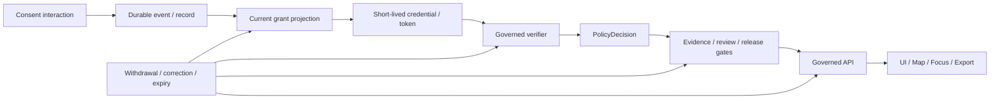

<!-- [KFM_META_BLOCK_V2]
doc_id: kfm://doc/standards/consent-tokens
title: Consent Tokens — Repository Boundary, Interoperability, and Graduation Standard
type: standard; interoperability-reference; consent-boundary; security-and-privacy-guidance
version: v2.0-draft
status: draft; repository-grounded; upstream-currentness-refreshed; mixed-maturity; no-token-profile-adopted; no-runtime-authority; no-release; no-publication
owners:
  - "@bartytime4life — verified GitHub review route through CODEOWNERS"
  - "NEEDS VERIFICATION — consent, privacy, security, identity, domain, policy, accessibility, release, correction, and independent-review stewards"
created: 2026-05-14
updated: 2026-08-18
policy_label: public; standards-guidance; consent; privacy; security; no-credentials
owning_root: docs/
responsibility: >
  Explain the human-readable boundary between a consent event, consent grant,
  consent credential or token, status and withdrawal, KFM policy evaluation,
  evidence support, release state, and public-safe projection without becoming
  consent authority, semantic contract, machine schema, policy, issuer, verifier,
  status service, release decision, or publication proof.
truth_posture: >
  CONFIRMED current repository placement, standards-lane role, parent consent-policy
  documentation posture, scaffolded consent schemas, bounded synthetic
  People-DNA-Land and Explorer projections, current PolicyDecision vocabulary,
  and dated official upstream publication-state checks / PROPOSED KFM consent
  object-family names, claims, profiles, verification order, propagation contract,
  fixtures, validators, producer and consumer bindings, and graduation sequence /
  UNKNOWN accepted KFM consent-token profile, qualified issuer and verifier trust
  framework, production consent records, live status or revocation service, parent
  consent-policy evaluator, runtime enforcement, propagation effectiveness, public
  release integration, and operational custody.
evidence_snapshot:
  repository: bartytime4life/Kansas-Frontier-Matrix
  base_ref: main
  base_commit: 7ac9f151aacc03b03fd486a64b348743b7325a51
  target_prior_blob: 954efe37bb02e88bae79008950fe6481c98ac58e
  standards_readme_blob: a8cbe5d183448d5f0de37f8a4eacd6fcaca0d71b
  contributing_blob: de5bf143e601e36a794e6e5442ae8f91c6f75aad
  codeowners_blob: dd2a84aa514d8ecd9208bc347f90f9a2ed37dd61
  contract_schema_policy_split_blob: cd9aae5adf6aded8dc8671ec7c3a36ac85150830
  policy_consent_readme_blob: 7dbae5ea1434ecf896176a891dadefea76913999
  runtime_consent_grant_schema_blob: 90309adcbad648279959a7e236a5282c86705369
  consent_family_readme_blob: f3df7888166287e4a86c3696204b64799b995eab
  governance_consent_receipt_schema_blob: a178b7dd29506a0811ac8f00135d849427e698ca
  consented_genealogy_overlay_contract_blob: d548e5eb93efe0b48accfa497de90dd924f753eb
  consent_revocation_assessment_contract_blob: dbf1fdff6585f3db4213c17d8f18bfc81ecec04d
  consent_card_projection_blob: 8f919bb124f21b432ccbceb0c4efc17ddd8b6ab1
external_currentness_review:
  access_date: 2026-08-18
  scope: official issuers only; publication state and security guidance, not KFM adoption or implementation
related:
  - ./README.md
  - ../doctrine/directory-rules.md
  - ../doctrine/trust-membrane.md
  - ../doctrine/lifecycle-law.md
  - ../adr/ADR-0029-adopt-directory-governance-standard-v2.md
  - ../architecture/contract-schema-policy-split.md
  - ../focus-mode/CONSENT_PATTERN.md
  - ./DUO_MAPPING.md
  - ./REDACTION_PROFILES.md
  - ./SENSITIVITY_RUBRIC.md
  - ../security/DATA_CLASSIFICATION.md
  - ../../policy/consent/README.md
  - ../../contracts/policy/policy_decision.md
  - ../../contracts/domains/people-dna-land/consented_genealogy_overlay.md
  - ../../contracts/domains/people-dna-land/consent_revocation_propagation_assessment.md
  - ../../schemas/contracts/v1/runtime/consent_grant.schema.json
  - ../../schemas/contracts/v1/consent/README.md
  - ../../schemas/governance/consent_receipt.schema.json
  - ../../apps/explorer-web/src/adapters/ConsentCardProjection.ts
notes:
  - "Same-path standards-document modernization plus one generated-work receipt."
  - "No consent profile, token format, claim namespace, issuer, verifier, trust registry, status service, policy rule, runtime route, source, release, or publication is adopted or activated by this revision."
  - "The prior three-artifact distinction is retained but narrowed: repository evidence does not establish canonical ConsentToken, ConsentReceipt, or ConsentSidecar machine object families."
  - "Existing inbound links remain valid through retained section headings and explicit compatibility anchors."
[/KFM_META_BLOCK_V2] -->

<a id="top"></a>

# Consent Tokens — Repository Boundary, Interoperability, and Graduation Standard

> **Purpose.** Explain how KFM may eventually represent and verify a bounded consent grant at a governed request boundary—without confusing a signed credential, status response, UI card, receipt, schema, policy result, or passing test with consent, evidence authority, lawful use, release approval, or publication.

| Field | Current bounded result |
|---|---|
| **Evidence snapshot** | `main@7ac9f151aacc03b03fd486a64b348743b7325a51` |
| **Directory result** | `PLACE` at the existing `docs/standards/CONSENT_TOKENS.md` path. Accepted ADR-0029 and the standards-lane README assign human-readable standards guidance to `docs/standards/`. |
| **Document authority** | Terminology, interoperability map, security baseline, negative-path matrix, and graduation gates only |
| **Machine authority** | **NOT ESTABLISHED.** The inspected `consent_grant` and governance `consent_receipt` schemas are permissive scaffolds; `schemas/contracts/v1/consent/` is a compatibility placeholder. |
| **Policy authority** | **NOT ESTABLISHED at the parent lane.** `policy/consent/` records no accepted parent rule, evaluator binding, or production `PolicyDecision`. |
| **Executable proof** | Bounded synthetic People-DNA-Land consent/revocation profiles and a fixture-first Explorer Consent Card projection; none issues consent or proves production enforcement. |
| **Upstream review** | Official IETF, W3C, and GA4GH sources checked on 2026-08-18. External publication state does not establish KFM adoption. |
| **Release effect** | None. A consent credential may be necessary for an operation; it is never sufficient for evidence, rights, review, release, or publication. |

> [!IMPORTANT]
> **Consent is necessary only where the governing use requires it, and it is never sufficient.** A valid presentation does not establish truth, source rights, data quality, policy approval, review completion, release state, or publication authority.

> [!CAUTION]
> **An active credential is sensitive security material.** Bearer tokens, private claims, subject identifiers, selective-disclosure material, keys, status credentials, and introspection responses must not enter repository fixtures, public URLs, browser history, screenshots, logs, analytics, generated receipts, tiles, graph exports, public manifests, issues, or pull-request text.

> [!WARNING]
> **Withdrawal must propagate or the system must fail closed.** Expiry of one presentation is not withdrawal of the underlying grant. Production use remains `HOLD` until propagation is implemented and measured across reads, answers, exports, tiles, graphs, indexes, model context, and caches.

<a id="-contents"></a>
<a id="contents"></a>

**Quick navigation:** [Role](#1-purpose--scope) · [Repository state](#2-where-this-sits-in-kfm) · [Object families](#3-three-artifacts-three-jobs) · [Profiles](#4-token-shape-jwt--ga4gh-passport) · [Claims](#5-claims-registry) · [Lifecycle](#6-lifecycle) · [Verification](#7-verification--fail-closed-posture) · [Withdrawal](#8-revocation-embargo--cache-invalidation) · [Caching](#9-caching-policy-for-introspection) · [Outcomes](#10-finite-outcomes) · [Integration](#11-integration-points) · [Validation](#12-validation--negative-path-fixtures) · [Anti-patterns](#13-anti-patterns) · [Open work](#14-open-questions--verification-backlog) · [Evidence](#15-related-docs) · [Appendix](#16-appendix)

---

<a id="1-purpose--scope"></a>

## 1. Purpose & scope

This page owns one responsibility: human-readable guidance for discussing consent credentials and their safe use at KFM boundaries.

It explains:

- why a consent event, durable record, current grant, presentation credential, status observation, policy decision, release decision, and public projection are different objects;
- which repository consent surfaces exist now and which remain scaffolded, synthetic, proposed, or unknown;
- the minimum semantics and security controls a future profile would need;
- how withdrawal, correction, cache invalidation, and rollback remain inspectable; and
- what must be proven before operational use.

It does **not** own:

| Concern | Owning authority |
|---|---|
| Placement | Accepted [`ADR-0029`](../adr/ADR-0029-adopt-directory-governance-standard-v2.md) and [`directory-rules.md`](../doctrine/directory-rules.md) |
| Object meaning | A reviewed semantic contract under [`contracts/`](../../contracts/README.md) |
| Machine shape | A reviewed schema under [`schemas/`](../../schemas/README.md) after the canonical family decision |
| Allow, deny, restrict, or abstain | [`policy/`](../../policy/README.md), qualified review, and a governed `PolicyDecision` |
| Consent capture or withdrawal | A governed controller/issuer workflow with authenticated authority and auditable custody |
| Credential issuance or verification | An admitted issuer, verifier, trust registry, key lifecycle, and runtime contract |
| Evidence support | `EvidenceRef`, `EvidenceBundle`, citations, and accepted resolver behavior |
| Release, correction, and rollback | [`release/`](../../release/README.md) and the relevant accountability objects |
| Public delivery | Governed APIs and released public-safe projections |
| Conformance proof | Exact-revision contracts, schemas, policy, fixtures, validators, producer/consumer tests, runtime evidence, and drills |

[`CODEOWNERS`](../../.github/CODEOWNERS) provides the verified default GitHub review route to `@bartytime4life`. It does not prove qualification, independent review, consent authority, identity authority, legal approval, policy approval, release authority, or review completion.

Material unresolved roles include consent/privacy, identity/authorization, security/cryptographic profile, domain, accessibility, policy/runtime, release/correction, legal or institutional authority, and independent review.

### Truth labels

| Label | Use in this page |
|---|---|
| `CONFIRMED` | Verified from repository bytes, accepted placement authority, exact official upstream pages, or current-session evidence |
| `PROPOSED` | A KFM object name, field, profile, algorithm set, service, fixture, validator, workflow, or graduation sequence not established as current behavior |
| `UNKNOWN` | Evidence cannot support a stronger current claim |
| `NEEDS VERIFICATION` | A concrete repository, identity, rights, security, policy, implementation, or operational check can settle the question |
| `CONFLICTED` | Current surfaces overlap or disagree in object identity, home, vocabulary, or authority |
| `HOLD` | Do not adopt, issue, verify, activate, release, or publish until closure evidence exists |

This page does not decide whether consent is the correct legal or ethical basis for a use, who may consent for another person or community, representative authority, retention periods, age thresholds, cryptographic profiles, or public release of sensitive data.

[Back to top](#top)

---

<a id="2-where-this-sits-in-kfm"></a>

## 2. Where this sits in KFM

### Current repository checkpoint

| Surface | What current bytes establish | What they do **not** establish |
|---|---|---|
| [`CONSENT_TOKENS.md`](./CONSENT_TOKENS.md) | Existing standards-lane target | An accepted token profile or runtime verifier |
| [`docs/standards/README.md`](./README.md) | Human-readable interoperability guidance, not contract/schema/policy/runtime/release authority | Adoption or conformance |
| [`policy/consent/README.md`](../../policy/consent/README.md) | Documentation-only parent lane and bounded child/synthetic inventory | Accepted parent rule, evaluator, PDP binding, or production decision |
| [`consent_grant.schema.json`](../../schemas/contracts/v1/runtime/consent_grant.schema.json) | Tracked runtime schema path | Field semantics or enforcement; it is a permissive empty scaffold |
| [`schemas/contracts/v1/consent/README.md`](../../schemas/contracts/v1/consent/README.md) | Compatibility placeholder warning against duplicate schema authority | Canonical consent schema family |
| [`consent_receipt.schema.json`](../../schemas/governance/consent_receipt.schema.json) | Tracked governance schema path | Usable receipt profile; it is a permissive empty scaffold |
| [`PolicyDecision`](../../contracts/policy/policy_decision.md) | Outward vocabulary `ANSWER`, `ABSTAIN`, `DENY`, `ERROR`; `consent` is a policy family | Implemented consent evaluator |
| [`ConsentedGenealogyOverlayCandidate`](../../contracts/domains/people-dna-land/consented_genealogy_overlay.md) | Synthetic restricted candidate profile with validation/tests | Real people, actual consent, source rights, release authority, or public use |
| [`ConsentRevocationPropagationAssessment`](../../contracts/domains/people-dna-land/consent_revocation_propagation_assessment.md) | Synthetic assessment over read/answer/export/tile/graph/index/cache targets | Withdrawal execution, cleanup, SLOs, or production propagation |
| [`ConsentCardProjection.ts`](../../apps/explorer-web/src/adapters/ConsentCardProjection.ts) | Strict public-safe fixture projection with finite UI outcomes and no transport or policy execution | Consent capture, issuance, revocation, identity proof, or runtime authorization |

**CONFIRMED:** KFM has useful synthetic and documentation-level consent building blocks, but they do not close a production consent credential path.

**CONFIRMED:** bounded search did not establish a canonical `contracts/runtime/consent_token.md` plus `schemas/contracts/v1/runtime/consent_token.schema.json` pair.

**CONFLICTED:** current materials use `ConsentToken`, `ConsentGrant`, `ConsentReceipt`, sidecar language, policy results, domain-specific candidates, and UI projections without one accepted shared object-family decision.

**UNKNOWN:** any external deployed system, private service, institutional agreement, or non-repository credential flow.

### Authority flow


```mermaid
flowchart LR
  A["Consent interaction"] --> B["Durable event / record"]
  B --> C["Current grant projection"]
  C --> D["Short-lived credential / token"]
  D --> E["Governed verifier"]
  E --> F["PolicyDecision"]
  F --> G["Evidence / review / release gates"]
  G --> H["Governed API"]
  H --> I["UI / Map / Focus / Export"]
  X["Withdrawal / correction / expiry"] --> C
  X --> E
  X --> G
  X --> H
```

A downstream carrier never acquires the authority of the underlying record. The verifier and policy decision remain subordinate to current status, evidence, rights, review, release, correction, and rollback state.

[Back to top](#top)

---

<a id="3-three-artifacts-three-jobs"></a>

## 3. Three artifacts, three jobs

The former three-artifact separation remains useful but is not established as canonical. A production design must keep at least these responsibilities distinct:

| Object or projection | Primary job | Security posture | Current KFM status |
|---|---|---|---|
| **Consent event / durable record** | Preserve what was agreed, by whom or under what authority, for which purpose/scope, at which time, with which notice/version | Restricted; append-only lineage; retention-limited | `PROPOSED`; current receipt schema is empty |
| **Consent grant** | Project the currently effective permission or prohibition for explicit operations/resources | Restricted; versioned; status-aware | `PROPOSED`; runtime schema is empty |
| **Credential / presentation** | Carry a minimum, short-lived, verifier-bound proof or reference to a current grant | Secret/restricted; never public | `PROPOSED`; no canonical KFM profile |
| **Status / withdrawal observation** | State whether a grant or credential is current, suspended, withdrawn, superseded, or unknown | Integrity-critical; privacy-minimized | `PROPOSED`; no live service established |
| **Sidecar / public-safe projection** | Carry non-secret pointers and visible obligations beside a governed response or artifact | Public-safe only after policy/release review | `PROPOSED`; no canonical schema |
| **Consent Card** | Explain a safe finite outcome and viewer controls without token material | Public-safe projection only | `CONFIRMED bounded fixture implementation` |
| **PolicyDecision** | Normalize relevant policy facts into a finite decision | Authority-bearing decision, not consent itself | Contract present; evaluator `UNKNOWN` |
| **Release/correction objects** | Approve, withdraw, correct, or roll back public state | Separate review/authority | Existing families; consent integration `UNKNOWN` |

Required anti-collapse rules:

1. A consent event is not a credential.
2. A credential is not the subject's identity or authority.
3. Authentication is not consent.
4. A signature proves integrity and key use, not understanding, voluntariness, legal capacity, representative authority, or current consent.
5. Consent is not source rights, copyright permission, community or tribal authorization, institutional approval, or release approval unless the governing authority explicitly says so.
6. A successful verifier result is not evidence support or factual truth.
7. A UI card is a projection, not an evaluator.
8. Expiry of a credential does not necessarily withdraw the grant; withdrawal must invalidate derived credentials and uses.
9. A public-safe projection must never contain bearer credentials, disclosure salts, private claims, stable personal identifiers, or correlating status details.

Subject, holder, consent actor, representative/delegate, controller/issuer, verifier, relying service, reviewer, and release authority must remain explicit and independently evidenced. Production issuance remains `HOLD` until their authority model is accepted.

[Back to top](#top)

---

<a id="4-token-shape-jwt--ga4gh-passport"></a>

## 4. Token shape (JWT / GA4GH Passport)

KFM has **no adopted consent-token wire profile** in the inspected evidence. Candidate families are not an allowlist:

| Candidate family | Suitable boundary | Main risk | KFM posture |
|---|---|---|---|
| **Opaque OAuth token + introspection** | Tightly governed service-to-service use | Introspection availability/privacy, caching, audience/resource binding, replay | `PROPOSED` |
| **Explicitly typed JWT** | Closed KFM profile with exact issuer/audience/type/algorithm/claims | Substitution, algorithm confusion, bearer replay, remote-key SSRF, claim over-trust | `PROPOSED` |
| **W3C VC v2.0 presentation** | Holder-mediated ecosystem requiring the W3C model | Minimization, holder binding, status privacy, verifier trust, proof-format validation | `PROPOSED` |
| **SD-JWT / SD-JWT+KB** | Selective disclosure with optional holder key binding | Linkability, salt entropy, always-disclosed metadata, replay, profile mismatch | `PROPOSED`; RFC 9901 alone is not a KFM profile |
| **SD-JWT VC** | Credential profile built on SD-JWT | Current IETF document is an active Internet-Draft | `HOLD for production profile` |
| **GA4GH Passport / Visa** | Federated biomedical/genomic research with GA4GH trust roles | Domain-specific broker/issuer/clearinghouse and controlled-access assumptions | `PROPOSED domain profile`; not generic default |
| **Pointer-only public projection** | Released artifacts/UI needing visible obligations without credential material | Must be generated from a governed decision | `PROPOSED preferred public form` |

A future implementation must select **one exact profile for one exact boundary**. “Accept anything signed” is unsafe. Each admitted profile must pin:

- semantic object family, version, media type or `typ`;
- issuer/verifier trust model and holder/sender binding;
- allowed algorithms, key discovery, rotation, compromise, and remote-reference rules;
- mutually exclusive validation rules;
- audience, resource, client, operation, and purpose registries;
- required and prohibited claims;
- status/withdrawal mechanism and freshness;
- maximum lifetime, replay defense, clock policy, and privacy/logging rules;
- producer, verifier, policy, and negative-fixture revisions; and
- deprecation, migration, correction, incident, and rollback path.

KFM must not store or transport active bearer credentials in `EvidenceBundle`, release manifests, public sidecars, tiles, graphs, indexes, logs, analytics, URLs, local storage, screenshots, or generated receipts. Public clients receive only a minimized governed projection.

[Back to top](#top)

---

<a id="5-claims-registry"></a>

## 5. Claims registry

Field names below are **PROPOSED semantics**, not a current schema or private-claim namespace.

### Durable grant semantics

| Semantic field | Purpose | Rule |
|---|---|---|
| `grant_id`, `grant_version` | Stable grant identity and revision | Must support correction/withdrawal lineage |
| `subject_ref` | Pairwise or governed subject reference | No stable public PII identifier |
| `consent_actor`, `authority_kind`, `delegation_ref` | Who acted and under what authority | Representative authority must be explicit, scoped, expiring, withdrawable |
| `purposes[]` | Permitted purpose classes | Closed registry; request must be a subset |
| `operations[]` | `READ`, `ANSWER`, `EXPORT`, `TILE`, `GRAPH`, `INDEX`, `MODEL_CONTEXT`, or accepted subset | No implication from generic scope |
| `resource_refs[]` | Exact governed resource or family | Wildcards prohibited for sensitive uses unless explicitly modeled/reviewed |
| `geography_scope`, `time_scope` | Spatial and temporal bounds | No scope expansion through centroids, joins, aggregation, or inference |
| `retention_limit` | Maximum permitted retention | Distinct from credential lifetime and source retention |
| `obligation_refs[]` | No re-identification, no redistribution, required redaction, audit, deletion, or other obligations | Must flow into `PolicyDecision` and consumers |
| `notice_ref`, `terms_version` | Notice/terms shown at consent | Exact immutable version required |
| `status`, `status_ref` | Current grant state and authoritative status source | Status outage fails closed |
| `policy_refs[]` | Policy applicable at evaluation | Does not itself prove policy execution |
| `evidence_refs[]` | Evidence relevant to the consent event or authority | Not support for unrelated factual claims |
| `spec_hash`, `recorded_at`, `effective_at` | Deterministic identity/time | Canonicalization and hash policy require accepted contracts |

### Presentation envelope

A JWT/OAuth/VC-style profile may require `iss`, `sub`, `aud`, `iat`, `exp`, `jti`, `typ`, `client_id` or authorized party, `resource`, `scope` or structured authorization details, `grant_id`, `grant_version`, `status_ref`, holder/sender binding, and an explicit profile/version. Exact names and requiredness belong in the adopted profile.

`scope` alone is insufficient. A request must remain within the intersection of authenticated caller, credential audience, resource, client, operation, purpose, geography, time, retention, grant status, policy, rights, sensitivity, review, and release state.

Prohibited or strongly discouraged content includes names, addresses, precise personal locations, raw DNA/genomic material, complete genealogy graphs, health details, private-land identifiers, secrets, private key material, disclosure salts, long-lived correlators, unrestricted source paths, precise sensitive geometry, raw denial reasons, or private consent history.

[Back to top](#top)

---

<a id="6-lifecycle"></a>

## 6. Lifecycle

Consent state and KFM lifecycle state are independent:

| Consent state | KFM consequence |
|---|---|
| `PROPOSED` | No higher-risk use; review required |
| `ACTIVE` | May satisfy one gate for an in-scope operation; all other gates still apply |
| `SUSPENDED` | Deny affected use until resolved |
| `WITHDRAWN` | Deny new use; start governed propagation and accountability |
| `EXPIRED` | Deny new use unless a distinct current grant exists |
| `SUPERSEDED` | Resolve to successor only through explicit lineage |
| `UNKNOWN` / status unavailable | Fail closed; never assume active |

Proposed governed flow:

```text
explain notice + scope + consequences
  -> authenticate actor and authority
  -> record immutable consent event
  -> derive versioned current grant
  -> issue minimum short-lived credential where needed
  -> verify credential + status + grant + request
  -> evaluate independent rights/sensitivity/evidence/review/release policy
  -> emit finite PolicyDecision
  -> return only public-safe projection
  -> record use without token/private-claim leakage
  -> propagate withdrawal/correction and verify closure
```

Consent issuance, policy evaluation, and publication must remain separate duties where consequence warrants it. A credential issuance is neither lifecycle promotion nor publication.

Retention must distinguish credential lifetime, status cache, introspection result, consent event record, current grant, audit record, evidence data, and released derivative. “Keep forever” is not a default. Withdrawal does not justify erasing accountability, and accountability does not justify retaining sensitive bytes indefinitely.

[Back to top](#top)

---

<a id="7-verification--fail-closed-posture"></a>

## 7. Verification & fail-closed posture

A verifier must apply a deterministic, ordered sequence and stop safely on failure:

1. Parse only the exact profile and enforce size/depth limits.
2. Enforce explicit media type/`typ`, version, and mutually exclusive validation rules.
3. Validate allowed algorithms; reject `none`, downgrade, confusion, or unexpected encryption/signature modes.
4. Resolve issuer and key through the admitted trust registry; pin protocols/hosts and prevent SSRF.
5. Validate signature/proof and key validity/rotation/compromise state.
6. Validate issuer, audience, resource, client/authorized party, time, nonce, and replay state.
7. Validate holder/sender binding where required.
8. Resolve status or introspection through an authenticated, privacy-minimized, fail-closed channel.
9. Resolve the exact current grant revision and lineage.
10. Prove request purpose/operation/resource/geography/time/retention is a subset of the grant.
11. Evaluate independent rights, sensitivity, evidence, review, release, correction, and rollback rules.
12. Emit a closed `PolicyDecision` and a minimized public projection.
13. Record audit data without credential/private-claim leakage.

Request context must identify request/correlation ID, authenticated caller and role, client/audience, purpose, operation, exact resource/release, geography/time, requested fields/precision, retention, redaction/generalization profile, consent requirement, evidence refs, and correction/rollback context where material.

Failure responses expose only safe reason families and correlation IDs. They must not echo credential bodies, issuer internals, subject identifiers, status indices, exact denied geometry, protected evidence, key IDs useful for probing, or policy internals.

Never fallback to allow because introspection, status, trust registry, policy engine, clock, replay store, evidence resolver, release registry, or correction registry is unavailable.

[Back to top](#top)

---

<a id="8-revocation-embargo--cache-invalidation"></a>

## 8. Revocation, embargo & cache invalidation

Keep these mechanisms distinct:

| Mechanism | Effect |
|---|---|
| Credential revocation | Invalidates one credential/presentation |
| Grant withdrawal | Ends or narrows underlying permission; invalidates derived credentials/uses |
| Release withdrawal/correction | Changes KFM public state independently of consent |
| Key compromise | Invalidates trust in signatures/credentials from an affected key or issuer window |

Withdrawal/correction assessment must cover every derivative target: `READ`, `ANSWER`, `EXPORT`, `TILE`, `GRAPH`, `INDEX`, `CACHE`, `MODEL_CONTEXT`, and `AUDIT`. Each target needs owner, closure condition, receipt/evidence, safe residual history, error/timeout posture, and rollback/correction path.

False-clear prevention:

- missing inventory rows are not success;
- skipped targets remain incomplete;
- unavailable status is not active status;
- a cache purge does not prove an export or copied artifact was withdrawn;
- historical audit visibility must never reactivate current claim support; and
- partial propagation keeps the overall result fail-closed.

Embargo, delayed effectiveness, suspension, expiry, withdrawal, supersession, and release hold are separate states. Service-level objectives for status freshness and propagation remain **NEEDS VERIFICATION** and must be adopted per risk tier before production use.

[Back to top](#top)

---

<a id="9-caching-policy-for-introspection"></a>

## 9. Caching policy for introspection

Default posture: no long-lived positive cache for sensitive operations. A cache entry must never outlive the earliest of credential expiry, grant expiry, status freshness limit, issuer/key validity, policy revision, resource release validity, correction/withdrawal signal, or adopted maximum TTL.

A safe cache key must bind at least credential or introspection-result identity, issuer/trust-registry revision, client/audience, resource/release, purpose, operation, geography/time or public-safe scope digest, holder/sender binding, grant revision, status revision, policy bundle revision, and redaction/obligation profile.

Invalidation triggers include withdrawal, suspension, supersession, key compromise/rotation, trust-registry change, policy change, release withdrawal/correction, evidence correction, role change, identity/delegation change, redaction-profile change, incident response, and schema/profile deprecation.

Cache values must be minimal, encrypted where required, non-public, excluded from logs/analytics, access-controlled, and observable without leaking subject or token data. Negative caching must be short and reason-aware. Stale-while-revalidate is prohibited where stale consent could expose protected data.

[Back to top](#top)

---

<a id="10-finite-outcomes"></a>

## 10. Finite outcomes

Current outward runtime vocabulary:

| Outcome | Consent-boundary meaning | Public behavior |
|---|---|---|
| `ANSWER` | Credential/grant and every independent gate support the exact operation | Return only the allowed public-safe projection with obligations/limitations |
| `ABSTAIN` | Required support cannot be resolved strongly enough; no policy prohibition is asserted | Show safe insufficiency/hold state; no unsupported content |
| `DENY` | Consent, rights, sensitivity, role, purpose, operation, resource, status, or release policy prohibits the request | Safe denial copy; no protected reason/evidence leakage |
| `ERROR` | Malformed input, verifier/status/policy/evidence/runtime failure, or inconsistent state prevents safe evaluation | Safe operational failure; no fallback answer |

Lower-level evaluators may use `ALLOW`, `HOLD`, `RESTRICT`, `CHALLENGE`, or profile-specific reason codes, but the governed boundary must normalize them explicitly to the current outward contract. This document does not amend that contract.

Stable reason families should cover missing/unresolved consent, expired/withdrawn/suspended grant, untrusted issuer, invalid credential, audience/resource/purpose/operation mismatch, delegation/holder mismatch, stale status, rights/sensitivity/review/release holds, evidence/citation insufficiency, and upstream error. Exact registries require contract and policy review.

`ANSWER` remains bounded: it never authorizes wider reuse, future purpose, extra precision, hidden fields, unreviewed export, downstream redistribution, model training, or a different release.

[Back to top](#top)

---

<a id="11-integration-points"></a>

## 11. Integration points

Meaning, shape, admissibility, and proof remain separate:

| Layer | Owns |
|---|---|
| `contracts/` | Consent-event/grant/credential/status/projection semantics and invariants |
| `schemas/` | Closed machine shapes after authority is decided |
| `policy/` | Whether consent is required and whether the request is allowed, denied, held, restricted, or abstained |
| `fixtures/` + `tests/` | Synthetic positive/negative behavior and enforcement proof |
| runtime/packages/apps | Issuance, verification, projection, and user interaction behind governed interfaces |
| `release/` and accountability objects | Release, correction, withdrawal, and rollback state |

Evidence is independent: a valid consent credential does not prove the underlying claim. `EvidenceRef` must resolve to `EvidenceBundle` where claims depend on evidence, and denial/error responses must not leak protected evidence.

Governed API requirements:

- public clients never inspect raw tokens or call issuer/status services directly;
- server-side verifier and policy layers own token handling;
- request identity, purpose, operation, release, and obligations are explicit;
- responses use the governed finite envelope;
- public payloads contain only minimized projection state;
- service logs/telemetry exclude credentials and private claims; and
- correction/withdrawal and cache state are visible where material.

The Explorer Consent Card may explain a governed projection and local viewer choice. It must not issue, revoke, introspect, parse canonical consent, or imply that hiding a layer locally withdraws subject consent.

Focus Mode/AI may receive only a released, policy-filtered, evidence-bounded context. Credentials, private claims, protected denial reasons, and hidden reasoning stay out of prompts, receipts, vector indexes, graph stores, and public answers. Missing or withdrawn consent yields finite abstention/denial/error, never best-effort inference.

Export, tile, graph, search, and cache consumers must preserve operation-specific obligations and respond to withdrawal/correction. Derived carriers never become authority merely because they are generated or cached.

Consent does not replace source rights, sovereignty, tribal/community authority, cultural restrictions, institutional rules, privacy law, living-person safeguards, or release review. Where these are unclear, quarantine, redact, generalize, stage access, delay, abstain, or deny.

[Back to top](#top)

---

<a id="12-validation--negative-path-fixtures"></a>

## 12. Validation & negative-path fixtures

All default fixtures must be deterministic, synthetic, no-network, non-personal, and safe for public review.

| Case | Required result |
|---|---|
| Valid exact-profile presentation, active grant, exact request, all independent gates pass | `ANSWER` with minimal projection only |
| Missing credential where required | `ABSTAIN` or `DENY` per accepted policy |
| Unknown issuer, unknown key, disallowed algorithm, invalid signature, wrong `typ` | `DENY` or safe `ERROR`; no claims trusted |
| Expired/not-yet-valid token, wrong audience/resource/client/purpose/operation | `DENY` |
| Replay/nonce failure, holder/sender mismatch | `DENY` and safe audit signal |
| Status unavailable/stale, grant revision missing/conflicted | `ERROR` or `ABSTAIN`; never `ANSWER` |
| Grant withdrawn/suspended/superseded without valid successor | `DENY` |
| Rights/sensitivity/review/release/evidence gate fails despite active consent | Gate-specific `DENY`, `ABSTAIN`, or `ERROR` |
| Hidden field, unknown claim, duplicate key, oversized input, non-finite/invalid data | Fail closed before policy evaluation |
| Remote key/status reference to disallowed network target | `DENY`/`ERROR`; no request made |
| Denial/error response contains credential, subject, status index, key material, protected geometry, or canary | Test failure |
| Withdrawal propagation missing one target or timing out | Overall incomplete/fail-closed |
| Cached positive result after withdrawal, policy change, key compromise, or release correction | Test failure |
| UI receives raw token/private claim | Boundary test failure |
| Model prompt or AIReceipt contains raw token/private claim | Boundary test failure |

Required proof layers before operational use:

1. semantic contract review;
2. closed machine schema;
3. policy bundle and finite outcome mapping;
4. deterministic issuer/verifier/status fixtures;
5. parser/crypto/trust/status/grant/request tests;
6. policy and independent evidence/release tests;
7. producer/consumer contract tests;
8. no-leak and SSRF/network boundary tests;
9. withdrawal/correction/cache drills;
10. UI/API/AI/export/tile/graph/index integration tests;
11. security/privacy threat review and accessibility review;
12. exact-head hosted CI plus human review.

### Graduation gates

| Gate | Required closure |
|---|---|
| G0 — authority | Accountable roles, accepted object-family decision, Directory Rules placement, ADR triggers closed |
| G1 — use case | Narrow purpose, operation, resource, geography/time, threat model, non-goals |
| G2 — profile | Exact wire profile, media type, claims, algorithms, trust/key/status model |
| G3 — meaning/shape | Semantic contracts, closed schemas, compatibility/migration policy |
| G4 — policy | Consent requirement, independent rights/sensitivity/evidence/review/release gates, finite mapping |
| G5 — deterministic proof | Synthetic positive/negative fixtures, validators, tests, replay and no-leak checks |
| G6 — runtime | Admitted issuer/verifier/status services, fail-closed network posture, observability |
| G7 — propagation | Inventory closure, withdrawal/correction/cache drill, adopted SLOs |
| G8 — consumers | API, UI, AI, export, tile, graph, index, cache behavior proven |
| G9 — security/privacy | Threat model, key lifecycle, minimization, retention/disposal, incident response |
| G10 — accessibility/explanation | Understandable notice, choices, limitations, negative states, non-color cues |
| G11 — release | Review, manifest/candidate, correction and rollback targets; no token material in public artifacts |
| G12 — operational review | Independent sign-off, exact-revision evidence, monitored rehearsal |

**Current result: `HOLD`.** Documentation and synthetic slices do not close these gates.

[Back to top](#top)

---

<a id="13-anti-patterns"></a>

## 13. Anti-patterns

Do not:

- call this page the canonical runtime protocol;
- treat a token as consent, identity, evidence, policy, rights, review, release, or publication;
- accept several credential families through one permissive parser;
- infer authorization from signature validity alone;
- use long-lived bearer tokens or unbounded scopes;
- place active credentials in URLs, browser storage, tiles, manifests, graphs, logs, analytics, screenshots, fixtures, issues, pull requests, prompts, or receipts;
- use stable public personal identifiers when pairwise or minimized references suffice;
- expose status indices or denial details that create correlation or probing risk;
- cache positive status beyond the earliest governing expiry/change boundary;
- treat status outage as active consent;
- use UI-only hiding as revocation or public-safe transformation;
- let a watcher, connector, UI, map renderer, model, or cache issue policy/release authority;
- erase history silently or retain sensitive bytes indefinitely in the name of audit;
- claim conformance from a schema or passing fixture without producer/consumer proof;
- activate real personal/genomic data before authority, rights, security, propagation, and rollback close; or
- publish because a pull request merged.

[Back to top](#top)

---

<a id="14-open-questions--verification-backlog"></a>

## 14. Open questions & verification backlog

1. Which shared object families are accepted: consent event/record, grant, credential, status, sidecar/projection, and propagation assessment?
2. Which paths are canonical, compatibility-only, domain-local, or to be migrated?
3. Who may capture, issue, suspend, withdraw, correct, verify, review, and release?
4. What proves identity, capacity, representative authority, delegation, voluntariness, comprehension, and notice version?
5. When is consent the correct basis, and when do rights, law, sovereignty, community authority, contract, or institutional policy control instead?
6. Which use case is first, and why is a credential necessary rather than a server-side grant reference?
7. Which exact profile is first: opaque/introspected, typed JWT, W3C VC, SD-JWT, GA4GH Passport/Visa, or another reviewed format?
8. Which algorithms, keys, issuers, verifiers, audiences, resources, clients, holder binding, and remote-reference rules are admitted?
9. What are maximum credential lifetime, status freshness, clock skew, replay window, cache TTL, and propagation SLO by risk tier?
10. What are the closed registries for purposes, operations, resources, obligations, redaction profiles, statuses, and reasons?
11. How do partial withdrawal, supersession, delegation withdrawal, deceased subjects, minors, community or tribal authority, and legal holds work?
12. How are exports and already released derivatives corrected, withdrawn, or retained for accountability?
13. Which public fields can safely explain status without increasing linkability or disclosing protected reasons?
14. How are contracts/schemas/profile versions migrated without accepting ambiguous legacy credentials?
15. Which exact tests and observed operations close each graduation gate?

Until resolved by accountable authority and current evidence, these remain `NEEDS VERIFICATION` and production use remains `HOLD`.

[Back to top](#top)

---

<a id="15-related-docs"></a>

## 15. Related docs

### Repository evidence ledger

| Surface | Role in this revision |
|---|---|
| [`docs/standards/README.md`](./README.md) | Standards-lane responsibility and non-authority boundary |
| [`directory-rules.md`](../doctrine/directory-rules.md) and [`ADR-0029`](../adr/ADR-0029-adopt-directory-governance-standard-v2.md) | Placement authority |
| [`contract-schema-policy-split.md`](../architecture/contract-schema-policy-split.md) | Meaning/shape/admissibility split |
| [`policy/consent/README.md`](../../policy/consent/README.md) | Current parent consent-policy posture |
| [`PolicyDecision`](../../contracts/policy/policy_decision.md) | Current finite outward vocabulary |
| [`consent_grant.schema.json`](../../schemas/contracts/v1/runtime/consent_grant.schema.json) | Current permissive runtime scaffold |
| [`schemas/contracts/v1/consent/README.md`](../../schemas/contracts/v1/consent/README.md) | Compatibility placeholder |
| [`consent_receipt.schema.json`](../../schemas/governance/consent_receipt.schema.json) | Current permissive governance scaffold |
| [`ConsentedGenealogyOverlayCandidate`](../../contracts/domains/people-dna-land/consented_genealogy_overlay.md) | Bounded synthetic domain proof |
| [`ConsentRevocationPropagationAssessment`](../../contracts/domains/people-dna-land/consent_revocation_propagation_assessment.md) | Bounded synthetic propagation assessment |
| [`ConsentCardProjection.ts`](../../apps/explorer-web/src/adapters/ConsentCardProjection.ts) | Fixture-first UI projection boundary |
| [`CONSENT_PATTERN.md`](../focus-mode/CONSENT_PATTERN.md) | Focus Mode consent planning context |
| [`DUO_MAPPING.md`](./DUO_MAPPING.md) | External controlled-use term mapping context |
| [`REDACTION_PROFILES.md`](./REDACTION_PROFILES.md), [`SENSITIVITY_RUBRIC.md`](./SENSITIVITY_RUBRIC.md), [`DATA_CLASSIFICATION.md`](../security/DATA_CLASSIFICATION.md) | Public-safe transformation and handling guidance |

### Official upstream currentness ledger

Checked on 2026-08-18 from official issuers:

| Upstream source | Publication state used here | KFM consequence |
|---|---|---|
| [RFC 7519 — JWT](https://www.rfc-editor.org/info/rfc7519) | Standards Track RFC | Base syntax only; not KFM consent semantics |
| [RFC 8725 — JWT BCP](https://www.rfc-editor.org/info/rfc8725) | BCP 225 | Algorithm, issuer/audience, explicit typing, validation separation, and remote-reference security |
| [RFC 9700 — OAuth 2.0 Security BCP](https://www.rfc-editor.org/info/rfc9700) | BCP 240 | Security floor for an admitted OAuth-based profile |
| [RFC 7662 — Token Introspection](https://www.rfc-editor.org/info/rfc7662) | Standards Track RFC | Candidate status mechanism; requires authorized, privacy-aware use |
| [RFC 9396 — Rich Authorization Requests](https://www.rfc-editor.org/info/rfc9396) | Standards Track RFC | Candidate fine-grained authorization-details pattern |
| [RFC 9901 — SD-JWT](https://www.rfc-editor.org/info/rfc9901) | Standards Track RFC | Stable base format; still needs a KFM application profile |
| [W3C VC Data Model 2.0](https://www.w3.org/TR/vc-data-model-2.0/) | W3C Recommendation, 2025-05-15 | Candidate credential model; no KFM adoption |
| [W3C Bitstring Status List v1.0](https://www.w3.org/TR/vc-bitstring-status-list/) | W3C Recommendation, 2025-05-15 | Candidate privacy-oriented status mechanism; no KFM adoption |
| [IETF SD-JWT VC draft-16](https://datatracker.ietf.org/doc/draft-ietf-oauth-sd-jwt-vc/) | Active Internet-Draft, revision 2026-04-24 | `HOLD` production pinning without reviewed version/upgrade strategy |
| [GA4GH AAI OIDC Profile](https://ga4gh.github.io/data-security/aai-openid-connect-profile) | GA4GH domain profile | Candidate biomedical authorization pattern; not generic default |
| [GA4GH Passport v1.2.1](https://ga4gh.github.io/data-security/ga4gh-passport) | GA4GH Passport specification | Candidate Visa/Passport interop requiring exact trust roles/conformance |
| [GA4GH DUO](https://github.com/EBISPOT/DUO) | External ontology project | Data-use term mapping; no consent, policy, or release authority |

External standards define their own objects and conformance. KFM must not relabel local objects as conformant without exact tests, blend incompatible profiles into one parser, inherit GA4GH assumptions into unrelated lanes, cite drafts as stable, treat technical standards as legal approval, or trust external issuers automatically.

[Back to top](#top)

---

<a id="16-appendix"></a>

## 16. Appendix

### Candidate normalized grant record

Illustrative only; not a current schema, production record, or authorization:

```json
{
  "object_type": "ConsentGrantCandidate",
  "profile": "kfm.consent.grant.candidate.v1",
  "grant_id": "consent-grant:synthetic:01",
  "grant_version": "1.0.0",
  "subject_ref": "subject:synthetic:pairwise-01",
  "consent_actor": {
    "actor_ref": "actor:synthetic:01",
    "authority_kind": "SELF",
    "delegation_ref": null
  },
  "purposes": ["RESEARCH"],
  "operations": ["READ", "ANSWER"],
  "resource_refs": ["resource:synthetic:released-evidence-family"],
  "geography_scope": {
    "kind": "GENERALIZED_AREA",
    "area_ref": "area:synthetic:public-safe"
  },
  "time_scope": {
    "valid_from": "2026-08-18T00:00:00Z",
    "valid_until": "2026-09-18T00:00:00Z"
  },
  "retention_limit": "P30D",
  "obligation_refs": [
    "obligation:NO_REIDENTIFICATION",
    "obligation:NO_REDISTRIBUTION"
  ],
  "notice_ref": "notice:synthetic:v1",
  "status": "ACTIVE",
  "status_ref": "status:synthetic:01",
  "policy_refs": ["policy:consent:synthetic:v1"],
  "spec_hash": "sha256:0000000000000000000000000000000000000000000000000000000000000000"
}
```

### Candidate verifier pseudocode

```text
parse exact profile
  -> verify type, algorithm, signature, issuer, and key state
  -> verify time, audience, resource, client, holder binding, and replay
  -> resolve status fail closed
  -> resolve exact current grant revision
  -> prove request is a subset of the grant
  -> evaluate independent rights, sensitivity, evidence, review, and release policy
  -> emit minimized ANSWER / ABSTAIN / DENY / ERROR envelope
```

### Compatibility anchors

The legacy fragments `#1-purpose--scope` through `#16-appendix`, plus `#top` and `#-contents`, remain intentionally addressable.

### No-loss modernization ledger

| Prior material | v2 disposition |
|---|---|
| Consent necessary, not sufficient | Retained and strengthened |
| Three-artifact separation | Retained, broadened, and marked non-canonical |
| JWT / GA4GH / VC options | Retained as candidate families; permissive multi-format acceptance rejected |
| Claims registry | Expanded into durable-grant and presentation guidance |
| Lifecycle | Expanded to independent consent and KFM lifecycle states |
| Verification | Expanded to ordered checks and no-leak behavior |
| Revocation/cache invalidation | Expanded to withdrawal propagation across derivative targets |
| Finite outcomes | Reconciled with current `ANSWER / ABSTAIN / DENY / ERROR` vocabulary |
| Integration | Grounded in current policy, schema, domain, and UI evidence |
| Tests | Expanded into negative-path and graduation matrices |
| External standards | Refreshed from official sources and separated from KFM adoption |
| Canonical operational-protocol claim | Withdrawn as unsupported by current evidence |
| Real-data examples | Excluded; synthetic only |

### Rollback

Before merge, close or abandon the draft pull request. After an authorized merge, revert the documentation and generated-receipt commits through the normal reviewed path, restore target blob `954efe37bb02e88bae79008950fe6481c98ac58e`, and rerun the same Markdown, link, metadata, receipt-schema, and repository checks.

No credential, grant, policy rule, source, runtime, cache, release, deployment, or public artifact is created by this documentation update; rollback requires no token revocation, data migration, cache purge, release withdrawal, or public correction.

[Back to top](#top)
