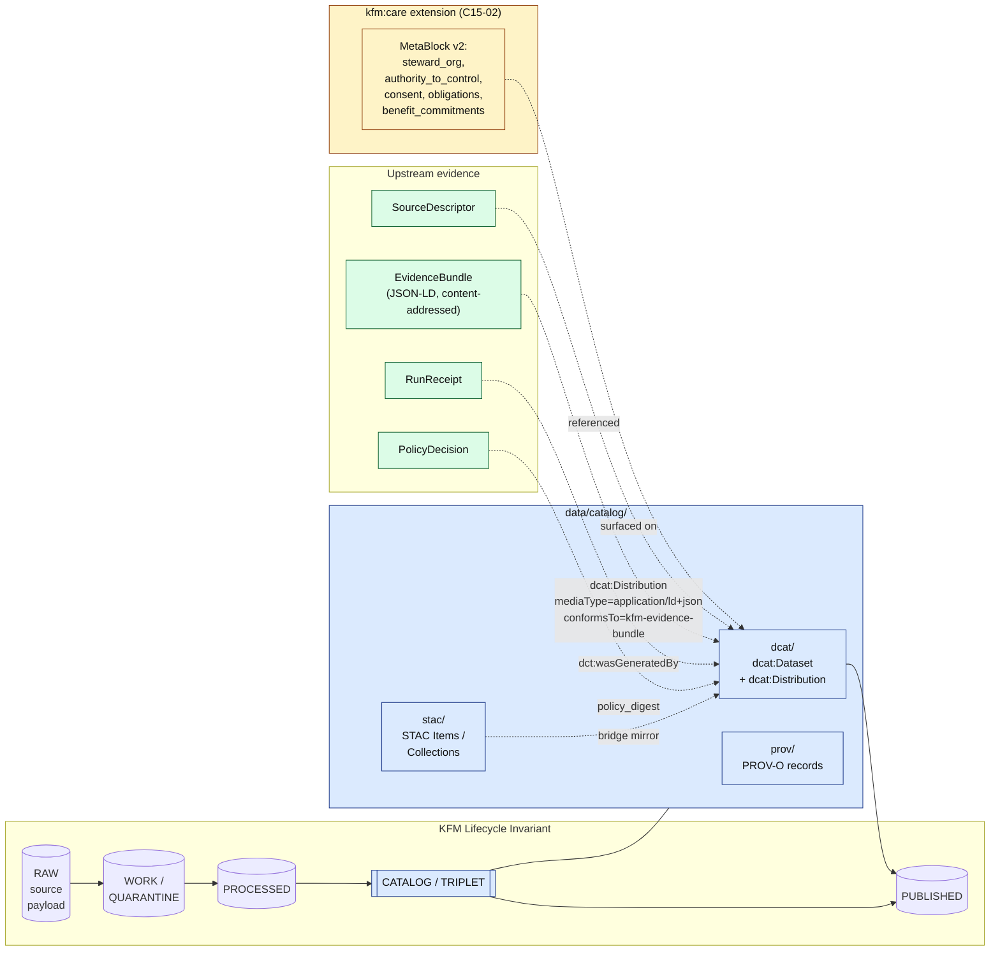
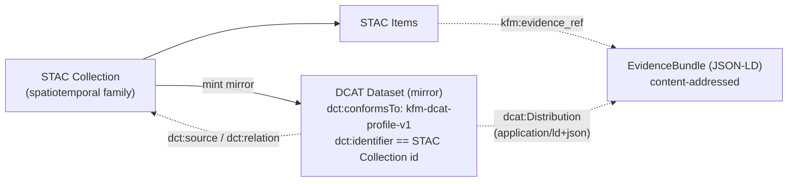

# DCAT — KFM Catalog Profile for Non-Spatial Datasets

> KFM's conformance profile for the **W3C Data Catalog Vocabulary (DCAT v3)** — how non-spatiotemporal datasets are catalogued, how the **`kfm:`** and **`kfm:care`** extensions surface KFM provenance and CARE fields on DCAT records, and how DCAT mirrors STAC for cross-catalog discovery.

[](https://www.w3.org/TR/vocab-dcat-3/)
[](#)
[](#)
[](#)
[](#)
[](#)

| Field | Value |
|---|---|
| **Status** | `draft` |
| **Owners** | Docs steward; Catalog steward `<verify>` |
| **Last updated** | 2026-05-13 |
| **Policy label** | `public` |
| **Authority** | KFM doctrine (C4-05, C15-02) + W3C DCAT v3 |

<!-- [KFM_META_BLOCK_V2]
doc_id: kfm://doc/dcat-profile-<uuid-placeholder>
title: DCAT — KFM Catalog Profile for Non-Spatial Datasets
type: standard
version: v1
status: draft
owners: <docs-steward>, <catalog-steward>
created: 2026-05-13
updated: 2026-05-13
policy_label: public
related:
  - docs/standards/STAC_KFM_PROFILE.md
  - docs/standards/PROV.md
  - docs/standards/SENSITIVITY_RUBRIC.md
  - docs/doctrine/lifecycle-law.md
  - docs/doctrine/directory-rules.md
  - schemas/contracts/v1/<…dcat profile…>          # PROPOSED home
  - data/catalog/dcat/                              # CONFIRMED in Directory Rules
tags: [kfm, standards, catalog, dcat, evidence-bundle, care]
notes:
  - Profile IRI base, JSON-LD context URL, and conformsTo URI are PROPOSED.
  - Schema files, validators, and CI gates are PROPOSED until verified in a mounted repo.
  - kfm:care namespace versioning policy is an open question per C15-02.
[/KFM_META_BLOCK_V2] -->

---

## Contents

1. [Purpose and scope](#1-purpose-and-scope)
2. [Authority and conformance](#2-authority-and-conformance)
3. [STAC vs DCAT — the dispatch rule](#3-stac-vs-dcat--the-dispatch-rule)
4. [Architecture: DCAT in the KFM lifecycle](#4-architecture-dcat-in-the-kfm-lifecycle)
5. [DCAT Dataset and Distribution: KFM-required shape](#5-dcat-dataset-and-distribution-kfm-required-shape)
6. [The `kfm:` namespace fields](#6-the-kfm-namespace-fields)
7. [The `kfm:care` extension](#7-the-kfmcare-extension)
8. [Conformance URIs and JSON-LD context (PROPOSED)](#8-conformance-uris-and-json-ld-context-proposed)
9. [STAC ↔ DCAT bridge](#9-stac--dcat-bridge)
10. [Promotion gates, validators, and OPA](#10-promotion-gates-validators-and-opa)
11. [Worked example (collapsible)](#11-worked-example)
12. [Open questions and NEEDS VERIFICATION items](#12-open-questions-and-needs-verification-items)
13. [FAQ](#13-faq)
14. [Related docs](#14-related-docs)

---

## 1. Purpose and scope

**CONFIRMED doctrine.** The KFM catalog layer is what makes a promoted artifact discoverable, citable, and policy-aware. Every promoted dataset carries a STAC record (when spatiotemporal), a **DCAT entry for dataset-level metadata**, and — for biodiversity occurrences — a Darwin Core hybrid (see [STAC × DwC](./STAC_DWC_PROFILE.md) `<verify>`). DCAT is also where the evidence-bundle JSON-LD is *attached as a distribution* on non-spatial records.

**This document covers, for DCAT:**

- Which kinds of KFM datasets get a DCAT record (and which do not).
- The DCAT version KFM targets and how KFM extends — never forks — that vocabulary.
- The required `dcat:Dataset` and `dcat:Distribution` shape, including the **`kfm:`** and **`kfm:care`** namespaces.
- The dispatch rule between STAC and DCAT and the rule for *bridging* between them.
- The validators and gates a DCAT record must pass before it can be promoted from `CATALOG` to `PUBLISHED`.

**Out of scope** (and where to look instead):

| Concern | Home |
|---|---|
| Spatiotemporal asset records | [`STAC_KFM_PROFILE.md`](./STAC_KFM_PROFILE.md) `<verify>` |
| Object meaning / semantics | `contracts/` |
| Machine-checkable shape | `schemas/contracts/v1/...` (per ADR-0001) |
| Admit / deny / restrict / abstain | `policy/` |
| Sensitivity classification | [`SENSITIVITY_RUBRIC.md`](./SENSITIVITY_RUBRIC.md) `<verify>` |
| Evidence-bundle canonicalization | [`PROV.md`](./PROV.md) `<verify>`, ADR on JCS vs URDNA2015 |
| Source identity and rights | `data/registry/sources/`, `policy/sensitivity/` |

> [!IMPORTANT]
> DCAT is a **catalog vocabulary**, not a source of truth. A DCAT record is a *carrier* that references upstream evidence — `SourceDescriptor`, `EvidenceBundle`, `RunReceipt`, `PolicyDecision`, `ReleaseManifest`. The DCAT record is not allowed to substitute for any of them. This is the same trust-membrane rule that applies to STAC, tiles, the graph, and AI outputs.

<sub>[↑ Back to top](#contents)</sub>

---

## 2. Authority and conformance

| Layer | What KFM commits to | Status |
|---|---|---|
| External standard | **W3C DCAT — Data Catalog Vocabulary, Version 3** | CONFIRMED upstream target (see source ledger entry `EXT-DCAT`). |
| Serialization | JSON-LD with a documented KFM context | CONFIRMED doctrinally; context file location PROPOSED. |
| KFM namespace prefix | `kfm:` (compact, stable, globally unique enough; the chosen namespace for both STAC and DCAT extensions) | CONFIRMED choice. |
| KFM IRI base | The actual IRI base for the `kfm:` namespace | UNKNOWN — listed as a low-priority open question in the corpus. |
| Profile IRI (this profile) | `kfm-dcat-profile-v1` (working name) | PROPOSED. |
| Schema home | `schemas/contracts/v1/dcat/kfm-dcat-profile-v1/...` per ADR-0001 schema-home rule | PROPOSED path; ADR-0001 confirmed. |
| Catalog data home | `data/catalog/dcat/` | CONFIRMED in Directory Rules §9.1 (canonical `data/` lifecycle root). |

> [!NOTE]
> KFM **does not fork DCAT**. The pattern mirrors the STAC profile pattern: stay conformant to the external standard, extend via namespaced properties, enforce governance through profile schema plus CI gates. This keeps interoperability with downstream tools that speak vanilla DCAT — they can ignore the `kfm:` and `kfm:care` properties without breaking.

**RFC-2119 conformance language.** This profile uses **MUST**, **SHOULD**, and **MAY** with their usual meanings. Words like "PROPOSED" and "NEEDS VERIFICATION" describe maturity of *implementation*, not maturity of *normative intent* — a PROPOSED schema path may still describe a MUST-have field.

<sub>[↑ Back to top](#contents)</sub>

---

## 3. STAC vs DCAT — the dispatch rule

DCAT and STAC overlap. The corpus resolves the overlap by **responsibility**, not by topic.

| Asset kind | Primary catalog | Reason |
|---|---|---|
| Spatiotemporal raster / vector / EO scene | **STAC Item** | STAC is the de facto JSON catalog for geospatial; pgstac, stac-fastapi, pystac-client, STAC Browser all expect STAC. |
| Spatiotemporal asset family | **STAC Collection** | Same reasoning, at family granularity. |
| Biodiversity occurrence record | **STAC Item with STAC × DwC hybrid** | DwC terms live in `properties.taxon` inside the STAC envelope. |
| **Entity bundle** (person, event, place graph fragments) | **DCAT Dataset** | Not spatiotemporal in the STAC sense; needs Distribution semantics for the evidence bundle. |
| **Rights record / consent grant / DUO statement** | **DCAT Dataset** | Non-spatial; DCAT's `conformsTo` carries the rights profile. |
| **Policy bundle** (OPA bundle, profile catalog, redaction profile) | **DCAT Dataset** | Non-spatial governance artifact. |
| **Schema artifact** (versioned JSON Schema, JSON-LD context) | **DCAT Dataset** | Non-spatial, versioned, distribution-shaped. |
| **Evidence bundle JSON-LD** (the bundle itself) | **`dcat:Distribution`** attached to either a DCAT Dataset or — for STAC items — referenced from STAC `links` with the appropriate `rel` | This is the canonical exposure of the bundle to catalog consumers (C4-04, C4-05). |

> [!TIP]
> **Mnemonic.** STAC owns the *where-and-when*. DCAT owns the *what-and-conformance*. The evidence bundle owns the *how-do-we-know*. Bridge them with content-addressed references, not duplicate truth.

A small **bridge rule** also applies (PROPOSED, per C4-05 expansion direction):

> Every STAC Collection SHOULD have a DCAT mirror Dataset minted automatically, so cross-catalog discovery (data.gov, regional clearinghouses) can find KFM's spatiotemporal families without speaking STAC.

<sub>[↑ Back to top](#contents)</sub>

---

## 4. Architecture: DCAT in the KFM lifecycle

The DCAT record lives in the `CATALOG` lifecycle phase and references — but never replaces — receipts and bundles that were emitted earlier in the lifecycle.



> [!NOTE]
> **Promotion is a governed state transition, not a file move.** Writing a DCAT record under `data/catalog/dcat/` does not promote anything to `PUBLISHED`. The release gate (CATALOG → PUBLISHED) requires a `ReleaseManifest`, rollback target, correction path, and any required `ReviewRecord` before the record becomes a public surface.

<sub>[↑ Back to top](#contents)</sub>

---

## 5. DCAT Dataset and Distribution: KFM-required shape

This section lists fields KFM **requires** in addition to whatever DCAT v3 itself requires.

### 5.1 `dcat:Dataset` (KFM-required fields)

| Field | Cardinality | Type | Notes |
|---|---|---|---|
| `@id` | 1 | IRI | Dataset IRI; SHOULD include a content-addressable component when feasible. |
| `dct:identifier` | 1 | string | Stable, citable identifier; commonly mirrors `kfm:id`. |
| `dct:title`, `dct:description` | 1, 1 | string | Human description sufficient for cross-catalog consumers. |
| `dct:issued`, `dct:modified` | 1, 1 | ISO 8601 | Issue and modification timestamps. |
| `dct:publisher` | 1 | IRI / agent | Publishing agent; **must not** be confused with `kfm:care/steward_org`. |
| `dcat:theme` | 0..n | concept | Theme tags from a controlled vocabulary. |
| `dct:license` | 1 | IRI | License IRI; KFM forbids `unknown` in `PUBLISHED`. |
| `dct:conformsTo` | 1..n | IRI | MUST include the **`kfm-dcat-profile-v1`** IRI (PROPOSED). |
| `dcat:distribution` | 1..n | Distribution | MUST include at least one distribution; for governed assets, MUST include the evidence-bundle distribution (see §5.2). |
| `prov:wasGeneratedBy` | 0..1 | Activity | Link to the generating activity / RunReceipt. |
| `kfm:id` | 1 | string | Canonical KFM identifier (CONFIRMED in C4-05). |
| `kfm:spec_hash` | 1 | string | SHA-256 of the canonicalized record content (CONFIRMED in C4-05). |
| `kfm:source_role` | 1 | enum | `observation` / `derived` / `simulation` / `regulatory` / `interpretation` / `ai_generated` / `reference`. |
| `kfm:rights_status` | 1 | enum | `public` / `open` / `controlled` / `restricted` / `unknown`. |
| `kfm:sensitivity` | 1 | enum | `public` / `generalize` / `restricted` / `review_required` (aligned with the sensitivity rubric). |
| `kfm:review_state` | 1 | enum | `draft` / `in_review` / `approved` / `rejected`. |
| `kfm:release_state` | 1 | enum | `unreleased` / `candidate` / `released` / `withdrawn` / `corrected` / `superseded`. |
| `kfm:evidence_ref` | 1 | IRI | Reference to the EvidenceBundle (e.g., `kfm://entity-bundle/<sha256>`). |
| `kfm:run_receipt` | 0..1 | IRI | Reference to the RunReceipt that produced the bundle. |
| `kfm:care` (object) | 0..1 | block | Required **iff** CARE applies. See §7. |

### 5.2 `dcat:Distribution` for the **evidence bundle**

**CONFIRMED (C4-05).** The evidence bundle is exposed as a `dcat:Distribution`:

| Field | Value |
|---|---|
| `dcat:mediaType` | `application/ld+json` |
| `dct:format` | `application/ld+json` (or equivalent IRI) |
| `dct:conformsTo` | the **KFM evidence-bundle profile IRI** (PROPOSED — see §8) |
| `dcat:accessURL` / `dcat:downloadURL` | the content-addressed bundle URL (e.g., `kfm://entity-bundle/<sha256>`, `oci://...`, `ipfs://...`) |
| `spdx:checksum` *(or `kfm:spec_hash` on the parent)* | digest of the bundle bytes |

Additional distributions (e.g., a CSV export, a Parquet projection) MAY be attached with their own `mediaType`, `accessURL`, and digest, but the **evidence-bundle distribution** is the one a downstream verifier follows to inspect the claim.

<sub>[↑ Back to top](#contents)</sub>

---

## 6. The `kfm:` namespace fields

The `kfm:` extension is the same extension namespace used by KFM's STAC profile. Re-using one namespace means a downstream consumer that already understands one KFM catalog surface understands all of them.

| Field | Where it sits | Role |
|---|---|---|
| `kfm:id` | Dataset | Canonical KFM identifier; deterministic where practical. |
| `kfm:spec_hash` | Dataset | SHA-256 of the JCS-canonicalized record (default; URDNA2015 reserved per ADR on canonicalization). |
| `kfm:source_role` | Dataset | Source-role enum (see §5.1). |
| `kfm:rights_status` | Dataset | Rights enum (see §5.1). |
| `kfm:sensitivity` | Dataset | Sensitivity rubric label. |
| `kfm:review_state` | Dataset | Review enum (see §5.1). |
| `kfm:release_state` | Dataset | Release enum (see §5.1). |
| `kfm:evidence_ref` | Dataset | Content-addressed bundle URI. |
| `kfm:run_receipt` | Dataset | RunReceipt URI. |
| `kfm:policy_digest` | Dataset | Digest of the policy bundle in effect at promotion. |
| `kfm:correction_ref` | Dataset (when applicable) | CorrectionNotice URI. |
| `kfm:rollback_target` | Dataset (when applicable) | RollbackCard / prior `ReleaseManifest` URI. |

> [!IMPORTANT]
> `kfm:rights_status: unknown` is permitted *only* in pre-release lifecycle phases (RAW / WORK / QUARANTINE / PROCESSED). A DCAT record bearing `unknown` rights MUST fail closed at the CATALOG → PUBLISHED gate. (Aligned with C5-01 / C5-02 default-deny doctrine.)

<sub>[↑ Back to top](#contents)</sub>

---

## 7. The `kfm:care` extension

**CONFIRMED (C15-02).** The `kfm:care` namespace extension surfaces **MetaBlock v2 CARE fields** so a consumer that reads only the DCAT distribution can see the fields — without needing to fetch the full MetaBlock or evidence bundle.

| Sub-field | Type | Description |
|---|---|---|
| `kfm:care/steward_org` | string / IRI | Institutional steward of the asset. **Not** the same as `dct:publisher`. |
| `kfm:care/authority_to_control` | string / IRI | Community or body whose authority governs the asset. **Non-empty triggers default-deny on publication.** |
| `kfm:care/consent` | object | Consent grant under which the asset is held (issuer, scope, valid period, revocation pointer). |
| `kfm:care/obligations` | array of strings / IRIs | Obligations attached to use of the asset. |
| `kfm:care/benefit_commitments` | array of strings | What benefit flows back to the relevant community from publication and reuse. |

> [!WARNING]
> **Default-deny on `authority_to_control`** (C15-03). If `kfm:care/authority_to_control` is non-empty, the OPA promotion gate denies publication unless the named authority's consent grant is present, valid, and unrevoked. This is enforced at **both** CI (`policy-bundle.json` via Conftest) and runtime (Gatekeeper admission), per the C5-03 policy-parity rule.

**Consumer behaviour.** Consumers that do not understand the `kfm:care` namespace ignore the fields safely (standard JSON-LD vocabulary-extension behaviour). Consumers that do understand it can apply the obligations, surface the steward, or refuse to render an asset whose consent is missing.

**Versioning.** The `kfm:care` namespace versioning policy is an **open question** (C15-02). A breaking change in a CARE field shape **MUST** rev a versioned IRI and **MUST** be aligned with the C11 schema-evolution policy.

<sub>[↑ Back to top](#contents)</sub>

---

## 8. Conformance URIs and JSON-LD context (PROPOSED)

The actual IRI base for the `kfm:` namespace is a **low-priority open question** in the corpus. The values below are **PROPOSED** working placeholders and **MUST** be ratified by an ADR before publication.

| Concern | PROPOSED IRI |
|---|---|
| `kfm:` namespace base | `https://kfm.example/ns/v1#` `<verify>` |
| `kfm:care` extension IRI | `https://kfm.example/ns/care/v1#` `<verify>` |
| `kfm-dcat-profile-v1` profile IRI | `https://kfm.example/profiles/dcat/v1` `<verify>` |
| Evidence-bundle profile IRI (used as `dct:conformsTo` on the evidence distribution) | `https://kfm.example/profiles/evidence-bundle/v1` `<verify>` |
| JSON-LD context | `schemas/contracts/v1/dcat/kfm-dcat-profile-v1/context.jsonld` (PROPOSED path; ADR-0001 schema-home rule applies). |

> [!CAUTION]
> Do not bake `kfm.example` into shipping records. The IRI base is a deliberate placeholder until the namespace ADR lands. PRs that include records pointing at the placeholder MUST be gated behind the CI conformance check.

<sub>[↑ Back to top](#contents)</sub>

---

## 9. STAC ↔ DCAT bridge

The bridge is the smallest moving part that lets DCAT-only consumers (data.gov, regional clearinghouses) discover KFM's spatiotemporal families without speaking STAC.



**Bridge rules** (PROPOSED):

- The mirror's `dct:identifier` equals the STAC Collection `id`.
- The mirror's `dct:conformsTo` includes both `kfm-dcat-profile-v1` and the STAC Collection IRI (or a `dct:source` link back to it).
- The mirror **MUST NOT** duplicate evidence — it references the same `EvidenceBundle` the STAC items reference.
- Per-item DCAT mirrors are **not** required; the Collection-level mirror is enough for cross-catalog discovery.

<sub>[↑ Back to top](#contents)</sub>

---

## 10. Promotion gates, validators, and OPA

DCAT records go through the same gate matrix every catalog object does (C5-01, Gate Matrix A–G). The DCAT-specific obligations are:

| Gate | DCAT-specific check | Failure-closed outcome |
|---|---|---|
| **A. Identity** | `kfm:id` present, deterministic where practical; `kfm:spec_hash` matches the recomputed JCS+SHA-256 of the canonicalized record. | Reject; record stays in `PROCESSED`. |
| **B. Anchors / Identifiers** | `dct:identifier` resolvable; cross-catalog mirror `dct:identifier` aligns with STAC Collection id where applicable. | Reject. |
| **C. Integrity** | Evidence-bundle `dcat:Distribution` digest matches the bundle bytes at the content address. | Reject. |
| **D. Sensitivity** | `kfm:sensitivity` populated and consistent with the redaction profile applied to the underlying data. | Reject; downgrade or quarantine. |
| **E. Lineage** | `prov:wasGeneratedBy` / `kfm:run_receipt` resolves to a fetchable RunReceipt. | Reject (no OpenLineage trail). |
| **F. Signing** | Release-time signature (DSSE/cosign) over the canonicalized record, where required by the family's Definition of Done. | Reject. |
| **G. Release** | `ReleaseManifest` lists this record; rollback target is set; review state satisfies the family-level threshold. | Stays in CATALOG. |
| **CARE default-deny** | `kfm:care/authority_to_control` non-empty → consent grant present, valid, unrevoked. | **Deny**, regardless of other gates (C15-03). |

**Three-layer validation (PROPOSED stack)** — same shape as the STAC profile's validation strategy:

1. **DCAT-core validation.** Validate against W3C DCAT v3 with a public DCAT validator. PROPOSED tool: SHACL shapes for DCAT or a JSON Schema mirror of the profile.
2. **KFM profile validation.** Validate against `kfm-dcat-profile-v1` schema using `ajv` or an equivalent JSON Schema 2020-12 validator (per the EXT-JSON external standard).
3. **Policy validation.** Conftest in CI; OPA Gatekeeper at runtime; same policy bundle on both sides (C5-03 policy parity).

> [!NOTE]
> No file under `data/catalog/dcat/` is a public surface by virtue of being on disk. The trust membrane sits at the governed API and the `ReleaseManifest`. Render surfaces (UI, AI Focus Mode) MUST consume DCAT records via the governed API, not by reading the catalog directory directly.

<sub>[↑ Back to top](#contents)</sub>

---

## 11. Worked example

> [!NOTE]
> The JSON-LD below is **illustrative**, not a fixture from a mounted repo. IRI bases and profile URLs are the PROPOSED placeholders from §8. Field values are synthetic.

<details>
<summary><strong>Minimal KFM-flavoured DCAT JSON-LD — an entity bundle (Dataset + evidence Distribution + kfm:care)</strong></summary>

```json
{
  "@context": [
    "https://www.w3.org/ns/dcat3.jsonld",
    "https://kfm.example/ns/v1/context.jsonld"
  ],
  "@id": "https://kfm.example/dataset/people-events/smoky-hill-1867",
  "@type": "dcat:Dataset",
  "dct:identifier": "kfm:people-events:smoky-hill-1867",
  "dct:title": "Smoky Hill 1867 — People and Events Bundle",
  "dct:description": "Prosopography graph fragment of persons and events associated with the Smoky Hill corridor, 1867. Non-spatial; spatial anchors live on linked STAC items.",
  "dct:issued": "2026-05-13",
  "dct:modified": "2026-05-13",
  "dct:publisher": { "@id": "https://kfm.example/agent/kfm" },
  "dct:license": "https://creativecommons.org/licenses/by/4.0/",
  "dct:conformsTo": [
    "https://kfm.example/profiles/dcat/v1"
  ],

  "kfm:id": "kfm:people-events:smoky-hill-1867",
  "kfm:spec_hash": "sha256:<jcs-canonicalized-digest>",
  "kfm:source_role": "derived",
  "kfm:rights_status": "open",
  "kfm:sensitivity": "review_required",
  "kfm:review_state": "approved",
  "kfm:release_state": "released",
  "kfm:evidence_ref": "kfm://entity-bundle/7f9a…",
  "kfm:run_receipt": "kfm://run/aa31…",
  "kfm:policy_digest": "sha256:<policy-bundle-digest>",

  "kfm:care": {
    "steward_org": "Kansas Historical Society",
    "authority_to_control": "https://kfm.example/authority/khs",
    "consent": {
      "issuer": "https://kfm.example/authority/khs",
      "scope": "non-commercial-research",
      "valid_from": "2026-01-01",
      "valid_to": "2031-01-01",
      "revocation": "https://kfm.example/consent/khs/revocations"
    },
    "obligations": [
      "cite-source-on-display",
      "no-redistribution-of-sensitive-place-anchors"
    ],
    "benefit_commitments": [
      "deliver annual usage report to KHS",
      "fund one open-source intern via KHS partnership"
    ]
  },

  "dcat:distribution": [
    {
      "@type": "dcat:Distribution",
      "dct:title": "Evidence bundle (JSON-LD, content-addressed)",
      "dcat:mediaType": "application/ld+json",
      "dct:format": "application/ld+json",
      "dct:conformsTo": "https://kfm.example/profiles/evidence-bundle/v1",
      "dcat:accessURL": "kfm://entity-bundle/7f9a…",
      "dcat:downloadURL": "https://kfm.example/cas/7f9a…/bundle.jsonld",
      "spdx:checksum": {
        "@type": "spdx:Checksum",
        "spdx:algorithm": "SHA256",
        "spdx:checksumValue": "<sha256-of-bundle-bytes>"
      }
    },
    {
      "@type": "dcat:Distribution",
      "dct:title": "Projected CSV view (derived)",
      "dcat:mediaType": "text/csv",
      "dcat:downloadURL": "https://kfm.example/data/published/api_payloads/smoky-hill-1867.csv",
      "spdx:checksum": {
        "@type": "spdx:Checksum",
        "spdx:algorithm": "SHA256",
        "spdx:checksumValue": "<sha256-of-csv-bytes>"
      }
    }
  ]
}
```

</details>

<details>
<summary><strong>STAC ↔ DCAT bridge example (Collection mirror)</strong></summary>

```json
{
  "@context": [
    "https://www.w3.org/ns/dcat3.jsonld",
    "https://kfm.example/ns/v1/context.jsonld"
  ],
  "@id": "https://kfm.example/dataset/landsat-sr-kansas",
  "@type": "dcat:Dataset",
  "dct:identifier": "kfm-landsat-sr-kansas",
  "dct:title": "Landsat SR over Kansas — DCAT mirror of STAC Collection",
  "dct:description": "DCAT mirror minted from the STAC Collection of the same id, for cross-catalog discovery by DCAT-only consumers. Authoritative metadata lives on the STAC side.",
  "dct:conformsTo": [
    "https://kfm.example/profiles/dcat/v1",
    "https://stacspec.org/v1.0.0/collection-spec/json-schema/collection.json"
  ],
  "dct:source": { "@id": "https://kfm.example/stac/collections/kfm-landsat-sr-kansas" },
  "kfm:id": "kfm-landsat-sr-kansas",
  "kfm:release_state": "released",
  "kfm:rights_status": "open",
  "dcat:distribution": [
    {
      "@type": "dcat:Distribution",
      "dct:title": "STAC Collection JSON",
      "dcat:mediaType": "application/json",
      "dcat:accessURL": "https://kfm.example/stac/collections/kfm-landsat-sr-kansas"
    }
  ]
}
```

</details>

<sub>[↑ Back to top](#contents)</sub>

---

## 12. Open questions and NEEDS VERIFICATION items

The corpus is explicit that several decisions are not yet settled. Each row below is **either** an open question the corpus names directly **or** a verification item that requires repo evidence not visible in this session.

| # | Item | Status | Notes |
|---|---|---|---|
| 1 | The `kfm:` namespace IRI base and versioning strategy | UNKNOWN | Low-priority open question in C-Corpus §11.3; ADR not yet authored. |
| 2 | The `dct:conformsTo` URI for the KFM evidence-bundle profile | PROPOSED | Tied to (1); current placeholder must be ratified. |
| 3 | DCAT vs STAC for spatiotemporal datasets | PROPOSED | C4-05 acknowledges overlap; the bridge rule in §9 is the proposed resolution but is not yet implemented. |
| 4 | Whether the `kfm:care` extension should be proposed for upstream adoption (DCAT-AP / STAC-extensions registry) or kept KFM-local | UNKNOWN | C15-02 open question. |
| 5 | `kfm:care` versioning policy and how breaking changes are signaled | UNKNOWN | C15-02; align with C11 schema-evolution policy when authored. |
| 6 | Which national / state catalogs KFM is registering with (and which profile they expect) | UNKNOWN | C4-05 open question. |
| 7 | DCAT profile schema files in `schemas/contracts/v1/dcat/...` | NEEDS VERIFICATION | Path is PROPOSED per ADR-0001 schema-home rule; not verified against a mounted repo. |
| 8 | `data/catalog/dcat/` population, validators, and CI gates | NEEDS VERIFICATION | Directory Rules §9.1 lists `data/catalog/dcat/` as canonical; *contents* and *enforcement* not verified in this session. |
| 9 | Choice of DCAT validator (SHACL vs JSON-Schema mirror) | PROPOSED | Validator stack in §10 is recommended; not adopted. |
| 10 | JCS vs URDNA2015 canonicalization for hashing JSON-LD DCAT records | PROPOSED | C8-05 sets JCS as default; ADR pending. |

<sub>[↑ Back to top](#contents)</sub>

---

## 13. FAQ

<details>
<summary><strong>Why DCAT at all, when KFM already uses STAC?</strong></summary>

Because STAC is a spatiotemporal asset catalog and KFM has many assets that are not spatiotemporal: entity bundles, rights records, policy bundles, schema artifacts, evidence-bundle JSON-LD. Forcing those into STAC would distort STAC's semantics and break STAC tooling. DCAT is the open-data catalog vocabulary built for that case (C4-05).
</details>

<details>
<summary><strong>Why a profile (<code>kfm-dcat-profile-v1</code>) and not just DCAT?</strong></summary>

Two reasons. First, KFM requires fields DCAT v3 does not (provenance, sensitivity, review/release state, evidence ref). Second, KFM's promotion gates need a stable conformance URI to check that a record claims to satisfy KFM's governance rules. A profile gives both without forking the upstream vocabulary.
</details>

<details>
<summary><strong>What is the difference between <code>dct:publisher</code> and <code>kfm:care/steward_org</code>?</strong></summary>

`dct:publisher` is the agent that publishes the catalog record. `kfm:care/steward_org` is the institutional steward of the underlying *asset*. They are often different — KFM may publish a record whose underlying data is stewarded by KHS, KU NHM, KDWP, or a tribal authority. The CARE field exists precisely to surface that distinction.
</details>

<details>
<summary><strong>Can a DCAT record be public without an evidence-bundle distribution?</strong></summary>

For an entity bundle, rights record, policy bundle, or schema artifact: no — the evidence-bundle distribution is the canonical exposure of the JSON-LD content to verifiers (C4-04, C4-05). For a DCAT *mirror* of a STAC Collection (§9), the evidence sits on the STAC side and is referenced by `dct:source`; a separate evidence distribution on the mirror is not required.
</details>

<details>
<summary><strong>What happens if <code>kfm:care/authority_to_control</code> is set but no consent grant exists?</strong></summary>

The OPA default-deny rule (C15-03) refuses publication. The record stays in `CATALOG`, the gate reports a structured DENY outcome, and the remediation path is to record a valid consent grant or to withdraw the record. There is no implicit allow path.
</details>

<details>
<summary><strong>Where do DCAT records live on disk?</strong></summary>

Under `data/catalog/dcat/` per Directory Rules §9.1 (CONFIRMED). They are *not* a public surface — public clients consume them via the governed API after a `ReleaseManifest` has been emitted.
</details>

<sub>[↑ Back to top](#contents)</sub>

---

## 14. Related docs

| Path | What it covers | Status |
|---|---|---|
| [`docs/standards/STAC_KFM_PROFILE.md`](./STAC_KFM_PROFILE.md) | KFM STAC profile (Items, Collections, `kfm:provenance`) | PROPOSED filename per corpus expansion direction (C4-01); `<verify>` |
| [`docs/standards/STAC_DWC_PROFILE.md`](./STAC_DWC_PROFILE.md) | STAC × Darwin Core hybrid for biodiversity | PROPOSED filename per C4-03; `<verify>` |
| [`docs/standards/PROV.md`](./PROV.md) | PROV-O usage, PAV, JSON-LD canonicalization (JCS vs URDNA2015) | `<verify>` |
| [`docs/standards/SENSITIVITY_RUBRIC.md`](./SENSITIVITY_RUBRIC.md) | Sensitivity rubric 0–5 and redaction profiles | PROPOSED filename per C6-01; `<verify>` |
| [`docs/doctrine/lifecycle-law.md`](../doctrine/lifecycle-law.md) | RAW → WORK/QUARANTINE → PROCESSED → CATALOG/TRIPLET → PUBLISHED | CONFIRMED via Directory Rules §0 |
| [`docs/doctrine/directory-rules.md`](../doctrine/directory-rules.md) | Where files live; canonical vs compatibility roots | CONFIRMED |
| [`docs/adr/ADR-0001-schema-home.md`](../adr/ADR-0001-schema-home.md) | Schema-home rule (`schemas/contracts/v1/...`) | CONFIRMED reference in Directory Rules |
| [W3C DCAT v3 specification](https://www.w3.org/TR/vocab-dcat-3/) | External standard KFM conforms to | EXTERNAL (source ledger entry `EXT-DCAT`) |

---

> [!NOTE]
> **Conformance to this profile** does not by itself authorize publication. Publication remains a governed state transition that requires policy decisions, evidence closure, review state where applicable, a release manifest, a rollback target, and a correction path. This profile describes the *catalog* surface only.

---

<sup>**Last updated:** 2026-05-13 · **Version:** v1 (draft) · [↑ Back to top](#dcat--kfm-catalog-profile-for-non-spatial-datasets)</sup>
