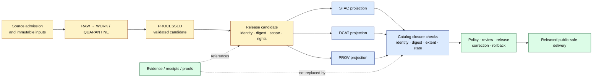
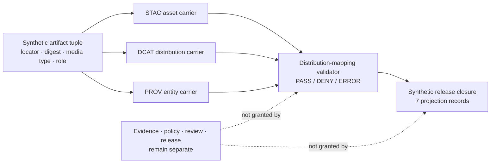

<!-- [KFM_META_BLOCK_V2]
doc_id: kfm://doc/standards/dcat
title: DCAT — Current KFM Catalog Vocabulary and Closure Boundary
type: standard; interoperability-guide
version: v2.0.0-draft
status: draft; repository-grounded; bounded-executable; profile-unadopted; public-serving-unverified
owners:
  - "@bartytime4life — verified CODEOWNERS review route; accountable DCAT/catalog stewardship and independent review NEED VERIFICATION"
created: 2026-05-13
updated: 2026-08-18
policy_label: repository-facing
owning_root: docs/
responsibility: Explain the W3C DCAT 3 baseline, KFM's current catalog and cross-profile implementation evidence, and the boundaries that keep catalog metadata subordinate to source, evidence, policy, review, release, correction, and rollback authority.
truth_posture: CONFIRMED current path, upstream Recommendation, selected repository bytes, and bounded synthetic validators / PROPOSED KFM RDF profile, namespace, context, shapes, public endpoint, and production composition / UNKNOWN deployed conformance and public serving unless separately proved
evidence_snapshot:
  repository: bartytime4life/Kansas-Frontier-Matrix
  base_ref: main
  base_commit: 7ac9f151aacc03b03fd486a64b348743b7325a51
  target_prior_blob: fe524498110cf91e573a5510480eb199c2b6627c
  upstream: W3C DCAT 3 Recommendation, 2024-08-22, checked 2026-08-18
related:
  - docs/standards/README.md
  - docs/standards/STAC_KFM_PROFILE.md
  - docs/standards/PROV.md
  - docs/standards/SENSITIVITY_RUBRIC.md
  - docs/doctrine/directory-rules.md
  - docs/adr/ADR-0029-adopt-directory-governance-standard-v2.md
  - docs/adr/ADR-0022-catalog-matrix--stac-+-dcat-+-prov-must-agree.md
  - data/catalog/dcat/README.md
  - contracts/data/catalog_distribution_mapping_profile.md
  - contracts/data/synthetic_release_catalog_closure_profile.md
  - schemas/contracts/v1/data/catalog_distribution_mapping_profile.schema.json
  - schemas/contracts/v1/data/synthetic_release_catalog_closure_profile.schema.json
  - tools/validators/catalog_closure/validate_catalog_distribution_mapping_profile.py
  - tools/validators/catalog_closure/validate_synthetic_release_catalog_closure.py
  - tools/validators/validator_registry.json
  - tests/validators/catalog_closure/test_catalog_distribution_mapping_profile.py
  - tests/validators/catalog_closure/test_synthetic_release_catalog_closure.py
  - .github/workflows/catalog-distribution-mapping-profile.yml
  - .github/workflows/synthetic-release-catalog-closure.yml
tags: [kfm, standards, dcat, catalog, dataset, distribution, data-service, stac, prov, evidence, release, correction, rollback]
notes:
  - "This same-path rewrite replaces the May 2026 no-repository posture with commit-pinned current evidence."
  - "DCAT 3 is an RDF vocabulary for catalogs, datasets, dataset series, distributions, and data services; it is not restricted to non-spatial data and does not require JSON-LD as its only serialization."
  - "Current KFM executable evidence is synthetic and bounded: carrier-tuple mapping and release-candidate STAC/DCAT/PROV agreement. It does not emit standards-complete public RDF, decide policy, approve review, authorize release, or publish."
  - "ADR-0022 remains proposed. The KFM namespace IRI, DCAT profile IRI, JSON-LD context, RDF shapes, extension vocabulary, and public catalog route remain unadopted or unverified."
[/KFM_META_BLOCK_V2] -->

<a id="top"></a>
<a id="dcat--kfm-catalog-profile-for-non-spatial-datasets"></a>

# DCAT — Current KFM Catalog Vocabulary and Closure Boundary

> **Operating rule.** DCAT can make KFM datasets, distributions, services, and catalog records discoverable and interoperable. It cannot make the described material true, admissible, reviewed, released, corrected, or public.

[](https://www.w3.org/TR/vocab-dcat-3/)
[](#0-status-authority-and-evidence-boundary)
[](#04-current-repository-evidence)
[](#10-promotion-gates-validators-and-opa)
[](#8-conformance-uris-and-json-ld-context-proposed)
[](#03-non-effects)

| Field | Current bounded result |
|---|---|
| **Evidence snapshot** | `main@7ac9f151aacc03b03fd486a64b348743b7325a51` |
| **Upstream baseline** | **CONFIRMED:** W3C DCAT 3 Recommendation, 22 August 2024; latest published Recommendation checked 2026-08-18 |
| **Document role** | Human-readable standards and interoperability guidance under `docs/`; not semantic, machine-shape, policy, release, or runtime authority |
| **Placement authority** | **CONFIRMED / ACCEPTED:** ADR-0029 adopts Directory Rules v2; this existing `docs/standards/` path remains placement-safe |
| **Review route** | `@bartytime4life` through CODEOWNERS; stewardship assignment and independent review remain **NEEDS VERIFICATION** |
| **KFM DCAT profile** | **PROPOSED / not accepted:** no ratified profile IRI, KFM namespace IRI, JSON-LD context, RDF shapes, or public conformance endpoint was established |
| **Executable repository evidence** | **CONFIRMED / bounded:** synthetic distribution-carrier mapping and synthetic release-candidate STAC/DCAT/PROV closure validators, fixtures, tests, and workflows |
| **Validator aggregation** | **CONFIRMED / bounded:** the distribution-mapping validator participates in `release-dry-run` and `full`; the synthetic release-closure validator uses its dedicated workflow and is not the general DCAT profile validator |
| **Public RDF/DCAT serving** | **UNKNOWN / not established by the inspected surfaces** |
| **Release/publication effect of this page** | None |

> [!IMPORTANT]
> **Current code does not implement a complete public DCAT catalog.** It proves selected, deterministic relationships over synthetic candidates: a DCAT distribution can repeat the same artifact locator, digest, media type, and role as STAC and PROV carriers; a synthetic release packet can keep seven STAC/DCAT/PROV projection records aligned. Those tests are useful, but they are not a standards-complete RDF profile, source admission, evidence resolution, policy execution, review approval, release assembly, endpoint, or publication.

> [!CAUTION]
> **A catalog record is a carrier, not closure.** DCAT metadata may reference a `SourceDescriptor`, `EvidenceRef`, `EvidenceBundle`, receipt, proof, policy decision, review record, release manifest, correction notice, or rollback card. It never substitutes for those object families.

> [!WARNING]
> **Do not turn proposal-era placeholders into public identifiers.** The former placeholder namespace and profile URLs were illustrations, not accepted KFM IRIs. Shipping records must not use them.

**Quick navigation:** [Status](#0-status-authority-and-evidence-boundary) · [Purpose](#1-purpose-and-scope) · [Authority](#2-authority-and-conformance) · [DCAT/STAC/PROV](#3-stac-vs-dcat--the-dispatch-rule) · [Lifecycle](#4-architecture-dcat-in-the-kfm-lifecycle) · [Shape](#5-dcat-dataset-and-distribution-kfm-required-shape) · [KFM terms](#6-the-kfm-namespace-fields) · [CARE](#7-the-kfmcare-extension) · [IRIs](#8-conformance-uris-and-json-ld-context-proposed) · [Bridge](#9-stac--dcat-bridge) · [Validation](#10-promotion-gates-validators-and-opa) · [Example](#11-worked-example) · [Backlog](#12-open-questions-and-needs-verification-items) · [FAQ](#13-faq) · [Related](#14-related-docs)

---

## 0. Status, authority, and evidence boundary

### 0.1 Authority by question

| Question | Controlling evidence |
|---|---|
| What DCAT means | The current W3C DCAT Recommendation and the vocabularies it normatively references |
| Where this page belongs | Accepted Directory Rules v2, accepted ADR-0029, and the `docs/standards/` lane contract |
| What KFM objects mean | Their semantic contracts under `contracts/` |
| What machine shapes are valid | Current schemas and their validators under `schemas/`, `tools/`, `fixtures/`, and `tests/` |
| What is allowed, denied, redacted, held, or restricted | `policy/`, source rights, sensitivity, consent, and governed review |
| Whether catalog projections agree | Exact-revision candidate inputs, deterministic generators, validators, fixtures, and tests |
| Whether something is released or public | Release, policy, review, evidence/proof, correction, rollback, and delivery evidence—not this page or a passing fixture |

This page may explain an upstream requirement or a repository-observed contract. It does not create either one.

### 0.2 Truth labels

- **CONFIRMED** — verified from the named upstream Recommendation or current repository bytes at the evidence snapshot.
- **PROPOSED** — a KFM profile rule, RDF mapping, IRI, context, shape, route, or production composition not accepted and proved as current behavior.
- **UNKNOWN** — evidence is insufficient to state a current result.
- **NEEDS VERIFICATION** — a concrete check can resolve the question but has not yet closed it.

Document lifecycle words such as `draft`, `proposed`, `accepted`, `released`, and `withdrawn` are not substitutes for these truth labels.

### 0.3 Non-effects

This page does not:

- accept ADR-0022 or any KFM DCAT profile;
- define a machine schema, RDF shape, JSON-LD context, namespace, policy bundle, or endpoint;
- create a DCAT Catalog, Dataset, DatasetSeries, Distribution, DataService, or CatalogRecord instance;
- resolve an EvidenceRef, authenticate evidence, decide rights or sensitivity, approve review, or authorize release;
- write `data/catalog/dcat/`, `data/published/`, `release/`, receipts, or proofs;
- activate a source, perform a network fetch, deploy a service, or publish a catalog; or
- make a synthetic PASS result equivalent to W3C conformance or KFM publication.

### 0.4 Current repository evidence

| Surface | CONFIRMED state | Safe interpretation |
|---|---|---|
| [`docs/standards/README.md`](./README.md) | Standards lane is mixed-maturity, human-readable guidance only | This page may describe and navigate; it does not own conformance or adoption |
| [`data/catalog/dcat/README.md`](../../data/catalog/dcat/README.md) | Existing catalog-stage lane guide; its evidence snapshot predates later catalog-closure slices | Placement and trust boundary remain useful; implementation inventory needs reconciliation |
| [`catalog_distribution_mapping_profile.md`](../../contracts/data/catalog_distribution_mapping_profile.md) | Proposed fixture-only semantic profile | Defines a bounded carrier tuple; does not emit catalog records or authorize use |
| [`catalog_distribution_mapping_profile.schema.json`](../../schemas/contracts/v1/data/catalog_distribution_mapping_profile.schema.json) | Closed Draft 2020-12 synthetic-candidate schema | Proves one machine profile exists; it is not a DCAT RDF shape |
| Distribution-mapping fixtures and tests | One PASS plus sixteen expected DENY cases; deterministic/no-network test source present | Proves declared fixture behavior when executed; not standards-complete catalog behavior |
| [`synthetic_release_catalog_closure_profile.md`](../../contracts/data/synthetic_release_catalog_closure_profile.md) | Proposed no-network integration profile | Derives bounded STAC/DCAT/PROV projection records from one synthetic release candidate |
| Synthetic release-closure schema, fixtures, validator, tests, workflow | Closed packet schema; 17-case source matrix with two PASS and fifteen DENY expectations; read-only workflow | Proves a dependency-closed synthetic seam exists; no public catalog or release authority |
| [`validator_registry.json`](../../tools/validators/validator_registry.json) and convergence test | Four catalog validators are selected by `release-dry-run` and `full`; distribution mapping is among them | Aggregate fixture validation exists for bounded profiles; no general RDF/DCAT conformance validator is established |
| [`ADR-0022`](../adr/ADR-0022-catalog-matrix--stac-+-dcat-+-prov-must-agree.md) | `proposed` | Agreement rule is not accepted merely because bounded profile implementations exist |
| [`STAC_KFM_PROFILE.md`](./STAC_KFM_PROFILE.md) and [`PROV.md`](./PROV.md) | Existing May 2026 draft guidance with proposal-era maturity statements | Their presence supports lineage and links; synchronization and adoption remain open |

[Back to top](#top)

---

## 1. Purpose and scope

This page explains:

1. the upstream DCAT 3 vocabulary and conformance boundary;
2. how DCAT relates to STAC, PROV, KFM evidence, and release objects without collapsing their responsibilities;
3. which DCAT-facing compatibility fields and cross-profile guarantees are currently executable in the repository;
4. what is still proposed before KFM can claim an adopted DCAT profile or serve public DCAT RDF; and
5. the validation, correction, withdrawal, and rollback evidence required for stronger claims.

### 1.1 In scope

- `dcat:Catalog`, `dcat:Resource`, `dcat:CatalogRecord`, `dcat:Dataset`, `dcat:DatasetSeries`, `dcat:Distribution`, and `dcat:DataService` at the level needed to orient KFM implementers.
- RDF serialization and conformance boundaries.
- Dataset/distribution distinction, checksums, access, rights, versioning, time, space, and service relationships.
- KFM's current synthetic distribution mapping and STAC/DCAT/PROV closure slices.
- Future profile requirements as explicitly labeled proposals.

### 1.2 Out of scope

| Concern | Owning boundary |
|---|---|
| KFM object meaning | `contracts/` |
| Machine schema or RDF shape authority | `schemas/` plus accepted schema/profile decisions |
| Source admission, source role, rights, or license authority | source registry, contracts, policy, and review |
| Evidence resolution and proof | evidence, receipts, and proofs in their separate families |
| Admissibility and sensitivity | `policy/` plus authorized review |
| Release, correction, withdrawal, supersession, rollback | `release/` and associated authority records |
| Public catalog/API serving | governed applications and released public-safe artifacts |
| STAC and PROV semantics | their own standards and KFM profile documents |

> [!NOTE]
> The previous title described DCAT as KFM's profile for “non-spatial datasets.” That was too narrow. DCAT can describe spatial and temporal datasets, dataset series, distributions, and data services. KFM may use STAC as the primary asset-level spatiotemporal discovery surface while also deriving DCAT dataset/service metadata for cross-catalog discovery.

[Back to top](#top)

---

## 2. Authority and conformance

### 2.1 Upstream baseline

| Upstream fact | Current result |
|---|---|
| Specification | [Data Catalog Vocabulary (DCAT) — Version 3](https://www.w3.org/TR/vocab-dcat-3/) |
| Publication state | W3C Recommendation, 22 August 2024 |
| Immutable Recommendation | `https://www.w3.org/TR/2024/REC-vocab-dcat-3-20240822/` |
| Namespace | `http://www.w3.org/ns/dcat#` |
| Suggested prefix | `dcat` |
| Model | RDF vocabulary for interoperable Web data catalogs |
| Non-normative serializations supplied by W3C | Turtle, RDF/XML, JSON-LD |
| Compatibility | DCAT 3 supersedes DCAT 2 while preserving the shared namespace and backward compatibility of existing terms |
| Material DCAT 3 additions | distribution checksum support, versioning properties, and `dcat:DatasetSeries` |

### 2.2 What upstream conformance does—and does not—require

A DCAT-conforming catalog organizes access around datasets, distributions, data services, and dataset series; makes an RDF description available; represents held metadata using the appropriate DCAT terms where those terms exist; and uses DCAT classes and properties consistently with their declared semantics.

DCAT does **not** mandate:

- JSON-LD as the sole RDF syntax;
- a particular catalog access protocol;
- a particular access policy;
- KFM lifecycle or release fields;
- KFM cardinalities; or
- a specific validation technology such as JSON Schema or SHACL.

A KFM profile may impose additional requirements, but only through an accepted profile decision and corresponding machine/validation surfaces. This draft page cannot make those additions binding by itself.

### 2.3 Current KFM adoption state

| Layer | Current label | Boundary |
|---|---|---|
| Upstream DCAT 3 target | **CONFIRMED** | Current W3C Recommendation |
| Human guidance at this path | **CONFIRMED draft** | Existing tracked page |
| KFM DCAT profile semantics | **PROPOSED** | No accepted profile decision established |
| KFM namespace IRI and profile IRI | **UNKNOWN / unadopted** | No ratified public identifiers established |
| JSON-LD context or other RDF context authority | **NEEDS VERIFICATION** | No accepted DCAT context established by the inspected surfaces |
| RDF shapes/SHACL or equivalent profile validator | **NEEDS VERIFICATION** | Current validators check KFM synthetic JSON profiles, not complete DCAT RDF conformance |
| Producer/consumer implementation | **PARTIAL / bounded** | Synthetic projection and carrier alignment only |
| Public endpoint and content negotiation | **UNKNOWN** | No deployed public behavior established |

[Back to top](#top)

---

## 3. STAC vs DCAT — the dispatch rule

The safe rule is **non-exclusive responsibility**, not “spatial versus non-spatial.”

| Surface | Primary responsibility | Must not become |
|---|---|---|
| **STAC** | Asset- and collection-oriented spatiotemporal discovery: Items, Collections, geometry/time, asset links | Dataset truth, evidence authority, policy, or release approval |
| **DCAT** | Catalog-, resource-, dataset-, dataset-series-, distribution-, and data-service-level discovery and federation | A duplicate evidence store or publication authority |
| **PROV** | Entity/activity/agent provenance and derivation relationships | Catalog discoverability or release approval |
| **EvidenceBundle / EvidenceRef** | Evidence support and resolvable claim basis | Catalog metadata or renderer state |
| **CatalogMatrix / closure packet** | Cross-profile agreement and inspectability aid | Proof, policy, review, release, or public truth |
| **ReleaseManifest and release authority** | Immutable release binding, exposure decision, correction and rollback target | A catalog record or validator result |

### 3.1 Selection guidance

| Need | Preferred projection |
|---|---|
| Describe one spatial asset at a place/time | STAC Item, plus release/evidence links |
| Describe a family of spatial assets | STAC Collection; optionally a DCAT Dataset or DatasetSeries projection for federation |
| Describe a dataset independent of one asset representation | DCAT Dataset |
| Describe versions collected into a continuing series | DCAT DatasetSeries where the upstream semantics fit |
| Describe downloadable or accessible representations | DCAT Distribution |
| Describe an API or query service serving datasets | DCAT DataService |
| Describe the catalog entry as a record with its own listing/update history | DCAT CatalogRecord |
| Describe generation, attribution, and derivation | PROV |

### 3.2 Anti-collapse rules

- One release candidate may produce both STAC and DCAT projections.
- Those projections should be generated from one immutable candidate or manifest, not hand-authored as independent truth.
- Shared artifact identity, digest, media type, scope, rights, review, release, correction, and rollback state must not drift.
- A cross-profile PASS means the checked declarations agree; it does not prove the underlying evidence or authorize release.
- Per-item DCAT mirrors are not a current KFM requirement. The appropriate granularity remains **PROPOSED** and must be chosen by the accepted profile and consumer needs.

[Back to top](#top)

---

## 4. Architecture: DCAT in the KFM lifecycle


```mermaid
flowchart LR
  SRC["Source admission<br/>and immutable inputs"] --> WQ["RAW → WORK / QUARANTINE"]
  WQ --> PROC["PROCESSED<br/>validated candidate"]
  PROC --> CAND["Release candidate<br/>identity · digest · scope · rights"]
  CAND --> STAC["STAC projection"]
  CAND --> DCAT["DCAT projection"]
  CAND --> PROV["PROV projection"]
  STAC --> CLOSE["Catalog closure checks<br/>identity · digest · extent · state"]
  DCAT --> CLOSE
  PROV --> CLOSE
  CLOSE --> GATE["Policy · review · release<br/>correction · rollback"]
  GATE --> PUB["Released public-safe delivery"]

  EVID["Evidence / receipts / proofs"] -. references .-> CAND
  EVID -. not replaced by .-> CLOSE

  classDef source fill:#fef3c7,stroke:#92400e,color:#111
  classDef catalog fill:#dbeafe,stroke:#1e3a8a,color:#111
  classDef trust fill:#dcfce7,stroke:#166534,color:#111
  class SRC,WQ,PROC,CAND source
  class STAC,DCAT,PROV,CLOSE catalog
  class GATE,PUB,EVID trust
```

### 4.1 Placement boundary

| Responsibility | Current home |
|---|---|
| Human DCAT guidance | `docs/standards/DCAT.md` |
| Catalog-stage DCAT instances or projections | `data/catalog/dcat/` when governed and accepted for that lifecycle lane |
| Semantic profile meaning | `contracts/` |
| Machine profile shape | `schemas/` under the adopted Directory Rules routing |
| Synthetic examples | `fixtures/` |
| Executable checks | `tools/validators/` |
| Regression proof | `tests/` |
| Policy | `policy/` |
| Release and rollback decisions | `release/` |
| Public delivery | governed application surfaces and released artifacts, not `data/catalog/dcat/` directly |

Writing a file under `data/catalog/dcat/` is not promotion. Catalog-stage placement must not be used as a public endpoint, proof store, or release shortcut.

### 4.2 Correction and withdrawal flow

A corrected or withdrawn catalog projection should:

1. preserve the historical record and its digest;
2. identify its predecessor and governing correction or withdrawal record;
3. move all related STAC/DCAT/PROV projections together to the correct superseded or withdrawn state;
4. prevent stale public-safe flags or URLs from remaining active;
5. invalidate or refresh affected search indexes, caches, and closure reports; and
6. retain a rollback target to the last authorized release where policy permits.

The current synthetic release-closure slice proves a bounded withdrawal successor and history-preservation behavior. It does not prove production propagation or cache invalidation.

[Back to top](#top)

---

## 5. DCAT Dataset and Distribution: KFM-required shape

This heading is retained for link compatibility. **No accepted KFM DCAT required shape is established by this page.** The tables below separate upstream DCAT semantics, current repository compatibility profiles, and proposed KFM profile work.

### 5.1 Upstream class map

| Class | Upstream role | KFM use consideration |
|---|---|---|
| `dcat:Catalog` | Curated collection of metadata about resources | Catalog identity, publisher, themes, resources, services, and records |
| `dcat:Resource` | Common superclass for cataloged resources | Shared title, description, identifier, publisher, theme, relation, rights, version, and status properties |
| `dcat:CatalogRecord` | Record describing the catalog entry itself | Separate listing/update metadata from the dataset's own lifecycle |
| `dcat:Dataset` | Collection of data published or curated by one agent and available for access/download | Dataset-level identity, scope, time/space, versions, distributions, and generation links |
| `dcat:DatasetSeries` | Collection of datasets published separately that share characteristics | Continuing series or releases when the upstream semantics fit |
| `dcat:Distribution` | Accessible representation of a dataset | Locator, media/format, access/download URL, service, rights/license, checksum, packaging |
| `dcat:DataService` | Collection of operations providing access to data | Governed API/service discovery; not direct internal-store access |

DCAT is an open RDF vocabulary. Upstream DCAT does not impose KFM's desired field cardinalities. Any KFM-required cardinality must live in an accepted KFM profile and machine validation layer.

### 5.2 Dataset versus Distribution

A `dcat:Dataset` is the abstract dataset. A `dcat:Distribution` is one accessible representation of that dataset, such as a PMTiles archive, GeoParquet file, COG, CSV, JSON document, package, or other access form.

**A supporting EvidenceBundle is not automatically a Distribution.** Treat it as a distribution only when it is itself a representation of the described dataset. When it is evidence, proof, provenance, or review support, link it through an accepted relation/profile without misclassifying its role.

**PROPOSED KFM safety rule:** evaluate rights and license information at the distribution level because different representations can carry different terms. Dataset-level metadata may summarize the family, but it must not conceal stricter distribution obligations.

### 5.3 Current executable distribution compatibility shape

The current closed synthetic mapping profile uses these repository-local fields:

| Current KFM field | Standards-facing intent | Status |
|---|---|---|
| `distribution_ref` | Identifier/IRI for the DCAT Distribution resource | **CONFIRMED in synthetic schema; RDF mapping PROPOSED** |
| `access_url` | `dcat:accessURL`-like carrier | **CONFIRMED synthetic compatibility field** |
| `checksum` | Distribution digest, compatible in intent with `spdx:checksum` | **CONFIRMED synthetic compatibility field** |
| `media_type` | `dcat:mediaType`-like carrier | **CONFIRMED synthetic compatibility field** |
| `role` | KFM artifact-role alignment across STAC/DCAT/PROV | **CONFIRMED synthetic field; final RDF representation PROPOSED** |

These names are not asserted as JSON-LD terms. The validator compares values inside a closed synthetic candidate; it does not parse an RDF graph or prove W3C conformance.

### 5.4 Current synthetic release projection shape

The synthetic release-closure packet repeats a bounded common tuple across seven projection records:

- release ID;
- artifact ID and SHA-256 digest;
- bounding box and time interval;
- source role and license;
- sensitivity and public-safe state;
- review, release, and catalog state;
- correction and rollback references;
- authored time; and
- a null public URL.

This common shape is a KFM integration test, not the final native field set of STAC, DCAT, or PROV.

[Back to top](#top)

---

## 6. The `kfm:` namespace fields

### 6.1 Current state

| Surface | Current result |
|---|---|
| Short prefix `kfm:` in planning/docs and internal identifiers | Repository-present usage |
| Public namespace IRI | **UNKNOWN / not accepted** |
| Versioning and deprecation policy | **UNKNOWN** |
| DCAT profile IRI | **PROPOSED / not ratified** |
| JSON-LD context | **NEEDS VERIFICATION / no accepted DCAT context established** |
| RDF shapes and profile conformance suite | **NEEDS VERIFICATION** |
| Current synthetic field names | Internal fixture/profile fields; not automatically RDF predicates |

### 6.2 Extension rule

Before creating a KFM DCAT term:

1. check whether DCAT, Dublin Core Terms, PROV, SPDX, ODRL, ADMS, DQV, SKOS, FOAF, or another accepted vocabulary already expresses the meaning;
2. define the missing semantic meaning in the correct KFM contract;
3. accept a stable namespace and term IRI through the required governance route;
4. publish a versioned context or vocabulary artifact without placeholder domains;
5. define machine shapes and positive/negative fixtures;
6. implement local, deterministic validation without unsafe remote context resolution;
7. document compatibility and migration behavior; and
8. keep policy, review, evidence, and release decisions in their own object families.

### 6.3 Candidate KFM bindings

The following concerns are plausible profile requirements, but their final RDF predicates and cardinalities remain **PROPOSED**:

| Concern | Required boundary |
|---|---|
| Deterministic KFM identity and record digest | Identity contract and hashing policy |
| Source role and source descriptor reference | Source contract/registry; no source-role upcast |
| Evidence, receipt, and proof references | Separate authority families; references do not become catalog truth |
| Policy, review, and release state | Separate decision records; catalog projection reflects but does not decide |
| Sensitivity, redaction, consent, and rights obligations | Policy and qualified review; public-safe projection only |
| Correction, withdrawal, supersession, and rollback | Release/correction authority with immutable lineage |
| Artifact locator, checksum, media type, and role | Distribution and cross-profile mapping |

[Back to top](#top)

---

## 7. The `kfm:care` extension

This heading is retained for compatibility. The previous page described a `kfm:care` object and default-deny behavior as though an implemented DCAT extension and policy gate existed. Current repository evidence does **not** establish that claim.

### 7.1 Current posture

- CARE-, sovereignty-, consent-, benefit-, obligation-, and authority-to-control concerns remain material KFM governance requirements.
- No accepted DCAT-specific `kfm:care` namespace IRI, context, schema, RDF shape, versioning policy, or production evaluator was established by the inspected surfaces.
- A catalog record may carry or reference rights, access-rights, policy, qualified relation, steward, and consent information only through accepted semantics and policy-controlled disclosure.
- Sensitive reasons and exact protected values must not leak through public catalog metadata, denial text, validation findings, or URLs.

### 7.2 Future mapping requirements

A proposed CARE/consent mapping must identify:

| Question | Required decision evidence |
|---|---|
| Which authority or steward controls use? | Source/sovereignty/consent authority record |
| Which uses are allowed or prohibited? | Policy or ODRL-compatible rule, not prose alone |
| What obligations travel with each Distribution or DataService? | Distribution/service-specific rights and policy binding |
| What may be shown publicly? | Sensitivity and public-safe transform decision |
| What happens on revocation? | Correction/withdrawal propagation and cache/search invalidation |
| How is a breaking vocabulary change handled? | Versioned IRI, migration plan, compatibility fixtures, rollback |

Unknown authority, consent, rights, sovereignty, or sensitivity remains fail-closed. That is KFM doctrine; it is not proof that a DCAT-specific policy engine currently enforces it.

[Back to top](#top)

---

## 8. Conformance URIs and JSON-LD context (PROPOSED)

### 8.1 Accepted upstream identifiers

| Concern | Identifier |
|---|---|
| DCAT namespace | `http://www.w3.org/ns/dcat#` |
| W3C DCAT 3 Recommendation | `https://www.w3.org/TR/vocab-dcat-3/` |
| Immutable 2024 Recommendation | `https://www.w3.org/TR/2024/REC-vocab-dcat-3-20240822/` |

### 8.2 Unresolved KFM identifiers

| Concern | Current state |
|---|---|
| KFM namespace IRI | **UNKNOWN** |
| KFM DCAT profile IRI | **PROPOSED / not accepted** |
| KFM evidence/profile relation IRIs | **PROPOSED / not accepted** |
| KFM DCAT JSON-LD context | **NEEDS VERIFICATION** |
| SHACL shapes or equivalent RDF profile artifacts | **NEEDS VERIFICATION** |
| Public catalog base URL and content negotiation | **UNKNOWN** |

Do not use placeholder domains in fixtures when they could be mistaken for public identifiers. Current synthetic validators deliberately use non-dereferenceable, digest-bound `urn:kfm:synthetic:...` identifiers and deny public URLs.

### 8.3 Serialization posture

DCAT requires an RDF description but leaves RDF syntax, access protocol, and access policy open. JSON-LD is one suitable future KFM serialization, not the only upstream-valid option. A KFM serialization decision should cover:

- deterministic context loading and offline validation;
- canonicalization and digest rules for RDF/JSON-LD;
- content negotiation and media types;
- safe dereferencing and SSRF controls;
- versioning and deprecation;
- round-trip tests across at least one independent RDF implementation; and
- correction/withdrawal behavior for cached catalog documents.

[Back to top](#top)

---

## 9. STAC ↔ DCAT bridge

### 9.1 Current bounded bridge


```mermaid
flowchart LR
  ART["Synthetic artifact tuple<br/>locator · digest · media type · role"]
  STAC["STAC asset carrier"]
  DCAT["DCAT distribution carrier"]
  PROV["PROV entity carrier"]
  MAP["Distribution-mapping validator<br/>PASS / DENY / ERROR"]
  REL["Synthetic release closure<br/>7 projection records"]

  ART --> STAC
  ART --> DCAT
  ART --> PROV
  STAC --> MAP
  DCAT --> MAP
  PROV --> MAP
  MAP --> REL

  AUTH["Evidence · policy · review · release<br/>remain separate"] -. not granted by .-> MAP
  AUTH -. not granted by .-> REL
```

The distribution-mapping profile checks:

| Dimension | STAC | DCAT | PROV |
|---|---|---|---|
| Locator | `href` | `access_url` | `location` |
| Digest | `checksum` | `checksum` | `checksum` |
| Media type | `media_type` | `media_type` | `media_type` |
| Role | sole `roles` member | `role` | `role` |

It also checks that the synthetic locator suffix binds the same digest and that the PROV generated entity matches the declared entity.

### 9.2 Release-level alignment

The synthetic release-closure slice derives:

- STAC Collection and Item;
- DCAT Dataset and Distribution; and
- PROV Entity, Activity, and Agent.

All seven records must agree on the shared release/artifact dimensions. Corrected or withdrawn candidates produce a new deterministic packet identity while preserving the predecessor.

### 9.3 What is still missing for a public bridge

- accepted native STAC, DCAT, and PROV profile mappings;
- deterministic standards-complete emitters rather than generic projection records;
- RDF parsing, shape validation, and independent consumer tests;
- accepted source/evidence/policy/review/release resolver composition;
- public catalog identity and endpoint behavior;
- correction, withdrawal, search-index, cache, and client propagation evidence; and
- acceptance of the proposed cross-profile agreement rule.

[Back to top](#top)

---

## 10. Promotion gates, validators, and OPA

This legacy heading is retained. **The current repository evidence is validation-centric; it does not prove an OPA-backed DCAT publication gate.**

### 10.1 Current executable commands

```bash
python tools/validators/catalog_closure/validate_catalog_distribution_mapping_profile.py --fixtures
python -m pytest -q tests/validators/catalog_closure/test_catalog_distribution_mapping_profile.py

python tools/validators/catalog_closure/validate_synthetic_release_catalog_closure.py --fixtures
python -m pytest -q tests/validators/catalog_closure/test_synthetic_release_catalog_closure.py
```

| Slice | Source-present acceptance surface | Authority boundary |
|---|---|---|
| Distribution mapping | Closed schema; 17 synthetic cases; deterministic identity; no-network and safe-diagnostic tests; registered in `release-dry-run` and `full` | `PASS` means carrier alignment and `REVIEW_REQUIRED`; no catalog records emitted or public use authorized |
| Synthetic release closure | Closed packet schema; 17 cases with two expected PASS and fifteen expected DENY; byte-stable replay; withdrawal successor; dedicated read-only workflow | `PASS` means the synthetic candidate and generated projections agree; no evidence, policy, review, release, lifecycle write, serving, or publication authority |

The commands and tests are repository-present at the evidence snapshot. This documentation edit does not claim that they were executed locally. Hosted pull-request checks provide exact-head evidence after the branch is pushed.

### 10.2 Validation layers required for a mature DCAT profile

| Layer | Purpose | Current state |
|---|---|---|
| Input safety | Reject malformed JSON, duplicate keys, non-finite numbers, symlinks, oversize input, unsafe diagnostics | **CONFIRMED in bounded synthetic validators** |
| Closed KFM synthetic shape | Enforce known candidate fields and finite outcomes | **CONFIRMED in bounded schemas** |
| Cross-field semantics | Locator/digest/media/role, identity, rights, release, correction, rollback agreement | **CONFIRMED in bounded profiles** |
| Cross-profile closure | STAC/DCAT/PROV shared release/artifact dimensions | **CONFIRMED synthetic slice** |
| Native RDF/DCAT semantics | Parse RDF graph and validate native DCAT classes/properties | **NEEDS VERIFICATION** |
| KFM RDF profile | Enforce accepted IRIs, required predicates/cardinalities, and extension vocabulary | **PROPOSED / not accepted** |
| Policy and disclosure | Rights, consent, sensitivity, audience, redaction, and no-leak checks | **NEEDS VERIFICATION for DCAT composition** |
| Review and release | Bind exact record/distribution digests to authorized review and ReleaseManifest | **NEEDS VERIFICATION end to end** |
| Consumer interoperability | Independent RDF tools, catalog harvesters, API clients, content negotiation | **UNKNOWN** |
| Correction and rollback | Supersession/withdrawal propagation across catalog, search, caches, clients | **UNKNOWN in production** |

### 10.3 Finite outcomes

- `PASS` — the bounded declaration satisfies the checked profile.
- `DENY` — readable input violates a requirement, drifts across carriers, or attempts authority escalation.
- `ERROR` — input, schema, or canonicalization cannot be evaluated safely.

No result is `APPROVED`, `RELEASED`, or `PUBLISHED`.

[Back to top](#top)

---

## 11. Worked example

> [!NOTE]
> This example mirrors the current fixture-only compatibility profile. It is **not** a complete W3C DCAT RDF document and is not a public catalog record.

<details>
<summary><strong>Current synthetic DCAT distribution carrier</strong></summary>

```json
{
  "dcat": {
    "distribution_ref": "urn:kfm:synthetic:dcat:distribution:kansas-map",
    "access_url": "urn:kfm:synthetic:distribution:kansas-pmtiles@sha256:aaaaaaaaaaaaaaaaaaaaaaaaaaaaaaaaaaaaaaaaaaaaaaaaaaaaaaaaaaaaaaaa",
    "checksum": "sha256:aaaaaaaaaaaaaaaaaaaaaaaaaaaaaaaaaaaaaaaaaaaaaaaaaaaaaaaaaaaaaaaa",
    "media_type": "application/vnd.pmtiles",
    "role": "data"
  },
  "alignment": {
    "locator_match": true,
    "digest_match": true,
    "media_type_match": true,
    "role_match": true,
    "profile_state": "REVIEW_REQUIRED",
    "catalog_records_emitted": false,
    "publication_authorized": false
  },
  "governance": {
    "fixture_only": true,
    "network_access": false,
    "writes_catalogs": false,
    "resolves_evidence": false,
    "decides_policy": false,
    "approves_review": false,
    "authorizes_release": false,
    "publishes": false,
    "public_use_authorized": false
  }
}
```

</details>

### 11.1 Proposed standards-native interpretation

| Synthetic field | Possible native mapping | Decision still required |
|---|---|---|
| `distribution_ref` | Distribution resource IRI | Public IRI grammar and dereferencing |
| `access_url` | `dcat:accessURL` | Access policy and whether `downloadURL` also applies |
| `checksum` | `spdx:checksum` | Digest algorithm vocabulary and canonical byte subject |
| `media_type` | `dcat:mediaType` | Media type IRI/literal representation |
| `role` | Qualified relation or accepted KFM extension | Final semantics and vocabulary |
| release/correction/rollback fields in closure packet | DCAT version/status/relation terms plus KFM release references where needed | Accepted profile, no duplicate authority, and propagation rules |

A future RDF example belongs only after those decisions, the namespace/context, and the validator are accepted. This page intentionally does not replace one set of fake public URLs with another.

[Back to top](#top)

---

## 12. Open questions and NEEDS VERIFICATION items

| # | Item | Status | Closure evidence |
|---|---|---|---|
| 1 | Accept or reject a KFM DCAT profile and name accountable owners/reviewers | **PROPOSED / NEEDS VERIFICATION** | Accepted decision plus review record |
| 2 | Choose stable KFM namespace, profile, vocabulary, and context IRIs | **UNKNOWN** | Accepted namespace/versioning decision; no placeholder domain |
| 3 | Define standards-native RDF mappings for current compatibility fields | **PROPOSED** | Semantic contract, context, shapes, fixtures, round-trip tests |
| 4 | Decide JSON-LD/Turtle/RDF/XML support and content negotiation | **UNKNOWN** | API/serialization contract and consumer tests |
| 5 | Define the KFM class scope: Catalog, CatalogRecord, Dataset, DatasetSeries, Distribution, DataService | **PROPOSED** | Accepted profile and representative use cases |
| 6 | Define rights, license, access-rights, sensitivity, consent, CARE/sovereignty, and ODRL mappings | **NEEDS VERIFICATION** | Qualified policy/steward review and no-leak fixtures |
| 7 | Define evidence, receipt, proof, policy, review, release, correction, and rollback relations without collapsing authorities | **PROPOSED** | Cross-family contract and resolver evidence |
| 8 | Accept, revise, or hold ADR-0022's cross-profile agreement rule | **PROPOSED** | ADR decision and acceptance packet |
| 9 | Add native RDF/DCAT validation—such as SHACL or another accepted mechanism—without unsafe network resolution | **NEEDS VERIFICATION** | Offline validator, positive/negative graphs, stable outcomes |
| 10 | Decide whether and how STAC Collections map to DCAT Dataset or DatasetSeries | **PROPOSED** | Consumer-driven mapping decision and deterministic emitter |
| 11 | Reconcile this page with `data/catalog/dcat/README.md`, STAC, PROV, and standards-lane drift | **NEEDS VERIFICATION** | Bounded documentation convergence change |
| 12 | Prove public catalog/API serving, authentication/authorization, rate limits, CORS/CSP, and content negotiation | **UNKNOWN** | Deployed config, tests, logs, and security review |
| 13 | Prove correction, withdrawal, supersession, search-index, cache, and client propagation | **UNKNOWN** | Rehearsal, receipts, and rollback/correction evidence |
| 14 | Establish external catalog targets and their profiles, rights, harvesting, and currentness requirements | **UNKNOWN** | Current authoritative target-catalog research and admission decision |

[Back to top](#top)

---

## 13. FAQ

<details>
<summary><strong>Why use DCAT when KFM also uses STAC?</strong></summary>

STAC and DCAT solve overlapping but different discovery problems. STAC is optimized around spatiotemporal Items, Collections, and assets. DCAT supports dataset-, series-, distribution-, service-, record-, and catalog-level federation. KFM can derive both projections from one governed release candidate without making either one the evidence authority.
</details>

<details>
<summary><strong>Is DCAT only for non-spatial datasets?</strong></summary>

No. DCAT includes spatial and temporal coverage and can describe spatial datasets and services. KFM's use of STAC for detailed asset-level spatiotemporal discovery does not exclude DCAT dataset/service metadata.
</details>

<details>
<summary><strong>Does KFM currently emit public standards-complete DCAT RDF?</strong></summary>

**UNKNOWN / not established by the inspected surfaces.** Current executable evidence is synthetic JSON profile validation and cross-profile projection agreement. No accepted RDF profile, context, native emitter, public endpoint, or consumer interoperability proof was established.
</details>

<details>
<summary><strong>Is JSON-LD mandatory for DCAT?</strong></summary>

No. DCAT requires an RDF description but does not mandate one RDF syntax or access protocol. JSON-LD is one possible KFM serialization subject to a future accepted contract and safe context/canonicalization rules.
</details>

<details>
<summary><strong>Is every EvidenceBundle a <code>dcat:Distribution</code>?</strong></summary>

No. A Distribution is an accessible representation of the described Dataset. An EvidenceBundle may instead be evidence, provenance, or proof support. Use the accepted relation/profile that reflects its real role; do not force every support artifact into Distribution semantics.
</details>

<details>
<summary><strong>What does a current catalog validator PASS prove?</strong></summary>

Only the bounded requirements named by that profile: for example, carrier tuple alignment or synthetic release projection agreement. PASS does not resolve evidence, decide policy, approve review, release, serve, deploy, or publish.
</details>

<details>
<summary><strong>Where would governed DCAT records live?</strong></summary>

The existing catalog-stage lane is [`data/catalog/dcat/`](../../data/catalog/dcat/README.md). That path is not a public endpoint. Public exposure requires an authorized release and governed delivery surface bound to exact record and distribution digests.
</details>

<details>
<summary><strong>Is the <code>kfm:</code> namespace adopted?</strong></summary>

The prefix appears in repository material and internal identifiers, but a public namespace IRI, DCAT profile IRI, context, and versioning policy were not established as accepted. Do not treat the prefix alone as a published vocabulary.
</details>

[Back to top](#top)

---

## 14. Related docs

### 14.1 Repository evidence

| Path | Relationship | Current bounded state |
|---|---|---|
| [`docs/standards/README.md`](./README.md) | Standards-lane authority and mixed-maturity inventory | Repository-grounded boundary |
| [`data/catalog/dcat/README.md`](../../data/catalog/dcat/README.md) | DCAT catalog-stage lane | Existing older evidence snapshot; needs reconciliation with later slices |
| [`contracts/data/catalog_distribution_mapping_profile.md`](../../contracts/data/catalog_distribution_mapping_profile.md) | Synthetic carrier-tuple semantics | Proposed, fixture-only |
| [`schemas/contracts/v1/data/catalog_distribution_mapping_profile.schema.json`](../../schemas/contracts/v1/data/catalog_distribution_mapping_profile.schema.json) | Closed machine shape for mapping candidate | Bounded synthetic schema |
| [`fixtures/contracts/v1/data/catalog_distribution_mapping_profile/cases.json`](../../fixtures/contracts/v1/data/catalog_distribution_mapping_profile/cases.json) | Mapping case matrix | One PASS and sixteen expected DENY cases |
| [`validate_catalog_distribution_mapping_profile.py`](../../tools/validators/catalog_closure/validate_catalog_distribution_mapping_profile.py) | Mapping validator | Deterministic, no-network, non-authorizing |
| [`test_catalog_distribution_mapping_profile.py`](../../tests/validators/catalog_closure/test_catalog_distribution_mapping_profile.py) | Mapping tests | Source-present regression suite |
| [`contracts/data/synthetic_release_catalog_closure_profile.md`](../../contracts/data/synthetic_release_catalog_closure_profile.md) | Synthetic release-to-STAC/DCAT/PROV closure semantics | Proposed, no-network, non-authorizing |
| [`schemas/contracts/v1/data/synthetic_release_catalog_closure_profile.schema.json`](../../schemas/contracts/v1/data/synthetic_release_catalog_closure_profile.schema.json) | Closed generated packet shape | Bounded synthetic schema |
| [`validate_synthetic_release_catalog_closure.py`](../../tools/validators/catalog_closure/validate_synthetic_release_catalog_closure.py) | Release closure validator | PASS/DENY/ERROR; explicit writes only; no lifecycle/public writes |
| [`test_synthetic_release_catalog_closure.py`](../../tests/validators/catalog_closure/test_synthetic_release_catalog_closure.py) | Closure tests | Source-present 17-case/determinism/no-network suite |
| [`synthetic-release-catalog-closure.yml`](../../.github/workflows/synthetic-release-catalog-closure.yml) | Dedicated hosted validation | Read-only, no-network, no publication authority |
| [`validator_registry.json`](../../tools/validators/validator_registry.json) | Aggregate validator selection | Four bounded catalog validators in release/full profiles |
| [`test_catalog_validator_registry_convergence.py`](../../tests/validators/test_catalog_validator_registry_convergence.py) | Registry convergence | Prevents catalog-validator selection drift |
| [`ADR-0022`](../adr/ADR-0022-catalog-matrix--stac-+-dcat-+-prov-must-agree.md) | Proposed cross-profile agreement decision | Not accepted |
| [`STAC_KFM_PROFILE.md`](./STAC_KFM_PROFILE.md) | STAC profile lineage | Existing draft; proposal-era maturity statements |
| [`PROV.md`](./PROV.md) | PROV guidance lineage | Existing draft; proposal-era maturity statements |
| [`SENSITIVITY_RUBRIC.md`](./SENSITIVITY_RUBRIC.md) | Sensitivity guidance | Separate human-readable profile; policy authority remains elsewhere |
| [`directory-rules.md`](../doctrine/directory-rules.md) | Adopted placement authority | Accepted through ADR-0029 |
| [`ADR-0029`](../adr/ADR-0029-adopt-directory-governance-standard-v2.md) | Directory Rules adoption record | Accepted |

### 14.2 Authoritative upstream references

- [W3C DCAT 3 — latest Recommendation](https://www.w3.org/TR/vocab-dcat-3/)
- [W3C DCAT 3 — immutable 22 August 2024 Recommendation](https://www.w3.org/TR/2024/REC-vocab-dcat-3-20240822/)
- [DCAT namespace](https://www.w3.org/ns/dcat)

### 14.3 Rollback

Restore prior blob `fe524498110cf91e573a5510480eb199c2b6627c`. This page is a same-path documentation change; rollback does not require catalog, schema, policy, release, data, or runtime migration.

---

> [!NOTE]
> **Conformance to DCAT or a future KFM DCAT profile does not authorize publication.** Public exposure still requires source/evidence support, rights and sensitivity disposition, validation, review, release binding, correction, withdrawal, and rollback appropriate to consequence.

**Last evidence review:** 2026-08-18 against `main@7ac9f151aacc03b03fd486a64b348743b7325a51`  
**Document version:** `v2.0.0-draft`  
[Back to top](#top)
