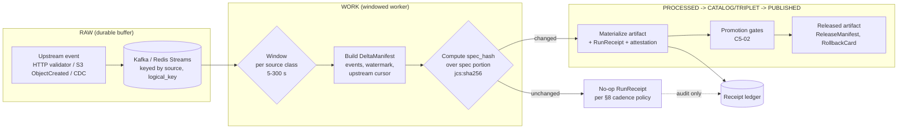

<!-- [KFM_META_BLOCK_V2]
doc_id: kfm://doc/standards/debounce-windows
title: Debounce Windows — Per-Source Starter Numbers and Tuning Policy
type: standard
version: v1
status: draft
owners: <ingestion-steward + smart-sync-steward — TODO confirm>
created: 2026-05-14
updated: 2026-05-14
policy_label: public
related:
  - docs/standards/SMART_SYNC.md
  - docs/standards/RUN_RECEIPT.md
  - docs/standards/AGENT_CONTRACT.md
  - docs/standards/ORCHESTRATION_BOUNDARIES.md
  - docs/runbooks/event-driven-ingest.md
  - docs/doctrine/lifecycle-law.md
  - docs/doctrine/directory-rules.md
tags: [kfm, ingest, smart-sync, debounce, coalesce, delta-manifest, governance]
notes:
  - Path canonical per Pass 10 §C3-04 Expansion Directions.
  - Per-source assignments are PROPOSED starting values; the 5–300 s class
    ranges are CONFIRMED corpus doctrine.
  - No-op receipt cadence remains an OPEN QUESTION pending ADR.
[/KFM_META_BLOCK_V2] -->

# Debounce Windows — Per-Source Starter Numbers and Tuning Policy

> Per-source debounce window assignments and the rules that govern how those windows are coalesced, materialized, and tuned over time. Status: **draft / PROPOSED**. Class ranges (5–300 s) are CONFIRMED doctrine; specific per-source numbers in §5 are PROPOSED starting values pending observation.

<p align="left">
  <a href="#"></a>
  <a href="#"></a>
  <a href="#"></a>
  <a href="#"></a>
  <a href="#"></a>
  <a href="#"></a>
</p>

| Field | Value |
|---|---|
| **Status** | `draft` — open for review |
| **Owners** | ingestion-steward + smart-sync-steward (**TODO** confirm in CODEOWNERS) |
| **Updated** | 2026-05-14 |
| **Authority of the rules below** | CONFIRMED doctrine where labeled, PROPOSED otherwise |
| **Authority of specific paths quoted** | PROPOSED until mounted-repo verification |

> [!NOTE]
> This document operationalizes **C3-04 — Debounce, Coalesce, and Delta Manifests** from the Pass 10 Idea Index. The doctrinal envelope (durable buffer → windowed worker → delta manifest → spec_hash-gated materialization → no-op or real receipt) is **CONFIRMED**. The starter window values in §5 are **PROPOSED**; they exist so the system has something concrete to run against and to tune away from.

---

## Quick jump

- [1 · Purpose & scope](#1--purpose--scope)
- [2 · Doctrinal basis](#2--doctrinal-basis)
- [3 · Source classes](#3--source-classes)
- [4 · Starter window numbers (per class)](#4--starter-window-numbers-per-class)
- [5 · Source family → class assignments](#5--source-family--class-assignments-proposed)
- [6 · Debounce / coalesce flow](#6--debounce--coalesce-flow)
- [7 · Delta manifest and `spec_hash`](#7--delta-manifest-and-spec_hash)
- [8 · No-op receipts](#8--no-op-receipts)
- [9 · Tuning loop (Friday material-changes report)](#9--tuning-loop-friday-material-changes-report)
- [10 · How a window changes (governance)](#10--how-a-window-changes-governance)
- [11 · Validation, tests, fixtures](#11--validation-tests-fixtures)
- [12 · Anti-patterns](#12--anti-patterns)
- [13 · Open questions](#13--open-questions)
- [14 · Related docs](#14--related-docs)
- [Appendix A · Delta-manifest spec portion (sketch)](#appendix-a--delta-manifest-spec-portion-sketch)
- [Appendix B · Worked example: GTFS-rt → vehicle positions](#appendix-b--worked-example-gtfs-rt--vehicle-positions)

---

## 1 · Purpose & scope

The **debounce window** is the per-source time bucket over which incoming change events are *coalesced* into a single `DeltaManifest` before any downstream materialization is considered. It is the throttle that protects the **PROCESSED → CATALOG/TRIPLET** lane from upstream event fan-out without losing audit completeness in **RAW**.

This document does three things:

1. Defines the **source classes** KFM uses to assign window sizes (CONFIRMED — corpus categories).
2. Provides **starter window numbers** per class and per known KFM source family (PROPOSED — values to run against and tune).
3. Specifies the **tuning loop, no-op receipt rules, validation, and governance** for changing a window (mixed CONFIRMED/PROPOSED).

**Out of scope.** Decisions about *whether* to ingest at all (`policy/`, `data/registry/`), about object meaning (`contracts/`), about machine shape (`schemas/`), and about promotion admissibility (`policy/promotion/`). Those live in their respective responsibility roots.

> [!IMPORTANT]
> A debounce window is a **rate-shaping** parameter, not a **truth** parameter. Lengthening a window can never paper over a missing validator, a missing manifest checksum, a missing source rights record, or a missing `EvidenceBundle`. The trust membrane is upstream of this document.

---

## 2 · Doctrinal basis

This standard is bound to four CONFIRMED corpus statements (Pass 10 Idea Index, §6.3, Category C3):

| Anchor | Source | What it fixes |
|---|---|---|
| **C3-04 Normalized Statement** | Pass 10 §C3-04 | The debounce envelope: durable buffer → windowed worker → delta manifest keyed by `(source, logical_key)` → `spec_hash`-gated materialization, no-op receipt otherwise. |
| **C3-04 window ranges** | Pass 10 §C3-04 | High-churn sensors **5–30 s**; moderate feeds **30–120 s**; heavy batch sources **120–300 s**. |
| **C1-02 `spec_hash`** | Pass 10 §C1-02 | `spec_hash` is `jcs:sha256:<hex>` over the canonicalized spec portion of the manifest (RFC 8785 JCS + SHA-256). |
| **C14-03 Friday report** | Pass 10 §C14-03 | The weekly material-change report is the agreed surface for window-tuning metrics (C3-04 *Suggested Future Work*). |

> [!NOTE]
> **Placement note (PROPOSED).** Directory Rules §6.1 describes `docs/standards/` as "external standards KFM conforms to (STAC, DCAT, PROV, etc.)". The Pass 10 corpus explicitly directs *internal* operational standards here too (`SMART_SYNC.md`, `RUN_RECEIPT.md`, this file). Until ADR-resolved, treat `docs/standards/` as accepting both classes; this file declares itself a **KFM internal operational standard**.

[Back to top ↑](#debounce-windows--per-source-starter-numbers-and-tuning-policy)

---

## 3 · Source classes

KFM groups sources into three operational classes for the purpose of debounce. Class is a function of *upstream change cadence and burst shape*, not of source authority, license, or domain.

| Class | Upstream change cadence | Typical burst shape | Window range (CONFIRMED) |
|---|---|---|---|
| **A — high-churn sensor** | sub-minute new records expected | many small events, often bursty | **5–30 s** |
| **B — moderate feed** | minutes-to-hours between meaningful changes | event-per-publish-cycle | **30–120 s** |
| **C — heavy batch** | daily / weekly / per-release bulk drops | a single large object or zip per cycle | **120–300 s** |

**Assignment rules (PROPOSED):**

1. A source belongs to the class that matches its **observed** event rate, not its self-reported cadence. Initial assignment may use the publisher's stated cadence; subsequent reassignment is data-driven from the Friday report (§9).
2. A source with **multiple logical keys** (e.g., per-station, per-route) may have its class applied at the `(source, logical_key)` granularity rather than at source granularity. Default: source-level.
3. If observed behavior places a source between two classes, prefer the **longer** window. Bias is toward fewer, larger materializations.

[Back to top ↑](#debounce-windows--per-source-starter-numbers-and-tuning-policy)

---

## 4 · Starter window numbers (per class)

The class ranges in §3 are intervals. The starter numbers below are the **default landing values** inside each interval, used when a new source is admitted with no observed history. They are PROPOSED; the Friday tuning loop replaces them with observed values over time.

| Class | Starter window | Lower bound | Upper bound | Rationale |
|---|---:|---:|---:|---|
| A — high-churn sensor | **15 s** | 5 s | 30 s | Middle of the range; small enough to keep stale views below a minute, large enough to coalesce typical micro-bursts. |
| B — moderate feed | **60 s** | 30 s | 120 s | One minute is a familiar, round operational unit and matches typical publish cycles of mid-cadence feeds. |
| C — heavy batch | **180 s** | 120 s | 300 s | Three minutes is long enough to absorb staged uploads (e.g., `.part` files, multi-object publishes) before materializing. |

> [!TIP]
> **Two windows, not one.** A source has both an *upper-bound* window (when to flush even if no events arrived in the last interval) and a *lower-bound* hold-down (how long after the **last** event before flushing). The starter implementation uses **window = upper-bound** and **hold-down = window / 3**, rounded to the nearest second. This is PROPOSED.

[Back to top ↑](#debounce-windows--per-source-starter-numbers-and-tuning-policy)

---

## 5 · Source family → class assignments (PROPOSED)

The mapping below is a **first-pass** assignment for source families named in the Pass 10 domain stacks (§C10). Every row is PROPOSED until observed materialization rates land in the Friday report.

| Source family | Domain | Stated cadence (CONFIRMED where corpus is explicit) | Class | Starter window |
|---|---|---|---:|---:|
| **GTFS-realtime** (vehicle positions, trip updates, alerts) | Transit (C10-04) | sub-minute protobuf updates | **A** | 15 s |
| **HRRR-Smoke** | Air (C10-02) | hourly, sub-hourly nowcasts | **A / B boundary** | 30 s |
| **PurpleAir + Barkjohn correction** | Air (C10-02) | 2-minute sensor reads | **A** | 20 s |
| **AirNow / AQS** | Air (C10-02) | hourly | **B** | 60 s |
| **NWIS** (streamflow / groundwater) | Water (C10-03) | 15-minute typical; near-real-time on key stations | **B** | 60 s |
| **Kansas Mesonet** | Soil / weather (C10-01) | 5-minute station data | **A / B boundary** | 30 s |
| **NOAA USCRN** | Soil / weather (C10-01) | hourly | **B** | 60 s |
| **NASA SMAP** (1 km derived) | Soil (C10-01) | daily | **C** | 180 s |
| **OpenET** | Remote sensing (C10-08) | 30 m daily / monthly | **C** | 180 s |
| **RCMAP** | Remote sensing (C10-08) | annual; weekly republish windows | **C** | 240 s |
| **Sentinel-2 fractional cover** | Remote sensing (C10-08) | per-orbit (sub-daily over CONUS) | **B** | 90 s |
| **SSURGO / gNATSGO state packages** | Soil (C10-01) | infrequent (annual / on-rebuild) | **C** | 240 s |
| **WIMAS / WRIS** | Water (C10-03) | **weekly** (corpus-explicit) | **C** | 300 s |
| **WWC5 well-completion records** | Water (C10-03) | per-completion event | **B** | 90 s |
| **KanDrive / WZDx** | Transit (C10-04) | minutes | **B** | 45 s |
| **FRA GCIS / STB Class I weekly** | Rail (C10-05) | weekly | **C** | 240 s |
| **GBIF / iNaturalist** | Biodiversity (C10-06) | continuous occurrence ingest | **B** | 60 s |
| **eBird EBD** | Biodiversity (C10-06) | monthly bulk + continuous trickle | **C** for EBD, **B** for trickle | 240 s / 60 s |
| **KSHS Kansas Memory / archives** | Archives (C10-07) | per-curator publish event | **C** | 240 s |
| **Internal RAW staging buckets** (S3 ObjectCreated) | All | event-driven via C3-03 | **per upstream source's class** | inherit |

> [!CAUTION]
> The "Stated cadence" column reflects what the corpus explicitly says. Where the corpus did not give a cadence, the row says nothing more than "per-event"; do **not** read a number where the corpus did not provide one. Real-world publishers drift; the Friday report is the corrective signal.

[Back to top ↑](#debounce-windows--per-source-starter-numbers-and-tuning-policy)

---

## 6 · Debounce / coalesce flow

The flow below is the CONFIRMED C3-04 envelope, expressed in KFM lifecycle terms.



**Key points the flow encodes:**

- The **buffer is sovereign** for audit. Every upstream event lands in RAW before debounce. Window selection cannot drop events; it only delays materialization.
- The **window is keyed by `(source, logical_key)`**, not by wall-clock alone. Two simultaneous bursts from the same source on different logical keys produce two independent DeltaManifests.
- **Materialization is `spec_hash`-gated.** No artifact is written if the canonicalized spec portion of the DeltaManifest matches the previous window's `spec_hash`. A `RunReceipt` is still emitted — see §8.
- **Promotion remains a governed state transition** downstream of materialization (Pass 10 §C5-02). Debounce does not promote.

[Back to top ↑](#debounce-windows--per-source-starter-numbers-and-tuning-policy)

---

## 7 · Delta manifest and `spec_hash`

A `DeltaManifest` is the per-window object emitted by the windowed worker. It is split into a **spec portion** (the bytes that determine identity) and a **transport portion** (timestamps, storage URLs, signatures — excluded from `spec_hash`). This mirrors the canonical KFM spec-hash discipline established for `EvidenceBundle` and `EvidenceRef`.

**Spec portion (PROPOSED — CONFIRMED in structure, NEEDS VERIFICATION in field names):**

| Field | Type | Why it's in the spec | Source |
|---|---|---|---|
| `source_id` | string | identity of the upstream source | corpus §C3-04 ("keyed by source") |
| `logical_key` | string | logical partition within the source | corpus §C3-04 ("keyed by … logical_key") |
| `window_class` | enum `A` \| `B` \| `C` | which class governed this window | this document |
| `window_seconds` | integer (5..300) | the window size in effect | this document |
| `events[]` | list of `{event_id, validator}` | the coalesced upstream events | corpus §C3-04 ("records the event list") |
| `watermark` | RFC 3339 datetime | the high-watermark across coalesced events | corpus §C3-04 ("watermark") |
| `upstream_cursor` | object (e.g., `{kafka_offset}` or `{etag, last_modified}`) | replay anchor for the window | corpus §C3-04 ("Kafka offset or last validators") |
| `policy_label` | string | inherited from the SourceDescriptor | KFM truth posture |
| `rights_status` | string | inherited from the SourceDescriptor | KFM truth posture |

**`spec_hash` rule (CONFIRMED per C1-02):**

```text
spec_hash = "jcs:sha256:" + sha256_hex(rfc8785_jcs(spec_portion))
```

> [!NOTE]
> Field names above follow the dominant corpus convention. Where Pass 10 acknowledges drift (`fetch_time` vs `fetched_at`, `http_validators` vs `source_validators`), this document uses the form that recurs most often. **NEEDS VERIFICATION** against the run_receipt JSON Schema once `schemas/contracts/v1/runtime/run_receipt.schema.json` exists.

[Back to top ↑](#debounce-windows--per-source-starter-numbers-and-tuning-policy)

---

## 8 · No-op receipts

When the new window's `spec_hash` equals the previous window's `spec_hash`, **no artifact is materialized**. A `RunReceipt` is still emitted so that auditors can see that the system *saw events and elected not to act* (CONFIRMED — C3-04).

**What the corpus does NOT yet decide (OPEN QUESTION, Pass 10 §C3-04):**

> *"Should the no-op receipt be written every cycle, every N cycles, or only on transitions from change to no-change?"*

**PROPOSED default until ADR resolves it:**

| Mode | Definition | When PROPOSED to use |
|---|---|---|
| **`per_window`** | one no-op receipt per window evaluation | Class A sources only — cheap volume, useful for audit replay |
| **`on_transition`** *(default)* | receipt only when the change-state flips (changed↔unchanged) | Classes B and C |
| **`every_n=10`** | one no-op every 10 windows otherwise unchanged | Class A sources where `per_window` proves too noisy |

The mode is recorded in the **spec portion** of the DeltaManifest (`no_op_receipt_mode`) so window-tuning metrics can interpret receipt rates correctly.

> [!WARNING]
> A no-op `RunReceipt` is still a `RunReceipt`. It carries `run_id`, `orchestrator`, `transform_git_sha`, and the upstream cursor. It does **not** carry an `artifacts[]` entry. Treat it as evidence of *inaction*, never as a substitute for evidence of action.

[Back to top ↑](#debounce-windows--per-source-starter-numbers-and-tuning-policy)

---

## 9 · Tuning loop (Friday material-changes report)

Window tuning is a **data-driven, weekly** discipline. The Friday material-change report (Pass 10 §C14-03) is the agreed surface; window-tuning metrics are added per C3-04 *Suggested Future Work*.

**PROPOSED weekly window-tuning section in the Friday report:**

| Metric | Definition | Healthy posture (PROPOSED) |
|---|---|---|
| `materialization_rate` | windows producing a real artifact ÷ windows evaluated, per `(source_id, logical_key)` | per source class: A ≤ 30 %, B ≤ 50 %, C ≤ 80 % |
| `no_op_rate` | 1 − `materialization_rate` | converse of above |
| `mean_event_count_per_window` | events coalesced per window | stable; sudden 10× spike triggers investigation |
| `mean_watermark_lag` | (window emit time) − (max event timestamp) | within window + hold-down |
| `class_promotion_proposal` | suggestion: "reclassify A→B" when `materialization_rate < 5 %` for ≥ 4 weeks | none = healthy |
| `class_demotion_proposal` | suggestion: "reclassify B→A" when `materialization_rate > 70 %` for ≥ 2 weeks | none = healthy |

**Tuning rules (PROPOSED):**

1. Do not change a window mid-week. The tuning unit is the Friday report cycle.
2. A single-week outlier is **not** sufficient to retune. Two consecutive weeks of the same signal is the minimum.
3. Reclassifying a source between classes is a `meta:module=smart-sync` commit with the `spec_hash` trailer advancing on this document (Pass 10 §C14-02).
4. The first four weeks of any new source are **observation-only**. The starter window from §5 stands; metrics are recorded but no retuning fires.

[Back to top ↑](#debounce-windows--per-source-starter-numbers-and-tuning-policy)

---

## 10 · How a window changes (governance)

Window changes are **reversible operational decisions**, not architectural mutations. They follow the smallest-useful-change discipline.

| Change type | Mechanism | Authority |
|---|---|---|
| Adjust starter number within the same class (e.g., 60 s → 75 s for `Class B`) | PR editing §5, blocking CI check on diff format | ingestion-steward |
| Reclassify a source (e.g., `B → C`) | PR editing §5, with rationale and 2-week Friday-report evidence cited in the PR body | ingestion-steward + smart-sync-steward |
| Add a new source family row to §5 | PR editing §5, blocked on existence of a `SourceDescriptor` in `data/registry/sources/` (PROPOSED path) | source-steward who owns the descriptor |
| Add a new **class** (e.g., Class D for sub-second) | **ADR required** per Directory Rules §2.4 (changes the §3 vocabulary, which the windowed worker depends on) | architecture review |
| Change the class window ranges (e.g., move Class A upper from 30 s → 60 s) | **ADR required** — this contradicts C3-04 corpus doctrine | architecture review |

> [!IMPORTANT]
> Every change to §5 or §3 of this document is a material change under Pass 10 §C14-02 and **MUST** carry the standard commit trailers (`meta:module=`, `spec_hash=`, `ticket=`, `owners=`). The CI commit-trailer linter is blocking.

[Back to top ↑](#debounce-windows--per-source-starter-numbers-and-tuning-policy)

---

## 11 · Validation, tests, fixtures

Tests and fixtures live under the canonical responsibility roots, not in this document. The expected shape (PROPOSED paths, NEEDS VERIFICATION against the mounted repo):

| Concern | Proposed location | Notes |
|---|---|---|
| `DeltaManifest` JSON Schema (machine shape) | `schemas/contracts/v1/runtime/delta_manifest.schema.json` | Per ADR-0001 schema-home rule |
| `RunReceipt` JSON Schema | `schemas/contracts/v1/runtime/run_receipt.schema.json` | Shared with C1-01 |
| Validator: `spec_hash` recompute | `tools/validators/recompute_spec_hash.py` | Asserts `jcs:sha256` over spec portion |
| Validator: window-size in declared class range | `tools/validators/check_window_class.py` | Fails closed on `(class, window_seconds)` mismatch |
| Conftest / policy: no-op receipt mode permitted set | `policy/runtime/debounce_receipt_modes.rego` | Allowed: `per_window`, `on_transition`, `every_n` |
| Fixtures: golden window with change | `tests/fixtures/debounce/window_changed/` | Real `spec_hash` advance |
| Fixtures: golden window without change | `tests/fixtures/debounce/window_unchanged/` | Two consecutive windows, equal `spec_hash` |
| Fixtures: invalid window (out of class range) | `tests/fixtures/debounce/invalid/` | Triggers DENY |

> [!NOTE]
> All paths above are **PROPOSED**. They are consistent with Directory Rules but have not been verified against a mounted KFM repository in this session. Treat existence claims as NEEDS VERIFICATION.

[Back to top ↑](#debounce-windows--per-source-starter-numbers-and-tuning-policy)

---

## 12 · Anti-patterns

> [!WARNING]
> The patterns below are **not allowed** in KFM debounce/coalesce implementations.

| Anti-pattern | Why it's wrong | Doctrinal anchor |
|---|---|---|
| **Window without a buffer** — debouncing in memory only | Loses upstream events on worker crash; breaks audit completeness | C3-04 ("durable buffer") |
| **Window without a `spec_hash` check** — always materialize when the window flushes | Defeats the entire purpose of C3-04; produces phantom no-change artifacts | C3-04 + C1-02 |
| **No no-op receipt** — silently skipping the receipt when nothing changed | Auditors cannot distinguish "system saw nothing" from "system saw something and decided not to act" | C3-04 |
| **Window applied to promotion** — debouncing the **CATALOG → PUBLISHED** transition | Promotion is a governed state transition, not a coalescing point | KFM core invariants |
| **Per-source rights ignored** — class assignment overriding `policy_label` or `rights_status` | Operational throttle cannot dilute trust membrane | KFM truth posture |
| **Mid-week retuning by exception** | Bypasses the Friday tuning cycle and corrodes the discipline | §9 of this document |
| **A new class added without ADR** | Changes the vocabulary the windowed worker depends on | Directory Rules §2.4 |
| **External-source ranges replacing corpus ranges** without ADR | The 5–300 s ranges are CONFIRMED corpus doctrine | C3-04 |

[Back to top ↑](#debounce-windows--per-source-starter-numbers-and-tuning-policy)

---

## 13 · Open questions

Tracked as **NEEDS VERIFICATION** entries; SHOULD be mirrored in `docs/registers/VERIFICATION_BACKLOG.md` once the repo is mounted.

1. **No-op receipt cadence.** `per_window` vs `on_transition` vs `every_n` — corpus does not decide. (Pass 10 §C3-04 Open Questions.) See §8.
2. **`logical_key` granularity per source.** Default = source-level. Per-station / per-route / per-tile may be appropriate for high-cardinality feeds (e.g., NWIS by site id, GTFS-rt by route). Needs source-by-source resolution.
3. **Hold-down ratio.** Starter PROPOSAL is `hold_down = window / 3`. No corpus support; pure operational hypothesis.
4. **Worker runtime.** C3-04 lists both Temporal flow and Prefect flow as eligible. The boundary belongs in `docs/standards/ORCHESTRATION_BOUNDARIES.md` (C2-02 Expansion Directions), not here.
5. **Cross-source coalescing.** Currently the window is `(source, logical_key)` only. Whether a "joint window" across related sources (e.g., a HRRR-Smoke window aligned to a PurpleAir window for an air-quality release) is permissible is **UNKNOWN**.
6. **`SourceDescriptor` schema field for class.** Should the class assignment live in `SourceDescriptor` (canonical) and be *read* by this document, or live in this document and be *referenced* from `SourceDescriptor`? **NEEDS VERIFICATION** — answer depends on the source-descriptor schema's current shape.
7. **Failure of the windowed worker mid-window.** Replay semantics from `upstream_cursor` are CONFIRMED in principle (Kafka offset / last validators); the precise re-entry protocol for the worker is **PROPOSED** pending an `AGENT_CONTRACT.md` reference.

[Back to top ↑](#debounce-windows--per-source-starter-numbers-and-tuning-policy)

---

## 14 · Related docs

> Paths below are PROPOSED. Existence in the mounted repo is NEEDS VERIFICATION.

- `docs/standards/SMART_SYNC.md` — HTTP validators, conditional GETs (C3-01).
- `docs/standards/RUN_RECEIPT.md` — canonical run receipt fields and schema.
- `docs/standards/AGENT_CONTRACT.md` — agent lease semantics and the four events (C2-04).
- `docs/standards/ORCHESTRATION_BOUNDARIES.md` — Dagster / Prefect / Temporal boundary (C2-01..03).
- `docs/runbooks/event-driven-ingest.md` — S3/GCS storage-event handler shape (C3-03).
- `docs/doctrine/lifecycle-law.md` — RAW → WORK/QUARANTINE → PROCESSED → CATALOG/TRIPLET → PUBLISHED.
- `docs/doctrine/directory-rules.md` — placement authority for this file.
- `docs/registers/VERIFICATION_BACKLOG.md` — where the §13 open questions should land.
- `data/registry/sources/` — canonical home for `SourceDescriptor` (PROPOSED).

[Back to top ↑](#debounce-windows--per-source-starter-numbers-and-tuning-policy)

---

## Appendix A · Delta-manifest spec portion (sketch)

> **Status: PROPOSED.** Illustrative shape only. The authoritative schema is `schemas/contracts/v1/runtime/delta_manifest.schema.json` (NEEDS VERIFICATION). Do not consume this snippet as a contract.

<details>
<summary>Click to expand: example DeltaManifest spec portion (JSON)</summary>

```json
{
  "object_type": "DeltaManifest",
  "schema_version": "v1",
  "source_id": "src:noaa:hrrr-smoke",
  "logical_key": "tile:8/61/97",
  "window_class": "B",
  "window_seconds": 60,
  "no_op_receipt_mode": "on_transition",
  "events": [
    { "event_id": "evt-01HZ...", "validator": { "etag": "\"a1b2c3...\"" } },
    { "event_id": "evt-01HZ...", "validator": { "etag": "\"a1b2c3...\"" } }
  ],
  "watermark": "2026-05-14T12:34:56Z",
  "upstream_cursor": { "kafka_offset": 1294817, "topic": "noaa.hrrr-smoke.v1" },
  "policy_label": "public",
  "rights_status": "open"
}
```

The `spec_hash` would then be computed as:

```text
spec_hash := "jcs:sha256:" + sha256_hex( rfc8785_jcs( <the JSON above> ) )
```

Transport-layer fields (storage URLs, signing timestamps, cosign bundle digests, `run_id`) live **outside** this spec portion and **MUST NOT** participate in the `spec_hash` computation.

</details>

[Back to top ↑](#debounce-windows--per-source-starter-numbers-and-tuning-policy)

---

## Appendix B · Worked example: GTFS-rt → vehicle positions

> **Status: ILLUSTRATIVE.** This example uses Class A starter values from §4 to show the flow end-to-end. It is not a deployment recipe.

<details>
<summary>Click to expand: a Class A walk-through</summary>

**Source:** GTFS-realtime vehicle-positions feed for a single agency.
**Class assignment:** A (high-churn sensor) per §5.
**Starter window:** 15 s (§4).
**Hold-down:** 5 s (`window / 3`).
**No-op receipt mode:** PROPOSED `every_n=10` for Class A volume reasons.

**T+0 s** — conditional poll returns 200 + protobuf payload with 47 vehicles. Event lands in `RAW` topic `transit.gtfs-rt.vehicles.v1`, keyed by `(src:agency-x:gtfs-rt, all)`.

**T+0–15 s** — three more polls arrive; the buffer accumulates events. The windowed worker holds the window open until either the 15 s upper bound elapses or 5 s of silence passes.

**T+15 s** — window flushes. Worker constructs the `DeltaManifest` spec portion (Appendix A shape) over the four coalesced events, computes:

```text
spec_hash = jcs:sha256:9f1a...
```

**Branch — `spec_hash` changed:**
- Materialize a `vehicle_positions.snapshot.parquet` artifact into `PROCESSED`.
- Emit a `RunReceipt` with `artifacts[]` pointing to the snapshot.
- Hand to promotion gates (C5-02). Debounce's job ends here.

**Branch — `spec_hash` unchanged:**
- No artifact is written.
- A `RunReceipt` is emitted only if the `every_n=10` counter trips this cycle (otherwise the no-op is silent within the cap).
- The `upstream_cursor` (Kafka offset) advances regardless, so the next window starts cleanly.

**Friday-report effect (T + ~5 days):** the worker reports `materialization_rate ≈ 0.18` for this `(source_id, logical_key)`. Within Class A's healthy posture (≤ 0.30, §9), so no retuning fires. After four weeks below `0.05`, the report would propose reclassification to Class B.

</details>

[Back to top ↑](#debounce-windows--per-source-starter-numbers-and-tuning-policy)

---

<hr/>

**Related docs:** [SMART_SYNC.md](./SMART_SYNC.md) · [RUN_RECEIPT.md](./RUN_RECEIPT.md) · [AGENT_CONTRACT.md](./AGENT_CONTRACT.md) · [ORCHESTRATION_BOUNDARIES.md](./ORCHESTRATION_BOUNDARIES.md) · [lifecycle-law.md](../doctrine/lifecycle-law.md) · [directory-rules.md](../doctrine/directory-rules.md)

**Last updated:** 2026-05-14 · **Doc status:** draft · **Authority:** PROPOSED (class ranges CONFIRMED per Pass 10 §C3-04)

[Back to top ↑](#debounce-windows--per-source-starter-numbers-and-tuning-policy)
