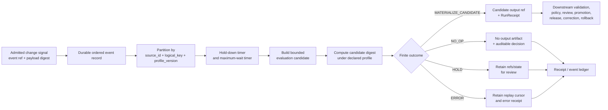

<!-- [KFM_META_BLOCK_V2]
doc_id: kfm://doc/standards/debounce-windows
title: Debounce Windows — Per-Source Starter Numbers and Tuning Policy
type: standard; operational-guidance
version: v2.0-draft
status: "draft; repository-grounded; specification-only; no-runtime-authority"
owners:
  - "@bartytime4life — verified default CODEOWNERS review route"
  - "NEEDS VERIFICATION — accountable source-ingest, runtime, observability, and independent review stewardship"
created: 2026-05-14
updated: 2026-08-18
policy_label: "repository-facing; public; no-source-activation; no-release; no-publication"
owning_root: docs/
responsibility: "Explain the current debounce/coalescing boundary, preserve the inherited starter profile as a visibly proposed design, distinguish adjacent clocks and object families, and define the evidence required before any source-specific window becomes executable."
truth_posture: "cite-or-abstain; repository bytes establish current surfaces; proposal-era values remain LINEAGE / PROPOSED; runtime, deployment, and source-specific effectiveness remain UNKNOWN without measured evidence"
current_path: docs/standards/DEBOUNCE_WINDOWS.md
evidence_snapshot:
  repository: bartytime4life/Kansas-Frontier-Matrix
  base_ref: main
  base_commit: 7ac9f151aacc03b03fd486a64b348743b7325a51
  target_prior_blob: 5b65892ee3ce53d5421c745e2c4fae72c9c9ba2b
  standards_readme_blob: a8cbe5d183448d5f0de37f8a4eacd6fcaca0d71b
  directory_rules_blob: fd49a0b83e55cef52c1124281f093e263526898d
  directory_rules_adr_blob: a4de0d7a96b78da59cfc499d1025e1508afd8dd9
  codeowners_blob: dd2a84aa514d8ecd9208bc347f90f9a2ed37dd61
  identity_adr_blob: 9c216990d74cd4cb259a1a6a4e4221bc59e8b166
  run_receipt_schema_blob: c930ff0fd4da34d8b4ff202d9fd576110258974c
  run_receipt_validator_blob: d57bc57234a16dc11908e1509b293124e185d388
  source_descriptor_schema_blob: 582e70b834278c3c6ca9a8b31efbe0989c96f0bc
  source_event_receipt_schema_blob: 1adee4a269334a6947a8e7ebee13999e92da43c1
  connector_load_budget_schema_blob: b40082bb281848bcdb02227e0a5f21d2f6d41e07
  delivery_availability_schema_blob: f1a05cc1f9994a3f8bc7ef6c461007923ffe25a5
  pmtiles_delta_manifest_schema_blob: ff6f5d4922dc48c9e42c18d45c61a268c789f923
related:
  - ./README.md
  - ./SMART_SYNC.md
  - ./RUN_RECEIPT.md
  - ../runbooks/SOURCE_REFRESH_RUNBOOK.md
  - ../doctrine/lifecycle-law.md
  - ../doctrine/directory-rules.md
  - ../adr/ADR-0029-adopt-directory-governance-standard-v2.md
  - ../adr/ADR-0013-spec_hash-and-run_id-identity-grammar.md
  - ../../contracts/runtime/run_receipt.md
  - ../../schemas/contracts/v1/runtime/run_receipt.schema.json
  - ../../schemas/contracts/v1/source/source_descriptor.schema.json
  - ../../schemas/contracts/v1/source/source_event_run_receipt.schema.json
  - ../../tools/validators/validate_run_receipt.py
tags: [kfm, standards, ingest, smart-sync, debounce, coalesce, event-window, no-op, deterministic-replay, governance]
notes:
  - "v2.0-draft is a same-path documentation-only reconciliation against current repository evidence."
  - "Accepted ADR-0029 and the current docs/standards boundary README establish this path as placement-safe human-readable operational guidance."
  - "The bounded repository search did not establish a generic executable debounce contract, schema, profile registry, worker, validator, fixture family, or test suite."
  - "The inherited A/B/C ranges, starter values, hold-down ratio, source-family assignments, no-op sampling modes, and weekly thresholds remain design lineage, not active configuration."
  - "The current executable identity slice uses sha256:<hex>; proposed jcs:sha256:<hex> grammar remains conflicted under proposed ADR-0013."
[/KFM_META_BLOCK_V2] -->

<a id="top"></a>

# Debounce Windows — Per-Source Starter Numbers and Tuning Policy

Debounce/coalescing can reduce event fan-out before candidate materialization, but this document is **human-readable operational guidance only**. It does not configure a worker, assign a source, admit or activate a connector, create evidence, approve policy, move lifecycle state, release, deploy, or publish.

> [!IMPORTANT]
> **Current repository state is narrower than the prior document implied.** KFM has a bounded, no-network `RunReceipt` Smart Sync profile for one conditional HTTP decision (`materialize` or `no_op`) and a substantive validator for that profile. A bounded repository search did **not** establish a generic source-event debounce contract, schema, active profile registry, worker, validator, fixture family, or test suite.

> [!CAUTION]
> **A debounce window is not source cadence, delivery availability, freshness, staleness, request-rate policy, or release timing.** Those clocks and authorities remain separate. A documentation table cannot make any window operational.

| Field | Current state |
|---|---|
| **Document status** | `draft; repository-grounded; specification-only` |
| **Placement** | **CONFIRMED** same-path guidance under `docs/standards/` through accepted ADR-0029 and the current standards-lane README |
| **Verified review route** | `@bartytime4life` through the repository-default CODEOWNERS rule; dedicated ingestion/runtime stewardship is **NEEDS VERIFICATION** |
| **Bounded implementation evidence** | Smart Sync HTTP `RunReceipt` schema + no-network validator; source-event admission receipt candidate; source delivery/load assessment candidates |
| **Generic debounce implementation** | **NOT ESTABLISHED** by bounded repository search |
| **A/B/C class ranges and starter values** | **LINEAGE / PROPOSED** experiment profile |
| **Per-source assignments and live tuning evidence** | **UNKNOWN / NEEDS VERIFICATION** |
| **Release or publication effect** | None |
| **Evidence snapshot** | `main@7ac9f151aacc03b03fd486a64b348743b7325a51` |

**Quick jump:** [Purpose](#1--purpose--scope) · [Evidence](#2--doctrinal-basis) · [Classes](#3--source-classes) · [Starter profile](#4--starter-window-numbers-per-class) · [Assignments](#5--source-family--class-assignments-proposed) · [Flow](#6--debounce--coalesce-flow) · [Identity](#7--delta-manifest-and-spec_hash) · [No-op](#8--no-op-receipts) · [Tuning](#9--tuning-loop-friday-material-changes-report) · [Changes](#10--how-a-window-changes-governance) · [Validation](#11--validation-tests-fixtures) · [Anti-patterns](#12--anti-patterns) · [Open questions](#13--open-questions) · [Related docs](#14--related-docs)

---

## 1 · Purpose & scope

A **debounce window** is a proposed event-coalescing interval applied to a declared partition such as `(source_id, logical_key, profile_version)`. It delays candidate evaluation long enough to combine a bounded burst of related change signals while preserving every admitted event reference and a deterministic replay path.

This page has four responsibilities:

1. State the current repository evidence and the limits of that evidence.
2. Preserve the inherited three-class starter profile as a clearly labeled proposal.
3. Define the information a future source-specific assignment must carry.
4. Describe the contract, fixture, validation, observability, and rollback evidence required before runtime use.

### Scope boundary

| Concern | Owned here? | Current boundary |
|---|---:|---|
| Human-readable debounce/coalescing guidance | Yes | This document |
| Source identity, role, rights, sensitivity, and activation | No | Source contract, schema, registry, policy, and review surfaces |
| Request-rate/load-budget window | No | Separate connector load-budget assessment/profile |
| Product delivery, freshness, and staleness clocks | No | Separate delivery-availability assessment/profile |
| Source-declared update cadence | No | `SourceDescriptor.cadence` and its governing review |
| Event admission into RAW/WORK/QUARANTINE | No | Source-event admission contract, policy, and receipt family |
| Machine shape of a future debounce profile or evaluation | No | A paired semantic contract and schema under their owning roots |
| Worker/runtime implementation and durable timer state | No | Runtime/package/pipeline responsibility after placement review |
| Promotion, release, correction, rollback, or publication | No | Policy, evidence, review, release, and lifecycle authorities |
| Browser/UI input debounce | No | UI implementation; unrelated to source-event coalescing |

> [!NOTE]
> The repository does not yet establish one generic lifecycle placement for debounce state. A future implementation must decide whether it coalesces admitted pre-RAW event candidates or already-admitted RAW event records. Until that authority and data model are settled, this document does not label a generic event buffer as RAW, WORK, or another lifecycle lane.

[Back to top](#top)

---

## 2 · Doctrinal basis

The original page treated proposal-era Pass 10 language as confirmed runtime doctrine. Current repository evidence requires a narrower classification.

### Current authority and evidence

| Surface | What is CONFIRMED | What it does **not** prove |
|---|---|---|
| [`docs/standards/README.md`](./README.md) | `DEBOUNCE_WINDOWS.md` is a current direct child and this lane may hold supporting operational conventions | Adoption, implementation, conformance, active configuration, or runtime behavior |
| Accepted [`ADR-0029`](../adr/ADR-0029-adopt-directory-governance-standard-v2.md) + adopted [`directory-rules.md`](../doctrine/directory-rules.md) | `docs/` owns human-readable guidance and this same-path update does not create a new authority home | Whether a debounce object family or worker should exist |
| [`SMART_SYNC.md`](./SMART_SYNC.md) and [`RUN_RECEIPT.md`](./RUN_RECEIPT.md) | Proposal-era design lineage for conditional polling, material-change detection, and receipts | Current generic debounce implementation or canonical field set |
| [`run_receipt.schema.json`](../../schemas/contracts/v1/runtime/run_receipt.schema.json) + [`validate_run_receipt.py`](../../tools/validators/validate_run_receipt.py) | A bounded Smart Sync HTTP profile validates `200/304`, validators, prior-content binding, and `materialize/no_op` decisions without network access | Burst coalescing, timer persistence, logical-key windows, late events, or a generic delta manifest |
| [`source_descriptor.schema.json`](../../schemas/contracts/v1/source/source_descriptor.schema.json) | A detailed **PROPOSED** SourceDescriptor shape includes cadence, freshness, staleness, and access notes | A debounce class, active debounce duration, hold-down, or profile assignment |
| [`source_event_run_receipt.schema.json`](../../schemas/contracts/v1/source/source_event_run_receipt.schema.json) | A fixture-only source-event admission receipt candidate with finite decisions and explicit non-effects | Executable admission or debounce/coalescing |
| Connector load-budget and delivery-availability schemas | Separate fixture-only windows for request budgets and delivery/freshness assessment | Event debounce configuration |
| [`pmtiles_delta_manifest.schema.json`](../../schemas/contracts/v1/map/pmtiles_delta_manifest.schema.json) | A concrete PMTiles-specific delta object family, fixtures, validator, and tests exist | Authority to reuse that map/release schema as a generic source debounce manifest |
| Proposed [`ADR-0013`](../adr/ADR-0013-spec_hash-and-run_id-identity-grammar.md) | Current executable hashing uses RFC 8785 JCS + SHA-256 and emits `sha256:<64-lower-hex>` | Acceptance of the candidate `jcs:sha256:<hex>` wire form |

### Inherited design lineage

The prior A/B/C ranges, starter values, source-family table, `window / 3` hold-down, no-op sampling modes, and weekly tuning thresholds are retained below only as a **PROPOSED experiment profile**. They are not an accepted KFM contract, policy, configuration, source assignment, or runtime default.

The bounded search at the evidence snapshot found no separate generic debounce schema, contract, profile registry, worker, validator, fixtures, or tests. That is a bounded current-state finding, not proof that no unindexed or external implementation exists.

[Back to top](#top)

---

## 3 · Source classes

The three classes below are inherited proposal vocabulary. They classify **event-arrival and burst behavior**, not source authority, scientific value, rights, sensitivity, domain, freshness, or public importance.

| Candidate class | Candidate event pattern | Inherited range | Current status |
|---|---|---:|---|
| **A — rapid stream** | Sub-minute event arrivals or short, dense bursts | `5–30 s` | **PROPOSED** |
| **B — periodic feed** | Meaningful changes separated by minutes or hours, with bounded publish bursts | `30–120 s` | **PROPOSED** |
| **C — batch publication** | Large or multi-object release bursts at daily, weekly, or release-defined intervals | `120–300 s` | **PROPOSED** |

A future assignment must be based on measured and reviewable evidence, including:

- event inter-arrival distribution and burst-tail duration;
- maximum acceptable **coalescing delay**, kept separate from freshness and staleness;
- logical-key cardinality and hot-key skew;
- late and out-of-order event behavior;
- replay and restart cost;
- maximum durable backlog age;
- downstream candidate materialization cost;
- source terms, rate limits, and delivery expectations as separate constraints; and
- a rollback target to the prior profile.

No source is assigned to a class merely because its name appears in this document.

[Back to top](#top)

---

## 4 · Starter window numbers (per class)

The following values preserve the prior document's starter profile. They are suitable only for a deterministic, no-network fixture experiment until a contract, schema, evaluator, state model, and review record exist.

| Candidate class | Maximum wait | Candidate hold-down | Inherited bounds | Status |
|---|---:|---:|---:|---|
| A — rapid stream | `15 s` | `5 s` | `5–30 s` | **PROPOSED experiment** |
| B — periodic feed | `60 s` | `20 s` | `30–120 s` | **PROPOSED experiment** |
| C — batch publication | `180 s` | `60 s` | `120–300 s` | **PROPOSED experiment** |

The hold-down values retain the prior `maximum_wait / 3` hypothesis. No repository evidence establishes that ratio as correct or active.

### Proposed acceptance constraints

A future machine contract should fail closed unless all of the following are explicit:

- `hold_down_seconds > 0`;
- `hold_down_seconds <= maximum_wait_seconds`;
- monotonic processing time is used for timer behavior;
- source event time, receipt time, processing time, and window-close time remain distinct;
- late-event and out-of-order-event policy is named;
- the maximum wait does not silently rewrite source delivery, freshness, or staleness expectations;
- partition state survives or deterministically replays after restart;
- key cardinality and state retention are bounded; and
- missing, expired, conflicted, or unreviewed profile state returns `HOLD` or `ERROR`, not an implicit default.

These are proposed implementation gates. Editing this table has no runtime effect.

[Back to top](#top)

---

## 5 · Source family → class assignments (PROPOSED)

### Current determination

**No source-specific debounce assignment is confirmed by current repository evidence.**

The prior edition included a large source-family table with external cadence statements and exact values. That table mixed source research, source configuration, and operational policy without binding each row to a current `SourceDescriptor`, descriptor digest/version, measurement record, review record, active config consumer, or rollback target. It is therefore not carried forward as current configuration. The original table remains recoverable from Git history at blob `5b65892ee3ce53d5421c745e2c4fae72c9c9ba2b`.

### Required assignment record

Before a source-specific value can be treated as executable, the owning operational profile should bind at least:

| Candidate field | Purpose |
|---|---|
| `profile_id` and `profile_version` | Stable identity and compatibility boundary for the assignment |
| `profile_spec_hash` | Digest of the declared profile under the current accepted hash grammar |
| `source_descriptor_ref`, version, and digest | Exact source-governance record the profile depends on |
| `logical_key_profile` | Deterministic partition grammar and cardinality limits |
| `candidate_class` | `A`, `B`, or `C` only if that vocabulary is accepted |
| `maximum_wait_seconds` | Upper bound before candidate evaluation |
| `hold_down_seconds` | Quiet period after the last admitted event |
| `late_event_policy` | Finite handling for events arriving after close |
| `no_op_receipt_policy` | Explicit audit behavior for unchanged evaluations |
| `measurement_evidence_refs` | Metrics or replay results supporting the value |
| `review_record_refs` | Accountable review for the exact profile version |
| `effective_from` and optional `effective_until` | Temporal scope of the assignment |
| `previous_profile_ref` and `rollback_ref` | Reversible change and replay target |
| `authority_effects` | Explicitly false for source activation, evidence, policy, promotion, release, and publication |

> [!WARNING]
> The exact owner and path for this proposed record are **HOLD**. It may be source-operational configuration, a runtime profile, or a split object with one semantic contract and one deployment binding. Directory Rules require the authority owner to be resolved before a new writable home is created.

[Back to top](#top)

---

## 6 · Debounce / coalesce flow

The diagram is a **target behavior model**, not a current wiring diagram.


```mermaid
flowchart LR
    A["Admitted change signal<br/>event ref + payload digest"] --> B["Durable ordered event record"]
    B --> C["Partition by<br/>source_id + logical_key + profile_version"]
    C --> D["Hold-down timer<br/>and maximum-wait timer"]
    D --> E["Build bounded<br/>evaluation candidate"]
    E --> F["Compute candidate digest<br/>under declared profile"]
    F --> G{"Finite outcome"}

    G -->|MATERIALIZE_CANDIDATE| H["Candidate output ref<br/>+ RunReceipt"]
    G -->|NO_OP| I["No output artifact<br/>+ auditable decision"]
    G -->|HOLD| J["Retain refs/state<br/>for review"]
    G -->|ERROR| K["Retain replay cursor<br/>and error receipt"]

    H --> L["Downstream validation,<br/>policy, review, promotion,<br/>release, correction, rollback"]
    I --> M["Receipt / event ledger"]
    J --> M
    K --> M
```

### Required boundary behavior

- The coalescer does not activate a source or decide source rights.
- Every input event reference remains recoverable even when multiple events become one candidate.
- Partitioning is deterministic and versioned.
- One logical key cannot silently absorb another.
- A timer expiry creates only a **candidate evaluation**, not a published artifact.
- `MATERIALIZE_CANDIDATE` does not mean policy `ALLOW`, promotion, release, or publication.
- `NO_OP` means “evaluated under a named profile and produced no candidate output,” not “the source is true, healthy, or unchanged in every respect.”
- `HOLD` and `ERROR` preserve replay state and never fall back to materialization.
- Cross-source coalescing is not allowed by this document; it requires a separately governed cross-source or cross-domain contract.

The only currently verified executable slice adjacent to this model is the bounded Smart Sync HTTP receipt validation described in §2.

[Back to top](#top)

---

## 7 · Delta manifest and `spec_hash`

### Current determination

A generic debounce `DeltaManifest` is **not established** in the current repository. The PMTiles delta-manifest family is map-artifact-specific and must not be reused as generic source-event authority.

The current executable hash profile emits:

```text
sha256:<64-lowercase-hex>
```

after RFC 8785 JCS canonicalization in the bounded hashing slice. Proposed ADR-0013 records `jcs:sha256:<hex>` as a candidate future grammar, but that form remains conflicted with current contracts, schemas, fixtures, and code. This document therefore does not declare `jcs:sha256:` current.

### Candidate evaluation shape

The following is a design checklist, not a contract or schema:

| Candidate field | Reason |
|---|---|
| `object_type`, schema/profile version | Route and validate the exact candidate family |
| `profile_id`, `profile_version`, `profile_spec_hash` | Bind the active debounce semantics |
| `source_descriptor_ref` and digest | Bind source identity/governance without copying authority |
| `logical_key` and key-profile version | Preserve deterministic partition identity |
| `window_opened_at`, `last_event_received_at`, `window_closed_at` | Keep timer facts inspectable |
| `event_time_min/max`, `received_time_min/max` | Preserve temporal distinctions |
| `event_refs[]` and ordered event digests | Prove complete input membership and replay order |
| `maximum_wait_seconds`, `hold_down_seconds` | Record the applied values |
| `prior_candidate_spec_hash` | Compare with the prior accepted candidate when applicable |
| `candidate_spec_hash` | Deterministic candidate-content identity under a declared profile |
| `late_event_count` and `late_event_policy` | Make out-of-order handling visible |
| `decision` and stable `reason_codes[]` | Finite, reviewable outcome |
| `run_receipt_ref` | Bind the activity record without conflating it with content identity |
| `authority_claims` | Explicit non-effects for evidence, policy, promotion, release, and publication |

`run_id`, `spec_hash`, payload digests, event IDs, and receipt IDs are different identities and must not be collapsed.

[Back to top](#top)

---

## 8 · No-op receipts

The current `RunReceipt` Smart Sync profile supports one bounded HTTP `no_op` case: an HTTP `304 Not Modified` has no outputs, reason `not_modified`, and no content digest. That is current machine-shape evidence for conditional polling, not proof of generic window-coalescing behavior.

### Generic window policy remains open

The prior edition proposed `per_window`, `on_transition`, and `every_n` modes. No current contract, schema, policy, config, validator, or consumer establishes one as active.

A future design must satisfy both requirements:

1. **Audit completeness:** a reviewer can prove which event refs and cursor range were evaluated and why no candidate output was emitted.
2. **Bounded receipt volume:** operational records do not grow without an explicit retention and checkpoint policy.

Candidate policies may include:

| Candidate policy | Behavior | Risk to close before use |
|---|---|---|
| `every_evaluation` | One receipt for every closed window | Volume and retention |
| `state_transition_with_checkpoint` | Receipt on changed/unchanged transition plus periodic checkpoint | Exact checkpoint interval and replay proof |
| `periodic_summary` | One signed summary covering a contiguous set of no-op evaluations | Membership proof, gap detection, and correction behavior |

Silent sampling is not acceptable unless another durable object proves contiguous evaluation coverage. Documentation cannot select the active policy.

[Back to top](#top)

---

## 9 · Tuning loop (Friday material-changes report)

The prior edition named a Friday material-changes report and exact “healthy” thresholds. A bounded current-repository search did not establish a debounce-specific report producer, report schema, emitted report, consumer, or automated tuning path. Those thresholds remain historical proposal lineage.

### Proposed observability set

A future implementation should record, by profile and logical key:

- event count per window: `p50`, `p95`, and maximum;
- hold-down resets per window;
- coalescing delay: `p50`, `p95`, and maximum;
- maximum-wait flush count;
- `MATERIALIZE_CANDIDATE`, `NO_OP`, `HOLD`, and `ERROR` counts;
- late-event and out-of-order-event counts;
- replayed-event and restart-recovery counts;
- active-key cardinality and peak state size;
- backlog age and cursor lag;
- candidate-output bytes and downstream evaluation cost; and
- separate source delivery/freshness observations without merging those clocks into debounce.

### Proposed tuning discipline

- The evaluator may **recommend** a change; it may not mutate active configuration.
- A recommendation must cite a bounded observation window, profile version, measurement evidence, and known incidents.
- New sources remain observation-only until enough representative samples exist.
- An outlier alone is not a reason to retune.
- Changing a debounce profile must not silently change source cadence, delivery expectations, staleness policy, or request-rate limits.
- Every accepted change needs a prior-profile reference, deterministic replay comparison, and rollback target.
- Sensitive or public-safety-adjacent sources require review appropriate to consequence even though debounce itself is not a truth decision.

[Back to top](#top)

---

## 10 · How a window changes (governance)

The only verified GitHub review route for this path is the repository-default `@bartytime4life` CODEOWNERS entry. Named ingestion, runtime, observability, source, policy, and independent-review roles remain **NEEDS VERIFICATION** and are not encoded here as identities.

| Change | What this document can do | Additional evidence required for operational effect |
|---|---|---|
| Clarify wording, links, or evidence labels | Same-path documentation PR | Documentation checks |
| Change inherited starter examples | Record a new proposal and rationale | No runtime effect unless an owning profile/config change also lands |
| Assign a source or logical key | Explain the proposed assignment | Exact SourceDescriptor binding, measurement evidence, owning config, review, fixtures, tests, and rollback |
| Change class vocabulary or shared semantics | Document the candidate decision | Owning contract/profile decision; ADR only when accepted architecture or authority boundaries are changed |
| Implement a generic evaluator/worker | Describe the acceptance boundary | Placement decision, contract, schema, durable state model, fixtures, tests, observability, security review, and no-network proof |
| Change active deployment values | Document the resulting behavior after verification | Governed config/runtime mutation and deployment evidence outside this page |
| Activate a source or alter rights/sensitivity | None | Separate source admission, policy, and review authority |
| Promote, release, or publish | None | Separate governed lifecycle and release transition |

### Documentation rollback

Revert the commit that changes this file through the normal reviewed path. Do not rewrite shared history.

### Future runtime rollback requirement

A future executable profile change should retain the prior profile, prior cursor/checkpoint, deterministic replay comparison, and a bounded restoration procedure. A docs revert alone would not roll back runtime state.

[Back to top](#top)

---

## 11 · Validation, tests, fixtures

### Current repository evidence

| Surface | Current evidence |
|---|---|
| Smart Sync `RunReceipt` machine shape | Present under `schemas/contracts/v1/runtime/run_receipt.schema.json`; status `PROPOSED` |
| Smart Sync semantic validator | Present, bounded, no-network, and explicit about non-authority |
| Smart Sync validator tests | Repository references identify focused validator tests; hosted/current exact-head results must be checked separately |
| SourceDescriptor machine shape | Detailed proposed schema present, with unresolved source/sources placement drift and no debounce fields |
| Source-event receipt candidate | Fixture-only schema with explicit no-operational-effect claims |
| Connector load-budget and delivery-availability assessments | Fixture-only schemas; separate clocks from debounce |
| PMTiles delta manifest | Concrete map-specific schema, fixtures, validator, and tests; not generic debounce authority |
| Generic debounce contract/schema/profile/worker/validator/tests | Not established by bounded search |

### Minimum dependency-closed implementation proof

Before this page may describe generic debounce as implemented, a focused slice should include:

1. an accountable object-family and placement decision;
2. a semantic contract and closed machine schema;
3. a deterministic, no-network evaluator or validator;
4. valid and invalid fixtures for:
   - several events coalescing into one candidate;
   - distinct logical keys remaining independent;
   - hold-down reset and maximum-wait flush;
   - missing, expired, or conflicted profile state;
   - late and out-of-order events;
   - hot-key and cardinality bounds;
   - crash/restart replay equivalence;
   - identical-input deterministic candidate digest;
   - `NO_OP` with zero candidate outputs;
   - `HOLD` and `ERROR` preserving replay state;
   - no network or model calls; and
   - no writes to catalog, published, release, or public surfaces;
5. focused tests for every finite outcome and negative boundary;
6. observability fields and bounded retention;
7. aggregate validator/workflow registration;
8. documentation updates tied to the exact implemented fields and commands; and
9. rollback/replay evidence for one synthetic profile change.

The semantic, schema, fixture, implementation, and test artifacts belong under their existing responsibility roots. Their exact subpaths remain **HOLD** until the source-versus-runtime object-family owner is resolved; this page does not create a parallel home.

[Back to top](#top)

---

## 12 · Anti-patterns

| Anti-pattern | Why it fails |
|---|---|
| **Treating this Markdown table as active configuration** | Documentation has no runtime mutation authority |
| **Conflating event debounce with rate limits, source cadence, delivery, freshness, or staleness** | Hides distinct clocks, policies, and failure states |
| **In-memory-only event buffering** | Loses admitted event membership and replay state on failure |
| **Unbounded logical-key cardinality** | Creates uncontrolled state and denial-of-service risk |
| **Assigning a source without descriptor version/digest and measurement evidence** | Produces unauditable configuration drift |
| **Reusing the PMTiles delta-manifest schema for generic source events** | Collapses distinct object families and authority owners |
| **Treating hash equality as truth, rights clearance, policy approval, or release** | A digest proves only equality under a declared profile |
| **Sampling no-op receipts without contiguous coverage proof** | Makes skipped evaluation indistinguishable from outage or data loss |
| **Allowing AI or an automatic tuner to mutate active values** | Collapses recommendation and approval |
| **Cross-source coalescing without a governed join contract** | Can erase source roles, temporal support, and correction lineage |
| **Publishing directly from a timer flush** | Promotion and release are governed state transitions |
| **Using a longer window to hide validator, rights, sensitivity, or quality failures** | Operational throttling cannot repair trust gaps |
| **Claiming deployed behavior from a passing docs/schema test** | Validation scope is narrower than runtime and publication evidence |

[Back to top](#top)

---

## 13 · Open questions

| Question | Current disposition |
|---|---|
| Does the generic coalescer operate before source-event admission or over admitted RAW event records? | **HOLD — authority and lifecycle model unresolved** |
| Is the primary object family source-operational configuration, runtime configuration, or a split semantic/deployment profile? | **HOLD — placement owner unresolved** |
| What is the canonical contract/schema name and subpath? | **HOLD — do not create a parallel authority** |
| Does the accepted hash grammar remain `sha256:<hex>` or migrate after ADR-0013 resolution? | **NEEDS VERIFICATION / decision** |
| Where does active profile state live, and what consumer is authorized to mutate it? | **UNKNOWN** |
| What is the canonical logical-key grammar and cardinality limit? | **NEEDS VERIFICATION** |
| What are the late-event, reopened-window, and correction rules? | **NEEDS VERIFICATION** |
| Which no-op receipt/checkpoint policy closes audit coverage without uncontrolled volume? | **NEEDS VERIFICATION** |
| What retention and compaction rules apply to timer state and event membership? | **NEEDS VERIFICATION** |
| What report or metric object supports tuning recommendations? | **UNKNOWN** |
| Which source-specific assignments have measured evidence and accountable review? | **UNKNOWN** |
| Which dedicated ingestion/runtime/observability owners and independent reviewers exist? | **NEEDS VERIFICATION** |
| Are any external or unindexed consumers relying on the removed proposal-era source table? | **UNKNOWN** |
| Is cross-source coalescing ever permissible? | **HOLD pending a separate governed join design** |

Record concrete closure evidence in [`docs/registers/VERIFICATION_BACKLOG.md`](../registers/VERIFICATION_BACKLOG.md) or the appropriate decision/issue surface. Do not turn an open question into an implied default.

[Back to top](#top)

---

## 14 · Related docs

| Document or surface | Relationship | Current caution |
|---|---|---|
| [`docs/standards/README.md`](./README.md) | Owning documentation-lane boundary | Guidance only; not conformance proof |
| [`SMART_SYNC.md`](./SMART_SYNC.md) | Conditional polling and material-change design lineage | Proposal-era document; not generic debounce implementation evidence |
| [`RUN_RECEIPT.md`](./RUN_RECEIPT.md) | Human-readable receipt design lineage | Current machine authority is the runtime schema/validator, and field grammar remains mixed |
| [`SOURCE_REFRESH_RUNBOOK.md`](../runbooks/SOURCE_REFRESH_RUNBOOK.md) | Broader source-refresh operating narrative | Proposal-era runbook; current runtime behavior must be verified separately |
| [`lifecycle-law.md`](../doctrine/lifecycle-law.md) | Lifecycle invariant | Does not decide the debounce state model by itself |
| [`directory-rules.md`](../doctrine/directory-rules.md) | Adopted placement law through ADR-0029 | Placement does not create implementation authority |
| [`ADR-0029`](../adr/ADR-0029-adopt-directory-governance-standard-v2.md) | Accepted Directory Rules adoption | Does not adopt debounce semantics |
| [`ADR-0013`](../adr/ADR-0013-spec_hash-and-run_id-identity-grammar.md) | Proposed identity-grammar decision and current implementation audit | Candidate `jcs:` grammar is not accepted/current |
| [`contracts/runtime/run_receipt.md`](../../contracts/runtime/run_receipt.md) | RunReceipt semantic contract | Does not define a generic debounce object |
| [`run_receipt.schema.json`](../../schemas/contracts/v1/runtime/run_receipt.schema.json) | Current proposed Smart Sync HTTP machine shape | No generic window fields |
| [`validate_run_receipt.py`](../../tools/validators/validate_run_receipt.py) | Bounded no-network Smart Sync validation | No worker, source fetch, or debounce timer |
| [`source_descriptor.schema.json`](../../schemas/contracts/v1/source/source_descriptor.schema.json) | Proposed source governance shape | No active debounce assignment |
| [`source_event_run_receipt.schema.json`](../../schemas/contracts/v1/source/source_event_run_receipt.schema.json) | Fixture-only source-event admission candidate | No operational writes or debounce |
| [`connector_load_budget_assessment.schema.json`](../../schemas/contracts/v1/source/connector_load_budget_assessment.schema.json) | Separate request-budget window | Must not be conflated with debounce |
| [`delivery_availability_assessment.schema.json`](../../schemas/contracts/v1/source/delivery_availability_assessment.schema.json) | Separate delivery/freshness/staleness clocks | Must not be conflated with debounce |
| [`pmtiles_delta_manifest.schema.json`](../../schemas/contracts/v1/map/pmtiles_delta_manifest.schema.json) | PMTiles-specific delta family | Not a generic source-event manifest |

[Back to top](#top)

---

## Appendix A · Delta-manifest spec portion (sketch)

The former appendix presented a generic `DeltaManifest` shape as though a canonical schema home were already known. The source-neutral example below is intentionally named `DebounceWindowEvaluationCandidate` and remains **ILLUSTRATIVE / NON-NORMATIVE**.

<details>
<summary>Illustrative candidate only — not a contract, schema, fixture, or active config</summary>

```json
{
  "object_type": "DebounceWindowEvaluationCandidate",
  "schema_version": "TBD",
  "profile_id": "kfm:debounce-profile:example",
  "profile_version": "0.0.0-proposed",
  "profile_spec_hash": "sha256:<64-lowercase-hex>",
  "source_descriptor_ref": "kfm://source/example",
  "source_descriptor_digest": "sha256:<64-lowercase-hex>",
  "logical_key": "example-partition",
  "window_opened_at": "2026-08-18T00:00:00Z",
  "last_event_received_at": "2026-08-18T00:00:05Z",
  "window_closed_at": "2026-08-18T00:00:10Z",
  "maximum_wait_seconds": 15,
  "hold_down_seconds": 5,
  "event_refs": [
    "kfm:source-event:sha256:<64-lowercase-hex>"
  ],
  "prior_candidate_spec_hash": null,
  "candidate_spec_hash": "sha256:<64-lowercase-hex>",
  "late_event_count": 0,
  "late_event_policy": "TBD",
  "decision": "MATERIALIZE_CANDIDATE",
  "reason_codes": [
    "CANDIDATE_DIGEST_CHANGED"
  ],
  "run_receipt_ref": "kfm:run-receipt:example",
  "authority_claims": {
    "source_activation": false,
    "evidence": false,
    "policy": false,
    "promotion": false,
    "release": false,
    "publication": false
  }
}
```

Placeholders deliberately prevent this example from passing as a production record.

</details>

[Back to top](#top)

---

## Appendix B · Worked example: GTFS-rt → vehicle positions

The prior source-specific walk-through is retained in Git history, but it is not repeated as current behavior because its source cadence, class assignment, runtime, topic, storage, no-op policy, and downstream artifact path were not bound to current repository evidence.

A future worked example should use one closed synthetic fixture and prove:

1. an exact SourceDescriptor candidate and digest;
2. a versioned debounce profile;
3. four ordered synthetic events for one logical key and at least one event for a second key;
4. deterministic close behavior under hold-down and maximum-wait paths;
5. `MATERIALIZE_CANDIDATE`, `NO_OP`, `HOLD`, and `ERROR` fixtures;
6. exact event-membership and cursor replay after simulated restart;
7. current `sha256:<hex>` digest behavior unless the identity authority changes;
8. zero network and model calls;
9. zero source activation, evidence, policy, promotion, release, and publication authority; and
10. a reversible profile-change replay showing the prior and candidate outputs.

The old example remains recoverable at target prior blob `5b65892ee3ce53d5421c745e2c4fae72c9c9ba2b`.

[Back to top](#top)

---

## Change and rollback record

This v2.0-draft revision:

- preserves the document identity, target path, title, and fourteen major section anchors;
- replaces proposal-era “confirmed doctrine” claims with current evidence labels;
- removes broken references to nonexistent `AGENT_CONTRACT.md`, `ORCHESTRATION_BOUNDARIES.md`, and `event-driven-ingest.md`;
- separates debounce from request-rate, delivery, freshness, staleness, admission, and release clocks;
- records the current Smart Sync `RunReceipt` boundary and current `sha256:<hex>` grammar;
- distinguishes the PMTiles delta family from a still-unresolved generic debounce family;
- replaces unverified source assignments with the evidence required for an assignment record;
- defines a dependency-closed implementation proof without creating paths or parallel authority; and
- changes documentation only.

**Rollback:** revert the commit that introduced this revision through the normal reviewed path. The prior body remains addressable by blob `5b65892ee3ce53d5421c745e2c4fae72c9c9ba2b`. No code, contract, schema, policy, source, configuration, fixture, workflow, lifecycle object, release, deployment, or publication state is changed by this page.
