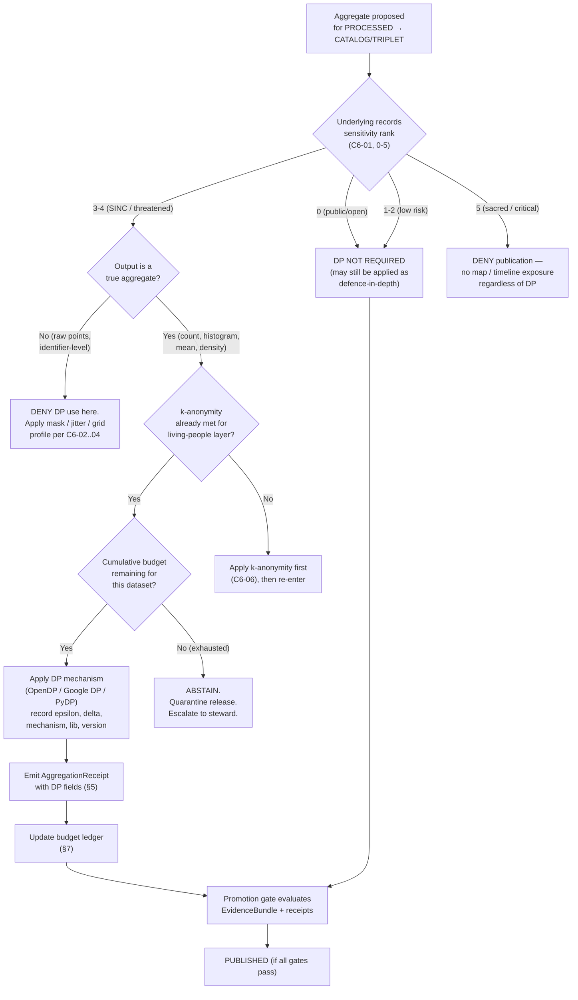

<!-- [KFM_META_BLOCK_V2]
doc_id: kfm://doc/standards/dp-budgets
title: KFM Standard — Differential Privacy Budgets
type: standard
version: v0.1
status: draft
owners: [PLACEHOLDER — privacy-standards-steward, NEEDS VERIFICATION]
created: 2026-05-14
updated: 2026-05-14
policy_label: public
related:
  - docs/standards/SENSITIVITY_RUBRIC.md
  - docs/policy/living_persons_geoprivacy.md
  - docs/runbooks/revocation.md
  - docs/adr/README.md
  - schemas/contracts/v1/receipts/
  - policy/
tags: [kfm, privacy, differential-privacy, dp, aggregates, governance, standards]
notes:
  - Epsilon values in this document are PROPOSED placeholders pending ADR.
  - No KFM default epsilon is committed by the corpus; see §10.
  - This standard aligns with NIST SP 800-226 and EDPB Guidelines 01/2025.
[/KFM_META_BLOCK_V2] -->

# KFM Standard — Differential Privacy Budgets

> The minimum-evidence rules KFM follows when it applies differential privacy to aggregate releases, records DP parameters in receipts, and tracks epsilon consumption across datasets and over time.


| Status | Owners | Authority class | Last reviewed |
|---|---|---|---|
| `draft` · `PROPOSED` | _PLACEHOLDER_ — privacy-standards-steward (`NEEDS VERIFICATION`) | Standards · canonical-when-promoted | 2026-05-14 |

> [!IMPORTANT]
> This document is a **standard**, not a license to publish. Every DP release still passes the
> normal lifecycle and policy gates. The numbers in §6 are **PROPOSED placeholders** until they
> are ratified through an ADR and demonstrated in a worked pilot per **C6-05** / **C9-05**.

---

## Quick jump

- [1. Scope](#1-scope)
- [2. Doctrine — when DP applies and when it does not](#2-doctrine--when-dp-applies-and-when-it-does-not)
- [3. Library choices](#3-library-choices)
- [4. Decision flow](#4-decision-flow)
- [5. Required receipt fields](#5-required-receipt-fields)
- [6. Epsilon budget table (PROPOSED)](#6-epsilon-budget-table-proposed)
- [7. Composition and cross-dataset budgets](#7-composition-and-cross-dataset-budgets)
- [8. Lifecycle placement](#8-lifecycle-placement)
- [9. Sensitivity rubric integration](#9-sensitivity-rubric-integration)
- [10. Framework alignment](#10-framework-alignment)
- [11. Validation](#11-validation)
- [12. Failure modes and anti-patterns](#12-failure-modes-and-anti-patterns)
- [13. Open questions](#13-open-questions)
- [14. Related docs and ADRs](#14-related-docs-and-adrs)
- [Appendix A — Worked example sketch](#appendix-a--worked-example-sketch-illustrative)
- [Appendix B — Receipt fragment schema sketch](#appendix-b--receipt-fragment-schema-sketch-illustrative)

---

## 1. Scope

This standard governs **how Kansas Frontier Matrix applies differential privacy** (DP) to
aggregate releases and **how the DP parameters are tracked** in receipts and across releases.
It is part of a small family of redaction standards alongside the sensitivity rubric, named
redaction profiles, k-anonymity rules for living-people overlays, and consent-token policy.

It does **not** govern:

- Suppression, masking, jittering, gridding, or centroid replacement for **raw points** — those
  are covered by `point_10km_hex_seeded_v1`, `point_3km_jitter_v1`, `centroid_1km_v1`, and the
  sensitivity-rubric profile catalog (see C6-02, C6-03, C6-04).
- k-anonymity rendering for living-people overlays — see C6-06 and
  `docs/policy/living_persons_geoprivacy.md` (**PROPOSED** path).
- Consent-token revocation behavior — see C6-07, C6-08 and `docs/runbooks/revocation.md`
  (**PROPOSED** path).
- Pseudonymisation key handling — covered separately, aligned with EDPB Guidelines 01/2025
  (see §10 and a sibling standard, **PROPOSED**: `docs/standards/PSEUDONYMISATION.md`).

> [!NOTE]
> **CONFIRMED doctrine (C6-05):** "Differential privacy (epsilon-delta) is applied **only**
> to aggregate outputs (counts, heatmaps) using OpenDP, Google DP, or PyDP; raw points are
> **never** DP-noised, and DP parameters (epsilon, delta) are **recorded in receipts**."

---

## 2. Doctrine — when DP applies and when it does not

DP is a mathematical tool that bounds the **leakage of an aggregate** with respect to any single
record's contribution. The KFM corpus is deliberate that DP is **scope-correct only for
aggregate releases**, and that applying DP to raw points is an anti-pattern: the noise either
gets undone by downstream processes or it actively misleads users about precise location.

### 2.1 In scope (DP-eligible)

| Aggregate class | Examples (illustrative) | Default posture |
|---|---|---|
| Count grids / heatmaps | County- or grid-cell counts of occurrence records | DP **REQUIRED** when underlying records are sensitive (rubric ≥ 3 / tier ≥ T1) |
| Histograms / binned distributions | Age-bin counts, year-of-event histograms | DP **REQUIRED** under same trigger |
| Means / totals over sensitive populations | Genealogical aggregates at county scale | DP **REQUIRED** under same trigger |
| k-anonymized density layers | `density_k_anonymity_grid` cell counts | DP **OPTIONAL** — only if the corpus's review concludes DP adds meaningful leakage bounding beyond k-anonymity |

### 2.2 Out of scope (DP is **not** the right tool)

| Output class | Use instead | Why |
|---|---|---|
| Raw point geometry | Mask / jitter / grid / centroid profiles (C6-02, C6-03, C6-04) | DP on points produces noise that misleads; jitter must remain deterministic and reproducible. |
| Living-person overlay rendering | k-anonymity + radius-mask fallback (C6-06) | Density-aware policy, not noise injection. |
| Suppression of small denominators in queries | Threshold disclosure + analysis manifest (KFM-P18-INV-405, **PROPOSED**) | The threshold itself, not noise, is the protection. |
| Identifier-level joins | Pseudonymisation under EDPB 01/2025 (C9-05) | DP does not de-identify; it bounds aggregate leakage. |

> [!WARNING]
> **Anti-pattern:** "We DP-noised the raw points so they're safe to publish." Per C6-05 this is
> a doctrinal violation. Promotion gates **MUST fail closed** when DP is invoked against a
> non-aggregate output, regardless of how the parameters are set.

---

## 3. Library choices

KFM's corpus names three acceptable libraries for DP on aggregate outputs:

- **OpenDP** — preferred for releases that need a formally specified, peer-reviewed
  measurement composition framework.
- **Google DP** — acceptable for engineering-grade implementations of standard mechanisms.
- **PyDP** — Python bindings over Google DP, acceptable where the KFM toolchain is Python-first.

> [!NOTE]
> Selection of library per aggregate class is **NEEDS VERIFICATION** in this session and is
> ADR-class once a worked pilot exists. The receipt MUST record the library name and version
> regardless of which is chosen.

The DP library, its version, and the specific mechanism used (Laplace, Gaussian, exponential,
etc.) are recorded fields in the receipt; see §5.

---

## 4. Decision flow

The flow below describes the **policy decision** the validator and PDP should reach when an
aggregate is proposed for promotion. **PROPOSED** — final wiring depends on schema/contract
homes that an ADR will fix.



> [!NOTE]
> The diagram reflects **CONFIRMED** doctrine for trigger, scope, deny conditions, and receipt
> emission. The specific node placements ("k-anonymity first", "budget exhaustion → ABSTAIN")
> are **PROPOSED** orderings consistent with the corpus's fail-closed posture but **NEEDS
> VERIFICATION** against the live OPA policy bundle when the repo is mounted.

---

## 5. Required receipt fields

Every DP-bearing aggregate release MUST emit an `AggregationReceipt` (per the receipt-family
catalog in the v1.1 Atlas §24.2) carrying — at minimum — the fields below. The receipt is
referenced from the `EvidenceBundle` for the released aggregate and is itself signed and
hashed under the canonical KFM receipt rules.

| Field | Purpose | Source of truth | Status |
|---|---|---|---|
| `dp.library` | Library used: `opendp` \| `google_dp` \| `pydp` | C6-05 | **CONFIRMED requirement** |
| `dp.library_version` | Pinned semantic version of the library | Determinism + auditability | **PROPOSED** |
| `dp.mechanism` | Mechanism: `laplace` \| `gaussian` \| `exponential` \| `<other>` | NIST SP 800-226 §3 (mechanisms) | **PROPOSED** |
| `dp.epsilon` | Per-release epsilon | C6-05, C9-05 | **CONFIRMED requirement** |
| `dp.delta` | Per-release delta (0 for pure ε-DP) | C6-05 | **CONFIRMED requirement** |
| `dp.sensitivity` | L1 / L2 sensitivity of the query | NIST SP 800-226 procedure | **PROPOSED** |
| `dp.query_class` | Aggregate class (e.g. `count_grid`, `histogram`) | KFM aggregate taxonomy (**PROPOSED**) | **PROPOSED** |
| `dp.rationale_ref` | Pointer to the rationale doc / ADR section justifying ε choice | NIST SP 800-226 reporting | **CONFIRMED requirement** |
| `dp.budget_ledger_ref` | Pointer to the dataset's cumulative budget ledger entry | Composition tracking (§7) | **PROPOSED** |
| `dp.input_population_ref` | Pointer to the population / unit of privacy being protected | Disambiguates per-record vs per-user | **PROPOSED** |
| `dp.composition_method` | `sequential` \| `advanced` \| `rdp` \| `<other>` | Composition accountant | **PROPOSED** |
| `policy_label`, `rights_status`, `sensitivity` | Standard KFM bundle fields | EvidenceBundle contract | **CONFIRMED** |

> [!IMPORTANT]
> The exact JSON shape of these fields lives in `schemas/contracts/v1/receipts/` (**NEEDS
> VERIFICATION**: schema home is governed by ADR-0001; receipt-class layout is open as
> ADR-S-03). This document specifies **what must be recorded**, not the wire-level keys.

A short illustrative receipt fragment is in **Appendix B**.

---

## 6. Epsilon budget table (PROPOSED)

> [!CAUTION]
> **The KFM corpus explicitly does not commit specific epsilon values.** Per C6-05 and C9-05,
> "epsilon selection is itself a policy decision; the corpus does not commit to specific
> values," and the Pass 10 dossier lists "Provide concrete DP epsilon values per aggregate
> class" as a **medium-priority missing-evidence item**. The table below is a **PROPOSED
> structure** with **PLACEHOLDER values** to be ratified by ADR. Do not treat any number in
> this table as a default. Numbers are presented only to make the structure reviewable.

| Aggregate class | Per-release ε (placeholder) | Per-release δ (placeholder) | Cumulative ε cap per dataset / period (placeholder) | Rationale anchor |
|---|---|---|---|---|
| County-level genealogical counts | `PLACEHOLDER` | `PLACEHOLDER` | `PLACEHOLDER` / year | NIST SP 800-226 §<TBD> + steward review |
| ZIP-code-level air-quality summaries | `PLACEHOLDER` | `PLACEHOLDER` | `PLACEHOLDER` / quarter | NIST SP 800-226 §<TBD> |
| Township-level biodiversity occurrence counts (sensitive species) | `PLACEHOLDER` | `PLACEHOLDER` | `PLACEHOLDER` / year | C6-05 + KDWP SINC review |
| Grid-cell counts on living-person overlays (after k-anonymity) | `PLACEHOLDER` | `PLACEHOLDER` | `PLACEHOLDER` / release | C6-06 + C6-05 |
| Genealogical aggregate (county scale, after pseudonymisation) | `PLACEHOLDER` | `PLACEHOLDER` | `PLACEHOLDER` / year | C9-05 |

**Rule for filling in:** any concrete value in this table MUST land via an ADR that cites the
specific NIST SP 800-226 procedure step used to choose it, plus a pilot record per the
C6-05 expansion direction.

> [!NOTE]
> Three aggregate classes named above are drawn directly from the Pass 10 dossier's open
> question on epsilon selection (**§9.4** of that dossier). The remaining two rows are
> **INFERRED** from the C6-06 living-people overlay rule and C9-05 framing.

---

## 7. Composition and cross-dataset budgets

DP guarantees compose: each additional release against the same underlying population consumes
more of the privacy budget. **CONFIRMED open question** from C6-05: *"Are there DP budgets that
need to span datasets (e.g. cumulative leakage across heatmap views)?"* This standard records
the **PROPOSED** answer: **yes**, KFM tracks cumulative ε at three scopes.

| Scope | Tracked by | Justification | Status |
|---|---|---|---|
| **Per release** | The `AggregationReceipt` itself | NIST SP 800-226 reporting | **CONFIRMED requirement** |
| **Per dataset / period** | A budget ledger keyed by population + period | Sequential composition over time | **PROPOSED** |
| **Per logical unit of privacy** (e.g., a county-level cohort served by multiple aggregates) | A cross-dataset accountant | Advanced / RDP composition across views | **PROPOSED** |

### 7.1 Ledger placement (PROPOSED)

A budget ledger SHOULD live under `data/registry/` alongside other governance registries
(**PROPOSED** — Directory Rules §6.2 and §9.1 describe a `data/registry/` family that covers
sources, layers, rights, sensitivity, and crosswalks; a dedicated `data/registry/dp_budget/`
sub-tree is the most plausible home and **NEEDS VERIFICATION** against the live tree).

```text
data/registry/dp_budget/                  # PROPOSED
├── README.md
├── populations/<population_id>.yaml      # canonical population / unit of privacy
├── ledger/<population_id>/<period>.yaml  # cumulative ε / δ ledger
└── exhaustion/<population_id>.yaml       # exhaustion notices and steward reviews
```

> [!WARNING]
> **Fail-closed on exhaustion.** When the cumulative ε for a population in the active period
> would be exceeded by a proposed release, the promotion gate MUST return **ABSTAIN** (validator)
> → **DENY** (policy) and quarantine the candidate. A steward override is permitted only via a
> reviewed `PolicyDecision` recorded against the population, never silently.

---

## 8. Lifecycle placement

The DP transform happens during **WORK → PROCESSED** and its receipt is closed at
**PROCESSED → CATALOG/TRIPLET**. Below is the placement against KFM's lifecycle invariant:

> **RAW → WORK / QUARANTINE → PROCESSED → CATALOG / TRIPLET → PUBLISHED**

| Phase | DP responsibility | Required artifact |
|---|---|---|
| RAW | Source admitted; raw records are never DP-noised | `SourceDescriptor` |
| WORK | Aggregate computed; DP mechanism applied; sensitivity computed | `TransformReceipt`; pre-DP intermediate held internally only |
| QUARANTINE | Holds aggregates that fail validation, exceed budget, or fail policy | `ValidationReport(FAIL)`; `PolicyDecision(DENY)` |
| PROCESSED | DP aggregate normalized; `AggregationReceipt` emitted; budget ledger updated | `AggregationReceipt`; `ValidationReport(PASS)` |
| CATALOG / TRIPLET | `EvidenceBundle` closes over the receipt; `EvidenceRef` resolvable | `EvidenceBundle`; `CatalogMatrix` entry |
| PUBLISHED | Aggregate is released via governed API; rollback target recorded | `ReleaseManifest`; `RollbackCard` |

> [!IMPORTANT]
> **Promotion is a governed state transition, not a file move.** A DP aggregate that lands in
> `data/processed/` without the matching `AggregationReceipt` and validated budget ledger
> entry violates the lifecycle invariant regardless of where the bytes are.

---

## 9. Sensitivity rubric integration

The corpus carries two related sensitivity schemes; this standard references both:

| Scheme | Range | Status | Source |
|---|---|---|---|
| **Sensitivity rubric** | 0 – 5 (`sensitivity_rank`) | **CONFIRMED** | C6-01 (`docs/standards/SENSITIVITY_RUBRIC.md`, **PROPOSED** path) |
| **Sensitivity tier** | T0 – T4 | **PROPOSED** (pending ADR-S-05) | Domains Culmination Atlas v1.1 §24.5 |

**PROPOSED mapping (NEEDS VERIFICATION):** while ADR-S-05 is open, this standard treats the
schemes as compatible — rubric `0` ≈ tier `T0` (open), rubric `1–2` ≈ `T0`/`T1`, rubric `3–4` ≈
`T1`/`T2`/`T3` depending on review and named-agreement state, rubric `5` ≈ `T4` (denied). DP
applicability follows the **rubric** because that is the field persisted on every record per
C6-01; tier is the policy-facing summary.

| Rubric | Tier (proposed) | DP posture |
|---|---|---|
| 0 (public/open) | T0 | DP not required; permissible as defence-in-depth on counts. |
| 1 (common non-sensitive) | T0 / T1 | DP not required by default. |
| 2 (watchlist) | T1 | DP **recommended** for any aggregate exposing watchlist subpopulations. |
| 3 (SINC / locally sensitive) | T1 / T2 | DP **REQUIRED** for aggregate publication. |
| 4 (threatened / rare) | T2 / T3 | DP **REQUIRED** + named profile (`profile:sinc-obscure-10km` or stricter); cumulative ε cap is conservative. |
| 5 (sacred / critical) | T4 | DP does **NOT** unlock publication. DENY at policy regardless of ε. |

---

## 10. Framework alignment

| Framework | KFM use | Status |
|---|---|---|
| **NIST SP 800-226** — DP guidance | Procedural framework for selecting parameters, documenting budgets, reporting on DP-released statistics. Each DP release records its epsilon budget and the rationale, traceable to NIST procedure. | **CONFIRMED** (C9-05) |
| **EDPB Guidelines 01/2025** — pseudonymisation under GDPR | Sibling framework for the pseudonymisation path; out of scope for DP per se, in scope for any pseudonymised inputs that feed DP aggregates. | **CONFIRMED** (C9-05) |

> [!NOTE]
> **Conflict surfacing.** Both NIST SP 800-226 and EDPB Guidelines 01/2025 are advisory and
> leave parameter choices to the implementer; neither framework names a default epsilon for
> KFM's use cases. This standard makes the implementer's commitments explicit by requiring
> the rationale anchor in every receipt (see §5, `dp.rationale_ref`).

A worked example pilot — running a sample DP release and publishing the result alongside the
chosen ε and its NIST-anchored rationale — is **the** next concrete proof recommended by both
C6-05 and C9-05. See §13.

---

## 11. Validation

DP-bearing releases must pass the validators below before the catalog-closure gate. These are
**PROPOSED** validator entries; concrete IDs and homes live in `tools/validators/` once an
ADR settles `tools/` validator layout.

| Validator | What it checks | Failure outcome |
|---|---|---|
| `validate_dp_receipt` (PROPOSED) | `AggregationReceipt` contains every §5 required field with a valid library + version + mechanism | **ABSTAIN** → quarantine |
| `validate_dp_scope` (PROPOSED) | The DP-tagged output is an aggregate class (per §2.1), not raw points or identifier-level | **DENY** (anti-pattern) |
| `validate_dp_budget` (PROPOSED) | Proposed ε does not exceed the population's cumulative cap for the active period | **ABSTAIN** → steward escalation |
| `validate_dp_rationale` (PROPOSED) | `dp.rationale_ref` resolves and points to an ADR section or rationale doc | **ABSTAIN** |
| `validate_dp_composition` (PROPOSED) | Composition method declared is consistent with the ledger's accountant | **ABSTAIN** |

Negative fixtures (per Directory Rules §15 and the broader validator contract) MUST exercise
each of DENY, ABSTAIN, and ERROR paths above. **NEEDS VERIFICATION** — fixture homes
(`tests/fixtures/` vs root `fixtures/`) are still open per Directory Rules §13.5.

---

## 12. Failure modes and anti-patterns

<details>
<summary><strong>Expand: DP-specific failure modes and anti-patterns</strong></summary>

| Anti-pattern | Why it fails | Counter-rule |
|---|---|---|
| DP applied to raw point geometry | DP noise on points either gets undone downstream or misleads consumers about precise location. Violates C6-05. | DP is aggregate-only. Raw points go through mask / jitter / grid / centroid profiles. |
| Epsilon chosen "by feel" with no rationale | Produces unauditable releases; violates NIST SP 800-226 reporting expectations. | `dp.rationale_ref` is a required receipt field; rationale anchors to an ADR section. |
| Cumulative budget not tracked | Sequential composition silently exhausts the privacy guarantee across many small releases. | Budget ledger required per §7; promotion fails closed on exhaustion. |
| DP applied as a substitute for k-anonymity on living-people overlays | DP bounds aggregate leakage; it does not enforce density-aware rendering. | k-anonymity first (C6-06); DP is an optional defence-in-depth layer on top, not a replacement. |
| DP applied to identifier-level joins | DP is not de-identification; identifier exposure remains. | Pseudonymisation per C9-05 / EDPB Guidelines 01/2025; DP only on resulting aggregates. |
| Receipt missing library or mechanism | Release is not reproducible; auditor cannot recompute the noise distribution. | `dp.library`, `dp.library_version`, `dp.mechanism` are required. |
| Multiple parallel budget ledgers | Drift; cumulative ε becomes ambiguous; sensitive-population leakage under-reported. | One canonical ledger under `data/registry/dp_budget/` (PROPOSED); any mirror is generated. |
| Treating DP-published numbers as ground truth in downstream analytics | DP outputs are noised by design; downstream pipelines must propagate uncertainty. | Downstream consumers cite the `AggregationReceipt`; analysis manifests record DP origin. |

</details>

---

## 13. Open questions

The items below carry the corpus's explicit "missing evidence" and "open question" notes plus
this standard's additional unknowns:

- **OPEN (from C6-05 / Pass 10 §9.4):** Concrete ε values per aggregate class — county-level
  genealogical counts, ZIP-code-level air-quality summaries, township-level biodiversity counts.
- **OPEN (from C6-05):** Whether DP budgets need to span datasets (cumulative leakage across
  heatmap views). This standard answers **PROPOSED yes** in §7; ratification pending ADR.
- **OPEN (from C9-05):** What is the right epsilon for a county-level genealogical aggregate?
- **NEEDS VERIFICATION:** The schema home for `AggregationReceipt` fields described in §5 —
  governed by ADR-0001 (schema home) and the open ADR-S-03 (receipt-class layout).
- **NEEDS VERIFICATION:** Whether the sensitivity rubric (0–5) and sensitivity tier (T0–T4)
  remain dual schemes after ADR-S-05 or one canonicalizes the other.
- **PROPOSED:** Library selection per aggregate class (OpenDP vs Google DP vs PyDP).
- **PROPOSED:** Composition accountant (sequential / advanced / RDP) per population scope.
- **PROPOSED:** The pilot release that should be the first worked example, per C6-05's
  "Pilot DP on one aggregate layer; track budget consumption."

---

## 14. Related docs and ADRs

- `docs/standards/SENSITIVITY_RUBRIC.md` — **PROPOSED** sibling standard for the 0–5 rubric (C6-01).
- `docs/policy/living_persons_geoprivacy.md` — **PROPOSED** k-anonymity rule (C6-06).
- `docs/runbooks/revocation.md` — **PROPOSED** consent-revocation runbook (C6-08).
- `docs/standards/PSEUDONYMISATION.md` — **PROPOSED** sibling standard for EDPB-aligned pseudonymisation (C9-05).
- `docs/doctrine/directory-rules.md` — placement and authority law.
- `docs/adr/ADR-0001-schema-home.md` — schema home rule.
- ADR-S-03 (PROPOSED) — receipt-class home (`schemas/contracts/v1/receipts/` vs per-domain).
- ADR-S-05 (PROPOSED) — sensitivity tier T0–T4 canonicalization.
- C6-05, C6-06, C9-05 — source ideas in the Pass 10 Idea Index.
- v1.1 Atlas §24.2, §24.5, §24.6 — receipt families, sensitivity tiers, lifecycle gates.

---

## Appendix A — Worked example sketch (illustrative)

<details>
<summary><strong>Expand: illustrative sketch (NOT a default; placeholders only)</strong></summary>

**Scenario (illustrative).** A county-level count grid of biodiversity occurrences of a SINC
species (rubric 3) is proposed for a public heatmap layer.

1. Underlying records carry `sensitivity_rank: 3`. Per §9, DP is **REQUIRED**.
2. The aggregate class is `count_grid` (in scope per §2.1).
3. The living-people pathway is **not applicable** here, so k-anonymity precedence (§4) does
   not trigger.
4. Budget ledger for the species population shows `epsilon_consumed_in_period: <placeholder>`,
   `epsilon_cap: <placeholder>`. Proposed release ε is checked against the remaining budget.
5. Mechanism: Laplace; sensitivity: 1 (counting query); ε: `<placeholder>`; δ: 0.
6. The `AggregationReceipt` is emitted with every §5 field. `dp.rationale_ref` points to the
   ADR section justifying the species-population ε per NIST SP 800-226.
7. Catalog closure forms the `EvidenceBundle`; `EvidenceRef` resolves; promotion proceeds.
8. The `ReleaseManifest` records the rollback target; `RollbackCard` is pre-staged.

This sketch is **illustrative**. Numbers, mechanism choice, and gate orderings must be set by
the ratifying ADR and the C6-05 pilot.

</details>

---

## Appendix B — Receipt fragment schema sketch (illustrative)

<details>
<summary><strong>Expand: illustrative AggregationReceipt fragment (illustrative; not the wire schema)</strong></summary>

```json
{
  "schema_version": "v1",
  "object_type": "AggregationReceipt",
  "policy_label": "public",
  "rights_status": "open",
  "sensitivity": "T1",
  "spec_hash": "<jcs-sha256-of-canonicalized-spec>",
  "evidence_refs": ["<source-evidence-ref-1>", "<source-evidence-ref-2>"],
  "aggregate": {
    "query_class": "count_grid",
    "geometry": "h3_resolution_<n>",
    "denominator_policy": "<ref>"
  },
  "dp": {
    "library": "opendp",
    "library_version": "<pinned-semver>",
    "mechanism": "laplace",
    "epsilon": "<placeholder>",
    "delta": 0,
    "sensitivity": 1,
    "query_class": "count_grid",
    "rationale_ref": "kfm://adr/<id>#<section>",
    "budget_ledger_ref": "data/registry/dp_budget/ledger/<population_id>/<period>.yaml",
    "input_population_ref": "data/registry/dp_budget/populations/<population_id>.yaml",
    "composition_method": "sequential"
  },
  "run_receipt_ref": "<RunReceipt EvidenceRef>",
  "decision_log_id": "<decision-id>",
  "created": "<RFC3339 timestamp>"
}
```

This fragment is **illustrative**. Field names, casing, and nesting are governed by the receipt
schema once its home is fixed (ADR-0001 + ADR-S-03). The fields in §5 are the **requirements**;
this fragment shows one plausible shape.

</details>

---

> [!NOTE]
> **Compliance note.** This document expresses **doctrine and required structure**, not a
> license. A team that publishes a DP aggregate without the §5 receipt fields, without a
> rationale anchor, or without a ledger entry has not satisfied this standard — even if the
> mathematics is correct.

---

**Related docs:** [Sensitivity rubric](./SENSITIVITY_RUBRIC.md) · [Living-people geoprivacy](../policy/living_persons_geoprivacy.md) · [Revocation runbook](../runbooks/revocation.md) · [Directory Rules](../doctrine/directory-rules.md) · [ADR index](../adr/README.md)

**Last updated:** 2026-05-14 · **Status:** draft · **Authority:** standard (PROPOSED-to-publish)

[⬆ Back to top](#kfm-standard--differential-privacy-budgets)
