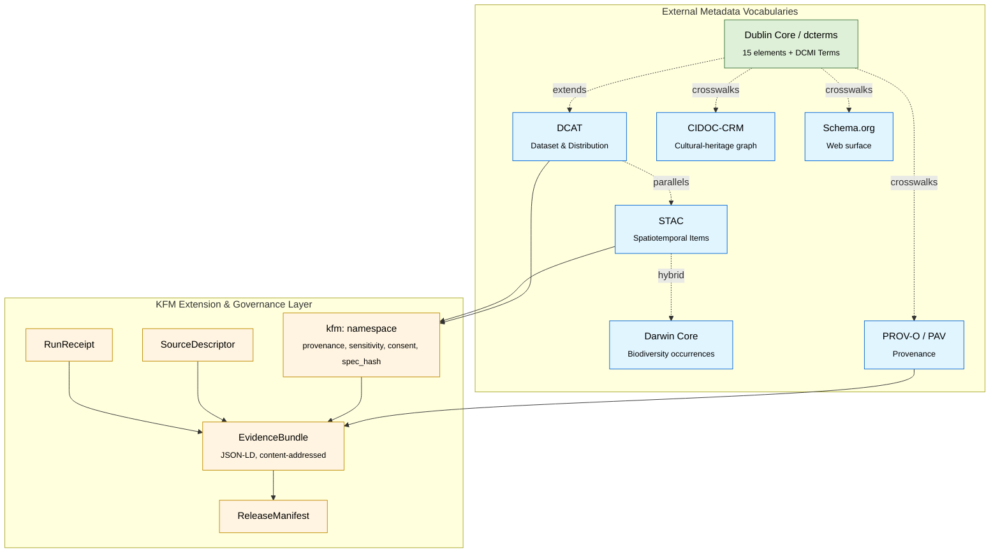

<!-- [KFM_META_BLOCK_V2]
doc_id: kfm://doc/standards-dublin-core
title: Dublin Core (DCMI Metadata Terms) — KFM Standards Profile
type: standard
version: v0.1-draft
status: draft
owners: <kfm-standards-stewards>  # TODO: bind to CODEOWNERS
created: 2026-05-14
updated: 2026-05-14
policy_label: public
related:
  - docs/standards/README.md
  - docs/standards/STAC_DWC_PROFILE.md
  - docs/standards/DCAT.md
  - docs/standards/PROV.md
  - docs/standards/SCHEMA_ORG.md
  - docs/doctrine/directory-rules.md
  - docs/adr/
tags: [kfm, standards, metadata, dublin-core, dcterms, dcmi, fair, interop]
notes:
  - PROPOSED throughout — the KFM corpus does not name Dublin Core directly.
  - Inferred relationship via DCAT (C4-05, CONFIRMED) which extends dcterms.
[/KFM_META_BLOCK_V2] -->

# Dublin Core (DCMI Metadata Terms) — KFM Standards Profile

How the Kansas Frontier Matrix relates to, conforms with, and extends the **DCMI Metadata Terms** vocabulary (a.k.a. Dublin Core / `dcterms:`) inside its evidence-first catalog stack.


| Field | Value |
|---|---|
| **Status** | `draft` · **PROPOSED throughout** |
| **Authority level** | implementation-bearing (canonical standards profile when promoted) |
| **Owners** | `<kfm-standards-stewards>` — *TODO: bind to CODEOWNERS* |
| **Last reviewed** | 2026-05-14 |
| **ADRs** | *TODO: ADR-DC-01 — Adopt a KFM Dublin Core Application Profile?* |

> [!IMPORTANT]
> **This document is PROPOSED in its entirety.** The KFM project corpus does **not** directly name Dublin Core / DCMI Metadata Terms among its first-class metadata standards. Dublin Core enters the KFM stack **indirectly** as the substrate vocabulary that **DCAT** (which the corpus does adopt — Idea Index C4-05, CONFIRMED) extends. Every KFM-specific mapping, profile element, conformance level, and policy gate below is a design proposal until ADR-confirmed and verified against a mounted repository.

---

## 🧭 Contents

- [1 · Scope and Purpose](#1--scope-and-purpose)
- [2 · Position in the KFM Standards Stack](#2--position-in-the-kfm-standards-stack)
- [3 · What Dublin Core Is (External Reference)](#3--what-dublin-core-is-external-reference)
- [4 · KFM's Relationship to Dublin Core](#4--kfms-relationship-to-dublin-core)
- [5 · The Two Namespaces: `dc:` vs `dcterms:`](#5--the-two-namespaces-dc-vs-dcterms)
- [6 · The 15 Elements and DCMI Metadata Terms](#6--the-15-elements-and-dcmi-metadata-terms)
- [7 · DCMI Type Vocabulary](#7--dcmi-type-vocabulary)
- [8 · Proposed KFM ↔ `dcterms:` Field Mapping](#8--proposed-kfm--dcterms-field-mapping)
- [9 · Integration with STAC, DCAT, PROV-O, CIDOC-CRM, Schema.org](#9--integration-with-stac-dcat-prov-o-cidoc-crm-schemaorg)
- [10 · Worked Example (Illustrative)](#10--worked-example-illustrative)
- [11 · Conformance, Profile, and Validation](#11--conformance-profile-and-validation)
- [12 · Governance, Rights, and Policy Implications](#12--governance-rights-and-policy-implications)
- [13 · Open Questions and Verification Backlog](#13--open-questions-and-verification-backlog)
- [14 · Related Documents](#14--related-documents)
- [15 · References (External)](#15--references-external)
- [Appendix A · Full `dcterms:` Property List (Reference)](#appendix-a--full-dcterms-property-list-reference)
- [Appendix B · DCMI Type Vocabulary URIs](#appendix-b--dcmi-type-vocabulary-uris)

---

## 1 · Scope and Purpose

This document is the **PROPOSED KFM standards profile for Dublin Core / DCMI Metadata Terms**. It explains:

- What Dublin Core is, in the form KFM consumes it (`dcterms:`).
- Why Dublin Core matters to KFM even though the project corpus does not name it as a primary standard.
- A **PROPOSED** mapping between Dublin Core properties and KFM's object families — `SourceDescriptor`, `EvidenceBundle`, `ReleaseManifest`, `RunReceipt`, and catalog records.
- How Dublin Core relates to the standards the KFM corpus does confirm — **STAC**, **DCAT**, **Darwin Core**, **PROV-O / PAV**, **CIDOC-CRM**, and **Schema.org**.
- The conformance and validation surface KFM should require before publishing `dcterms:`-bearing catalog records.

> [!NOTE]
> **Doctrine basis (CONFIRMED):** the `docs/standards/` directory is the canonical home for "external standards KFM conforms to (STAC, DCAT, PROV, etc.)" per [`docs/doctrine/directory-rules.md`](../doctrine/directory-rules.md) §6.1. This file's placement follows that pattern; the file itself is new (PROPOSED) until added to the repository.

[Back to top ↑](#-contents)

---

## 2 · Position in the KFM Standards Stack

The KFM catalog and evidence layer composes several vocabularies. Dublin Core sits at the **base** as the shared, low-specificity descriptive substrate; richer vocabularies (DCAT, STAC, DwC, CIDOC-CRM) refine it for specific resource families. The `kfm:` namespace and `EvidenceBundle` sit on top, carrying KFM-specific provenance and governance.



> [!NOTE]
> **PROPOSED** — this diagram reflects the doctrinal relationship implied by the corpus's adoption of DCAT (C4-05) and DCAT's documented dependency on `dcterms:`. KFM has not authored an explicit Dublin Core profile; the position above is design-time inference.

[Back to top ↑](#-contents)

---

## 3 · What Dublin Core Is (External Reference)

**EXTERNAL.** Dublin Core is a general-purpose metadata vocabulary for describing resources of any type, maintained by the **Dublin Core Metadata Initiative (DCMI)**. It originated at a 1995 invitational workshop in Dublin, Ohio, was first defined as fifteen elements in 1998, and was redefined as an RDF vocabulary in 2008.

**EXTERNAL.** The vocabulary lives in two namespaces:

- **`http://purl.org/dc/elements/1.1/`** (prefix **`dc:`**) — the legacy fifteen-element **Dublin Core Metadata Element Set (DCMES)**.
- **`http://purl.org/dc/terms/`** (prefix **`dcterms:`**) — the broader **DCMI Metadata Terms**, which restates the 15 elements (as subproperties of the `dc:` ones, with formal domains and ranges) plus several dozen properties, classes, datatypes, and vocabulary encoding schemes.

**EXTERNAL.** The fifteen-element subset is endorsed in standards bodies as **IETF RFC 5013**, **ANSI/NISO Z39.85**, and **ISO 15836**. See [§15 References](#15--references-external).

> [!TIP]
> **Implementer guidance (EXTERNAL, per DCMI):** for new metadata, prefer `dcterms:` over the legacy `dc:` namespace — `dcterms:` properties carry formal domains and ranges and are recommended for machine-processable metadata. KFM **SHOULD** (PROPOSED) adopt `dcterms:` by default and fall back to `dc:` only when interoperating with legacy harvest endpoints (OAI-PMH, older library catalogs).

[Back to top ↑](#-contents)

---

## 4 · KFM's Relationship to Dublin Core

> [!IMPORTANT]
> **CONFIRMED — corpus silence.** The attached KFM doctrinal sources (Unified Implementation Architecture Build Manual, Idea Index Pass 10 and Pass 18, MapLibre Master, Whole-UI / Governed AI Expansion Report, Domains Culmination Atlas, KFM Encyclopedia, Directory Rules) do not directly name Dublin Core or DCMI Metadata Terms.
>
> **INFERRED — indirect adoption.** Dublin Core nonetheless enters the KFM stack as the **substrate vocabulary of DCAT**, which the corpus does adopt (Pass 10 Idea Index, **C4-05 DCAT Distribution, CONFIRMED**). DCAT models reuse `dcterms:title`, `dcterms:description`, `dcterms:issued`, `dcterms:modified`, `dcterms:publisher`, `dcterms:license`, `dcterms:rights`, `dcterms:identifier`, and related properties.

### 4.1 · Why this profile exists

| Reason | Status |
|---|---|
| KFM uses DCAT for non-spatiotemporal catalog entries (entity bundles, rights records, policy bundles, schema artifacts). DCAT depends on `dcterms:`. | CONFIRMED for DCAT adoption (C4-05); INFERRED for the `dcterms:` dependency. |
| Library, archive, and open-data partners (data.gov, regional clearinghouses, OAI-PMH endpoints) expect Dublin Core records as a common interoperability floor. | PROPOSED rationale — no specific partner commitment is recorded in the corpus. |
| Crosswalks from `dcterms:` to PROV-O, CIDOC-CRM, MODS, DataCite, and Schema.org are published by DCMI and the community, and can support KFM's existing graph vocabularies. | EXTERNAL — DCMI publishes such crosswalks. |
| Source rights, licensing, and citation metadata in `SourceDescriptor` and `ReleaseManifest` benefit from a stable, widely-recognized vocabulary for `rights`, `license`, `creator`, `publisher`, `bibliographicCitation`. | PROPOSED operational benefit. |
| FAIR (C15.b, CONFIRMED) requires findable, accessible, interoperable, reusable metadata. Dublin Core supplies the lowest-common-denominator F-A-I-R substrate that external aggregators can read. | INFERRED from FAIR principles + DCMI scope. |

### 4.2 · What this profile is NOT

- **NOT** an authority over KFM-specific semantics. KFM domain meaning lives in the `kfm:` namespace, `EvidenceBundle`, `SourceDescriptor`, and the contracts under `contracts/`.
- **NOT** a replacement for STAC, DCAT, Darwin Core, CIDOC-CRM, or PROV-O. Dublin Core is a **substrate**, not a replacement.
- **NOT** sufficient on its own for any KFM catalog record. `dcterms:` fields supplement, never replace, KFM provenance fields (`kfm:spec_hash`, `kfm:evidence_bundle_ref`, `kfm:run_record_ref`, `kfm:audit_ref`, `kfm:policy_digest`).

[Back to top ↑](#-contents)

---

## 5 · The Two Namespaces: `dc:` vs `dcterms:`

DCMI maintains the original fifteen properties in both forms. KFM should pick one as the canonical default.

| Aspect | `dc:` (legacy DCMES) | `dcterms:` (DCMI Metadata Terms) |
|---|---|---|
| Namespace URI | `http://purl.org/dc/elements/1.1/` | `http://purl.org/dc/terms/` |
| First released | 1998 | 2008 (RDF rework); editorially maintained |
| Formal domains / ranges | No | Yes |
| Subproperty relation | — | `dcterms:creator rdfs:subPropertyOf dc:creator` |
| Standards endorsement | IETF RFC 5013; ISO 15836; ANSI/NISO Z39.85 | Same, plus DCMI Metadata Terms |
| **KFM preference (PROPOSED)** | **Compatibility only** | **Default** |

> [!NOTE]
> The PROPOSED KFM default is **`dcterms:`**. The `dc:` namespace is retained only when an external endpoint (e.g., legacy OAI-PMH harvest) cannot accept the `dcterms:` form. Internal records should never carry both for the same value, since divergence between them is a source of drift.

[Back to top ↑](#-contents)

---

## 6 · The 15 Elements and DCMI Metadata Terms

The original Dublin Core Metadata Element Set (DCMES) consists of fifteen properties, each optional and repeatable.

| Element | Definition (DCMI, EXTERNAL, paraphrased) | Typical KFM use (PROPOSED) |
|---|---|---|
| `dcterms:title` | A name given to the resource. | Human title of a dataset, layer, story node, document. |
| `dcterms:creator` | An entity primarily responsible for making the resource. | Source authority, model identity, or steward who authored the artifact. |
| `dcterms:subject` | The topic of the resource. | Controlled subject keywords; bind to KFM domain-lane tags where possible. |
| `dcterms:description` | An account of the resource. | Catalog-card description; abstract for the dataset / collection. |
| `dcterms:publisher` | An entity responsible for making the resource available. | KFM project, partner org, or steward org. |
| `dcterms:contributor` | An entity responsible for making contributions to the resource. | Reviewers, secondary authorities, derivation contributors. |
| `dcterms:date` | A point or period of time in the resource lifecycle. | ISO 8601 / EDTF; prefer the refinements below. |
| `dcterms:type` | The nature or genre of the resource. | DCMI Type Vocabulary value — see [§7](#7--dcmi-type-vocabulary). |
| `dcterms:format` | The file format, physical medium, or dimensions. | IANA media type (`image/tiff; application=geotiff`, `application/vnd.pmtiles`, etc.). |
| `dcterms:identifier` | An unambiguous reference to the resource. | KFM content-addressed URI (`kfm://entity-bundle/<sha256>`), DOI, ARK. |
| `dcterms:source` | A related upstream resource. | Upstream source identifier from `SourceDescriptor`. |
| `dcterms:language` | A language of the resource. | BCP 47 tag (`en`, `en-US`, `es`). |
| `dcterms:relation` | A related resource. | Links to `EvidenceBundle`, related STAC Collection, related Distribution. |
| `dcterms:coverage` | The spatial or temporal topic, applicability, or jurisdiction. | Named place / bbox / time range; prefer the `spatial` / `temporal` refinements. |
| `dcterms:rights` | Information about rights held in and over the resource. | Free-text rights statement; pair with `dcterms:license`. |

**DCMI Metadata Terms** extends DCMES with refinements such as `dcterms:created`, `dcterms:modified`, `dcterms:issued`, `dcterms:available`, `dcterms:valid`, `dcterms:license`, `dcterms:accessRights`, `dcterms:isPartOf`, `dcterms:hasPart`, `dcterms:isVersionOf`, `dcterms:replaces`, `dcterms:conformsTo`, `dcterms:provenance`, `dcterms:bibliographicCitation`, and `dcterms:rightsHolder`. See [Appendix A](#appendix-a--full-dcterms-property-list-reference).

[Back to top ↑](#-contents)

---

## 7 · DCMI Type Vocabulary

The **DCMI Type Vocabulary** provides a small, general typology for `dcterms:type`. Recommended values for KFM artifacts (PROPOSED):

| DCMI Type | When a KFM artifact should use it (PROPOSED) |
|---|---|
| `Dataset` | Tabular, vector, raster, or aggregated datasets (STAC Items, GeoParquet, COG, PMTiles, occurrence tables). |
| `Image` | Photographs, scanned maps, archival imagery, glyph/sprite assets. |
| `StillImage` | Specifically still photographic content — prefer over `Image` when applicable. |
| `MovingImage` | Animations, video, time-lapse outputs (e.g., hydrology / climate visualizations). |
| `Text` | Documents, reports, ADRs, doctrine docs, source documents in the archive lane. |
| `Software` | Tools, validators, generators, pipelines bound to a `ReleaseManifest`. |
| `Service` | Governed API endpoints, tile services, catalog endpoints. |
| `Collection` | A STAC Collection, a domain dossier, a thematic atlas. |
| `Event` | Person-place-event graph entries (mapped through CIDOC-CRM E5 Event). |
| `PhysicalObject` | Museum / archive specimens referenced through SNAC / EAC-CPF authority records. |
| `InteractiveResource` | Story Nodes, Focus Mode session captures, interactive map widgets. |
| `Sound` | Audio archives — oral histories, environmental recordings. |

Full type URIs are listed in [Appendix B](#appendix-b--dcmi-type-vocabulary-uris).

[Back to top ↑](#-contents)

---

## 8 · Proposed KFM ↔ `dcterms:` Field Mapping

PROPOSED mapping between KFM object families and `dcterms:` properties. This is the **conformance core** of the profile.

### 8.1 · `SourceDescriptor` → `dcterms:`

| KFM field<br/>(PROPOSED schema home: `schemas/contracts/v1/source/source-descriptor.json`) | `dcterms:` property | Notes |
|---|---|---|
| `source_id` | `dcterms:identifier` | KFM URN / content address. |
| `title` | `dcterms:title` | Human-readable. |
| `description` | `dcterms:description` | Abstract; reviewer notes. |
| `authority` | `dcterms:publisher` *or* `dcterms:creator` | Pick by role — authority-as-producer vs. authority-as-publisher. |
| `rights_statement` | `dcterms:rights` | Free-text. |
| `license` | `dcterms:license` | Stable URI; SPDX where possible. |
| `access_url` | `dcat:accessURL` | DCAT, not `dcterms:` — included here for completeness. |
| `cadence` / `temporal_coverage` | `dcterms:temporal` | EDTF or ISO 8601 period. |
| `spatial_coverage` | `dcterms:spatial` | Named place or coordinate set; prefer Getty TGN where available. |
| `language` | `dcterms:language` | BCP 47. |
| `source_role` | `kfm:source_role` (extension) | **Not** a `dcterms:` concept — do not force-fit. |

### 8.2 · `EvidenceBundle` (catalog facet) → `dcterms:`

| KFM field | `dcterms:` property | Notes |
|---|---|---|
| `kfm:id` / `kfm:spec_hash` | `dcterms:identifier` | The hash **is** the identifier. |
| `kfm:title` | `dcterms:title` | |
| `kfm:created_at` | `dcterms:created` | ISO 8601. |
| `kfm:modified_at` | `dcterms:modified` | |
| `kfm:released_at` | `dcterms:issued` | Release event timestamp. |
| `kfm:sources[*].url` | `dcterms:source` | Per-source citations. |
| `kfm:rights` | `dcterms:rights` | |
| `kfm:license` | `dcterms:license` | |
| `kfm:conforms_to` | `dcterms:conformsTo` | URI of the KFM evidence-bundle profile. |
| `kfm:replaces` | `dcterms:replaces` | For corrected / superseded bundles — pair with `CorrectionNotice`. |
| `kfm:run_receipt_ref` | `dcterms:provenance` *(short summary)* or `prov:wasGeneratedBy` *(canonical)* | **Prefer PROV-O for the machine-checkable chain.** |

### 8.3 · `ReleaseManifest` → `dcterms:`

| KFM field | `dcterms:` property | Notes |
|---|---|---|
| `release_id` | `dcterms:identifier` | |
| `released_at` | `dcterms:issued` | |
| `withdrawn_at` (when applicable) | `kfm:withdrawn_at` | `dcterms:` has no native withdrawal term — PROPOSED to keep in `kfm:`. |
| `release_notes` | `dcterms:description` | |
| `bibliographic_citation` | `dcterms:bibliographicCitation` | Free-form citation string for users. |
| `rollback_card_ref` | `kfm:rollback_target` | No `dcterms:` equivalent. |

> [!WARNING]
> **Mapping is not equality.** A `dcterms:` property and a KFM contract field can carry the same value while serving very different governance roles. KFM semantics — the binding force of `spec_hash`, the immutability of a `RunReceipt`, the audit chain in `kfm:audit_ref`, the gating of `PromotionDecision` — is **not** captured by `dcterms:`. Treat `dcterms:` as the **discovery / interoperability projection** of KFM records, **never** as the source of truth.

[Back to top ↑](#-contents)

---

## 9 · Integration with STAC, DCAT, PROV-O, CIDOC-CRM, Schema.org

| Standard | KFM corpus status | Relationship to Dublin Core (PROPOSED in KFM context) |
|---|---|---|
| **STAC** | CONFIRMED — C4-01 Items, C4-02 Collections, with `kfm:provenance`. | STAC has its own properties; `dcterms:` can mirror at Collection level (`dcterms:license`, `dcterms:rights`, `dcterms:publisher`). PROPOSED: include a minimal `dcterms:` block on every STAC Collection for non-STAC consumers. |
| **DCAT** | CONFIRMED — C4-05 Dataset + Distribution. | **Direct dependency.** DCAT reuses `dcterms:` wholesale. KFM DCAT records inherit the `dcterms:` profile defined here. |
| **Darwin Core (DwC)** | CONFIRMED — C4-03 STAC × DwC hybrid for biodiversity occurrences. | Limited crosswalk (`dwc:eventDate` ≈ `dcterms:temporal`; `dwc:scientificName` has no `dcterms:` equivalent). PROPOSED: do **not** force-map DwC into `dcterms:` — let them coexist on the same Item. |
| **PROV-O / PAV** | CONFIRMED — C8-03 Provenance vocabulary. | DCMI publishes a crosswalk to PROV-O. PROPOSED: prefer PROV-O for the full provenance chain; use `dcterms:provenance` only as a short text summary for discovery. |
| **CIDOC-CRM** | CONFIRMED — C8-01 cultural-heritage backbone (E5 Event, E7 Activity, E21 Person, E53 Place, E55 Type, E74 Group). | Established crosswalks to DCMI Types exist. PROPOSED: graph projections may surface `dcterms:` on the catalog face while CRM remains the internal model. |
| **Schema.org** | CONFIRMED — C8-02 web-discoverable surface. | Schema.org includes most `dcterms:` equivalents (`schema:name` ≈ `dcterms:title`; `schema:license` ≈ `dcterms:license`). PROPOSED: emit both on public surfaces for SEO + library discovery. |

[Back to top ↑](#-contents)

---

## 10 · Worked Example (Illustrative)

> [!NOTE]
> **Illustrative only.** This snippet is a design sketch — not a record drawn from a mounted KFM repository. Field names, namespace prefixes, and exact placement are PROPOSED.

A DCAT `Distribution` for a KFM evidence bundle, surfacing the `dcterms:` profile alongside KFM provenance fields:

```json
{
  "@context": [
    "https://www.w3.org/ns/dcat.jsonld",
    {
      "dcterms": "http://purl.org/dc/terms/",
      "kfm":     "https://kfm.example.org/ns/v1#"
    }
  ],
  "@id":   "kfm:dataset/hydrology/streamgauge-snapshot-2025q4",
  "@type": "dcat:Dataset",

  "dcterms:title":        "Kansas Streamgauge Snapshot — Q4 2025",
  "dcterms:description":  "Quarterly aggregated streamgauge readings for Kansas HUC-8 basins.",
  "dcterms:identifier":   "kfm://entity-bundle/sha256-<digest>",
  "dcterms:publisher":    { "@id": "kfm:org/kfm-project" },
  "dcterms:creator":      [ { "@id": "kfm:authority/usgs-water" } ],
  "dcterms:issued":       "2026-01-15",
  "dcterms:modified":     "2026-02-04",
  "dcterms:license":      "https://creativecommons.org/publicdomain/zero/1.0/",
  "dcterms:rights":       "Public domain (U.S. Government work).",
  "dcterms:spatial":      { "@id": "https://www.geonames.org/4273857/" },
  "dcterms:temporal":     "2025-10-01/2025-12-31",
  "dcterms:type":         "http://purl.org/dc/dcmitype/Dataset",
  "dcterms:conformsTo":   "https://kfm.example.org/profiles/evidence-bundle/v1",
  "dcterms:provenance":   "Generated by kfm-pipelines/hydrology@v1.4.2; see kfm:run_receipt_ref.",
  "dcterms:bibliographicCitation":
    "Kansas Frontier Matrix (2026). Kansas Streamgauge Snapshot — Q4 2025. kfm://entity-bundle/sha256-<digest>.",

  "dcat:distribution": [
    {
      "@type": "dcat:Distribution",
      "dcterms:title":     "Evidence Bundle (JSON-LD)",
      "dcat:mediaType":    "application/ld+json",
      "dcterms:conformsTo":"https://kfm.example.org/profiles/evidence-bundle/v1",
      "dcat:accessURL":    "kfm://entity-bundle/sha256-<digest>"
    }
  ],

  "kfm:spec_hash":        "sha256-<digest>",
  "kfm:evidence_ref":     "kfm://entity-bundle/sha256-<digest>",
  "kfm:run_receipt_ref":  "kfm://run-receipt/<id>",
  "kfm:policy_digest":    "sha256-<policy-digest>",
  "kfm:release_manifest": "kfm://release-manifest/<id>"
}
```

Notes on the example:

- `dcterms:identifier` and `kfm:spec_hash` carry the **same content-addressed digest**. KFM treats the digest as authoritative; `dcterms:` exposes it for interop.
- `dcterms:provenance` is a short human-readable summary; the **machine-checkable** provenance chain lives in `kfm:run_receipt_ref` and `prov:wasGeneratedBy`.
- `dcterms:conformsTo` points to the **KFM evidence-bundle profile URI** — not to `dcterms:` itself. The KFM profile is the entity that asserts which `dcterms:` fields are required.
- All sample URIs (`kfm:...`, `kfm.example.org`) are illustrative; production URIs are PROPOSED and depend on registry decisions not yet made.

[Back to top ↑](#-contents)

---

## 11 · Conformance, Profile, and Validation

### 11.1 · PROPOSED conformance levels

| Level | Required `dcterms:` fields | Use case |
|---|---|---|
| **DC-MINIMAL** | `identifier`, `title`, `type` | Internal catalog entries (CATALOG phase, not yet PUBLISHED). |
| **DC-DISCOVERY** | DC-MINIMAL + `description`, `issued`, `publisher`, `license`, `rights` | Published artifacts intended for partner discovery (data.gov, regional clearinghouses). |
| **DC-CITATION** | DC-DISCOVERY + `creator`, `bibliographicCitation`, `conformsTo` | Citable releases referenced from external publications. |
| **DC-FULL** | DC-CITATION + `spatial`, `temporal`, `source[]`, `provenance`, `isPartOf`, `replaces` *(when applicable)* | Long-term archival / open-data clearinghouse submissions. |

### 11.2 · PROPOSED validators and tests

- **`tools/validators/dcterms-profile/`** *(PROPOSED path — no current-session repository evidence confirms it)* — checks DC-MINIMAL / DISCOVERY / CITATION / FULL conformance against a record.
- **Negative-state fixtures under `tests/fixtures/standards/dublin-core/invalid/`** *(PROPOSED)* — at minimum:
  - missing `dcterms:identifier`
  - mismatched `dcterms:type` (not in DCMI Type Vocabulary)
  - unresolvable `dcterms:license` URI
  - malformed `dcterms:temporal` (not ISO 8601 / EDTF)
  - `dc:` and `dcterms:` divergent on the same value
- **Promotion gate** — PROPOSED gate that fails closed when a record claims a conformance level it does not satisfy. Integrates with **C5-02 Default-Deny Promotion** (CONFIRMED in the Idea Index).
- **CI / runtime parity** — PROPOSED that the same OPA / Conftest bundle gate `dcterms:` conformance in CI and at runtime, per **C5-03 Policy Parity** (CONFIRMED).
- **Spec-hash binding** — PROPOSED that `dcterms:identifier` containing a KFM URI must agree with `kfm:spec_hash` and survive the **C5-04 Spec-Hash-Match Gate** (CONFIRMED).

### 11.3 · Anti-patterns to refuse

> [!CAUTION]
> Each of the following has caused real harm in adjacent metadata systems and is explicitly refused under KFM's evidence-first doctrine.

- ❌ Treating a `dcterms:`-rich record as a substitute for a KFM `EvidenceBundle`, `RunReceipt`, or `ReleaseManifest`.
- ❌ Letting `dcterms:provenance` displace `prov:wasGeneratedBy` / `kfm:run_receipt_ref` as the canonical provenance chain.
- ❌ Publishing a catalog record with `dcterms:license` set but `dcterms:rights` ambiguous, or vice versa.
- ❌ Allowing `dc:` and `dcterms:` to diverge on the same value within one record.
- ❌ Mapping KFM domain semantics (sensitivity tier, source role, consent status) into a generic `dcterms:` property and treating that as governance.
- ❌ Stripping `kfm:` provenance fields in order to make a record "Dublin-Core-clean."

[Back to top ↑](#-contents)

---

## 12 · Governance, Rights, and Policy Implications

> [!CAUTION]
> Dublin Core fields **describe** rights and licensing — they do not **enforce** them. KFM's enforcement layer is `policy/` (CONFIRMED canonical singular per Directory Rules §5), backed by `EvidenceBundle` + `SourceDescriptor` + policy decisions. `dcterms:` is the **discovery surface** for those decisions, never their substitute.

| Concern | KFM canonical mechanism | Dublin Core surface (PROPOSED) |
|---|---|---|
| Rights status | `SourceDescriptor.rights_statement` + policy gate | `dcterms:rights`, `dcterms:rightsHolder` |
| License | `SourceDescriptor.license` (SPDX where possible) | `dcterms:license` |
| Sensitivity tier (0–5; C6-01 CONFIRMED) | `kfm:sensitivity` extension; policy gates | **None** — do **NOT** encode sensitivity in `dcterms:rights` |
| FAIR + CARE (C15 CONFIRMED) | `kfm:care` block; review state; release gate | `dcterms:` carries the FAIR substrate; CARE remains in `kfm:` |
| Sovereignty / community authority | `policy/rights/`, steward review | None in `dcterms:`; surface only as a free-text summary in `dcterms:rights` |
| Embargo / staged access | Policy gate + `RollbackCard` if revoked | `dcterms:accessRights`, `dcterms:available` |
| Citation form | `ReleaseManifest.bibliographic_citation` | `dcterms:bibliographicCitation` |

### 12.1 · The Dumb-Down rule, applied to KFM

**EXTERNAL** — DCMI's **Dumb-Down Principle** says that an application unable to interpret a qualified Dublin Core element should fall back to the unqualified parent without loss of correctness. Applied to KFM (PROPOSED):

1. An external consumer that does not understand `kfm:sensitivity` MUST still see `dcterms:rights` and `dcterms:license` and behave correctly.
2. An external consumer that does not understand `dcterms:bibliographicCitation` MUST still see `dcterms:title` + `dcterms:creator` + `dcterms:identifier` and be able to cite the record.
3. Loss of **specificity** is acceptable under dumb-down. Loss of **policy-relevant** information is **not** — sensitive content MUST NOT degrade through dumb-down into a public-safe-looking record.

> [!IMPORTANT]
> The third clause is the KFM addition. CARE-class content (rare-species locations, living-person genealogical data, archaeological precise locations, infrastructure detail) MUST never be rendered safe-looking by the removal of KFM-specific tags. The trust membrane and policy gate enforce this **before** the record reaches a public surface — `dcterms:` is irrelevant to that decision.

[Back to top ↑](#-contents)

---

## 13 · Open Questions and Verification Backlog

| # | Question | PROPOSED disposition |
|---|---|---|
| Q1 | Does KFM publish a formal Dublin Core Application Profile (DCAP), or does it inherit `dcterms:` only via DCAT? | **ADR-DC-01** — author a thin KFM DCAP that pins required fields per artifact family. |
| Q2 | Should `dcterms:identifier` carry the KFM content-addressed URI or a separate DOI / ARK? | Both — `dcterms:identifier` as a list with at least the KFM URI; DOI / ARK added on first external citation event. |
| Q3 | How does `dcterms:replaces` interact with `CorrectionNotice` and `RollbackCard`? | `dcterms:replaces` mirrors public-facing supersession; `CorrectionNotice` and `RollbackCard` remain the governance objects. Needs ADR. |
| Q4 | Which `dcterms:` refinements are mandatory at the **PROCESSED → CATALOG** promotion vs. only at **CATALOG → PUBLISHED**? | DC-MINIMAL at PROCESSED → CATALOG; DC-DISCOVERY or higher at CATALOG → PUBLISHED. Needs ADR. |
| Q5 | Should KFM standardize on `dcterms:` exclusively, or maintain `dc:` parallel fields for legacy OAI-PMH endpoints? | `dcterms:` only internally; emit `dc:` parallels only at OAI-PMH egress adapters in `runtime/adapters/`. |
| Q6 | Does the KFM `dcterms:` profile need its own JSON Schema, or is OPA / Rego enforcement sufficient? | Both — JSON Schema under `schemas/contracts/v1/common/dcterms-profile.schema.json` (per ADR-0001) plus OPA bundle. NEEDS VERIFICATION against repo conventions. |
| Q7 | How does this profile interact with FAIR + CARE (C15)? | `dcterms:` supplies the FAIR substrate; CARE remains in `kfm:care`. The two MUST be co-validated. |
| Q8 | Should the KFM DCAP register on the DCMI profiles registry? | Optional — defer until the profile is stable and a partner request justifies registration. |

[Back to top ↑](#-contents)

---

## 14 · Related Documents

> [!NOTE]
> Most paths below are PROPOSED — they describe the intended companion documents, not files known to exist in the repository. Items marked CONFIRMED were inspected in this session.

- `docs/standards/README.md` — orientation for `docs/standards/` *(PROPOSED — TODO: confirm presence)*
- `docs/standards/STAC_DWC_PROFILE.md` — STAC × Darwin Core profile *(PROPOSED — referenced in Idea Index C4-03 expansion direction)*
- `docs/standards/DCAT.md` — DCAT profile *(PROPOSED)*
- `docs/standards/PROV.md` — PROV-O / PAV profile *(PROPOSED)*
- `docs/standards/SCHEMA_ORG.md` — Schema.org surface profile *(PROPOSED)*
- [`docs/doctrine/directory-rules.md`](../doctrine/directory-rules.md) — directory governance *(CONFIRMED — mounted in current session)*
- `docs/adr/ADR-DC-01-dublin-core-application-profile.md` *(PROPOSED ADR — not yet authored)*
- `contracts/source/source-descriptor.md` — `SourceDescriptor` semantics *(PROPOSED path)*
- `schemas/contracts/v1/common/dcterms-profile.schema.json` *(PROPOSED schema home per ADR-0001)*
- `tools/validators/dcterms-profile/` — conformance validators *(PROPOSED)*

[Back to top ↑](#-contents)

---

## 15 · References (External)

These references support the Dublin Core / DCMI claims in this document. They are **EXTERNAL** — they describe the standard, not KFM's repository state. Inline `[EXTERNAL]` markers throughout the document point here.

1. **DCMI Metadata Terms** — DCMI authoritative specification.
   <https://www.dublincore.org/specifications/dublin-core/dcmi-terms/>
2. **Dublin Core™ Metadata Element Set, Version 1.1** — DCMI reference description.
   <https://www.dublincore.org/specifications/dublin-core/dces/>
3. **IETF RFC 5013** — Dublin Core Metadata for Resource Discovery.
   <https://www.ietf.org/rfc/rfc5013.html>
4. **ANSI/NISO Z39.85** — The Dublin Core Metadata Element Set.
5. **ISO 15836** — Information and documentation — The Dublin Core metadata element set.
6. **DCMI Type Vocabulary** — <http://purl.org/dc/dcmitype/>
7. **DCMI namespace policy** — <https://www.dublincore.org/specifications/dublin-core/dcmi-namespace/>
8. **DCMI crosswalks** (PROV-O, CIDOC-CRM, MODS, DataCite) — published via the DCMI documentation portal.

[Back to top ↑](#-contents)

---

## Appendix A · Full `dcterms:` Property List (Reference)

<details>
<summary><strong>Click to expand the full list of common <code>dcterms:</code> properties (EXTERNAL, paraphrased; KFM relevance is PROPOSED)</strong></summary>

| Property | Definition (short, paraphrased) | KFM relevance (PROPOSED) |
|---|---|---|
| `dcterms:title` | A name given to the resource. | High |
| `dcterms:alternative` | An alternative title. | Medium |
| `dcterms:creator` | An entity primarily responsible. | High |
| `dcterms:contributor` | A contributing entity. | Medium |
| `dcterms:publisher` | An entity that makes the resource available. | High |
| `dcterms:rightsHolder` | A person or organization owning rights. | High (pair with `dcterms:rights`) |
| `dcterms:date` | A point or period in the lifecycle. | Medium — prefer the refinements below |
| `dcterms:created` | Date of creation. | High |
| `dcterms:modified` | Date the resource was changed. | High |
| `dcterms:issued` | Date of formal issuance. | High (release date) |
| `dcterms:available` | Date when the resource becomes available. | Medium |
| `dcterms:valid` | Date or range of validity. | Medium (hazards, regulatory) |
| `dcterms:dateAccepted` | Date of acceptance (review). | Medium |
| `dcterms:dateCopyrighted` | Date of copyright. | Low |
| `dcterms:dateSubmitted` | Date of submission. | Low |
| `dcterms:type` | Nature / genre. | High — bind to DCMI Type Vocabulary |
| `dcterms:format` | File format, medium, dimensions. | High — IANA media types |
| `dcterms:extent` | Size or duration. | Medium |
| `dcterms:medium` | Material or physical carrier. | Low (archives only) |
| `dcterms:identifier` | Unambiguous reference. | High |
| `dcterms:source` | Related upstream resource. | High |
| `dcterms:language` | A language of the resource. | High |
| `dcterms:relation` | A related resource. | Medium |
| `dcterms:isVersionOf` / `hasVersion` | Versioning relation. | High (releases) |
| `dcterms:replaces` / `isReplacedBy` | Supersession. | High (corrections / rollbacks) |
| `dcterms:isPartOf` / `hasPart` | Containment. | High (Collections ↔ Items) |
| `dcterms:references` / `isReferencedBy` | Citation relation. | High |
| `dcterms:requires` / `isRequiredBy` | Dependency. | Medium |
| `dcterms:conformsTo` | Profile / spec the resource conforms to. | High |
| `dcterms:coverage` | Spatial or temporal topic / applicability. | Medium — prefer `spatial` / `temporal` |
| `dcterms:spatial` | Spatial topic. | High |
| `dcterms:temporal` | Temporal topic. | High |
| `dcterms:rights` | Rights statement. | High |
| `dcterms:license` | Legal license. | High |
| `dcterms:accessRights` | Access status / restrictions. | High (CARE-adjacent) |
| `dcterms:provenance` | Statement about provenance. | Medium — prefer PROV-O for the chain |
| `dcterms:bibliographicCitation` | A bibliographic citation. | High |
| `dcterms:description` | Account of the resource. | High |
| `dcterms:abstract` | A summary. | High |
| `dcterms:tableOfContents` | A list of subunits. | Low |
| `dcterms:subject` | Topic. | Medium — prefer controlled subject vocabularies |
| `dcterms:audience` | Audience refinements. | Low |
| `dcterms:educationLevel` | Pedagogical level. | Low |
| `dcterms:mediator` | Audience mediator. | Low |
| `dcterms:instructionalMethod` | Pedagogical method. | Low |

</details>

[Back to top ↑](#-contents)

---

## Appendix B · DCMI Type Vocabulary URIs

<details>
<summary><strong>Click to expand: DCMI Type Vocabulary URIs (EXTERNAL)</strong></summary>

| URI | Label |
|---|---|
| `http://purl.org/dc/dcmitype/Collection` | Collection |
| `http://purl.org/dc/dcmitype/Dataset` | Dataset |
| `http://purl.org/dc/dcmitype/Event` | Event |
| `http://purl.org/dc/dcmitype/Image` | Image |
| `http://purl.org/dc/dcmitype/InteractiveResource` | InteractiveResource |
| `http://purl.org/dc/dcmitype/MovingImage` | MovingImage |
| `http://purl.org/dc/dcmitype/PhysicalObject` | PhysicalObject |
| `http://purl.org/dc/dcmitype/Service` | Service |
| `http://purl.org/dc/dcmitype/Software` | Software |
| `http://purl.org/dc/dcmitype/Sound` | Sound |
| `http://purl.org/dc/dcmitype/StillImage` | StillImage |
| `http://purl.org/dc/dcmitype/Text` | Text |

</details>

[Back to top ↑](#-contents)

---

> **Last reviewed:** 2026-05-14 · **Status:** Draft · **PROPOSED throughout**
> **Related:** `docs/standards/` · [`docs/doctrine/directory-rules.md`](../doctrine/directory-rules.md) · `contracts/` · `schemas/contracts/v1/`
> [Back to top ↑](#-contents)
