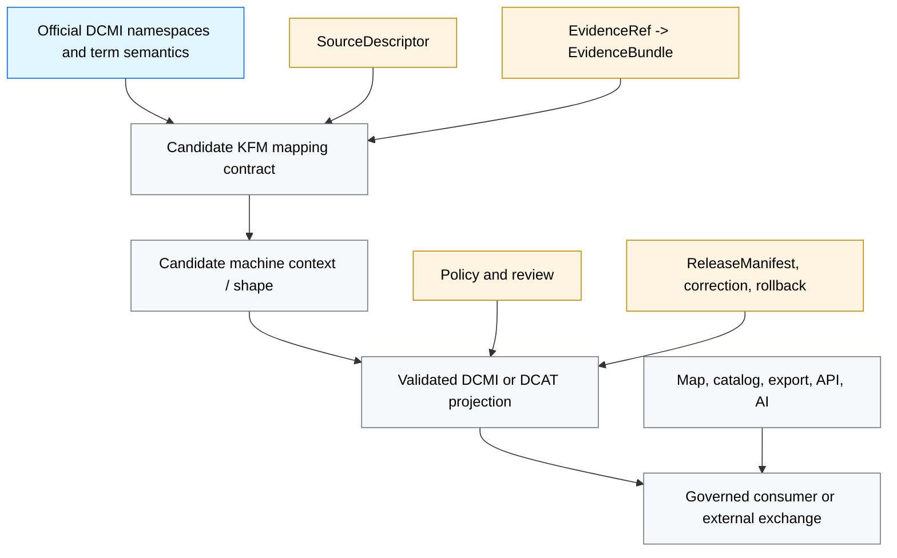

<!-- [KFM_META_BLOCK_V2]
doc_id: kfm://doc/standards-dublin-core
title: Dublin Core / DCMI Metadata Terms — KFM Mapping Boundary and Conformance Plan
type: standard; vocabulary-guidance; interoperability-boundary
version: v2.0-draft
status: "draft; repository-grounded; upstream-currentness-refreshed; no-adoption; no-generic-profile; no-release; no-publication"
owners:
  - "@bartytime4life — verified GitHub review route through CODEOWNERS"
  - "NEEDS VERIFICATION — catalog-metadata, archival-interoperability, source, rights/sensitivity, schema/validation, and release stewards"
created: 2026-05-14
updated: 2026-08-18
policy_label: repository-facing
owning_root: docs/
current_path: docs/standards/DUBLIN-CORE.md
responsibility: >
  Explain the official DCMI Metadata Terms baseline, the bounded KFM mapping
  candidates and current repository evidence, and the gates required before KFM
  may claim a Dublin Core application profile, machine conformance, release, or
  public interoperability.
truth_posture: >
  CONFIRMED current path, accepted standards-lane placement, CODEOWNERS route,
  selected current KFM schemas and bounded consumers, and official DCMI
  currentness / PROPOSED KFM application profile, mapping rules, namespace,
  context, shapes, validators, fixtures, producers, consumers, and graduation
  sequence / UNKNOWN adopted KFM Dublin Core profile, generic machine profile,
  complete producer-consumer coverage, released conformant record, public
  endpoint, and external interoperability.
evidence_snapshot:
  repository: bartytime4life/Kansas-Frontier-Matrix
  base_ref: main
  base_commit: 31503aaadcf430499c5e3181f759db6b582a84c0
  target_prior_blob: ee17d2dc6e1707057391afd8183540b589f519b4
  standards_readme_blob: a8cbe5d183448d5f0de37f8a4eacd6fcaca0d71b
  directory_rules_blob: fd49a0b83e55cef52c1124281f093e263526898d
  directory_rules_adr_blob: a4de0d7a96b78da59cfc499d1025e1508afd8dd9
  codeowners_blob: dd2a84aa514d8ecd9208bc347f90f9a2ed37dd61
  source_descriptor_schema_blob: 582e70b834278c3c6ca9a8b31efbe0989c96f0bc
  source_descriptor_contract_blob: b57ae5ccc042c1423b75c168438800384c9b6713
  evidence_bundle_schema_blob: cf5256831b63dca46a5f68b168441adcf68b8751
  run_receipt_schema_blob: c930ff0fd4da34d8b4ff202d9fd576110258974c
  release_manifest_schema_blob: c76cd9bdddb34cf33c8eb62801269553726c5923
  catalog_distribution_mapping_schema_blob: 24aad672a673a3ad489cfb1419a1d78f3be6c930
  synthetic_catalog_closure_schema_blob: dcb2ecb202ec9b576dc6607f3aa488b3567ceffe
  flora_dwc_normalizer_blob: 59e51631eb047656774f6650fa1341da5120ccde
external_currentness_review:
  access_date: 2026-08-18
  official_baseline: "DCMI Metadata Terms, DCMI Recommendation, current version dated 2020-01-20"
  namespace_policy: "Four approved DCMI namespaces; persistent term URIs"
  iso_baselines:
    - "ISO 15836-1:2017 — original fifteen-element set"
    - "ISO 15836-2:2019 — broader DCMI properties and classes"
related:
  - ./README.md
  - ./DCAT.md
  - ./PROV-O.md
  - ./PROV.md
  - ./CIDOC-CRM.md
  - ./SCHEMA-ORG.md
  - ./ARCHIVAL-STANDARDS.md
  - ./OAI-PMH.md
  - ./oai-pmh.md
  - ../doctrine/directory-rules.md
  - ../adr/ADR-0029-adopt-directory-governance-standard-v2.md
  - ../../contracts/source/source_descriptor.md
  - ../../schemas/contracts/v1/source/source_descriptor.schema.json
  - ../../schemas/contracts/v1/evidence/evidence_bundle.schema.json
  - ../../schemas/contracts/v1/runtime/run_receipt.schema.json
  - ../../schemas/contracts/v1/release/release_manifest.schema.json
  - ../../schemas/contracts/v1/data/catalog_distribution_mapping_profile.schema.json
  - ../../schemas/contracts/v1/data/synthetic_release_catalog_closure_profile.schema.json
  - ../../packages/domains/flora/normalizers/dwc_occurrence.py
  - ../../.github/CODEOWNERS
tags: [kfm, standards, metadata, dublin-core, dcmi, dcterms, dctypes, dcat, interoperability, evidence, conformance]
notes:
  - "Same-path documentation modernization only; no contract, schema, policy, source, fixture, validator, workflow, runtime, release, or publication surface changes."
  - "The prior whole-page PROPOSED and no-repository posture is replaced with commit-pinned repository evidence and a separate upstream-currentness review."
  - "The repository has bounded uses of DCMI terms but no generic KFM Dublin Core application profile, JSON-LD context, RDF shape, validator family, or public endpoint established by this review."
  - "The prior claim that dcterms:identifier and spec_hash are generally the same identifier is withdrawn; mapping requires object-family identity semantics."
  - "The prior DC-MINIMAL / DC-DISCOVERY / DC-CITATION / DC-FULL levels remain design lineage, not current KFM conformance levels."
[/KFM_META_BLOCK_V2] -->

<a id="top"></a>
<a id="dublin-core-dcmi-metadata-terms--kfm-standards-profile"></a>

# Dublin Core / DCMI Metadata Terms — KFM Mapping Boundary and Conformance Plan

> **Operating rule.** DCMI Metadata Terms can make KFM resources easier to discover, cite, and exchange. They cannot make source material authoritative, evidence sufficient, rights clear, policy satisfied, review complete, or an artifact released or public.

[](https://www.dublincore.org/specifications/dublin-core/dcmi-terms/)
[](#1--scope-and-purpose)
[](#4--kfms-relationship-to-dublin-core)
[](#11--conformance-profile-and-validation)
[](#12--governance-rights-and-policy-implications)

> [!IMPORTANT]
> **A standards page is not an application profile or conformance proof.** This document does not adopt Dublin Core, create a KFM namespace or JSON-LD context, define machine-valid shape, activate a source, approve a release, or prove that a producer and consumer interoperate.

> [!CAUTION]
> **Current repository evidence is bounded.** One no-network Darwin Core normalizer accepts `dcterms:license` and `dcterms:rightsHolder` as source-field aliases. Current synthetic STAC/DCAT/PROV closure schemas carry bounded internal catalog tuples. Neither surface establishes a generic KFM DCMI profile, RDF/JSON-LD emitter, shape, validator, public catalog, or released conformant record.

> [!WARNING]
> **Metadata projection must not collapse KFM authority.** `dcterms:rights`, `dcterms:license`, `dcterms:provenance`, `dcterms:identifier`, or `dcterms:accessRights` may describe a resource. They do not replace `SourceDescriptor`, `EvidenceRef`, `EvidenceBundle`, policy, review, receipts, proofs, `ReleaseManifest`, correction, or rollback.

| Field | Current bounded result |
|---|---|
| **Evidence snapshot** | `main@31503aaadcf430499c5e3181f759db6b582a84c0` |
| **Directory result** | `PLACE` at the existing `docs/standards/DUBLIN-CORE.md` path. Accepted ADR-0029 assigns human-readable standards guidance to `docs/standards/`. |
| **Upstream baseline** | **CONFIRMED:** DCMI Metadata Terms, DCMI Recommendation, current version dated 2020-01-20; checked 2026-08-18 |
| **ISO relationship** | **CONFIRMED upstream:** ISO 15836-1:2017 covers the original fifteen-element set; ISO 15836-2:2019 covers the broader useful properties and classes |
| **Document authority** | Human-readable upstream reference, mapping boundary, current-state disclosure, and verification plan only |
| **KFM adoption state** | **UNKNOWN / not established:** no accepted KFM Dublin Core application profile was identified |
| **Generic machine profile** | **NOT ESTABLISHED:** no generic KFM DCMI context, schema/shape, fixture family, validator, producer, or consumer was established by bounded repository search |
| **Bounded implementation evidence** | Flora Darwin Core normalizer aliases for license/rights holder; synthetic DCAT carrier and release-closure packets with no general `dcterms:` profile |
| **Review route** | `@bartytime4life` through repository-default CODEOWNERS; accountable specialist stewardship and independent review remain **NEEDS VERIFICATION** |
| **Release/publication effect** | None |

<a id="-contents"></a>

**Quick navigation:** [Scope](#1--scope-and-purpose) · [Stack](#2--position-in-the-kfm-standards-stack) · [Upstream](#3--what-dublin-core-is-external-reference) · [Repository](#4--kfms-relationship-to-dublin-core) · [Namespaces](#5--the-two-namespaces-dc-vs-dcterms) · [Terms](#6--the-15-elements-and-dcmi-metadata-terms) · [Types](#7--dcmi-type-vocabulary) · [Mappings](#8--proposed-kfm--dcterms-field-mapping) · [Composition](#9--integration-with-stac-dcat-prov-o-cidoc-crm-schemaorg) · [Example](#10--worked-example-illustrative) · [Conformance](#11--conformance-profile-and-validation) · [Rights](#12--governance-rights-and-policy-implications) · [Backlog](#13--open-questions-and-verification-backlog) · [Related](#14--related-documents) · [References](#15--references-external) · [Properties](#appendix-a--full-dcterms-property-list-reference) · [Types appendix](#appendix-b--dcmi-type-vocabulary-uris)

---

<a id="1--scope-and-purpose"></a>

## 1 · Scope and Purpose

### 1.1 What this page owns

This page owns human-readable guidance for:

- the official DCMI Metadata Terms baseline and namespace posture;
- the distinction among the original Dublin Core Metadata Element Set, the broader DCMI Metadata Terms, and the DCMI Type Vocabulary;
- current KFM repository evidence involving DCMI terms;
- candidate mappings from current KFM object fields to DCMI discovery metadata;
- boundaries among DCMI, DCAT, STAC, Darwin Core, PROV-O, CIDOC CRM, Schema.org, source admission, evidence, policy, review, and release;
- the evidence required before KFM may claim an application profile or conformance; and
- upstream-currentness and repository-verification backlog.

### 1.2 What this page does not own

| Question | Owning authority |
|---|---|
| Where this guidance belongs | Accepted [`ADR-0029`](../adr/ADR-0029-adopt-directory-governance-standard-v2.md), adopted [`directory-rules.md`](../doctrine/directory-rules.md), and [`docs/standards/README.md`](./README.md) |
| What a KFM source, evidence, receipt, release, or catalog object means | Accepted semantic contracts under `contracts/` |
| What machine shape is valid | Current schemas and accepted profile decisions under `schemas/` |
| What is allowed, denied, restricted, generalized, held, or abstained | `policy/`, source terms, sensitivity controls, and governed review |
| Whether a source may be activated or harvested | Source admission, rights review, `SourceDescriptor`, source registry, and connector controls |
| Whether evidence supports a claim | `EvidenceRef` resolution to `EvidenceBundle` and applicable evidence authorities |
| Whether code implements a profile | Exact-revision code, configuration, contexts, shapes, fixtures, validators, tests, and observed producers/consumers |
| Whether an artifact may release or publish | Evidence/proof closure, policy, authorized review, release, correction, withdrawal, and rollback records |
| What DCMI terms normatively mean | The official DCMI specifications and namespace policy |

### 1.3 Non-effects

This same-path revision does **not**:

- adopt a KFM Dublin Core Application Profile;
- create or reserve a KFM namespace, profile IRI, JSON-LD context, RDF shape, or public endpoint;
- modify `SourceDescriptor`, `EvidenceBundle`, `RunReceipt`, `ReleaseManifest`, catalog-closure schemas, or another object family;
- turn `dcterms:` terms into KFM object fields;
- assign a source, rights status, sensitivity class, review state, or release state;
- activate OAI-PMH, DCAT, archival, biodiversity, or other connectors;
- create fixtures, validators, tests, workflows, catalogs, receipts, proofs, or release artifacts;
- assert external interoperability; or
- release, deploy, promote, publish, or change repository settings.

[Back to top](#top)

---

<a id="2--position-in-the-kfm-standards-stack"></a>

## 2 · Position in the KFM Standards Stack

DCMI terms are a general descriptive vocabulary. In a future KFM application profile they could serve as a **discovery projection** over already-governed KFM objects. They must remain downstream of source, evidence, policy, review, and release authority.


```mermaid
flowchart TD
    A["Official DCMI namespaces and term semantics"] --> B["Candidate KFM mapping contract"]
    B --> C["Candidate machine context / shape"]
    C --> D["Validated DCMI or DCAT projection"]
    D --> E["Governed consumer or external exchange"]

    S["SourceDescriptor"] --> B
    V["EvidenceRef -> EvidenceBundle"] --> B
    P["Policy and review"] --> D
    R["ReleaseManifest, correction, rollback"] --> D

    X["Map, catalog, export, API, AI"] --> E

    classDef external fill:#e1f5ff,stroke:#0969da,color:#000;
    classDef authority fill:#fff4e1,stroke:#bf8b00,color:#000;
    classDef candidate fill:#f6f8fa,stroke:#6e7781,color:#000;
    class A external;
    class S,V,P,R authority;
    class B,C,D,E,X candidate;
```

The diagram is an architecture boundary, not runtime evidence. The mapping contract, machine context/shape, general producer, and governed consumer in the center are not established as current KFM surfaces.

### 2.1 Current bounded seams

| Seam | Current evidence | Safe conclusion |
|---|---|---|
| Darwin Core source normalization | [`dwc_occurrence.py`](../../packages/domains/flora/normalizers/dwc_occurrence.py) recognizes `dcterms:license` and `dcterms:rightsHolder` as input aliases | Bounded import compatibility exists for two fields in one no-network WORK-candidate normalizer |
| DCAT carrier mapping | [`catalog_distribution_mapping_profile.schema.json`](../../schemas/contracts/v1/data/catalog_distribution_mapping_profile.schema.json) aligns internal STAC/DCAT/PROV carrier tuples | One fixture-only DCAT carrier seam exists; it does not emit a DCMI profile |
| Synthetic release catalog closure | [`synthetic_release_catalog_closure_profile.schema.json`](../../schemas/contracts/v1/data/synthetic_release_catalog_closure_profile.schema.json) checks seven synthetic STAC/DCAT/PROV projections | Bounded cross-profile identity/rights/release consistency exists; public serving is explicitly false |
| Source and evidence objects | Current SourceDescriptor and EvidenceBundle schemas contain fields that a future projection could map | Object presence does not establish a mapping contract or permission to add `dcterms:` members |
| Standards documentation | DCAT, PROV, CIDOC CRM, Schema.org, archival, OAI-PMH, and related pages are tracked | Documentation presence does not prove synchronized adoption, executable conformance, or consumers |

[Back to top](#top)

---

<a id="3--what-dublin-core-is-external-reference"></a>

## 3 · What Dublin Core Is (External Reference)

### 3.1 Official baseline

The official **DCMI Metadata Terms** document is a DCMI Recommendation and identifies its current version as 2020-01-20. It covers all DCMI-maintained properties, classes, vocabulary encoding schemes, and syntax encoding schemes.

| Upstream surface | Current result |
|---|---|
| Current recommendation | [DCMI Metadata Terms](https://www.dublincore.org/specifications/dublin-core/dcmi-terms/) |
| Dated version | [2020-01-20 Recommendation](https://www.dublincore.org/specifications/dublin-core/dcmi-terms/2020-01-20/) |
| Release history | [DCMI Metadata Terms release history](https://www.dublincore.org/specifications/dublin-core/dcmi-terms/release_history/) |
| Namespace governance | [DCMI Namespace Policy](https://www.dublincore.org/specifications/dublin-core/dcmi-namespace/) |
| Original element-set context | [Dublin Core Metadata Element Set](https://www.dublincore.org/specifications/dublin-core/dces/) |
| Standards history | [Dublin Core specifications overview](https://www.dublincore.org/specifications/dublin-core/) |
| ISO relationship | ISO 15836-1:2017 and ISO 15836-2:2019 |

Upstream currentness establishes what DCMI publishes. It does not establish KFM adoption, profile compatibility, rights, or implementation.

### 3.2 Terminology used here

| Term | Meaning in this page |
|---|---|
| **Dublin Core Metadata Element Set / DCMES** | The original fifteen properties in `http://purl.org/dc/elements/1.1/` |
| **DCMI Metadata Terms** | The broader term set in `http://purl.org/dc/terms/`, plus the DCMI-maintained classes and encoding schemes described by the Recommendation |
| **DCMI Type Vocabulary** | Twelve high-level classes in `http://purl.org/dc/dcmitype/` |
| **Dublin Core Application Profile / DCAP** | A community profile that selects terms, constraints, value vocabularies, and implementation rules for a stated use case |
| **KFM mapping candidate** | A proposed relationship between one current KFM field and one DCMI term; not equality and not adopted conformance |
| **KFM DCMI profile** | A future accepted contract, machine profile, fixtures, validator, producer/consumer binding, and governance record; not established by this page |

### 3.3 Standard history correction

The former edition compressed several different standards generations into one statement. The current official DCMI overview records:

- RFC 5791 (2010) as the latest RFC update for the element set;
- ANSI/NISO Z39.85-2012;
- ISO 15836-1:2017 for the original element set; and
- ISO 15836-2:2019 for the broader useful DCMI properties and classes.

Historical RFC 5013 remains relevant to earlier Dublin Core metadata work, but it is not the current standards-history summary used by this page.

[Back to top](#top)

---

<a id="4--kfms-relationship-to-dublin-core"></a>

## 4 · KFM's Relationship to Dublin Core

### 4.1 Repository-grounded current state

| Surface | CONFIRMED state | Boundary |
|---|---|---|
| This page | Tracked at the requested path; prior blob `ee17d2dc6e1707057391afd8183540b589f519b4` was dated 2026-05-14 and treated the whole profile as proposal-era design | Same-path reconciliation is warranted |
| [`docs/standards/README.md`](./README.md) | Defines this lane as mixed-maturity human-readable standards guidance | The lane is placement authority for guidance, not DCMI adoption |
| [`DCAT.md`](./DCAT.md) | Documents W3C DCAT 3 and current bounded synthetic catalog seams | DCAT uses DCMI terms upstream, but current KFM schemas are not a general RDF/DCMI profile |
| [`SourceDescriptor`](../../schemas/contracts/v1/source/source_descriptor.schema.json) | Rich closed source-admission shape with structured rights, citation, cadence, access, review, and release fields | A future projection must be role-aware; the schema does not admit arbitrary `dcterms:` members |
| [`EvidenceBundle`](../../schemas/contracts/v1/evidence/evidence_bundle.schema.json) | Closed schema requiring evidence, citations, rights, sensitivity, checksums, and `spec_hash` | It has no title/date/JSON-LD graph slot; do not embed a DCMI graph without a versioned shape change |
| [`RunReceipt`](../../schemas/contracts/v1/runtime/run_receipt.schema.json) | Closed process receipt shape with inputs, outputs, implementation reference, hashes, source-descriptor refs, validation refs, and outcome | DCMI is not the process-provenance authority; PROV and receipt semantics remain separate |
| [`ReleaseManifest`](../../schemas/contracts/v1/release/release_manifest.schema.json) | Dual-profile schema; strict profile is fixture-only and `PROPOSED_INACTIVE` | Its title, IDs, temporal, artifact, and lineage fields are not automatically DCMI terms |
| Flora normalizer | Two DCMI aliases are accepted for source rights metadata | Import aliases do not define export semantics or KFM conformance |
| Generic DCMI machine surface | Bounded search did not establish a context, shape/schema, validator, fixture family, general emitter, general consumer, or public endpoint | Generic implementation remains **UNKNOWN / NOT ESTABLISHED** |

### 4.2 What current evidence does not support

Current evidence does not support claims that:

- KFM has adopted a Dublin Core Application Profile;
- every DCAT record emitted by KFM is a DCMI-conformant RDF record;
- `dcterms:identifier` is always identical to `spec_hash`, a content digest, a release ID, or an object IRI;
- KFM stores both `dc:` and `dcterms:` values;
- EvidenceBundle is currently JSON-LD;
- a DCMI profile validator exists;
- OAI-PMH connectors or egress adapters are active;
- a public catalog or archive endpoint exposes KFM Dublin Core metadata; or
- partner systems have successfully harvested or interpreted KFM records.

### 4.3 Why a future profile may still be useful

A bounded application profile may be justified when a verified consumer requires:

- DCAT RDF using DCMI properties;
- archival or library metadata exchange;
- citation metadata for released resources;
- a low-specificity discovery projection over richer KFM objects; or
- a standards-based bridge to a specific catalog, repository, or preservation system.

Consumer need, source-native profile, rights, shape, validation, correction, and rollback must be explicit. “Dublin Core is common” is not enough to create a profile.

[Back to top](#top)

---

<a id="5--the-two-namespaces-dc-vs-dcterms"></a>

## 5 · The Two Namespaces: `dc:` vs `dcterms:`

### 5.1 Four approved DCMI namespaces

| Namespace URI | Suggested prefix | Role |
|---|---|---|
| `http://purl.org/dc/elements/1.1/` | `dc` | Original fifteen-element DCMES |
| `http://purl.org/dc/terms/` | `dcterms` or `dct` | Broader properties, classes, and encoding schemes |
| `http://purl.org/dc/dcmitype/` | `dctype` | DCMI Type Vocabulary classes |
| `http://purl.org/dc/dcam/` | `dcam` | Terms used to describe DCMI terms |

In 2008 the original fifteen elements were mirrored in the `/terms/` namespace with formal semantic constraints. DCMI says most users can treat the fifteen parallel properties as equivalent, supports `/elements/1.1/` indefinitely, and gently encourages `/terms/`.

### 5.2 KFM candidate namespace posture

No KFM-wide namespace decision is accepted here. A future profile should follow these bounded rules:

1. **Preserve source-native identity.** An imported `dc:title` remains evidence about what the source emitted; do not rewrite RAW bytes.
2. **Normalize only under a declared profile.** A transformer may map a source-native property to a target property when the mapping, loss posture, and receipt are versioned.
3. **Do not emit contradictory parallels.** If an egress profile requires both `dc:title` and `dcterms:title`, generate them from one governed value and test equality.
4. **Use canonical term spelling.** DCMI term names are case-sensitive; emit the exact URI or canonical compact term.
5. **Do not fetch remote contexts implicitly.** Any runtime context or vocabulary dependency must be pinned, admitted, cached or packaged as required, and tested without turning a network lookup into truth.
6. **Keep KFM governance fields separate.** Source role, sensitivity, consent, review, release, `spec_hash`, correction, and rollback are not generic DCMI fields.
7. **Record profile and version.** A record cannot claim conformance to an unnamed, moving, or placeholder profile.

### 5.3 Import compatibility versus canonical export

| Operation | Safe posture |
|---|---|
| Source ingest | Accept only explicit aliases required by the source adapter; retain source term and value |
| Internal canonical objects | Use their accepted KFM contract/schema; do not add DCMI fields merely for convenience |
| Catalog projection | Emit a versioned DCMI/DCAT profile from governed source objects |
| Legacy exchange | Emit `dc:` only when a verified consumer or source-native protocol requires it |
| Modern RDF profile | Prefer `dcterms:` where the accepted profile and consumer support it |
| Public export | Require source, evidence, rights, policy, review, release, correction, and rollback closure independently of vocabulary validity |

[Back to top](#top)

---

<a id="6--the-15-elements-and-dcmi-metadata-terms"></a>

## 6 · The 15 Elements and DCMI Metadata Terms

The original fifteen DCMES properties remain useful as a discovery floor. Their use is contextual: the described resource, catalog record, distribution, source record, and release artifact can have different creators, dates, rights, and identifiers.

### 6.1 Original fifteen properties

| Property | Upstream meaning, paraphrased | KFM boundary |
|---|---|---|
| `dcterms:title` | Name given to the resource | Candidate descriptive projection; not KFM identity |
| `dcterms:creator` | Entity primarily responsible for making the resource | Must distinguish source creator, transformer, catalog author, and release authority |
| `dcterms:subject` | Topic of the resource | Prefer controlled vocabularies where a profile specifies them |
| `dcterms:description` | Account of the resource | Description cannot stand in for evidence or limitations |
| `dcterms:publisher` | Entity responsible for making the resource available | Not automatically the source custodian or creator |
| `dcterms:contributor` | Entity contributing to the resource | Does not prove review or approval |
| `dcterms:date` | Point or period tied to a lifecycle event | Prefer a precise refinement; do not use as a catch-all for observation, retrieval, or release time |
| `dcterms:type` | Nature or genre of the resource | DCMI type is not the KFM object-family discriminator |
| `dcterms:format` | File format, physical medium, or dimensions | Prefer a controlled media-type/profile representation when required |
| `dcterms:identifier` | Unambiguous reference within a context | Must name the context and object; it is not automatically `spec_hash` |
| `dcterms:source` | Related resource from which the described resource is derived | Do not use for every citation or related object |
| `dcterms:language` | Language of the resource | Use a profile-approved language identifier |
| `dcterms:relation` | Related resource | Prefer a more specific relation where one fits |
| `dcterms:coverage` | Spatial/temporal topic, applicability, or jurisdiction | Prefer `dcterms:spatial` or `dcterms:temporal`; do not confuse coverage with exact sensitive geometry |
| `dcterms:rights` | Rights information held in or over the resource | Descriptive only; policy and review still decide exposure |

### 6.2 High-value refinements and cautions

| Property | Candidate KFM use | Critical caution |
|---|---|---|
| `dcterms:created` | Creation time of the described resource | Not source observation time unless the described resource is the observation |
| `dcterms:issued` | Formal issuance/publication date | A fixture build, assembly time, commit, or PR is not issuance |
| `dcterms:modified` | Last modification of the described resource | A dataset and its catalog record may have different modification dates |
| `dcterms:valid` | Validity interval | Do not substitute for observed time, source time, retrieval time, or correction time |
| `dcterms:spatial` | Spatial coverage | Does not carry precision, sensitivity, CRS, geometry validity, or release transform by itself |
| `dcterms:temporal` | Temporal coverage | Does not mean update cadence |
| `dcterms:accrualPeriodicity` | Frequency at which a collection or resource is added to or updated | Requires a profile-approved value vocabulary; do not copy free-text cadence blindly |
| `dcterms:license` | Legal document under which the resource is made available | A rights-status enum or terms note is not necessarily a license document |
| `dcterms:accessRights` | Who may access a resource or an indication of security status | Cannot safely down-project all KFM sensitivity, consent, or obligation semantics |
| `dcterms:rightsHolder` | Person or organization owning or managing rights | Must not be inferred from publisher or custodian without evidence |
| `dcterms:bibliographicCitation` | Bibliographic reference for the resource | A citation template is not a citation instance |
| `dcterms:conformsTo` | Standard or profile to which the resource conforms | Requires actual conformance evidence; do not point at this page as proof |
| `dcterms:isPartOf` / `hasPart` | Containment relationship | Does not determine lifecycle, release, or dependency authority |
| `dcterms:isVersionOf` / `hasVersion` | Version relationship | Use only when version semantics are defined for the object family |
| `dcterms:replaces` / `isReplacedBy` | Supersession relationship | Public mirror only; `CorrectionNotice`, withdrawal, and rollback remain governance objects |
| `dcterms:provenance` | Statement about changes in ownership/custody significant to authenticity or interpretation | Not a substitute for PROV-O, `RunReceipt`, or KFM proof chains |

[Back to top](#top)

---

<a id="7--dcmi-type-vocabulary"></a>

## 7 · DCMI Type Vocabulary

The DCMI Type Vocabulary contains twelve broad classes. They are useful for external discovery but are too coarse to replace KFM object-family discriminators such as `SourceDescriptor`, `EvidenceBundle`, `ReleaseManifest`, or a domain contract.

| DCMI type | Upstream scope, paraphrased | Candidate KFM projection |
|---|---|---|
| `Collection` | Aggregation of resources | Catalog collection, dossier, atlas, or archival collection when profile-defined |
| `Dataset` | Data encoded in a defined structure | Released or cataloged vector, raster, table, or aggregate dataset |
| `Event` | Non-persistent time-based occurrence | Event resource, not a process receipt or every temporal entity |
| `Image` | Visual representation other than text | General image when a more specific type does not apply |
| `InteractiveResource` | Resource requiring user interaction | Governed interactive application or map experience |
| `MovingImage` | Series of visual representations that impart motion | Video or animation |
| `PhysicalObject` | Inanimate three-dimensional object or substance | Specimen or physical archival object reference |
| `Service` | System providing one or more functions | Governed API, catalog, tile, or other service |
| `Software` | Computer program in source or compiled form | Versioned tool, package, validator, or application release |
| `Sound` | Resource primarily intended to be heard | Audio recording or oral history |
| `StillImage` | Static visual representation | Photograph, map image, drawing, or scan; subclass of `Image` |
| `Text` | Resource consisting primarily of words for reading | Document, report, correspondence, or textual record |

### 7.1 Type rules for a future KFM profile

- Use the full DCMI type URI, not an unqualified label, when the profile requires RDF identity.
- Keep the KFM `object_type` or contract discriminator unchanged.
- Allow more than one DCMI type only when the profile and consumer semantics permit it.
- Do not infer `Event`, `PhysicalObject`, or `Service` from a filename.
- Do not classify a map tile, screenshot, or Evidence Drawer response as evidence authority because its DCMI type is valid.
- Define how DCMI type relates to DCAT, STAC asset roles, media types, and domain types before emitting it.

[Back to top](#top)

---

<a id="8--proposed-kfm--dcterms-field-mapping"></a>

## 8 · Proposed KFM ↔ `dcterms:` Field Mapping

Every mapping below is a **candidate projection rule**, not current contract equality. A future application profile must state the described resource, direction, value transformation, cardinality, loss behavior, and validation rule.

### 8.1 SourceDescriptor mapping candidates

Current source semantics live in [`contracts/source/source_descriptor.md`](../../contracts/source/source_descriptor.md) and the paired schema. The descriptor is closed and structured; a DCMI projection would be a separate representation.

| Current KFM field | Candidate DCMI term | Disposition |
|---|---|---|
| `source_id` | `dcterms:identifier` | Plausible when the projection describes the source descriptor or source; context must be explicit |
| `title` | `dcterms:title` | Direct descriptive candidate |
| `description` | `dcterms:description` | Direct descriptive candidate |
| `publisher` | `dcterms:publisher` | Role-aware mapping; preserve organization identity rather than flattening to guessed text |
| `owner_or_steward` | `dcterms:rightsHolder`, `dcterms:creator`, or no map | Choose only from evidence and the described-resource role |
| `rights.license_url` | `dcterms:license` | Candidate only when the URI identifies the applicable legal license |
| `rights.license_or_terms` | `dcterms:rights` or profile-specific note | Do not label arbitrary terms text as a license document |
| `rights.rights_status` | No direct generic mapping | Keep KFM status and policy semantics |
| `citation.publisher_citation_text` | `dcterms:bibliographicCitation` | Candidate citation instance if complete; not the same as `citation_template` |
| `cadence.update_cadence` | `dcterms:accrualPeriodicity` | Conditional; requires a controlled vocabulary and matching semantics |
| `domain_scope` | `dcterms:subject` | Conditional; use registered KFM subject IRIs or controlled terms, not opaque path slugs |
| `source_role`, `authority_rank` | No DCMI replacement | Preserve KFM source-role anti-collapse |
| `sensitivity_default`, `public_release`, `review_state`, `release_state` | No DCMI replacement | These are governance controls, not generic descriptive metadata |

### 8.2 EvidenceBundle mapping candidates

The current EvidenceBundle schema has `additionalProperties: false` and does not include title, created/issued dates, or JSON-LD members. A DCMI projection must therefore be separate or require a versioned contract/schema change.

| Current KFM field | Candidate DCMI term | Disposition |
|---|---|---|
| `bundle_id` | `dcterms:identifier` | Candidate if the projection describes the bundle and identity grammar is accepted |
| `source_records[]` | `dcterms:source` | Only for records from which the bundle is derived; not every related record |
| `citations[]` | `dcterms:references`, `dcterms:isReferencedBy`, or `dcterms:bibliographicCitation` | Meaning must be classified; no blanket array mapping |
| `rights.license` | `dcterms:license` | Candidate when value is an applicable license URI/document |
| `claim_scope` | `dcterms:description` or profile-specific term | Do not erase machine scope semantics |
| `checksums`, `spec_hash` | No DCMI replacement | Preserve deterministic identity fields under their owning contracts |
| `sensitivity`, `transforms`, evidence closure | No DCMI replacement | Must remain in KFM policy/evidence surfaces |

### 8.3 RunReceipt mapping candidates

`RunReceipt` records execution. PROV-O and the KFM receipt contract are the primary semantic tools.

| Current KFM field | Candidate discovery mapping | Disposition |
|---|---|---|
| `run_id` | `dcterms:identifier` | Only if the receipt itself is cataloged as a resource |
| `inputs[]`, `outputs[]` | `dcterms:relation` or `source` | Prefer PROV relations for machine provenance |
| `code_ref` | `dcterms:requires` or profile-specific relation | Conditional; do not flatten implementation identity |
| `spec_hash` | No DCMI replacement | Keep exact receipt identity semantics |
| `source_descriptor_refs[]` | `dcterms:references` | Discovery link only; source authority remains elsewhere |
| `validation_refs[]` | `dcterms:references` | Does not prove validation passed |
| `outcome` | No generic DCMI mapping | Preserve finite process outcome |

### 8.4 ReleaseManifest mapping candidates

The strict ReleaseManifest profile is fixture-only and inactive. Mapping does not create release authority.

| Current KFM field | Candidate DCMI term | Disposition |
|---|---|---|
| `id` or `release_id` | `dcterms:identifier` | Identity policy must select what resource is being described |
| `title` | `dcterms:title` | Direct descriptive candidate |
| `release_version` | Version relation or a DCAT/profile-specific literal | DCMI has relation properties; do not invent a literal mapping without a profile |
| `temporal.assembled_at` | No automatic `dcterms:issued` mapping | Assembly is not formal issuance |
| `temporal.effective_from/to` | `dcterms:valid` | Conditional; requires an agreed interval encoding |
| `artifacts[].media_type` | `dcterms:format` at artifact/distribution projection | Keep artifact and release-resource levels distinct |
| `source_descriptor_refs[]` | `dcterms:source` or `references` | Role-dependent; not every source is derivational |
| `evidence_bundle_refs[]` | `dcterms:references` | Discovery relation only |
| `lineage.previous_release_manifest_ref` | `dcterms:isVersionOf`, `replaces`, or profile relation | Must match actual lineage semantics |
| `release_scope` rights/sensitivity | `rights`, `license`, or `accessRights` only as a public summary | KFM policy and release scope remain authoritative |
| correction/withdrawal/rollback refs | `replaces`, `isReplacedBy`, or `relation` as public mirrors | Governance objects remain separate and required |

### 8.5 Catalog-closure packet

The current catalog-distribution mapping and synthetic release-closure schemas use internal fields such as `distribution_ref`, `access_url`, `checksum`, `media_type`, `role`, source role, rights state, license, sensitivity, and release state. They do not declare a DCMI JSON-LD context or validate DCMI RDF.

A future DCMI/DCAT emitter may consume those packets, but the emitter must be separately versioned and must preserve:

- artifact and release identity;
- digest and media type;
- spatial and temporal support;
- source role;
- rights and license;
- sensitivity and public-safe state;
- review and release state;
- correction and rollback; and
- the explicit no-upcast boundary.

[Back to top](#top)

---

<a id="9--integration-with-stac-dcat-prov-o-cidoc-crm-schemaorg"></a>

## 9 · Integration with STAC, DCAT, PROV-O, CIDOC-CRM, Schema.org

| Standard or surface | Current KFM evidence | DCMI relationship and boundary |
|---|---|---|
| **DCAT 3** | Bounded synthetic carrier and release-closure profiles; no general public RDF profile | W3C DCAT adopts terms from DCMI, FOAF, and PROV-O. A future KFM DCAT profile will necessarily define DCMI use, but current internal tuples are not that profile. |
| **STAC** | Standards docs and synthetic closure records exist | STAC and DCMI can describe overlapping resource facts, but one is not an automatic serialization of the other. Map through an accepted catalog profile. |
| **Darwin Core** | Flora normalizer recognizes two DCMI rights aliases | Darwin Core records may coexist with DCMI terms. Do not force biodiversity semantics into generic DCMI properties. |
| **PROV-O** | Separate standards and KFM provenance surfaces exist | Use PROV-O and receipts for machine provenance. `dcterms:provenance` is a descriptive statement, not the activity/entity/agent chain. |
| **CIDOC CRM** | Repository-grounded standards guidance; no adopted CRM graph profile | CRM models event-centered cultural-heritage semantics. DCMI may provide a catalog face; mappings are not semantic equality. |
| **Schema.org** | Draft standards guidance exists | A public web projection may crosswalk selected descriptive fields after profile and consumer validation. Search visibility is not KFM publication authority. |
| **OAI-PMH** | Upper- and lowercase sibling documents exist with unresolved case/identity drift | Dublin Core is relevant to archival metadata exchange, but this review does not establish an active KFM harvester, egress profile, or synchronized OAI-PMH contract. |
| **Archival profiles** | [`ARCHIVAL-STANDARDS.md`](./ARCHIVAL-STANDARDS.md) records mixed-maturity source and preservation guidance | Adopt the smallest source-to-consumer profile needed. Dublin Core may be one component; it does not replace custody, rights, preservation, or evidence records. |

### 9.1 Composition rules

1. Model each fact once in its owning KFM object.
2. Derive catalog and web projections from governed objects; do not hand-author divergent copies.
3. State the described resource and graph node for every field.
4. Preserve source-native terms and mapping receipts.
5. Keep observation time, resource coverage, catalog listing time, release time, and correction time distinct.
6. Use specific vocabularies for specific semantics; do not flatten source role, sensitivity, evidence, or provenance into `dcterms:description`.
7. Validate cross-profile identity, rights, spatial/temporal support, release, correction, and rollback.
8. Do not call a record “interoperable” until a named consumer interprets the declared profile at an exact version.

[Back to top](#top)

---

<a id="10--worked-example-illustrative"></a>

## 10 · Worked Example (Illustrative)

> [!NOTE]
> **Illustrative projection only.** This JSON-LD object is not a current KFM contract instance, accepted namespace, adopted application profile, released catalog record, or public identifier. `example.invalid` and `urn:example:` are intentionally non-production identifiers.

```json
{
  "@context": {
    "dcat": "http://www.w3.org/ns/dcat#",
    "dcterms": "http://purl.org/dc/terms/",
    "kfm": "https://example.invalid/kfm/ns#"
  },
  "@id": "urn:example:kfm:catalog-resource:synthetic-001",
  "@type": "dcat:Dataset",
  "dcterms:title": "Synthetic KFM catalog projection fixture",
  "dcterms:description": "Illustrative metadata projection with no evidence, review, release, or publication authority.",
  "dcterms:identifier": "urn:example:kfm:catalog-resource:synthetic-001",
  "dcterms:creator": {
    "@id": "urn:example:agent:synthetic-producer"
  },
  "dcterms:license": {
    "@id": "https://creativecommons.org/publicdomain/zero/1.0/"
  },
  "dcterms:conformsTo": {
    "@id": "urn:example:profile:not-adopted"
  },
  "kfm:source_object_ref": "urn:example:kfm:fixture:source-object",
  "kfm:evidence_bundle_ref": "urn:example:kfm:fixture:evidence-bundle",
  "kfm:release_state": "CANDIDATE"
}
```

### 10.1 What the example demonstrates

- DCMI terms can form a discovery projection over a richer KFM source object.
- The described catalog resource has an identifier distinct from any unshown `spec_hash`.
- `dcterms:creator` identifies the producer of the described projection, not necessarily the source authority.
- The example omits `dcterms:issued` because a candidate fixture is not formally issued.
- `dcterms:license` does not prove the referenced source bytes, derivatives, or release are rights-cleared.
- KFM evidence and release state remain explicit and subordinate the projection to governance.

### 10.2 What must exist before a production version

A production version needs:

- an accepted application-profile decision;
- a stable profile IRI and namespace policy;
- a semantic mapping contract;
- a machine context and shape;
- deterministic identity and canonicalization rules appropriate to RDF;
- positive and negative fixtures;
- a no-network validator or pinned dependency strategy;
- a producer and at least one verified consumer;
- rights, sensitivity, evidence, review, and release integration;
- correction, withdrawal, supersession, and rollback behavior; and
- exact-revision conformance evidence.

[Back to top](#top)

---

<a id="11--conformance-profile-and-validation"></a>

## 11 · Conformance, Profile, and Validation

### 11.1 Current maturity matrix

| Layer | Current result | What remains |
|---|---|---|
| Upstream vocabulary reference | **CONFIRMED** | Maintain dated currentness checks |
| Human-readable KFM guidance | **CONFIRMED at this path** | Review and merge this revision |
| KFM application-profile decision | **NOT ESTABLISHED** | Decide whether a standalone DCAP is justified or DCAT/source profiles own the mapping |
| Semantic mapping contract | **NOT ESTABLISHED** | Define resource-by-resource mappings, cardinality, value vocabularies, and loss rules |
| Namespace/profile IRI/context | **NOT ESTABLISHED** | Select stable identities and offline dependency posture |
| Machine shape | **NOT ESTABLISHED** | Choose RDF shape/schema strategy and versioning |
| Generic positive/negative fixtures | **NOT ESTABLISHED** | Cover valid mappings, namespace drift, datatype errors, rights conflicts, and lifecycle-date errors |
| Generic validator | **NOT ESTABLISHED** | Implement finite deterministic outcomes and bounded diagnostics |
| Producers | **PARTIAL / bounded** | Current flora aliases are ingest-only; generic catalog emitter remains unverified |
| Consumers | **UNKNOWN** | Prove an internal or external consumer against the exact profile |
| Release/publication | **NONE established** | Bind evidence, policy, review, release, correction, and rollback before exposure |

### 11.2 Candidate validator responsibilities

A future validator should check only the profile it declares. Candidate checks include:

- exact profile identifier and version;
- approved namespace URIs and canonical term spelling;
- forbidden placeholder or moving identifiers;
- required terms by described resource class;
- cardinality and RDF node/literal expectations;
- date and interval semantics by resource type;
- language and controlled-vocabulary bindings;
- identifier-to-object-family identity rules;
- creator, publisher, custodian, rights-holder, and source-role separation;
- `rights`, `license`, and `accessRights` consistency;
- no DCMI field replacing KFM source role, sensitivity, consent, evidence, review, release, correction, or rollback;
- cross-profile agreement with DCAT/STAC/PROV projections where applicable;
- deterministic replay and stable diagnostics;
- duplicate-key, non-finite-number, unsafe-context, and complexity limits for JSON-based inputs; and
- no network access in unit fixtures.

### 11.3 Candidate finite outcomes

| Outcome | Meaning |
|---|---|
| `PASS` | The record satisfies the declared machine profile for the checked scope |
| `DENY` | A deterministic profile violation exists |
| `ERROR` | The validator could not perform the check safely or completely |
| `HOLD` | Governance, ownership, profile identity, rights, or consumer evidence is unresolved; do not claim adoption or release |

A `PASS` means only that the declared assertions passed. It does not establish source truth, rights clearance, evidence sufficiency, review, release, public safety, or interoperability with every consumer.

### 11.4 Placement of future executable surfaces

Directory Rules determine responsibility before topic:

| Artifact | Owning root | Placement status |
|---|---|---|
| Human-readable DCMI guidance | `docs/standards/` | **CONFIRMED** current path |
| Semantic mapping/application-profile contract | `contracts/` | Root is confirmed; exact family/leaf is **NEEDS VERIFICATION** |
| Machine context, shape, or schema | `schemas/` | Root is confirmed; exact RDF/JSON profile family is **NEEDS VERIFICATION** |
| Allow/deny/restrict obligations | `policy/` | Separate from shape and vocabulary |
| Fixtures and tests | `fixtures/` and `tests/` | Exact lanes depend on the accepted profile |
| Validator | `tools/validators/` | Exact leaf depends on ownership and existing registry conventions |
| Catalog-stage instances | `data/catalog/` | Only after lifecycle and object-family placement review |
| Release decision and rollback | `release/` and referenced accountability families | Never created by a standards page |

Do not create the proposal-era `schemas/contracts/v1/common/dcterms-profile.schema.json`, `tools/validators/dcterms-profile/`, or `tests/fixtures/standards/dublin-core/` paths merely because the old page named them. Their exact homes require current Directory Rules, object-family ownership, validator-registry, and consumer evidence.

### 11.5 Retired proposal-era conformance levels

The former `DC-MINIMAL`, `DC-DISCOVERY`, `DC-CITATION`, and `DC-FULL` levels are retained only as design lineage. No accepted contract, schema, fixture family, validator, producer, consumer, or release gate was established for those names. A future profile may reuse, revise, or reject them through a reviewed decision.

[Back to top](#top)

---

<a id="12--governance-rights-and-policy-implications"></a>

## 12 · Governance, Rights, and Policy Implications

DCMI terms describe aspects of a resource. KFM policy and review control whether a resource may be admitted, transformed, exposed, released, or published.

| Concern | Current KFM authority | Candidate DCMI surface | Boundary |
|---|---|---|---|
| Rights status | Structured `SourceDescriptor.rights`, policy, and review | `dcterms:rights` | A descriptive statement does not establish verified rights status |
| License | `rights.license_or_terms`, optional `license_url`, release/artifact policy | `dcterms:license` | Use only for the legal document that applies to the described resource |
| Access | Source access posture, sensitivity, policy, and release scope | `dcterms:accessRights` | Cannot encode all roles, consent, embargo, harmful precision, or obligations |
| Rights holder | Source evidence and review | `dcterms:rightsHolder` | Do not infer from publisher, custodian, uploader, or host |
| Citation | Source citation object and released citation form | `dcterms:bibliographicCitation` | A template or draft string is not a released citation |
| Provenance | `RunReceipt`, PROV, evidence, proof, transforms, correction | `dcterms:provenance` | Short discovery statement only; not the machine chain |
| Sensitivity | KFM sensitivity labels, transforms, policy, and review | No complete generic DCMI equivalent | Never hide or downgrade sensitivity through a metadata projection |
| Source role | SourceDescriptor and evidence contracts | No complete generic DCMI equivalent | Preserve authoritative/observed/derived/contextual/fixture distinctions |
| Review and release | Review records, promotion/release objects, correction and rollback | No generic DCMI substitute | Valid metadata is not approval |

### 12.1 Qualifier-loss and downgrade safety

<a id="121--the-dumb-down-rule-applied-to-kfm"></a>

Earlier Dublin Core practice often discussed loss of refinements or “dumb-down” behavior. This page does not claim that legacy rule as a complete current conformance model. KFM applies a stricter safety boundary:

1. A consumer that does not understand a KFM extension may receive less descriptive specificity.
2. It must **not** receive a resource that appears public-safe after rights, sensitivity, consent, source role, review, release, correction, or rollback fields are dropped.
3. Public projection occurs only after those controls are evaluated upstream.
4. A record that cannot carry required obligations must be withheld, generalized, routed to a richer profile, or denied.
5. A validator must test downgrade behavior for policy-significant fields.

This applies especially to living-person data, DNA/genomics, rare species, archaeology, cultural or tribal material, infrastructure, private land/title data, protected sites, and other harmful precision.

### 12.2 Rights conflict behavior

Fail closed when:

- dataset-level and distribution-level licenses conflict;
- a source rights statement is unknown or no-assertion;
- the projected rights holder is inferred rather than supported;
- access restrictions are omitted by a consumer profile;
- a public catalog would reveal restricted location, identity, or source detail;
- a correction or withdrawal changes the applicable rights; or
- the profile cannot express a mandatory obligation.

Record the reason without exposing restricted details through a public error message.

[Back to top](#top)

---

<a id="13--open-questions-and-verification-backlog"></a>

## 13 · Open Questions and Verification Backlog

| ID | Question | Current status | Closure evidence |
|---|---|---|---|
| `DCMI-01` | Does KFM need a standalone Dublin Core Application Profile, or should DCMI use remain inside DCAT and source-specific profiles? | `HOLD / NEEDS VERIFICATION` | Named consumers, accepted architecture decision, scope and non-goals |
| `DCMI-02` | Which KFM object families may be projected, and what resource does each record describe? | `PROPOSED` | Semantic mapping contract and object-family owner review |
| `DCMI-03` | What is the identity relationship among object IRI, `dcterms:identifier`, KFM ID, `spec_hash`, content digest, DOI, ARK, and source-native ID? | `HOLD` | Accepted identity policy with fixtures and replay tests |
| `DCMI-04` | Which namespaces, compact prefixes, profile IRI, and context are accepted? | `UNKNOWN` | Accepted profile and namespace decision; no placeholder URLs |
| `DCMI-05` | Which machine-shape technology is used—JSON Schema projection, SHACL, ShEx, another RDF shape, or a bounded combination? | `UNKNOWN` | Implementation decision, threat model, fixtures, validator and consumer tests |
| `DCMI-06` | How are RDF canonicalization, semantic digest, context pinning, and offline verification handled? | `NEEDS VERIFICATION` | Accepted identity/canonicalization profile and denial fixtures |
| `DCMI-07` | What current producers and consumers require DCMI terms? | `UNKNOWN` | Exact-revision inventory and observed exchange |
| `DCMI-08` | How do OAI-PMH uppercase/lowercase document drift and any future `oai_dc` adapter relate to this profile? | `HOLD` | Document identity decision, connector/egress evidence, source/consumer tests |
| `DCMI-09` | How are rights, license, access rights, source role, sensitivity, and consent projected without unsafe downgrade? | `HOLD` | Policy/steward decision and negative public-safety fixtures |
| `DCMI-10` | Which dates represent resource creation, formal issuance, modification, validity, coverage, observation, retrieval, catalog listing, correction, and withdrawal? | `PROPOSED` | Temporal mapping contract and cross-family rejection tests |
| `DCMI-11` | Which DCMI Type values are allowed for each released artifact family? | `PROPOSED` | Controlled mapping registry and consumer validation |
| `DCMI-12` | How do correction, supersession, withdrawal, cache invalidation, and rollback propagate through DCMI/DCAT records? | `UNKNOWN` | Synthetic correction/withdrawal replay plus release integration |
| `DCMI-13` | What review cadence keeps the upstream Recommendation, namespaces, ISO references, and mappings current? | `PROPOSED` | Assigned owner, dated review receipt, and stale-state policy |
| `DCMI-14` | Should an external profile registry entry be pursued? | `DEFERRED` | Stable adopted profile and a concrete partner requirement |

[Back to top](#top)

---

<a id="14--related-documents"></a>

## 14 · Related Documents

### 14.1 Verified repository surfaces

- [`docs/standards/README.md`](./README.md) — standards-lane authority, inventory, and evidence limits
- [`DCAT.md`](./DCAT.md) — current DCAT 3 and bounded catalog-closure guidance
- [`PROV-O.md`](./PROV-O.md), [`PROV.md`](./PROV.md) — provenance guidance; mixed maturity and naming overlap remain separate work
- [`CIDOC-CRM.md`](./CIDOC-CRM.md) — repository-grounded CIDOC CRM mapping boundary
- [`SCHEMA-ORG.md`](./SCHEMA-ORG.md) — Schema.org guidance
- [`ARCHIVAL-STANDARDS.md`](./ARCHIVAL-STANDARDS.md) — archival interoperability and preservation boundary
- [`OAI-PMH.md`](./OAI-PMH.md), [`oai-pmh.md`](./oai-pmh.md) — case-colliding OAI-PMH guidance; identity and supersession remain unresolved
- [`directory-rules.md`](../doctrine/directory-rules.md) and accepted [`ADR-0029`](../adr/ADR-0029-adopt-directory-governance-standard-v2.md)
- [`SourceDescriptor` contract](../../contracts/source/source_descriptor.md) and [schema](../../schemas/contracts/v1/source/source_descriptor.schema.json)
- [`EvidenceBundle` schema](../../schemas/contracts/v1/evidence/evidence_bundle.schema.json)
- [`RunReceipt` schema](../../schemas/contracts/v1/runtime/run_receipt.schema.json)
- [`ReleaseManifest` schema](../../schemas/contracts/v1/release/release_manifest.schema.json)
- [Catalog-distribution mapping schema](../../schemas/contracts/v1/data/catalog_distribution_mapping_profile.schema.json)
- [Synthetic release catalog-closure schema](../../schemas/contracts/v1/data/synthetic_release_catalog_closure_profile.schema.json)
- [Flora Darwin Core normalizer](../../packages/domains/flora/normalizers/dwc_occurrence.py)
- [CODEOWNERS](../../.github/CODEOWNERS)

### 14.2 Related but not established by this page

No current generic DCMI mapping contract, context, machine shape, fixture family, validator, workflow, public endpoint, or accepted ADR is linked because none was established by this review. Creating such a surface requires its own dependency-closed repository change.

[Back to top](#top)

---

<a id="15--references-external"></a>

## 15 · References (External)

These references define the upstream vocabulary and related catalog standard. They do not prove KFM adoption or implementation.

1. **DCMI Metadata Terms — latest version.** Dublin Core Metadata Initiative.  
   <https://www.dublincore.org/specifications/dublin-core/dcmi-terms/>
2. **DCMI Metadata Terms — 2020-01-20 Recommendation.**  
   <https://www.dublincore.org/specifications/dublin-core/dcmi-terms/2020-01-20/>
3. **DCMI Metadata Terms — release history.**  
   <https://www.dublincore.org/specifications/dublin-core/dcmi-terms/release_history/>
4. **Namespace Policy for the Dublin Core Metadata Initiative.**  
   <https://www.dublincore.org/specifications/dublin-core/dcmi-namespace/>
5. **Dublin Core Metadata Element Set, Version 1.1.**  
   <https://www.dublincore.org/specifications/dublin-core/dces/>
6. **Dublin Core specifications overview and standards history.**  
   <https://www.dublincore.org/specifications/dublin-core/>
7. **ISO 15836-1:2017.** Information and documentation — The Dublin Core metadata element set — Part 1: Core elements.  
   <https://www.iso.org/standard/71339.html>
8. **ISO 15836-2:2019.** Information and documentation — The Dublin Core metadata element set — Part 2: DCMI Properties and classes.  
   <https://www.iso.org/standard/71341.html>
9. **Data Catalog Vocabulary (DCAT) — Version 3.** W3C Recommendation, 2024-08-22.  
   <https://www.w3.org/TR/vocab-dcat-3/>

**External review date:** 2026-08-18. Recheck before accepting a profile, pinning a context, implementing a validator, or making an interoperability claim.

[Back to top](#top)

---

<a id="appendix-a--full-dcterms-property-list-reference"></a>

## Appendix A · DCMI Metadata Terms Property Register

The current DCMI Recommendation is authoritative for definitions, domains, ranges, usage comments, and status. This compact register prevents the former appendix from implying that KFM has adopted every term.

### Descriptive and audience

`title`, `alternative`, `description`, `abstract`, `tableOfContents`, `subject`, `type`, `language`, `audience`, `educationLevel`, `instructionalMethod`, `mediator`

### Agents and responsibility

`creator`, `contributor`, `publisher`, `rightsHolder`

### Dates and lifecycle

`date`, `created`, `available`, `issued`, `modified`, `valid`, `dateAccepted`, `dateCopyrighted`, `dateSubmitted`

### Rights and access

`rights`, `license`, `accessRights`

### Format and extent

`format`, `medium`, `extent`

### Coverage and accrual

`coverage`, `spatial`, `temporal`, `accrualMethod`, `accrualPeriodicity`, `accrualPolicy`

### Identity, derivation, relation, version, and conformance

`identifier`, `source`, `relation`, `references`, `isReferencedBy`, `requires`, `isRequiredBy`, `isPartOf`, `hasPart`, `isVersionOf`, `hasVersion`, `replaces`, `isReplacedBy`, `hasFormat`, `isFormatOf`, `conformsTo`, `provenance`, `bibliographicCitation`

> [!NOTE]
> Inclusion in this register means DCMI maintains the term. It does not mean KFM permits it in every profile, schema, object family, lifecycle stage, or public record.

[Back to top](#top)

---

<a id="appendix-b--dcmi-type-vocabulary-uris"></a>

## Appendix B · DCMI Type Vocabulary URIs

| URI | Label | Short upstream meaning, paraphrased |
|---|---|---|
| `http://purl.org/dc/dcmitype/Collection` | Collection | Aggregation of resources |
| `http://purl.org/dc/dcmitype/Dataset` | Dataset | Data encoded in a defined structure |
| `http://purl.org/dc/dcmitype/Event` | Event | Non-persistent, time-based occurrence |
| `http://purl.org/dc/dcmitype/Image` | Image | Visual representation other than text |
| `http://purl.org/dc/dcmitype/InteractiveResource` | InteractiveResource | Resource requiring user interaction |
| `http://purl.org/dc/dcmitype/MovingImage` | MovingImage | Series of visual representations imparting motion |
| `http://purl.org/dc/dcmitype/PhysicalObject` | PhysicalObject | Inanimate three-dimensional object or substance |
| `http://purl.org/dc/dcmitype/Service` | Service | System providing one or more functions |
| `http://purl.org/dc/dcmitype/Software` | Software | Computer program in source or compiled form |
| `http://purl.org/dc/dcmitype/Sound` | Sound | Resource primarily intended to be heard |
| `http://purl.org/dc/dcmitype/StillImage` | StillImage | Static visual representation; subclass of `Image` |
| `http://purl.org/dc/dcmitype/Text` | Text | Resource consisting primarily of words for reading |

[Back to top](#top)

---

> **Document state:** `v2.0-draft` · repository-grounded guidance · no KFM DCMI adoption, generic machine conformance, release, or publication effect  
> **Evidence snapshot:** `main@31503aaadcf430499c5e3181f759db6b582a84c0` · external review 2026-08-18  
> **Rollback:** restore prior blob `ee17d2dc6e1707057391afd8183540b589f519b4` through the normal reviewed path.
