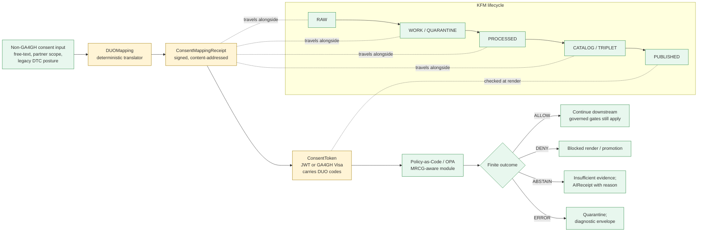

<!-- [KFM_META_BLOCK_V2]
doc_id: kfm://doc/standards/duo-mapping
title: DUO Mapping — GA4GH Data Use Ontology Compatibility Profile
type: standard
version: v0.1
status: draft
owners: <TODO: standards-stewards, consent-policy-owners>
created: 2026-05-14
updated: 2026-05-14
policy_label: public
related:
  - docs/standards/CONSENT_TOKENS.md
  - docs/standards/CANONICALIZATION.md
  - docs/standards/SIGNING.md
  - docs/standards/PROVENANCE.md
  - docs/standards/DP_BUDGETS.md
  - docs/adr/ADR-0001-schema-home.md
  - policy/sensitivity/
  - policy/rights/
  - contracts/source/
  - contracts/evidence/
tags: [kfm, standards, consent, ga4gh, duo, privacy, governance]
notes:
  - PROPOSED placement; not yet verified against mounted repo
  - DUO version pin and code allowlist deferred to ADR (NEEDS VERIFICATION)
  - Illustrative DUO codes in this document are PROPOSED examples, not commitments
[/KFM_META_BLOCK_V2] -->

# DUO Mapping — GA4GH Data Use Ontology Compatibility Profile

> Canonical translation contract between non-GA4GH consent inputs (free-text releases, partner-specific scopes, legacy genealogy grants) and GA4GH **Data Use Ontology (DUO)** codes carried inside KFM consent tokens and read by the policy-as-code layer at promotion and render time.


**Status:** draft · **Owners:** `TODO: standards-stewards, consent-policy-owners` · **Last reviewed:** 2026-05-14

> [!IMPORTANT]
> This document **defines a mapping**; it does **not** publish data and does **not** by itself authorize any release. Consent does not publish. Publication remains a governed state transition gated by `EvidenceBundle` resolution, `PolicyDecision`, `ReleaseManifest`, and review state. DUO codes feed those gates — they do not replace them.

---

## Quick jump

- [1. Purpose & scope](#1-purpose--scope)
- [2. Doctrinal basis](#2-doctrinal-basis)
- [3. Where DUO mapping sits in the trust membrane](#3-where-duo-mapping-sits-in-the-trust-membrane)
- [4. Mapping principles](#4-mapping-principles)
- [5. Input families this mapping accepts](#5-input-families-this-mapping-accepts)
- [6. Canonical `DUOMapping` and `ConsentMappingReceipt`](#6-canonical-duomapping-and-consentmappingreceipt)
- [7. Illustrative code surface](#7-illustrative-code-surface)
- [8. Version pinning & policy-bundle alignment](#8-version-pinning--policy-bundle-alignment)
- [9. Finite outcomes](#9-finite-outcomes)
- [10. Validation gates & required tests](#10-validation-gates--required-tests)
- [11. Worked examples](#11-worked-examples)
- [12. Open questions & NEEDS VERIFICATION](#12-open-questions--needs-verification)
- [13. Related docs](#13-related-docs)

---

## 1. Purpose & scope

**CONFIRMED doctrine.** The Global Alliance for Genomics and Health (GA4GH) suite — AAI, Passports, Data Use Ontology (DUO), and Machine-Readable Consent Guidance (MRCG) — is the canonical access-control and consent framework KFM adopts for any record that involves human-subject data. Every consent token carries DUO codes; the policy-as-code layer reads those codes and gates publication accordingly; the receipt records the Passport fingerprint used at fetch time.

**CONFIRMED tension.** Not every Kansas-first authority is GA4GH-aware. The integration must tolerate non-GA4GH consent inputs while normalizing them upward into DUO codes.

**This document codifies that normalization.** Scope:

- Inputs: free-text consent (oral-history release, county-society grant), partner-specific scopes (FamilySearch OAuth2 scopes), legacy genealogy / DTC genomic consent posture, MetaBlock v2 `consent` field text.
- Outputs: a deterministic `DUOMapping` artifact and a signed `ConsentMappingReceipt` that travels with the source through `RAW → WORK/QUARANTINE → PROCESSED → CATALOG/TRIPLET → PUBLISHED`.
- Non-goals: replacing `SourceDescriptor` rights metadata, replacing the redaction profile, replacing release-time `PolicyDecision` evaluation, or making any rights/sensitivity decision unilaterally on the basis of consent codes alone.

> [!NOTE]
> DUO mapping is a **prerequisite to** policy evaluation, not a substitute for it. A valid DUO code does not authorize publication; it only makes consent machine-readable so other gates can act on it.

## 2. Doctrinal basis

| Anchor | Status | What it commits | Source |
|---|---|---|---|
| GA4GH suite adopted for human-subject data | **CONFIRMED** | AAI/Passports/DUO/MRCG is the canonical consent framework | C9-04 |
| DUO codes ride inside consent tokens | **CONFIRMED** | Consent token (JWT or GA4GH visa) carries `scopes`, `audience`, `exp`, `revocation_endpoint`, `consent_history_hash`, `redaction_profile`; DUO codes are part of `scopes` | C6-07, C9-04 |
| Policy-as-code reads DUO at promotion & render | **CONFIRMED** | OPA bundle gates allow/deny/restrict/abstain on DUO inputs; PDP fails closed on introspection outage | C5-03, C6-07, C6-08 |
| Non-GA4GH consent must normalize upward | **CONFIRMED** | Free-text consent (e.g., oral-history release) maps into DUO codes via a documented mapping | C9-04 (Expansion Directions) |
| DUO compatibility profile + policy-bundle version pin | **CONFIRMED required work** | This document is the profile; pin lives in the policy bundle alongside the OPA digest | C9-04 (Suggested Future Work), C5-03 |
| MRCG-aware OPA module | **CONFIRMED dependency** | Policy module that consumes MRCG-shaped consent | C9-04 |
| Fragmented consent vocabulary is an acknowledged gap | **CONFIRMED gap** | JWT consent, GA4GH Passport claim, and MetaBlock v2 `consent` can encode the same consent differently; canonical normalization is not yet specified | corpus §8.6 |

> [!CAUTION]
> Consent does **not** publish data. A token that authorizes a use does not authorize the underlying surface (tile, layer, story, AI answer). Publication still requires `EvidenceBundle` closure, `PolicyDecision = allow`, a current `ReleaseManifest`, and (where applicable) a recorded `ReviewRecord`.

## 3. Where DUO mapping sits in the trust membrane



> [!NOTE]
> Green nodes are **CONFIRMED** doctrine (lifecycle, finite outcomes, policy-as-code role). Yellow nodes (`DUOMapping`, `ConsentMappingReceipt`, `ConsentToken`) are **PROPOSED** objects this document defines for the unmounted repo; their schema homes are NEEDS VERIFICATION until ADR-0001-compliant placement is confirmed.

[Back to top](#duo-mapping--ga4gh-data-use-ontology-compatibility-profile)

## 4. Mapping principles

1. **Evidence over inference.** Every mapped DUO code MUST trace to an admissible source: the source consent text, a named partner OAuth2 scope, a recorded interview release, or a typed steward decision. Inferred codes without source evidence are not permitted — the mapper either records an evidenced code or returns `ABSTAIN`.
2. **No silent promotion.** If a free-text release would license a use broader than the steward-reviewed scope, the mapper MUST cap at the narrower scope. Silent broadening is a fail-closed condition.
3. **Default-deny posture.** Absent a positive mapping for a use class, the mapper emits no DUO code for that class; the policy layer defaults to deny on missing codes. The mapping receipt records the gap.
4. **Deterministic & content-addressed.** A given input + mapping-table version always produces the same `DUOMapping` artifact (RFC 8785 JCS + SHA-256, recorded as `jcs:sha256:<hex>`). The `spec_hash` of the mapping receipt is verified at promotion (`spec_hash_match`).
5. **Receipts are signed.** The `ConsentMappingReceipt` is signed (cosign keyless by default; pinned-key fallback documented). The signed envelope's `payloadType` reserved value: `application/vnd.kfm.consent_mapping_receipt+json` (**PROPOSED**).
6. **Mapping is reversible.** Each receipt records the source span(s), the steward (if any) who reviewed the mapping, and a `mapping_table_version`. Revoking the consent triggers a downstream tombstone and cache invalidation.
7. **Separation of duties.** When the mapping result raises sensitivity (e.g., living-person, DNA, sacred-site adjacency, archaeology), the issue of the `ConsentMappingReceipt` and its acceptance into a `PromotionDecision` MUST be separable roles per the operating law.
8. **Identity is not consent.** Stable identities do not ride in tiles, bundles, catalogs, manifests, graph exports, PMTiles, or vector indexes. The mapping references the consent subject by opaque holder reference, never by globally correlatable identifier.

## 5. Input families this mapping accepts

| Family | Example input | Expected behaviour | Status |
|---|---|---|---|
| **Free-text consent** | Oral-history release form scanned to PDF + steward transcription | Mapper extracts permitted-use phrases, returns mapped DUO codes plus an unmapped-residual list; sensitive-residual triggers steward review | **PROPOSED** |
| **FamilySearch OAuth2 scopes** | `permissions/...` strings returned at OAuth grant time | Mapper crosswalks each scope to DUO codes; unrecognized scopes return `ABSTAIN` and surface in the verification backlog | **PROPOSED** |
| **DTC genomic consent posture** | 23andMe / AncestryDNA / MyHeritage user-controlled export with documented per-vendor terms | Mapper applies the vendor profile pinned in the policy bundle; raw genotype data never crosses publication boundary regardless of code (C9-03) | **PROPOSED** |
| **GEDCOM / GEDCOM-X embedded notes** | GEDCOM `NOTE` records, GEDCOM-X `Document` resources of type "release" | Mapper extracts permission language; default disposition for unparseable notes is `ABSTAIN` | **PROPOSED** |
| **MetaBlock v2 `consent` field** | YAML/JSON in a KFM document's front-matter | Mapper validates the field shape and crosswalks; if shape-invalid, returns `ERROR` envelope | **PROPOSED** |
| **Partner-specific scopes (non-GA4GH partners)** | Per-archive grant text, county-society release scope | Mapper uses a per-partner crosswalk file under `policy/sensitivity/duo/partners/<id>/` (**PROPOSED** path) | **PROPOSED** |

> [!WARNING]
> The mapper MUST tolerate non-GA4GH consent inputs **without claiming GA4GH compliance for them**. The output receipt records the input family, the mapping-table version, and any unmapped residuals so downstream readers can distinguish "native GA4GH consent" from "consent normalized upward into DUO".

[Back to top](#duo-mapping--ga4gh-data-use-ontology-compatibility-profile)

## 6. Canonical `DUOMapping` and `ConsentMappingReceipt`

### 6.1 `DUOMapping` (the deterministic translation)

A `DUOMapping` is the canonical record that a particular consent input was translated to a particular set of DUO codes under a particular mapping-table version. It is content-addressable and intended to be referenced by a `ConsentMappingReceipt`.

**PROPOSED** schema home (subject to ADR-0001): `schemas/contracts/v1/consent/duo_mapping.schema.json`

| Field | Type | Meaning | Status |
|---|---|---|---|
| `object_type` | string (`"DUOMapping"`) | Discriminator | **PROPOSED** |
| `schema_version` | string (e.g., `v1`) | KFM schema version | **PROPOSED** |
| `spec_hash` | string `jcs:sha256:<hex>` | Deterministic content hash | **CONFIRMED format (C1-02)** |
| `input_family` | enum | One of the families in §5 | **PROPOSED** |
| `input_reference` | object | Opaque pointer to the consent source (e.g., `EvidenceRef`, source descriptor id), never raw PII | **PROPOSED** |
| `duo_codes_granted` | array of strings | DUO code IRIs or short ids the input affirmatively permits | **PROPOSED** |
| `duo_codes_denied` | array of strings | Codes the input explicitly prohibits (e.g., no-commercial when the grant is research-only) | **PROPOSED** |
| `unmapped_residuals` | array of objects | Source spans the mapper could not translate, with reasons | **PROPOSED** |
| `mapping_table_version` | string | Version of the mapping table used (pinned in the policy bundle) | **PROPOSED** |
| `duo_release_version` | string | Pinned DUO release the codes belong to | **NEEDS VERIFICATION** |
| `steward_review` | object \| null | Steward decision metadata if review was required | **PROPOSED** |
| `created_at` | string (ISO 8601) | Mapping timestamp | **PROPOSED** |

### 6.2 `ConsentMappingReceipt` (the signed envelope)

The `ConsentMappingReceipt` wraps a `DUOMapping` in the standard KFM receipt envelope so it can be signed, pinned, and tracked through the lifecycle.

| Field | Type | Meaning | Status |
|---|---|---|---|
| `object_type` | string (`"ConsentMappingReceipt"`) | Discriminator | **PROPOSED** |
| `schema_version` | string | KFM schema version | **PROPOSED** |
| `spec_hash` | string `jcs:sha256:<hex>` | Deterministic content hash | **CONFIRMED format (C1-02)** |
| `duo_mapping_ref` | `EvidenceRef` | Reference to the `DUOMapping` (content-addressed) | **PROPOSED** |
| `source_descriptor_ref` | `EvidenceRef` | Reference to the originating `SourceDescriptor` | **PROPOSED** |
| `evidence_refs` | array of `EvidenceRef` | All evidence supporting the mapping decision | **CONFIRMED pattern** |
| `policy_decision` | object | Decision envelope: `outcome`, `reason_code`, `policy_digest` | **CONFIRMED pattern** |
| `consent_token_binding` | object \| null | Optional binding fingerprint to the `ConsentToken` issued from this mapping | **PROPOSED** |
| `attestations[]` | array | e.g., `{type:"cosign", bundle_digest:"sha256:..."}` | **CONFIRMED pattern (C1-03)** |
| `run_id` | string | Run that produced the mapping | **CONFIRMED pattern (C1-01)** |
| `mapping_table_version` | string | Mirrors the value inside `DUOMapping` for fast policy reads | **PROPOSED** |
| `policy_bundle_digest` | string `sha256:...` | OPA bundle digest at mapping time (parity with §8) | **CONFIRMED parity rule (C5-03)** |
| `target_zone` | enum | Lifecycle stage the mapping was created at (`RAW`, `WORK`, `QUARANTINE`, ...) | **PROPOSED** |

<details>
<summary>Illustrative <code>ConsentMappingReceipt</code> (compact JSON) — PROPOSED shape</summary>

```json
{
  "object_type": "ConsentMappingReceipt",
  "schema_version": "v1",
  "spec_hash": "jcs:sha256:<hex>",
  "duo_mapping_ref": {
    "type": "DUOMapping",
    "uri": "kfm://mapping/<digest>"
  },
  "source_descriptor_ref": {
    "type": "SourceDescriptor",
    "uri": "kfm://source/<id>"
  },
  "evidence_refs": [
    { "type": "EvidenceBundle", "uri": "kfm://bundle/<digest>" }
  ],
  "policy_decision": {
    "outcome": "ALLOW",
    "reason_code": "consent.duo.mapped.ok",
    "policy_digest": "sha256:<opa-bundle-digest>"
  },
  "consent_token_binding": {
    "token_fingerprint": "sha256:<fp>",
    "issuer": "<oidc-issuer>"
  },
  "attestations": [
    { "type": "cosign", "bundle_digest": "sha256:<bundle-digest>" }
  ],
  "run_id": "<uuid>",
  "mapping_table_version": "duo-mapping/v1.0.0",
  "policy_bundle_digest": "sha256:<digest>",
  "target_zone": "WORK",
  "created_at": "2026-05-14T00:00:00Z"
}
```

</details>

## 7. Illustrative code surface

> [!IMPORTANT]
> The codes below are **PROPOSED illustrative examples** drawn at the level the corpus describes DUO ("research-only, no-commercial, IRB-required, etc."). The **actual** allowlist of DUO codes KFM honors — including the exact DUO release version — is pinned in the policy bundle (§8) and ratified by ADR. This document MUST NOT be read as the canonical code allowlist.

### 7.1 Illustrative permit / deny categories

| Category (KFM-side label) | What the input typically says | Illustrative DUO-class intent | Status |
|---|---|---|---|
| `research-only` | "May be used for academic research" | Research use permitted, secondary use restricted | **PROPOSED / illustrative** |
| `no-commercial` | "Not for commercial use" | Commercial use prohibited | **PROPOSED / illustrative** |
| `irb-required` | "Use requires institutional review" | Use gated on ethics-board review | **PROPOSED / illustrative** |
| `no-redistribution` | "May not be republished" | Downstream redistribution prohibited | **PROPOSED / illustrative** |
| `aggregate-only` | "Statistics OK; individual data not OK" | Derived/aggregate releases only — never raw | **PROPOSED / illustrative** |
| `living-persons-restricted` | "Not for use about living relatives" | Living-person inferences disallowed at render | **PROPOSED / illustrative** |
| `sacred-site-restricted` | Custodian-imposed restriction on site precision | Geometry generalization required pre-release | **PROPOSED / illustrative** |
| `revocable-at-will` | "I can withdraw consent at any time" | Revocation endpoint MUST be live; cache invalidation MUST work | **CONFIRMED requirement (C6-08)** |

### 7.2 Illustrative free-text → DUO mapping

| Free-text phrase (illustrative) | Mapped DUO-class intent | Required downstream gate |
|---|---|---|
| "for genealogical research" | research-only, no-commercial | C6-06 k-anonymity for living-person overlays |
| "you may share my interview" | redistribution permitted within stated scope | rights/license gate |
| "do not publish my exact address" | geoprivacy restriction | C6-06 geoprivacy fallback masks |
| "use only with my approval" | IRB-equivalent / steward-approval required | `HOLD` outcome until `ReviewRecord` recorded |
| (silent on commercial use) | no DUO code emitted for commercial dimension | default-deny on commercial |

> [!WARNING]
> "Silent on a dimension" is **not** "permits that dimension." The mapper emits **no code** for the silent dimension, and the policy layer defaults to deny. Treating silence as permission is an explicit anti-pattern.

[Back to top](#duo-mapping--ga4gh-data-use-ontology-compatibility-profile)

## 8. Version pinning & policy-bundle alignment

**CONFIRMED policy parity rule (C5-03).** What is enforced in production must be exactly what was tested. The same OPA bundle digest must be referenced by both CI workflows and runtime deployment manifests; fixtures are pinned with a `fixtures.lock`; the PDP version in CI matches the production sidecar tag.

For DUO mapping specifically, the **PROPOSED** pin set is:

| Pinned thing | Pinned where | Why |
|---|---|---|
| **DUO release version** | Policy bundle (`policy/sensitivity/duo/duo.lock.yaml` — **PROPOSED** path) | DUO updates change codes; long-running grants must reference the release they were mapped against |
| **`mapping_table_version`** | Same lock file | Even with DUO pinned, the KFM mapping table from non-GA4GH inputs evolves independently |
| **OPA bundle digest** | Workflow + deployment manifest | Policy parity (C5-03) |
| **DUO vocabulary mirror** | Build-time artifact baked into the policy bundle | Air-gap and reproducibility (C13) |

> [!CAUTION]
> If a consent grant was mapped against `duo@vX` and the bundle later moves to `duo@vY`, the mapper MUST NOT silently re-interpret old grants under the new vocabulary. The receipt records the version at mapping time; downstream gates compare. Reinterpretation requires a documented migration receipt (C11-04 pattern).

### 8.1 Pin-advancement discipline (PROPOSED)

1. Open an ADR proposing the DUO version advance.
2. Run a controlled rebuild of the mapping table against the new DUO release.
3. Diff the resulting code surface; flag any grant whose codes drift.
4. For drifted grants, emit a migration receipt and (if scope narrows) a correction notice.
5. Pin the new digest in the policy bundle; flip CI parity to the new digest.
6. Verify rollback by running a dry-run rollback against the previous pin.

## 9. Finite outcomes

**CONFIRMED doctrine.** Every governed API surface, validator, and policy gate returns one of a finite set of outcomes. For the DUO mapper specifically:

| Outcome | When | Required artifact | Public-surface effect |
|---|---|---|---|
| **ALLOW** | Input parsed, codes mapped, all required dimensions covered, no sensitive-residual | `ConsentMappingReceipt` with `policy_decision.outcome = "ALLOW"` | Continue downstream — other gates still apply |
| **ABSTAIN** | Input incomplete, partner scope unrecognized, or mapper cannot cite a source span for a required dimension | `ConsentMappingReceipt` with `outcome = "ABSTAIN"`, reason code | No consent token issued; surface flagged for steward review |
| **DENY** | Input explicitly prohibits a required dimension, or revocation status returns revoked | `ConsentMappingReceipt` with `outcome = "DENY"`, reason code | Token blocked; if previously issued, tombstone + cache invalidation (C6-08) |
| **ERROR** | Input shape invalid (malformed JSON, missing required field, mapper internal failure) | Error envelope, diagnostic code; no claim leakage | Quarantine; never silently fall through |
| **HOLD** | Mapping result requires steward review (sensitive lane, custodian sign-off) | `ReviewRecord` pending; no consent token issued while held | Source remains in prior state; no silent rollback or substitution |

> [!NOTE]
> Validator-class outcomes (**PASS**, **FAIL**) also apply when the mapper is invoked as an admission check (e.g., admission of a new partner-scope crosswalk file into `policy/sensitivity/duo/partners/`). These are internal-only and never directly surfaced to public clients.

## 10. Validation gates & required tests

**CONFIRMED negative-state rule.** Validators must test DENY, ABSTAIN, ERROR, quarantine, stale, restricted, and review-needed paths, not only successful publication.

| Gate | What it checks | Required outcome on failure |
|---|---|---|
| **Schema gate** | `DUOMapping` and `ConsentMappingReceipt` validate against pinned JSON Schemas | `ERROR` / quarantine |
| **Spec-hash gate (C5-04)** | Recomputed `jcs:sha256` matches the receipt's `spec_hash` | Hard fail; promotion blocked |
| **Policy-bundle parity (C5-03)** | `policy_bundle_digest` in receipt matches workflow + deployment digest | `ERROR` |
| **DUO version pin** | `duo_release_version` is in the bundle's allowlist | `DENY` with reason `consent.duo.version_unpinned` |
| **Source closure** | Every `evidence_refs` URI resolves to an `EvidenceBundle` | `ABSTAIN` |
| **Revocation introspection** | Token's `revocation_endpoint` is reachable; fail closed on outage | `DENY` |
| **Residuals review** | All `unmapped_residuals` either have a steward decision or are flagged for review | `HOLD` |
| **Sensitivity coupling** | If the mapping touches living-person, DNA, archaeology, sacred-site adjacency, infrastructure exposure, or rare-species locations → required public-safe transforms documented and tested | `HOLD` or `DENY` per policy |
| **Negative-path coverage** | Tests exercise DENY, ABSTAIN, ERROR, HOLD on representative inputs | CI fails closed if missing |

**PROPOSED** fixture homes (subject to ADR / Directory Rules §6):

- `tests/fixtures/consent/duo/valid/` — happy-path inputs.
- `tests/fixtures/consent/duo/invalid/` — schema-invalid, version-unpinned, hash-mismatch.
- `tests/fixtures/consent/duo/sensitive/` — inputs that must `HOLD`.
- `policy/sensitivity/duo/tests/` — OPA fixtures asserting `ALLOW/DENY/ABSTAIN/ERROR/HOLD`.

[Back to top](#duo-mapping--ga4gh-data-use-ontology-compatibility-profile)

## 11. Worked examples

<details>
<summary><strong>Example A — Oral-history release (free-text → DUO)</strong></summary>

**Input (excerpt, transcribed).** *"You may use this recording for genealogical research about my family. Please don't sell it or use it for advertising. You can share it with libraries and universities. If you ever publish a map showing where I live now, please don't show my exact address."*

**Mapper behavior (illustrative).**

- Maps to: `research-only`, `no-commercial`, `redistribution-permitted-academic`, `geoprivacy-required` (illustrative labels, see §7 caveat).
- Silent on: any inference about living relatives → emits no permission code for that dimension; default-deny applies.
- Emits `ConsentMappingReceipt` with `outcome = "ALLOW"`, mapping-table version pinned, evidence pointing to the transcription `EvidenceBundle`.
- Downstream: living-relative inference is blocked by default-deny; geoprivacy fallback mask (C6-06) is required at render.

</details>

<details>
<summary><strong>Example B — FamilySearch OAuth2 scope</strong></summary>

**Input.** OAuth2 grant returns a scope string KFM does not yet have a crosswalk for.

**Mapper behavior.**

- No partner-crosswalk entry for the unknown scope.
- Emits `ConsentMappingReceipt` with `outcome = "ABSTAIN"`, `reason_code = "consent.duo.scope_unmapped"`.
- Surfaces a verification-backlog entry: "add crosswalk for FamilySearch scope `<value>`."
- No consent token issued from this mapping; downstream renders are denied for any record depending on this source.

</details>

<details>
<summary><strong>Example C — Revoked consent</strong></summary>

**Input.** Previously-issued `ConsentMappingReceipt` exists; token's `revocation_endpoint` now reports revoked.

**Mapper / PDP behavior.**

- New evaluation: `outcome = "DENY"`, reason `consent.revoked`.
- Tombstone (C5-09) emitted for any released artifacts that depended on this consent.
- Cache invalidation hooks fire (PMTiles index bump, tile-server purge per C6-08).
- A new `spec_hash` and `run_receipt` are appended to the ledger.

</details>

<details>
<summary><strong>Example D — DUO version advance</strong></summary>

**Input.** Policy bundle moves from `duo@vX` to `duo@vY`. An existing mapping was created against `vX`.

**Mapper / migration behavior.**

- Old `ConsentMappingReceipt` is **not** silently re-evaluated under `vY`.
- Migration receipt (C11-04 pattern) records `vX → vY` translation; flagged grants surface in the verification backlog.
- If the new version narrows scope on any grant, a correction notice is emitted.
- Rollback plan: re-pin previous DUO digest in the policy bundle; verify dry-run rollback before sunset.

</details>

## 12. Open questions & NEEDS VERIFICATION

- **NEEDS VERIFICATION** — Exact DUO release version to pin. The corpus does not commit to a version; pinning is deferred to ADR.
- **NEEDS VERIFICATION** — Whether `schemas/contracts/v1/consent/` is the canonical home, vs. a domain-namespaced home under `schemas/contracts/v1/domains/people-dna-land/consent/`. Resolve under ADR-0001.
- **NEEDS VERIFICATION** — Whether `policy/sensitivity/duo/` or `policy/domains/people-dna-land/duo/` is canonical. Default per Directory Rules §6.5 is the singular cross-cutting home; domain-namespaced rules may live alongside.
- **OPEN** — Cache TTL for revocation introspection results (cross-references C6-07 open question).
- **OPEN** — Treatment of `mapping_table_version` evolution independent of DUO version: full CI re-evaluation, or migration-receipt-only?
- **OPEN** — Whether `consent_token_binding` is required at mapping time or may be bound later when the token is actually issued.
- **OPEN** — Steward-review SLA for `HOLD` outcomes on living-person mappings.
- **PROPOSED** — `application/vnd.kfm.consent_mapping_receipt+json` as the DSSE `payloadType`. Confirm under a single ADR alongside `application/vnd.kfm.run_receipt+json`.

> [!NOTE]
> These items SHOULD be tracked in `docs/registers/VERIFICATION_BACKLOG.md` and resolved by ADR or per-root README before the DUO mapping pathway is treated as canonical.

[Back to top](#duo-mapping--ga4gh-data-use-ontology-compatibility-profile)

## 13. Related docs

- `docs/standards/CONSENT_TOKENS.md` — **CONFIRMED required (C6-07)**: token shape, scopes, revocation_endpoint, redaction_profile. DUO codes are carried in `scopes`.
- `docs/standards/CANONICALIZATION.md` — **CONFIRMED required (C1-02)**: JCS + SHA-256 governs the `spec_hash` for `DUOMapping` and `ConsentMappingReceipt`.
- `docs/standards/SIGNING.md` — **CONFIRMED required (C1-03)**: cosign keyless default, pinned-key fallback for offline.
- `docs/standards/PROVENANCE.md` — **CONFIRMED required (C1-04)**: SLSA / in-toto predicates for receipts.
- `docs/standards/DP_BUDGETS.md` — **CONFIRMED required (C6-05)**: differential-privacy budgets for aggregate releases of consent-gated data.
- `docs/standards/RUN_RECEIPT.md` — **CONFIRMED required (C1-01)**: canonical run-receipt envelope.
- `docs/adr/ADR-0001-schema-home.md` — **CONFIRMED**: schema-home rule governs placement of `duo_mapping.schema.json` and `consent_mapping_receipt.schema.json`.
- `policy/sensitivity/`, `policy/rights/` — **CONFIRMED Directory Rules §6.5**: admissibility homes.
- `control_plane/policy_gate_register.yaml` — **CONFIRMED §6.2**: register the DUO mapping gate.
- `docs/registers/VERIFICATION_BACKLOG.md` — **CONFIRMED §6.1**: track open items from §12.
- TODO: `docs/adr/ADR-XXXX-duo-version-pin.md` — propose and ratify the DUO release pin.
- TODO: `docs/adr/ADR-XXXX-consent-mapping-receipt-home.md` — confirm schema/policy/test homes.

---

<sub>Last updated: 2026-05-14 · Owners: <code>TODO: standards-stewards, consent-policy-owners</code> · Status: draft · <a href="#duo-mapping--ga4gh-data-use-ontology-compatibility-profile">Back to top ↑</a></sub>
