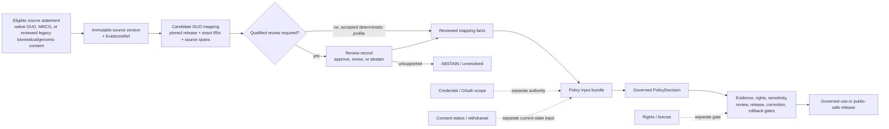

<!-- [KFM_META_BLOCK_V2]
doc_id: kfm://doc/standards/duo-mapping
title: DUO Mapping — KFM Crosswalk Boundary and Graduation Plan
type: standard; mapping-guidance; interoperability-boundary
version: v2.0-draft
status: "draft; repository-grounded; upstream-currentness-refreshed; overlap-unresolved; no-adoption; no-machine-authority; no-policy-activation; no-release; no-publication"
owners:
  - "@bartytime4life — verified GitHub review route through CODEOWNERS"
  - "NEEDS VERIFICATION — consent/privacy, genomics/biomedical, ontology, policy-runtime, security, legal/ethics, release, correction, and independent-review stewards"
created: 2026-05-14
updated: 2026-08-18
policy_label: "repository-facing; consent; data-use; privacy; genomics; no-credentials; no-publication"
owning_root: docs/
current_path: docs/standards/DUO_MAPPING.md
responsibility: >
  Explain the bounded KFM crosswalk problem between eligible consent or data-use
  statements and authoritative GA4GH Data Use Ontology terms, disclose current
  repository and upstream evidence, and define the review and graduation gates
  required before any mapping may influence policy or release.
truth_posture: >
  CONFIRMED current path, standards-lane placement, CODEOWNERS route, sibling
  DUO/consent documentation, scaffold-only consent schema lane, current
  PolicyDecision vocabulary, selected synthetic consent surfaces, official DUO
  term identities, and official DUO/MRCG publication baselines / PROPOSED KFM
  mapping-record semantics, review workflow, mirror, version lock, fixtures,
  validators, producer/consumer bindings, and migration process / CONFLICTED
  DUO_MAPPING versus DUO_PROFILE role and identity, consent object-family naming,
  and policy-lane placement / UNKNOWN KFM DUO adoption, qualified mapping
  authority, accepted machine profile, production mapper, executable consent
  policy, runtime enforcement, live consent records, release integration, and
  public interoperability.
evidence_snapshot:
  repository: bartytime4life/Kansas-Frontier-Matrix
  base_ref: main
  base_commit: 31503aaadcf430499c5e3181f759db6b582a84c0
  target_prior_blob: 3ee2c8e6e858b33c34b43c331d9f9b0445ba1484
  standards_readme_snapshot: "repository-grounded mixed-maturity lane; both DUO_MAPPING.md and DUO_PROFILE.md present"
  consent_schema_lane_snapshot: "schemas/contracts/v1/consent/ contains README.md plus .gitkeep only"
  upstream_review:
    access_date: 2026-08-18
    duo_approved_release: "DUO v1.0; dated ontology release 2021-02-23"
    duo_master_csv_blob: 1ef1a0c5a49a849b1da4e9f106dacb3464301a64
    duo_master_owl_blob: 9a1260229408169652d10ee7c11640ca24d7f055
    mrcg_baseline: "Machine Readable Consent Guidance v1.0; January 2023"
related:
  - ./README.md
  - ./DUO_PROFILE.md
  - ./CONSENT_TOKENS.md
  - ./SENSITIVITY_RUBRIC.md
  - ./REDACTION_PROFILES.md
  - ../doctrine/directory-rules.md
  - ../doctrine/trust-membrane.md
  - ../adr/ADR-0029-adopt-directory-governance-standard-v2.md
  - ../architecture/contract-schema-policy-split.md
  - ../domains/people-dna-land/CONSENT_MODEL.md
  - ../domains/people-dna-land/CONSENT_REGISTER.md
  - ../../policy/consent/README.md
  - ../../policy/consent/people-dna-land/README.md
  - ../../contracts/policy/policy_decision.md
  - ../../schemas/contracts/v1/consent/README.md
  - ../../schemas/contracts/v1/policy/policy_decision.schema.json
  - ../../schemas/contracts/v1/runtime/consent_grant.schema.json
  - ../../schemas/governance/consent_receipt.schema.json
  - ../../.github/CODEOWNERS
tags: [kfm, standards, ga4gh, duo, mrcg, consent, mapping, privacy, governance, policy, genomics]
notes:
  - "Same-path documentation modernization only; no contract, schema, policy, mapping table, mirror, fixture, validator, workflow, source, token, consent record, release, deployment, or public artifact changes."
  - "The former claim that KFM canonically adopts the full GA4GH suite for every human-subject record is narrowed: current repository evidence does not establish that adoption decision."
  - "The former automatic mapping examples for genealogy, oral history, FamilySearch scopes, archaeology, and generic geoprivacy are retired because those concepts are not equivalent to DUO data-use conditions without an accepted profile and qualified review."
  - "The prior DUO term table incorrectly identified DUO:0000045 and DUO:0000046 and treated DUO:0000046 as geographic/ethnic restriction; this revision follows the official ontology snapshot."
  - "Legacy section anchors and the former title anchor are retained for inbound-link compatibility."
[/KFM_META_BLOCK_V2] -->

<a id="top"></a>
<a id="duo-mapping--ga4gh-data-use-ontology-compatibility-profile"></a>

# DUO Mapping — KFM Crosswalk Boundary and Graduation Plan

> **Purpose.** Explain when and how KFM may translate an eligible consent or data-use statement into authoritative GA4GH Data Use Ontology terms—without turning a vocabulary match into consent, lawful authority, policy approval, evidence, release, or publication.


> [!IMPORTANT]
> **A DUO mapping is an annotation about permitted data use, not permission to publish.** A mapped term does not prove that consent exists, that the person or institution had authority to grant it, that rights and privacy requirements are satisfied, that evidence supports a claim, or that a release is approved.

> [!CAUTION]
> **Current KFM implementation is not established.** The repository contains substantial consent and sensitive-domain documentation plus bounded synthetic assessment surfaces, but the inspected consent schema lane is a compatibility placeholder and no canonical DUO mapping contract, schema, fixture family, validator, executable consent policy, or production mapper was established.

> [!WARNING]
> **Do not map by keyword resemblance.** General genealogy permission, an oral-history release, an OAuth scope, a copyright license, a privacy notice, a cultural-review decision, or a request to hide an address is not automatically a DUO permission or modifier. Unsupported translation must abstain or enter qualified review.

| Field | Current bounded result |
|---|---|
| **Evidence snapshot** | `main@31503aaadcf430499c5e3181f759db6b582a84c0` |
| **Directory result** | `PLACE` at the existing `docs/standards/DUO_MAPPING.md` path; accepted Directory Rules assign human-readable standards guidance to `docs/standards/` |
| **Official DUO baseline** | GA4GH-approved DUO v1.0; the official ontology snapshot identifies the dated release `2021-02-23` |
| **MRCG baseline** | GA4GH Machine Readable Consent Guidance v1.0, January 2023 |
| **KFM adoption** | **UNKNOWN / NOT ESTABLISHED.** No accepted decision was established that makes DUO mandatory for every KFM human-subject record |
| **Document overlap** | **CONFLICTED.** `DUO_MAPPING.md` and `DUO_PROFILE.md` overlap without an accepted identity, supersession, or role split |
| **Machine mapping family** | **NOT ESTABLISHED.** `schemas/contracts/v1/consent/` remains a compatibility placeholder |
| **Policy execution** | **NOT ESTABLISHED.** The inspected consent-policy lane describes no accepted executable evaluator or production bundle |
| **Public effect** | None; this page cannot authorize access, release, rendering, export, model context, or publication |

**Quick navigation:** [Status](#0-status-authority-and-evidence-boundary) · [Purpose](#1-purpose--scope) · [Authority](#2-doctrinal-basis) · [Trust membrane](#3-where-duo-mapping-sits-in-the-trust-membrane) · [Principles](#4-mapping-principles) · [Inputs](#5-input-families-this-mapping-accepts) · [Record](#6-canonical-duomapping-and-consentmappingreceipt) · [Terms](#7-illustrative-code-surface) · [Versioning](#8-version-pinning--policy-bundle-alignment) · [Outcomes](#9-finite-outcomes) · [Validation](#10-validation-gates--required-tests) · [Examples](#11-worked-examples) · [Open work](#12-open-questions--needs-verification) · [Related](#13-related-docs)

---

<a id="0-status-authority-and-evidence-boundary"></a>

## 0. Status, authority, and evidence boundary

### 0.1 Authority by question

| Question | Owning authority | Role of this page |
|---|---|---|
| What DUO terms mean | The authoritative GA4GH/OBO DUO release | Record the checked baseline and require exact term identity |
| Whether DUO applies to a KFM use | An accepted KFM standards/profile decision plus qualified domain, consent, privacy, and legal/ethics review | Describe the decision that remains open |
| What a mapping object means | A reviewed semantic contract under `contracts/` | Propose minimum information without creating authority |
| What machine shape is valid | A reviewed schema under `schemas/` | State graduation needs; do not host shape authority |
| What is allowed, denied, restricted, or abstained | `policy/`, qualified review, and a governed `PolicyDecision` | Supply mapping facts as one input only |
| Whether a consent or grant is valid | The governed consent controller, source record, authority evidence, current status, and applicable law/policy | Never infer validity from a DUO code |
| Whether evidence supports a claim | `EvidenceRef` resolution to `EvidenceBundle` | Require source traceability; do not replace evidence |
| Whether an artifact may release | Policy, review, proof, release, correction, and rollback authorities | Explain prerequisites; never approve release |
| Whether KFM implements the mapping | Exact-revision contracts, schemas, policy, fixtures, validators, producers, consumers, tests, and runtime evidence | State the checked boundary only |

### 0.2 Truth labels

- **CONFIRMED** — verified from current repository bytes or authoritative upstream material at the named snapshot.
- **PROPOSED** — a KFM mapping rule, object, path, field, workflow, validator, or graduation step not established as current behavior.
- **UNKNOWN** — evidence is insufficient for a stronger current claim.
- **NEEDS VERIFICATION** — a concrete repository, standards, consent, policy, legal/ethics, or operational check can resolve the question.
- **CONFLICTED** — current repository surfaces overlap or disagree in identity, role, placement, vocabulary, or authority.
- **HOLD** — a workflow posture: do not adopt or operate until the named closure evidence exists. It is not a public `PolicyDecision` outcome.

### 0.3 Current repository evidence

| Surface | CONFIRMED observation | Safe conclusion |
|---|---|---|
| [`DUO_MAPPING.md`](./DUO_MAPPING.md) | Existing May 2026 mapping guide with proposal-era implementation claims | Same-path reconciliation is warranted |
| [`DUO_PROFILE.md`](./DUO_PROFILE.md) | Separate draft external-standard profile | The two pages overlap; neither silently supersedes the other |
| [`docs/standards/README.md`](./README.md) | Both DUO pages are inventoried in a mixed-maturity guidance lane | Presence is not adoption or conformance |
| [`CONSENT_TOKENS.md`](./CONSENT_TOKENS.md) | Current repository-grounded consent boundary says no token profile or production consent path is adopted | DUO mapping cannot presume a canonical token carrier |
| [`schemas/contracts/v1/consent/README.md`](../../schemas/contracts/v1/consent/README.md) | Compatibility placeholder that warns against adding canonical schemas before placement is confirmed | `DUOMapping` and `ConsentMappingReceipt` schemas do not currently exist there |
| [`policy/consent/people-dna-land/README.md`](../../policy/consent/people-dna-land/README.md) | Consent-policy documentation exists; placement and engine vocabulary are conflicted; executable rules and production enforcement are unproved | This page cannot claim OPA or runtime policy integration |
| [`PolicyDecision`](../../contracts/policy/policy_decision.md) | Canonical outward outcomes are `ANSWER`, `ABSTAIN`, `DENY`, and `ERROR`; `consent` is a policy family | Mapping workflow states must not create a competing public decision vocabulary |
| Bounded repository search | No `duo_mapping.schema.json`, `ConsentMappingReceipt` implementation, DUO fixture family, or DUO validator surfaced | Implementation remains **UNKNOWN / not established by this review** |

Absence statements are bounded to the repository search and paths inspected. They are not claims that private systems, historical branches, unindexed files, or external institutional processes never existed.

### 0.4 Upstream evidence

The upstream baseline used by this revision is deliberately narrow:

- DUO is a GA4GH-approved, OBO Foundry ontology for expressing data-use conditions through data-use permissions and modifiers.
- The official DUO ontology snapshot identifies the dated version IRI `http://purl.obolibrary.org/obo/duo/releases/2021-02-23/duo.owl`.
- The bare ontology PURL represents the moving upstream artifact; operational KFM use must pin a dated release and digest.
- MRCG gives structured guidance for mapping consent-form content to DUO terms; it does not make every consent document automatically mappable.
- DUO does not replace legal compliance, institutional authority, privacy review, rights review, or access governance.

### 0.5 Non-effects

This page does **not**:

- adopt DUO as mandatory for all KFM human-subject or genealogy material;
- accept `DUO_PROFILE.md`, this page, or either page as a canonical machine profile;
- define a consent event, grant, credential, token, sidecar, receipt, or register;
- create a contract, schema, mapping table, vocabulary mirror, policy rule, fixture, validator, workflow, producer, or consumer;
- declare FamilySearch, GEDCOM, oral-history, DTC, archive, or partner scopes equivalent to DUO;
- validate a real consent, identity, relationship, source right, license, or legal basis;
- activate a source or inspect live credentials;
- approve policy, review, release, rendering, export, deployment, or publication.

[Back to top](#top)

---

<a id="1-purpose--scope"></a>

## 1. Purpose & scope

This page owns one responsibility: **human-readable guidance for a future, evidence-backed mapping from eligible consent or data-use statements to authoritative DUO term IRIs**.

It explains:

1. the boundary between upstream DUO semantics and KFM adoption;
2. which input families are candidates, out of scope, or review-only;
3. why a mapping is distinct from consent, access, rights, privacy, policy, and release;
4. the minimum provenance and review information a candidate mapping must preserve;
5. exact term-identity and version-pinning rules;
6. negative states and anti-overmapping requirements; and
7. the evidence required before the pathway graduates from documentation to implementation.

### 1.1 In scope

- native records that already carry canonical DUO IRIs;
- consent or data-use forms structured under GA4GH MRCG;
- legacy biomedical, clinical, genomic, cohort, or biobank consent statements whose intended data-use conditions fall within DUO's vocabulary;
- institution- or partner-specific biomedical/genomic profiles after an accepted, reviewed crosswalk exists;
- exact DUO release identity, term identity, mapping provenance, review, correction, and migration;
- policy input preparation without policy decision authority.

### 1.2 Out of scope by default

The following are **not** automatically DUO mapping inputs:

- general genealogy permission or family-history research language;
- oral-history publication or interview releases;
- OAuth scopes or API permissions;
- copyright, database, redistribution, or open-data licenses;
- website terms of service or privacy notices;
- public-record status;
- living-person geoprivacy rules;
- archaeology, sacred-site, tribal, Indigenous-data, or CARE decisions;
- land, parcel, title, cemetery, obituary, probate, or vital-record use;
- rare-species or infrastructure sensitivity;
- marketing, advertising, or public-display permissions expressed outside an eligible data-use context.

A future accepted KFM profile may admit a bounded partner or domain crosswalk. Until then, these inputs remain in their native rights, consent, privacy, sensitivity, or sovereignty authorities and must not be relabeled as GA4GH DUO compliance.

### 1.3 Why the former scope was narrowed

The prior edition treated free-text genealogy, oral history, FamilySearch scopes, DTC vendor posture, GEDCOM notes, generic geoprivacy, archaeology, and cultural concerns as one upward-normalization surface. That collapses distinct bounded contexts:

| Concern | Native question |
|---|---|
| DUO | What research data uses and modifiers does an eligible dataset permit? |
| Consent | What did an authorized holder agree to, for which operation, purpose, audience, time, and data? |
| Rights/license | May KFM copy, transform, redistribute, or publicly expose the material? |
| OAuth/API scope | Which API operations may a credential invoke? |
| Privacy/geoprivacy | Which information or precision may be disclosed to which audience? |
| Cultural/sovereignty review | Who has authority to decide access, representation, and stewardship? |
| Release | Has the exact public-safe artifact passed evidence, policy, review, proof, correction, and rollback gates? |

A translation may connect two contexts through a reviewed crosswalk. It must not erase the boundaries between them.

[Back to top](#top)

---

<a id="2-doctrinal-basis"></a>

## 2. Doctrinal basis

### 2.1 Governing KFM invariants

| Invariant | Mapping consequence |
|---|---|
| Cite or abstain | Every candidate term traces to the exact source clause and evidence reference, or the mapper abstains |
| EvidenceBundle outranks generated language | Model output or keyword similarity cannot establish a DUO mapping |
| Policy is separate from vocabulary | Mapping facts enter policy input; they do not decide policy |
| Consent is necessary only where applicable and never sufficient | A DUO annotation cannot publish or release |
| Deterministic identity where practical | The same source version, mapping profile, DUO release, and review record should replay to the same mapping result |
| Sensitive domains fail closed | Real human-subject inputs remain restricted; fixtures must be synthetic |
| Promotion is a governed state transition | A mapped record cannot move itself through the lifecycle |
| Corrections and rollback remain visible | Mapping revisions supersede prior records; they do not silently rewrite history |
| Public clients use governed interfaces | Raw consent clauses, credentials, subject identifiers, and internal mapping evidence never travel in public tiles or payloads |

### 2.2 Upstream authority

| Surface | Upstream role | KFM posture |
|---|---|---|
| GA4GH DUO | Canonical term semantics and term IRIs | Reference exactly; do not fork or relabel |
| Dated DUO release | Reproducible vocabulary baseline | Pin before any machine use |
| MRCG | Guidance for structuring consent content and relating it to DUO | Candidate input profile; not automatic policy authority |
| MONDO or another referenced ontology | Value binding for disease-specific conditions where required by the selected DUO term/profile | Pin and validate separately |
| GA4GH Passport/AAI | Separate authorization and identity ecosystem | Do not conflate with DUO term mapping |
| Applicable law, institutional policy, ethics review, data controller authority | Determines lawful and authorized use | Outside DUO semantics; always independent |

### 2.3 KFM document-role split

Until a reviewed decision says otherwise, use this **proposed** non-overlapping interpretation:

| Page | Candidate role | What remains unresolved |
|---|---|---|
| [`DUO_PROFILE.md`](./DUO_PROFILE.md) | External-standard baseline: term identity, upstream versioning, ontology mirror, broad KFM conformance questions | Adoption, currentness refresh, machine profile, and canonical status |
| [`DUO_MAPPING.md`](./DUO_MAPPING.md) | Crosswalk boundary: eligible inputs, mapping provenance, qualified review, negative cases, and graduation | Mapping object family, schema, policy integration, and relation to the profile |
| [`CONSENT_TOKENS.md`](./CONSENT_TOKENS.md) | Credential/interoperability boundary for future presentations and status checks | Accepted token/grant/receipt identities and runtime implementation |
| People-DNA-Land consent docs | Domain-specific consent doctrine, register, and restricted-domain risks | Placement, supersession, executable policy, and production state |

This role split is navigational, not an adoption decision. Consolidating, renaming, or retiring either DUO page requires identity, inbound-link, content, review, and rollback closure.

[Back to top](#top)

---

<a id="3-where-duo-mapping-sits-in-the-trust-membrane"></a>

## 3. Where DUO mapping sits in the trust membrane


```mermaid
flowchart LR
  A["Eligible source statement<br/>native DUO, MRCG, or reviewed legacy biomedical/genomic consent"] --> B["Immutable source version<br/>+ EvidenceRef"]
  B --> C["Candidate DUO mapping<br/>pinned release + exact IRIs + source spans"]
  C --> D{"Qualified review required?"}
  D -->|yes| E["Review record<br/>approve, revise, or abstain"]
  D -->|no, accepted deterministic profile| F["Reviewed mapping facts"]
  E --> F
  E -->|unsupported| G["ABSTAIN / unresolved"]
  F --> H["Policy input bundle"]
  H --> I["Governed PolicyDecision"]
  I --> J["Evidence, rights, sensitivity,<br/>review, release, correction, rollback gates"]
  J --> K["Governed use or public-safe release"]

  X["Credential / OAuth scope"] -. "separate authority" .-> H
  Y["Rights / license"] -. "separate gate" .-> J
  Z["Consent status / withdrawal"] -. "separate current-state input" .-> H
```

### 3.1 Non-collapse rules

1. **Source statement is not mapping.**
2. **Mapping is not consent validity.**
3. **Consent validity is not identity authority.**
4. **DUO term is not OAuth/API permission.**
5. **DUO permission is not a redistribution license.**
6. **Mapping review is not policy review.**
7. **Policy allowance is not evidence closure.**
8. **Evidence closure is not release approval.**
9. **Release approval is not permanent; withdrawal and correction can supersede it.**
10. **A public carrier never receives raw consent text, credentials, direct identifiers, or internal review details.**

### 3.2 Lifecycle posture

A mapping record may accompany an eligible source through the lifecycle, but it never advances the source by itself:

```text
RAW
  source bytes / source statement / source identity

WORK or QUARANTINE
  candidate mapping / ambiguity / qualified review / correction

PROCESSED
  reviewed mapping facts under an accepted profile

CATALOG / TRIPLET
  discoverable references only, at an approved exposure level

PUBLISHED
  no raw mapping evidence; only released public-safe obligations or summaries
```

If the mapping, current consent status, source authority, rights, sensitivity, review, or release evidence cannot be resolved, the downstream operation fails closed.

[Back to top](#top)

---

<a id="4-mapping-principles"></a>

## 4. Mapping principles

### 4.1 Term identity is exact

- Store the canonical DUO IRI, not an invented KFM code.
- Resolve labels and definitions from the pinned dated release.
- Treat short forms such as `DUO:0000042` as display conveniences, not substitute identities.
- Do not infer a term from a label fragment alone.
- Preserve deprecated or replaced upstream terms in historical records with their original release identity and status.

### 4.2 Source clauses remain inspectable

Each candidate term must point to:

- the immutable source document or record version;
- an `EvidenceRef` or equivalent accepted source pointer;
- the exact clause, field, or structured element used;
- the source language and any translation method;
- the input profile and mapping-table version;
- the responsible mapper or deterministic mapping rule; and
- the qualified review result when review is required.

A candidate without clause-level support is `ABSTAIN`, not a low-confidence allow.

### 4.3 Mapping never broadens a grant

When several interpretations are possible:

- do not choose the most permissive term;
- preserve unmapped or ambiguous clauses;
- require qualified review;
- keep the source-native restriction visible;
- let downstream policy apply the more restrictive supported posture; and
- record why a broader candidate was rejected.

### 4.4 Native DUO is not automatically trusted

A source that supplies a DUO IRI still requires:

- source identity and authority;
- exact release compatibility or a reviewed migration;
- syntactic and semantic term validation;
- current consent/grant status where applicable;
- rights and sensitivity checks;
- policy evaluation; and
- release review.

An upstream code can be malformed, stale, out of scope, or supplied by an untrusted actor.

### 4.5 Legacy free text requires qualified review

A deterministic parser may extract candidate clauses, but a free-text biomedical/genomic consent mapping is not authoritative until:

- the source record is immutable and admissible;
- the eligible data-use context is established;
- the candidate terms are exact to the pinned release;
- ambiguity and residual clauses are visible;
- a qualified reviewer approves the mapping under an accepted procedure; and
- review identity and decision are auditable.

A language model may assist extraction. It cannot approve the mapping, fill a missing grant, or turn ambiguity into permission.

### 4.6 No raw sensitive material in public or development surfaces

Never place real:

- consent text containing personal data;
- credentials, tokens, visas, keys, or introspection responses;
- names, direct identifiers, DNA kit/vendor identifiers, or genotype data;
- private institutional restrictions;
- subject-to-object linkage maps; or
- revocation details that would enable inference

in public repository fixtures, issues, pull requests, logs, screenshots, analytics, tiles, graph exports, generated receipts, or model context.

Fixtures must be synthetic, minimal, and non-reidentifying.

### 4.7 Determinism is bounded

A future deterministic identity should bind at least:

```text
source record identity + source version/digest
+ eligible input profile/version
+ mapping table/version
+ pinned DUO release IRI/digest
+ normalized candidate term IRIs and value bindings
+ review state/reference
+ correction or supersession lineage
```

The canonicalization and hash grammar must reuse accepted KFM identity authority. This page does not define a new hash prefix or receipt family.

### 4.8 Correction, withdrawal, and version migration are append-only

- Never rewrite the historical meaning of a mapping created against an earlier DUO release.
- A revised mapping receives a new identity and supersedes the prior mapping.
- Preserve the prior source, release, term set, review, and outcome.
- Propagate narrowing, withdrawal, or revocation to affected policy decisions and derivatives.
- Invalidate affected caches, indexes, tiles, exports, graph projections, and model context under the governing correction process.
- Keep rollback to the last valid reviewed state possible without reviving withdrawn permission.

[Back to top](#top)

---

<a id="5-input-families-this-mapping-accepts"></a>

## 5. Input families this mapping accepts

### 5.1 Admission matrix

| Input family | Candidate treatment | Default disposition |
|---|---|---|
| Canonical DUO IRIs from an admitted source | Validate exact term identity, release compatibility, source authority, and value bindings | `MAPPED` only after all required checks |
| MRCG-structured biomedical/genomic consent | Evaluate under an accepted MRCG-to-DUO profile and qualified review requirements | `REVIEW_REQUIRED` until profile and review close |
| Legacy biomedical/clinical/genomic consent text | Extract candidate clauses; preserve residuals; require qualified mapping review | `REVIEW_REQUIRED` |
| Institutional biobank/cohort profile | Use only after a reviewed partner crosswalk pins the source profile, DUO release, values, authority, and correction behavior | `ABSTAIN` until profile admitted |
| FamilySearch or another OAuth scope | Keep as authorization input; do not translate to DUO without an accepted partner-specific semantic crosswalk | `ABSTAIN` |
| General genealogy or oral-history release | Keep in native consent, rights, privacy, and release authorities | `OUT_OF_SCOPE / ABSTAIN` |
| Copyright or redistribution license | Keep in rights/license authority | `OUT_OF_SCOPE / ABSTAIN` |
| Cultural, tribal, CARE, archaeology, rare-species, infrastructure, or land sensitivity decision | Keep in sovereignty/sensitivity policy and qualified steward review | `OUT_OF_SCOPE / ABSTAIN` |
| Unauthenticated free text, generated summary, UI field, or model guess | Reject as mapping evidence | `ERROR` or `ABSTAIN` according to input validity |

`OUT_OF_SCOPE` is a reason classification, not a new public outcome. The governing outward result must normalize through the accepted KFM envelope.

### 5.2 Native DUO input requirements

A native DUO annotation is eligible only when the input supplies or can resolve:

- the full canonical term IRI;
- the dataset, material, or consent object it qualifies;
- the authority that asserted the annotation;
- the source version and retrieval/observation time;
- required qualifier/value objects;
- the DUO release used or a reviewed compatibility statement; and
- current status, correction, or withdrawal information where applicable.

### 5.3 MRCG input requirements

A future MRCG-aligned path must define:

- accepted MRCG version;
- which form questions and answer values are supported;
- exact DUO mapping rules;
- required external vocabularies and value bindings;
- handling of conditional, multi-party, temporal, and jurisdictional consent;
- ambiguity and residual handling;
- qualified reviewer roles;
- deterministic replay and correction behavior; and
- proof that no unsupported form language is silently dropped.

### 5.4 Partner profiles

A partner crosswalk must never be a loose dictionary from display strings to DUO codes. At minimum it requires:

| Field | Requirement |
|---|---|
| Partner/source identity | Admitted `SourceDescriptor` or accepted equivalent |
| Native field/scope identity | Stable field or scope name plus source API/schema version |
| Semantic basis | Authoritative partner documentation and qualified interpretation |
| DUO release | Dated IRI and digest |
| Mapping rule | Exact source value → exact DUO IRI/value binding |
| Limitations | Unsupported values, ambiguous cases, jurisdiction, purpose, audience, and time |
| Review | Accountable qualified reviewer and review record |
| Fixtures | Synthetic positive and negative cases |
| Correction | Source-version and DUO-version migration behavior |
| Status | Draft, reviewed, active, suspended, superseded, or withdrawn under an accepted lifecycle |

No partner profile is activated by this page.

[Back to top](#top)

---

<a id="6-canonical-duomapping-and-consentmappingreceipt"></a>

## 6. Candidate mapping record and receipt boundary

The former heading named canonical `DUOMapping` and `ConsentMappingReceipt` objects. Current evidence does **not** establish either object family as canonical. This section preserves the anchor while narrowing the claim.

### 6.1 Candidate mapping record — minimum information

A future semantic contract may choose another name, but a reviewable mapping record should preserve at least:

| Information | Purpose | Current state |
|---|---|---|
| Mapping record identity and profile version | Stable reference and replay boundary | PROPOSED |
| Source record reference and digest | Bind the exact consent/data-use statement | PROPOSED |
| Source evidence references | Resolve clause-level support | PROPOSED |
| Input family and source-native schema/profile version | Prevent cross-context collapse | PROPOSED |
| Eligibility decision | Record why DUO applies to this input | PROPOSED |
| Pinned DUO dated release IRI and digest | Fix upstream semantics | PROPOSED |
| Canonical mapped DUO IRIs | Preserve exact term identity | PROPOSED |
| Required term qualifiers/value bindings | Preserve disease, geography, institution, project, or time scope where applicable | PROPOSED |
| Source clause/field pointers | Make each term inspectable | PROPOSED |
| Mapping method and mapping-table version | Distinguish native, deterministic profile, and reviewed legacy mapping | PROPOSED |
| Unmapped and ambiguous clauses | Prevent silent loss or broadening | PROPOSED |
| Review state and review reference | Separate candidate extraction from approval | PROPOSED |
| Assessment disposition and reason codes | Bound negative states | PROPOSED |
| Authored, observed, mapped, and reviewed times | Keep temporal roles distinct | PROPOSED |
| Supersedes, correction, and withdrawal references | Preserve append-only lineage | PROPOSED |
| Authority-denial flags | Make clear that the record does not grant consent, policy, release, or publication | PROPOSED |

### 6.2 What the record must not contain

- raw credentials, visas, tokens, keys, or secrets;
- direct subject identifiers;
- raw genotype or health data;
- a globally correlatable person identifier;
- free-text personal data when a restricted evidence reference is sufficient;
- a fabricated “denied DUO codes” array that pretends all prohibitions are native DUO terms;
- a release decision;
- a public URL to restricted source material;
- hidden model reasoning or unreviewed inference.

### 6.3 Receipt boundary

A mapping process should eventually emit an accepted KFM execution or review receipt that binds:

- inputs and their digests;
- tool/rule/profile versions;
- pinned DUO release;
- result identity;
- finite disposition;
- reviewer/reference where applicable;
- policy and release non-effects;
- correction/rollback reference; and
- no-network or external-resolution behavior.

**NEEDS VERIFICATION:** whether this is an existing `RunReceipt`, a governed review receipt, a specialized extension, or another accepted family. Do not create `ConsentMappingReceipt` merely because the prior document named it.

### 6.4 Contract-schema-policy split

| Concern | Correct responsibility |
|---|---|
| Meaning of the mapping record | `contracts/` after placement and object-family review |
| Machine-valid shape | `schemas/` after canonical family decision |
| Mapping rules and allowlists | An accepted policy/configuration authority, not this page |
| Admissibility decision | `policy/` and qualified review |
| Synthetic examples | `fixtures/` |
| Deterministic validation | `tools/validators/` |
| Regression proof | `tests/` |
| Execution memory | Accepted receipt family |
| Release and correction | `release/` plus accountability objects |

No path in this table authorizes a new file by itself.

[Back to top](#top)

---

<a id="7-illustrative-code-surface"></a>

## 7. Authoritative term-reference boundary

### 7.1 Selected upstream terms

The table is a convenience snapshot of selected terms in the official DUO repository at the evidence date. It is **not** a KFM allowlist and never outranks the pinned ontology release.

| Canonical CURIE | Upstream shorthand | Upstream label | Category |
|---|---|---|---|
| `DUO:0000004` | `NRES` | no restriction | permission |
| `DUO:0000042` | `GRU` | general research use | permission |
| `DUO:0000006` | `HMB` | health or medical or biomedical research | permission |
| `DUO:0000007` | `DS` | disease specific research | permission |
| `DUO:0000011` | `POA` | population origins or ancestry research only | permission |
| `DUO:0000021` | `IRB` | ethics approval required | modifier |
| `DUO:0000019` | `PUB` | publication required | modifier |
| `DUO:0000020` | `COL` | collaboration required | modifier |
| `DUO:0000015` | `NMDS` | no general methods research | modifier |
| `DUO:0000028` | `IS` | institution specific restriction | modifier |
| `DUO:0000022` | `GS` | geographical restriction | modifier |
| `DUO:0000045` | `NPU` | not for profit organisation use only | modifier |
| `DUO:0000046` | `NCU` | non-commercial use only | modifier |

### 7.2 Material correction to the prior edition

The prior page:

- described `DUO:0000045` as non-commercial use;
- described `DUO:0000046` as geographic/ethnic restriction; and
- treated a source phrase such as “for genealogical research” as enough to produce research/no-commercial DUO meanings.

The official snapshot instead identifies:

- `DUO:0000045` as **not for profit organisation use only**;
- `DUO:0000046` as **non-commercial use only**; and
- `DUO:0000022` as **geographical restriction**.

This revision removes unsupported free-text-to-DUO equivalences. Implementations must resolve exact IRIs against the pinned dated release and must not rely on this document's prose or badges.

### 7.3 Qualifier and value bindings

Some DUO conditions require or imply a value outside the term itself, such as:

- a disease or disease category;
- an approved institution;
- an approved project;
- a geographical region;
- a permitted user;
- a time limit; or
- a publication moratorium date.

A bare modifier IRI without its required value and source support is incomplete. The future profile must define:

- accepted value ontology or identifier;
- value version/digest;
- cardinality;
- jurisdiction and temporal semantics;
- validation behavior; and
- correction/migration rules.

### 7.4 No KFM aliases

KFM may display labels or short forms, but it must not mint misleading replacements such as:

```text
kfm:research-only
kfm:genealogy-use
kfm:public-map-ok
kfm:no-exact-address
```

Those phrases may belong to a KFM consent, rights, or sensitivity vocabulary after a separate decision. They are not DUO terms merely because they describe a restriction.

[Back to top](#top)

---

<a id="8-version-pinning--policy-bundle-alignment"></a>

## 8. Version pinning & policy-bundle alignment

### 8.1 Upstream pin

Any operational implementation must pin:

| Item | Required binding |
|---|---|
| Dated DUO release | Full version IRI |
| Ontology bytes | Cryptographic digest over the retrieved artifact |
| Derived term table | Deterministic digest plus producer/tool version |
| Mapping profile/table | Version and digest independent of DUO |
| External value vocabularies | Version, identifier namespace, and digest |
| Policy bundle | Exact reviewed digest |
| Mapping contract/schema | Exact version and digest |
| Review procedure | Version or decision reference |
| Fixtures | Lock or manifest binding exact fixture bytes |

“Latest DUO” is not a reproducible release identifier.

### 8.2 Mirror posture

A future local mirror may support no-network validation and historical resolution. Its exact home remains **NEEDS VERIFICATION**. The mirror must preserve:

- original upstream bytes;
- dated release IRI;
- upstream source locator;
- retrieval time;
- byte digest;
- license and attribution;
- extraction/normalization receipt;
- derived term-table digest;
- deprecation metadata; and
- prior retained releases needed by historical records.

A mirror is a cache and integrity aid. It is not a KFM fork and must not redefine upstream terms.

### 8.3 Policy parity

If DUO mapping becomes policy input:

1. CI, the policy bundle, and runtime must refer to the same mapping profile and DUO release.
2. The runtime must reject an unpinned or unsupported release.
3. A passing mapper does not produce `ALLOW`; it produces reviewed facts for policy.
4. The policy decision must bind the exact mapping record/profile/release.
5. Public clients receive only the normalized outward result and permitted obligations—not internal consent text or sensitive reasons.
6. Policy outages, missing mapping facts, stale status, or version mismatch fail closed.

Current repository evidence does not establish that this parity is implemented.

### 8.4 Advancement and migration

A DUO or mapping-profile update requires:

1. retrieve and verify the new upstream release;
2. produce a term-level change report;
3. re-evaluate only under an authorized migration procedure;
4. identify mappings whose terms, definitions, qualifiers, or dependencies changed;
5. obtain required qualified review;
6. create successor mappings rather than rewriting historical mappings;
7. propagate narrowed or withdrawn results;
8. test consumers, policy, correction, and rollback;
9. retain the prior release for replay; and
10. release the change only through normal governed review.

A new release must never silently reinterpret an old consent or data-use statement.

[Back to top](#top)

---

<a id="9-finite-outcomes"></a>

## 9. Finite outcomes

### 9.1 Mapping-assessment dispositions

The following are **PROPOSED internal workflow dispositions**, not canonical public `PolicyDecision` outcomes:

| Disposition | Meaning | Authority effect |
|---|---|---|
| `MAPPED` | Exact candidate terms and required values are supported under an accepted deterministic profile or completed qualified review | Mapping facts only; no consent, policy, release, or publication authority |
| `REVIEW_REQUIRED` | Eligible input produced candidate terms but ambiguity, residual clauses, or significance requires qualified review | No downstream allow-like use |
| `ABSTAIN` | Evidence cannot support a mapping, the input is out of scope, or required context is missing | No mapping assertion |
| `ERROR` | Input, source resolution, ontology resolution, profile, canonicalization, or processing failed | Quarantine/fail closed |

An explicit source prohibition is preserved as a source restriction and evaluated by the governing consent/policy model. It must not be forced into a fabricated generic “denied DUO code.”

### 9.2 Public and runtime normalization

Current `PolicyDecision` uses:

- `ANSWER`
- `ABSTAIN`
- `DENY`
- `ERROR`

A future mapper must not expose `MAPPED` or `REVIEW_REQUIRED` as policy decisions. An accepted adapter must translate mapping facts and workflow state into the existing governed policy input/result model without leaking internal or sensitive reasons.

### 9.3 Stable reason-code candidates

Reason-code ownership remains **PROPOSED**. A future contract should cover at least:

| Candidate reason | Condition |
|---|---|
| `duo.input.out_of_scope` | Source statement is not an eligible DUO mapping input |
| `duo.source.unresolved` | Source record or clause cannot be resolved |
| `duo.source.authority_unverified` | Assertion authority is not established |
| `duo.term.unknown` | Term IRI is absent from the pinned release |
| `duo.term.deprecated` | Term is deprecated and requires migration/review |
| `duo.release.unpinned` | No supported dated release is bound |
| `duo.qualifier.missing` | Required restriction value is missing |
| `duo.mapping.ambiguous` | More than one materially different mapping remains |
| `duo.mapping.residual_unreviewed` | Source clauses remain unmapped without review |
| `duo.mapping.broadened` | Candidate mapping is broader than source support |
| `duo.review.required` | Qualified review has not completed |
| `duo.review.rejected` | Reviewer did not accept the mapping |
| `duo.status.stale_or_withdrawn` | Current consent/grant status is not usable |
| `duo.profile.unsupported` | Input profile or partner crosswalk is not admitted |
| `duo.processing.error` | Safe evaluation could not complete |

Reason codes must not contain source text, personal data, credentials, identifiers, or sensitive operational details.

[Back to top](#top)

---

<a id="10-validation-gates--required-tests"></a>

## 10. Validation gates & required tests

### 10.1 Graduation ladder

| Level | Required evidence | What it proves |
|---|---|---|
| Documentation | This page, role split, upstream snapshot, open questions | Shared understanding only |
| Semantic contract | Accepted meaning, fields, non-effects, identities, outcomes, correction | Reviewable object semantics |
| Machine schema | Closed shape and unique identifier/version rules | Shape validation only |
| Upstream lock | Dated DUO release, digest, mirror manifest, extraction receipt | Reproducible term baseline |
| Synthetic fixtures | Native, MRCG, legacy, ambiguous, malformed, deprecated, version-drift, out-of-scope cases | Representative polarity |
| Mapper/validator | Deterministic, bounded, no-network mode with stable diagnostics | Executable mapping checks |
| Policy integration | Exact mapping facts enter current policy model; negative cases fail closed | Bounded policy composition |
| Producer/consumer tests | Named producers and consumers agree at an exact revision | Interface compatibility |
| Correction/withdrawal drill | Narrowing, revocation, version migration, cache/index invalidation, rollback | Reversibility |
| Authorized adoption/release | Accountable review, accepted decision, release evidence | Governed operational status |

No lower level implies a higher one.

### 10.2 Required positive fixtures

- native valid DUO permission plus modifier under a pinned release;
- MRCG-aligned synthetic biomedical consent with complete source pointers;
- accepted deterministic partner profile under exact source/profile versions;
- reviewed legacy biomedical/genomic mapping with all residuals resolved;
- historical mapping replay against its original dated release.

### 10.3 Required negative fixtures

- unknown term IRI;
- label-only or shorthand-only input where full identity is required;
- unpinned or mismatched DUO release;
- missing required disease/institution/project/geography/time value;
- ambiguous source clause;
- unsupported general genealogy or oral-history input;
- OAuth scope with no accepted semantic crosswalk;
- model-generated mapping without source clause;
- mapping broader than the source statement;
- deprecated term without migration treatment;
- changed source bytes with stale mapping identity;
- missing or rejected qualified review;
- stale, suspended, revoked, disputed, or unresolved consent status;
- real or synthetic payload containing forbidden direct identifiers or credentials;
- duplicate JSON keys, non-finite values, symbolic-link input, oversized input, or malformed data;
- network access during a declared no-network fixture run.

### 10.4 Required invariants

A future validator must prove:

1. exact canonical DUO IRIs;
2. release and digest pinning;
3. deterministic replay;
4. source-clause traceability;
5. no silent broadening;
6. explicit residuals;
7. qualified review where required;
8. no raw PII or credentials in fixtures, findings, or output;
9. bounded diagnostics;
10. finite exit codes and dispositions;
11. correction/supersession history preservation;
12. no policy or release authority in a mapping PASS/MAPPED result; and
13. no writes to canonical lifecycle or public-serving stores during fixture validation.

### 10.5 Policy and release negative guarantees

Even a fully valid mapping must not:

- bypass rights or sensitivity policy;
- authorize public display;
- authorize model context;
- override current consent status;
- upgrade an unreviewed source;
- create a `ReleaseManifest`;
- write `PUBLISHED`;
- resolve evidence by implication; or
- suppress correction or withdrawal.

[Back to top](#top)

---

<a id="11-worked-examples"></a>

## 11. Worked examples

<details>
<summary><strong>Example A — Native DUO annotations from an admitted biomedical source</strong></summary>

**Synthetic input posture**

- The source supplies canonical DUO IRIs.
- The source identity and authority are admitted.
- The source names the DUO dated release.
- A disease-specific term includes the required disease value under an accepted value vocabulary.
- No real human-subject data appears in the fixture.

**Expected mapping assessment**

1. Resolve each IRI against the pinned local mirror.
2. Verify permission/modifier category and required values.
3. Bind source version, clause/field pointers, DUO release, and digests.
4. Return `MAPPED` only for mapping facts.
5. Send those facts to separate consent, rights, sensitivity, and policy gates.
6. Do not issue a token, permit a query, or approve a release.

</details>

<details>
<summary><strong>Example B — MRCG-aligned synthetic genomic consent</strong></summary>

**Synthetic input posture**

- A supported MRCG version structures the consent answers.
- The accepted profile defines exact answer-to-DUO rules.
- One answer is conditional and requires qualified review.

**Expected mapping assessment**

- Deterministically map supported fields.
- Preserve the conditional clause and candidate term/value.
- Return `REVIEW_REQUIRED`.
- After qualified review, create a reviewed successor result.
- Keep any unsupported clause visible; never drop it to obtain `MAPPED`.

</details>

<details>
<summary><strong>Example C — General oral-history or genealogy release</strong></summary>

**Synthetic input posture**

> “You may use this interview for family-history research and may share it with a local library. Do not publish my home address.”

**Expected mapping assessment**

- Do **not** infer `GRU`, `NCU`, `NPU`, geographical restriction, or another DUO term.
- Route research/display wording to the native consent and rights model.
- Route address precision to privacy/geoprivacy policy.
- Return `ABSTAIN` with reason `duo.input.out_of_scope`.
- Preserve the source clause and native obligations for the appropriate governing authorities.

</details>

<details>
<summary><strong>Example D — OAuth scope with no accepted partner profile</strong></summary>

**Synthetic input posture**

- An API grants `permissions/read_family_tree`.
- The partner documentation defines API capability, not research data-use conditions.
- No accepted partner-to-DUO semantic crosswalk exists.

**Expected mapping assessment**

- Keep the scope as authorization input.
- Do not emit a DUO term.
- Return `ABSTAIN` with reason `duo.profile.unsupported`.
- Do not issue or infer broader consent.

</details>

<details>
<summary><strong>Example E — DUO release advancement</strong></summary>

**Synthetic input posture**

- A mapping was reviewed under `2021-02-23`.
- A later upstream release is proposed.
- At least one referenced term or definition changed.

**Expected migration**

- Retain the original mapping and release.
- Produce a change report.
- Create a candidate successor mapping under the new release.
- Obtain required review.
- Propagate any narrowing or withdrawal through policy and correction flows.
- Test rollback without restoring permission that was revoked independently.

</details>

[Back to top](#top)

---

<a id="12-open-questions--needs-verification"></a>

## 12. Open questions & NEEDS VERIFICATION

### 12.1 Decision packet

| ID | Question | Current state | Closure evidence |
|---|---|---|---|
| `DUO-01` | Does KFM adopt DUO, and for which exact domains and operations? | UNKNOWN | Accepted profile/adoption decision with qualified review |
| `DUO-02` | Which page is canonical: `DUO_PROFILE.md`, `DUO_MAPPING.md`, both with distinct roles, or one consolidated successor? | CONFLICTED | Identity/content/consumer inventory plus reviewed supersession decision |
| `DUO-03` | What is the semantic object-family name for a mapping assessment? | UNKNOWN | Accepted contract decision |
| `DUO-04` | Which schema family owns the machine shape? | CONFLICTED / placeholder | Directory Rules and schema-family decision; migration note if needed |
| `DUO-05` | What dated DUO release and digest are admitted? | NEEDS VERIFICATION | Upstream lock, manifest, review, and rollback |
| `DUO-06` | Is MRCG the required input profile, optional profile, or one of several? | NEEDS VERIFICATION | Accepted interoperability profile and fixtures |
| `DUO-07` | Who is qualified to approve a legacy mapping? | UNKNOWN | Named role/qualification and separation-of-duties decision |
| `DUO-08` | Which partner profiles, if any, may map non-native inputs? | UNKNOWN | Source-specific authoritative documentation, semantic review, fixtures, and policy admission |
| `DUO-09` | Which qualifiers and external value ontologies are required? | NEEDS VERIFICATION | Versioned profile with value-binding rules |
| `DUO-10` | Which accepted receipt family records mapping execution and review? | UNKNOWN | Object-family decision and contract/schema binding |
| `DUO-11` | How do consent withdrawal and mapping correction propagate to every consumer? | PARTIAL synthetic evidence only | End-to-end measured drill |
| `DUO-12` | Which runtime producer and policy consumer own the interface? | UNKNOWN | Exact-revision implementation and tests |
| `DUO-13` | What retention, access, audit, and deletion rules govern restricted mapping evidence? | UNKNOWN | Privacy/security/legal/records decision |
| `DUO-14` | How are historical terms, deprecations, and release migrations replayed? | PROPOSED | Mirror, migration contract, fixtures, and rollback test |
| `DUO-15` | Which hosted checks become required for graduation? | UNKNOWN | Reviewed validator registry/workflow admission |

### 12.2 Explicit holds

Keep operational DUO mapping on **HOLD** until at least:

- adoption scope is decided;
- the DUO page overlap is resolved;
- contract/schema/policy placement is unambiguous;
- a dated release and digest are pinned;
- qualified mapping and consent review roles are named;
- synthetic positive and negative fixtures exist;
- deterministic no-network validation exists;
- policy integration uses the current canonical outcome envelope;
- withdrawal/correction propagation is demonstrated; and
- security review confirms no credentials or personal data leak through repository or public surfaces.

### 12.3 Documentation follow-up

A later reviewed convergence slice should reconcile:

- `DUO_MAPPING.md`;
- `DUO_PROFILE.md`;
- `CONSENT_TOKENS.md`;
- People-DNA-Land consent model/register pages;
- parent and domain consent-policy READMEs;
- schema placeholders;
- current `PolicyDecision` semantics; and
- any active source or runtime consumer.

This page does not perform that structural or authority-changing work.

[Back to top](#top)

---

<a id="13-related-docs"></a>

## 13. Related docs

| Document or surface | Relationship |
|---|---|
| [`docs/standards/README.md`](./README.md) | Standards-lane authority and mixed-maturity inventory |
| [`DUO_PROFILE.md`](./DUO_PROFILE.md) | Overlapping external-standard profile; identity and supersession unresolved |
| [`CONSENT_TOKENS.md`](./CONSENT_TOKENS.md) | Repository-grounded credential/interoperability boundary |
| [`SENSITIVITY_RUBRIC.md`](./SENSITIVITY_RUBRIC.md) | Separate sensitivity-classification guidance |
| [`REDACTION_PROFILES.md`](./REDACTION_PROFILES.md) | Separate public-safe transformation guidance |
| [`directory-rules.md`](../doctrine/directory-rules.md) | Adopted placement authority |
| [`trust-membrane.md`](../doctrine/trust-membrane.md) | Governed public-interface boundary |
| [`contract-schema-policy-split.md`](../architecture/contract-schema-policy-split.md) | Meaning, shape, and admissibility separation |
| [`CONSENT_MODEL.md`](../domains/people-dna-land/CONSENT_MODEL.md) | Domain consent doctrine; current authority and implementation maturity remain bounded |
| [`CONSENT_REGISTER.md`](../domains/people-dna-land/CONSENT_REGISTER.md) | Proposed restricted register pattern; no raw PII or credentials |
| [`policy/consent/README.md`](../../policy/consent/README.md) | Parent consent-policy boundary |
| [`policy/consent/people-dna-land/README.md`](../../policy/consent/people-dna-land/README.md) | Restricted-domain consent gate; placement and executable policy remain unresolved |
| [`PolicyDecision`](../../contracts/policy/policy_decision.md) | Canonical outward policy outcome semantics |
| [`schemas/contracts/v1/consent/README.md`](../../schemas/contracts/v1/consent/README.md) | Consent schema compatibility placeholder |
| [`consent_grant.schema.json`](../../schemas/contracts/v1/runtime/consent_grant.schema.json) | Existing permissive runtime scaffold; not an accepted DUO mapping shape |
| [`consent_receipt.schema.json`](../../schemas/governance/consent_receipt.schema.json) | Existing permissive governance scaffold; not a mapping receipt profile |
| [`CODEOWNERS`](../../.github/CODEOWNERS) | Verified default GitHub review route; not consent, policy, legal, or release authority |

### Official upstream references

- [GA4GH Data Use Ontology product page](https://www.ga4gh.org/product/data-use-ontology-duo/)
- [Official DUO repository](https://github.com/EBISPOT/DUO)
- [Canonical DUO ontology PURL](http://purl.obolibrary.org/obo/duo.owl)
- [GA4GH Machine Readable Consent Guidance](https://www.ga4gh.org/product/machine-readable-consent-guidance/)

---

## Review and rollback

**Review burden**

- Standards/ontology review for term identity and versioning.
- Qualified consent/privacy/legal/ethics review for applicability and mapping authority.
- Genomics/biomedical domain review for eligible contexts and value bindings.
- Contract/schema/policy review before any machine authority is created.
- Security review for credentials, personal data, restricted evidence, diagnostics, and retention.
- Release/correction review for propagation and rollback.

**Rollback**

Before merge, close the draft pull request and remove the scoped branch. After an authorized merge, restore prior blob `3ee2c8e6e858b33c34b43c331d9f9b0445ba1484` through normal reviewed history. No contract, schema, policy, consent record, source, runtime, release, or public artifact migration is required because this revision changes documentation only.

---

<sub>Updated 2026-08-18 · Draft guidance only · No adoption, consent, policy, release, or publication authority · <a href="#top">Back to top ↑</a></sub>
