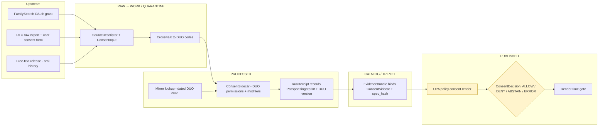

<!-- [KFM_META_BLOCK_V2]
doc_id: kfm://doc/standard/duo-profile
title: GA4GH Data Use Ontology (DUO) — KFM Standards Profile
type: standard
version: v1
status: draft
owners: <TBD: docs steward + consent/sensitivity lead>
created: 2026-05-24
updated: 2026-05-24
policy_label: public
related: [
  docs/standards/PROV.md,
  docs/standards/SENSITIVITY_RUBRIC.md,
  docs/standards/REDACTION_DETERMINISM.md,
  docs/standards/SIGNING.md,
  docs/policy/living_persons_geoprivacy.md,
  contracts/v1/consent/,
  schemas/contracts/v1/consent/,
  policy/consent/
]
tags: [kfm, standard, consent, ga4gh, duo, sensitivity, governance, policy-as-code]
notes: [
  "External standards profile — DUO is an OBO Foundry / GA4GH ontology, not a KFM-internal object.",
  "Companion to docs/standards/SIGNING.md (Passport visa fingerprinting) and SENSITIVITY_RUBRIC.md.",
  "Filename casing diverges from the hyphenated external-standard convention (DUO.md); see Directory Rules §6.1.a OPEN-DR-04."
]
[/KFM_META_BLOCK_V2] -->

# GA4GH Data Use Ontology (DUO) — KFM Standards Profile

> Conformance and crosswalk profile for the **Global Alliance for Genomics and Health Data Use Ontology** — the controlled vocabulary KFM adopts to encode data-use conditions on any record involving human-subject data.

[](#)
[](#)
[](#)
[](https://www.ga4gh.org/product/data-use-ontology-duo/)
[](#)
[](#)

| Status | Owners | Last reviewed |
|---|---|---|
| **draft** | _TBD — docs steward + consent/sensitivity lead_ | 2026-05-24 |

---

## Quick jump

- [1. Purpose](#1-purpose)
- [2. Authority and standing](#2-authority-and-standing)
- [3. Scope of KFM adoption](#3-scope-of-kfm-adoption)
- [4. KFM conformance posture](#4-kfm-conformance-posture)
- [5. Canonical vocabulary fragment](#5-canonical-vocabulary-fragment)
- [6. Identity, versioning, mirror](#6-identity-versioning-mirror)
- [7. Integration with KFM trust membrane](#7-integration-with-kfm-trust-membrane)
- [8. Consent input crosswalks](#8-consent-input-crosswalks)
- [9. Failure modes and deny-by-default](#9-failure-modes-and-deny-by-default)
- [10. Tensions and known limits](#10-tensions-and-known-limits)
- [11. Open questions](#11-open-questions)
- [12. Related docs](#12-related-docs)
- [Appendix A — ConsentSidecar worked example](#appendix-a--consentsidecar-worked-example)
- [Appendix B — Verification checklist](#appendix-b--verification-checklist)

---

## 1. Purpose

DUO — the **Data Use Ontology**, a GA4GH-approved technical standard maintained as an OBO Foundry ontology — provides a machine-readable controlled vocabulary for **data-use conditions**. CONFIRMED in KFM doctrine (Pass-10 C9-04): KFM adopts the GA4GH suite (AAI, Passports, **DUO**, and MRCG) as **the canonical access-control and consent framework for any record that involves human-subject data**, with every consent token carrying DUO codes that the policy-as-code layer reads to gate publication.

This profile defines:

1. **What DUO is** as an external standard, and which release lineage KFM tracks.
2. **Which KFM records** must carry DUO annotations.
3. **How DUO codes flow** through KFM's trust membrane — from `SourceDescriptor` to `ConsentSidecar`, into the OPA render gate, and onto the `RunReceipt` and `EvidenceBundle`.
4. **How non-DUO consent inputs** (free-text releases, oral-history forms, partner-specific scopes) are normalized upward into DUO codes via a documented mapping layer.

> [!IMPORTANT]
> This document is a **conformance profile**, not a fork. KFM does **not** redefine DUO terms or mint KFM-prefixed equivalents. KFM references DUO term IRIs by their canonical PURLs, pins to a dated release, and adds only the integration and crosswalk surface that doctrine requires.

[Back to top](#quick-jump)

---

## 2. Authority and standing

| Aspect | Value | Label |
|---|---|---|
| Standard name | Data Use Ontology (DUO) | EXTERNAL |
| Maintaining body | GA4GH Data Use and Researcher Identities (DURI) Work Stream | EXTERNAL |
| Standards status | GA4GH-approved technical standard | EXTERNAL |
| Ontology family | OBO Foundry (BFO upper-level, OWL) | EXTERNAL |
| Canonical PURL | `http://purl.obolibrary.org/obo/duo.owl` | EXTERNAL |
| Dated release PURL pattern | `http://purl.obolibrary.org/obo/duo/releases/YYYY-MM-DD/duo.owl` | EXTERNAL |
| Source repository | `https://github.com/EBISPOT/DUO` | EXTERNAL |
| License (ontology) | CC BY 4.0 International | EXTERNAL |
| Companion standard | GA4GH Passport / AAI (data-access authorization) | EXTERNAL |
| KFM doctrine anchor | Pass-10 C9-04 (GA4GH AAI, Passports, DUO, MRCG) | CONFIRMED |
| KFM filename divergence | Path uses `_PROFILE` suffix vs. hyphenated external-standard convention (`DUO.md`) — see Directory Rules §6.1.a and OPEN-DR-04 | NEEDS VERIFICATION (ADR) |

DUO sits at the same authority tier in KFM as ISO 19115, OAI-PMH, OGC API — Tiles, and PMTiles: it is an external conformance reference, not a KFM-canonical object family. `EvidenceBundle`, `ConsentSidecar`, and policy decisions remain governed under `contracts/`, `schemas/`, and `policy/` respectively; DUO supplies the **vocabulary** they reference, not the structures that hold the references.

> [!NOTE]
> Pass-10 C9-04 lists *"Author the DUO compatibility profile and align it with the policy bundle version pin"* as suggested future work. This file is the first instance of that profile; binding it to a specific policy-bundle version is **PROPOSED** and tracked in §6 and §11.

[Back to top](#quick-jump)

---

## 3. Scope of KFM adoption

### 3.1 When DUO codes are required

DUO codes are **required** on every KFM artifact where consent governs admissibility. INFERRED from C9-04, C6-07, and the People/DNA/Land domain object families.

| Source family | DUO codes required? | Rationale |
|---|---|---|
| FamilySearch API responses (C9-02) | **REQUIRED** | OAuth2 scope maps directly to DUO codes; CONFIRMED dependency in C9-02. |
| DTC raw genomic exports — 23andMe, AncestryDNA, MyHeritage (C9-03) | **REQUIRED** | High-sensitivity human-subject data; consent posture is the gating concern. |
| GEDCOM / GEDCOM-X uploads referencing living people (C9-01) | **REQUIRED** | Living-person assertions trigger consent-bound restrictions. |
| Oral histories with named living subjects | **REQUIRED** (via crosswalk; §8) | Free-text consent is normalized into DUO. |
| Vital / cemetery / obituary / probate records covering deceased individuals only | _Conditional_ | Decedent-only records may not need DUO if no living-person derivative exists; sensitivity rubric still applies. |
| Biodiversity occurrences with no human-subject component | **NOT REQUIRED** | DUO is human-subject-specific; sensitivity governs through other profiles. |
| Archaeological site coordinates | **NOT REQUIRED for DUO** | Cultural-sensitivity controls (CARE / steward review) govern; DUO is out of scope. |

### 3.2 What DUO does **not** govern in KFM

> [!CAUTION]
> DUO codes are not a substitute for any other gate. The render-time policy fails closed unless **all** of the following are satisfied — DUO alone cannot allow publication.

- **Sensitivity rubric** (`SENSITIVITY_RUBRIC.md`, C6-01) — independent rank that must be satisfied irrespective of DUO permission.
- **Living-person geoprivacy** (k-anonymity, C6-06) — applies independent of DUO codes.
- **Embargo and revocation** (C6-08) — temporal gates that override permission.
- **Rights and license** (separate from consent) — a DUO `general-research-use` permission does not grant a redistribution license.
- **Cultural and sovereignty review** (CARE) — DUO does not encode CARE principles; archaeology, sacred-site, and Indigenous-data records go through separate steward review even when no DUO code applies.

[Back to top](#quick-jump)

---

## 4. KFM conformance posture

PROPOSED — implementation NEEDS VERIFICATION against mounted-repo evidence (no mounted repo this session). Conformance level is stated against external usage profiles, not against repo state.

| Conformance level | Description | KFM target |
|---|---|---|
| **Consume** | Resolve DUO term IRIs, treat them as opaque controlled-vocabulary codes, never republish DUO content. | **REQUIRED** for every consent-bearing record. |
| **Mirror** | Maintain a versioned, integrity-checked local copy of the DUO OWL release for offline / CI use. | **REQUIRED** (per C9-04 dependencies: *"a DUO vocabulary mirror"*). |
| **Crosswalk** | Map non-DUO consent inputs (free-text, partner-specific) to DUO codes with documented rules. | **REQUIRED** for non-GA4GH-aware upstreams (C9-04 expansion direction). |
| **Contribute** | Propose new terms upstream to `EBISPOT/DUO`. | **NOT in scope.** KFM is a consumer; upstream contribution is allowed but not part of the trust path. |
| **Override** | Change DUO term meanings locally. | **PROHIBITED.** DUO term semantics are external; any divergence would silently break interoperability. |

DUO term IRIs **MUST** be carried verbatim (e.g., `http://purl.obolibrary.org/obo/DUO_0000004` for *"no restriction"*). KFM **MUST NOT** rewrite, alias, or shorten them in ways that lose round-trip identity to the canonical PURL.

[Back to top](#quick-jump)

---

## 5. Canonical vocabulary fragment

DUO terms split into two top-level categories: **data use permissions** (what a dataset may be used for) and **data use modifiers** (additional conditions that constrain those permissions). The table below illustrates the slice KFM most frequently encounters; it is **illustrative**, not exhaustive, and the dated DUO release pinned in §6 is authoritative.

> [!NOTE]
> The DUO IRIs and labels below are paraphrased from the canonical ontology and are **EXTERNAL** facts. The KFM-side notes are **PROPOSED** integration guidance. If a label below conflicts with the pinned dated release, the pinned release wins; this table is not a fork.

### 5.1 Selected data use permissions (illustrative)

| DUO IRI (CURIE) | Label (paraphrased) | Typical KFM trigger | KFM note |
|---|---|---|---|
| `DUO:0000004` | No restriction | Public-domain records with explicit broad consent. | Necessary but not sufficient — sensitivity and rights gates still apply. |
| `DUO:0000042` | General research use | Most academic genealogy / genomic research workflows. | Default for FamilySearch responses where the user grants broad-scope OAuth. |
| `DUO:0000006` | Health, medical, biomedical research only | Research-scope DTC data uses. | Gates non-health derivative pipelines. |
| `DUO:0000007` | Disease-specific research | Disease-focused cohorts within DTC ingestions. | Requires Mondo Disease Ontology mapping; see §11 item 6. |
| `DUO:0000011` | Population / ancestry-only research | Ancestry analytics where individual-level inference is restricted. | Pairs with k-anonymity and DP aggregates. |

### 5.2 Selected data use modifiers (illustrative)

| DUO IRI (CURIE) | Label (paraphrased) | Typical KFM trigger | KFM note |
|---|---|---|---|
| `DUO:0000015` | No general methods research | Constrains downstream method-development pipelines. | OPA must check modifier alongside permission. |
| `DUO:0000019` | Publication required | Standard for many research grants. | Required-disclosure obligation flows into the release manifest. |
| `DUO:0000020` | Collaboration required | Some institutional consents require named PI collaboration. | Surfaces as an obligation in the `ConsentDecision`. |
| `DUO:0000028` | Institution-specific restrictions | Where an upstream restricts use to named institutions. | OPA gate checks actor institution against allow-list. |
| `DUO:0000045` | Not-for-profit, non-commercial use only | Common in academic upstreams. | OPA gate checks audience class. |
| `DUO:0000046` | Geographic / ethnic restriction | Where consent is region- or population-scoped. | Triggers geoprivacy posture re-check. |

> [!CAUTION]
> The label paraphrases above are intentionally generic to avoid copying DUO text verbatim. **Implementations MUST resolve the IRI against the pinned dated release**, not against this table. Numeric IDs are stable per OBO Foundry deprecation policy ("IDs are never deleted"); labels and definitions may be revised across releases.

[Back to top](#quick-jump)

---

## 6. Identity, versioning, mirror

### 6.1 Version pinning

DUO is versioned by date (OBO Foundry principle 4). PROPOSED KFM conformance:

- A specific **dated DUO release** (e.g., `http://purl.obolibrary.org/obo/duo/releases/YYYY-MM-DD/duo.owl`) is pinned per **policy-bundle version**.
- The policy bundle's `spec_hash` covers the DUO mirror's content digest; promoting a new DUO release is therefore a governed state transition, not a silent dependency bump.
- Every `RunReceipt` for a consent-bearing record **MUST** record the DUO version IRI in use at fetch time.
- Every `EvidenceBundle` carrying DUO codes **MUST** reference the dated DUO PURL, not the bare ontology PURL.

### 6.2 Mirror posture

A KFM-local DUO mirror (PROPOSED home: `data/registry/vocabularies/duo/`; NEEDS VERIFICATION) holds:

1. The dated `duo.owl` file, content-addressed by digest.
2. A `MANIFEST.json` recording: dated PURL, content hash (JCS-canonicalized SHA-256 over a normalized term table), retrieval time, retrieval `RunReceipt`, mirror's own `spec_hash`.
3. A `CHANGELOG.md` recording prior versions and the policy-bundle version they were pinned against.
4. A `tombstones/` subdirectory recording deprecated terms KFM still resolves for historical records.

> [!IMPORTANT]
> OBO Foundry's deprecation policy is *"once created, IDs are never deleted."* KFM mirrors this posture: a DUO term that is deprecated upstream remains resolvable in KFM's mirror, with the deprecation note carried in the `tombstones/` subdirectory and surfaced in any `RunReceipt` that resolves it.

### 6.3 Term-IRI integrity rule

Every consent record that references a DUO term **MUST**:

1. Resolve to the dated PURL of the pinned release (not the bare PURL).
2. Round-trip identity-stable: a record canonicalized via JCS today and tomorrow must produce the same `spec_hash`, even if a newer DUO release is available, **so long as the pinned policy bundle has not advanced**.
3. Fail closed if the mirror cannot satisfy the resolution.

[Back to top](#quick-jump)

---

## 7. Integration with KFM trust membrane

### 7.1 Flow



PROPOSED — diagram reflects doctrine in C6-07, C6-08, C9-02, C9-04, and KFM-P5-PROG-0007 (`ConsentDecision` render gate). Object names align with attached doctrine; route-level implementation NEEDS VERIFICATION.

### 7.2 Object touchpoints

| KFM object | DUO involvement | Reference |
|---|---|---|
| `SourceDescriptor` | Records the upstream's stated consent posture and any DUO-aware native fields (e.g., FamilySearch OAuth scopes). | C9-02 |
| `ConsentInput` (PROPOSED) | The raw consent capture before crosswalk. | C9-04 expansion direction |
| `ConsentSidecar` | Carries the **normalized DUO codes**, the obligations they imply, the dated DUO PURL, the revocation endpoint, and the consent-history hash. | C6-07, KFM-P5-PROG-0007 |
| `EvidenceBundle` | Holds `ConsentSidecar` by reference and includes the DUO mirror's content hash in its inputs section. | C6-07, C8-04, KFM-P26-PROG-0004 |
| `EvidenceRef` | Resolves to the bundle and to the DUO version pin; mismatches force abstention. | C6-07, KFM-P26-IDEA-0002 |
| `RunReceipt` | Records the GA4GH Passport fingerprint used at fetch time and the DUO version pin. | C9-02, C9-04 |
| `policy.consent.render` (OPA package) | Reads DUO codes alongside Passport visa, embargo, k-anonymity, scope, and audience to emit a `ConsentDecision`. | KFM-P5-PROG-0007 |
| `tombstone` | When consent is revoked or a record is withdrawn, a signed tombstone is issued and caches are invalidated. | C5-09, C6-08 |

### 7.3 The five-check render rule

PROPOSED. A render-time `ConsentDecision = ALLOW` requires **all** of:

1. The Passport visa is valid (DSSE envelope check passes).
2. The consent token is not revoked (Bitstring Status List or RFC 7662 introspection succeeds).
3. The **DUO codes carried on the `ConsentSidecar` permit the requested scope** under the pinned policy bundle.
4. `now < retention.expires_at` (no embargo or retention violation).
5. Any sensitivity-rubric profile attached to the record is satisfied (k-anonymity, redaction profile, DP aggregation).

Any failure → **DENY**. Any unresolved input → **ABSTAIN**. Any system error in the resolver → **ERROR** (which is itself fail-closed). The decision is recorded in the audit ledger and surfaces in the Evidence Drawer.

[Back to top](#quick-jump)

---

## 8. Consent input crosswalks

> [!IMPORTANT]
> C9-04 explicitly directs KFM to *"build a normalization layer that translates non-GA4GH consent (e.g., a free-text consent in an oral-history release) into DUO codes via a documented mapping."* This section is the spec for that layer; the implementation lives outside this document.

### 8.1 Crosswalk inputs

PROPOSED crosswalk surface — implementation NEEDS VERIFICATION.

| Input class | Source artifact | Target DUO terms | Notes |
|---|---|---|---|
| FamilySearch OAuth scopes | OAuth `scope` claim | Per-scope DUO mapping (PROPOSED home: `policy/consent/mappings/familysearch.yaml`) | C9-02 names this dependency directly. |
| DTC vendor consent forms | Vendor-specific consent capture | Per-vendor mapping per release of vendor T&Cs | C9-03 warns vendor T&Cs change without long deprecation; mapping is versioned per vendor release date. |
| Free-text oral-history release | Curator-reviewed release form | Curator-applied DUO codes + obligations | Requires steward review (separation of duties, §9.2). |
| Partner-DAC consent letter | Free-text legal letter | Curator-applied DUO codes; conservative defaults if ambiguous | Default is the most-restrictive interpretation when curator is uncertain (cite-or-abstain). |
| Implicit / inferred consent | _Not accepted._ | _None._ | KFM does not accept consent inferred from data context alone (C9-04 doctrine). |

### 8.2 Crosswalk integrity rules

1. Every crosswalk row is itself a **claim candidate** — it carries an `EvidenceBundle` recording the source consent text, the curator, the review decision, and the resulting DUO code set.
2. Crosswalks are **versioned**; a mapping change is a breaking change for records produced under the old mapping. The old mapping is preserved under `policy/consent/mappings/_archive/` (PROPOSED).
3. When the upstream's consent semantics are ambiguous, the curator **MUST default to the more restrictive DUO interpretation**, document the ambiguity in the bundle, and surface it in steward review.

### 8.3 Reverse crosswalk

KFM does not generate human-language consent text from DUO codes. The flow is one-way: input → DUO codes. Any human-language description of a record's permissions is sourced from a curator note in the `ConsentSidecar`, not synthesized from the codes.

[Back to top](#quick-jump)

---

## 9. Failure modes and deny-by-default

### 9.1 Default-deny enumeration

PROPOSED. The OPA package fails closed for each of the following:

| Trigger | Decision |
|---|---|
| DUO codes missing on a record that requires them (§3.1) | **DENY** |
| DUO code resolves to an unknown IRI not in the pinned release | **DENY** (and log a drift candidate) |
| Mirror lookup fails (transient or otherwise) | **ERROR** (fail-closed) |
| Crosswalk has not been applied to a non-GA4GH input | **DENY** until curator review |
| Policy bundle and DUO mirror version are unaligned | **DENY** (bundle promotion required) |
| DUO permission allows but a modifier denies | **DENY** (modifiers are restrictive in combination) |
| Revocation has been issued since promotion | **DENY** and trigger tombstone propagation (C6-08) |

### 9.2 Separation of duties

For consent-bearing records, the curator who applies the crosswalk **SHOULD NOT** be the same actor who approves the `PromotionDecision` that publishes the derivative. Where the team is too small to fully separate the roles, the second-actor approval is a documented compensating control recorded in the release manifest.

> [!WARNING]
> A single actor who can **both** mint DUO codes from free text **and** promote a record to PUBLISHED is a trust-membrane bypass. The doctrine in C9-04 explicitly treats consent as policy that the gates enforce, not as text that the same actor curates and approves.

[Back to top](#quick-jump)

---

## 10. Tensions and known limits

| Tension | Source | KFM posture |
|---|---|---|
| Not every Kansas-first authority is GA4GH-aware. | C9-04 | The crosswalk in §8 absorbs the asymmetry; DUO is the internal normalization target regardless of upstream awareness. |
| DUO version updates can change the interpretation of long-running consent grants. | C9-04 open question | Records pinned to an older DUO release stay pinned; promotion to a newer DUO release is a governed transition, not a silent upgrade. See §6.1. |
| Curator judgement is required for free-text consent normalization. | §8.1 | Crosswalks are claim candidates with `EvidenceBundle`s; ambiguity defaults to the more restrictive code. |
| DUO does not encode CARE / Indigenous data sovereignty. | DUO scope | CARE is governed by separate steward review (`docs/policy/cultural_sovereignty.md`, PROPOSED). DUO codes do not substitute. |
| Mondo Disease Ontology mappings carry their own version drift. | DUO ↔ Mondo coupling | The Mondo version is also pinned per policy bundle; a separate `MONDO.md` profile is **PROPOSED but not yet authored**. |
| DUO is human-subject-focused; KFM also handles archaeology, rare-species, infrastructure. | DUO scope | DUO applies only where consent governs; other sensitivity controls govern elsewhere. See §3.2. |

[Back to top](#quick-jump)

---

## 11. Open questions

UNKNOWN / NEEDS VERIFICATION items, tracked here until resolved by ADR or repo evidence.

1. **Which dated DUO release will KFM v1 pin?** Pending decision; releases are tracked at `https://github.com/EBISPOT/DUO/releases/`. Decision is a §2.4-class question (policy-bundle dependency) per Directory Rules.
2. **How are DUO version updates handled in long-running consent grants?** Pass-10 C9-04 open question, not yet resolved. PROPOSED posture: records stay pinned to the DUO release in effect at consent capture; re-grant is required for upgrade.
3. **Filename casing — `DUO.md` vs `DUO_PROFILE.md`.** Directory Rules §6.1.a OPEN-DR-04. The current file uses the `_PROFILE` suffix on the assumption that this document is a KFM-coined topical wrapper around the external standard; strict reading of the external-standard naming rule would prefer `DUO.md`. Resolution by `docs/standards/README.md` or one-line ADR.
4. **OPA package home for DUO checks.** PROPOSED: `policy/consent/duo.rego`. NEEDS VERIFICATION against mounted-repo structure.
5. **Mirror placement.** PROPOSED: `data/registry/vocabularies/duo/`. Alternative under consideration: `policy/consent/vocabularies/duo/` (closer to the policy bundle). Decision pending Directory Rules consultation.
6. **Mondo Disease Ontology profile.** Disease-specific DUO terms (`DUO:0000007`) require a Mondo crosswalk. A separate `MONDO.md` standards profile is PROPOSED.
7. **GA4GH Passport visa fingerprinting.** Recorded in `RunReceipt` per C9-02 / C9-04. The signing surface is governed by `SIGNING.md` (PROPOSED in Pass-10 C1-03, not yet authored). DUO usage assumes Passport verification is in place; if it is not, the gate fails closed.
8. **Cache TTL and revocation latency.** Pass-10 C6-07 open question; affects DUO-aware gates but is a consent-token property, not a DUO property.
9. **Whether the Bitstring Status List or RFC 7662 introspection (or both) is canonical.** KFM-P5-PROG-0007 references both; ADR likely needed.

[Back to top](#quick-jump)

---

## 12. Related docs

PROPOSED links — verify all paths against mounted repo before publishing.

- [`docs/standards/PROV.md`](./PROV.md) — provenance profile (W3C PROV-O / PAV).
- [`docs/standards/SENSITIVITY_RUBRIC.md`](./SENSITIVITY_RUBRIC.md) — _PROPOSED, not yet authored._ Sensitivity rank that pairs with DUO permission.
- [`docs/standards/REDACTION_DETERMINISM.md`](./REDACTION_DETERMINISM.md) — _PROPOSED, not yet authored._ Seeded jitter for living-people overlays.
- [`docs/standards/SIGNING.md`](./SIGNING.md) — _PROPOSED, not yet authored._ Cosign / Rekor / DSSE; covers Passport visa verification.
- [`docs/standards/OAI-PMH.md`](./OAI-PMH.md) — harvest protocol profile.
- [`docs/standards/PMTILES.md`](./PMTILES.md) — published-tile profile.
- [`docs/policy/living_persons_geoprivacy.md`](../policy/living_persons_geoprivacy.md) — _PROPOSED placement._ k-anonymity rule, OPA fixtures.
- `policy/consent/render.rego` — _PROPOSED implementation home._ OPA render-time gate.
- `policy/consent/mappings/familysearch.yaml` — _PROPOSED implementation home._ Crosswalk inputs.
- `data/registry/vocabularies/duo/` — _PROPOSED mirror home._
- `contracts/v1/consent/consent_sidecar.md` — _PROPOSED contract home._ Object meaning.
- `schemas/contracts/v1/consent/consent_sidecar.schema.json` — _PROPOSED schema home._ Field shape.

[Back to top](#quick-jump)

---

<details>
<summary><strong>Appendix A — ConsentSidecar worked example</strong></summary>

A worked example for a hypothetical FamilySearch response promoted from RAW through to PUBLISHED. **All fields are illustrative**; do not copy as a contract.

```json
{
  "consent_sidecar": {
    "ref_id": "kfm://consent/<HEX>",
    "duo_version_iri": "http://purl.obolibrary.org/obo/duo/releases/<YYYY-MM-DD>/duo.owl",
    "duo_mirror_digest": "blake3:<HEX>",
    "permissions": [
      "http://purl.obolibrary.org/obo/DUO_0000042"
    ],
    "modifiers": [
      "http://purl.obolibrary.org/obo/DUO_0000045"
    ],
    "obligations": {
      "publication_required": false,
      "named_collaborator_required": false,
      "audience_class_allowlist": ["academic"]
    },
    "passport_fingerprint": "jwk-thumbprint:<base64url>",
    "revocation_endpoint": "https://<TBD>/.well-known/consent-revocation",
    "consent_history_hash": "sha256:<HEX>",
    "issued_at": "<ISO-8601>",
    "expires_at": "<ISO-8601>",
    "crosswalk_evidence_bundle": "kfm://bundle/<HEX>"
  }
}
```

Notes:

- `duo_version_iri` is the **dated** PURL, never the bare PURL.
- `duo_mirror_digest` covers the local mirror's normalized term-table digest; this is what gives the policy-bundle `spec_hash` a stable hand on the DUO surface.
- `passport_fingerprint` is a JWK thumbprint, **not** the raw Passport (the raw Passport is treated as a credential, not as evidence).
- `crosswalk_evidence_bundle` is **required** when the consent originated outside the GA4GH ecosystem and was normalized by a curator.

</details>

<details>
<summary><strong>Appendix B — Verification checklist</strong></summary>

For each consent-bearing record under review, a reviewer SHOULD be able to confirm:

- [ ] DUO codes are present on records identified by §3.1.
- [ ] All DUO IRIs resolve against the mirror at the pinned version.
- [ ] The `ConsentSidecar` carries permissions, modifiers, dated DUO PURL, and consent-history hash.
- [ ] The `RunReceipt` records the Passport fingerprint used at fetch time.
- [ ] The `EvidenceBundle` references the `ConsentSidecar` and the DUO mirror digest.
- [ ] Crosswalk rows (§8) carry their own `EvidenceBundle` with the source consent capture.
- [ ] OPA `policy.consent.render` returns `ALLOW` only when the five checks of §7.3 all pass.
- [ ] Tombstones are issued on revocation, and downstream caches are invalidated (C6-08).
- [ ] Separation of duties between curator and promoter is documented in the release manifest.

</details>

---

### Footer

> **Standard kind:** External standards profile · **Trust class:** External reference, KFM-pinned · **Lifecycle:** Authored draft; not yet bound to a policy-bundle version.

| | |
|---|---|
| **Related** | [PROV.md](./PROV.md) · [OAI-PMH.md](./OAI-PMH.md) · [OGC-API-TILES.md](./OGC-API-TILES.md) · [PMTILES.md](./PMTILES.md) · _SIGNING.md (PROPOSED)_ · _SENSITIVITY_RUBRIC.md (PROPOSED)_ |
| **Last updated** | 2026-05-24 |
| **Doc owner** | _TBD_ |

[Back to top](#quick-jump)
